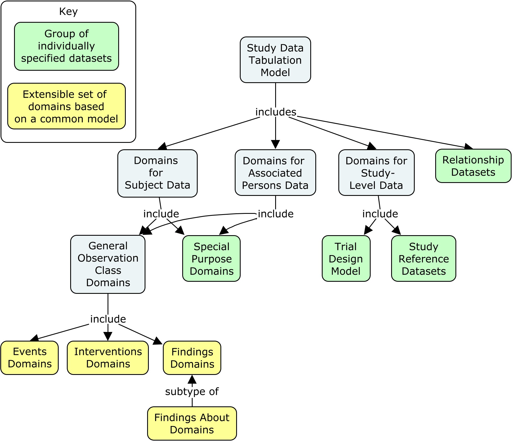
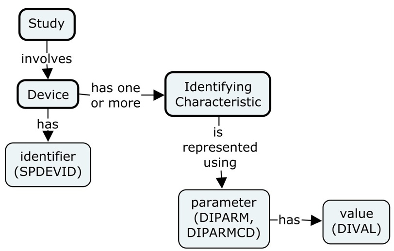
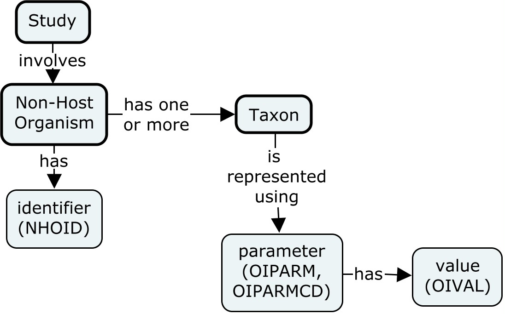

# SDTM_v2.0

Study Data Tabulation Model

Version 2.0 (Final)

Developed by the CDISC Submission Data Standards Team

Notes to Readers

- This is the final Version 2.0 of the Study Data Tabulation Model Document (SDTM). This document includes additional variables related to the SDTM Implementation Guide (SDTMIG) Version 3.4, released concurrently.

- A full description of all changes from the prior version is provided in Section 1.4, Significant Changes from Prior Versions, and Section 7, Changes from SDTM v1.8 to SDTM v2.0.

Revision History

| Date       | Version   |
| ---------- | --------- |
| 2021-11-29 | 2.0 Final |
| 2019-09-17 | 1.8 Final |
| 2018-03-31 | 1.7 Final |
| 2017-11-08 | 1.6 Final |
| 2016-06-27 | 1.5 Final |
| 2013-11-26 | 1.4 Final |
| 2012-07-16 | 1.3 Final |
| 2008-11-12 | 1.2 Final |
| 2005-04-28 | 1.1 Final |

CONTENTS

1. INTRODUCTION
    1.1. PURPOSE
    1.2. IMPLEMENTATION ADVICE FOR THIS MODEL
    1.3. RELATIONSHIP TO PRIOR CDISC MODELS
    1.4. SIGNIFICANT CHANGES FROM PRIOR VERSIONS
2. MODEL CONCEPTS AND TERMS – ORGANIZATION OF THE SDTM
    2.1. MODEL CONCEPTS AND TERMS – VARIABLES
    2.2. TABLE STRUCTURE
3. STUDY SUBJECT DATA
    3.1. THE GENERAL OBSERVATION CLASSES
        3.1.1. The Interventions Observation Class
        3.1.2. The Events Observation Class
        3.1.3. The Findings Observation Class
            3.1.3.1. Findings About Events or Interventions
        3.1.4. Identifiers for All Classes
        3.1.5. Timing Variables for All Classes
    3.2. SPECIAL-PURPOSE DOMAINS
        3.2.1. Demographics
        3.2.2. Comments
        3.2.3. Subject Summary Domains
            3.2.3.1. Subject Elements
            3.2.3.2. Subject Repro Stages
            3.2.3.3. Subject Visits
            3.2.3.4. Subject Disease Milestones
4. ASSOCIATED PERSONS DATA
5. STUDY-LEVEL DATA
    5.1. THE TRIAL DESIGN MODEL
        5.1.1. Trial Arms and Trial Elements
            5.1.1.1. Trial Elements
            5.1.1.2. Trial Arms
        5.1.2. Trial Sets
        5.1.3. Trial Repro Stages and Trial Repro Paths
            5.1.3.1. Trial Repro Stages
            5.1.3.2. Trial Repro Paths
        5.1.4. Trial Planned Data Collection
            5.1.4.1. Trial Visits
            5.1.4.2. Trial Disease Assessments
            5.1.4.3. Trial Disease Milestones
        5.1.5. Trial Inclusion/Exclusion Criteria
        5.1.6. Trial Summary Information
        5.1.7. Challenge Agent Characterization
    5.2. STUDY REFERENCES
        5.2.1. Device Identifiers Dataset
        5.2.2. Non-host Organism Identifiers Dataset
6. DATASETS FOR REPRESENTING RELATIONSHIPS
    6.1. RELATED RECORDS DATASET
    6.2. SUPPLEMENTAL QUALIFIERS DATASET
    6.3. POOL DEFINITION DATASET
    6.4. RELATED SUBJECTS DATASET
    6.5. DEVICE-SUBJECT RELATIONSHIPS DATASET
    6.6. ASSOCIATED PERSONS RELATIONSHIPS
    6.7. RELATED SPECIMENS DATASET
7. CHANGES FROM SDTM V1.8 TO SDTM V2.0
8. PROPOSED FUTURE CHANGES TO THE SDTM
9. APPENDICES

# 1 Introduction

## 1.1 Purpose

This document describes the Study Data Tabulation Model (SDTM), which defines a standard structure for study data tabulations. This document, which supersedes all prior versions, includes numerous changes from the prior version (SDTM v1.8). These changes are described in Section 1.4, Significant Changes from Prior Versions, and Section 7, Changes from SDTM v1.8 to SDTM v2.0.

This document is intended for companies and individuals involved in the collection, preparation, and analysis of study data that may be used for various purposes, including publication, warehousing, meta-analyses, and regulatory submission. Guidance and specifications for the application of this model are provided separately in the implementation guides (IGs). Regulatory authorities provide separate guidance, specification, and regulations. Readers are advised to refer to these documents before preparing a regulatory submission based on the SDTM.

## 1.2 Implementation Advice for this Model

The SDTM has been designed to accommodate the broadest range of human and animal study data in a standardized manner. This document describes the basic concepts and general structure of the model. Individual implementation guides (IGs) have been created to provide specific recommendations for numerous domains of data commonly collected in human, animal, and medical device studies, identifying which variables from a general observation class may apply. These IGs also describe basic assumptions and business rules, and provide numerous examples for mapping data to the standard format. Sponsors wishing to represent data in the standard formats should consult the IGs before preparing datasets based on the SDTM. The following implementation guides have been published by CDISC:

- The Study Data Tabulation Model Implementation Guide for Human Clinical Trials (SDTMIG) https://www.cdisc.org/standards/foundational/sdtmig

- The Study Data Tabulation Model Implementation Guide for Medical Devices (SDTMIG-MD) https://www.cdisc.org/standards/foundational/sdtm-ig-md

- The Study Data Tabulation Model Implementation Guide: Associated Persons (SDTMIG-AP) https://www.cdisc.org/standards/foundational/sdtmig/sdtmig-ap

- The Standard for Exchange of Nonclinical Data Implementation Guide (SENDIG) https://www.cdisc.org/standards/foundational/send

- The Standard for Exchange of Nonclinical Data Implementation Guide: Developmental and Reproductive Toxicology (SENDIG-DART) https://www.cdisc.org/standards/foundational/send/sendig-dart

- The Standard for Exchange of Nonclinical Data Implementation Guide: Animal Rule (SENDIG-AR) https://www.cdisc.org/standards/foundational/send/sendig-animal-rule

In addition to the IGs, CDISC implementation advice is contained in:

- Multiple indication-specific therapeutic area user guides (TAUGs; https://www.cdisc.org/standards/therapeutic-areas), which provide examples and implementation advice for various therapeutic areas.

- Supplements for individual questionnaires, ratings, and scales (QRS; https://www.cdisc.org/foundational/qrs), which provide information on how to structure the data in a standard format for public domain and copyright-approved instruments.

- The CDISC Controlled Terminology website page (https://www.cdisc.org/standards/terminology/controlled-terminology).

## 1.3 Relationship to Prior CDISC Models

This document is a major release of the SDTM. The content of the model has been rearranged and revised to update explanatory text. Tables have been revised to separate material previously included in the Description column into separate metadata, as described in the next section.

The SDTM has evolved to support a broad range of study types and regulated products, and is expected to evolve further to support an even broader range of study data.

## 1.4 Significant Changes from Prior Versions

The SDTM has been designed for backward compatibility; datasets prepared with prior versions should be compatible with v2.0. In most cases, this means that later versions may add new variables or correct textual errors, but do not eliminate variables or structures incorporated in prior versions. There are, however, isolated instances where some older variables may be deprecated in favor of newer, more functional variables.

Reorganization of Content

The content has been reorganized; the content of some sections has been relocated, some section names have changed, and some sections have been added, most notably:

- Content from Model Fundamentals has been moved to Section 2, Model Concepts and Terms – Organization of the SDTM, and Section 3, Study Subject Data.

- Content from Applying Model Fundamentals to Associated Persons is now in Section 4, Associated Persons Data and Section 6.6, Associated Persons Relationships.

- The table contained in Variables Used in Associated Persons Data is now in Section 4, Associated Persons Data.

- Content from Domain-specific Variables for General Observation Classes was moved to Section 3.1.1, The Interventions Observation Class, Section 3.1.2, The Events Observation Class, and Section 3.1.3, The Findings Observation Class.

- Content from SDTM Version History is now in Section 7, Changes from SDTM v1.8 to SDTM v2.0.

- The headings Representing Relationships among Datasets; Records and Datasets for Study References; and Variable, Dataset, and Section Changes and Additions were determined to be unnecessary extra section levels and were deleted.

In this version of the SDTM, tables are not numbered. No section contained more than 1 table, so table numbers added no information to section numbers.

Changes to Structures of Tables

All tables have been updated to include the following columns:

- Variable Name

- Variable Label

- Type

- Format

- Role

- Variable Qualified (when Role is "Variable Qualifier" or "Synonym Qualifier")

- Usage Restrictions

- Variable C-code

- Definition

- Notes

- Examples

Information previously in the Description column has been moved into or replaced by text in new columns.

- Text indicating that variables are not to be used for human clinical trials now appears in the Usage Restrictions column.

- Examples formerly in the Description column were moved into the Examples column. Example values are enclosed in quotation marks.

- Other content in the Description column is now in the Notes column, except that for variables with definitions, definition-like text has been removed.

- Not all variables currently have approved definitions. Missing variable definitions will be added in future versions of the SDTM as they are developed and approved.

- Not all variables currently have approved c-codes. Missing c-codes will be added in future versions of the SDTM as they are developed and approved.

Variables that were previously represented in a separate table of Domain-Specific Variables for General Observation Classes have been moved to tables of variables for the appropriate general observation class, with a note in the Usage Restrictions column giving the domain(s) to which use is restricted. The role of the domain-specific variable - -BEATNO was changed to Identifier, so it was included in Section 3.1.4, Identifiers for All Classes, rather than Section 3.1.3, The Findings Observation Class.

Usage Restrictions previously mentioned only in the SDTMIG and/or the Standard for Exchange of Nonclinical Data Implementation Guide (SENDIG) were added:

- --OCCUR may not be used in the AE domain.

- --STDTC, --STDY,  --XSTDY, and --CHSTDY may not be used in Findings domains.

For each general observation class, 1 table of variables was created by combining former tables for the topic variable and the qualifier variables.

Changes to Datasets and Variables

The Subject Visits domain, which was a special-purpose domain, has been moved to an Events class domain. The variable "SVUPDES" became a domain-specific Events class variable.

A new relationships domain, Related Specimens (RELSPEC), has been added. This domain, first introduced in the provisional SDTMIG-PGx (now deprecated), had not previously been a part of the SDTM. RELSPEC was added to this version of the SDTM because the domain was added to SDTMIG v3.4.

SDTM v2.0 does not identify any proposed deprecated variables, as there are no variables to be deprecated at this time.

The variable APID was removed from Section 3.1.4, Identifiers for All Classes, because APID is only allowed in AP domains. It is still listed in Section 3, Associated Persons Data.

New variables have been added to the following sections:

- Section 3.1.1, The Interventions Observation Class

- Section 3.1.2, The Events Observation Class

- Section 3.1.3, The Findings Observation Class

- Section 3.1.5, Timing Variables for All Classes

- Section 3.2.3.1, Subject Elements

The role of the --LOINC variable in Section 3.1.3, The Findings Observation Class, was changed from Synonym Qualifier of --TESTCD to Record Qualifier, because a single value of --TESTCD may be associated with multiple values of --LOINC, depending on the values of other variables, such as --SPEC and --METHOD.

The order of --METHOD within Interventions Variables in Section 3.1.1, The Interventions Observation Class, was changed so that the variable appears after --PORTOT, rather than after --LOC. This change was made so that -- METHOD would appear after the variable qualifiers of --LOC rather than immediately after --LOC.

A number of changes are proposed for the next version of the SDTM. See Section 8, Proposed Future Changes to the SDTM, for the rationale for these proposed changes.

# 2 Model Concepts and Terms – Organization of the SDTM

The SDTM provides a general framework for describing the organization of information collected during human and animal studies. The model is built around the concept of observations, which consist of discrete pieces of information collected during a study. Observations normally correspond to rows in a dataset. A domain is a collection of observations on a particular topic (see Concept Map, below). For example, "Subject 101 had an adverse event of mild nausea starting on study day 6" is an observation belonging to the Adverse Events domain in a clinical trial.

The primary purpose of the SDTM is to represent data about study subjects—which may be humans or animals—or medical devices. The SDTM includes a general model for representing data in 3 "general observation" classes. Within those classes, data are grouped by topic into domains, represented in separate datasets. The 3 general observation classes (i.e., Interventions, Events, Findings) are described further in Section 3.1, The General Observation Classes. Additional special-purpose datasets about individuals are described in Section 3.2, Special- purpose Domains.

Studies sometimes include data about "associated persons" who are not study subjects; these data are represented in domains based on the domains used to represent data about study subjects. The structure of these domains is described in Section 4, Associated Persons Data.

The SDTM also includes a set of tables for representing data at the study level. These datasets are specified in Section 5, Study-level Data.

The last group of datasets in the SDTM are those that describe relationships among datasets and records. These datasets are specified in Section 6, Datasets for Representing Relationships.

Concept Map. Relationships Between SDTM Domains

## 2.1 Model Concepts and Terms – Variables

All datasets are structured as flat files with rows representing observations and columns representing variables; each dataset is described by metadata definitions that provide information about the variables used in the dataset. Metadata are described in the CDISC Define-XML specification, available at https://www.cdisc.org/standards/data- exchange/define-xml.

Each observation consists of a series of named variables. Each variable, which normally corresponds to a column in a dataset, can be classified according to its role. A role describes the type of information conveyed by the variable about each distinct observation and how it can be used. There are variables which play different roles in different datasets. This is most common for variables which appear in both trial design datasets and general observation class datasets. For example, ARMCD is the topic variable in Trial Arms (TA), but a record qualifier in Demographics (DM) and Trial Visits (TV). Variables which appear in multiple general observation classes have the same role, although the variable qualified by a variable qualifier or synonym qualifier can be different in different general observation classes. For example, --MODIFY qualifies --TRT in interventions, --TERM in events, and --ORRES in findings.

SDTM variables can be classified into 5 major roles:

- Identifier variables, such as those that identify the study, the subject involved in the study, the domain, and the sequence number of the record;

- Topic variables, which specify the focus of the observation (e.g., the name of a lab test);

- Timing variables, which describe the timing of an observation (e.g., start date, end date);

- Qualifier variables, which include additional illustrative text or numeric values that describe the results or additional traits of the observation (e.g., units, descriptive adjectives); and

- Rule variables, which describe the conditions for starting, ending, branching, or looping in the Trial Design model.

The set of Qualifier variables can be further categorized into 5 subclasses:

- Grouping Qualifiers, used to group together a collection of observations within the same domain (e.g., categories or subcategories);

- Result Qualifiers, which describe the specific results associated with the topic variable in a Findings dataset and that answer the question raised by the topic variable;

- Synonym Qualifiers specifying an alternative name for a particular variable in an observation (e.g., coded version of a verbatim topic variable or the name associated with a test code);

- Record Qualifiers, which define additional attributes of the observation record as a whole, rather than describing a particular variable within a record (e.g., for a lab test, the specimen type and the name of lab that performed the test); and

- Variable Qualifiers used to further modify or describe 1 or more of a specific set of variables within an observation and which are only meaningful in the context of the variable they qualify (e.g., the unit for a numeric test result or a medication dose, the laterality of an anatomic location).

The SDTM includes variable metadata for the standard variables; variable metadata attributes are described in Section 2.2, Table Structure.

All datasets for data about individuals and for data about a study include the variable DOMAIN, a code that should be used in the dataset name. Some relationship datasets include the variable RDOMAIN, to describe a relationship to a domain for data about individuals. The Comments special-purpose domain includes the variable RDOMAIN, but other special-purpose domains do not. The Device-subject Relationships dataset includes the variable DOMAIN, but other study reference datasets do not.

The SDTM is structured so that data can be represented in SAS v5 transport files, the file format accepted by the US Food and Drug Administration (FDA) and other regulatory authorities. This imposes certain restrictions on variables. Note that the SDTM type specified in this document is either character or numeric, as these are the only types supported by SAS v5 transport files. Define-XML provides more descriptive data types (e.g., integer, float, date, datetime); see the Define-XML specification for information about how to represent SDTM types using Define-XML data types.

## 2.2 Table Structure

Tables in this document include the following variable metadata:

- Variable Name

- Variable Label

- Type (i.e., SAS data type, as described in Section 2.1, Model Concepts and Terms – Variables)

- Format (an ISO format standard or a description such as "number-number")

- Role (as defined in Section 2.1)

- Variable(s) Qualified (for the variables with a role of Variable Qualifier or Synonym Qualifier)

- Usage Restrictions (rules for when a variable can or cannot be used in a particular kind of trial, a particular class, or a particular domain)

- Variable C-code (the concept code associated with a variable definition by the National Cancer Institute Enterprise Vocabulary Services (NCI-EVS))

- Definition (published as part of CDISC Controlled Terminology through the NCI-EVS)

- Notes (descriptive information not covered elsewhere)

- Examples (sample values or descriptions of kinds of information used to populate the variable)

Information on usage restrictions and examples that were in the Description column in SDTM v1.x tables have been moved to the Usage Restrictions and Examples columns. Other information previously in the Description column has been moved to the Notes column, except that definition-like information has been removed for variables which have approved definitions.

# 3 Study Subject Data

Observations about study subjects are normally represented in a series of domains. A domain is defined as a collection of logically related observations with a common topic. The logic of the relationship may pertain to the scientific subject matter of the data or to its role in the trial. For example, "Subject 101 had an adverse event of mild nausea starting on study day 6" is an observation belonging to the Adverse Events (AE) domain in a clinical trial.

SDTM datasets that represent data about study subjects are of 2 types: general observation class datasets and special-purpose datasets. General observation class domains conform to general structures for 1 of 3 classes: findings, events, and interventions. The data for a study would generally include multiple domains in each general observation class. In contrast to general observation class models on which individual domains can be based, special-purpose domains are specified completely.

Domains based on the general observation classes are specified in SDTM implementation guides (see Section 1.2, Implementation Advice for this Model).

Each study subject domain dataset is distinguished by a unique 2-character code. This code, which is stored in the SDTM variable named DOMAIN, is used in the dataset name, as the value of the DOMAIN variable in that dataset, and as a prefix for most variable names in that dataset.

Domain codes are also used in RDOMAIN, a variable that is included in several relationship datasets and in the Comments special-purpose domain.

## 3.1 The General Observation Classes

The majority of observations collected during a study can be divided among 3 general observation classes: Interventions, Events, and Findings.

- The Interventions Observation Class represents investigational, therapeutic, and other treatments that are administered to or used by a subject (with some actual or expected physiological effect). This includes treatments specified by the study protocol (i.e., "exposure").

- The Events Observation Class represents planned protocol milestones such as randomization and study completion, and occurrences, conditions, or incidents independent of planned study evaluations occurring during the study (e.g., adverse events) or prior to the study (e.g., medical history).

- The Findings Observation Class represents observations resulting from planned evaluations to address specific tests or questions such as laboratory tests, electrocardiogram (ECG) testing, and questions listed on questionnaires. The Findings class also includes a subtype, Findings About, which is used to record findings related to observations in the Interventions or Events classes.

Datasets based on any of the general observation classes share a set of common identifier and timing variables (see Section 3.1.4, Identifiers for All Classes, and Section 3.1.5, Timing Variables for All Classes). As a general rule, any valid identifier or timing variable is permissible for use in any dataset based on a general observation class.

The SDTM is the foundation for many implementations. SDTM implementation guides specify particular domains based on the general observation classes. Domain specification tables in the implementation guides describe which variables must be included in the domain. Not all variables described in the tables in this document (SDTM tables) are appropriate for all domains in all implementations. The SDTM includes information on variables which are not to be used in human clinical trials. Refer to the implementation guides for specific information on any identifier or timing variables that are not allowed in a particular observation class domain.

In the tables in this document, the presence of 2 hyphens before the variable name (e.g., --TRT) is used to indicate the required use of a prefix based on the 2-character domain code. The domain code is used as a variable prefix to minimize the risk of difficulty when merging or joining domains for reporting purposes. The variable with 2 hyphens may be referred to as a "root" variable.

Domain-specific variables, a concept introduced in SDTM v1.5, are for use in a limited number of designated domains based on general observation classes and will be identified in the appropriate implementation guide. The variable names include the specific domain prefix. Domain-specific variables are included in the table of general observation class variables; the Usage Restrictions column of the table indicates the domains in which the variable is allowed.

In addition to the 3 general observation classes, a study will generally include a set of other special-purpose datasets; see Section 3.2, Special-purpose Domains.

### 3.1.1 The Interventions Observation Class

Interventions—Topic and Qualifier Variables—One Record per Constant-dosing Interval or Intervention Episode

| #   | Variable Name | Variable Label                          | Type | Format | Role               | Variable(s) Qualified        | Usage Restrictions                           | Variable C-code | Definition                                                                                                                                                                                          | Notes                                                                                                                                                                                                                                                                                                                | Examples                                                                                                   |
| --- | ------------- | --------------------------------------- | ---- | ------ | ------------------ | ---------------------------- | -------------------------------------------- | --------------- | --------------------------------------------------------------------------------------------------------------------------------------------------------------------------------------------------- | -------------------------------------------------------------------------------------------------------------------------------------------------------------------------------------------------------------------------------------------------------------------------------------------------------------------- | ---------------------------------------------------------------------------------------------------------- |
| 1   | --TRT         | Name of Treatment                       | Char |        | Topic              |                              |                                              | C82542          | The reported name of the drug, procedure, or therapy.                                                                                                                                               | The topic for the intervention observation, usually the verbatim name of the treatment, drug, medicine, or therapy given during the dosing interval for the observation.                                                                                                                                             |                                                                                                            |
| 2   | --MODIFY      | Modified Treatment Name                 | Char |        | Synonym Qualifier  | --TRT                        |                                              | C170998         | A value which represents an alteration to a collected value for coding purposes.                                                                                                                    | If the value for --TRT is modified for coding purposes, then the modified text is placed here.                                                                                                                                                                                                                       |                                                                                                            |
| 3   | --DECOD       | Standardized Treatment Name             | Char |        | Synonym Qualifier  | --TRT                        |                                              | C170991         | Standardized or dictionary- derived text for the description of an event or intervention.                                                                                                           | Equivalent to the generic drug name in WHODrug, or a term in SNOMED, ICD-9, or other published or sponsor- defined dictionaries.                                                                                                                                                                                     |                                                                                                            |
| 4   | --MOOD        | Mood                                    | Char |        | Record Qualifier   |                              |                                              | C117051         | The state that may be applied to a record to indicate its phase in a life cycle or business process (e.g., scheduled, performed).                                                                   |                                                                                                                                                                                                                                                                                                                      | "SCHEDULED", "PERFORMED"                                                                                   |
| 5   | --CAT         | Category                                | Char |        | Grouping Qualifier |                              |                                              | C25372          | A grouping or classification of the topic of the finding, event, or intervention.                                                                                                                   |                                                                                                                                                                                                                                                                                                                      |                                                                                                            |
| 6   | --SCAT        | Subcategory                             | Char |        | Grouping Qualifier |                              |                                              |                 | A further grouping or classification of the category for the topic of the finding, event, or intervention.                                                                                          | The category is in --CAT.                                                                                                                                                                                                                                                                                            |                                                                                                            |
| 7   | --PRESP       | Pre-Specified                           | Char |        | Variable Qualifier | --TRT                        | Not in nonclinical trials                    | C82510          | An indication that the event or intervention was prospectively stated or detailed on the CRF.                                                                                                       | Values should be "Y" or null.                                                                                                                                                                                                                                                                                        |                                                                                                            |
| 8   | --OCCUR       | Occurrence Indicator                    | Char |        | Record Qualifier   |                              |                                              | C171000         | An indication as to whether a prespecified event or intervention has occurred.                                                                                                                      |                                                                                                                                                                                                                                                                                                                      |                                                                                                            |
| 9   | --REASOC      | Reason for Occur Value                  | Char |        | Record Qualifier   |                              |                                              |                 |                                                                                                                                                                                                     | --REASOC is the reason the intervention did or did not occur, according to the value in --OCCUR. This does not replace --INDC.                                                                                                                                                                                       |                                                                                                            |
| 10  | --STAT        | Completion Status                       | Char |        | Record Qualifier   |                              |                                              |                 |                                                                                                                                                                                                     | Used to indicate when a question about the occurrence of a prespecified intervention was not answered. Should be null or have a value of "NOT DONE".                                                                                                                                                                 |                                                                                                            |
| 11  | --REASND      | Reason Not Done                         | Char |        | Record Qualifier   |                              |                                              | C82556          | The explanation for why requested information was not available.                                                                                                                                    | Used in conjunction with --STAT when value is "NOT DONE".                                                                                                                                                                                                                                                            |                                                                                                            |
| 12  | --CNTMOD      | Contact Mode                            | Char |        | Record Qualifier   |                              |                                              |                 |                                                                                                                                                                                                     | The way in which the event, visit, or contact was conducted.                                                                                                                                                                                                                                                         |                                                                                                            |
| 13  | --EPCHGI      | Epi/Pandemic Related Change Indicator   | Char |        | Record Qualifier   |                              |                                              |                 |                                                                                                                                                                                                     | Indicates whether the intervention was changed due to an epidemic or pandemic.                                                                                                                                                                                                                                       |                                                                                                            |
| 14  | --INDC        | Indication                              | Char |        | Record Qualifier   |                              |                                              | C41184          | The sign, symptom, or condition that is the basis for initiation of a treatment.                                                                                                                    |                                                                                                                                                                                                                                                                                                                      |                                                                                                            |
| 15  | --CLAS        | Class                                   | Char |        | Variable Qualifier | --TRT                        |                                              | C170987         | A standardized or dictionary- derived name for a grouping of drugs, procedures, or therapies.                                                                                                       |                                                                                                                                                                                                                                                                                                                      |                                                                                                            |
| 16  | --CLASCD      | Class Code                              | Char |        | Variable Qualifier | --TRT                        |                                              | C170988         | A standardized or dictionary- derived short sequence of characters used to represent a grouping of drugs, procedures, or therapies.                                                                 | Used to represent code for --CLAS.                                                                                                                                                                                                                                                                                   |                                                                                                            |
| 17  | --DOSE        | Dose                                    | Num  |        | Record Qualifier   |                              |                                              | C25488          | The quantity of an agent (e.g., drug, substance, radiation) taken or absorbed at a single administration.                                                                                           | Not populated when --DOSTXT is populated.                                                                                                                                                                                                                                                                            |                                                                                                            |
| 18  | --DOSTXT      | Dose Description                        | Char |        | Record Qualifier   |                              |                                              | C70961          | A textual description of the quantity of an agent (e.g., drug, substance, radiation) taken or absorbed at a single administration.                                                                  | Not populated when --DOSE is populated.                                                                                                                                                                                                                                                                              | "200-400"                                                                                                  |
| 19  | --DOSU        | Dose Units                              | Char |        | Variable Qualifier | --DOSE; -- DOSTXT; -- DOSTOT |                                              | C73558          | The unit of measure for the administered agent (e.g., drug, substance, radiation), using standardized values.                                                                                       | Units for --DOSE, --DOSTOT, or -- DOSTXT.                                                                                                                                                                                                                                                                            | "ng", "mg", "mg/kg"                                                                                        |
| 20  | --TDOSD       | Toxic/Physiologic Dose Descr            | Char |        | Record Qualifier   |                              |                                              |                 |                                                                                                                                                                                                     | A description of a statistically derived estimate of a dose with a certain toxicological or physiological effect in a population, based on data from a dose-response study.                                                                                                                                          | "LD50", "ED90"                                                                                             |
| 21  | --FTDOSD      | Factor for Toxic/Physiologic Dose Descr | Num  |        | Variable Qualifier | --TDOSD                      |                                              |                 |                                                                                                                                                                                                     | The quantity given for the multiplier of --TDOSD.                                                                                                                                                                                                                                                                    | If --TDOSD="LD50" and - -FTDOSD="5", then the value represented by -- DOSE and --DOSU is 5 times the LD50. |
| 22  | --DOSFRM      | Dose Form                               | Char |        | Variable Qualifier | --TRT                        |                                              | C42636          | Physical characteristics of a drug product, (e.g., tablet, capsule, or solution) that contains a drug substance, generally (but not necessarily) in association with one or more other ingredients. |                                                                                                                                                                                                                                                                                                                      | "TABLET", "CAPSULE"                                                                                        |
| 23  | --DOSFRQ      | Dosing Frequency per Interval           | Char |        | Record Qualifier   |                              |                                              | C15682          | The number of times that an agent (e.g., drug, substance, radiation) is administered per unit of time.                                                                                              |                                                                                                                                                                                                                                                                                                                      | "Q2H", "QD", "PRN"                                                                                         |
| 24  | --DOSTOT      | Total Daily Dose                        | Num  |        | Record Qualifier   |                              |                                              | C70888          | The quantity of an agent (e.g., drug, substance, radiation) taken or absorbed on a single day.                                                                                                      | Uses the units in --DOSU.                                                                                                                                                                                                                                                                                            |                                                                                                            |
| 25  | --DOSRGM      | Intended Dose Regimen                   | Char |        | Record Qualifier   |                              |                                              | C71137          | The planned schedule for the administration of an agent (e.g., drug, substance, radiation).                                                                                                         |                                                                                                                                                                                                                                                                                                                      | "TWO WEEKS ON, TWO WEEKS OFF"                                                                              |
| 26  | --ROUTE       | Route of Administration                 | Char |        | Record Qualifier   |                              |                                              | C38114          | Designation of the part of the body through which or into which, or the way in which, a substance is introduced.                                                                                    |                                                                                                                                                                                                                                                                                                                      | "ORAL", "INTRAVENOUS"                                                                                      |
| 27  | --LOT         | Lot Number                              | Char |        | Record Qualifier   |                              |                                              | C70848          | An identifier assigned by the manufacturer or distributor to a specific quantity of manufactured material or product.                                                                               | Although the identifier for a lot is generally called a lot number, it may contain characters other than digits (e.g., letters).                                                                                                                                                                                     |                                                                                                            |
| 28  | --LOC         | Location of Administration              | Char |        | Record Qualifier   |                              |                                              |                 |                                                                                                                                                                                                     | Anatomical location of an intervention, such as an injection site.                                                                                                                                                                                                                                                   | "ARM" for an injection                                                                                     |
| 29  | --METHOD      | Method of Administration                | Char |        | Record Qualifier   |                              | Not in human clinical trials; EX domain only |                 | Method of administration of the treatment.                                                                                                                                                          |                                                                                                                                                                                                                                                                                                                      | "INFUSION" when ROUTE is "INTRAVENOUS"                                                                     |
| 30  | --LAT         | Laterality                              | Char |        | Variable Qualifier | --LOC                        |                                              |                 |                                                                                                                                                                                                     | Qualifier for anatomical location further detailing laterality of intervention administration.                                                                                                                                                                                                                       | "RIGHT", "LEFT", "BILATERAL"                                                                               |
| 31  | --DIR         | Directionality                          | Char |        | Variable Qualifier | --LOC                        |                                              |                 |                                                                                                                                                                                                     | Qualifier for anatomical location further detailing directionality of intervention administration.                                                                                                                                                                                                                   | "ANTERIOR", "LOWER", "PROXIMAL"                                                                            |
| 32  | --PORTOT      | Portion or Totality                     | Char |        | Variable Qualifier | --LOC                        |                                              |                 |                                                                                                                                                                                                     | Qualifier for anatomical location further detailing the distribution, which means arrangement of or apportioning of the intervention administration.                                                                                                                                                                 | "ENTIRE", "SINGLE", "SEGMENT", "MANY"                                                                      |
| 33  | --FAST        | Fasting Status                          | Char |        | Record Qualifier   |                              |                                              | C93566          | An indication as to whether a subject has abstained from food and liquid for a prescribed amount of time.                                                                                           | Valid values include "Y", "N", "U", or null if not relevant.                                                                                                                                                                                                                                                         |                                                                                                            |
| 34  | --PSTRG       | Pharmaceutical Strength                 | Num  |        | Record Qualifier   |                              |                                              | C53294          | The amount of active ingredient per unit of pharmaceutical dosage form.                                                                                                                             |                                                                                                                                                                                                                                                                                                                      | "50", "300"                                                                                                |
| 35  | --PSTRGU      | Pharmaceutical Strength Units           | Char |        | Variable Qualifier | --PSTRG                      |                                              | C117055         | The unit of measure for the amount of active ingredient per unit of pharmaceutical dosage form, using standardized values.                                                                          | Unit for --PSTRG.                                                                                                                                                                                                                                                                                                    | "mg/TABLET", "mg/mL"                                                                                       |
| 36  | --TRTV        | Treatment Vehicle                       | Char |        | Record Qualifier   |                              |                                              | C927            | A carrier or inert medium in which a medicinally active agent is administered.                                                                                                                      |                                                                                                                                                                                                                                                                                                                      | "SALINE"                                                                                                   |
| 37  | --VAMT        | Treatment Vehicle Amount                | Num  |        | Record Qualifier   |                              |                                              | C82553          | Amount of the prepared product (treatment plus vehicle) administered.                                                                                                                               | Note: Should not be diluent amount alone.                                                                                                                                                                                                                                                                            |                                                                                                            |
| 38  | --VAMTU       | Treatment Vehicle Amount Units          | Char |        | Variable Qualifier | --VAMT                       |                                              | C82583          | The unit of measure for the prepared product (treatment plus vehicle) using standardized values.                                                                                                    |                                                                                                                                                                                                                                                                                                                      | "mL", "mg"                                                                                                 |
| 39  | --ADJ         | Reason for Dose Adjustment              | Char |        | Record Qualifier   |                              |                                              | C82555          | The explanation given for why a dose was changed as compared to a previous dose.                                                                                                                    |                                                                                                                                                                                                                                                                                                                      | "ADVERSE EVENT", "INSUFFICIENT                                                                             |
| 40  | --RSDISC      | Reason for Treatment Discontinuation    | Char |        | Record Qualifier   |                              |                                              |                 |                                                                                                                                                                                                     | Reason the treatment was discontinued.                                                                                                                                                                                                                                                                               |                                                                                                            |
| 41  | --USCHFL      | Unscheduled Flag                        | Char |        | Record Qualifier   |                              | Not in human clinical trials                 | C170510         | An indication that the performed test or observation was done at a time that was not planned.                                                                                                       | If a test or observation was performed based upon a schedule defined in the protocol, this flag should be null. Expected values are "Y" or null. This variable would not be needed when information on planned assessments is provided, such as when the Trial Visits (TV) and Subject Visits (SV) domains are used. |                                                                                                            |
| 42  | --RSTIND      | Restraint Indicator                     | Char |        | Record Qualifier   |                              | Not in human clinical trials                 |                 |                                                                                                                                                                                                     | An indicator as to whether the animal subject was restrained during the intervention period. Expected values are "Y" or null.                                                                                                                                                                                        |                                                                                                            |
| 43  | --RSTMOD      | Restraint Mode                          | Char |        | Record Qualifier   |                              | Not in human clinical trials                 |                 |                                                                                                                                                                                                     | A description of whether the restraint was physical and/or chemical.                                                                                                                                                                                                                                                 |                                                                                                            |
### 3.1.2 The Events Observation Class

Events—Topic and Qualifier Variables—One Record per Event

| #   | Variable Name | Variable Label                           | Type | Format | Role               | Variable(s) Qualified | Usage Restrictions           | Variable C-code | Definition                                                                                                                                                                                                                                                           | Notes                                                                                                                                                                                                                                                                                                                                                                                                                                                                                                                                                                                                                       | Examples                                                         |
| --- | ------------- | ---------------------------------------- | ---- | ------ | ------------------ | --------------------- | ---------------------------- | --------------- | -------------------------------------------------------------------------------------------------------------------------------------------------------------------------------------------------------------------------------------------------------------------- | --------------------------------------------------------------------------------------------------------------------------------------------------------------------------------------------------------------------------------------------------------------------------------------------------------------------------------------------------------------------------------------------------------------------------------------------------------------------------------------------------------------------------------------------------------------------------------------------------------------------------- | ---------------------------------------------------------------- |
| 1   | --TERM        | Reported Term                            | Char |        | Topic              |                       |                              | C82571          | The collected name for an event observation.                                                                                                                                                                                                                         | The verbatim or prespecified name of the event.                                                                                                                                                                                                                                                                                                                                                                                                                                                                                                                                                                             |                                                                  |
| 2   | --MODIFY      | Modified Reported Term                   | Char |        | Synonym Qualifier  | --TERM                |                              | C170998         | A value which represents an alteration to a collected value for coding.                                                                                                                                                                                              | If the value for --TERM is modified for coding purposes, then the modified text is placed here.                                                                                                                                                                                                                                                                                                                                                                                                                                                                                                                             |                                                                  |
| 3   | --LLT         | Lowest Level Term                        | Char |        | Variable Qualifier | --TERM                | Not in nonclinical trials    | C71886          | The lowest-level term assigned to the event from MedDRA.                                                                                                                                                                                                             |                                                                                                                                                                                                                                                                                                                                                                                                                                                                                                                                                                                                                             |                                                                  |
| 4   | --LLTCD       | Lowest Level Term Code                   | Num  |        | Variable Qualifier | --LLT                 | Not in nonclinical trials    | C117048         | The lowest-level term code assigned to the event from MedDRA.                                                                                                                                                                                                        |                                                                                                                                                                                                                                                                                                                                                                                                                                                                                                                                                                                                                             |                                                                  |
| 5   | --DECOD       | Dictionary-Derived Term                  | Char |        | Synonym Qualifier  | --TERM                |                              | C170991         | Standardized or dictionary-derived text for the description of an event or intervention.                                                                                                                                                                             | Equivalent to the Preferred Term ("PT" in MedDRA).                                                                                                                                                                                                                                                                                                                                                                                                                                                                                                                                                                          |                                                                  |
| 6   | --EVDTYP      | Medical History Event Date Type          | Char |        | Variable Qualifier | --STDTC; -- ENDTC     | MH domain only               |                 |                                                                                                                                                                                                                                                                      | Specifies the aspect of the medical condition or event by which MHSTDTC and/or the MHENDTC is defined.                                                                                                                                                                                                                                                                                                                                                                                                                                                                                                                      | "DIAGNOSIS", "SYMPTOM ONSET", "DISEASE RELAPSE"                  |
| 7   | --PTCD        | Preferred Term Code                      | Num  |        | Variable Qualifier | --DECOD               | Not in nonclinical trials    | C117056         | The preferred term code assigned to the event from the MedDRA dictionary.                                                                                                                                                                                            |                                                                                                                                                                                                                                                                                                                                                                                                                                                                                                                                                                                                                             |                                                                  |
| 8   | --HLT         | High Level Term                          | Char |        | Variable Qualifier | --TERM                | Not in nonclinical trials    | C71880          | The high-level term from the primary hierarchy assigned to the event from MedDRA.                                                                                                                                                                                    |                                                                                                                                                                                                                                                                                                                                                                                                                                                                                                                                                                                                                             |                                                                  |
| 9   | --HLTCD       | High Level Term Code                     | Num  |        | Variable Qualifier | --HLT                 | Not in nonclinical trials    | C117047         | The high-level term code from the primary hierarchy assigned to the event from MedDRA.                                                                                                                                                                               |                                                                                                                                                                                                                                                                                                                                                                                                                                                                                                                                                                                                                             |                                                                  |
| 10  | --HLGT        | High Level Group Term                    | Char |        | Variable Qualifier | --TERM                | Not in nonclinical trials    | C71889          | The high-level group term from the primary hierarchy assigned to the event from MedDRA.                                                                                                                                                                              |                                                                                                                                                                                                                                                                                                                                                                                                                                                                                                                                                                                                                             |                                                                  |
| 11  | --HLGTCD      | High Level Group Term Code               | Num  |        | Variable Qualifier | --HLGT                | Not in nonclinical trials    | C117046         | The high-level group term code from the primary hierarchy assigned to the event from MedDRA.                                                                                                                                                                         |                                                                                                                                                                                                                                                                                                                                                                                                                                                                                                                                                                                                                             |                                                                  |
| 12  | --CAT         | Category                                 | Char |        | Grouping Qualifier |                       |                              | C25372          | A grouping or classification of the topic of the finding, event, or intervention.                                                                                                                                                                                    |                                                                                                                                                                                                                                                                                                                                                                                                                                                                                                                                                                                                                             |                                                                  |
| 13  | --SCAT        | Subcategory                              | Char |        | Grouping Qualifier |                       |                              |                 | A further grouping or classification of the category for the topic of the finding, event, or intervention.                                                                                                                                                           | The category is in --CAT.                                                                                                                                                                                                                                                                                                                                                                                                                                                                                                                                                                                                   |                                                                  |
| 14  | --PRESP       | Pre-Specified                            | Char |        | Variable Qualifier | --TERM                |                              | C82510          | An indication that the event or intervention was prospectively stated or detailed on the CRF.                                                                                                                                                                        | Value is "Y" for prespecified events, null for spontaneously reported events.                                                                                                                                                                                                                                                                                                                                                                                                                                                                                                                                               |                                                                  |
| 15  | --OCCUR       | Occurrence Indicator                     | Char |        | Record Qualifier   |                       | Not in AE domain             | C171000         | An indication as to whether a prespecified event or intervention has occurred.                                                                                                                                                                                       |                                                                                                                                                                                                                                                                                                                                                                                                                                                                                                                                                                                                                             |                                                                  |
| 16  | --REASOC      | Reason for Occur Value                   | Char |        | Record Qualifier   |                       | Not in AE domain             |                 |                                                                                                                                                                                                                                                                      | --REASOC is the reason the event did or did not occur, according to the value in --OCCUR.                                                                                                                                                                                                                                                                                                                                                                                                                                                                                                                                   |                                                                  |
| 17  | --STAT        | Completion Status                        | Char |        | Record Qualifier   |                       | Not in AE domain             |                 |                                                                                                                                                                                                                                                                      | Used to indicate when a question about the occurrence of a prespecified event was not answered. Should be null or have a value of "NOT DONE".                                                                                                                                                                                                                                                                                                                                                                                                                                                                               |                                                                  |
| 18  | --REASND      | Reason Not Done                          | Char |        | Record Qualifier   |                       | Not in AE domain             | C82556          | The explanation for why requested information was not available.                                                                                                                                                                                                     | Used in conjunction with --STAT when its value is "NOT DONE".                                                                                                                                                                                                                                                                                                                                                                                                                                                                                                                                                               |                                                                  |
| 19  | --BODSYS      | Body System or Organ Class               | Char |        | Record Qualifier   |                       |                              | C170986         | A standardized or dictionary-derived name for the body system or organ class.                                                                                                                                                                                        | Body system or system organ class assigned for analysis from a standard hierarchy (e.g., MedDRA) associated with an event.                                                                                                                                                                                                                                                                                                                                                                                                                                                                                                  | "GASTROINTESTINAL DISORDERS"                                     |
| 20  | --BDSYCD      | Body System or Organ Class Code          | Num  |        | Variable Qualifier | --BODSYS              | Not in nonclinical trials    | C170985         | A standardized or dictionary-derived short sequence of characters used to represent the body system or organ class.                                                                                                                                                  | MedDRA System Organ Class code corresponding to --BODSYS assigned for analysis.                                                                                                                                                                                                                                                                                                                                                                                                                                                                                                                                             |                                                                  |
| 21  | --SOC         | Primary System Organ Class               | Char |        | Variable Qualifier | --TERM                | Not in nonclinical trials    | C71888          | The system organ class from the primary hierarchy assigned in the MedDRA dictionary.                                                                                                                                                                                 |                                                                                                                                                                                                                                                                                                                                                                                                                                                                                                                                                                                                                             |                                                                  |
| 22  | --SOCCD       | Primary System Organ Class Code          | Num  |        | Variable Qualifier | --SOC                 | Not in nonclinical trials    | C117059         | The system organ class code from the primary hierarchy assigned in the MedDRA dictionary.                                                                                                                                                                            |                                                                                                                                                                                                                                                                                                                                                                                                                                                                                                                                                                                                                             |                                                                  |
| 23  | --CNTMOD      | Contact Mode                             | Char |        | Record Qualifier   |                       |                              |                 |                                                                                                                                                                                                                                                                      | The way in which the event, visit, or contact was conducted.                                                                                                                                                                                                                                                                                                                                                                                                                                                                                                                                                                | "IN PERSON", "TELEPHONE", "IVRS"                                 |
| 24  | --EPCHGI      | Epi/Pandemic Related Change Indicator    | Char |        | Record Qualifier   |                       |                              |                 |                                                                                                                                                                                                                                                                      | Indicates whether the event was changed due to an epidemic or pandemic. Not the same as whether a medical condition was caused by an epidemic or pandemic.                                                                                                                                                                                                                                                                                                                                                                                                                                                                  |                                                                  |
| 25  | --LOC         | Location of Event                        | Char |        | Record Qualifier   |                       |                              |                 |                                                                                                                                                                                                                                                                      | Describes anatomical location relevant for the event.                                                                                                                                                                                                                                                                                                                                                                                                                                                                                                                                                                       | "ARM" for skin rash                                              |
| 26  | --LAT         | Laterality                               | Char |        | Variable Qualifier | --LOC                 |                              |                 |                                                                                                                                                                                                                                                                      | Qualifier for anatomical location, further detailing laterality.                                                                                                                                                                                                                                                                                                                                                                                                                                                                                                                                                            | "RIGHT", "LEFT", "BILATERAL"                                     |
| 27  | --DIR         | Directionality                           | Char |        | Variable Qualifier | --LOC                 |                              |                 |                                                                                                                                                                                                                                                                      | Qualifier for anatomical location, further detailing directionality.                                                                                                                                                                                                                                                                                                                                                                                                                                                                                                                                                        | "ANTERIOR", "LOWER", "PROXIMAL"                                  |
| 28  | --PORTOT      | Portion or Totality                      | Char |        | Variable Qualifier | --LOC                 |                              |                 |                                                                                                                                                                                                                                                                      | Qualifier for anatomical location, further detailing the distribution (i.e., arrangement of, apportioning of).                                                                                                                                                                                                                                                                                                                                                                                                                                                                                                              | "ENTIRE", "SINGLE", "SEGMENT", "MANY"                            |
| 29  | --PARTY       | Accountable Party                        | Char |        | Record Qualifier   |                       | Not in nonclinical trials    | C117052         | The role of the individual or entity responsible for the receipt of the transferred object (e.g., device, specimen).                                                                                                                                                 | The party could be an individual (e.g., subject), an organization (e.g., sponsor), or a location that is a proxy for an individual or organization (e.g., site). It is usually a somewhat general term that is further identified in the --PRTYID variable.                                                                                                                                                                                                                                                                                                                                                                 |                                                                  |
| 30  | --PRTYID      | Identification of Accountable Party      | Char |        | Variable Qualifier | --PARTY               | Not in nonclinical trials    | C117054         | A sequence of characters used to uniquely identify the individual or entity responsible for the receipt of the transferred object (e.g., device, specimen).                                                                                                          | Used in conjunction with --PARTY.                                                                                                                                                                                                                                                                                                                                                                                                                                                                                                                                                                                           |                                                                  |
| 31  | --SEV         | Severity/Intensity                       | Char |        | Record Qualifier   |                       |                              | C25676          | The quality or degree of harm associated with a finding or event, as collected.                                                                                                                                                                                      |                                                                                                                                                                                                                                                                                                                                                                                                                                                                                                                                                                                                                             | "MILD", "MODERATE", "SEVERE"                                     |
| 32  | --SER         | Serious Event                            | Char |        | Record Qualifier   |                       |                              | C82578          | A collected indication as to whether an event meets regulatory criteria for seriousness.                                                                                                                                                                             | Valid values are "Y" and "N".                                                                                                                                                                                                                                                                                                                                                                                                                                                                                                                                                                                               |                                                                  |
| 33  | --ACN         | Action Taken with Study Treatment        | Char |        | Record Qualifier   |                       |                              | C49499          | An action taken with study treatment as the result of the event.                                                                                                                                                                                                     |                                                                                                                                                                                                                                                                                                                                                                                                                                                                                                                                                                                                                             | "DOSE INCREASED", "DOSE NOT CHANGED"                             |
| 34  | --ACNOTH      | Other Action Taken                       | Char |        | Record Qualifier   |                       |                              | C82509          | An action taken unrelated to study treatment, as the result of the event.                                                                                                                                                                                            |                                                                                                                                                                                                                                                                                                                                                                                                                                                                                                                                                                                                                             |                                                                  |
| 35  | --ACNDEV      | Action Taken with Device                 | Char |        | Record Qualifier   |                       |                              | C117037         | An action taken with a device as the result of the event.                                                                                                                                                                                                            | The device may or may not be the device under study.                                                                                                                                                                                                                                                                                                                                                                                                                                                                                                                                                                        |                                                                  |
| 36  | --REL         | Causality                                | Char |        | Record Qualifier   |                       |                              | C103163         | The investigator's assessment of the likelihood that the study treatment was the cause of the event.                                                                                                                                                                 |                                                                                                                                                                                                                                                                                                                                                                                                                                                                                                                                                                                                                             | "NOT RELATED", "UNLIKELY RELATED", "POSSIBLY RELATED", "RELATED" |
| 37  | --RLDEV       | Relationship of Event to Device          | Char |        | Record Qualifier   |                       |                              |                 | A judgement as to the likelihood that the device caused the event.                                                                                                                                                                                                   | The device may or may not be the device under study. Controlled terminology from EC Directive MEDDEV 2.7/3 March 2015 is required in EU but not US.                                                                                                                                                                                                                                                                                                                                                                                                                                                                         | "CAUSAL", "UNLIKELY"                                             |
| 38  | --RELNST      | Relationship to Non- Study Treatment     | Char |        | Record Qualifier   |                       |                              | C82564          | The investigator's assessment of the causal relationship of the event to a non-study treatment.                                                                                                                                                                      |                                                                                                                                                                                                                                                                                                                                                                                                                                                                                                                                                                                                                             | "MORE LIKELY RELATED TO ASPIRIN USE"                             |
| 39  | --PATT        | Pattern of Event                         | Char |        | Record Qualifier   |                       |                              | C82550          | A characterization of the temporal pattern of occurrences of the event.                                                                                                                                                                                              |                                                                                                                                                                                                                                                                                                                                                                                                                                                                                                                                                                                                                             | "INTERMITTENT", "CONTINUOUS", "SINGLE EVENT"                     |
| 40  | --OUT         | Outcome of Event                         | Char |        | Record Qualifier   |                       |                              | C171001         | The status associated with the result or conclusion of the event.                                                                                                                                                                                                    |                                                                                                                                                                                                                                                                                                                                                                                                                                                                                                                                                                                                                             | "RECOVERED/RESOLVED", "FATAL"                                    |
| 41  | --SCAN        | Involves Cancer                          | Char |        | Record Qualifier   |                       | Not in nonclinical trials    | C82561          | An indication as to whether the reason an event was serious was because the event was associated with cancer.                                                                                                                                                        | Valid values are "Y", "N", and null.                                                                                                                                                                                                                                                                                                                                                                                                                                                                                                                                                                                        |                                                                  |
| 42  | --SCONG       | Congenital Anomaly or Birth Defect       | Char |        | Record Qualifier   |                       | Not in nonclinical trials    | C2849           | An indication as to whether the reason an event is serious is because the event is associated with congenital anomaly or birth defect in an offspring of the subject.                                                                                                | Valid values are "Y", "N", and null.                                                                                                                                                                                                                                                                                                                                                                                                                                                                                                                                                                                        |                                                                  |
| 43  | --SDISAB      | Persist or Signif Disability/Incapacity  | Char |        | Record Qualifier   |                       | Not in nonclinical trials    | C68606          | An indication as to whether the reason an event is serious is because the event resulted in a significant, persistent, or permanent change, impairment, damage, or disruption in the subject's body function/structure, physical activities, and/or quality of life. | Valid values are "Y", "N", and null.                                                                                                                                                                                                                                                                                                                                                                                                                                                                                                                                                                                        |                                                                  |
| 44  | --SDTH        | Results in Death                         | Char |        | Record Qualifier   |                       | Not in nonclinical trials    | C82549          | An indication as to whether the reason an event is serious is because the event resulted in death.                                                                                                                                                                   | Valid values are "Y", "N", and null.                                                                                                                                                                                                                                                                                                                                                                                                                                                                                                                                                                                        |                                                                  |
| 45  | --SHOSP       | Requires or Prolongs Hospitalization     | Char |        | Record Qualifier   |                       | Not in nonclinical trials    | C68605          | An indication as to whether the reason an event is serious is because the event resulted in or prolonged hospitalization.                                                                                                                                            | Valid values are "Y", "N", and null.                                                                                                                                                                                                                                                                                                                                                                                                                                                                                                                                                                                        |                                                                  |
| 46  | --SLIFE       | Is Life Threatening                      | Char |        | Record Qualifier   |                       | Not in nonclinical trials    | C82508          | An indication as to whether the reason an event is serious is because the event resulted in a substantial risk of dying.                                                                                                                                             | Valid values are "Y", "N", and null.                                                                                                                                                                                                                                                                                                                                                                                                                                                                                                                                                                                        |                                                                  |
| 47  | --SOD         | Occurred with Overdose                   | Char |        | Record Qualifier   |                       | Not in nonclinical trials    | C82548          | An indication as to whether the reason an event is serious is because the event is associated with overdose.                                                                                                                                                         | Valid values are "Y", "N", and null.                                                                                                                                                                                                                                                                                                                                                                                                                                                                                                                                                                                        |                                                                  |
| 48  | --SMIE        | Other Medically Important Serious Event  | Char |        | Record Qualifier   |                       | Not in nonclinical trials    | C82521          | An indication as to whether the reason an event is serious is because the event may jeopardize the subject and may require intervention to prevent one of the other outcomes associated with serious adverse events.                                                 | Valid values are "Y", "N", and null.                                                                                                                                                                                                                                                                                                                                                                                                                                                                                                                                                                                        |                                                                  |
| 49  | --SINTV       | Needs Intervention to Prevent Impairment | Char |        | Record Qualifier   |                       | AE domain only               |                 |                                                                                                                                                                                                                                                                      | Valid values are "Y", "N", and null. Expected use is in medical device- related trials. It is part of the definition of a serious AE as represented in 21 CFR Part 803.3(w)(3). Records whether medical or surgical intervention was necessary to preclude permanent impairment of a body function, or prevent permanent damage to a body structure, with either situation suspected to be due to the use of a medical product.                                                                                                                                                                                             |                                                                  |
| 50  | --UNANT       | Unanticipated Adverse Device Effect      | Char |        | Record Qualifier   |                       | AE domain only               |                 |                                                                                                                                                                                                                                                                      | The assessment is about a device identified in the data (i.e., which has an SPDEVID). The device may be ancillary or under study. Any serious adverse effect on health or safety or any life-threatening problem or death caused by or associated with a device, if that effect, problem, or death was not previously identified in nature, severity, or degree of incidence in the investigational plan or application (including a supplementary plan or application), or any other unanticipated serious problem associated with a device that relates to the rights, safety, or welfare of subjects. (21 CFR 812.3(s)). |                                                                  |
| 51  | --RLPRT       | Rel of AE to Device- Related Procedure   | Char |        | Record Qualifier   |                       | AE domain only               |                 |                                                                                                                                                                                                                                                                      | The investigator's opinion as to the likelihood that the device-related study procedure caused the AE (e.g., implant/insertion, revision/adjustment, explant/removal). The relationship is to a device- related procedure where the device is identified in the data (i.e., which has an SPDEVID). The device may be ancillary or under study.                                                                                                                                                                                                                                                                              | "CAUSAL", "UNLIKELY"                                             |
| 52  | --RLPRC       | Rel of AE to Non- Dev-Rel Study Activity | Char |        | Record Qualifier   |                       | AE domain only               |                 |                                                                                                                                                                                                                                                                      | The investigator's opinion as to the causality of the event as related to other protocol-required activities, actions or assessments (e.g., medication changes, tests/assessments, other procedures). The relationship is to a protocol- specified non-device-related activity where the device is identified in the data (i.e., which has an SPDEVID). The device may be ancillary or under study.                                                                                                                                                                                                                         | "CAUSAL", "UNLIKELY"                                             |
| 53  | -- CONTRT     | Concomitant or Additional Trtmnt Given   | Char |        | Record Qualifier   |                       |                              | C170989         | An indication as to whether a non-study treatment was given because of the occurrence of the event.                                                                                                                                                                  | Valid values are "Y", "N", and null.                                                                                                                                                                                                                                                                                                                                                                                                                                                                                                                                                                                        |                                                                  |
| 54  | --TOX         | Toxicity                                 | Char |        | Variable Qualifier | --TOXGR               |                              | C27990          | The standardized or dictionary-derived name for an untoward event or finding.                                                                                                                                                                                        | Sponsor should specify which scale and version is used in the Sponsor Comments column of the Define- XML document.                                                                                                                                                                                                                                                                                                                                                                                                                                                                                                          | An NCI CTCAE Short Name, "HYPERCALCEMIA", "HYPOCALCEMIA"         |
| 55  | --TOXGR       | Toxicity Grade                           | Char |        | Record Qualifier   |                       |                              | C82528          | A categorical classification of the severity of an event or finding, based on a standard scale, used in study data tabulation.                                                                                                                                       | Sponsor should specify which scale and version is used in the Sponsor Comments column of the Define- XML document.                                                                                                                                                                                                                                                                                                                                                                                                                                                                                                          | A toxicity grade from the NCI CTCAE.                             |
| 56  | -- USCHFL     | Unscheduled Flag                         | Char |        | Record Qualifier   |                       | Not in human clinical trials | C170510         | An indication that the performed test or observation was done at a time that was not planned.                                                                                                                                                                        | If a test or observation was performed based upon a schedule defined in the protocol, this flag should be null. Expected values are "Y" or null. This variable would not be needed when information on planned assessments is provided, such as when the Trial Visits (TV) and Subject Visits (SV) domains are used.                                                                                                                                                                                                                                                                                                        |                                                                  |

### 3.1.3 The Findings Observation Class

Findings—Topic and Qualifier Variables—One Record per Finding

| #   | Variable Name | Variable Label                           | Type | Format | Role               | Variable(s) Qualified                                                             | Usage Restrictions                                         | Variable C-code | Definition                                                                                                                                                  | Notes                                                                                                                                                                                                                                                                                                                                                                                                                                                                                                                                                                                                                                                                                                                                                                                                                                                                                                                                                                                                                                                                                                                            | Examples                                                                                                                                                                                                                                                                                                                                                                                                                                                                                                                                                                                                |
| --- | ------------- | ---------------------------------------- | ---- | ------ | ------------------ | --------------------------------------------------------------------------------- | ---------------------------------------------------------- | --------------- | ----------------------------------------------------------------------------------------------------------------------------------------------------------- | -------------------------------------------------------------------------------------------------------------------------------------------------------------------------------------------------------------------------------------------------------------------------------------------------------------------------------------------------------------------------------------------------------------------------------------------------------------------------------------------------------------------------------------------------------------------------------------------------------------------------------------------------------------------------------------------------------------------------------------------------------------------------------------------------------------------------------------------------------------------------------------------------------------------------------------------------------------------------------------------------------------------------------------------------------------------------------------------------------------------------------- | ------------------------------------------------------------------------------------------------------------------------------------------------------------------------------------------------------------------------------------------------------------------------------------------------------------------------------------------------------------------------------------------------------------------------------------------------------------------------------------------------------------------------------------------------------------------------------------------------------- |
| 1   | --TESTCD      | Short Name of Measurement, Test, or Exam | Char |        | Topic              |                                                                                   |                                                            | C82503          | The standardized or dictionary- derived short sequence of characters used to represent the measurement, test, or examination.                               | Used as a column name when converting a dataset from a vertical format to a horizontal format. The short value can be up to 8 characters.                                                                                                                                                                                                                                                                                                                                                                                                                                                                                                                                                                                                                                                                                                                                                                                                                                                                                                                                                                                        | "PLAT", "SYSBP", "RRMIN", "EYEEXAM"                                                                                                                                                                                                                                                                                                                                                                                                                                                                                                                                                                     |
| 2   | --TEST        | Name of Measurement, Test, or Exam       | Char |        | Synonym Qualifier  | --TESTCD                                                                          |                                                            | C82541          | The standardized or dictionary- derived name of the measurement, test, or examination.                                                                      |                                                                                                                                                                                                                                                                                                                                                                                                                                                                                                                                                                                                                                                                                                                                                                                                                                                                                                                                                                                                                                                                                                                                  | "Platelets", "Systolic Blood Pressure", "Summary (Min) RR Duration", "Eye Examination"                                                                                                                                                                                                                                                                                                                                                                                                                                                                                                                  |
| 3   | --SBMRKS      | Sublineage Marker String                 | Char |        | Variable Qualifier | --TESTCD                                                                          | CP domain only                                             |                 |                                                                                                                                                             | Used to further subset the cell population identified in CPTEST based on the use of additional marker(s) that define a sublineage. The value in CPSBMRKS is used in combination with values in CPTEST and CPCELSTA to fully describe the cell population being measured. As such, it is an essential component of the full test name.                                                                                                                                                                                                                                                                                                                                                                                                                                                                                                                                                                                                                                                                                                                                                                                            | Three unnamed sublineages of monocytes have been identified: CCR2+CD16-; CCR2-CD16+; and CCR2+CD16+. Whereas the entire monocyte cell population can be defined as CD14+ cells, the additional CCR2 and CD16 markers are used to differentiate one sublineage from another, none of which has yet been given a name by the scientific community. By combining the CPTEST value of "Monocyte Subset" with the value of "CCR2+CD16-" in CPSBMRKS, the full test is defined to be the CCR2+CD16- monocyte subpopulation.                                                                                   |
| 4   | --CELSTA      | Cell State                               | Char |        | Variable Qualifier | --TESTCD                                                                          | CP domain only                                             |                 |                                                                                                                                                             | A textual description of a subset of the cell population identified in CPTEST based on a particular functional and/or biological state (e.g., primed, activated, proliferating, senescent, G2-arrested). When populated, the values in CPCELSTA and CPSMRKS, in combination with values in CPTEST and CPSBMRKS, fully describe the cell population being measured.                                                                                                                                                                                                                                                                                                                                                                                                                                                                                                                                                                                                                                                                                                                                                               |                                                                                                                                                                                                                                                                                                                                                                                                                                                                                                                                                                                                         |
| 5   | --CSMRKS      | Cell State Marker String                 | Char |        | Variable Qualifier | --TESTCD                                                                          | CP domain only                                             |                 |                                                                                                                                                             | Identifies the marker(s) or indicator(s) used to define the cell state (i.e., the value in CPCELSTA).                                                                                                                                                                                                                                                                                                                                                                                                                                                                                                                                                                                                                                                                                                                                                                                                                                                                                                                                                                                                                            | When Ki67 expression is used to determine that a cell population is in a proliferating state (i.e., CPCELSTA value = "PROLIFERATING"), the value "Ki67+" in CPCSMRKS indicates that positive expression of Ki67 was used to define the population as proliferating. Similarly, a value of "Ki67-" in CPCSMRKS would indicate that lack of expression of Ki67 defined the "NON- PROLIFERATING" cell state in CPCELSTA. The CPCSMRKS value is useful for quickly determining which marker(s) were used to classify (i.e., operationally define) a cell population based on a functional/biological state. |
| 6   | --CNTMOD      | Contact Mode                             | Char |        | Record Qualifier   |                                                                                   |                                                            |                 |                                                                                                                                                             | The way in which the measurement, test, or examination was conducted.                                                                                                                                                                                                                                                                                                                                                                                                                                                                                                                                                                                                                                                                                                                                                                                                                                                                                                                                                                                                                                                            |                                                                                                                                                                                                                                                                                                                                                                                                                                                                                                                                                                                                         |
| 7   | --EPCHGI      | Epi/Pandemic Related Change Indicator    | Char |        | Record Qualifier   |                                                                                   |                                                            |                 |                                                                                                                                                             | Indicates whether the measurement, test, or examination was changed due to an epidemic or pandemic.                                                                                                                                                                                                                                                                                                                                                                                                                                                                                                                                                                                                                                                                                                                                                                                                                                                                                                                                                                                                                              |                                                                                                                                                                                                                                                                                                                                                                                                                                                                                                                                                                                                         |
| 8   | --TSTCND      | Test Condition                           | Char |        | Variable Qualifier | --TESTCD                                                                          | CP, IS, and LB domains only                                |                 |                                                                                                                                                             | Identifies any planned condition imposed by the assay system on the specimen at the time the test is performed.                                                                                                                                                                                                                                                                                                                                                                                                                                                                                                                                                                                                                                                                                                                                                                                                                                                                                                                                                                                                                  | Stimulating or activating agents, assay temperature, incubation time "STIMULATED", "NON- STIMULATED", "25 C", "37 C".                                                                                                                                                                                                                                                                                                                                                                                                                                                                                   |
| 9   | --CNDAGT      | Test Condition Agent                     | Char |        | Record Qualifier   |                                                                                   | CP, IS, and LB domains only                                |                 |                                                                                                                                                             | The textual description of the agent used to impose a test condition identified in CPTSTCND. For example, records might be produced for the same test run under stimulating (CPTSTCND value = "STIMULATED") conditions produced by different stimulating agents.                                                                                                                                                                                                                                                                                                                                                                                                                                                                                                                                                                                                                                                                                                                                                                                                                                                                 | "Phorbol myristate acetate", "Concanavalin A, PHA-P", "TNF- alpha, Ionomycin", "Candida antigen"                                                                                                                                                                                                                                                                                                                                                                                                                                                                                                        |
| 10  | --BDAGNT      | Binding Agent                            | Char |        | Variable Qualifier | --TESTCD                                                                          | CP, IS, and LB domains only                                |                 |                                                                                                                                                             | The textual description of the agent that's binding to the entity in the -- TEST variable. The --BDAGNT variable is used to indicate that there is a binding relationship between the entities in the --TEST and --BDAGNT variables, regardless of direction. --BDAGNT is not a method qualifier. It should only be used when the actual interest of the measurement is the binding interaction between the two entities in --TEST and --BDAGNT. In other words, the combination of -- TEST and --BDAGNT should describe the thing, the entity, or the analyte being measured, without the need for additional variables. The binding agent may be, but is not limited to, a test article, a portion of the test article, a related compound, an endogenous molecule, an allergen, or an infectious agent.                                                                                                                                                                                                                                                                                                                       |                                                                                                                                                                                                                                                                                                                                                                                                                                                                                                                                                                                                         |
| 11  | --ABCLID      | Antibody Clone Identifier                | Char |        | Record Qualifier   |                                                                                   | CP domain only                                             |                 |                                                                                                                                                             | Identifies the antibody clone (e.g., supplier-provided catalog name) used to confer specificity for the binding agent specified in CPBDAGNT.                                                                                                                                                                                                                                                                                                                                                                                                                                                                                                                                                                                                                                                                                                                                                                                                                                                                                                                                                                                     |                                                                                                                                                                                                                                                                                                                                                                                                                                                                                                                                                                                                         |
| 12  | --MRKSTR      | Marker String                            | Char |        | Record Qualifier   |                                                                                   | CP domain only                                             |                 |                                                                                                                                                             | The text string identifying the full set of markers/indicators used by the laboratory to operationally define the complete test. Because laboratories often use different markers/indicators to identify a cell population, the relationship between a named cell population in CPTEST (as combined with CPSBMRKS and CPCELSTA values) and the set of markers used to identify that population is many-to- one. To ensure nuances important for accurately interpreting the data are accounted for and which arise from the use of different sets of markers, it is necessary to operationally define the test in terms of the markers/indicators used to perform that test.                                                                                                                                                                                                                                                                                                                                                                                                                                                     |                                                                                                                                                                                                                                                                                                                                                                                                                                                                                                                                                                                                         |
| 13  | --GATE        | Gate                                     | Char |        | Record Qualifier   |                                                                                   | CP domain only                                             |                 |                                                                                                                                                             | The sponsor-defined name assigned to a gate. Gates are electronic (device setting or software-defined) boundaries set by a user to virtually parse a specimen into discrete populations based on a set of defined characteristics (e.g., presence, absence, or intensity of expression of various markers; physical size; internal complexity or granularity). Gates are used to constrain data collection or analysis to a specific cell population or region of interest within the specimen.                                                                                                                                                                                                                                                                                                                                                                                                                                                                                                                                                                                                                                  |                                                                                                                                                                                                                                                                                                                                                                                                                                                                                                                                                                                                         |
| 14  | --GATDEF      | Gate Definition                          | Char |        | Record Qualifier   |                                                                                   | CP domain only                                             |                 |                                                                                                                                                             | The text string identifying the set of parameters and the order in which they are applied to define the gating strategy. In practice, a series of 2- dimensional subgates based on 2 different cell characteristics (i.e., markers/indicators/physical properties) are most often combined until the cell population of interest is sufficiently resolved (i.e., electronically isolated) from other cell populations contained within the specimen. For complex analyses, differences in gating strategies can produce subtle differences in results obtained for a test. To ensure nuances important for accurately interpreting the data are accounted for and which arise from the use of different gating strategies, it is often necessary to qualify the test in terms of the gating strategy. For some purposes, however, and at the discretion of the sponsor, only the ultimate or penultimate gate is identified. When specifying the gating strategy in CPGATDEF, each subgate should be listed in the order it was applied and separated from the next sub-gate using the vertical line or pipe character (" \| "). |                                                                                                                                                                                                                                                                                                                                                                                                                                                                                                                                                                                                         |
| 15  | --TSTOPO      | Test Operational Objective               | Char |        | Variable Qualifier | --TESTCD                                                                          |                                                            |                 |                                                                                                                                                             | The textual description of the high- level purpose of the test at the operational level.                                                                                                                                                                                                                                                                                                                                                                                                                                                                                                                                                                                                                                                                                                                                                                                                                                                                                                                                                                                                                                         | "SCREEN", "CONFIRM", "QUANTIFY"                                                                                                                                                                                                                                                                                                                                                                                                                                                                                                                                                                         |
| 16  | --MSCBCE      | Molecule Secreted by Cells               | Char |        | Variable Qualifier | --TESTCD                                                                          | IS domain only                                             |                 |                                                                                                                                                             | The textual description of the entity secreted by the cells represented in -- TEST. The combination of --TEST and --MSBCE should describe the thing, the entity, or the analyte being measured, without the need for additional variables.                                                                                                                                                                                                                                                                                                                                                                                                                                                                                                                                                                                                                                                                                                                                                                                                                                                                                       |                                                                                                                                                                                                                                                                                                                                                                                                                                                                                                                                                                                                         |
| 17  | --AGENT       | Agent Name                               | Char |        | Record Qualifier   |                                                                                   | MS Domain only                                             |                 |                                                                                                                                                             | The name of the drug or other material for which resistance is tested. The agent may be used for in vitro testing or may be used in tests for genetic markers or in direct phenotypic drug-sensitivity testing.                                                                                                                                                                                                                                                                                                                                                                                                                                                                                                                                                                                                                                                                                                                                                                                                                                                                                                                  |                                                                                                                                                                                                                                                                                                                                                                                                                                                                                                                                                                                                         |
| 18  | --CONC        | Agent Concentration                      | Num  |        | Variable Qualifier | --AGENT                                                                           | MS Domain only                                             |                 |                                                                                                                                                             | The amount of drug or other material listed in MSAGENT per unit volume or weight. Used when the agent is part of the prespecified test. Not to be used when the concentration is a result of a test such as minimal inhibitory concentration, IC50, or EC50.                                                                                                                                                                                                                                                                                                                                                                                                                                                                                                                                                                                                                                                                                                                                                                                                                                                                     |                                                                                                                                                                                                                                                                                                                                                                                                                                                                                                                                                                                                         |
| 19  | --CONCU       | Agent Concentration Units                | Char |        | Variable Qualifier | --CONC                                                                            | MS Domain only                                             |                 |                                                                                                                                                             | Unit of measure for MSCONC.                                                                                                                                                                                                                                                                                                                                                                                                                                                                                                                                                                                                                                                                                                                                                                                                                                                                                                                                                                                                                                                                                                      |                                                                                                                                                                                                                                                                                                                                                                                                                                                                                                                                                                                                         |
| 20  | --MODIFY      | Modified Result Term                     | Char |        | Synonym Qualifier  | --ORRES                                                                           |                                                            | C170998         | A value which represents an alteration to a collected value for coding purposes.                                                                            |                                                                                                                                                                                                                                                                                                                                                                                                                                                                                                                                                                                                                                                                                                                                                                                                                                                                                                                                                                                                                                                                                                                                  |                                                                                                                                                                                                                                                                                                                                                                                                                                                                                                                                                                                                         |
| 21  | --TSTDTL      | Measurement, Test, or Examination Detail | Char |        | Variable Qualifier | --TESTCD                                                                          |                                                            |                 |                                                                                                                                                             | Further description of --TESTCD and - -TEST.                                                                                                                                                                                                                                                                                                                                                                                                                                                                                                                                                                                                                                                                                                                                                                                                                                                                                                                                                                                                                                                                                     | "STAINING INTENSITY" when MITEST="Human Epidermal Growth Factor Receptor 2"                                                                                                                                                                                                                                                                                                                                                                                                                                                                                                                             |
| 22  | --SPTSTD      | Sponsor Test Description                 | Char |        | Record Qualifier   |                                                                                   | CP domain only                                             |                 |                                                                                                                                                             | Sponsor's description of a test. This variable is particularly valuable for identifying the cell population on which certain tests are conducted when it is not identified in the Test Name (CPTEST; e.g., tests for quantitative expression of a particular marker).                                                                                                                                                                                                                                                                                                                                                                                                                                                                                                                                                                                                                                                                                                                                                                                                                                                            |                                                                                                                                                                                                                                                                                                                                                                                                                                                                                                                                                                                                         |
| 23  | --CAT         | Category                                 | Char |        | Grouping Qualifier |                                                                                   |                                                            | C25372          | A grouping or classification of the topic of the finding, event, or intervention.                                                                           |                                                                                                                                                                                                                                                                                                                                                                                                                                                                                                                                                                                                                                                                                                                                                                                                                                                                                                                                                                                                                                                                                                                                  | "HEMATOLOGY", "URINALYSIS", "CHEMISTRY", "HAMD 17", "SF36 V2.0 ACUTE", "EGFR MUTATION ANALYSIS"                                                                                                                                                                                                                                                                                                                                                                                                                                                                                                         |
| 24  | --SCAT        | Subcategory                              | Char |        | Grouping Qualifier |                                                                                   |                                                            |                 | A further grouping or classification of the category for the topic of the finding, event, or intervention.                                                  | The category is in --CAT.                                                                                                                                                                                                                                                                                                                                                                                                                                                                                                                                                                                                                                                                                                                                                                                                                                                                                                                                                                                                                                                                                                        | "WBC DIFFERENTIAL"                                                                                                                                                                                                                                                                                                                                                                                                                                                                                                                                                                                      |
| 25  | --TSTPNL      | Test Panel                               | Char |        | Grouping Qualifier |                                                                                   | CP domain only                                             |                 |                                                                                                                                                             | Sponsor-defined textual description used to group tests run together as part of a test panel. Can be used with --GRPID to ensure that relationships between associated tests are accurately identified.                                                                                                                                                                                                                                                                                                                                                                                                                                                                                                                                                                                                                                                                                                                                                                                                                                                                                                                          |                                                                                                                                                                                                                                                                                                                                                                                                                                                                                                                                                                                                         |
| 26  | --POS         | Position of Subject During Observation   | Char |        | Record Qualifier   |                                                                                   |                                                            | C171002         | The particular way that a subject's body is placed or situated during an assessment.                                                                        |                                                                                                                                                                                                                                                                                                                                                                                                                                                                                                                                                                                                                                                                                                                                                                                                                                                                                                                                                                                                                                                                                                                                  | "SUPINE", "STANDING", "SITTING"                                                                                                                                                                                                                                                                                                                                                                                                                                                                                                                                                                         |
| 27  | --BODSYS      | Body System or Organ Class               | Char |        | Record Qualifier   |                                                                                   |                                                            | C170986         | A standardized or dictionary-derived name for the body system or organ class.                                                                               |                                                                                                                                                                                                                                                                                                                                                                                                                                                                                                                                                                                                                                                                                                                                                                                                                                                                                                                                                                                                                                                                                                                                  | MedDRA SOC                                                                                                                                                                                                                                                                                                                                                                                                                                                                                                                                                                                              |
| 28  | --ORRES       | Result or Finding in Original Units      | Char |        | Result Qualifier   |                                                                                   |                                                            | C117221         | The result of the measurement, test, or examination, as originally received or collected.                                                                   |                                                                                                                                                                                                                                                                                                                                                                                                                                                                                                                                                                                                                                                                                                                                                                                                                                                                                                                                                                                                                                                                                                                                  | "120", "<1", "POS"                                                                                                                                                                                                                                                                                                                                                                                                                                                                                                                                                                                      |
| 29  | --ORRESU      | Original Units                           | Char |        | Variable Qualifier | --ORRES; -- ORNRLO; -- ORNRHI; -- ORREF                                           |                                                            | C82586          | The unit of measure for the result (as originally received or collected) of the measurement, test, or examination.                                          | Unit for --ORRES and --ORREF.                                                                                                                                                                                                                                                                                                                                                                                                                                                                                                                                                                                                                                                                                                                                                                                                                                                                                                                                                                                                                                                                                                    | "in", "LB", "kg/L"                                                                                                                                                                                                                                                                                                                                                                                                                                                                                                                                                                                      |
| 30  | --RESSCL      | Result Scale                             | Char |        | Record Qualifier   |                                                                                   |                                                            |                 |                                                                                                                                                             | Classifies the scale of the original result value with respect to whether the result is, for example, ordinal, nominal, quantitative, or narrative.                                                                                                                                                                                                                                                                                                                                                                                                                                                                                                                                                                                                                                                                                                                                                                                                                                                                                                                                                                              | "NARRATIVE", "NOMINAL", "ORDINAL", "QUANTITATIVE"                                                                                                                                                                                                                                                                                                                                                                                                                                                                                                                                                       |
| 31  | --RESTYP      | Result Type                              | Char |        | Record Qualifier   |                                                                                   |                                                            |                 |                                                                                                                                                             | Classifies the kind of result (i.e., property type) originally reported for the test.                                                                                                                                                                                                                                                                                                                                                                                                                                                                                                                                                                                                                                                                                                                                                                                                                                                                                                                                                                                                                                            | "SUBSTANCE CONCENTRATION", "MASS RATE", "ARBITRARY CONCENTRATION"                                                                                                                                                                                                                                                                                                                                                                                                                                                                                                                                       |
| 32  | --COLSRT      | Collected Summary Result Type            | Char |        | Variable Qualifier | --TESTCD                                                                          |                                                            |                 |                                                                                                                                                             | Used to indicate the type of a collected summary result. This is used for summary results collected on a CRF or provided by an external vendor (e.g., central lab). If the summary result is derived by the sponsor using individual source data records, the summary result is represented in ADaM. If a sponsor has both a collected or vendor- provided summary result and a derived summary result, the collected or vendor-provided summary result is represented in SDTM and the derived summary result is represented in ADaM.                                                                                                                                                                                                                                                                                                                                                                                                                                                                                                                                                                                            | "MAXIMUM", "MINIMUM", "MEAN", "MEDIAN", "NADIR"                                                                                                                                                                                                                                                                                                                                                                                                                                                                                                                                                         |
| 33  | --ORNRLO      | Normal Range Lower Limit- Original Units | Char |        | Variable Qualifier | --ORRES                                                                           |                                                            | C82580          | The lowest value in a normal or reference range for the result (as originally received or collected) of the measurement, test, or examination.              |                                                                                                                                                                                                                                                                                                                                                                                                                                                                                                                                                                                                                                                                                                                                                                                                                                                                                                                                                                                                                                                                                                                                  |                                                                                                                                                                                                                                                                                                                                                                                                                                                                                                                                                                                                         |
| 34  | --ORNRHI      | Normal Range Upper Limit- Original Units | Char |        | Variable Qualifier | --ORRES                                                                           |                                                            | C70933          | The highest value in a normal or reference range for the result (as originally received or collected) of the measurement, test, or examination.             |                                                                                                                                                                                                                                                                                                                                                                                                                                                                                                                                                                                                                                                                                                                                                                                                                                                                                                                                                                                                                                                                                                                                  |                                                                                                                                                                                                                                                                                                                                                                                                                                                                                                                                                                                                         |
| 35  | --ORREF       | Reference Result in Original Units       | Char |        | Variable Qualifier | --ORRES                                                                           |                                                            |                 |                                                                                                                                                             | Reference value for the result or finding as originally received or collected. --ORREF uses the same units as --ORRES, if applicable.                                                                                                                                                                                                                                                                                                                                                                                                                                                                                                                                                                                                                                                                                                                                                                                                                                                                                                                                                                                            | Value from predicted normal value in spirometry tests.                                                                                                                                                                                                                                                                                                                                                                                                                                                                                                                                                  |
| 36  | --LLOD        | Lower Limit of Detection                 | Char |        | Variable Qualifier | --TESTCD                                                                          |                                                            |                 |                                                                                                                                                             | The lowest threshold (as originally received or collected) for reliably detecting the presence or absence of substance measured by a specific test. The value for the field will be as described in documentation from the instrument or lab vendor.                                                                                                                                                                                                                                                                                                                                                                                                                                                                                                                                                                                                                                                                                                                                                                                                                                                                             |                                                                                                                                                                                                                                                                                                                                                                                                                                                                                                                                                                                                         |
| 37  | --STRESC      | Result or Finding in Standard Format     | Char |        | Result Qualifier   |                                                                                   |                                                            | C117222         | The standardized result of the measurement, test, or examination, in character format.                                                                      | --STRESC should store all results or findings in character format; if results are numeric, they should also be stored in numeric format in -- STRESN.                                                                                                                                                                                                                                                                                                                                                                                                                                                                                                                                                                                                                                                                                                                                                                                                                                                                                                                                                                            | If various tests have results "NONE", "NEG", and "NEGATIVE" in --ORRES and these results effectively have the same meaning, they could be represented in standard format in --STRESC as "NEGATIVE".                                                                                                                                                                                                                                                                                                                                                                                                     |
| 38  | --IMPLBL      | Implantation Site Label                  | Char |        | Record Qualifier   |                                                                                   | Not in human clinical trials; IC Domain only               |                 |                                                                                                                                                             | Label or identifier that describes the location or position of a fetal implantation site in the uterus (or uterine horn) when classifying implantations during a uterine examination in a reproductive toxicology study.                                                                                                                                                                                                                                                                                                                                                                                                                                                                                                                                                                                                                                                                                                                                                                                                                                                                                                         |                                                                                                                                                                                                                                                                                                                                                                                                                                                                                                                                                                                                         |
| 39  | --STRESN      | Numeric Result/Finding in Standard Units | Num  |        | Result Qualifier   |                                                                                   |                                                            | C171009         | The standardized result of the measurement, test, or examination in numeric format.                                                                         | Copied in numeric format from -- STRESC. --STRESN should store all numeric test results or findings.                                                                                                                                                                                                                                                                                                                                                                                                                                                                                                                                                                                                                                                                                                                                                                                                                                                                                                                                                                                                                             |                                                                                                                                                                                                                                                                                                                                                                                                                                                                                                                                                                                                         |
| 40  | --STRESU      | Standard Units                           | Char |        | Variable Qualifier | --STRESC; - -STRESN; -- STNRLO; -- STNRHI; -- STREFC; -- STREFN; -- LLOQ; -- ULOQ |                                                            | C82587          | The unit of measure for the standardized result of the measurement, test, or examination.                                                                   |                                                                                                                                                                                                                                                                                                                                                                                                                                                                                                                                                                                                                                                                                                                                                                                                                                                                                                                                                                                                                                                                                                                                  | "mol/L"                                                                                                                                                                                                                                                                                                                                                                                                                                                                                                                                                                                                 |
| 41  | --STNRLO      | Normal Range Lower Limit- Standard Units | Num  |        | Variable Qualifier | --STRESC; - -STRESN                                                               |                                                            | C171008         | The lowest value in a normal or reference range for the standardized result of the measurement, test, or examination.                                       |                                                                                                                                                                                                                                                                                                                                                                                                                                                                                                                                                                                                                                                                                                                                                                                                                                                                                                                                                                                                                                                                                                                                  |                                                                                                                                                                                                                                                                                                                                                                                                                                                                                                                                                                                                         |
| 42  | --STNRHI      | Normal Range Upper Limit- Standard Units | Num  |        | Variable Qualifier | --STRESC; - -STRESN                                                               |                                                            | C171007         | The highest value in a normal or reference range for the standardized result of the measurement, test, or examination.                                      |                                                                                                                                                                                                                                                                                                                                                                                                                                                                                                                                                                                                                                                                                                                                                                                                                                                                                                                                                                                                                                                                                                                                  |                                                                                                                                                                                                                                                                                                                                                                                                                                                                                                                                                                                                         |
| 43  | --STNRC       | Normal Range for Character Results       | Char |        | Variable Qualifier | --STRESC                                                                          |                                                            | C171006         | A set of normal or reference values for the standardized character result, in an ordinal scale or categorical grouping.                                     |                                                                                                                                                                                                                                                                                                                                                                                                                                                                                                                                                                                                                                                                                                                                                                                                                                                                                                                                                                                                                                                                                                                                  | "Negative to Trace"                                                                                                                                                                                                                                                                                                                                                                                                                                                                                                                                                                                     |
| 44  | --STREFC      | Reference Result in Standard Format      | Char |        | Variable Qualifier | --STRESC                                                                          |                                                            |                 |                                                                                                                                                             | Reference value for the result or finding copied or derived from -- ORREF in a standard format.                                                                                                                                                                                                                                                                                                                                                                                                                                                                                                                                                                                                                                                                                                                                                                                                                                                                                                                                                                                                                                  |                                                                                                                                                                                                                                                                                                                                                                                                                                                                                                                                                                                                         |
| 45  | --STREFN      | Numeric Reference Result in Std Units    | Num  |        | Variable Qualifier | --STRESN                                                                          |                                                            |                 |                                                                                                                                                             | Reference value for continuous or numeric results or findings in standard format or in standard units. --STREFN uses the same units as --STRESN, if applicable.                                                                                                                                                                                                                                                                                                                                                                                                                                                                                                                                                                                                                                                                                                                                                                                                                                                                                                                                                                  |                                                                                                                                                                                                                                                                                                                                                                                                                                                                                                                                                                                                         |
| 46  | --NRIND       | Normal/Reference Range Indicator         | Char |        | Variable Qualifier | --ORRES; -- STRESC; -- STRESN                                                     |                                                            | C170999         | A classification of the original or standardized result as it relates to a normal or reference result range.                                                | May be defined by --ORNRLO and -- ORNRHI or other objective criteria.                                                                                                                                                                                                                                                                                                                                                                                                                                                                                                                                                                                                                                                                                                                                                                                                                                                                                                                                                                                                                                                            | "Y", "N"; "HIGH", "LOW"; "NORMAL", "ABNORMAL"                                                                                                                                                                                                                                                                                                                                                                                                                                                                                                                                                           |
| 47  | --RESCAT      | Result Category                          | Char |        | Variable Qualifier | --ORRES; -- STRESC; -- STRESN                                                     |                                                            | C82498          | A grouping or classification of the results of an assessment.                                                                                               | The result is in --STRESC.                                                                                                                                                                                                                                                                                                                                                                                                                                                                                                                                                                                                                                                                                                                                                                                                                                                                                                                                                                                                                                                                                                       | "MALIGNANT" or "BENIGN" for tumor findings                                                                                                                                                                                                                                                                                                                                                                                                                                                                                                                                                              |
| 48  | --INHERT      | Inheritability                           | Char |        | Variable Qualifier | --ORRES; -- STRESC; -- STRESN                                                     | GF domain only                                             |                 |                                                                                                                                                             | Identifies whether the variation can be passed to the next generation.                                                                                                                                                                                                                                                                                                                                                                                                                                                                                                                                                                                                                                                                                                                                                                                                                                                                                                                                                                                                                                                           |                                                                                                                                                                                                                                                                                                                                                                                                                                                                                                                                                                                                         |
| 49  | --GENREF      | Genome Reference                         | Char |        | Variable Qualifier | --METHOD                                                                          | GF domain only                                             |                 |                                                                                                                                                             | An identifier for the genome reference used to generate the reported result.                                                                                                                                                                                                                                                                                                                                                                                                                                                                                                                                                                                                                                                                                                                                                                                                                                                                                                                                                                                                                                                     | For example, Genome Reference Consortium Human Build 38 patch release 13 may be represented as GRCh38.p13.                                                                                                                                                                                                                                                                                                                                                                                                                                                                                              |
| 50  | --CHROM       | Chromosome Identifier                    | Char |        | Variable Qualifier | --ORRES; -- STRESC; -- STRESN                                                     | GF domain only                                             |                 |                                                                                                                                                             | The designation (name or number) of the chromosome or contig on which the variant or other feature appears.                                                                                                                                                                                                                                                                                                                                                                                                                                                                                                                                                                                                                                                                                                                                                                                                                                                                                                                                                                                                                      | "17", "X"                                                                                                                                                                                                                                                                                                                                                                                                                                                                                                                                                                                               |
| 51  | --SYM         | Genomic Symbol                           | Char |        | Variable Qualifier | --ORRES; -- STRESC; -- STRESN                                                     | GF domain only                                             |                 |                                                                                                                                                             | A published symbol for the portion of the genome serving as a locus for the experiment/test.                                                                                                                                                                                                                                                                                                                                                                                                                                                                                                                                                                                                                                                                                                                                                                                                                                                                                                                                                                                                                                     |                                                                                                                                                                                                                                                                                                                                                                                                                                                                                                                                                                                                         |
| 52  | --SYMTYP      | Genomic Symbol Type                      | Char |        | Variable Qualifier | --SYM                                                                             | GF domain only                                             |                 |                                                                                                                                                             | A description of the type of genomic entity that is represented by the published symbol in --SYM.                                                                                                                                                                                                                                                                                                                                                                                                                                                                                                                                                                                                                                                                                                                                                                                                                                                                                                                                                                                                                                |                                                                                                                                                                                                                                                                                                                                                                                                                                                                                                                                                                                                         |
| 53  | --GENLOC      | Genetic Location                         | Char |        | Variable Qualifier | --ORRES; -- STRESC; -- STRESN                                                     | GF domain only                                             |                 |                                                                                                                                                             | Specifies the location within a sequence for the observed value in -- ORRES.                                                                                                                                                                                                                                                                                                                                                                                                                                                                                                                                                                                                                                                                                                                                                                                                                                                                                                                                                                                                                                                     |                                                                                                                                                                                                                                                                                                                                                                                                                                                                                                                                                                                                         |
| 54  | --GENSR       | Genetic Sub- Region                      | Char |        | Variable Qualifier | --ORRES; -- STRESC; -- STRESN                                                     | GF domain only                                             |                 |                                                                                                                                                             | The portion of the locus in which the variation was found.                                                                                                                                                                                                                                                                                                                                                                                                                                                                                                                                                                                                                                                                                                                                                                                                                                                                                                                                                                                                                                                                       | "Exon 15", "Kinase domain"                                                                                                                                                                                                                                                                                                                                                                                                                                                                                                                                                                              |
| 55  | --SEQID       | Sequence Identifier                      | Char |        | Variable Qualifier | --ORRES; -- STRESC; -- STRESN                                                     | GF domain only                                             |                 |                                                                                                                                                             | A unique identifier for the sequence used as the reference to identify the genetic variation in the result.                                                                                                                                                                                                                                                                                                                                                                                                                                                                                                                                                                                                                                                                                                                                                                                                                                                                                                                                                                                                                      | "NM 001234", _ "ENSG00000182533", "ENST00000343849.2"                                                                                                                                                                                                                                                                                                                                                                                                                                                                                                                                                   |
| 56  | --PVRID       | Published Variant Identifier             | Char |        | Variable Qualifier | --ORRES; -- STRESC; -- STRESN                                                     | GF domain only                                             |                 |                                                                                                                                                             | A unique identifier for the variation that has been publicly characterized in an external database.                                                                                                                                                                                                                                                                                                                                                                                                                                                                                                                                                                                                                                                                                                                                                                                                                                                                                                                                                                                                                              | "rs2231142", "COSM41596"                                                                                                                                                                                                                                                                                                                                                                                                                                                                                                                                                                                |
| 57  | --COPYID      | Copy Identifier                          | Char |        | Variable Qualifier | --ORRES; -- STRESC; -- STRESN                                                     | GF domain only                                             |                 |                                                                                                                                                             | An arbitrary identifier used to differentiate between copies of a genetic target of interest present on homologous chromosomes.                                                                                                                                                                                                                                                                                                                                                                                                                                                                                                                                                                                                                                                                                                                                                                                                                                                                                                                                                                                                  |                                                                                                                                                                                                                                                                                                                                                                                                                                                                                                                                                                                                         |
| 58  | --CHRON       | Chronicity of Finding                    | Char |        | Variable Qualifier | --STRESC                                                                          |                                                            |                 |                                                                                                                                                             | Characterization of the duration of a biological process resulting in a particular finding.                                                                                                                                                                                                                                                                                                                                                                                                                                                                                                                                                                                                                                                                                                                                                                                                                                                                                                                                                                                                                                      | "ACUTE", "CHRONIC", "SUBACUTE"                                                                                                                                                                                                                                                                                                                                                                                                                                                                                                                                                                          |
| 59  | --DISTR       | Distribution Pattern of Finding          | Char |        | Variable Qualifier | --STRESC                                                                          |                                                            |                 |                                                                                                                                                             | Description of the distribution pattern of a finding within the examined area.                                                                                                                                                                                                                                                                                                                                                                                                                                                                                                                                                                                                                                                                                                                                                                                                                                                                                                                                                                                                                                                   | "FOCAL", "MULTIFOCAL", "DIFFUSE"                                                                                                                                                                                                                                                                                                                                                                                                                                                                                                                                                                        |
| 60  | --RESLOC      | Result Location of Finding               | Char |        | Record Qualifier   |                                                                                   | Not in human clinical trials                               | C170500         | Anatomical location where the result was observed.                                                                                                          | Location where the result was observed (as opposed to the location specified for examination). This location may have a higher degree of specificity than the location specified for examination.                                                                                                                                                                                                                                                                                                                                                                                                                                                                                                                                                                                                                                                                                                                                                                                                                                                                                                                                | "PINNA" when --LOC is "EAR" "LUNG, LEFT LOWER LOBE" where --LOC is "CHEST" "CORTEX" when --SPEC is "KIDNEY"                                                                                                                                                                                                                                                                                                                                                                                                                                                                                             |
| 61  | --STAT        | Completion Status                        | Char |        | Record Qualifier   |                                                                                   |                                                            |                 |                                                                                                                                                             | Used to indicate that a question was not asked or a test was not done, or a test was attempted but did not generate a result. Should be null or have a value of "NOT DONE".                                                                                                                                                                                                                                                                                                                                                                                                                                                                                                                                                                                                                                                                                                                                                                                                                                                                                                                                                      |                                                                                                                                                                                                                                                                                                                                                                                                                                                                                                                                                                                                         |
| 62  | --REASND      | Reason Not Done                          | Char |        | Record Qualifier   |                                                                                   |                                                            | C82556          | The explanation for why requested information was not available.                                                                                            | Used in conjunction with --STAT when value is "NOT DONE".                                                                                                                                                                                                                                                                                                                                                                                                                                                                                                                                                                                                                                                                                                                                                                                                                                                                                                                                                                                                                                                                        |                                                                                                                                                                                                                                                                                                                                                                                                                                                                                                                                                                                                         |
| 63  | --XFN         | External File Path                       | Char |        | Record Qualifier   |                                                                                   |                                                            | C82536          | The filename and/or path to external data not stored in the same format and possibly not the same location as the other data for a study.                   |                                                                                                                                                                                                                                                                                                                                                                                                                                                                                                                                                                                                                                                                                                                                                                                                                                                                                                                                                                                                                                                                                                                                  | A filename and/or path for an ECG waveform or a medical image.                                                                                                                                                                                                                                                                                                                                                                                                                                                                                                                                          |
| 64  | --NAM         | Laboratory/Vendor Name                   | Char |        | Record Qualifier   |                                                                                   |                                                            | C117200         | The name of the vendor performing an assessment.                                                                                                            |                                                                                                                                                                                                                                                                                                                                                                                                                                                                                                                                                                                                                                                                                                                                                                                                                                                                                                                                                                                                                                                                                                                                  | A laboratory name.                                                                                                                                                                                                                                                                                                                                                                                                                                                                                                                                                                                      |
| 65  | --LOINC       | LOINC Code                               | Char |        | Record Qualifier   |                                                                                   |                                                            | C82502          | A short sequence of characters used to represent laboratory and clinical tests within the Logical Observation Identifiers Names and Codes (LOINC) database. |                                                                                                                                                                                                                                                                                                                                                                                                                                                                                                                                                                                                                                                                                                                                                                                                                                                                                                                                                                                                                                                                                                                                  |                                                                                                                                                                                                                                                                                                                                                                                                                                                                                                                                                                                                         |
| 66  | --SPEC        | Specimen Material Type                   | Char |        | Record Qualifier   |                                                                                   |                                                            | C70713          | The type of sample material taken from a biological entity.                                                                                                 |                                                                                                                                                                                                                                                                                                                                                                                                                                                                                                                                                                                                                                                                                                                                                                                                                                                                                                                                                                                                                                                                                                                                  | "SERUM", "PLASMA", "URINE", "DNA", "RNA"                                                                                                                                                                                                                                                                                                                                                                                                                                                                                                                                                                |
| 67  | --ANTREG      | Anatomical Region                        | Char |        | Variable Qualifier | --SPEC                                                                            |                                                            | C170983         | The specific anatomical or biological region of a tissue or organ specimen.                                                                                 | As defined in the protocol.                                                                                                                                                                                                                                                                                                                                                                                                                                                                                                                                                                                                                                                                                                                                                                                                                                                                                                                                                                                                                                                                                                      | A section or part of what is described in the --SPEC variable "CORTEX", "MEDULLA", "MUCOSA"                                                                                                                                                                                                                                                                                                                                                                                                                                                                                                             |
| 68  | --SPCCND      | Specimen Condition                       | Char |        | Record Qualifier   |                                                                                   |                                                            | C70714          | The physical state or quality of a sample for assessment.                                                                                                   |                                                                                                                                                                                                                                                                                                                                                                                                                                                                                                                                                                                                                                                                                                                                                                                                                                                                                                                                                                                                                                                                                                                                  | "CLOUDY"                                                                                                                                                                                                                                                                                                                                                                                                                                                                                                                                                                                                |
| 69  | --SPCUFL      | Specimen Usability for the Test          | Char |        | Record Qualifier   |                                                                                   |                                                            | C171004         | An indication as to whether a sample is suitable for testing.                                                                                               | The value will be "N" if the specimen is not usable, and null if the specimen is usable.                                                                                                                                                                                                                                                                                                                                                                                                                                                                                                                                                                                                                                                                                                                                                                                                                                                                                                                                                                                                                                         |                                                                                                                                                                                                                                                                                                                                                                                                                                                                                                                                                                                                         |
| 70  | --LOC         | Location Used for the Measurement        | Char |        | Record Qualifier   |                                                                                   |                                                            |                 |                                                                                                                                                             | Anatomical location of the subject relevant to the collection of the measurement.                                                                                                                                                                                                                                                                                                                                                                                                                                                                                                                                                                                                                                                                                                                                                                                                                                                                                                                                                                                                                                                | "RECTUM" for temperature, "ARM" for blood pressure                                                                                                                                                                                                                                                                                                                                                                                                                                                                                                                                                      |
| 71  | --LAT         | Laterality                               | Char |        | Variable Qualifier | --LOC; -- SPEC                                                                    |                                                            |                 |                                                                                                                                                             | Qualifier for anatomical location or specimen further detailing laterality.                                                                                                                                                                                                                                                                                                                                                                                                                                                                                                                                                                                                                                                                                                                                                                                                                                                                                                                                                                                                                                                      | "RIGHT", "LEFT", "BILATERAL"                                                                                                                                                                                                                                                                                                                                                                                                                                                                                                                                                                            |
| 72  | --DIR         | Directionality                           | Char |        | Variable Qualifier | --LOC; -- SPEC                                                                    |                                                            |                 |                                                                                                                                                             | Qualifier for anatomical location or specimen further detailing directionality.                                                                                                                                                                                                                                                                                                                                                                                                                                                                                                                                                                                                                                                                                                                                                                                                                                                                                                                                                                                                                                                  | "ANTERIOR", "LOWER", "PROXIMAL"                                                                                                                                                                                                                                                                                                                                                                                                                                                                                                                                                                         |
| 73  | --PORTOT      | Portion or Totality                      | Char |        | Variable Qualifier | --LOC; -- SPEC                                                                    |                                                            |                 |                                                                                                                                                             | Qualifier for anatomical location or specimen further detailing the distribution (i.e., arrangement or apportioning of).                                                                                                                                                                                                                                                                                                                                                                                                                                                                                                                                                                                                                                                                                                                                                                                                                                                                                                                                                                                                         | "ENTIRE", "SINGLE", "SEGMENT", "MANY"                                                                                                                                                                                                                                                                                                                                                                                                                                                                                                                                                                   |
| 74  | --METHOD      | Method of Test or Examination            | Char |        | Record Qualifier   |                                                                                   |                                                            |                 |                                                                                                                                                             | Method of the test or examination.                                                                                                                                                                                                                                                                                                                                                                                                                                                                                                                                                                                                                                                                                                                                                                                                                                                                                                                                                                                                                                                                                               | "EIA" (enzyme immunoassay), "ELECTROPHORESIS", "DIPSTICK"                                                                                                                                                                                                                                                                                                                                                                                                                                                                                                                                               |
| 75  | --RUNID       | Run ID                                   | Char |        | Record Qualifier   |                                                                                   |                                                            | C117058         | A sequence of characters used to uniquely identify a particular run of a test on a particular batch of samples.                                             |                                                                                                                                                                                                                                                                                                                                                                                                                                                                                                                                                                                                                                                                                                                                                                                                                                                                                                                                                                                                                                                                                                                                  |                                                                                                                                                                                                                                                                                                                                                                                                                                                                                                                                                                                                         |
| 76  | --ANMETH      | Analysis Method                          | Char |        | Record Qualifier   |                                                                                   |                                                            |                 |                                                                                                                                                             | Analysis method applied to obtain a summarized result. Analysis method describes the method of secondary processing applied to a complex observation result (e.g., an image, a genetic sequence).                                                                                                                                                                                                                                                                                                                                                                                                                                                                                                                                                                                                                                                                                                                                                                                                                                                                                                                                |                                                                                                                                                                                                                                                                                                                                                                                                                                                                                                                                                                                                         |
| 77  | --TMTHSN      | Test Method Sensitivity                  | Char |        | Record Qualifier   |                                                                                   |                                                            |                 |                                                                                                                                                             | The sensitivity of the test methodology with respect to observation, detection, or quantification.                                                                                                                                                                                                                                                                                                                                                                                                                                                                                                                                                                                                                                                                                                                                                                                                                                                                                                                                                                                                                               | "LOW SENSITIVITY", "HIGH SENSITIVITY", "ULTRA-HIGH SENSITIVITY"                                                                                                                                                                                                                                                                                                                                                                                                                                                                                                                                         |
| 78  | --LEAD        | Lead Identified to Collect Measurements  | Char |        | Record Qualifier   |                                                                                   |                                                            | C170997         | An electrical recording from some region of the body that represents the voltage difference between 2 electrodes.                                           |                                                                                                                                                                                                                                                                                                                                                                                                                                                                                                                                                                                                                                                                                                                                                                                                                                                                                                                                                                                                                                                                                                                                  | "LEAD I", "LEAD V2", "LEAD CM5"                                                                                                                                                                                                                                                                                                                                                                                                                                                                                                                                                                         |
| 79  | --CSTATE      | Consciousness State                      | Char |        | Record Qualifier   |                                                                                   |                                                            | C88429          | The subject's level of consciousness.                                                                                                                       |                                                                                                                                                                                                                                                                                                                                                                                                                                                                                                                                                                                                                                                                                                                                                                                                                                                                                                                                                                                                                                                                                                                                  | "CONSCIOUS", "SEMI- CONSCIOUS", "UNCONSCIOUS"                                                                                                                                                                                                                                                                                                                                                                                                                                                                                                                                                           |
| 80  | --LOBXFL      | Last Observation Before Exposure Flag    | Char |        | Record Qualifier   |                                                                                   |                                                            |                 |                                                                                                                                                             | Operationally derived indicator used to identify the last non-missing value prior to RFXSTDTC. Result value is in --STRESC. Should be "Y" or null.                                                                                                                                                                                                                                                                                                                                                                                                                                                                                                                                                                                                                                                                                                                                                                                                                                                                                                                                                                               |                                                                                                                                                                                                                                                                                                                                                                                                                                                                                                                                                                                                         |
| 81  | --BLFL        | Baseline Flag                            | Char |        | Record Qualifier   |                                                                                   |                                                            | C82526          | An indication that the record is the sponsor-defined baseline assessment, used in study data tabulation.                                                    | Result value is in --STRESC. Should be "Y" or null.                                                                                                                                                                                                                                                                                                                                                                                                                                                                                                                                                                                                                                                                                                                                                                                                                                                                                                                                                                                                                                                                              |                                                                                                                                                                                                                                                                                                                                                                                                                                                                                                                                                                                                         |
| 82  | --FAST        | Fasting Status                           | Char |        | Record Qualifier   |                                                                                   |                                                            | C93566          | An indication as to whether a subject has abstained from food and liquid for a prescribed amount of time.                                                   | Valid values include "Y", "N", "U", or null if not relevant.                                                                                                                                                                                                                                                                                                                                                                                                                                                                                                                                                                                                                                                                                                                                                                                                                                                                                                                                                                                                                                                                     |                                                                                                                                                                                                                                                                                                                                                                                                                                                                                                                                                                                                         |
| 83  | --DRVFL       | Derived Flag                             | Char |        | Record Qualifier   |                                                                                   |                                                            | C81197          | An indication that the measurement or finding is not a collected value but is processed or computed by the sponsor from collected data.                     | Should be "Y" or null.                                                                                                                                                                                                                                                                                                                                                                                                                                                                                                                                                                                                                                                                                                                                                                                                                                                                                                                                                                                                                                                                                                           | The average of other records used as a computed baseline.                                                                                                                                                                                                                                                                                                                                                                                                                                                                                                                                               |
| 84  | --EVAL        | Evaluator                                | Char |        | Record Qualifier   |                                                                                   | Not in QS, FT, and clinical classifications use case of RS | C51824          | The role of the person(s) providing an evaluation, appraisal, or interpretation.                                                                            | Used only for results that are subjective (e.g., assigned by a person or a group).                                                                                                                                                                                                                                                                                                                                                                                                                                                                                                                                                                                                                                                                                                                                                                                                                                                                                                                                                                                                                                               | "ADJUDICATION COMMITTEE", "INDEPENDENT ASSESSOR"                                                                                                                                                                                                                                                                                                                                                                                                                                                                                                                                                        |
| 85  | --EVALID      | Evaluator Identifier                     | Char |        | Variable Qualifier | --EVAL                                                                            | Not in QS, FT, and clinical classifications use case of RS | C117043         | A sequence of characters used to uniquely identify the evaluator(s).                                                                                        | Used to distinguish multiple evaluators with the same role recorded in --EVAL.                                                                                                                                                                                                                                                                                                                                                                                                                                                                                                                                                                                                                                                                                                                                                                                                                                                                                                                                                                                                                                                   | "RADIOLOGIST1", "RADIOLOGIST2"                                                                                                                                                                                                                                                                                                                                                                                                                                                                                                                                                                          |
| 86  | --ACPTFL      | Accepted Record Flag                     | Char |        | Record Qualifier   |                                                                                   |                                                            | C117038         | An indication that a record is the endorsed assessment.                                                                                                     | Expected values can include "Y", "N", or null. This is not intended to be an analysis flag to indicate acceptability for a given analysis.                                                                                                                                                                                                                                                                                                                                                                                                                                                                                                                                                                                                                                                                                                                                                                                                                                                                                                                                                                                       |                                                                                                                                                                                                                                                                                                                                                                                                                                                                                                                                                                                                         |
| 87  | --TOX         | Toxicity                                 | Char |        | Variable Qualifier | --TOXGR                                                                           |                                                            | C27990          | The standardized or dictionary- derived name for an untoward event or finding.                                                                              | Sponsors should specify which scale and version is used in the Sponsor Comments column of the Define-XML document.                                                                                                                                                                                                                                                                                                                                                                                                                                                                                                                                                                                                                                                                                                                                                                                                                                                                                                                                                                                                               | An NCI CTCAE Short Name. "HYPERCALCEMIA", "HYPOCALCEMIA"                                                                                                                                                                                                                                                                                                                                                                                                                                                                                                                                                |
| 88  | --TOXGR       | Toxicity Grade                           | Char |        | Record Qualifier   |                                                                                   |                                                            | C82528          | A categorical classification of the severity of an event or finding, based on a standard scale, used in study data tabulation.                              | Sponsors should specify which scale and version is used in the Sponsor Comments column of the Define-XML document.                                                                                                                                                                                                                                                                                                                                                                                                                                                                                                                                                                                                                                                                                                                                                                                                                                                                                                                                                                                                               | A grade from the NCI CTCAE. "2"                                                                                                                                                                                                                                                                                                                                                                                                                                                                                                                                                                         |
| 89  | --SEV         | Severity/Intensity                       | Char |        | Record Qualifier   |                                                                                   |                                                            | C25676          | The quality or degree of harm associated with a finding or event, as collected.                                                                             |                                                                                                                                                                                                                                                                                                                                                                                                                                                                                                                                                                                                                                                                                                                                                                                                                                                                                                                                                                                                                                                                                                                                  | "MILD", "MODERATE", "SEVERE"                                                                                                                                                                                                                                                                                                                                                                                                                                                                                                                                                                            |
| 90  | --CLSIG       | Clinically Significant, Collected        | Char |        | Record Qualifier   |                                                                                   |                                                            | C93532          | An indication as to whether an observation is clinically significant based on judgment.                                                                     | For collected assessments of clinical significance of a result.                                                                                                                                                                                                                                                                                                                                                                                                                                                                                                                                                                                                                                                                                                                                                                                                                                                                                                                                                                                                                                                                  | "Y", "N"                                                                                                                                                                                                                                                                                                                                                                                                                                                                                                                                                                                                |
| 91  | --DTHREL      | Relationship to Death                    | Char |        | Record Qualifier   |                                                                                   | Not in human clinical trials                               | C82563          | An indication that a particular finding is related to the cause of death.                                                                                   |                                                                                                                                                                                                                                                                                                                                                                                                                                                                                                                                                                                                                                                                                                                                                                                                                                                                                                                                                                                                                                                                                                                                  | "Y", "N", or "U"                                                                                                                                                                                                                                                                                                                                                                                                                                                                                                                                                                                        |
| 92  | --LLOQ        | Lower Limit of Quantitation              | Num  |        | Variable Qualifier | --STRESC; - -STRESN                                                               |                                                            | C82589          | The lowest threshold for reliably quantifying the amount of substance measured by a specific test, in standardized units.                                   | Units will be those used for -- STRESU.                                                                                                                                                                                                                                                                                                                                                                                                                                                                                                                                                                                                                                                                                                                                                                                                                                                                                                                                                                                                                                                                                          |                                                                                                                                                                                                                                                                                                                                                                                                                                                                                                                                                                                                         |
| 93  | --ULOQ        | Upper Limit of Quantitation              | Num  |        | Variable Qualifier | --STRESC; - -STRESN                                                               |                                                            | C85533          | The highest threshold for reliably detecting the result of a specific test in standardized units.                                                           | Units will be those used for -- STRESU.                                                                                                                                                                                                                                                                                                                                                                                                                                                                                                                                                                                                                                                                                                                                                                                                                                                                                                                                                                                                                                                                                          |                                                                                                                                                                                                                                                                                                                                                                                                                                                                                                                                                                                                         |
| 94  | --REASPF      | Reason Test Performed                    | Char |        | Record Qualifier   |                                                                                   |                                                            | C171003         | The explanation for why a test, measurement, or assessment is executed.                                                                                     |                                                                                                                                                                                                                                                                                                                                                                                                                                                                                                                                                                                                                                                                                                                                                                                                                                                                                                                                                                                                                                                                                                                                  |                                                                                                                                                                                                                                                                                                                                                                                                                                                                                                                                                                                                         |
| 95  | --EXCLFL      | Exclude from Statistics                  | Char |        | Record Qualifier   |                                                                                   | Not in human clinical trials                               | C117045         | An indication that the result is to be excluded from all calculations.                                                                                      | Expected to be "Y" or null. --EXCLFL should be null when --STAT is "NOT DONE".                                                                                                                                                                                                                                                                                                                                                                                                                                                                                                                                                                                                                                                                                                                                                                                                                                                                                                                                                                                                                                                   |                                                                                                                                                                                                                                                                                                                                                                                                                                                                                                                                                                                                         |
| 96  | --REASEX      | Reason for Exclusion from Statistics     | Char |        | Record Qualifier   |                                                                                   | Not in human clinical trials                               | C117057         | The explanation for why a result is excluded from all calculations.                                                                                         | Used in conjunction with --EXCLFL when its value is "Y".                                                                                                                                                                                                                                                                                                                                                                                                                                                                                                                                                                                                                                                                                                                                                                                                                                                                                                                                                                                                                                                                         |                                                                                                                                                                                                                                                                                                                                                                                                                                                                                                                                                                                                         |
| 97  | --USCHFL      | Unscheduled Flag                         | Char |        | Record Qualifier   |                                                                                   | Not in human clinical trials                               | C170510         | An indication that the performed test or observation was done at a time that was not planned.                                                               | If a test or observation was performed based upon a schedule defined in the protocol, this flag should be null. Expected values are "Y" or null. This variable would not be needed when information on planned assessments is provided, such as when the Trial Visits (TV) and Subject Visits (SV) domains are used.                                                                                                                                                                                                                                                                                                                                                                                                                                                                                                                                                                                                                                                                                                                                                                                                             |                                                                                                                                                                                                                                                                                                                                                                                                                                                                                                                                                                                                         |
| 98  | --REPNUM      | Repetition Number                        | Num  |        | Record Qualifier   |                                                                                   |                                                            |                 |                                                                                                                                                             | The instance number of a test that is repeated within a given timeframe for the same test. The level of granularity can vary (e.g., within a time point or within a visit).                                                                                                                                                                                                                                                                                                                                                                                                                                                                                                                                                                                                                                                                                                                                                                                                                                                                                                                                                      | Multiple measurements of blood pressure or multiple analyses of a sample.                                                                                                                                                                                                                                                                                                                                                                                                                                                                                                                               |
| 99  | --RSTIND      | Restraint Indicator                      | Char |        | Record Qualifier   |                                                                                   | Not in human clinical trials                               |                 |                                                                                                                                                             | An indicator as to whether the animal was restrained during the observation period. Expected values are "Y" or null.                                                                                                                                                                                                                                                                                                                                                                                                                                                                                                                                                                                                                                                                                                                                                                                                                                                                                                                                                                                                             |                                                                                                                                                                                                                                                                                                                                                                                                                                                                                                                                                                                                         |
| 100 | --RSTMOD      | Restraint Mode                           | Char |        | Record Qualifier   |                                                                                   | Not in human clinical trials                               |                 |                                                                                                                                                             | A description of whether the restraint was physical and/or chemical.                                                                                                                                                                                                                                                                                                                                                                                                                                                                                                                                                                                                                                                                                                                                                                                                                                                                                                                                                                                                                                                             |                                                                                                                                                                                                                                                                                                                                                                                                                                                                                                                                                                                                         |
#### 3.1.3.1 Findings About Events or Interventions

Findings About Events or Interventions is a specialization of the Findings class that utilizes the Findings general observation class variables with the addition of the --OBJ variable, as described in the following table. The order of the --OBJ variable among Findings qualifiers is immediately after the --TEST variable.

Findings About—Additional Qualifier Variables

| #   | Variable Name | Variable Label            | Type | Format | Role             | Variable(s) Qualified | Usage Restrictions | Variable C-code | Definition | Notes                                                                                                                                                                      | Examples                                                                                                                         |
| --- | ------------- | ------------------------- | ---- | ------ | ---------------- | --------------------- | ------------------ | --------------- | ---------- | -------------------------------------------------------------------------------------------------------------------------------------------------------------------------- | -------------------------------------------------------------------------------------------------------------------------------- |
| 1 - | -OBJ          | Object of the Observation | Char |        | Record Qualifier |                       |                    |                 |            | Used in domains modeled as Findings About Events or Findings About Interventions. Describes the event or intervention whose property is being measured in --TESTCD/--TEST. | An event of vomiting which has findings, where --OBJ="VOMIT" and the volume of VOMIT is being measured where -- TESTCD="VOLUME". |
### 3.1.4 Identifiers for All Classes

STUDYID, DOMAIN, and --SEQ are required in all domains based on one of the 3 general observation classes. Each general class domain must also include at least 1 of the following subject identifiers: USUBJID, SPDEVID, or POOLID.

All identifier variables are allowed for any domain based on one of the 3 general observation classes, unless otherwise noted in the Usage Restrictions.

All Observation Classes—Identifiers

| #   | Variable Name | Variable Label                    | Type | Format | Role       | Variable(s) Qualified | Usage Restrictions           | Variable C-code | Definition                                                                                                                                                               | Notes                                                                                                                                                                                                                                                                                                                               | Examples                                                                                                                                                                    |
| --- | ------------- | --------------------------------- | ---- | ------ | ---------- | --------------------- | ---------------------------- | --------------- | ------------------------------------------------------------------------------------------------------------------------------------------------------------------------ | ----------------------------------------------------------------------------------------------------------------------------------------------------------------------------------------------------------------------------------------------------------------------------------------------------------------------------------- | --------------------------------------------------------------------------------------------------------------------------------------------------------------------------- |
| 1   | STUDYID       | Study Identifier                  | Char |        | Identifier |                       |                              | C83082          | A sequence of characters used by the sponsor to uniquely identify the study.                                                                                             |                                                                                                                                                                                                                                                                                                                                     |                                                                                                                                                                             |
| 2   | DOMAIN        | Domain Abbreviation               | Char |        | Identifier |                       |                              | C49558          | An abbreviation for a collection of observations, with a topic-specific commonality.                                                                                     | 2-character abbreviation. The domain abbreviation is also used as a prefix for variables to ensure uniqueness when datasets are merged.                                                                                                                                                                                             |                                                                                                                                                                             |
| 3   | USUBJID       | Unique Subject Identifier         | Char |        | Identifier |                       |                              | C69256          | A sequence of characters used to uniquely identify a subject across all studies for all applications or submissions involving the product.                               |                                                                                                                                                                                                                                                                                                                                     |                                                                                                                                                                             |
| 4   | POOLID        | Pool Identifier                   | Char |        | Identifier |                       |                              | C117053         | A sequence of characters used to uniquely identify a group of subjects that have been pooled together.                                                                   | Used for results that are not assignable to a specific subject.                                                                                                                                                                                                                                                                     |                                                                                                                                                                             |
| 5   | SPDEVID       | Sponsor Device Identifier         | Char |        | Identifier |                       |                              | C117060         | A sequence of characters used by the sponsor to uniquely identify a specific device.                                                                                     |                                                                                                                                                                                                                                                                                                                                     |                                                                                                                                                                             |
| 6   | NHOID         | Non-Host Organism Identifier      | Char |        | Identifier |                       |                              |                 |                                                                                                                                                                          | Sponsor-defined identifier for a non- host organism. This variable should be populated with an intuitive name based on the identity of the non-host organism as reported by the lab.                                                                                                                                                | "A/California/7/2009 (H1N1)"                                                                                                                                                |
| 7   | FETUSID       | Fetus Identifier                  | Char |        | Identifier |                       | Not in human clinical trials | C170497         | A sequence of characters used to uniquely identify a fetus associated with a maternal subject, for a particular prenatal evaluation.                                     |                                                                                                                                                                                                                                                                                                                                     |                                                                                                                                                                             |
| 8   | FOCID         | Focus of Study- Specific Interest | Char |        | Identifier |                       |                              |                 |                                                                                                                                                                          | Identification of a focus of study- specific interest on or within a subject or specimen as called out in the protocol for which a measurement, test, or examination was performed. The value in this variable should have inherent semantic meaning.                                                                               | A drug application site (e.g., "Injection site 1", "Biopsy site 1", "Treated site 1"), or a more specific focus (e.g., "OD" (right eye), "Upper left quadrant of the back") |
| 9   | --SEQ         | Sequence Number                   | Num  |        | Identifier |                       |                              | C70710          | A number used in combination with the identifier of the subject of the observation to uniquely identify a record within a domain.                                        | May be any valid number (including decimals) and does not have to start at 1. Datasets that do not contain subject data, such as the Trial Summary (TS) domain and the Device Tracking (DT) domains, use --SEQ as a sequence number to ensure uniqueness within the dataset.                                                        |                                                                                                                                                                             |
| 10  | --GRPID       | Group ID                          | Char |        | Identifier |                       |                              | C170996         | A sequence of characters used to uniquely identify related records for a subject within a domain, or related parameters in the Trial Summary (TS) dataset.               | See also Section 5.1.6, Trial Summary Information and Section 5.1.7, Challenge Agent Characterization.                                                                                                                                                                                                                              |                                                                                                                                                                             |
| 11  | --REFID       | Reference ID                      | Char |        | Identifier |                       |                              | C82531          | A sequence of characters used to uniquely identify a source of information.                                                                                              |                                                                                                                                                                                                                                                                                                                                     | A lab specimen ID, the UUID for an ECG waveform or a medical image.                                                                                                         |
| 12  | --RECID       | Invariant Record Identifier       | Char |        | Identifier |                       |                              |                 |                                                                                                                                                                          | Identifier for a record that is unique within a domain for a study and that remains invariant through subsequent versions of the dataset, even if the content of the record is modified. When a record is deleted, this value must not be reused to identify another record in either the current or future versions of the domain. |                                                                                                                                                                             |
| 13  | --SPID        | Sponsor- Defined Identifier       | Char |        | Identifier |                       |                              | C82530          | A sponsor-defined sequence of characters used to identify an instance of an observation.                                                                                 |                                                                                                                                                                                                                                                                                                                                     | A preprinted line identifier on a Concomitant Medications form.                                                                                                             |
| 14  | --LNKID       | Link ID                           | Char |        | Identifier |                       |                              | C117050         | A sequence of characters used to uniquely identify a record, for a subject, in one domain and link it to 1 or more records for that subject in another domain.           | This may be a one-to-one or a one-to- many relationship.                                                                                                                                                                                                                                                                            | A value that links a single tumor to multiple measurements/assessments performed at different times.                                                                        |
| 15  | --LNKGRP      | Link Group ID                     | Char |        | Identifier |                       |                              | C117049         | A sequence of characters used to uniquely identify a group of records, for a subject, in one domain and link it to 1 or more records for that subject in another domain. | This will usually be a many-to-one relationship.                                                                                                                                                                                                                                                                                    | A value that links multiple tumor measurement/assessments to a single response to therapy.                                                                                  |
| 16  | --BEATNO      | ECG Beat Number                   | Num  |        | Identifier |                       | EG Domain only               |                 |                                                                                                                                                                          | A sequence number that identifies the beat within an ECG.                                                                                                                                                                                                                                                                           |                                                                                                                                                                             |
### 3.1.5 Timing Variables for All Classes

The following timing variables are available for use in any domain based on one of the 3 general observation classes, except where restricted in the assumptions for the standard domain models in the implementation guides. See Section 3.2, Special-purpose Domains, for additional guidance relating to special-purpose domains.

All Observation Classes—Timing Variables

| #   | Variable Name | Variable Label                           | Type | Format                        | Role   | Variable(s) Qualified | Usage Restrictions                                                                     | Variable C-code | Definition                                                                                                                                                                                                                                                                           | Notes                                                                                                                                                                                                                                                                                                                          | Examples                                                                                                          |
| --- | ------------- | ---------------------------------------- | ---- | ----------------------------- | ------ | --------------------- | -------------------------------------------------------------------------------------- | --------------- | ------------------------------------------------------------------------------------------------------------------------------------------------------------------------------------------------------------------------------------------------------------------------------------ | ------------------------------------------------------------------------------------------------------------------------------------------------------------------------------------------------------------------------------------------------------------------------------------------------------------------------------ | ----------------------------------------------------------------------------------------------------------------- |
| 1   | VISITNUM      | Visit Number                             | Num  |                               | Timing |                       |                                                                                        | C83101          | An assigned numeric identifier that aligns to the chronological order of a clinical encounter.                                                                                                                                                                                       | Numeric version of VISIT, used for sorting. VISITNUM does not have to be an integer value.                                                                                                                                                                                                                                     | 1, 1.1, 503.75                                                                                                    |
| 2   | VISIT         | Visit Name                               | Char |                               | Timing |                       |                                                                                        | C171010         | The label for a protocol-defined clinical encounter.                                                                                                                                                                                                                                 |                                                                                                                                                                                                                                                                                                                                |                                                                                                                   |
| 3   | VISITDY       | Planned Study Day of Visit               | Num  |                               | Timing |                       |                                                                                        | C171011         | The planned study day of a clinical encounter relative to the sponsor-defined reference start date.                                                                                                                                                                                  | Should be an integer.                                                                                                                                                                                                                                                                                                          |                                                                                                                   |
| 4   | TAETORD       | Planned Order of Element Within Arm      | Num  |                               | Timing |                       |                                                                                        | C83438          | An assigned numeric identifier that gives the planned order of the element within the trial arm of the study.                                                                                                                                                                        | See Section 5.1.1.2, Trial Arms.                                                                                                                                                                                                                                                                                               |                                                                                                                   |
| 5   | EPOCH         | Epoch                                    | Char |                               | Timing |                       |                                                                                        | C71738          | A time period defined in the protocol with a study-specific purpose.                                                                                                                                                                                                                 | The epoch associated with an observation is determined by the start date or start date and time of the observation, or the date/time of collection if start date/time is not collected (see Section 5.1.1.2, Trial Arms).                                                                                                      |                                                                                                                   |
| 6   | RPHASE        | Repro Phase                              | Char |                               | Timing |                       | Not in human clinical trials                                                           |                 |                                                                                                                                                                                                                                                                                      | Reproductive phase with which the reproductive stage of the reproductive path is associated. Defined in Trial Paths domain. The RPHASE variable is Required when any Reproductive Phase Day variable is used.                                                                                                                  |                                                                                                                   |
| 7   | RPPLDY        | Planned Repro Phase Day of Observation   | Num  |                               | Timing |                       | Not in human clinical trials                                                           | C170506         | The day within the reproductive phase on which the test or observation was scheduled to occur.                                                                                                                                                                                       | Expressed as an integer.                                                                                                                                                                                                                                                                                                       |                                                                                                                   |
| 8   | RPPLSTDY      | Planned Repro Phase Day of Obs Start     | Num  |                               | Timing |                       | Not in human clinical trials                                                           | C170508         | The day within the reproductive phase on which the test or observation was scheduled to begin.                                                                                                                                                                                       | Expressed as an integer.                                                                                                                                                                                                                                                                                                       |                                                                                                                   |
| 9   | RPPLENDY      | Planned Repro Phase Day of Obs End       | Num  |                               | Timing |                       | Not in human clinical trials                                                           | C170507         | The day within the reproductive phase on which the test or observation was scheduled to end.                                                                                                                                                                                         | Expressed as an integer.                                                                                                                                                                                                                                                                                                       |                                                                                                                   |
| 10  | --DTC         | Date/Time of Collection                  | Char | ISO 8601 datetime or interval | Timing |                       |                                                                                        | C82515          | The date or date and time of the assessment or the specimen or data collection from the subject, represented in a standardized character format.                                                                                                                                     |                                                                                                                                                                                                                                                                                                                                |                                                                                                                   |
| 11  | --STDTC       | Start Date/Time of Observation           | Char | ISO 8601 datetime or interval | Timing |                       | Not in Findings class domains                                                          | C82517          | The start date or date and time of an intervention or event, represented in a standardized character format.                                                                                                                                                                         | The start date of a Findings class record is stored in the --DTC variable.                                                                                                                                                                                                                                                     |                                                                                                                   |
| 12  | --ENDTC       | End Date/Time of Observation             | Char | ISO 8601 datetime or interval | Timing |                       |                                                                                        | C82516          | The end date or date and time of an intervention, event, or finding, represented in a standardized character format.                                                                                                                                                                 |                                                                                                                                                                                                                                                                                                                                |                                                                                                                   |
| 13  | --DY          | Study Day of Visit/Collection/Exam       | Num  |                               | Timing |                       |                                                                                        | C170993         | The number of days from the sponsor-defined reference start date to the date of collection (-- DTC), used in study data tabulation.                                                                                                                                                  | The sponsor-defined reference start date is RFSTDTC in Demographics.                                                                                                                                                                                                                                                           |                                                                                                                   |
| 14  | --STDY        | Study Day of Start of Observation        | Num  |                               | Timing |                       | Not in Findings class domains                                                          | C171005         | The number of days from the sponsor-defined reference start date to the start of an intervention or event (-- STDTC), used for study data tabulation.                                                                                                                                | The sponsor-defined reference start date is RFSTDTC in Demographics.                                                                                                                                                                                                                                                           |                                                                                                                   |
| 15  | --ENDY        | Study Day of End of Observation          | Num  |                               | Timing |                       |                                                                                        | C170995         | The number of days from the sponsor-defined reference start date to the end of an intervention, event, or finding (- -ENDTC), used for study data tabulation.                                                                                                                        | The sponsor-defined reference start date is RFSTDTC in Demographics.                                                                                                                                                                                                                                                           |                                                                                                                   |
| 16  | --NOMDY       | Nominal Study Day for Tabulations        | Num  |                               | Timing |                       | Not in human clinical trials                                                           | C170498         | The nominal study day, relative to the sponsor-defined reference start date, used by data collection and reporting systems for grouping records for observations that may be scheduled to occur on different days into a single study day (e.g., for output on a tabulation report). |                                                                                                                                                                                                                                                                                                                                |                                                                                                                   |
| 17  | --NOMLBL      | Label for Nominal Study Day              | Char |                               | Timing |                       | Not in human clinical trials                                                           | C170499         | The name for a protocol- defined nominal study day.                                                                                                                                                                                                                                  | As presented in the study report.                                                                                                                                                                                                                                                                                              |                                                                                                                   |
| 18  | --RPDY        | Actual Repro Phase Day of Observation    | Num  |                               | Timing |                       | Not in human clinical trials                                                           | C170504         | The day within the reproductive phase on which the test or observation occurred.                                                                                                                                                                                                     | Expressed as an integer.                                                                                                                                                                                                                                                                                                       |                                                                                                                   |
| 19  | --RPSTDY      | Actual Repro Phase Day of Obs Start      | Num  |                               | Timing |                       | Not in human clinical trials                                                           | C170509         | The day within the reproductive phase on which the test or observation began.                                                                                                                                                                                                        | Expressed as an integer.                                                                                                                                                                                                                                                                                                       |                                                                                                                   |
| 20  | --RPENDY      | Actual Repro Phase Day of Obs End        | Num  |                               | Timing |                       | Not in human clinical trials                                                           | C170505         | The day within the reproductive phase on which the test or observation ended.                                                                                                                                                                                                        | Expressed as an integer.                                                                                                                                                                                                                                                                                                       |                                                                                                                   |
| 21  | --XDY         | Day of Obs Relative to Exposure          | Num  |                               | Timing |                       |                                                                                        |                 |                                                                                                                                                                                                                                                                                      | The actual study day of an intervention, event, or finding, derived relative to the first exposure to any protocol- specified treatment. Expressed in integer days relative to RFXSTDTC in Demographics.                                                                                                                       |                                                                                                                   |
| 22  | --XSTDY       | Start Day of Obs Relative to Exposure    | Num  |                               | Timing |                       | Not in Findings class domains                                                          |                 |                                                                                                                                                                                                                                                                                      | The actual study day of the start of an intervention or event, derived relative to the first exposure to any protocol- specified treatment. Expressed in integer days relative to RFXSTDTC in Demographics.                                                                                                                    |                                                                                                                   |
| 23  | --XENDY       | End Day of Obs Relative to Exposure      | Num  |                               | Timing |                       |                                                                                        |                 |                                                                                                                                                                                                                                                                                      | The actual study day of the end of an intervention, event, or finding, derived relative to the first exposure to any protocol- specified treatment. Expressed in integer days relative to RFXSTDTC in Demographics.                                                                                                            |                                                                                                                   |
| 24  | --CHDY        | Day of Obs Rel to Challenge Agent        | Num  |                               | Timing |                       |                                                                                        |                 |                                                                                                                                                                                                                                                                                      | The actual study day of an intervention, event, or finding, derived relative to the first exposure to the challenge agent that induces the disease or condition that the investigational treatment is intended to cure, mitigate, treat, or prevent. Expressed in integer days relative to RFCSTDTC in Demographics.           |                                                                                                                   |
| 25  | --CHSTDY      | Start Day of Obs Rel to Challenge Agent  | Num  |                               | Timing |                       | Not in Findings class domains                                                          |                 |                                                                                                                                                                                                                                                                                      | The actual study day of the start of an intervention or event derived relative to the first exposure to the challenge agent that induces the disease or condition that the investigational treatment is intended to c ure, mitigate, treat, or prevent. Expressed in integer days relative to RFCSTDTC in Demographics.        |                                                                                                                   |
| 26  | --CHENDY      | End Day of Obs Rel to Challenge Agent    | Num  |                               | Timing |                       |                                                                                        |                 |                                                                                                                                                                                                                                                                                      | The actual study day of the end of an intervention, event, or finding derived relative to the first exposure to the challenge agent that induces the disease or condition that the investigational treatment is intended to cure, mitigate, treat, or prevent. Expressed in integer days relative to RFCSTDTC in Demographics. |                                                                                                                   |
| 27  | --DUR         | Collected Duration                       | Char | ISO 8601 duration             | Timing |                       |                                                                                        | C170992         | The collected length of time during which an observation continues, represented in a standardized character format.                                                                                                                                                                  | Used only if collected on the CRF and not derived.                                                                                                                                                                                                                                                                             |                                                                                                                   |
| 28  | --TPT         | Planned Time Point Name                  | Char |                               | Timing |                       |                                                                                        | C171029         | The description of the time when a protocol-defined activity is planned to occur, used for study data tabulation.                                                                                                                                                                    | This may be represented as an elapsed time relative to a fixed reference point (e.g., time since last dose). See --TPTNUM and -- TPTREF.                                                                                                                                                                                       | "PREDOSE", "1 HOUR POST-DOSE"                                                                                     |
| 29  | --TPTNUM      | Planned Time Point Number                | Num  |                               | Timing |                       |                                                                                        | C82545          | The numeric identifier of when an observation is planned to occur.                                                                                                                                                                                                                   | Used in sorting.                                                                                                                                                                                                                                                                                                               |                                                                                                                   |
| 30  | --ELTM        | Planned Elapsed Time from Time Point Ref | Char | ISO 8601 duration             | Timing |                       |                                                                                        | C170994         | The interval of time between a planned time point and a fixed reference point, represented in a standardized character format.                                                                                                                                                       | The fixed reference point is in -- TPTREF. This variable is useful where there are repetitive measures. Not a clock time or a date/time variable, but an interval.                                                                                                                                                             |                                                                                                                   |
| 31  | --TPTREF      | Time Point Reference                     | Char |                               | Timing |                       |                                                                                        | C171030         | The description of a time point that acts as a fixed reference for a series of planned time points, used for study data tabulation.                                                                                                                                                  | Description of the fixed reference point referred to by --ELTM, -- TPTNUM, --TPT, --STINT, and -- ENINT.                                                                                                                                                                                                                       | "PREVIOUS DOSE", "PREVIOUS MEAL"                                                                                  |
| 32  | --RFTDTC      | Date/Time of Reference Time Point        | Char | ISO 8601 datetime or interval | Timing |                       |                                                                                        | C82518          | The actual date or date and time of a time point that acts as a fixed reference for a series of planned time points, represented in a standardized character format.                                                                                                                 | The fixed reference point is in -- TPTREF.                                                                                                                                                                                                                                                                                     |                                                                                                                   |
| 33  | --STRF        | Start Relative to Reference Period       | Char |                               | Timing |                       |                                                                                        | C82559          | The characterization of the start of an observation relative to the study reference period.                                                                                                                                                                                          | The sponsor-defined reference period is a continuous period of time defined by a discrete starting point and a discrete ending point represented by RFSTDTC and RFENDTC in Demographics.                                                                                                                                       |                                                                                                                   |
| 34  | --ENRF        | End Relative to Reference Period         | Char |                               | Timing |                       |                                                                                        | C82557          | The characterization of the end of an observation relative to the study reference period.                                                                                                                                                                                            | The sponsor-defined reference period is a continuous period of time defined by a discrete starting point and a discrete ending point represented by RFSTDTC and RFENDTC in Demographics.                                                                                                                                       |                                                                                                                   |
| 35  | --EVLINT      | Evaluation Interval                      | Char | ISO 8601 duration or interval | Timing |                       |                                                                                        | C82534          | The planned time interval for which an observation is assessed, represented in a standardized character format.                                                                                                                                                                      | Usually used with --DTC to describe an interval of this duration that ended at the time represented in --DTC.                                                                                                                                                                                                                  | "-P2M" to represent a period of the past 2 months as the evaluation interval for a question from a questionnaire. |
| 36  | --EVINTX      | Evaluation Interval Text                 | Char |                               | Timing |                       |                                                                                        | C117044         | A textual description of the planned time interval for which an observation is assessed, where the interval is not able to be represented in a standardized character format.                                                                                                        | A value that cannot be represented in ISO 8601 format.                                                                                                                                                                                                                                                                         | "LIFETIME", "LAST NIGHT", "RECENTLY", "OVER THE LAST FEW WEEKS"                                                   |
| 37  | --STRTPT      | Start Relative to Reference Time Point   | Char |                               | Timing |                       |                                                                                        | C82560          | The characterization of the start of an observation relative to a reference time point.                                                                                                                                                                                              | The sponsor-defined reference time point is in --STTPT.                                                                                                                                                                                                                                                                        |                                                                                                                   |
| 38  | --STTPT       | Start Reference Time Point               | Char |                               | Timing |                       |                                                                                        | C82575          | The description or date and/or time of a time point that acts as a fixed reference for characterizing the start of an observation.                                                                                                                                                   | This is the sponsor-defined reference point referred to by -- STRTPT.                                                                                                                                                                                                                                                          | "2003-12-15", "VISIT 1"                                                                                           |
| 39  | --ENRTPT      | End Relative to Reference Time Point     | Char |                               | Timing |                       |                                                                                        | C82558          | The characterization of the end of an observation relative to a reference time point.                                                                                                                                                                                                | The sponsor-defined reference time point is in --ENTPT.                                                                                                                                                                                                                                                                        |                                                                                                                   |
| 40  | --ENTPT       | End Reference Time Point                 | Char |                               | Timing |                       |                                                                                        | C82574          | The description or date and/or time of a time point that acts as a fixed reference for characterizing the end of an observation.                                                                                                                                                     | This is the sponsor-defined reference point referred to by -- ENRTPT.                                                                                                                                                                                                                                                          | "2003-12-25", "VISIT 2"                                                                                           |
| 41  | MIDS          | Disease Milestone Instance Name          | Char |                               | Timing |                       |                                                                                        |                 |                                                                                                                                                                                                                                                                                      | The name of a specific instance of a Disease Milestone Type (MIDSTYPE) described in the Trial Disease Milestones dataset (see Section 5.1.4.3, Trial Disease Milestones). This should be unique within a subject. Used only in conjunction with RELMIDS and MIDSDTC.                                                           |                                                                                                                   |
| 42  | RELMIDS       | Temporal Relation to Milestone Instance  | Char |                               | Timing |                       |                                                                                        |                 |                                                                                                                                                                                                                                                                                      | The temporal relationship of the observation to the Disease Milestone Instance Name in MIDS.                                                                                                                                                                                                                                   | "IMMEDIATELY BEFORE", "AT TIME OF", "AFTER"                                                                       |
| 43  | MIDSDTC       | Disease Milestone Instance Date/Time     | Char | ISO 8601 datetime or interval | Timing |                       |                                                                                        |                 |                                                                                                                                                                                                                                                                                      | The start date/time of the Disease Milestone Instance Name in MIDS.                                                                                                                                                                                                                                                            |                                                                                                                   |
| 44  | --STINT       | Planned Start of Assessment Interval     | Char | ISO 8601 duration             | Timing |                       |                                                                                        | C117061         | The start of a planned assessment interval relative to a reference time point, represented in a standardized character format.                                                                                                                                                       | The reference time point is in -- TPTREF. As this variable describes planned timing of an assessment, caution should be exercised when using outside of the Findings class of domains. In an Events or Interventions domain, it may refer to the interval over which --OCCUR is assessed.                                      |                                                                                                                   |
| 45  | --ENINT       | Planned End of Assessment Interval       | Char | ISO 8601 duration             | Timing |                       |                                                                                        | C117042         | The end of a planned assessment interval relative to a reference time point, represented in a standardized character format.                                                                                                                                                         | The reference time point is in -- TPTREF. As this variable describes planned timing of an assessment, caution should be exercised when using outside of the Findings class of domains. In an Events or Interventions domain, it may refer to the interval over which --OCCUR is assessed.                                      |                                                                                                                   |
| 46  | --DETECT      | Time in Days to Detection                | Num  |                               | Timing |                       | Not in human clinical trials                                                           | C117041         | The number of days from the start of dosing to the earliest detection of a condition or pathogen.                                                                                                                                                                                    |                                                                                                                                                                                                                                                                                                                                |                                                                                                                   |
| 47  | --PTFL        | Point in Time Flag                       | Char |                               | Timing |                       | Only in Findings class specimen- based domains: BS, CP, GF, IS, LB, MB, MS, MI, PC, PP |                 |                                                                                                                                                                                                                                                                                      | An indication that the specimen was collected at a single point in time. The value is "Y" or null.                                                                                                                                                                                                                             |                                                                                                                   |
| 48  | --PDUR        | Planned Duration                         | Char | ISO 8601 duration             | Timing |                       | Only in Findings class specimen- based domains: BS, CP, GF, IS, LB, MB, MS, MI, PC, PP |                 |                                                                                                                                                                                                                                                                                      | Planned duration of a finding. For a sample-based finding, this could apply to the planned duration of specimen collection.                                                                                                                                                                                                    |                                                                                                                   |

## 3.2 Special-purpose Domains

In addition to the 3 general observation classes, a submission will generally include a set of other special-purpose datasets of specific standardized structures to represent additional important information. A Demographics special-purpose domain is included with human and animal studies (see Section 3.2.1, Demographics). Other special-purpose domains may be included.

### 3.2.1 Demographics

Each study must include 1 standardized set of observations in a specific structure; this is the Demographics domain described here. Demographics is the parent domain for all other observations for subjects and should be identified with the domain code of "DM". The DM domain describes the essential characteristics of the study subjects, and is used by reviewers for selecting subsets of subjects for analysis. The DM domain, as with other datasets, includes identifiers, a topic variable, timing variables, and qualifiers. See the respective implementation guides for further guidance regarding use of additional identifier and timing variables.

Subject Demographics Domain Variables

| #   | Variable Name | Variable Label                           | Type | Format                        | Role               | Variable(s) Qualified | Usage Restrictions           | Variable C-code | Definition                                                                                                                                                                                                                                                                                                       | Notes                                                                                                                                                                                                                                                                                                                                      | Examples                                                                                                                               |
| --- | ------------- | ---------------------------------------- | ---- | ----------------------------- | ------------------ | --------------------- | ---------------------------- | --------------- | ---------------------------------------------------------------------------------------------------------------------------------------------------------------------------------------------------------------------------------------------------------------------------------------------------------------- | ------------------------------------------------------------------------------------------------------------------------------------------------------------------------------------------------------------------------------------------------------------------------------------------------------------------------------------------ | -------------------------------------------------------------------------------------------------------------------------------------- |
| 1   | STUDYID       | Study Identifier                         | Char |                               | Identifier         |                       |                              | C83082          | A sequence of characters used by the sponsor to uniquely identify the study.                                                                                                                                                                                                                                     |                                                                                                                                                                                                                                                                                                                                            |                                                                                                                                        |
| 2   | DOMAIN        | Domain Abbreviation                      | Char |                               | Identifier         |                       |                              | C49558          | An abbreviation for a collection of observations, with a topic-specific commonality.                                                                                                                                                                                                                             | 2-character abbreviation, which must be "DM".                                                                                                                                                                                                                                                                                              |                                                                                                                                        |
| 3   | USUBJID       | Unique Subject Identifier                | Char |                               | Identifier         |                       |                              | C69256          | A sequence of characters used to uniquely identify a subject across all studies for all applications or submissions involving the product.                                                                                                                                                                       |                                                                                                                                                                                                                                                                                                                                            |                                                                                                                                        |
| 4   | SUBJID        | Subject Identifier for the Study         | Char |                               | Topic              |                       |                              |                 |                                                                                                                                                                                                                                                                                                                  | Subject identifier, which must be unique within the study. Often the ID of the subject as recorded on a CRF.                                                                                                                                                                                                                               |                                                                                                                                        |
| 5   | RFSTDTC       | Subject Reference Start Date/Time        | Char | ISO 8601 datetime or interval | Record Qualifier   |                       |                              | C83395          | The start date or date and time of the sponsor-defined study reference period, represented in a standardized character format.                                                                                                                                                                                   | Usually equivalent to date/time when subject was first exposed to study treatment. Required for all randomized subjects; will be null for all subjects who did not meet the milestone the date requires, such as screen failures or unassigned subjects.                                                                                   |                                                                                                                                        |
| 6   | RFENDTC       | Subject Reference End Date/Time          | Char | ISO 8601 datetime or interval | Record Qualifier   |                       |                              | C83394          | The end date or date and time of the sponsor-defined study reference period, represented in a standardized character format.                                                                                                                                                                                     | Usually equivalent to the date/time when a subject was determined to have ended the trial. Often equivalent to either date/time of last exposure to study treatment or date/time of last contact with the subject. Required for all randomized subjects; null for screen failures or unassigned subjects.                                  |                                                                                                                                        |
| 7   | RFXSTDTC      | Date/Time of First Study Treatment       | Char | ISO 8601 datetime or interval | Record Qualifier   |                       |                              | C170502         | The start date or date and time of the first exposure to any protocol- specified treatment or therapy, represented in a standardized character format.                                                                                                                                                           |                                                                                                                                                                                                                                                                                                                                            |                                                                                                                                        |
| 8   | RFXENDTC      | Date/Time of Last Study Treatment        | Char | ISO 8601 datetime or interval | Record Qualifier   |                       |                              | C170501         | The end date or date and time of the last exposure to any protocol- specified treatment or therapy, represented in a standardized character format.                                                                                                                                                              |                                                                                                                                                                                                                                                                                                                                            |                                                                                                                                        |
| 9   | RFCSTDTC      | Date/Time of First Challenge Agent Admin | Char | ISO 8601 datetime or interval | Record Qualifier   |                       |                              |                 |                                                                                                                                                                                                                                                                                                                  | The start date or date and time of the first exposure to any protocol-specified challenge agent that induces the disease or condition that the investigational treatment is intended to cure, mitigate, treat, or prevent, represented in a standardized character format. Equal to the earliest value of AGSTDTC for the challenge agent. |                                                                                                                                        |
| 10  | RFCENDTC      | Date/Time of Last Challenge Agent Admin  | Char | ISO 8601 datetime or interval | Record Qualifier   |                       |                              |                 |                                                                                                                                                                                                                                                                                                                  | The end date or date and time of the last exposure to any protocol-specified challenge agent that induces the disease or condition that the investigational treatment is intended to cure, mitigate, treat, or prevent, represented in a standardized character format. Equal to the latest value of AGENDTC for the challenge agent.      |                                                                                                                                        |
| 11  | RFICDTC       | Date/Time of Informed Consent            | Char | ISO 8601 datetime or interval | Record Qualifier   |                       | Not in nonclinical trials    | C117452         | The date or date and time of informed consent, represented in a standardized character format.                                                                                                                                                                                                                   |                                                                                                                                                                                                                                                                                                                                            |                                                                                                                                        |
| 12  | RFPENDTC      | Date/Time of End of Participation        | Char | ISO 8601 datetime or interval | Record Qualifier   |                       | Not in nonclinical trials    | C117453         | The date or date and time of last contact with or information about a subject in a trial, represented in a standardized character format.                                                                                                                                                                        | Should correspond to the last known date of contact.                                                                                                                                                                                                                                                                                       |                                                                                                                                        |
| 13  | DTHDTC        | Date/Time of Death                       | Char | ISO 8601 datetime or interval | Record Qualifier   |                       | Not in nonclinical trials    | C117450         | The date or date and time of death, represented in a standardized character format.                                                                                                                                                                                                                              | Should represent the date/time that is captured in the clinical-trial database.                                                                                                                                                                                                                                                            |                                                                                                                                        |
| 14  | DTHFL         | Subject Death Flag                       | Char |                               | Record Qualifier   |                       | Not in nonclinical trials    | C117451         | An indication that the subject died.                                                                                                                                                                                                                                                                             | A value of "Y" indicates the subject died. Should be "Y" or null. Should be populated even when the death date is unknown.                                                                                                                                                                                                                 |                                                                                                                                        |
| 15  | SITEID        | Study Site Identifier                    | Char |                               | Record Qualifier   |                       |                              | C83081          | A sequence of characters used to uniquely identify the facility associated with study-specific activities.                                                                                                                                                                                                       |                                                                                                                                                                                                                                                                                                                                            |                                                                                                                                        |
| 16  | INVID         | Investigator Identifier                  | Char |                               | Record Qualifier   |                       | Not in nonclinical trials    |                 |                                                                                                                                                                                                                                                                                                                  | An identifier to describe the Investigator for the study. May be used in addition to the SITEID. Not needed if SITEID is equivalent to INVID.                                                                                                                                                                                              |                                                                                                                                        |
| 17  | INVNAM        | Investigator Name                        | Char |                               | Synonym Qualifier  | INVID                 | Not in nonclinical trials    |                 |                                                                                                                                                                                                                                                                                                                  | Name of the investigator for a site.                                                                                                                                                                                                                                                                                                       |                                                                                                                                        |
| 18  | BRTHDTC       | Date/Time of Birth                       | Char | ISO 8601 datetime or interval | Record Qualifier   |                       |                              | C83217          | The date or date and time of birth, represented in a standardized character format.                                                                                                                                                                                                                              |                                                                                                                                                                                                                                                                                                                                            |                                                                                                                                        |
| 19  | AGE           | Age                                      | Num  |                               | Record Qualifier   |                       |                              | C170981         | A numeric representation of the elapsed time since birth at a specific point in time defined for the trial, used for study data tabulation.                                                                                                                                                                      | May be derived as (RFSTDTC-BRTHDTC), but BRTHDTC may not be available in all cases (due to subject privacy concerns).                                                                                                                                                                                                                      |                                                                                                                                        |
| 20  | AGETXT        | Age Text                                 | Char | number- number                | Record Qualifier   |                       |                              | C170982         | The age at a specific point in time defined for the trial, expressed as a range.                                                                                                                                                                                                                                 | The age of the subject at study start, as planned, expressed as a range. If an age integer value is available, then populate the age variable instead. Either the AGE or AGETXT variable should be populated, but not both.                                                                                                                |                                                                                                                                        |
| 21  | AGEU          | Age Units                                | Char |                               | Variable Qualifier | AGE; AGETXT           |                              | C50400          | The unit of time used to express the age, using standardized values.                                                                                                                                                                                                                                             |                                                                                                                                                                                                                                                                                                                                            |                                                                                                                                        |
| 22  | SEX           | Sex                                      | Char |                               | Record Qualifier   |                       |                              |                 |                                                                                                                                                                                                                                                                                                                  | Sex of the subject.                                                                                                                                                                                                                                                                                                                        |                                                                                                                                        |
| 23  | RACE          | Race                                     | Char |                               | Record Qualifier   |                       | Not in nonclinical trials    |                 |                                                                                                                                                                                                                                                                                                                  | Race of the subject. Sponsors should refer to FDA guidance regarding the collection of race data.                                                                                                                                                                                                                                          |                                                                                                                                        |
| 24  | ETHNIC        | Ethnicity                                | Char |                               | Record Qualifier   |                       | Not in nonclinical trials    |                 |                                                                                                                                                                                                                                                                                                                  | The ethnicity of the subject. Sponsors should refer to FDA guidance regarding the collection of ethnicity data.                                                                                                                                                                                                                            |                                                                                                                                        |
| 25  | SPECIES       | Species                                  | Char |                               | Record Qualifier   |                       | Not in human clinical trials | C96433          | The common (non-taxonomic) name for an animal used as the test system in a study.                                                                                                                                                                                                                                |                                                                                                                                                                                                                                                                                                                                            | "MOUSE", "RAT", "DOG", "MONKEY"                                                                                                        |
| 26  | STRAIN        | Strain/Substrain                         | Char |                               | Record Qualifier   |                       | Not in human clinical trials | C14419          | The vendor-supplied species/strain/substrain designation for the test system under study. It may combine the species, background strain, substrain, and associated genetic modifications as supplied by the vendor (e.g. FISCHER 344, SPRAGUE-DAWLEY IGS, WISTAR Kyoto, BEAGLE, CYNOMOLGUS, RHESUS, CHIMPANZEE). |                                                                                                                                                                                                                                                                                                                                            | "C57BL/6", "A/J", "B6.129- Pparg<tm2Rev>/J", "FISCHER 344", "SPRAGUE DAWLEY IGS", "WISTAR Kyoto", "BEAGLE", "CYNOMOLGUS", "CHIMPANZEE" |
| 27  | SBSTRAIN      | Strain/Substrain Details                 | Char |                               | Variable Qualifier | STRAIN                | Not in human clinical trials | C90460          | Additional clarifying details regarding the test system under study, such as a description of a phenotypic alteration associated with the specific genetic modification captured or collected in the Strain/Substrain variable.                                                                                  |                                                                                                                                                                                                                                                                                                                                            |                                                                                                                                        |
| 28  | ARMCD         | Planned Arm Code                         | Char |                               | Record Qualifier   |                       |                              | C83216          | A short sequence of characters that represents the planned arm to which the subject was assigned.                                                                                                                                                                                                                | Limited to 20 characters.                                                                                                                                                                                                                                                                                                                  |                                                                                                                                        |
| 29  | ARM           | Description of Planned Arm               | Char |                               | Synonym Qualifier  | ARMCD                 |                              | C170984         | The name of the planned arm to which the subject was assigned.                                                                                                                                                                                                                                                   |                                                                                                                                                                                                                                                                                                                                            |                                                                                                                                        |
| 30  | ACTARMCD      | Actual Arm Code                          | Char |                               | Record Qualifier   |                       | Not in nonclinical trials    | C117449         | A short sequence of characters that represents the arm in which the subject actually participated.                                                                                                                                                                                                               | Limited to 20 characters.                                                                                                                                                                                                                                                                                                                  |                                                                                                                                        |
| 31  | ACTARM        | Description of Actual Arm                | Char |                               | Synonym Qualifier  | ACTARMCD              | Not in nonclinical trials    | C117448         | The name of the arm in which the subject actually participated.                                                                                                                                                                                                                                                  |                                                                                                                                                                                                                                                                                                                                            |                                                                                                                                        |
| 32  | ARMNRS        | Reason Arm and/or Actual Arm is Null     | Char |                               | Record Qualifier   |                       |                              |                 |                                                                                                                                                                                                                                                                                                                  | The reason why the actual arm variables are null or why both the planned and actual arm variables are null. It is assumed that if the arm and actual arm variables are null, the same reason applies to both.                                                                                                                              | "SCREEN FAILURE", "NOT ASSIGNED", "NOT TREATED", "UNPLANNED TREATMENT"                                                                 |
| 33  | ACTARMUD      | Description of Unplanned Actual Arm      | Char |                               | Record Qualifier   |                       |                              |                 |                                                                                                                                                                                                                                                                                                                  | A description of actual treatment for a subject who did not receive treatment described in one of the planned trial arms.                                                                                                                                                                                                                  |                                                                                                                                        |
| 34  | SETCD         | Set Code                                 | Char |                               | Record Qualifier   |                       |                              | C117457         | The standardized or dictionary- derived short sequence of characters used to represent the trial set.                                                                                                                                                                                                            | Defined by the sponsor (see Section 5.1.2, Trial Sets). Maximum of 8 characters. This represents the code for the trial set for which parameters are being submitted.                                                                                                                                                                      |                                                                                                                                        |
| 35  | RPATHCD       | Planned Repro Path Code                  | Char |                               | Record Qualifier   |                       | Not in human clinical trials | C170503         | A short sequence of characters that represents the planned reproductive path to which the subject was assigned.                                                                                                                                                                                                  | Limited to 20 characters.                                                                                                                                                                                                                                                                                                                  |                                                                                                                                        |
| 36  | COUNTRY       | Country                                  | Char | ISO 3166-1 Alpha-3            | Record Qualifier   |                       | Not in nonclinical trials    | C170990         | The country in which the investigational site is located.                                                                                                                                                                                                                                                        |                                                                                                                                                                                                                                                                                                                                            |                                                                                                                                        |
| 37  | DMDTC         | Date/Time of Collection                  | Char | ISO 8601 datetime             | Timing             |                       |                              | C83243          | The date or date and time of demographic data collection, represented in a standardized character format.                                                                                                                                                                                                        |                                                                                                                                                                                                                                                                                                                                            |                                                                                                                                        |
| 38  | DMDY          | Study Day of Collection                  | Num  |                               | Timing             |                       |                              | C83244          | The actual study day of demographic data collection derived relative to the sponsor-defined reference start date.                                                                                                                                                                                                | The sponsor-defined reference start date is RFSTDTC.                                                                                                                                                                                                                                                                                       |                                                                                                                                        |
### 3.2.2 Comments

Comments are collected during the conduct of many studies. These are normally supplied by a principal investigator, but might also be collected from other sources such as central reviewers. When collected, comments should be submitted in a single Comments domain, defined here.

See the implementation guides for further guidance regarding use of additional identifier and timing variables.

Comments Domain Variables

| #   | Variable Name | Variable Label              | Type | Format                        | Role               | Variable(s) Qualified | Usage Restrictions | Variable C-code | Definition                                                                                                                                 | Notes                                                                                                                                                                                                                                         | Examples                                                                                                                                                  |
| --- | ------------- | --------------------------- | ---- | ----------------------------- | ------------------ | --------------------- | ------------------ | --------------- | ------------------------------------------------------------------------------------------------------------------------------------------ | --------------------------------------------------------------------------------------------------------------------------------------------------------------------------------------------------------------------------------------------- | --------------------------------------------------------------------------------------------------------------------------------------------------------- |
| 1   | STUDYID       | Study Identifier            | Char |                               | Identifier         |                       |                    | C83082          | A sequence of characters used by the sponsor to uniquely identify the study.                                                               |                                                                                                                                                                                                                                               |                                                                                                                                                           |
| 2   | DOMAIN        | Domain Abbreviation         | Char |                               | Identifier         |                       |                    | C49558          | An abbreviation for a collection of observations, with a topic-specific commonality.                                                       | 2-character abbreviation, which must be "CO".                                                                                                                                                                                                 |                                                                                                                                                           |
| 3   | RDOMAIN       | Related Domain Abbreviation | Char |                               | Record Qualifier   |                       |                    |                 |                                                                                                                                            | Domain abbreviation of the parent record(s). Null for records collected on general comments or additional information section of CRF.                                                                                                         |                                                                                                                                                           |
| 4   | USUBJID       | Unique Subject Identifier   | Char |                               | Identifier         |                       |                    | C69256          | A sequence of characters used to uniquely identify a subject across all studies for all applications or submissions involving the product. |                                                                                                                                                                                                                                               |                                                                                                                                                           |
| 5   | POOLID        | Pool Identifier             | Char |                               | Identifier         |                       |                    | C117053         | A sequence of characters used to uniquely identify a group of subjects that have been pooled together.                                     | The result is not assignable to any one individual.                                                                                                                                                                                           |                                                                                                                                                           |
| 6   | SPDEVID       | Sponsor Device Identifier   | Char |                               | Identifier         |                       |                    | C117060         | A sequence of characters used by the sponsor to uniquely identify a specific device.                                                       |                                                                                                                                                                                                                                               |                                                                                                                                                           |
| 7   | COSEQ         | Sequence Number             | Num  |                               | Identifier         |                       |                    |                 |                                                                                                                                            | Sequence number to ensure uniqueness within the dataset.                                                                                                                                                                                      |                                                                                                                                                           |
| 8   | IDVAR         | Identifying Variable        | Char |                               | Record Qualifier   |                       |                    |                 |                                                                                                                                            | Identifying variable in the parent dataset that identifies the record(s) to which the comment applies (e.g., AESEQ, CMGRPID). Used only when individual comments are related to domain records. Null for comments collected on separate CRFs. |                                                                                                                                                           |
| 9   | IDVARVAL      | Identifying Variable Value  | Char |                               | Record Qualifier   |                       |                    |                 |                                                                                                                                            | Value of identifying variable of the parent record(s). Null for comments collected on separate CRFs.                                                                                                                                          |                                                                                                                                                           |
| 10  | COREF         | Comment Reference           | Char |                               | Record Qualifier   |                       |                    |                 |                                                                                                                                            | Sponsor-defined reference associated with the comment.                                                                                                                                                                                        | A CRF page number (e.g., 650), a module name (e.g., "DEMOG"), or a combination of information that identifies the reference (e.g., "650-VITALS- VISIT 2") |
| 11  | COVAL         | Comment                     | Char |                               | Topic              |                       |                    |                 |                                                                                                                                            | The text of the comment. Text over 200 characters can be added to additional columns COVAL1- COVALn.                                                                                                                                          |                                                                                                                                                           |
| 12  | COEVAL        | Evaluator                   | Char |                               | Record Qualifier   |                       |                    |                 |                                                                                                                                            | Used to describe the originator of the comment.                                                                                                                                                                                               | "CENTRAL REVIEWER"                                                                                                                                        |
| 13  | COEVALID      | Evaluator Identifier        | Char |                               | Variable Qualifier | COEVAL                |                    |                 |                                                                                                                                            | Used to distinguish multiple evaluators with the same role recorded in --EVAL.                                                                                                                                                                | "RADIOLOGIST1", "RADIOLOGIST2"                                                                                                                            |
| 14  | CODTC         | Date/Time of Comment        | Char | ISO 8601 datetime or interval | Timing             |                       |                    |                 |                                                                                                                                            | Date or date and time of comment on dedicated comment form, if collected. Should be null if this is a child record of another domain or if comment date was not collected.                                                                    |                                                                                                                                                           |
| 15  | CODY          | Study Day of Comment        | Num  |                               | Timing             |                       |                    |                 |                                                                                                                                            | Actual study day of the comment, in integer days. The algorithm for calculations must be relative to the sponsor-defined RFSTDTC variable in the Demographics (DM) domain.                                                                    |                                                                                                                                                           |
### 3.2.3 Subject Summary Domains

Several special-purpose domains are designed to provide summaries of a subject's progress over time. Each dataset is based on a study-level dataset in Section 5.1, The Trial Design Model.

#### 3.2.3.1 Subject Elements

Subject Elements describes the actual order of elements that were traversed by the subject, together with the start date or start date and time and end date/time for each. Planned elements are described in the Trial Design Model (see Section 5.1.1, Trial Arms and Trial Elements). Because actual data does not always follow the plan, the SDTM allows for descriptions of an unplanned element for subjects (SEUPDES).

See the implementation guides for further guidance regarding use of additional identifier and timing variables.

Subject Elements—One Record per Actual Element per Subject

| #   | Variable Name | Variable Label                      | Type | Format                        | Role              | Variable(s) Qualified | Usage Restrictions | Variable C-code | Definition                                                                                                                                 | Notes                                                                                                                                                                                                                                             | Examples |
| --- | ------------- | ----------------------------------- | ---- | ----------------------------- | ----------------- | --------------------- | ------------------ | --------------- | ------------------------------------------------------------------------------------------------------------------------------------------ | ------------------------------------------------------------------------------------------------------------------------------------------------------------------------------------------------------------------------------------------------- | -------- |
| 1   | STUDYID       | Study Identifier                    | Char |                               | Identifier        |                       |                    | C83082          | A sequence of characters used by the sponsor to uniquely identify the study.                                                               |                                                                                                                                                                                                                                                   |          |
| 2   | DOMAIN        | Domain Abbreviation                 | Char |                               | Identifier        |                       |                    | C49558          | An abbreviation for a collection of observations, with a topic- specific commonality.                                                      | 2-character abbreviation, which must be "SE".                                                                                                                                                                                                     |          |
| 3   | USUBJID       | Unique Subject Identifier           | Char |                               | Identifier        |                       |                    | C69256          | A sequence of characters used to uniquely identify a subject across all studies for all applications or submissions involving the product. |                                                                                                                                                                                                                                                   |          |
| 4   | SESEQ         | Sequence Number                     | Num  |                               | Identifier        |                       |                    |                 |                                                                                                                                            | Sequence number to ensure uniqueness within the dataset. Should be assigned to be in a consistent chronological order.                                                                                                                            |          |
| 5   | ETCD          | Element Code                        | Char |                               | Topic             |                       |                    |                 |                                                                                                                                            | ETCD (the companion to ELEMENT) is limited to 8 characters and does not have special character restrictions. These values should be short for ease of use in programming, but it is not expected that ETCD will need to serve as a variable name. |          |
| 6   | ELEMENT       | Description of Element              | Char |                               | Synonym Qualifier | ETCD                  |                    |                 |                                                                                                                                            | The name of the element. If ETCD has a value of "UNPLAN" then ELEMENT should be null.                                                                                                                                                             |          |
| 7   | TAETORD       | Planned Order of Element within Arm | Num  |                               | Timing            |                       |                    | C83438          | An assigned numeric identifier that gives the planned order of the element within the trial arm of the study.                              | Value for the element within the subject's assigned arm.                                                                                                                                                                                          |          |
| 8   | EPOCH         | Epoch                               | Char |                               | Timing            |                       |                    | C71738          | A time period defined in the protocol with a study-specific purpose.                                                                       | Value for the element within the subject's assigned arm.                                                                                                                                                                                          |          |
| 9   | SESTDTC       | Start Date/Time of Element          | Char | ISO 8601 datetime or interval | Timing            |                       |                    |                 |                                                                                                                                            | Start date or start date and time for an element for each subject.                                                                                                                                                                                |          |
| 10  | SEENDTC       | End Date/Time of Element            | Char | ISO 8601 datetime or interval | Timing            |                       |                    |                 |                                                                                                                                            | End date/time of an element for each subject.                                                                                                                                                                                                     |          |
| 11  | SESTDY        | Study Day of Start of Element       | Num  |                               | Timing            |                       |                    |                 |                                                                                                                                            | Study day of start of element relative to the sponsor-defined RFSTDTC.                                                                                                                                                                            |          |
| 12  | SEENDY        | Study Day of End of Element         | Num  |                               | Timing            |                       |                    |                 |                                                                                                                                            | Study day of end of element relative to the sponsor-defined RFSTDTC.                                                                                                                                                                              |          |
| 13  | SEUPDES       | Description of Unplanned Element    | Char |                               | Synonym Qualifier | ETCD                  |                    |                 |                                                                                                                                            | Description of what happened to the subject during an unplanned element. Used only if ETCD has the value of "UNPLAN".                                                                                                                             |          |
#### 3.2.3.2 Subject Repro Stages

Subject Repro Stages (not for use with human clinical trials) describes the actual order of repro stages experienced by the subject, together with the start date or start date and time and end date/time for each. Planned repro stages are described in the Trial Design Model (see Section 5.1.3.1, Trial Repro Stages). Because actual data does not always follow the plan, the SDTM allows for descriptions of an unplanned repro stage for subjects (SJUPDES).

Subject Repro Stages—One Record per Actual Repro Stage per Subject

| #   | Variable Name | Variable Label                       | Type | Format                        | Role              | Variable(s) Qualified | Usage Restrictions           | Variable C-code | Definition                                                                                                                                 | Notes                                                                                                                       | Examples |
| --- | ------------- | ------------------------------------ | ---- | ----------------------------- | ----------------- | --------------------- | ---------------------------- | --------------- | ------------------------------------------------------------------------------------------------------------------------------------------ | --------------------------------------------------------------------------------------------------------------------------- | -------- |
| 1   | STUDYID       | Study Identifier                     | Char |                               | Identifier        |                       |                              | C83082          | A sequence of characters used by the sponsor to uniquely identify the study.                                                               |                                                                                                                             |          |
| 2   | DOMAIN        | Domain Abbreviation                  | Char |                               | Identifier        |                       |                              | C49558          | An abbreviation for a collection of observations, with a topic-specific commonality.                                                       | 2-character abbreviation, which must be "SJ".                                                                               |          |
| 3   | USUBJID       | Unique Subject Identifier            | Char |                               | Identifier        |                       |                              | C69256          | A sequence of characters used to uniquely identify a subject across all studies for all applications or submissions involving the product. |                                                                                                                             |          |
| 4   | SJSEQ         | Sequence Number                      | Num  |                               | Identifier        |                       | Not in human clinical trials |                 |                                                                                                                                            | Sequence number to ensure uniqueness within the dataset. Should be assigned to be in a consistent chronological order.      |          |
| 5   | RSTGCD        | Repro Stage Code                     | Char |                               | Topic             |                       | Not in human clinical trials |                 |                                                                                                                                            | Short name of the Repro Stage used for programming and sorting. Maximum 8 characters.                                       |          |
| 6   | RSTAGE        | Description of Repro Stage           | Char |                               | Synonym Qualifier | RSTGCD                | Not in human clinical trials |                 |                                                                                                                                            | The name of the Repro Stage. If RSTGCD has a value of "UNPLAN" then RSTAGE should be null.                                  |          |
| 7   | SJSTDTC       | Start Date/Time of Repro Stage       | Char | ISO 8601 datetime or interval | Timing            |                       | Not in human clinical trials |                 |                                                                                                                                            | Start date or start date and time for a Repro Stage for each subject.                                                       |          |
| 8   | SJENDTC       | End Date/Time of Repro Stage         | Char | ISO 8601 datetime or interval | Timing            |                       | Not in human clinical trials |                 |                                                                                                                                            | End date/time for a Repro Stage for each subject.                                                                           |          |
| 9   | RPHASE        | Repro Phase                          | Char |                               | Timing            |                       | Not in human clinical trials |                 |                                                                                                                                            | Name of the reproductive phase with which this Repro Stage of the Repro Path is associated.                                 |          |
| 10  | SJUPDES       | Description of Unplanned Repro Stage | Char |                               | Synonym Qualifier | RSTGCD                | Not in human clinical trials |                 |                                                                                                                                            | Description of what happened to the subject during an unplanned Repro Stage. Used only if RSTGCD has the value of "UNPLAN". |          |
#### 3.2.3.3 Subject Visits

Subject Visits describes the actual start and end date/time for each visit of each individual subject. Planned trial visits are described in the Trial Design Model (see Section 5.1.4.1, Trial Visits). Because actual data does not always follow the plan, the SDTM allows for descriptions of unplanned visits for subjects (SVUPDES).

See the implementation guides for further guidance regarding use of additional identifier and timing variables.

Subject Visits—One Record per Subject Visit, per Subject

| #   | Variable Name | Variable Label                        | Type | Format                        | Role               | Variable(s) Qualified | Usage Restrictions | Variable C-code | Definition                                                                                                                                 | Notes                                                                                                    | Examples                          |
| --- | ------------- | ------------------------------------- | ---- | ----------------------------- | ------------------ | --------------------- | ------------------ | --------------- | ------------------------------------------------------------------------------------------------------------------------------------------ | -------------------------------------------------------------------------------------------------------- | --------------------------------- |
| 1   | STUDYID       | Study Identifier                      | Char |                               | Identifier         |                       |                    | C83082          | A sequence of characters used by the sponsor to uniquely identify the study.                                                               |                                                                                                          |                                   |
| 2   | DOMAIN        | Domain Abbreviation                   | Char |                               | Identifier         |                       |                    | C49558          | An abbreviation for a collection of observations, with a topic-specific commonality.                                                       | 2-character abbreviation, which must be "SV".                                                            |                                   |
| 3   | USUBJID       | Unique Subject Identifier             | Char |                               | Identifier         |                       |                    | C69256          | A sequence of characters used to uniquely identify a subject across all studies for all applications or submissions involving the product. |                                                                                                          |                                   |
| 4   | VISITNUM      | Visit Number                          | Num  |                               | Topic              |                       |                    | C83101          | An assigned numeric identifier that aligns to the chronological order of a clinical encounter.                                             | Decimal numbering may be useful for inserting unplanned visits. Used for sorting.                        |                                   |
| 5   | VISIT         | Visit Name                            | Char |                               | Synonym Qualifier  | VISITNUM              |                    | C171010         | The label for a protocol-defined clinical encounter.                                                                                       | May be used in addition to VISITNUM and/or VISITDY.                                                      |                                   |
| 6   | SVPRESP       | Pre-Specified                         | Char |                               | Variable Qualifier | VISITNUM              |                    |                 |                                                                                                                                            | An indication that the visit is planned. Values should be "Y" or null.                                   |                                   |
| 7   | SVOCCUR       | Occurrence                            | Char |                               | Record Qualifier   |                       |                    |                 |                                                                                                                                            | An indication as to whether a prespecified (planned) visit has occurred.                                 |                                   |
| 8   | SVREASOC      | Reason for Occur Value                | Char |                               | Record Qualifier   |                       |                    |                 |                                                                                                                                            | The reason for the value in SVOCCUR. If SVOCCUR="N", SVREASOC is the reason the visit did not occur.     |                                   |
| 9   | SVCNTMOD      | Contact Mode                          | Char |                               | Record Qualifier   |                       |                    |                 |                                                                                                                                            | The way in which the visit or contact was conducted.                                                     | "IN PERSON", "TELEPHONE", "IVRS". |
| 10  | SVEPCHGI      | Epi/Pandemic Related Change Indicator | Char |                               | Record Qualifier   |                       |                    |                 |                                                                                                                                            | Indicates whether the visit was changed due to an epidemic or pandemic.                                  |                                   |
| 11  | VISITDY       | Planned Study Day of Visit            | Num  |                               | Timing             |                       |                    | C171011         | The planned study day of a clinical encounter relative to the sponsor-defined reference start date.                                        | The reference start date is RFSTDTC in Demographics.                                                     |                                   |
| 12  | SVSTDTC       | Start Date/Time of Visit              | Char | ISO 8601 datetime or interval | Timing             |                       |                    |                 |                                                                                                                                            | Start date or start date and time for a subject's visit.                                                 |                                   |
| 13  | SVENDTC       | End Date/Time of Visit                | Char | ISO 8601 datetime or interval | Timing             |                       |                    |                 |                                                                                                                                            | End date/time of a subject's visit.                                                                      |                                   |
| 14  | SVSTDY        | Study Day of Start of Visit           | Num  |                               | Timing             |                       |                    |                 |                                                                                                                                            | Study day of start of visit relative to the sponsor-defined RFSTDTC.                                     |                                   |
| 15  | SVENDY        | Study Day of End of Visit             | Num  |                               | Timing             |                       |                    |                 |                                                                                                                                            | Study day of end of visit relative to the sponsor-defined RFSTDTC.                                       |                                   |
| 16  | SVUPDES       | Description of Unplanned Visit        | Char |                               | Record Qualifier   |                       |                    |                 |                                                                                                                                            | Description of what happened to the subject during an unplanned visit. Null for protocol-defined visits. |                                   |

#### 3.2.3.4 Subject Disease Milestones

Subject Disease Milestones is designed to record the timing, for each subject, of defined trial disease milestones (see Section 5.1.4.3, Trial Disease Milestones).

See the implementation guides for further guidance regarding use of additional identifier and timing variables.

Subject Disease Milestones—One Record per Disease Milestone, per Subject

| #   | Variable Name | Variable Label                  | Type | Format                        | Role             | Variable(s) Qualified | Usage Restrictions | Variable C-code | Definition                                                                                                                                 | Notes                                                                                                                                                   | Examples             |
| --- | ------------- | ------------------------------- | ---- | ----------------------------- | ---------------- | --------------------- | ------------------ | --------------- | ------------------------------------------------------------------------------------------------------------------------------------------ | ------------------------------------------------------------------------------------------------------------------------------------------------------- | -------------------- |
| 1   | STUDYID       | Study Identifier                | Char |                               | Identifier       |                       |                    | C83082          | A sequence of characters used by the sponsor to uniquely identify the study.                                                               |                                                                                                                                                         |                      |
| 2   | DOMAIN        | Domain Abbreviation             | Char |                               | Identifier       |                       |                    | C49558          | An abbreviation for a collection of observations, with a topic-specific commonality.                                                       | 2-character abbreviation, which must be "SM".                                                                                                           |                      |
| 3   | USUBJID       | Unique Subject Identifier       | Char |                               | Identifier       |                       |                    | C69256          | A sequence of characters used to uniquely identify a subject across all studies for all applications or submissions involving the product. |                                                                                                                                                         |                      |
| 4   | SMSEQ         | Sequence Number                 | Num  |                               | Identifier       |                       |                    |                 |                                                                                                                                            | Sequence number given to ensure uniqueness of subject records. Should be assigned to be consistent with chronological order.                            |                      |
| 5   | MIDS          | Disease Milestone Instance Name | Char |                               | Topic            |                       |                    |                 |                                                                                                                                            | Name of the specific disease milestone. For disease milestones that can occur multiple times, the name will end with a sequence number.                 | "HYPO1"              |
| 6   | MIDSTYPE      | Disease Milestone Type          | Char |                               | Record Qualifier |                       |                    |                 |                                                                                                                                            | The type of disease milestone.                                                                                                                          | "HYPOGLYCEMIC EVENT" |
| 7   | SMSTDTC       | Start Date/Time of Milestone    | Char | ISO 8601 datetime or interval | Timing           |                       |                    |                 |                                                                                                                                            | Start date or start date and time of milestone instance (if milestone is an intervention or event), or date of milestone if the milestone is a finding. |                      |
| 8   | SMENDTC       | End Date/Time of Milestone      | Char | ISO 8601 datetime or interval | Timing           |                       |                    |                 |                                                                                                                                            | End date/time of disease milestone Instance.                                                                                                            |                      |
| 9   | SMSTDY        | Study Day of Start of Milestone | Num  |                               | Timing           |                       |                    |                 |                                                                                                                                            | Study day of start of disease milestone instance, relative to the sponsor-defined RFSTDTC.                                                              |                      |
| 10  | SMENDY        | Study Day of End of Milestone   | Num  |                               | Timing           |                       |                    |                 |                                                                                                                                            | Study day of end of disease milestone instance, relative to the sponsor-defined RFSTDTC.                                                                |                      |

# 4 Associated Persons Data

Associated persons are individuals other than study subjects who can be associated with a study, a particular study subject, or a device used in the study. The structures of SDTM datasets that represent data about associated persons are based on the structures for data about study subjects, either general observation class structures or special-purpose domain structures. AP domains are created using SDTM variables, with the application of specific AP rules, including:

- Implementers creating AP domains will follow the AP assumptions for the Identifier variables.

- AP will be the prefix for the domain and dataset name, and will identify the dataset as AP data.

- The Associated Persons Identifier (APID) will be required in all AP datasets, and will identify records as AP data.

The SDTM Implementation Guide: Associated Persons (SDTMIG-AP; available at https://www.cdisc.org/standards/foundational/sdtmig/sdtmig-ap) provides implementation rules, advice, and examples. Unless an exception is described in the SDTMIG-AP, all other general assumptions about SDTM and SDTMIG variables and domains apply to AP data.

The variables in the following table are used in AP domains. APID is always included in each record in an AP domain. If the associated person is related to a study subject, RSUBJID identifies that subject; if the individual is related to a study device, RDEVID identifies the device. SREL describes the relationship of the associated person to a study subject, a study device, or the study.

Associated Persons—Additional Identifier Variables

| #   | Variable Name | Variable Label                         | Type | Format | Role       | Variable(s) Qualified | Usage Restrictions | Variable C-code | Definition | Notes                                                                                                                                                                                                                                                                                                                                                                                                                                     | Examples |
| --- | ------------- | -------------------------------------- | ---- | ------ | ---------- | --------------------- | ------------------ | --------------- | ---------- | ----------------------------------------------------------------------------------------------------------------------------------------------------------------------------------------------------------------------------------------------------------------------------------------------------------------------------------------------------------------------------------------------------------------------------------------- | -------- |
| 1   | APID          | Associated Persons Identifier          | Char |        | Identifier |                       |                    |                 |            | Identifier for a single associated person, a group of associated persons, or a pool of associated persons. If APID identifies a pool, POOLDEF records must exist for each associated person (see Section 6.3, Pool Definition Dataset, and Section 4, Associated Persons Data).                                                                                                                                                           |          |
| 2   | RSUBJID       | Related Subject or Pool Identifier     | Char |        | Identifier |                       |                    |                 |            | Identifier for a related subject or pool of subjects. RSUBJID may be populated with the USUBJID of the related subject or the POOLID of the related pool. RSUBJID will be null for data about associated persons who are related to the study but not to any study subjects.                                                                                                                                                              |          |
| 3   | RDEVID        | Related Device Identifier              | Char |        | Identifier |                       |                    |                 |            | Identifier for a related device. RDEVID will be populated with the SPDEVID of the related device.                                                                                                                                                                                                                                                                                                                                         |          |
| 4   | SREL          | Subject, Device, or Study Relationship | Char |        | Identifier |                       |                    |                 |            | If RSUBJID is populated, describes the relationship of the associated person(s) identified in APID to the subject or pool identified in RSUBJID. If RDEVID is populated, describes the relationship of the associated person(s) identified in APID to the device identified in RDEVID. If RSUBJID and RDEVID are null, SREL describes the relationship of the associated person(s) identified in APID to the study identified in STUDYID. |          |
Relationships of an associated person to study subjects may be represented in the Associated Persons Relationships dataset. When an individual has multiple collected relationships to a study subject or study subjects, those multiple relationships must be represented in that relationships dataset.

# 5 Study-level Data

The SDTM includes 2 types of study-level data: trial design data and study reference data.

## 5.1 The Trial Design Model

The Trial Design Model defines a standard structure for representing the planned sequence of activities and the treatment plan for the trial. These include ways to represent:

- Planned treatment arms (Section 5.1.1, Trial Arms and Trial Elements)

- Planned groups of subjects (Section 5.1.2, Trial Sets)

- Planned sequences of reproductive stages (animal developmental and reproductive toxicology studies; Section 5.1.3, Trial Repro Stages and Trial Repro Paths)

- Planned schedules for activities and data collection (Section 5.1.4, Trial Planned Data Collection)

- Study eligibility criteria (Section 5.1.5, Trial Inclusion/Exclusion Criteria)

- Other aspects of a study, expressed as a series of parameters (Section 5.1.6, Trial Summary Information)

- Characteristics of a study challenge agent (Section 5.1.7, Challenge Agent Characterization)

Many Trial Design domains define study-specific terminology (e.g., for study arms, visits, and eligibility criteria), and variables and variable values from these domains are used in subject-level domains.

### 5.1.1 Trial Arms and Trial Elements

The Trial Arms dataset describes arms as sequences of trial elements, with trial elements described in the Trial Elements dataset.

#### 5.1.1.1 Trial Elements

Trial Elements describes the periods of times through which subjects pass in the course of a trial. The domain is identified by the domain code "TE".

Trial Elements—One Record per Trial Element

| #   | Variable Name | Variable Label              | Type | Format            | Role              | Variable(s) Qualified | Usage Restrictions | Variable C-code | Definition                                                                           | Notes                                                                                                                                                                                                                                             | Examples |
| --- | ------------- | --------------------------- | ---- | ----------------- | ----------------- | --------------------- | ------------------ | --------------- | ------------------------------------------------------------------------------------ | ------------------------------------------------------------------------------------------------------------------------------------------------------------------------------------------------------------------------------------------------- | -------- |
| 1   | STUDYID       | Study Identifier            | Char |                   | Identifier        |                       |                    | C83082          | A sequence of characters used by the sponsor to uniquely identify the study.         |                                                                                                                                                                                                                                                   |          |
| 2   | DOMAIN        | Domain Abbreviation         | Char |                   | Identifier        |                       |                    | C49558          | An abbreviation for a collection of observations, with a topic-specific commonality. | 2-character abbreviation, which must be "TE".                                                                                                                                                                                                     |          |
| 3   | ETCD          | Element Code                | Char |                   | Topic             |                       |                    |                 |                                                                                      | ETCD (the companion to ELEMENT) is limited to 8 characters and does not have special character restrictions. These values should be short for ease of use in programming, but it is not expected that ETCD will need to serve as a variable name. |          |
| 4   | ELEMENT       | Description of Element      | Char |                   | Synonym Qualifier | ETCD                  |                    |                 |                                                                                      | The name of the element.                                                                                                                                                                                                                          |          |
| 5   | TESTRL        | Rule for Start of Element   | Char |                   | Rule              |                       |                    |                 |                                                                                      | Expresses the rule for beginning the element.                                                                                                                                                                                                     |          |
| 6   | TEENRL        | Rule for End of Element     | Char |                   | Rule              |                       |                    |                 |                                                                                      | Expresses the rule for ending the element. Either TEENRL or TEDUR must be present for each element.                                                                                                                                               |          |
| 7   | TEDUR         | Planned Duration of Element | Char | ISO 8601 duration | Timing            |                       |                    |                 |                                                                                      | Used when the rule for ending the element is applied after a fixed duration.                                                                                                                                                                      |          |
#### 5.1.1.2 Trial Arms

Trial Arms describes each planned arm in a trial. An arm is an ordered sequence of elements; the same element may occur more than once in a given arm. In order to accommodate complex trial designs, this dataset allows for rules for branching from one element to another when a choice is available, and a rule for transitions to allow a subject to skip ahead to another element rather than proceed linearly.

Note that although the same element may occur more than once within an arm, each occurrence would have a different value for TAETORD and EPOCH, and may have different values for TABRANCH and TATRANS.

Trial Arms—One Record per Planned Element per Arm

| #   | Variable Name | Variable Label                      | Type | Format | Role              | Variable(s) Qualified | Usage Restrictions | Variable C-code | Definition                                                                                                    | Notes                                                                                                                                                                                                                                             | Examples                   |
| --- | ------------- | ----------------------------------- | ---- | ------ | ----------------- | --------------------- | ------------------ | --------------- | ------------------------------------------------------------------------------------------------------------- | ------------------------------------------------------------------------------------------------------------------------------------------------------------------------------------------------------------------------------------------------- | -------------------------- |
| 1   | STUDYID       | Study Identifier                    | Char |        | Identifier        |                       |                    | C83082          | A sequence of characters used by the sponsor to uniquely identify the study.                                  |                                                                                                                                                                                                                                                   |                            |
| 2   | DOMAIN        | Domain Abbreviation                 | Char |        | Identifier        |                       |                    | C49558          | An abbreviation for a collection of observations, with a topic-specific commonality.                          | 2-character abbreviation, which must be "TA".                                                                                                                                                                                                     |                            |
| 3   | ARMCD         | Planned Arm Code                    | Char |        | Topic             |                       |                    | C83216          | A short sequence of characters that represents the planned arm to which the subject was assigned.             | ARMCD is limited to 20 characters and does not have special character restrictions.                                                                                                                                                               |                            |
| 4   | ARM           | Description of Planned Arm          | Char |        | Synonym Qualifier | ARMCD                 |                    | C170984         | The name of the planned arm to which the subject was assigned.                                                |                                                                                                                                                                                                                                                   |                            |
| 5   | TAETORD       | Planned Order of Element within Arm | Num  |        | Timing            |                       |                    | C83438          | An assigned numeric identifier that gives the planned order of the element within the trial arm of the study. |                                                                                                                                                                                                                                                   |                            |
| 6   | ETCD          | Element Code                        | Char |        | Record Qualifier  |                       |                    |                 |                                                                                                               | ETCD (the companion to ELEMENT) is limited to 8 characters and does not have special character restrictions. These values should be short for ease of use in programming, but it is not expected that ETCD will need to serve as a variable name. |                            |
| 7   | ELEMENT       | Description of Element              | Char |        | Synonym Qualifier | ETCD                  |                    |                 |                                                                                                               | The name of the element.                                                                                                                                                                                                                          |                            |
| 8   | TABRANCH      | Branch                              | Char |        | Rule              |                       |                    |                 |                                                                                                               | Condition subjects meet, at a "branch" in the trial design at the end of this element, to be included in this arm.                                                                                                                                | "Randomization to DRUG X"  |
| 9   | TATRANS       | Transition Rule                     | Char |        | Rule              |                       |                    |                 |                                                                                                               | If the trial design allows a subject to transition to an element other than the next element in sequence, then the conditions for transitioning to those other elements, and the alternative element sequences, are specified in this rule.       | "Responders go to washout" |
| 10  | EPOCH         | Epoch                               | Char |        | Timing            |                       |                    | C71738          | A time period defined in the protocol with a study- specific purpose.                                         | The epoch associated with the value in ELEMENT and the value in ARMCD.                                                                                                                                                                            |                            |
### 5.1.2 Trial Sets

Trial Sets allows the submission of detailed information about planned groups of subjects that results as a combination of experimental factors of interest for a study (including experimental parameters, inherent characteristics, and sponsor-defined attributes). A "set" may be a planned subdivision of a trial arm, or may comprise 1 or more trial arms. These datasets are essential to determining whether data comparisons are feasible across different studies.

Trial Sets—One Record per Trial Set Parameter

| #   | Variable Name | Variable Label                 | Type | Format | Role              | Variable(s) Qualified | Usage Restrictions | Variable C-code | Definition                                                                           | Notes                                                                                                                                                        | Examples                                                          |
| --- | ------------- | ------------------------------ | ---- | ------ | ----------------- | --------------------- | ------------------ | --------------- | ------------------------------------------------------------------------------------ | ------------------------------------------------------------------------------------------------------------------------------------------------------------ | ----------------------------------------------------------------- |
| 1   | STUDYID       | Study Identifier               | Char |        | Identifier        |                       |                    | C83082          | A sequence of characters used by the sponsor to uniquely identify the study.         |                                                                                                                                                              |                                                                   |
| 2   | DOMAIN        | Domain Abbreviation            | Char |        | Identifier        |                       |                    | C49558          | An abbreviation for a collection of observations, with a topic-specific commonality. | 2-character abbreviation, which must be "TX".                                                                                                                |                                                                   |
| 3   | SETCD         | Set Code                       | Char |        | Identifier        |                       |                    |                 |                                                                                      | Short name of a specific trial set, as defined by the sponsor. Maximum 8 characters. This represents the trial set for which parameters are being submitted. |                                                                   |
| 4   | SET           | Set Description                | Char |        | Synonym Qualifier | SETCD                 |                    |                 |                                                                                      | Long description of a specific trial set, as defined by the sponsor.                                                                                         |                                                                   |
| 5   | TXSEQ         | Sequence Number                | Num  |        | Identifier        |                       |                    |                 |                                                                                      | Unique number for this record within this dataset.                                                                                                           |                                                                   |
| 6   | TXPARMCD      | Trial Set Parameter Short Name | Char |        | Topic             |                       |                    |                 |                                                                                      | Short character value for the trial set parameter described in TXPARM. Maximum 8 characters.                                                                 |                                                                   |
| 7   | TXPARM        | Trial Set Parameter            | Char |        | Synonym Qualifier | TXPARMCD              |                    |                 |                                                                                      | Term for the trial set parameter. Maximum 40 characters.                                                                                                     |                                                                   |
| 8   | TXVAL         | Trial Set Parameter Value      | Char |        | Result Qualifier  |                       |                    |                 |                                                                                      | Value of the trial set parameter. Some parameters may be subject to controlled terminology.                                                                  | "Fed ad libitum" or "Restricted Feeding" when TXPARM is "FEEDREG" |

### 5.1.3 Trial Repro Stages and Trial Repro Paths

Note: Not for use with human clinical trials.

The Trial Repro Paths dataset describes the series of reproductive stages planned for study subjects. The reproductive stages are defined in the Trial Repro Stages dataset. These datasets are relevant only for studies in which reproductive stages are part of the study plan.

#### 5.1.3.1 Trial Repro Stages

Note: Not for use with human clinical trials.

Trial Repro Stages describes the unique repro stages in a study, with repro stage description, code (short name), and rules for start and end.

Trial Repro Stages—One Record per Planned Repro Stage

| #   | Variable Name | Variable Label                  | Type | Format            | Role              | Variable(s) Qualified | Usage Restrictions           | Variable C-code | Definition                                                                   | Notes                                                                                                       | Examples |
| --- | ------------- | ------------------------------- | ---- | ----------------- | ----------------- | --------------------- | ---------------------------- | --------------- | ---------------------------------------------------------------------------- | ----------------------------------------------------------------------------------------------------------- | -------- |
| 1   | STUDYID       | Study Identifier                | Char |                   | Identifier        |                       |                              | C83082          | A sequence of characters used by the sponsor to uniquely identify the study. |                                                                                                             |          |
| 2   | DOMAIN        | Domain Abbreviation             | Char |                   | Identifier        |                       |                              | C49558          | A sequence of characters used by the sponsor to uniquely identify the study. | 2-character abbreviation, which must be "TT".                                                               |          |
| 3   | RSTGCD        | Repro Stage Code                | Char |                   | Topic             |                       | Not in human clinical trials |                 |                                                                              | Short name of the repro stage, used for programming and sorting. Maximum 8 characters.                      |          |
| 4   | RSTAGE        | Description of Repro Stage      | Char |                   | Synonym Qualifier | RSTGCD                | Not in human clinical trials |                 |                                                                              | The name of the repro stage.                                                                                |          |
| 5   | TTSTRL        | Rule for Start of Repro Stage   | Char |                   | Rule              |                       | Not in human clinical trials |                 |                                                                              | Expresses the rule for beginning the repro stage.                                                           |          |
| 6   | TTENRL        | Rule for End of Repro Stage     | Char |                   | Rule              |                       | Not in human clinical trials |                 |                                                                              | Expresses the rule for ending the repro stage. Either TTENRL or TTDUR must be present for each repro stage. |          |
| 7   | TTDUR         | Planned Duration of Repro Stage | Char | ISO 8601 duration | Timing            |                       | Not in human clinical trials |                 |                                                                              | Used when the rule for ending the repro stage is applied after a fixed duration.                            |          |
#### 5.1.3.2 Trial Repro Paths

Note: Not for use with human clinical trials.

Trial Repro Paths describes each planned repro path in a repro study, with the ordered sequence of repro stages that comprise each repro path, as well as specification of repro phase and reference start day of the repro phase applicable to the repro stage within the repro path.

Trial Repro Paths—One Record per Planned Repro Stage per Repro Path

| #   | Variable Name | Variable Label                         | Type | Format | Role              | Variable(s) Qualified | Usage Restrictions           | Variable C-code | Definition                                                                                                      | Notes                                                                                                                                                                                                              | Examples |
| --- | ------------- | -------------------------------------- | ---- | ------ | ----------------- | --------------------- | ---------------------------- | --------------- | --------------------------------------------------------------------------------------------------------------- | ------------------------------------------------------------------------------------------------------------------------------------------------------------------------------------------------------------------ | -------- |
| 1   | STUDYID       | Study Identifier                       | Char |        | Identifier        |                       |                              | C83082          | A sequence of characters used by the sponsor to uniquely identify the study.                                    |                                                                                                                                                                                                                    |          |
| 2   | DOMAIN        | Domain Abbreviation                    | Char |        | Identifier        |                       |                              | C49558          | An abbreviation for a collection of observations, with a topic-specific commonality.                            | 2-character abbreviation, which must be "TP".                                                                                                                                                                      |          |
| 3   | RPATHCD       | Planned Repro Path Code                | Char |        | Topic             |                       | Not in human clinical trials | C170503         | A short sequence of characters that represents the planned reproductive path to which the subject was assigned. | Limited to 20 characters. Should be populated in Demographics when repro paths have been defined in this domain.                                                                                                   |          |
| 4   | RPATH         | Description of Planned Repro Path      | Char |        | Synonym Qualifier | RPATHCD               | Not in human clinical trials |                 |                                                                                                                 | Name of the planned repro path.                                                                                                                                                                                    |          |
| 5   | TPSTGORD      | Order of Repro Stage within Repro Path | Num  |        | Timing            |                       | Not in human clinical trials |                 |                                                                                                                 | Number that gives the planned order of the repro stage within the repro path.                                                                                                                                      |          |
| 6   | RSTGCD        | Repro Stage Code                       | Char |        | Topic             |                       | Not in human clinical trials |                 |                                                                                                                 | Short name of the repro stage used for programming and sorting. Maximum 8 characters. The values of RSTGCD used in the Trial Paths dataset must match values for the same repro stage in the Trial Stages dataset. |          |
| 7   | RSTAGE        | Description of Repro Stage             | Char |        | Synonym Qualifier | RSTGCD                | Not in human clinical trials |                 |                                                                                                                 | The name of the repro stage.                                                                                                                                                                                       |          |
| 8   | TPBRANCH      | Branch                                 | Char |        | Rule              |                       | Not in human clinical trials |                 |                                                                                                                 | Conditions subjects meet, occurring at the end of a repro stage, which cause a repro path to branch off from another repro path.                                                                                   |          |
| 9   | RPHASE        | Repro Phase                            | Char |        | Timing            |                       | Not in human clinical trials |                 |                                                                                                                 | Name of the reproductive phase with which this repro stage of the repro path is associated.                                                                                                                        |          |
| 10  | RPRFDY        | Repro Phase Start Reference Day        | Num  |        | Timing            |                       | Not in human clinical trials |                 |                                                                                                                 | Sponsor protocol-defined first day of repro phase. Should be zero or 1.                                                                                                                                            |          |
### 5.1.4 Trial Planned Data Collection

The datasets in this section describe parts of a study's schedule of activities.

- Trial Visits describes planned clinical encounters at which activities are scheduled.

- Trial Disease Assessments describes schedules for disease assessments which are not easily expressed as taking place at visits.

- Trial Disease Milestones describes plans to collect data when triggered by the occurrence of particular anticipated events, findings, or activities, rather than at scheduled times.

#### 5.1.4.1 Trial Visits

Trial Visits describes the planned order and number of visits in the study. Trial Visits also describes the allowable or planned values for VISIT, VISITNUM, and VISITDY in the trial (which are subsequently used as timing variables for the collected study data), and rules for starting and ending each visit. In most blinded trials, the timing of visits is the same for all subjects in all arms. In the case where visits vary for each arm, there would be a separate record per visit per arm.

Trial Visits—One Record per Planned Trial Visit

| #   | Variable Name | Variable Label             | Type | Format | Role              | Variable(s) Qualified | Usage Restrictions | Variable C-code | Definition                                                                                          | Notes                                                                                                                                                                                            | Examples |
| --- | ------------- | -------------------------- | ---- | ------ | ----------------- | --------------------- | ------------------ | --------------- | --------------------------------------------------------------------------------------------------- | ------------------------------------------------------------------------------------------------------------------------------------------------------------------------------------------------ | -------- |
| 1   | STUDYID       | Study Identifier           | Char |        | Identifier        |                       |                    | C83082          | A sequence of characters used by the sponsor to uniquely identify the study.                        |                                                                                                                                                                                                  |          |
| 2   | DOMAIN        | Domain Abbreviation        | Char |        | Identifier        |                       |                    | C49558          | An abbreviation for a collection of observations, with a topic- specific commonality.               | 2-character abbreviation, which must be "TV".                                                                                                                                                    |          |
| 3   | VISITNUM      | Visit Number               | Num  |        | Topic             |                       |                    | C83101          | An assigned numeric identifier that aligns to the chronological order of a clinical encounter.      | Numeric version of VISIT can be used for sorting.                                                                                                                                                |          |
| 4   | VISIT         | Visit Name                 | Char |        | Synonym Qualifier | VISITNUM              |                    | C171010         | The label for a protocol-defined clinical encounter.                                                | May be used in addition to VISITNUM and/or VISITDY.                                                                                                                                              |          |
| 5   | VISITDY       | Planned Study Day of Visit | Num  |        | Timing            |                       |                    | C171011         | The planned study day of a clinical encounter relative to the sponsor-defined reference start date. | Due to its sequential nature can be used for sorting.                                                                                                                                            |          |
| 6   | ARMCD         | Planned Arm Code           | Char |        | Record Qualifier  |                       |                    | C83216          | A short sequence of characters that represents the planned arm to which the subject was assigned.   | ARMCD is limited to 20 characters and does not have special character restrictions. If the timing of visits for a trial does not depend on which Arm a subject is in, then ARMCD should be null. |          |
| 7   | ARM           | Description of Planned Arm | Char |        | Synonym Qualifier | ARMCD                 |                    | C170984         | The name of the planned arm to which the subject was assigned.                                      |                                                                                                                                                                                                  |          |
| 8   | TVSTRL        | Visit Start Rule           | Char |        | Rule              |                       |                    |                 |                                                                                                     | Rule describing when the visit starts, in relation to the sequence of elements.                                                                                                                  |          |
| 9   | TVENRL        | Visit End Rule             | Char |        | Rule              |                       |                    |                 |                                                                                                     | Rule describing when the visit ends, in relation to the sequence of elements.                                                                                                                    |          |
#### 5.1.4.2 Trial Disease Assessments

Trial Disease Assessments provides information on the planned protocol-specified disease assessment schedule when those disease assessments cannot be expressed using Trial Visits.

In oncology studies, compliance with the disease-assessment schedule is essential to reduce the risk of assessment time bias. The TD domain makes possible an evaluation of assessment time bias from SDTM-based datasets by allowing comparison of the planned schedule of assessments against the actual occurrence of the efficacy assessments in order to determine the degree of compliance. TD has limited utility outside oncology (and indeed has limited utility within oncology studies). It was developed specifically with Response Evaluation Criteria in Solid Tumors (RECIST) in mind and, in particular, for studies with progression-free survival (PFS) endpoints where an assessment time bias analysis is appropriate.

Trial Disease Assessments—One Record per Planned Constant Assessment Period

| #   | Variable Name | Variable Label                          | Type | Format            | Role             | Variable(s) Qualified | Usage Restrictions | Variable C-code | Definition                                                                           | Notes                                                                                                                                                                                                                                                                                                                                                                                                                                                  | Examples |
| --- | ------------- | --------------------------------------- | ---- | ----------------- | ---------------- | --------------------- | ------------------ | --------------- | ------------------------------------------------------------------------------------ | ------------------------------------------------------------------------------------------------------------------------------------------------------------------------------------------------------------------------------------------------------------------------------------------------------------------------------------------------------------------------------------------------------------------------------------------------------ | -------- |
| 1   | STUDYID       | Study Identifier                        | Char |                   | Identifier       |                       |                    | C83082          | A sequence of characters used by the sponsor to uniquely identify the study.         |                                                                                                                                                                                                                                                                                                                                                                                                                                                        |          |
| 2   | DOMAIN        | Domain Abbreviation                     | Char |                   | Identifier       |                       |                    | C49558          | An abbreviation for a collection of observations, with a topic-specific commonality. | 2-character abbreviation, which must be "TD".                                                                                                                                                                                                                                                                                                                                                                                                          |          |
| 3   | TDORDER       | Sequence of Planned Assessment Schedule | Num  |                   | Timing           |                       |                    |                 |                                                                                      | A number given to ensure ordinal sequencing of the planned assessment schedules within a trial.                                                                                                                                                                                                                                                                                                                                                        |          |
| 4   | TDANCVAR      | Anchor Variable Name                    | Char |                   | Timing           |                       |                    |                 |                                                                                      | A reference to the date variable name that provides the start point from which the planned disease assessment schedule is measured. This must be referenced from the ADaM subject- level (ADSL) dataset (e.g., ANCH1DT). Note: TDANCVAR is to contain the name of a reference date variable name.                                                                                                                                                      |          |
| 5   | TDSTOFF       | Offset from the Anchor                  | Char | ISO 8601 duration | Timing           |                       |                    |                 |                                                                                      | A fixed offset from the date provided by the variable referenced in TDANCVAR. This is used when the timing of planned cycles does not start on the exact day referenced in the variable indicated in TDANCVAR. The value of this variable will be a non-negative duration.                                                                                                                                                                             |          |
| 6   | TDTGTPAI      | Planned Assessment Interval             | Char | ISO 8601 duration | Timing           |                       |                    |                 |                                                                                      | The planned interval between disease assessments.                                                                                                                                                                                                                                                                                                                                                                                                      |          |
| 7   | TDMINPAI      | Planned Assessment Interval Minimum     | Char | ISO 8601 duration | Timing           |                       |                    |                 |                                                                                      | The lower limit of the allowed range for the planned interval between disease assessments.                                                                                                                                                                                                                                                                                                                                                             |          |
| 8   | TDMAXPAI      | Planned Assessment Interval Maximum     | Char | ISO 8601 duration | Timing           |                       |                    |                 |                                                                                      | The upper limit of the allowed range for the planned interval between disease assessments.                                                                                                                                                                                                                                                                                                                                                             |          |
| 9   | TDNUMRPT      | Maximum Number of Actual Assessments    | Num  |                   | Record Qualifier |                       |                    |                 |                                                                                      | This variable must represent the maximum number of actual assessments for the analysis that this disease assessment schedule describes. In a trial where the maximum number of assessments is not defined explicitly in the protocol (e.g., assessments occur until death), TDNUMRPT should represent the maximum number of disease assessments that support the efficacy analysis, encountered by any subject across the trial at that point in time. |          |
Trial Disease Milestones is used to describe observations or activities expected to occur in the course of the disease under study, the timing of which is of interest for the study.

Trial Disease Milestones—One Record per Disease Milestone Type

| #   | Variable Name | Variable Label                         | Type | Format | Role               | Variable(s) Qualified | Usage Restrictions | Variable C-code | Definition                                                                           | Notes                                                                                                                    | Examples             |
| --- | ------------- | -------------------------------------- | ---- | ------ | ------------------ | --------------------- | ------------------ | --------------- | ------------------------------------------------------------------------------------ | ------------------------------------------------------------------------------------------------------------------------ | -------------------- |
| 1   | STUDYID       | Study Identifier                       | Char |        | Identifier         |                       |                    | C83082          | A sequence of characters used by the sponsor to uniquely identify the study.         |                                                                                                                          |                      |
| 2   | DOMAIN        | Domain Abbreviation                    | Char |        | Identifier         |                       |                    | C49558          | An abbreviation for a collection of observations, with a topic-specific commonality. | 2-character abbreviation, which must be "TM".                                                                            |                      |
| 3   | MIDSTYPE      | Disease Milestone Type                 | Char |        | Topic              |                       |                    |                 |                                                                                      | The type of disease milestone.                                                                                           | "HYPOGLYCEMIC EVENT" |
| 4   | TMDEF         | Disease Milestone Definition           | Char |        | Variable Qualifier | MIDSTYPE              |                    |                 |                                                                                      | Definition of the disease milestone.                                                                                     |                      |
| 5   | TMRPT         | Disease Milestone Repetition Indicator | Char |        | Record Qualifier   |                       |                    |                 |                                                                                      | Indicates whether this is a disease milestone that can occur only once ("N") or one that can occur multiple times ("Y"). |                      |
### 5.1.5 Trial Inclusion/Exclusion Criteria

Trial Inclusion/Exclusion contains 1 record for each of the inclusion and exclusion criterion for the trial. If eligibility criteria change during a trial, each version of the eligibility criteria may be represented.

Trial Inclusion/Exclusion—One Record per Trial Inclusion or Exclusion Criterion

| #   | Variable Name | Variable Label                           | Type | Format | Role               | Variable(s) Qualified | Usage Restrictions | Variable C-code | Definition                                                                           | Notes                                                                                                                                                                                                                                                                                                                                                                            | Examples                 |
| --- | ------------- | ---------------------------------------- | ---- | ------ | ------------------ | --------------------- | ------------------ | --------------- | ------------------------------------------------------------------------------------ | -------------------------------------------------------------------------------------------------------------------------------------------------------------------------------------------------------------------------------------------------------------------------------------------------------------------------------------------------------------------------------- | ------------------------ |
| 1   | STUDYID       | Study Identifier                         | Char |        | Identifier         |                       |                    | C83082          | A sequence of characters used by the sponsor to uniquely identify the study.         |                                                                                                                                                                                                                                                                                                                                                                                  |                          |
| 2   | DOMAIN        | Domain Abbreviation                      | Char |        | Identifier         |                       |                    | C49558          | An abbreviation for a collection of observations, with a topic-specific commonality. | 2-character abbreviation, which must be "TI".                                                                                                                                                                                                                                                                                                                                    |                          |
| 3   | IETESTCD      | Inclusion/Exclusion Criterion Short Name | Char |        | Topic              |                       |                    |                 |                                                                                      | Short name IETEST. It can be used as a column name when converting a dataset from a vertical to a horizontal format. The value in IETESTCD cannot be longer than 8 characters, nor can it start with a number (e.g., "1TEST"). IETESTCD cannot contain characters other than letters, numbers, or underscores. The prefix "IE" is used to ensure consistency with the IE domain. |                          |
| 4   | IETEST        | Inclusion/Exclusion Criterion            | Char |        | Synonym Qualifier  | IETESTCD              |                    |                 |                                                                                      | Full text of the inclusion or exclusion criterion. The prefix "IE" (rather than TI) is used to ensure consistency with the IE domain.                                                                                                                                                                                                                                            |                          |
| 5   | IECAT         | Inclusion/Exclusion Category             | Char |        | Grouping Qualifier |                       |                    |                 |                                                                                      | Used for categorization of the inclusion or exclusion criterion. The prefix "IE" (rather than TI) is used to ensure consistency with the IE domain.                                                                                                                                                                                                                              | "INCLUSION", "EXCLUSION" |
| 6   | IESCAT        | Inclusion/Exclusion Subcategory          | Char |        | Grouping Qualifier |                       |                    |                 |                                                                                      | A further categorization of the exception criterion. Can be used to distinguish criteria for a substudy or to categorize major or minor exceptions. The prefix "IE" (rather than TI) is used to ensure consistency with the IE domain.                                                                                                                                           | "MAJOR", "MINOR"         |
| 7   | TIRL          | Inclusion/Exclusion Criterion Rule       | Char |        | Rule               |                       |                    |                 |                                                                                      | Rule that expresses the criterion in computer-executable form.                                                                                                                                                                                                                                                                                                                   |                          |
| 8   | TIVERS        | Protocol Criteria Versions               | Char |        | Record Qualifier   |                       |                    |                 |                                                                                      | The number of this version of the inclusion/exclusion criteria. May be omitted if there is only 1 version.                                                                                                                                                                                                                                                                       |                          |
### 5.1.6 Trial Summary Information

Trial Summary Information contains 1 record for each trial summary characteristic. Trial Summary is used to record basic information about the trial (e.g., trial phase, protocol title, design objectives).

Trial Summary—One Record per Trial Summary Parameter

| #   | Variable Name | Variable Label                       | Type | Format | Role              | Variable(s) Qualified | Usage Restrictions        | Variable C-code | Definition                                                                           | Notes                                                                                                                                                                                                                                                   | Examples                                                             |
| --- | ------------- | ------------------------------------ | ---- | ------ | ----------------- | --------------------- | ------------------------- | --------------- | ------------------------------------------------------------------------------------ | ------------------------------------------------------------------------------------------------------------------------------------------------------------------------------------------------------------------------------------------------------- | -------------------------------------------------------------------- |
| 1   | STUDYID       | Study Identifier                     | Char |        | Identifier        |                       |                           | C83082          | A sequence of characters used by the sponsor to uniquely identify the study.         |                                                                                                                                                                                                                                                         |                                                                      |
| 2   | DOMAIN        | Domain Abbreviation                  | Char |        | Identifier        |                       |                           | C49558          | An abbreviation for a collection of observations, with a topic-specific commonality. | 2-character abbreviation, which must be "TS".                                                                                                                                                                                                           |                                                                      |
| 3   | TSSEQ         | Sequence Number                      | Num  |        | Identifier        |                       |                           |                 |                                                                                      | Sequence number to ensure uniqueness within the dataset.                                                                                                                                                                                                |                                                                      |
| 4   | TSGRPID       | Group ID                             | Char |        | Identifier        |                       |                           |                 |                                                                                      | Used to tie together a group of related records.                                                                                                                                                                                                        |                                                                      |
| 5   | TSPARMCD      | Trial Summary Parameter Short Name   | Char |        | Topic             |                       |                           |                 |                                                                                      | TSPARMCD (the companion to TSPARM) is limited to 8 characters and does not have special character restrictions. These values should be short for ease of use in programming, but it is not expected that TSPARMCD will need to serve as variable names. | "AGEMIN", "AGEMAX"                                                   |
| 6   | TSPARM        | Trial Summary Parameter              | Char |        | Synonym Qualifier | TSPARMCD              |                           |                 |                                                                                      | Term for the trial summary parameter. The value in TSPARM cannot be longer than 40 characters.                                                                                                                                                          | "Planned Minimum Age of Subjects", "Planned Maximum Age of Subjects" |
| 7   | TSVAL         | Parameter Value                      | Char |        | Result Qualifier  |                       |                           |                 |                                                                                      | Value of TSPARM. If TSVAL is null, a value is required for TSVALNF. Text over 200 characters can be added to additional columns TSVAL1-TSVALn.                                                                                                          | "ASTHMA" when TSPARM value is "Trial Indications"                    |
| 8   | TSVALNF       | Parameter Null Flavor                | Char |        | Result Qualifier  |                       |                           |                 |                                                                                      | Null flavor for the value of TSVAL describing the reason the value is null, to be populated only if TSVAL is null.                                                                                                                                      |                                                                      |
| 9   | TSVALCD       | Parameter Value Code                 | Char |        | Result Qualifier  |                       | Not in nonclinical trials |                 |                                                                                      | Code of the term in TSVAL from the reference terminology cited in TSVCDREF.                                                                                                                                                                             |                                                                      |
| 10  | TSVCDREF      | Name of the Reference Terminology    | Char |        | Result Qualifier  |                       | Not in nonclinical trials |                 |                                                                                      | The name of the reference terminology or standard format from which TSVALCD is taken.                                                                                                                                                                   | "CDISC CT", "SNOMED", "ISO 8601"                                     |
| 11  | TSVCDVER      | Version of the Reference Terminology | Char |        | Result Qualifier  |                       | Not in nonclinical trials |                 |                                                                                      | The version number of the reference terminology cited in TSVCDREF, if applicable.                                                                                                                                                                       |                                                                      |
### 5.1.7 Challenge Agent Characterization

The Challenge Agent Characterization dataset allows the sponsor to provide information about challenge agents used in a trial in a structured format. Each record in the Challenge Agent Characterization dataset contains a parameter (a characteristic of the challenge agent) and its value.

Challenge Agent Characterization—One Record per Challenge Agent Characterization Parameter Instance

| #   | Variable Name | Variable Label                       | Type | Format | Role               | Variable(s) Qualified | Usage Restrictions | Variable C-code | Definition                                                                           | Notes                                                                                                                                                                                                                                                   | Examples            |
| --- | ------------- | ------------------------------------ | ---- | ------ | ------------------ | --------------------- | ------------------ | --------------- | ------------------------------------------------------------------------------------ | ------------------------------------------------------------------------------------------------------------------------------------------------------------------------------------------------------------------------------------------------------- | ------------------- |
| 1   | STUDYID       | Study Identifier                     | Char |        | Identifier         |                       |                    | C83082          | A sequence of characters used by the sponsor to uniquely identify the study.         |                                                                                                                                                                                                                                                         |                     |
| 2   | DOMAIN        | Domain Abbreviation                  | Char |        | Identifier         |                       |                    | C49558          | An abbreviation for a collection of observations, with a topic-specific commonality. | 2-character abbreviation, which must be "AC".                                                                                                                                                                                                           |                     |
| 3   | ACSEQ         | Sequence Number                      | Num  |        | Identifier         |                       |                    |                 |                                                                                      | Sequence number given to ensure uniqueness within a dataset. Allows inclusion of multiple records for the same ACPARMCD.                                                                                                                                |                     |
| 4   | ACGRPID       | Group ID                             | Char |        | Identifier         |                       |                    |                 |                                                                                      | Used to tie together a group of related records.                                                                                                                                                                                                        |                     |
| 5   | ACPARMCD      | Challenge Agent Parameter Short Name | Char |        | Topic              |                       |                    |                 |                                                                                      | ACPARMCD (the companion to ACPARM) is limited to 8 characters and does not have special character restrictions. These values should be short for ease of use in programming, but it is not expected that ACPARMCD will need to serve as variable names. |                     |
| 6   | ACPARM        | Challenge Agent Parameter            | Char |        | Synonym Qualifier  | ACPARMCD              |                    |                 |                                                                                      | Term for the challenge agent characterization parameter. The value in ACPARM cannot be longer than 40 characters.                                                                                                                                       |                     |
| 7   | ACVAL         | Parameter Value                      | Char |        | Result Qualifier   |                       |                    |                 |                                                                                      | Value of ACPARM.                                                                                                                                                                                                                                        |                     |
| 8   | ACVALU        | Parameter Units                      | Char |        | Variable Qualifier | ACVAL                 |                    |                 |                                                                                      | Units for the value in ACVAL, if applicable.                                                                                                                                                                                                            |                     |
| 9   | ACVALNF       | Parameter Null Flavor                | Char |        | Result Qualifier   |                       |                    |                 |                                                                                      | Null flavor for the value of ACPARM, to be populated if and only if ACVAL is null.                                                                                                                                                                      |                     |
| 10  | ACVALCD       | Parameter Value Code                 | Char |        | Result Qualifier   |                       |                    |                 |                                                                                      | This is the code of the term in ACVAL.                                                                                                                                                                                                                  |                     |
| 11  | ACVCDREF      | Name of the Reference Terminology    | Char |        | Result Qualifier   |                       |                    |                 |                                                                                      | The name of the reference terminology from which ACVALCD is taken.                                                                                                                                                                                      | "CDISC," "ISO 8601" |
| 12  | ACVCDVER      | Version of the Reference Terminology | Char |        | Result Qualifier   |                       |                    |                 |                                                                                      | The version number of the reference terminology cited in ACVCDREF, if applicable.                                                                                                                                                                       |                     |

## 5.2 Study References

There are occasions when it is necessary to establish study-specific identifiers that will be used in subject data. Two such situations have been identified thus far:

- Identifiers for devices

- Identifiers for non-host organisms

### 5.2.1 Device Identifiers Dataset

The identity of a device is established by means of a number of parameters, then assigned an identifier. The parameters used for identification of a device depend on the kind of device and the need of the study to distinguish among devices.

Device Identifiers Dataset

| #   | Variable Name | Variable Label                       | Type | Format | Role              | Variable(s) Qualified | Usage Restrictions | Variable C-code | Definition                                                                           | Notes                                                                                    | Examples |
| --- | ------------- | ------------------------------------ | ---- | ------ | ----------------- | --------------------- | ------------------ | --------------- | ------------------------------------------------------------------------------------ | ---------------------------------------------------------------------------------------- | -------- |
| 1   | STUDYID       | Study Identifier                     | Char |        | Identifier        |                       |                    | C83082          | A sequence of characters used by the sponsor to uniquely identify the study.         |                                                                                          |          |
| 2   | DOMAIN        | Domain Abbreviation                  | Char |        | Identifier        |                       |                    | C49558          | An abbreviation for a collection of observations, with a topic-specific commonality. | 2-character abbreviation, which must be "DI".                                            |          |
| 3   | SPDEVID       | Sponsor Device Identifier            | Char |        | Identifier        |                       |                    |                 |                                                                                      | Sponsor-defined identifier for the device.                                               |          |
| 4   | DISEQ         | Sequence Number                      | Num  |        | Identifier        |                       |                    |                 |                                                                                      | Sequence number given to ensure uniqueness within a parameter within a device (SPDEVID). |          |
| 5   | DIPARMCD      | Device Identifier Element Short Name | Char |        | Topic             |                       |                    |                 |                                                                                      | Short name of the identifier characteristic of the device.                               |          |
| 6   | DIPARM        | Device Identifier Element Name       | Char |        | Synonym Qualifier | DIPARMCD              |                    |                 |                                                                                      | Name of the identifier characteristic of the device.                                     |          |
| 7   | DIVAL         | Device Identifier Element Value      | Char |        | Result Qualifier  |                       |                    |                 |                                                                                      | Value for the parameter.                                                                 |          |

Concept Map. Relationships Between Device Identifier Variables

### 5.2.2 Non-host Organism Identifiers Dataset

The identity of a non-host organism is established by means of a number of taxa (categories used to classify living things), then assigned an identifier. The taxa used for identification of a non-host organism depend on the kind of organism and the needs of the study to distinguish among organisms.

Non-host Organism Identifiers Dataset

| #   | Variable Name | Variable Label                          | Type | Format | Role              | Variable(s) Qualified | Usage Restrictions | Variable C-code | Definition                                                                            | Notes                                                                                     | Examples |
| --- | ------------- | --------------------------------------- | ---- | ------ | ----------------- | --------------------- | ------------------ | --------------- | ------------------------------------------------------------------------------------- | ----------------------------------------------------------------------------------------- | -------- |
| 1   | STUDYID       | Study Identifier                        | Char |        | Identifier        |                       |                    | C83082          | A sequence of characters used by the sponsor to uniquely identify the study.          |                                                                                           |          |
| 2   | DOMAIN        | Domain Abbreviation                     | Char |        | Identifier        |                       |                    | C49558          | An abbreviation for a collection of observations, with a topic- specific commonality. | 2-character abbreviation, which must be "OI".                                             |          |
| 3   | NHOID         | Non-Host Organism Identifier            | Char |        | Identifier        |                       |                    |                 |                                                                                       | Sponsor-defined identifier for a non-host organism.                                       |          |
| 4   | OISEQ         | Sequence Number                         | Num  |        | Identifier        |                       |                    |                 |                                                                                       | Sequence number given to ensure uniqueness within a parameter within an organism (NHOID). |          |
| 5   | OIPARMCD      | Non-Host Organism ID Element Short Name | Char |        | Topic             |                       |                    |                 |                                                                                       | Short name of the taxon being described.                                                  |          |
| 6   | OIPARM        | Non-Host Organism ID Element Name       | Char |        | Synonym Qualifier | OIPARMCD              |                    |                 |                                                                                       | Name of the taxon being described.                                                        |          |
| 7   | OIVAL         | Non-Host Organism ID Element Value      | Char |        | Result Qualifier  |                       |                    |                 |                                                                                       | Value for the taxon in OIPARMCD/OIPARM for the organism identified by NHOID.              |          |

Concept Map. Relationships Between Non-host Organism Identifier Variables

# 6 Datasets for Representing Relationships

There are many occasions when it is necessary or desirable to represent relationships among datasets or records. The SDTM includes the following relationship datasets:

- Related Records Dataset, which represents 2 types of relationships:

  - A relationship between independent records (usually in separate datasets) for a subject (e.g., a concomitant medication taken to treat an adverse event)

  - A relationship between 2 (or more) datasets where records of 1 (or more) dataset(s) are related to record(s) in another dataset (or datasets)

- Supplemental Qualifiers Dataset, which represents dependent relationships where data that cannot be represented by a standard variable within a general-observation class dataset record (or records) can be related back to that record

- Pool Definition Dataset, which represents relationships between a subject and a pool of subjects

- Related Subjects Dataset, which represents relationships between study subjects other than membership in a pool.

- Associated Persons Relationships Dataset, which represents relationships between associated person(s) and study subjects

- Device-subject Relationships Dataset, which represents relationships between devices and study subjects

- Related Specimens Dataset, which represents relationships between collected specimens and specimens derived from them

The implementation guides define specific details and examples for each of these relationships.

## 6.1 Related Records Dataset

RELREC Dataset

| #   | Variable Name | Variable Label                | Type | Format | Role             | Variable(s) Qualified | Usage Restrictions | Variable C-code | Definition                                                                                                                                 | Notes                                                                                                                                                                                                                                                                                                                                                                             | Examples          |
| --- | ------------- | ----------------------------- | ---- | ------ | ---------------- | --------------------- | ------------------ | --------------- | ------------------------------------------------------------------------------------------------------------------------------------------ | --------------------------------------------------------------------------------------------------------------------------------------------------------------------------------------------------------------------------------------------------------------------------------------------------------------------------------------------------------------------------------- | ----------------- |
| 1   | STUDYID       | Study Identifier              | Char |        | Identifier       |                       |                    | C83082          | A sequence of characters used by the sponsor to uniquely identify the study.                                                               |                                                                                                                                                                                                                                                                                                                                                                                   |                   |
| 2   | RDOMAIN       | Related Domain Abbreviation   | Char |        | Identifier       |                       |                    |                 |                                                                                                                                            | 2-character abbreviation for the domain of the parent record(s).                                                                                                                                                                                                                                                                                                                  |                   |
| 3   | USUBJID       | Unique Subject Identifier     | Char |        | Identifier       |                       |                    | C69256          | A sequence of characters used to uniquely identify a subject across all studies for all applications or submissions involving the product. |                                                                                                                                                                                                                                                                                                                                                                                   |                   |
| 4   | APID          | Associated Persons Identifier | Char |        | Identifier       |                       |                    |                 |                                                                                                                                            | Identifier for a single associated person, a group of associated persons, or a pool of associated persons. If APID identifies a pool, POOLDEF records must exist for each associated person (see Section 6.3, Pool Definition Dataset, and Section 4, Associated Persons Data).                                                                                                   |                   |
| 5   | POOLID        | Pool Identifier               | Char |        | Identifier       |                       |                    | C117053         | A sequence of characters used to uniquely identify a group of subjects that have been pooled together.                                     |                                                                                                                                                                                                                                                                                                                                                                                   |                   |
| 6   | SPDEVID       | Sponsor Device Identifier     | Char |        | Identifier       |                       |                    | C117060         | A sequence of characters used by the sponsor to uniquely identify a specific device.                                                       |                                                                                                                                                                                                                                                                                                                                                                                   |                   |
| 7   | IDVAR         | Identifying Variable          | Char |        | Identifier       |                       |                    |                 |                                                                                                                                            | Name of the identifying variable in the general-observation- class dataset that identifies the related record(s).                                                                                                                                                                                                                                                                 | --SEQ and --GRPID |
| 8   | IDVARVAL      | Identifying Variable Value    | Char |        | Identifier       |                       |                    |                 |                                                                                                                                            | Value of identifying variable described in IDVAR. If --SEQ is the variable being used to describe this record, then the value of --SEQ is entered here.                                                                                                                                                                                                                           |                   |
| 9   | RELTYPE       | Relationship Type             | Char |        | Record Qualifier |                       |                    |                 |                                                                                                                                            | Identifies the hierarchical level of the records in the relationship. Values should be either ONE or MANY. However, values are only necessary when identifying a relationship between datasets.                                                                                                                                                                                   |                   |
| 10  | RELID         | Relationship Identifier       | Char |        | Record Qualifier |                       |                    |                 |                                                                                                                                            | RELID value should be unique within the ID variable (e.g., USUBJID, APID, POOLID, SPDEVID) that is the subject of the relationship. All records with this ID variable that have the same RELID are considered related/associated. RELID can be any value the sponsor chooses, and is only meaningful within the RELREC dataset to identify the related/associated Domain records. |                   |
## 6.2 Supplemental Qualifiers Dataset

For information on the naming of supplemental qualifier datasets, see the SDTMIG, SENDIG, and SDTMIG-AP.

SUPP-- Dataset

| #   | Variable Name | Variable Label                | Type | Format | Role              | Variable(s) Qualified | Usage Restrictions | Variable C-code | Definition                                                                                                                                 | Notes                                                                                                                                                                                                                                                                                                                                                                                                                                             | Examples                                                                                   |
| --- | ------------- | ----------------------------- | ---- | ------ | ----------------- | --------------------- | ------------------ | --------------- | ------------------------------------------------------------------------------------------------------------------------------------------ | ------------------------------------------------------------------------------------------------------------------------------------------------------------------------------------------------------------------------------------------------------------------------------------------------------------------------------------------------------------------------------------------------------------------------------------------------- | ------------------------------------------------------------------------------------------ |
| 1   | STUDYID       | Study Identifier              | Char |        | Identifier        |                       |                    | C83082          | A sequence of characters used by the sponsor to uniquely identify the study.                                                               |                                                                                                                                                                                                                                                                                                                                                                                                                                                   |                                                                                            |
| 2   | RDOMAIN       | Related Domain Abbreviation   | Char |        | Identifier        |                       |                    |                 |                                                                                                                                            | 2-character abbreviation for the domain of the parent record(s).                                                                                                                                                                                                                                                                                                                                                                                  |                                                                                            |
| 3   | USUBJID       | Unique Subject Identifier     | Char |        | Identifier        |                       |                    | C69256          | A sequence of characters used to uniquely identify a subject across all studies for all applications or submissions involving the product. |                                                                                                                                                                                                                                                                                                                                                                                                                                                   |                                                                                            |
| 4   | APID          | Associated Persons Identifier | Char |        | Identifier        |                       |                    |                 |                                                                                                                                            | Identifier for a single associated person, a group of associated persons, or a pool of associated persons. If APID identifies a pool, POOLDEF records must exist for each associated person (see Section 6.3, Pool Definition Dataset, and Section 4, Associated Persons Data).                                                                                                                                                                   |                                                                                            |
| 5   | POOLID        | Pool Identifier               | Char |        | Identifier        |                       |                    |                 | A sequence of characters used to uniquely identify a group of subjects that have been pooled together.                                     |                                                                                                                                                                                                                                                                                                                                                                                                                                                   |                                                                                            |
| 6   | SPDEVID       | Sponsor Device Identifier     | Char |        | Identifier        |                       |                    | C117060         | A sequence of characters used by the sponsor to uniquely identify a specific device.                                                       |                                                                                                                                                                                                                                                                                                                                                                                                                                                   |                                                                                            |
| 7   | IDVAR         | Identifying Variable          | Char |        | Identifier        |                       |                    |                 |                                                                                                                                            | Identifying variable in the parent dataset that identifies the related record(s).                                                                                                                                                                                                                                                                                                                                                                 | --SEQ, --GRPID                                                                             |
| 8   | IDVARVAL      | Identifying Variable Value    | Char |        | Identifier        |                       |                    |                 |                                                                                                                                            | Value of identifying variable of the parent record(s).                                                                                                                                                                                                                                                                                                                                                                                            |                                                                                            |
| 9   | QNAM          | Qualifier Variable Name       | Char |        | Topic             |                       |                    |                 |                                                                                                                                            | The short name of the qualifier variable, which is used as a column name in a domain view with data from the parent domain. The value in QNAM cannot be longer than 8 characters, nor can it start with a number (e.g., "1TEST"). QNAM cannot contain characters other than letters, numbers, or underscores. This will often be the column name in the sponsor's operational dataset. QNAM should not be the name of any standard ADaM variable. |                                                                                            |
| 10  | QLABEL        | Qualifier Variable Label      | Char |        | Synonym Qualifier | QNAM                  |                    |                 |                                                                                                                                            | This is the long name or label associated with QNAM. The value in QLABEL cannot be longer than 40 characters. This will often be the column label in the sponsor's original dataset.                                                                                                                                                                                                                                                              |                                                                                            |
| 11  | QVAL          | Data Value                    | Char |        | Result Qualifier  |                       |                    |                 |                                                                                                                                            | Result of, response to, or value associated with QNAM. A value for this column is required; no records can be in a SUPP-- dataset with a null value for QVAL.                                                                                                                                                                                                                                                                                     |                                                                                            |
| 12  | QORIG         | Origin                        | Char |        | Record Qualifier  |                       |                    |                 |                                                                                                                                            | Because QVAL can represent a mixture of collected (on a CRF), derived, or assigned items, QORIG is used to indicate the origin of this data.                                                                                                                                                                                                                                                                                                      |                                                                                            |
| 13  | QEVAL         | Evaluator                     | Char |        | Record Qualifier  |                       |                    |                 |                                                                                                                                            | Used only for results that are subjective (e.g., assigned by a person or a group). Should be null for records that contain objectively collected or derived data.                                                                                                                                                                                                                                                                                 | "ADJUDICATION COMMITTEE", "STATISTICIAN", "DATABASE ADMINISTRATOR", "CLINICAL COORDINATOR" |

## 6.3 Pool Definition Dataset

This dataset identifies individual subjects included in a pool of subjects for which a single observation record (pool level) is captured.

POOLDEF Dataset

| #   | Variable Name | Variable Label                | Type | Format | Role       | Variable(s) Qualified | Usage Restrictions | Variable C-code | Definition                                                                                                                                 | Notes                                                                                                      | Examples |
| --- | ------------- | ----------------------------- | ---- | ------ | ---------- | --------------------- | ------------------ | --------------- | ------------------------------------------------------------------------------------------------------------------------------------------ | ---------------------------------------------------------------------------------------------------------- | -------- |
| 1   | STUDYID       | Study Identifier              | Char |        | Identifier |                       |                    | C83082          | A sequence of characters used by the sponsor to uniquely identify the study.                                                               |                                                                                                            |          |
| 2   | POOLID        | Pool Identifier               | Char |        | Identifier |                       |                    | C117053         | A sequence of characters used to uniquely identify a group of subjects that have been pooled together.                                     | Used to identify a result that is not assignable to a specific subject.                                    |          |
| 3   | USUBJID       | Unique Subject Identifier     | Char |        | Identifier |                       |                    | C69256          | A sequence of characters used to uniquely identify a subject across all studies for all applications or submissions involving the product. |                                                                                                            |          |
| 4   | APID          | Associated Persons Identifier | Char |        | Identifier |                       |                    |                 |                                                                                                                                            | Identifier for a single associated person, a group of associated persons, or a pool of associated persons. |          |
## 6.4 Related Subjects Dataset

Some studies include subjects who are related to each other, and in some cases it is important to record those relationships. Studies in which pregnant women are treated and both the mother and her child(ren) are study subjects are the most common case in which relationships between subjects are collected. There are also studies of genetically based diseases where subjects who are related to each other are enrolled, and the relationships between subjects are recorded.

RELSUB Dataset

| #   | Variable Name | Variable Label                     | Type | Format | Role             | Variable(s) Qualified | Usage Restrictions | Variable C-code | Definition                                                                                                                                 | Notes                                                                                                                                                                          | Examples |
| --- | ------------- | ---------------------------------- | ---- | ------ | ---------------- | --------------------- | ------------------ | --------------- | ------------------------------------------------------------------------------------------------------------------------------------------ | ------------------------------------------------------------------------------------------------------------------------------------------------------------------------------ | -------- |
| 1   | STUDYID       | Study Identifier                   | Char |        | Identifier       |                       |                    | C83082          | A sequence of characters used by the sponsor to uniquely identify the study.                                                               |                                                                                                                                                                                |          |
| 2   | USUBJID       | Unique Subject Identifier          | Char |        | Identifier       |                       |                    | C69256          | A sequence of characters used to uniquely identify a subject across all studies for all applications or submissions involving the product. | Either USUBJID or POOLID must be populated.                                                                                                                                    |          |
| 3   | POOLID        | Pool Identifier                    | Char |        | Identifier       |                       |                    | C117053         | A sequence of characters used to uniquely identify a group of subjects that have been pooled together.                                     | If POOLID is entered, POOLDEF records must exist for each subject in the pool and USUBJID must be null. Either USUBJID or POOLID must be populated.                            |          |
| 4   | RSUBJID       | Related Subject or Pool Identifier | Char |        | Identifier       |                       |                    |                 |                                                                                                                                            | Identifier used to identify a related subject or pool of subjects. RSUBJID will be populated with either the USUBJID of the related subject or the POOLID of the related pool. |          |
| 5   | SREL          | Subject Relationship               | Char |        | Record Qualifier |                       |                    |                 |                                                                                                                                            | Describes the relationship of the subject identified in USUBJID or the pool identified in POOLID to the subject or pool identified in RSUBJID.                                 |          |

## 6.5 Device-subject Relationships Dataset

The Device-subject Relationships (DR) domain is a special-purpose domain that links each subject to the associated devices. Information in this domain may have been collected and submitted in other domains (e.g., Device Exposure, Device Tracking and Disposition, Device Events). This domain, however, provides a single, consistent location to find the relationship between a subject and a device, regardless of the device or the domain in which subject-related data may have been collected or submitted.

Device-subject Relationships Dataset

| #   | Variable Name | Variable Label            | Type | Format | Role       | Variable(s) Qualified | Usage Restrictions | Variable C-code | Definition                                                                                                                                 | Notes                                                                                                                                                                                                                                                                  | Examples |
| --- | ------------- | ------------------------- | ---- | ------ | ---------- | --------------------- | ------------------ | --------------- | ------------------------------------------------------------------------------------------------------------------------------------------ | ---------------------------------------------------------------------------------------------------------------------------------------------------------------------------------------------------------------------------------------------------------------------- | -------- |
| 1   | STUDYID       | Study Identifier          | Char |        | Identifier |                       |                    | C83082          | A sequence of characters used by the sponsor to uniquely identify the study.                                                               | Study identifier of the domain record(s).                                                                                                                                                                                                                              |          |
| 2   | DOMAIN        | Domain Abbreviation       | Char |        | Identifier |                       |                    | C49558          | An abbreviation for a collection of observations, with a topic-specific commonality.                                                       | 2-character abbreviation, which must be "DR".                                                                                                                                                                                                                          |          |
| 3   | USUBJID       | Unique Subject Identifier | Char |        | Identifier |                       |                    | C69256          | A sequence of characters used to uniquely identify a subject across all studies for all applications or submissions involving the product. |                                                                                                                                                                                                                                                                        |          |
| 4   | SPDEVID       | Sponsor Device Identifier | Char |        | Identifier |                       |                    |                 |                                                                                                                                            | Sponsor-defined identifier for the device. It must be unique for each tracked unit of the device under study, and can be at whatever level of granularity the device should be identified (e.g., model or serial number, combination of identifiers) as defined in DI. |          |
## 6.6 Associated Persons Relationships

To justify collection of AP data, some sort of a relationship is necessary between the associated person and a study, a subject, or a device. However, a single value in SREL is inadequate to describe relationships to multiple subjects or devices and/or multiple relationships to a single subject or device. In such cases, the value MULTIPLE should appear in SREL. MULTIPLE may also appear in RSUBJID to describe relationships with multiple subjects. When other SDTM variables are populated with MULTIPLE, the multiple values are stored in supplemental qualifiers.

However, this approach has been found to be an indirect and cumbersome way to handle multiple associated person-subject relationships. In addition, when there is AP data in multiple domains, the supplemental qualifier approach would require the same set of supplemental qualifiers to be repeated for each domain. The APRELSUB dataset, which parallels the structure of the RELSUB dataset, was created as a more efficient and simpler way to record these multiple relationships. The APRELSUB dataset is required for studies in which SREL values of MULTIPLE appear, but would not be needed if each associated person has only 1 relationship to a study, a subject, or a device.

APRELSUB Dataset

| #   | Variable Name | Variable Label                         | Type | Format | Role             | Variable(s) Qualified | Usage Restrictions | Variable C-code | Definition                                                                   | Notes                                                                                                                                                                                                                                                                                                                                                                                                                                              | Examples |
| --- | ------------- | -------------------------------------- | ---- | ------ | ---------------- | --------------------- | ------------------ | --------------- | ---------------------------------------------------------------------------- | -------------------------------------------------------------------------------------------------------------------------------------------------------------------------------------------------------------------------------------------------------------------------------------------------------------------------------------------------------------------------------------------------------------------------------------------------- | -------- |
| 1   | STUDYID       | Study Identifier                       | Char |        | Identifier       |                       |                    | C83082          | A sequence of characters used by the sponsor to uniquely identify the study. |                                                                                                                                                                                                                                                                                                                                                                                                                                                    |          |
| 2   | APID          | Associated Persons Identifier          | Char |        | Identifier       |                       |                    |                 |                                                                              | Identifier for a single associated person, a group of associated persons, or a pool of associated persons. If APID identifies a pool, POOLDEF records must exist for each associated person (see Section 6.3, Pool Definition Dataset, and Section 4, Associated Persons Data).                                                                                                                                                                    |          |
| 3   | RSUBJID       | Related Subject or Pool Identifier     | Char |        | Identifier       |                       |                    |                 |                                                                              | Identifier for a related subject or pool of subjects. RSUBJID may be populated with the USUBJID of the related subject or the POOLID of the related pool. RSUBJID will be null for data about associated persons who are related to the study but not to any study subjects.                                                                                                                                                                       |          |
| 4   | RDEVID        | Related Device Identifier              | Char |        | Identifier       |                       |                    |                 |                                                                              | Identifier for a related device. RDEVID will be populated with the SPDEVID of the related device.                                                                                                                                                                                                                                                                                                                                                  |          |
| 5   | SREL          | Subject, Device, or Study Relationship | Char |        | Record Qualifier |                       |                    |                 |                                                                              | If RSUBJID is populated, describes the relationship of the associated person(s) identified in APID to the subject or pool identified in RSUBJID. If RDEVID is populated, describes the relationship of the associated person(s) identified in APID to the subject or pool identified in RDEVID. If RSUBJID and RDEVID are null, SREL describes the relationship of the associated person(s) identified in APID to the study identified in STUDYID. |          |
## 6.7 Related Specimens Dataset

RELSPEC Dataset

| #   | Variable Name | Variable Label            | Type | Format | Role               | Variable(s) Qualified | Usage Restrictions | Variable C-code | Definition                                                                                                                                 | Notes                                                                                                         | Examples |
| --- | ------------- | ------------------------- | ---- | ------ | ------------------ | --------------------- | ------------------ | --------------- | ------------------------------------------------------------------------------------------------------------------------------------------ | ------------------------------------------------------------------------------------------------------------- | -------- |
| 1   | STUDYID       | Study Identifier          | Char |        | Identifier         |                       |                    | C83082          | A sequence of characters used by the sponsor to uniquely identify the study.                                                               |                                                                                                               |          |
| 2   | USUBJID       | Unique Subject Identifier | Char |        | Identifier         |                       |                    | C69256          | A sequence of characters used to uniquely identify a subject across all studies for all applications or submissions involving the product. |                                                                                                               |          |
| 3   | REFID         | Reference ID              | Char |        | Identifier         |                       |                    | C82531          | A sequence of characters used to uniquely identify a source of information.                                                                |                                                                                                               |          |
| 4   | SPEC          | Specimen Type             | Char |        | Variable Qualifier | REFID                 |                    | C70713          | The type of sample material taken from a biological entity.                                                                                |                                                                                                               |          |
| 5   | PARENT        | Specimen Parent           | Char |        | Identifier         |                       |                    |                 |                                                                                                                                            | Identifies the REFID of the parent of a specimen to support tracking its genealogy.                           |          |
| 6   | LEVEL         | Specimen Level            | Num  |        | Variable Qualifier | REFID                 |                    |                 |                                                                                                                                            | Identifies the generation number of the sample where the collected sample is considered the first generation. |          |

# 7 Changes from SDTM v1.8 to SDTM v2.0

Minor updates to the introduction were made to broaden the use cases and describe the relationship to older versions of the SDTM. A concept map showing the organization of the model was also added.

In examples of qualifier types, specific variable names have been replaced with descriptions because the variables are introduced later in the document. The description of Synonym Qualifiers was updated to reflect that some variables are synonym qualifiers of multiple variables.

The relationships domain Related Specimens (RELSPEC) was added.

Sections were reordered and regrouped, which resulted in the renumbering of sections and the elimination of some unnecessary section layers. The metadata tables now have Variable(s) Qualified, Usage Restrictions, Variable C- code, Definition, and Examples columns. The Notes column replaces the former Description column. A section called Table Structure has been added to show the variable metadata included in the tables.

The section header Version History was removed. It was an unnecessary extra layer, because this section deals only with the changes from one version to the next. The Variable, Dataset, and Section Changes and Additions subsection was removed, as this was also an unnecessary extra layer.

Table numbers were removed, as they are redundant with section numbers.

Usage restrictions of "Not in nonclinical trials" were added.

A new section, Study Subject Data, was created which groups the general observation classes and special-purpose domains.

The variable APID was removed from Section 3.1.4, Identifiers for All Classes, because APID is only allowed in AP domains. It is still listed in new Section 4, Associated Persons Data.

The variables qualified for --DOSFRM, --DOSFRQ, and --DOSRGM were changed from --DOSE, --DOSTXT, and --DOSTOT to --TRT.

Because the role of the domain-specific variable --BEATNO was changed to Identifier, it was moved from Section 3.1.3, The Findings Observation Class, to Section 3.1.4, Identifiers for All Classes. --LNKID and --LNKGRP have been revised to clarify that the relationships are within a subject.

The special-purpose Subject Visits (SV) domain remains a special-purpose domain, but additional variables have been added to address the effect of an epidemic or pandemic on visits.

The role of the --LOINC variable was changed from Synonym Qualifier of --TESTCD to Record Qualifier. A single variable of --TESTCD may be associated with multiple values of --LOINC, depending on the values of other variables, such as --SPEC and --METHOD. The order of --METHOD was changed so that the variable appears after --PORTOT, rather than after --LOC.

The Trial Design Model has been reorganized and revised. Text in the top-level section was revised to replace a specific list of trial design concepts with a more general statement about the use of variables from trial design domains being used in subject-level domains.

The role of the Trial Disease Milestones variable TMDEF was changed to Variable Qualifier with MIDSTYPE as the variable qualified.

New variables have been added to the following sections. Many of these are restricted to use in particular domains, as noted in the Usage Restrictions column.

- Section 3.1.1, The Interventions Observation Class

  - --REASOC, Reason for Occur Value

  - --CNTMOD, Contact Mode

  - --EPCHGI, Epi/Pandemic Change Indicator

- Section 3.1.2, The Events Observation Class

  - --REASOC, Reason for Occur Value

  - --CNTMOD, Contact Mode

  - --EPCHGI, Epi/Pandemic Change Indicator

  - --RELDEV, Relationship of Event to Device

  - --SINTV, Needs Intervention to Prevent Impairment

  - --UNANT, Unanticipated Adverse Effect/Event

  - --RLPRT, Rel of AE to Device-Related Procedure

  - --RLPRC, Rel of AE to Non-Dev-Rel Study Activity

- Section 3.1.3, The Findings Observation Class

  - --SBMRKS, Sublineage Marker String

  - --CELSTA, Cell State

  - --CSMRKS, Cell State Marker String

  - --CNTMOD, Contact Mode

  - --EPCHGI, Epi/Pandemic Related Change Indicator

  - --TSTCND, Test Condition

  - --CNDAGT, Test Condition Agent

  - --BDAGNT, Binding Agent

  - --ABCLID, Antibody Clone Identifier

  - --MRKSTR, Marker String

  - --GATE, Gate

  - --GATEDEF, Gate Definition

  - --TSTOPO, Test Operational Objective

  - --MSCBCE, Molecule Secreted by Cells

  - --SPTSTD, Sponsor Test Description

  - --TSTPNL, Test Panel

  - --RESSCL, Result Scale

  - --RESTYP, Result Type

  - --COLSRT, Collected Summary Result Type

  - --LLOD, Lower Limit of Detection

  - --INHERT, Inheritability

  - --GENREF, Genome Reference

  - --CHROM, Chromosome Identifier

  - --SYM, Genomic Symbol

  - --SYMTYP, Genomic Symbol Type

  - --GENLOC, Genetic Location

  - --GENSR, Genetic Sub-Region

  - --SEQID, Sequence Identifier

  - --PRVID, Published Variant Identifier

  - --COPYID, Copy Identifier

  - --TMTHSN, Test Method Sensitivity

  - --CLSIG, Clinically Significant, Collected

  - --REASPF, Reason Test Performed

- Section 3.1.5, Timing Variables for All Classes.

  - --PTFL, Point in Time Flag

  - --PDUR, Planned Duration

- Section 3.2.3.2, Subject Elements

  - SESTDY, Study Day of Start of Element

  - SEENDY, Study Day of End of Element

- Section 3.2.3.3, Subject Visits

  - SVPRESP, Pre-Specified

  - SVOCCUR, Occurrence

  - SVREASOC, Reason for Occur Value

  - SVCNTMOD, Contact Mode

  - SVEPCHGI, Epi/Pandemic Related Change Indicator

The following new section was added:

Section 6.7, Related Specimens Dataset

# 8 Proposed Future Changes to the SDTM

The following changes are proposed for the next version of the SDTM:

- The variable --BLFL will be considered for deprecation as a qualifier for findings class domains.

- The variable --MODIFY will be considered for deprecation as a qualifier for findings class domains. The variable --MODIFY will remain as a qualifier for the events and interventions classes.

- The findings variable --BODSYS may be restricted to use in nonclinical trials.

- The variable TIRL will be considered for removal from the Trial Inclusion/Exclusion (TI) domain.

- The variable --TSTDTL may be made domain-specific, for use only in the Microbiology Specimen (MB), Microscopic Findings (MI), and Genetic Findings (GF) domains.

The findings variable --LOBXFL was introduced in SDTM v1.7. In the accompanying SDTMIG v3.3, for domains where --BLFL had been included as an expected variable,  --BLFL was made permissible, while --LOBXFL was added as an expected variable. Future deprecation was not announced in SDTM v1.7 in order to provide a sufficient transition period. Deprecation in the next version of the SDTM with an accompanying SDTMIG is proposed as this should provide a sufficient transition period.

As a findings variable, --MODIFY was originally included for use in the Physical Examination (PE) domain in the SDTMIG to support coding of an abnormality recorded as a result of a physical examination. However, abnormalities found during a physical examination are now more commonly recorded as events in the Medical History (MH) domain or the Adverse Events (AE) domain, where the full range of coding variables are available. This is consistent with the best-practice scenario described in the Clinical Data Acquisition Standards Harmonization Implementation Guide (CDASHIG). After --MODIFY is deprecated as a findings qualifier, an implementer coding abnormalities found at a physical exam will not be able to represent the coding in PE domain, but will be able to represent coding in the appropriate events domain. No use cases other than in the PE domain have been identified for --MODIFY as a findings variable.

The rationale for removing --BODSYS as a qualifier for use in clinical trials is the same as the rationale for removing --MODIFY. If deprecated, the variable will still be available for use in nonclinical trials, where it has been used to classify the body system of the organ represented as a value of --SPEC.

The variable TIRL was included in the Trial Inclusion/Exclusion Criteria (TI) domain in anticipation of developing a way to represent eligibility criteria in a computer-executable manner. However, such a method has not been developed, and it is not clear that an SDTM dataset would be the best place to represent such a computer-executable representation.

# 9 Appendices

Appendix A: Representations and Warranties, Limitations of Liability, and Disclaimers

CDISC Patent Disclaimers

It is possible that implementation of and compliance with this standard may require use of subject matter covered by patent rights. By publication of this standard, no position is taken with respect to the existence or validity of any claim or of any patent rights in connection therewith. CDISC, including the CDISC Board of Directors, shall not be responsible for identifying patent claims for which a license may be required in order to implement this standard or for conducting inquiries into the legal validity or scope of those patents or patent claims that are brought to its attention.

Representations and Warranties

“CDISC grants open public use of this User Guide (or Final Standards) under CDISC’s copyright.”

Each Participant in the development of this standard shall be deemed to represent, warrant, and covenant, at the time of a Contribution by such Participant (or by its Representative), that to the best of its knowledge and ability: (a) it holds or has the right to grant all relevant licenses to any of its Contributions in all jurisdictions or territories in which it holds relevant intellectual property rights; (b) there are no limits to the Participant’s ability to make the grants, acknowledgments, and agreements herein; and (c) the Contribution does not subject any Contribution, Draft Standard, Final Standard, or implementations thereof, in whole or in part, to licensing obligations with additional restrictions or requirements inconsistent with those set forth in this Policy, or that would require any such Contribution, Final Standard, or implementation, in whole or in part, to be either: (i) disclosed or distributed in source code form; (ii) licensed for the purpose of making derivative works (other than as set forth in Section 4.2 of the CDISC Intellectual Property Policy (“the Policy”)); or (iii) distributed at no charge, except as set forth in Sections 3, 5.1, and 4.2 of the Policy. If a Participant has knowledge that a Contribution made by any Participant or any other party may subject any Contribution, Draft Standard, Final Standard, or implementation, in whole or in part, to one or more of the licensing obligations listed in Section 9.3, such Participant shall give prompt notice of the same to the CDISC President who shall promptly notify all Participants.

No Other Warranties/Disclaimers. ALL PARTICIPANTS ACKNOWLEDGE THAT, EXCEPT AS PROVIDED UNDER SECTION 9.3 OF THE CDISC INTELLECTUAL PROPERTY POLICY, ALL DRAFT STANDARDS AND FINAL STANDARDS, AND ALL CONTRIBUTIONS TO FINAL STANDARDS AND DRAFT STANDARDS, ARE PROVIDED “AS IS” WITH NO WARRANTIES WHATSOEVER, WHETHER EXPRESS, IMPLIED, STATUTORY, OR OTHERWISE, AND THE PARTICIPANTS, REPRESENTATIVES, THE CDISC PRESIDENT, THE CDISC BOARD OF DIRECTORS, AND CDISC EXPRESSLY DISCLAIM ANY WARRANTY OF MERCHANTABILITY, NONINFRINGEMENT, FITNESS FOR ANY PARTICULAR OR INTENDED PURPOSE, OR ANY OTHER WARRANTY OTHERWISE ARISING OUT OF ANY PROPOSAL, FINAL STANDARDS OR DRAFT STANDARDS, OR CONTRIBUTION.

Limitation of Liability

IN NO EVENT WILL CDISC OR ANY OF ITS CONSTITUENT PARTS (INCLUDING, BUT NOT LIMITED TO, THE CDISC BOARD OF DIRECTORS, THE CDISC PRESIDENT, CDISC STAFF, AND CDISC MEMBERS) BE LIABLE TO ANY OTHER PERSON OR ENTITY FOR ANY LOSS OF PROFITS, LOSS OF USE, DIRECT, INDIRECT, INCIDENTAL, CONSEQUENTIAL, OR SPECIAL DAMAGES, WHETHER UNDER CONTRACT, TORT, WARRANTY, OR OTHERWISE, ARISING IN ANY WAY OUT OF THIS POLICY OR ANY RELATED AGREEMENT, WHETHER OR NOT SUCH PARTY HAD ADVANCE NOTICE OF THE POSSIBILITY OF SUCH DAMAGES.

Note: The CDISC Intellectual Property Policy can be found at http://www.cdisc.org/system/files/all/article/application/pdf/cdisc_20ip_20policy_final.pdf