# SDTM-MSG_v2.0

**Study Data Tabulation Model Metadata**
**Submission Guidelines (SDTM-MSG): Human Clinical Trials**
**Version 2.0 (Final)**

Developed by the CDISC SDS MSG Team

**Notes to Readers**

This is Version 2.0 of the Metadata Submissions Guidelines created by the CDISC Submissions Data Standards MSG subteam.

**Revision History**

| Date       | Version   |
| ---------- | --------- |
| 2021-03-30 | 2.0 Final |
| 2011-12-30 | 1.0 Final |

See Appendix D for Representations and Warranties, Limitations of Liability, and Disclaimers.

# CONTENTS

1. INTRODUCTION
    1.1. PURPOSE
    1.2. ORGANIZATION OF THIS DOCUMENT
2. DEFINE-XML DOCUMENT
3. ANNOTATED CRF
    3.1. BASIC PRINCIPLES FOR ANNOTATIONS
        3.1.1. Annotating Unique CRF Pages
        3.1.2. Appearance of Annotations
        3.1.3. Annotating Specific Types of Data
        3.1.4. Replacement or Deprecated Pages
    3.2. BOOKMARKING CRFS/ECRFS
    3.3. TABLE OF CONTENTS FOR THE ANNOTATED CRF
4. CLINICAL STUDY DATA REVIEWERS GUIDE
    4.1. CONFORMANCE, VALIDATION, AND TOOLS
    4.2. OTHER DOCUMENTS
5. SUBMISSION DATASETS
    5.1. TRIAL DESIGN
        5.1.1. Trial Inclusion/Exclusion Criteria (TI)
        5.1.2. Trial Summary (TS)
    5.2. SPECIAL-PURPOSE DOMAINS
        5.2.1. Demographics (DM)
    5.3. INTERVENTIONS
        5.3.1. Exposure as Collected (EC) and Exposure (EX)
    5.4. EVENTS
        5.4.1. Adverse Events (AE)
    5.5. FINDINGS
        5.5.1. Laboratory Test Results (LB)
        5.5.2. Nervous System Findings (NV)
        5.5.3. Questionnaires, Ratings, and Scales (QRS)
        5.5.4. Vital Signs (VS)
6. APPENDICES

# 1 Introduction

## 1.1 Purpose

The purpose of the Study Data Tabulation Model Metadata Submission Guidelines: Human Clinical Trials (SDTM- MSG) is to provide guidance for preparing the components of the International Conference on Harmonisation (ICH) electronic Common Technical Document (eCTD) Module 5 (M5) Clinical Study Reports "sdtm" folder. This document and the associated example submission package illustrate the components recommended for electronic submission of SDTM data. These guidelines are based on Define-XML v2.1, SDTM v1.7/SDTMIG v3.3, and SDTM Terminology 2020-03-27.

**Example Submission Package**

The example files included with the SDTM-MSG package are intended to illustrate regulatory submission best practices from a CDISC standpoint. The example package is therefore considered fictitious and not indicative of an actual regulatory submission. The supporting example submission package includes the following:

- SDTM annotated CRF (acrf.pdf)

- SDTM datasets in SAS Version 5 transport file format (*.xpt, where the asterisk (*) represents the SDTM dataset name expressed in lower case, e.g., dm)

  - Note: The SDTM v1.7/SDTMIG v3.3 datasets were evaluated manually and programmatically by the CDISC SDS MSG Team. At the time the SDTM-MSG v2.0 was prepared for internal review, the CDISC SDTM v1.7/SDTMIG v3.3 conformance rules were recently published, but not available by any validation tools to validate.

- SDTM datasets in Dataset-XML file format (*.xml). Please refer to Appendix C, MSG Package Disclaimers regarding the inclusion of Dataset-XML.

- Define-XML document describing the metadata of the submitted SDTM datasets (define.xml)

  - Note: The Define-XML document was evaluated manually and programmatically by the CDISC SDS MSG Team. At the time the SDTM-MSG v2.0 was prepared for internal review, the CDISC Define- XML v2.1 conformance rules were not published, nor available by any validation tools to validate. Please ensure that any official regulatory submission of an Define-XML v2.1 document is done in accordance with the respective regulatory health authority’s requirements/guidance.

- Clinical Study Data Reviewer's Guide (csdrg.pdf)

Note: Other potential regulatory submission documents (e.g., Study Data Standardization Plan; see https://advance.phuse.global/display/WEL/Deliverables) are not discussed in the SDTM-MSG.

**Best Practice**

Developing the Define-XML and annotated CRF components early in the study development life cycle aids in overall efficiency, allowing study teams to manage potential incremental changes during the course of a study's development, and ensuring alignment between the various components. This is especially important when those components are intended for regulatory submission, thereby helping propagate a more expedited submission package compilation process.

**General Note**

Regulatory health authority requirements may evolve after this version of the SDTM-MSG has been published. Therefore, when compiling a regulatory submission package, it is always advisable to reference each respective regulatory health authority's most up-to-date requirement(s) and/or guidance (e.g., US FDA via Study Data Standards Resources,  https://www.fda.gov/industry/; Japan PMDA via New Drug Review with Electronic Data, https://www.pmda.go.jp/english/review-services/).

It should be noted that that MSG package includes SDTMIG v3.3 and Define-XML 2.1. The principles provided within can be applied to other versions of these standards until future versions of the MSG are developed.

## 1.2 Organization of this Document

This document is organized into the following sections:

- Section 1, Introduction, describes the purpose and organization of this document.

- Section 2, Define-XML Document, explains the metadata definition portion of the submission datasets.

- Section 3, Annotated CRF, provides guidelines for annotating CRFs according to the SDTM specifications.

- Section 4, Clinical Study Data Reviewers Guide, explains the cSDRG preparation in support of the sample submission.

- Section 5, Submission Datasets, outlines the SDTM datasets contained in the sample submission.

- Appendices provide additional background material.

# 2 Define-XML Document

The Define-XML document (actual filename used in the Define-XML package: "define.xml") is the metadata intended to describe the format and content of the data for a study, including datasets, variables, value-level metadata, and codelists. Version 1.0 of the MSG explained the Define-XML document in great detail; because the Define-XML specification now includes all the necessary detail, this version of the MSG includes only a small subset of that information.

**General Note**

A Define-XML document is a machine-readable document containing only plain text. It contains no formatting for viewing or printing. Instead, formatting is handled by a stylesheet which controls how the Define-XML document is displayed and what values are displayed.

**Define-XML Display**

The stylesheet in the sample submission (define2-1.xsl) is the stylesheet included with the Define-XML v2.1 package. There are no specific requirements regarding which stylesheet should be included in a submission. Refer to the Browser Display/Functionality Issues section in Appendix B, Submission Package Software Issues.

**Codelists**

Codelists in Define-XML documents should contain only the values possible for a given use case.

In the sample submission:

- Units are defined for ECDOSU in one codelist and for ECPSTRGU in another codelist, even though they are both in Exposure as Collected (EC) and both contain units. Because ECDOSU can only contain "mL" and ECPSTRGU can only contain "g/L",  it would not be meaningful to add them to the same codelist and apply it to both variables, and much less meaningful to add a codelist to both with the entire CDISC CT "Unit" codelist.

- A separate codelist was added to DOMAIN for each domain/dataset, although that level of granularity might be more than many sponsors would prefer to do.

- For Demographics (DM), RACE had multiple origins, "Collected" for the 5 individual races on the CRF, and "Assigned" for the value of MULTIPLE, which was assigned when multiple individual races were chosen. Origin was handled in the value-level metadata where different codelists were added to each with only the value(s) possible within that instance.

**Dataset Order**

All tabulation datasets must be included in the dataset-level metadata. Datasets should be grouped by class and then listed in alphabetical order by domain and then name attribute within each class in the Define-XML document.

The recommended order for the classes is:

- TRIAL DESIGN

- SPECIAL PURPOSE

- INTERVENTIONS

- EVENTS

- FINDINGS

- FINDINGS ABOUT

- RELATIONSHIP

- STUDY REFERENCE

# 3 Annotated CRF

The annotated CRF (actual filename used in the sample submission package: "acrf.pdf") should be in PDF format. "acrf.pdf" is the current filename suggested by the FDA and the PMDA. It describes the collected data in context by annotating the corresponding SDTM datasets, variables, and any associated notes identified on the CRF. This section will describe the best practices and guidelines in producing an annotated CRF.

## 3.1 Basic Principles for Annotations

Sponsors may choose any available tool/application for creating annotations. Irrespective of the tool/application used, the CRF annotations should be searchable (i.e., text-based) to enhance the data package review process. Because the acrf.pdf supports the review process, annotations should reflect data intended to be submitted within the SDTM.

In the event that intended data were to be collected, but none actually were, the annotated CRF will represent the data that would have been submitted had they been collected. It is not necessary to re-annotate the acrf.pdf to indicate that no data were collected. The fact that no data were collected will be indicated in the Define-XML document using the "HasNoData" attribute for datasets and variables. Examples of this are included in the sample submission package; see the DM supplemental qualifier variables RACE4 and RACE5, and the NV, SUPPNV, and SUPPOE datasets. This can also be further described in the clinical study data reviewer's guide.

The purpose of the annotated CRF is to describe where each data item is represented in an SDTM dataset. The recommended dual bookmarking (see Section 3.2, Bookmarking CRFs/eCRFs) and table of contents will further provide the reviewer with an overview of the data collection design/structure for the study.

General Note: Operational/Administrative Variable Names

Annotations should only contain annotations for the tabulation datasets.

Annotations representing sponsors' internal variables (e.g., system or collection variable names), while normally needed by the sponsor for data management, should not be included on the acrf.pdf if these variable names are not part of a regulatory submission.

### 3.1.1 Annotating Unique CRF Pages

Currently, sponsors can include either the entire CRF casebook or just the unique forms (described in the "Info" box) in the acrf.pdf. Conventions that have traditionally been used for annotating a PDF rendition of paper CRFs may not translate to best practices when annotating eCRFs. For example, when a Vital Signs form is used at 10 visits, 10 physical copies of the form exist in a paper casebook. In an electronic CRF, there is 1 electronic VS form which is presented 10 different times, once for each data collection instance.

- It is recommended that sponsors include and annotate unique forms only. Bookmarking will represent the form as many times as needed to reflect how data were intended for collection. For example, a VS form would be bookmarked in accordance to clinical visits 1, 3, and 5. In this instance, all 3 visits would be bookmarked and linked to the corresponding unique VS form.

- Sponsors who choose to submit the entire CRF rather than unique forms are responsible for determining the approach for their submission that best allows the reviewer to understand multiple occurrences of a given page.

**General Note: Unique Pages**

It is the sponsor's decision to determine what pages are considered unique. The following are some general guidelines that can be used in that determination:

- If a CRF page has a data collection point that is added, removed, or otherwise differs (e.g., allowable values are changed) from other instances of the CRF page, then the page is considered to be unique.

- Minor rearrangements of the CRF page not affecting data collection would generally not affect uniqueness.

- Instructional (or operational) information on the CRF page not affecting data collection generally would not affect uniqueness.

Partial CRF page annotations should be avoided. For example, if a CRF page has 1 or more collected data points than another similar page, it is recommended that both/all CRF pages be annotated. In this instance, annotating just the new collection point and referencing the annotations on another page (e.g., "See Page <n> for Annotations") makes reviewability more difficult. The following are 3 slightly different VS forms that are each fully annotated.

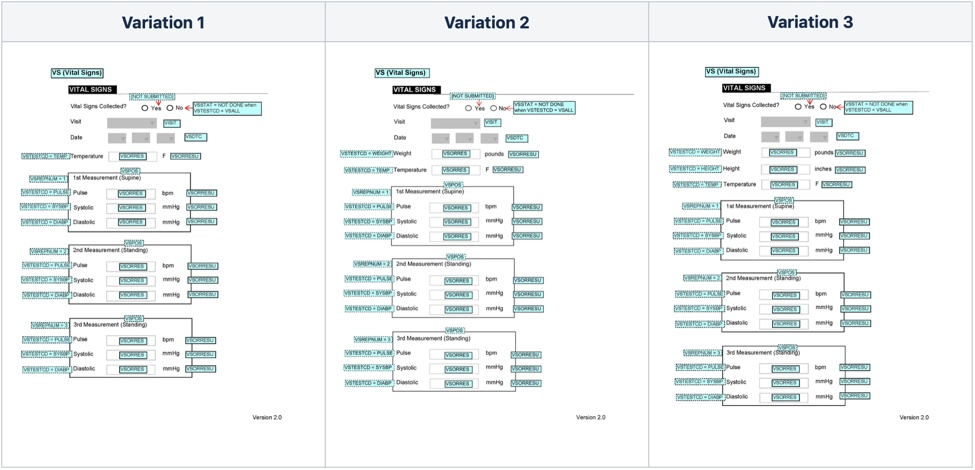

**General Note: Annotating Nontraditional Digital Collection Sources**

Annotating CRF pages is not limited to traditional paper and eCRFs. With the increase of new digital devices and collection methods, such as electronic patient-reported outcomes (ePROs), sponsors can include a representation of their respective collection screens in similar fashion. Such devices are part of the study and may include corresponding data collection screens. In the Define-XML document, this data would generally have an origin type of "Collected" and a source of "Subject". If including nontraditional digital devices (e.g., ePROs), the corresponding collection screens should be appended to the end of the traditional eCRF. This ensures consistency of data collection sources utilized in a single acrf.pdf. It may also be beneficial to provide further clarification on what nontraditional digital collection sources may have been included within the cSDRG.

Common practice has been that if a variable is annotated on the CRF, it has to have an origin of "Collected". However, there are scenarios where additional annotations, for variables which are not considered "Collected", could help to clarify the data collection to a reviewer. As an example, in the preceding VS annotated CRF pages, the "VSREPNUM" variable is annotated to provide further clarity even if its origin is not "Collected". To ensure a reviewer can differentiate between "Collected" as opposed to annotations that are intended to provide further clarity, the SDTM-MSG recommends the use of dashed annotation borders for annotations which do not represent collected data. This will aid in reducing unnecessary cross-document referencing (e.g., between the define.xml and acrf.pdf).

### 3.1.2 Appearance of Annotations

**General Note**

Regarding annotation differences between CDASH and MSG, please refer to Appendix C, MSG Package Disclaimers.

The following are recommendations to maximize annotation appearance and readability. Utilizing a consistent method to develop an annotated CRF can ensure greater clarity for reviewers and operational efficiencies.

1. Each domain represented on the CRF page or collection screen should have its own annotation.

  a. The MSG team has provided CRF annotation examples in the sample aCRF. The domain and variable annotations' placement may not always be suitable due to potential differences in CRF design. Therefore, sponsors should ensure consistency in annotation placement based on their CRF design.

  b. Domain names, rather than dataset (including split dataset) names, are annotated. For example, the sample submission "QS (Questionnaires)" is annotated for both of the split QS datasets (QSPH and QSSL).

  c. Supplemental qualifier domain names do not need to be annotated. Corresponding supplemental qualifier domain variables are annotated in equivalence to the parent domain.

2. Domain annotations should use black text with bold formatting.

  a. The annotated CRF in the sample submission uses Arial font. Sponsors should always consult the respective regulatory agency guidance and/or requirements.

3. Variable annotations should use black text without bold formatting.

  a. The annotated CRF in the sample submission uses Arial font. Sponsors should always consult the respective regulatory agency guidance and/or requirements.

4. Annotations should utilize a 12-point font size, except where:

  a. sponsors choose to increase or reduce the annotation font size to accommodate their CRF pages or collection screens; or

  b. required by adherence to regulatory health authority guidance/requirements.

5. Annotations for variables and dataset codes should be capitalized (e.g., “BRTHDTC”, “AEACN01 in SUPPAE”). For dataset labels, the convention should be "<dataset code> (<dataset label>)", e.g., "DM (Demographics)". See Section 3.1.3, Annotating Specific Types of Data, for recommendations.

6. Instructional text and comments should be sentence case, excluding variables and dataset codes, which should be capitalized as indicated above.

7. The CDISC MSG Team recommends using the following sequence of colors when annotating multiple domains on a single CRF page or collection screen. This color sequence has been tested using several applications (e.g., Coblis Color Blindness Simulator; https://www.color-blindness.com/) to minimize difficulties for those with color blindness. The red-green-blue (RGB) color codes provided here allow sponsors to apply the same colors. Sponsors who need more than 4 colors on their CRF pages should use consistent colors and take color blindness into consideration.

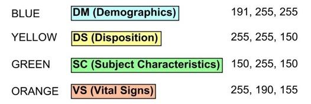

8. Notes, which are annotations explaining a situation on the CRF and not direct variable annotations, should have the color of the domain to which they pertain. Notes that pertain to multiple domains should have an appropriate background that signifies that they are not domain-specific. Sponsors can give such notes a dashed border to differentiate them from collected-variable annotations.

9. Avoid covering up text on the CRF page or collection screen; refer to Step 4 as necessary.

10. Supplemental references—via boxes, arrows, and lines—can be used to further clarify annotations.

  a. This method should be limited or avoided when not necessary.

  b. The SWLS QS (Questionnaires) page in the sample submission package illustrates this application appropriately.

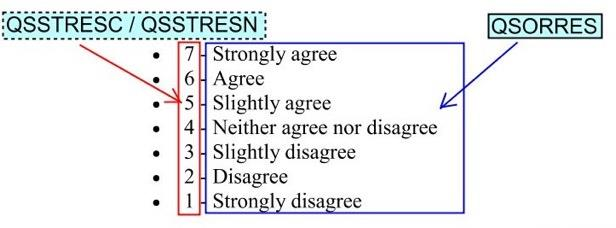

11. When multiple variables are annotated within the same annotation, it is recommended to use the forward slash " / " to separate the variables.

12. Annotations for collected data which will not be in the SDTM data (e.g., prompt questions) should be annotated as "[NOT SUBMITTED]".

13. If the annotations are "flattened" before submission, they should remain searchable to allow for better traceability. Flattening a PDF file enables to merge all the contents of the file into one single unit.

14. When referencing an explicit value pertaining to a variable annotation, the MSG team is not recommending the use of quotes (e.g., expressed as DSCAT = PROTOCOL MILESTONE instead of DSCAT = "PROTOCOL MILESTONE"). The MSG team is not, in general, recommending the use of quotes, although there may be instances where using quotes provides clarity.

15. When constructing a when/then annotation statement, the MSG team recommends the format of "<variable> when <variable>=<value>" (e.g., expressed as VSORRES/VSORRESU when VSTESTCD = TEMP).

  a. The MSG team has not identified a use case that would require an annotation format to “<variable> = <value> when <variable> = …” and <value> includes the word "when”. As such, no guidelines have been provided.

In SDTM-MSG v1.0, the variable annotation examples featured red, bold, and italicized text, although no preferences were included in the document. For SDTM-MSG v2.0, this was re-examined and determined that annotations were easier to read (and covered less of the CRF page) when black text without bold or italics was used. The SDTM-MSG v1.0 also included domain annotations that used the "=" format (e.g., DM = Demographics). This made the domain and variable annotations look very similar without clear visual distinction. This was also updated in SDTM-MSG v2.0 to better help distinguish between domain and variable annotations (e.g., "DM (Demographics)"). This was further accomplished by ensuring domain annotations remained as black text with bold formatting but without italicization. The following are identical CRF pages illustrating the differences between SDTM-MSG v1.0 and SDTM-MSG v2.0.

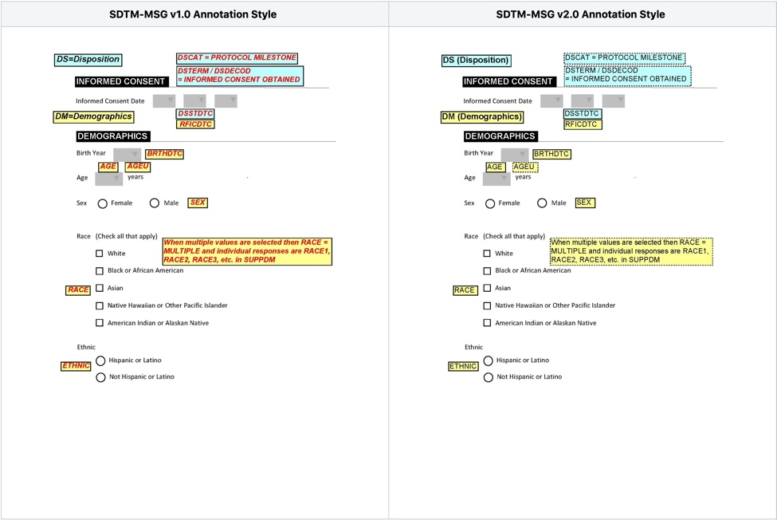

### 3.1.3 Annotating Specific Types of Data

Annotating Findings

Because of the vertical nature of the SDTM Findings domains, it may be necessary to also provide the "--TESTCD" in the annotation. For example, annotating a field as simply VSORRES or VSORRESU might not always be sufficient, and it may be necessary to also indicate the VSTESTCD to ensure explicit context. The following examples show 2 annotation methods for the same Vital Signs CRF page. In Example 1, the CRF is annotated using the "--ORRES when --TESTCD=<value>" format in a single annotation. In this example, the CRF page has a lot of free space to apply this method of annotation. However, certain CRF pages might not allow for this amount of white space, in which case other annotation methods may be necessary. In Example 2, even though the CRF page is identical, it uses separate annotations for VSTESTCD and VSORRES. Both of the examples are considered acceptable.

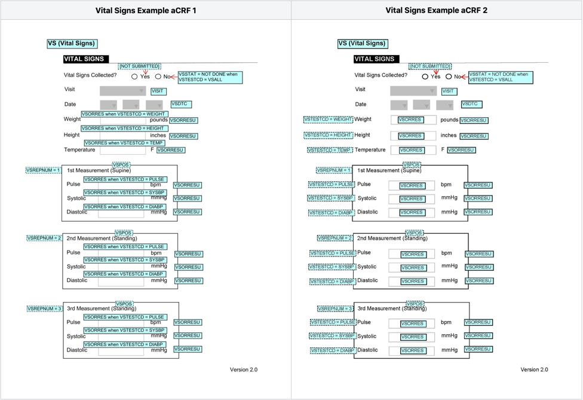

Supplemental Qualifiers

When annotating supplemental qualifier variables, annotate the QNAM value and the supplemental qualifier domain (e.g., "RACEOTH in SUPPDM"). The rationale for this approach is that potential review tools can join the supplemental qualifier values with the correct data row(s) from the parent domain. This will allow the reviewer to know what the variable name is, and that it originated in the supplemental dataset. See the following example from the Exposure page of the sample aCRF.

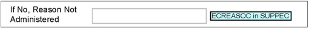

RELREC

When a form indicates a relationship between collected data, the annotations should indicate the collection as well as the RELREC relationship. In the sample submission package, adverse events are collected on the Adverse Events CRF pages, where the AE ID number is collected as AELNKID. If a subject's disposition, death, or findings about record is related to an AE, then the AE ID is also collected on those pages, thereby establishing a relationship between those records and the AE. RELREC should be annotated using the convention "RELREC when <collected variable> = <related domain variable>" to indicate that relationship. There may be times when adding the domain prefix before the variable name might be necessary if the variable name does not indicate the domain; for example, "OE.FOCID", "AE.FOCID".  The following example shows the death details page where the AE ID number is collected as DDLNKID, which is related to an AE.

Example 1: Annotations for RELREC

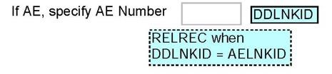

### 3.1.4 Replacement or Deprecated Pages

In the sample submission package there are 2 versions of each of the 3 Vital Signs CRF pages. The first version of each page (indicated by "Version 1.0" in the bottom right-hand corner of the CRF page) collected blood pressure and pulse only once. The updated pages ("Version 2.0") collected those vitals in triplicate. Since both versions of the pages were used to collect data and it could be potentially confusing during the review if both CRF versions were not available to the reviewer, both versions were included in the sample submission. As can be seen in the annotated CRF, newer versions were placed next to the older versions, and the versions are identified in the bookmarks and the supplied table of contents. It is at the sponsor's discretion whether to include replacement pages as part of the annotated CRF.

Best Practice

For traceability purposes, sponsors may need to include a CRF page that was used to collect data but was later deprecated due to protocol changes or other reasons as part of the annotated CRF. There are multiple ways for sponsors to handle such a situation and they should choose how to best represent that in their annotated CRF. This should also be further explained in the cSDRG.

## 3.2 Bookmarking CRFs/eCRFs

Annotated CRFs included in the eCTD should be bookmarked via dual bookmarking: (1) bookmarks by chronology and (2) bookmarks by CRF topics or forms. (The terms "topics" and "forms" refer to the content of the CRF, not the SDTM domain.) The purpose of dual bookmarking is to enhance the reviewer's ability to navigate through the unique CRFs either by chronology or by CRF topic. Data for SDTM domains do not necessarily have a one-to-one relationship with CRF topics or forms, nor is the reverse true. For example, in the annotated CRF, data for both Demographics (DM) and Disposition (DS) are collected on the DM CRF page. See Section 3.1.4, Replacement or Deprecated Pages, for recommendations on bookmarking replacement and/or deprecated CRF pages.

General Note: Bookmarking Non-Traditional Digital Collection Sources

The SDTM-MSG v2.0 does not provide recommendations regarding bookmarking nontraditional digital collection sources (e.g., ePRO). In such cases, sponsors should follow their own respective standard operating procedures and/or guidelines.

- Bookmarks by chronology should be ordered according to the study schedule of activities (SOA).

  - Pages that are independent of visits (e.g., Adverse Events) should be presented last, under a "Running Records" bookmark.

  - Within each chronological bookmark, topic bookmarks should appear in the order that they appear in the annotated CRF.

- Bookmarks by topics can be ordered alphabetically, as is done in the SDTM-MSG sample submission package, or sponsors may choose to list the forms in the order in which they appear in the CRF.

  - Within each topic bookmarks should be ordered chronologically according to the SoA schedule.

  - For SDTM-MSG v1.0, the aCRF example showed "Domains" as the top level for these bookmarks, but SDTM-MSG v2.0 has changed that to "Forms," because "Domains" implies SDTM domains.

- The following is an example of bookmarks arranged chronologically and by form. In the image, beneath the "Visit" bookmark, the bookmarks for screening visits 1 and 2 show the CRF pages used at those visits, listed in the order in which they appear in the CRF. Below the "Forms" bookmark, the "Auditory Verbal Learning Test (AVLT-REY)" bookmark has sub-bookmarks which show the visits in which that form is used. The "Concomitant Medications" bookmark has a sub-bookmark which indicates that it is a "Running Record".

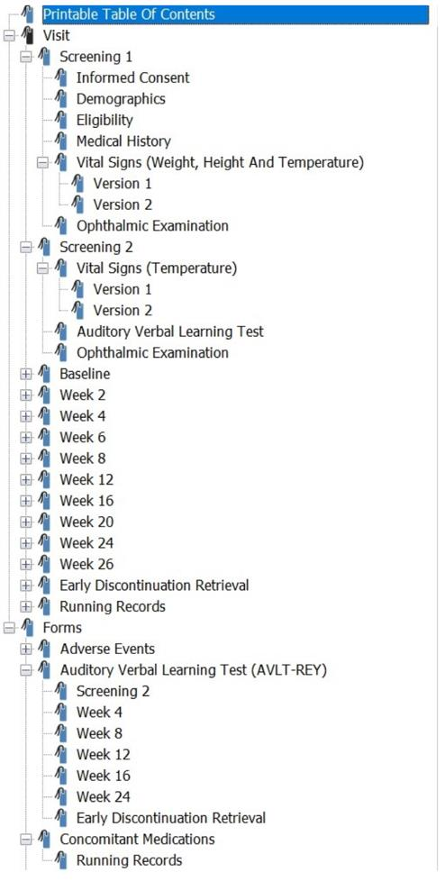

## 3.3 Table of Contents for the Annotated CRF

In the annotated CRF, the bookmarks essentially comprise a table of contents (TOC) for the reviewer. To facilitate a more efficient review process, a printable TOC may be included at the beginning of the annotated CRF (see following example). The entries in the TOC should be hyperlinked to the respective CRF page, as is done with the corresponding bookmarks. There are several free and commercially available digital tools that can support the creation of a TOC by leveraging existing bookmarks. It is also possible to create a TOC using word processing software, as was done in the sample submission package annotated CRF.

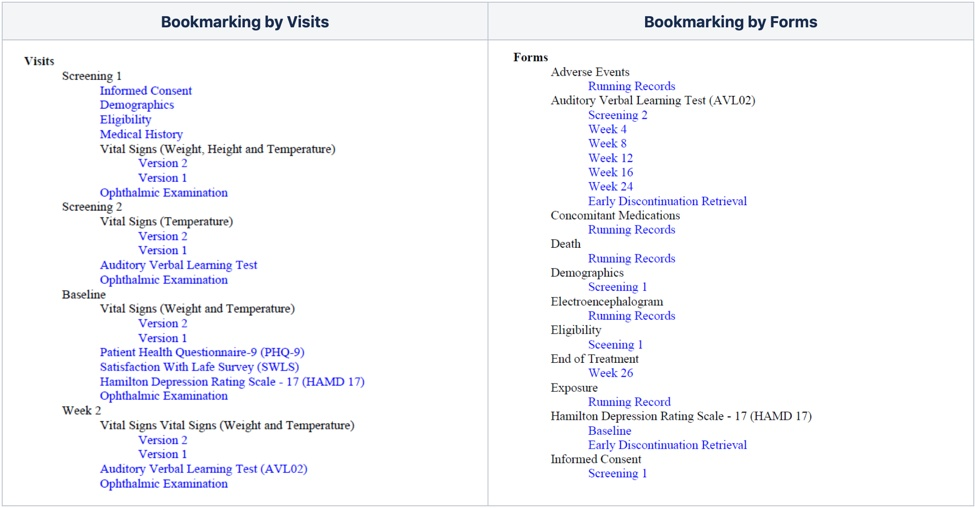

# 4 Clinical Study Data Reviewers Guide

The cSDRG provides additional information for reviewers about the submitted data which does not belong in the Define-XML document and/or the annotated CRF. The cSDRG should help to facilitate the review process by describing any special considerations, including complex algorithms that are incompatible with the Define-XML from a presentation point of view. While the specific format of the reviewer's guide is not explicitly required by regulatory health authorities (e.g, the U.S. FDA or the PMDA), there may be references to the PHUSE template. Please refer to the PHUSE website for the latest cSDRG version (https://advance.phuse.global/display/WEL/Deliverables). Included within the PHUSE cSDRG package is a template, completion guidelines, and example cSDRGs. The SDTM-MSG will not repeat all the specific details described within the PHUSE cSDRG.

General Note

At the time of SDTM-MSG v2.0 publication, the US FDA specifies that the cSDRG should be named "csdrg.pdf," whereas the PMDA specifies that it can be named similar to "study-data-reviewers-guide.pdf". The MSG team named the reviewer's guide in the sample submission "csdrg.pdf", but sponsors should check for the latest recommendation from their regulatory health authority.

## 4.1 Conformance, Validation, and Tools

It is expected that sponsors run compliance checks throughout the submission development life cycle on the study data package in order to identify issues as early as possible. Compliance checks will be discussed here in the context of the reviewer's guide, as that is where the remaining checks which are triggered are explained in the final submission study data package.

- The Define-XML document should be validated against the Define-XML conformance rules.

- The SDTM data should be validated with the Define-XML against the SDTM conformance rules.

- When the SDTM data are reviewed for conformance, any findings must be evaluated.

  - All conformance findings that are generally within the sponsor's control (e.g., dataset and variable attributes) should be corrected.

  - Any conformance findings that cannot be resolved may be explained in the cSDRG.

- For conformance rules in production, the corresponding rule ID should be included, if available.

  - Each regulatory health authority may have its own set of business requirements for evaluating conformance and validation, as well as the scope of the findings to be documented in the cSDRG.

- A number of approaches can be taken in evaluating SDTM data for conformance.

  - Third-party tools may be used. These tools may have their own interpretation of the requirements for properly formed SDTM datasets. Sponsors should understand and evaluate these interpretations.

  - Validation issues related to an interpretation of a requirement should be noted in the cSDRG.

- Sponsors should put extra effort into explaining their current compliance check.

  - Sponsors should be careful to avoid generic explanations, or explanations which simply repeat the wording of the compliance check, when providing explanations for the compliance checks. For example, in response to a check which fires indicating duplicate records, simply explaining that the records are not duplicates is not sufficient. Instead, a response such as "The validation tool checks CESTDTC, CECAT, CETERM, and USUBJID for uniqueness, but the current data also requires CESCAT to be considered" clearly explains the issue for the reviewer.

  - Providing greater detail can help the regulatory health authority and the corresponding review division understand the reasons for the identified compliance checks.

## 4.2 Other Documents

Additional documents can be included as separate PDFs at a sponsor's discretion. Examples of appropriate materials to represent in a separate PDF include complex scoring material provided in support of a questionnaire, or oncology- related derivations.

The SDTM-MSG v2.0 sample submission package does not include an example of these documents. The Define- XML document should have explicit reference to these documents; sponsors can refer to the Define-XML documentation for further details.

# 5 Submission Datasets

The purpose of this section is to highlight noteworthy aspects of domains in the SDTM-MSG example submission package. Because these are examples, the subsections that follow may describe an implementation choice made by the MSG team. The order of the domains in this section follows the order of the domains as they appear in the define.xml document.

## 5.1 Trial Design

Figure 1 depicts the overall trial design of the sample submission study, which is based loosely on the original CDISC SDTM/ADaM Pilot Project.

Figure 1. CDISCPILOT01 Trial Design

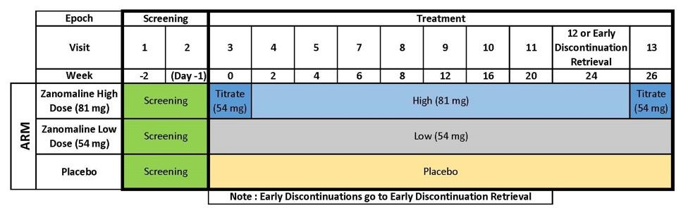

As indicated in Figure 1, subjects who discontinued before week 24 had a visit scheduled at week 24 (i.e., the early discontinuation recall visit). That visit occurs at the same point as visit 12 for those who did not discontinue.

Note that:

- Subjects who discontinued in the study but returned for the early discontinuation recall visit remained in the treatment epoch.

- There is no VISITNUM = 6 in TV. The SDTMIG does not require VISITNUM values to be consecutive, only chronological (for noncontingent visits).

As indicated in Figure 1, there are 3 arms in the sample submission. Each arm starts with a screening element; the low-dose zanomaline and placebo arms have a single dosing element, whereas the high-dose zanomaline arm has 3 dosing elements. The dosing epoch is 26 weeks long for all 3 arms, with the high dose having a 2-week titration element before and after a 22-week-long high-dose element.

### 5.1.1 Trial Inclusion/Exclusion Criteria (TI)

It is the sponsor's decision how to represent criteria in excess of 200 characters long; they can truncate at 200 characters or put meaningful text into IETEST. In the sample submission, the MSG Team decided to use the meaningful text approach.

Some of the original protocol criteria were well beyond the 200-character limit (e.g., exclusion criteria 12 was 485 characters long; exclusion 31 was 2199 characters long). The full text can be seen in Appendix 1 of the Study Data Reviewers' Guide (csdrg.pdf). Because these criteria had multiple enumerated subcriteria, it was decided that the text could not convey the full meaning of the criteria in 200 characters. Therefore, the protocol was referenced in IETEST to indicate that the full text needs to be obtained from the protocol to be understood. The IETEST for EXCL12 was set to "Diagnosis of serious neurological conditions (See Protocol)" and the text for EXCL31 was set to "Treatment with medications within 1 month prior to enrollment (See Protocol)". In the protocol amendment, those criteria had additional items added to them. This was represented by changing the "(See Protocol)" text in each criterion to "(See Amendment 1)", which ensured that it was clear that the protocol needed to be referenced to understand the full text, and to provide the updated criteria with new IETESTCD and IETEST values (required when criteria are updated).

Please note that even though some QRS (questionnaires, ratings and scales) devices were replaced due to copyright permissions, the original inclusion/exclusion criteria used in the study were maintained in the sample submission. Those criteria sometimes reference the original QRS devices.

### 5.1.2 Trial Summary (TS)

For TSPARMCD = "FCNTRY" in the sample data, "ISO 3166" was used, but if the submission were made to the FDA then the Geopolitical Entities, Names, and Codes standard (GENC) would be used, and the FCNTRY row would look similar to the following (depending on the version of GENC used):

| STUDYID      | DOMAIN | TSGRPID | TSSEQ | TSPARMCD | TSPARM                                   | TSVAL | TSVALNF | TSVALCD | TSVCDREF | TSVCDVER |
| ------------ | ------ | ------- | ----- | -------- | ---------------------------------------- | ----- | ------- | ------- | -------- | -------- |
| CDISCPILOT01 | TS     |         | 1     | FCNTRY   | Planned Country of Investigational Sites | USA   |         | 840     | GENC     | 2.0      |

Because the study drug is fictional, and the study on which the study data was loosely based occurred prior to development of the ClinicalTrials.gov system (https://clinicaltrials.gov), the code values for TRT and REGID are fictional as well.

## 5.2 Special-purpose Domains

### 5.2.1 Demographics (DM)

In the sample submission, the subjects were assigned USUBJID values of "CDISC001" to "CDISC018". This should not be perceived as a recommendation, but rather illustrates that sponsors are free to assign USUBJID values in the method that they wish, and that the usual concatenation of STUDY-SITE-SUBJID is not a requirement. This is assuming, of course, that each individual subject is assigned a single unique identifier across the entire application.

## 5.3 Interventions

### 5.3.1 Exposure as Collected (EC) and Exposure (EX)

EC represents the exposure data as collected, and it contains the amount of study drug (ECDOSE) injected in "mL" (ECDOSU), as well as the strength of the solution (ECPSTRG) in "g/L" (ECPSTRGU). The strength of the solution is blinded at the time of administration, but is used, along with the dose, to calculate the total dose of study drug (EXDOSE) in EX resulting in the protocol specified unit of "mg" (EXDOSU). The actual doses were recorded by the subjects in a diary and transcribed by the site onto the EC collection CRF.

Many of the EX variables (e.g., EXTRT, EXDOSFRQ, EXDOSFRM, EXROUTE, EXLOT) are copied directly from their equivalent variables in EC and so are given the origin of "Predecessor" in the sample Define-XML document (define.xml). Although "Predecessor" is thought of primarily as an origin for ADaM, it can also be used in SDTM scenarios such as EC/EX. Even though SDTMIG v3.2 did not specify "Predecessor" as one of the allowable origin values, the Define-XML specification is the actual source for origin values. Even in 3.2 "Predecessor" can be used in SDTM, as it was in the v3.3 MSG sample submission.

## 5.4 Events

### 5.4.1 Adverse Events (AE)

There are 2 AE CRFs, one for spontaneously reported AEs, and one for injection site reactions (ISRs). AETERM for ISRs defaults to "Injection Site Reaction", while the details of the reaction, pain, induration, and so on are contained in the Findings About Events or Interventions (FA) domain. RELREC is used to show the relationships between the domains.

Due to the proprietary nature of coding dictionaries, the AE-coded variables in the sample submission are all null, but sponsors should continue populating those variables as expected.

## 5.5 Findings

Study procedures at the baseline visit were protocol-specified to occur before study dosing. Because the time was not collected with the first dosing at the baseline visit—the point when subjects moved from the screening epoch to the treatment epoch—all findings data collected at the baseline visit are considered to occur in the screening epoch.

### 5.5.1 Laboratory Test Results (LB)

The sample submission includes a scenario where LB needs to be split due to file size, and illustrates compliance with the recommendations outlined by the FDA in the Study Data Technical Conformance Guide (https://www.fda.gov/media/88173/download). Sponsors should consult with other regulatory authorities for requirements on the need to split datasets. To keep the overall submission package at a convenient size, the actual file size of LB is not large enough to require splitting, but only represents how to handle such a situation.

In the sample submission, LB is included in the "sdtm" folder and represented in the Define-XML document as a single table. LB is then split by category, LBCAT, into LBCH ("Chemistry"), LBHE ("Hematology") and LBUR ("Urinalysis" and "Other"). The split datasets do not require additional Define-XML documentation.

### 5.5.2 Nervous System Findings (NV)

The NV CRF page was added to the MSG sample submission purely as an example of a planned domain, NV, for which no data were collected.

### 5.5.3 Questionnaires, Ratings, and Scales (QRS)

Functional tests and clinical classifications were considered part of the QS domain in previous versions of the SDTMIG. In v3.3 they were removed from the QS domain, with functional tests forming the FT domain and clinical classifications becoming part of the Disease Response and Clin Classification (RS) domain.

The functional test used for the FT domain was the Rey Auditory Verbal Learning Test (AVLT-REY), based on the QRS supplement, which is posted on the CDISC website (https://www.cdisc.org/standards/foundational/qrs). The AVLT-REY involves auditory recall from a list of 15 words: list A, which is repeated 5 times; followed by recall of a second list (list B); a sixth recall of list A; and then, after a 30 minutes delay, a seventh recall of list A. The 7 repetitions of list A are captured in the FTREPNUM variable, whereas FTREPNUM is null for list B, which is only done once. To capture the required 30-minute delay before the final recall of list A, the timepoint variables are used. FTELTM is set to PT30M, while the value in FTTPTREF is set to "LIST A RECALL 6".

Unlike the Laboratory Test Results (LB) scenario in the sample submission, where the domain was required to be split due to its size with a unique overall dataset definition, the QS domain is split as a example of splitting done by sponsor decision, with each split component having different dataset definitions. As a result, unlike LB where the dataset was included as a whole in the Define-XML document and "sdtm" folder while the split versions were only included in the "split" folder, QS is included as separate dataset definitions in the Define-XML document for QSSL (Satisfaction with Life Survey) and QSPH (Patient Health Questionnaire-9), and separate physical datasets in the "sdtm" folder only.

QSSTRESC and QSSTRESN are annotated on the QS CRF pages even though they are considered derived variables. They are considered as helpful annotations which can make the data easier to understand, but it does not make them CRF collected data. The origin value will remain "Derived" and the page number will be added to the Define-XML document to show that the CRF annotations can help clarify the data.

Best Practice

Even if a variable is not considered CRF-collected data, annotations can be added to help explain the data. Annotating RSEVLINT and RSCAT for example, as was done on the HAMD-17 RS page, can make the CRF page easier to understand for the reviewer, even if data are not considered CRF-collected (see below).

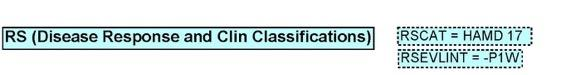

### 5.5.4 Vital Signs (VS)

As indicated in Section 3.1.4, Replacement or Deprecated Pages, there are 3 different VS pages, used at different visits. In addition to pulse and blood pressure measurements, 1 page also collected temperature; 1 collected temperature and weight; and 1 collected temperature, weight, and height. Each of these pages were updated during the trial at the end of 2012, the updated version having the pulse and blood pressure in triplicate, with the iterations being indicated by VSREPNUM.

# 6 Appendices

**Appendix A: CDISC SDS MSG Team**

| Role                        | Name                 | Company                                                               |
| --------------------------- | -------------------- | --------------------------------------------------------------------- |
| Team Lead                   | Richard Lewis        | Data Standards Consulting Group                                       |
| SDS Leadership Team Sponsor | Mike Hamidi          | Clinical Solutions Group, LLC an IQVIA business (formerly with CDISC) |
| Define-XML Team Liaison     | Marcelina Hungria    | DIcore Group                                                          |
| Team Members                | Carolyn Famatiga-Fay | Independent                                                           |
|                             | Daisuke Hisada       | GlaxoSmithKline K.K.                                                  |
|                             | David Neubauer       | Clinical Solutions Group, LLC an IQVIA business                       |
|                             | Richard Phillips     | Covance                                                               |
|                             | Carlo Radovsky       | Immanant                                                              |
|                             | Madhavi Vemuri       | Johnson & Johnson                                                     |
|                             | Max Williams         | Eli Lilly                                                             |

**Appendix B: Submission Package Software Issues**

**Browser Display/Functionality Issues**

Depending on the Adobe version and the browser and its settings, users may experience bookmark functionality issues or observe display and functionality issues in the rendered XML. Adjusting browser settings can rectify this, but due to so many combinations it is not possible for this document to describe them all.

**Searchability**

Often when reviewing an annotated CRF it is useful to search for a specific variable or domain, but when PDFs are opened in a browser, the ability to search annotations might not be available.

**Appendix C: MSG Package Disclaimers**

This page includes additional disclaimers pertaining to the CDISC SDTM Metadata Submission Guidelines v2.0 (SDTM-MSG). Please refer to Appendix D, Representations and Warranties, Limitations of Liability, and Disclaimers, for additional details on the use of the SDTM-MSG.

**Hamilton Depression Rating Scale (HDRS) (HAMD-17)**

CDISC created an annotated CRF to represent the HAMD 17 (see https://www.cdisc.org/standards/foundational/qrs/). CDISC believes this instrument is in the public domain, but you should perform your own assessment. This is not a validated CRF or an endorsement of the HAMD 17. CDISC specifies how to structure the data that has been collected in a database, not what should be collected or how to conduct clinical assessments or protocols. CDISC has chosen to use this version as the data standard in the CDISC SDTM-MSG v2.0 sample submission package.

**Patient Health Questionnaire - 9 (PHQ-9)**

CDISC has included the Patient Health Questionnaire-9 (PHQ-9) as part of CDISC Data Standards (https://www.cdisc.org/standards/foundational/qrs/). Hence, CDISC developed QSTESTCD and QSTEST for each question based on the actual question text on the questionnaire. There may be many versions of this instrument. CDISC has chosen to use this version as the data standard in the CDISC SDTM-MSG v2.0 sample submission package. CDISC controlled terminology is maintained by the National Cancer Institute Enterprise Vocabulary Services (NCI EVS). The most recent version should be accessed through the CDISC website, at http://www.cdisc.org/terminology.

Copyright © Pfizer Inc. All rights reserved. Developed by Drs. Robert L. Spitzer, Janet B Williams, and Kurt 
Kroenke. CDISC standards users aiming to use the instrument must comply with the copyright holders licensing requirements.

**Dataset-XML**

CDISC has included the Dataset-XML in the sample submission package to provide an additional format other than SAS Version 5 transport file format (.xpt). As stated in the CDISC Dataset-XML v1.0 specification (available at https://www.cdisc.org/standards/data-exchange/dataset-xml), "The purpose of the Dataset-XML is to support the interchange of tabular clinical research data using ODM-based XML technologies. The Dataset-XML model is based on the CDISC Operational Data Model (ODM) standard and follows the metadata structure defined in the Define-XML 2.0 standard." At the time of SDTM-MSG v2.0 publication, the submission of Dataset-XML as part
of a regulatory application was not required, nor explicitly referenced by a regulatory agency (e..g, US FDA via 
Study Data Standards Resources, https://www.fda.gov/industry/; Japan PMDA via New Drug Review with Electronic Data, https://www.pmda.go.jp/english/). However, Dataset-XML was included in part due to the changes in the technology landscape and potential non-regulatory application use cases. As part of any regulatory submission application, please always consult the respective regulatory agency guidance and/or requirements.

**Annotation Differences: CDASH & MSG**

The CDISC CDASH and MSG Teams have acknowledged the annotation differences between the 2 products. In CDASH, the annotation context is to exemplify how and what is collected to and from CDASH. The CDASH annotations are further technically limited (i.e., dependency on an aCRF macro creator). For the MSG, the annotation context pertains to a regulatory submission application. Further, the MSG provides general recommendations on both annotating and bookmarking a variety of electronic sources (e.g., eCRFs, ePRO). A

longer-term solution is being pursued to further align annotation styles between CDASH and MSG. This work will progress after the publication of the SDTM-MSG v2.0.

**Appendix D: Representations and Warranties, Limitations of Liability, and Disclaimers**

**CDISC Patent Disclaimers**

It is possible that implementation of and compliance with this standard may require use of subject matter covered by patent rights. By publication of this standard, no position is taken with respect to the existence or validity of any claim or of any patent rights in connection therewith. CDISC, including the CDISC Board of Directors, shall not be responsible for identifying patent claims for which a license may be required in order to implement this standard or for conducting inquiries into the legal validity or scope of those patents or patent claims that are brought to its attention.

**Representations and Warranties**

“CDISC grants open public use of this User Guide (or Final Standards) under CDISC’s copyright.”

Each Participant in the development of this standard shall be deemed to represent, warrant, and covenant, at the time of a Contribution by such Participant (or by its Representative), that to the best of its knowledge and ability: (a) it holds or has the right to grant all relevant licenses to any of its Contributions in all jurisdictions or territories in which it holds relevant intellectual property rights; (b) there are no limits to the Participant’s ability to make the grants, acknowledgments, and agreements herein; and (c) the Contribution does not subject any Contribution, Draft Standard, Final Standard, or implementations thereof, in whole or in part, to licensing obligations with additional restrictions or requirements inconsistent with those set forth in this Policy, or that would require any such Contribution, Final Standard, or implementation, in whole or in part, to be either: (i) disclosed or distributed in source code form; (ii) licensed for the purpose of making derivative works (other than as set forth in Section 4.2 of the CDISC Intellectual Property Policy (“the Policy”)); or (iii) distributed at no charge, except as set forth in Sections 3, 5.1, and 4.2 of the Policy. If a Participant has knowledge that a Contribution made by any Participant or any other party may subject any Contribution, Draft Standard, Final Standard, or implementation, in whole or in part, to one or more of the licensing obligations listed in Section 9.3, such Participant shall give prompt notice of the same to the CDISC President who shall promptly notify all Participants.

No Other Warranties/Disclaimers. ALL PARTICIPANTS ACKNOWLEDGE THAT, EXCEPT AS PROVIDED UNDER SECTION 9.3 OF THE CDISC INTELLECTUAL PROPERTY POLICY, ALL DRAFT STANDARDS AND FINAL STANDARDS, AND ALL CONTRIBUTIONS TO FINAL STANDARDS AND DRAFT STANDARDS, ARE PROVIDED “AS IS” WITH NO WARRANTIES WHATSOEVER, WHETHER EXPRESS, IMPLIED, STATUTORY, OR OTHERWISE, AND THE PARTICIPANTS, REPRESENTATIVES, THE CDISC PRESIDENT, THE CDISC BOARD OF DIRECTORS, AND CDISC EXPRESSLY DISCLAIM ANY WARRANTY OF MERCHANTABILITY, NONINFRINGEMENT, FITNESS FOR ANY PARTICULAR OR INTENDED PURPOSE, OR ANY OTHER WARRANTY OTHERWISE ARISING OUT OF ANY PROPOSAL, FINAL STANDARDS OR DRAFT STANDARDS, OR CONTRIBUTION.

**Limitation of Liability**

IN NO EVENT WILL CDISC OR ANY OF ITS CONSTITUENT PARTS (INCLUDING, BUT NOT LIMITED TO, THE CDISC BOARD OF DIRECTORS, THE CDISC PRESIDENT, CDISC STAFF, AND CDISC MEMBERS) BE LIABLE TO ANY OTHER PERSON OR ENTITY FOR ANY LOSS OF PROFITS, LOSS OF USE, DIRECT, INDIRECT, INCIDENTAL, CONSEQUENTIAL, OR SPECIAL DAMAGES, WHETHER UNDER CONTRACT, TORT, WARRANTY, OR OTHERWISE, ARISING IN ANY WAY OUT OF THIS POLICY OR ANY RELATED AGREEMENT, WHETHER OR NOT SUCH PARTY HAD ADVANCE NOTICE OF THE POSSIBILITY OF SUCH DAMAGES.

Note: The CDISC Intellectual Property Policy can be found at http://www.cdisc.org/system/files/all/article/application/pdf/cdisc_20ip_20policy_final.pdf