Study Data Tabulation Model Implementation Guide: Human Clinical Trials

Version 3.4 (Final)

Developed by the CDISC Submission Data Standards Team

Notes to Readers

- This is the implementation guide for human clinical trials corresponding to Version 2.0 of the CDISC Study Data Tabulation Model.

Revision History

| Date       | Version     |
| ---------- | ----------- |
| 2021-11-29 | 3.4 Final   |
| 2018-02-20 | 3.3 Final   |
| 2013-11-26 | 3.2 Final   |
| 2012-07-16 | 3.1.3 Final |
| 2008-11-12 | 3.1.2 Final |
| 2005-08-26 | 3.1.1 Final |
| 2004-07-14 | 3.1         |

See Appendix F for representations and warranties, limitations of liability, and disclaimers.

CONTENTS

1 INTRODUCTION

- 1.1 PURPOSE
- 1.2 ORGANIZATION OF THIS DOCUMENT
- 1.3 RELATIONSHIP TO PRIOR CDISC DOCUMENTS
- 1.4 HOW TO READ THIS IMPLEMENTATION GUIDE
  - 1.4.1 How to Read a Domain Specification
- 1.5 KNOWN ISSUES

2 FUNDAMENTALS OF THE SDTM

- 2.1 OBSERVATIONS AND VARIABLES
- 2.2 DATASETS AND DOMAINS
- 2.3 THE GENERAL OBSERVATION CLASSES
- 2.4 DATASETS OTHER THAN GENERAL OBSERVATION CLASS DOMAINS
- 2.5 THE SDTM STANDARD DOMAIN MODELS
- 2.6 CREATING A NEW DOMAIN
- 2.7 SDTM VARIABLES NOT ALLOWED IN THE SDTMIG

3 SUBMITTING DATA IN STANDARD FORMAT

- 3.1 STANDARD METADATA FOR DATASET CONTENTS AND ATTRIBUTES
- 3.2 USING THE CDISC DOMAIN MODELS IN REGULATORY SUBMISSIONS – DATASET METADATA
  - 3.2.1 Dataset-level Metadata
    - 3.2.1.1 Primary Keys
    - 3.2.1.2 CDISC Submission Value-level Metadata
  - 3.2.2 Conformance

4 ASSUMPTIONS FOR DOMAIN MODELS

- 4.1 GENERAL DOMAIN ASSUMPTIONS
  - 4.1.1 Review Study Data Tabulation Model and Implementation Guide
  - 4.1.2 Relationship to Analysis Datasets
  - 4.1.3 Additional Timing Variables
    - 4.1.3.1 EPOCH Variable Guidance
  - 4.1.4 Order of the Variables
  - 4.1.5 SDTM Core Designations
  - 4.1.6 Additional Guidance on Dataset Naming
  - 4.1.7 Splitting Domains
    - 4.1.7.1 Example of Splitting Questionnaires
  - 4.1.8 Origin Metadata
    - 4.1.8.1 Origin Metadata for Variables
    - 4.1.8.2 Origin Metadata for Records
  - 4.1.9 Assigning Natural Keys in the Metadata
- 4.2 GENERAL VARIABLE ASSUMPTIONS
  - 4.2.1 Variable-naming Conventions
  - 4.2.2 Two-character Domain Identifier
  - 4.2.3 Use of "Subject" and USUBJID
  - 4.2.4 Text Case in Submitted Data
  - 4.2.5 Convention for Missing Values
  - 4.2.6 Grouping Variables and Categorization
  - 4.2.7 Submitting Free Text from the CRF
    - 4.2.7.1 "Specify" Values for Non-result Qualifier Variables
    - 4.2.7.2 "Specify" Values for Result Qualifier Variables
    - 4.2.7.3 "Specify" Values for Topic Variables
    - 4.2.7.4 "Specify" Values for --OBJ
  - 4.2.8 Multiple Values for a Variable
    - 4.2.8.1 Multiple Values for an Intervention or Event Topic Variable
    - 4.2.8.2 Multiple Values for a Findings Result Variable
    - 4.2.8.3 Multiple Values for a Non-result Qualifier Variable
    - 4.2.8.4 Multiple Values for a Parameter
  - 4.2.9 Variable Lengths
- 4.3 CODING AND CONTROLLED TERMINOLOGY ASSUMPTIONS
  - 4.3.1 Controlled Terms, Codelist or Format Column
  - 4.3.2 Controlled Terminology Text Case
  - 4.3.3 Controlled Terminology Values
  - 4.3.4 Use of Controlled Terminology and Arbitrary Number Codes
  - 4.3.5 Storing Controlled Terminology for Synonym Qualifier Variables
  - 4.3.6 Storing Topic Variables for General Domain Models
  - 4.3.7 Use of "Yes" and "No" Values
- 4.4 ACTUAL AND RELATIVE TIME ASSUMPTIONS
  - 4.4.1 Formats for Date/Time Variables
  - 4.4.2 Date/Time Precision
  - 4.4.3 Intervals of Time and Use of Duration for --DUR Variables
    - 4.4.3.1 Intervals of Time and Use of Duration
    - 4.4.3.2 Interval with Uncertainty
  - 4.4.4 Use of the Study Day Variables
  - 4.4.5 Clinical Encounters and Visits
  - 4.4.6 Representing Additional Study Days
  - 4.4.7 Use of Relative Timing Variables
  - 4.4.8 Date and Time Reported in a Domain Based on Findings
  - 4.4.9 Use of Dates as Result Variables
  - 4.4.10 Representing Time Points
  - 4.4.11 Disease Milestones and Disease Milestone Timing Variables
- 4.5 OTHER ASSUMPTIONS
  - 4.5.1 Original and Standardized Results of Findings and Tests Not Done
    - 4.5.1.1 Original and Standardized Results
    - 4.5.1.2 Tests Not Done
    - 4.5.1.3 Examples of Original and Standard Units and Test Not Done
  - 4.5.2 Linking Multiple Observations
  - 4.5.3 Text Strings that Exceed the Maximum Length for General Observation-class Domain Variables
    - 4.5.3.1 Test Name (--TEST) Greater than 40 Characters
    - 4.5.3.2 Text Strings Greater than 200 Characters in Other Variables
  - 4.5.4 Evaluators in the Interventions and Events Observation Classes
  - 4.5.5 Clinical Significance for Findings Observation Class Data
  - 4.5.6 Supplemental Reason Variables
  - 4.5.7 Presence or Absence of Prespecified Interventions and Events
  - 4.5.8 Accounting for Long-term Follow-up
  - 4.5.9 Baseline Values

5 MODELS FOR SPECIAL-PURPOSE DOMAINS

- 5.1 COMMENTS (CO)
- 5.2 DEMOGRAPHICS (DM)
- 5.3 SUBJECT ELEMENTS (SE)
- 5.4 SUBJECT DISEASE MILESTONES (SM)
- 5.5 SUBJECT VISITS (SV)

6 DOMAIN MODELS BASED ON THE GENERAL OBSERVATION CLASSES

- 6.1 MODELS FOR INTERVENTIONS DOMAINS
  - 6.1.1 Procedure Agents (AG)
  - 6.1.2 Concomitant/Prior Medications (CM)
  - 6.1.3 Exposure Domains
    - 6.1.3.1 Exposure (EX)
    - 6.1.3.2 Exposure as Collected (EC)
    - 6.1.3.3 Exposure/Exposure as Collected Examples
  - 6.1.4 Meal Data (ML)
  - 6.1.5 Procedures (PR)
  - 6.1.6 Substance Use (SU)
- 6.2 MODELS FOR EVENTS DOMAINS
  - 6.2.1 Adverse Events (AE)
  - 6.2.2 Biospecimen Events (BE)
  - 6.2.3 Clinical Events (CE)
  - 6.2.4 Disposition (DS)
  - 6.2.5 Healthcare Encounters (HO)
  - 6.2.6 Medical History (MH)
  - 6.2.7 Protocol Deviations (DV)
- 6.3 MODELS FOR FINDINGS DOMAINS
  - 6.3.1 Product Accountability (DA)
  - 6.3.2 Death Details (DD)
  - 6.3.3 ECG Test Results (EG)
  - 6.3.4 Inclusion/Exclusion Criteria Not Met (IE)
  - 6.3.5 Specimen-based Findings Domains
    - 6.3.5.1 Generic Specimen-based Lab Findings Domain Specification
    - 6.3.5.2 Biospecimen Findings (BS)
    - 6.3.5.3 Cell Phenotype Findings (CP)
    - 6.3.5.4 Genomics Findings (GF)
    - 6.3.5.5 Immunogenicity Specimen Assessments (IS)
    - 6.3.5.6 Laboratory Test Results (LB)
    - 6.3.5.7 Microbiology Domains
    - 6.3.5.8 Microscopic Findings (MI)
    - 6.3.5.9 Pharmacokinetics Domains
  - 6.3.6 Morphology (MO)
  - 6.3.7 Morphology/Physiology Domains
    - 6.3.7.1 Generic Morphology/Physiology Specification
    - 6.3.7.2 Cardiovascular System Findings (CV)
    - 6.3.7.3 Musculoskeletal System Findings (MK)
    - 6.3.7.4 Nervous System Findings (NV)
    - 6.3.7.5 Ophthalmic Examinations (OE)
    - 6.3.7.6 Reproductive System Findings (RP)
    - 6.3.7.7 Respiratory System Findings (RE)
    - 6.3.7.8 Urinary System Findings (UR)
  - 6.3.8 Physical Examination (PE)
  - 6.3.9 Questionnaires, Ratings, and Scales (QRS) Domains (FT, QS, RS)
    - 6.3.9.1 Functional Tests (FT)
    - 6.3.9.2 Questionnaires (QS)
    - 6.3.9.3 Disease Response and Clin Classification (RS)
  - 6.3.10 Subject Characteristics (SC)
  - 6.3.11 Subject Status (SS)
  - 6.3.12 Tumor/Lesion Domains
    - 6.3.12.1 Tumor/Lesion Identification (TU)
    - 6.3.12.2 Tumor/Lesion Results (TR)
    - 6.3.12.3 Tumor Identification/Tumor Results Examples
  - 6.3.13 Vital Signs (VS)
- 6.4 FINDINGS ABOUT EVENTS OR INTERVENTIONS
  - 6.4.1 When to Use Findings About Events or Interventions
  - 6.4.2 Naming Findings About Domains
  - 6.4.3 Variables Unique to Findings About
  - 6.4.4 Findings About Events or Interventions (FA)
  - 6.4.5 Skin Response (SR)

7 TRIAL DESIGN MODEL DATASETS

- 7.1 INTRODUCTION TO TRIAL DESIGN MODEL DATASETS
  - 7.1.1 Purpose of the Trial Design Model
  - 7.1.2 Definitions of Trial Design Concepts
  - 7.1.3 Current and Future Contents of the Trial Design Model
- 7.2 EXPERIMENTAL DESIGN (TA AND TE)
  - 7.2.1 Trial Arms (TA)
    - 7.2.1.1 Trial Arms Issues
  - 7.2.2 Trial Elements (TE)
    - 7.2.2.1 Trial Elements Issues
- 7.3 SCHEDULE FOR ASSESSMENTS (TV, TD, AND TM)
  - 7.3.1 Trial Visits (TV)
    - 7.3.1.1 Trial Visits Issues
  - 7.3.2 Trial Disease Assessments (TD)
  - 7.3.3 Trial Disease Milestones (TM)
- 7.4 TRIAL ELIGIBILITY AND SUMMARY (TI AND TS)
  - 7.4.1 Trial Inclusion/Exclusion Criteria (TI)
  - 7.4.2 Trial Summary (TS)
    - 7.4.2.1 Use of Null Flavor
- 7.5 HOW TO MODEL THE DESIGN OF A CLINICAL TRIAL

8 REPRESENTING RELATIONSHIPS AND DATA

- 8.1 RELATING GROUPS OF RECORDS WITHIN A DOMAIN USING THE --GRPID VARIABLE
  - 8.1.1 --GRPID Example
- 8.2 RELATING PEER RECORDS
  - 8.2.1 Related Records (RELREC)
  - 8.2.2 RELREC Dataset Examples
- 8.3 RELATING DATASETS
  - 8.3.1 RELREC Dataset Relationship Example
- 8.4 RELATING NON-STANDARD VARIABLE VALUES TO A PARENT DOMAIN
  - 8.4.1 Supplemental Qualifiers (SUPP--)
  - 8.4.2 Submitting Supplemental Qualifiers in Separate Datasets
  - 8.4.3 SUPP-- Examples
  - 8.4.4 When Not to Use Supplemental Qualifiers
- 8.5 RELATING COMMENTS TO A PARENT DOMAIN
- 8.6 HOW TO DETERMINE WHERE DATA BELONG IN SDTM-COMPLIANT DATA TABULATIONS
  - 8.6.1 Guidelines for Determining the General Observation Class
  - 8.6.2 Guidelines for Forming New Domains
  - 8.6.3 Guidelines for Differentiating Between Interventions, Events, Findings, and Findings About Events or Interventions
- 8.7 RELATED SUBJECTS (RELSUB)
- 8.8 RELATED SPECIMENS (RELSPEC)

9 STUDY REFERENCES

- 9.1 DEVICE IDENTIFIERS
- 9.2 NON-HOST ORGANISM IDENTIFIERS (OI)

10 APPENDICES

- Appendix A: CDISC SDS TEAM
- Appendix B: GLOSSARY AND ABBREVIATIONS
- Appendix C: CONTROLLED TEARMINOLOGY
- Appendix D: CDISC VARIABLE-NAMING FRAGMENTS
- Appendix E: REVISON HISTORY
- Appendix F: REPRSENTATIONS AND WARRANTIES,LIMITATIONS OF LIABILITY,AND DISCLAIMERS

## 1 Introduction

### 1.1 Purpose

The Study Data Tabulation Model Implementation Guide for Human Clinical Trials (SDTMIG) Version 3.4 has been prepared by the Submissions Data Standards (SDS) team of the Clinical Data Interchange Standards Consortium (CDISC). Like its predecessors, v3.4 is intended to guide the organization, structure, and format of standard clinical trial tabulation datasets submitted to a regulatory authority. Version 3.4 supersedes all prior versions of the SDTMIG.

The SDTMIG should be used in close concert with Version 2.0 of the CDISC Study Data Tabulation Model (SDTM, available at https://www.cdisc.org/standards/foundational/sdtm), which describes the general conceptual model for representing clinical study data that is submitted to regulatory authorities and should be read prior to reading the SDTMIG. SDTMIG Version 3.4 provides specific domain models, assumptions, business rules, and examples for preparing standard tabulation datasets that are based on the SDTM.

This document is intended for companies and individuals involved in the collection, preparation, and analysis of clinical data that will be submitted to regulatory authorities.

### 1.2 Organization of this Document

This document is organized into the following sections:

- Section 1, Introduction, provides an overall introduction to the v3.4 models and describes changes from prior versions.
- Section 2, Fundamentals of the SDTM, recaps the basic concepts of the SDTM, and describes how this implementation guide should be used in concert with the SDTM.
- Section 3, Submitting Data in Standard Format, explains how to describe metadata for regulatory submissions, and how to assess conformance with the standards.
- Section 4, Assumptions for Domain Models, describes basic concepts, business rules, and assumptions that should be taken into consideration before applying the domain models.
- Section 5, Models for Special-purpose Domains, describes special-purpose domains, including Demographics, Comments, Subject Visits, and Subject Elements.
- Section 6, Domain Models Based on the General Observation Classes, provides specific metadata models based on the 3 general observation classes, along with assumptions and example data.
- Section 7, Trial Design Model Datasets, describes domains for trial-level data, with assumptions and examples.
- Section 8, Representing Relationships and Data, describes how to represent relationships between separate domains, datasets, and/or records, and provides information to help sponsors determine where data belong in the SDTM.
- Section 9, Study References, provides structures for representing study-specific terminology used in subject data.
- Appendices provide additional background material and describe other supplemental material relevant to implementation.

### 1.3 Relationship to Prior CDISC Documents

This document, together with the SDTM, represents the most recent version of the CDISC submission data domain models. All updates are intended to be backward-compatible. The most significant changes since SDTMIG v3.3 include:

- Expanded the scope of the DA domain to include study products in addition to study drugs. See Section 6.3.1, Product Accountability.
- Grouped specimen-based lab domains (e.g., CP, GF, LB) in Sections 6.3.5.1-6.3.5.9 and added a generic specification for these domains. See Section 6.3.5, Specimen-based Findings Domains.
- Expanded the scope of the IS domain for assessments of antigen-induced humoral or cell-mediated immune response. Added 3 new variables (i.e., Binding Agent, Molecule Secreted by Cells, Test Operational Objective). See Section 6.3.5.5, Immunogenicity Specimen Assessments.
- Updated the LB domain specification to include the following 10 new variables: Test Condition, Binding Agent, Test Operational Objective, Result Scale, Result Type, Collected Summary Result Type, Lower Limit of Detection, Method Sensitivity, Point in Time Flag, and Planned Duration. See Section 6.3.5.6, Laboratory Test Results.
- Decommissioned the Morphology (MO) domain.
- Added Cell Phenotyping Findings (CP) and Genomics Findings (GF) domains. See Section 6.3.5.3, Cell Phenotype Findings (CP), and Section 6.3.5.4, Genomics Findings (GF).
- Copied in Biospecimen Events (BE), Biospecimen Findings (BS), and Related Specimens (RELSPEC) from the provisional SDTMIG-PGx v1.0 in preparation for its eventual retirement. See Section 6.2.2, Biospecimen Events (BE); Section 6.3.5.2, Biospecimen Findings (BS); and Section 8.8, Related Specimens (RELSPEC).
- Updated QRS specifications and assumptions. Also introduced subsections to separate assumptions and examples describing the RS Disease Response use case and the RS Clinical Classifications use case. See Section 6.3.9, Questionnaires, Ratings, and Scales (QRS) Domains (FT, QS, RS).
- Updated the Tumor/Lesion (TU and TR) domain assumptions to describe use of indicator questions, disease recurrence conventions, and modeling of location of interest. See Section 6.3.12, Tumor/Lesion Domains.
- Expanded the scope of the SC domain to support collection over time. See Section 6.3.10, Subject Characteristics.
- Updated guidance and examples for the FA domain. See Section 6.4, Findings About Events or Interventions.
- Corrected Core values for the following variables: DSDY, DSSTDY, LBSTREFC, MILOBXFL, and MIBLFL.
- Updated Controlled Terminology for applicable variables across all domains, if available.
- Removed Appendix C1, Trial Summary Codes.

A detailed list of changes between versions is provided in Appendix E, Revision History.

Version 3.1 was the first fully implementation-ready version of the CDISC submission data standards that was directly referenced by the US FDA for use in human clinical studies involving drug products. However, future improvements and enhancements will continue to be made as sponsors gain more experience submitting data in this format. Therefore, CDISC will be preparing regular updates to the implementation guide to provide corrections, clarifications, additional domain models, examples, business rules, and conventions for using the standard domain models. Because CDISC will produce further documentation for Controlled Terminology as separate publications, sponsors are encouraged to check the CDISC website (https://www.cdisc.org/standards/terminology/controlled- terminology) frequently for additional information. See Section 4.3, Coding and Controlled Terminology Assumptions, for the most up-to-date information on applying Controlled Terminology.

### 1.4 How to Read this Implementation Guide

The SDTMIG is best read online, so the reader can benefit from the many hyperlinks to internal and external references. The following guidelines may be helpful in reading this document:

1. First, read the SDTM to gain a general understanding of SDTM concepts.
2. Next, read Sections 1-3 of this document to review the key concepts for preparing domains and submitting data to regulatory authorities. Refer to Appendix B, Glossary and Abbreviations, as necessary.
3. Read Section 4, Assumptions for Domain Models.
4. Review Section 5, Models for Special-purpose Domains, and Section 6, Domain Models Based on the General Observation Classes, in detail, referring back to Section 4, Assumptions for Domain Models, as directed. See the implementation examples for each domain to gain an understanding of how to apply the domain models for specific types of data.
5. Read Section 7, Trial Design Model Datasets, to understand the fundamentals of the Trial Design Model and consider how to apply the concepts for typical protocols.
6. Review Section 8, Representing Relationships and Data, to learn advanced concepts of how to express relationships between datasets, records, and additional variables not specifically defined in the models.
7. Review Section 9, Study References, to learn about occasions when it is necessary to establish study-specific references that will be used in accordance with subject data.
8. Finally, review the appendices as appropriate. Appendix C, Controlled Terminology, in particular,describes how CDISC Terminology is centrally managed by the CDISC Controlled Terminology Team. Efforts are made at publication time to ensure all SDTMIG domain/dataset specification tables and/or examples reflect the latest CDISC Terminology; users, however, should refer to https://www.cancer.gov/research/resources/terminology/cdisc as the authoritative source of controlled terminology, as CDISC Controlled Terminology is updated on a quarterly basis.

This implementation guide covers most data collected in human clinical trials, but separate implementation guides provide information about certain data, and should be consulted when needed. The following guides are available at https://www.cdisc.org/standards/foundational/sdtmig:

- The SDTM Implementation Guide: Associated Persons (SDTMIG-AP) provides structures for representing data collected about persons who are not study subjects.
- The SDTM Implementation Guide for Medical Devices (SDTMIG-MD) provides structures for data about devices.
- Historically, the SDTM Implementation Guide for Pharmacogenomics/Genetics (SDTMIG-PGx) has provided structures for pharmacogenetic/genomic data and for data about biospecimens. Much of the content of the SDTMIG-PGx has been incorporated into and/or superseded by the SDTMIG v3.4.

#### 1.4.1 How to Read a Domain Specification

A domain specification table includes rows for all required and expected variables for a domain and for a set of permissible variables. The permissible variables do not include all the variables that are allowed for the domain; they are a set of variables that the SDS Team considered likely to be included. The columns of the table are:

- Variable Name

  - For variables that do not include a domain prefix, this name is taken directly from the SDTM.
  - For variables with a "--" placeholder in the SDTM, the "--" is replaced by the 2-character domain code.
- Variable Label: A longer name for the variable

  - This may be the same as the label in the SDTM, or it may be customized for the domain.
  - Sponsors should create an appropriate label if they include in a dataset an allowable variable not in the domain specification.
- Type: One of the 2 SAS datatypes, "Num" or "Char". These values are taken directly from the SDTM.
- Controlled Terms, Codelist, or Format

  - Controlled Terms

    - As noted in the table note, an asterisk (*) indicates that the variable may be subject to controlled terminology.

      - The controlled terminology might be of a type that would inherently be sponsor-defined.
      - The controlled terminology might be of a type that could be standardized, but for which a codelist not yet been developed.
      - The controlled terminology might be terminology specified in value-level metadata.
    - The name of an external code system (e.g., MedDRA) will be listed in plain text.
  - Codelist

    - A hyperlinked codelist name in parentheses indicates that the variable is subject to the CDISC Controlled Terminology in the named codelist.
    - Multiple hyperlinked codelist names indicate that the variable is subject to 1 or more of the named codelists from CDISC Controlled Terminology. If multiple codelists are in use for a single domain, value-level metadata would indicate where each codelist is applicable.
    - A hyperlinked codelist name and an asterisk (*) indicate that the variable is subject to either the named codelist from the CDISC Controlled Terminology or to an external dictionary. The specific dictionary is identified in the metadata.
  - Format: "ISO 8601 datetime or interval" or "ISO 8601 duration" in plain text indicates that the variable values should be formatted in conformance with that standard.
- Role: This is taken directly from the SDTM. Note that if a variable is either a Variable Qualifier or a Synonym Qualifier, the SDTM includes the qualified variable, but SDTMIG domain specifications do not.
- CDISC Notes may include any of the following:

  - A description of what the variable means
  - Information about how this variable relates to another variable
  - Rules for when or how the variable should be populated, or how the contents should be formatted
  - Examples of values that might appear in the variable. Such examples are only examples, and although they may be CDISC Controlled Terminology values, their presence in a CDISC Note should not be construed as definitive. For authoritative information on CDISC Controlled Terminology, consult https://www.cancer.gov/research/resources/terminology/cdisc.
- Core: Contains 1 of the 3 values—"Req", "Exp", or "Perm"—explained further in Section 4.1.5, SDTM Core Designations.

### 1.5 Known Issues

Derived Records and the use of --DRVFL

Although it is implicit in the general concept of a derived record that there is no collected result (--ORRES should be null), this is not an explicit requirement currently stated in published CDISC material. This is being evaluated for clarification in a future release of the SDTMIG and/or Model document.

Use of --LNKID and --LNKGRP

The definition of --LNKID says that it is "used to identify a record," and the definition of --LNKGRP says that it is "used to identify a group of records." This implies that when setting up a relationship in RELREC, a row where RELTYPE = ONE will have an IDVAR of --LNKID (and not --LNKGRP); a row where RELTYPE = MANY will have an IDVAR of --LNKID (and not --LNKGRP). The examples in this version of the SDTMIG have not been systematically reviewed to implement this distinction between --LNKID and --LNKGRP. This distinction between --LNKID and --LNKGRP, and the appropriateness of using other identification variables for linking, will be clarified in a future release of the SDTMIG and/or Model document, and at that time examples in the SDTMIG will be systematically reviewed and updated to reflect that clarification.

## 2 Fundamentals of the SDTM

### 2.1 Observations and Variables

The SDTMIG for Human Clinical Trials is based on the SDTM’s general framework for organizing clinical trial information that is to be submitted to regulatory authorities. The SDTM is built around the concept of observations collected about subjects who participated in a clinical study. Each observation can be described by a series of variables, corresponding to a row in a dataset. Each variable can be classified according to its role. A role determines the type of information conveyed by the variable about each distinct observation and how it can be used. Variables can be classified into 5 major roles:

- Identifier variables, such as those that identify the study, subject, domain, and sequence number of the record
- Topic variables, which specify the focus of the observation (e.g., the name of a lab test)
- Timing variables, which describe the timing of the observation (e.g., start date and end date)
- Qualifier variables, which include additional illustrative text or numeric values that describe the results or additional traits of the observation (e.g., units, descriptive adjectives)
- Rule variables, which describe the condition to start, end, branch, or loop in the Trial Design Model

The set of Qualifier variables can be further categorized into 5 subclasses:

- Grouping Qualifiers are used to group together a collection of observations within the same domain. Examples include --CAT and --SCAT.
- Result Qualifiers describe the specific results associated with the topic variable in a Findings dataset. They answer the question raised by the topic variable. Result Qualifiers are --ORRES, --STRESC, and -- STRESN.
- Synonym Qualifiers specify an alternative name for a particular variable in an observation. Examples include ‑‑MODIFY and --DECOD, which are equivalent terms for a --TRT or --TERM topic variable, and --TEST and ‑‑LOINC, which are equivalent terms for a --TESTCD.
- Record Qualifiers define additional attributes of the observation record as a whole (rather than describing a particular variable within a record). Examples include --REASND, AESLIFE, and all other serious adverse event (SAE) flag variables in the AE domain; AGE, SEX, and RACE in the DM domain; and --BLFL, -- POS, --LOC, --SPEC and --NAM in a Findings domain
- Variable Qualifiers are used to further modify or describe a specific variable within an observation and are only meaningful in the context of the variable they qualify. Examples include --ORRESU, --ORNRHI, and ‑‑ORNRLO, all of which are Variable Qualifiers of --ORRES; and --DOSU, which is a Variable Qualifier of ‑‑DOSE.

For example, in the observation, "Subject 101 had mild nausea starting on study day 6," the Topic variable value is the term for the adverse event, "NAUSEA". The Identifier variable is the subject identifier, "101". The Timing variable is the study day of the start of the event, which captures the information, "starting on study day 6," whereas an example of a Record Qualifier is the severity, the value for which is "MILD". Additional Timing and Qualifier variables could be included to provide the necessary detail to adequately describe an observation.

### 2.2 Datasets and Domains

Observations about study subjects are normally collected for all subjects in a series of domains. A domain is defined as a collection of logically related observations with a common topic. The logic of the relationship may pertain to the scientific subject matter of the data or to its role in the trial. Each domain is represented by a single dataset.

Each domain dataset is distinguished by a unique, 2-character code that should be used consistently throughout the submission. This code, which is stored in the SDTM variable named DOMAIN, is used in 4 ways: as the dataset name, as the value of the DOMAIN variable in that dataset, as a prefix for most variable names in that dataset, and as a value in the RDOMAIN variable in relationship tables (see Section 8, Representing Relationships and Data).

All datasets are structured as flat files with rows representing observations and columns representing variables. Each dataset is described by metadata definitions that provide information about the variables used in the dataset. The metadata are described in a data definition document (i.e., a Define-XML document) that is submitted with the data to regulatory authorities. The Define-XML standard (available at https://www.cdisc.org/standards/data- exchange/define-xml) specifies metadata attributes to describe SDTM data.

Data represented in SDTM datasets include data as originally collected or received, data from the protocol, assigned data, and derived data. The SDTM lists only the name, label, and type, with a set of brief CDISC guidelines that provide a general description for each variable.

The domain dataset models in Section 5, Models for Special-purpose Domains, and Section 6, Domain Models Based on the General Observation Classes, provide additional information about controlled terms or format, notes on proper usage, and examples. See also Section 1.4.1, How to Read a Domain Specification.

### 2.3 The General Observation Classes

Most subject-level observations collected during the study should be represented according to 1 of the 3 SDTM general observation classes: Interventions, Events, or Findings. The lists of variables allowed to be used in each of these can be found in the SDTM.

- The Interventions class captures investigational, therapeutic, and other treatments that are administered to the subject (with some actual or expected physiological effect) either as specified by the study protocol (e.g., exposure to study drug), coincident with the study assessment period (e.g., concomitant medications), or self‑administered by the subject (e.g., use of alcohol, tobacco, or caffeine).
- The Events class captures planned protocol milestones such as randomization and study completion, and occurrences, conditions, or incidents independent of planned study evaluations occurring during the trial (e.g., adverse events) or prior to the trial (e.g., medical history).
- The Findings class captures the observations resulting from planned evaluations to address specific tests or questions (e.g., laboratory tests, ECG testing, questions listed on questionnaires).

In most cases, the choice of observation class appropriate to a specific collection of data can be easily determined according to these descriptions. The majority of data, which typically consists of measurements or responses to questions, usually at specific visits or time points, will fit the Findings general observation class. Additional guidance on choosing the appropriate general observation class is provided in Section 8.6.1, Guidelines for Determining the General Observation Class.

General assumptions for use with all domain models and custom domains based on the general observation classes are described in Section 4, Assumptions for Domain Models; specific assumptions for individual domains are included with the domain models.

### 2.4 Datasets Other than General Observation Class Domains

The SDTM includes 4 types of datasets other than those based on the general observation classes:

- Domain datasets with subject-level data that do not conform to 1 of the 3 general observation classes. These include Demographics (DM), Comments (CO), Subject Elements (SE), and Subject Visits (SV), and are described in Section 5, Models for Special-purpose Domains.
- Trial Design Model (TDM) datasets, which represent information about the study design but do not contain subject data. These include datasets such as Trial Arms (TA) and Trial Elements (TE) and are described in Section 7, Trial Design Model Datasets.
- Relationship datasets, such as the RELREC and SUPP-- datasets. These are described in Section 8, Representing Relationships and Data.
- Study Reference datasets include Device Identifiers (DI) and Non-host Organism Identifiers (OI). These provide structures for representing study-specific terminology used in subject data. These are described in Section 9, Study References.

### 2.5 The SDTM Standard Domain Models

A sponsor should only submit domain datasets that were actually collected (or directly derived from the collected data) for a given study. Decisions on what data to collect should be based on the scientific objectives of the study, rather than the SDTM. Note that any data collected that will be submitted in an analysis (ADaM) dataset must be traceable to a source in a tabulation (SDTM) dataset.

The collected data for a given study may use standard domains from this and other SDTM implementation guides as well as additional custom domains based on the 3 general observation classes. A list of standard domains is provided in Section 3.2.1, Dataset-level Metadata. Final domains will be published only in an SDTM implementation guide (this guide or another implementation guide, e.g., SDTMIG for Medical Devices). Therapeutic-area standards projects and other projects may develop proposals for additional domains. Draft versions of these domains may be made available in the CDISC wiki in the SDTM Draft Domains space (https://wiki.cdisc.org/display/SDD/SDTM+Draft+Domains+Home).

These general rules apply when determining which variables to include in a domain:

- The Identifier variables, STUDYID, USUBJID, DOMAIN, and --SEQ are required in all domains based on the general observation classes. Other Identifiers may be added as needed.
- Any Timing variables are permissible for use in any submission dataset based on a general observation class except where restricted by specific domain assumptions.
- Any additional Qualifier variables from the same general observation class may be added to a domain model except where restricted by specific domain assumptions.
- Sponsors may not add any variables other than those described in the preceding 3 bullets. The SDTM allows for the inclusion of a sponsor's non-SDTM variables using the Supplemental Qualifiers special- purpose dataset structure, described in Section 8.4, Relating Non-standard Variable Values to a Parent Domain. As the SDTM continues to evolve, certain additional standard variables may be added to the general observation classes.
- Standard variables must not be renamed or modified for novel usage. Their metadata should not be changed.
- A Permissible variable should be used in an SDTM dataset wherever appropriate.

  - If a study includes a data item that would be represented in a Permissible variable, then that variable must be included in the SDTM dataset, even if null. Refer to the Define-XML standard (available at https://www.cdisc.org/standards/data-exchange/define-xml) for additional details on how to manage no data availability.
  - If a study did not include a data item that would be represented in a Permissible variable, then that variable should not be included in the SDTM dataset and should not be declared in the Define-XML document.

### 2.6 Creating a New Domain

This section describes the overall process for creating a custom domain, which must be based on 1 of the 3 SDTM general observation classes. The number of domains submitted should be based on the specific requirements of the study. To create a custom domain,

1. Confirm that none of the existing published domains will fit the need. A custom domain may only be

created if the data are different in nature and do not fit into an existing published domain.

    - Establish a domain of a common topic; that is, where the nature of the data is the same rather than by a specific method of collection (e.g., electrocardiogram). Group and separate data within the domain using --CAT, --SCAT, --METHOD, --SPEC, --LOC, and so on, as appropriate. Examples of different

topics are: microbiology, tumor measurements, pathology/histology, vital signs, and physical exam results.

    - Do not create separate domains based on time; rather, represent both prior and current observations in a domain (e.g., CM for all non-study medications). Note that Adverse Events (AE) and Medical History (MH) are an exception to this best practice because of regulatory reporting needs.

    - How collected data are used (e.g., to support analyses and/or efficacy endpoints) must not result in the creation of a custom domain. For example, if blood pressure measurements are endpoints in a hypertension study, they must still be represented in the Vital Signs (VS) domain, as opposed to a custom “efficacy” domain. Similarly, if liver function test results are of special interest, they must still be represented in the Laboratory Tests (LB) domain.

    - Data that were collected on separate CRF modules or pages may fit into an existing domain (e.g., as separate questionnaires into the QS domain, prior and concomitant medications in the CM domain).

    - If it is necessary to represent relationships between data that are hierarchical in nature (e.g., a parent record must be observed before child records), then establish a domain pair (e.g., MB/MS, PC/PP). Note: Domain pairs have been modeled for microbiology data (MB/MS domains) and pharmacokinetics (PK) data (PC/PP domains) to enable dataset-level relationships to be described using RELREC. The domain pair uses DOMAIN as an identifier to group parent records (e.g., MB) from child records (e.g., MS) and enables a dataset-level relationship to be described in RELREC. Without using DOMAIN to facilitate description of the data relationships, RELREC, as currently defined, could not be used without introducing a variable that would group data like DOMAIN.

2. Check the SDTM Draft Domains area of the CDISC wiki

(https://wiki.cdisc.org/display/SDD/SDTM+Draft+Domains+Home) for proposed domains developed since the last published version of the SDTMIG. These proposed domains may be used as custom domains in a submission.

3. Look for an existing, relevant domain model to serve as a prototype. If no existing model seems

appropriate, choose the general observation class (Interventions, Events, or Findings) that best fits the data by considering the topic of the observation. As illustrated in the following figure, the general approach for selecting variables for a custom domain is:

a. Select and include the required identifier variables (e.g., STUDYID, DOMAIN, USUBJID, --SEQ) and any permissible Identifier variables from the SDTM.

b. Include the topic variable from the identified general observation class (e.g., --TESTCD for Findings)

in the SDTM.

c. Select and include the relevant qualifier variables from the identified general observation class in the SDTM. Variables belonging to other general observation classes must not be added.

d. Select and include the applicable timing variables in the SDTM.

e. Determine the domain code, one that is not a domain code in the CDISC Controlled Terminology SDTM Domain Abbreviations codelist (see https://datascience.cancer.gov/resources/cancer- vocabulary/cdisc-terminology). If it is desired to have this domain code be part of CDISC Controlled Terminology, submit a request at https://ncitermform.nci.nih.gov/ncitermform/?version=cdisc. The sponsor-selected, 2‑character domain code should be used consistently throughout the submission. AD, AX, AP, SQ, and SA may not be used as custom domain codes.

f. Apply the 2-character domain code to the appropriate variables in the domain. Replace all variable prefixes (shown in the models as “--“) with the domain code.

g. Set the order of variables consistent with the order defined in the SDTM for the general observation

class.

h. Adjust the labels of the variables only as appropriate to properly convey the meaning in the context of

the data being submitted in the newly created domain. Use title case for all labels (title case means to capitalize the first letter of every word except for articles, prepositions, and conjunctions).

i. Ensure that appropriate standard variables are being properly applied by comparing their use in the custom domain to their use in standard domains.

j. Describe the dataset within the Define-XML document. See Section 3.2, Using the CDISC Domain Models in Regulatory Submissions — Dataset Metadata.

k. Place any non-standard (SDTM) variables in a Supplemental Qualifier dataset. Mechanisms for

representing additional non-standard qualifier variables not described in the general observation classes and for defining relationships between separate datasets or records are described in Section 8.4, Relating Non-standard Variable Values to a Parent Domain.

Figure. Creating a New Domain

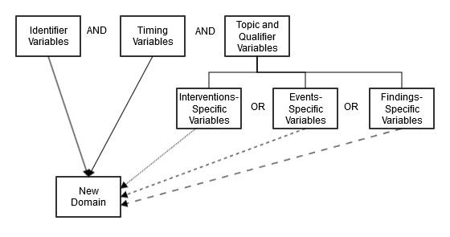

### 2.7 SDTM Variables Not Allowed in the SDTMIG

This section identifies those SDTM variables that either (1) should not be used in SDTM-compliant data tabulations of clinical trials data or (2) have not yet been evaluated for use in human clinical trials.

The following SDTM variables, defined for use in nonclinical studies (SEND), must NEVER be used in the submission of SDTM-based data for human clinical trials:

- --USCHFL (Interventions, Events, Findings)
- --METHOD (Interventions)
- --RSTIND (Interventions, Findings)
- --RSTMOD (Interventions, Findings)
- --IMPLBL (Findings)
- --RESLOC (Findings)
- --DTHREL (Findings)
- --EXCLFL (Findings)
- --REASEX (Findings)
- FETUSID (Identifiers)
- RPHASE (Timing Variables)
- RPPLDY (Timing Variables)
- RPPLSTDY (Timing Variables)
- RPPLENDY (Timing Variables)
- --NOMDY (Timing Variables)
- --NOMLBL (Timing Variables)
- --RPDY (Timing Variables)
- --RPSTDY (Timing Variables)
- --RPENDY (Timing Variables)
- --DETECT (Timing Variables)

The following variables can be used for nonclinical studies (SEND) but must NEVER be used in the Demographics (DM) domain for human clinical trials, where all subjects are human. See Section 9.2, Non-host Organism Identifiers, for information about representing taxonomic information for non-host organisms such as bacteria and viruses.

- SPECIES (Demographics)
- STRAIN (Demographics)
- SBSTRAIN (Demographics)
- RPATHCD (Demographics)

The following variables have not been evaluated for use in human clinical trials and must therefore be used with extreme caution:

- --ANTREG (Findings)
- --CHRON (Findings)
- --DISTR (Findings)
- SETCD (Demographics)

The use of SETCD additionally requires the use of the Trials Sets domain.

The following identifier variable can be used for nonclinical studies (SEND), and may be used in human clinical trials when appropriate:

- POOLID

The use of POOLID additionally requires the use of the Pool Definition dataset.

Other variables defined in the SDTM are allowed for use as defined in this SDTMIG except when explicitly stated. Custom domains, created following the guidance in Section 2.6, Creating a New Domain, may utilize any appropriate qualifier variables from the selected general observation class.

## 3 Submitting Data in Standard Format

### 3.1 Standard Metadata for Dataset Contents and Attributes

The SDTMIG provides standard descriptions of some of the most commonly used data domains, with metadata attributes. These include descriptive metadata attributes that should be included in a Define-XML document. In addition, the CDISC domain models include 2 shaded columns that are not sent to the FDA, but which assist sponsors in preparing their datasets:

- The CDISC Notes column provides information regarding the relevant use of each variable.
- The Core column indicates how a variable is classified (see Section 4.1.5, SDTM Core Designations).

The domain models in Section 6, Domain Models Based on the General Observation Classes, illustrate how to apply the SDTM when creating a specific domain dataset. In particular, these models illustrate the selection of a subset of the variables offered in 1 of the general observation classes, along with applicable timing variables. The models also show how a standard variable from a general observation class should be adjusted to meet the specific content needs of a particular domain, including making the label more meaningful, specifying controlled terminology, and creating domain-specific notes and examples. Thus, the domain models not only demonstrate how to apply the model for the most common domains but also give insight on how to apply general model concepts to other domains not yet defined by CDISC.

### 3.2 Using the CDISC Domain Models in Regulatory

Submissions – Dataset Metadata

The Define-XML document that accompanies a submission should also describe each dataset that is included in the submission and describe the natural key structure of each dataset. Most studies will include Demographics (DM) and a set of safety domains based on the 3 general observation classes—typically including Exposure (EX), Concomitant and Prior Medications (CM), Adverse Events (AE), Disposition (DS), Medical History (MH), Laboratory Test Results (LB), and Vital Signs (VS). However, choosing which data to submit will depend on the protocol and the needs of the regulatory review division or agency. Dataset definition metadata should include the dataset filenames, descriptions, locations, structures, class, purpose, and keys, as shown in Section 3.2.1, Dataset-level Metadata. In addition, comments can also be provided where needed.

#### 3.2.1 Dataset-level Metadata

Note that the key variables shown in this table are examples only. A sponsor’s actual key structure may be different. The order of classes and datasets in this table is not intended as a normative order of datasets in a submission.

| Dataset | Description                               | Class           | Structure                                                                                                                                        | Purpose    | Keys                                                                                                                      | Location    |
| ------- | ----------------------------------------- | --------------- | ------------------------------------------------------------------------------------------------------------------------------------------------ | ---------- | ------------------------------------------------------------------------------------------------------------------------- | ----------- |
| CO      | Comments                                  | Special Purpose | One record per comment per subject                                                                                                               | Tabulation | STUDYID, USUBJID, IDVAR, COREF, CODTC                                                                                     | co.xpt      |
| DM      | Demographics                              | Special Purpose | One record per subject                                                                                                                           | Tabulation | STUDYID, USUBJID                                                                                                          | dm.xpt      |
| SE      | Subject Elements                          | Special Purpose | One record per actual Element per subject                                                                                                        | Tabulation | STUDYID, USUBJID, ETCD, SESTDTC                                                                                           | se.xpt      |
| SM      | Subject Disease Milestones                | Special Purpose | One record per Disease Milestone per subject                                                                                                     | Tabulation | STUDYID, USUBJID, MIDS                                                                                                    | sm.xpt      |
| SV      | Subject Visits                            | Special Purpose | One record per actual or planned visit per subject                                                                                               | Tabulation | STUDYID, USUBJID, SVTERM                                                                                                  | sv.xpt      |
| AG      | Procedure Agents                          | Interventions   | One record per recorded intervention occurrence per subject                                                                                      | Tabulation | STUDYID, USUBJID, AGTRT, AGSTDTC                                                                                          | ag.xpt      |
| CM      | Concomitant/Prior Medications             | Interventions   | One record per recorded intervention occurrence or constant- dosing interval per subject                                                         | Tabulation | STUDYID, USUBJID, CMTRT, CMSTDTC                                                                                          | cm.xpt      |
| EC      | Exposure as Collected                     | Interventions   | One record per protocol-specified study treatment, collected-dosing interval, per subject, per mood                                              | Tabulation | STUDYID, USUBJID, ECTRT, ECSTDTC, ECMOOD                                                                                  | ec.xpt      |
| EX      | Exposure                                  | Interventions   | One record per protocol-specified study treatment, constant-dosing interval, per subject                                                         | Tabulation | STUDYID, USUBJID, EXTRT, EXSTDTC                                                                                          | ex.xpt      |
| ML      | Meal Data                                 | Interventions   | One record per food product occurrence or constant intake interval per subject                                                                   | Tabulation | STUDYID, USUBJID, MLTRT, MLSTDTC                                                                                          | ml.xpt      |
| PR      | Procedures                                | Interventions   | One record per recorded procedure per occurrence per subject                                                                                     | Tabulation | STUDYID, USUBJID, PRTRT, PRSTDTC                                                                                          | pr.xpt      |
| SU      | Substance Use                             | Interventions   | One record per substance type per reported occurrence per subject                                                                                | Tabulation | STUDYID, USUBJID, SUTRT, SUSTDTC                                                                                          | su.xpt      |
| AE      | Adverse Events                            | Events          | One record per adverse event per subject                                                                                                         | Tabulation | STUDYID, USUBJID, AEDECOD, AESTDTC                                                                                        | ae.xpt      |
| BE      | Biospecimen Events                        | Events          | One record per instance per biospecimen event per biospecimen identifier per subject                                                             | Tabulation | STUDYID, USUBJID, BEREFID, BETERM, BESDTC                                                                                 | be.xpt      |
| CE      | Clinical Events                           | Events          | One record per event per subject                                                                                                                 | Tabulation | STUDYID, USUBJID, CETERM, CESTDTC                                                                                         | ce.xpt      |
| DS      | Disposition                               | Events          | One record per disposition status or protocol milestone per subject                                                                              | Tabulation | STUDYID, USUBJID, DSDECOD, DSSTDTC                                                                                        | ds.xpt      |
| DV      | Protocol Deviations                       | Events          | One record per protocol deviation per subject                                                                                                    | Tabulation | STUDYID, USUBJID, DVTERM, DVSTDTC                                                                                         | dv.xpt      |
| HO      | Healthcare Encounters                     | Events          | One record per healthcare encounter per subject                                                                                                  | Tabulation | STUDYID, USUBJID, HOTERM, HOSTDTC                                                                                         | ho.xpt      |
| MH      | Medical History                           | Events          | One record per medical history event per subject                                                                                                 | Tabulation | STUDYID, USUBJID, MHDECOD                                                                                                 | mh.xpt      |
| BS      | Biospecimen Findings                      | Findings        | One record per measurement per biospecimen identifier per subject                                                                                | Tabulation | STUDYID, USUBJID, BSREFID, BSTESTCD                                                                                       | bs.xpt      |
| CP      | Cell Phenotype Findings                   | Findings        | One record per test per specimen per timepoint per visit per subject                                                                             | Tabulation | STUDYID, USUBJID, CPTESTCD, CPSPEC, VISITNUM, CPTPTREF, CPTPTNUM                                                          | cp.xpt      |
| CV      | Cardiovascular System Findings            | Findings        | One record per finding or result per time point per visit per subject                                                                            | Tabulation | STUDYID, USUBJID, VISITNUM, CVTESTCD, CVTPTREF, CVTPTNUM                                                                  | cv.xpt      |
| DA      | Product Accountability                    | Findings        | One record per product accountability finding per subject                                                                                        | Tabulation | STUDYID, USUBJID, DATESTCD, DADTC                                                                                         | da.xpt      |
| DD      | Death Details                             | Findings        | One record per finding per subject                                                                                                               | Tabulation | STUDYID, USUBJID, DDTESTCD, DDDTC                                                                                         | dd.xpt      |
| EG      | ECG Test Results                          | Findings        | One record per ECG observation per replicate per time point or one record per ECG observation per beat per visit per subject                     | Tabulation | STUDYID, USUBJID, EGTESTCD, VISITNUM, EGTPTREF, EGTPTNUM                                                                  | eg.xpt      |
| FT      | Functional Tests                          | Findings        | One record per Functional Test finding per time point per visit per subject                                                                      | Tabulation | STUDYID, USUBJID, TESTCD, VISITNUM, FTTPTREF, FTTPTNUM                                                                    | ft.xpt      |
| GF      | Genomics Findings                         | Findings        | One record per finding per observation per biospecimen per subject                                                                               | Tabulation | STUDYID, USUBJID, GFTESTCD, GFSPEC, VISITNUM, GFTPTREF, GFTPTNUM                                                          | gf.xpt      |
| IE      | Inclusion/Exclusion Criteria Not Met      | Findings        | One record per inclusion/exclusion criterion not met per subject                                                                                 | Tabulation | STUDYID, USUBJID, IETESTCD                                                                                                | ie.xpt      |
| IS      | Immunogenicity Specimen Assessments       | Findings        | One record per test per visit per subject                                                                                                        | Tabulation | STUDYID, USUBJID, ISTESTCD, ISBDAGNT, ISSCMBCL, ISTSTOPO, VISITNUM                                                        | is.xpt      |
| LB      | Laboratory Test Results                   | Findings        | One record per lab test per time point per visit per subject                                                                                     | Tabulation | STUDYID, USUBJID, LBTESTCD, LBSPEC, VISITNUM, LBTPTREF, LBTPTNUM                                                          | lb.xpt      |
| MB      | Microbiology Specimen                     | Findings        | One record per microbiology specimen finding per time point per visit per subject                                                                | Tabulation | STUDYID, USUBJID, MBTESTCD, VISITNUM, MBTPTREF, MBTPTNUM                                                                  | mb.xpt      |
| MI      | Microscopic Findings                      | Findings        | One record per finding per specimen per subject                                                                                                  | Tabulation | STUDYID, USUBJID, MISPEC, MITESTCD                                                                                        | mi.xpt      |
| MK      | Musculoskeletal System Findings           | Findings        | One record per assessment per visit per subject                                                                                                  | Tabulation | STUDYID, USUBJID, VISITNUM, MKTESTCD, MKLOC, MKLAT                                                                        | mk.xpt      |
| MS      | Microbiology Susceptibility               | Findings        | One record per microbiology susceptibility test (or other organism-related finding) per organism found in MB                                     | Tabulation | STUDYID, USUBJID, MSTESTCD, VISITNUM, MSTPTREF, MSTPTNUM                                                                  | ms.xpt      |
| NV      | Nervous System Findings                   | Findings        | One record per finding per location per time point per visit per subject                                                                         | Tabulation | STUDYID, USUBJID, VISITNUM, NVTPTNUM, NVLOC, NVTESTCD                                                                     | nv.xpt      |
| OE      | Ophthalmic Examinations                   | Findings        | One record per ophthalmic finding per method per location, per time point per visit per subject                                                  | Tabulation | STUDYID, USUBJID, FOCID, OETESTCD, OETSTDTL, OEMETHOD, OELOC, OELAT, OEDIR, VISITNUM, OEDTC, OETPTREF, OETPTNUM, OEREPNUM | oe.xpt      |
| PC      | Pharmacokinetics Concentrations           | Findings        | One record per sample characteristic or time-point concentration per reference time point or per analyte per subject                             | Tabulation | STUDYID, USUBJID, PCTESTCD, VISITNUM, PCTPTREF, PCTPTNUM                                                                  | pc.xpt      |
| PE      | Physical Examination                      | Findings        | One record per body system or abnormality per visit per subject                                                                                  | Tabulation | STUDYID, USUBJID, PETESTCD, VISITNUM                                                                                      | pe.xpt      |
| PP      | Pharmacokinetics Parameters               | Findings        | One record per PK parameter per time-concentration profile per modeling method per subject                                                       | Tabulation | STUDYID, USUBJID, PPTESTCD, PPCAT, VISITNUM, PPRFTDTC                                                                     | pp.xpt      |
| QS      | Questionnaires                            | Findings        | One record per questionnaire per question per time point per visit per subject                                                                   | Tabulation | STUDYID, USUBJID, QSCAT, QSSCAT, VISITNUM, QSTESTCD                                                                       | qs.xpt      |
| RE      | Respiratory System Findings               | Findings        | One record per finding or result per time point per visit per subject                                                                            | Tabulation | STUDYID, USUBJID, VISITNUM, RETESTCD, RETPTNUM, REREPNUM                                                                  | re.xpt      |
| RP      | Reproductive System Findings              | Findings        | One record per finding or result per time point per visit per subject                                                                            | Tabulation | STUDYID, DOMAIN, USUBJID, RPTESTCD, VISITNUM                                                                              | rp.xpt      |
| RS      | Disease Response and Clin Classification  | Findings        | One record per response assessment or clinical classification assessment per time point per visit per subject per assessor per medical evaluator | Tabulation | STUDYID, USUBJID, RSTESTCD, VISITNUM, RSTPTREF, RSTPTNUM, RSEVAL, RSEVALID                                                | rs.xpt      |
| SC      | Subject Characteristics                   | Findings        | One record per characteristic per visit per subject.                                                                                             | Tabulation | STUDYID, USUBJID, SCTESTCD, VISITNUM                                                                                      | sc.xpt      |
| SS      | Subject Status                            | Findings        | One record per status per visit per subject                                                                                                      | Tabulation | STUDYID, USUBJID, SSTESTCD, VISITNUM                                                                                      | ss.xpt      |
| TR      | Tumor/Lesion Results                      | Findings        | One record per tumor measurement/assessment per visit per subject per assessor                                                                   | Tabulation | STUDYID, USUBJID, TRTESTCD, TREVALID, VISITNUM                                                                            | tr.xpt      |
| TU      | Tumor/Lesion Identification               | Findings        | One record per identified tumor per subject per assessor                                                                                         | Tabulation | STUDYID, USUBJID, TUEVALID, TULNKID                                                                                       | tu.xpt      |
| UR      | Urinary System Findings                   | Findings        | One record per finding per location per per visit per subject                                                                                    | Tabulation | STUDYID, USUBJID, VISITNUM, URTESTCD, URLOC, URLAT, URDIR                                                                 | ur.xpt      |
| VS      | Vital Signs                               | Findings        | One record per vital sign measurement per time point per visit per subject                                                                       | Tabulation | STUDYID, USUBJID, VSTESTCD, VISITNUM, VSTPTREF, VSTPTNUM                                                                  | vs.xpt      |
| FA      | Findings About Events or Interventions    | Findings About  | One record per finding, per object, per time point, per visit per subject                                                                        | Tabulation | STUDYID, USUBJID, FATESTCD, FAOBJ, VISITNUM, FATPTREF, FATPTNUM                                                           | fa.xpt      |
| SR      | Skin Response                             | Findings About  | One record per finding, per object, per time point, per visit per subject                                                                        | Tabulation | STUDYID, USUBJID, SRTESTCD, SROBJ, VISITNUM, SRTPTREF, SRTPTNUM                                                           | sr.xpt      |
| TA      | Trial Arms                                | Trial Design    | One record per planned Element per Arm                                                                                                           | Tabulation | STUDYID, ARMCD, TAETORD                                                                                                   | ta.xpt      |
| TD      | Trial Disease Assessments                 | Trial Design    | One record per planned constant assessment period                                                                                                | Tabulation | STUDYID, TDORDER                                                                                                          | td.xpt      |
| TE      | Trial Elements                            | Trial Design    | One record per planned Element                                                                                                                   | Tabulation | STUDYID, ETCD                                                                                                             | te.xpt      |
| TI      | Trial Inclusion/Exclusion Criteria        | Trial Design    | One record per I/E criterion                                                                                                                     | Tabulation | STUDYID, IETESTCD                                                                                                         | ti.xpt      |
| TM      | Trial Disease Milestones                  | Trial Design    | One record per Disease Milestone type                                                                                                            | Tabulation | STUDYID, MIDSTYPE                                                                                                         | tm.xpt      |
| TS      | Trial Summary                             | Trial Design    | One record per trial summary parameter value                                                                                                     | Tabulation | STUDYID, TSPARMCD, TSSEQ                                                                                                  | ts.xpt      |
| TV      | Trial Visits                              | Trial Design    | One record per planned Visit per Arm                                                                                                             | Tabulation | STUDYID, ARM, VISIT                                                                                                       | tv.xpt      |
| RELREC  | Related Records                           | Relationship    | One record per related record, group of records or dataset                                                                                       | Tabulation | STUDYID, RDOMAIN, USUBJID, IDVAR, IDVARVAL, RELID                                                                         | relrec.xpt  |
| RELSPEC | Related Specimens                         | Relationship    | One record per specimen identifier per subject                                                                                                   | Tabulation | STUDYID, USUBJID, REFID                                                                                                   | relspec.xpt |
| RELSUB  | Related Subjects                          | Relationship    | One record per relationship per related subject per subject                                                                                      | Tabulation | STUDYID, USUBJID, RSUBJID, SREL                                                                                           | relsub.xpt  |
| SUPP--  | Supplemental Qualifiers for [domain name] | Relationship    | One record per supplemental qualifier per related parent domain record(s)                                                                        | Tabulation | STUDYID, RDOMAIN, USUBJID, IDVAR, IDVARVAL, QNAM                                                                          | supp--.xpt  |
| OI      | Non-host Organism Identifiers             | Study Reference | One record per taxon per non-host organism                                                                                                       | Tabulation | NHOID, OISEQ                                                                                                              | oi.xpt      |

Separate Supplemental Qualifier datasets of the form supp--.xpt are required. See Section 8.4, Relating Non- standard Variable Values to a Parent Domain.

##### 3.2.1.1 Primary Keys

The table in Section 3.2.1, Dataset-level Metadata, shows examples of what a sponsor might submit as variables that comprise the primary key for SDTM datasets. Because the purpose of the Keys column is to aid reviewers in understanding the structure of a dataset, sponsors should list all of the natural keys for the dataset. These keys should define uniqueness for records within a dataset, and may define a record sort order. The identified keys for each dataset should be consistent with the description of the dataset structure as described in the Define-XML document. For all the general observation-class domains (and for some special-purpose domains), the --SEQ variable was created so that a unique record could be identified consistently across all of these domains via its use, along with STUDYID, USUBJID, and DOMAIN. In most domains, --SEQ will be a surrogate key for a set of variables that comprise the natural key. In certain instances, a supplemental qualifier (SUPP--) variable might also contribute to the natural key of a record for a particular domain. See Section 4.1.9, Assigning Natural Keys in the Metadata, for how this should be represented, and for additional information on keys.

Definitions

A natural key is a set of data (1 or more columns of an entity) that uniquely identifies that entity and distinguishes it from any other row in the table. The advantage of natural keys is that they exist already; one does not need to introduce a new, “unnatural” value to the data schema. One of the difficulties in choosing a natural key is that just about any natural key one can think of has the potential to change. Because they have business meaning, natural keys are effectively coupled to the business, and they may need to be reworked when business requirements change. An example of such a change in clinical trials data would be the addition of a position or location that becomes a key in a new study, but which was not collected in previous studies.

A surrogate key is a single-part, artificially established identifier for a record. Surrogate key assignment is a special case of derived data, one where a portion of the primary key is derived. A surrogate key is immune to changes in business needs. In addition, the key depends on only 1 field, so it is compact. A common way of deriving surrogate key values is to assign integer values sequentially. The --SEQ variable in the SDTM datasets is an example of a surrogate key for most datasets; in some instances, however, --SEQ might be a part of a natural key as a replacement for what might have been a key (e.g., a repeat sequence number) in the sponsor's database.

##### 3.2.1.2 CDISC Submission Value-level Metadata

In general, findings data models are closely related to normalized, relational data models in a vertical structure of 1 record per observation. Because general observation class data structures are fixed, sometimes information that might appear as columns in a more horizontal (denormalized) structure in presentations and reports will instead be represented as rows in an SDTM Findings structure. Because many different types of observations are all presented in the same structure, there is a need to provide additional metadata to describe expected properties that differentiate (e.g., hematology lab results from serum chemistry lab results in terms of data type, standard units, and other attributes).

For example, the Vital Signs (VS) data domain could contain subject records related to diastolic and systolic blood pressure, height, weight, and body mass index (BMI). These data are all submitted in the normalized SDTM Findings structure of 1 row per vital signs measurement. This means that there could be 5 records per subject (1 for each test or measurement) for a single visit or time point, with the parameter names stored in the Test Code/Name variables, and the parameter values stored in result variables. Because the unique test code/names could have different attributes (e.g., different origins, roles, definitions) there would be a need to provide value-level metadata for this information.

The value-level metadata should be provided as a separate section of the Define-XML document. For details on the CDISC Define-XML standard, see https://www.cdisc.org/standards/data-exchange/define-xml.

#### 3.2.2 Conformance

Conformance with the SDTMIG domain models is minimally indicated by:

- Following the complete metadata structure for data domains
- Following SDTMIG domain models wherever applicable
- Using SDTM-specified standard domain names and prefixes where applicable
- Using SDTM-specified standard variable names
- Using SDTM-specified data types for all variables
- Following SDTM-specified controlled terminology and format guidelines for variables, when provided
- Including all collected and relevant derived data in one of the standard domains, special-purpose datasets, or general observation class structures
- Including all Required and Expected variables as columns in standard domains, and ensuring that all Required variables are populated
- Ensuring that each record in a dataset includes the appropriate Identifier and Timing variables, as well as a Topic variable
- Conforming to all business rules described in the CDISC Notes column and general and domain-specific assumptions

## 4 Assumptions for Domain Models

### 4.1 General Domain Assumptions

#### 4.1.1 Review Study Data Tabulation Model and Implementation Guide

Review the SDTM as well as this complete implementation guide before attempting to use any of the individual domain models.

#### 4.1.2 Relationship to Analysis Datasets

Specific guidance on preparing analysis datasets can be found in the CDISC Analysis Data Model (ADaM) Implementation Guide and other ADaM documents, available at https://www.cdisc.org/standards/foundational/adam.

#### 4.1.3 Additional Timing Variables

Additional Timing variables can be added as needed to a standard domain model based on the 3 general observation classes, except for the cases specified in Assumption 4.4.8, Date and Time Reported in a Domain Based on Findings. Timing variables can be added to special-purpose domains only where specified in the SDTMIG domain model assumptions. Timing variables cannot be added to SUPPQUAL datasets or to RELREC (described in Section 8, Representing Relationships and Data).

##### 4.1.3.1 EPOCH Variable Guidance

When EPOCH is included in a Findings class domain, it should be based on the --DTC variable, since this is the date/time of the test or, for tests performed on specimens, the date/time of specimen collection. For observations in Interventions or Events class domains, EPOCH should be based on the --STDTC variable, since this is the start of the intervention or event. A possible, though unlikely, exception would be a finding based on an interval specimen collection that started in one epoch but ended in another. --ENDTC might be a more appropriate basis for EPOCH in such a case.

Sponsors should not impute EPOCH values, but should, where possible, assign EPOCH values on the basis of CRF instructions and structure, even if EPOCH was not directly collected and date/time data was not collected with sufficient precision to permit assignment of an observation to an EPOCH on the basis of date/time data alone. If it is not possible to determine the epoch of an observation, then EPOCH should be null. Methods for assigning EPOCH values can be described in the Define-XML document.

Because EPOCH is a study-design construct, it is not applicable to interventions or events that started before the subject's participation in a study, nor to findings performed before participation in a study. For such records, EPOCH should be null. Note that a subject's participation in a study includes screening, which generally occurs before the reference start date (RFSTDTC) in the Demographics (DM) domain.

#### 4.1.4 Order of the Variables

The order of variables in the Define-XML document must reflect the order of variables in the dataset. The order of variables in CDISC domain models has been chosen to facilitate the review of the models and application of the models. Variables for the 3 general observation classes must be ordered with Identifiers variables first, followed by Topic, Qualifier, and Timing variables. Within each role, variables must be ordered as shown in SDTM Sections 3.1.1, The Interventions Observation Class; 3.1.2, The Events Observation Class; 3.1.3, The Findings Observation Class; 3.1.3.1, Findings About Events or Interventions; 3.1.4, Identifiers for All Classes; and 3.1.5, Timing Variables for All Classes.

#### 4.1.5 SDTM Core Designations

Three categories are specified in the Core column in the domain models:

- A Required variable is any variable that is basic to the identification of a data record (i.e., essential key variables and a topic variable) or is necessary to make the record meaningful. Required variables must always be included in the dataset and cannot be null for any record.
- An Expected variable is any variable necessary to make a record useful in the context of a specific domain. Expected variables may contain some null values, but in most cases will not contain null values for every record. When the study does not include the data item for an expected variable, however, a null column must still be included in the dataset, and a comment must be included in the Define-XML document to state that the study does not include the data item.
- A Permissible variable should be used in an SDTM dataset wherever appropriate. Although domain specification tables list only some of the identifier, timing, and general observation class variables listed in the SDTM, all are permissible unless specifically restricted in this implementation guide (see Section 2.7, SDTM Variables Not Allowed in the SDTMIG) or by specific domain assumptions.

  - Domain assumptions that say a Permissible variable is "generally not used" do not prohibit use of the variable.
  - If a study includes a data item that would be represented in a Permissible variable, then that variable must be included in the SDTM dataset, even if null. Indicate no data were available for that variable in the Define-XML document.
  - If a study did not include a data item that would be represented in a Permissible variable, then that variable should not be included in the SDTM dataset and should not be declared in the Define-XML document.

#### 4.1.6 Additional Guidance on Dataset Naming

SDTM datasets are normally named to be consistent with the domain code; for example, the Demographics dataset (DM) is named dm.xpt. (See the SDTM Domain Abbreviation codelist, C66734, in CDISC Controlled Terminology (https://www.cancer.gov/research/resources/terminology/cdisc) for standard domain codes). Exceptions to this rule are described in Section 4.1.7, Splitting Domains, for general observation class datasets and in Section 8, Representing Relationships and Data, for RELREC and SUPP-- datasets.

In some cases, sponsors may need to define new custom domains and may be concerned that CDISC domain codes defined in the future will conflict with those they choose to use. To eliminate any risk of a sponsor using a name that CDISC later determines to have a different meaning, domain codes beginning with the letters X, Y, and Z have been reserved for the creation of custom domains. Any letter or number may be used in the second position. Note the use of codes beginning with X, Y, or Z is optional, and not required for custom domains.

#### 4.1.7 Splitting Domains

Sponsors may choose to split a domain of topically related information into physically separate datasets.

- A domain based on a general observation class may be split according to values in --CAT. When a domain is split on --CAT, --CAT must not be null.
- The Findings About (FA) domain (see Section 6.4.4, Findings About Events or Interventions) may alternatively be split based on the domain of the value in --OBJ. For example, FACM would store findings about Concomitant/Prior Medications (CM) records. See Section 6.4.2, Naming Findings About Domains, for more details.

The following rules must be adhered to when splitting a domain into separate datasets to ensure they can be appended back into 1 domain dataset:

1. The value of DOMAIN must be consistent across the separate datasets as it would have been if they had not been split (e.g., QS, FA).
2. All variables that require a domain prefix (e.g., --TESTCD, --LOC) must use the value of DOMAIN as the prefix value (e.g., QS, FA).
3. --SEQ must be unique within USUBJID for all records across all the split datasets. If there are 1000 records

for a USUBJID across the separate datasets, all 1000 records need unique values for --SEQ.

4. When relationship datasets (e.g., SUPPxx, FAxx, CO, RELREC) relate back to split parent domains,

IDVAR would generally be --SEQ. When IDVAR is a value other than --SEQ (e.g., --GRPID, --REFID, -- SPID), care should be used to ensure that the parent records across the split datasets have unique values for the variable specified in IDVAR, so that related children records do not accidentally join back to incorrect parent records.

5. Permissible variables included in one split dataset need not be included in all split datasets.
6. For domains with 2-letter domain codes (i.e., other than SUPPxx and RELREC), split dataset names can be

up to 4 characters in length. For example, if splitting by --CAT, dataset names would be the domain name plus up to 2 additional characters (e.g., QS36 for SF-36). If splitting Findings About by parent domain, then the dataset name would be the domain code, "FA", plus the 2-character domain code for parent domain code (e.g., "FACM"). The 4-character dataset-name limitation allows the use of a Supplemental Qualifier dataset associated with the split dataset.

7. Supplemental Qualifier datasets for split domains would also be split. The nomenclature would include the

additional 1 to 2 characters used to identify the split dataset (e.g., SUPPQS36, SUPPFACM). The value of RDOMAIN in the SUPP-- datasets would be the 2-character domain code (e.g., QS, FA).

8. In RELREC, if a dataset-level relationship is defined for a split Findings About domain, then RDOMAIN

may contain the 4-character dataset name, rather than the domain name "FA", as shown in the following example.

relrec.xpt

| Row | STUDYID | RDOMAIN | USUBJID | IDVAR  | IDVARVAL | RELTYPE | RELID |
| --- | ------- | ------- | ------- | ------ | -------- | ------- | ----- |
| 1   | ABC     | CM      |         | CMSPID |          | ONE     | 1     |
| 2   | ABC     | FACM    |         | FASPID |          | MANY    | 1     |

9. See the SDTM Implementation Guide: Associated Persons

(https://www.cdisc.org/standards/foundational/sdtmig/) for the naming of split AP datasets.

10. See the SDTM Define-XML specification (https://www.cdisc.org/standards/data-exchange/define-xml) for

details regarding metadata representation when a domain is split into different datasets. For additional examples, see the Metadata Submission Guideline (MSG) for SDTMIG (https://www.cdisc.org/standards/foundational/sdtmig/).

Note that submission of split SDTM domains may be subject to additional dataset-splitting conventions as defined by regulators via technical specifications and/or as negotiated with regulatory reviewers.

##### 4.1.7.1 Example of Splitting Questionnaires

QRS datasets are routinely created and reviewed for the individual QRS instrument. This example shows the QS domain data split into 3 datasets: Clinical Global Impression (QSCG), Pain Intensity (QSPI), and Satisfaction of Life Scale (QSSW). Each dataset represents a subset of the QS domain data and has only 1 value of QSCAT.

QS Domains

Dataset for Clinical Global Impressions qscg.xpt

| Row | STUDYID | DOMAIN | USUBJID        | QSSEQ | QSTESTCD | QSTEST            | QSCAT | QSORRES            | QSSTRESC | QSSTRESN | QSLOBXFL | VISITNUM | VISIT  | VISITDY | QSDTC      | QSDY |
| --- | ------- | ------ | -------------- | ----- | -------- | ----------------- | ----- | ------------------ | -------- | -------- | -------- | -------- | ------ | ------- | ---------- | ---- |
| 1   | CDISC01 | QS     | CDISC01.100008 | 1     | CGI0201  | CGI02-Severity    | CGI   | Moderate           | 4        | 4        | Y        | 1        | WEEK 1 | 1       | 2003-04-15 | 1    |
| 2   | CDISC01 | QS     | CDISC01.100008 | 2     | CGI0201  | CGI02-Severity    | CGI   | Mild               | 3        | 3        |          | 2        | WEEK 2 | 7       | 2003-04-21 | 7    |
| 3   | CDISC01 | QS     | CDISC01.100008 | 3     | CGI0202  | CGI02-Change      | CGI   | Minimally Improved | 3        | 3        |          | 2        | WEEK 2 | 7       | 2003-04-21 | 7    |
| 4   | CDISC01 | QS     | CDISC01.100008 | 4     | CGI0203  | CGI02-Improvement | CGI   | A little better    | 3        | 3        |          | 2        | WEEK 2 | 7       | 2003-04-21 | 7    |
| 5   | CDISC01 | QS     | CDISC01.100014 | 1     | CGI0201  | CGI02-Severity    | CGI   | Moderate           | 4        | 4        | Y        | 1        | WEEK 1 | 1       | 2003-04-15 | 1    |
| 6   | CDISC01 | QS     | CDISC01.100014 | 2     | CGI0201  | CGI02-Severity    | CGI   | Mild               | 3        | 3        |          | 2        | WEEK 2 | 7       | 2003-04-21 | 7    |
| 7   | CDISC01 | QS     | CDISC01.100014 | 3     | CGI0202  | CGI02-Change      | CGI   | Minimally Improved | 3        | 3        |          | 2        | WEEK 2 | 7       | 2003-04-21 | 7    |
| 8   | CDISC01 | QS     | CDISC01.100014 | 4     | CGI0203  | CGI02-Improvement | CGI   | A little better    | 3        | 3        |          | 2        | WEEK 2 | 7       | 2003-04-21 | 7    |

Dataset for Pain Intensity qspi.xpt

| Row | STUDYID | DOMAIN | USUBJID        | QSSEQ | QSTESTCD Q   | STEST Q           | SCAT | QSSCAT       | QSORRES               | QSORRESU | QSSTRESC | QSSTRESN | QSSTRESU | QSLOC | QSMETHOD                     | QSLOBXFL V | ISITNUM | QSDTC       | QSDY Q | SEVLINT |
| --- | ------- | ------ | -------------- | ----- | ------------ | ----------------- | ---- | ------------ | --------------------- | -------- | -------- | -------- | -------- | ----- | ---------------------------- | ---------- | ------- | ----------- | ------ | ------- |
| 1   | CDISC01 | QS     | CDISC01.100008 | 1     | PI0101 PI In | 01-Pain P tensity | I    | FIBROMYALGIA | WORST PAIN IMAGINABLE |          | 100      | 100      |          | BACK  | VISUAL ANALOG SCALE (100 MM) | Y 1        |         | 2003-04- 15 | 1 -    | PT24H   |
| 2   | CDISC01 | QS     | CDISC01.100008 | 2     | PI0101 PI In | 01-Pain P tensity | I    | FIBROMYALGIA | 50                    | mm       | 50       | 50       | mm       | BACK  | VISUAL ANALOG SCALE (100 MM) | 2          |         | 2003-04- 21 | 7 -    | PT24H   |
| 3   | CDISC01 | QS     | CDISC01.100008 | 3     | PI0101 PI In | 01-Pain P tensity | I    | FIBROMYALGIA | 60                    | mm       | 60       | 60       | mm       | BACK  | VISUAL ANALOG SCALE (100 MM) | 3          |         | 2003-04- 28 | 14 -   | PT24H   |
| 4   | CDISC01 | QS     | CDISC01.100014 | 4     | PI0101 PI In | 01-Pain P tensity | I    | FIBROMYALGIA | WORST PAIN IMAGINABLE |          | 100      | 100      |          | BACK  | VISUAL ANALOG SCALE (100 MM) | Y 1        |         | 2003-04- 15 | 1 -    | PT24H   |
| 5   | CDISC01 | QS     | CDISC01.100014 | 5     | PI0101 PI In | 01-Pain P tensity | I    | FIBROMYALGIA | 50                    | mm       | 50       | 50       | mm       | BACK  | VISUAL ANALOG SCALE (100 MM) | 2          |         | 2003-04- 21 | 7 -    | PT24H   |
| 6   | CDISC01 | QS     | CDISC01.100014 | 6     | PI0101 PI In | 01-Pain P tensity | I    | FIBROMYALGIA | 60                    | mm       | 60       | 60       | mm       | BACK  | VISUAL ANALOG SCALE (100 MM) | 3          |         | 2003-04- 28 | 14 -   | PT24H   |

Dataset for Satisfaction of Life Scale qssw.xpt

| Row | STUDYID | DOMAIN | USUBJID        | QSSEQ | QSTESTCD | QSTEST                                  | QSCAT | QSORRES                    | QSSTRESC | QSSTRESN | QSLOBXFL | VISITNUM | QSDTC      | QSDY |
| --- | ------- | ------ | -------------- | ----- | -------- | --------------------------------------- | ----- | -------------------------- | -------- | -------- | -------- | -------- | ---------- | ---- |
| 1   | CDISC01 | QS     | CDISC01.100008 | 1     | SWLS0101 | SWLS01-My Life is Close to Ideal        | SWLS  | Slightly agree             | 5        | 5        | Y        | 1        | 2003-04-15 | 1    |
| 2   | CDISC01 | QS     | CDISC01.100008 | 2     | SWLS0102 | SWLS01-My Life Conditions are Excellent | SWLS  | Neither agree nor disagree | 4        | 4        | Y        | 1        | 2003-04-15 | 1    |
| 3   | CDISC01 | QS     | CDISC01.100008 | 3     | SWLS0103 | SWLS01-I Am Satisfied with My Life      | SWLS  | Agree                      | 6        | 6        | Y        | 1        | 2003-04-15 | 1    |
| 4   | CDISC01 | QS     | CDISC01.100008 | 4     | SWLS0104 | SWLS01-Have Gotten Important Things     | SWLS  | Disagree                   | 2        | 2        | Y        | 1        | 2003-04-15 | 1    |
| 5   | CDISC01 | QS     | CDISC01.100008 | 5     | SWLS0105 | SWLS01-Live Life Over Change Nothing    | SWLS  | Strongly disagree          | 1        | 1        | Y        | 1        | 2003-04-15 | 1    |
| 6   | CDISC01 | QS     | CDISC01.100014 | 6     | SWLS0101 | SWLS01-My Life is Close to Ideal        | SWLS  | Slightly agree             | 5        | 5        | Y        | 1        | 2003-04-15 | 1    |
| 7   | CDISC01 | QS     | CDISC01.100014 | 7     | SWLS0102 | SWLS01-My Life Conditions are Excellent | SWLS  | Neither agree nor disagree | 4        | 4        | Y        | 1        | 2003-04-15 | 1    |
| 8   | CDISC01 | QS     | CDISC01.100014 | 8     | SWLS0103 | SWLS01-I Am Satisfied with My Life      | SWLS  | Agree                      | 6        | 6        | Y        | 1        | 2003-04-15 | 1    |
| 9   | CDISC01 | QS     | CDISC01.100014 | 9     | SWLS0104 | SWLS01-Have Gotten Important Things     | SWLS  | Disagree                   | 2        | 2        | Y        | 1        | 2003-04-15 | 1    |
| 10  | CDISC01 | QS     | CDISC01.100014 | 10    | SWLS0105 | SWLS01-Live Life Over Change Nothing    | SWLS  | Strongly disagree          | 1        | 1        | Y        | 1        | 2003-04-15 | 1    |

SUPPQS Domains

Supplemental Qualifiers for QSCG suppqscg.xpt

| Row | STUDYID | RDOMAIN | USUBJID        | IDVAR | IDVARVA | L QNAM | QLABEL                 | QVAL   | QORIG | QEVA |
| --- | ------- | ------- | -------------- | ----- | ------- | ------ | ---------------------- | ------ | ----- | ---- |
| 1   | CDISC01 | QS      | CDISC01.100008 | QSCAT | CGI     | QSLANG | Questionnaire Language | GERMAN | CRF   |      |
| 2   | CDISC01 | QS      | CDISC01.100014 | QSCAT | CGI     | QSLANG | Questionnaire Language | FRENCH | CRF   |      |

Supplemental Qualifiers for QSPI suppqspi.xpt

| Row | STUDYID | RDOMAIN | USUBJID        | IDVAR    | IDVARVAL | QNAM     | QLABEL                 | QVAL                  | QORIG | QEVAL |
| --- | ------- | ------- | -------------- | -------- | -------- | -------- | ---------------------- | --------------------- | ----- | ----- |
| 1   | CDISC01 | QS      | CDISC01.100008 | QSTESTCD | PI0101   | QSANTXLO | Anchor Text Low        | NO PAIN               | CRF   |       |
| 2   | CDISC01 | QS      | CDISC01.100008 | QSTESTCD | PI0101   | QSANTXHI | Anchor Text High       | WORST PAIN IMAGINABLE | CRF   |       |
| 3   | CDISC01 | QS      | CDISC01.100008 | QSTESTCD | PI0101   | QSANVLLO | Anchor Value Low       | 0                     | CRF   |       |
| 4   | CDISC01 | QS      | CDISC01.100008 | QSTESTCD | PI0101   | QSANVLHI | Anchor Value High      | 100                   | CRF   |       |
| 5   | CDISC01 | QS      | CDISC01.100008 | QSCAT    | PI       | QSLANG   | Questionnaire Language | GERMAN                | CRF   |       |
| 6   | CDISC01 | QS      | CDISC01.100014 | QSTESTCD | PI0101   | QSANTXLO | Anchor Text Low        | NO PAIN               | CRF   |       |
| 7   | CDISC01 | QS      | CDISC01.100014 | QSTESTCD | PI0101   | QSANTXHI | Anchor Text High       | WORST PAIN IMAGINABLE | CRF   |       |
| 8   | CDISC01 | QS      | CDISC01.100014 | QSTESTCD | PI0101   | QSANVLLO | Anchor Value Low       | 0                     | CRF   |       |
| 9   | CDISC01 | QS      | CDISC01.100014 | QSTESTCD | PI0101   | QSANVLHI | Anchor Value High      | 100                   | CRF   |       |
| 10  | CDISC01 | QS      | CDISC01.100014 | QSCAT    | PI       | QSLANG   | Questionnaire Language | FRENCH                | CRF   |       |

Supplemental Qualifiers for QSSW suppqssw.xpt

| Row | STUDYID | RDOMAIN | USUBJID        | IDVAR | IDVARVAL | QNAM   | QLABEL                 | QVAL   | QORIG | QEVAL |
| --- | ------- | ------- | -------------- | ----- | -------- | ------ | ---------------------- | ------ | ----- | ----- |
| 1   | CDISC01 | QS      | CDISC01.100008 | QSCAT | SWLS     | QSLANG | Questionnaire Language | GERMAN | CRF   |       |
| 2   | CDISC01 | QS      | CDISC01.100014 | QSCAT | SWLS     | QSLANG | Questionnaire Language | FRENCH | CRF   |       |

#### 4.1.8 Origin Metadata

##### 4.1.8.1 Origin Metadata for Variables

The origin element in the Define-XML document file is used to indicate where the data originated. Its purpose is to unambiguously communicate to the reviewer the origin of the data source. For example, data could be collected (on the CRF, from a vendor, or from a device), derived, or assigned; CRF data should be traceable to an annotated CRF and derived data should be traceable to some derivation algorithm. The Define-XML specification is the definitive source of allowable origin values. Additional guidance and supporting examples can be referenced using the Metadata Submission Guidelines (MSG) for SDTMIG.

##### 4.1.8.2 Origin Metadata for Records

Sponsors are cautioned to recognize that a derived origin means that all values for that variable were derived, and that collected on the CRF applies to all values as well. In some cases, both collected and derived values may be reported in the same field. For example, some records in a Findings dataset such as Questionnaires (QS) contain values collected from the CRF; other records may contain derived values, such as a total score. When both derived and collected values are reported in a variable, the origin is to be described using value-level metadata in the Define- XML document.

#### 4.1.9 Assigning Natural Keys in the Metadata

Section 3.2, Using the CDISC Domain Models in Regulatory Submissions – Dataset Metadata, indicates that a sponsor should include in the metadata the variables that contribute to the natural key for a domain. In a case where a dataset includes a mix of records with different natural keys, the natural key that provides the most granularity is the one that should be provided. The following example illustrates how to do this, and include a case where a Supplemental Qualifier variable is referenced because it forms part of the natural key.

Musculoskeletal System Findings (MK) Domain Example

Sponsor A chooses the following natural key for the MK domain:

STUDYID, USUBJID, VISTNUM, MKTESTCD

Sponsor B collects data in such a way that the location (MKLOC and MKLAT) and method (MKMETHOD) variables need to be included in the natural key to identify a unique row. Sponsor B then defines the following natural key for the MK domain.

STUDYID, USUBJID, VISITNUM, MKTESTCD, MKLOC, MKLAT, MKMETHOD

In certain instances a Supplemental Qualifier variable (i.e., a QNAM value; see Section 8.4, Relating Non-standard Variable Values to a Parent Domain) might also contribute to the natural key of a record, and therefore needs to be referenced as part of the natural key for a domain. The important concept here is that a domain is not limited by physical structure. A domain may comprise more than 1 physical dataset (e.g., the main domain dataset and its associated Supplemental Qualifiers dataset). Supplemental Qualifier variables should be referenced in the natural key by using a 2-part name. The word QNAM must be used as the first part of the name to indicate that the contributing variable exists in a domain-specific SUPP--; the second part is the value of QNAM that ultimately becomes a column reference when the SUPPQUAL records are joined on to the main domain dataset (e.g., QNAM.XVAR when the SUPP-- record has a QNAM of "XVAR") .

In this example, sponsor B might have collected data that used different imaging methods, using imaging devices with different makes and models, and using different hand positions. The sponsor considers the make and model information and hand position to be essential data that contributes to the uniqueness of the test result, and so includes a device identifier (SPDEVID) in the data and creates a Supplemental Qualifier variable for hand position (QNAM = "MKHNDPOS"). The natural key is then defined as follows:

STUDYID, USUBJID, SPDEVID, VISITNUM, MKTESTCD, MKLOC, MKLAT, MKMETHOD,

QNAM.MKHNDPOS

where the notation "QNAM.MKHNDPOS" means the Supplemental Qualifier whose QNAM is "MKHNDPOS".This approach becomes very useful in a Findings domain when --TESTCD values are "generic" and rely on other variables to completely describe the test. The use of generic test codes helps to create distinct lists of manageable controlled terminology for --TESTCD. In studies where multiple repetitive tests or measurements are being made, for example in a rheumatoid arthritis study where repetitive measurements of bone erosion in the hands and wrists might be made using both X-ray and MRI equipment, the generic MKTEST "Sharp/Genant Bone Erosion Score" would be used in combination with other variables to fully identify the result.

Taking just the phalanges, a sponsor might want to express the following in a test in order to make it unique:

- Left or right hand
- Phalangeal joint position (which finger, which joint)
- Rotation of the hand
- Method of measurement (x-ray or MRI)
- Machine make and model

When CDISC Controlled Terminology for a test is not available, and a sponsor creates --TEST and --TESTCD values, trying to encapsulate all information about a test within a unique value of a --TESTCD is not a recommended approach for the following reasons:

- It results in the creation of a potentially large number of test codes.
- The 8-character values of --TESTCD become less intuitively meaningful.
- Multiple test codes are essentially representing the same test or measurement simply to accommodate attributes of a test within the --TESTCD value itself (e.g., to represent a body location at which a measurement was taken).

As a result, the preferred approach would be to use a generic (or simple) test code that requires associated qualifier variables to fully express the test detail. This approach was used in creating the CDISC Controlled Terminology used in this example:

The MKTESTCD value "SGBESCR" is a generic test code, and additional information about the test is provided by separate qualifier variables. The variables that completely specify a test may include domain variables and supplemental qualifier variables. Expressing the natural key becomes very important in this situation in order to communicate the variables that contribute to the uniqueness of a test.

The following variables would be used to fully describe the test. The natural key for this domain includes both parent dataset variables and a supplemental qualifier variable that contribute to the natural key of each row and to describe the uniqueness of the test.

| SPDEVID  | MKTESTCD | MKTEST                          | MKLOC                       | MKLAT | MKMETHOD | QNAM.MKHNDPOS |
| -------- | -------- | ------------------------------- | --------------------------- | ----- | -------- | ------------- |
| ACME3000 | SGBESCR  | Sharp/Genant Bone Erosion Score | METACARPOPHALANGEAL JOINT 1 | LEFT  | X-RAY    | PALM UP       |

### 4.2 General Variable Assumptions

#### 4.2.1 Variable-naming Conventions

SDTM variables are named according to a set of conventions, using fragment names (see Appendix D, CDISC Variable-naming Fragments). Variables with names ending in "CD" are "short" versions of associated variables that do not include the "CD" suffix (e.g., --TESTCD is the short version of --TEST).

Values of --TESTCD must be limited to 8 characters and cannot start with a number, nor can they contain characters other than letters, numbers, or underscores. This is to avoid possible incompatibility with SAS v5 transport files. This limitation will be in effect until the use of other formats (e.g., Dataset-XML) becomes acceptable to regulatory authorities.

Because QNAM serves the same purpose as --TESTCD within supplemental qualifier datasets, values of QNAM are subject to the same restrictions as values of --TESTCD.

Values of other "CD" variables are not subject to the same restrictions as --TESTCD:

- ETCD (the companion to ELEMENT) and TSPARMCD (the companion to TSPARM) are limited to 8 characters and do not have the character restrictions that apply to --TESTCD. These values should be short for ease of use in programming, but it is not expected that they will need to serve as variable names.
- ARMCD is limited to 20 characters and does not have the character restrictions that apply to --TESTCD. The maximum length of ARMCD is longer than for other "short" variables to accommodate the kind of values that are likely to be needed for crossover trials. For example, if ARMCD values for a 7-period crossover were constructed using 2-character abbreviations for each treatment and separating hyphens, the length of ARMCD values would be 20. This same rule applies to the ACTARMCD variable.

Variable descriptive names (labels), up to 40 characters, should be provided as data variable labels for all variables, including Supplemental Qualifier variables.

Use of variable names (other than domain prefixes), formats, decodes, terminology, and data types for the same type of data (even for custom domains and Supplemental Qualifiers) should be consistent within and across studies within a submission.

#### 4.2.2 Two-character Domain Identifier

In order to minimize the risk of difficulty when merging/joining domains for reporting purposes, the 2-character domain identifier is used as a prefix in most variable names.

Variables in domain specification tables (see Section 5, Models for Special-purpose Domains; Section 6, Domain Models Based on the General Observation Classes; Section 7, Trial Design Model Datasets; Section 8, Representing Relationships and Data; and Section 9, Study References) already specify the complete variable names. When adding variables from the SDTM to standard domains or creating custom domains based on the general observation classes, sponsors must replace the "--" prefix in the SDTM tables of General Observation Class, Timing, and Identifier variables with the 2-character domain identifier (DOMAIN) value for that domain/dataset. The 2-character domain code is limited to A-Z for the first character, and A-Z, 0-9 for the second character. No other characters are allowed. This is for compatibility with SAS v5 transport files and with file naming requirements as part of the Electronic Common Technical Document (eCTD).

The following variables are exceptions to the philosophy that all variable names are prefixed with the domain identifier:

- Required Identifiers (STUDYID, DOMAIN, USUBJID)
- Commonly used grouping and merge keys (e.g., VISIT, VISITNUM, VISITDY)
- All Demographics (DM) domain variables other than DMDTC and DMDY
- All variables in RELREC and SUPPQUAL, and some variables in the Comments and Trial Design datasets

Required identifiers are not prefixed because they are usually used as keys when merging/joining observations. The
--SEQ and the optional Identifiers --GRPID and --REFID are prefixed because they may be used as keys when relating observations across domains.

#### 4.2.3 Use of "Subject" and USUBJID

"Subject" is used to generically refer to both patients and healthy volunteers in order to be consistent with the recommendation in FDA guidance. The term "subject" should be used consistently in all labels and Define-XML document comments. To identify a subject uniquely across all studies for all applications or submissions involving the product, a unique identifier (USUBJID) should be assigned and included in all datasets.

The unique subject identifier (USUBJID) is required in all datasets containing subject-level data. USUBJID values must be unique for each trial participant (subject) across all trials in the submission. This means that no 2 or more subjects, across all trials in the submission, may have the same USUBJID. In addition, the same person who participates in multiple clinical trials (when this is known) must be assigned the same USUBJID value in all trials.

CDISC does not recommend any specific format for the values of USUBJID, only that the values need to be unique for all subjects in the submission, and across multiple submissions for the same compound. Many sponsors concatenate values for the study, site, and subject into USUBJID, but this is not a requirement. It is acceptable to use any format for USUBJID, as long as the values are unique across all subjects.

The following dm.xpt sample rows illustrate a single subject who participates in 2 studies, first in ACME01 and later in ACME14. Note that this is only one example of the possible values for USUBJID.

dm.xpt

Row STUDYID DOMAIN USUBJID SUBJID SITEID INVNAM 1 ACME01 DM ACME01-05-001 001 05 John Doe

dm.xpt

| Row | STUDYID | DOMAIN | USUBJID       | SUBJID | SITEID | INVNAM     |
| --- | ------- | ------ | ------------- | ------ | ------ | ---------- |
| 1   | ACME01  | DM     | ACME01-05-001 | 001    | 05     | John Doe   |
| 1   | ACME14  | DM     | ACME01-05-001 | 017    | 14     | Mary Smith |

#### 4.2.4 Text Case in Submitted Data

It is recommended that text data be submitted in text that is all upper case (e.g., NEGATIVE). Exceptions may include long text data (e.g., comment text) and values of --TEST in Findings datasets (which may be more readable in title case if used as labels in transposed views). Values from CDISC Controlled Terminology or external code systems (e.g., MedDRA, SNOMED) or response values for QRS instruments specified by the instrument documentation should be in the case specified by those sources, which may be mixed case. The case used in the text data must match the case used in the controlled terminology provided in the Define-XML document.

#### 4.2.5 Convention for Missing Values

Missing values for individual data items should be represented by nulls. Conventions for representing observations not done, using the SDTM --STAT and --REASND variables, are addressed in Section 4.5.1.2, Tests Not Done, and the individual domain models.

#### 4.2.6 Grouping Variables and Categorization

Grouping variables are Identifiers and Qualifiers variables—such as the --CAT (Category) and --SCAT (Subcategory)—that group records in the SDTM domains/datasets and can be assigned by sponsors to categorize topic-variable values. For example, a lab record with LBTEST = "SODIUM" might have LBCAT = "CHEMISTRY" and LBSCAT = "ELECTROLYTES". Values for --CAT and --SCAT should not be redundant with the domain name or dictionary classification provided by --DECOD and --BODSYS.

Hierarchy of Grouping Variables

STUDYID DOMAIN

--CAT
--SCAT

USUBJID

--GRPID

--LNKID

--LNKGRP

How Grouping Variables Group Data

For the subject

1. All records with the same USUBJID value are a group of records that describe that subject. Across subjects (records with different USUBJID values)
2. All records with the same STUDYID value are a group of records that describe that study.
3. All records with the same DOMAIN value are a group of records that describe that domain.
4. --CAT (Category) and --SCAT (Sub-category) values further subset groups within the domain. Generally, --CAT/--SCAT values have meaning within a particular domain. However, it is possible to use the same values for --CAT/--SCAT in related domains (e.g., MH and AE). When values are used across domains, the meanings should be the same. Examples of where --CAT/--SCAT may have meaning across domains/datasets include:

a. Cases where different domains in the same general observation class contain similar conceptual information. Adverse Events (AE), Medical History (MH), and Clinical Events (CE), for example, are conceptually the same data, the only differences being when the event started relative to the study start and whether the event is considered a regulatory-reportable adverse event in the study. Neurotoxicities collected in oncology trials both as separate Medical History CRFs (MH domain) and Adverse Event CRFs (AE domain) could both identify/collect "Paresthesia of the left arm". In both domains, the -- CAT variable could have the value of "NEUROTOXICITY".

b. Cases where multiple datasets are necessary to capture data about the same topic. Following the

oncology example, the existence and start and stop date of paresthesia of the left arm may be reported as an adverse event (AE domain), whereas the severity of the event is captured at multiple visits and recorded as Findings About (FA dataset). In both cases the --CAT variable could have a value of "NEUROTOXICITY".

c. Cases where multiple domains are necessary to capture data that were collected together and have an implicit relationship, perhaps identified in the Related Records (RELREC) special-purpose dataset.

Stress-test data collection may capture the following:

i. Information about the occurrence, start, stop, and duration of the test (in the Procedures (PR) domain)

ii. Vital Signs recorded during the stress test (VS domain)

iii. Treatments (e.g., oxygen) administered during the stress test (in an Interventions domain)

In such cases, the data collected during the stress tests recorded in 3 separate domains may all have --CAT/--SCAT values (STRESS TEST) that identify that data were collected during the stress test.

Within subjects (records with the same USUBJID values)

1. --GRPID values further group (subset) records within USUBJID. All records in the same domain with the same --GRPID value are a group of records within USUBJID. Unlike --CAT and --SCAT, --GRPID values are not intended to have any meaning across subjects and are usually assigned during or after data collection.

Although --SPID and --REFID are Identifier variables, they may sometimes be used as grouping variables and may also have meaning across domains.

--LNKID and --LNKGRP express values that are used to link records in separate domains. As such, these variables are often used in IDVAR in a RELREC relationship when there is a dataset-to-dataset relationship.

1. --LNKID is a grouping identifier used to identify a record in one domain that is related to records in

another domain, often forming a one-to-many relationship.

2. --LNKGRP is a grouping identifier used to identify a group of records in one domain that is related to a record in another domain, often forming a many-to-one relationship.

Differences Between Grouping Variables

The primary distinctions between --CAT/--SCAT and --GRPID are:

1. --CAT/--SCAT are known (identified) about the data before it is collected.
2. --CAT/--SCAT values group data across subjects.
3. --CAT/--SCAT may have some controlled terminology.
4. --GRPID is usually assigned during or after data collection at the discretion of the sponsor.
5. --GRPID groups data only within a subject.
6. --GRPID values are sponsor-defined, and will not be subject to controlled terminology.

Therefore, data that would be the same across subjects is usually more appropriate in --CAT/--SCAT, and data that would vary across subjects is usually more appropriate in --GRPID. For example, a concomitant medication administered as part of a known combination therapy for all subjects (e.g., "Mayo Clinic Regimen") would more appropriately use --CAT/--SCAT to identify the medication as part of that regimen. Groups of medications recorded on a Serious Adverse Event (SAE) form as treatments for the SAE would more appropriately use --GRPID because groupings are likely to differ across subjects.

In domains based on the Findings general observation class, the --RESCAT variable can be used to categorize results after the fact. --CAT and --SCAT by contrast, are generally defined by the sponsor or used by the investigator at the point of collection, not after assessing the value of Findings results.

#### 4.2.7 Submitting Free Text from the CRF

Sponsors often collect free-text data on a CRF to supplement a standard field. This often occurs as part of a list of choices accompanied by "Other, specify." The manner in which these data are submitted will vary based on their role.

##### 4.2.7.1 "Specify" Values for Non-result Qualifier Variables

When free-text information is collected to supplement a standard non-result qualifier field, the free-text value should be placed in the SUPP-- dataset described in Section 8.4, Relating Non-standard Variable Values to a Parent Domain. When applicable, controlled terminology should be used for SUPP-- field names (QNAM) and their associated labels (QLABEL; see Section 8.4, Relating Non-standard Variable Values to a Parent Domain, and Appendix C1, Supplemental Qualifiers Name Codes).

For example, when a description of "Other Medically Important Serious Adverse Event" category is collected on a CRF, the free-text description should be stored in the SUPPAE dataset.

- AESMIE = "Y"
- SUPPAE QNAM = "AESOSP", QLABEL = "Other Medically Important SAE", QVAL = "HIGH RISK FOR ADDITIONAL THROMBOSIS"

Another example is a CRF that collects reason for dose adjustment with additional free-text description:

| Reason for Dose Adjustment (EXADJ) | Describe |
| ---------------------------------- | -------- |
|  Adverse Event                   |          |
|  Insufficient Response           |          |
|  Non-medical Reason              |          |

The free-text description should be stored in the SUPPEX dataset.

- EXADJ = "NONMEDICAL REASON"
- SUPPEX QNAM = "EXADJDSC", QLABEL = "Reason For Dose Adjustment Description", QVAL = "PATIENT MISUNDERSTOOD INSTRUCTIONS"

Note that QNAM references the "parent" variable name with the addition of "DSC". Likewise, the label is a modification of the parent variable label.

When the CRF includes a list of values for a qualifier field that includes "Other" and the "Other" is supplemented with a "Specify" free-text field, then the manner in which the free-text "Specify" value is submitted will vary based on the sponsor's coding practice and analysis requirements.

For example, consider a CRF that collects the indication for an analgesic concomitant medication (CMINDC) using a list of prespecified values and an "Other, specify" field :

| QNAM     | QLABEL           | QVAL       |
| -------- | ---------------- | ---------- |
| CMINDOTH | Other Indication | BROKEN ARM |

An investigator has selected "OTHER" and specified "Broken arm". Several options are available for submission of this data:

1. If the sponsor wishes to maintain controlled terminology for the CMINDC field and limit the terminology to the 5 prespecified choices, then the free text is placed in SUPPCM.

CMINDC OTHER

| QNAM     | QLABEL           | QVAL       |
| -------- | ---------------- | ---------- |
| CMINDOTH | Other Indication | BROKEN ARM |

2. If the sponsor wishes to maintain controlled terminology for CMINDC but will expand the terminology based on values seen in the "Other, specify" field, then the value of CMINDC will reflect the sponsor's coding decision and SUPPCM could be used to store the verbatim text.

CMINDC FRACTURE

Note that the sponsor might choose a different value for CMINDC (e.g., "BONE FRACTURE") depending on the sponsor's coding practice and analysis requirements.

3. If the sponsor does not require that controlled terminology be maintained and wishes for all responses to be stored in a single variable, then CMINDC will be used and SUPPCM is not required.

CMINDC BROKEN ARM

##### 4.2.7.2 "Specify" Values for Result Qualifier Variables

When the CRF includes a list of values for a result field that includes "Other" and the "Other" is supplemented with a "Specify" free-text field, then the manner in which the free-text "Specify" value is submitted will vary based on the sponsor's coding practice and analysis requirements.

For example, consider a CRF where the sponsor requests the subject's eye color:

An investigator has selected "OTHER" and specified "BLUEISH GRAY". As in the preceding discussion for non- result qualifier values, the sponsor has several options for submission:

1. If the sponsor wishes to maintain controlled terminology in the standard result field and limit the terminology to the 5 prespecified choices, then the free text is placed in --ORRES and the controlled terminology in --STRESC.

| SCTEST    | SCORRES      | SCSTRESC |
| --------- | ------------ | -------- |
| Eye Color | BLUEISH GRAY | OTHER    |

2. If the sponsor wishes to maintain controlled terminology in the standard result field, but will expand the terminology based on values seen in the "Other, specify" field, then the free text is placed in --ORRES and the value of --STRESC will reflect the sponsor's coding decision.

| SCTEST    | SCORRES      | SCSTRESC |
| --------- | ------------ | -------- |
| Eye Color | BLUEISH GRAY | GRAY     |

3. If the sponsor does not require that controlled terminology be maintained, the verbatim value will be copied to --STRESC.

| SCTEST    | SCORRES      | SCSTRESC     |
| --------- | ------------ | ------------ |
| Eye Color | BLUEISH GRAY | BLUEISH GRAY |

##### 4.2.7.3 "Specify" Values for Topic Variables

Interventions

If a list of specific treatments is provided along with "Other, Specify", --TRT should be populated with the name of the treatment found in the specified text. If the sponsor wishes to distinguish between the prespecified list of treatments and those recorded in "Other, Specify," the --PRESP variable could be used. For example:

If ibuprofen and diclofenac were reported, the CM dataset would include the following:

| CMTRT      | CMPRESP |
| ---------- | ------- |
| IBUPROFEN  | Y       |
| DICLOFENAC |         |

Events

"Other, Specify" for events may be handled similarly to Interventions. --TERM should be populated with the description of the event found in the specified text and --PRESP could be used to distinguish between prespecified and free-text responses.

Findings

"Other, Specify" for tests may be handled similarly to Interventions. --TESTCD and --TEST should be populated with the code and description of the test found in the specified text. If specific tests are not listed on the CRF and the investigator has the option of writing in tests, then the name of the test would have to be coded to ensure that all -- TESTCD and --TEST values are consistent with the test controlled terminology.For example, a lab CRF collected values for hemoglobin, hematocrit, and "Other, specify". The value the investigator wrote for "Other, specify" was "Prothrombin time" with an associated result and units. The sponsor would submit the controlled terminology for this test: LBTESTCD would be "PT" and LBTEST would be "Prothrombin Time", rather than the verbatim term, "Prothrombin time" supplied by the investigator.

##### 4.2.7.4 "Specify" Values for --OBJ

As illustrated in the following figure, when findings are collected about an event or intervention, and the name of the event or intervention is collected in an "Other, specify" CRF field, the value in --OBJ variable depends on whether the Findings record has a parent record and whether the "Other, specify" value was coded. See also Section 6.4.3, Variables Unique to Findings About.

Figure. Decision Tree for Populating --OBJ

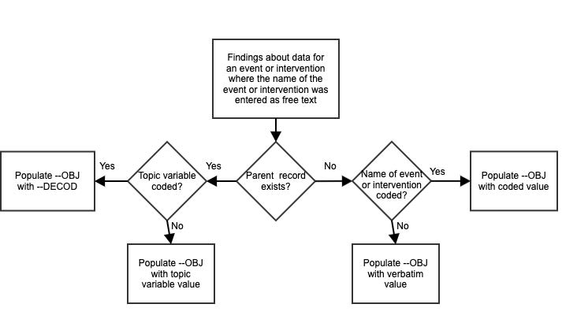

#### 4.2.8 Multiple Values for a Variable

##### 4.2.8.1 Multiple Values for an Intervention or Event Topic Variable

If multiple values are reported for an intervention or event topic variable (e.g., --TRT in an Interventions general observation-class dataset or --TERM in an Events general observation-class dataset), it is expected that the sponsor will split the values into multiple records or otherwise resolve the multiplicity per the sponsor's data management standard operating procedures. For example, if an adverse event term of "Headache and nausea" or a concomitant medication of "Tylenol and Benadryl" is reported, sponsors will often split the original report into separate records and/or query the site for clarification. By the time of submission, datasets should be in conformance with the record structures described in the SDTMIG.

Note: The Disposition (DS) dataset is an exception to the general rule of splitting multiple topic values into separate records. For DS, 1 record for each disposition or protocol milestone is permitted according to the domain structure. For cases of multiple reasons for discontinuation see Section 6.2.4, Disposition, assumption 5 for additional information.

##### 4.2.8.2 Multiple Values for a Findings Result Variable

If multiple result values (--ORRES) are reported for a test in a Findings class dataset, multiple records should be submitted for that --TESTCD.

For example,

- EGTESTCD = "SPRTARRY", EGTEST = "Supraventricular Tachyarrhythmias", EGORRES = "ATRIAL FIBRILLATION"
- EGTESTCD = "SPRTARRY", EGTEST = "Supraventricular Tachyarrhythmias", EGORRES = "ATRIAL FLUTTER"

When a finding can have multiple results, the key structure for the findings dataset must be adequate to distinguish between the multiple results. See Section 4.1.9, Assigning Natural Keys in the Metadata.

##### 4.2.8.3 Multiple Values for a Non-result Qualifier Variable

The SDTM permits 1 value for each qualifier variable per record. If multiple values exist (e.g., due to a "Check all that apply" instruction on a CRF), then the value for the qualifier variable should be "MULTIPLE" and SUPP-- should be used to store the individual responses. It is recommended that the SUPP-- QNAM value reference the corresponding standard domain variable with an appended number or letter. In some cases, the standard variable name will be shortened to meet the 8-character variable name requirement, or it may be clearer to append a meaningful character string as shown in the second Adverse Events (AE) example below, where the first 3 characters of the drug name are appended. Likewise, the QLABEL value should be similar to the standard label. The values stored in QVAL should be consistent with the controlled terminology associated with the standard variable. See Section 8.4, Relating Non-standard Variable Values to a Parent Domain, for additional guidance on maintaining appropriately unique QNAM values.

The following example includes selected variables from the ae.xpt and suppae.xpt datasets for a rash with locations on the face, neck, and chest.

ae.xpt

| AETERM | AELOC    |
| ------ | -------- |
| RASH   | MULTIPLE |

suppae.xpt

| QNAM   | QLABEL                     | QVAL  |
| ------ | -------------------------- | ----- |
| AELOC1 | Location of the Reaction 1 | FACE  |
| AELOC2 | Location of the Reaction 2 | NECK  |
| AELOC3 | Location of the Reaction 3 | CHEST |

In some cases, values for QNAM and QLABEL more specific than these may be needed.

For example, a sponsor might conduct a study with 2 study drugs (e.g., open-label study of Abcicin + Xyzamin), and may require the investigator assess causality and describe action taken for each drug for the rash:

ae.xpt

| AETERM | AEREL    | AEACN    |
| ------ | -------- | -------- |
| RASH   | MULTIPLE | MULTIPLE |

suppae.xpt

| QNAM     | QLABEL                    | QVAL             |
| -------- | ------------------------- | ---------------- |
| AERELABC | Causality of Abcicin      | POSSIBLY RELATED |
| AERELXYZ | Causality of Xyzamin      | UNLIKELY RELATED |
| AEACNABC | Action Taken with Abcicin | DOSE REDUCED     |
| AEACNXYZ | Action Taken with Xyzamin | DOSE NOT CHANGED |

In each of these examples, the use of SUPPAE should be documented in the Define-XML document and the annotated CRF. The controlled terminology used should be documented as part of value-level metadata.

If the sponsor has clearly documented that one response is of primary interest (e.g., in the CRF, protocol, or analysis plan), the standard domain variable may be populated with the primary response and SUPP-- may be used to store the secondary response(s).

For example, if Abcicin is designated as the primary study drug in the example above:

ae.xpt

| AETERM | AEREL            | AEACN        |
| ------ | ---------------- | ------------ |
| RASH   | POSSIBLY RELATED | DOSE REDUCED |

suppae.xpt

| QNAM   | QLABEL                    | QVAL             |
| ------ | ------------------------- | ---------------- |
| AERELX | Causality of Xyzamin      | UNLIKELY RELATED |
| AEACNX | Action Taken with Xyzamin | DOSE NOT CHANGED |

Note that in the latter case, the label for standard variables AEREL and AEACN will have no indication that they pertain to Abcicin. This association must be clearly documented in the metadata and annotated CRF.

##### 4.2.8.4 Multiple Values for a Parameter

If multiple values (--VAL) are reported for a parameter in a Trial Design or Study Reference dataset (e.g., TS, OI), multiple records should be submitted for that --PARMCD.

For example,

- TSPARMCD = "TTYPE", TSPARM = "Trial Type", TSVAL = "EFFICACY"
- TSPARMCD = "TTYPE", TSPARM = "Trial Type", TSVAL = "SAFETY"

When a parameter can have multiple values, the key structure for the dataset must be adequate to distinguish between the multiple records. See Section 4.1.9, Assigning Natural Keys in the Metadata.

#### 4.2.9 Variable Lengths

When variable length is referenced in the SDTMIG, this refers to the length in bytes of ASCII character strings.

Very large transport files have become an issue for certain regulatory authorities (e.g., US FDA) to process. One of the main contributors to large file sizes has been sponsors using the maximum length of 200 for character variables. To help rectify this situation:

- The maximum SAS v5 transport file character variable length of 200 characters should not be used unless necessary.
- Sponsors should consider the nature of the data and apply reasonable, appropriate lengths to variables. For example:

  - The length of flags will always be 1.
  - --TESTCD and IDVAR will never be more than 8, so the length can always be set to 8.
  - The length for variables that use controlled terminology can be set to the length of the longest term.

### 4.3 Coding and Controlled Terminology Assumptions

Examples provided in the CDISC Notes column and domain examples are only examples and not intended to imply controlled terminology. For current CDISC Controlled Terminology, visit https://datascience.cancer.gov/resources/cancer-vocabulary/cdisc-terminology.

#### 4.3.1 Controlled Terms, Codelist or Format Column

As of SDTMIG v3.3, controlled terminology is represented in the following ways:

- A single asterisk (*) when CDISC Controlled Terminology is not currently available but the SDS Team expects that sponsors may have their own controlled terminology and/or the CDISC Controlled Terminology Team may develop controlled terminology in the future
- The single applicable value for the variable DOMAIN (e.g., "PR")
- The name of a CDISC codelist, represented as a hyperlink in parentheses (e.g., "(NY)")
- A short reference to an external terminology (e.g., "MedDRA", "ISO 3166-1 alpha-3")

In addition, the Controlled Terms, Codelist or Format column has been used to indicate variables that use an ISO8601 format.

#### 4.3.2 Controlled Terminology Text Case

Terms from controlled terminology should be in the case that appears the source codelist or code system (e.g., CDISC codelist or external code system such as MedDRA). See Section 4.2.4, Text Case in Submitted Data.

#### 4.3.3 Controlled Terminology Values

The controlled terminology or a reference to the controlled terminology should be included in the Define-XML document file wherever applicable. All values in the permissible value set for the study should be included, whether or not they are represented in the submitted data. Note that a null value should not be included in the permissible value set. A null value is implied for any list of controlled terms unless the variable is "Required" (see Section 4.1.5, SDTM Core Designations).

When a domain or dataset specification includes a codelist for a variable, not every value in that codelist may have been part of planned data collection; only values that were part of planned data collection should be included in the Define-XML document. For example, --PRESP variables are associated with the NY codelist, but only the value "Y" is allowed in --PRESP variables. Future versions of the Define-XML specification are expected to include information on representing subsets of controlled terminology.

#### 4.3.4 Use of Controlled Terminology and Arbitrary Number Codes

Controlled terminology or human-readable text should be used instead of arbitrary number codes in order to reduce ambiguity for submission reviewers. For example, CMDECOD would contain human-readable dictionary text rather than a numeric code. Numeric code values may be submitted as Supplemental Qualifiers if necessary.

#### 4.3.5 Storing Controlled Terminology for Synonym Qualifier Variables

- For events such as adverse events and medical history, populate --DECOD with the dictionary's preferred term and populate --BODSYS with the preferred body system name. If a dictionary is multi-axial, the value in --BODSYS should represent the system organ class (SOC) used for the sponsor's analysis and summary tables, which may not necessarily be the primary SOC. Populate --SOC with the dictionary-derived primary SOC. In cases where the primary SOC was used for analysis, --BODSYS and --SOC are the same.
- If MedDRA is used to code events, the intermediate levels in the MedDRA hierarchy should also be represented in the dataset. A pair of variables has been defined for each of the levels of the hierarchy other than SOC and Preferred Term (PT): one to represent the text description and the other to represent the code value associated with it. For example, --LLT should be used to represent the Lowest Level Term text description and --LLTCD should be used to represent the Lowest Level Term code value.
- For concomitant medications, populate CMDECOD with the drug's generic name and populate CMCLAS with the drug class used for the sponsor's analysis and summary tables. If coding to multiple classes, follow Section 4.2.8.1, Multiple Values for an Intervention or Event Topic Variable, or omit CMCLAS.
- For concomitant medications, supplemental qualifiers may be used to represent additional coding dictionary information (e.g., a drug's ATC codes from the WHO Drug Dictionary; see Section 8.4, Relating Non-standard Variable Values to a Parent Domain).

The sponsor is expected to provide the dictionary name and version used to map the terms by utilizing the Define- XML external codelist attributes.

#### 4.3.6 Storing Topic Variables for General Domain Models

The topic variable for the Interventions and Events general observation-class models is often stored as verbatim text. For an Events domain, the topic variable is --TERM. For an Interventions domain, the topic variable is --TRT. For a Findings domain, the topic variable --TESTCD should use controlled terminology (e.g., "SYSBP" for systolic blood pressure). If CDISC Controlled Terminology exists, it should be used; otherwise, sponsors should define their own controlled list of terms. If the verbatim topic variable in an Interventions or Event domain is modified to facilitate coding, the modified text is stored in --MODIFY. In most cases—other than Physical Examination (PE)—the dictionary-coded text is derived into --DECOD. Because the PEORRES variable is modified instead of the topic variable for PE, the dictionary-derived text would be placed in PESTRESC. The variables used in each of the defined domains are:

| Domain | Original Verbatim | Modified Verbatim | Standardized Value |
| ------ | ----------------- | ----------------- | ------------------ |
| AE     | AETERM            | AEMODIFY          | AEDECOD            |
| DS     | DSTERM            |                   | DSDECOD            |
| CM     | CMTRT             | CMMODIFY          | CMDECOD            |
| MH     | MHTERM            | MHMODIFY          | MHDECOD            |
| PE     | PEORRES           | PEMODIFY          | PESTRESC           |

#### 4.3.7 Use of "Yes" and "No" Values

Variables where the response is "Yes" or "No" ("Y" or "N") should normally be populated for both "Y" and "N" responses. This eliminates confusion regarding whether a blank response indicates "N" or is a missing value. However, some variables are collected or derived in a manner that allows only 1 response, such as when a single checkbox indicates "Yes". In situations such as these, where it is unambiguous to populate only the response of interest, it is permissible to populate only 1 value ("Y" or "N") and leave the alternate value blank. An example of when it would be acceptable to use only a value of "Y" would be for Last Observation Before Exposure Flag (-- LOBXFL) variables, where "N" is not necessary to indicate that a value is not the last observation before exposure.

Note: Permissible values for variables with controlled terms of "Y" or "N" may be extended to include "U" or "NA" if it is the sponsor's practice to explicitly collect or derive values indicating "Unknown" or "Not Applicable" for that variable.

### 4.4 Actual and Relative Time Assumptions

Timing variables (SDTM Section 3.1.5, Timing Variables for All Classes) are an essential component of all SDTM subject-level domain datasets. In general, all domains based on the 3 general observation classes should have at least 1 timing variable. In the Events or Interventions general observation class, this could be the start date of the event or intervention. In the Findings observation class, where data are usually collected at multiple visits, at least 1 timing variable must be used.

The SDTMIG requires dates and times of day to be stored according to the international standard ISO 8601 (http://www.iso.org). ISO 8601 provides a text-based representation of dates and/or times, intervals of time, and durations of time.

#### 4.4.1 Formats for Date/Time Variables

An SDTM DTC variable may include data that is represented in ISO 8601 format as a complete date/time, a partial date/time, or an incomplete date/time.

The SDTMIG template uses ISO 8601 for calendar dates and times of day, which are expressed as follows:

- YYYY-MM-DDThh:mm:ss(.n+)?(((+|-)hh:mm)|Z)?

where:

- [YYYY] = four-digit year
- [MM] = two-digit representation of the month (01-12, 01=January, etc.)
- [DD] = two-digit day of the month (01 through 31)
- [T] = (time designator) indicates time information follows
- [hh] = two digits of hour (00 through 23) (am/pm is NOT allowed)
- [mm] = two digits of minute (00 through 59)
- [ss] = two digits of second (00 through 59) The last two components, indicated in the format pattern with a question mark, are optional:
- [(.n+)?] = optional fractions of seconds
- [(((+|-)hh:mm)|Z)?] = optional time zone

Other characters defined for use within the ISO 8601 standard are:

- [-] (hyphen): to separate the time elements "year" from "month" and "month" from "day" and to represent missing date components.
- [:] (colon): to separate the time elements "hour" from "minute" and "minute" from "second"
- [/] (solidus): to separate components in the representation of date/time intervals
- [P] (duration designator): precedes the components that represent the duration

Spaces are not allowed in any ISO 8601 representations.

Key aspects of the ISO 8601 standard are as follows:

- ISO 8601 represents dates as a text string using the notation YYYY-MM-DD.
- ISO 8601 represents times as a text string using the notation hh:mm:ss(.n+)?(((+|-)hh:mm)|Z)?.
- The SDTM and the SDTMIG require use of the ISO 8601 extended format, which requires hyphen delimiters for date components and colon delimiters for time components. The ISO 8601 basic format, which does not require delimiters, should not be used in SDTM datasets.
- When a date is stored with a time in the same variable (as a date/time), the date is written in front of the time and the time is preceded with "T" using the notation YYYY-MM-DDThh:mm:ss (e.g. 2001-12- 26T00:00:01).

Implementation of the ISO 8601 standard means that date/time variables are character/text data types. The SDTM fragment employed for date/time character variables is DTC.

#### 4.4.2 Date/Time Precision

The concept of representing date/time precision is handled through use of the ISO 8601 standard. According to ISO 8601, precision (also referred to by ISO 8601 as "completeness" or "representations with reduced accuracy") can be inferred from the presence or absence of components in the date and/or time values. Missing components are represented by right truncation or a hyphen (for intermediate components that are missing). If the date and time values are completely missing, the SDTM date field should be null. Every component except year is represented as 2 digits. Years are represented as 4 digits; for all other components, 1-digit numbers are always padded with a leading zero.

The following table provides examples of ISO 8601 representations of complete and truncated date/time values using ISO 8601 "appropriate right truncations" of incomplete date/time representations. Note that if no time component is represented, the [T] time designator (in addition to the missing time) must be omitted in ISO 8601 representation.

|   | Date and Time as Originally Recorded | Precision                               | ISO 8601 Date/Time      |
| - | ------------------------------------ | --------------------------------------- | ----------------------- |
| 1 | December 15, 2003 13:14:17.123       | Date/time, including fractional seconds | 2003-12-15T13:14:17.123 |
| 2 | December 15, 2003 13:14:17           | Date/time to the nearest second         | 2003-12-15T13:14:17     |
| 3 | December 15, 2003 13:14              | Unknown seconds                         | 2003-12-15T13:14        |
| 4 | December 15, 2003 13                 | Unknown minutes and seconds             | 2003-12-15T13           |
| 5 | December 15, 2003                    | Unknown time                            | 2003-12-15              |
| 6 | December, 2003                       | Unknown day and time                    | 2003-12                 |
| 7 | 2003                                 | Unknown month, day, and time            | 2003                    |

This date and date/time model also provides for imprecise or estimated dates, such as those commonly seen in Medical History. To represent these intervals while applying the ISO 8601 standard, it is recommended that the sponsor concatenate the date/time values (using the most complete representation of the date/time known) that describe the beginning and the end of the interval of uncertainty and separate them with a solidus, as shown in the following table.

|   | Interval of Uncertainty                                               | ISO 8601 Date/Time                |
| - | --------------------------------------------------------------------- | --------------------------------- |
| 1 | Between 10:00 and 10:30 on the morning of December 15, 2003           | 2003-12-15T10:00/2003-12-15T10:30 |
| 2 | Between the first of this year (2003) until "now" (February 15, 2003) | 2003-01-01/2003-02-15             |
| 3 | Between the first and the tenth of December, 2003                     | 2003-12-01/2003-12-10             |
| 4 | Sometime in the first half of 2003                                    | 2003-01-01/2003-06-30             |

Other uncertainty intervals may be represented by the omission of components of the date when these components are unknown or missing. As previously mentioned, ISO 8601 represents missing intermediate components through the use of a hyphen where the missing component would normally be represented. This may be used in addition to "appropriate right truncations" for incomplete date/time representations. When components are omitted, the expected delimiters must still be kept in place and only a single hyphen is to be used to indicate an omitted component. Examples of this method of omitted component representation are shown in the following table.

|   | Date and Time as Originally Recorded                         | Level of Uncertainty                                | ISO 8601             |
| - | ------------------------------------------------------------ | --------------------------------------------------- | -------------------- |
|   |                                                              |                                                     | Date/Time            |
| 1 | December 15, 2003 13:15:17                                   | Date/time to the nearest second                     | 2003-12- 15T13:15:17 |
| 2 | December 15, 2003 ??:15                                      | Unknown hour with known minutes                     | 2003-12-15T-:15      |
| 3 | December 15, 2003 13:??:17                                   | Unknown minutes with known date, hours, and seconds | 2003-12-15T13:-:17   |
| 4 | The 15th of some month in 2003, time not collected           | Unknown month and time with known year and day      | 2003---15            |
| 5 | December 15, but can't remember the year, time not collected | Unknown year with known month and day               | --12-15              |
| 6 | 7:15 of some unknown date                                    | Unknown date with known hour and minute             | -----T07:15          |

Note that row 6, where a time is reported with no date information, represents a very unusual situation. Because most data are collected as part of a visit, when only a time appears on a CRF, it is expected that the date of the visit would usually be used as the date of collection.

Using a character-based data type to implement the ISO 8601 date/time standard will ensure that the date/time information will be machine- and human-readable without the need for further manipulation, and will be platform- and software-independent.

#### 4.4.3 Intervals of Time and Use of Duration for --DUR Variables

##### 4.4.3.1 Intervals of Time and Use of Duration

As defined by ISO 8601, an interval of time is the part of a time axis, limited by 2 time "instants" such as the times represented in SDTM by the variables --STDTC and --ENDTC. These variables represent the 2 instants that bound an interval of time; the duration is the quantity of time that is equal to the difference between these time points.

ISO 8601 allows an interval to be represented in multiple ways. One representation, shown below, uses 2 dates in the format:

YYYY-MM-DDThh:mm:ss/YYYY-MM-DDThh:mm:ss

Although this example represents the interval (by providing the start date/time and end date/time to bound the interval of time), it does not provide the value of the duration (the quantity of time).

Duration is frequently used during a review; however, the duration timing variable (--DUR) should generally be used in a domain if it was collected in lieu of a start date/time (--STDTC) and end date/time (--ENDTC). If both -- STDTC and --ENDTC are collected, durations can be calculated by the difference in these 2 values, and need not be in the submission dataset.

Both duration and duration units can be provided in the single --DUR variable, in accordance with the ISO 8601 standard. The values provided in --DUR should follow 1 of the following ISO 8601 duration formats:

PnYnMnDTnHnMnS

\- or -

PnW

where the letter designation is defined as:

- [P] (duration designator): precedes the alphanumeric text string that represents the duration. Note that the use of the character "P" is based on the historical use of the term "period" for duration.
- [n] represents a positive number or zero.
- [W] is used as week designator, preceding a data element that represents the number of calendar weeks within the calendar year (e.g., P6W represents 6 weeks of calendar time).

The letter "P" must precede other values in the ISO 8601 representation of duration. The "n" preceding each letter represents the number of years, months, days, hours, minutes, seconds, or the number of weeks. As with the date/time format, "T" is used to separate the date components from time components.

Note that weeks cannot be mixed with any other date/time components such as days or months in duration expressions.

As is the case with the date/time representation in --DTC, --STDTC, or --ENDTC, only the components of duration that are known or collected need to be represented. As is the case with the date/time representation, if no time component is represented, the [T] time designator (in addition to the missing time) must be omitted in ISO 8601 representation.

ISO 8601 also allows that the "lowest-order components" of duration being represented may be represented in decimal format. This may be useful if data are collected in formats such as "one and one-half years", "two and a half weeks", "half a week" or "quarter of an hour" and the sponsor wishes to represent this "precision" (or lack of precision) in ISO 8601 representation. This is ONLY allowed in the lowest-order (right-most) component in any duration representation.

The following table provides some examples of ISO 8601-compliant representations of durations.

| Duration as originally recorded | ISO 8601 Duration |
| ------------------------------- | ----------------- |
| 2 years                         | P2Y               |
| 10 weeks                        | P10W              |
| 3 months 14 days                | P3M14D            |
| 3 days                          | P3D               |
| 6 months 17 days 3 hours        | P6M17DT3H         |
| 14 days 7 hours 57 minutes      | P14DT7H57M        |
| 42 minutes 18 seconds           | PT42M18S          |
| One-half hour                   | PT0.5H            |
| 5 days 12¼ hours               | P5DT12.25H        |
| 4 ½ weeks                      | P4.5W             |

Note that a leading zero is required with decimal values less than 1.

##### 4.4.3.2 Interval with Uncertainty

When an interval of time is an amount of time (duration) following an event whose start date/time is recorded (with some level of precision, e.g., when one knows the start date/time and the duration following the start date/time), the correct ISO 8601 usage to represent this interval is:

YYYY-MM-DDThh:mm:ss/PnYnMnDTnHnMnS

where the start date/time is represented before the solidus or foreword slash [/], the "Pn…" following the solidus represents a "duration," and the entire representation is known as an "interval." Note that this is the recommended representation of elapsed time, given a start date/time and the duration elapsed. When an interval of time is an amount of time (duration) measured prior to an event whose start date/time is recorded (with some level of precision, e.g., where one knows the end date/time and the duration preceding that end date/time), the syntax is:

PnYnMnDTnHnMnS/YYYY-MM-DDThh:mm:ss

where the duration, "Pn…", is represented before the solidus [/], the end date/time is represented following the solidus, and the entire representation is known as an "interval."

#### 4.4.4 Use of the Study Day Variables

The permissible study day variables (i.e., --DY, --STDY, --ENDY) describe the relative day of the observation starting with the reference date as day 1. They are determined by comparing the date portion of the respective date/time variables (--DTC, --STDTC, and --ENDTC) to the date portion of the subject reference start date (RFSTDTC from the Demographics domain).

The subject reference start date (RFSTDTC) is designated as study day 1. The study day value is incremented by 1 for each date following RFSTDTC. Dates prior to RFSTDTC are decreased by 1, with the date preceding RFSTDTC designated as study day -1 (there is no study day 0). This algorithm for determining Study Day is consistent with how people typically describe sequential days relative to a fixed reference point, but creates problems if used for mathematical calculations because it does not allow for a day 0. As such, Study Day is not suited for use in subsequent numerical computations, such as calculating duration. The raw date values should be used rather than Study Day in those calculations.

All study day values are integers. Thus, to calculate Study Day:

--DY = (date portion of --DTC) - (date portion of RFSTDTC) + 1 if --DTC is on or after RFSTDTC
--DY = (date portion of --DTC) - (date portion of RFSTDTC) if --DTC precedes RFSTDTC

This method should be used across all domains.

#### 4.4.5 Clinical Encounters and Visits

All domains based on the 3 general observation classes should have at least 1 timing variable. For domains in the Events or Interventions observation classes, and for domains in the Findings observation class, for which data are collected only once during the study, the most appropriate timing variable may be a date (e.g., --DTC, --STDTC) or some other timing variable. For studies that are designed with a prospectively defined schedule of visit-based activities, domains for data that are to be collected more than once per subject (e.g., labs, ECG, vital signs) are expected to include VISITNUM as a timing variable.

Clinical encounters are described by the CDISC visit variables. For planned visits, values of VISIT, VISITNUM, and VISITDY must be those defined in the Trial Visits (TV) dataset (see Section 7.3.1, Trial Visits). For planned visits:

- Values of VISITNUM are used for sorting and should, wherever possible, match the planned chronological order of visits. Occasionally, a protocol will define a planned visit whose timing is unpredictable (e.g., planned in response to an adverse event, a threshold test value, or a disease event), and completely chronological values of VISITNUM may not be possible in such cases.
- There should be a one-to-one relationship between values of VISIT and VISITNUM.
- For visits that may last more than 1 calendar day, VISITDY should be the planned day of the start of the visit.

Sponsor practices for populating visit variables for unplanned visits may vary.

- VISITNUM should generally be populated, even for unplanned visits, as it is expected in many Findings domains, as described above. The easiest method of populating VISITNUM for unplanned visits is to assign the same value (e.g., 99) to all unplanned visits, although this method provides no differentiation between the unplanned visits and does not provide chronological sorting. Methods that provide a one-to- one relationship between visits and values of VISITNUM, that are consistent across domains, and that assign VISITNUM values that sort chronologically require more work and must be applied after all of a subject's unplanned visits are known.
- VISIT may be left null or may be populated with a generic value (e.g., "Unscheduled") for all unplanned visits, or individual values may be assigned to different unplanned visits.
- VISITDY must not be populated for unplanned visits; VISITDY is, by definition, the planned study day of visit. The actual study day of an unplanned visit belongs in a --DY variable.

The following lb.xpt sample rows show how visit identifiers might be used for lab data.

lb.xpt

| USUBJID | VISIT              | VISITNUM | VISITDY | LBDY |
| ------- | ------------------ | -------- | ------- | ---- |
| 001     | Week 1             | 2        | 7       | 7    |
| 001     | Week 2             | 3        | 14      | 13   |
| 001     | Week 2 Unscheduled | 3.1      |         | 17   |

#### 4.4.6 Representing Additional Study Days

The SDTM allows for the representation of study days relative to the RFSTDTC reference start date variable in the DM dataset, using variables --DY, as described in Section 4.4.4, Use of the "Study Day" Variables. The calculation of additional study days within subdivisions of time in a clinical trial may be based on 1 or more sponsor-defined reference dates not represented by RFSTDTC. In such cases, the sponsor may define supplemental qualifier variables and the Define-XML document should reflect the reference dates used to calculate such study days. If the sponsor wishes to define "day within element" or "day within epoch", the reference date/time will be an element start date/time in the Subject Elements (SE) dataset (see Section 5.3, Subject Elements).

#### 4.4.7 Use of Relative Timing Variables

--STRF and --ENRF

The variables --STRF and --ENRF represent the timing of an observation relative to the sponsor-defined study reference period, when information such as "BEFORE", "PRIOR", "ONGOING"', or "CONTINUING" is collected in lieu of a date and this collected information is in relation to the sponsor-defined study reference period. The sponsor-defined study reference period is the continuous period of time defined by the discrete starting point, RFSTDTC, and the discrete ending point, RFENDTC, for each subject in the Demographics (DM) dataset.

--STRF is used to identify the start of an observation relative to the sponsor-defined study reference period.

--ENRF is used to identify the end of an observation relative to the sponsor-defined study reference period.

Allowable values for --STRF are "BEFORE", "DURING", "DURING/AFTER", "AFTER", and "UNKNOWN". Although "COINCIDENT" and "ONGOING" are in the STENRF codelist, they describe timing relative to a point in time rather than an interval of time, so are not appropriate for use with --STRF variables. It would be unusual for an event or intervention to be recorded as starting "AFTER" the study reference period, but could be possible, depending on how the study reference period is defined in a particular study.

Allowable values for --ENRF are "BEFORE", "DURING", "DURING/AFTER", "AFTER" and "UNKNOWN". If -- ENRF is used, then --ENRF = "AFTER" means that the event did not end before or during the study reference period. Although "COINCIDENT" and "ONGOING" are in the STENRF codelist, they describe timing relative to a point in time rather than an interval of time, so are not appropriate for use with --ENRF variables.As an example, a CRF checkbox that identifies concomitant medication use that began prior to the study reference period would translate into CMSTRF = "BEFORE", if selected. Note that in this example, the information collected is with respect to the start of the concomitant medication use only, and therefore the collected data corresponds to variable CMSTRF, not CMENRF. Note also that the information collected is relative to the study reference period, which meets the definition of CMSTRF.Some sponsors may wish to derive --STRF and --ENRF for analysis or reporting purposes even when dates are collected. Sponsors are cautioned that doing so in conjunction with directly collecting or mapping data such as "BEFORE", "PRIOR", and "ONGOING" to --STRF and --ENRF will blur the distinction between collected and derived values within the domain. Sponsors wishing to do such derivations are instead encouraged to use analysis datasets for this derived data.

In general, sponsors are cautioned that representing information using variables --STRF and --ENRF may not be as precise as other methods, particularly because information is often collected relative to a point in time or to a period of time other than the one defined as the study reference period. SDTMIG v3.1.2 attempted to address these limitations by the addition of 4 new relative timing variables, which are described in the following section. Sponsors should use the set of variables that allows for accurate representation of collected data. In many cases, this will mean using these new relative timing variables in place of --STRF and --ENRF.

--STRTPT, --STTPT, --ENRTPT, and --ENTPT

Although the variables --STRF and --ENRF are useful in the case when relative timing assessments are made coincident with the start and end of the study reference period, they may not be suitable for expressing relative timing assessments (e.g., "Prior", "Ongoing") that are collected at other times of the study. As a result, 4 new timing variables were added in SDTMIG v3.1.2 to express a similar concept at any point in time. The variables --STRTPT and --ENRTPT contain values similar to --STRF and --ENRF, but may be anchored with any timing description or date/time value expressed in the respective --STTPT and --ENTPT variables, and are not limited to the study reference period. Unlike the variables --STRF and --ENRF, which for all domains are defined relative to one study

reference period, the timing variables --STRTPT, --STTPT, --ENRTPT, and --ENTPT are defined by each sponsor for each study. Allowable values for --STRTPT and --ENRTPT are as follows.

If the reference time point corresponds to the date of collection or assessment:

- Start values: An observation can start BEFORE that time point, can start COINCIDENT with that time point, or it can be UNKNOWN when it started.
- End values: An observation can end BEFORE that time point, can end COINCIDENT with that time point, can be known that it did not end but was ONGOING, or it can be UNKNOWN when it ended or if it was ongoing.
- AFTER is not a valid value in this case because it would represent an event after the date of collection.

If the reference time point is prior to the date of collection or assessment:

- Start values: An observation can start BEFORE the reference point, can start COINCIDENT with the reference point, can start AFTER the reference point, or it can be UNKNOWN when it started.
- End values: An observation can end BEFORE the reference point, can end COINCIDENT with the reference point, can end AFTER the reference point, can be known that it did not end but was ONGOING, or it can be UNKNOWN when it ended or if it was ongoing.

Although "DURING" and "DURING/AFTER" are in the STENRF codelist, they describe timing relative to an interval of time rather than a point in time, so are not allowable for use with --STRTPT and --ENRTPT variables.

Examples of --STRTPT, --STTPT, --ENRTPT, and --ENTPT

Example 1: Medical History

Assumptions:

- CRF contains "Year Started" and checkbox for "Active"
- "Date of Assessment" is collected

Example when "Active" is checked:

- MHDTC = date of assessment value (e.g., "2006-11-02")
- MHSTDTC = year of condition start (e.g., "2002")
- MHENRTPT = "ONGOING"
- MHENTPT = date of assessment value (e.g., "2006-11-02")

Figure. Example of --ENRTPT and --ENTPT for Medical History

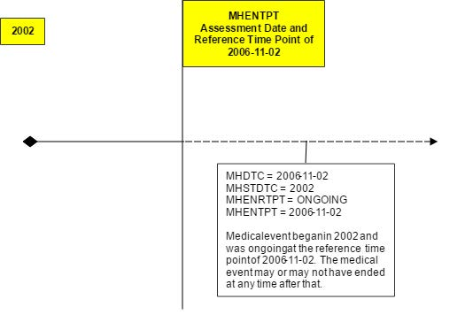

Example 2: Prior and Concomitant Medications

Assumptions:

- CRF includes collection of "Start Date" and "Stop Date", and checkboxes for

  - "Prior" if start date was before the screening visit and was unknown or uncollected
  - "Continuing" if medication had not stopped as of the final study visit, so no end date was collected

Example when both "Prior" and "Continuing" are checked:

- CMSTDTC is null
- CMENDTC is null
- CMSTRTPT = "BEFORE"
- CMSTTPT is screening date (e.g., "2006-10-21")
- CMENRTPT = "ONGOING"
- CMENTPT is final study visit date (e.g., "2006-11-02")

Example 3: Adverse Events

Assumptions:

- CRF contains "Start Date", "Stop Date"
- Collection of "Outcome" includes checkboxes for "Continuing" and "Unknown", to be used, if necessary, at the end of the subject's participation in the trial
- No assessment date or visit information was collected

Example when "Unknown" is checked:

- AESTDTC is start date (e.g., "2006-10-01")
- AEENDTC is null
- AEENRTPT = "UNKNOWN"
- AEENTPT is final subject contact date (e.g., "2006-11-02")

#### 4.4.8 Date and Time Reported in a Domain Based on Findings

When the date/time of collection is reported in any domain, the date/time should go into the --DTC field (e.g., EGDTC for Date/Time of ECG). For any domain based on the Findings general observation class (e.g., lab tests based on a specimen), the collection date is likely to be tied to when the source of the finding was captured, not necessarily when the data were recorded. In order to ensure that the critical timing information is always represented in the same variable, the --DTC variable is used to represent the time of specimen collection. For example, in the Laboratory Test Results (LB) domain, the LBDTC variable would be used for all single-point blood collections or spot urine collections. For timed lab collections (e.g., 24-hour urine collections) the LBDTC variable would be used for the start date/time of the collection and LBENDTC for the end date/time of the collection. This approach allows the single-point and interval collections to use the same date/time variables consistently across all datasets for the Findings general observation class. The following table illustrates the proper use of these variables. Note that -- STDTC should not be used in the Findings general observation class and is therefore blank in this table.

| Collection Type         | --DTC | --STDTC | --ENDTC |
| ----------------------- | ----- | ------- | ------- |
| Single-point Collection | X     |         |         |
| Interval Collection     | X     |         | X       |

#### 4.4.9 Use of Dates as Result Variables

Dates are generally used only as timing variables to describe the timing of an event, intervention, or collection activity, but there may be occasions when it may be preferable to model a date as a result (--ORRES) in a Findings dataset. Note that using a date as a result to a Findings question is unusual and atypical, and should be approached

with caution. This situation, however, may occasionally occur when (1) a group of questions (each of which has a date response) is asked and analyzed together; or (2) the event(s) and intervention(s) in question are not medically significant (e.g., when included in questionnaires). Consider the following cases:

- Calculated due date
- Date of last day on the job
- Date of high school graduation

One approach to modeling these data would be to place the text of the question in --TEST and the response to the question (a date represented in ISO 8601 format) in --ORRES and --STRESC, as long as these date results do not contain the dates of medically significant events or interventions.

Again, use extreme caution when storing dates as the results of findings. Remember, in most cases, these dates should be timing variables associated with a record in an Intervention or Events dataset.

#### 4.4.10 Representing Time Points

Time points can be represented using the time point variables --TPT, --TPTNUM, --ELTM, and the time-point anchors --TPTREF (text description) and --RFTDTC (the date/time). Note that time-point data will usually have an associated --DTC value. The interrelationship of these variables is shown in the following figure.

Figure. Representing Time Points

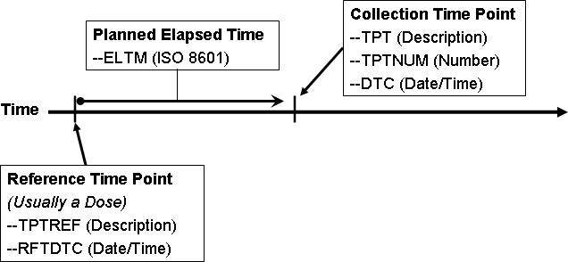

Values for these variables for vital signs measurements taken at 30, 60, and 90 minutes after dosing would look like the following.

| VSTPTNUM | VSTPT  | VSELTM  | VSTPTREF            | VSRFTDTC         | VSDTC            |
| -------- | ------ | ------- | ------------------- | ---------------- | ---------------- |
| 1        | 30 MIN | PT30M   | DOSE ADMINISTRATION | 2006-08-01T08:00 | 2006-08-01T08:30 |
| 2        | 60 MIN | PT1H    | DOSE ADMINISTRATION | 2006-08-01T08:00 | 2006-08-01T09:01 |
| 3        | 90 MIN | PT1H30M | DOSE ADMINISTRATION | 2006-08-01T08:00 | 2006-08-01T09:32 |

Note that VSELTM is the planned elapsed time, not the actual elapsed time. The actual elapsed time could be derived in an analysis dataset, if desired, as VSDTC-VSRFTDTC.

Values for these variables for urine collections taken pre-dose, and from 0-12 hours and 12-24 hours after dosing would look like the following.

| LBTPTNUM | LBTPT           | LBELTM | LBTPTREF            | LBRFTDTC         | LBDTC            |
| -------- | --------------- | ------ | ------------------- | ---------------- | ---------------- |
| 1        | 15 MIN PRE-DOSE | -PT15M | DOSE ADMINISTRATION | 2006-08-01T08:00 | 2006-08-01T07:45 |
| 2        | 0-12 HOURS      | PT12H  | DOSE ADMINISTRATION | 2006-08-01T08:00 | 2006-08-01T20:35 |
| 3        | 12-24 HOURS     | PT24H  | DOSE ADMINISTRATION | 2006-08-01T08:00 | 2006-08-02T08:40 |

Note that the value in LBELTM represents the end of the specimen collection interval.

When time points are represented in SDTMIG domains, both --TPT and --TPTNUM must be used. Time points may or may not have an associated --TPTREF. Sometimes, --TPTNUM may be used as a key for multiple values collected for the same test within a visit; as such, there is no dependence upon an anchor such as --TPTREF, but there will be a dependency upon VISITNUM. In such cases, VISITNUM will be required to confer uniqueness to values of --TPTNUM.

If the protocol describes the scheduling of a dose using a reference intervention or assessment, then --TPTREF should be populated, even if it does not contribute to uniqueness. The fact that time points are related to a reference time point, and what that reference time point is, are important for interpreting the data collected at the time point.

Not all time points will require all 3 variables to provide uniqueness. In fact, in some cases a time point may be uniquely identified without the use of VISIT, or without the use of --TPTREF, or without the use of either. For instance:

- A trial might have time points only within 1 visit, so that the contribution of VISITNUM to uniqueness is trivial. (VISITNUM would be populated, but would not contribute to uniqueness.)
- A trial might have time points that do not relate to any visit, such as time points relative to a dose of drug self-administered by the subject at home. (Visit variables would not be included, but --TPTREF and other time point variables would be populated.)
- A trial may have only 1 reference time point per visit, and all reference time points may be similar, so that only 1 value of --TPTREF (e.g., "DOSE") is needed. (--TPTREF would be populated, but would not contribute to uniqueness.)
- A trial may have time points not related to a reference time point. For instance, --TPTNUM values could be used to distinguish first, second, and third repeats of a measurement scheduled without any relationship to dosing (–TPTREF and --ELTM would not be included.) In this case, where the protocol calls for repeated measurements but does not specify timing of the measurements, the --REPNUM variable could be used instead of time-point variables.

For trials with many time points, the requirement to provide uniqueness using only VISITNUM, --TPTREF, and -- TPTNUM may lead to a scheme where multiple natural keys are combined into the values of one of these variables.

For instance, in a crossover trial with multiple doses on multiple days within each period, either of the following options could be used.

1. VISITNUM might be used to designate period, --TPTREF might be used to designate the day and the dose, and --TPTNUM might be used to designate the timing relative to the reference time point.
2. VISITNUM might be used to designate period and day within period, --TPTREF might be used to designate the dose within the day, and --TPTNUM might be used to designate the timing relative to the reference time point.

Option 1

| VISIT    | VISITNUM | --TPT                                                       | --TPTNUM                | --TPTREF                                                    |
| -------- | -------- | ----------------------------------------------------------- | ----------------------- | ----------------------------------------------------------- |
| PERIOD 1 | 3        | PRE-DOSE 1H 4H PRE-DOSE 1H 4H PRE-DOSE 1H 4H PRE-DOSE 1H 4H | 1 2 3 1 2 3 1 2 3 1 2 3 | DAY 1, AM DOSE DAY 1, PM DOSE DAY 5, AM DOSE DAY 5, PM DOSE |
| PERIOD 2 | 4        | PRE-DOSE 1H 4H PRE-DOSE 1H 4H                               | 1 2 3 1 2 3             | DAY 1, AM DOSE DAY 1, PM DOSE                               |

Option 2

| VISIT           | VISITNUM | --TPT                         | --TPTNUM    | --TPTREF        |
| --------------- | -------- | ----------------------------- | ----------- | --------------- |
| PERIOD 1, DAY 1 | 3        | PRE-DOSE 1H 4H PRE-DOSE 1H 4H | 1 2 3 1 2 3 | AM DOSE PM DOSE |
| PERIOD 1, DAY 5 | 4        | PRE-DOSE 1H 4H PRE-DOSE 1H 4H | 1 2 3 1 2 3 | AM DOSE PM DOSE |
| PERIOD 2, DAY 1 | 5        | PRE-DOSE 1H 4H PRE-DOSE 1H 4H | 1 2 3 1 2 3 | AM DOSE PM DOSE |

Within the context that defines uniqueness for a time point (which may include domain, visit, and reference time point), there must be a one-to-one relationship between values of --TPT and --TPTNUM. In other words, if domain, visit, and reference time point uniquely identify subject data, then if 2 subjects have records with the same values of DOMAIN, VISITNUM, --TPTREF, and --TPTNUM, these records may not have different time point descriptions in
--TPT.

Within the context that defines uniqueness for a time point, there is likely to be a one-to-one relationship between most values of --TPT and --ELTM. However, because --ELTM can only be populated with ISO 8601 periods of time (as described in Section 4.4.3, Intervals of Time and Use of Duration for --DUR Variables), --ELTM may not be populated for all time points. For example, --ELTM is likely to be null for time points described by text such as "pre-dose" or "before breakfast." When --ELTM is populated, if 2 subjects have records with the same values of DOMAIN, VISITNUM, --TPTREF, and --TPTNUM, then these records may not have different values in --ELTM.

When the protocol describes a time point with text (e.g., "4-6 hours after dose," "12 hours +/- 2 hours after dose"), the sponsor may choose whether and how to populate --ELTM. For example, a time point described as "4-6 hours after dose" might be associated with an --ELTM value of PT4H. A time point described as "12 hours +/- 2 hours after dose" might be associated with an --ELTM value of PT12H. Conventions for populating --ELTM should be consistent (the examples just given would probably not both be used in the same trial). It would be good practice to indicate the range of intended timings by some convention in the values used to populate --TPT.

Sponsors may, of course, use more stringent requirements for populating --TPTNUM, --TPT, and --ELTM. For instance, a sponsor could decide that all time points with a particular --ELTM value would have the same values of -
-TPTNUM, and --TPT, across all visits, reference time points, and domains.

#### 4.4.11 Disease Milestones and Disease Milestone Timing Variables

A disease milestone is an event or activity that can be anticipated in the course of a disease, but whose timing is not controlled by the study schedule. A disease milestone may be something that occurred pre-study, but which represents a time at which data would have been collected (e.g., diagnosis of the disease under study). A disease milestone may also be something which is anticipated to occur during a study and which, if it occurs, triggers the collection of related data outside the regular schedule of visits (e.g., adverse event of interest). The types of disease milestones for a study are defined in the study-level Trial Disease Milestones (TM) dataset (see Section 7.3.3, Trial Disease Milestones). The times at which disease milestones occurred for a particular subject are summarized in the special-purpose Subject Disease Milestones (SM) domain (see Section 5.4, Subject Disease Milestones), a domain similar in structure to the Subject Visits (SV) and Subject Elements (SE) domains.

Not all studies will have disease milestones. If a study does not have disease milestones, the TM and SM domains will not be present and the disease milestones timing variables may not be included in other domains.

Disease Milestone Naming

Instances of disease milestones are given names at a subject level. The name of a disease milestone is composed of a character string that depends on the disease milestone type (MIDSTYPE in TM and SM) and, if the type of disease milestone is one that may occur multiple times, a chronological sequence number for this disease milestone among other instances of the same type for the subject. The character string used in the name of a disease milestone is usually a short form of the disease milestone type. For example, if the type of disease milestone is "EPISODE OF DISEASE UNDER STUDY", the values of MIDS for instances of this type of event could include "EPISODE1", "EPISODE2"; or "EPISODE01", "EPISODE02", and so on. The association between the longer text in MIDSTYPE and the shorter text in MIDS can be seen in SM, which includes both variables.

Disease Milestone Name (MIDS)

If something that has been defined as a disease milestone for a particular study occurrs for a particular subject, it is represented as usual: in the appropriate findings, intervention, or events class record. In addition, this record will include the MIDS timing variable, populated with the name of the disease milestone. The timing of a disease milestone is also represented in the special-purpose SM domain.

The record that represents a disease milestone does not include values for the timing variables RELMIDS and MIDSDTC, which are used to represent the timing of other observations relative to a disease milestone. The usual timing variables in the record for a disease milestone (e.g., --DTC, --STDTC, --ENDTC) provide the needed timing for this observation and for the timing information represented in the SM domain.

Timing Relative to a Disease Milestone (MIDS, RELMIDS, MIDSDTC)

For an observation triggered by the occurrence of a disease milestone, the relationship of the observation to the disease milestone can be represented using the disease milestones timing variables MIDS, RELMIDS, and MIDSDTC to describe the timing of the observation.

- MIDS is populated with the name of a disease milestone for this subject. MIDS is the “anchor” for describing the timing of the observation relative to the disease milestone. In this sense, its function is similar to --TPTREF for time points.
- RELMIDS is usually populated with a textual description of the temporal relationship between the observation and the disease milestone named in MIDS. Controlled Terminology has not yet been developed for RELMIDS, but is likely to include terms such as "IMMEDIATELY BEFORE", "AT START OF", "DURING", "AT END OF", and "SHORTLY AFTER". It is similar to --ELTM, except that --ELTM is represented ISO 8601 duration.
- MIDSDTC is populated with the date/time of the disease milestone. This is the --DTC for a finding, or the --STDTC for an event or intervention, and is the date recorded in SMSTDTC in the SM domain. Its function is similar to --RFTDTC for time points.

In some cases, data collected in conjunction with a disease milestone do not include the collection of a separate date for the related observation. This is particularly common for pre-study disease milestones, but may occur with on- study disease milestones as well. In such cases, MIDSDTC provides a related date/time in records that would not otherwise contain any date. In records that do contain date/time(s) of the observation, MIDSDTC allows easy comparison of the date(s) of the observation to the (start) date of the disease milestone. In such cases, it functions much like the reference time point date/time (--RFTDTC) in observations at time points.

When a disease milestone is an event or intervention, some data triggered by the disease milestone may be modeled as findings about the disease milestone (i.e., FAOBJ is the disease milestone). In such cases, RELMIDS should be used to describe the temporal relationship between the disease milestone and the subject of the question being asked in the finding, rather than as describing when the question was asked.

- When the subject of the question is the disease milestone itself, RELMIDS may be populated with a value such as “ENTIRE EVENT” or “ENTIRE TREATMENT”.
- When the subject of the question is a question about the occurrence of some activity or event related to the disease milestone, RELMIDS acts like an evaluation interval, describing the period of time on which the question is focused.

  - For questions about a possible cause of an event or about the indication for a treatment, RELMIDS would have a value such as “WEEK PRIOR” or “IMMEDIATELY BEFORE”, or even just “BEFORE”.
  - RELMIDS would be “DURING” for questions about things that may have occurred while an event or intervention disease milestone was in progress.
  - For sequelae of a disease milestone, RELMIDS would have a value such as “AT DISCHARGE” or “WEEK AFTER”, or simply “AFTER”.

Use of Disease Milestone Timing Variables with Other Timing Variables

The disease milestone timing variables provide timing relative to an activity or event that has been identified, for the particular study, as a disease milestone. Their use does not preclude the use of variables that collect actual date/times or timing relative to the study schedule.

- The use of actual date/times is unaffected. The disease milestone timing variables may provide timing information in cases where actual date/times are unavailable, particularly for pre-study disease milestones. When the question text for an observation references a disease milestone but a separate date for the observation is not collected, the disease milestone timing variables should be populated but the actual date/s should not be imputed by populating them with the date of the disease milestone. Examples of such questions include disease stage at initial diagnosis of disease under study, or treatment for most recent disease episode.
- Study-day variables should be populated wherever complete actual date/times are populated. This includes negative study days for pre-study observations.
- The timing variables EPOCH and TAETORD (Planned Order of Element within Arm) may be populated for on-study observations associated with disease milestones. However, pre-study disease milestones— those which occur before the start of study participation when informed consent is obtained—by definition do not have an associated EPOCH or TAETORD.
- Visit variables are expected in many Findings domains, but findings triggered by the occurrence of a study milestone might not occur at a scheduled visit.

  - Findings associated with pre-study disease milestones are often collected at a screening visit, although the test was not performed at that visit.
  - For findings associated with on-study disease milestones but not conducted at a scheduled visit, practices for populating VISITNUM as for an unscheduled visit should be followed.
- The use of time-point variables with disease milestone variables may occur in cases where a disease milestone triggers treatment, and time points relative to treatment are part of the study schedule. For instance, a migraine trial may call for assessments of symptom severity at prescribed times after treatment of the migraine. If the migraine episodes were treated as disease milestones, then the disease milestone timing variables might be populated in the exposure and symptom-severity records. If the study planned to treat multiple migraine episodes, the MIDS variable would provide a convenient way to determine the episode with which data were associated.

  - An evaluation interval variable (--EVLINT or --EVINTX) can be used in conjunction with disease milestone variables. For instance, patient-reported outcome (PRO) instruments might be administered at the time of a disease milestone, and the questions in the instrument might include an evaluation interval.
- The timing variables for start and end of an event or intervention relative to the study reference period (-- STRF and --ENRF) or relative to a reference time point (--STRTPT and --STTPT, --ENRTPT and -- ENTPT) can be used in conjunction with disease milestone variables. For example, a concomitant medication could be collected in association with a disease milestone, so that the disease milestone timing variables were populated but relative timing variables used for the start or end of the concomitant medication.
- The timing variables for start and end of a planned assessment interval might be populated for an assessment triggered by a disease milestone, if applicable. For example, the occurrence of a particular event might trigger both a treatment and Holter monitoring for 24 hours after the treatment.

Linking and Disease Milestones

When disease milestones have been defined for a study, the MIDS variable serves to link observations associated with a disease milestone in a way similar to the way that VISITNUM links observations collected at a visit. If disease milestones were not defined for the study, it would be possible to link records associated with a disease milestone using RELREC, but the use of disease milestones has certain advantages:

- RELREC indicates that there is a relationship between records or datasets, but not the nature of the relationship. Records with the same MIDS value are related to the same disease milestone.
- When disease milestones are defined, it is not necessary to create RELREC records to establish relationships between observations associated with a disease milestone.

### 4.5 Other Assumptions

#### 4.5.1 Original and Standardized Results of Findings and Tests Not Done

##### 4.5.1.1 Original and Standardized Results

The --ORRES variable contains the result of the measurement or finding as originally received or collected. -- ORRES is an expected variable and should always be populated, except (1) when --STAT = "NOT DONE" (because there is no result for such a record) or (2) for derived records.

Note: Records with --DRVFL = "Y" may combine data collected at more than 1 visit. In such cases, sponsors must define the value for VISITNUM, addressing the correct temporal sequence. If a new record is derived for a dataset by the sponsor or their agent (e.g., a CRO), then that new record should be flagged as derived.For example, in electrocardiogram (ECG) data, if a corrected QT interval value derived in-house by the sponsor were represented in an SDTM record, then EGDRVFL would be "Y". If a corrected QT interval value was received from a vendor or was produced by the ECG machine, the derived flag would be null.

When --ORRES is populated, --STRESC must also be populated, regardless of whether the data values are character or numeric. The variable --STRESC is populated either by the conversion of values in --ORRES to values with standard units, or by the assignment of the value of --ORRES, as in the Physical Examination (PE) domain, where -- STRESC could contain a dictionary-derived term. A further step is necessary when --STRESC contains numeric values. These are converted to numeric type and written to --STRESN. Because --STRESC may contain a mixture of numeric and character values, --STRESN may contain null values, as shown in the following figure.

Figure. Original to Standardized Results

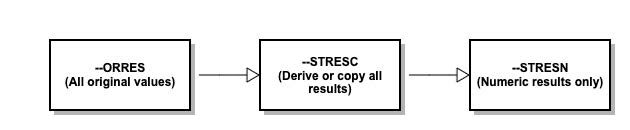

When the original measurement or finding is a selection from a defined codelist, in general, the --ORRES and -- STRESC variables contain results in decoded format (i.e., the textual interpretation of whichever code was selected from the codelist). In some cases where the code values in the codelist are statistically meaningful standardized values or scores, which are defined by sponsors or by valid methodologies such as SF36 questionnaires, the -- ORRES variables will contain the decoded format, whereas the --STRESC variables as well as the --STRESN variables will contain the standardized values or scores.

Occasionally data that are intended to be numeric are collected with characters attached that cause the character-to- numeric conversion to fail. For example, numeric cell counts in the source data may be specified with a greater than (>) or less than (<) sign attached (e.g., >10,000, <1). In these cases, the value with the greater than (>) or less than (<) sign attached should be moved to the --STRESC variable, and --STRESN should be null. The rules for modifying the value for analysis purposes should be defined in the analysis plan and a numeric value should only be imputed in the ADaM datasets. If the value in --STRESC has different units, the greater than (>) or less than (<) sign should be maintained. See Example 1, Rows 11 and 12, in Section 4.5.1.3, Examples of Original and Standard Units and Test Not Done.

##### 4.5.1.2 Tests Not Done

If the data on the CRF is missing and "Yes/No" or "Done/Not Done" was not explicitly captured, a record should not be created to indicate that the data was not collected, with the exception of QRS. Regulatory agencies may require a record for all items on a CRF in QRS datasets (e.g., FT, QS, and clinical classifications in RS).

If a record is created for a test not done, --REASND is populated only if a reason was explicitly collected except for QRS logically skipped items.

When an entire examination (e.g., laboratory draw, ECG, vital signs, physical examination), a group of tests (e.g., hematology, urinalysis), or an individual test (e.g., glucose, PR interval, blood pressure, hearing) is not done, and this information is explicitly captured with a "Yes/No" or "Done/Not Done" question, this information should be represented in the dataset. The reason for the missing information may or may not have been collected.

A sponsor has the following options:

1. Submit individual records for each test not done.
2. Submit 1 record for a group of tests that were not done.

The following example illustrates the single-record approach for representing a group of tests not done.

If a single record is used to represent a group of tests were not done:

- --TESTCD should be --ALL
- --TEST should be `<Domain description>`
- --CAT should be `<Name of group of tests>`
- --ORRES should be null
- --STAT should be "NOT DONE"
- --REASND, if collected, might be "Specimen lost"

For example, if urinalysis tests were not done, then:

- LBTESTCD would be "LBALL"
- LBTEST would be "Laboratory Test Results"
- LBCAT would be "URINALYSIS"
- LBORRES would be null
- LBSTAT would be "NOT DONE"
- LBREASND, if collected, might be "Subject could not void"

##### 4.5.1.3 Examples of Original and Standard Units and Test Not Done

The following examples are meant to illustrate the use of Findings results variables, and are not meant as comprehensive domain examples. Certain required and expected variables are omitted (e.g., USUBJID), and the samples may represent data for more than 1 subject.

Example 1

Row 1: A numeric value was converted to the standard unit.

Row 2: A numeric value was copied; the original unit was the standard unit so conversion was not needed.

Rows 3-4: A character result was copied from the LBORRES to LBSTRESC. Since this is not a numeric result, LBSTRESN is null.

Row 5: A character result was converted to a standardized format.

Row 6: A result of “BLQ” was collected and copied to LBSTRESC. Note that the sponsor populated both LBORRESU and LBSTRESU with standard units, but these could have been left null.

Row 7: A result was derived from multiple results, so LBDRVFL = "Y". Note that the original collected data are not shown in this example.

Row 8: A result for LBTEST = "HCT" is missing for visit 2, as indicated by LBSTAT = “NOT DONE”; neither LBORRES nor LBSTRESC is populated.

Row 9: Tests in the category "HEMATOLOGY" were not done at visit 3, as indicated by LBTESTCD = "LBALL" and LBSTAT = “NOT DONE”.

Row 10: None of the tests in the LB domain were done at visit 4, as indicated by LBTESTCD = "LBALL", a null LBCAT value, and LBSTAT = “NOT DONE”.

Row 11: Shows a result collected as an inequality. The unit collected was the standard unit, so the result required no conversion and was copied to LBSTRESC.

Row 12: Shows a result collected as an inequality. In LBSTRESC, the numeric part of LBORRES has been converted to the standard unit, and the less than (<) sign has been retained. LBSTRESN is not populated.

lb.xpt

| Row | LBTESTCD | LBCAT      | LBORRES  | LBORRESU | LBSTRESC | LBSTRESN | LBSTRESU | LBSTAT   | LBLOBXFL | VISITNUM | LBDTC      |
| --- | -------- | ---------- | -------- | -------- | -------- | -------- | -------- | -------- | -------- | -------- | ---------- |
| 1   | GLUC     | CHEMISTRY  | 6.0      | mg/dL    | 60.0     | 60.0     | mg/L     |          |          | 1        | 2016-02-01 |
| 2   | ALT      | CHEMISTRY  | 12.1     | mg/L     | 12.1     | 12.1     | mg/L     |          |          | 1        | 2016-02-01 |
| 3   | BACT     | URINALYSIS | MODERATE |          | MODERATE |          |          |          |          | 1        | 2016-02-01 |
| 4   | RBC      | URINALYSIS | TRACE    |          | TRACE    |          |          |          |          | 1        | 2016-02-01 |
| 5   | WBC      | URINALYSIS | ++       |          | 2+       |          |          |          |          | 1        | 2016-02-01 |
| 6   | KETONES  | CHEMISTRY  | BLQ      | mg/L     | BLQ      |          | mg/L     |          |          | 1        | 2016-02-01 |
| 7   | MCHC     | HEMATOLOGY |          |          | 33.8     | 33.8     | g/dL     |          | Y        | 3        | 2016-02-15 |
| 8   | HCT      | HEMATOLOGY |          |          |          |          |          | NOT DONE |          | 2        | 2016-02-08 |
| 9   | LBALL    | HEMATOLOGY |          |          |          |          |          | NOT DONE |          | 3        | 2016-02-29 |
| 10  | LBALL    |            |          |          |          |          |          | NOT DONE |          | 4        | 2016-02-22 |
| 11  | WBC      | HEMATOLOGY | <4, 000  | 10^6/L   | <4,000   |          | 10^6/L   |          |          | 6        | 2016-02-07 |
| 12  | BILI     | CHEMISTRY  | <0.1     | mg/dL    | <1.71    |          | umol/L   |          |          | 6        | 2016-02-07 |

Example 2

Row 1: A numeric result was collected in standard units. Because no conversion was necessary, the result was copied into LBSTRESC and LBSTRESN.

Rows 2-3: Numeric results were converted to standard units.

Row 4: Character values were copied to EGSTRESC. EGSTRESN is null.

Row 5: The overall interpretation of the ECG is represented as a separate test.

Row 6: The result for EGTESTCD = "PRAG" was missing at visit 2, as indicated by EGSTAT = "NOT DONE"; neither EGORRES nor EGSTRESC is populated.

Row 7: At visit 3, there were no ECG results, as indicated by EGTESTCD = "EGALL" and EGSTAT = "NOT DONE".

eg.xpt

| Row | EGTESTCD | EGTEST                            | EGORRES        | EGORRESU | EGSTRESC       | EGSTRESN | EGSTRESU | EGSTAT   | VISITNUM | EGDTC      |
| --- | -------- | --------------------------------- | -------------- | -------- | -------------- | -------- | -------- | -------- | -------- | ---------- |
| 1   | QRSAG    | PR Interval, Aggregate 0          | .362           | sec      | 0.362          | 0.362    | sec      |          | 1        | 2015-03-07 |
| 2   | QTAG     | QT Interval, Aggregate 2          | 21             | msec     | 0.221          | 0.221    | sec      |          | 1        | 2015-03-07 |
| 3   | QTCBAG   | QTcB Interval, Aggregate 4        | 12             | msec     | 0.412          | 0.412    | sec      |          | 1        | 2015-03-07 |
| 4   | SPRTARRY | Supraventricular Tachyarrhythmias | ATRIAL FLUTTER |          | ATRIAL FLUTTER |          |          |          | 1        | 2015-03-07 |
| 6   | INTP     | Interpretation                    | ABNORMAL       |          | ABNORMAL       |          |          |          | 1        | 2015-03-07 |
| 5   | PRAG     | PR Interval, Aggregate            |                |          |                |          |          | NOT DONE | 2        | 2015-03-14 |
| 7   | EGALL    | ECG Test Results                  |                |          |                |          |          | NOT DONE | 3        | 2015-03-21 |

Example 3

Rows 1-2: Numeric values were converted to standard units.

Row 3: A result for VSTESTCD = "HR" is missing, as indicated by VSSTAT = "NOT DONE"; neither VSORRES nor VSSTRESC is populated.

Rows 4-5: Two measurements for VSTESTCD= "SYSBP" were done at visit 1.

Row 6: A third measurement for VSTESTCD = "SYSBP" at visit 1 was a derived record, as indicated by VSDRVFL = "Y".

Row 7: At visit 2, there were no Vital Signs results, as indicated by VSTESTCD = "VSALL" and VSSTAT = "NOT DONE".

vs.xpt

| Row | VSTESTCD | VSORRES | VSORRESU | VSSTRESC | VSSTRESN | VSSTRESU | VSSTAT   | VSDRVFL | VISITNUM | VSDTC      |
| --- | -------- | ------- | -------- | -------- | -------- | -------- | -------- | ------- | -------- | ---------- |
| 1   | HEIGHT   | 60      | in       | 152      | 152      | cm       |          |         | 1        | 2016-07-18 |
| 2   | WEIGHT   | 110     | LB       | 50       | 50       | kg       |          |         | 1        | 2016-07-18 |
| 3   | HR       |         |          |          |          |          | NOT DONE |         | 1        | 2016-07-18 |
| 4   | SYSBP    | 96      | mmHg     | 96       | 96       | mmHg     |          |         | 1        | 2016-07-18 |
| 5   | SYSBP    | 100     | mmHg     | 100      | 100      | mmHg     |          |         | 1        | 2016-07-18 |
| 6   | SYSBP    |         |          | 98       | 98       | mmHg     |          | Y       | 1        | 2016-07-18 |
| 7   | VSALL    |         |          |          |          |          | NOT DONE |         | 2        | 2016-07-25 |

#### 4.5.2 Linking Multiple Observations

See Section 8, Representing Relationships and Data, for guidance on expressing relationships among multiple observations.

#### 4.5.3 Text Strings that Exceed the Maximum Length for General Observation-class Domain Variables

##### 4.5.3.1 Test Name (--TEST) Greater than 40 Characters

Sponsors may have test descriptions (--TEST) longer than 40 characters in their operational database. Because the --TEST variable is meant to serve as a label for a --TESTCD when a Findings dataset is transposed to a more horizontal format, the length of --TEST is limited to 40 characters (except as noted below) to conform to the limitations of the SAS V5 transport file format (https://documentation.sas.com/). Therefore, sponsors have the choice to either insert the first 40 characters or a text string abbreviated to 40 characters in --TEST. Sponsors have the following options for including the full description for these variables in the study metadata:

- If the annotated CRF contains the full text, provide a reference to the aCRF page containing the full test description in the Define-XML document origin definition for --TEST.
- If the annotated CRF does not specify the full text, then the full text should be documented in the Define-XML document and/or other submission materials (e.g., the clinical study data reviewer's guide).

This convention should also be applied to the qualifier value label (QLABEL) in Supplemental Qualifiers (SUPP--) datasets. IETEST values in the Inclusion/Exclusion Criteria Not Met (IE) and Trial Inclusion/Exclusion Criteria (TI) domains are exceptions to the 40-character rule and are limited to 200 characters, because these are not expected to be transformed to column labels. Values of IETEST that exceed 200 characters should be described in study metadata as per the convention above. See Section 6.3.4, Inclusion/Exclusion Criteria Not Met, assumption 3; and Section 7.4.1, Trial Inclusion/Exclusion Criteria, assumption 5.

##### 4.5.3.2 Text Strings Greater than 200 Characters in Other Variables

Some sponsors may collect data values longer than 200 characters for some variables. Because of the current requirement for the SAS V5 transport file format, it is not possible to store long text strings using only 1 variable. Therefore, the SDTMIG has defined conventions for storing long text strings using multiple variables.

For general observation-class variables and supplemental qualifiers (i.e., non-standard variables, NSVs), the conventions are as follows:

- The first 200 characters of text should be stored in the parent domain variable and each additional 200 characters of text should be stored in a record in the SUPP-- dataset (see Section 8.4, Relating Non- standard Variable Values to a Parent Domain).
- When splitting a text string into several records, the text should be split between words to improve readability.
- When the text longer than 200 characters is for a supplemental qualifier, the first QNAM should describe the NSV without any numeric suffix.
- The value for QNAMs for additional text (>200 characters) should contain a sequential variable name, which is formed by appending a 1-digit integer, beginning with 1, to the original domain variable name.
- The value for QLABEL should be the original domain variable label.

  - The reason a digit integer or suffix is not appended to the label is because the long text string represents a single value for a variable. The physical representation (i.e., SAS V5 transport file format) does not change the concept described by the label.
  - This is different conceptually from when there are multiple values for a non-result qualifier variable and values are individually stored in SUPP--. In that case, both QNAM and QLABEL must be uniquely named (see Section 4.2.8.3, Multiple Values for a Non-result Qualifier Variable) because they represent multiple values for a single variable.
  - In cases where the standard domain variable name is already 8 characters in length, sponsors should replace the last character with a digit when creating values for QNAM. As an example, for Other Action Taken in Adverse Events (AEACNOTH), values for QNAM for the SUPPAE records would have the values AEACNOT1, AEACNOT2, and so on.

Example 1

In this example, the text entered for MHTERM was longer than 200 characters and required 2 supplemental qualifier variables for the text that extended beyond what could be represented in the standard variable.

mh.xpt

| Row | STUDYID | DOMAIN | USUBJID | MHSEQ | MHTERM                                      |
| --- | ------- | ------ | ------- | ----- | ------------------------------------------- |
| 1   | 12345   | MH     | 99-123  | 6     | 1st ~200 chars of text, split between words |

suppmh.xpt

| Row | STUDYID | RDOMAIN | USUBJID | IDVAR | IDVARVAL | QNAM    | QLABEL                                | QVAL                                        | QORIG | QEVAL |
| --- | ------- | ------- | ------- | ----- | -------- | ------- | ------------------------------------- | ------------------------------------------- | ----- | ----- |
| 1   | 12345   | MH      | 99-123  | MHSEQ | 6        | MHTERM1 | Reported Term for the Medical History | 2nd ~200 chars of text, split between words | CRF   |       |
| 2   | 12345   | MH      | 99-123  | MHSEQ | 6        | MHTERM2 | Reported Term for the Medical History | last 100 or more chars of text              | CRF   |       |

Example 2

In this example, the text entered for AEACNOTH was longer than 200 characters, but required only 1 supplemental qualifier for the text that extended beyond what could be represented in the standard variable.

ae.xpt

| Row | STUDYID | DOMAIN | USUBJID | AESEQ | AETERM        | AEACNOTH                                         |
| --- | ------- | ------ | ------- | ----- | ------------- | ------------------------------------------------ |
| 1   | 12345   | AE     | 99-123  | 4     | HEART FAILURE | 1st ~200 characters of text, split between words |

suppae.xpt

| Row | STUDYID | RDOMAIN | USUBJID | IDVAR | IDVARVAL | QNAM     | QLABEL             | QVAL                         | QORIG | QEVAL |
| --- | ------- | ------- | ------- | ----- | -------- | -------- | ------------------ | ---------------------------- | ----- | ----- |
| 1   | 12345   | AE      | 99-123  | AESEQ | 4        | AEACNOT1 | Other Action Taken | remaining characters of text | CRF   |       |

Example 3

pr.xpt

| Row | STUDYID | DOMAIN | USUBJID | PRSEQ | PRTRT             |
| --- | ------- | ------ | ------- | ----- | ----------------- |
| 1   | 12345   | PR     | 99-123  | 4     | KIDNEY TRANSPLANT |

In this example, the text of the supplemental qualifier PRREAS was longer than 200 characters, but required only 1 additional supplemental qualifier to represent the remaining text.

supppr.xpt

| Row | STUDYID | RDOMAIN | USUBJID | IDVAR | IDVARVAL | QNAM    | QLABEL | QVAL                                             |
| --- | ------- | ------- | ------- | ----- | -------- | ------- | ------ | ------------------------------------------------ |
| 1   | 12345   | PR      | 99-123  | PRSEQ | 4        | PRREAS  | Reason | 1st ~200 characters of text, split between words |
| 2   | 12345   | PR      | 99-123  | PRSEQ | 4        | PRREAS1 | Reason | remaining characters of text                     |

The following domains have specialized conventions for representing values longer than 200 characters:

- CO (see Section 5.1, Comments, assumption 4)
- IE (see Section 6.3.4, Inclusion/Exclusion Criteria Not Met, assumption 3)
- TS (see Section 7.4.2, Trial Summary Information, assumption 4)
- TI (see Section 7.4.1, Trial Inclusion/Exclusion Criteria, assumption 5)

The following table summarizes the conventions and notes the specializations.

| Text Strings >200 Char                                                                                                                                          | Text Strings >200 Char Conventions CO.COVAL                                                                                                 | Text Strings >200 Char                                                                                                                      | Text Strings >200 Char                                                                                                                       |
| --------------------------------------------------------------------------------------------------------------------------------------------------------------- | ------------------------------------------------------------------------------------------------------------------------------------------- | ------------------------------------------------------------------------------------------------------------------------------------------- | -------------------------------------------------------------------------------------------------------------------------------------------- |
| Conventions                                                                                                                                                     |                                                                                                                                             | Conventions                                                                                                                                 | Conventions                                                                                                                                  |
| General Observation Class and                                                                                                                                   |                                                                                                                                             | TS.TSVAL                                                                                                                                    | TI.IETEST and IE.IETEST                                                                                                                      |
| Supplemental Qualifier Variables                                                                                                                                |                                                                                                                                             |                                                                                                                                             |                                                                                                                                              |
| The first 200 characters of text should be stored in the variable and each additional 200 characters of text should be stored as a record in the SUPP-- dataset | The first 200 characters of text should be stored in COVAL and each additional 200 characters of text should be stored in COVAL1 to COVALn. | The first 200 characters of text should be stored in TSVAL and each additional 200 characters of text should be stored in TSVAL1 to TSVALn. | If the inclusion/exclusion criteria text is >200 characters, put meaningful text in IETEST and describe the full text in the study metadata. |
| When splitting a text string into several records, the text should be split between words to improve readability.                                               | When splitting a text string into several records, the text should be split between words to improve readability.                           | When splitting a text string into several records, the text should be split between words to improve readability.                           | Not applicable.                                                                                                                              |
| The value for QLABEL should be the original domain variable label.                                                                                              | The variable labels for COVAL1 to COVALn should be "Comment".                                                                               | The variable labels for TSVAL1 to TSVALn should be "Parameter Value".                                                                       | Not applicable.                                                                                                                              |

#### 4.5.4 Evaluators in the Interventions and Events Observation Classes

Because observations may originate from more than 1 source (e.g., investigator, independent assessor), observations recorded in the Findings class include the --EVAL qualifier. For the Interventions and Events observation classes, which do not include the --EVAL variable, all data are assumed to be attributed to the principal investigator. The QEVAL variable can be used to describe the evaluator for any data item in a SUPP-- dataset (see Section 8.4.1, Supplemental Qualifiers – SUPP-- Datasets), but is not required when the data are objective. For observations that have primary and secondary evaluations of specific qualifier variables, sponsors should put data from the primary evaluation into the standard domain dataset and data from the secondary evaluation into the Supplemental Qualifier datasets (SUPP--). Within each SUPP-- record, the value for QNAM should be formed by appending a "1" to the corresponding standard domain variable name. In cases where the standard domain variable name is already 8 characters in length, sponsors should replace the last character with a "1" (incremented for each additional attribution).

This example illustrates a case where an adjudication committee evaluated an adverse event. The evaluations of the adverse event by the primary investigator were represented in the standard AE dataset. The evaluations of the adjudication committee were represented in SUPPAE. See Section 8.4, Relating Non-standard Variable Values to a

Parent Domain. Note that the QNAM for the "Relationship to Non-study Treatment" supplemental qualifier is AERELNS1, rather than AERELNST1, because AERELNST is already 8 characters in length.

suppae.xpt

| Row | STUDYID | RDOMAIN | USUBJID | IDVAR | IDVARVAL | QNAM     | QLABEL                              | QVAL                            | QORIG | QEVAL                  |
| --- | ------- | ------- | ------- | ----- | -------- | -------- | ----------------------------------- | ------------------------------- | ----- | ---------------------- |
| 1   | 12345   | AE      | 99-123  | AESEQ | 3        | AESEV1   | Severity/ Intensity                 | MILD                            | CRF   | ADJUDICATION COMMITTEE |
| 2   | 12345   | AE      | 99-123  | AESEQ | 3        | AEREL1   | Causality                           | POSSIBLY RELATED                | CRF   | ADJUDICATION COMMITTEE |
| 3   | 12345   | AE      | 99-123  | AESEQ | 3        | AERELNS1 | Relationship to Non-study Treatment | Possibly related to aspirin use | CRF   | ADJUDICATION COMMITTEE |

#### 4.5.5 Clinical Significance for Findings Observation Class Data

For assessments of clinical significance when the overall interpretation is a record in the domain, use the --CLSIG (Clinically Significant) variable on the record that contains the overall interpretation or a particular result. For example, EGCLSIG = "Y" indicates that an ECG result of "ATRIAL FIBRILLATION" was clinically significant.

Separate from clinical significance are results of "NORMAL" or "ABNORMAL", or lab values that are out of normal range. Examples of the latter include:

- An ECG test with EGTESTCD = "INTP" (which addresses the ECG as a whole) should have a result or of "NORMAL" or "ABNORMAL". A record for EGTESTCD = "INTP" may also have EGCLSIG indicating whether the result is clinically significant.
- A record for a vital signs measurement (e.g., systolic blood pressure) or a lab test (e.g., hematocrit) that contains a measurement may have a normal range and a normal range indicator. It could also have --CLSIG indicating whether the result was clinically significant.

#### 4.5.6 Supplemental Reason Variables

The SDTM general observation classes include the --REASND variable to submit the reason a response is not present (a result in a findings class or an --OCCUR value in an events or interventions variable). For Events and Interventions domains where prespecified occurrences have a reason for the "Y" or "N" value of --OCCUR, the reason can be represented with the variable --REASOC. However, sponsors sometimes collect the reason that something was done. For the Interventions general observation class, --INDC is available to represent the medical condition for which the intervention was given, and --ADJ is available to represent the reason for a dose adjustment. For the Findings general observation class, --REASPF is available to represent the reason a test was performed. If the sponsor collects a reason for performing an activity represented in an Events domain where the topic is not a medical condition, or a reason for an intervention other than a medical indication, the reason can be represented in the SUPP-- dataset (as described in Section 8.4.1, Supplemental Qualifiers – SUPP-- Datasets) using the supplemental qualifier with QNAM of "--REAS" listed in Appendix C1, Supplemental Qualifiers Name Codes. If multiple reasons are reported, refer to Section 4.2.8.3, Multiple Values for a Non-result Qualifier Variable.

For example, if the sponsor collected the reason for admission to a nursing home was for rehabilitation, a SUPPHO record might be populated as follows.

suppho.xpt

| Row | STUDYID | RDOMAIN | USUBJID | IDVAR | IDVARVAL | QNAM   | QLABEL | QVAL           | QORIG |
| --- | ------- | ------- | ------- | ----- | -------- | ------ | ------ | -------------- | ----- |
| 1   | 12345   | HO      | 99-123  | HOSEQ | 3        | HOREAS | Reason | REHABILITATION | CRF   |

#### 4.5.7 Presence or Absence of Prespecified Interventions and Events

Interventions (e.g., concomitant medications) and events (e.g., medical history) can generally be collected in 2 different ways, by recording either verbatim free text or the responses to a prespecified list of treatments or terms. Because the method of solicitation for information on treatments and terms may affect the frequency at which they are reported, whether they were prespecified may be of interest to reviewers. The --PRESP variable is used to indicate whether a specific intervention (--TRT) or event (--TERM) was solicited. The --PRESP variable has controlled terminology of "Y" (for "Yes") or a null value. It is a permissible variable, and should only be used when the topic variable values come from a prespecified list. Questions such as "Did the subject have any concomitant medications?" or "Did the subject have any medical history?" should not have records in an SDTM domain because

(1) these are not valid values for the respective topic variables of CMTRT and MHTERM, and (2) records whose sole purpose is to indicate whether or not a subject had records are not meaningful. The --OCCUR variable is used to indicate whether a prespecified intervention or event occurred or did not occur. It has controlled terminology of "Y" and "N" (for "Yes" and "No"). It is a permissible variable and may be omitted from the dataset if no topic-variable values were prespecified.

If a study collects both prespecified interventions and events as well as free-text events and interventions, the value of --OCCUR should be "Y" or "N" for all prespecified interventions and events, and null for those reported as free text.

The --STAT and --REASND variables can be used to provide information about prespecified interventions and events for which there is no response (e.g., investigator forgot to ask). As in Findings, --STAT has controlled terminology of NOT DONE.

| Situation                             | Value of --PRESP | Value of --OCCUR | Value of --STAT |
| ------------------------------------- | ---------------- | ---------------- | --------------- |
| Spontaneously reported event occurred |                  |                  |                 |
| Prespecified event occurred           | Y                | Y                |                 |
| Prespecified event did not occur      | Y                | N                |                 |
| Prespecified event has no response    | Y                |                  | NOT DONE        |

Collection design may prespecify specific treatments or terms or prespecify a group of treatments or terms (e.g., "Was a short-acting bronchodilator taken in the 8 hours prior to spirometry?"). When an explicit question asks about the occurrence of a group of interventions or events, the group value should be represented in --TRT or --TERM, respectively.

Refer to the standard domains in the Events and Interventions general observation classes for additional assumptions and examples.

#### 4.5.8 Accounting for Long-term Follow-up

Studies often include long-term follow-up assessments to monitor a subject's condition. Use cases include studies in terminally ill populations that periodically assess survival and studies involving chronic disease that include follow- up to assess relapse. Long-term follow-up is often conducted via telephone calls rather than clinic visits. Regardless of the method of contact, the information should be stored in the appropriate topic-based domain.

Overall study conclusion in the Disposition (DS) domain occurs once all contact with the subject ceases. If a study has a clinical treatment phase followed by a long-term follow-up phase, these 2 segments of the study can be represented as separate epochs within the overall study, each with its own epoch disposition record.

The following example illustrates the recommended SDTM approach to storing these data.

An oncology study encompasses 2 months of clinical treatment and assessments followed by once-monthly telephone contacts. The contacts continue until the subject dies. During the telephone contact, the investigator collects information on the subject's survival status and medication use. The answers to certain questions may trigger other data collection. For example, if the subject's survival status is "dead", then this indicates that the subject has ceased participation in the study, so a study discontinuation record would need to be created. In SDTM, the data related to these follow-up telephone contacts should be stored as follows:

1. Concomitant medications reported during the contact should be stored in the CM domain.
2. The subject's survival status should be stored in the Subject Status (SS) domain.
3. The disposition of the subject at the time of the final follow-up contact should be stored in DS. Note that overall study conclusion is the point where any contact with the subject ceases, which in this example is also the conclusion of long-term follow-up. The disposition of the subject at the conclusion of the 2-month clinical treatment phase would be stored in DS as the conclusion to that epoch. Long-term follow-up would be represented as a separate epoch. Therefore, in this example the subject could have 3 disposition records in DS, with both the follow-up epoch disposition and the overall study conclusion disposition being collected at the final telephone contact. See Section 6.2.4, Disposition, for detailed assumptions and examples.
4. If the subject's survival status is "dead", the Demographics (DM) variables DTHDTC and DTHFL must be appropriately populated.
5. The long-term follow-up phase would be represented in Trial Arms (TA), Trial Elements (TE), and Trial Visits (TV).
6. The contacts would be recorded in Subject Visits (SV) and Subject Elements (SE) consistent with the way they are represented in TV and TE.

#### 4.5.9 Baseline Values

The variable --LOBXFL was introduced in SDTMIG v3.3 to address the need for a consistent definition of a value that can serve as a reference with which to compare post-treatment values. This generic definition approximates the concept of baseline and can be used to calculate post-treatment changes. In domains where --BLFL was expected, its core value was changed from expected to permissible and the variable --LOBXFL, with a core value of expected, was added to contain the consistent definition. In domains where --BLFL was permissible, the variable --LOBXFL was added with a core value of permissible.

The following table shows a set of similar flag variables and their usage across the SDTM and ADaM.

| Variable  | Structure           | Requirement in That Structure                   | Definition                                                                                                                                                                               | Intended Use                                                                              |
| --------- | ------------------- | ----------------------------------------------- | ---------------------------------------------------------------------------------------------------------------------------------------------------------------------------------------- | ----------------------------------------------------------------------------------------- |
|           | Where It Is Defined |                                                 |                                                                                                                                                                                          |                                                                                           |
| -- LOBXFL | SDTM Findings       | Expected or Permissible                         | Last non-missing value prior to RFXSTDTC (operationally derived)                                                                                                                         | Consistent pre-treatment reference value baseline for use across all studies and sponsors |
| ABLFL     | ADaM BDS            | Conditionally Required                          | Flags the record that is the source of the baseline value for a given parameter specified in the statistical analysis plan (SAP; may differ both across and within studies and datasets) | Baseline for ADaM analysis as specified in the SAP                                        |
| --BLFL    | SDTM Findings       | Permissible (formerly Expected in some domains) | A baseline defined by the sponsor (could be derived in the same manner as --LOBXFL or ABLFL, but is not required to be)                                                                  | Any sponsor-defined baseline use                                                          |

As shown in the table, each variable serves a specific need. The SDTM variable --LOBXFL (and/or --BLFL, if used) can be copied to ADaM for traceability and transparency, but only the ADaM variable ABLFL would be used to signify baseline for analysis. The content of --LOBXFL and ABLFL will be exactly the same when the SAP specifies that the baseline used for analysis is the last non-missing value prior to RFXSTDTC.

## 5 Models for Special-purpose Domains

Special-purpose Domains is an SDTM class in its own right. Special-purpose domains provide specific, standardized structures to represent additional important information that does not fit any of the general observation classes.

### 5.1 Comments (CO)

CO – Description/Overview

A special-purpose domain that contains comments that may be collected alongside other data.

CO – Specification

co.xpt, Comments — Special Purpose. One record per comment per subject, Tabulation.

| Variable Name | Variable Label              | Type | Controlled Terms, Codelist or Format1 | Role             | CDISC Notes                                                                                                                                                                                                                                       | Core |
| ------------- | --------------------------- | ---- | ------------------------------------- | ---------------- | ------------------------------------------------------------------------------------------------------------------------------------------------------------------------------------------------------------------------------------------------- | ---- |
| STUDYID       | Study Identifier            | Char |                                       | Identifier       | Unique identifier for a study.                                                                                                                                                                                                                    | Req  |
| DOMAIN        | Domain Abbreviation         | Char | CO                                    | Identifier       | Two-character abbreviation for the domain.                                                                                                                                                                                                        | Req  |
| RDOMAIN       | Related Domain Abbreviation | Char | (DOMAIN)                              | Record Qualifier | Two-character abbreviation for the domain of the parent record(s). Null for comments collected on a general comments or additional information CRF page.                                                                                          | Perm |
| USUBJID       | Unique Subject Identifier   | Char |                                       | Identifier       | Identifier used to uniquely identify a subject across all studies for all applications or submissions involving the product.                                                                                                                      | Req  |
| COSEQ         | Sequence Number             | Num  |                                       | Identifier       | Sequence Number given to ensure uniqueness of subject records within a domain. May be any valid number.                                                                                                                                           | Req  |
| IDVAR         | Identifying Variable        | Char | *                                     | Record Qualifier | Identifying variable in the parent dataset that identifies the record(s) to which the comment applies. Examples AESEQ or CMGRPID. Used only when individual comments are related to domain records. Null for comments collected on separate CRFs. | Perm |
| IDVARVAL      | Identifying Variable Value  | Char |                                       | Record Qualifier | Value of identifying variable of the parent record(s). Used only when individual comments are related to domain records. Null for comments collected on separate CRFs.                                                                            | Perm |
| COREF         | Comment Reference           | Char |                                       | Record Qualifier | Sponsor-defined reference associated with the comment. May be the CRF page number (e.g., 650), or a module name (e.g., DEMOG), or a combination of information that identifies the reference (e.g. 650- VITALS-VISIT 2).                          | Perm |
| COVAL         | Comment                     | Char |                                       | Topic            | The text of the comment. Text over 200 characters can be added to additional columns COVAL1- COVALn. See Assumption 3.                                                                                                                            | Req  |
| COEVAL        | Evaluator                   | Char | (EVAL)                                | Record Qualifier | Role of the person who provided the evaluation. Used only for results that are subjective (e.g., assigned by a person or a group). Example: "INVESTIGATOR".                                                                                       | Perm |
| COEVALID      | Evaluator Identifier        | Char | (MEDEVAL)                             | Record Qualifier | Used to distinguish multiple evaluators with the same role recorded in --EVAL. Examples: "RADIOLOGIST", "RADIOLOGIST 1", "RADIOLOGIST 2".                                                                                                         | Perm |
| CODTC         | Date/Time of Comment        | Char | ISO 8601 datetime or interval         | Timing           | Date/time of comment on dedicated comment form. Should be null if this is a child record of another domain or if comment date was not collected.                                                                                                  | Perm |
| CODY          | Study Day of Comment        | Num  |                                       | Timing           | Study day of the comment, in integer days. The algorithm for calculations must be relative to the sponsor- defined RFSTDTC variable in the Demographics (DM) domain.                                                                              | Perm |

1In this column, an asterisk (*) indicates that the variable may be subject to controlled terminology. CDISC/NCI codelist values are enclosed in parentheses.

CO – Assumptions

1. The Comments special-purpose domain provides a solution for submitting free-text comments related to data in 1 or more SDTM domains (as described in Section 8.5, Relating Comments to a Parent Domain) or collected on a separate CRF page dedicated to comments. Comments are generally not responses to specific questions; instead, comments usually consist of voluntary free-text or unsolicited observations.
2. Although the structure for the Comments domain in the SDTM is "One record per comment", USUBJID is required in the comments domain for human clinical trials, so the structure of the Comments domain in the SDTMIG is "One record per comment per subject."
3. The CO dataset accommodates 3 sources of comments:

   a. Those unrelated to a specific domain or parent record(s), in which case the values of the variables RDOMAIN, IDVAR, and IDVARVAL are null. CODTC should be populated if captured. See Example 1, row 1.

   b. Those related to a domain but not to specific parent record(s), in which case the value of the variable RDOMAIN is set to the DOMAIN code of the parent domain and the variables IDVAR and IDVARVAL are null. CODTC should be populated if captured. See Example 1, row 2.

   c. Those related to a specific parent record or group of parent records, in which case the value of the variable RDOMAIN is set to the DOMAIN code of the parent record(s) and the variables IDVAR and IDVARVAL are populated with the key variable name and value of the parent record(s). Assumptions for populating IDVAR and IDVARVAL are further described in Section 8.5, Relating Comments to a Parent Domain. CODTC should be null because the timing of the parent record(s) is inherited by the comment record. See Example 1, rows 3-5.
4. When the comment text is longer than 200 characters, the first 200 characters of the comment will be in COVAL, the next 200 in COVAL1, and additional text stored as needed to COVALn. See Example 1, rows 3-4. Additional information about how to relate comments to parent SDTM records is provided in Section 8.5, Relating Comments to a Parent Domain.
5. The variable COREF may be null unless it is used to identify the source of the comment. See Example 1, rows 1 and 5.
6. Identifier variables and Timing variables may be added to the CO domain, but the following qualifiers would generally not be used in CO: --GRPID, --REFID, --SPID, TAETORD, --TPT, --TPTNUM, --ELTM, --TPTREF, --RFTDTC.

CO – Examples

Example 1

Row 1: Shows a comment collected on a separate comments page. Since it was unrelated to any specific domain or record, RDOMAIN, IDVAR, and IDVARVAL are null.

Row 2: Shows a comment that was collected on the bottom of the PE page for Visit 7, without any indication of specific records it applied to. Since the comment related to a specific domain, RDOMAIN is populated. Since it was related to a specific visit, VISIT, COREF is "VISIT 7". However, since it does not relate to a specific record, IDVAR and IDVARVAL are null.

Row 3: Shows a comment related to a single AE record having its AESEQ=7.

Row 4: Shows a comment related to multiple EX records with EXGRPID = "COMBO1".

Row 5: Shows a comment related to multiple VS records with VSGRPID = "VS2".

Row 6: Shows one option for representing a comment collected on a visit-specific comments page not associated with a particular domain. In this case, the comment is linked to the Subject Visit record in SV (RDOMAIN = "SV") and IDVAR and IDVARVAL are populated link the comment to the particular visit.

Row 7: Shows a second option for representing a comment associated only with a visit. In this case, COREF is used to show that the comment is related to the particular visit.

Row 8: Shows a third option for representing a comment associated only with a visit. In this case, the VISITNUM variable was populated to indicate that the comment was associated with a particular visit.

co.xpt

| Row | STUDYID | DOMAIN | RDOMAIN | USUBJID | COSEQ | IDVAR    | IDVARVAL | COREF         | COVAL                | COVAL1              | COVAL2         | COEVAL                 | VISITNUM | CODTC       |
| --- | ------- | ------ | ------- | ------- | ----- | -------- | -------- | ------------- | -------------------- | ------------------- | -------------- | ---------------------- | -------- | ----------- |
| 1   | 1234    | CO     |         | AB-99   | 1     |          |          |               | Comment text         |                     |                | PRINCIPAL INVESTIGATOR |          | 2003-11- 08 |
| 2   | 1234    | CO     | PE      | AB-99   | 2     |          |          | VISIT 7       | Comment text         |                     |                | PRINCIPAL INVESTIGATOR |          | 2004-01- 14 |
| 3   | 1234    | CO     | AE      | AB-99   | 3     | AESEQ    | 7        | PAGE 650      | First 200 characters | Next 200 characters | Remaining text | PRINCIPAL INVESTIGATOR |          |             |
| 4   | 1234    | CO     | EX      | AB-99   | 4     | EXGRPID  | COMBO1   | PAGE 320- 355 | First 200 characters | Remaining text      |                | PRINCIPAL INVESTIGATOR |          |             |
| 5   | 1234    | CO     | VS      | AB-99   | 5     | VSGRPID  | VS2      |               | Comment text         |                     |                | PRINCIPAL INVESTIGATOR |          |             |
| 6   | 1234    | CO     | SV      | AB-99   | 6     | VISITNUM | 4        |               | Comment Text         |                     |                | PRINCIPAL INVESTIGATOR |          |             |
| 7   | 1234    | CO     |         | AB-99   | 7     |          |          | VISIT 4       | Comment Text         |                     |                | PRINCIPAL INVESTIGATOR |          |             |
| 8   | 1234    | CO     |         | AB-99   | 8     |          |          |               | Comment Text         |                     |                | PRINCIPAL INVESTIGATOR | 4        |             |

### 5.2 Demographics (DM)

DM – Description/Overview

A special-purpose domain that includes a set of essential standard variables that describe each subject in a clinical study. It is the parent domain for all other observations for human clinical subjects.

DM – Specification

dm.xpt, Demographics — Special Purpose. One record per subject, Tabulation.

| Variable Name | Variable Label                           | Type | Controlled Terms, Codelist or Format1 | Role               | CDISC Notes                                                                                                                                                                                                                                                                                                                                                                                                                                                                                                                                                                                                                                                                    | Core |
| ------------- | ---------------------------------------- | ---- | ------------------------------------- | ------------------ | ------------------------------------------------------------------------------------------------------------------------------------------------------------------------------------------------------------------------------------------------------------------------------------------------------------------------------------------------------------------------------------------------------------------------------------------------------------------------------------------------------------------------------------------------------------------------------------------------------------------------------------------------------------------------------ | ---- |
| STUDYID       | Study Identifier                         | Char |                                       | Identifier         | Unique identifier for a study.                                                                                                                                                                                                                                                                                                                                                                                                                                                                                                                                                                                                                                                 | Req  |
| DOMAIN        | Domain Abbreviation                      | Char | DM                                    | Identifier         | Two-character abbreviation for the domain.                                                                                                                                                                                                                                                                                                                                                                                                                                                                                                                                                                                                                                     | Req  |
| USUBJID       | Unique Subject Identifier                | Char |                                       | Identifier         | Identifier used to uniquely identify a subject across all studies for all applications or submissions involving the product. This must be a unique value, and could be a compound identifier formed by concatenating STUDYID-SITEID-SUBJID.                                                                                                                                                                                                                                                                                                                                                                                                                                    | Req  |
| SUBJID        | Subject Identifier for the Study         | Char |                                       | Topic              | Subject identifier, which must be unique within the study. Often the ID of the subject as recorded on a CRF.                                                                                                                                                                                                                                                                                                                                                                                                                                                                                                                                                                   | Req  |
| RFSTDTC       | Subject Reference Start Date/Time        | Char | ISO 8601 datetime or interval         | Record Qualifier   | Reference start date/time for the subject in ISO 8601 character format. Usually equivalent to date/time when subject was first exposed to study treatment. See assumption 9 for additional detail on when RFSTDTC may be null.                                                                                                                                                                                                                                                                                                                                                                                                                                                 | Exp  |
| RFENDTC       | Subject Reference End Date/Time          | Char | ISO 8601 datetime or interval         | Record Qualifier   | Reference end date/time for the subject in ISO 8601 character format. Usually equivalent to the date/time when subject was determined to have ended the trial, and often equivalent to date/time of last exposure to study treatment. Required for all randomized subjects; null for screen failures or unassigned subjects.                                                                                                                                                                                                                                                                                                                                                   | Exp  |
| RFXSTDTC      | Date/Time of First Study Treatment       | Char | ISO 8601 datetime or interval         | Record Qualifier   | First date/time of exposure to any protocol-specified treatment or therapy, equal to the earliest value of EXSTDTC.                                                                                                                                                                                                                                                                                                                                                                                                                                                                                                                                                            | Exp  |
| RFXENDTC      | Date/Time of Last Study Treatment        | Char | ISO 8601 datetime or interval         | Record Qualifier   | Last date/time of exposure to any protocol-specified treatment or therapy, equal to the latest value of EXENDTC (or the latest value of EXSTDTC if EXENDTC was not collected or is missing).                                                                                                                                                                                                                                                                                                                                                                                                                                                                                   | Exp  |
| RFCSTDTC      | Date/Time of First Challenge Agent Admin | Char | ISO 8601 datetime or interval         | Record Qualifier   | Used only when protocol specifies a challenge agent to induce a condition that the investigational treatment is intended to cure, mitigate, treat, or prevent. Equal to the earliest value of AGSTDTC for the challenge agent.                                                                                                                                                                                                                                                                                                                                                                                                                                                 | Perm |
| RFCENDTC      | Date/Time of Last Challenge Agent Admin  | Char | ISO 8601 datetime or interval         | Record Qualifier   | Used only when protocol specifies a challenge agent to induce a condition that the investigational treatment is intended to cure, mitigate, treat, or prevent. Equal to the latest value of AGENDTC for the challenge agent (or the latest value of AGSTDTC if AGENDTC was not collected or is missing).                                                                                                                                                                                                                                                                                                                                                                       | Perm |
| RFICDTC       | Date/Time of Informed Consent            | Char | ISO 8601 datetime or interval         | Record Qualifier   | Date/time of informed consent in ISO 8601 character format. This will be the same as the date of informed consent in the Disposition domain, if that protocol milestone is documented. Would be null only in studies not collecting the date of informed consent.                                                                                                                                                                                                                                                                                                                                                                                                              | Exp  |
| RFPENDTC      | Date/Time of End of Participation        | Char | ISO 8601 datetime or interval         | Record Qualifier   | Date/time when subject ended participation or follow-up in a trial, as defined in the protocol, in ISO 8601 character format. Should correspond to the last known date of contact. Examples include completion date, withdrawal date, last follow-up, date recorded for lost to follow up, and death date.                                                                                                                                                                                                                                                                                                                                                                     | Exp  |
| DTHDTC        | Date/Time of Death                       | Char | ISO 8601 datetime or interval         | Record Qualifier   | Date/time of death for any subject who died, in ISO 8601 format. Should represent the date/time that is captured in the clinical-trial database.                                                                                                                                                                                                                                                                                                                                                                                                                                                                                                                               | Exp  |
| DTHFL         | Subject Death Flag                       | Char | (NY)                                  | Record Qualifier   | Indicates the subject died. Should be "Y" or null. Should be populated even when the death date is unknown.                                                                                                                                                                                                                                                                                                                                                                                                                                                                                                                                                                    | Exp  |
| SITEID        | Study Site Identifier                    | Char | *                                     | Record Qualifier   | Unique identifier for a site within a study.                                                                                                                                                                                                                                                                                                                                                                                                                                                                                                                                                                                                                                   | Req  |
| INVID         | Investigator Identifier                  | Char |                                       | Record Qualifier   | An identifier to describe the Investigator for the study. May be used in addition to SITEID. Not needed if SITEID is equivalent to INVID.                                                                                                                                                                                                                                                                                                                                                                                                                                                                                                                                      | Perm |
| INVNAM        | Investigator Name                        | Char |                                       | Synonym Qualifier  | Name of the investigator for a site.                                                                                                                                                                                                                                                                                                                                                                                                                                                                                                                                                                                                                                           | Perm |
| BRTHDTC       | Date/Time of Birth                       | Char | ISO 8601 datetime or interval         | Record Qualifier   | Date/time of birth of the subject.                                                                                                                                                                                                                                                                                                                                                                                                                                                                                                                                                                                                                                             | Perm |
| AGE           | Age                                      | Num  |                                       | Record Qualifier   | Age expressed in AGEU. May be derived from RFSTDTC and BRTHDTC, but BRTHDTC may not be available in all cases (due to subject privacy concerns).                                                                                                                                                                                                                                                                                                                                                                                                                                                                                                                               | Exp  |
| AGEU          | Age Units                                | Char | (AGEU)                                | Variable Qualifier | Units associated with AGE.                                                                                                                                                                                                                                                                                                                                                                                                                                                                                                                                                                                                                                                     | Exp  |
| SEX           | Sex                                      | Char | (SEX)                                 | Record Qualifier   | Sex of the subject.                                                                                                                                                                                                                                                                                                                                                                                                                                                                                                                                                                                                                                                            | Req  |
| RACE          | Race                                     | Char | (RACE)                                | Record Qualifier   | Race of the subject. Sponsors should refer to the FDA guidance2 regarding the collection of race. See assumption below regarding RACE.                                                                                                                                                                                                                                                                                                                                                                                                                                                                                                                                         | Exp  |
| ETHNIC        | Ethnicity                                | Char | (ETHNIC)                              | Record Qualifier   | The ethnicity of the subject. Sponsors should refer to the FDA guidance1 regarding the collection of ethnicity.                                                                                                                                                                                                                                                                                                                                                                                                                                                                                                                                                                | Perm |
| ARMCD         | Planned Arm Code                         | Char | *                                     | Record Qualifier   | ARMCD is limited to 20 characters. It is not subject to the character restrictions that apply to TESTCD. The maximum length of ARMCD is longer than for other "short" variables to accommodate the kind of values that are likely to be needed for crossover trials. For example, if ARMCD values for a 7-period crossover were constructed using 2-character abbreviations for each treatment and separating hyphens, the length of ARMCD values would be 20. If the subject was not assigned to a trial arm, ARMCD is null and ARMNRS is populated. With the exception of studies which use multistage arm assignments, must be a value of ARMCD in the Trial Arms dataset. | Exp  |
| ARM           | Description of Planned Arm               | Char | *                                     | Synonym Qualifier  | Name of the arm to which the subject was assigned. If the subject was not assigned to an arm, ARM is null and ARMNRS is populated. With the exception of studies which use multistage arm assignments, must be a value of ARM in the Trial Arms dataset.                                                                                                                                                                                                                                                                                                                                                                                                                       | Exp  |
| ACTARMCD      | Actual Arm Code                          | Char | *                                     | Record Qualifier   | Code of actual arm. ACTARMCD is limited to 20 characters. It is not subject to the character restrictions that apply to TESTCD. The maximum length of ACTARMCD is longer than for other short variables to accommodate the kind of values that are likely to be needed for crossover trials. With the exception of studies which use multistage arm assignments, must be a value of ARMCD in the Trial Arms dataset. If the subject was not assigned to an arm or followed a course not described by any planned arm, ACTARMCD is null and ARMNRS is populated.                                                                                                                | Exp  |
| ACTARM        | Description of Actual Arm                | Char | *                                     | Synonym Qualifier  | Description of actual arm. With the exception of studies which use multistage arm assignments, must be a value of ARM in the Trial Arms dataset. If the subject was not assigned to an arm or followed a course not described by any planned arm, ACTARM is null and ARMNRS is populated.                                                                                                                                                                                                                                                                                                                                                                                      | Exp  |
| ARMNRS        | Reason Arm and/or Actual Arm is Null     | Char | (ARMNULRS)                            | Record Qualifier   | A coded reason that arm variables (ARM and ARMCD) and/or actual arm variables (ACTARM and ACTARMCD) are null. Examples: "SCREEN FAILURE", "NOT ASSIGNED", "ASSIGNED, NOT TREATED", "UNPLANNED TREATMENT". It is assumed that if the arm and actual arm variables are null, the same reason applies to both arm and actual arm.                                                                                                                                                                                                                                                                                                                                                 | Exp  |
| ACTARMUD      | Description of Unplanned Actual Arm      | Char |                                       | Record Qualifier   | A description of actual treatment for a subject who did not receive treatment described in a planned trial arm.                                                                                                                                                                                                                                                                                                                                                                                                                                                                                                                                                                | Exp  |
| COUNTRY       | Country                                  | Char |                                       | Record Qualifier   | Country of the investigational site in which the subject participated in the trial. Generally represented using ISO 3166-1 Alpha-3. Note that regulatory agency specific requirements (e.g., US FDA) may require other terminologies; in such cases, follow regulatory requirements.                                                                                                                                                                                                                                                                                                                                                                                           | Req  |
| DMDTC         | Date/Time of Collection                  | Char | ISO 8601 datetime or interval         | Timing             | Date/time of demographic data collection.                                                                                                                                                                                                                                                                                                                                                                                                                                                                                                                                                                                                                                      | Perm |
| DMDY          | Study Day of Collection                  | Num  |                                       | Timing             | Study day of collection measured as integer days.                                                                                                                                                                                                                                                                                                                                                                                                                                                                                                                                                                                                                              | Perm |

1In this column, an asterisk (*) indicates that the variable may be subject to controlled terminology. CDISC/NCI codelist values are enclosed in parentheses.

2Food and Drug Administration. Collection of Race and Ethnicity Data in Clinical Trials. US Department of Health and Human Services;2016. Accessed January 8, 2020. https://www.fda.gov/downloads/regulatoryinformation/guidances/ucm126396.pdf)

DM –Assumptions

1. Investigator and site identification: Companies use different methods to distinguish sites and investigators. CDISC assumes that SITEID will always be present, with INVID and INVNAM used as necessary. This should be done consistently and the meaning of the variable made clear in the Define-XML document.
2. Every subject in a study must have a subject identifier (SUBJID). In some cases a subject may participate in more than 1 study. To identify a subject uniquely across all studies for all applications or submissions involving the product, a unique identifier (USUBJID) must be included in all datasets. Subjects occasionally change sites during the course of a clinical trial. Sponsors must decide how to populate variables such as USUBJID, SUBJID and SITEID based on their operational and analysis needs, but only 1 DM record should be submitted for each subject. The Supplemental Qualifiers dataset may be used if appropriate to provide additional information.
3. Concerns for subject privacy suggest caution regarding the collection of variables like BRTHDTC. This variable is included in the Demographics model in the event that a sponsor intends to submit it; however, sponsors should follow regulatory guidelines and guidance as appropriate.
4. With the exception of trials that use multistage processes to assign subjects to arms described below, ARM and ACTARM must be populated with ARM values from the Trial Arms (TA) dataset and ARMCD and ACTARMCD must be populated with ARMCD values from the TA dataset or be null. The ARM and ARMCD values in the TA dataset have a one-to-one relationship, and that one-to-one relationship must be preserved in the values used to populate ARM and ARMCD in DM, and to populate the values of ACTARM and ACTARMCD in DM.

   a. Rules for the arm-related variables:

   i. If ARMCD is null, then ARM must be null and ARMNRS must be populated with the reason ARMCD is null.

   ii. If ACTARMCD is null, then ACTARM must be null and ARMNRS must be populated with the reason ACTARMCD is null. Both ARMCD and ACTARMCD will be null for subjects who were not assigned to treatment. The same reason will provide the reason that both are null.

   iii. ARMNRS may not be populated if both ARMCD and ACTARMCD are populated. ARMCD and ACTARMCD will be populated if the subject was assigned to an arm and received treatment consistent with 1 of the arms in the TA dataset. If ARMCD and ACTARMCD are not the same, that is sufficient to explain the situation; ARMNRS should not be populated.

   iv. If ARMNRS is populated with "UNPLANNED TREATMENT", ACTARMUD should be populated with a description of the unplanned treatment received.

   b. Multistage assignment to treatment: Some trials use a multistage process for assigning a subject to an arm (see Section 7.2.1, Trial Arms, Example Trial 3). In such a case, best practice is to create ARMCD values composed of codes representing the results of the multiple stages of the treatment assignment process. If a subject is partially assigned, then truncated codes representing the stages completed can be used in ARMCD, and similar truncated codes can be used in ACTARMCD. The descriptions used to populate ARM and ACTARM should be similarly truncated, and the one-to-one relationship between these truncated codes should be maintained for all affected subjects in the trial. Example 3 below provides an example of this situation; see also Section 5.3, Subject Elements, Example 2. Note that this use of values not in the TA dataset is allowable only for trials with multistage assignment to arms and to subjects in those trials who do not complete all stages of the assignment.

   c. Examples illustrating the arm-related variables

   i. Example 1 below shows how to handle a subject who was a screen failure and was never treated.

   ii. The Subject Elements (SE) dataset records the series of elements a subject passed through in the course of a trial, and these determine the value of ACTARMCD. The following examples include sample data for both datasets to illustrate this relationship.

   1. Example 2 below shows how subjects who started the trial but were never assigned to an arm would be handled.
   2. Section 5.3, Subject Elements, Example 1 illustrates a situation for a subject who received a treatment that was not the one to which they were assigned.
   3. Section 5.3, Subject Elements, Example 2 illustrates a situation in which a subject received a set of treatments different from that for any of the planned arms.
5. Study population flags should not be included in SDTM data. The standard supplemental qualifiers included in previous versions of the SDTMIG (COMPLT, FULLSET, ITT, PPROT, SAFETY) should not be used. Note: The ADaM Subject-level Analysis Dataset (ADSL) specifies standard variable names for the most common populations and requires the inclusion of these flags when necessary for analysis; consult the ADaMIG for more information about these variables.
6. Submission of multiple race responses should be represented in the Demographics (DM) domain and Supplemental Qualifiers (SUPPDM) dataset as described in Section 4.2.8.3, Multiple Values for a Non- result Qualifier Variable. If multiple races are collected, then the value of RACE should be “MULTIPLE” and the additional information will be included in the Supplemental Qualifiers dataset. Controlled terminology for RACE should be used in both DM and SUPPDM so that consistent values are available for summaries regardless of whether the data are found in a column or row. If multiple races were collected and 1 was designated as primary, RACE in DM should be the primary race and additional races should be reported in SUPPDM. When additional free-text information is reported about subject's race using “Other, Specify”, sponsors should refer to Section 4.2.7.1, "Specify" Values for Non-Result Qualifier Variables. If race was collected via an "Other, Specify" field and the sponsor chooses not to map the value as described in the current FDA guidance (see CDISC Notes for RACE in the domain specification), then the value of RACE should be “OTHER”. For subjects who refuse to provide or do not know their race information, the value of RACE could be “UNKNOWN”. See DM Example 4, DM Example 5, DM Example 6, and DM Example 7.

   a. The Racec-Ethnicc Codetable (available at https://www.cdisc.org/standards/terminology/controlled- terminology) represents associations between collected race values and published race Controlled Terminology, as well as collected ethnicity values and published ethnicity Controlled Terminology.
7. RFSTDTC, RFENDTC, RFXSTDTC, RFXENDTC, RFCSTDTC, RFCENDTC, RFICDTC, RFPENDTC, DTHDTC, and BRTHDTC represent date/time values, but they are considered to have a record qualifier role in DM. They are not considered to be timing variables because they are not intended for use in the general observation classes.
8. Additional permissible identifier, qualifier, and timing variables:

   a. Only the following timing variables are permissible and may be added as appropriate: VISITNUM, VISIT, VISITDY. The record qualifier DMXFN (External File Name) is the only additional qualifier variable that may be added, which is adopted from the Findings general observation class, may also be used to refer to an external file, such as a patient narrative.

   b. The order of these additional variables within the domain should follow the rules as described in Section 4.1.4, Order of the Variables, and the order described in Section 4.2, General Variable Assumptions.
9. As described in Section 4.1.4, Order of the Variables, RFSTDTC is used to calculate study day variables.RFSTDTC is usually defined as the date/time when a subject was first exposed to study drug. This definition applies for most interventional studies, when the start of treatment is the natural and preferred starting point for study day variables and thus the logical value for RFSTDTC. In such studies, when data are submitted for subjects who are ineligible for treatment (e.g., screen failures with ARMNRS = "SCREEN FAILURE"), subjects who were enrolled but not assigned to an arm (e.g., ARMNRS = "NOT ASSIGNED"), or subjects who were randomized but not treated (e.g., ARMNRS = "NOT TREATED"), RFSTDTC will be null. For studies with designs that include a substantial portion of subjects who are not expected to be treated, a different protocol milestone may be chosen as the starting point for study day variables. Some examples include non-interventional or observational studies, studies with a no-treatment arm, and studies where there is a delay between randomization and treatment.
10. The DM domain contains several pairs of reference period variables: RFSTDTC and RFENDTC, RFXSTDTC and RFXENDTC, RFCSTDTC and RFCENDTC, and RFICDTC and RFPENDTC. There are 4 sets of reference variables to accommodate distinct reference-period definitions and there are instances when the values of the variables may be exactly the same, particularly with RFSTDTC-RFENDTC and RFXSTDTC-RFXENDTC.

    a. RFSTDTC and RFENDTC: This pair of variables is sponsor-defined, but usually represents the date/time of first and last study exposure. However, there are certain study designs where the start of the reference period is defined differently, such as studies that have a washout period before randomization or have a medical procedure required during screening (e.g., biopsy). In these cases, RFSTDTC may be the enrollment date, which is prior to first dose. Because study day values are calculated using RFSTDTC, in this case study days would not be based on the date of first dose.

    b. RFXSTDTC and RFXENDTC: This pair of variables defines a consistent reference period for all interventional studies and is not open to customization. RFXSTDTC and RFXENDTC always represent the date/time of first and last study exposure. The study reference period often duplicates the reference period defined in RFSTDTC and RFENDTC, but not always. Therefore, this pair of variables is important as they guarantee that a reviewer will always be able to reference the first and last study exposure reference period. RFXSTDTC should be the same as SESTDTC for the first treatment element described in the SE dataset. RFXENDTC may often be the same as the SEENDTC for the last treatment element described in the SE dataset.

    c. RFCSTDTC and RFCENDTC: This pair of variables is used only when the study uses a protocol- specified challenge agent to induce a condition that the investigational treatment is intended to cure, mitigate, treat, or prevent. RFCSTDTC and RFCENDTC always represent the date/time of first and last exposure to the challenge agent.

    d. RFICDTC and RFPENDTC: The definitions of this pair of variables are consistent in every study in which they are used: They represent the entire period of a subject’s involvement in a study, from providing informed consent through the last participation event or activity. There may be times when this period coincides with other reference periods but that is unusual. An example of when these periods might coincide with the study reference period, RFSTDTC to RFENDTC, might be an observational trial where no study intervention is administered. RFICDTC should correspond to the date of the informed consent protocol milestone in Disposition (DS), if that protocol milestone is documented in DS. In the event that there are multiple informed consents, this will be the date of the first. RFPENDTC will be the last date of participation for a subject for data included in a submission. This should be the last date of any record for the subject in the database at the time it is locked for submission. As such, it may not be the last date of participation in the study if the submission includes interim data.

DM – Examples

Example 1

dm.xpt

| Row | STUDYID | DOMAIN | USUBJID     | SUBJID | RFSTDTC     | RFENDTC     | RFXSTDTC   | RFXENDTC   | RFICDTC     | RFPENDTC   | SITEID | INVNAM      | BRTHDTC     | AGE | AGEU  | SEX | RACE                                       | ETHNIC                 | ARMCD | ARM     | ACTARMCD | ACTARM  | ARMNRS         | ACTARMUD | COUNTRY |
| --- | ------- | ------ | ----------- | ------ | ----------- | ----------- | ---------- | ---------- | ----------- | ---------- | ------ | ----------- | ----------- | --- | ----- | --- | ------------------------------------------ | ---------------------- | ----- | ------- | -------- | ------- | -------------- | -------- | ------- |
| 1   | ABC123  | DM     | ABC12301001 | 01001  | 2006-01- 12 | 2006-03- 10 | 2006-01-12 | 2006-03-10 | 2006-01- 03 | 2006-04-01 | 01     | JOHNSON, M  | 1948-12- 13 | 57  | YEARS | M   | WHITE                                      | HISPANIC OR LATINO     | A     | Drug A  | A        | Drug A  |                |          | USA     |
| 2   | ABC123  | DM     | ABC12301002 | 01002  | 2006-01- 15 | 2006-02- 28 | 2006-01-15 | 2006-02-28 | 2006-01- 04 | 2006-03-26 | 01     | JOHNSON, M  | 1955-03- 22 | 50  | YEARS | M   | WHITE                                      | NOT HISPANIC OR LATINO | P     | Placebo | P        | Placebo |                |          | USA     |
| 3   | ABC123  | DM     | ABC12301003 | 01003  | 2006-01- 16 | 2006-03- 19 | 2006-01-16 | 2006-03-19 | 2006-01- 02 | 2006-03-19 | 01     | JOHNSON, M  | 1938-01- 19 | 68  | YEARS | F   | BLACK OR AFRICAN AMERICAN                  | NOT HISPANIC OR LATINO | P     | Placebo | P        | Placebo |                |          | USA     |
| 4   | ABC123  | DM     | ABC12301004 | 01004  |             |             |            |            | 2006-01- 07 | 2006-01-08 | 01     | JOHNSON, M  | 1941-07- 02 |     |       | M   | ASIAN                                      | NOT HISPANIC OR LATINO |       |         |          |         | SCREEN FAILURE |          | USA     |
| 5   | ABC123  | DM     | ABC12302001 | 02001  | 2006-02- 02 | 2006-03- 31 | 2006-02-02 | 2006-03-31 | 2006-01- 15 | 2006-04-12 | 02     | GONZALEZ, E | 1950-06- 23 | 55  | YEARS | F   | AMERICAN INDIAN OR ALASKA NATIVE           | NOT HISPANIC OR LATINO | P     | Placebo | P        | Placebo |                |          | USA     |
| 6   | ABC123  | DM     | ABC12302002 | 02002  | 2006-02- 03 | 2006-04- 05 | 2006-02-03 | 2006-04-05 | 2006-01- 10 | 2006-04-25 | 02     | GONZALEZ, E | 1956-05- 05 | 49  | YEARS | F   | NATIVE HAWAIIAN OR OTHER PACIFIC ISLANDERS | NOT HISPANIC OR LATINO | A     | Drug A  | A        | Drug A  |                |          | USA     |

Example 2

This example Demographics dataset does not include all the DM required and expected variables, only those that illustrate the variables that represent arm information. The following example illustrates values of ARMCD for subjects in Example Trial 1, described in Section 7.2.1, Trial Arms. This study included 2 elements, screen and run-in, before subjects were randomized to treatment. For this study, the sponsor submitted data on all subjects, including screen-failure subjects.

Row 1: Subject 001 was randomized to arm "Drug A". As shown in the SE dataset, this subject completed the "Drug A" element, so their actual arm was also "Drug A".

Row 2: Subject 002 was randomized to arm "Drug B". As shown in the SE dataset, their actual arm was consistent with their randomization.

Row 3: Subject 003 was a screen failure, so they were not assigned to an arm or treated. The arm actual arm variables are null, and ARMNRS="SCREEN FAILURE".

Row 4: Subject 004 withdrew during the run-in element. Like subject 003, they were not assigned to an arm or treated. However, they were not considered a screen failure, and ARMNRS="NOT ASSIGNED".

Row 5: Subject 005 was randomized but dropped out before being treated. Thus, the actual arm variables are not populated and ARMNRS="ASSIGNED, NOT TREATED".

dm.xpt

| Row | STUDYID | DOMAIN | USUBJID | ARMCD | ARM    | ACTARMCD | ACTARM | ARMNRS                | ACTARMUD |
| --- | ------- | ------ | ------- | ----- | ------ | -------- | ------ | --------------------- | -------- |
| 1   | ABC     | DM     | 001     | A     | Drug A | A        | Drug A |                       |          |
| 2   | ABC     | DM     | 002     | B     | Drug B | B        | Drug B |                       |          |
| 3   | ABC     | DM     | 003     |       |        |          |        | SCREEN FAILURE        |          |
| 4   | ABC     | DM     | 004     |       |        |          |        | NOT ASSIGNED          |          |
| 5   | ABC     | DM     | 005     | A     | Drug A |          |        | ASSIGNED, NOT TREATED |          |

Rows 1-3: Subject 001 completed all the elements for arm A.

Rows 4-6: Subject 002 completed all the elements for arm B.

Row 7: Subject 003 was a screen failure, who participated only in the "Screen" element.

Rows 8-9: Subject 004 withdrew during the "Run-in" element, before they could be randomized.

Rows 10-11: Subject 005 withdrew after they were randomized, but did not start treatment.

se.xpt

| Row | STUDYID | DOMAIN | USUBJID | SESEQ | ETCD | ELEMENT | SESTDTC    | SEENDTC    |
| --- | ------- | ------ | ------- | ----- | ---- | ------- | ---------- | ---------- |
| 1   | ABC     | SE     | 001     | 1     | SCRN | Screen  | 2006-06-01 | 2006-06-07 |
| 2   | ABC     | SE     | 001     | 2     | RI   | Run-In  | 2006-06-07 | 2006-06-21 |
| 3   | ABC     | SE     | 001     | 3     | A    | Drug A  | 2006-06-21 | 2006-07-05 |
| 4   | ABC     | SE     | 002     | 1     | SCRN | Screen  | 2006-05-03 | 2006-05-10 |
| 5   | ABC     | SE     | 002     | 2     | RI   | Run-In  | 2006-05-10 | 2006-05-24 |
| 6   | ABC     | SE     | 002     | 3     | B    | Drug B  | 2006-05-24 | 2006-06-07 |
| 7   | ABC     | SE     | 003     | 1     | SCRN | Screen  | 2006-06-27 | 2006-06-30 |
| 8   | ABC     | SE     | 004     | 1     | SCRN | Screen  | 2006-05-14 | 2006-05-21 |
| 9   | ABC     | SE     | 004     | 2     | RI   | Run-In  | 2006-05-21 | 2006-05-26 |
| 10  | ABC     | SE     | 005     | 1     | SCRN | Screen  | 2006-05-14 | 2006-05-21 |
| 11  | ABC     | SE     | 005     | 2     | RI   | Run-In  | 2006-05-21 | 2006-05-26 |

Example 3

Row 1: Subject 001 was randomized to drug A. At the end of the double-blind treatment epoch, they were assigned to open label A; thus, their ARMCD is "AA". They received the treatment to which they were assigned, so ACTRMCD is also "AA".

Row 2: Subject 002 was randomized to drug A. They were lost to follow-up during the double-blind treatment epoch, so never reached the open label epoch, when they would have been assigned to either the open drug A or the rescue element. Their ARMCD is "A". This case illustrates the exception to the rule that ARMCD, ARM, ACTARMCD, and ACTARM must be populated with values from the TA dataset.

Row 3: Subject "003" was randomized to drug A, but received drug B. At the end of the double-blind treatment epoch, they were assigned to rescue treatment. ARMCD shows the result of their assignments, "AR"; ACTARMCD shows their actual treatment, "BR".

dm.xpt

| Row | STUDYID | DOMAIN | USUBJID | ARMCD | ARM     | ACTARMCD | ACTARM   | ARMNRS | ACTARMUD |
| --- | ------- | ------ | ------- | ----- | ------- | -------- | -------- | ------ | -------- |
| 1   | DEF     | DM     | 001     | AA    | A-OPEN  | A AA     | A-OPEN A |        |          |
| 2   | DEF     | DM     | 002     | A     | A       | A        | A        |        |          |
| 3   | DEF     | DM     | 003     | AR    | A-RESCU | E BR     | B-RESCUE |        |          |

The following example illustrates values of ARMCD for subjects in Example Trial 3, described in Section 7.2.1, Trial Arms.

Rows 1-3: Show that the subject passed through all 3 elements for the AA arm.

Rows 4-5: Show the 2 elements ("Screen" and "Treatment A") the subject passed through.

Rows 6-8: Show that the subject passed through the 3 elements associated with the "B-Rescue" arm.

se.xpt

| Row | STUDYID | DOMAIN | USUBJID S | ESEQ E | TCD | ELEMENT     | SESTDTC    | SEENDTC    |
| --- | ------- | ------ | --------- | ------ | --- | ----------- | ---------- | ---------- |
| 1   | DEF     | SE     | 001 1     | S      | CRN | Screen      | 2006-01-07 | 2006-01-12 |
| 2   | DEF     | SE     | 001 2     | D      | BA  | Treatment A | 2006-01-12 | 2006-04-10 |
| 3   | DEF     | SE     | 001 3     | O      | A   | Open Drug A | 2006-04-10 | 2006-07-05 |
| 4   | DEF     | SE     | 002 1     | S      | CRN | Screen      | 2006-02-03 | 2006-02-10 |
| 5   | DEF     | SE     | 002 2     | D      | BA  | Treatment A | 2006-02-10 | 2006-03-24 |
| 6   | DEF     | SE     | 003 1     | S      | CRN | Screen      | 2006-02-22 | 2006-03-01 |
| 7   | DEF     | SE     | 003 2     | D      | BB  | Treatment B | 2006-03-01 | 2006-06-27 |
| 8   | DEF     | SE     | 003 3     | R      | SC  | Rescue      | 2006-06-27 | 2006-09-24 |

Example 4

The CRF in this example is annotated to show the CDASH variable name and the target SDTMIG variable. Data that are collected using the same variable name as defined in the SDTMIG are in RED . If the CDASHIG variable differs from the one defined in the SDTMIG, the CDASHIG variable is in GREY .

See the CDASH Model and Implementation Guide for additional information: https://www.cdisc.org/standards/foundational/cdash.

This example shows multiple race categories and subcategories. Only a subset of options is shown for this instrument due to space constraints.

Demographics Sample aCRF for Race with Additional Granularity

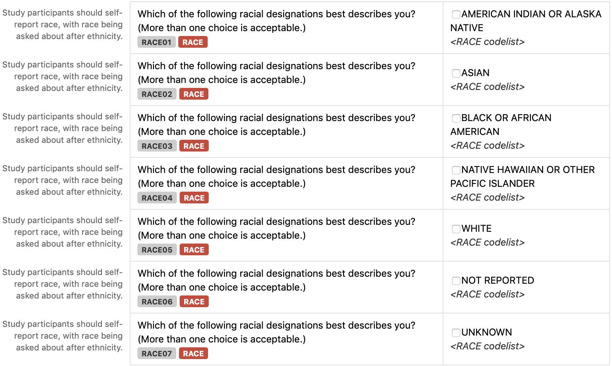

If the study participant answered: AMERICAN INDIAN OR ALASKA NATIVE

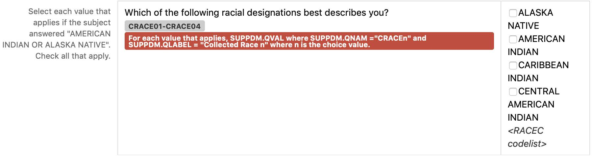

If the study participant answered: ASIAN

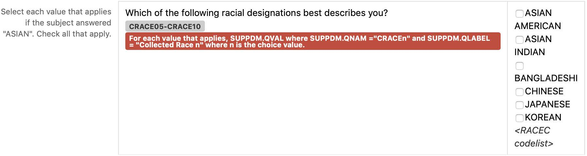

If the study participant answered: BLACK OR AFRICAN AMERICAN

If the study participant answered: WHITE

CRF Metadata

| CDASH Variable                                                  | Order | Question Text                                                                                        | Prompt | CRF Completion Instructions                                                                                       | Type | SDTMIG Target Variable | SDTM Target Mapping                                                                                                                       | Controlled Terminology Code List Name | Permissible Values                                                                                | Pre- specified Value | Query Display | List Style | Hidden           |
| --------------------------------------------------------------- | ----- | ---------------------------------------------------------------------------------------------------- | ------ | ----------------------------------------------------------------------------------------------------------------- | ---- | ---------------------- | ----------------------------------------------------------------------------------------------------------------------------------------- | ------------------------------------- | ------------------------------------------------------------------------------------------------- | -------------------- | ------------- | ---------- | ---------------- |
| RACE01                                                          | 1     | Which of the following racial designations best describes you? (More than one choice is acceptable.) | Race   | Study participants should self- report race, with race being asked about after ethnicity.                         | Text | RACE                   |                                                                                                                                           | (RACE)                                | AMERICAN INDIAN OR ALASKA NATIVE                                                                  |                      |               | checkbox   |                  |
| RACE02                                                          | 2     | Which of the following racial designations best describes you? (More than one choice is acceptable.) | Race   | Study participants should self- report race, with race being asked about after ethnicity.                         | Text | RACE                   |                                                                                                                                           | (RACE)                                | ASIAN                                                                                             |                      |               | checkbox   |                  |
| RACE03                                                          | 3     | Which of the following racial designations best describes you? (More than one choice is acceptable.) | Race   | Study participants should self- report race, with race being asked about after ethnicity.                         | Text | RACE                   |                                                                                                                                           | (RACE)                                | BLACK OR AFRICAN AMERICAN                                                                         |                      |               | checkbox   |                  |
| RACE04                                                          | 4     | Which of the following racial designations best describes you? (More than one choice is acceptable.) | Race   | Study participants should self- report race, with race being asked about after ethnicity.                         | Text | RACE                   |                                                                                                                                           | (RACE)                                | NATIVE HAWAIIAN OR OTHER PACIFIC ISLANDER                                                         |                      |               | checkbox   |                  |
| RACE05                                                          | 5     | Which of the following racial designations best describes you? (More than one choice is acceptable.) | Race   | Study participants should self- report race, with race being asked about after ethnicity.                         | Text | RACE                   |                                                                                                                                           | (RACE)                                | WHITE                                                                                             |                      |               | checkbox   |                  |
| RACE06                                                          | 6     | Which of the following racial designations best describes you? (More than one choice is acceptable.) | Race   | Study participants should self- report race, with race being asked about after ethnicity.                         | Text | RACE                   |                                                                                                                                           | (RACE)                                | NOT REPORTED                                                                                      |                      |               | checkbox   |                  |
| RACE07                                                          | 7     | Which of the following racial designations best describes you? (More than one choice is acceptable.) | Race   | Study participants should self- report race, with race being asked about after ethnicity.                         | Text | RACE                   |                                                                                                                                           | (RACE)                                | UNKNOWN                                                                                           |                      |               | checkbox   |                  |
| If study participant answered: AMERICAN INDIAN OR ALASKA NATIVE |       |                                                                                                      |        |                                                                                                                   |      |                        |                                                                                                                                           |                                       |                                                                                                   |                      |               |            |                  |
| CRACE01- CRACE04                                                | 10    | Which of the following racial designations best describes you?                                       | Race   | Select each value that applies if the subject answered "AMERICAN INDIAN OR ALASKA NATIVE". Check all that apply. | Text | SUPPDM.QVAL            | For each value that applies, SUPPDM.QVAL where SUPPDM.QNAM ="CRACEn" and SUPPDM.QLABEL = "Collected Race n" where n is the choice value. | (RACEC)                               | ALASKA NATIVE; AMERICAN INDIAN; CARIBBEAN INDIAN; CENTRAL AMERICAN INDIAN;                        |                      |               | checkbox   |                  |
| If study participant answered: ASIAN                            |       |                                                                                                      |        |                                                                                                                   |      |                        |                                                                                                                                           |                                       |                                                                                                   |                      |               |            |                  |
| CRACE05- CRACE10                                                | 11    | Which of the following racial designations best describes you?                                       | Race   | Select each value that applies if the subject answered "ASIAN". Check all that apply.                             | Text | SUPPDM.QVAL            | For each value that applies, SUPPDM.QVAL where SUPPDM.QNAM ="CRACEn" and SUPPDM.QLABEL = "Collected Race n" where n is the choice value.  | (RACEC)                               | ASIAN AMERICAN; ASIAN INDIAN; BANGLADESHI; CHINESE; JAPANESE; KOREAN;                             |                      |               | checkbox   | CRACE05- CRACE10 |
| If study participant answered: BLACK OR AFRICAN AMERICAN        |       |                                                                                                      |        |                                                                                                                   |      |                        |                                                                                                                                           |                                       |                                                                                                   |                      |               |            |                  |
| CRACE11- CRACE17                                                | 12    | Which of the following racial designations best describes you?                                       | Race   | Select each value that applies if the subject answered "BLACK OR AFRICAN AMERICAN". Check all that apply.         | Text | SUPPDM.QVAL            | For each value that applies, SUPPDM.QVAL where SUPPDM.QNAM ="CRACEn" and SUPPDM.QLABEL = "Collected Race n" where n is the choice value.  | (RACEC)                               | AFRICAN; AFRICAN AMERICAN; AFRICAN CARIBBEAN; BAHAMIAN; BARBADIAN; BLACK; BLACK CENTRAL AMERICAN; |                      |               | checkbox   |                  |
| If study participant answered: WHITE                            |       |                                                                                                      |        |                                                                                                                   |      |                        |                                                                                                                                           |                                       |                                                                                                   |                      |               |            |                  |
| CRACE18- CRACE21                                                | 13    | Which of the following racial designations best describes you?                                       | Race   | Select each value that applies if the subject answered "WHITE". Check all that apply.                             | Text | SUPPDM.QVAL            | For each value that applies, SUPPDM.QVAL where SUPPDM.QNAM ="CRACEn" and SUPPDM.QLABEL = "Collected Race n" where n is the choice value.  | (RACEC)                               | ARAB; EUROPEAN; MIDDLE EASTERN; RUSSIAN;                                                          |                      |               | checkbox   |                  |

The value of RACE is used to represent the high-level racial designation as a single collected value per CDISC Controlled Terminology in dm.xpt. When more than 1 choice is selected, the value is represented with "MULTIPLE" as shown in this example. Note: Only those variables relevant to this example are shown.

Row 1: Shows that USUBJID ABC789-010-045 designated 1 race, "WHITE", as the value that best describes their race.

Row 2: Shows that USUBJID ABC789-010-046 designated 1 race, "ASIAN", as the value that best describes their race.

Row 3: Shows that USUBJID ABC789-010-047 designated multiple races as the values that best describe their race. "MULTIPLE" is assigned in RACE.

dm.xpt

| Row | STUDYID | DOMAIN | USUBJID        | SUBJID  | RACE     |
| --- | ------- | ------ | -------------- | ------- | -------- |
| 1   | ABC789  | DM     | ABC789-010-045 | 010-045 | WHITE    |
| 2   | ABC789  | DM     | ABC789-010-046 | 010-046 | ASIAN    |
| 3   | ABC789  | DM     | ABC789-010-047 | 010-047 | MULTIPLE |

When a subject selects multiple race values, as USUBJID ABC789-010-047 did, the values selected are represented in SUPPDM. Collected race, which is the specific race subcategory (or subcategories) selected by each subject, is represented in SUPPDM to ensure subject self-identification and/or country-specific requirements are available for reference. CDASH recommended QNAM-QLABEL values have been provided.suppdm.xpt

Rows 1, 2: Show that USUBJID ABC789-010-047 selected 2 RACE values, "ASIAN" and "WHITE". CDASH

recommended QNAM-QLABEL values have been provided.

Rows 3-5: Show that USUBJID ABC789-010-047 selected 3 collected race (CRACE) values, "CHINESE", "KOREAN", and "RUSSIAN". CDASH recommended QNAM-QLABEL values have been provided.

suppdm.xpt

| Row | STUDYID | RDOMAIN | USUBJID        | IDVAR | IDVARVAL | QNAM    | QLABEL            | QVAL    | QORIG | QEVAL |
| --- | ------- | ------- | -------------- | ----- | -------- | ------- | ----------------- | ------- | ----- | ----- |
| 1   | ABC789  | DM      | ABC789-010-047 |       |          | RACE2   | Race 2            | ASIAN   | CRF   |       |
| 2   | ABC789  | DM      | ABC789-010-047 |       |          | RACE5   | Race 5            | WHITE   | CRF   |       |
| 3   | ABC789  | DM      | ABC789-010-047 |       |          | CRACE8  | Collected Race 8  | CHINESE | CRF   |       |
| 4   | ABC789  | DM      | ABC789-010-047 |       |          | CRACE10 | Collected Race 10 | KOREAN  | CRF   |       |
| 5   | ABC789  | DM      | ABC789-010-047 |       |          | CRACE21 | Collected Race 21 | RUSSIAN | CRF   |       |

Example 5

This example shows different Chinese regional ethnicity subcategorizations (majority and minority).

CRF Mock Example

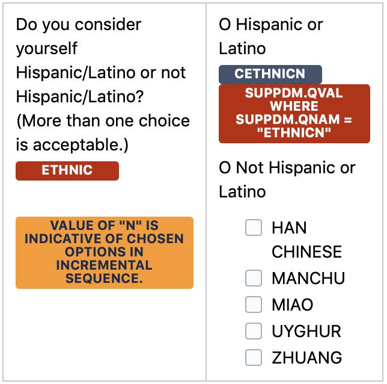

In this CRF example, subcategorizations of ethnicity are made available.

RACE is identified as "ASIAN" and ETHNIC as "NOT HISPANIC OR LATINO".

dm.xpt

| Row | STUDYID | DOMAIN | USUBJID        | SUBJID  | AGE | AGEU  | SEX | RACE  | ETHNIC                 |
| --- | ------- | ------ | -------------- | ------- | --- | ----- | --- | ----- | ---------------------- |
| 1   | ABC789  | DM     | ABC789-010-045 | 010-045 | 20  | YEARS | M   | ASIAN | NOT HISPANIC OR LATINO |
| 2   | ABC789  | DM     | ABC789-010-047 | 010-047 | 24  | YEARS | F   | ASIAN | NOT HISPANIC OR LATINO |

Row 1: Ethnicity subcategorization of subject self-identification being "HAN CHINESE". CDASH recommended QNAM-QLABEL values have been provided.

Rows 2-3: Ethnicity subcategorization of subject self-identification being "MIAO" and "ZHUANG". CDASH recommended QNAM-QLABEL values have been provided.

suppdm.xpt

| Row | STUDYID | RDOMAIN | USUBJID I      | DVAR | IDVARVAL | QNAM    | QLABEL                | QVAL        | QORIG | QEVAL |
| --- | ------- | ------- | -------------- | ---- | -------- | ------- | --------------------- | ----------- | ----- | ----- |
| 1   | ABC789  | DM      | ABC789-010-045 |      |          | ETHNIC1 | Collected Ethnicity 1 | HAN CHINESE | CRF   |       |
| 2   | ABC789  | DM      | ABC789-010-047 |      |          | ETHNIC1 | Collected Ethnicity 1 | MIAO        | CRF   |       |
| 3   | ABC789  | DM      | ABC789-010-047 |      |          | ETHNIC2 | Collected Ethnicity 2 | ZHUANG      | CRF   |       |

Example 6

The CRF in this example is annotated to show the CDASH variable name and the target SDTMIG variable. Data that are collected using the same variable name as defined in the SDTMIG are in RED . If the CDASHIG variable differs from the one defined in the SDTMIG, the CDASHIG variable is in GREY .

See the CDASH Model and Implementation Guide for additional information: https://www.cdisc.org/standards/foundational/cdash.

This example shows race categories and subcategories. Only a subset of options are shown for this instrument due to space constraints. For a complete aCRF example see the CDASHIG v2.1, Section 7.3.

Demographics Sample aCRF for Race with Additional Granularity

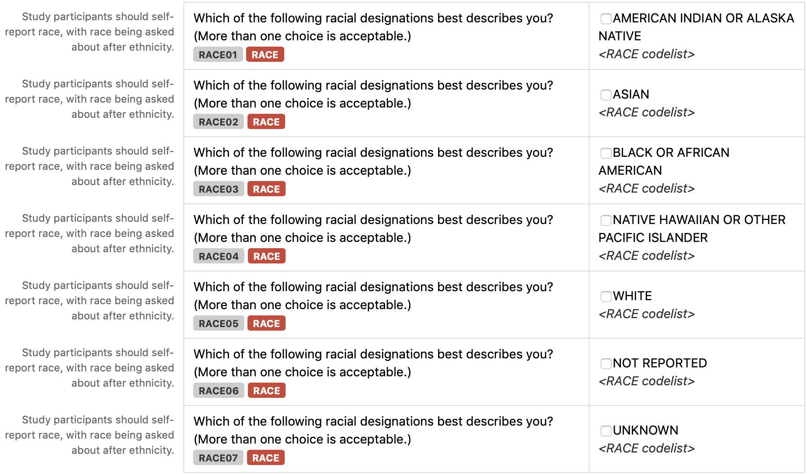

If the study participant answered: ASIAN

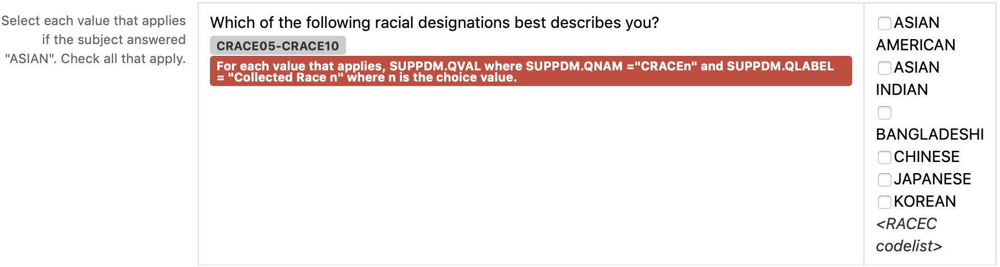

If the study participant answered: BLACK OR AFRICAN AMERICAN

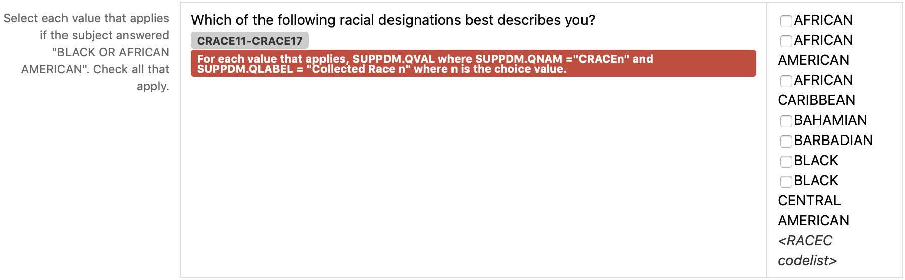

CRF Metadata

| CDASH Variable                                               | Order | Question Text                                                                                        | Prompt | CRF Completion Instructions                                                                               | Type | SDTMIG Target Variable | SDTM Target Mapping                                                                                                                      | Controlled Terminology Code List Name | Permissible Values                                                                                | Pre- specified Value | Query Display | List Style | Hidden |
| ------------------------------------------------------------ | ----- | ---------------------------------------------------------------------------------------------------- | ------ | --------------------------------------------------------------------------------------------------------- | ---- | ---------------------- | ---------------------------------------------------------------------------------------------------------------------------------------- | ------------------------------------- | ------------------------------------------------------------------------------------------------- | -------------------- | ------------- | ---------- | ------ |
| RACE01                                                       | 3     | Which of the following racial designations best describes you? (More than one choice is acceptable.) | Race   | Study participants should self- report race, with race being asked about after ethnicity.                 | Text | RACE                   |                                                                                                                                          | (RACE)                                | AMERICAN INDIAN OR ALASKA NATIVE                                                                  |                      |               | checkbox   |        |
| RACE02                                                       | 4     | Which of the following racial designations best describes you? (More than one choice is acceptable.) | Race   | Study participants should self- report race, with race being asked about after ethnicity.                 | Text | RACE                   |                                                                                                                                          | (RACE)                                | ASIAN                                                                                             |                      |               | checkbox   |        |
| RACE03                                                       | 5     | Which of the following racial designations best describes you? (More than one choice is acceptable.) | Race   | Study participants should self- report race, with race being asked about after ethnicity.                 | Text | RACE                   |                                                                                                                                          | (RACE)                                | BLACK OR AFRICAN AMERICAN                                                                         |                      |               | checkbox   |        |
| RACE04                                                       | 6     | Which of the following racial designations best describes you? (More than one choice is acceptable.) | Race   | Study participants should self- report race, with race being asked about after ethnicity.                 | Text | RACE                   |                                                                                                                                          | (RACE)                                | NATIVE HAWAIIAN OR OTHER PACIFIC ISLANDER                                                         |                      |               | checkbox   |        |
| RACE05                                                       | 7     | Which of the following racial designations best describes you? (More than one choice is acceptable.) | Race   | Study participants should self- report race, with race being asked about after ethnicity.                 | Text | RACE                   |                                                                                                                                          | (RACE)                                | WHITE                                                                                             |                      |               | checkbox   |        |
| RACE06                                                       | 8     | Which of the following racial designations best describes you? (More than one choice is acceptable.) | Race   | Study participants should self- report race, with race being asked about after ethnicity.                 | Text | RACE                   |                                                                                                                                          | (RACE)                                | NOT REPORTED                                                                                      |                      |               | checkbox   |        |
| RACE07                                                       | 9     | Which of the following racial designations best                                                      | Race   | Study participants should self-                                                                           | Text | RACE                   |                                                                                                                                          | (RACE)                                | UNKNOWN                                                                                           |                      |               | checkbox   |        |
|                                                              |       | describes you? (More than one choice is acceptable.)                                                 |        | report race, with race being asked about after ethnicity.                                                 |      |                        |                                                                                                                                          |                                       |                                                                                                   |                      |               |            |        |
| If the study participant answered: ASIAN                     |       |                                                                                                      |        |                                                                                                           |      |                        |                                                                                                                                          |                                       |                                                                                                   |                      |               |            |        |
| CRACE05- CRACE10                                             | 11    | Which of the following racial designations best describes you?                                       | Race   | Select each value that applies if the subject answered "ASIAN". Check all that apply.                     | Text | SUPPDM.QVAL            | For each value that applies, SUPPDM.QVAL where SUPPDM.QNAM ="CRACEn" and SUPPDM.QLABEL = "Collected Race n" where n is the choice value. | (RACEC)                               | ASIAN AMERICAN; ASIAN INDIAN; BANGLADESHI; CHINESE; JAPANESE; KOREAN;                             |                      |               | checkbox   |        |
| If the study participant answered: BLACK OR AFRICAN AMERICAN |       |                                                                                                      |        |                                                                                                           |      |                        |                                                                                                                                          |                                       |                                                                                                   |                      |               |            |        |
| CRACE11- CRACE17                                             | 12    | Which of the following racial designations best describes you?                                       | Race   | Select each value that applies if the subject answered "BLACK OR AFRICAN AMERICAN". Check all that apply. | Text | SUPPDM.QVAL            | For each value that applies, SUPPDM.QVAL where SUPPDM.QNAM ="CRACEn" and SUPPDM.QLABEL = "Collected Race n" where n is the choice value. | (RACEC)                               | AFRICAN; AFRICAN AMERICAN; AFRICAN CARIBBEAN; BAHAMIAN; BARBADIAN; BLACK; BLACK CENTRAL AMERICAN; |                      |               | checkbox   |        |

The value of RACE is used to represent the high-level racial designation as a single collected value per CDISC Controlled Terminology in dm.xpt. In this example, subjects chose to select 1 high-level racial designation.

Note: Only those variables relevant to this example are shown.

Row 1: Shows that USUBJID ABC789-010-001 designated 1 race, "ASIAN", as the value that best describes their race.

Row 2: Shows that USUBJID ABC789-010-002 designated 1 race, "BLACK OR AFRICAN AMERICAN", as the value that best describes their race.

Row 3: Shows that USUBJID ABC789-010-003 designated 1 race, "BLACK OR AFRICAN AMERICAN", as the value that best describes their race.

dm.xpt

| Row | STUDYID | DOMAIN | USUBJID        | SUBJID  | RACE                      |
| --- | ------- | ------ | -------------- | ------- | ------------------------- |
| 1   | ABC789  | DM     | ABC789-010-001 | 010-001 | ASIAN                     |
| 2   | ABC789  | DM     | ABC789-010-002 | 010-002 | BLACK OR AFRICAN AMERICAN |
| 3   | ABC789  | DM     | ABC789-010-003 | 010-003 | BLACK OR AFRICAN AMERICAN |

Collected race, which is the specific race subcategory for each subject, is represented in SUPPDM to ensure subject self-identification and/or country-specific requirements are available for reference. In this example, each subject selected 1 race and 1 race subcategory. CDASH recommended QNAM-QLABEL values have been provided.

Row 1: Shows USUBJID ABC789-010-001 selected "JAPANESE" as the specific ASIAN race collected.

Row 2: Shows USUBJID ABC789-010-002 selected "AFRICAN AMERICAN" as the specific BLACK OR AFRICAN AMERICAN race collected.

Row 3: Shows USUBJID ABC789-010-003 selected "BLACK" as the specific BLACK OR AFRICAN AMERICAN race collected.

suppdm.xpt

| Row | STUDYID | RDOMAIN | USUBJID        | IDVAR | IDVARVAL | QNAM   | QLABEL           | QVAL             | QORIG | QEVAL |
| --- | ------- | ------- | -------------- | ----- | -------- | ------ | ---------------- | ---------------- | ----- | ----- |
| 1   | ABC789  | DM      | ABC789-010-001 |       |          | CRACE3 | Collected Race 3 | JAPANESE         | CRF   |       |
| 2   | ABC789  | DM      | ABC789-010-002 |       |          | CRACE5 | Collected Race 5 | AFRICAN AMERICAN | CRF   |       |
| 3   | ABC789  | DM      | ABC789-010-003 |       |          | CRACE8 | Collected Race 8 | BLACK            | CRF   |       |

Example 7

CRF Mock Example

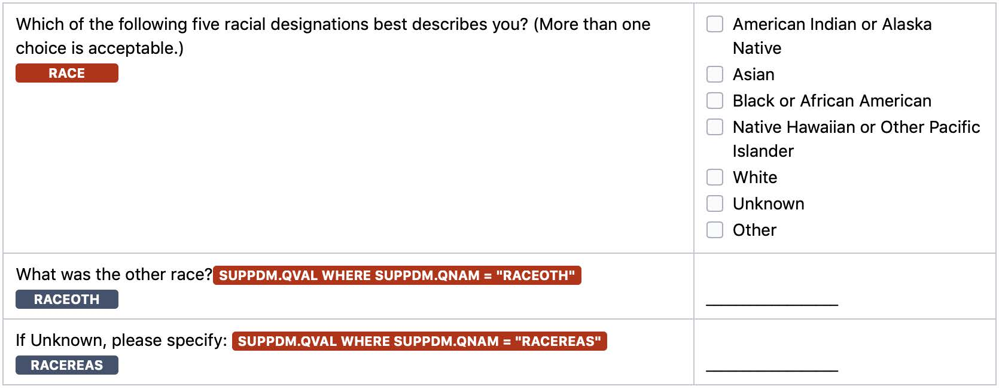

Rows 1-2: Subjects self-identify to 1 of the first 5 race options on the CRF form.

Row 3: Subject did not self-identify to 1 of the existing race options and selected "Other". RACE was populated with "OTHER" in this case.

Row 4: Subject could not self-identify to any of the race options including identification of an "Other". RACE was populated with "UNKNOWN" in this case.

Note: Not all DM variables are shown.

dm.xpt

| Row | STUDYID | DOMAIN | USUBJID        | SUBJID  | AGE | AGEU  | SEX | RACE    | ETHNIC                 |
| --- | ------- | ------ | -------------- | ------- | --- | ----- | --- | ------- | ---------------------- |
| 1   | ABC789  | DM     | ABC789-010-045 | 010-045 | 20  | YEARS | M   | WHITE   | HISPANIC OR LATINO     |
| 2   | ABC789  | DM     | ABC789-010-046 | 010-046 | 21  | YEARS | F   | ASIAN   | NOT HISPANIC OR LATINO |
| 3   | ABC789  | DM     | ABC789-010-047 | 010-047 | 24  | YEARS | F   | OTHER   | HISPANIC OR LATINO     |
| 3   | ABC789  | DM     | ABC789-010-048 | 010-048 | 33  | YEARS | M   | UNKNOWN | HISPANIC OR LATINO     |

Row 1: Sponsor allowed for an "Other" option to be collected, where its specify details are in SUPPDM.

Row 2: Sponsor allowed for an "Unknown" option to be collected, where its reason is collected in SUPPDM.

Note: Recommended QNAM-QLABEL values have been provided.

suppdm.xpt

| Row | STUDYID | RDOMAIN | USUBJID        | IDVAR | IDVARVAL | QNAM     | QLABEL               | QVAL                          | QORIG | QEVAL |
| --- | ------- | ------- | -------------- | ----- | -------- | -------- | -------------------- | ----------------------------- | ----- | ----- |
| 1   | ABC789  | DM      | ABC789-010-047 |       |          | RACEOTH  | Race, Other          | BRAZILIAN                     | CRF   |       |
| 2   | ABC789  | DM      | ABC789-010-048 |       |          | RACEREAS | Race, Reason Details | REFUGEE - DO NOT KNOW MY RACE | CRF   |       |

### 5.3 Subject Elements (SE)

SE – Description/Overview

A special-purpose domain that contains the actual order of elements followed by the subject, together with the start date/time and end date/time for each element.

The Subject Elements dataset consolidates information about the timing of each subject’s progress through the epochs and elements of the trial. For elements that involve study treatments, the identification of which element the subject passed through (e.g., drug X vs. placebo) is likely to derive from data in the Exposure domain or another Interventions domain. The dates of a subject’s transition from one element to the next will be taken from the Interventions domain(s) and from other relevant domains, according to the definitions (TESTRL values) in the Trial Elements (TE) dataset (see Section 7.2.2, Trial Elements).

The SE dataset is particularly useful for studies with multiple treatment periods, such as crossover studies. The SE dataset contains the date/times at which a subject moved from one element to another, so when this dataset, the Trial Arms (TA; see Section 7.2.1, Trial Arms) dataset, and the Trial Elements (TE; see Section 7.2.2, Trial Elements) dataset are included in a submission, reviewers can relate all observations made about a subject to that subject’s progression through the trial.

- Comparison of the --DTC of a finding observation to the element transition dates (values of SESTDTC and SEENDTC) identifies which element the subject was in at the time of the finding. Similarly, one can determine the element during which an event or intervention started or ended.
- “Day within Element” or “Day within Epoch” can be derived. Such variables relate an observation to the start of an element or epoch in the same way that study day (--DY) variables relate it to the reference start date (RFSTDTC) for the study as a whole. See Section 4.4.4, Use of the "Study Day" Variables.
- Having knowledge of SE start and end dates can be helpful in the determination of baseline values.

SE – Specification

se.xpt, Subject Elements — Special Purpose. One record per actual Element per subject, Tabulation.

| Variable Name | Variable Label                      | Type | Controlled Terms, Codelist or Format1 | Role              | CDISC Notes                                                                                                                                                                                                                                                                                                                                                                                                                             | Core |
| ------------- | ----------------------------------- | ---- | ------------------------------------- | ----------------- | --------------------------------------------------------------------------------------------------------------------------------------------------------------------------------------------------------------------------------------------------------------------------------------------------------------------------------------------------------------------------------------------------------------------------------------- | ---- |
| STUDYID       | Study Identifier                    | Char |                                       | Identifier        | Unique identifier for a study.                                                                                                                                                                                                                                                                                                                                                                                                          | Req  |
| DOMAIN        | Domain Abbreviation                 | Char | SE                                    | Identifier        | Two-character abbreviation for the domain.                                                                                                                                                                                                                                                                                                                                                                                              | Req  |
| USUBJID       | Unique Subject Identifier           | Char |                                       | Identifier        | Identifier used to uniquely identify a subject across all studies for all applications or submissions involving the product.                                                                                                                                                                                                                                                                                                            | Req  |
| SESEQ         | Sequence Number                     | Num  |                                       | Identifier        | Sequence number given to ensure uniqueness of subject records within a domain. Should be assigned to be consistent chronological order.                                                                                                                                                                                                                                                                                                 | Req  |
| ETCD          | Element Code                        | Char | *                                     | Topic             | 1. ETCD (the companion to ELEMENT) is limited to 8 characters and does not have special character restrictions. These values should be short for ease of use in programming, but it is not expected that ETCD will need to serve as a variable name. 2. If an encountered element differs from the planned element to the point that it is considered a new element, then use "UNPLAN" as the value for ETCD to represent this element. | Req  |
| ELEMENT       | Description of Element              | Char | *                                     | Synonym Qualifier | The name of the element. If ETCD has a value of "UNPLAN", then ELEMENT should be null.                                                                                                                                                                                                                                                                                                                                                  | Perm |
| TAETORD       | Planned Order of Element within Arm | Num  |                                       | Timing            | Number that gives the planned order of the element within the subject's assigned trial arm.                                                                                                                                                                                                                                                                                                                                             | Perm |
| EPOCH         | Epoch                               | Char | (EPOCH)                               | Timing            | Epoch associated with the element in the planned sequence of elements for the arm to which the subject was assigned.                                                                                                                                                                                                                                                                                                                    | Perm |
| SESTDTC       | Start Date/Time of Element          | Char | ISO 8601 datetime or interval         | Timing            | Start date/time for an element for each subject.                                                                                                                                                                                                                                                                                                                                                                                        | Req  |
| SEENDTC       | End Date/Time of Element            | Char | ISO 8601 datetime or interval         | Timing            | End date/time for an element for each subject.                                                                                                                                                                                                                                                                                                                                                                                          | Exp  |
| SESTDY        | Study Day of Start of Element       | Num  |                                       | Timing            | Study day of start of element relative to the sponsor-defined RFSTDTC.                                                                                                                                                                                                                                                                                                                                                                  | Perm |
| SEENDY        | Study Day of End of Element         | Num  |                                       | Timing            | Study day of end of element relative to the sponsor-defined RFSTDTC.                                                                                                                                                                                                                                                                                                                                                                    | Perm |
| SEUPDES       | Description of Unplanned Element    | Char |                                       | Synonym Qualifier | Description of what happened to the subject during an unplanned element. Used only if ETCD has the value of "UNPLAN".                                                                                                                                                                                                                                                                                                                   | Perm |

1In this column, an asterisk (*) indicates that the variable may be subject to controlled terminology. CDISC/NCI codelist values are enclosed in parentheses.

SE – Assumptions

Submission of the SE dataset is strongly recommended, as it provides information needed by reviewers to place observations in context within the study. As noted in the SE - Description/Overview, the TE and TA datasets should also be submitted, as these define the design and the terms referenced by the SE dataset.

The SE domain allows the submission of data on the timing of the trial elements a subject actually passed through in their participation in the trial. Section 7.2.2, Trial Elements, and Section 7.2.1, Trial Arms, provide additional information on these datasets, which define a trial's planned elements and describe the planned sequences of elements for the arms of the trial.

1. For any particular subject, the dates in the SE table are the dates when the transition events identified in the TE table occurred. Judgment may be needed to match actual events in a subject's experience with the definitions of transition events (i.e., events that mark the start of new elements) in the TE table; actual events may vary from the plan. For instance, in a single-dose pharmacokinetics (PK) study, the transition events might correspond to study drug doses of 5 and 10 mg. If a subject actually received a dose of 7 mg when they were scheduled to receive 5 mg, a decision will have to be made on how to represent this in the SE domain.
2. If the date/time of a transition element was not collected directly, the method used to infer the element start date/time should be explained in the Comments column of the Define-XML document.
3. Judgment will also have to be used in deciding how to represent a subject's experience if an element does not proceed or end as planned. For instance, the plan might identify a trial element that is to start with the first of a series of 5 daily doses and end after 1 week, when the subject transitions to the next treatment element. If the subject actually started the next treatment epoch (see Section 7.1, Introduction to Trial Design Model Datasets, and Section 7.1.2, Definitions of Trial Design Concepts) after 4 weeks, the sponsor would have to decide whether to represent this as an abnormally long element, or as a normal element plus an unplanned non-treatment element.
4. If the sponsor decides that the subject's experience for a particular period of time cannot be represented with one of the planned elements, then that period of time should be represented as an unplanned element. The value of ETCD for an unplanned element is “UNPLAN” and SEUPDES should be populated with a description of the unplanned element.
5. The values of SESTDTC provide the chronological order of the actual subject elements. SESEQ should be assigned to be consistent with the chronological order. Note that the requirement that SESEQ be consistent with chronological order is more stringent than in most other domains, where --SEQ values need only be unique within subject.
6. When TAETORD is included in the SE domain, it represents the planned order of an element in an arm. This should not be confused with the actual order of the elements, which will be represented by their chronological order and SESEQ. TAETORD will not be populated for subject elements that are not planned for the arm to which the subject was assigned. Thus, TAETORD will not be populated for any element with an ETCD value of “UNPLAN”. TAETORD also will not be populated if a subject passed through an element that, although defined in the TE dataset, was out of place for the arm to which the subject was assigned. For example, if a subject in a parallel study of drug A vs. drug B was assigned to receive drug A but received drug B instead, then TAETORD would be left blank for the SE record for their drug B element. If a subject was assigned to receive the sequence of elements A, B, C, D, and instead received A, D, B, C, then the sponsor would have to decide for which of these SE records TAETORD should be populated. The rationale for this decision should be documented in the Comments column of the Define-XML document.
7. For subjects who follow the planned sequence of elements for the arm to which they were assigned, the values of EPOCH in the SE domain will match those associated with the elements for the subject's arm in the TA dataset. The sponsor will have to decide what value, if any, of EPOCH to assign SE records for unplanned elements and in other cases where the subject's actual elements deviate from the plan. The sponsor's methods for such decisions should be documented in the Define-XML document, in the row for EPOCH in the SE dataset table.
8. Because there are, by definition, no gaps between elements, the value of SEENDTC for one element will always be the same as the value of SESTDTC for the next element.
9. Note that SESTDTC is required, although --STDTC is not required in any other subject-level dataset. The purpose of the dataset is to record the elements a subject actually passed through. If it is known that a subject passed through a particular element, then there must be some information (perhaps imprecise) on when it started. Thus, SESTDTC may not be null, although some records may not have all the components (e.g., year, month, day, hour, minute) of the date/time value collected.
10. The following identifier variables are permissible and may be added as appropriate: --GRPID, --REFID, --SPID.
11. Care should be taken in adding additional timing variables:

    a. The purpose of --DTC and --DY is to record the date and study day on which data was collected. Elements are generally “derived” in the sense that they are a secondary use of data collected elsewhere; it is not generally useful to know when those date/times were recorded.

    b. --DUR could be added only if the duration of an element was collected, not derived.

    c. It would be inappropriate to add the variables that support time points (--TPT, --TPTNUM, --ELTM, --TPTREF, and --RFTDTC), because the topic of this dataset is elements.

SE – Examples

STUDYID and DOMAIN, which are required in the SE and Demographics (DM) domains, have not been included in the following examples, to improve readability.

Example 1

This example shows data for 2 subjects for a crossover trial with 4 epochs.

Row 1: The record for the SCREEN element for subject 789. Note that only the date of the start of the SCREEN element was collected, whereas for the end of the element (which corresponds to the start of IV dosing) both date and time were collected.

Row 2: The record for the IV element for subject 789. The IV element started with the start of IV dosing and ended with the start of oral dosing, and full date/times were collected for both.

Row 3: The record for the ORAL element for subject 789. Only the date, and not the time, of the start of follow-up was collected.

Row 4: The FOLLOWUP element for subject 789 started and ended on the same day. Presumably, the element had a positive duration, but no times were collected.

Rows 5-8: Subject 790 was treated incorrectly. This subject entered the IV element before the ORAL element, although the planned order of elements for this subject was ORAL, then IV. The sponsor has assigned EPOCH values for this subject according to the actual order of elements, rather than the planned order. Per Assumption 6, TAETORD is missing for the elements that were out of order. The correct order of elements is the subject's ARMCD, shown in the DM dataset.

Rows 9-10: Subject 791 was screened, randomized to the IV-ORAL arm, and received the IV treatment, but did not return to the unit for the treatment epoch or follow-up.

se.xpt

| Row | USUBJID | SESEQ | ETCD     | SESTDTC          | SEENDTC          | SEUPDES | TAETORD | EPOCH       |
| --- | ------- | ----- | -------- | ---------------- | ---------------- | ------- | ------- | ----------- |
| 1   | 789     | 1     | SCREEN   | 2006-06-01       | 2006-06-03T10:32 |         | 1       | SCREENING   |
| 2   | 789     | 2     | IV       | 2006-06-03T10:32 | 2006-06-10T09:47 |         | 2       | TREATMENT 1 |
| 3   | 789     | 3     | ORAL     | 2006-06-10T09:47 | 2006-06-17       |         | 3       | TREATMENT 2 |
| 4   | 789     | 4     | FOLLOWUP | 2006-06-17       | 2006-06-17       |         | 4       | FOLLOW-UP   |
| 5   | 790     | 1     | SCREEN   | 2006-06-01       | 2006-06-03T10:14 |         | 1       | SCREENING   |
| 6   | 790     | 2     | IV       | 2006-06-03T10:14 | 2006-06-10T10:32 |         |         | TREATMENT 1 |
| 7   | 790     | 3     | ORAL     | 2006-06-10T10:32 | 2006-06-17       |         |         | TREATMENT 2 |
| 8   | 790     | 4     | FOLLOWUP | 2006-06-17       | 2006-06-17       |         | 4       | FOLLOW-UP   |
| 9   | 791     | 1     | SCREEN   | 2006-06-01       | 2006-06-03T10:17 |         | 1       | SCREENING   |
| 10  | 791     | 2     | IV       | 2006-06-03T10:17 | 2006-06-07       |         | 2       | TREATMENT 1 |

Row 1: Subject 789 was assigned to the IV-ORAL arm and was treated accordingly.

Row 2: Subject 790 was assigned to the ORAL-IV arm, but their actual treatment was IV, then oral.

Row 3: Subject 791 was assigned to the IV-ORAL arm, received the first of the 2 planned treatment elements, and were following the assigned treatment when they withdrew early. The actual arm variables are populated with the values for the arm to which subject 791 was assigned.

dm.xpt

| Row | USUBJID | SUBJID | RFSTDTC     | RFENDTC     | SITEID | INVNAM   | BIRTHDTC   | AGE | AGEU  | SEX | RACE  | ETHNIC                 | ARMCD | ARM      | ACTARMCD | ACTARM  | ARMNRS | ACTARMUD | COUNTRY |
| --- | ------- | ------ | ----------- | ----------- | ------ | -------- | ---------- | --- | ----- | --- | ----- | ---------------------- | ----- | -------- | -------- | ------- | ------ | -------- | ------- |
| 1   | 789     | 001    | 2006-06- 03 | 2006-06- 17 | 01     | SMITH, J | 1948-12-13 | 57  | YEARS | M   | WHITE | HISPANIC OR LATINO     | IO    | IV- ORAL | IO       | IV-ORAL |        |          | USA     |
| 2   | 790     | 002    | 2006-06- 03 | 2006-06- 17 | 01     | SMITH, J | 1955-03-22 | 51  | YEARS | M   | WHITE | NOT HISPANIC OR LATINO | OI    | ORAL- IV | IO       | IV-ORAL |        |          | USA     |
| 3   | 791     | 003    | 2006-06- 03 | 2006-06- 07 | 01     | SMITH, J | 1956-07-17 | 49  | YEARS | M   | WHITE | NOT HISPANIC OR LATINO | IO    | IV- ORAL | IO       | IV-ORAL |        |          | USA     |

Example 2

The following data represent 2 subjects enrolled in a trial in which assignment to an arm occurs in 2 stages.

See Section 7.2.1, Trial Arms, Example Trial 3. In this trial, subjects were randomized at the beginning of the blinded treatment epoch, then assigned to treatment for the open treatment epoch according to their response to treatment in the blinded treatment epoch. See Section 5.2, Demographics, for other examples of ARM and ARMCD values for this trial.

In this trial, start of dosing was recorded as dates without times, so SESTDTC values include only dates. Epochs could not be assigned to observations that occurred on epoch transition dates on the basis of the SE dataset alone, so the sponsor's algorithms for dealing with this ambiguity were documented in the Define-XML document.

Rows 1-2: Show data for a subject who completed only 2 elements of the trial.

Rows 3-6: Show data for a subject who completed the trial, but received the wrong drug for the last 2 weeks of the double-blind treatment period. This has been represented by treating the period when the subject received the wrong drug as an unplanned element. Note that TAETORD, which represents the planned order of elements within an arm, has not been populated for this unplanned element. Even though this element was unplanned, the sponsor assigned a value of BLINDED TREATMENT to EPOCH.

se.xpt

| Row | USUBJID | SESEQ | ETCD   | SESTDTC    | SEENDTC    | SEUPDES                   | TAETORD | EPOCH                |
| --- | ------- | ----- | ------ | ---------- | ---------- | ------------------------- | ------- | -------------------- |
| 1   | 123     | 1     | SCRN   | 2006-06-01 | 2006-06-03 |                           | 1       | SCREENING            |
| 2   | 123     | 2     | DBA    | 2006-06-03 | 2006-06-10 |                           | 2       | BLINDED TREATMENT    |
| 3   | 456     | 1     | SCRN   | 2006-05-01 | 2006-05-03 |                           | 1       | SCREENING            |
| 4   | 456     | 2     | DBA    | 2006-05-03 | 2006-05-31 |                           | 2       | BLINDED TREATMENT    |
| 5   | 456     | 3     | UNPLAN | 2006-05-31 | 2006-06-13 | Drug B dispensed in error |         | BLINDED TREATMENT    |
| 6   | 456     | 4     | RSC    | 2006-06-13 | 2006-07-30 |                           | 3       | OPEN LABEL TREATMENT |

Row 1: Shows the record for a subject who was randomized to blinded treatment A, but withdrew from the trial before the open treatment epoch and did not have a second treatment assignment. They were thus incompletely assigned to an arm. The code used to represent this incomplete assignment, "A", is not in the TA table for this trial design, but is the first part of the codes for the 2 arms to which subject 123 could have been assigned ("AR" or "AO").

Row 2: Shows the record for a subject who was randomized to blinded treatment A, but was erroneously treated with drug B for part of the blinded treatment epoch. ARM and ARMCD for this subject reflect the planned treatment and are not affected by the fact that treatment deviated from plan. The subject's assignment to Rescue treatment for the open treatment epoch proceeded as planned. The sponsor decided that the subject's treatment, which consisted partly of drug A and partly of drug B, did not match any planned arm, so ACTARMCD and ACTARM were left null. ARMNRS was populated with "UNPLANNED TREATMENT" and the way in which this treatment was unplanned was described in ACTARMUD.

dm.xpt

| Row | USUBJID | SUBJID | RFSTDTC     | RFENDTC     | SITEID | INVNAM   | BIRTHDTC   | AGE | AGEU  | SEX | RACE  | ETHNIC             | ARMCD | ARM A | CTARMCD | ACTARM | ARMNRS | ACTARMUD | COUNTRY |
| --- | ------- | ------ | ----------- | ----------- | ------ | -------- | ---------- | --- | ----- | --- | ----- | ------------------ | ----- | ----- | ------- | ------ | ------ | -------- | ------- |
| 1   | 123     | 012    | 2006-06- 03 | 2006-06- 10 | 01     | JONES, D | 1943-12-08 | 62  | YEARS | M   | ASIAN | HISPANIC OR LATINO | A     | A A   |         | A      |        |          | USA     |

| Row | USUBJID | SUBJID | RFSTDTC     | RFENDTC     | SITEID | INVNAM   | BIRTHDTC   | AGE | AGEU  | SEX | RACE  | ETHNIC                 | ARMCD | ARM       | ACTARMCD | ACTARM | ARMNRS              | ACTARMUD                                    | COUNTRY |
| --- | ------- | ------ | ----------- | ----------- | ------ | -------- | ---------- | --- | ----- | --- | ----- | ---------------------- | ----- | --------- | -------- | ------ | ------------------- | ------------------------------------------- | ------- |
| 2   | 456     | 103    | 2006-05- 03 | 2006-07- 30 | 01     | JONES, D | 1950-05-15 | 55  | YEARS | F   | WHITE | NOT HISPANIC OR LATINO | AR    | A- Rescue |          |        | UNPLANNED TREATMENT | Drug B dispensed for part of Drug A element | USA     |

### 5.4 Subject Disease Milestones (SM)

SM – Description/Overview

A special-purpose domain that is designed to record the timing, for each subject, of disease milestones that have been defined in the Trial Disease Milestones (TM) domain.

SM – Specification

sm.xpt, Subject Disease Milestones — Special Purpose. One record per Disease Milestone per subject, Tabulation.

| Variable Name | Variable Label                  | Type | Controlled Terms, Codelist or Format1 | Role             | CDISC Notes                                                                                                                                                        | Core |
| ------------- | ------------------------------- | ---- | ------------------------------------- | ---------------- | ------------------------------------------------------------------------------------------------------------------------------------------------------------------ | ---- |
| STUDYID       | Study Identifier                | Char |                                       | Identifier       | Unique identifier for a study.                                                                                                                                     | Req  |
| DOMAIN        | Domain Abbreviation             | Char | SM                                    | Identifier       | Two-character abbreviation for the domain.                                                                                                                         | Req  |
| USUBJID       | Unique Subject Identifier       | Char |                                       | Identifier       | Identifier used to uniquely identify a subject across all studies for all applications or submissions involving the product.                                       | Req  |
| SMSEQ         | Sequence Number                 | Num  |                                       | Identifier       | Sequence number to ensure uniqueness of subject records. Should be assigned to be consistent chronological order.                                                  | Req  |
| MIDS          | Disease Milestone Instance Name | Char | *                                     | Topic            | Name of the specific disease milestone. For types of disease milestones that can occur multiple times, the name will end with a sequence number. Example: "HYPO1". | Req  |
| MIDSTYPE      | Disease Milestone Type          | Char | *                                     | Record Qualifier | The type of disease milestone. Example: "HYPOGLYCEMIC EVENT".                                                                                                      | Req  |
| SMSTDTC       | Start Date/Time of Milestone    | Char | ISO 8601 datetime or interval         | Timing           | Start date/time of milestone instance (if milestone is an intervention or event) or date of milestone (if Milestone is a finding).                                 | Exp  |
| SMENDTC       | End Date/Time of Milestone      | Char | ISO 8601 datetime or interval         | Timing           | End date/time of disease milestone instance.                                                                                                                       | Exp  |
| SMSTDY        | Study Day of Start of Milestone | Num  |                                       | Timing           | Study day of start of disease milestone instance, relative to the sponsor-defined RFSTDTC.                                                                         | Exp  |
| SMENDY        | Study Day of End of Milestone   | Num  |                                       | Timing           | Study day of end of disease milestone instance, relative to the sponsor-defined RFSTDTC.                                                                           | Exp  |

1In this column, an asterisk (*) indicates that the variable may be subject to controlled terminology. CDISC/NCI codelist values are enclosed in parentheses.

SM – Assumptions

1. Disease milestones are observations or activities whose timings are of interest in the study. The types of disease milestones are defined at the study level in the TM dataset. The purpose of the SM dataset is to provide a summary timeline of the milestones for a particular subject.
2. The name of the disease milestone is recorded in MIDS.

   a. For disease milestones that can occur only once (TMRPT = "N"), the value of MIDS may be the value in MIDSTYPE or may an abbreviated version.

   b. For types of disease milestones that can occur multiple times, MIDS will usually be an abbreviated version of MIDSTYPE and will always end with

   a sequence number. Sequence numbers should start with 1 and indicate the chronological order of the instances of this type of disease milestone.
3. The timing variables SMSTDTC and SMENDTC hold start and end date/times of data collected for the disease milestone(s) for each subject. SMSTDY and SMENDY represent the corresponding study day variables.

   a. The start date/time of the disease milestone is the critical date/time, and must be populated. If the disease milestone is an event, then the meaning of “start date” for the event may need to be defined.

   b. The start study day will not be populated if the start date/time includes only a year or only a year and month.

   c. The end date/time for the disease milestone is less important than the start date/time. It will not be populated if the disease milestone is a finding without an end date/time or if it is an event or intervention for which an end date/time has not yet occurred or was not collected.

   d. The end study day will not be populated if the end date/time includes only a year or only a year and month.

SM – Examples

Example 1

In this study, the disease milestones of interest were initial diagnosis and hypoglycemic events, as shown in Section 7.3.3, Trial Disease Milestones, Example 1.

Row 1: Shows that subject 001's initial diagnosis of diabetes occurred in October 2005. Because this is a partial date, SMDY is not populated. No end date/time was recorded for this milestone.

Rows 2-3: Show that subject 001 had 2 hypoglycemic events. In this case, only start date/times have been collected. Because these date/times include full dates, SMSTDY has been populated in each case.

Row 4: Shows that subject 002’s initial diagnosis of diabetes occurred on May 15, 2010. Because a full date was collected, the study day of this milestone was populated. Diagnosis was pre-study, so the study day of the disease milestone is negative. No hypoglycemic events were recorded for this subject.

sm.xpt

| Row | STUDYID | DOMAIN | USUBJID | SMSEQ | MIDS  | MIDSTYPE           | SMSTDTC          | SMENDTC | SMSTDY | SMENDY |
| --- | ------- | ------ | ------- | ----- | ----- | ------------------ | ---------------- | ------- | ------ | ------ |
| 1   | XYZ     | SM     | 001     | 1     | DIAG  | DIAGNOSIS          | 2005-10          |         |        |        |
| 2   | XYZ     | SM     | 001     | 2     | HYPO1 | HYPOGLYCEMIC EVENT | 2013-09-01T11:00 |         | 25     |        |
| 3   | XYZ     | SM     | 001     | 3     | HYPO2 | HYPOGLYCEMIC EVENT | 2013-09-24T8:48  |         | 50     |        |
| 4   | XYZ     | SM     | 002     | 1     | DIAG  | DIAGNOSIS          | 2010-05-15       |         | -1046  |        |

Information in SM is taken from records in other domains. In this study, diagnosis was represented in the Medical History (MH) domain, and hyypoglycemic events were represented in the Clinical Events (CE) domain.

The MH records for diabetes (MHEVDTYP = "DIAGNOSIS") are the records which represent the disease milestones for the defined MIDSTYPE of "DIAGNOSIS", so these records include the MIDS variable with the value "DIAG". Because these are records for disease milestones rather than associated records, the variables RELMIDS and MIDSDTC are not needed.

mh.xpt

| Row | STUDYID | DOMAIN | USUBJID | MHSEQ | MHTERM          | MHDECOD                  | MHEVDTYP  | MHPRESP | MHOCCUR | MHDTC      | MHSTDTC    | MHENDTC | MHDY | MIDS |
| --- | ------- | ------ | ------- | ----- | --------------- | ------------------------ | --------- | ------- | ------- | ---------- | ---------- | ------- | ---- | ---- |
| 1   | XYZ     | MH     | 001     | 1     | TYPE 2 DIABETES | Type 2 diabetes mellitus | DIAGNOSIS | Y       | Y       | 2013-08-06 | 2005-10    |         | 1    | DIAG |
| 2   | XYZ     | MH     | 002     | 1     | TYPE 2 DIABETES | Type 2 diabetes mellitus | DIAGNOSIS | Y       | Y       | 2013-08-06 | 2010-05-15 |         | 1    | DIAG |

In this study, information about hypoglycemic events was collected in a separate CRF module, and CE records recorded in this module were represented with CECAT = "HYPOGLYCEMIC EVENT". Each CE record for a hypoglycemic event is a disease milestone, and records for a study have distinct values of MIDS.

ce.xpt

| Row | STUDYID | DOMAIN | USUBJID | CESEQ | CETERM             | CEDECOD       | CECAT              | CEPRESP | CEOCCUR | CESTDTC          | CEENDTC          | MIDS  |
| --- | ------- | ------ | ------- | ----- | ------------------ | ------------- | ------------------ | ------- | ------- | ---------------- | ---------------- | ----- |
| 1   | XYZ     | CE     | 001     | 1     | HYPOGLYCEMIC EVENT | Hypoglycaemia | HYPOGLYCEMIC EVENT | Y       | Y       | 2013-09-01T11:00 | 2013-09-01T2:30  | HYPO1 |
| 2   | XYZ     | CE     | 001     | 1     | HYPOGLYCEMIC EVENT | Hypoglycaemia | HYPOGLYCEMIC EVENT | Y       | Y       | 2013-09-24T8:48  | 2013-09-24T10:00 | HYPO2 |

### 5.5 Subject Visits (SV)

SV – Description/Overview

A special purpose domain that contains information for each subject's actual and planned visits.

The Subject Visits domain consolidates information about the timing of subject visits that is otherwise spread over domains that include the visit variables (VISITNUM and possibly VISIT and/or VISITDY). Unless the beginning and end of each visit is collected, populating the SV dataset will involve derivations. In a simple case, where, for each subject visit, exactly 1 date appears in every such domain, the SV dataset can be created easily by populating both SVSTDTC and SVENDTC with the single date for a visit. When there are multiple dates and/or date/times for a visit for a particular subject, the derivation of values for SVSTDTC and SVENDTC may be more complex. The method for deriving these values should be consistent with the visit definitions in the Trial Visits (TV) dataset (see Section 7.3.1, Trial Visits). For some studies, a visit may be defined to correspond with a clinic visit that occurs within 1 day, whereas for other studies, a visit may reflect data collection over a multiday period.

The SV dataset provides reviewers with a summary of a subject’s visits over the course of their participation in a study. Comparison of an individual subject’s SV dataset with the TV dataset, which describes the planned visits for the trial, supports the identification of planned but not expected visits due to a subject not completing the study. Comparison of the values of SVSTDY and SVENDY to VISIT and/or VISITDY can often highlight departures from the planned timing of visits.

SV – Specification

sv.xpt, Subject Visits — Special Purpose. One record per actual or planned visit per subject, Tabulation.

| Variable Name | Variable Label                        | Type | Controlled Terms, Codelist or Format1 | Role               | CDISC Notes                                                                                                                                                                               | Core |
| ------------- | ------------------------------------- | ---- | ------------------------------------- | ------------------ | ----------------------------------------------------------------------------------------------------------------------------------------------------------------------------------------- | ---- |
| STUDYID       | Study Identifier                      | Char |                                       | Identifier         | Unique identifier for a study.                                                                                                                                                            | Req  |
| DOMAIN        | Domain Abbreviation                   | Char | SV                                    | Identifier         | Two-character abbreviation for the domain most relevant to the observation. The domain abbreviation is also used as a prefix for variables to ensure uniqueness when datasets are merged. | Req  |
| USUBJID       | Unique Subject Identifier             | Char |                                       | Identifier         | Identifier used to uniquely identify a subject across all studies for all applications or submissions involving the product.                                                              | Req  |
| VISITNUM      | Visit Number                          | Num  |                                       | Topic              | Clinical encounter number. Numeric version of VISIT, used for sorting.                                                                                                                    | Req  |
| VISIT         | Visit Name                            | Char |                                       | Synonym Qualifier  | Protocol-defined description of a clinical encounter.                                                                                                                                     | Perm |
| SVPRESP       | Pre-specified                         | Char | (NY)                                  | Variable Qualifier | Used to indicate whether the visit was planned (i.e., visits specified in the TV domain). Value is "Y" for planned visits, null for unplanned visits.                                     | Exp  |
| SVOCCUR       | Occurrence                            | Char | (NY)                                  | Record Qualifier   | Used to record whether a planned visit occurred. The value is null for unplanned visits.                                                                                                  | Exp  |
| SVREASOC      | Reason for Occur Value                | Char |                                       | Record Qualifier   | The reason for the value in SVOCCUR. If SVOCCUR="N", SVREASOC is the reason the visit did not occur.                                                                                      | Perm |
| SVCNTMOD      | Contact Mode                          | Char | (CNTMODE)                             | Record Qualifier   | The way in which the visit was conducted. Examples: "IN PERSON", "TELEPHONE CALL", "IVRS".                                                                                                | Perm |
| SVEPCHGI      | Epi/Pandemic Related Change Indicator | Char | (NY)                                  | Record Qualifier   | Indicates whether the visit was changed due to an epidemic or pandemic.                                                                                                                   | Perm |
| VISITDY       | Planned Study Day of Visit            | Num  |                                       | Timing             | Planned study day of VISIT. Should be an integer.                                                                                                                                         | Perm |
| SVSTDTC       | Start Date/Time of Observation        | Char | ISO 8601 datetime or interval         | Timing             | Start date/time of an observation represented in IS0 8601 character format.                                                                                                               | Exp  |
| SVENDTC       | End Date/Time of Observation          | Char | ISO 8601 datetime or interval         | Timing             | End date/time of the observation represented in IS0 8601 character format.                                                                                                                | Exp  |
| SVSTDY        | Study Day of Start of Observation     | Num  |                                       | Timing             | Actual study day of start of observation expressed in integer days relative to the sponsor- defined RFSTDTC in Demographics.                                                              | Perm |
| SVENDY        | Study Day of End of Observation       | Num  |                                       | Timing             | Actual study day of end of observation expressed in integer days relative to the sponsor- defined RFSTDTC in Demographics.                                                                | Perm |
| SVUPDES       | Description of Unplanned Visit        | Char |                                       | Record Qualifier   | Description of what happened to the subject during an unplanned visit. Only populated for unplanned visits.                                                                               | Perm |

1In this column, an asterisk (*) indicates that the variable may be subject to controlled terminology. CDISC/NCI codelist values are enclosed in parentheses.

SV – Assumptions

1. The Subject Visits domain allows the submission of data on the timing of the trial visits for a subject, including both those visits they actually passed through in their participation in the trial and those visits that did not occur. Refer to Section 7.3.1, Trial Visits (TV), as the TV dataset defines the planned visits for the trial.
2. Subjects can have 1 and only 1 record per VISITNUM.
3. Subjects who screen fail, withdraw, die, or otherwise discontinue study participation will not have records for planned visits subsequent to their final disposition event.
4. Planned and unplanned visits with a subject, whether or not they are physical visits to the investigational site, are represented in this domain.

   a. SVPRESP = "Y" identifies rows for planned visits.

   b. For planned visits, SVOCCUR indicates whether the visit occurred.

   c. For unplanned visits, SVPRESP and SVOCCUR are null.

   d. See Section 4.5.7, Presence or Absence of Prespecified Interventions and Events, for more information on the use of --PRESP and --OCCUR.
5. The identification of an actual visit with a planned visit sometimes calls for judgment. In general, data collection forms are prepared for particular visits, and the fact that data was collected on a form labeled with a planned visit is sufficient to make the association. Occasionally, the association will not be so clear, and the sponsor will need to make decisions about how to label actual visits. The sponsor's rules for making such decisions should be documented in the Define-XML document.
6. Records for unplanned visits should be included in the SV dataset. For unplanned visits, SVUPDES can be populated with a description of the reason for the unplanned visit. Some judgment may be required to determine what constitutes an unplanned visit. When data are collected outside a planned visit, that act of collecting data may or may not be described as a "visit." The encounter should generally be treated as a visit if data from the encounter are included in any domain for which VISITNUM is included; a record with a missing value for VISITNUM is generally less useful than a record with VISITNUM populated. If the occasion is considered a visit, its date/times must be included in the SV table and a value of VISITNUM must be assigned. Refer to Section 4.4.5, Clinical Encounters and Visits, for information on the population of visit variables for unplanned visits.
7. The variable SVCNTMOD is used to record the way in which the visit was conducted. For example, for visits to a clinic, SVCNTMOD = "INPERSON", visits conducted remotely might have values such as "TELEPHONE", "REMOTE AUDIO VIDEO", or "IVRS". If there are multiple contact modes, refer to Section 4.2.8.3, Multiple Values for a Non-result Qualifier Variable.
8. The planned study day of visit variable (VISITDY) should not be populated for unplanned visits.
9. If SVSTDY is included, it is the actual study day corresponding to SVSTDTC. In studies for which VISITDY has been populated, it may be desirable to populate SVSTDY, as this will facilitate the comparison of planned (VISITDY) and actual (SVSTDY) study days for the start of a visit.
10. If SVENDY is included, it is the actual day corresponding to SVENDTC.
11. For many studies, all visits are assumed to occur within 1 calendar day, and only 1 date is collected for the visit. In such a case, the values for SVENDTC duplicate values in SVSTDTC. However, if the data for a visit is actually collected over several physical visits and/or over several days, then SVSTDTC and SVENDTC should reflect this fact. Note that it is fairly common for screening data to be collected over several days, but for the data to be treated as belonging to a single planned screening visit, even in studies for which all other visits are single-day visits.
12. Differentiating between planned and unplanned visits may be challenging if unplanned assessments (e.g., repeat labs) are performed during the time period of a planned visit.
13. Algorithms for populating SVSTDTC and SVENDTC from the dates of assessments performed at a visit may be particularly challenging for screening visits, since baseline values collected at a screening visit are sometimes historical data from tests performed before the subject started screening for the trial. Therefore dates prior to informed consent are not part of the determination of SVSTDTC.
14. The following Identifier variables are permissible and may be added as appropriate: --SEQ, --GRPID, --REFID, and --SPID.
15. Care should be taken in adding additional timing variables:

    a. If TAETORD and/or EPOCH are added, then the values must be those at the start of the visit.

    b. The purpose of --DTC and --DY in other domains with start and end dates (Event and Intervention Domains) is to record the date on which data was collected. For a visit that occurred, it is not necessary to submit the date on which information about the visit was recorded. When SVPRESP = "Y" and SVOCCUR = "N", --DTC and --DY are available for use to represent the date on which it was recorded that the visit did not take place.

    c. --DUR could be added if the duration of a visit was collected.

    d. It would be inappropriate to add the variables that support time points (--TPT, --TPTNUM, --ELTM, --TPTREF, and --RFTDTC), because the topic of this dataset is visits.

    e. --STRF and --ENRF could be used to say whether a visit started and ended before, during, or after the study reference period, although this seems unnecessary.

    f. --STRTPT, --STTPT, --ENRTPT, and --ENTPT could be used to say that a visit started or ended before or after particular dates, although this seems unnecessary.
16. SVOCCUR = "N" records are only to be created for planned visits that were expected to occur before the end of the subject's participation.

SV – Examples

Example 1

This example shows the planned visit schedule for a study, along with disposition and study events data for 3 subjects. For this study, data on screen failures were submitted. The study was disrupted by the COVID-19 pandemic after many subjects had completed the study.

This is the planned schedule of visits for the study in this example.

Row 1: The activities for the SCREEN visit may occur over up to 7 days.

Row 2: The day 1 visit is planned to start before the start of treatment and end after the start of treatment.

Rows 3-7: These visits are scheduled relative to the start of the treatment epoch.

Row 8: The follow-up visit is generally scheduled relative to the start of the treatment epoch, but may occur earlier if treatment is stopped early.

tv.xpt

| Row | STUDYID | DOMAIN | VISITNUM | VISIT      | VISITDY | TVSTRL                                                                                                      | TVENRL                                                     |
| --- | ------- | ------ | -------- | ---------- | ------- | ----------------------------------------------------------------------------------------------------------- | ---------------------------------------------------------- |
| 1   | 123456  | TV     | 1        | SCREEN     |         | Start of Screening Epoch                                                                                    | Up to 7 days after start of the Screening Epoch            |
| 2   | 123456  | TV     | 2        | DAY 1      | 1       | On the day of, but before, the end of the Screen Epoch                                                      | On the day of, but after, the start of the Treatment Epoch |
| 3   | 123456  | TV     | 3        | WEEK 1     | 8       | 1 week after the start of the Treatment Epoch                                                               |                                                            |
| 4   | 123456  | TV     | 4        | WEEK 2     | 15      | 2 weeks after the start of the Treatment Epoch                                                              |                                                            |
| 5   | 123456  | TV     | 5        | WEEK 4     | 29      | 4 weeks after the start of the Treatment Epoch                                                              |                                                            |
| 6   | 123456  | TV     | 6        | WEEK 6     | 43      | 6 weeks after the start of the Treatment Epoch                                                              |                                                            |
| 7   | 123456  | TV     | 7        | WEEK 8     | 57      | 8 weeks after the start of the Treatment Epoch                                                              |                                                            |
| 8   | 123456  | TV     | 8        | FOLLOW- UP |         | The earlier of 14 days after the last dose of treatment and 10 weeks after the start of the Treatment Epoch | At Trial Exit                                              |

This table shows the disposition records for the subjects in this example.

Row 1: Shows informed consent for subject 37.

Row 2: Shows the subject 37 was discontinued due to screen failure. Note that because the subject did not start treatment, DSSTDY is not populated in their records.

Row 3: Shows informed consent for subject 85.

Row 4: Shows that subject 85 completed the study.

Row 5: Shows informed consent for subject 101

Row 6: Shows that subject 101 chose to withdraw early.

ds.xpt

| Row | STUDYID | DOMAIN | USUBJID | DSSEQ | DSTERM                    | DSDECOD                   | DSCAT              | DSSCAT              | EPOCH     | DSDTC       | DSSTDTC     | DSSTDY |
| --- | ------- | ------ | ------- | ----- | ------------------------- | ------------------------- | ------------------ | ------------------- | --------- | ----------- | ----------- | ------ |
| 1   | 123456  | DS     | 37      | 1     | INFORMED CONSENT OBTAINED | INFORMED CONSENT OBTAINED | PROTOCOL MILESTONE |                     | SCREENING | 2019-09- 10 | 2019-09- 10 |        |
| 2   | 123456  | DS     | 37      | 2     | SCREEN FAILURE            | SCREEN FAILURE            | DISPOSITION EVENT  | STUDY PARTICIPATION | SCREENING | 2019-09- 16 | 2019-09- 16 |        |
| 3   | 123456  | DS     | 85      | 1     | INFORMED CONSENT OBTAINED | INFORMED CONSENT OBTAINED | PROTOCOL MILESTONE |                     | SCREENING | 2019-12- 13 | 2019-12- 13 | -6     |
| 4   | 123456  | DS     | 85      | 2     | COMPLETED                 | COMPLETED                 | DISPOSITION EVENT  | STUDY PARTICIPATION | TREATMENT | 2020-02- 27 | 2020-02- 27 | 72     |

| Row | STUDYID | DOMAIN | USUBJID | DSSEQ D | STERM                   | DSDECOD                   | DSCAT              | DSSCAT              | EPOCH     | DSDTC       | DSSTDTC     | DSSTDY |
| --- | ------- | ------ | ------- | ------- | ----------------------- | ------------------------- | ------------------ | ------------------- | --------- | ----------- | ----------- | ------ |
| 5   | 123456  | DS     | 101     | 1 I O   | NFORMED CONSENT BTAINED | INFORMED CONSENT OBTAINED | PROTOCOL MILESTONE |                     | SCREENING | 2020-02- 13 | 2020-02- 13 | -6     |
| 6   | 123456  | DS     | 101     | 2       | WITHDRAWAL BY SUBJECT   | WITHDRAWAL BY SUBJECT     | DISPOSITION EVENT  | STUDY PARTICIPATION | TREATMENT | 2020-03- 16 | 2020-03- 16 | 26     |

Because the study in this example was disrupted by an epidemic, the permissible variable SVEPCHGI (Epi/Pandemic Related Change Indicator) was included in the SV dataset. As originally planned, visits were to be conducted in person, but pandemic disruption included conducting some visits remotely. When the change to a remote visit was a change due to the pandemic, SVEPCHGI = "Y".

Row 1: Shows that screening data for subject 37 was collected during a period of 4 days. This subject is shown as a screen failure in ds.xpt and therefore would have a null DM.RFSTDTC, hence the study day values in SVSTDY and SVENDY, which are based on the sponsor-defined reference start date, are null.

Rows 2-3: Show normal completion of the first 2 visits for subject 85.

Row 4: Shows that for subject 85, the visit called "WEEK 1" did not occur; the reason it did not occur is represented in SVREASOC.

Rows 5-9: Normal completion of remaining visits for subject 85.

Row 10: Data for the screening visit was gathered over the course of six days. For this and subsequent visits, SVPRESP = "Y" indicates that a visit was planned and SVOCCUR = "Y" indicates that the visit occurred.

Row 11: The visit called "DAY 1" started and ended as planned, on Day 1.

Row 12: The visit scheduled for Day 8 occurred one day early, on Day 7.

Row 13: The visit called "WEEK 2" did not occur due to clinic closure. SVOCCUR = "N" and SVREASOC contains the reason the visit did not occur.

Row 14: Shows an unscheduled visit. SVUPDES provides the information that this visit dealt with evaluation of an adverse event. Since this visit was not planned, VISITDY was not populated, SVPRESP and SVOCCUR are both null. VISITNUM is populated as required, but the sponsor chose not to populate VISIT. Data collected at this encounter may be in a Findings domain such as EG, LB, or VS, in which VISITNUM is treated as an important timing variable. This visit was over remote audio video due to having an adverse event during a pandemic.

Row 15: This subject had their last visit, a follow-up visit on study day 26, eight days after the unscheduled visit.

sv.xpt

| Row | STUDYID | DOMAIN | USUBJID | VISITNUM | VISIT      | SVPRESP | SVOCCUR | SVREASOC                         | SVCNTMOD           | SVEPCHGI | VISITDY | SVSTDTC     | SVENDTC     | SVSTDY | SVENDY | SVUPDES          |
| --- | ------- | ------ | ------- | -------- | ---------- | ------- | ------- | -------------------------------- | ------------------ | -------- | ------- | ----------- | ----------- | ------ | ------ | ---------------- |
| 1   | 123456  | SV     | 37      | 1        | SCREEN     | Y       | Y       |                                  | IN PERSON          |          |         | 2019-09- 10 | 2019-09- 16 |        |        |                  |
| 2   | 123456  | SV     | 85      | 1        | SCREEN     | Y       | Y       |                                  | IN PERSON          |          |         | 2019-12- 13 | 2019-12- 18 | -6     | -1     |                  |
| 3   | 123456  | SV     | 85      | 2        | DAY 1      | Y       | Y       |                                  | IN PERSON          |          | 1       | 2019-12- 19 | 2019-12- 19 | 1      | 1      |                  |
| 4   | 123456  | SV     | 85      | 3        | WEEK 1     | Y       | N       | SUBJECT LACKED TRANSPORTATION    |                    |          | 8       |             |             |        |        |                  |
| 5   | 123456  | SV     | 85      | 4        | WEEK 2     | Y       | Y       |                                  | IN PERSON          |          | 15      | 2020-01- 02 | 2020-01- 02 | 15     | 15     |                  |
| 6   | 123456  | SV     | 85      | 5        | WEEK 4     | Y       | Y       |                                  | IN PERSON          |          | 29      | 2020-01- 16 | 2020-01- 16 | 30     | 30     |                  |
| 7   | 123456  | SV     | 85      | 6        | WEEK 6     | Y       | Y       |                                  | IN PERSON          |          | 43      | 2020-01- 30 | 2020-01- 30 | 43     | 43     |                  |
| 8   | 123456  | SV     | 85      | 7        | WEEK 8     | Y       | Y       |                                  | IN PERSON          |          | 57      | 2020-02- 13 | 2020-02- 13 | 57     | 57     |                  |
| 9   | 123456  | SV     | 85      | 8        | FOLLOW- UP | Y       | Y       |                                  | IN PERSON          |          |         | 2020-02- 27 | 2020-02- 27 | 72     | 72     |                  |
| 10  | 123456  | SV     | 101     | 1        | SCREEN     | Y       | Y       |                                  | IN PERSON          |          |         | 2020-02- 13 | 2020-02- 18 | -6     | -1     |                  |
| 11  | 123456  | SV     | 101     | 2        | DAY 1      | Y       | Y       |                                  | IN PERSON          |          | 1       | 2020-02- 19 | 2020-02- 19 | 1      | 1      |                  |
| 12  | 123456  | SV     | 101     | 3        | WEEK 1     | Y       | Y       |                                  | IN PERSON          |          | 8       | 2020-02- 25 | 2020-02- 25 | 7      | 7      |                  |
| 13  | 123456  | SV     | 101     | 4        | WEEK 2     | Y       | N       | CLINIC CLOSED DUE TO BAD WEATHER |                    |          | 15      |             |             |        |        |                  |
| 14  | 123456  | SV     | 101     | 4.1      |            |         |         |                                  | REMOTE AUDIO VIDEO | Y        |         | 2020-03- 07 | 2020-03- 07 | 18     | 18     | EVALUATION OF AE |
| 15  | 123456  | SV     | 101     | 8        | FOLLOW- UP | Y       | Y       |                                  | TELEPHONE CALL     | Y        |         | 2020-03- 16 | 2020-03- 16 | 26     | 26     |                  |

## 6 Domain Models Based on the General Observation Classes

### 6.1 Models for Interventions Domains

Most subject-level observations collected during the study should be represented according to one of the 3 SDTM general observation classes. The domains in the Interventions class include:

#### 6.1.1 Procedure Agents (AG)

AG – Description/Overview

An interventions domain that contains the agents administered to the subject as part of a procedure or assessment, as opposed to drugs, medications and therapies administered with therapeutic intent.

AG – Specification

ag.xpt, Procedure Agents — Interventions. One record per recorded intervention occurrence per subject, Tabulation.

| Variable Name | Variable Label                         | Type | Controlled Terms, Codelist or Format1 | Role               | CDISC Notes                                                                                                                                                                                                                                                                                                                                                                                                                                                                                                                | Core |
| ------------- | -------------------------------------- | ---- | ------------------------------------- | ------------------ | -------------------------------------------------------------------------------------------------------------------------------------------------------------------------------------------------------------------------------------------------------------------------------------------------------------------------------------------------------------------------------------------------------------------------------------------------------------------------------------------------------------------------- | ---- |
| STUDYID       | Study Identifier                       | Char |                                       | Identifier         | Unique identifier for a study.                                                                                                                                                                                                                                                                                                                                                                                                                                                                                             | Req  |
| DOMAIN        | Domain Abbreviation                    | Char | AG                                    | Identifier         | Two-character abbreviation for the domain.                                                                                                                                                                                                                                                                                                                                                                                                                                                                                 | Req  |
| USUBJID       | Unique Subject Identifier              | Char |                                       | Identifier         | Identifier used to uniquely identify a subject across all studies for all applications or submissions involving the product.                                                                                                                                                                                                                                                                                                                                                                                               | Req  |
| AGSEQ         | Sequence Number                        | Num  |                                       | Identifier         | Sequence number given to ensure uniqueness of subject records within a domain. May be any valid number.                                                                                                                                                                                                                                                                                                                                                                                                                    | Req  |
| AGGRPID       | Group ID                               | Char |                                       | Identifier         | Used to tie together a block of related records in a single domain for a subject.                                                                                                                                                                                                                                                                                                                                                                                                                                          | Perm |
| AGSPID        | Sponsor-Defined Identifier             | Char |                                       | Identifier         | Sponsor-defined reference number. May be preprinted on the CRF as an explicit line identifier or defined in the sponsor's operational database. Example: Line number from the procedure or test page.                                                                                                                                                                                                                                                                                                                      | Perm |
| AGLNKID       | Link ID                                | Char |                                       | Identifier         | Identifier used to link related records across domains.This may be a one-to-one or a one-to-many relationship.                                                                                                                                                                                                                                                                                                                                                                                                             | Perm |
| AGLNKGRP      | Link Group ID                          | Char |                                       | Identifier         | Identifier used to link related records across domains.This will usually be a many-to-one relationship.                                                                                                                                                                                                                                                                                                                                                                                                                    | Perm |
| AGTRT         | Reported Agent Name                    | Char |                                       | Topic              | Verbatim medication name that is either preprinted or collected on a CRF.                                                                                                                                                                                                                                                                                                                                                                                                                                                  | Req  |
| AGMODIFY      | Modified Reported Name                 | Char |                                       | Synonym Qualifier  | If AGTRT is modified to facilitate coding, then AGMODIFY will contain the modified text.                                                                                                                                                                                                                                                                                                                                                                                                                                   | Perm |
| AGDECOD       | Standardized Agent Name                | Char | *                                     | Synonym Qualifier  | Standardized or dictionary-derived text description of AGTRT or AGMODIFY. Equivalent to the generic medication name in WHO Drug. The sponsor is expected to provide the dictionary name and version used to map the terms utilizing the external codelist element in the Define-XML document. If an intervention term does not have a decode value in the dictionary, then AGDECOD will be left blank.                                                                                                                     | Perm |
| AGCAT         | Category for Agent                     | Char | *                                     | Grouping Qualifier | Used to define a category of agent. Examples: "CHALLENGE AGENT", "PET TRACER".                                                                                                                                                                                                                                                                                                                                                                                                                                             | Perm |
| AGSCAT        | Subcategory for Agent                  | Char | *                                     | Grouping Qualifier | Further categorization of agent.                                                                                                                                                                                                                                                                                                                                                                                                                                                                                           | Perm |
| AGPRESP       | AG Pre-Specified                       | Char | (NY)                                  | Variable Qualifier | Used to indicate whether ("Y"/null) information about the use of a specific agent was solicited on the CRF.                                                                                                                                                                                                                                                                                                                                                                                                                | Perm |
| AGOCCUR       | AG Occurrence                          | Char | (NY)                                  | Record Qualifier   | When the use of specific agent is solicited, AGOCCUR is used to indicate whether ("Y"/"N") use of the agent occurred. Values are null for agents not specifically solicited.                                                                                                                                                                                                                                                                                                                                               | Perm |
| AGSTAT        | Completion Status                      | Char | (ND)                                  | Record Qualifier   | Used to indicate that a question about a prespecified agent was not answered. Should be null or have a value of "NOT DONE".                                                                                                                                                                                                                                                                                                                                                                                                | Perm |
| AGREASND      | Reason Procedure Agent Not Collected   | Char |                                       | Record Qualifier   | Describes the reason a response to a question about the occurrence of a procedure agent was not collected. Used in conjunction with AGSTAT when value is "NOT DONE".                                                                                                                                                                                                                                                                                                                                                       | Perm |
| AGCLAS        | Agent Class                            | Char | *                                     | Variable Qualifier | Drug class. May be obtained from coding. When coding to a single class, populate with class value. If using a dictionary and coding to multiple classes, follow guidance in Section 4.2.8.3, Multiple Values for a Non- result Qualifier Variable, or omit AGCLAS.                                                                                                                                                                                                                                                         | Perm |
| AGCLASCD      | Agent Class Code                       | Char | *                                     | Variable Qualifier | Class code corresponding to AGCLAS. Drug class. May be obtained from coding. When coding to a single class, populate with class code. If using a dictionary and coding to multiple classes, follow guidance in Section 4.2.8.3, Multiple Values for a Non-result Qualifier Variable, or omit AGCLASCD.                                                                                                                                                                                                                     | Perm |
| AGDOSE        | Dose per Administration                | Num  |                                       | Record Qualifier   | Amount of AGTRT taken.                                                                                                                                                                                                                                                                                                                                                                                                                                                                                                     | Perm |
| AGDOSTXT      | Dose Description                       | Char |                                       | Record Qualifier   | Dosing amounts or a range of dosing information collected in text form. Units may be stored in AGDOSU. Examples: "200-400", "15-20".                                                                                                                                                                                                                                                                                                                                                                                       | Perm |
| AGDOSU        | Dose Units                             | Char | (UNIT)                                | Variable Qualifier | Units for AGDOSE and AGDOSTXT. Examples: "ng", "mg", "mg/kg".                                                                                                                                                                                                                                                                                                                                                                                                                                                              | Perm |
| AGDOSFRM      | Dose Form                              | Char | (FRM)                                 | Variable Qualifier | Dose form for AGTRT. Examples: "TABLET", "AEROSOL".                                                                                                                                                                                                                                                                                                                                                                                                                                                                        | Perm |
| AGDOSFRQ      | Dosing Frequency per Interval          | Char | (FREQ)                                | Record Qualifier   | Usually expressed as the number of repeated administrations of AGDOSE within a specific time period. Example: "ONCE".                                                                                                                                                                                                                                                                                                                                                                                                      | Perm |
| AGROUTE       | Route of Administration                | Char | (ROUTE)                               | Variable Qualifier | Route of administration for AGTRT. Example: "ORAL".                                                                                                                                                                                                                                                                                                                                                                                                                                                                        | Perm |
| VISITNUM      | Visit Number                           | Num  |                                       | Timing             | 1. Clinical encounter number. 2. Numeric version of VISIT, used for sorting.                                                                                                                                                                                                                                                                                                                                                                                                                                               | Exp  |
| VISIT         | Visit Name                             | Char |                                       | Timing             | 1. Protocol-defined description of clinical encounter. 2. May be used in addition to VISITNUM and/or VISITDY.                                                                                                                                                                                                                                                                                                                                                                                                              | Perm |
| VISITDY       | Planned Study Day of Visit             | Num  |                                       | Timing             | Planned study day of the visit based upon RFSTDTC in Demographics.                                                                                                                                                                                                                                                                                                                                                                                                                                                         | Perm |
| TAETORD       | Planned Order of Element within Arm    | Num  |                                       | Timing             | Number that gives the planned order of the element within the arm for the element in which the agent administration started.                                                                                                                                                                                                                                                                                                                                                                                               | Perm |
| EPOCH         | Epoch                                  | Char | (EPOCH)                               | Timing             | Epoch associated with the start date/time of the agent administration started.                                                                                                                                                                                                                                                                                                                                                                                                                                             | Perm |
| AGSTDTC       | Start Date/Time of Agent               | Char | ISO 8601 datetime or interval         | Timing             | The date/time when administration of the treatment indicated by AGTRT and the dosing variables began.                                                                                                                                                                                                                                                                                                                                                                                                                      | Perm |
| AGENDTC       | End Date/Time of Agent                 | Char | ISO 8601 datetime or interval         | Timing             | The date/time when administration of the treatment indicated by AGTRT and the dosing variables ended.                                                                                                                                                                                                                                                                                                                                                                                                                      | Perm |
| AGSTDY        | Study Day of Start of Agent            | Num  |                                       | Timing             | Study day of start of agent relative to the sponsor-defined RFSTDTC.                                                                                                                                                                                                                                                                                                                                                                                                                                                       | Perm |
| AGENDY        | Study Day of End of Agent              | Num  |                                       | Timing             | Study day of end of agent relative to the sponsor-defined RFSTDTC.                                                                                                                                                                                                                                                                                                                                                                                                                                                         | Perm |
| AGDUR         | Duration of Agent                      | Char | ISO 8601 duration                     | Timing             | Collected duration for an agent episode. Used only if collected on the CRF and not derived from start and end date/times.                                                                                                                                                                                                                                                                                                                                                                                                  | Perm |
| AGSTRF        | Start Relative to Reference Period     | Char | (STENRF)                              | Timing             | Describes the start of the agent relative to sponsor-defined reference period. The sponsor-defined reference period is a continuous period of time defined by a discrete starting point and a discrete ending point                                                                                                                                                                                                                                                                                                        | Perm |
|               |                                        |      |                                       |                    | (represented by RFSTDTC and RFENDTC in Demographics). If information such as "PRIOR", "ONGOING", or "CONTINUING" was collected, this information may be translated into AGSTRF. Not all values of the codelist are allowable for this variable. See Section 4.4.7, Use of Relative Timing Variables.                                                                                                                                                                                                                       |      |
| AGENRF        | End Relative to Reference Period       | Char | (STENRF)                              | Timing             | Describes the end of the agent relative to the sponsor-defined reference period. The sponsor-defined reference period is a continuous period of time defined by a discrete starting point and a discrete ending point (represented by RFSTDTC and RFENDTC in Demographics). If information such as "PRIOR", "ONGOING", or "CONTINUING" was collected, this information may be translated into AGENRF. Not all values of the codelist are allowable for this variable. See Section 4.4.7, Use of Relative Timing Variables. | Perm |
| AGSTRTPT      | Start Relative to Reference Time Point | Char | (STENRF)                              | Timing             | Identifies the start of the agent as being before or after the sponsor-defined reference time point defined by variable AGSTTPT. Not all values of the codelist are allowable for this variable. See Section 4.4.7, Use of Relative Timing Variables.                                                                                                                                                                                                                                                                      | Perm |
| AGSTTPT       | Start Reference Time Point             | Char |                                       | Timing             | Description or date/time in ISO 8601 character format of the reference point referred to by AGSTRTPT. Examples: "2003-12-15", "VISIT 1".                                                                                                                                                                                                                                                                                                                                                                                   | Perm |
| AGENRTPT      | End Relative to Reference Time Point   | Char | (STENRF)                              | Timing             | Identifies the end of the agent as being before or after the reference time point defined by variable AGENTPT. Identifies the end of the agent as being before or after the sponsor-defined reference time point defined by variable AGENTPT. Not all values of the codelist are allowable for this variable. See Section 4.4.7, Use of Relative Timing Variables.                                                                                                                                                         | Perm |
| AGENTPT       | End Reference Time Point               | Char |                                       | Timing             | Description or date/time in ISO 8601 character format of the reference point referred to by AGENRTPT. Examples: "2003-12-25", "VISIT 2".                                                                                                                                                                                                                                                                                                                                                                                   | Perm |

1In this column, an asterisk (*) indicates that the variable may be subject to controlled terminology. CDISC/NCI codelist values are enclosed in parentheses.

AG – Assumptions

1. Purpose of the domain: Some tests involve administration of substances, and it has been unclear in which domain these should be represented.

   a. The Concomitant/Prior Medications (CM) domain seemed particularly inappropriate when the substance was one that would never be given as a medication. Even substances that are medications are not being used as such when they are given as part of a testing procedure.

   b. The Exposure (EX) domain also seemed inappropriate; although the testing procedure might be part of the study plan, these data would not be used

   or analyzed in the same way as data about study treatments. The AG domain was created to fill this gap.

   c. The AG domain has advantages over the Procedures (PR) domain for this purpose. It allows recording of multiple substance administrations for a single testing procedure. It also separates data about substance administrations from data about procedures that do not involve substance administration.

   d. Information about the conduct of the procedure with which the procedure agent administration was associated, if collected, should be represented in the PR domain.
2. Examples and structure

   a. Examples of agents administered as part of a procedure include a short-acting bronchodilator administered as part of a reversibility assessment and contrast agents or radio-labeled substances used in imaging studies.

   b. The structure of the AG domain is 1 record per agent intervention episode, or prespecified agent assessment per subject. It is the sponsor's responsibility to define an intervention episode. This definition may vary based on the sponsor's requirements for review and analysis.
3. AG description and coding

   a. AGTRT captures the name of the agent and it is the topic variable. It is a required variable and must have a value. AGTRT should include only the agent name, and should not include dosage, formulation, or other qualifying information. For example, "ALBUTEROL 2 PUFF" is not a valid value for AGTRT. This example should be expressed as AGTRT = "ALBUTEROL", AGDOSE = "2", AGDOSU = "PUFF", and AGDOSFRM = "AEROSOL".

   b. AGMODIFY should be included if the sponsor's procedure permits modification of a verbatim term for coding.

   c. AGDECOD is the standardized agent term derived by the sponsor from the coding dictionary. It is possible that the reported term (AGTRT) or the modified term (AGMODIFY) can be coded using a standard dictionary. In such cases, sponsors are expected to provide the dictionary name and version used to map the terms utilizing the external codelist element in the Define-XML document.
4. Prespecified terms; presence or absence of procedure agents

   a. AGPRESP is used to indicate whether an agent was prespecified.

   b. AGOCCUR is used to indicate whether a prespecified agent was used. A value of "Y" indicates that the agent was used and "N" indicates that it was not.

   c. If an agent was not prespecified, the value of AGOCCUR should be null. AGPRESP and AGOCCUR are permissible fields and may be omitted from the dataset if all agents were collected as free text. Values of AGOCCUR may also be null for prespecified agents if no Y/N response was collected; in this case, AGSTAT = "NOT DONE", and AGREASND could be used to describe the reason the answer was missing.
5. Any identifier variables, timing variables, or interventions general observation-class qualifiers may be added to the AG domain.

   a. However, --INDC, although allowed, would not generally be used because substance administrations represented in AG are given as part of a testing procedure rather than with therapeutic intent.

   b. The variables --DOSTOT and --DOSRGM, although allowed, would generally not be used because procedure agents are likely to be recorded at the level of single administrations.

AG – Examples

Example 1

This example captures data about the allergen administered to the subject as part of a bronchial allergen challenge (BAC) test. Prior to the BAC, the subject had a skin-prick allergen test to help identify the allergen to be used for the BAC test. The skin-prick test identified grass as the allergen to be used in the BAC test. Data from the allergen skin test are not shown, but the CRF for the BAC includes collection of the allergen chosen for use in the BAC. A predetermined set of ascending doses of the chosen allergen was used in the screening BAC test. The results of the screening BAC are not shown, but would be represented in the Respiratory System Findings (RE) domain.

Row 1: The first dose given in the BAC was saline.

Rows 2-4: Three successively higher doses of grass allergen were given.

ag.xpt

| Row | STUDYID | DOMAIN | USUBJID     | AGSEQ | AGTRT  | AGPRESP | AGOCCUR | AGDOSE | AGDOSU | AGROUTE                  | VISIT     | AGENDTC             |
| --- | ------- | ------ | ----------- | ----- | ------ | ------- | ------- | ------ | ------ | ------------------------ | --------- | ------------------- |
| 1   | XYZ     | AG     | XYZ-001-001 | 1     | SALINE | Y       | Y       | 0 S    | Q-u/mL | RESPIRATORY (INHALATION) | SCREENING | 2010-11-07T10:56:00 |
| 2   | XYZ     | AG     | XYZ-001-001 | 2     | GRASS  | Y       | Y       | 250 S  | Q-u/mL | RESPIRATORY (INHALATION) | SCREENING | 2010-11-07T11:19:00 |
| 3   | XYZ     | AG     | XYZ-001-001 | 3     | GRASS  | Y       | Y       | 1000 S | Q-u/mL | RESPIRATORY (INHALATION) | SCREENING | 2010-11-07T11:43:00 |
| 4   | XYZ     | AG     | XYZ-001-001 | 4     | GRASS  | Y       | Y       | 2000 S | Q-u/mL | RESPIRATORY (INHALATION) | SCREENING | 2010-11-07T12:06:00 |

Example 2

In this example, first there was a check that the subject had not taken a short-acting bronchodilator in the previous 4 hours (Concomitant/Prior Medications (CM) domain). Then the procedure agent (AG domain) was given as part of a reversibility assessment. Spirometry measurements (RE domain) were obtained before and after agent administration. An identifier was assigned to the reversibility test and this identifier was used to be link data across the multiple SDTM domains in which the data are represented.

The question as to whether a short-acting bronchodilator was administered in the 4 hours prior to the reversibility assessment is represented in the CM domain because this prior administration would have been for therapeutic effect, not as part of the procedure. The question asked was about the administration of any short-acting bronchodilator, rather than a specific medication, so both CMTRT and CMCAT are populated with "SHORT-ACTING BRONCHODILATOR", which describes a group of medications. The CMSPID value RV1 was used to indicate that this question was associated with the reversibility test.

cm.xpt

| Row | STUDYID | DOMAIN | USUBJID     | CMSEQ | CMSPID | CMTRT                       | CMCAT                       | CMPRESP | CMOCCUR | CMEVLINT |
| --- | ------- | ------ | ----------- | ----- | ------ | --------------------------- | --------------------------- | ------- | ------- | -------- |
| 1   | XYZ     | CM     | XYZ-001-001 | 1     | RV1    | SHORT-ACTING BRONCHODILATOR | SHORT-ACTING BRONCHODILATOR | Y       | N       | -PT4H    |

The administration of albuterol as part of the reversibility procedure is represented in the AG domain. The AGSPID value RV1 was used to indicate that this administration was associated with the reversibility test.

ag.xpt

| Row | STUDYID | DOMAIN | USUBJID      | AGSEQ | AGSPID | AGTRT     | AGPRESP | AGOCCUR | AGDOSE | AGDOSU | AGDOSFRM | AGDOSFRQ | AGROUTE                  | VISIT   | AGSTDTC           |
| --- | ------- | ------ | ------------ | ----- | ------ | --------- | ------- | ------- | ------ | ------ | -------- | -------- | ------------------------ | ------- | ----------------- |
| 1   | XYZ     | AG     | XYZ-001- 001 | 1     | RV1    | ALBUTEROL | Y       | Y       | 2      | PUFF   | AEROSOL  | ONCE     | RESPIRATORY (INHALATION) | VISIT 2 | 2013-06- 18T10:05 |

The sponsor populated REGRPID with RV1 to indicate that these pulmonary function tests were associated with the reversibility test. The spirometer used in the testing is identified in SPDEVID. See the SDTMIG-MD (available at https://www.cdisc.org/standards/foundational/medical-devices-sdtmig/) for information about representing device-related information.

Row 1: Shows the results for the pre-bronchodilator FEV1 test performed as part of a reversibility assessment. The timing reference variables RETPT, RETPTNUM, REELTM, RETPTREF, and RERFTDTC show that this test was performed 5 minutes before the bronchodilator challenge.

Row 2: Shows the results for FEV1 test performed 20 minutes after the bronchodilator challenge.

Row 3: Because the percentage reversibility was collected on the CRF, it is included in the SDTM dataset.

re.xpt

| Row | STUDYID | DOMAIN | USUBJID      | SPDEVID | RESEQ | REGRPID | RETESTCD | RETEST                               | REORRES | REORRESU | RESTRESC | RESTRESN | RESTRESU | VISIT   | REDTC             | RETPT                               | RETPTNUM | REELTM | RETPTREF                      | RERFTDTC          |
| --- | ------- | ------ | ------------ | ------- | ----- | ------- | -------- | ------------------------------------ | ------- | -------- | -------- | -------- | -------- | ------- | ----------------- | ----------------------------------- | -------- | ------ | ----------------------------- | ----------------- |
| 1   | XYZ     | RE     | XYZ-001- 001 | ABC001  | 1     | RV1     | FEV1     | Forced Expiratory Volume in 1 Second | 2.43    | L        | 2.43     | 2.43     | L        | VISIT 2 | 2013-06- 18T10:00 | PRE- BRONCHODILATOR ADMINISTRATION  | 1        | -PT5M  | BRONCHODILATOR ADMINISTRATION | 2013-06- 18T10:05 |
| 2   | XYZ     | RE     | XYZ-001- 001 | ABC001  | 2     | RV1     | FEV1     | Forced Expiratory Volume in 1 Second | 2.77    | L        | 2.77     | 2.77     | L        | VISIT 2 | 2013-06- 18T10:00 | POST- BRONCHODILATOR ADMINISTRATION | 2        | PT20M  | BRONCHODILATOR ADMINISTRATION | 2013-06- 18T10:05 |
| 3   | XYZ     | RE     | XYZ-001- 001 | ABC001  | 3     | RV1     | PTCREV   | Percentage Reversibility             | 13.99   | %        | 13.99    | 13.99    | %        | VISIT 2 | 2013-06- 18T10:00 |                                     |          |        | BRONCHODILATOR ADMINISTRATION | 2013-06- 18T10:05 |

The identifier for the device used in the test was established in the Device Identifier (DI) domain.

di.xpt

| Row | STUDYID | DOMAIN | SPDEVID | DISEQ | DIPARMCD | DIPARM      | DIVAL      |
| --- | ------- | ------ | ------- | ----- | -------- | ----------- | ---------- |
| 1   | XYZ     | DI     | ABC001  | 1     | TYPE     | Device Type | SPIROMETER |

The relationship of the test agent to the spirometry measurements obtained before and after its administration and to the prior occurrence of short acting bronchodilator administration is recorded by means of a relationship in RELREC.

relrec.xpt

| Row | STUDYID | RDOMAIN | USUBJID     | IDVAR   | IDVARVAL | RELTYPE | RELID |
| --- | ------- | ------- | ----------- | ------- | -------- | ------- | ----- |
| 1   | XYZ     | AG      | XYZ-001-001 | AGSPID  | RV1      |         | 1     |
| 2   | XYZ     | RE      | XYZ-001-001 | REGRPID | RV1      |         | 1     |
| 3   | XYZ     | CM      | XYZ-001-001 | CMSPID  | RV1      |         | 1     |

#### 6.1.2 Concomitant/Prior Medications (CM)

CM – Description/Overview

An interventions domain that contains concomitant and prior medications used by the subject, such as those given on an as needed basis or condition-appropriate medications.

CM – Specification

cm.xpt, Concomitant/Prior Medications — Interventions. One record per recorded intervention occurrence or constant-dosing interval per subject, Tabulation.

| Variable Name | Variable Label                           | Type | Controlled Terms, Codelist or Format1 | Role               | CDISC Notes                                                                                                                                                                                                                                                                                                                                                                                                                                                                                                                    | Core |
| ------------- | ---------------------------------------- | ---- | ------------------------------------- | ------------------ | ------------------------------------------------------------------------------------------------------------------------------------------------------------------------------------------------------------------------------------------------------------------------------------------------------------------------------------------------------------------------------------------------------------------------------------------------------------------------------------------------------------------------------ | ---- |
| STUDYID       | Study Identifier                         | Char |                                       | Identifier         | Unique identifier for a study.                                                                                                                                                                                                                                                                                                                                                                                                                                                                                                 | Req  |
| DOMAIN        | Domain Abbreviation                      | Char | CM                                    | Identifier         | Two-character abbreviation for the domain.                                                                                                                                                                                                                                                                                                                                                                                                                                                                                     | Req  |
| USUBJID       | Unique Subject Identifier                | Char |                                       | Identifier         | Identifier used to uniquely identify a subject across all studies for all applications or submissions involving the product.                                                                                                                                                                                                                                                                                                                                                                                                   | Req  |
| CMSEQ         | Sequence Number                          | Num  |                                       | Identifier         | Sequence number to ensure uniqueness of subject records within a domain. May be any valid number.                                                                                                                                                                                                                                                                                                                                                                                                                              | Req  |
| CMGRPID       | Group ID                                 | Char |                                       | Identifier         | Used to tie together a block of related records in a single domain for a subject.                                                                                                                                                                                                                                                                                                                                                                                                                                              | Perm |
| CMSPID        | Sponsor-Defined Identifier               | Char |                                       | Identifier         | Sponsor-defined reference number. Example: a number preprinted on the CRF as an explicit line identifier or record identifier defined in the sponsor's operational database. Example: line number on a concomitant medication page.                                                                                                                                                                                                                                                                                            | Perm |
| CMTRT         | Reported Name of Drug, Med, or Therapy   | Char |                                       | Topic              | Verbatim medication name that is either preprinted or collected on a CRF.                                                                                                                                                                                                                                                                                                                                                                                                                                                      | Req  |
| CMMODIFY      | Modified Reported Name                   | Char |                                       | Synonym Qualifier  | If CMTRT is modified to facilitate coding, then CMMODIFY will contain the modified text.                                                                                                                                                                                                                                                                                                                                                                                                                                       | Perm |
| CMDECOD       | Standardized Medication Name             | Char |                                       | Synonym Qualifier  | Standardized or dictionary-derived text description of CMTRT or CMMODIFY. Equivalent to the generic drug name in WHO Drug. The sponsor is expected to provide the dictionary name and version used to map the terms utilizing the external codelist element in the Define-XML document. If an intervention term does not have a decode value in the dictionary, then CMDECOD will be left blank.                                                                                                                               | Perm |
| CMCAT         | Category for Medication                  | Char |                                       | Grouping Qualifier | Used to define a category of medications/treatment. Examples: "PRIOR", "CONCOMITANT", "ANTI- CANCER MEDICATION", "GENERAL CONMED".                                                                                                                                                                                                                                                                                                                                                                                             | Perm |
| CMSCAT        | Subcategory for Medication               | Char |                                       | Grouping Qualifier | A further categorization of medications/treatment. Examples: "CHEMOTHERAPY", "HORMONAL THERAPY", "ALTERNATIVE THERAPY".                                                                                                                                                                                                                                                                                                                                                                                                        | Perm |
| CMPRESP       | CM Pre-specified                         | Char | (NY)                                  | Variable Qualifier | Used to indicate whether ("Y"/null) information about the use of a specific medication was solicited on the CRF.                                                                                                                                                                                                                                                                                                                                                                                                               | Perm |
| CMOCCUR       | CM Occurrence                            | Char | (NY)                                  | Record Qualifier   | When the use of a specific medication is solicited. CMOCCUR is used to indicate whether ("Y"/"N") use of the medication occurred. Values are null for medications not specifically solicited.                                                                                                                                                                                                                                                                                                                                  | Perm |
| CMSTAT        | Completion Status                        | Char | (ND)                                  | Record Qualifier   | Used to indicate that a question about the occurrence of a prespecified intervention was not answered. Should be null or have a value of "NOT DONE".                                                                                                                                                                                                                                                                                                                                                                           | Perm |
| CMREASND      | Reason Medication Not Collected          | Char |                                       | Record Qualifier   | Reason not done. Used in conjunction with CMSTAT when value is "NOT DONE".                                                                                                                                                                                                                                                                                                                                                                                                                                                     | Perm |
| CMINDC        | Indication                               | Char |                                       | Record Qualifier   | Denotes why a medication was taken or administered. Examples: "NAUSEA", "HYPERTENSION".                                                                                                                                                                                                                                                                                                                                                                                                                                        | Perm |
| CMCLAS        | Medication Class                         | Char |                                       | Variable Qualifier | Drug class. May be obtained from coding. When coding to a single class, populate with class value. If using a dictionary and coding to multiple classes, then follow Section 4.2.8.3, Multiple Values for a Non-result Qualifier Variable, or omit CMCLAS.                                                                                                                                                                                                                                                                     | Perm |
| CMCLASCD      | Medication Class Code                    | Char |                                       | Variable Qualifier | Class code corresponding to CMCLAS. Drug class. May be obtained from coding. When coding to a single class, populate with class code. If using a dictionary and coding to multiple classes, then follow Section 4.2.8.3, Multiple Values for a Non-result Qualifier Variable, or omit CMCLASCD.                                                                                                                                                                                                                                | Perm |
| CMDOSE        | Dose per Administration                  | Num  |                                       | Record Qualifier   | Amount of CMTRT given. Not populated when CMDOSTXT is populated.                                                                                                                                                                                                                                                                                                                                                                                                                                                               | Perm |
| CMDOSTXT      | Dose Description                         | Char |                                       | Record Qualifier   | Dosing amounts or a range of dosing information collected in text form. Units may be stored in CMDOSU. Examples: "200-400", "15-20". Not populated when CMDOSE is populated.                                                                                                                                                                                                                                                                                                                                                   | Perm |
| CMDOSU        | Dose Units                               | Char | (UNIT)                                | Variable Qualifier | Units for CMDOSE, CMDOSTOT, or CMDOSTXT. Examples: "ng", "mg", "mg/kg".                                                                                                                                                                                                                                                                                                                                                                                                                                                        | Perm |
| CMDOSFRM      | Dose Form                                | Char | (FRM)                                 | Variable Qualifier | Dose form for CMTRT. Examples: "TABLET", "LOTION".                                                                                                                                                                                                                                                                                                                                                                                                                                                                             | Perm |
| CMDOSFRQ      | Dosing Frequency per Interval            | Char | (FREQ)                                | Record Qualifier   | Usually expressed as the number of repeated administrations of CMDOSE within a specific time period. Examples: "BID" (twice daily), "Q12H" (every 12 hours).                                                                                                                                                                                                                                                                                                                                                                   | Perm |
| CMDOSTOT      | Total Daily Dose                         | Num  |                                       | Record Qualifier   | Total daily dose of CMTRT using the units in CMDOSU. Used when dosing is collected as total daily dose. Total dose over a period other than day could be recorded in a separate supplemental qualifier variable.                                                                                                                                                                                                                                                                                                               | Perm |
| CMDOSRGM      | Intended Dose Regimen                    | Char |                                       | Record Qualifier   | Text description of the (intended) schedule or regimen for the Intervention. Example: "TWO WEEKS ON, TWO WEEKS OFF".                                                                                                                                                                                                                                                                                                                                                                                                           | Perm |
| CMROUTE       | Route of Administration                  | Char | (ROUTE)                               | Variable Qualifier | Route of administration for the intervention. Examples: "ORAL", "INTRAVENOUS".                                                                                                                                                                                                                                                                                                                                                                                                                                                 | Perm |
| CMADJ         | Reason for Dose Adjustment               | Char |                                       | Record Qualifier   | Describes reason or explanation of why a dose is adjusted. Examples: "ADVERSE EVENT", "INSUFFICIENT RESPONSE", "NON-MEDICAL REASON".                                                                                                                                                                                                                                                                                                                                                                                           | Perm |
| CMRSDISC      | Reason the Intervention Was Discontinued | Char |                                       | Record Qualifier   | When dosing of a treatment is recorded over multiple successive records, this variable is applicable only for the (chronologically) last record for the treatment.                                                                                                                                                                                                                                                                                                                                                             | Perm |
| TAETORD       | Planned Order of Element within Arm      | Num  |                                       | Timing             | Number that gives the planned order of the element within the arm for the element in which the medication administration started. Null for medications that started before study participation.                                                                                                                                                                                                                                                                                                                                | Perm |
| EPOCH         | Epoch                                    | Char | (EPOCH)                               | Timing             | Epoch associated with the start date/time of the medication administration. Null for medications that started before study participation.                                                                                                                                                                                                                                                                                                                                                                                      | Perm |
| CMSTDTC       | Start Date/Time of Medication            | Char | ISO 8601 datetime or interval         | Timing             | Start date/time of the medication administration represented in ISO 8601 character format.                                                                                                                                                                                                                                                                                                                                                                                                                                     | Perm |
| CMENDTC       | End Date/Time of Medication              | Char | ISO 8601 datetime or interval         | Timing             | End date/time of the medication administration represented in ISO 8601 character format.                                                                                                                                                                                                                                                                                                                                                                                                                                       | Perm |
| CMSTDY        | Study Day of Start of Medication         | Num  |                                       | Timing             | Study day of start of medication relative to the sponsor-defined RFSTDTC.                                                                                                                                                                                                                                                                                                                                                                                                                                                      | Perm |
| CMENDY        | Study Day of End of Medication           | Num  |                                       | Timing             | Study day of end of medication relative to the sponsor-defined RFSTDTC.                                                                                                                                                                                                                                                                                                                                                                                                                                                        | Perm |
| CMDUR         | Duration                                 | Char | ISO 8601 duration                     | Timing             | Collected duration for a treatment episode. Used only if collected on the CRF and not derived from start and end date/times.                                                                                                                                                                                                                                                                                                                                                                                                   | Perm |
| CMSTRF        | Start Relative to Reference Period       | Char | (STENRF)                              | Timing             | Describes the start of the medication relative to sponsor-defined reference period. The sponsor-defined reference period is a continuous period of time defined by a discrete starting point and a discrete ending point (represented by RFSTDTC and RFENDTC in Demographics). If information such as "PRIOR" was collected, this information may be translated into CMSTRF. Not all values of the codelist are allowable for this variable. See Section 4.4.7, Use of Relative Timing Variables.                              | Perm |
| CMENRF        | End Relative to Reference Period         | Char | (STENRF)                              | Timing             | Describes the end of the medication relative to the sponsor-defined reference period. The sponsor-defined reference period is a continuous period of time defined by a discrete starting point and a discrete ending point (represented by RFSTDTC and RFENDTC in Demographics). If information such as "PRIOR", "ONGOING, or "CONTINUING" was collected, this information may be translated into CMENRF. Not all values of the codelist are allowable for this variable. See Section 4.4.7, Use of Relative Timing Variables. | Perm |
| CMSTRTPT      | Start Relative to Reference Time Point   | Char | (STENRF)                              | Timing             | Identifies the start of the medication as being before or after the sponsor-defined reference time point defined by variable CMSTTPT. Not all values of the codelist are allowable for this variable. See Section 4.4.7, Use of Relative Timing Variables.                                                                                                                                                                                                                                                                     | Perm |
| CMSTTPT       | Start Reference Time Point               | Char |                                       | Timing             | Description or date/time in ISO 8601 character format of the sponsor-defined reference point referred to by CMSTRTPT. Examples: "2003-12-15", "VISIT 1".                                                                                                                                                                                                                                                                                                                                                                       | Perm |
| CMENRTPT      | End Relative to Reference Time Point     | Char | (STENRF)                              | Timing             | Identifies the end of the medication as being before or after the sponsor-defined reference time point defined by variable CMENTPT. Not all values of the codelist are allowable for this variable. See Section 4.4.7, Use of Relative Timing Variables.                                                                                                                                                                                                                                                                       | Perm |
| CMENTPT       | End Reference Time Point                 | Char |                                       | Timing             | Description or date/time in ISO 8601 character format of the sponsor-defined reference point referred to by CMENRTPT. Examples: "2003-12-25", "VISIT 2".                                                                                                                                                                                                                                                                                                                                                                       | Perm |

1In this column, an asterisk (*) indicates that the variable may be subject to controlled terminology. CDISC/NCI codelist values are enclosed in parentheses.

CM – Assumptions

1. The structure of the CM domain is 1 record per medication intervention episode, constant-dosing interval, or prespecified medication assessment per subject. It is the sponsor's responsibility to define an intervention episode. This definition may vary based on the sponsor's requirements for review and analysis. The submission dataset structure may differ from the structure used for collection. One common approach is to submit a new record when there is a change in the dosing regimen. Another approach is to collapse all records for a medication to a summary level with either a dose range or the highest dose level. Other approaches may also be reasonable as long as they meet the sponsor's evaluation requirements.
2. CM description and coding

   a. CMTRT is the topic variable and captures the name of the concomitant medication/therapy or the prespecified term used to collect information about the occurrence of any of a group of medications and/or therapies. It is a required variable and must have a value. CMTRT only includes the medication/therapy name and does not include dosage, formulation, or other qualifying information. For example, “ASPIRIN 100MG TABLET” is not a valid value for CMTRT. This example should be expressed as CMTRT= “ASPIRIN”, CMDOSE= “100”, CMDOSU= “MG”, and CMDOSFRM= “TABLET”. When referring to a prespecified group of medications/therapies, CMTRT contains the description of the group used to solicit the occurrence response.

   b. CMMODIFY should be included if the sponsor’s procedure permits modification of a verbatim term for coding.

   c. CMDECOD is the standardized medication/therapy term derived by the sponsor from the coding dictionary. It is expected that the reported term (CMTRT) or the modified term (CMMODIFY) will be coded using a standard dictionary. The sponsor is expected to provide the dictionary name and version used to map the terms utilizing the external codelist element in the Define-XML document.

   d. When CMDECOD values from the WHODrug Dictionary are longer than 200 characters, split the values at semicolons rather than spaces when implementing guidance in Section 4.5.3.2, Text Strings Greater than 200 Characters.
3. Prespecified terms; presence or absence of concomitant medications

   a. Information on concomitant medications is generally collected in 2 different ways, either by recording free text or using a prespecified list of terms. Because the solicitation of information on specific concomitant medications may affect the frequency at which they are reported, the fact that a specific medication was solicited may be of interest to reviewers. CMPRESP and CMOCCUR are used together to indicate whether the intervention in CMTRT was prespecified and whether it occurred, respectively.

   b. CMOCCUR is used to indicate whether a prespecified medication was used. A value of "Y" indicates that the medication was used and "N" indicates that it was not.

   c. If a medication was not prespecified, the value of CMOCCUR should be null. CMPRESP and CMOCCUR are permissible fields and may be omitted from the dataset if all medications were collected as free text. Values of CMOCCUR may also be null for prespecified medications if no Y/N response was collected; in such cases, CMSTAT = "NOT DONE", and CMREASND could be used to describe the reason the answer was missing.
4. Variables for timing relative to a time point

   a. CMSTRTPT, CMSTTPT, CMENRTPT, and CMENTPT may be populated as necessary to indicate when a medication was used relative to specified time points. For example, assume a subject uses birth control medication. The subject has used the same medication for many years and continues to do so. The date the subject began using the medication (or at least a partial date) would be stored in CMSTDTC. CMENDTC is null because the end date is unknown/has not yet happened. This fact can be recorded by setting CMENTPT = "2007-04-30" (the date the assessment was made) and CMENRTPT = "ONGOING".
5. Although any identifier variables, timing variables, or interventions general observation-class qualifiers may be added to the CM domain, the following qualifiers would generally not be used: --MOOD, --LOT.

CM – Examples

Example 1

Sponsors collect the timing of concomitant medication use with varying specificity, depending on the pattern of use; the type, purpose, and importance of the medication; and the needs of the study. It is often unnecessary to record every unique instance of medication use, since the same information can be conveyed with start and end dates and frequency of use. If appropriate, medications taken as needed (intermittently or sporadically over a time period) may be reported with a start and end date and a frequency of “PRN”.

The example below shows 3 subjects who took the same medication on the same day.

Rows 1-6: For subject ABC-0001, each instance of aspirin use was recorded separately, and the frequency in each record is (CMDOSFRQ) is "ONCE".

Rows 7-9: For subject ABC-0002, frequency was once a day ("QD") in the first and third records (where CMSEQ is "1" and "3"), but twice a day in the second record (CMSEQ = "2").

Row 10: Records for subject ABC-0003 are collapsed into a single entry that spans the relevant time period, with a frequency of "PRN". This is shown as an example only, not as a recommendation. This approach assumes that knowing exactly when aspirin was used is not important for evaluating safety and efficacy in this study.

cm.xpt

| Row | STUDYID | DOMAIN | USUBJID  | CMSEQ | CMTRT   | CMDOSE | CMDOSU | CMDOSFRQ | CMSTDTC    | CMENDTC    |
| --- | ------- | ------ | -------- | ----- | ------- | ------ | ------ | -------- | ---------- | ---------- |
| 1   | ABC     | CM     | ABC-0001 | 1     | ASPIRIN | 100    | mg     | ONCE     | 2004-01-01 | 2004-01-01 |
| 2   | ABC     | CM     | ABC-0001 | 2     | ASPIRIN | 100    | mg     | ONCE     | 2004-01-02 | 2004-01-02 |
| 3   | ABC     | CM     | ABC-0001 | 3     | ASPIRIN | 100    | mg     | ONCE     | 2004-01-03 | 2004-01-03 |
| 4   | ABC     | CM     | ABC-0001 | 4     | ASPIRIN | 100    | mg     | ONCE     | 2004-01-07 | 2004-01-07 |
| 5   | ABC     | CM     | ABC-0001 | 5     | ASPIRIN | 100    | mg     | ONCE     | 2004-01-07 | 2004-01-07 |
| 6   | ABC     | CM     | ABC-0001 | 6     | ASPIRIN | 100    | mg     | ONCE     | 2004-01-09 | 2004-01-09 |
| 7   | ABC     | CM     | ABC-0002 | 1     | ASPIRIN | 100    | mg     | QD       | 2004-01-01 | 2004-01-03 |
| 8   | ABC     | CM     | ABC-0002 | 2     | ASPIRIN | 100    | mg     | BID      | 2004-01-07 | 2004-01-07 |
| 9   | ABC     | CM     | ABC-0002 | 3     | ASPIRIN | 100    | mg     | QD       | 2004-01-09 | 2004-01-09 |
| 10  | ABC     | CM     | ABC-0003 | 1     | ASPIRIN | 100    | mg     | PRN      | 2004-01-01 | 2004-01-09 |

Example 2

In this example study, it was of particular interest whether subjects use any anticonvulsant medications. The medication history, dosing, and so on was not of interest; the study only asked for the anticonvulsants to which subjects were exposed.

cm.xpt

| Row | STUDYID | DOMAIN | USUBJID | CMSEQ | CMTRT   | CMCAT           |
| --- | ------- | ------ | ------- | ----- | ------- | --------------- |
| 1   | ABC123  | CM     | 1       | 1     | LITHIUM | ANTI-CONVULSANT |
| 2   | ABC123  | CM     | 2       | 1     | VPA     | ANTI-CONVULSANT |

Example 3

Sponsors often are interested in whether subjects are exposed to specific concomitant medications, and collect this information using a checklist. This example is for a study that had a particular interest in the antidepressant medications that subjects used. For the study’s purposes, absence is just as important as presence of a medication. This can be clearly shown using CMOCCUR.

In this example, CMPRESP shows that the subjects were specifically asked if they use any of 3 antidepressants (Zoloft, Prozac, and Paxil). The value of CMOCCUR indicates the response to the prespecified medication question. CMSTAT indicates whether the response was missing for a prespecified medication, and CMREASND shows the reason for missing response. The medication details (e.g., dose, frequency) were not of interest in this study.

Row 1: Medication use was solicited and the medication was taken.

Row 2: Medication use was solicited and the medication was not taken.

Row 3: Medication use was solicited, but data were not collected. The reason for the lack of a response was collected and is represented in CMREASND.

cm.xpt

| Row | STUDYID | DOMAIN | USUBJID | CMSEQ | CMTRT  | CMPRESP | CMOCCUR | CMSTAT   | CMREASND                       |
| --- | ------- | ------ | ------- | ----- | ------ | ------- | ------- | -------- | ------------------------------ |
| 1   | ABC123  | CM     | 1       | 1     | ZOLOFT | Y       | Y       |          |                                |
| 2   | ABC123  | CM     | 1       | 2     | PROZAC | Y       | N       |          |                                |
| 3   | ABC123  | CM     | 1       | 3     | PAXIL  | Y       |         | NOT DONE | Didn't ask due to interruption |

Example 4

In this hepatitis C study, collection of data on prior treatments included reason for discontinuation. Because hepatitis C is usually treated with a combinations of medications, CMGRPID was used to group records into regimens.

Rows 1-3: This subject's treatment consisted of the 3 medications grouped by means of CMGRPID = "1". The subject completed the scheduled treatment.

Rows 4-6: Another subject received the same set of 3 medications. The medications for this subject are also grouped using CMGRPID = "1". Note, however, that the fact that the same CMGRPID value has been used for the same set of medications for subjects "ABC123-765" and "ABC123-899" is coincidence; CMGRPID groups records only within a subject. This subject stopped the regimen due to side effects.

cm.xpt

| Row | STUDYID | DOMAIN | USUBJID    | CMSEQ | CMGRPID | CMTRT      | CMCAT         | CMDOSFRM  | CMROUTE      | CMRSDISC                      |
| --- | ------- | ------ | ---------- | ----- | ------- | ---------- | ------------- | --------- | ------------ | ----------------------------- |
| 1   | ABC123  | CM     | ABC123-765 | 1     | 1       | PEGINTRON  | HCV TREATMENT | INJECTION | SUBCUTANEOUS | COMPLETED SCHEDULED TREATMENT |
| 2   | ABC123  | CM     | ABC123-765 | 2     | 1       | RIBAVIRIN  | HCV TREATMENT | TABLET    | ORAL         | COMPLETED SCHEDULED TREATMENT |
| 3   | ABC123  | CM     | ABC123-765 | 3     | 1       | BOCEPREVIR | HCV TREATMENT | TABLET    | ORAL         | COMPLETED SCHEDULED TREATMENT |
| 4   | ABC123  | CM     | ABC123-899 | 1     | 1       | PEGINTRON  | HCV TREATMENT | INJECTION | SUBCUTANEOUS | TOXICITY/INTOLERANCE          |
| 5   | ABC123  | CM     | ABC123-899 | 2     | 1       | RIBAVIRIN  | HCV TREATMENT | TABLET    | ORAL         | TOXICITY/INTOLERANCE          |
| 6   | ABC123  | CM     | ABC123-899 | 3     | 1       | BOCEPREVIR | HCV TREATMENT | TABLET    | ORAL         | TOXICITY/INTOLERANCE          |

Example 5

In this rheumatoid arthritis (RA) study, the sponsor collected medications using the category "Prior RA Medications", then collected information on whether the subject had received certain medication classes, represented as subcategories. If a subject did receive medications in a subcategory, information about those medications was collected. This example shows data for 2 subjects who received prior RA medications. It includes data only about their prior disease-modifying antirheumatic drugs (DMARDs); information about other kinds of prior RA medications is not included.

Row 1: Shows that subject 101 received prior RA medications. The values of CMTRT and CMCAT are the same, indicating that this record represents the response to a question about a category of medications, rather than an individual medication.

Row 2: Shows that subject 101 did not receive prior DMARDs. The values in CMTRT and CMSCAT are the same, indicating that this record represents the response to a question about a group of medications, rather than an individual medication.

Row 3: Shows that subject 102 received prior RA medications.

Row 4: Shows that subject 102 received prior DMARDs.

Rows 5-6: Show 2 prior DMARDS received by subject 102, one ending before the date of data collection, and the other ongoing at that time. These medications were not prespecified, so CMPRESP is null.

cm.xpt

| Row | STUDYID | DOMAIN | USUBJID | CMSEQ | CMTRT                | CMCAT                | CMSCAT       | CMPRESP | CMOCCUR | CMINDC               | CMDTC       | CMDY | CMENRTPT | CMENTPT     |
| --- | ------- | ------ | ------- | ----- | -------------------- | -------------------- | ------------ | ------- | ------- | -------------------- | ----------- | ---- | -------- | ----------- |
| 1   | ABC123  | CM     | 101     | 1     | PRIOR RA MEDICATIONS | PRIOR RA MEDICATIONS |              | Y       | Y       | RHEUMATOID ARTHRITIS | 2020-02- 02 | -1   |          |             |
| 2   | ABC123  | CM     | 101     | 2     | PRIOR DMARDS         | PRIOR RA MEDICATIONS | PRIOR DMARDS | Y       | N       | RHEUMATOID ARTHRITIS | 2020-02- 02 | -1   |          |             |
| 3   | ABC123  | CM     | 102     | 1     | PRIOR RA MEDICATIONS | PRIOR RA MEDICATIONS |              | Y       | Y       | RHEUMATOID ARTHRITIS | 2020-01- 25 | -3   |          |             |
| 4   | ABC123  | CM     | 102     | 2     | PRIOR DMARDS         | PRIOR RA MEDICATIONS | PRIOR DMARDS | Y       | Y       | RHEUMATOID ARTHRITIS | 2020-01- 25 | -3   |          |             |
| 5   | ABC123  | CM     | 102     | 3     | SULFASALAZINE        | PRIOR RA MEDICATIONS | PRIOR DMARDS |         |         | RHEUMATOID ARTHRITIS | 2020-01- 25 | -3   | BEFORE   | 2020-01- 25 |
| 6   | ABC123  | CM     | 102     | 4     | METHOTREXATE         | PRIOR RA MEDICATIONS | PRIOR DMARDS |         |         | RHEUMATOID ARTHRITIS | 2020-01- 25 | -3   | ONGOING  | 2020-01- 25 |

#### 6.1.3 Exposure Domains

Clinical trial study designs can range from open label (where subjects and investigators know which product each subject is receiving) to blinded (where the subject, investigator, or anyone assessing the outcome is unaware of the treatment assignment(s) to reduce potential for bias). To support standardization of various collection methods and details, as well as process differences between open-label and blinded studies, 2 SDTM domains based on the Interventions General Observation Class are available to represent details of subject exposure to protocol-specified study treatment(s): Exposure (EX) and Exposure as Collected (EC).

##### 6.1.3.1 Exposure (EX)

EX – Description/Overview

An interventions domain that contains the details of a subject's exposure to protocol-specified study treatment. Study treatment may be any intervention that is prospectively defined as a test material within a study, and is typically but not always supplied to the subject.

EX – Specification

ex.xpt, Exposure — Interventions. One record per protocol-specified study treatment, constant-dosing interval, per subject, Tabulation.

| Variable Name | Variable Label                           | Type | Controlled Terms, Codelist or Format1 | Role               | CDISC Notes                                                                                                                                                                                                                                                                                                                 | Core |
| ------------- | ---------------------------------------- | ---- | ------------------------------------- | ------------------ | --------------------------------------------------------------------------------------------------------------------------------------------------------------------------------------------------------------------------------------------------------------------------------------------------------------------------- | ---- |
| STUDYID       | Study Identifier                         | Char |                                       | Identifier         | Unique identifier for a study.                                                                                                                                                                                                                                                                                              | Req  |
| DOMAIN        | Domain Abbreviation                      | Char | EX                                    | Identifier         | Two-character abbreviation for the domain.                                                                                                                                                                                                                                                                                  | Req  |
| USUBJID       | Unique Subject Identifier                | Char |                                       | Identifier         | Identifier used to uniquely identify a subject across all studies for all applications or submissions involving the product.                                                                                                                                                                                                | Req  |
| EXSEQ         | Sequence Number                          | Num  |                                       | Identifier         | Sequence number given to ensure uniqueness of subject records within a domain. May be any valid number.                                                                                                                                                                                                                     | Req  |
| EXGRPID       | Group ID                                 | Char |                                       | Identifier         | Used to tie together a block of related records in a single domain for a subject.                                                                                                                                                                                                                                           | Perm |
| EXREFID       | Reference ID                             | Char |                                       | Identifier         | Internal or external identifier (e.g., kit number, bottle label, vial identifier).                                                                                                                                                                                                                                          | Perm |
| EXSPID        | Sponsor-Defined Identifier               | Char |                                       | Identifier         | Sponsor-defined reference number. May be preprinted on the CRF as an explicit line identifier or defined in the sponsor's operational database. Example: Line number on a CRF page.                                                                                                                                         | Perm |
| EXLNKID       | Link ID                                  | Char |                                       | Identifier         | Identifier used to link related records across domains.                                                                                                                                                                                                                                                                     | Perm |
| EXLNKGRP      | Link Group ID                            | Char |                                       | Identifier         | Identifier used to link related, grouped records across domains.                                                                                                                                                                                                                                                            | Perm |
| EXTRT         | Name of Treatment                        | Char | *                                     | Topic              | Name of the protocol-specified study treatment given during the dosing period for the observation.                                                                                                                                                                                                                          | Req  |
| EXCAT         | Category of Treatment                    | Char | *                                     | Grouping Qualifier | Used to define a category of EXTRT values.                                                                                                                                                                                                                                                                                  | Perm |
| EXSCAT        | Subcategory of Treatment                 | Char | *                                     | Grouping Qualifier | A further categorization of EXCAT values.                                                                                                                                                                                                                                                                                   | Perm |
| EXDOSE        | Dose                                     | Num  |                                       | Record Qualifier   | Amount of EXTRT when numeric. Not populated when EXDOSTXT is populated.                                                                                                                                                                                                                                                     | Exp  |
| EXDOSTXT      | Dose Description                         | Char |                                       | Record Qualifier   | Amount of EXTRT when non-numeric. Dosing amounts or a range of dosing information collected in text form. Example: "200-400". Not populated when EXDOSE is populated.                                                                                                                                                       | Perm |
| EXDOSU        | Dose Units                               | Char | (UNIT)                                | Variable Qualifier | Units for EXDOSE, EXDOSTOT, or EXDOSTXT representing protocol-specified values. Examples: "ng", "mg", "mg/kg", "mg/m2".                                                                                                                                                                                                     | Exp  |
| EXDOSFRM      | Dose Form                                | Char | (FRM)                                 | Variable Qualifier | Dose form for EXTRT. Examples: "TABLET", "LOTION".                                                                                                                                                                                                                                                                          | Exp  |
| EXDOSFRQ      | Dosing Frequency per Interval            | Char | (FREQ)                                | Record Qualifier   | Usually expressed as the number of repeated administrations of EXDOSE within a specific time period. Examples: "Q2H", "QD", "BID".                                                                                                                                                                                          | Perm |
| EXDOSRGM      | Intended Dose Regimen                    | Char |                                       | Record Qualifier   | Text description of the intended schedule or regimen for the Intervention. Example: "TWO WEEKS ON, TWO WEEKS OFF".                                                                                                                                                                                                          | Perm |
| EXROUTE       | Route of Administration                  | Char | (ROUTE)                               | Variable Qualifier | Route of administration for the intervention. Examples: "ORAL", "INTRAVENOUS".                                                                                                                                                                                                                                              | Perm |
| EXLOT         | Lot Number                               | Char |                                       | Record Qualifier   | Lot number of the intervention product.                                                                                                                                                                                                                                                                                     | Perm |
| EXLOC         | Location of Dose Administration          | Char | (LOC)                                 | Record Qualifier   | Specifies location of administration. Examples: "ARM", "LIP".                                                                                                                                                                                                                                                               | Perm |
| EXLAT         | Laterality                               | Char | (LAT)                                 | Variable Qualifier | Qualifier for anatomical location further detailing laterality of the intervention administration. Examples: "LEFT", "RIGHT".                                                                                                                                                                                               | Perm |
| EXDIR         | Directionality                           | Char | (DIR)                                 | Variable Qualifier | Qualifier for anatomical location further detailing directionality. Examples: "ANTERIOR", "LOWER", "PROXIMAL", "UPPER".                                                                                                                                                                                                     | Perm |
| EXFAST        | Fasting Status                           | Char | (NY)                                  | Record Qualifier   | Indicator used to identify fasting status. Examples: "Y", "N".                                                                                                                                                                                                                                                              | Perm |
| EXADJ         | Reason for Dose Adjustment               | Char | *                                     | Record Qualifier   | Describes reason or explanation of why a dose is adjusted.                                                                                                                                                                                                                                                                  | Perm |
| TAETORD       | Planned Order of Element within Arm      | Num  |                                       | Timing             | Number that gives the planned order of the element within the arm.                                                                                                                                                                                                                                                          | Perm |
| EPOCH         | Epoch                                    | Char | (EPOCH)                               | Timing             | Trial epoch of the exposure record. Examples: "RUN-IN", "TREATMENT".                                                                                                                                                                                                                                                        | Perm |
| EXSTDTC       | Start Date/Time of Treatment             | Char | ISO 8601 datetime or interval         | Timing             | The date/time when administration of the treatment indicated by EXTRT and EXDOSE began.                                                                                                                                                                                                                                     | Exp  |
| EXENDTC       | End Date/Time of Treatment               | Char | ISO 8601 datetime or interval         | Timing             | The date/time when administration of the treatment indicated by EXTRT and EXDOSE ended. For administrations considered given at a point in time (e.g., oral tablet, pre-filled syringe injection), where only an administration date/time is collected, EXSTDTC should be copied to EXENDTC as the standard representation. | Exp  |
| EXSTDY        | Study Day of Start of Treatment          | Num  |                                       | Timing             | Study day of EXSTDTC relative to DM.RFSTDTC.                                                                                                                                                                                                                                                                                | Perm |
| EXENDY        | Study Day of End of Treatment            | Num  |                                       | Timing             | Study day of EXENDTC relative to DM.RFSTDTC.                                                                                                                                                                                                                                                                                | Perm |
| EXDUR         | Duration of Treatment                    | Char | ISO 8601 duration                     | Timing             | Collected duration of administration. Used only if collected on the CRF and not derived from start and end date/times.                                                                                                                                                                                                      | Perm |
| EXTPT         | Planned Time Point Name                  | Char |                                       | Timing             | Text description of time when administration should occur. This may be represented as an elapsed time relative to a fixed reference point, such as time of last dose. See EXTPTNUM and EXTPTREF.                                                                                                                            | Perm |
| EXTPTNUM      | Planned Time Point Number                | Num  |                                       | Timing             | Numerical version of EXTPT to aid in sorting.                                                                                                                                                                                                                                                                               | Perm |
| EXELTM        | Planned Elapsed Time from Time Point Ref | Char | ISO 8601 duration                     | Timing             | Planned elapsed time relative to the planned fixed reference (EXTPTREF). This variable is useful where there are repetitive measures. Not a clock time.                                                                                                                                                                     | Perm |
| EXTPTREF      | Time Point Reference                     | Char |                                       | Timing             | Name of the fixed reference point referred to by EXELTM, EXTPTNUM, and EXTPT. Examples: PREVIOUS DOSE, PREVIOUS MEAL.                                                                                                                                                                                                       | Perm |
| EXRFTDTC      | Date/Time of Reference Time Point        | Char | ISO 8601 datetime or interval         | Timing             | Date/time for a fixed reference time point defined by EXTPTREF.                                                                                                                                                                                                                                                             | Perm |

1In this column, an asterisk (*) indicates that the variable may be subject to controlled terminology. CDISC/NCI codelist values are enclosed in parentheses.

EX – Assumptions

1. EX structure and use

   a. Examples of treatments represented in the EX domain include but are not limited to placebo, active comparators, and investigational products. Treatments that are not protocol-specified should be represented in the Concomitant/Prior Medications (CM) or another Interventions domain as appropriate.

   b. The EX domain is recognized in most cases as a derived dataset where EXDOSU reflects the protocol-specified unit per study treatment. Collected data points (e.g., number of tablets, total volume infused) along with additional inputs (e.g., randomization file, concentration, dosage strength, product accountability) are used to derive records in the EX domain.

   c. The EX domain is required for all studies that include protocol-specified study treatment. Exposure records may be directly or indirectly determined; metadata should describe how the records were derived. Common methods for determining exposure (from most direct to least direct) include the following:

   i. Derived from actual observation of the administration of drug by the investigator

   ii. Derived from automated dispensing device that records administrations

   iii. Derived from subject recall

   iv. Derived from product accountability data

   v. Derived from the protocol. When a study is still masked and protocol-specified study treatment doses cannot yet be reflected in the protocol-specified unit due to blinding requirements, then the EX domain is not expected to be populated.

   d. The EX domain should contain 1 record per constant-dosing interval per subject. Sponsors define the constant-dosing interval, which may include any period of time that can be described in terms of a known treatment given at a consistent dose, frequency, infusion rate, and so on. For example, for a study with once-a-week administration of a standard dose for 6 weeks, exposure may be represented as:

   i. a single record per subject, spanning the entire 6-week treatment phase, if information about each dose is not collected; or

   ii. up to 6 records (1 for each weekly administration), if the sponsor monitors each treatment administration.
2. Exposure treatment description

   a. EXTRT captures the name of the protocol-specified study treatment and is the topic variable. It is a required variable and must have a value. EXTRT must include only the treatment name and must not include dosage, formulation, or other qualifying information. For example, "ASPIRIN 100MG TABLET" is not a valid value for EXTRT. This example should be expressed as EXTRT = "ASPIRIN", EXDOSE = "100", EXDOSU = "mg", and EXDOSFRM = "TABLET".

   b. Doses of placebo should be represented by EXTRT = "PLACEBO" and EXDOSE = "0" (indicating 0 mg of active ingredient was taken or administered).
3. Categorization and grouping

   a. EXCAT and EXSCAT may be used when appropriate to categorize treatments into categories and subcategories. For example, if a study contains several active comparator medications, EXCAT may be set to "ACTIVE COMPARATOR". Such categorization may not be useful in all studies, so these variables are permissible.
4. Timing variables

   a. The timing of exposure to study treatment is captured by the start/end date and start/end time of each constant-dosing interval. If the subject is only exposed to study medication within a clinical encounter (e.g., if an injection is administered at the clinic), VISITNUM may be added to the domain as an additional timing variable. VISITDY and VISIT would then also be permissible qualifiers. However, if the beginning and end of a constant- dosing interval is not confined within the time limits of a clinical encounter (e.g., if a subject takes pills at home), then it is not appropriate to include VISITNUM in the EX domain. This is because EX is designed to capture the timing of exposure to treatment, not the timing of dispensing treatment. Further, VISITNUM should not be used to indicate that treatment began at a particular visit and continued for a period of time. The SDTM does not have any provision for recording "start visit" and "end visit" of exposure.

   b. For administrations considered given at a point in time (e.g., oral tablet, pre-filled syringe injection), where only an administration date/time is collected, EXSTDTC should be copied to EXENDTC as the standard representation.
5. Collected exposure data points are to be represented in the Exposure as Collected (EC) domain. When the relationship between EC and EX records can be described in RELREC, then it should be defined. EX derivations must be described in the Define-XML document.Additional interventions qualifiers
6. Additional interventions qualifiers

   a. EX contains medications received; the inclusion of administrations not taken, not given, or missed is under evaluation. Because EX includes only treatments received, --MOOD would generally not be used in EX.

   b. --DOSTOT is under evaluation for potential deprecation and replacement with a mechanism to describe total dose over any interval of time (e.g., day, week, month). Sponsors considering use of EXDOSTOT may want to consider using other dose-amount variables (EXDOSE or EXDOSTXT) in combination with frequency (EXDOSFRQ) and timing variables to represent the data.

   c. When the EC domain is implemented in conjunction with the EX domain, EXVAMT and EXVAMTU would not be used in EX; collected values instead would be represented in ECDOSE and ECDOSU (and ECVAMT and ECVAMTU as needed).

   d. Any identifier variables, timing variables, or findings general observation-class qualifiers may be added to the EX domain, but the following qualifiers would generally not be used: –PRESP, --OCCUR, --STAT, and --REASND.

##### 6.1.3.2 Exposure as Collected (EC)

EC – Description/Overview

An interventions domain that contains information about protocol-specified study treatment administrations, as collected.

EC – Specification

ec.xpt, Exposure as Collected — Interventions. One record per protocol-specified study treatment, collected-dosing interval, per subject, per mood, Tabulation.

| Variable Name | Variable Label                           | Type | Controlled Terms, Codelist or Format1 | Role               | CDISC Notes                                                                                                                                                                                                                                                                                                                 | Core |
| ------------- | ---------------------------------------- | ---- | ------------------------------------- | ------------------ | --------------------------------------------------------------------------------------------------------------------------------------------------------------------------------------------------------------------------------------------------------------------------------------------------------------------------- | ---- |
| STUDYID       | Study Identifier                         | Char |                                       | Identifier         | Unique identifier for a study.                                                                                                                                                                                                                                                                                              | Req  |
| DOMAIN        | Domain Abbreviation                      | Char | EC                                    | Identifier         | Two-character abbreviation for the domain.                                                                                                                                                                                                                                                                                  | Req  |
| USUBJID       | Unique Subject Identifier                | Char |                                       | Identifier         | Identifier used to uniquely identify a subject across all studies for all applications or submissions involving the product.                                                                                                                                                                                                | Req  |
| ECSEQ         | Sequence Number                          | Num  |                                       | Identifier         | Sequence number given to ensure uniqueness of subject records within a domain. May be any valid number.                                                                                                                                                                                                                     | Req  |
| ECGRPID       | Group ID                                 | Char |                                       | Identifier         | Used to tie together a block of related records in a single domain for a subject.                                                                                                                                                                                                                                           | Perm |
| ECREFID       | Reference ID                             | Char |                                       | Identifier         | Internal or external identifier (e.g., kit number, bottle label, vial identifier).                                                                                                                                                                                                                                          | Perm |
| ECSPID        | Sponsor-Defined Identifier               | Char |                                       | Identifier         | Sponsor-defined reference number. May be preprinted on the CRF as an explicit line identifier or defined in the sponsor's operational database. Example: Line number on a CRF page.                                                                                                                                         | Perm |
| ECLNKID       | Link ID                                  | Char |                                       | Identifier         | Identifier used to link related records across domains.                                                                                                                                                                                                                                                                     | Perm |
| ECLNKGRP      | Link Group ID                            | Char |                                       | Identifier         | Identifier used to link related, grouped records across domains.                                                                                                                                                                                                                                                            | Perm |
| ECTRT         | Name of Treatment                        | Char | *                                     | Topic              | Name of the intervention treatment known to the subject and/or administrator.                                                                                                                                                                                                                                               | Req  |
| ECMOOD        | Mood                                     | Char | (BRDGMOOD)                            | Record Qualifier   | Mode or condition of the record specifying whether the intervention (activity) is intended to happen or has happened. Values align with BRIDG pillars (e.g., scheduled context, performed context) and HL7 activity moods (e.g., intent, event). Examples: "SCHEDULED", "PERFORMED".                                        | Perm |
| ECCAT         | Category of Treatment                    | Char | *                                     | Grouping Qualifier | Used to define a category of related ECTRT values.                                                                                                                                                                                                                                                                          | Perm |
| ECSCAT        | Subcategory of Treatment                 | Char | *                                     | Grouping Qualifier | A further categorization of ECCAT values.                                                                                                                                                                                                                                                                                   | Perm |
| ECPRESP       | Pre-Specified                            | Char | (NY)                                  | Variable Qualifier | Used when a specific intervention is prespecified. Values should be "Y" or null.                                                                                                                                                                                                                                            | Perm |
| ECOCCUR       | Occurrence                               | Char | (NY)                                  | Record Qualifier   | Used to indicate whether a treatment occurred when information about the occurrence is solicited. ECOCCUR = "N" when a treatment was not taken, not given, or missed.                                                                                                                                                       | Perm |
| ECREASOC      | Reason for Occur Value                   | Char |                                       | Record Qualifier   | The reason for the value in --OCCUR. If --OCCUR = "N", this is the reason the exposure did not occur.                                                                                                                                                                                                                       | Perm |
| ECDOSE        | Dose                                     | Num  |                                       | Record Qualifier   | Amount of ECTRT when numeric. Not populated when ECDOSTXT is populated.                                                                                                                                                                                                                                                     | Exp  |
| ECDOSTXT      | Dose Description                         | Char |                                       | Record Qualifier   | Amount of ECTRT when non-numeric. Dosing amounts or a range of dosing information collected in text form. Example: "200-400". Not populated when ECDOSE is populated.                                                                                                                                                       | Perm |
| ECDOSU        | Dose Units                               | Char | (UNIT)                                | Variable Qualifier | Units for ECDOSE, ECDOSTOT, or ECDOSTXT.                                                                                                                                                                                                                                                                                    | Exp  |
| ECDOSFRM      | Dose Form                                | Char | (FRM)                                 | Variable Qualifier | Dose form for ECTRT. Examples: "TABLET", "LOTION".                                                                                                                                                                                                                                                                          | Exp  |
| ECDOSFRQ      | Dosing Frequency per Interval            | Char | (FREQ)                                | Record Qualifier   | Usually expressed as the number of repeated administrations of ECDOSE within a specific time period. Examples: "Q2H", "QD", "BID".                                                                                                                                                                                          | Perm |
| ECDOSTOT      | Total Daily Dose                         | Num  |                                       | Record Qualifier   | Total daily dose of ECTRT using the units in ECDOSU. Used when dosing is collected as total daily dose.                                                                                                                                                                                                                     | Perm |
| ECDOSRGM      | Intended Dose Regimen                    | Char |                                       | Record Qualifier   | Text description of the intended schedule or regimen for the Intervention. Example: "TWO WEEKS ON", "TWO WEEKS OFF".                                                                                                                                                                                                        | Perm |
| ECROUTE       | Route of Administration                  | Char | (ROUTE)                               | Variable Qualifier | Route of administration for the intervention. Examples: "ORAL", "INTRAVENOUS".                                                                                                                                                                                                                                              | Perm |
| ECLOT         | Lot Number                               | Char |                                       | Record Qualifier   | Lot number of the ECTRT product.                                                                                                                                                                                                                                                                                            | Perm |
| ECLOC         | Location of Dose Administration          | Char | (LOC)                                 | Record Qualifier   | Specifies location of administration. Example: "ARM", "LIP".                                                                                                                                                                                                                                                                | Perm |
| ECLAT         | Laterality                               | Char | (LAT)                                 | Variable Qualifier | Qualifier for anatomical location further detailing laterality of the intervention administration. Examples: "LEFT", "RIGHT".                                                                                                                                                                                               | Perm |
| ECDIR         | Directionality                           | Char | (DIR)                                 | Variable Qualifier | Qualifier for anatomical location further detailing directionality. Examples: "ANTERIOR", "LOWER", "PROXIMAL", "UPPER".                                                                                                                                                                                                     | Perm |
| ECPORTOT      | Portion or Totality                      | Char | (PORTOT)                              | Variable Qualifier | Qualifier for anatomical location further detailing distribution (i.e., arrangement of, apportioning of). Examples: "ENTIRE", "SINGLE", "SEGMENT".                                                                                                                                                                          | Perm |
| ECFAST        | Fasting Status                           | Char | (NY)                                  | Record Qualifier   | Indicator used to identify fasting status. Examples: "Y", "N".                                                                                                                                                                                                                                                              | Perm |
| ECPSTRG       | Pharmaceutical Strength                  | Num  |                                       | Record Qualifier   | Amount of an active ingredient expressed quantitatively per dosage unit, per unit of volume, or per unit of weight, according to the pharmaceutical dose form.                                                                                                                                                              | Perm |
| ECPSTRGU      | Pharmaceutical Strength Units            | Char | (UNIT)                                | Variable Qualifier | Unit for ECPSTRG. Examples: "mg/TABLET", "mg/mL".                                                                                                                                                                                                                                                                           | Perm |
| ECADJ         | Reason for Dose Adjustment               | Char |                                       | Record Qualifier   | Describes reason or explanation of why a dose is adjusted.                                                                                                                                                                                                                                                                  | Perm |
| TAETORD       | Planned Order of Element within Arm      | Num  |                                       | Timing             | Number that gives the planned order of the element within the arm.                                                                                                                                                                                                                                                          | Perm |
| EPOCH         | Epoch                                    | Char | (EPOCH)                               | Timing             | Trial epoch of the exposure as collected record. Examples: "RUN-IN", "TREATMENT".                                                                                                                                                                                                                                           | Perm |
| ECSTDTC       | Start Date/Time of Treatment             | Char | ISO 8601 datetime or interval         | Timing             | The date/time when administration of the treatment indicated by ECTRT and ECDOSE began.                                                                                                                                                                                                                                     | Exp  |
| ECENDTC       | End Date/Time of Treatment               | Char | ISO 8601 datetime or interval         | Timing             | The date/time when administration of the treatment indicated by ECTRT and ECDOSE ended. For administrations considered given at a point in time (e.g., oral tablet, pre-filled syringe injection), where only an administration date/time is collected, ECSTDTC should be copied to ECENDTC as the standard representation. | Exp  |
| ECSTDY        | Study Day of Start of Treatment          | Num  |                                       | Timing             | Study day of ECSTDTC relative to the sponsor-defined DM.RFSTDTC.                                                                                                                                                                                                                                                            | Perm |
| ECENDY        | Study Day of End of Treatment            | Num  |                                       | Timing             | Study day of ECENDTC relative to the sponsor-defined DM.RFSTDTC.                                                                                                                                                                                                                                                            | Perm |
| ECDUR         | Duration of Treatment                    | Char | ISO 8601 duration                     | Timing             | Collected duration of administration. Used only if collected on the CRF and not derived from start and end date/times.                                                                                                                                                                                                      | Perm |
| ECTPT         | Planned Time Point Name                  | Char |                                       | Timing             | Text description of time when administration should occur. This may be represented as an elapsed time relative to a fixed reference point, such as time of last dose. See ECTPTNUM and ECTPTREF.                                                                                                                            | Perm |
| ECTPTNUM      | Planned Time Point Number                | Num  |                                       | Timing             | Numerical version of ECTPT to aid in sorting.                                                                                                                                                                                                                                                                               | Perm |
| ECELTM        | Planned Elapsed Time from Time Point Ref | Char | ISO 8601 duration                     | Timing             | Planned elapsed time relative to the planned fixed reference (ECTPTREF). This variable is useful where there are repetitive measures. Not a clock time.                                                                                                                                                                     | Perm |
| ECTPTREF      | Time Point Reference                     | Char |                                       | Timing             | Name of the fixed reference point referred to by ECELTM, ECTPTNUM, and ECTPT. Examples: "PREVIOUS DOSE", "PREVIOUS MEAL".                                                                                                                                                                                                   | Perm |
| ECRFTDTC      | Date/Time of Reference Time Point        | Char | ISO 8601 datetime or interval         | Timing             | Date/time for a fixed reference time point defined by ECTPTREF.                                                                                                                                                                                                                                                             | Perm |

1In this column, an asterisk (*) indicates that the variable may be subject to controlled terminology. CDISC/NCI codelist values are enclosed in parentheses.

EC – Assumptions

1. The EC domain model reflects protocol-specified study treatment administrations, as collected.

   a. EC should be used in all cases where collected exposure information cannot or should not be directly represented in the Exposure (EX) domain. For example, administrations collected in tablets when the protocol-specified unit is mg, or administrations collected in mL when the protocol-specified unit is mg/kg. Product accountability details (e.g., amount dispensed, amount returned) are represented in the DA domain, not in EC.

   b. Collected exposure data are in most cases represented in a combination of 1 or more of EC, DA, or Findings About Events or Interventions (FA) domains. If the entire EC dataset is an exact duplicate of the entire EX dataset, then EC is optional and at the sponsor's discretion.

   c. Collected exposure log data points descriptive of administrations typically reflect amounts at the product-level (e.g., number of tablets, number of mL).
2. Treatment description (ECTRT) is sponsor-defined and should reflect how the protocol-specified study treatment is known or referred to in data collection. In an open-label study, ECTRT should store the treatment name. In a masked study, if treatment is collected and known as tablet A to the subject or administrator, then ECTRT = "TABLET A". If, in a masked study, the treatment is not known by a synonym and the data are to be exchanged between sponsors, partners, and/or regulatory agency(s), then assign ECTRT the value of "MASKED".
3. ECMOOD is permissible; when implemented, it must be populated for all records.

   a. Values of ECMOOD, to date include:

   i. "SCHEDULED" (for collected subject-level intended dose records)

   ii. "PERFORMED" (for collected subject-level actual dose records)

   b. Qualifier variables should be populated with equal granularity across scheduled and performed records when known. For example, if ECDOSU and ECDOSFRQ are known at scheduling and administration, then the variables would be populated on both records. If ECLOC is determined at the time of administration, then it would be populated on the Performed record only.

   c. Appropriate timing variable(s) should be populated. Note: Details on Scheduled records may describe timing at a higher level than Performed records.

   d. ECOCCUR is generally not applicable for Scheduled records.

   e. An activity may be rescheduled or modified multiple times before being performed. Representation of Scheduled records is dependent on the collected, available data. If each rescheduled or modified activity is collected, then multiple Scheduled records may be represented. If only the final scheduled activity is collected, then it would be the only Scheduled record represented.
4. Doses not taken, not given, or missed

   a. The record qualifier --OCCUR, with value of "N", is available in domains based on the Interventions and Events General Observation Classes as the standard way to represent whether an intervention or event did not happen. In the EC domain, ECOCCUR value of "N" indicates a dose was not taken, not given, or missed. For example, if zero tablets are taken within a timeframe or zero mL is infused at a visit, then ECOCCUR = "N" is the standard representation of the collected doses not taken, not given, or missed. Dose amount variables (e.g., ECDOSE, ECDOSTXT) must not be set to zero (0) as an alternative method for indicating doses not taken, not given, or missed.

   b. The population of qualifier variables (e.g., grouping, record) and additional timing variables (e.g., date of collection, visit, time point) for records representing information collected about doses not taken, not given, or missed should be populated with equal granularity as administered records, when known and/or applicable. Qualifiers that indicate dose amount (e.g., ECDOSE, ECDOSTXT) may be populated with positive (non-zero) values in cases where the sponsor feels it is necessary and/or appropriate to represent specific dose amounts not taken, not given, or missed.

   c. If a reason why a dose was not given is collected, it is represented in ECREASOC, the reason why ECOCCUR = "N".
5. Timing variables

   a. Timing variables in the EC domain should reflect administrations by the intervals they were collected (e.g., constant-dosing intervals, visits, targeted dates like first dose, last dose).

   b. For administrations considered given at a point in time (e.g., oral tablet, pre-filled syringe injection), where only an administration date/time is collected, ECSTDTC should be copied to ECENDTC.
6. The degree of summarization of records from EC to EX is sponsor-defined to support study purpose and analysis. When the relationship between EC and EX records can be described in RELREC, then it should be defined. EX derivations must be described in the Define-XML document.
7. Additional interventions qualifiers

   a. --DOSTOT is under evaluation for potential deprecation and replacement with a mechanism to describe total dose over any interval of time (e.g., day, week, month). Sponsors considering ECDOSTOT may want to consider using other dose amount variables (ECDOSE or ECDOSTXT) in combination with frequency (ECDOSFRQ) and timing variables to represent the data.

   b. Any identifier variables, timing variables, or findings general observation-class qualifiers may be added to the EC domain, but the following qualifiers would generally not be used: --STAT and --REASND.

##### 6.1.3.3 Exposure/Exposure as Collected Examples

Example 1

This is an example of a double-blind study comparing drug X extended release (ER; 2 500-mg tablets once daily) vs. drug Z (2 250-mg tablets once daily). Per example CRFs, subject ABC1001 took 2 tablets from 2011-01-14 to 2011-01-28 and subject ABC2001 took 2 tablets within the same timeframe but missed dosing on 2011-01-24.

Exposure CRF:

Subject: ABC1001

| Bottle | Number of Tablets Taken Daily | Reason for Variation | Start Date | End Date   |
| ------ | ----------------------------- | -------------------- | ---------- | ---------- |
| A      | 2                             |                      | 2011-01-14 | 2011-01-28 |

Subject: ABC2001

| Bottle | Number of Tablets Taken Daily | Reason for Variation | Start Date | End Date   |
| ------ | ----------------------------- | -------------------- | ---------- | ---------- |
| A      | 2                             |                      | 2011-01-14 | 2011-01-23 |
| A      | 0                             | Patient mistake      | 2011-01-24 | 2011-01-24 |
| A      | 2                             |                      | 2011-01-25 | 2011-01-28 |

Upon unmasking, it became known that subject ABC1001 received drug X and Subject ABC2001 received drug Z. The EC dataset shows the administrations of study treatment as collected.

Rows 1-2, 4: Show treatments administered.

Row 3: Shows that the zero for Number of Tablets Taken Daily on the CRF was represented as ECOCCUR = "N". The reason this treatment did not occur is represented in ECREASOC.

ec.xpt

| Row S | TUDYID | DOMAIN | USUBJID | ECSEQ | ECLNKID      | ECTRT    | ECPRESP | ECOCCUR | ECREASOC        | ECDOSE | ECDOSU | ECDOSFRQ | EPOCH     | ECSTDTC     | ECENDTC     | ECSTDY | ECENDY |
| ----- | ------ | ------ | ------- | ----- | ------------ | -------- | ------- | ------- | --------------- | ------ | ------ | -------- | --------- | ----------- | ----------- | ------ | ------ |
| 1 A   | BC     | EC     | ABC1001 | 1     | A2- 20110114 | BOTTLE A | Y       | Y       |                 | 2      | TABLET | QD       | TREATMENT | 2011-01- 14 | 2011-01- 28 | 1      | 15     |
| 2 A   | BC     | EC     | ABC2001 | 1     | A2- 20110114 | BOTTLE A | Y       | Y       |                 | 2      | TABLET | QD       | TREATMENT | 2011-01- 14 | 2011-01- 23 | 1      | 10     |
| 3 A   | BC     | EC     | ABC2001 | 2     | A0- 20110124 | BOTTLE A | Y       | N       | PATIENT MISTAKE |        | TABLET | QD       | TREATMENT | 2011-01- 24 | 2011-01- 24 | 11     | 11     |
| 4 A   | BC     | EC     | ABC2001 | 3     | A2- 20110125 | BOTTLE A | Y       | Y       |                 | 2      | TABLET | QD       | TREATMENT | 2011-01- 25 | 2011-01- 28 | 12     | 15     |

The EX dataset shows the unmasked administrations. Two tablets from bottle A became 1000 mg of drug X extended release for subject ABC1001, but 500 mg of drug Z for subject ABC2001. Note that there is no record in the EX dataset for non-occurrence of study treatment. The non-occurrence of study drug for subject ABC2001 is reflected in the gap in time between the 2 EX records.

ex.xpt

| Row S | TUDYID | DOMAIN | USUBJID | EXSEQ | EXLNKID      | EXTRT  | EXDOSE | EXDOSU | EXDOSFRM                 | EXDOSFRQ | EXROUTE | EPOCH     | EXSTDTC     | EXENDTC     | EXSTDY | EXENDY |
| ----- | ------ | ------ | ------- | ----- | ------------ | ------ | ------ | ------ | ------------------------ | -------- | ------- | --------- | ----------- | ----------- | ------ | ------ |
| 1 A   | BC     | EX     | ABC1001 | 1     | A2- 20110114 | DRUG X | 1000   | mg     | TABLET, EXTENDED RELEASE | QD       | ORAL    | TREATMENT | 2011-01- 14 | 2011-01- 28 | 1      | 15     |
| 2 A   | BC     | EX     | ABC2001 | 1     | A2- 20110114 | DRUG Z | 500    | mg     | TABLET                   | QD       | ORAL    | TREATMENT | 2011-01- 14 | 2011-01- 23 | 1      | 10     |
| 3 A   | BC     | EX     | ABC2001 | 2     | A2- 20110125 | DRUG Z | 500    | mg     | TABLET                   | QD       | ORAL    | TREATMENT | 2011-01- 25 | 2011-01- 28 | 12     | 15     |

The relrec.xpt example reflects a one-to-one dataset-level relationship between EC and EX using --LNKID.

relrec.xpt

| Row | STUDYID R | DOMAIN | USUBJID | IDVAR   | IDVARVAL | RELTYPE | RELID |
| --- | --------- | ------ | ------- | ------- | -------- | ------- | ----- |
| 1   | ABC E     | C      |         | ECLNKID |          | ONE     | 1     |
| 2   | ABC E     | X      |         | EXLNKID |          | ONE     | 1     |

Example 2

This example shows data from an open-label study. A subject received drug X as a 20 mg/mL solution administered across 3 injection sites to deliver a total dose of 3 mg/kg. The subject's weight was 100 kg.

Exposure CRF

| Visit             | 3          |
| ----------------- | ---------- |
| Date              | 2009-05-10 |
| Injection 1       |            |
| Volume Given (mL) | 5          |
| Location          | ABDOMEN    |
| Side              | LEFT       |
| Injection 2       |            |
| Volume Given (mL) | 5          |
| Location          | ABDOMEN    |
| Side              | CENTER     |
| Injection 3       |            |
| Volume Given (mL) | 5          |
| Location          | ABDOMEN    |
| Side              | RIGHT      |

The collected administration amounts, in mL, and their locations are represented in the EC dataset.

ec.xpt

| Row | STUDYID DO | MAIN | USUBJID | ECSEQ | ECSPID | ECLNKID | ECTRT  | ECPRESP | ECOCCUR | ECDOSE | ECDOSU | ECDOSFRM  | ECDOSFRQ | ECROUTE      | ECLOC            | ECLAT  | VISITNUM | VISIT   | EPOCH     | ECSTDTC     | ECENDTC     | ECSTDY | ECENDY |
| --- | ---------- | ---- | ------- | ----- | ------ | ------- | ------ | ------- | ------- | ------ | ------ | --------- | -------- | ------------ | ---------------- | ------ | -------- | ------- | --------- | ----------- | ----------- | ------ | ------ |
| 1   | ABC EC     |      | ABC3001 | 1     | INJ1   | V3      | DRUG X | Y       | Y       | 5      | mL     | INJECTION | ONCE     | SUBCUTANEOUS | ABDOMINAL CAVITY | LEFT   | 3        | VISIT 3 | TREATMENT | 2009-05- 10 | 2009-05- 10 | 21     | 21     |
| 2   | ABC EC     |      | ABC3001 | 2     | INJ2   | V3      | DRUG X | Y       | Y       | 5      | mL     | INJECTION | ONCE     | SUBCUTANEOUS | ABDOMINAL CAVITY | CENTER | 3        | VISIT 3 | TREATMENT | 2009-05- 10 | 2009-05- 10 | 21     | 21     |
| 3   | ABC EC     |      | ABC3001 | 3     | INJ3   | V3      | DRUG X | Y       | Y       | 5      | mL     | INJECTION | ONCE     | SUBCUTANEOUS | ABDOMINAL CAVITY | RIGHT  | 3        | VISIT 3 | TREATMENT | 2009-05- 10 | 2009-05- 10 | 21     | 21     |

The sponsor considered the 3 injections to constitute a single administration, so the EX dataset shows the total dose given in the protocol-specified unit, mg/kg. EXLOC = "ABDOMEN" is included because this location was common to all injections, but EXLAT was not included. If the sponsor had chosen to represent laterality in the EX record, this would have been handled as described in Section 4.2.8.3, Multiple Values for a Non-result Qualifier Variable.

ex.xpt

| Row | STUDYID | DOMAIN | USUBJID | EXSEQ | EXSPID E | XLNKID | EXTRT  | EXDOSE | EXDOSU | EXDOSFRM  | EXDOSFRQ | EXROUTE      | EXLOC   | VISITNUM | VISIT   | EPOCH     | EXSTDTC    | EXENDTC    | EXSTDY | EXENDY |
| --- | ------- | ------ | ------- | ----- | -------- | ------ | ------ | ------ | ------ | --------- | -------- | ------------ | ------- | -------- | ------- | --------- | ---------- | ---------- | ------ | ------ |
| 1   | ABC     | EX     | ABC3001 | 1     | V        | 3      | DRUG X | 3      | mg/kg  | INJECTION | ONCE     | SUBCUTANEOUS | ABDOMEN | 3        | VISIT 3 | TREATMENT | 2009-05-10 | 2009-05-10 | 21     | 21     |

The relrec.xpt example reflects a many-to-one dataset-level relationship between EC and EX using --LNKID.

relrec.xpt

| Row | STUDYID | RDOMAIN | USUBJID I | DVAR    | IDVARVAL | RELTYPE | RELID |
| --- | ------- | ------- | --------- | ------- | -------- | ------- | ----- |
| 1   | ABC     | EC      |           | ECLNKID |          | MANY    | 1     |
| 2   | ABC     | EX      |           | EXLNKID |          | ONE     | 1     |

Example 3

The study in this example was a double-blind study comparing 10, 20, and 30 mg of Drug X once daily vs. placebo. Study treatment was given as 1 tablet each from bottles A, B, and C taken together once daily. The subject in this example took:

- 1 tablet from bottles A, B and C from 2011-01-14 to 2011-01-20
- 0 tablets from bottle B on 2011-01-21, then 2 tablets on 2011-01-22
- 1 tablet from bottles A and C on 2011-01-21 and 2011-01-22
- 1 tablet from ottles A, B and C from 2011-01-23 to 2011-01-28

The EC dataset shows administrations as collected, in tablets.

ec.xpt

| Row | STUDYID | DOMAIN | USUBJID | ECSEQ | ECTRT    | ECPRESP | ECOCCUR | ECDOSE | ECDOSU | ECDOSFRQ | EPOCH     | ECSTDTC    | ECENDTC    | ECSTDY | ECENDY |
| --- | ------- | ------ | ------- | ----- | -------- | ------- | ------- | ------ | ------ | -------- | --------- | ---------- | ---------- | ------ | ------ |
| 1   | ABC     | EC     | ABC4001 | 1     | BOTTLE A | Y       | Y       | 1      | TABLET | QD       | TREATMENT | 2011-01-14 | 2011-01-28 | 1      | 15     |
| 2   | ABC     | EC     | ABC4001 | 2     | BOTTLE C | Y       | Y       | 1      | TABLET | QD       | TREATMENT | 2011-01-14 | 2011-01-28 | 1      | 15     |
| 3   | ABC     | EC     | ABC4001 | 3     | BOTTLE B | Y       | Y       | 1      | TABLET | QD       | TREATMENT | 2011-01-14 | 2011-01-20 | 1      | 7      |
| 4   | ABC     | EC     | ABC4001 | 4     | BOTTLE B | Y       | N       |        | TABLET | QD       | TREATMENT | 2011-01-21 | 2011-01-21 | 8      | 8      |
| 5   | ABC     | EC     | ABC4001 | 5     | BOTTLE B | Y       | Y       | 2      | TABLET | QD       | TREATMENT | 2011-01-22 | 2011-01-22 | 9      | 9      |
| 6   | ABC     | EC     | ABC4001 | 6     | BOTTLE B | Y       | Y       | 1      | TABLET | QD       | TREATMENT | 2011-01-23 | 2011-01-28 | 10     | 15     |

Upon unmasking, it became known that the subject was randomized to drug X 20 mg and that:

- Bottle A contained 10 mg/tablet
- Bottle B contained 10 mg/tablet
- Bottle C contained placebo (i.e., 0 mg of active ingredient/tablet)

The EX dataset shows the doses administered in the protocol-specified unit (mg). The sponsor considered an administration to consist of the total amount for bottles A, B, and C. The derivation of EX records from multiple EC records should be shown in the Define-XML document.

ex.xpt

| Row | STUDYID | DOMAIN | USUBJID | EXSEQ | EXTRT  | EXDOSE | EXDOSU | EXDOSFRM | EXDOSFRQ | EXROUTE | EPOCH     | EXSTDTC    | EXENDTC    | EXSTDY | EXENDY |
| --- | ------- | ------ | ------- | ----- | ------ | ------ | ------ | -------- | -------- | ------- | --------- | ---------- | ---------- | ------ | ------ |
| 1   | ABC     | EX     | ABC4001 | 1     | DRUG X | 20     | mg     | TABLET   | QD       | ORAL    | TREATMENT | 2011-01-14 | 2011-01-20 | 1      | 7      |
| 2   | ABC     | EX     | ABC4001 | 2     | DRUG X | 10     | mg     | TABLET   | QD       | ORAL    | TREATMENT | 2011-01-21 | 2011-01-21 | 8      | 8      |
| 3   | ABC     | EX     | ABC4001 | 3     | DRUG X | 30     | mg     | TABLET   | QD       | ORAL    | TREATMENT | 2011-01-22 | 2011-01-22 | 9      | 9      |
| 4   | ABC     | EX     | ABC4001 | 4     | DRUG X | 20     | mg     | TABLET   | QD       | ORAL    | TREATMENT | 2011-01-23 | 2011-01-28 | 10     | 15     |

Example 4

The study in this example was an open-label study examining the tolerability of different doses of drug A. The study drug was taken orally, daily for 3 months. Dose adjustments were allowed as needed in response to tolerability or efficacy issues.

The EX dataset shows administrations collected in the protocol-specified unit, mg. No EC dataset was needed because the open-label administrations were collected in the protocol-specified unit; EC would be an exact duplicate of the entire EX domain.

ex.xpt

| Row S | TUDYID | DOMAIN | USUBJID  | EXSEQ | EXTRT  | EXDOSE | EXDOSU | EXDOSFRM | EXDOSFRQ | EXROUTE | EXADJ                                | EPOCH     | EXSTDTC    | EXENDTC    |
| ----- | ------ | ------ | -------- | ----- | ------ | ------ | ------ | -------- | -------- | ------- | ------------------------------------ | --------- | ---------- | ---------- |
| 1 3   | 7841   | EX     | 37841001 | 1     | DRUG A | 20     | mg     | TABLET   | QD       | ORAL    |                                      | TREATMENT | 2002-07-01 | 2002-10-01 |
| 2 3   | 7841   | EX     | 37841002 | 1     | DRUG A | 20     | mg     | TABLET   | QD       | ORAL    |                                      | TREATMENT | 2002-04-02 | 2002-04-21 |
| 3 3   | 7841   | EX     | 37841002 | 2     | DRUG A | 15     | mg     | TABLET   | QD       | ORAL    | Reduced due to toxicity              | TREATMENT | 2002-04-22 | 2002-07-01 |
| 4 3   | 7841   | EX     | 37841003 | 1     | DRUG A | 20     | mg     | TABLET   | QD       | ORAL    |                                      | TREATMENT | 2002-05-09 | 2002-06-01 |
| 5 3   | 7841   | EX     | 37841003 | 2     | DRUG A | 25     | mg     | TABLET   | QD       | ORAL    | Increased due to suboptimal efficacy | TREATMENT | 2002-06-02 | 2002-07-01 |
| 6 3   | 7841   | EX     | 37841003 | 3     | DRUG A | 30     | mg     | TABLET   | QD       | ORAL    | Increased due to suboptimal efficacy | TREATMENT | 2002-07-02 | 2002-08-01 |

Example 5

This is an example of a double-blind study design comparing 10 and 20 mg of drug X vs. placebo taken daily, morning and evening, for a week.

Subject ABC5001

| Bottle | Time Point | Number of Tablets Taken | Start Date | End Date   |
| ------ | ---------- | ----------------------- | ---------- | ---------- |
| A      | AM         | 1                       | 2012-01-01 | 2012-01-08 |
| B      | PM         | 1                       | 2012-01-01 | 2012-01-08 |

Subject ABC5002

| Bottle | Time Point | Number of Tablets Taken | Start Date | End Date   |
| ------ | ---------- | ----------------------- | ---------- | ---------- |
| A      | AM         | 1                       | 2012-02-01 | 2012-02-08 |
| B      | PM         | 1                       | 2012-02-01 | 2012-02-08 |

Subject ABC5003

| Bottle | Time Point | Number of Tablets Taken | Start Date | End Date   |
| ------ | ---------- | ----------------------- | ---------- | ---------- |
| A      | AM         | 1                       | 2012-03-01 | 2012-03-08 |
| B      | PM         | 1                       | 2012-03-01 | 2012-03-08 |

The EC dataset shows the administrations as collected. The time-point variables ECTPT and ECTPTNUM were used to describe the time of day of administration. This use of time-point variables is novel, representing data about multiple time points, 1 on each day of administration, rather than data for a single time point.

ec.xpt

| Row | STUDYID | DOMAIN | USUBJID | ECSEQ | ECLNKID              | ECTRT    | ECPRESP | ECOCCUR | ECDOSE | ECDOSU | ECDOSFRQ | EPOCH     | ECSTDTC    | ECENDTC    | ECSTDY | ECENDY | ECTPT | ECTPTNUM |
| --- | ------- | ------ | ------- | ----- | -------------------- | -------- | ------- | ------- | ------ | ------ | -------- | --------- | ---------- | ---------- | ------ | ------ | ----- | -------- |
| 1   | ABC     | EC     | ABC5001 | 1     | 20120101-20120108-AM | BOTTLE A | Y       | Y       | 1      | TABLET | QD       | TREATMENT | 2012-01-01 | 2012-01-08 | 1      | 8      | AM    | 1        |
| 2   | ABC     | EC     | ABC5001 | 2     | 20120101-20120108-PM | BOTTLE B | Y       | Y       | 1      | TABLET | QD       | TREATMENT | 2012-01-01 | 2012-01-08 | 1      | 8      | PM    | 2        |
| 3   | ABC     | EC     | ABC5002 | 1     | 20120201-20120208-AM | BOTTLE A | Y       | Y       | 1      | TABLET | QD       | TREATMENT | 2012-02-01 | 2012-02-08 | 1      | 8      | AM    | 1        |
| 4   | ABC     | EC     | ABC5002 | 2     | 20120201-20120208-PM | BOTTLE B | Y       | Y       | 1      | TABLET | QD       | TREATMENT | 2012-02-01 | 2012-02-08 | 1      | 8      | PM    | 2        |
| 5   | ABC     | EC     | ABC5003 | 1     | 20120301-20120308-AM | BOTTLE A | Y       | Y       | 1      | TABLET | QD       | TREATMENT | 2012-03-01 | 2012-03-08 | 1      | 8      | AM    | 1        |
| 6   | ABC     | EC     | ABC5003 | 2     | 20120301-20120308-PM | BOTTLE B | Y       | Y       | 1      | TABLET | QD       | TREATMENT | 2012-03-01 | 2012-03-08 | 1      | 8      | PM    | 2        |

The EX dataset shows the unmasked administrations in the protocol specified unit, mg. Amount of placebo was represented as 0 mg. The sponsor chose to represent the administrations at the time-point level.

Rows 1-2: Show administrations for a subject who was randomized to the 20 mg drug X arm.

Rows 3-4: Show administrations for a subject who was randomized to the 10 mg drug X arm.

Rows 5-6: Show administrations for a subject who was randomized to the placebo arm.

ex.xpt

| Row | STUDYID | DOMAIN | USUBJID | EXSEQ | EXLNKID              | EXTRT   | EXDOSE | EXDOSU | EXDOSFRM | EXDOSFRQ | EXROUTE | EPOCH     | EXSTDTC    | EXENDTC    | EXSTDY | EXENDY | EXTPT | EXTPTNUM |
| --- | ------- | ------ | ------- | ----- | -------------------- | ------- | ------ | ------ | -------- | -------- | ------- | --------- | ---------- | ---------- | ------ | ------ | ----- | -------- |
| 1   | ABC     | EX     | ABC5001 | 1     | 20120101-20120108-AM | DRUG X  | 10     | mg     | TABLET   | QD       | ORAL    | TREATMENT | 2012-01-01 | 2012-01-08 | 1      | 8      | AM    | 1        |
| 2   | ABC     | EX     | ABC5001 | 2     | 20120101-20120108-PM | DRUG X  | 10     | mg     | TABLET   | QD       | ORAL    | TREATMENT | 2012-01-01 | 2012-01-08 | 1      | 8      | PM    | 2        |
| 3   | ABC     | EX     | ABC5002 | 1     | 20120201-20120208-AM | DRUG X  | 10     | mg     | TABLET   | QD       | ORAL    | TREATMENT | 2012-02-01 | 2012-02-08 | 1      | 8      | AM    | 1        |
| 4   | ABC     | EX     | ABC5002 | 2     | 20120201-20120208-PM | PLACEBO | 0      | mg     | TABLET   | QD       | ORAL    | TREATMENT | 2012-02-01 | 2012-02-08 | 1      | 8      | PM    | 2        |
| 5   | ABC     | EX     | ABC5003 | 1     | 20120301-20120308-AM | PLACEBO | 0      | mg     | TABLET   | QD       | ORAL    | TREATMENT | 2012-03-01 | 2012-03-08 | 1      | 8      | AM    | 1        |
| 6   | ABC     | EX     | ABC5003 | 2     | 20120301-20120308-PM | PLACEBO | 0      | mg     | TABLET   | QD       | ORAL    | TREATMENT | 2012-03-01 | 2012-03-08 | 1      | 8      | PM    | 2        |

The relrec.xpt example reflects a one-to-one dataset-level relationship between EC and EX using --LNKID.

relrec.xpt

| Row | STUDYID R | DOMAIN U | SUBJID | IDVAR   | IDVARVAL | RELTYPE | RELID |
| --- | --------- | -------- | ------ | ------- | -------- | ------- | ----- |
| 1   | ABC E     | C        |        | ECLNKID |          | ONE     | 1     |
| 2   | ABC E     | X        |        | EXLNKID |          | ONE     | 1     |

Example 6

The study in this example was a single-crossover study comparing once-daily oral administration of drug A 20 mg capsules with drug B 30 mg coated tablets. The study drug was taken for 3 consecutive mornings, 30 minutes prior to a standardized breakfast. There was a 6-day washout period between treatments.

The following CRFs show data for 2 subjects.

Subject 56789001

| Period 1 |                        |                      |                   |                  | Period 2 |                        |                       |                  |                  |
| -------- | ---------------------- | -------------------- | ----------------- | ---------------- | -------- | ---------------------- | --------------------- | ---------------- | ---------------- |
| Day      | Bottle 1 # of capsules | Bottle 2 # of tablet | Start Date/Time s | End Date/Time    | Day      | Bottle 1 # of capsules | Bottle 2 # of tablets | Start Date/Time  | End Date/Time    |
| 1        | 1                      | 1                    | 2002-07-01T07:30  | 2002-07-01T07:30 | 1        | 1                      | 1                     | 2002-07-09T07:30 | 2002-07-09T07:30 |
| 2        | 1                      | 1                    | 2002-07-02T07:30  | 2002-07-02T07:30 | 2        | 1                      | 1                     | 2002-07-10T07:30 | 2002-07-10T07:30 |
| 3        | 1                      | 1                    | 2002-07-03T07:32  | 2002-07-03T07:32 | 3        | 1                      | 1                     | 2002-07-11T07:34 | 2002-07-11T07:34 |

Subject 56789003

| Period 1 |                        |                       |                  |                  | Period 2 |                        |                      |                   |                  |
| -------- | ---------------------- | --------------------- | ---------------- | ---------------- | -------- | ---------------------- | -------------------- | ----------------- | ---------------- |
| Day      | Bottle 1 # of capsules | Bottle 2 # of tablets | Start Date/Time  | End Date/Time    | Day      | Bottle 1 # of capsules | Bottle 2 # of tablet | Start Date/Time s | End Date/Time    |
| 1        | 1                      | 1                     | 2002-07-03T07:30 | 2002-07-03T07:30 | 1        | 1                      | 1                    | 2002-07-11T07:30  | 2002-07-11T07:30 |
| 2        | 1                      | 1                     | 2002-07-04T07:24 | 2002-07-04T07:24 | 2        | 1                      | 1                    | 2002-07-12T07:43  | 2002-07-12T07:43 |
| 3        | 1                      | 1                     | 2002-07-05T07:24 | 2002-07-05T07:24 | 3        | 1                      | 1                    | 2002-07-13T07:38  | 2002-07-13T07:38 |

The EC dataset shows administrations as collected.

ec.xpt

| Row | STUDYID | DOMAIN | USUBJID  | ECSEQ | ECTRT    | ECPRESP | ECOCCUR | ECDOSE | ECDOSU         | ECDOSFRM       | ECDOSFRQ | ECROUTE | EPOCH       | ECSTDTC           | ECENDTC           | ECSTDY | ECENDY | ECTPT            | ECELTM | ECTPTREF      |
| --- | ------- | ------ | -------- | ----- | -------- | ------- | ------- | ------ | -------------- | -------------- | -------- | ------- | ----------- | ----------------- | ----------------- | ------ | ------ | ---------------- | ------ | ------------- |
| 1   | 56789   | EC     | 56789001 | 1     | BOTTLE 1 | Y       | Y       | 1      | CAPSULE        | CAPSULE        | QD       | ORAL    | TREATMENT 1 | 2002-07- 01T07:30 | 2002-07- 01T07:30 | 1      | 1      | 30 MINUTES PRIOR | -PT30M | STD BREAKFAST |
| 2   | 56789   | EC     | 56789001 | 2     | BOTTLE 2 | Y       | Y       | 1      | TABLET, COATED | TABLET, COATED | QD       | ORAL    | TREATMENT 1 | 2002-07- 01T07:30 | 2002-07- 01T07:30 | 1      | 1      | 30 MINUTES PRIOR | -PT30M | STD BREAKFAST |
| 3   | 56789   | EC     | 56789001 | 3     | BOTTLE 1 | Y       | Y       | 1      | CAPSULE        | CAPSULE        | QD       | ORAL    | TREATMENT 1 | 2002-07- 02T07:30 | 2002-07- 02T07:30 | 2      | 2      | 30 MINUTES PRIOR | -PT30M | STD BREAKFAST |
| 4   | 56789   | EC     | 56789001 | 4     | BOTTLE 2 | Y       | Y       | 1      | TABLET, COATED | TABLET, COATED | QD       | ORAL    | TREATMENT 1 | 2002-07- 02T07:30 | 2002-07- 02T07:30 | 2      | 2      | 30 MINUTES PRIOR | -PT30M | STD BREAKFAST |
| 5   | 56789   | EC     | 56789001 | 5     | BOTTLE 1 | Y       | Y       | 1      | CAPSULE        | CAPSULE        | QD       | ORAL    | TREATMENT 1 | 2002-07- 03T07:32 | 2002-07- 03T07:32 | 3      | 3      | 30 MINUTES PRIOR | -PT30M | STD BREAKFAST |
| 6   | 56789   | EC     | 56789001 | 6     | BOTTLE 2 | Y       | Y       | 1      | TABLET, COATED | TABLET, COATED | QD       | ORAL    | TREATMENT 1 | 2002-07- 03T07:32 | 2002-07- 03T07:32 | 3      | 3      | 30 MINUTES PRIOR | -PT30M | STD BREAKFAST |
| 7   | 56789   | EC     | 56789001 | 7     | BOTTLE 1 | Y       | Y       | 1      | CAPSULE        | CAPSULE        | QD       | ORAL    | TREATMENT 2 | 2002-07- 09T07:30 | 2002-07- 09T07:30 | 9      | 9      | 30 MINUTES PRIOR | -PT30M | STD BREAKFAST |
| 8   | 56789   | EC     | 56789001 | 8     | BOTTLE 2 | Y       | Y       | 1      | TABLET, COATED | TABLET, COATED | QD       | ORAL    | TREATMENT 2 | 2002-07- 09T07:30 | 2002-07- 09T07:30 | 9      | 9      | 30 MINUTES PRIOR | -PT30M | STD BREAKFAST |
| 9   | 56789   | EC     | 56789001 | 9     | BOTTLE 1 | Y       | Y       | 1      | CAPSULE        | CAPSULE        | QD       | ORAL    | TREATMENT 2 | 2002-07- 10T07:30 | 2002-07- 10T07:30 | 10     | 10     | 30 MINUTES PRIOR | -PT30M | STD BREAKFAST |
| 10  | 56789   | EC     | 56789001 | 10    | BOTTLE 2 | Y       | Y       | 1      | TABLET, COATED | TABLET, COATED | QD       | ORAL    | TREATMENT 2 | 2002-07- 10T07:30 | 2002-07- 10T07:30 | 10     | 10     | 30 MINUTES PRIOR | -PT30M | STD BREAKFAST |
| 11  | 56789   | EC     | 56789001 | 11    | BOTTLE 1 | Y       | Y       | 1      | CAPSULE        | CAPSULE        | QD       | ORAL    | TREATMENT 2 | 2002-07- 11T07:34 | 2002-07- 11T07:34 | 11     | 11     | 30 MINUTES PRIOR | -PT30M | STD BREAKFAST |
| 12  | 56789   | EC     | 56789001 | 12    | BOTTLE 2 | Y       | Y       | 1      | TABLET, COATED | TABLET, COATED | QD       | ORAL    | TREATMENT 2 | 2002-07- 11T07:34 | 2002-07- 11T07:34 | 11     | 11     | 30 MINUTES PRIOR | -PT30M | STD BREAKFAST |
| 13  | 56789   | EC     | 56789003 | 1     | BOTTLE 1 | Y       | Y       | 1      | CAPSULE        | CAPSULE        | QD       | ORAL    | TREATMENT 1 | 2002-07- 03T07:30 | 2002-07- 03T07:30 | 1      | 1      | 30 MINUTES PRIOR | -PT30M | STD BREAKFAST |
| 14  | 56789   | EC     | 56789003 | 2     | BOTTLE 2 | Y       | Y       | 1      | TABLET, COATED | TABLET, COATED | QD       | ORAL    | TREATMENT 1 | 2002-07- 03T07:30 | 2002-07- 03T07:30 | 1      | 1      | 30 MINUTES PRIOR | -PT30M | STD BREAKFAST |
| 15  | 56789   | EC     | 56789003 | 3     | BOTTLE 1 | Y       | Y       | 1      | CAPSULE        | CAPSULE        | QD       | ORAL    | TREATMENT 1 | 2002-07- 04T07:24 | 2002-07- 04T07:24 | 2      | 2      | 30 MINUTES PRIOR | -PT30M | STD BREAKFAST |
| 16  | 56789   | EC     | 56789003 | 4     | BOTTLE 2 | Y       | Y       | 1      | TABLET, COATED | TABLET, COATED | QD       | ORAL    | TREATMENT 1 | 2002-07- 04T07:24 | 2002-07- 04T07:24 | 2      | 2      | 30 MINUTES PRIOR | -PT30M | STD BREAKFAST |
| 17  | 56789   | EC     | 56789003 | 5     | BOTTLE 1 | Y       | Y       | 1      | CAPSULE        | CAPSULE        | QD       | ORAL    | TREATMENT 1 | 2002-07- 05T07:24 | 2002-07- 05T07:24 | 3      | 3      | 30 MINUTES PRIOR | -PT30M | STD BREAKFAST |
| 18  | 56789   | EC     | 56789003 | 6     | BOTTLE 2 | Y       | Y       | 1      | TABLET, COATED | TABLET, COATED | QD       | ORAL    | TREATMENT 1 | 2002-07- 05T07:24 | 2002-07- 05T07:24 | 3      | 3      | 30 MINUTES PRIOR | -PT30M | STD BREAKFAST |
| 19  | 56789   | EC     | 56789003 | 7     | BOTTLE 1 | Y       | Y       | 1      | CAPSULE        | CAPSULE        | QD       | ORAL    | TREATMENT 2 | 2002-07- 11T07:30 | 2002-07- 11T07:30 | 9      | 9      | 30 MINUTES PRIOR | -PT30M | STD BREAKFAST |
| 20  | 56789   | EC     | 56789003 | 8     | BOTTLE 2 | Y       | Y       | 1      | TABLET, COATED | TABLET, COATED | QD       | ORAL    | TREATMENT 2 | 2002-07- 11T07:30 | 2002-07- 11T07:30 | 9      | 9      | 30 MINUTES PRIOR | -PT30M | STD BREAKFAST |
| 21  | 56789   | EC     | 56789003 | 9     | BOTTLE 1 | Y       | Y       | 1      | CAPSULE        | CAPSULE        | QD       | ORAL    | TREATMENT 2 | 2002-07- 12T07:43 | 2002-07- 12T07:43 | 10     | 10     | 30 MINUTES PRIOR | -PT30M | STD BREAKFAST |
| 22  | 56789   | EC     | 56789003 | 10    | BOTTLE 2 | Y       | Y       | 1      | TABLET, COATED | TABLET, COATED | QD       | ORAL    | TREATMENT 2 | 2002-07- 12T07:43 | 2002-07- 12T07:43 | 10     | 10     | 30 MINUTES PRIOR | -PT30M | STD BREAKFAST |
| 23  | 56789   | EC     | 56789003 | 11    | BOTTLE 1 | Y       | Y       | 1      | CAPSULE        | CAPSULE        | QD       | ORAL    | TREATMENT 2 | 2002-07- 13T07:38 | 2002-07- 13T07:38 | 11     | 11     | 30 MINUTES PRIOR | -PT30M | STD BREAKFAST |
| 24  | 56789   | EC     | 56789003 | 12    | BOTTLE 2 | Y       | Y       | 1      | TABLET, COATED | TABLET, COATED | QD       | ORAL    | TREATMENT 2 | 2002-07- 13T07:38 | 2002-07- 13T07:38 | 11     | 11     | 30 MINUTES PRIOR | -PT30M | STD BREAKFAST |

The EX dataset shows the unblinded administrations.

Rows 1-12: Unblinding revealed that subject 56789001 received placebo-coated tablets during the first treatment epoch and placebo capsules during the second treatment epoch.

Rows 13-24: Unblinding revealed that subject 56789003 received placebo capsules during the first treatment epoch and placebo-coated tablets during the second treatment epoch.

ex.xpt

| Row | STUDYID | DOMAIN | USUBJID  | EXSEQ | EXTRT   | EXDOSE | EXDOSU | EXDOSFRM       | EXDOSFRQ | EXROUTE | EPOCH       | EXSTDTC          | EXENDTC | EXSTDY | EXENDY | EXTPT            | EXELTM | EXTPTREF      |
| --- | ------- | ------ | -------- | ----- | ------- | ------ | ------ | -------------- | -------- | ------- | ----------- | ---------------- | ------- | ------ | ------ | ---------------- | ------ | ------------- |
| 1   | 56789   | EX     | 56789001 | 1     | DRUG A  | 20     | mg     | CAPSULE        | QD       | ORAL    | TREATMENT 1 | 2002-07-01T07:30 |         | 1      | 1      | 30 MINUTES PRIOR | -PT30M | STD BREAKFAST |
| 2   | 56789   | EX     | 56789001 | 2     | PLACEBO | 0      | mg     | TABLET, COATED | QD       | ORAL    | TREATMENT 1 | 2002-07-01T07:30 |         | 1      | 1      | 30 MINUTES PRIOR | -PT30M | STD BREAKFAST |
| 3   | 56789   | EX     | 56789001 | 3     | DRUG A  | 20     | mg     | CAPSULE        | QD       | ORAL    | TREATMENT 1 | 2002-07-02T07:30 |         | 2      | 2      | 30 MINUTES PRIOR | -PT30M | STD BREAKFAST |
| 4   | 56789   | EX     | 56789001 | 4     | PLACEBO | 0      | mg     | TABLET, COATED | QD       | ORAL    | TREATMENT 1 | 2002-07-02T07:30 |         | 2      | 2      | 30 MINUTES PRIOR | -PT30M | STD BREAKFAST |
| 5   | 56789   | EX     | 56789001 | 5     | DRUG A  | 20     | mg     | CAPSULE        | QD       | ORAL    | TREATMENT 1 | 2002-07-03T07:32 |         | 3      | 3      | 30 MINUTES PRIOR | -PT30M | STD BREAKFAST |
| 6   | 56789   | EX     | 56789001 | 6     | PLACEBO | 0      | mg     | TABLET, COATED | QD       | ORAL    | TREATMENT 1 | 2002-07-03T07:32 |         | 3      | 3      | 30 MINUTES PRIOR | -PT30M | STD BREAKFAST |
| 7   | 56789   | EX     | 56789001 | 7     | PLACEBO | 0      | mg     | CAPSULE        | QD       | ORAL    | TREATMENT 2 | 2002-07-09T07:30 |         | 9      | 9      | 30 MINUTES PRIOR | -PT30M | STD BREAKFAST |
| 8   | 56789   | EX     | 56789001 | 8     | DRUG B  | 30     | mg     | TABLET, COATED | QD       | ORAL    | TREATMENT 2 | 2002-07-09T07:30 |         | 9      | 9      | 30 MINUTES PRIOR | -PT30M | STD BREAKFAST |
| 9   | 56789   | EX     | 56789001 | 9     | PLACEBO | 0      | mg     | CAPSULE        | QD       | ORAL    | TREATMENT 2 | 2002-07-10T07:30 |         | 10     | 10     | 30 MINUTES PRIOR | -PT30M | STD BREAKFAST |
| 10  | 56789   | EX     | 56789001 | 10    | DRUG B  | 30     | mg     | TABLET, COATED | QD       | ORAL    | TREATMENT 2 | 2002-07-10T07:30 |         | 10     | 10     | 30 MINUTES PRIOR | -PT30M | STD BREAKFAST |
| 11  | 56789   | EX     | 56789001 | 11    | PLACEBO | 0      | mg     | CAPSULE        | QD       | ORAL    | TREATMENT 2 | 2002-07-11T07:34 |         | 11     | 11     | 30 MINUTES PRIOR | -PT30M | STD BREAKFAST |
| 12  | 56789   | EX     | 56789001 | 12    | DRUG B  | 30     | mg     | TABLET, COATED | QD       | ORAL    | TREATMENT 2 | 2002-07-11T07:34 |         | 11     | 11     | 30 MINUTES PRIOR | -PT30M | STD BREAKFAST |
| 13  | 56789   | EX     | 56789003 | 1     | PLACEBO | 0      | mg     | CAPSULE        | QD       | ORAL    | TREATMENT 1 | 2002-07-03T07:30 |         | 1      | 1      | 30 MINUTES PRIOR | -PT30M | STD BREAKFAST |
| 14  | 56789   | EX     | 56789003 | 2     | DRUG B  | 30     | mg     | TABLET, COATED | QD       | ORAL    | TREATMENT 1 | 2002-07-03T07:30 |         | 1      | 1      | 30 MINUTES PRIOR | -PT30M | STD BREAKFAST |
| 15  | 56789   | EX     | 56789003 | 3     | PLACEBO | 0      | mg     | CAPSULE        | QD       | ORAL    | TREATMENT 1 | 2002-07-04T07:24 |         | 2      | 2      | 30 MINUTES PRIOR | -PT30M | STD BREAKFAST |
| 16  | 56789   | EX     | 56789003 | 4     | DRUG B  | 30     | mg     | TABLET, COATED | QD       | ORAL    | TREATMENT 1 | 2002-07-04T07:24 |         | 2      | 2      | 30 MINUTES PRIOR | -PT30M | STD BREAKFAST |
| 17  | 56789   | EX     | 56789003 | 5     | PLACEBO | 0      | mg     | CAPSULE        | QD       | ORAL    | TREATMENT 1 | 2002-07-05T07:24 |         | 3      | 3      | 30 MINUTES PRIOR | -PT30M | STD BREAKFAST |
| 18  | 56789   | EX     | 56789003 | 6     | DRUG B  | 30     | mg     | TABLET, COATED | QD       | ORAL    | TREATMENT 1 | 2002-07-05T07:24 |         | 3      | 3      | 30 MINUTES PRIOR | -PT30M | STD BREAKFAST |
| 19  | 56789   | EX     | 56789003 | 7     | DRUG A  | 20     | mg     | CAPSULE        | QD       | ORAL    | TREATMENT 2 | 2002-07-11T07:30 |         | 9      | 9      | 30 MINUTES PRIOR | -PT30M | STD BREAKFAST |
| 20  | 56789   | EX     | 56789003 | 8     | PLACEBO | 0      | mg     | TABLET, COATED | QD       | ORAL    | TREATMENT 2 | 2002-07-11T07:30 |         | 9      | 9      | 30 MINUTES PRIOR | -PT30M | STD BREAKFAST |
| 21  | 56789   | EX     | 56789003 | 9     | DRUG A  | 20     | mg     | CAPSULE        | QD       | ORAL    | TREATMENT 2 | 2002-07-12T07:43 |         | 10     | 10     | 30 MINUTES PRIOR | -PT30M | STD BREAKFAST |
| 22  | 56789   | EX     | 56789003 | 10    | PLACEBO | 0      | mg     | TABLET, COATED | QD       | ORAL    | TREATMENT 2 | 2002-07-12T07:43 |         | 10     | 10     | 30 MINUTES PRIOR | -PT30M | STD BREAKFAST |
| 23  | 56789   | EX     | 56789003 | 11    | DRUG A  | 20     | mg     | CAPSULE        | QD       | ORAL    | TREATMENT 2 | 2002-07-13T07:38 |         | 11     | 11     | 30 MINUTES PRIOR | -PT30M | STD BREAKFAST |
| 24  | 56789   | EX     | 56789003 | 12    | PLACEBO | 0      | mg     | TABLET, COATED | QD       | ORAL    | TREATMENT 2 | 2002-07-13T07:38 |         | 11     | 11     | 30 MINUTES PRIOR | -PT30M | STD BREAKFAST |

Example 7

The study in this example involved weekly infusions of drug Z 10 mg/kg. If a subject experienced a dose-limiting toxicity (DLT), the intended dose could be reduced to 7.5 mg/kg.

The example CRF below was for subject ABC123-0201, who weighed 55 kg. The CRF shows that:

- The subject's first administration of drug Z was on 2009-02-13; the intended dose was 10 mg/kg, but the actual amount given was 99 mL at 5.5 mg/mL, so the actual dose was 9.9 mg/kg.
- The subject's second administration of drug Z occurred on 2009-02-20; the intended dose was reduced to 7.5 mg/kg due to dose-limiting toxicity, and the infusion was stopped early due to an injection site reaction. However, the actual amount given was 35 mL at a concentration of 4.12 mg/mL, so the calculated actual dose was 2.6 mg/kg.
- The subject's third administration was intended to occur on 2009-02-27; the intended dose was 7.5 mg/kg but, due to a personal reason, the administration did not occur.

| Visit                                      | 1                                                                                                        | 2                                                                                                        | 3                                                                                                                        |
| ------------------------------------------ | -------------------------------------------------------------------------------------------------------- | -------------------------------------------------------------------------------------------------------- | ------------------------------------------------------------------------------------------------------------------------ |
| Intended Dose                              | • 10 mg/kg • 7.5 mg/kg                                                                                 | • 10 mg/kg • 7.5 mg/kg                                                                                 | • 10 mg/kg • 7.5 mg/kg                                                                                                 |
| Reason for Dose Adjustment                 | • Dose-limiting toxicity                                                                                | • Dose-limiting toxicity                                                                                | • Dose-limiting toxicity                                                                                                |
| Dose Administered                          | • Yes • No If no, give reason: • Treatment discontinued due to disease progression • Other, specify: | • Yes • No If no, give reason: • Treatment discontinued due to disease progression • Other, specify: | • Yes • No If no, give reason: • Treatment discontinued due to disease progression • Other, specify: Personal reason |
| Date                                       | ________________________ 13-FEB-2009                                                                     | ________________________ 20-FEB-2009                                                                     | 27-FEB-2009                                                                                                              |
| Start Time (24 hour clock)                 | 10:00                                                                                                    | 11:00                                                                                                    |                                                                                                                          |
| End Time (24 hour clock)                   | 10:45                                                                                                    | 11:20                                                                                                    |                                                                                                                          |
| Amount (mL)                                | 99 mL                                                                                                    | 35 mL                                                                                                    | 0 mL                                                                                                                     |
| Concentration                              | 5.5 mg/mL                                                                                                | 4.12 mg/mL                                                                                               | 4.12 mg/mL                                                                                                               |
| If dose was adjusted, what was the reason: | • Injection site reaction • Adverse event • Other, specify:                                           | • Injection site reaction • Adverse event • Other, specify:                                           | • Injection site reaction • Adverse event • Other, specify:                                                           |

The EC dataset shows both intended and actual doses of Drug Z, as collected.

Rows 1, 3, 5: Show the collected intended dose levels (mg/kg) and ECMOOD is "SCHEDULED". Scheduled dose is represented in mg/mL.

Rows 2, 4: Show the collected actual administration amounts (mL) and ECMOOD is "PERFORMED". Actual doses are represented using dose in mL and concentration (pharmaceutical strength) in mg/mL.

Row 6: Shows a dose that was not given. ECREASOC shows the reason that ECOCCUR = "N", and ECDOSE is null.

ec.xpt

| Row | STUDYID | DOMAIN | USUBJID      | ECSEQ | ECLNKID        | ECLNKGRP | ECTRT  | ECMOOD    | ECPRESP | ECOCCUR | ECREASOC        | ECDOSE | ECDOSU | ECPSTRG | ECPSTRGU | ECADJ                  | VISITNUM | VISIT   | EPOCH     | ECSTDTC           | ECENDTC           | ECSTDY | ECENDY |
| --- | ------- | ------ | ------------ | ----- | -------------- | -------- | ------ | --------- | ------- | ------- | --------------- | ------ | ------ | ------- | -------- | ---------------------- | -------- | ------- | --------- | ----------------- | ----------------- | ------ | ------ |
| 1   | ABC123  | EC     | ABC123- 0201 | 1     |                | V1       | DRUG Z | SCHEDULED |         |         |                 | 10     | mg/kg  |         |          |                        | 1        | VISIT 1 | TREATMENT | 2009-02-13        | 2009-02-13        | 1      | 1      |
| 2   | ABC123  | EC     | ABC123- 0201 | 2     | 20090213 T1000 | V1       | DRUG Z | PERFORMED | Y       | Y       |                 | 99     | mL     | 5.5     | mg/mL    |                        | 1        | VISIT 1 | TREATMENT | 2009-02- 13T10:00 | 2009-02- 13T10:45 | 1      | 1      |
| 3   | ABC123  | EC     | ABC123- 0201 | 3     |                | V2       | DRUG Z | SCHEDULED |         |         |                 | 7.5    | mg/kg  |         |          | Dose limiting toxicity | 2        | VISIT 2 | TREATMENT | 2009-02-20        | 2009-02-20        | 8      | 8      |
| 4   | ABC123  | EC     | ABC123- 0201 | 4     | 20090220 T1100 | V2       | DRUG Z | PERFORMED | Y       | Y       |                 | 35     | mL     | 4.12    | mg/mL    |                        | 2        | VISIT 2 | TREATMENT | 2009-02- 20T11:00 | 2009-02- 20T11:20 | 8      | 8      |
| 5   | ABC123  | EC     | ABC123- 0201 | 5     |                | V3       | DRUG Z | SCHEDULED |         |         |                 | 7.5    | mg/kg  |         |          |                        | 3        | VISIT 3 | TREATMENT | 2009-02-27        | 2009-02-27        | 15     | 15     |
| 6   | ABC123  | EC     | ABC123- 0201 | 6     | 20090227       | V3       | DRUG Z | PERFORMED | Y       | N       | PERSONAL REASON |        | mL     | 4.12    | mg/mL    |                        | 3        | VISIT 3 | TREATMENT | 2009-02-27        | 2009-02-27        | 15     | 15     |

The EX dataset shows the administrations in protocol-specified unit (mg/kg). There is no record for the intended third dose that was not given. Intended doses in EC (records with ECMOOD = "SCHEDULED") can be compared with actual doses in EX.

Row 1: Shows the subject's first dose.

Row 2: Shows the subject's second dose. The collected explanation for the adjusted dose amount administered at visit 2 is in EXADJ.

ex.xpt

| Row | STUDYID | DOMAIN | USUBJID    | EXSEQ | EXLNKID       | EXLNKGRP | EXTRT  | EXDOSE | EXDOSU | EXDOSFRM | EXDOSFRQ   | EXROUTE     | EXADJ                   | VISITNUM | VISIT   | EPOCH     | EXSTDTC           | EXENDTC           | EXSTDY | EXENDY |
| --- | ------- | ------ | ---------- | ----- | ------------- | -------- | ------ | ------ | ------ | -------- | ---------- | ----------- | ----------------------- | -------- | ------- | --------- | ----------------- | ----------------- | ------ | ------ |
| 1   | ABC123  | EX A 0 | BC123- 201 | 1     | 20090213T1000 | V1       | DRUG Z | 9.9    | mg/kg  | SOLUTION | CONTINUOUS | INTRAVENOUS |                         | 1        | VISIT 1 | TREATMENT | 2009-02- 13T10:00 | 2009-02- 13T10:00 | 1      | 1      |
| 2   | ABC123  | EX A 0 | BC123- 201 | 2     | 20090220T1100 | V2       | DRUG Z | 2.6    | mg/kg  | SOLUTION | CONTINUOUS | INTRAVENOUS | Injection site reaction | 2        | VISIT 2 | TREATMENT | 2009-02- 20T11:00 | 2009-02- 20T11:00 | 8      | 8      |

To complete this example the relevant records from the Vital Signs domain are represented below, to show the collected weight of the subject which was used for the dosing calculations.

vs.xpt

| Row | STUDYID | DOMAIN | USUBJID     | VSSEQ | VSLNKID       | VSLNKGRP | VSTESTCD | VSTEST | VSORRES | VSORRESU | VSSTRESC | VSSTRESN | VSSTRESU | VSLOBXFL | VISITNUM | VISIT   | VSDTC      | EPOCH     |
| --- | ------- | ------ | ----------- | ----- | ------------- | -------- | -------- | ------ | ------- | -------- | -------- | -------- | -------- | -------- | -------- | ------- | ---------- | --------- |
| 1   | ABC123  | VS     | ABC123-0201 | 1     | 20090213T1000 | V1       | WEIGHT   | Weight | 55      | kg       | 55       | 55       | kg       | Y        | 1        | VISIT 1 | 2009-02-13 | TREATMENT |
| 2   | ABC123  | VS     | ABC123-0201 | 2     | 20090220T1100 | V2       | WEIGHT   | Weight | 55      | kg       | 55       | 55       | kg       |          | 2        | VISIT 2 | 2009-02-20 | TREATMENT |

The RELREC dataset represents relationships between EC, EX, and VS.

Rows 1-3: Represent the one-to-one-to-one relationship between "PERFORMED" records in EC, records in EX, and records in VS using --LNKID, .

Rows 4-6: Represent the many-to-one-to-one relationship between many records in EC (both "SCHEDULED" and "PERFORMED"), one record in EX, and one record in VS (for each visit), using --LNKGRP.

relrec.xpt

| Row | STUDYID | RDOMAIN | USUBJID | IDVAR    | IDVARVAL | RELTYPE | RELID |
| --- | ------- | ------- | ------- | -------- | -------- | ------- | ----- |
| 1   | ABC123  | EC      |         | ECLNKID  |          | ONE     | 1     |
| 2   | ABC123  | EX      |         | EXLNKID  |          | ONE     | 1     |
| 6   | ABC123  | VS      |         | VSLNKID  |          | ONE     | 1     |
| 3   | ABC123  | EC      |         | ECLNKGRP |          | MANY    | 2     |
| 4   | ABC123  | EX      |         | EXLNKGRP |          | ONE     | 2     |
| 6   | ABC123  | VS      |         | VSLNKGRP |          | ONE     | 2     |

Example 8

In this example, a 100 mg tablet is scheduled to be taken daily. Start and end of dosing were collected, along with deviations from the planned daily dosing. Note: This method of data collection design is not consistent with current CDASH standards.

| First Dose Date | Last Dose Date |
| --------------- | -------------- |
| 2012-01-13      | 2012-01-20     |

| Date       | Number of Doses Daily If/When Deviated from Plan |
| ---------- | ------------------------------------------------ |
| 2012-01-15 | 0                                                |
| 2012-01-16 | 2                                                |

The EC dataset shows administrations as collected.

Row 1: Shows the overall dosing interval from first dose date to last dose date.

Row 2: Shows the missed dose on 2012-01-15, which falls within the overall dosing interval.

Row 3: Shows a doubled dose on 2012-01-16, which also falls within the overall dosing interval.

ec.xpt

| Row | STUDYID | DOMAIN | USUBJID | ECSEQ | ECTRT    | ECCAT                       | ECPRESP | ECOCCUR | ECDOSE | ECDOSU | ECDOSFRQ | EPOCH     | ECSTDTC    | ECENDTC    | ECSTDY | ECENDY |
| --- | ------- | ------ | ------- | ----- | -------- | --------------------------- | ------- | ------- | ------ | ------ | -------- | --------- | ---------- | ---------- | ------ | ------ |
| 1   | ABC     | EC     | ABC7001 | 1     | BOTTLE A | FIRST TO LAST DOSE INTERVAL | Y       | Y       | 1      | TABLET | QD       | TREATMENT | 2012-01-13 | 2012-01-20 | 1      | 8      |
| 2   | ABC     | EC     | ABC7001 | 2     | BOTTLE A | EXCEPTION DOSE              | Y       | N       |        | TABLET | QD       | TREATMENT | 2012-01-15 | 2012-01-15 | 3      | 3      |
| 3   | ABC     | EC     | ABC7001 | 3     | BOTTLE A | EXCEPTION DOSE              | Y       | Y       | 2      | TABLET | QD       | TREATMENT | 2012-01-16 | 2012-01-16 | 4      | 4      |

The EX dataset shows the unmasked treatment for this subject, "DRUG X", and represents dosing in nonoverlapping intervals of time. There is no EX record for the missed dose, but the missed dose is reflected in a gap between dates in the EX records.

Row 1: Shows the administration from first dose date to the day before the missed dose.

Row 2: Shows the doubled dose.

Row 3: Shows the remaining administrations to the last dose date.

ex.xpt

| Row | STUDYID | DOMAIN | USUBJID | EXSEQ | EXTRT  | EXDOSE | EXDOSU | EXDOSFRM | EXDOSFRQ | EXROUTE | EPOCH     | EXSTDTC    | EXENDTC    | EXSTDY | EXENDY |
| --- | ------- | ------ | ------- | ----- | ------ | ------ | ------ | -------- | -------- | ------- | --------- | ---------- | ---------- | ------ | ------ |
| 1   | ABC     | EX     | ABC7001 | 1     | DRUG X | 100    | mg     | TABLET   | QD       | ORAL    | TREATMENT | 2012-01-13 | 2012-01-14 | 1      | 2      |
| 2   | ABC     | EX     | ABC7001 | 2     | DRUG X | 200    | mg     | TABLET   | QD       | ORAL    | TREATMENT | 2012-01-16 | 2012-01-16 | 4      | 4      |
| 3   | ABC     | EX     | ABC7001 | 3     | DRUG X | 100    | mg     | TABLET   | QD       | ORAL    | TREATMENT | 2012-01-17 | 2012-01-20 | 5      | 8      |

#### 6.1.4 Meal Data (ML)

ML – Description/Overview

An interventions domain that contains information describing a subject's food product consumption.

ML – Specification

ml.xpt, Meal Data — Interventions. One record per food product occurrence or constant intake interval per subject, Tabulation.

| Variable Name | Variable Label                           | Type | Controlled Terms, Codelist or Format1 | Role               | CDISC Notes                                                                                                                                                                                                                       | Core |
| ------------- | ---------------------------------------- | ---- | ------------------------------------- | ------------------ | --------------------------------------------------------------------------------------------------------------------------------------------------------------------------------------------------------------------------------- | ---- |
| STUDYID       | Study Identifier                         | Char |                                       | Identifier         | Unique identifier for a study.                                                                                                                                                                                                    | Req  |
| DOMAIN        | Domain Abbreviation                      | Char | ML                                    | Identifier         | Two-character abbreviation for the domain.                                                                                                                                                                                        | Req  |
| USUBJID       | Unique Subject Identifier                | Char |                                       | Identifier         | Identifier used to uniquely identify a subject across all studies for all applications or submissions involving the product.                                                                                                      | Req  |
| MLSEQ         | Sequence Number                          | Num  |                                       | Identifier         | Sequence number given to ensure uniqueness of subject records within a domain. May be any valid number.                                                                                                                           | Req  |
| MLGRPID       | Group ID                                 | Char |                                       | Identifier         | Used to tie together a block of related records in a single domain for a subject.                                                                                                                                                 | Perm |
| MLSPID        | Sponsor-Defined Identifier               | Char |                                       | Identifier         | Sponsor-defined reference number. Examples: a number preprinted on the CRF as an explicit line identifier, record identifier defined in the sponsor's operational database.                                                       | Perm |
| MLTRT         | Name of Meal                             | Char | *                                     | Topic              | Verbatim food product name that is either preprinted or collected on a CRF.                                                                                                                                                       | Req  |
| MLCAT         | Category for Meal                        | Char | *                                     | Grouping Qualifier | Used to define a category of MLTRT values.                                                                                                                                                                                        | Perm |
| MLSCAT        | Subcategory for Meal                     | Char | *                                     | Grouping Qualifier | Used to define a further categorization of MLCAT values.                                                                                                                                                                          | Perm |
| MLPRESP       | ML Pre-specified                         | Char | (NY)                                  | Variable Qualifier | Used when a specific meal is prespecified on a CRF. Values should be "Y" or null.                                                                                                                                                 | Perm |
| MLOCCUR       | ML Occurrence                            | Char | (NY)                                  | Record Qualifier   | Used to record whether a prespecified meal occurred when information about the occurrence of a specific meal is solicited.                                                                                                        | Perm |
| MLSTAT        | Completion Status                        | Char | (ND)                                  | Record Qualifier   | Used to indicate when a question about the occurrence of a prespecified meal was not answered. Should be null or have a value of "NOT DONE".                                                                                      | Perm |
| MLREASND      | Reason Meal Not Collected                | Char |                                       | Record Qualifier   | Describes the reason a response to a question about the occurrence of a meal was not collected. Used in conjunction with MLSTAT when value is "NOT DONE".                                                                         | Perm |
| MLDOSE        | Dose                                     | Num  |                                       | Record Qualifier   | Amount of MLTRT consumed. Not populated when MLDOSTXT is populated.                                                                                                                                                               | Perm |
| MLDOSTXT      | Dose Description                         | Char |                                       | Record Qualifier   | Amount description of MLTRT consumed, collected in text form. Not populated when MLDOSE is populated. Examples: "<1 per day", "200-400".                                                                                          | Perm |
| MLDOSU        | Dose Units                               | Char | (UNIT)                                | Variable Qualifier | Units for MLDOSE, MLDOSTOT, or MLDOSTXT.                                                                                                                                                                                          | Perm |
| MLDOSFRM      | Dose Form                                | Char | (FRM)                                 | Variable Qualifier | Dosage form for MLTRT. Example: "BAR, CHEWABLE".                                                                                                                                                                                  | Perm |
| VISITNUM      | Visit Number                             | Num  |                                       | Timing             | Clinical encounter number. Numeric version of VISIT, used for sorting.                                                                                                                                                            | Perm |
| VISIT         | Visit Name                               | Char |                                       | Timing             | Protocol-defined description of a clinical encounter.                                                                                                                                                                             | Perm |
| VISITDY       | Planned Study Day of Visit               | Num  |                                       | Timing             | Planned study day of VISIT. Should be an integer.                                                                                                                                                                                 | Perm |
| TAETORD       | Planned Order of Element within Arm      | Num  |                                       | Timing             | Number that gives the planned order of the element within the arm for the element in which the meal started.                                                                                                                      | Perm |
| EPOCH         | Epoch                                    | Char | (EPOCH)                               | Timing             | Epoch associated with the start date/time of the meal.                                                                                                                                                                            | Perm |
| MLDTC         | Date/Time of Collection                  | Char | ISO 8601 datetime or interval         | Timing             | Collection date and time of the meal represented in ISO 8601 character format.                                                                                                                                                    | Perm |
| MLSTDTC       | Start Date/Time of Meal                  | Char | ISO 8601 datetime or interval         | Timing             | Start date/time of the meal represented in ISO 8601 character format.                                                                                                                                                             | Perm |
| MLENDTC       | End Date/Time of Meal                    | Char | ISO 8601 datetime or interval         | Timing             | End date/time of the meal represented in ISO 8601 character format.                                                                                                                                                               | Perm |
| MLDY          | Study Day of Visit/Collection/Exam       | Num  |                                       | Timing             | Actual study day of the visit/collection expressed in integer days relative to the sponsor- defined RFSTDTC in Demographics.                                                                                                      | Perm |
| MLSTDY        | Study Day of Start of Meal               | Num  |                                       | Timing             | Actual study day of start of the meal expressed in integer days relative to sponsor-defined RFSTDTC in Demographics.                                                                                                              | Perm |
| MLENDY        | Study Day of End of Meal                 | Num  |                                       | Timing             | Actual study day of end of the meal expressed in integer days relative to the sponsor-defined RFSTDTC in Demographics.                                                                                                            | Perm |
| MLDUR         | Duration of Meal                         | Char | ISO 8601 duration                     | Timing             | Collected duration of the meal represented in ISO 8601 character format. Used only if collected on the CRF and not derived.                                                                                                       | Perm |
| MLTPT         | Planned Time Point Name                  | Char |                                       | Timing             | Text description of time when a measurement or observation should be taken as defined in the protocol. This may be represented as an elapsed time relative to a fixed reference point. See MLTPTNUM and MLTPTREF.                 | Perm |
| MLTPTNUM      | Planned Time Point Number                | Num  |                                       | Timing             | Numeric version of planned time point used in sorting.                                                                                                                                                                            | Perm |
| MLELTM        | Planned Elapsed Time from Time Point Ref | Char | ISO 8601 duration                     | Timing             | Planned elapsed time (in ISO 8601) relative to the planned fixed reference (MLTPTREF). This variable is useful when there are repetitive measures. Not a clock time or a date/time variable. Represented as an ISO 8601 duration. | Perm |
| MLTPTREF      | Time Point Reference                     | Char |                                       | Timing             | Description of the fixed reference point referred to by MLELTM, MLTPTNUM, and MLTPT.                                                                                                                                              | Perm |
| MLRFTDTC      | Date/Time of Reference Time Point        | Char | ISO 8601 datetime or interval         | Timing             | Date/time for a fixed reference time point defined by MLTPTREF in ISO 8601 character format.                                                                                                                                      | Perm |
| MIDS          | Disease Milestone Instance Name          | Char |                                       | Timing             | The name of a specific instance of a disease milestone type (MIDSTYPE) described in the Trial Disease Milestones dataset. This should be unique within a subject. Used only in conjunction with RELMIDS and MIDSDTC.              | Perm |
| RELMIDS       | Temporal Relation to Milestone Instance  | Char |                                       | Timing             | The temporal relationship of the observation to the disease milestone instance name in MIDS. Examples: "IMMEDIATELY BEFORE", "AT TIME OF", "AFTER".                                                                               | Perm |
| MIDSDTC       | Disease Milestone Instance Date/Time     | Char | ISO 8601 datetime or interval         | Timing             | The start date/time of the disease milestone instance name in MIDS, in ISO 8601 format.                                                                                                                                           | Perm |

1In this column, an asterisk (*) indicates that the variable may be subject to controlled terminology. CDISC/NCI codelist values are enclosed in parentheses.

ML – Assumptions

1. The ML domain is used to represent consumption of any food or nutritional item that would not be represented in the exposure domains (EC/EX), Concomitant/Prior Medications (CM), Procedure Agents (AG), or Substance Use (SU). Examples of nutritional items that would be represented in other domains include:

   a. Investigational nutritional products (represented in EC/EX)

   b. Food or drink used to treat hypoglycemic events (represented in CM)

   c. Glucose given as part of a glucose tolerance test (represented in AG)

   d. Caffeinated drinks (represented in SU)

   The nutritional items represented in ML may be prospectively defined within a protocol, collected retrospectively as potential precipitants of clinical events, and/or to describe nutritional intake.
2. Additional timing variables

   a. Any additional timing variables may be added to this domain.

   b. Consumption of a food product is considered to occur over an interval of time (as opposed to a point in time). If start and end date/times are  collected, they should be represented in MLSTDTC and MLENDTC, respectively. If only a start date/time is collected, it should not be copied to MLENDTC.
3. Any identifier variables, timing variables, or findings general observation-class qualifiers may be added to the ML domain, but the following qualifiers would generally not be used: --MOOD, --LOT, --LOC, --LAT, --DIR, --PORTOT.

ML – Examples

Example 1

This example shows meal data collected in an effort to understand the causes of 2 different kinds of events.

- Data was collected about the last meal before each hypoglycemic event
- Data was collected about the occurrence of of prespecified foods prior to a suspected event of drug-induced liver injury (DILI).

Meal Log CRF

Record the last type of meal/food consumption prior to the hypoglycemic event:

| Type                     |                     |         |        |  | If Nutritional Drink, Volume (ounces) | Start Date  | Start Time | Event ID |
| ------------------------ | ------------------- | ------- | ------ | - | ------------------------------------- | ----------- | ---------- | -------- |
| X Snack                  | Nutritional drink   |         | Meal   |  |                                       | 2015 Jun 03 | 14:15      | CE001    |
| Snack                    | X Nutritional drink |         | Meal   |  | 8 oz                                  | 2015 Sep 03 | 8:30       | CE002    |
| Snack                    | Nutritional drink   |         | X Meal |  |                                       | 2015 Dec 31 | 19:00      | CE003    |
| Click here to add a row: |                     | ADD ROW |        |  |                                       |             |            |          |

DILI Meal CRF

If suspected DILI, did you consume any of the following in the past week?

| Type           | Occurrence |      | If yes, Date |
| -------------- | ---------- | ---- | ------------ |
| Wild mushrooms | X Yes      | No   | 2015 DEC 24  |
| Ackee fruit    | Yes        | X No |              |
| Cycad seeds    | Yes        | X No |              |

Note that in this example MLENDTC is null. Because no end date was collected, the meal was represented as a point-in-time event, as described in Assumption 2b.

Rows 1-3: Show the last meal data for 3 hypoglycemic events.

Rows 4-6: Show the meal data collected relative to the suspected DILI.

ml.xpt

| Row | STUDYID | DOMAIN | USUBJID      | MLSEQ | MLTRT             | MLCAT                   | MLPRESP | MLOCCUR | MLDOSE | MLDOSU | MLDTC       | MLSTDTC           | MLENDTC | MLEVLINT | RELMIDS            | MIDS  | MIDSDTC           |
| --- | ------- | ------ | ------------ | ----- | ----------------- | ----------------------- | ------- | ------- | ------ | ------ | ----------- | ----------------- | ------- | -------- | ------------------ | ----- | ----------------- |
| 1   | XYZ     | ML     | XYZ-001- 001 | 1     | SNACK             | HYPOGLYCEMIA EVALUATION | Y       | Y       |        |        |             | 2015-06- 03T14:15 |         |          | LAST MEAL PRIOR TO | HYPO1 | 2015-06- 03T19:20 |
| 2   | XYZ     | ML     | XYZ-001- 001 | 2     | NUTRITIONAL DRINK | HYPOGLYCEMIA EVALUATION | Y       | Y       | 8      | oz     |             | 2015-09- 03T08:30 |         |          | LAST MEAL PRIOR TO | HYPO2 | 2015-09- 03T17:00 |
| 3   | XYZ     | ML     | XYZ-001- 001 | 3     | MEAL              | HYPOGLYCEMIA EVALUATION | Y       | Y       |        |        |             | 2015-12- 31T19:00 |         |          | LAST MEAL PRIOR TO | HYPO3 | 2016-01- 01T10:30 |
| 4   | XYZ     | ML     | XYZ-001- 001 | 4     | WILD MUSHROOMS    | DILI EVALUATION         | Y       | Y       |        |        | 2015- 12-27 | 2015-12- 24       |         | -P1W     |                    |       |                   |
| 5   | XYZ     | ML     | XYZ-001- 001 | 5     | ACKEE FRUIT       | DILI EVALUATION         | Y       | N       |        |        | 2015- 12-27 |                   |         | -P1W     |                    |       |                   |
| 6   | XYZ     | ML     | XYZ-001- 001 | 6     | CYCAD SEEDS       | DILI EVALUATION         | Y       | N       |        |        | 2015- 12-27 |                   |         | -P1W     |                    |       |                   |

Example 2

This example describes a study that examines the effect of physical modifications in a cafeteria on selection/consumption among school students.

| Group | Arms                              | Details                                                                                                                                                                                                                                                                                                                                                                                                                                                                                                                                                                                  |
| ----- | --------------------------------- | ---------------------------------------------------------------------------------------------------------------------------------------------------------------------------------------------------------------------------------------------------------------------------------------------------------------------------------------------------------------------------------------------------------------------------------------------------------------------------------------------------------------------------------------------------------------------------------------- |
| 1     | Control                           | Students received standard meals in a standard cafeteria environment.                                                                                                                                                                                                                                                                                                                                                                                                                                                                                                                    |
| 2     | Experimental: choice architecture | Students were exposed to modifications to the physical environment in the cafeteria to “nudge” students towards healthier choices. Physical modifications included: • Placing vegetables at the beginning of the lunch line  • Placing fruits in attractive bowls, trays lined with appealing fabric, and fruit options next to cash registers  • Promoting fruits and vegetables with prominently displayed signage and images  • Placing white milk selection more predominantly than chocolate milk (e.g., white milk displayed in front of chocolate milk) |

Food-card data was collected over a 7-month period by students receiving a school meal 1 day per week. Students who brought a lunch from home or those not eating lunch in the cafeteria on a study day were excluded.

The dataset below shows the food-card data collected for the first 3 weeks for a subject.

ml.xpt

| Row | STUDYID | DOMAIN | USUBJID    | MLSEQ | MLTRT                  | VISITNUM | VISIT  | MLSTDTC    |
| --- | ------- | ------ | ---------- | ----- | ---------------------- | -------- | ------ | ---------- |
| 1   | ABC123  | ML     | ABC123-001 | 1     | FRUIT ROLLUP           | 1        | WEEK 1 | 2015-09-09 |
| 2   | ABC123  | ML     | ABC123-001 | 2     | WHTE MILK              | 1        | WEEK 1 | 2015-09-09 |
| 3   | ABC123  | ML     | ABC123-001 | 3     | PEANUT BUTTER SANDWICH | 1        | WEEK 1 | 2015-09-09 |
| 4   | ABC123  | ML     | ABC123-001 | 4     | BANANA                 | 2        | WEEK 2 | 2015-09-17 |
| 5   | ABC123  | ML     | ABC123-001 | 5     | CHOCOLATE MILK         | 2        | WEEK 2 | 2015-09-17 |
| 6   | ABC123  | ML     | ABC123-001 | 6     | PIZZA                  | 2        | WEEK 2 | 2015-09-17 |
| 7   | ABC123  | ML     | ABC123-001 | 7     | APPLE                  | 3        | WEEK 3 | 2015-09-22 |
| 8   | ABC123  | ML     | ABC123-001 | 8     | WHITE MILK             | 3        | WEEK 3 | 2015-09-22 |
| 9   | ABC123  | ML     | ABC123-001 | 9     | SALAD                  | 3        | WEEK 3 | 2015-09-22 |

#### 6.1.5 Procedures (PR)

PR – Description/Overview

An interventions domain that contains interventional activity intended to have diagnostic, preventive, therapeutic, or palliative effects.

PR – Specification

pr.xpt, Procedures — Interventions. One record per recorded procedure per occurrence per subject, Tabulation.

| Variable Name | Variable Label                           | Type | Controlled Terms, Codelist or Format1 | Role               | CDISC Notes                                                                                                                                                                                                                                                                                                                      | Core |
| ------------- | ---------------------------------------- | ---- | ------------------------------------- | ------------------ | -------------------------------------------------------------------------------------------------------------------------------------------------------------------------------------------------------------------------------------------------------------------------------------------------------------------------------- | ---- |
| STUDYID       | Study Identifier                         | Char |                                       | Identifier         | Unique identifier for a study.                                                                                                                                                                                                                                                                                                   | Req  |
| DOMAIN        | Domain Abbreviation                      | Char | PR                                    | Identifier         | Two-character abbreviation for the domain.                                                                                                                                                                                                                                                                                       | Req  |
| USUBJID       | Unique Subject Identifier                | Char |                                       | Identifier         | Identifier used to uniquely identify a subject across all studies for all applications or submissions involving the product.                                                                                                                                                                                                     | Req  |
| PRSEQ         | Sequence Number                          | Num  |                                       | Identifier         | Sequence number given to ensure uniqueness of subject records within a domain. May be any valid number.                                                                                                                                                                                                                          | Req  |
| PRGRPID       | Group ID                                 | Char |                                       | Identifier         | Used to link together a block of related records within a subject in a domain.                                                                                                                                                                                                                                                   | Perm |
| PRSPID        | Sponsor-Defined Identifier               | Char |                                       | Identifier         | Sponsor-defined identifier. Example: preprinted line identifier on a CRF, record identifier defined in the sponsor's operational database.                                                                                                                                                                                       | Perm |
| PRLNKID       | Link ID                                  | Char |                                       | Identifier         | Used to facilitate identification of relationships between records.                                                                                                                                                                                                                                                              | Perm |
| PRLNKGRP      | Link Group ID                            | Char |                                       | Identifier         | Used to facilitate identification of relationships between records.                                                                                                                                                                                                                                                              | Perm |
| PRTRT         | Reported Name of Procedure               | Char |                                       | Topic              | Name of procedure performed, either preprinted or collected on a CRF.                                                                                                                                                                                                                                                            | Req  |
| PRDECOD       | Standardized Procedure Name              | Char | (PROCEDUR)                            | Synonym Qualifier  | Standardized or dictionary-derived name of PRTRT. If the codelist "PROCEDUR" is not used, the sponsor is expected to provide the dictionary name and version used to map the terms in the external codelist element in the Define-XML document. If an intervention term does not have a decode value, then PRDECOD will be null. | Perm |
| PRCAT         | Category                                 | Char | *                                     | Grouping Qualifier | Used to define a category of procedure values.                                                                                                                                                                                                                                                                                   | Perm |
| PRSCAT        | Subcategory                              | Char | *                                     | Grouping Qualifier | Used to define a further categorization of PRCAT values.                                                                                                                                                                                                                                                                         | Perm |
| PRPRESP       | Pre-specified                            | Char | (NY)                                  | Variable Qualifier | Used when a specific procedure is pre-specified on a CRF. Values should be "Y" or null.                                                                                                                                                                                                                                          | Perm |
| PROCCUR       | Occurrence                               | Char | (NY)                                  | Record Qualifier   | Used to record whether a prespecified procedure occurred when information about the occurrence of a specific procedure is solicited.                                                                                                                                                                                             | Perm |
| PRINDC        | Indication                               | Char |                                       | Record Qualifier   | Denotes the indication for the procedure (e.g., why the procedure was performed).                                                                                                                                                                                                                                                | Perm |
| PRDOSE        | Dose                                     | Num  |                                       | Record Qualifier   | Amount of PRTRT administered. Not populated when PRDOSTXT is populated.                                                                                                                                                                                                                                                          | Perm |
| PRDOSTXT      | Dose Description                         | Char |                                       | Record Qualifier   | Dosing information collected in text form. Examples: "<1", "200-400". Not populated when PRDOSE is populated.                                                                                                                                                                                                                    | Perm |
| PRDOSU        | Dose Units                               | Char | (UNIT)                                | Variable Qualifier | Units for PRDOSE, PRDOSTOT, or PRDOSTXT.                                                                                                                                                                                                                                                                                         | Perm |
| PRDOSFRM      | Dose Form                                | Char | (FRM)                                 | Variable Qualifier | Dose form for PRTRT.                                                                                                                                                                                                                                                                                                             | Perm |
| PRDOSFRQ      | Dosing Frequency per Interval            | Char | (FREQ)                                | Record Qualifier   | Usually expressed as the number of doses given per a specific interval.                                                                                                                                                                                                                                                          | Perm |
| PRDOSRGM      | Intended Dose Regimen                    | Char |                                       | Record Qualifier   | Text description of the intended schedule or regimen for the procedure.                                                                                                                                                                                                                                                          | Perm |
| PRROUTE       | Route of Administration                  | Char | (ROUTE)                               | Variable Qualifier | Route of administration for PRTRT.                                                                                                                                                                                                                                                                                               | Perm |
| PRLOC         | Location of Procedure                    | Char | (LOC)                                 | Record Qualifier   | Anatomical location of a procedure.                                                                                                                                                                                                                                                                                              | Perm |
| PRLAT         | Laterality                               | Char | (LAT)                                 | Variable Qualifier | Qualifier for anatomical location or specimen further detailing laterality.                                                                                                                                                                                                                                                      | Perm |
| PRDIR         | Directionality                           | Char | (DIR)                                 | Variable Qualifier | Qualifier for anatomical location or specimen further detailing directionality.                                                                                                                                                                                                                                                  | Perm |
| PRPORTOT      | Portion or Totality                      | Char | (PORTOT)                              | Variable Qualifier | Qualifier for anatomical location or specimen further detailing the distribution, which means arrangement of, apportioning of.                                                                                                                                                                                                   | Perm |
| VISITNUM      | Visit Number                             | Num  |                                       | Timing             | Clinical encounter number. Numeric version of VISIT, used for sorting.                                                                                                                                                                                                                                                           | Perm |
| VISIT         | Visit Name                               | Char |                                       | Timing             | Protocol-defined description of a clinical encounter.                                                                                                                                                                                                                                                                            | Perm |
| VISITDY       | Planned Study Day of Visit               | Num  |                                       | Timing             | Planned study day of VISIT. Should be an integer.                                                                                                                                                                                                                                                                                | Perm |
| TAETORD       | Planned Order of Element within Arm      | Num  |                                       | Timing             | Number that gives the planned order of the element within the arm.                                                                                                                                                                                                                                                               | Perm |
| EPOCH         | Epoch                                    | Char | (EPOCH)                               | Timing             | Epoch associated with the start date/time of the procedure.                                                                                                                                                                                                                                                                      | Perm |
| PRSTDTC       | Start Date/Time of Procedure             | Char | ISO 8601 datetime or interval         | Timing             | Start date/time of the procedure represented in ISO 8601 character format.                                                                                                                                                                                                                                                       | Exp  |
| PRENDTC       | End Date/Time of Procedure               | Char | ISO 8601 datetime or interval         | Timing             | End date/time of the procedure represented in ISO 8601 character format.                                                                                                                                                                                                                                                         | Perm |
| PRSTDY        | Study Day of Start of Procedure          | Num  |                                       | Timing             | Study day of start of procedure expressed in integer days relative to the sponsor-defined RFSTDTC in Demographics.                                                                                                                                                                                                               | Perm |
| PRENDY        | Study Day of End of Procedure            | Num  |                                       | Timing             | Study day of end of procedure expressed in integer days relative to the sponsor-defined RFSTDTC in Demographics.                                                                                                                                                                                                                 | Perm |
| PRDUR         | Duration of Procedure                    | Char | ISO 8601 duration                     | Timing             | Collected duration of a procedure represented in ISO 8601 character format. Used only if collected on the CRF and not derived from start and end date/times.                                                                                                                                                                     | Perm |
| PRTPT         | Planned Time Point Name                  | Char |                                       | Timing             | Text description of time when a procedure should be performed. This may be represented as an elapsed time relative to a fixed reference point, such as time of last dose. See PRTPTNUM and PRTPTREF.                                                                                                                             | Perm |
| PRTPTNUM      | Planned Time Point Number                | Num  |                                       | Timing             | Numerical version of planned time point used in sorting.                                                                                                                                                                                                                                                                         | Perm |
| PRELTM        | Planned Elapsed Time from Time Point Ref | Char | ISO 8601 duration                     | Timing             | Planned elapsed time in ISO 8601 format relative to a planned fixed reference (PRTPTREF). This variable is useful where there are repetitive measures. Not a clock time or a date/time variable, but an interval, represented as ISO duration.                                                                                   | Perm |
| PRTPTREF      | Time Point Reference                     | Char |                                       | Timing             | Description of the fixed reference point referred to by PRELTM, PRTPTNUM, and PRTPT.                                                                                                                                                                                                                                             | Perm |
| PRRFTDTC      | Date/Time of Reference Time Point        | Char | ISO 8601 datetime or interval         | Timing             | Date/time for a fixed reference time point defined by PRTRTREF in ISO 8601 character format.                                                                                                                                                                                                                                     | Perm |
| PRSTRTPT      | Start Relative to Reference Time Point   | Char | (STENRF)                              | Timing             | Identifies the start of the observation as being before or after the sponsor-defined reference time point defined by variable PRSTTPT. Not all values of the codelist are allowable for this variable. See Section 4.4.7, Use of Relative Timing Variables.                                                                      | Perm |
| PRSTTPT       | Start Reference Time Point               | Char |                                       | Timing             | Description or date/time in ISO 8601 character format of the sponsor-defined reference point referred to by PRSTRTPT. Examples: "2003-12-15", "VISIT 1".                                                                                                                                                                         | Perm |
| PRENRTPT      | End Relative to Reference Time Point     | Char | (STENRF)                              | Timing             | Identifies the end of the observation as being before or after the sponsor-defined reference time point defined by variable PRENTPT. Not all values of the codelist are allowable for this variable. See Section 4.4.7, Use of Relative Timing Variables.                                                                        | Perm |
| PRENTPT       | End Reference Time Point                 | Char |                                       | Timing             | Description or date/time in ISO 8601 character format of the sponsor-defined reference point referred to by PRENRTPT. Examples: "2003-12-25", "VISIT 2".                                                                                                                                                                         | Perm |

1In this column, an asterisk (*) indicates that the variable may be subject to controlled terminology. CDISC/NCI codelist values are enclosed in parentheses.

PR – Assumptions

1. Some examples of procedures, by type, include the following:

   a. Disease screening (e.g., mammogram, pap smear)

   b. Endoscopic examinations (e.g., arthroscopy, diagnostic colonoscopy, therapeutic colonoscopy, diagnostic laparoscopy, therapeutic laparoscopy)

   c. Diagnostic tests (e.g., amniocentesis, biopsy, catheterization, cutaneous oximetry, finger stick, fluorophotometry, imaging techniques (e.g., DXA scan, CT scan, MRI), phlebotomy, pulmonary function test, skin test, stress test, tympanometry)

   d. Therapeutic procedures (e.g., ablation therapy, catheterization, cryotherapy, mechanical ventilation, phototherapy, radiation therapy/radiotherapy, thermotherapy)

   e. Surgical procedures (e.g., curative surgery, diagnostic surgery, palliative surgery, therapeutic surgery, prophylactic surgery, resection, stenting, hysterectomy, tubal ligation, implantation)

   The Procedures domain is based on the Interventions observation class. The extent of physiological effect may range from observable to microscopic. Regardless of the extent of effect or whether it is collected in the study, all collected procedures are represented in this domain. The protocol design should specify whether procedure information will be collected.Measurements obtained from procedures are to be represented in their respective Findings domain(s). For example, a biopsy may be performed to obtain a tissue sample that is then evaluated histopathologically. In this case, details of the biopsy procedure can be represented in the PR domain and the histopathology findings in the Microscopic Findings (MI) domain. Describing the relationship between PR and MI records (in RELREC) in this example is dependent on whether the relationship is collected, either explicitly or implicitly.
2. In the Findings Observation Class, the test method is represented in the --METHOD variable (e.g., electrophoresis, gram stain, polymerase chain reaction). At times, the test method overlaps with diagnostic/therapeutic procedures (e.g., ultrasound, MRI, x-ray) in-scope for the PR domain. The following is recommended: If timing (start, end or duration) or an indicator populating PROCCUR, PRSTAT, or PRREASND is collected, then a PR record should be created. If only the findings from a procedure are collected, then --METHOD in the Findings domain(s) may be sufficient to reflect the procedure and a related PR record is optional. It is at the sponsor’s discretion whether to represent the procedure as both a test method (--METHOD) and related PR record.
3. PRINDC is used to represent a medical indication, a medical condition which makes a treatment advisable. The reason for a procedure may be something other than a medical indication. For example, an x-ray might be taken to determine whether a fracture was present. Reasons other than medical indications should be represented using the supplemental qualifier PRREAS (see Appendix C1, Supplemental Qualifiers Name Codes).
4. Any identifier variables, timing variables, or interventions general observation-class qualifiers may be added to the PR domain, but the following qualifiers would generally not be used: --MOOD, --LOT.

PR – Examples

Example 1

A procedures log CRF may collect verbatim values (procedure names) and dates performed. This example shows a subject who had 5 procedures collected and represented in the PR domain. In this study, the sponsor chose to consider verbatim text in PRTRT as long text represented in mixed case. See Section 4.2.4, Text Case in Submitted Data.

pr.xpt

| Row | STUDYID | DOMAIN | USUBJID    | PRSEQ | PRTRT                   | PRSTDTC    | PRENDTC    |
| --- | ------- | ------ | ---------- | ----- | ----------------------- | ---------- | ---------- |
| 1   | XYZ     | PR     | XYZ789-002 | 1     | Wisdom Teeth Extraction | 2010-06-08 | 2010-06-08 |
| 2   | XYZ     | PR     | XYZ789-002 | 2     | Reset Broken Arm        | 2010-08-06 | 2010-08-06 |
| 3   | XYZ     | PR     | XYZ789-002 | 3     | Prostate Examination    | 2010-12-12 | 2010-12-12 |
| 4   | XYZ     | PR     | XYZ789-002 | 4     | Endoscopy               | 2010-12-12 | 2010-12-12 |
| 5   | XYZ     | PR     | XYZ789-002 | 5     | Heart Transplant        | 2011-08-29 | 2011-08-29 |

Example 2

This example shows data from a 24-hour Holter monitor, an ambulatory electrocardiography device that records a continuous electrocardiographic rhythm pattern.

The start and end of the Holter monitoring procedure are represented in the PR domain.

pr.xpt

| Row | STUDYID | DOMAIN | USUBJID     | PRSEQ | PRLNKID             | PRTRT                  | PRDECOD                         | PRPRESP | PROCCUR P | RSTDTC          | PRENDTC           |
| --- | ------- | ------ | ----------- | ----- | ------------------- | ---------------------- | ------------------------------- | ------- | --------- | --------------- | ----------------- |
| 1   | ABC123  | PR     | ABC123- 001 | 1     | 20110101 20110102 _ | 24-HOUR HOLTER MONITOR | HOLTER CONTINUOUS ECG RECORDING | Y       | Y 2 0     | 011-01- 1T08:00 | 2011-01- 02T09:45 |

The heart rate findings from the procedure are represented in the ECG Test Results (EG) domain.

eg.xpt

| Row | STUDYID | DOMAIN | USUBJID     | EGSEQ | EGLNKID             | EGTESTCD | EGTEST                 | EGORRES | EGORRESU  | EGMETHOD                        | EGDTC             | EGENDTC           |
| --- | ------- | ------ | ----------- | ----- | ------------------- | -------- | ---------------------- | ------- | --------- | ------------------------------- | ----------------- | ----------------- |
| 1   | ABC123  | EG     | ABC123- 001 | 1     | 20110101 20110102 _ | EGHRMIN  | ECG Minimum Heart Rate | 70      | beats/min | HOLTER CONTINUOUS ECG RECORDING | 2011-01- 01T08:00 | 2011-01- 02T09:45 |
| 2   | ABC123  | EG     | ABC123- 001 | 2     | 20110101 20110102 _ | EGHRMAX  | ECG Maximum Heart Rate | 100     | beats/min | HOLTER CONTINUOUS ECG RECORDING | 2011-01- 01T08:00 | 2011-01- 02T09:45 |
| 3   | ABC123  | EG     | ABC123- 001 | 3     | 20110101 20110102 _ | EGHRMEAN | ECG Mean Heart Rate    | 75      | beats/min | HOLTER CONTINUOUS ECG RECORDING | 2011-01- 01T08:00 | 2011-01- 02T09:45 |

The relrec.xpt reflects a one-to-many dataset-level relationship between PR and EG using --LNKID.

relrec.xpt

| Row | STUDYID | RDOMAIN | USUBJID | IDVAR   | IDVARVAL | RELTYPE | RELID |
| --- | ------- | ------- | ------- | ------- | -------- | ------- | ----- |
| 1   | ABC123  | PR      |         | PRLNKID |          | ONE     | 1     |
| 2   | ABC123  | EG      |         | EGLNKID |          | MANY    | 1     |

Example 3

This example shows data for 3 subjects who had on-study radiotherapy. Dose, dose unit, location, and timing are represented. In this study, the sponsor chose to consider verbatim text in PRTRT as long text represented in mixed case. See Section 4.2.4, Text Case in Submitted Data.

pr.xpt

| Row | STUDYID | DOMAIN | USUBJID     | PRSEQ | PRTRT                           | PRDOSE | PRDOSU | PRLOC    | PRLAT | PRSTDTC    | PRENDTC    |
| --- | ------- | ------ | ----------- | ----- | ------------------------------- | ------ | ------ | -------- | ----- | ---------- | ---------- |
| 1   | ABC123  | PR     | ABC123-1001 | 1     | External beam radiation therapy | 70     | Gy     | BREAST   | RIGHT | 2011-06-01 | 2011-06-25 |
| 2   | ABC123  | PR     | ABC123-2002 | 1     | Brachytherapy                   | 25     | Gy     | PROSTATE |       | 2011-07-15 | 2011-07-15 |
| 3   | ABC123  | PR     | ABC123-3003 | 1     | Radiotherapy                    | 300    | cGy    | BONE     |       | 2011-08-19 | 2011-08-22 |

#### 6.1.6 Substance Use (SU)

SU – Description/Overview

An interventions domain that contains substance use information that may be used to assess the efficacy and/or safety of therapies that look to mitigate the effects of chronic substance use.

SU – Specification

su.xpt, Substance Use — Interventions. One record per substance type per reported occurrence per subject, Tabulation.

| Variable Name | Variable Label                         | Type | Controlled Terms, Codelist or Format1 | Role               | CDISC Notes                                                                                                                                                                                                                                                                                                                                                                                                                                                                                                                              | Core |
| ------------- | -------------------------------------- | ---- | ------------------------------------- | ------------------ | ---------------------------------------------------------------------------------------------------------------------------------------------------------------------------------------------------------------------------------------------------------------------------------------------------------------------------------------------------------------------------------------------------------------------------------------------------------------------------------------------------------------------------------------- | ---- |
| STUDYID       | Study Identifier                       | Char |                                       | Identifier         | Unique identifier for a study.                                                                                                                                                                                                                                                                                                                                                                                                                                                                                                           | Req  |
| DOMAIN        | Domain Abbreviation                    | Char | SU                                    | Identifier         | Two-character abbreviation for the domain.                                                                                                                                                                                                                                                                                                                                                                                                                                                                                               | Req  |
| USUBJID       | Unique Subject Identifier              | Char |                                       | Identifier         | Identifier used to uniquely identify a subject across all studies for all applications or submissions involving the product.                                                                                                                                                                                                                                                                                                                                                                                                             | Req  |
| SUSEQ         | Sequence Number                        | Num  |                                       | Identifier         | Sequence number given to ensure uniqueness of subject records within a domain. May be any valid number.                                                                                                                                                                                                                                                                                                                                                                                                                                  | Req  |
| SUGRPID       | Group ID                               | Char |                                       | Identifier         | Used to tie together a block of related records in a single domain for a subject.                                                                                                                                                                                                                                                                                                                                                                                                                                                        | Perm |
| SUSPID        | Sponsor-Defined Identifier             | Char |                                       | Identifier         | Sponsor-defined reference number. May be preprinted on the CRF as an explicit line identifier or defined in the sponsor's operational database. Example: Line number on a Tobacco & Alcohol Use CRF page.                                                                                                                                                                                                                                                                                                                                | Perm |
| SUTRT         | Reported Name of Substance             | Char |                                       | Topic              | Substance name. Examples: "CIGARETTES", "COFFEE".                                                                                                                                                                                                                                                                                                                                                                                                                                                                                        | Req  |
| SUMODIFY      | Modified Substance Name                | Char |                                       | Synonym Qualifier  | If SUTRT is modified, then the modified text is placed here.                                                                                                                                                                                                                                                                                                                                                                                                                                                                             | Perm |
| SUDECOD       | Standardized Substance Name            | Char | *                                     | Synonym Qualifier  | Standardized or dictionary-derived text description of SUTRT or SUMODIFY if the sponsor chooses to code the substance use. The sponsor is expected to provide the dictionary name and version used to map the terms utilizing the external codelist element in the Define-XML document.                                                                                                                                                                                                                                                  | Perm |
| SUCAT         | Category for Substance Use             | Char | *                                     | Grouping Qualifier | Used to define a category of related records. Examples: "TOBACCO", "ALCOHOL", or "CAFFEINE".                                                                                                                                                                                                                                                                                                                                                                                                                                             | Perm |
| SUSCAT        | Subcategory for Substance Use          | Char | *                                     | Grouping Qualifier | A further categorization of substance use. Examples: "CIGARS", "CIGARETTES", "BEER", "WINE".                                                                                                                                                                                                                                                                                                                                                                                                                                             | Perm |
| SUPRESP       | SU Pre-Specified                       | Char | (NY)                                  | Variable Qualifier | Used to indicate whether ("Y"/null) information about the use of a specific substance was solicited on the CRF.                                                                                                                                                                                                                                                                                                                                                                                                                          | Perm |
| SUOCCUR       | SU Occurrence                          | Char | (NY)                                  | Record Qualifier   | When the use of specific substances is solicited, SUOCCUR is used to indicate whether ("Y"/"N") a particular prespecified substance was used. Values are null for substances not specifically solicited.                                                                                                                                                                                                                                                                                                                                 | Perm |
| SUSTAT        | Completion Status                      | Char | (ND)                                  | Record Qualifier   | When the use of prespecified substances is solicited, the completion status indicates that there was no response to the question about the prespecified substance. When there is no prespecified list on the CRF, then the completion status indicates that substance use was not assessed for the subject.                                                                                                                                                                                                                              | Perm |
| SUREASND      | Reason Substance Use Not Collected     | Char |                                       | Record Qualifier   | Describes the reason substance use was not collected. Used in conjunction with SUSTAT when value of SUSTAT is "NOT DONE".                                                                                                                                                                                                                                                                                                                                                                                                                | Perm |
| SUCLAS        | Substance Use Class                    | Char | *                                     | Variable Qualifier | Substance use class. May be obtained from coding. When coding to a single class, populate with class value. If using a dictionary and coding to multiple classes, then follow Section 4.2.8.3, Multiple Values for a Non-result Qualifier Variable, or omit SUCLAS.                                                                                                                                                                                                                                                                      | Perm |
| SUCLASCD      | Substance Use Class Code               | Char | *                                     | Variable Qualifier | Code corresponding to SUCLAS. May be obtained from coding.                                                                                                                                                                                                                                                                                                                                                                                                                                                                               | Perm |
| SUDOSE        | Substance Use Consumption              | Num  |                                       | Record Qualifier   | Amount of SUTRT consumed. Not populated if SUDOSTXT is populated.                                                                                                                                                                                                                                                                                                                                                                                                                                                                        | Perm |
| SUDOSTXT      | Substance Use Consumption Text         | Char |                                       | Record Qualifier   | Substance use consumption amounts or a range of consumption information collected in text form. Not populated if SUDOSE is populated.                                                                                                                                                                                                                                                                                                                                                                                                    | Perm |
| SUDOSU        | Consumption Units                      | Char | (UNIT)                                | Variable Qualifier | Units for SUDOSE, SUDOSTOT, or SUDOSTXT. Examples: "oz", "CIGARETTE", "PACK", "g".                                                                                                                                                                                                                                                                                                                                                                                                                                                       | Perm |
| SUDOSFRM      | Dose Form                              | Char | (FRM)                                 | Variable Qualifier | Dose form for SUTRT. Examples: "INJECTABLE", "LIQUID", "POWDER".                                                                                                                                                                                                                                                                                                                                                                                                                                                                         | Perm |
| SUDOSFRQ      | Use Frequency Per Interval             | Char | (FREQ)                                | Variable Qualifier | Usually expressed as the number of repeated administrations of SUDOSE within a specific time period. Example: "Q24H" (every day).                                                                                                                                                                                                                                                                                                                                                                                                        | Perm |
| SUDOSTOT      | Total Daily Consumption                | Num  |                                       | Record Qualifier   | Total daily use of SUTRT using the units in SUDOSU. Used when dosing is collected as total daily dose. If a sponsor needs to aggregate the data over a period other than daily, then the aggregated total could be recorded in a supplemental qualifier variable.                                                                                                                                                                                                                                                                        | Perm |
| SUROUTE       | Route of Administration                | Char | (ROUTE)                               | Variable Qualifier | Route of administration for SUTRT. Examples: "ORAL", "INTRAVENOUS".                                                                                                                                                                                                                                                                                                                                                                                                                                                                      | Perm |
| TAETORD       | Planned Order of Element within Arm    | Num  |                                       | Timing             | Number that gives the planned order of the element within the arm for the element in which the substance use started. Null for substances that started before study participation.                                                                                                                                                                                                                                                                                                                                                       | Perm |
| EPOCH         | Epoch                                  | Char | (EPOCH)                               | Timing             | Epoch associated with the start date/time of the substance use. Null for substances that started before study participation.                                                                                                                                                                                                                                                                                                                                                                                                             | Perm |
| SUSTDTC       | Start Date/Time of Substance Use       | Char | ISO 8601 datetime or interval         | Timing             | Start date/time of the substance use represented in ISO 8601 character format.                                                                                                                                                                                                                                                                                                                                                                                                                                                           | Perm |
| SUENDTC       | End Date/Time of Substance Use         | Char | ISO 8601 datetime or interval         | Timing             | End date/time of the substance use represented in ISO 8601 character format.                                                                                                                                                                                                                                                                                                                                                                                                                                                             | Perm |
| SUSTDY        | Study Day of Start of Substance Use    | Num  |                                       | Timing             | Study day of start of substance use relative to the sponsor-defined RFSTDTC.                                                                                                                                                                                                                                                                                                                                                                                                                                                             | Perm |
| SUENDY        | Study Day of End of Substance Use      | Num  |                                       | Timing             | Study day of end of substance use relative to the sponsor-defined RFSTDTC.                                                                                                                                                                                                                                                                                                                                                                                                                                                               | Perm |
| SUDUR         | Duration of Substance Use              | Char | ISO 8601 duration                     | Timing             | Collected duration of substance use in ISO 8601 format. Used only if collected on the CRF and not derived from start and end date/times.                                                                                                                                                                                                                                                                                                                                                                                                 | Perm |
| SUSTRF        | Start Relative to Reference Period     | Char | (STENRF)                              | Timing             | Describes the start of the substance use relative to the sponsor-defined reference period. The sponsor- defined reference period is a continuous period of time defined by a discrete starting point and a discrete ending point (represented by RFSTDTC and RFENDTC in Demographics). If information such as "PRIOR" was collected, this information may be translated into SUSTRF. Not all values of the codelist are allowable for this variable. See Section 4.4.7, Use of Relative Timing Variables.                                | Perm |
| SUENRF        | End Relative to Reference Period       | Char | (STENRF)                              | Timing             | Describes the end of the substance use with relative to the sponsor-defined reference period. The sponsor- defined reference period is a continuous period of time defined by a discrete starting point and a discrete ending point (represented by RFSTDTC and RFENDTC in Demographics). If information such as "PRIOR", "ONGOING", or "CONTINUING" was collected, this information may be translated into SUENRF. Not all values of the codelist are allowable for this variable. See Section 4.4.7, Use of Relative Timing Variables. | Perm |
| SUSTRTPT      | Start Relative to Reference Time Point | Char | (STENRF)                              | Timing             | Identifies the start of the substance as being before or after the reference time point defined by variable SUSTTPT. Not all values of the codelist are allowable for this variable. See Section 4.4.7 , Use of Relative Timing Variables.                                                                                                                                                                                                                                                                                               | Perm |
| SUSTTPT       | Start Reference Time Point             | Char |                                       | Timing             | Description or date/time in ISO 8601 character format of the reference point referred to by SUSTRTPT. Examples: "2003-12-15", "VISIT 1".                                                                                                                                                                                                                                                                                                                                                                                                 | Perm |
| SUENRTPT      | End Relative to Reference Time Point   | Char | (STENRF)                              | Timing             | Identifies the end of the substance as being before or after the reference time point defined by variable SUENTPT.                                                                                                                                                                                                                                                                                                                                                                                                                       | Perm |
|               |                                        |      |                                       |                    | Not all values of the codelist are allowable for this variable. See Section 4.4.7 , Use of Relative Timing Variables.                                                                                                                                                                                                                                                                                                                                                                                                                    |      |
| SUENTPT       | End Reference Time Point               | Char |                                       | Timing             | Description or date/time in ISO 8601 character format of the reference point referred to by SUENRTPT. Examples: "2003-12-25", "VISIT 2".                                                                                                                                                                                                                                                                                                                                                                                                 | Perm |

1In this column, an asterisk (*) indicates that the variable may be subject to controlled terminology. CDISC/NCI codelist values are enclosed in parentheses.

SU – Assumptions

1. Substance use information may be independent of planned study evaluations, or may be a key outcome (e.g., planned evaluation) of a clinical trial.

   a. In many clinical trials, detailed substance use information as provided for in the domain model above may not be required (e.g., the only information collected may be a response to the question “Have you ever smoked tobacco?”); in such cases, many of the qualifier variables would not be submitted.

   b. SU may contain responses to questions about use of prespecified substances as well as records of substance use collected as free text.
2. SU description and coding

   a. SUTRT captures the verbatim or the prespecified text collected for the substance. It is the topic variable for the SU dataset. SUTRT is a required variable and must have a value.

   b. SUMODIFY is a permissible variable and should be included if coding is performed and the sponsor’s procedure permits modification of a verbatim substance use term for coding. The modified term is listed in SUMODIFY. The variable may be populated as per the sponsor’s procedures.

   c. SUDECOD is the preferred term derived by the sponsor from the coding dictionary if coding is performed. It is a permissible variable. Where deemed necessary by the sponsor, the verbatim term (SUTRT) should be coded using a standard dictionary such as WHO Drug. The sponsor is expected to provide the dictionary name and version used to map the terms utilizing the external codelist element in the Define-XML document.
3. Additional categorization and grouping

   a. SUCAT and SUSCAT should not be redundant with the domain code or dictionary classification provided by SUDECOD, or with SUTRT. That is, they should provide a different means of defining or classifying SU records. For example, a sponsor may be interested in identifying all substances that the investigator feels might represent opium use, and to collect such use on a separate CRF page. This categorization might differ from the categorization derived from the coding dictionary.

   b. SUGRPID may be used to link (or associate) different records together to form a block of related records within SU at the subject level (see Section 4.2.6, Grouping Variables and Categorization). It should not be used in place of SUCAT or SUSCAT.
4. Timing variables

   a. SUSTDTC and SUENDTC may be populated as required.

   b. If substance use information is collected more than once within the CRF (indicating that the data are visit-based) then VISITNUM would be added to the domain as an additional timing variable. VISITDY and VISIT would then be permissible variables.
5. Any additional qualifiers from the Interventions class may be added to the SU domain, but the following qualifiers would generally not be used: --MOOD, --LOT.

SU – Examples

Example 1

This example illustrates how typical SU data could be populated. Here, the CRF collected:

- Smoking data

  - Smoking status of "previous", "current", or "never"
  - If a current or past smoker, number of packs per day
  - If a former smoker, the year the subject quit
- Current caffeine use

  - What caffeine drinks subjects consumed today
  - How many cups today

SUCAT allows the records to be grouped into smoking-related data and caffeine-related data. In this example, the treatments are prespecified on the CRF page, so SUTRT does not require a standardized SUDECOD equivalent.

Not shown: A subject who never smoked does not have a tobacco record. Alternatively, a row for the subject could have been included with SUOCCUR = "N" and null dosing and timing fields; the interpretation would be the same. A subject who did not drink any caffeinated drinks on the day of the assessment does not have any caffeine records. A subject who never smoked and did not drink caffeinated drinks on the day of the assessment does not appear in the dataset.

Row 1: Subject 1234005 is a 2-pack/day current smoker. “Current” implies that smoking started sometime before the time the question was asked (SUSTTPT = "2006-01-01", SUSTRTPT = "BEFORE") and had not ended as of that date (SUENTTP = "2006-01-01", SUENRTPT = "ONGOING"). See Section 4.4.7, Use of Relative Timing Variables for the use of these variables. Both the beginning and ending reference time points for this question are the date of the assessment.

Row 2: Subject 1234005 drank 3 cups of coffee on the day of the assessment.

Row 3: Subject 1234006 is a former smoker. The date this subject began smoking is unknown, but it was sometime before the assessment date; this is shown by the values of SUSTTPT and SUSTRTPT. The end date of smoking was collected, so SUENTPT and SUENRTPT are not populated. Instead, the end date is in SUENDTC.

Row 4: Subject 1234006 drank tea on the day of the assessment.

Row 5: Subject 1234006 drank coffee on the day of the assessment.

Row 6: Subject 1234007 had missing data for the smoking questions; this is indicated by SUSTAT = "NOT DONE". The reason is in SUREASND.

Row 7: Subject 1234007 also had missing data for all of the caffeine questions.

su.xpt

| Row | STUDYID | DOMAIN | USUBJID | SUSEQ | SUTRT      | SUCAT    | SUSTAT   | SUREASND                                     | SUDOSE | SUDOSU | SUDOSFRQ | SUSTDTC     | SUENDTC     | SUSTTPT     | SUSTRTPT | SUENTPT     | SUENRTPT |
| --- | ------- | ------ | ------- | ----- | ---------- | -------- | -------- | -------------------------------------------- | ------ | ------ | -------- | ----------- | ----------- | ----------- | -------- | ----------- | -------- |
| 1   | 1234    | SU     | 1234005 | 1     | CIGARETTES | TOBACCO  |          |                                              | 2      | PACK   | QD       |             |             | 2006-01- 01 | BEFORE   | 2006-01- 01 | ONGOING  |
| 2   | 1234    | SU     | 1234005 | 2     | COFFEE     | CAFFEINE |          |                                              | 3      | CUP    | QD       | 2006-01- 01 | 2006-01- 01 |             |          |             |          |
| 3   | 1234    | SU     | 1234006 | 1     | CIGARETTES | TOBACCO  |          |                                              | 1      | PACK   | QD       |             | 2003        | 2006-03- 15 | BEFORE   |             |          |
| 4   | 1234    | SU     | 1234006 | 2     | TEA        | CAFFEINE |          |                                              | 1      | CUP    | QD       | 2006-03- 15 | 2006-03- 15 |             |          |             |          |
| 5   | 1234    | SU     | 1234006 | 3     | COFFEE     | CAFFEINE |          |                                              | 2      | CUP    | QD       | 2006-03- 15 | 2006-03- 15 |             |          |             |          |
| 6   | 1234    | SU     | 1234007 | 1     | CIGARETTES | TOBACCO  | NOT DONE | Subject left office before CRF was completed |        |        |          |             |             |             |          |             |          |
| 7   | 1234    | SU     | 1234007 | 2     | CAFFEINE   | CAFFEINE | NOT DONE | Subject left office before CRF was completed |        |        |          |             |             |             |          |             |          |

### 6.2 Models for Events Domains

Most subject-level observations collected during the study should be represented according to one of the 3 SDTM general observation classes. The following domains correspond to the Events class:

Adverse Events (AE)

Biospecimen Events (BE)

Clinical Events (CE)

Disposition (DS)

Healthcare Encounters (HO)

Medical History (MH)

Protocol Deviations (DV)

#### 6.2.1 Adverse Events (AE)

AE – Description/Overview

An events domain that contains data describing untoward medical occurrences in a patient or subjects that are administered a pharmaceutical product and which may not necessarily have a causal relationship with the treatment.

AE – Specification

ae.xpt, Adverse Events — Events. One record per adverse event per subject, Tabulation.

| Variable Name | Variable Label                           | Type | Controlled Terms, Codelist or Format1 | Role               | CDISC Notes                                                                                                                                                                                                                                                                                                                                                                                                                                                                                                                                                                                                                                                                                          | Core |
| ------------- | ---------------------------------------- | ---- | ------------------------------------- | ------------------ | ---------------------------------------------------------------------------------------------------------------------------------------------------------------------------------------------------------------------------------------------------------------------------------------------------------------------------------------------------------------------------------------------------------------------------------------------------------------------------------------------------------------------------------------------------------------------------------------------------------------------------------------------------------------------------------------------------- | ---- |
| STUDYID       | Study Identifier                         | Char |                                       | Identifier         | Unique identifier for a study.                                                                                                                                                                                                                                                                                                                                                                                                                                                                                                                                                                                                                                                                       | Req  |
| DOMAIN        | Domain Abbreviation                      | Char | AE                                    | Identifier         | Two-character abbreviation for the domain.                                                                                                                                                                                                                                                                                                                                                                                                                                                                                                                                                                                                                                                           | Req  |
| USUBJID       | Unique Subject Identifier                | Char |                                       | Identifier         | Identifier used to uniquely identify a subject across all studies for all applications or submissions involving the product.                                                                                                                                                                                                                                                                                                                                                                                                                                                                                                                                                                         | Req  |
| SPDEVID       | Sponsor Device Identifier                | Char |                                       | Identifier         | A sequence of characters used by the sponsor to uniquely identify a specific device. Used to represent a device associated in some way with the adverse event. SPDEVID values are defined in the Device Identifiers (DI) domain.                                                                                                                                                                                                                                                                                                                                                                                                                                                                     | Perm |
| AESEQ         | Sequence Number                          | Num  |                                       | Identifier         | Sequence number given to ensure uniqueness of subject records within a domain. May be any valid number.                                                                                                                                                                                                                                                                                                                                                                                                                                                                                                                                                                                              | Req  |
| AEGRPID       | Group ID                                 | Char |                                       | Identifier         | Used to tie together a block of related records in a single domain for a subject.                                                                                                                                                                                                                                                                                                                                                                                                                                                                                                                                                                                                                    | Perm |
| AEREFID       | Reference ID                             | Char |                                       | Identifier         | Internal or external identifier such as a serial number on an SAE reporting form.                                                                                                                                                                                                                                                                                                                                                                                                                                                                                                                                                                                                                    | Perm |
| AESPID        | Sponsor-Defined Identifier               | Char |                                       | Identifier         | Sponsor-defined identifier. It may be preprinted on the CRF as an explicit line identifier or defined in the sponsor's operational database. Example: Line number on an Adverse Events CRF page.                                                                                                                                                                                                                                                                                                                                                                                                                                                                                                     | Perm |
| AETERM        | Reported Term for the Adverse Event      | Char |                                       | Topic              | Verbatim name of the event.                                                                                                                                                                                                                                                                                                                                                                                                                                                                                                                                                                                                                                                                          | Req  |
| AEMODIFY      | Modified Reported Term                   | Char |                                       | Synonym Qualifier  | If AETERM is modified to facilitate coding, then AEMODIFY will contain the modified text.                                                                                                                                                                                                                                                                                                                                                                                                                                                                                                                                                                                                            | Perm |
| AELLT         | Lowest Level Term                        | Char | MedDRA                                | Variable Qualifier | Dictionary-derived text description of the lowest level term.                                                                                                                                                                                                                                                                                                                                                                                                                                                                                                                                                                                                                                        | Exp  |
| AELLTCD       | Lowest Level Term Code                   | Num  | MedDRA                                | Variable Qualifier | Dictionary-derived code for the lowest level term.                                                                                                                                                                                                                                                                                                                                                                                                                                                                                                                                                                                                                                                   | Exp  |
| AEDECOD       | Dictionary-Derived Term                  | Char | MedDRA                                | Synonym Qualifier  | Dictionary-derived text description of AETERM or AEMODIFY. Equivalent to the Preferred Term (PT in MedDRA). The sponsor is expected to provide the dictionary name and version used to map the terms utilizing the external codelist element in the Define-XML document.                                                                                                                                                                                                                                                                                                                                                                                                                             | Req  |
| AEPTCD        | Preferred Term Code                      | Num  | MedDRA                                | Variable Qualifier | Dictionary-derived code for the preferred term.                                                                                                                                                                                                                                                                                                                                                                                                                                                                                                                                                                                                                                                      | Exp  |
| AEHLT         | High Level Term                          | Char | MedDRA                                | Variable Qualifier | Dictionary-derived text description of the high level term for the primary system organ class (SOC).                                                                                                                                                                                                                                                                                                                                                                                                                                                                                                                                                                                                 | Exp  |
| AEHLTCD       | High Level Term Code                     | Num  | MedDRA                                | Variable Qualifier | Dictionary-derived code for the high level term for the primary SOC.                                                                                                                                                                                                                                                                                                                                                                                                                                                                                                                                                                                                                                 | Exp  |
| AEHLGT        | High Level Group Term                    | Char | MedDRA                                | Variable Qualifier | Dictionary-derived text description of the high level group term for the primary SOC.                                                                                                                                                                                                                                                                                                                                                                                                                                                                                                                                                                                                                | Exp  |
| AEHLGTCD      | High Level Group Term Code               | Num  | MedDRA                                | Variable Qualifier | Dictionary-derived code for the high level group term for the primary SOC.                                                                                                                                                                                                                                                                                                                                                                                                                                                                                                                                                                                                                           | Exp  |
| AECAT         | Category for Adverse Event               | Char | *                                     | Grouping Qualifier | Used to define a category of related records. Examples: "BLEEDING", "NEUROPSYCHIATRIC".                                                                                                                                                                                                                                                                                                                                                                                                                                                                                                                                                                                                              | Perm |
| AESCAT        | Subcategory for Adverse Event            | Char | *                                     | Grouping Qualifier | A further categorization of adverse event. Example: "NEUROLOGIC".                                                                                                                                                                                                                                                                                                                                                                                                                                                                                                                                                                                                                                    | Perm |
| AEPRESP       | Pre-Specified Adverse Event              | Char | (NY)                                  | Variable Qualifier | A value of "Y" indicates that this adverse event was prespecified on the CRF. Values are null for spontaneously reported events (i.e., those collected as free-text verbatim terms).                                                                                                                                                                                                                                                                                                                                                                                                                                                                                                                 | Perm |
| AEBODSYS      | Body System or Organ Class               | Char | *                                     | Record Qualifier   | Dictionary derived. Body system or organ class used by the sponsor from the coding dictionary (e.g., MedDRA). When using a multi-axial dictionary such as MedDRA, this should contain the SOC used for the sponsor's analyses and summary tables, which may not necessarily be the primary SOC.                                                                                                                                                                                                                                                                                                                                                                                                      | Exp  |
| AEBDSYCD      | Body System or Organ Class Code          | Num  | MedDRA                                | Variable Qualifier | Dictionary derived. Code for the body system or organ class used by the sponsor. When using a multi- axial dictionary such as MedDRA, this should contain the SOC used for the sponsor's analyses and summary tables, which may not necessarily be the primary SOC.                                                                                                                                                                                                                                                                                                                                                                                                                                  | Exp  |
| AESOC         | Primary System Organ Class               | Char | MedDRA                                | Variable Qualifier | Dictionary-derived text description of the primary SOC. Will be the same as AEBODSYS if the primary SOC was used for analysis.                                                                                                                                                                                                                                                                                                                                                                                                                                                                                                                                                                       | Exp  |
| AESOCCD       | Primary System Organ Class Code          | Num  | MedDRA                                | Variable Qualifier | Dictionary-derived code for the primary SOC. Will be the same as AEBDSYCD if the primary SOC was used for analysis.                                                                                                                                                                                                                                                                                                                                                                                                                                                                                                                                                                                  | Exp  |
| AELOC         | Location of Event                        | Char | (LOC)                                 | Record Qualifier   | Describes anatomical location relevant for the event (e.g., "ARM" for skin rash).                                                                                                                                                                                                                                                                                                                                                                                                                                                                                                                                                                                                                    | Perm |
| AESEV         | Severity/Intensity                       | Char | (AESEV)                               | Record Qualifier   | The severity or intensity of the event. Examples: "MILD", "MODERATE", "SEVERE".                                                                                                                                                                                                                                                                                                                                                                                                                                                                                                                                                                                                                      | Perm |
| AESER         | Serious Event                            | Char | (NY)                                  | Record Qualifier   | Is this a serious event? Valid values are "Y" and "N".                                                                                                                                                                                                                                                                                                                                                                                                                                                                                                                                                                                                                                               | Exp  |
| AEACN         | Action Taken with Study Treatment        | Char | (ACN)                                 | Record Qualifier   | Describes changes to the study treatment as a result of the event. AEACN is specifically for the relationship to study treatment. AEACNOTH is for actions unrelated to dose adjustments of study treatment. Examples of AEACN values include ICH E2B values: "DRUG WITHDRAWN", "DOSE REDUCED", "DOSE INCREASED", "DOSE NOT CHANGED", "UNKNOWN" and "NOT APPLICABLE".                                                                                                                                                                                                                                                                                                                                 | Exp  |
| AEACNOTH      | Other Action Taken                       | Char |                                       | Record Qualifier   | Describes other actions taken as a result of the event that are unrelated to dose adjustments of study treatment. Usually reported as free text. Example: "TREATMENT UNBLINDED. PRIMARY CARE PHYSICIAN NOTIFIED".                                                                                                                                                                                                                                                                                                                                                                                                                                                                                    | Perm |
| AEACNDEV      | Action Taken with Device                 | Char | (DEACNDEV)                            | Record Qualifier   | An action taken with a device as the result of the event. The device may or may not be a device under study.                                                                                                                                                                                                                                                                                                                                                                                                                                                                                                                                                                                         | Perm |
| AEREL         | Causality                                | Char | *                                     | Record Qualifier   | Records the investigator's opinion as to the causality of the event to the treatment. ICH does not establish any required or recommended terms for non-device relatedness. ICH E2A and E2B examples include (up-cased here for alignment to SDTM conventions) terms such as "NOT RELATED", "UNLIKELY RELATED", "POSSIBLY RELATED", "RELATED", but these example terms do not establish any conventions or expectations. Controlled terminology may be defined in the future. Check with regulatory authority for population of this variable.                                                                                                                                                        | Exp  |
| AERLDEV       | Relationship of Event to Device          | Char | *                                     | Record Qualifier   | A judgment as to the likelihood that the device caused the adverse event. The relationship is to a device identified in the data (i.e., has an SPDEVID). The device may be ancillary or under study. Terminology: • In the EU, follow the European Commission Guidelines on Medical Devices, Clinical Investigations: SAE Reporting (MEDDEV 2.7/3) (e.g., Not Related, Unlikely, Possible, Probable, Causal Relationship), with device-specific definitions. • No required Controlled Terminology in US.                                                                                                                                                                                           | Perm |
| AERELNST      | Relationship to Non- Study Treatment     | Char |                                       | Record Qualifier   | Records the investigator's opinion as to whether the event may have been due to a treatment other than study drug. May be reported as free text. Example: "MORE LIKELY RELATED TO ASPIRIN USE".                                                                                                                                                                                                                                                                                                                                                                                                                                                                                                      | Perm |
| AEPATT        | Pattern of Adverse Event                 | Char | *                                     | Record Qualifier   | Used to indicate the pattern of the event over time. Examples: "INTERMITTENT", "CONTINUOUS", "SINGLE EVENT".                                                                                                                                                                                                                                                                                                                                                                                                                                                                                                                                                                                         | Perm |
| AEOUT         | Outcome of Adverse Event                 | Char | (OUT)                                 | Record Qualifier   | Description of the outcome of an event.                                                                                                                                                                                                                                                                                                                                                                                                                                                                                                                                                                                                                                                              | Perm |
| AESCAN        | Involves Cancer                          | Char | (NY)                                  | Record Qualifier   | Was the serious event associated with the development of cancer? Valid values are "Y" and "N". This is a legacy seriousness criterion. It is not included in ICH E2A or E2B.                                                                                                                                                                                                                                                                                                                                                                                                                                                                                                                         | Perm |
| AESCONG       | Congenital Anomaly or Birth Defect       | Char | (NY)                                  | Record Qualifier   | Was the serious event associated with congenital anomaly or birth defect? Valid values are "Y" and "N".                                                                                                                                                                                                                                                                                                                                                                                                                                                                                                                                                                                              | Perm |
| AESDISAB      | Persist or Signif Disability/Incapacity  | Char | (NY)                                  | Record Qualifier   | Did the serious event result in persistent or significant disability/incapacity? Valid values are "Y" and "N".                                                                                                                                                                                                                                                                                                                                                                                                                                                                                                                                                                                       | Perm |
| AESDTH        | Results in Death                         | Char | (NY)                                  | Record Qualifier   | Did the serious event result in death? Valid values are "Y" and "N".                                                                                                                                                                                                                                                                                                                                                                                                                                                                                                                                                                                                                                 | Perm |
| AESHOSP       | Requires or Prolongs Hospitalization     | Char | (NY)                                  | Record Qualifier   | Did the serious event require or prolong hospitalization? Valid values are "Y" and "N".                                                                                                                                                                                                                                                                                                                                                                                                                                                                                                                                                                                                              | Perm |
| AESLIFE       | Is Life Threatening                      | Char | (NY)                                  | Record Qualifier   | Was the serious event life-threatening? Valid values are "Y" and "N".                                                                                                                                                                                                                                                                                                                                                                                                                                                                                                                                                                                                                                | Perm |
| AESOD         | Occurred with Overdose                   | Char | (NY)                                  | Record Qualifier   | Did the serious event occur with an overdose? Valid values are "Y" and "N". This is a legacy seriousness criterion. It is not included in ICH E2A or E2B.                                                                                                                                                                                                                                                                                                                                                                                                                                                                                                                                            | Perm |
| AESMIE        | Other Medically Important Serious Event  | Char | (NY)                                  | Record Qualifier   | Do additional categories for seriousness apply? Valid values are "Y" and "N".                                                                                                                                                                                                                                                                                                                                                                                                                                                                                                                                                                                                                        | Perm |
| AESINTV       | Needs Intervention to Prevent Impairment | Char | (NY)                                  | Record Qualifier   | Records whether medical or surgical intervention was necessary to preclude permanent impairment of a body function, or to prevent permanent damage to a body structure, with either situation suspected to be due to the use of a medical product. This variable is used in conjunction with the other "seriousness" variables (e.g., fatal, life-threatening). It is part of the US federal government definition of a serious adverse event; see 21 CFR Part 803.3(w)(3).                                                                                                                                                                                                                          | Perm |
| AEUNANT       | Unanticipated Adverse Device Effect      | Char | (NY)                                  | Record Qualifier   | Any serious adverse effect on health or safety or any life-threatening problem or death caused by or associated with a device, if that effect, problem, or death was not previously identified in nature, severity, or degree of incidence in the investigational plan or application (including a supplementary plan or application), or any other unanticipated serious problem associated with a device that relates to the rights, safety, or welfare of subjects. (21 CFR Part 812.3(s)). This variable applies only to serious AEs and should hold collected data; if the value is derived, it should be held in ADaM.                                                                         | Perm |
| AERLPRT       | Rel of AE to Non-Dev- Rel Study Activity | Char | *                                     | Record Qualifier   | The investigator's opinion as to the causality of the event as related to other protocol-required activities, actions, or assessments (e.g., medication changes, tests/assessments, other procedures). The relationship is to a protocol-specified, non-device-related activity where the device is identified in the data (i.e., has an SPDEVID). The device may be ancillary or under study. Terminology: • In the EU, follow the European Commission Guidelines on Medical Devices, Clinical Investigations: SAE Reporting (MEDDEV 2.7/3) (e.g., Not Related, Unlikely, Possible, Probable, Causal Relationship), with device-specific definitions. • No required Controlled Terminology in US. | Perm |
| AERLPRC       | Rel of AE to Device- Related Procedure   | Char | *                                     | Record Qualifier   | The investigator's opinion as to the likelihood that the device-related study procedure (e.g., implant/insertion, revision/adjustment, explant/removal) caused the AE. The relationship is to a device- related procedure where the device is identified in the data (i.e., has an SPDEVID). The device may be ancillary or under study. Terminology: • In the EU, follow the European Commission Guidelines on Medical Devices, Clinical Investigations: SAE Reporting (MEDDEV 2.7/3) (e.g., Not Related, Unlikely, Possible, Probable, Causal Relationship), with device-specific definitions. • No required Controlled Terminology in US.                                                       | Perm |
| AECONTRT      | Concomitant or Additional Trtmnt Given   | Char | (NY)                                  | Record Qualifier   | Was another treatment given because of the occurrence of the event? Valid values are "Y" and "N".                                                                                                                                                                                                                                                                                                                                                                                                                                                                                                                                                                                                    | Perm |
| AETOXGR       | Standard Toxicity Grade                  | Char | *                                     | Record Qualifier   | Toxicity grade according to a standard toxicity scale (e.g., Common Terminology Criteria for Adverse Events, CTCAE). Sponsors should specify the name of the scale and version used in the metadata (see assumption 7d). If value is from a numeric scale, represent only the number (e.g., "2", not "Grade 2").                                                                                                                                                                                                                                                                                                                                                                                     | Perm |
| TAETORD       | Planned Order of Element within Arm      | Num  |                                       | Timing             | Number that gives the planned order of the element within the arm.                                                                                                                                                                                                                                                                                                                                                                                                                                                                                                                                                                                                                                   | Perm |
| EPOCH         | Epoch                                    | Char | (EPOCH)                               | Timing             | Epoch associated with the start date/time of the adverse event. Examples: "SCREENING", "TREATMENT", "FOLLOW-UP".                                                                                                                                                                                                                                                                                                                                                                                                                                                                                                                                                                                     | Perm |
| AESTDTC       | Start Date/Time of Adverse Event         | Char | ISO 8601 datetime or interval         | Timing             | Start date/time of the adverse event represented in ISO 8601 character format.                                                                                                                                                                                                                                                                                                                                                                                                                                                                                                                                                                                                                       | Exp  |
| AEENDTC       | End Date/Time of Adverse Event           | Char | ISO 8601 datetime or interval         | Timing             | End date/time of the adverse event represented in ISO 8601 character format.                                                                                                                                                                                                                                                                                                                                                                                                                                                                                                                                                                                                                         | Exp  |
| AESTDY        | Study Day of Start of Adverse Event      | Num  |                                       | Timing             | Study day of start of adverse event relative to the sponsor-defined RFSTDTC.                                                                                                                                                                                                                                                                                                                                                                                                                                                                                                                                                                                                                         | Perm |
| AEENDY        | Study Day of End of Adverse Event        | Num  |                                       | Timing             | Study day of end of event relative to the sponsor-defined RFSTDTC.                                                                                                                                                                                                                                                                                                                                                                                                                                                                                                                                                                                                                                   | Perm |
| AEDUR         | Duration of Adverse Event                | Char | ISO 8601 duration                     | Timing             | Collected duration and unit of an adverse event. Used only if collected on the CRF and not derived from start and end date/times. Example: "P1DT2H" (for 1 day, 2 hours).                                                                                                                                                                                                                                                                                                                                                                                                                                                                                                                            | Perm |
| AEENRF        | End Relative to Reference Period         | Char | (STENRF)                              | Timing             | Describes the end of the event relative to the sponsor-defined reference period. The sponsor-defined reference period is a continuous period of time defined by a discrete starting point (RFSTDTC) and a discrete ending point (RFENDTC) of the trial. Not all values of the codelist are allowable for this variable. See Section 4.4.7, Use of Relative Timing Variables.                                                                                                                                                                                                                                                                                                                         | Perm |
| AEENRTPT      | End Relative to Reference Time Point     | Char | (STENRF)                              | Timing             | Identifies the end of the event as being before or after the reference time point defined by variable AEENTPT. Not all values of the codelist are allowable for this variable. See Section 4.4.7, Use of Relative Timing Variables.                                                                                                                                                                                                                                                                                                                                                                                                                                                                  | Perm |
| AEENTPT       | End Reference Time Point                 | Char |                                       | Timing             | Description of date/time in ISO 8601 character format of the reference point referred to by AEENRTPT. Examples: "2003-12-25", "VISIT 2".                                                                                                                                                                                                                                                                                                                                                                                                                                                                                                                                                             | Perm |

1In this column, an asterisk (*) indicates that the variable may be subject to controlled terminology. CDISC/NCI codelist values are enclosed in parentheses.

AE – Assumptions

1. The Adverse Events dataset includes clinical data describing "any untoward medical occurrence in a patient or clinical investigation subject administered a pharmaceutical product and which does not necessarily have to have a causal relationship with this treatment" (ICH E2A). In consultation with regulatory authorities, sponsors may extend or limit the scope of adverse event collection (e.g., collecting pre-treatment events related to trial conduct, not collecting events that are assessed as efficacy endpoints). The events included in the AE dataset should be consistent with the protocol requirements. Adverse events may be captured either as free text or via a prespecified list of terms.
2. AE description and coding

   a. AETERM captures the verbatim term collected for the event. It is the topic variable for the AE dataset. AETERM is a required variable and must have a value.

   b. AEMODIFY is a permissible variable and should be included if the sponsor’s procedure permits modification of a verbatim term for coding. The modified term is listed in AEMODIFY. The variable should be populated as per the sponsor’s procedures.

   c. AEDECOD is the preferred term derived by the sponsor from the coding dictionary. It is a required variable and must have a value. It is expected that the reported term (AETERM) will be coded using a standard dictionary such as MedDRA. The sponsor is expected to provide the dictionary name and version used to map the terms utilizing the external codelist element in the Define-XML document.

   d. AEBODSYS is the system organ class (SOC) from the coding dictionary associated with the adverse event by the sponsor. This value may differ from the primary SOC designated in the coding dictionary's standard hierarchy. It is expected that this variable will be populated.
3. Additional categorization and grouping

   a. AECAT and AESCAT should not be redundant with the domain code or dictionary classification provided by AEDECOD and AEBODSYS (i.e., they should provide a different means of defining or classifying AE records). AECAT and AESCAT are intended for categorizations that are defined in advance. For example, a sponsor may have a CRF page for AEs of special interest and another page for all other AEs. AECAT and AESCAT should not be used for after-the-fact categorizations such as "clinically significant." In cases where a category of AEs of special interest resembles a part of the dictionary hierarchy (e.g., "CARDIAC EVENTS"), the categorization represented by AECAT and AESCAT may differ from the categorization derived from the coding dictionary.

   b. AEGRPID may be used to link (or associate) different records together to form a block of related records at the subject level within the AE domain;see Section 4.2.6, Grouping Variables and Categorization.
4. Prespecified terms; presence or absence of events

   a. Adverse events are generally collected in 2 different ways, either by recording free text or using a prespecified list of terms. In the latter case, the solicitation of information on specific adverse events may affect the frequency at which they are reported; therefore, the fact that a specific adverse event was solicited may be of interest to reviewers. An AEPRESP value of “Y” is used to indicate that the event in AETERM was prespecified on the CRF.

   b. If it is important to know which adverse events from a prespecified list were not reported as well as those that did occur, these data should be submitted in a Findings class dataset such as Findings About Events and Interventions (see Section 6.4, Findings About Events or Interventions). A record should be included in that Findings dataset for each prespecified adverse-event term. Records for adverse events that actually occurred should also exist in the AE dataset with AEPRESP set to “Y.”

   c. If a study collects both prespecified adverse events and free-text events, the value of AEPRESP should be “Y” for all prespecified events and null for events reported as free text. AEPRESP is a permissible field and may be omitted from the dataset if all adverse events were collected as free text.

   d. When adverse events are collected with the recording of free text, a record may be entered into the sponsor’s data management system to indicate “no adverse events” for a specific subject. For these subjects, do not include a record in the AE submission dataset to indicate that there were no events. Records should be included in the submission AE dataset only for adverse events that have actually occurred.
5. Timing variables

   a. Relative timing assessment “Ongoing” is common in the collection of AE information. AEENRF may be used when this relative timing assessment is made coincident with the end of the study reference period for the subject represented in the Demographics (DM) dataset (RFENDTC). AEENRTPT with AEENTPT may be used when "Ongoing" is relative to another date (e.g., the final safety follow-up visit date). See Section 4.4.7, Use of Relative Timing Variables.

   b. Additional timing variables (e.g., AEDTC) may be used when appropriate.
6. Actions taken

   a. AECONTRT is a Y/N variable. If the non-study treatment is collected, the name and other information about the treatment should be represented in the appropriate Interventions domain—usually Concomitant/Prior Medications (CM) or Procedures (PR)—and linked to the AE record with RELREC.

   b. Actions other than concomitant treatments are recorded in:

   - AEACN, only for actions taken with study treatment
   - AEACNDEV, for actions with a device
   - AEACNOTH, for actions that do not involve treatment or a device
7. Other qualifier variables

   a. If categories of serious events are collected secondarily to a leading question the values of the variables that capture reasons an event is considered serious (e.g., AESCAN, AESCONG) may be null:
   For example, if "Serious?" is answered "No", the values for these variables may be null. However, if "Serious?" is answered "Yes", at least one of them will have a “Y” response. Others may be "N" or null, according to the sponsor’s convention.

   | Serious?                     | [ ] Yes [ ] No                                                          |
   | ---------------------------- | ----------------------------------------------------------------------- |
   | If yes, check all that apply | [ ] Fatal [ ] Life-threatening [ ] Inpatient hospitalization… [ ] etc. |

   On the other hand, if the CRF is structured so that a response is collected for each seriousness category, all category variables (e.g., AESDTH, AESHOSP) would be populated and AESER would be derived.

   b. The serious categories “Involves cancer” (AESCAN) and “Occurred with overdose” (AESOD) are not part of the ICH definition of a serious adverse event, but these categories are available for use in studies conducted under guidelines that existed prior to the FDA’s adoption of the ICH definition.

   c. When a description of "Other Medically Important Serious Adverse Events" category is collected on a CRF, sponsors should place the description in the SUPPAE dataset using the standard supplemental qualifier name code AESOSP as described in Section 8.4, Relating Non-Standard Variables Values to a Parent Domain, and in Appendix C1, Supplemental Qualifiers Name Codes.

   d. In studies using toxicity grade according to a standard toxicity scale such as the Common Terminology Criteria for Adverse Events v3.0 (CTCAE), published by the National Cancer Institute (NCI; available at https://ctep.cancer.gov/protocoldevelopment/), AETOXGR should be used instead of AESEV. In most cases, either AESEV or AETOXGR is populated but not both. There may be cases when a sponsor may need to populate both variables. The sponsor is expected to provide the dictionary name and version used to map the terms utilizing the external codelist element in the Define-XML document.

   e. The structure of the AE domain is 1 record per adverse event per subject. It is the sponsor's responsibility to define an event. This definition may vary based on the sponsor's requirements for characterizing and reporting product safety and is usually described in the protocol. For example, the sponsor may submit 1 record that covers an adverse event from start to finish. Alternatively, if there is a need to evaluate AEs at a more granular level, a sponsor may submit a new record when severity, causality, or seriousness changes or worsens. By submitting these individual records, the sponsor indicates that each is considered to represent a different event. The submission dataset structure may differ from the structure at the time of collection. For example, a sponsor might collect data at each visit in order to meet operational needs, but submit records that summarize the event and contain the highest level of severity, causality, seriousness, and so on. Examples of dataset structure include:

   i. One record per adverse event per subject for each unique event. Multiple adverse event records reported by the investigator are submitted as summary records “collapsed” to the highest level of severity, causality, seriousness, and the final outcome.

   ii. One record per adverse event per subject. Changes over time in severity, causality, or seriousness are submitted as separate events. Alternatively, these changes may be submitted in a separate dataset based on the Findings About Events and Interventions model (see Section 6.4, Findings About Events or Interventions).

   iii. Other approaches may also be reasonable as long as they meet the sponsor's safety evaluation requirements and each submitted record represents a unique event. The domain-level metadata (see Section 3.2, Using the CDISC Domain Models in Regulatory Submissions – Dataset Metadata) should clarify the structure of the dataset.
8. Use of EPOCH and TAETORD: When EPOCH is included in the AE domain, it should be the epoch of the start of the adverse event. In other words, it should be based on AESTDTC, rather than AEENDTC. The computational method for EPOCH in the Define-XML document should describe any assumptions made to handle cases where an adverse event starts on the same day that a subject starts an epoch, if AESTDTC and SESTDTC are not captured with enough precision to determine the epoch of the onset of the adverse event unambiguously. Similarly, if TAETORD is included in the AE domain, it should be the value for the start of the adverse event, and the computational method in the Define-XML document should describe any assumptions.
9. Any additional identifier variables may be added to the AE domain.
10. The following qualifiers would not be used in AE: --OCCUR, --STAT, and--REASND. They are the only qualifiers from the SDTM Events class not in the AE domain. They are not permitted because the AE domain contains only records for adverse events that actually occurred. See Assumption 4b for information on how to deal with negative responses or missing responses to probing questions for prespecified adverse events.
11. Variable order in the domain should follow the rules as described in Section 4.1.4, Order of the Variables, and the order described in Section 1.1, Purpose.
12. The addition of AELLT, AELLTCD, AEPTCD, AEHLT, AEHLTCD, AEHLGT, AEHLGTCD, AEBDSYCD, AESOC, and AESOCCD is applicable to submissions coded in MedDRA only. Data items are not expected for non-MedDRA coding.

AE – Examples

Example 1

This example illustrates data from an AE CRF that collected AE terms as free text. AEs were coded using MedDRA, and the sponsor’s procedures include the possibility of modifying the reported term to aid in coding. The CRF was structured so that seriousness category variables (e.g., AESDTH, AESHOSP) were checked only when AESER is answered “Y.” In this study, the study reference period started at the start of study treatment. Three AEs were reported for this subject.

Rows 1-2: Show examples of modifying the reported term for coding purposes, with the modified term in AEMODIFY. These adverse events were not serious, so the seriousness criteria variables are null. Note that for the event in row 2, AESTDY = "1". Day 1 was the day treatment started; the AE start and end times, as well as dates, were collected to allow comparison of the AE timing to the start of treatment.

Row 3: Shows an example of the overall seriousness question AESER answered with "Y" and the relevant corresponding seriousness category variables (AESHOSP and AESLIFE) answered "Y". The other seriousness category variables are left blank. This row also shows AEENRF being populated because the AE was marked as “Continuing” as of the end of the study reference period for the subject (see Section 4.4.7, Use of Relative Timing Variables).

ae.xpt

| Row | STUDYID D | OMAIN | USUBJID | AESEQ | AETERM                | AEMODIFY  | AEDECOD            | AEBODSYS                                        | AESEV    | AESER | AEACN          | AEREL                  | AEOUT                 | AESCONG | AESDISAB | AESDTH | AESHOSP | AESLIFE | AESMIE | EPOCH     | AESTDTC           | AEENDTC           | AESTDY | AEENDY | AEENRF |
| --- | --------- | ----- | ------- | ----- | --------------------- | --------- | ------------------ | ----------------------------------------------- | -------- | ----- | -------------- | ---------------------- | --------------------- | ------- | -------- | ------ | ------- | ------- | ------ | --------- | ----------------- | ----------------- | ------ | ------ | ------ |
| 1   | ABC123 A  | E     | 123101  | 1     | POUNDING HEADACHE     | HEADACHE  | Headache           | Nervous system disorders                        | SEVERE   | N     | NOT APPLICABLE | DEFINITELY NOT RELATED | RECOVERED/ RESOLVED   |         |          |        |         |         |        | SCREENING | 2005-10- 12       | 2005-10- 12       | -1     | -1     |        |
| 2   | ABC123 A  | E     | 123101  | 2     | BACK PAIN FOR 6 HOURS | BACK PAIN | Back pain          | Musculoskeletal and connective tissue disorders | MODERATE | N     | DOSE REDUCED   | PROBABLY RELATED       | RECOVERED/ RESOLVED   |         |          |        |         |         |        | TREATMENT | 2005-10- 13T13:05 | 2005-10- 13T19:00 | 1      | 1      |        |
| 3   | ABC123 A  | E     | 123101  | 3     | PULMONARY EMBOLISM    |           | Pulmonary embolism | Vascular disorders                              | MODERATE | Y     | DOSE REDUCED   | PROBABLY NOT RELATED   | RECOVERING/ RESOLVING |         |          |        | Y       | Y       |        | TREATMENT | 2005-10- 21       |                   | 9      |        | AFTER  |

Example 2

In this example, a CRF module included at several visits asked whether nausea, vomiting, or diarrhea occurred. The responses to the probing questions "Yes", "No", or "Not Done" were represented in the Findings About (FA) domain (see Section 6.4, Findings About Events or Interventions). If “Yes”, the investigator was instructed to complete the AE CRF. In the AE dataset, data on AEs solicited via prespecification on the CRF have an AEPRESP value of "Y". For AEs solicited by a general question, AEPRESP is null. RELREC may be used to relate AE records and FA records.

Rows 1-2: Show that nausea and vomiting were prespecified on a CRF, as indicated by AEPRESP = "Y". The subject did not experience diarrhea, so no record for that term exists in the AE dataset.

Row 3: Shows an example of an AE (headache) that was not prespecified on a CRF, as indicated by a null value for AEPRESP.

ae.xpt

| Row | STUDYID | DOMAIN | USUBJID | AESEQ | AETERM   | AEDECOD  | AEPRESP | AEBODSYS                   | AESEV A    | ESER | AEACN            | AEREL            | AEOUT                | EPOCH    | AESTDTC           | AEENDTC           | AESTDY | AEENDY |
| --- | ------- | ------ | ------- | ----- | -------- | -------- | ------- | -------------------------- | ---------- | ---- | ---------------- | ---------------- | -------------------- | -------- | ----------------- | ----------------- | ------ | ------ |
| 1   | ABC123  | AE     | 123101  | 1     | NAUSEA   | Nausea   | Y       | Gastrointestinal disorders | SEVERE N   |      | DOSE REDUCED     | RELATED          | RECOVERED/RESOLVED T | REATMENT | 2005-10-12        | 2005-10-13        | 2      | 3      |
| 2   | ABC123  | AE     | 123101  | 2     | VOMITING | Vomiting | Y       | Gastrointestinal disorders | MODERATE N |      | DOSE REDUCED     | RELATED          | RECOVERED/RESOLVED T | REATMENT | 2005-10- 13T13:00 | 2005-10- 13T19:00 | 3      | 3      |
| 3   | ABC123  | AE     | 123101  | 3     | HEADACHE | Headache |         | Nervous system disorders   | MILD N     |      | DOSE NOT CHANGED | POSSIBLY RELATED | RECOVERED/RESOLVED T | REATMENT | 2005-10-21        | 2005-10-21        | 11     | 11     |

Example 3

In this example, a CRF module that asked whether or not nausea, vomiting, or diarrhea occurred was included in the study only once. In the context of this study, the conditions that occurred were reportable as adverse events. No additional data about these events was collected. No other AE information was collected via general questions. The responses to the probing questions "Yes", "No", or "Not Done" were represented in the FA domain (see Section 6.4, Findings About Events or Interventions). This is an example of unusually sparse AE data collection; the AE dataset is populated with the term and the flag indicating that it was prespecified, but timing information is limited to the date of collection, and other expected qualifiers are not available. RELREC may be used to relate AE records and FA records.

The subject shown in this example experienced nausea and vomiting. The subject did not experience diarrhea, so no record for that term exists in the AE dataset.

ae.xpt

| Row | STUDYID | DOMAIN | USUBJID | AESEQ | AETERM   | AEDECOD  | AEPRESP | AEBODSYS                   | AESER | AEACN | AEREL | AEDTC      | AESTDTC | AEENDTC | AEDY |
| --- | ------- | ------ | ------- | ----- | -------- | -------- | ------- | -------------------------- | ----- | ----- | ----- | ---------- | ------- | ------- | ---- |
| 1   | ABC123  | AE     | 123101  | 1     | NAUSEA   | Nausea   | Y       | Gastrointestinal disorders |       |       |       | 2005-10-29 |         |         | 19   |
| 2   | ABC123  | AE     | 123101  | 2     | VOMITING | Vomiting | Y       | Gastrointestinal disorders |       |       |       | 2005-10-29 |         |         | 19   |

Example 4

In this example, the investigator was instructed to create a new AE record each time the severity of an adverse event changed. The sponsor used AEGRPID to identify the group of records related to a single event for a subject.

Row 1: Shows an adverse event of nausea, for which severity was moderate.

Rows 2-4: Show AEGRPID used to group records related to a single event of "VOMITING".

Rows 5-6: Show AEGRPID used to group records related to a single event of "DIARRHEA".

ae.xpt

| Row | STUDYID | DOMAIN | USUBJID | AESEQ | AEGRPID | AETERM   | AEBODSYS                   | AESEV    | AESER | AEACN            | AEREL            | AESTDTC    | AEENDTC    |
| --- | ------- | ------ | ------- | ----- | ------- | -------- | -------------------------- | -------- | ----- | ---------------- | ---------------- | ---------- | ---------- |
| 1   | ABC123  | AE     | 123101  | 1     |         | NAUSEA   | Gastrointestinal disorders | MODERATE | N     | DOSE NOT CHANGED | RELATED          | 2005-10-13 | 2005-10-14 |
| 2   | ABC123  | AE     | 123101  | 2     | 1       | VOMITING | Gastrointestinal disorders | MILD     | N     | DOSE NOT CHANGED | POSSIBLY RELATED | 2005-10-14 | 2005-10-16 |
| 3   | ABC123  | AE     | 123101  | 3     | 1       | VOMITING | Gastrointestinal disorders | SEVERE   | N     | DOSE NOT CHANGED | POSSIBLY RELATED | 2005-10-16 | 2005-10-17 |
| 4   | ABC123  | AE     | 123101  | 4     | 1       | VOMITING | Gastrointestinal disorders | MILD     | N     | DOSE NOT CHANGED | POSSIBLY RELATED | 2005-10-17 | 2005-10-20 |
| 5   | ABC123  | AE     | 123101  | 5     | 2       | DIARRHEA | Gastrointestinal disorders | SEVERE   | N     | DOSE NOT CHANGED | POSSIBLY RELATED | 2005-10-16 | 2005-10-17 |
| 6   | ABC123  | AE     | 123101  | 6     | 2       | DIARRHEA | Gastrointestinal disorders | MODERATE | N     | DOSE NOT CHANGED | POSSIBLY RELATED | 2005-10-17 | 2005-10-21 |

Example 5

This study was evaluating artificial hip joints made of a novel material. The protocol specified that only 1 hip could be replaced in a subject, and that subjects should be encouraged to begin walking within 2 days after surgery. This subject was walking on day 5 and tripped and sprained her left ankle. A few days later, she developed an infection in the hip bone adjacent to the implant. The implant was removed and replaced by a different product. She never regained full use of her hip, and was left with a limp. This example shows the use of the device-related variables indicating if the AE was unanticipated (AEUNANT), if it was related to the procedure that implanted the device rather than the device itself (AERLPRC), or if it was related to some other procedure or activity required by the protocol (AERLPRT). These are used to determine if the AE was an unanticipated serious device event, a designation required by some regulatory authorities. Device Identifiers (DI) and other related device domains have not been modeled here; for more information about device domains, see the SDTMIG-MD (https://www.cdisc.org/standards/foundational/medical-devices).

Row 1: Shows an AE of "Twisted left ankle". The location and laterality are specified as it may be important to know if it occurred on the same or opposite side of the body.

Row 2: Shows an AE of "Osteomyelitis right hip". The location and laterality are specified and it is considered a serious adverse event. The device was removed as the AE was probably related to the event.

ae.xpt

|   | STUDYID | DOMAI | N USUBJID | SPDEVID | AESEQ | AESPID | AETERM                  | AEDECOD     | AELOC       | AELAT | AESER | AESEV    | AEACNDEV | AERLDEV     | AEOUT                              | AESCONG | AESHOSP | AESDISAB | AESDTH | AESLIFE | AESMIE | AESINTV | AEUNANT | AERLPRC | AERLPRT | AESTDTC     | AEENDTC     | AESTDY | AEENDY |
| - | ------- | ----- | --------- | ------- | ----- | ------ | ----------------------- | ----------- | ----------- | ----- | ----- | -------- | -------- | ----------- | ---------------------------------- | ------- | ------- | -------- | ------ | ------- | ------ | ------- | ------- | ------- | ------- | ----------- | ----------- | ------ | ------ |
| 1 | T002    | AE    | 002       | HipX22  | 1     | AE0099 | Twisted left ankle      | SPRAIN      | ANKLE JOINT | LEFT  | N     | MILD     | NONE     | NOT RELATED | RECOVERED/ RESOLVED                | N       | N       | N        | N      | N       | N      | N       | Y       | N       | Y       | 2018-04- 21 | 2014-04- 26 | 5      | 10     |
| 2 | T002    | AE    | 002       | HipX22  | 2     | AE0033 | Osteomyelitis right hip | OSTEOMYELIT | IS HIP      | RIGHT | Y     | MODERATE | REMOVED  | PROBABLE    | RECOVERED/ RESOLVED WITH SEQUELLAE | N       | Y       | Y        | N      | N       | N      | Y       | Y       | N       | N       | 2018-05- 01 | 2018-05- 10 | 15     | 25     |

Example 6

This study was testing an implanted cardiac pacemaker that was paired with a transmitting sensor that was attached to the participant's skin. The sensor picked up transmitted measurements from the pacemaker and relayed them to a cell network and then to the subject's and investigator's smart phones. The devices were the focus of the study. The DI domain and other related device domains have not been modeled here; for further information about the device domains, see the SDTMIG-MD.

Row 1: Shows the use of the variables for the relationship of the device to the AE (AERLDEV), and the action taken with the device as a result of the AE (AEACNDEV). The sponsor has chosen to use the IS14155 controlled terminology for Relationship of AE to Device. The sensor attachment to the skin caused some skin irritation, which was considered to be caused by the device; the action taken was to reposition the device, and the subject recovered.

Row 2: Shows an adverse event of infection at the sensor site. In the Microbiology Specimen (MB) domain (not shown), a record shows that the infection was caused by a microbe with partial resistance to common antibiotics, and so the subject was hospitalized to receive intravenous treatment. The event was considered to be probably related to the device, and was serious. The seriousness criteria included hospitalization, and the device-specific criterion of requiring intervention to prevent progression to life-threatening or fatal conditions (AESINTV).

ae.xpt

| Row | STUDYID D | OMAIN | USUBJID | SPDEVID   | AESEQ | AESPID | AETERM                   | AEDECOD   | AESER | AESEV    | AEACNDEV                         | AERLDEV  | AEOUT               | AESCONG | AESHOSP | AESDISAB | AESDTH | AESLIFE | AESMIE | AESINTV | AESTDTC     | AEENDTC     | AESTDY | AEENDY |
| --- | --------- | ----- | ------- | --------- | ----- | ------ | ------------------------ | --------- | ----- | -------- | -------------------------------- | -------- | ------------------- | ------- | ------- | -------- | ------ | ------- | ------ | ------- | ----------- | ----------- | ------ | ------ |
| 1   | T001 A    | E     | 002     | Sensor123 | 1     | AE0007 | Skin redness             | ERYTHEMA  | N     | MILD     | SENSOR REPOSITIONED              | CAUSAL   | RECOVERED/ RESOLVED | N       | N       | N        | N      | N       | N      | N       | 2018-09- 01 | 2018-09- 07 | 27     | 33     |
| 2   | T001 A    | E     | 001     | Sensor123 | 2     | AE0049 | Infection at sensor site | INFECTION | Y     | MODERATE | SENSOR REPLACED AND REPOSITIONED | PROBABLE | RECOVERED/ RESOLVED | N       | Y       | N        | N      | N       | N      | Y       | 2018-10- 24 | 2014-11- 27 | 78     | 113    |

#### 6.2.2 Biospecimen Events (BE)

BE, BS, and RELSPEC domain specifications, assumptions, and examples were copied and minimally updated from the provisional SDTMIG-PGx, published 2015-05-26. This was done in preparation for the retirement of the SDTMIG-PGx upon publication of SDTMIG v3.4. These domains are currently under extensive revision for inclusion in a future SDTMIG publication, after v3.4.

BE – Description/Overview

An events domain that documents actions taken that affect or may affect a specimen (e.g., specimen collection, freezing and thawing, aliquoting, transportation).

BE – Specification

be.xpt, Biospecimen Events — Events. One record per instance per biospecimen event per biospecimen identifier per subject, Tabulation.

| Variable Name | Variable Label                          | Type | Controlled Terms, Codelist or Format1 | Role               | CDISC Notes                                                                                                                                                                                                                                                                                                                                                                                        | Core |
| ------------- | --------------------------------------- | ---- | ------------------------------------- | ------------------ | -------------------------------------------------------------------------------------------------------------------------------------------------------------------------------------------------------------------------------------------------------------------------------------------------------------------------------------------------------------------------------------------------- | ---- |
| STUDYID       | Study Identifier                        | Char |                                       | Identifier         | Unique identifier for a study.                                                                                                                                                                                                                                                                                                                                                                     | Req  |
| DOMAIN        | Domain Abbreviation                     | Char | BE                                    | Identifier         | Two-character abbreviation for the domain.                                                                                                                                                                                                                                                                                                                                                         | Req  |
| USUBJID       | Unique Subject Identifier               | Char |                                       | Identifier         | Identifier used to uniquely identify a subject across all studies for all applications or submissions involving the product.                                                                                                                                                                                                                                                                       | Req  |
| SPDEVID       | Sponsor Device Identifier               | Char |                                       | Identifier         | Sponsor-defined identifier for a device.                                                                                                                                                                                                                                                                                                                                                           | Perm |
| BESEQ         | Sequence Number                         | Num  |                                       | Identifier         | Sequence number to ensure uniqueness of records within a dataset for a subject. May be any valid number (including decimals) and does not have to start at 1.                                                                                                                                                                                                                                      | Req  |
| BEGRPID       | Group ID                                | Char |                                       | Identifier         | Optional group identifier, used to link together a block of related records within a subject in a domain.                                                                                                                                                                                                                                                                                          | Perm |
| BEREFID       | Reference ID                            | Char |                                       | Identifier         | Internal or external identifier for the specimen affected or created by the event.                                                                                                                                                                                                                                                                                                                 | Exp  |
| BESPID        | Sponsor-Defined Identifier              | Char |                                       | Identifier         | Optional sponsor-defined reference number. Example: Line number on a CRF page.                                                                                                                                                                                                                                                                                                                     | Perm |
| BETERM        | Reported Term for the Biospecimen Event | Char |                                       | Topic              | Topic variable for an event observation, which is the verbatim or pre-specified name of the event.                                                                                                                                                                                                                                                                                                 | Req  |
| BEMODIFY      | Modified Reported Term                  | Char |                                       | Synonym Qualifier  | If the value for BETERM is modified for coding purposes, then the modified text is placed here.                                                                                                                                                                                                                                                                                                    | Perm |
| BEDECOD       | Dictionary-Derived Term                 | Char | (BEDECOD)                             | Synonym Qualifier  | Dictionary-derived text description of BETERM or BEMODIFY, if applicable.                                                                                                                                                                                                                                                                                                                          | Perm |
| BECAT         | Category for Biospecimen Event          | Char |                                       | Grouping Qualifier | Used to define a category of topic-variable values. Example: COLLECTION, PREPARATION, TRANSPORT.                                                                                                                                                                                                                                                                                                   | Perm |
| BESCAT        | Subcategory for Biospecimen Event       | Char |                                       | Grouping Qualifier | A further categorization of BECAT values.                                                                                                                                                                                                                                                                                                                                                          | Perm |
| BELOC         | Anatomical Location of Event            | Char | (LOC)                                 | Record Qualifier   | Describes the anatomical location relevant for the event (e.g. BRAIN, LUNG).                                                                                                                                                                                                                                                                                                                       | Perm |
| BEPARTY       | Accountable Party                       | Char | *                                     | Record Qualifier   | Party accountable for the transferable object (e.g. specimen) as a result of the activity performed in the associated BETERM variable. The party could be an individual (e.g., subject), an organization (e.g., sponsor), or a location that is a proxy for an individual or organization (e.g., site). It is usually a somewhat general term that is further identified in the BEPRTYID variable. | Perm |
| BEPRTYID      | Identification of Accountable Party     | Char |                                       | Record Qualifier   | Identification of the specific party accountable for the transferable object (e.g. Specimen) after the action in BETERM is taken. Used in conjunction with BEPARTY.                                                                                                                                                                                                                                | Perm |
| VISITNUM      | Visit Number                            | Num  |                                       | Timing             | Clinical encounter number. Numeric version of VISIT, used for sorting.                                                                                                                                                                                                                                                                                                                             | Exp  |
| VISIT         | Visit Name                              | Char |                                       | Timing             | Protocol-defined description of clinical encounter.                                                                                                                                                                                                                                                                                                                                                | Perm |
| VISITDY       | Planned Study Day of Visit              | Num  |                                       | Timing             | Planned study day of VISIT. Should be an integer.                                                                                                                                                                                                                                                                                                                                                  | Perm |
| BEDTC         | Date/Time of Specimen Collection        | Char | ISO 8601 datetime or interval         | Timing             | Date and time of specimen collection.                                                                                                                                                                                                                                                                                                                                                              | Exp  |
| BESTDTC       | Start Date/Time of Biospecimen Event    | Char | ISO 8601 datetime or interval         | Timing             | Start date/time of the event.                                                                                                                                                                                                                                                                                                                                                                      | Exp  |
| BEENDTC       | End Date/Time of Biospecimen Event      | Char | ISO 8601 datetime or interval         | Timing             | End date/time of the event.                                                                                                                                                                                                                                                                                                                                                                        | Exp  |
| BESTDY        | Study Day of Start of Biospecimen Event | Num  |                                       | Timing             | Actual study day of start of observation expressed in integer days relative to the sponsor-defined RFSTDTC in Demographics.                                                                                                                                                                                                                                                                        | Perm |
| BEENDY        | Study Day of End of Biospecimen Event   | Num  |                                       | Timing             | Actual study day of end of observation expressed in integer days relative to the sponsor-defined RFSTDTC in Demographics.                                                                                                                                                                                                                                                                          | Perm |
| BEDUR         | Duration of Biospecimen Event           | Char | ISO 8601 duration                     | Timing             | Collected duration and unit of a biospecimen event. Used only if collected on the CRF and not derived from start and end date/times. Example: P1DT2H (for 1 day, 2 hours).                                                                                                                                                                                                                         | Perm |

BE – Assumptions

1. The BE domain contains data about actions taken that affect or may affect a specimen, such as specimen collection, freezing and thawing, aliquoting, and transportation. This domain is intended to be applicable to any specimen tracking data, regardless of the reason for specimen collection.
2. The value in BEREFID identifies the specimen most affected by the event. For aliquoting, this would be the child specimen(s) created by the event, rather than the parent specimen. BEREFID should not contain any identifiers other than specimen IDs.
3. BELOC holds the relevant anatomic location of the subject, so it should only be populated when the subject participates in and is directly affected by the event given in BETERM.
4. BEPARTY and BEPRTYID together identify the individual or organization that takes responsibility for the biospecimen as a result of the action in BETERM. For example, if BETERM is COLLECTED, BEPARTY would be a general term defining the type of responsible party, such as SITE, and BEPRTYID would contain the site identifier, such as 02. If BEPARTY is sufficient to uniquely identify the party (such as SPONSOR in a single- sponsor study), then BEPRTYID may be null.
5. Usually BEPARTY and BEPRTYID refer to who has possession of the biospecimen after the action in BETERM. In the cases where a biospecimen is lost or destroyed for example, BEPARTY and BEPRTYID may be null.
6. Timing variables:

   a. BESTDTC and BEENDTC hold the start and end date/times for the event given in BETERM. If the end date/time is the same as the start date/time for the event, then BEENDTC is null.

   b. Unlike other Events domains, BEDTC does not hold the date/time of data collection. Instead, it holds the date/time of specimen collection, in alignment with the use of --DTC for specimen-related findings. BEDTC values for extracted or otherwise derived specimens are copied from that of the parent specimen.

   c. VISITNUM, VISIT, and VISITDY values for all records refer to the visit in which the originally collected specimen was collected.
7. The following variables generally would not be used in BE: dictionary coding variables (--LLT, --LLTCD, --PTCD, --HLT, --HLTCD, --HLGT, --HLGTCD), AE-specific variables (--SEV, --SER, --ACN, --ACNOTH, --ACNDEV, --REL, --RELNST, --PATT, --OUT, --SCAN, --SCONG, -- SDISAB, --SDTH, --SHOSP, --SLIFE, --SOD, --SMIE, --CONTRT), toxicity variables (--TOX, --TOXGR).

BE – Examples

Example 1

In this example, a specimen is collected, flash frozen, thawed, and shipped to another location.

Some tests are very sensitive to specimen handling processes such as flash freezing or time spent in transit. Therefore, it is important to record when the processes were started and completed. Such information is recorded in the BE domain.

Row 1: Shows specimen collection. The value in SPDEVID for this row identifies the vessel into which the specimen is collected.

Rows 2-4: Show the start and end date/times of flash freezing, storing while frozen, and thawing. The value in SPDEVID for row 3 identifies the freezer in which the specimen is stored.

Row 5: Records the transportation of a biospecimen. Because there is only one ABC Lab, BEPRTYID is null. The value in SPDEVID for this row identifies the shipping container.

be.xpt

| Row | STUDYID | DOMAIN | USUBJID | SPDEVID  | BESEQ | BEREFID  | BETERM         | BEDECOD        | BEPARTY | BEPRTYID | BECAT       | BELOC | VISITNUM | VISIT    | BEDTC       | BESTDTC           | BEENDTC           |
| --- | ------- | ------ | ------- | -------- | ----- | -------- | -------------- | -------------- | ------- | -------- | ----------- | ----- | -------- | -------- | ----------- | ----------------- | ----------------- |
| 1   | ABC134  | BE     | 43871   | TS409871 | 1     | 1148.267 | Collecting     | COLLECTING     | SITE    | 01       | COLLECTION  | BRAIN | 1        | BASELINE | 2005- 03-20 | 2005-03- 20T15:07 |                   |
| 2   | ABC134  | BE     | 43871   |          | 2     | 1148.267 | Flash Freezing | FLASH FREEZING | SITE    | 01       | PREPARATION |       | 1        | BASELINE | 2005- 03-20 | 2005-03- 20T15:07 | 2005-03- 20T15:09 |
| 3   | ABC134  | BE     | 43871   | 309827   | 3     | 1148.267 | Storing        | STORING        | SITE    | 01       | STORING     |       | 1        | BASELINE | 2005- 03-20 | 2005-03- 20T15:09 | 2005-03- 21T10:29 |
| 4   | ABC134  | BE     | 43871   |          | 4     | 1148.267 | Thawing        | THAWING        | SITE    | 01       | PREPARATION |       | 1        | BASELINE | 2005- 03-20 | 2005-03- 21T10:29 | 2005-03- 21T10:36 |
| 5   | ABC134  | BE     | 43871   | LN43871  | 5     | 1148.267 | Shipping       | SHIPPING       | ABC LAB |          | TRANSPORT   |       | 1        | BASELINE | 2005- 03-20 | 2005-03- 21T11:00 | 2005-03- 21T15:00 |

suppbe.xpt

| Row | STUDYID | RDOMAIN | USUBJID | IDVAR   | IDVARVAL | QNAM   | QLABEL        | QVAL   | QORIG | QEVAL |
| --- | ------- | ------- | ------- | ------- | -------- | ------ | ------------- | ------ | ----- | ----- |
| 1   | ABC134  | BE      | 43871   | BEREFID | 1148.267 | BESPEC | SPECIMEN TYPE | TISSUE | CRF   |       |

Findings related to specimen handling processes are stored in the Biospecimen (BS) domain. These processes can be important to maintain the integrity of the specimens used in genetic variation and gene expression testing. Depending on how a study is designed, there might be very specific specimen handling specifications contained in the protocol for all labs to follow. Other protocols may let the labs determine the processes to follow. This example illustrates the latter approach.

Row 1: Shows the volume of the biospecimen.

Rows 2-3: Show the flash freeze temperature and material, associated via RELREC with BE row 2.

bs.xpt

| Row | STUDYID | DOMAIN | USUBJID | BSSEQ | BSGRPID | BSREFID  | BSTESTCD | BSTEST                | BSCAT                | BSORRES            | BSORRESU | BSSTRESC           | BSSTRESN | BSSTRESU | BSSPEC | BSANTREG          | VISITNUM | BSDTC       |
| --- | ------- | ------ | ------- | ----- | ------- | -------- | -------- | --------------------- | -------------------- | ------------------ | -------- | ------------------ | -------- | -------- | ------ | ----------------- | -------- | ----------- |
| 1   | ABC134  | BS     | 43871   | 1     |         | 1148.267 | VOLUME   | Volume                | SPECIMEN MEASUREMENT | 2                  | cm3      | 2                  | 2        | cm3      | BRAIN  | CEREBRAL AQUEDUCT | 1        | 2005-03- 20 |
| 2   | ABC134  | BS     | 43871   | 2     | 267FF   | 1148.267 | TEMP     | Temperature           | SPECIMEN HANDLING    | -80                | C        | -80                | -80      | C        | BRAIN  | CEREBRAL AQUEDUCT | 1        | 2005-03- 20 |
| 3   | ABC134  | BS     | 43871   | 3     | 267FF   | 1148.267 | FFRZMAT  | Flash Freeze Material | SPECIMEN HANDLING    | DRY ICE/ISOPOPANOL |          | DRY ICE/ISOPOPANOL |          |          | BRAIN  | CEREBRAL AQUEDUCT | 1        | 5-0         |

The Device Identifiers (DI) dataset (required with the use of SPDEVID) is not shown in this example.

RELREC relates the records in BE and BS to each other.

Rows 1-2: Tie the specimen's volume to its collection, when the measurement was made.

Rows 3-4: Tie the temperature to which the specimen was flash frozen to the event of its occurrence.

relrec.xpt

| Row | STUDYID | RDOMAIN | USUBJID | IDVAR I | DVARVAL | RELTYPE | RELID |
| --- | ------- | ------- | ------- | ------- | ------- | ------- | ----- |
| 1   | ABC134  | BE      | 43871   | BESEQ   | 1       |         | 1     |
| 2   | ABC134  | BS      | 43871   | BSSEQ   | 1       |         | 1     |
| 3   | ABC134  | BE      | 43871   | BESEQ   | 2       |         | 2     |
| 4   | ABC134  | BS      | 43871   | BSGRPID | 267FF   |         | 2     |

Example 2

Cell-free RNA, which can be obtained from plasma, may be useful for some tumor-specific cancer detection,[1] but has poor integrity.[2]In this example, a blood sample was drawn, centrifuged to get plasma, and stored in a pretreated container before being shipped to the lab. The lab then extracted and purified RNA from the plasma, divided the RNA into 3 aliquots, and sequenced 1 aliquot immediately while freezing and storing the other 2 for later use.

Row 1: Shows the collection of the blood sample.

Row 2: Shows the extraction of the plasma via centrifuge. BESPDEVID holds the identifier for the container into which the plasma is placed. (Not shown: any preservatives with which the container comes pretreated, which would be stored in the Device Properties (DO) domain.)

Row 3: Shows the transportation of the plasma from the site to the lab.

Row 4: Shows the extraction of the RNA, which includes purification and quality control testing to make sure the sample is of a high enough quality to be viable. BESPDEVID holds the identifier for the purification kit.

Rows 5-7: Show the aliquoting of the RNA.

Row 8: Shows the sequencing of the first RNA aliquot. (Not shown: results from sequencing, which would be stored in the Pharmacogenomics Findings (PF) domain.)

Rows 9-10: Show the freezing of the second and third RNA aliquots.

be.xpt

| Row | STUDYID | DOMAIN | USUBJID | SPDEVID  | BESEQ | BEREFID   | BETERM     | BEDECOD    | BEPARTY | BEPRTYID | BECAT       | VISITNUM | BEDTC            | BESTDTC          | BEENDTC          |
| --- | ------- | ------ | ------- | -------- | ----- | --------- | ---------- | ---------- | ------- | -------- | ----------- | -------- | ---------------- | ---------------- | ---------------- |
| 1   | 3441271 | BE     | MU-298  |          | 1     | 298B1     | Collecting | COLLECTING | SITE    | 05       | COLLECTION  | 2        | 2010-04-01T11:50 | 2010-04-01T11:50 |                  |
| 2   | 3441271 | BE     | MU-298  | 293USHE8 | 2     | 298B1-1   | Extracting | EXTRACTING | SITE    | 05       | EXTRACTION  | 2        | 2010-04-01T11:50 | 2010-04-01T12:10 |                  |
| 3   | 3441271 | BE     | MU-298  |          | 3     | 298B1-1   | Shipping   | SHIPPING   | ABC LAB |          | TRANSPORT   | 2        | 2010-04-01T11:50 | 2010-04-01T15:00 | 2010-04-02T8:00  |
| 4   | 3441271 | BE     | MU-298  | PURKIT   | 4     | 298R1-1R0 | Extracting | EXTRACTING | ABC LAB |          | EXTRACTION  | 2        | 2010-04-01T11:50 | 2010-04-02T9:00  | 2010-04-05T13:50 |
| 5   | 3441271 | BE     | MU-298  |          | 5     | 298R1-1R1 | Aliquoting | ALIQUOTING | ABC LAB |          | PREPARATION | 2        | 2010-04-01T11:50 | 2010-04-05T13:50 |                  |
| 6   | 3441271 | BE     | MU-298  |          | 6     | 298R1-1R2 | Aliquoting | ALIQUOTING | ABC LAB |          | PREPARATION | 2        | 2010-04-01T11:50 | 2010-04-05T13:50 |                  |
| 7   | 3441271 | BE     | MU-298  |          | 7     | 298R1-1R3 | Aliquoted  | ALIQUOTING | ABC LAB |          | PREPARATION | 2        | 2010-04-01T11:50 | 2010-04-05T13:50 |                  |
| 8   | 3441271 | BE     | MU-298  |          | 8     | 298R1-1R1 | Sequenced  | SEQUENCING | ABC LAB |          | PREPARATION | 2        | 2010-04-01T11:50 | 2010-04-05T13:50 | 2010-04-06T10:30 |
| 9   | 3441271 | BE     | MU-298  |          | 9     | 298R1-1R2 | Frozen     | FREEZING   | ABC LAB |          | PREPARATION | 2        | 2010-04-01T11:50 | 2010-04-05T13:50 |                  |
| 10  | 3441271 | BE     | MU-298  |          | 10    | 298R1-1R3 | Frozen     | FREEZING   | ABC LAB |          | PREPARATION | 2        | 2010-04-01T11:50 | 2010-04-05T13:50 |                  |

The specimen type is given in a supplemental qualifier that mimics the standard findings variable --SPEC, and draws from the 2 codelists (GENSMP and SPECTYPE) for its values, depending on whether or not the biospecimen is a sample of the subject's genetic material.

Rows 1-2: Give the specimen types for the first 2 specimens as blood and plasma, respectively. These values come from the SPECTYPE codelist.

Rows 3-6: Give the specimen type for all subsequent specimens as RNA. "RNA" is one of the terms in the GENSMP codelist.

suppbe.xpt

| Row | STUDYID | RDOMAIN | USUBJID | IDVAR   | IDVARVAL  | QNAM   | QLABEL        | QVAL   | QORIG     | QEVAL |
| --- | ------- | ------- | ------- | ------- | --------- | ------ | ------------- | ------ | --------- | ----- |
| 1   | 3441271 | BE      | MU-298  | BEREFID | 298B1     | BESPEC | Specimen Type | BLOOD  | CRF       |       |
| 2   | 3441271 | BE      | MU-298  | BEREFID | 298B1-1   | BESPEC | Specimen Type | PLASMA | CRF       |       |
| 3   | 3441271 | BE      | MU-298  | BEREFID | 298R1-1R0 | BESPEC | Specimen Type | RNA    | Collected |       |
| 4   | 3441271 | BE      | MU-298  | BEREFID | 298R1-1R1 | BESPEC | Specimen Type | RNA    | Collected |       |
| 5   | 3441271 | BE      | MU-298  | BEREFID | 298R1-1R2 | BESPEC | Specimen Type | RNA    | Collected |       |
| 6   | 3441271 | BE      | MU-298  | BEREFID | 298R1-1R3 | BESPEC | Specimen Type | RNA    | Collected |       |

Row 1: Shows the volume of the blood sample.

Row 2: Shows the volume of the plasma sample.

Rows 3-4: Show the volume and purity (integrity) of the RNA sample.

Rows 5-7: Show the volumes of the RNA aliquots.

bs.xpt

| Row | STUDYID | DOMAIN | USUBJID | BSSEQ B | SREFID   | BSTESTCD | BSTEST               | BSCAT                | BSORRES | BSORRESU | BSSTRESC | BSSTRESN | BSSTRESU | BSSPEC | VISITNUM | BSDTC            |
| --- | ------- | ------ | ------- | ------- | -------- | -------- | -------------------- | -------------------- | ------- | -------- | -------- | -------- | -------- | ------ | -------- | ---------------- |
| 1   | 3441271 | BS     | MU-298  | 1 2     | 98B1     | VOLUME   | Volume               | SPECIMEN MEASUREMENT | 12      | mL       | 6        | 6        | mL       | BLOOD  | 2        | 2010-04-01T11:50 |
| 2   | 3441271 | BS     | MU-298  | 2 2     | 98B1-1   | VOLUME   | Volume               | SPECIMEN MEASUREMENT | 7       | mL       | 6        | 6        | mL       | PLASMA | 2        | 2010-04-01T11:50 |
| 3   | 3441271 | BS     | MU-298  | 3 2     | 98B1-1R0 | VOLUME   | Volume               | SPECIMEN MEASUREMENT | 6       | mL       | 6        | 6        | mL       | RNA    | 2        | 2010-04-01T11:50 |
| 4   | 3441271 | BS     | MU-298  | 4 2     | 98B1-1R0 | RIN      | RNA Integrity Number | QUALITY CONTROL      | 9.3     |          | 9.3      | 9.3      |          | RNA    | 2        | 2010-04-01T11:50 |
| 5   | 3441271 | BS     | MU-298  | 5 2     | 98R1-1R1 | VOLUME   | Volume               | SPECIMEN MEASUREMENT | 2       | mL       | 2        | 2        | mL       | RNA    | 2        | 2010-04-01T11:50 |
| 6   | 3441271 | BS     | MU-298  | 6 2     | 98R1-1R2 | VOLUME   | Volume               | SPECIMEN MEASUREMENT | 2       | mL       | 2        | 2        | mL       | RNA    | 2        | 2010-04-01T11:50 |
| 7   | 3441271 | BS     | MU-298  | 7 2     | 98R1-1R3 | VOLUME   | Volume               | SPECIMEN MEASUREMENT | 2       | mL       | 2        | 2        | mL       | RNA    | 2        | 2010-04-01T11:50 |

The results from the sequencing procedure are stored in the PF domain, which is not shown in this example. See GF examples for examples of GF datasets.

The RELSPEC dataset preserves the specimen hierarchy.

relspec.xpt

| Row | STUDYID | USUBJID | REFID     | SPEC   | PARENT    | LEVEL |
| --- | ------- | ------- | --------- | ------ | --------- | ----- |
| 1   | 3441271 | MU-298  | 298B1     | BLOOD  |           | 1     |
| 2   | 3441271 | MU-298  | 298B1-1   | PLASMA | 298B1     | 2     |
| 3   | 3441271 | MU-298  | 298R1-1R0 | RNA    | 298B1-1   | 3     |
| 4   | 3441271 | MU-298  | 298R1-1R1 | RNA    | 298R1-1R0 | 4     |
| 5   | 3441271 | MU-298  | 298R1-1R2 | RNA    | 298R1-1R0 | 4     |
| 6   | 3441271 | MU-298  | 298R1-1R3 | RNA    | 298R1-1R0 | 4     |

The relationship between BE and BS is often many-to-many because any given biospecimen may have multiple findings about it and may undergo multiple events.

relrec.xpt

| Row | STUDYID | RDOMAIN | USUBJID | IDVAR   | IDVARVAL | RELTYPE | RELID |
| --- | ------- | ------- | ------- | ------- | -------- | ------- | ----- |
| 1   | 3441271 | BE      |         | BEREFID |          | MANY    | 1     |
| 2   | 3441271 | BS      |         | BSREFID |          | MANY    | 1     |
| 3   | 3441271 | BE      | MU-298  | BESEQ   | 8        |         | 2     |
| 4   | 3441271 | GF      | MU-298  | GFSEQ   | 1        |         | 2     |
| 5   | 3441271 | GF      | MU-298  | GFSEQ   | 2        |         | 2     |
| 6   | 3441271 | GF      | MU-298  | GFSEQ   | 3        |         | 2     |

References

1. Tsui NB, Ng EK, Lo YM. Molecular analysis of circulating RNA in plasma. Methods Mol Biol. 2006;336:123-134. doi:10.1385/1-59745-074-X:123
2. Cerkovnik P, Perhavec A, Zgajnar J, Novakovic S. Optimization of an RNA isolation procedure from plasma samples. Int J Mol Med. 2007;20(3):293-300.

doi:10.3892/ijmm.20.3.293

#### 6.2.3 Clinical Events (CE)

CE – Description/Overview

An events domain that contains clinical events of interest that would not be classified as adverse events.

CE – Specification

ce.xpt, Clinical Events — Events. One record per event per subject, Tabulation.

| Variable Name | Variable Label                         | Type | Controlled Terms, Codelist or Format1 | Role               | CDISC Notes                                                                                                                                                                                                                                                                                                                                                                                                  | Core |
| ------------- | -------------------------------------- | ---- | ------------------------------------- | ------------------ | ------------------------------------------------------------------------------------------------------------------------------------------------------------------------------------------------------------------------------------------------------------------------------------------------------------------------------------------------------------------------------------------------------------ | ---- |
| STUDYID       | Study Identifier                       | Char |                                       | Identifier         | Unique identifier for a study.                                                                                                                                                                                                                                                                                                                                                                               | Req  |
| DOMAIN        | Domain Abbreviation                    | Char | CE                                    | Identifier         | Two-character abbreviation for the domain.                                                                                                                                                                                                                                                                                                                                                                   | Req  |
| USUBJID       | Unique Subject Identifier              | Char |                                       | Identifier         | Identifier used to uniquely identify a subject across all studies for all applications or submissions involving the product.                                                                                                                                                                                                                                                                                 | Req  |
| CESEQ         | Sequence Number                        | Num  |                                       | Identifier         | Sequence number given to ensure uniqueness of subject records within a domain. May be any valid number.                                                                                                                                                                                                                                                                                                      | Req  |
| CEGRPID       | Group ID                               | Char |                                       | Identifier         | Used to link together a block of related records for a subject within a domain.                                                                                                                                                                                                                                                                                                                              | Perm |
| CEREFID       | Reference ID                           | Char |                                       | Identifier         | Internal or external identifier (e.g., lab specimen ID, UUID for an ECG waveform or medical image).                                                                                                                                                                                                                                                                                                          | Perm |
| CESPID        | Sponsor-Defined Identifier             | Char |                                       | Identifier         | Sponsor-defined identifier.                                                                                                                                                                                                                                                                                                                                                                                  | Perm |
| CETERM        | Reported Term for the Clinical Event   | Char |                                       | Topic              | Term for the medical condition or event. Most likely preprinted on CRF.                                                                                                                                                                                                                                                                                                                                      | Req  |
| CEDECOD       | Dictionary-Derived Term                | Char | *                                     | Synonym Qualifier  | Controlled terminology for the name of the clinical event. The sponsor is expected to provide the dictionary name and version used to map the terms utilizing the external codelist element in the Define- XML document.                                                                                                                                                                                     | Perm |
| CECAT         | Category for the Clinical Event        | Char | *                                     | Grouping Qualifier | Used to define a category of related records.                                                                                                                                                                                                                                                                                                                                                                | Perm |
| CESCAT        | Subcategory for the Clinical Event     | Char | *                                     | Grouping Qualifier | A further categorization of the condition or event.                                                                                                                                                                                                                                                                                                                                                          | Perm |
| CEPRESP       | Clinical Event Pre- specified          | Char | (NY)                                  | Variable Qualifier | Used to indicate whether the event in CETERM was prespecified. Value is "Y" for prespecified events and null for spontaneously reported events.                                                                                                                                                                                                                                                              | Perm |
| CEOCCUR       | Clinical Event Occurrence              | Char | (NY)                                  | Record Qualifier   | Used when the occurrence of specific events is solicited, to indicate whether or not a clinical event occurred. Values are null for spontaneously reported events.                                                                                                                                                                                                                                           | Perm |
| CESTAT        | Completion Status                      | Char | (ND)                                  | Record Qualifier   | The status indicates that a question from a prespecified list was not answered.                                                                                                                                                                                                                                                                                                                              | Perm |
| CEREASND      | Reason Clinical Event Not Collected    | Char |                                       | Record Qualifier   | Describes the reason clinical event data was not collected. Used in conjunction with CESTAT when value is "NOT DONE".                                                                                                                                                                                                                                                                                        | Perm |
| CEBODSYS      | Body System or Organ Class             | Char | *                                     | Record Qualifier   | Dictionary-derived. Body system or organ class that is involved in an event or measurement from a standard hierarchy (e.g., MedDRA). When using a multi-axial dictionary such as MedDRA, this should contain the SOC used for the sponsor's analyses and summary tables, which may not necessarily be the primary SOC.                                                                                       | Perm |
| CESEV         | Severity/Intensity                     | Char | (SEVRS)                               | Record Qualifier   | The severity or intensity of the event. Examples: "MILD", "MODERATE", "SEVERE".                                                                                                                                                                                                                                                                                                                              | Perm |
| CETOXGR       | Standard Toxicity Grade                | Char | *                                     | Record Qualifier   | Toxicity grade according to a standard toxicity scale (e.g., Common Terminology Criteria for Adverse Events (CTCAE) v3.0). Sponsor should specify name of the scale and version used in the metadata. If value is from a numeric scale, represent only the number (e.g., "2", not "Grade 2").                                                                                                                | Perm |
| TAETORD       | Planned Order of Element within Arm    | Num  |                                       | Timing             | Number that gives the planned order of the element within the arm for the element in which the clinical event started.                                                                                                                                                                                                                                                                                       | Perm |
| EPOCH         | Epoch                                  | Char | (EPOCH)                               | Timing             | Epoch associated with the start date/time of the clinical event.                                                                                                                                                                                                                                                                                                                                             | Perm |
| CEDTC         | Date/Time of Event Collection          | Char | ISO 8601 datetime or interval         | Timing             | Collection date and time for the clinical event observation represented in ISO 8601 character format.                                                                                                                                                                                                                                                                                                        | Perm |
| CESTDTC       | Start Date/Time of Clinical Event      | Char | ISO 8601 datetime or interval         | Timing             | Start date/time of the clinical event represented in ISO 8601 character format.                                                                                                                                                                                                                                                                                                                              | Perm |
| CEENDTC       | End Date/Time of Clinical Event        | Char | ISO 8601 datetime or interval         | Timing             | End date/time of the clinical event, represented in ISO 8601 character format.                                                                                                                                                                                                                                                                                                                               | Perm |
| CEDY          | Study Day of Event Collection          | Num  |                                       | Timing             | Study day of clinical event collection, measured as integer days. Algorithm for calculations must be relative to the sponsor-defined RFSTDTC variable in Demographics. This formula should be consistent across the submission.                                                                                                                                                                              | Perm |
| CESTDY        | Study Day of Start of Event            | Num  |                                       | Timing             | Actual study day of start of the clinical event expressed in integer days relative to the sponsor-defined RFSTDTC in Demographics.                                                                                                                                                                                                                                                                           | Perm |
| CEENDY        | Study Day of End of Event              | Num  |                                       | Timing             | Actual study day of end of the clinical event expressed in integer days relative to the sponsor-defined RFSTDTC in Demographics.                                                                                                                                                                                                                                                                             | Perm |
| CESTRF        | Start Relative to Reference Period     | Char | (STENRF)                              | Timing             | Describes the start of the clinical event relative to the sponsor-defined reference period. The sponsor- defined reference period is a continuous period of time defined by a discrete starting point and a discrete ending point (represented by RFSTDTC and RFENDTC in Demographics). Not all values of the codelist are allowable for this variable. See Section 4.4.7, Use of Relative Timing Variables. | Perm |
| CEENRF        | End Relative to Reference Period       | Char | (STENRF)                              | Timing             | Describes the end of the event relative to the sponsor-defined reference period. The sponsor-defined reference period is a continuous period of time defined by a discrete starting point and a discrete ending point (represented by RFSTDTC and RFENDTC in Demographics). Not all values of the codelist are allowable for this variable. See Section 4.4.7, Use of Relative Timing Variables.             | Perm |
| CESTRTPT      | Start Relative to Reference Time Point | Char | (STENRF)                              | Timing             | Identifies the start of the observation as being before or after the reference time point defined by variable CESTTPT. Not all values of the codelist are allowable for this variable. See Section 4.4.7, Use of Relative Timing Variables.                                                                                                                                                                  | Perm |
| CESTTPT       | Start Reference Time Point             | Char |                                       | Timing             | Description or date/time in ISO 8601 character format of the sponsor-defined reference point referred to by --STRTPT. Examples: "2003-12-15", "VISIT 1".                                                                                                                                                                                                                                                     | Perm |
| CEENRTPT      | End Relative to Reference Time Point   | Char | (STENRF)                              | Timing             | Identifies the end of the observation as being before or after the sponsor-defined reference time point defined by variable CEENTPT. Not all values of the codelist are allowable for this variable. See Section 4.4.7, Use of Relative Timing Variables.                                                                                                                                                    | Perm |
| CEENTPT       | End Reference Time Point               | Char |                                       | Timing             | Description or date/time in ISO 8601 character format of the reference point referred to by CEENRTPT. Examples: "2003-12-25", "VISIT 2".                                                                                                                                                                                                                                                                     | Perm |

1In this column, an asterisk (*) indicates that the variable may be subject to controlled terminology. CDISC/NCI codelist values are enclosed in parentheses.

CE – Assumptions

1. The determination of events to be considered clinical events versus adverse events should be done carefully and with reference to regulatory guidelines or consultation with a regulatory review division. Events of clinical interest as defined by the protocol that are not considered AEs should be reflected as CEs.

   a. Events considered to be clinical events may include episodes of symptoms of the disease under study (often known as "signs and symptoms"), or events that do not constitute adverse events in themselves, though they might lead to the identification of an adverse event. For example, in a study of an investigational treatment for migraine headaches, migraine headaches may not be considered to be adverse events per protocol. The occurrence of migraines or associated signs and symptoms might be reported in CE.

   b. In vaccine trials, certain adverse events may be considered to be signs or symptoms and accordingly determined to be clinical events. If any event is considered serious, then the serious variable (--SER) and the serious adverse event flags (--SCAN, --SCONG, --SDTH, --SHOSP, --SDISAB, -- SLIFE, --SOD, --SMIE) would be required in the CE domain.

   c. Other studies might track the occurrence of specific events as efficacy endpoints. For example, in a study of an investigational treatment for prevention of ischemic stroke, all occurrences of TIA, stroke, and death might be captured as clinical events and assessed as to whether they meet endpoint criteria. Note that other information about these events may be reported in other datasets. For example, the event leading to death would be reported in AE; death would also be a reason for study discontinuation in the Disposition (DS) domain.
2. CEOCCUR and CEPRESP are used together to indicate whether the event in CETERM was prespecified and whether it occurred. CEPRESP can be used to separate records that correspond to probing questions for prespecified events from those that represent spontaneously reported events, whereas CEOCCUR contains the responses to such questions. The following table shows how these variables are populated in various situations.

   | Situation                               | Value of CEPRESP | Value of CEOCCUR | Value of CESTAT |
   | --------------------------------------- | ----------------- | ---------------- | ---------------- |
   | Spontaneously reported event occurrence |                   |                  |                  |
   | Prespecified event occurred             | Y                 | Y                |                  |
   | Prespecified event did not occur        | Y                 | N                |                  |
   | Prespecified event has no response      | Y                 |                  | NOT DONE         |
3. The collection of write-in events on a CE CRF should be considered with caution. Sponsors must ensure that all adverse events are recorded in the AE domain.
4. Any identifier variable may be added to the CE domain.
5. Timing variables

   a. Relative timing assessments "Prior" or “Ongoing” are common in the collection of CE information. CESTRF or CEENRF may be used when this timing assessment is relative to the study reference period for the subject represented in the Demographics (DM) dataset (RFENDTC). CESTRTPT with CESTTPT and/or CEENRTPT with CEENTPT may be used when "Prior" or "Ongoing" are relative to specific dates other than the start and end of the study reference period. See Section 4.4.7, Use of Relative Timing Variables.

   b. Additional timing variables may be used when appropriate.
6. The clinical events domain is based on the Events general observation class and thus can use any variables in the Events class, including those found in the AE domain specification table.

CE – Examples

Example 1

In this example, data were collected about prespecified events that, in the context of this study, were not reportable as AEs. The data were collected in a log independent of visits, rather than in visit-based CRF modules, so visit and date of collection (CEDTC) data were not collected.

CRF

Record start dates of any of the following signs that occurred during the study.

| CRF            |               |                             |
| -------------- | ------------- | --------------------------- |
| Clinical Sign  | Did it occur? | Start Date of First Episode |
| Rash           | No Yes   |                             |
| Wheezing       | No Yes   |                             |
| Edema          | No Yes   |                             |
| Conjunctivitis | No Yes   |                             |

Rows 1-3: Show 3 symptoms which occurred and their start dates.

Row 4: Shows that conjunctivitis did not occur. Because there was no event, there is no start date.

ce.xpt

| Row | STUDYID | DOMAIN | USUBJID | CESEQ | CETERM         | CEPRESP | CEOCCUR | CESTDTC    |
| --- | ------- | ------ | ------- | ----- | -------------- | ------- | ------- | ---------- |
| 1   | ABC123  | CE     | 123     | 1     | Rash           | Y       | Y       | 2006-05-03 |
| 2   | ABC123  | CE     | 123     | 2     | Wheezing       | Y       | Y       | 2006-05-03 |
| 3   | ABC123  | CE     | 123     | 3     | Edema          | Y       | Y       | 2006-05-03 |
| 4   | ABC123  | CE     | 123     | 4     | Conjunctivitis | Y       | N       |            |

Example 2

In this example, the CRF included both questions about prespecified clinical events (events not reportable as AEs in the context of this study) and places for specifying additional clinical events. No explicit evaluation interval is given, but the implicit time frame for the question is "during the study." Although this example CRF shows only 1 row for each symptom, if a symptom occurred more than once, data would be collected for each time it occurred.

These data are about the event as a whole, so they are represented in the CE domain.

In this example, the use of "Other, Specify" for clinical events is likely to require manual review of the data, to be sure that none of the write-in terms should have been reported as adverse events based on the sponsor's criteria for this study.

CRF

| Event           |                  | Date Started                  | Date Ended                    | Severity                               |
| --------------- | ---------------- | ----------------------------- | ----------------------------- | -------------------------------------- |
| Nausea          | o Yes o No  | / / __ ___ ____ (dd/mmm/yyyy) | / / __ ___ ____ (dd/mmm/yyyy) | o Mild o Moderate  o Severe  |
| Vomit           | o Yes  o No | / / __ ___ ____ (dd/mmm/yyyy) | / / __ ___ ____ (dd/mmm/yyyy) | o Mild o Moderate  o Severe  |
| Diarrhea        | o Yes o No  | / / __ ___ ____ (dd/mmm/yyyy) | / / __ ___ ____ (dd/mmm/yyyy) | o Mild  o Moderate  o Severe |
| Other, Specify: | _____________    | / / __ ___ ____ (dd/mmm/yyyy) | / / __ ___ ____ (dd/mmm/yyyy) | o Mild o Moderate  o Severe  |

Rows 1-2: Show records for 2 instances of the prespecified clinical event, nausea. The CEPRESP value of "Y" indicates that there was a probing question; the response to the probe (CEOCCUR) was "Yes". CEPRESP and CEOCCUR are included in both records for "Nausea". The record includes additional data about the event.

Row 3: Shows a record for the prespecified clinical event, vomit. The CEPRESP value of "Y" indicates that there was a probing question; the response to the question (CEOCCUR) was "No". Because there was no event, severity and start and end dates are null.

Row 4: Shows a record for the prespecified clinical event, diarrhea. The value "Y" for CEPRESP indicates it was prespecified. The CESTAT value of NOT DONE indicates that the probing question was not asked or that there was no answer.

Row 5: Shows a record for a write-in clinical event recorded in the "Other, Specify" space. Because this event was not prespecified, CEPRESP and CEOCCUR are null. See Section 4.2.7.3, "Specify" Values for Topic Variables,for further information on populating the topic variable when "Other, Specify" is used on the CRF.

ce.xpt

| Row | STUDYID | DOMAIN | USUBJID | CESEQ | CETERM           | CEDECOD   | CEPRESP | CEOCCUR | CESTAT   | CESEV    | CESTDTC    | CEENDTC    |
| --- | ------- | ------ | ------- | ----- | ---------------- | --------- | ------- | ------- | -------- | -------- | ---------- | ---------- |
| 1   | ABC123  | CE     | 123     | 1     | NAUSEA           | Nausea    | Y       | Y       |          | MODERATE | 2005-10-12 | 2005-10-12 |
| 2   | ABC123  | CE     | 123     | 2     | NAUSEA           | Nausea    | Y       | Y       |          | MODERATE | 2005-10-14 | 2005-10-15 |
| 3   | ABC123  | CE     | 123     | 3     | VOMIT            | Vomiting  | Y       | N       |          |          |            |            |
| 4   | ABC123  | CE     | 123     | 4     | DIARRHEA         | Diarrhoea | Y       |         | NOT DONE |          |            |            |
| 5   | ABC123  | CE     | 123     | 5     | SEVERE HEAD PAIN | Headache  |         |         |          | SEVERE   | 2005-10-09 | 2005-10-11 |

Example 3

In this study, a prior fracture in the previous 5 years was a requirement for study entry. Details about bone-fracture events were collected about pre-study fractures in the previous 5 years, and about any fracture events that occurred during the study.

| Bone Fracture Assessment                                      |                                                                                                                                   |
| ------------------------------------------------------------- | --------------------------------------------------------------------------------------------------------------------------------- |
| Which fracture?                                               | ○ Pre-study fracture, reference number _____ ○ On-study fracture, reference number _____                                   |
| Date of collection                                            | --/---/--                                                                                                                         |
| Date of fracture                                              | --/---/--                                                                                                                         |
| How did fracture occur?                                       | ○ Pathologic  ○ Fall  ○ Other trauma  ○ Unknown                                                                |
| What was the location of the fracture?                        | _____                                                                                                                             |
| What was the laterality?                                      | ○ Left ○ Right  ○ Not applicable                                                                                     |
| Were therapeutic measures required?                           | ○ Yes ○ No  ○ Unknown                                                                                                |
| If therapeutic measures were required, select all that apply. | □ Casting/immobilization  □ Traction  □ Surgery                                                                      |
| Were there any complications of the fracture?                 | ○ Yes ○ No  ○ Unknown                                                                                                |
| If there were complications, select all that apply.           | □ Infection of fracture site  □ Improper healing requiring bone reset  □ Soft tissue damage, specify location ______ |

The collected data do not meet criteria for representation in FA. Data about the most recent pre-study fracture were represented in the Medical History (MH) domain, and data about fractures during the study were represented in the CE domain.

The supplemental qualifier MHCAUSE or CECAUSE (depending on domain) was used to represent the response to the question, "How did the fracture occur?"

The supplemental qualifier MHCPLIND or CECPLIND (depending on domain) was used to represent the response to the question, "Were there any complications of the fracture?"

The codelist used for AECONTRT (NY) was used for MHCONTRT and CECONTRT.

Row 1: The subject had only 1 fracture in the last 5 years. This fracture required treatment (MHCONTRT = "Y").

Row 2: This subject had a complication (see supplemental qualifier MHCPLIND in suppmh.xpt dataset), which was represented as a separate medical history event. MHGRPID was used to group this with the fracture for which it was a complication. No separate start date for this complication was collected, so MHSTDTC is blank.

mh.xpt

| Row | STUDYID | DOMAIN | USUBJID          | MHSEQ | MHGRPID | MHSPID | MHTERM             | MHCAT                    | MHSCAT        | MHPRESP | MHOCCUR | MHLOC | MHLAT | MHCONTRT | MHDTC       | MHSTDTC     | MHEVLINT |
| --- | ------- | ------ | ---------------- | ----- | ------- | ------ | ------------------ | ------------------------ | ------------- | ------- | ------- | ----- | ----- | -------- | ----------- | ----------- | -------- |
| 1   | ABC     | MH     | ABC -US- 701-002 | 1     | 1       | MH1    | Fracture           | FRACTURE- RELATED EVENTS |               | Y       | Y       | RIB 3 | RIGHT | Y        | 2006- 05-13 | 2005-08- 18 | -P5Y     |
| 2   | ABC     | MH     | ABC -US- 701-002 | 2     | 1       |        | Soft Tissue Damage | FRACTURE- RELATED EVENTS | COMPLICATIONS | Y       | Y       | LUNG  |       |          | 2006- 05-13 |             |          |

The cause of the fracture and whether there were complications were represented as supplemental qualifiers.

suppmh.xpt

| Row | STUDYID | RDOMAIN | USUBJI  | D IDVAR | IDVARVAL Q | NAM     | QLABEL                  | QVAL         | QORIG Q | EVAL |
| --- | ------- | ------- | ------- | ------- | ---------- | ------- | ----------------------- | ------------ | ------- | ---- |
| 1   | ABC     | MH      | 001-001 | MHSE    | Q 1 M      | HCAUSE  | Cause of Event          | OTHER TRAUMA | CRF     |      |
| 2   | ABC     | MH      | 001-001 | MHSE    | Q 1 M      | HCPLIND | Complications Indicator | Y            | CRF     |      |

The subject had 2 on-study fractures.

Row 1: Shows the subject's first on-study fracture. Although it healed normally (as indicated by the lack of complications, supplemental qualifier CECPLIND = "N"), it required additional treatment, as indicated by CECONTRT = "Y".

Rows 2-3: Show the subject's second fracture and its associated complication. The 2 events were linked using CEGRPID.

ce.xpt

| Row | STUDYID | DOMAIN | USUBJID          | CESEQ | CEGRPID | CESPI | D CETERM                  | CECAT                      | CESCAT        | CEPRESP | CEOCCUR | CELOC  | CELAT   | CECONTRT | CEDTC       | CESTDTC     |
| --- | ------- | ------ | ---------------- | ----- | ------- | ----- | ------------------------- | -------------------------- | ------------- | ------- | ------- | ------ | ------- | -------- | ----------- | ----------- |
| 1   | ABC     | CE     | ABC -US- 701-002 | 1     |         | CE1   | Fracture                  | FRACTURE- RELATED EVENTS   |               | Y       | Y       | HUMERU | S RIGHT | Y        | 2006- 07-09 | 2006-07- 03 |
| 2   | ABC     | CE     | ABC -US- 701-002 | 2     | 1       | CE2   | Fracture                  | FRACTURE- RELATED EVENTS   |               | Y       | Y       | FIBULA | LEFT    | N        | 2006- 10-23 | 2006-10- 15 |
| 3   | ABC     | CE     | ABC -US- 701-002 | 3     | 1       | CE3   | Infection of fractur site | FRACTURE- e RELATED EVENTS | COMPLICATIONS | Y       | Y       |        |         |          | 2006- 10-23 |             |

The causes of the fractures and whether there were complications were represented as supplemental qualifiers.

suppce.xpt

| Row | STUDYID | RDOMAIN | USUBJID | IDVAR | IDVARVA | L QNAM   | QLABEL                  | QVAL         | QORIG | QEVAL |
| --- | ------- | ------- | ------- | ----- | ------- | -------- | ----------------------- | ------------ | ----- | ----- |
| 1   | ABC     | CE      | 001-001 | CESEQ | 1       | CECAUSE  | Cause of Event          | FALL         | CRF   |       |
| 2   | ABC     | CE      | 001-001 | CESEQ | 1       | CECPLIND | Complications Indicator | N            | CRF   |       |
| 3   | ABC     | CE      | 001-001 | CESEQ | 2       | CECAUSE  | Cause of Event          | OTHER TRAUMA | CRF   |       |
| 4   | ABC     | CE      | 001-001 | CESEQ | 2       | CECPLIND | Complications Indicator | Y            | CRF   |       |

The therapeutic measures in this example were procedures represented in the Procedures (PR) domain. PRSTDTC is an expected variable, so it is included in the dataset, although it was not collected in this study.

Row 1: The subject's pre-study fracture required one of the prespecified therapeutic procedures. The sponsor populated PRSPID with the value in MHSPID for the fracture. PRDTC is populated with the date on which medical history was collected, which also appeared in MHDTC.

Rows 2-3: The subject's first on-study fracture required 2 of the prespecified therapeutic procedures. For these procedures, PRSPID was populated with a CESPID value. PRDTC is the same as CEDTC for the associated fracture.

pr.xpt

| Row | STUDYID | DOMAIN | USUBJID         | PRSEQ | PRSPID | PRTRT                  | PRCAT               | PRPRESP | PROCCUR P | RDTC       | PRSTDTC |
| --- | ------- | ------ | --------------- | ----- | ------ | ---------------------- | ------------------- | ------- | --------- | ---------- | ------- |
| 1   | ABC     | PR     | ABC -US-701-002 | 1     | MH1    | Casting/Immobilization | FRACTURE TREATMENTS | Y       | Y         | 2006-05-13 |         |
| 2   | ABC     | PR     | ABC -US-701-002 | 2     | CE1    | Surgery                | FRACTURE TREATMENTS | Y       | Y         | 2006-07-09 |         |
| 3   | ABC     | PR     | ABC -US-701-002 | 3     | CE1    | Traction               | FRACTURE TREATMENTS | Y       | Y         | 2006-07-09 |         |

The therapeutic measures are linked to the fracture events in the RELREC dataset. The sponsor anticipated the need to link procedures either to an MH record or a CE record, so included domain prefixes in the values of MHSPID and CESPID and used those in populating PRSPID.

Rows 1-2: Show the dataset-to-dataset relationship between MH and PR records.

Rows 3-4: Show the relationship between CE and PR records.

relrec.xpt

| Row | STUDYID | RDOMAIN | USUBJID | IDVAR  | IDVARVAL | RELTYPE | RELID |
| --- | ------- | ------- | ------- | ------ | -------- | ------- | ----- |
| 1   | ABC     | MH      |         | MHSPID |          | ONE     | 1     |
| 2   | ABC     | PR      |         | PRSPID |          | MANY    | 1     |
| 3   | ABC     | CE      |         | CESPID |          | ONE     | 2     |
| 4   | ABC     | PR      |         | PRSPID |          | MANY    | 2     |

#### 6.2.4 Disposition (DS)

DS – Description/Overview

An events domain that contains information encompassing and representing data related to subject disposition.

DS – Specification

ds.xpt, Disposition — Events. One record per disposition status or protocol milestone per subject, Tabulation.

| Variable Name | Variable Label                          | Type | Controlled Terms, Codelist or Format1 | Role               | CDISC Notes                                                                                                                                                                                                                                                                                                                                                                                                         | Core |
| ------------- | --------------------------------------- | ---- | ------------------------------------- | ------------------ | ------------------------------------------------------------------------------------------------------------------------------------------------------------------------------------------------------------------------------------------------------------------------------------------------------------------------------------------------------------------------------------------------------------------- | ---- |
| STUDYID       | Study Identifier                        | Char |                                       | Identifier         | Unique identifier for a study.                                                                                                                                                                                                                                                                                                                                                                                      | Req  |
| DOMAIN        | Domain Abbreviation                     | Char | DS                                    | Identifier         | Two-character abbreviation for the domain.                                                                                                                                                                                                                                                                                                                                                                          | Req  |
| USUBJID       | Unique Subject Identifier               | Char |                                       | Identifier         | Identifier used to uniquely identify a subject across all studies for all applications or submissions involving the product.                                                                                                                                                                                                                                                                                        | Req  |
| DSSEQ         | Sequence Number                         | Num  |                                       | Identifier         | Sequence number given to ensure uniqueness of subject records within a domain. May be any valid number.                                                                                                                                                                                                                                                                                                             | Req  |
| DSGRPID       | Group ID                                | Char |                                       | Identifier         | Used to tie together a block of related records in a single domain for a subject.                                                                                                                                                                                                                                                                                                                                   | Perm |
| DSREFID       | Reference ID                            | Char |                                       | Identifier         | Internal or external identifier.                                                                                                                                                                                                                                                                                                                                                                                    | Perm |
| DSSPID        | Sponsor-Defined Identifier              | Char |                                       | Identifier         | Sponsor-defined reference number. May be preprinted on the CRF as an explicit line identifier or defined in the sponsor's operational database. Example: Line number on a Disposition page.                                                                                                                                                                                                                         | Perm |
| DSTERM        | Reported Term for the Disposition Event | Char |                                       | Topic              | Verbatim name of the event or protocol milestone. Some terms in DSTERM will match DSDECOD, but others, such as "Subject moved", will map to controlled terminology in DSDECOD, such as "LOST TO FOLLOW-UP".                                                                                                                                                                                                         | Req  |
| DSDECOD       | Standardized Disposition Term           | Char | (NCOMPLT)(PROTMLST)(OTHEVENT)         | Synonym Qualifier  | Controlled terminology for the name of disposition event or protocol milestone. Examples of protocol milestones: "INFORMED CONSENT OBTAINED", "RANDOMIZED". There are separate codelists used for DSDECOD where the choice depends on the value of DSCAT. Codelist "NCOMPLT" is used for disposition events, codelist "PROTMLST" is used for protocol milestones, and codelist "OTHEVENT" is used for other events. | Req  |
| DSCAT         | Category for Disposition Event          | Char | (DSCAT)                               | Grouping Qualifier | Used to define a category of related records.                                                                                                                                                                                                                                                                                                                                                                       | Exp  |
| DSSCAT        | Subcategory for Disposition Event       | Char | (DSSCAT)                              | Grouping Qualifier | A further categorization of DSCAT (e.g., "STUDY PARTICIPATION", "STUDY TREATMENT" when DSCAT = "DISPOSITION EVENT"). The variable may be subject to controlled terminology for other categories of disposition event records.                                                                                                                                                                                       | Perm |
| EPOCH         | Epoch                                   | Char | (EPOCH)                               | Timing             | Epoch associated with the start date/time of the event.                                                                                                                                                                                                                                                                                                                                                             | Perm |
| DSDTC         | Date/Time of Collection                 | Char | ISO 8601 datetime or interval         | Timing             | Collection date and time of the disposition observation represented in ISO 8601 character format.                                                                                                                                                                                                                                                                                                                   | Perm |
| DSSTDTC       | Start Date/Time of Disposition Event    | Char | ISO 8601 datetime or interval         | Timing             | Start date/time of the disposition event in ISO 8601 character format.                                                                                                                                                                                                                                                                                                                                              | Exp  |
| DSDY          | Study Day of Collection                 | Num  |                                       | Timing             | Study day of collection of event relative to the sponsor-defined RFSTDTC.                                                                                                                                                                                                                                                                                                                                           | Perm |
| DSSTDY        | Study Day of Start of Disposition Event | Num  |                                       | Timing             | Study day of start of event relative to the sponsor-defined RFSTDTC.                                                                                                                                                                                                                                                                                                                                                | Exp  |

1In this column, an asterisk (*) indicates that the variable may be subject to controlled terminology. CDISC/NCI codelist values are enclosed in parentheses.

DS – Assumptions

1. The Disposition (DS) dataset provides an accounting for all subjects who entered the study and may include protocol milestones, such as randomization, as well as the subject's completion status or reason for discontinuation for the entire study or each phase or segment of the study, including screening and post-treatment follow-up. Sponsors may choose which disposition events and milestones to submit for a study. See ICH E3, Section 10.1, for information about disposition events.
2. Categorization

   a. DSCAT is used to distinguish between disposition events, protocol milestones, and other events. The controlled terminology for DSCAT consists of "DISPOSITION EVENT", "PROTOCOL MILESTONE", and "OTHER EVENT".

   b. An event with DSCAT = “DISPOSITION EVENT” describes either disposition of study participation or of a study treatment. It describes whether a subject completed study participation or a study treatment and, if not, the reason they did not complete it. Dispositions may be described for each epoch (e.g., screening, initial treatment, washout, cross-over treatment, follow-up) or for the study as a whole. If disposition events for both study participation and study treatment(s) are to be represented, then DSSCAT provides this distinction. For records with DSCAT = "DISPOSITION EVENT",

   i. DSSCAT = "STUDY PARTICIPATION" is used to represent disposition of study participation.

   ii. DSSCAT = "STUDY TREATMENT" is used when a study has only a single treatment.

   iii. If a study has multiple treatments, then DSSCAT should name the individual treatment.

   c. DSSCAT may be used when DSCAT = "PROTOCOL MILESTONE" or "OTHER EVENT", but would be subject to additional CDISC Controlled Terminology.

   d. An event with DSCAT = “PROTOCOL MILESTONE” is a protocol-specified, point-in-time event. Common protocol milestones include “INFORMED CONSENT OBTAINED” and “RANDOMIZED.” DSSCAT may be used for subcategories of protocol milestones.

   e. An event with DSCAT = "OTHER EVENT" is another important event that occurred during a trial, but was not driven by protocol requirements and was not captured in another Events or Interventions class dataset. “TREATMENT UNBLINDED” is an example of an event that would be represented with DSCAT = “OTHER EVENT”.

   f. Associations between DSCAT and some DSDECOD codelist values are described in the DS Codetable (available at https://www.cdisc.org/standards/terminology/controlled-terminology).
3. DS description and coding

a. DSDECOD values are drawn from controlled terminology. The controlled terminology depends on the value of DSCAT.

b. When DSCAT = "DISPOSITION EVENT" DSTERM contains either "COMPLETED" or, if the subject did not complete, specific verbatim information about the reason for non-completion.

i. When DSTERM = "COMPLETED", DSDECOD is the term "COMPLETED" from the Controlled Terminology codelist NCOMPLT.

ii. When DSTERM contains verbatim text, DSDECOD will use the extensible Controlled Terminology codelist NCOMPLT. For example,

DSTERM = "Subject moved" might be coded to DSDECOD = "LOST TO FOLLOW-UP".

c. When DSCAT = "PROTOCOL MILESTONE", DSTERM contains the verbatim (as collected) and/or standardized text, DSDECOD will use the extensible Controlled Terminology codelist PROTMLST.

d. When DSCAT = “OTHER EVENT”, DSDECOD uses sponsor terminology.

i. If a reason for the event was collected, the reason for the event is in DSTERM and the DSDECOD is a term from sponsor terminology. For example, if treatment was unblinded due to investigator error, this might be represented in a record with DSTERM = "INVESTIGATOR ERROR" and DSDECOD = "TREATMENT UNBLINDED".

ii. If no reason was collected, then DSTERM should be populated with the value in DSDECOD.

4. Timing variables

a. DSSTDTC is expected and is used for the date/time of the disposition event. Events represented in the DS domain do not have end dates; disposition events do not span an interval, but rather occur at a single date/time (e.g., randomization date, disposition of study participation or study treatment).

b. DSSTDTC documents the date/time that a protocol milestone, disposition event, or other event occurred. For an event with DSCAT =

"DISPOSITION EVENT" where DSTERM is not "COMPLETED", the reason for non-completion may be related to an observation reported in another dataset. DSSTDTC is the date/time that the Epoch was completed and is not necessarily the same as the date/time, start date/time, or end date/time of the observation that led to discontinuation.

For example, a subject reported severe vertigo on June 1, 2006 (AESTDTC). After ruling out other possible causes, the investigator decided to discontinue study treatment on June 6, 2006 (DSSTDTC). The subject reported that the vertigo had resolved on June 8, 2006 (AEENDTC).

c. EPOCH may be included as a timing variable as in other general observation-class domains. In DS, EPOCH is based on DSSTDTC. The values of EPOCH are drawn from the Trial Arms (TA) dataset (see Section 7.2.1, Trial Arms).

5. Reasons for termination: ICH E3 Section 10.1 indicates that “the specific reason for discontinuation” should be presented, and that summaries should be

“grouped by treatment and by major reason.” The CDISC SDS Team interprets this guidance as requiring 1 standardized disposition term (DSDECOD) per disposition event. If multiple reasons are reported, the sponsor should identify a primary reason and use that to populate DSTERM and DSDECOD. Additional reasons should be submitted in SUPPDS.

For example, in a case where DSTERM = "SEVERE NAUSEA" and DSDECOD = "ADVERSE EVENT", the supplemental qualifiers dataset might include records with

SUPPDS QNAM = "DSTERM1", SUPPDS QLABEL = "Reported Term for Disposition Event 1", and SUPPDS QVAL = "SUBJECT REFUSED FURTHER TREATMENT"

SUPPDS QNAM = "DSDECOD1", SUPPDS QLABEL = "Standardized Disposition Term 1", and SUPPDS QVAL = "WITHDREW CONSENT"

6. Any identifier variables, timing variables, or Events general observation-class qualifiers may be added to the DS domain, but the following Qualifiers

would generally not be used: --PRESP, --OCCUR, --STAT, --REASND, --BODSYS, --LOC, --SEV, --SER, ‑‑ACN, ‑‑ACNOTH, --REL, --RELNST, -- PATT, --OUT, --SCAN, --SCONG, --SDISAB, --SDTH, --SHOSP, --SLIFE, --SOD, --SMIE, ‑‑CONTRT, --TOXGR.

DS – Examples

Example 1

In this example, disposition of study participation was collected for each epoch of a trial. Disposition of study participation is indicated by DSCAT = "DISPOSITION EVENT". EPOCH was taken from the CRF, which asked about completion of each epoch of the study. Data about disposition of study treatment was not collected, but the sponsor populated DSSCAT with "STUDY PARTICIPATION" to emphasize that these represent disposition of study participation.

Data were also collected about several protocol milestones represented with DSCAT = "PROTOCOL MILESTONE".

Rows 1, 2, 6, 8, 9, 12, 13, 17, 18: Show records for protocol milestones. DSTERM and DSDECOD are populated with the same value, the name of the

milestone. Note that for randomization events, EPOCH = "SCREENING", because randomization occurred before the start of treatment, during the screening epoch.

Rows 3-5: Show 3 records for a subject who completed 3 stages of the study ("SCREENING", "TREATMENT", "FOLLOW-UP").

Row 7: Shows disposition of a subject who was a screen failure. The verbatim reason the subject was a screen failure is represented in DSTERM. Because the subject did not complete the screening epoch, DSDECOD is not “COMPLETED” but another appropriate controlled term, "PROTOCOL VIOLATION". The date of discontinuation is in DSSTDTC. The protocol deviation event itself would be represented in the DV dataset.

Rows 10-11: Show disposition of a subject who completed the screening stage but did not complete the treatment stage. For completed epochs, both DSTERM and DSDECOD are "COMPLETED". For epochs that were not completed, the verbatim reason for non-completion of the treatment epoch is in DSTERM, while the value from controlled terminology is in DSDECOD.

Rows 14-16: Show disposition of a subject who completed treatment, but did not complete follow-up. Note that for final disposition event, the date of collection of the event information, DSDTC, was different from the date of the disposition event (the subject's death), DSSTDTC.

Rows 19-21: Show disposition of a subject who discontinued the treatment epoch due to an adverse event, but who went on to complete the follow-up phase of the trial.

ds.xpt

| Row | STUDYID | DOMAIN | USUBJID | DSSEQ | DSTERM                       | DSDECOD                   | DSCAT              | DSSCAT              | EPOCH     | DSDTC       | DSSTDTC     |
| --- | ------- | ------ | ------- | ----- | ---------------------------- | ------------------------- | ------------------ | ------------------- | --------- | ----------- | ----------- |
| 1   | ABC123  | DS     | 123101  | 1     | INFORMED CONSENT OBTAINED    | INFORMED CONSENT OBTAINED | PROTOCOL MILESTONE |                     | SCREENING | 2003-09- 21 | 2003-09- 21 |
| 2   | ABC123  | DS     | 123101  | 2     | RANDOMIZED                   | RANDOMIZED                | PROTOCOL MILESTONE |                     | SCREENING | 2003-09- 30 | 2003-09- 30 |
| 3   | ABC123  | DS     | 123101  | 3     | COMPLETED                    | COMPLETED                 | DISPOSITION EVENT  | STUDY PARTICIPATION | SCREENING | 2003-09- 30 | 2003-09- 29 |
| 4   | ABC123  | DS     | 123101  | 4     | COMPLETED                    | COMPLETED                 | DISPOSITION EVENT  | STUDY PARTICIPATION | TREATMENT | 2003-10- 31 | 2003-10- 31 |
| 5   | ABC123  | DS     | 123101  | 5     | COMPLETED                    | COMPLETED                 | DISPOSITION EVENT  | STUDY PARTICIPATION | FOLLOW-UP | 2003-11- 15 | 2003-11- 15 |
| 6   | ABC123  | DS     | 123102  | 1     | INFORMED CONSENT OBTAINED    | INFORMED CONSENT OBTAINED | PROTOCOL MILESTONE |                     | SCREENING | 2003-11- 21 | 2003-11- 21 |
| 7   | ABC123  | DS     | 123102  | 2     | SUBJECT DENIED MRI PROCEDURE | PROTOCOL VIOLATION        | DISPOSITION EVENT  | STUDY PARTICIPATION | SCREENING | 2003-11- 22 | 2003-11- 20 |
| 8   | ABC123  | DS     | 123103  | 1     | INFORMED CONSENT OBTAINED    | INFORMED CONSENT OBTAINED | PROTOCOL MILESTONE |                     | SCREENING | 2003-09- 15 | 2003-09- 15 |
| 9   | ABC123  | DS     | 123103  | 2     | RANDOMIZED                   | RANDOMIZED                | PROTOCOL MILESTONE |                     | SCREENING | 2003-09- 30 | 2003-09- 30 |
| 10  | ABC123  | DS     | 123103  | 3     | COMPLETED                    | COMPLETED                 | DISPOSITION EVENT  | STUDY PARTICIPATION | SCREENING | 2003-09- 30 | 2003-09- 22 |
| 11  | ABC123  | DS     | 123103  | 4     | SUBJECT MOVED                | LOST TO FOLLOW-UP         | DISPOSITION EVENT  | STUDY PARTICIPATION | TREATMENT | 2003-10- 31 | 2003-10- 31 |
| 12  | ABC123  | DS     | 123104  | 1     | INFORMED CONSENT OBTAINED    | INFORMED CONSENT OBTAINED | PROTOCOL MILESTONE |                     | SCREENING | 2003-09- 15 | 2003-09- 15 |
| 13  | ABC123  | DS     | 123104  | 3     | RANDOMIZED                   | RANDOMIZED                | PROTOCOL MILESTONE |                     | SCREENING | 2003-09- 30 | 2003-09- 30 |
| 14  | ABC123  | DS     | 123104  | 2     | COMPLETED                    | COMPLETED                 | DISPOSITION EVENT  | STUDY PARTICIPATION | SCREENING | 2003-09- 30 | 2003-09- 22 |
| 15  | ABC123  | DS     | 123104  | 4     | COMPLETED                    | COMPLETED                 | DISPOSITION EVENT  | STUDY PARTICIPATION | TREATMENT | 2003-10- 15 | 2003-10- 15 |
| 16  | ABC123  | DS     | 123104  | 5     | AUTOMOBILE ACCIDENT          | DEATH                     | DISPOSITION EVENT  | STUDY PARTICIPATION | FOLLOW-UP | 2003-10- 31 | 2003-10- 29 |
| 17  | ABC123  | DS     | 123105  | 1     | INFORMED CONSENT OBTAINED    | INFORMED CONSENT OBTAINED | PROTOCOL MILESTONE |                     | SCREENING | 2003-09- 28 | 2003-09- 28 |
| 18  | ABC123  | DS     | 123105  | 2     | RANDOMIZED                   | RANDOMIZED                | PROTOCOL MILESTONE |                     | SCREENING | 2003-10- 02 | 2003-10- 02 |
| 19  | ABC123  | DS     | 123105  | 3     | COMPLETED                    | COMPLETED                 | DISPOSITION EVENT  | STUDY PARTICIPATION | SCREENING | 2003-10- 02 | 2003-10- 02 |
| 20  | ABC123  | DS     | 123105  | 4     | ANEMIA                       | ADVERSE EVENT             | DISPOSITION EVENT  | STUDY PARTICIPATION | TREATMENT | 2003-10- 17 | 2003-10- 17 |
| 21  | ABC123  | DS     | 123105  | 5     | COMPLETED                    | COMPLETED                 | DISPOSITION EVENT  | STUDY PARTICIPATION | FOLLOW-UP | 2003-11- 02 | 2003-11- 02 |

Example 2

In this example, the sponsor has chosen to simply submit whether or not subjects completed the study, so there is only 1 record per subject. The sponsor did not collect disposition of treatment and did not include DSSCAT. EPOCH was populated as a timing variable, and represents the epoch during which the subject discontinued.

Row 1: Subject 456101 completed the study. EPOCH = "FOLLOW-UP", which was the last epoch in the design of this study.

Rows 2-3: Subjects 456102 and 456103 discontinued. Both discontinued participation during the treatment epoch.

ds.xpt

| Row | STUDYID | DOMAIN | USUBJID | DSSEQ | DSTERM                               | DSDECOD            | DSCAT             | EPOCH     | DSSTDTC    |
| --- | ------- | ------ | ------- | ----- | ------------------------------------ | ------------------ | ----------------- | --------- | ---------- |
| 1   | ABC456  | DS     | 456101  | 1     | COMPLETED                            | COMPLETED          | DISPOSITION EVENT | FOLLOW-UP | 2003-09-21 |
| 2   | ABC456  | DS     | 456102  | 1     | SUBJECT TAKING STUDY MED ERRATICALLY | PROTOCOL VIOLATION | DISPOSITION EVENT | TREATMENT | 2003-09-29 |
| 3   | ABC456  | DS     | 456103  | 1     | LOST TO FOLLOW-UP                    | LOST TO FOLLOW-UP  | DISPOSITION EVENT | TREATMENT | 2003-10-15 |

Example 3

In this study, disposition of study participation was collected for the treatment and follow-up epochs. For these records, the value in EPOCH was taken from the CRF. Data on screen failures were not submitted for this study, so all submitted subjects completed screening; the sponsor chose not to collect data on disposition of the screening epoch.

Data on protocol milestones were not collected, but data were collected if a subject's treatment was unblinded. For these records, EPOCH represents the epoch during which the blind was broken.

Rows 1, 2: Subject 789101 completed the treatment and follow-up phases.

Rows 3, 5: Subject 789102 did not complete the treatment phase but did complete the follow-up phase.

Row 4: Subject 789102’s treatment was unblinded. The date of the unblinding is represented in DSSTDTC. Maintaining the blind as per protocol was not considered to be an "event" because there was no change in the subject’s state.

ds.xpt

| Row | STUDYID | DOMAIN | USUBJID | DSSEQ | DSTERM                  | DSDECOD             | DSCAT             | EPOCH     | DSSTDTC    |
| --- | ------- | ------ | ------- | ----- | ----------------------- | ------------------- | ----------------- | --------- | ---------- |
| 1   | ABC789  | DS     | 789101  | 1     | COMPLETED               | COMPLETED           | DISPOSITION EVENT | TREATMENT | 2004-09-12 |
| 2   | ABC789  | DS     | 789101  | 2     | COMPLETED               | COMPLETED           | DISPOSITION EVENT | FOLLOW-UP | 2004-12-20 |
| 3   | ABC789  | DS     | 789102  | 1     | SKIN RASH               | ADVERSE EVENT       | DISPOSITION EVENT | TREATMENT | 2004-09-30 |
| 4   | ABC789  | DS     | 789102  | 2     | SUBJECT HAD SEVERE RASH | TREATMENT UNBLINDED | OTHER EVENT       | TREATMENT | 2004-10-01 |
| 5   | ABC789  | DS     | 789102  | 3     | COMPLETED               | COMPLETED           | DISPOSITION EVENT | FOLLOW-UP | 2004-12-28 |

Example 4

In this example, the CRF included collection of an AE number when study participation was incomplete due to an adverse event. The relationship between the DS record and in the AE record was represented in a RELREC dataset.

The DS domain represents the end of the subject's participation in the study, due to their death from heart failure. In this case, the disposition was collected (DSDTC) on the same day that death occurred and the subject's study participation ended. (DSDTDTC).

ds.xpt

| Row | STUDYID | DOMAIN | USUBJID | DSSEQ | DSTERM        | DSDECOD | DSCAT             | EPOCH     | DSDTC      | DSSTDTC    |
| --- | ------- | ------ | ------- | ----- | ------------- | ------- | ----------------- | --------- | ---------- | ---------- |
| 1   | ABC123  | DS     | 123102  | 1     | Heart Failure | DEATH   | DISPOSITION EVENT | TREATMENT | 2003-09-29 | 2003-09-29 |

The heart failure is represented as an adverse event. In order to save space, only 2 of the MedDRA coding variables for the adverse event have been included.

ae.xpt

| Row | STUDYID | DOMAIN U | SUBJID | AESEQ | AETERM        | AESTDTC     | AEENDTC     | AEDECOD       | AESOC                 | AESEV  | AESER | AEACN          | AEREL                  | AEOUT | AESCAN | AESCONG | AESDISAB | AESDTH | AESHOSP | AESLIFE | AESOD | AESMIE |
| --- | ------- | -------- | ------ | ----- | ------------- | ----------- | ----------- | ------------- | --------------------- | ------ | ----- | -------------- | ---------------------- | ----- | ------ | ------- | -------- | ------ | ------- | ------- | ----- | ------ |
| 1   | ABC123  | AE 1     | 23102  | 1     | Heart Failure | 2003-09- 29 | 2003-09- 29 | HEART FAILURE | CARDIOVASCULAR SYSTEM | SEVERE | Y     | NOT APPLICABLE | DEFINITELY NOT RELATED | FATAL | N      | N       | N        | Y      | N       | N       | N     | N      |

The relationship between the DS and AE records is represented in RELREC.

relrec.xpt

| Row | STUDYID | RDOMAIN | USUBJID | IDVAR | IDVARVAL | RELTYPE | RELID |
| --- | ------- | ------- | ------- | ----- | -------- | ------- | ----- |
| 1   | ABC123  | DS      | 123102  | DSSEQ | 1        |         | 1     |
| 2   | ABC123  | AE      | 123102  | AESEQ | 1        |         | 1     |

The subject's DM record is not shown, but included DTHFL = "Y" and the date of death.

Example 5

This below represents a multidrug (isoniazid and levofloxacin) investigational treatment trial for multidrug-resistant tuberculosis (MDR-TB). The protocol allows for a subject to discontinue levofloxacin and continue single treatment of isoniazid throughout the remainder of the study. Disposition of study participation and disposition of each drug was collected. Whether a record with DSCAT = "DISPOSITION EVENT" represents disposition of the subject's participation in the study or disposition of a study treatment is represented in DSSCAT. In this example, disposition of the study and of each drug a subject received for each of the study's 2 treatment epochs.

Row 1: Indicates that the physician, per protocol, removed levofloxacin treatment due to high-level positive cultures. This record represents the treatment discontinuation for levofloxacin, for the first treatment epocch. Note that because this subject did not receive levofloxacin during the second treatment epoch, there is no record for DSSCAT = "LEVOFLOXACIN" with EPOCH = "TREATMENT 2".

Rows 2, 4: Represent the treatment continuation and completion for isoniazid each treatment epoch, as indicated by DSSCAT = "ISONIAZID".

Rows 3, 5: Represent the study disposition for each treatment epoch, as indicated by DSSCAT = "STUDY PARTICIPATION".

ds.xpt

| Row | STUDYID | DOMAIN | USUBJID      | DSSEQ | DSTERM                                                                                  | DSDECOD            | DSCAT             | DSSCAT              | EPOCH       | DSSTDTC     |
| --- | ------- | ------ | ------------ | ----- | --------------------------------------------------------------------------------------- | ------------------ | ----------------- | ------------------- | ----------- | ----------- |
| 1   | XXX     | DS     | XXX-767- 001 | 1     | PERSISTENT HIGH-LEVEL POSITIVE CULTURES, PER PROTOCOL, LEVOFLOXACIN REMOVAL RECOMMENDED | PHYSICIAN DECISION | DISPOSITION EVENT | LEVOFLOXACIN        | TREATMENT 1 | 2016-02- 15 |
| 2   | XXX     | DS     | XXX-767- 001 | 2     | COMPLETED                                                                               | COMPLETED          | DISPOSITION EVENT | ISONIAZID           | TREATMENT 1 | 2016-02- 15 |
| 3   | XXX     | DS     | XXX-767- 001 | 3     | COMPLETED                                                                               | COMPLETED          | DISPOSITION EVENT | STUDY PARTICIPATION | TREATMENT 1 | 2016-02- 25 |
| 4   | XXX     | DS     | XXX-767- 001 | 4     | COMPLETED                                                                               | COMPLETED          | DISPOSITION EVENT | ISONIAZID           | TREATMENT 2 | 2016-03- 14 |
| 5   | XXX     | DS     | XXX-767- 001 | 5     | COMPLETED                                                                               | COMPLETED          | DISPOSITION EVENT | STUDY PARTICIPATION | TREATMENT 2 | 2016-03- 24 |

Example 6

This example is for a study of a multidrug (isoniazid and levofloxacin) investigational treatment for MDR-TB. The protocol allowed a subject to discontinue levofloxacin and continue single treatment of isoniazid throughout the remainder of the study. Disposition of study participation and of each study treatment was collected. For records of disposition of the subject's participation in the study DSSCAT = "STUDY PARTICIPATION", whereas for records of disposition of a study treatment DSSCAT is the name of the treatment.

Row 1: Represents the final treatment disposition for levofloxacin, as indicated by DSSCAT = "LEVOFLOXACIN". The physician removed levofloxacin treatment due to high-level positive cultures, as allowed by the protocol.

Row 2: Represents the final treatment completion of isoniazid within the trial, which is indicated by DSSCAT = "ISONIAZID".

Row 3: Represents the final study completion within the trial, which is indicated by DSSCAT = "STUDY PARTICIPATION".

ds.xpt

| Row | STUDYID | DOMAIN | USUBJID      | DSSEQ | DSTERM                                                                                  | DSDECOD            | DSCAT             | DSSCAT              | EPOCH       | DSSTDTC     |
| --- | ------- | ------ | ------------ | ----- | --------------------------------------------------------------------------------------- | ------------------ | ----------------- | ------------------- | ----------- | ----------- |
| 1   | XXX     | DS     | XXX-767- 001 | 1     | PERSISTENT HIGH-LEVEL POSITIVE CULTURES, PER PROTOCOL, LEVOFLOXACIN REMOVAL RECOMMENDED | PHYSICIAN DECISION | DISPOSITION EVENT | LEVOFLOXACIN        | TREATMENT 1 | 2016-02- 15 |
| 2   | XXX     | DS     | XXX-767- 001 | 2     | COMPLETED                                                                               | COMPLETED          | DISPOSITION EVENT | ISONIAZID           | TREATMENT 2 | 2016-03- 14 |
| 3   | XXX     | DS     | XXX-767- 001 | 3     | COMPLETED                                                                               | COMPLETED          | DISPOSITION EVENT | STUDY PARTICIPATION | TREATMENT 2 | 2016-03- 24 |

Example 7

This is an example of a trial with a single investigative treatment. The sponsor used the generic DSSCAT value "STUDY TREATMENT" rather than the name of the treatment. This subject discontinued both treatment and study participation due to an adverse event.

Rows 1, 3: Represent the disposition of treatment for each treatment epoch, as indicated by DSSCAT = "STUDY TREATMENT".

Rows 2, 4: Represent the disposition of study participation continuation for each treatment epoch, as indicated by DSSCAT = "STUDY PARTICIPATION".

ds.xpt

| Row | STUDYID | DOMAIN | USUBJID     | DSSEQ | DSTERM    | DSDECOD       | DSCAT             | DSSCAT              | EPOCH       | DSSTDTC    |
| --- | ------- | ------ | ----------- | ----- | --------- | ------------- | ----------------- | ------------------- | ----------- | ---------- |
| 1   | XXX     | DS     | XXX-767-001 | 1     | COMPLETED | COMPLETED     | DISPOSITION EVENT | STUDY TREATMENT     | TREATMENT 1 | 2016-02-15 |
| 2   | XXX     | DS     | XXX-767-001 | 2     | COMPLETED | COMPLETED     | DISPOSITION EVENT | STUDY PARTICIPATION | TREATMENT 1 | 2016-02-15 |
| 3   | XXX     | DS     | XXX-767-001 | 3     | SKIN RASH | ADVERSE EVENT | DISPOSITION EVENT | STUDY TREATMENT     | TREATMENT 2 | 2016-03-14 |
| 4   | XXX     | DS     | XXX-767-001 | 4     | SKIN RASH | ADVERSE EVENT | DISPOSITION EVENT | STUDY PARTICIPATION | TREATMENT 2 | 2016-03-14 |

Example 8

This example represents data for an ongoing blinded study in which each subject received 2 treatments, identified by the sponsor as "BLINDED DRUG A" and "BLINDED DRUG B". Disposition of study participation and of each of the 2 blinded treatments was collected for each of the 2 treatment epochs in the study. The subject in this example completed study participation and both treatments for both treatment epochs.

Rows 1, 2, 4, 5: Represent the disposition of the blinded treatments for each of the 2 treatment epochs for each of the 2 treatments, indicated by DSSCAT =

"BLINDED DRUG A" and DSSCAT = "BLINDED DRUG B".

Rows 3, 6: Represent the disposition of study participation for each of the 2 treatment epochs, as indicated by DSSCAT = "STUDY PARTICIPATION".

ds.xpt

| Row | STUDYID | DOMAIN | USUBJID     | DSSEQ | DSTERM    | DSDECOD   | DSCAT             | DSSCAT              | EPOCH       | DSSTDTC    |
| --- | ------- | ------ | ----------- | ----- | --------- | --------- | ----------------- | ------------------- | ----------- | ---------- |
| 1   | XXX     | DS     | XXX-767-001 | 1     | COMPLETED | COMPLETED | DISPOSITION EVENT | BLINDED DRUG A      | TREATMENT 1 | 2016-02-15 |
| 2   | XXX     | DS     | XXX-767-001 | 2     | COMPLETED | COMPLETED | DISPOSITION EVENT | BLINDED DRUG B      | TREATMENT 1 | 2016-02-15 |
| 3   | XXX     | DS     | XXX-767-001 | 3     | COMPLETED | COMPLETED | DISPOSITION EVENT | STUDY PARTICIPATION | TREATMENT 1 | 2016-02-25 |
| 4   | XXX     | DS     | XXX-767-001 | 4     | COMPLETED | COMPLETED | DISPOSITION EVENT | BLINDED DRUG A      | TREATMENT 2 | 2016-03-14 |
| 5   | XXX     | DS     | XXX-767-001 | 5     | COMPLETED | COMPLETED | DISPOSITION EVENT | BLINDED DRUG B      | TREATMENT 2 | 2016-03-14 |
| 6   | XXX     | DS     | XXX-767-001 | 6     | COMPLETED | COMPLETED | DISPOSITION EVENT | STUDY PARTICIPATION | TREATMENT 2 | 2016-03-24 |

Example 9

This example is for a study in which multiple informed consents were collected. DSTERM is populated with a full description of the informed consent. DSDECOD is populated with the standardized value "INFORMED CONSENT OBTAINED" from the Protocol Milestone (PROTMLST) codelist. For all informed consent records, DSCAT = "PROTOCOL MILESTONE". The sponsor chose to include the EPOCH timing variable, to indicate the epoch during which each protocol milestone occurred.

Row 1: Shows the obtaining of the initial study informed consent.

Row 2: Shows randomization, another event with DSCAT = "PROTOCOL MILESTONE".

Rows 3-5: Show 3 additional informed consents obtained during the trial.

ds.xpt

| Row | STUDYID | DOMAIN | USUBJID      | DSSEQ | DSTERM                                                 | DSDECOD                   | DSCAT              | EPOCH       | DSSTDTC     |
| --- | ------- | ------ | ------------ | ----- | ------------------------------------------------------ | ------------------------- | ------------------ | ----------- | ----------- |
| 1   | XXX     | DS     | XXX-767- 001 | 1     | INFORMED CONSENT FOR STUDY ENROLLMENT OBTAINED         | INFORMED CONSENT OBTAINED | PROTOCOL MILESTONE | SCREENING   | 2016-02- 22 |
| 2   | XXX     | DS     | XXX-767- 001 | 2     | RANDOMIZED                                             | RANDOMIZED                | PROTOCOL MILESTONE | SCREENING   | 2016-02- 26 |
| 3   | XXX     | DS     | XXX-767- 001 | 3     | INFORMED CONSENT FOR AMENDMENT ONE OBTAINED            | INFORMED CONSENT OBTAINED | PROTOCOL MILESTONE | TREATMENT 1 | 2016-04- 12 |
| 4   | XXX     | DS     | XXX-767- 001 | 4     | INFORMED CONSENT FOR PHARMACOGENETIC RESEARCH OBTAINED | INFORMED CONSENT OBTAINED | PROTOCOL MILESTONE | TREATMENT 2 | 2016-06- 08 |
| 5   | XXX     | DS     | XXX-767- 001 | 5     | INFORMED CONSENT FOR PK SUB-STUDY OBTAINED             | INFORMED CONSENT OBTAINED | PROTOCOL MILESTONE | TREATMENT 2 | 2016-06- 23 |

Example 10

The example represents data for 2 subjects who participated in a study with multiple treatment periods. During the first treatment period, subjects were randomized to drug 1 or drug 2. The second treatment phase added the investigational drug to drug 1 and drug 2. Disposition of study drugs and study participation was collected at the end of each epoch. DSSCAT was used to distinguish between disposition of study drugs vs. study participation. The supporting Demographics (DM), Exposure (EX), Trial Elements (TE), Trial Arms (TA), and Subject Elements (SE) datasets have been provided for additional context. Not all records are shown in the supporting example datasets.

The elements used in the TA dataset are defined in the TE dataset.

Row 1: Shows the screening element.

Rows 2, 3: Show the elements for treatment (either "DRUG1" or "DRUG2"). These appear in the first treatment epoch in the TA dataset.

Rows 4, 5: Show the elements for treatment (either "DG1INDG" or "DG2INDG"). These appear in the second treatment epoch in the TA dataset.

Row 6: Shows the follow-up element.

te.xpt

| Row | STUDYID | DOMAIN | ETCD    | ELEMENT                     | TESTRL                                                                               | TEENRL                         | TEDUR |
| --- | ------- | ------ | ------- | --------------------------- | ------------------------------------------------------------------------------------ | ------------------------------ | ----- |
| 1   | XYZ     | TE     | SCRN    | Screen                      | Informed Consent                                                                     | 1 week after start of Element  | P7D   |
| 2   | XYZ     | TE     | DRUG1   | Drug 1                      | First dose of Drug 1                                                                 | 4 weeks after start of Element | P28D  |
| 3   | XYZ     | TE     | DRUG2   | Drug 2                      | First dose of Drug 2                                                                 | 4 weeks after start of Element | P28D  |
| 4   | XYZ     | TE     | DG1INDG | Drug 1 + Investigation Drug | First dose of Investigational Drug, where Investigational Drug is given with Drug 1. | 1 week after start of Element  | P7D   |
| 5   | XYZ     | TE     | DG2INDG | Drug 2 + Investigation Drug | First dose of Investigational Drug, where Investigational Drug is given with Drug 2. | 1 week after start of Element  | P7D   |
| 6   | XYZ     | TE     | FU      | Follow-up                   | One day after last administration of study drug.                                     |                                |       |

The TA dataset describes the design of the study.

Rows 1, 5: Screening portion of the trial arm.

Rows 2, 6: Represents the planned initial treatment arm of either "DRUG1" or "DRUG2".

Rows 3, 7: Represents the planned second treatment arm of either "DG1INDG" or " DG2INDG".

Rows 4, 8: Follow-up portion of the trial arm.

ta.xpt

| Row | STUDYID | DOMAIN | ARMCD   | ARM                       | TAETORD | ETCD    | ELEMENT                     | TABRANCH              | TATRANS | EPOCH       |
| --- | ------- | ------ | ------- | ------------------------- | ------- | ------- | --------------------------- | --------------------- | ------- | ----------- |
| 1   | XYZ     | TA     | DG1INDG | Drug-1+Investigation-Drug | 1       | SCRN    | Screen                      | Randomized to DG1INDG |         | SCREENING   |
| 2   | XYZ     | TA     | DG1INDG | Drug-1+Investigation-Drug | 2       | DRUG1   | Drug-1                      |                       |         | TREATMENT 1 |
| 3   | XYZ     | TA     | DG1INDG | Drug-1+Investigation-Drug | 3       | DG1INDG | Drug 1 + Investigation Drug |                       |         | TREATMENT 2 |
| 4   | XYZ     | TA     | DG1INDG | Drug-1+Investigation-Drug | 4       | FU      | Follow-up                   |                       |         | FOLLOW-UP   |
| 5   | XYZ     | TA     | DG2INDG | Drug-2+Investigation-Drug | 1       | SCRN    | Screen                      | Randomized to DG2INDG |         | SCREENING   |
| 6   | XYZ     | TA     | DG2INDG | Drug-2+Investigation-Drug | 2       | DRUG2   | Drug-2                      |                       |         | TREATMENT 1 |
| 7   | XYZ     | TA     | DG2INDG | Drug-2+Investigation-Drug | 3       | DG2INDG | Drug 2 + Investigation Drug |                       |         | TREATMENT 2 |
| 8   | XYZ     | TA     | DG2INDG | Drug-2+Investigation-Drug | 4       | FU      | Follow-up                   |                       |         | FOLLOW-UP   |

The DM dataset includes the arm to which the subjects were randomized, and the dates of informed consent, start of study treatment, end of study treatment, and end of study participation.

dm.xpt

| Row | STUDYID | DOMAIN | USUBJID      | SUBJID | RFXSTDTC   | RFXENDTC   | RFICDTC     | RFPENDTC   | SITEID | INVNAM   | ARMCD   | ARM                         | ACTARMCD | ACTARM                      | ARMNRS | ACTARMUD |
| --- | ------- | ------ | ------------ | ------ | ---------- | ---------- | ----------- | ---------- | ------ | -------- | ------- | --------------------------- | -------- | --------------------------- | ------ | -------- |
| 1   | XYZ     | DM     | XYZ-767- 001 | 001    | 2016-02-14 | 2016-04-19 | 2016-02- 02 | 2016-04-24 | 01     | ADAMS, M | DG1INDG | Drug- 1+Investigation- Drug | DG1INDG  | Drug- 1+Investigation- Drug |        |          |
| 3   | XYZ     | DM     | XYZ-767- 002 | 002    | 2016-02-21 | 2016-04-24 | 2016-02- 04 | 2016-04-29 | 01     | ADAMS, M | DG2INDG | Drug- 2+Investigation- Drug | DG2INDG  | Drug- 2+Investigation- Drug |        |          |

The EX dataset shows the administration of study treatments.

ex.xpt

| Row | STUDYID | DOMAIN | USUBJID     | EXSEQ | EXTRT                | EXDOSE | EXDOSU | EPOCH       | EXSTDTC    | EXENDTC    |
| --- | ------- | ------ | ----------- | ----- | -------------------- | ------ | ------ | ----------- | ---------- | ---------- |
| 1   | XYZ     | EX     | XYZ-767-001 | 1     | Drug 1               | 500    | mg     | TREATMENT 1 | 2016-02-14 | 2016-03-13 |
| 2   | XYZ     | EX     | XYZ-767-001 | 2     | Drug 1               | 500    | mg     | TREATMENT 2 | 2016-03-14 | 2016-04-19 |
| 3   | XYZ     | EX     | XYZ-767-001 | 3     | Investigational Drug | 1000   | mg     | TREATMENT 2 | 2016-03-14 | 2016-04-19 |
| 4   | XYZ     | EX     | XYZ-767-002 | 1     | Drug 2               | 500    | mg     | TREATMENT 1 | 2016-02-21 | 2016-03-23 |
| 5   | XYZ     | EX     | XYZ-767-002 | 2     | Drug 2               | 500    | mg     | TREATMENT 2 | 2016-03-24 | 2016-04-24 |
| 6   | XYZ     | EX     | XYZ-767-002 | 3     | Investigational Drug | 1000   | mg     | TREATMENT 2 | 2016-03-24 | 2016-04-24 |

The SE dataset shows the dates for the elements for each subject.

Rows 1, 5: Represent the subjects' actual screening elements.

Rows 2, 6: Represent the subjects' actual first treatment epochs. The 2 subjects were in different elements in the first treatment epoch.

Rows 3, 7: Represent the subjects' actual second treatment epochs.

Rows 4, 8: Represent the subjects' actual follow-up elements.

se.xpt

| Row | STUDYID | DOMAIN | USUBJID     | SDSEQ | ETCD    | ELEMENT                       | SESTDTC    | SEENDTC    | TAETORD | EPOCH       |
| --- | ------- | ------ | ----------- | ----- | ------- | ----------------------------- | ---------- | ---------- | ------- | ----------- |
| 1   | XYZ     | SE     | XYZ-767-001 | 1     | SCREEN  | Screen                        | 2016-02-02 | 2016-02-14 | 1       | SCREENING   |
| 2   | XYZ     | SE     | XYZ-767-001 | 2     | DRUG1   | Drug-1                        | 2016-02-14 | 2016-03-14 | 2       | TREATMENT 1 |
| 3   | XYZ     | SE     | XYZ-767-001 | 3     | DG1INDG | Drug 1 + Investigational Drug | 2016-03-14 | 2016-04-24 | 3       | TREATMENT 2 |
| 4   | XYZ     | SE     | XYZ-767-001 | 4     | FU      | Follow-up                     | 2016-04-24 | 2016-04-24 | 4       | FOLLOW-UP   |
| 5   | XYZ     | SE     | XYZ-767-002 | 1     | SCREEN  | Screen                        | 2016-02-04 | 2016-02-21 | 1       | SCREENING   |
| 6   | XYZ     | SE     | XYZ-767-002 | 2     | DRUG2   | Drug-2                        | 2016-02-21 | 2016-03-24 | 2       | TREATMENT 1 |
| 7   | XYZ     | SE     | XYZ-767-002 | 3     | DG2INDG | Drug 2 + Investigational Drug | 2016-03-24 | 2016-04-29 | 3       | TREATMENT 2 |
| 8   | XYZ     | SE     | XYZ-767-002 | 4     | FU      | Follow-up                     | 2016-04-29 | 2016-04-29 | 4       | FOLLOW-UP   |

The DS dataset shows the disposition events and protocol milestones for each subject.

Rows 1, 8: Show randomization to either DRUG 1 or DRUG 2 in the study.

Rows 2, 9: Represent the completion of the screening phase of the study. Note that although a form describing disposition of the screening epoch may be filled out before treatment starts, the screening epoch does not end until treatment begins.

Rows 3, 5, 10, 12: Represent the completion of drug for each EPOCH, where DSSCAT has the name of the drug(s). The DSSTDTC is the end date of study treatment for the epoch.

Rows 4, 6, 11, 13: Represent the completion of study participation for each epoch, where DSSCAT has the name of "STUDY PARTICIPATION". The DSSTDTC is the end date of study participation for the epoch. There was a 1-day evaluation post-treatment.

Rows 7, 14: Represent the completion of the study participation follow-up epoch, where DSSCAT has the name of "STUDY PARTICIPATION". The DSSTDTC is the end date of study participation for the epoch.

ds.xpt

| Row | STUDYID | DOMAIN | USUBJID     | DSSEQ | DSTERM     | DSDECOD    | DSCAT              | DSSCAT              | EPOCH       | DSSTDTC    |
| --- | ------- | ------ | ----------- | ----- | ---------- | ---------- | ------------------ | ------------------- | ----------- | ---------- |
| 1   | XYZ     | DS     | XYZ-767-001 | 1     | RANDOMIZED | RANDOMIZED | PROTOCOL MILESTONE |                     | SCREENING   | 2016-02-13 |
| 2   | XYZ     | DS     | XYZ-767-001 | 2     | COMPLETED  | COMPLETED  | DISPOSITION EVENT  | STUDY PARTICIPATION | SCREENING   | 2016-02-13 |
| 3   | XYZ     | DS     | XYZ-767-001 | 3     | COMPLETED  | COMPLETED  | DISPOSITION EVENT  | DRUG1               | TREATMENT 1 | 2016-03-13 |
| 4   | XYZ     | DS     | XYZ-767-001 | 4     | COMPLETED  | COMPLETED  | DISPOSITION EVENT  | STUDY PARTICIPATION | TREATMENT 1 | 2016-03-14 |
| 5   | XYZ     | DS     | XYZ-767-001 | 5     | COMPLETED  | COMPLETED  | DISPOSITION EVENT  | DG1INDG             | TREATMENT 2 | 2016-04-19 |
| 6   | XYZ     | DS     | XYZ-767-001 | 6     | COMPLETED  | COMPLETED  | DISPOSITION EVENT  | STUDY PARTICIPATION | TREATMENT 2 | 2016-04-20 |
| 7   | XYZ     | DS     | XYZ-767-001 | 7     | COMPLETED  | COMPLETED  | DISPOSITION EVENT  | STUDY PARTICIPATION | FOLLOW-UP   | 2016-04-24 |
| 8   | XYZ     | DS     | XYZ-767-002 | 1     | RANDOMIZED | RANDOMIZED | PROTOCOL MILESTONE |                     | SCREENING   | 2016-02-20 |
| 9   | XYZ     | DS     | XYZ-767-002 | 2     | COMPLETED  | COMPLETED  | DISPOSITION EVENT  | STUDY PARTICIPATION | SCREENING   | 2016-02-20 |
| 10  | XYZ     | DS     | XYZ-767-002 | 3     | COMPLETED  | COMPLETED  | DISPOSITION EVENT  | DRUG2               | TREATMENT 1 | 2016-03-23 |
| 11  | XYZ     | DS     | XYZ-767-002 | 4     | COMPLETED  | COMPLETED  | DISPOSITION EVENT  | STUDY PARTICIPATION | TREATMENT 1 | 2016-03-24 |
| 12  | XYZ     | DS     | XYZ-767-002 | 5     | COMPLETED  | COMPLETED  | DISPOSITION EVENT  | DG2INDG             | TREATMENT 2 | 2016-04-24 |
| 13  | XYZ     | DS     | XYZ-767-002 | 6     | COMPLETED  | COMPLETED  | DISPOSITION EVENT  | STUDY PARTICIPATION | TREATMENT 2 | 2016-04-25 |
| 14  | XYZ     | DS     | XYZ-767-002 | 7     | COMPLETED  | COMPLETED  | DISPOSITION EVENT  | STUDY PARTICIPATION | FOLLOW-UP   | 2016-04-29 |

Example 11

The study in this example had 4 cycles of treatment within the treatment epoch, and each cycle was represented as an element. Although it is not a general requirement that each cycle is represented as a distinct element, doing so was important for this study. The study compared a current standard treatment with drugs A and B to treatment with drugs A, B, and C. The protocol allowed for drug doses to be reduced under specified criteria. For drug C, these dose modifications could include dropping the drug. When drug C is dropped, the subject may transition to treatment with drugs A and B or to follow-up.

The TE dataset shows the elements of the trial.

te.xpt

| Row | STUDYID | DOMAIN | ETCD | ELEMENT   | TESTRL                                                 | TEENRL                                                                   | TEDUR |
| --- | ------- | ------ | ---- | --------- | ------------------------------------------------------ | ------------------------------------------------------------------------ | ----- |
| 1   | DS10    | TE     | SCRN | Screen    | Informed Consent                                       | Screening assessments are complete, up to 2 weeks after start of Element |       |
| 2   | DS10    | TE     | AB   | Trt AB    | First dose of treatment Element, where treatment is AB | 4 weeks after start of Element                                           | P4W   |
| 3   | DS10    | TE     | ABC  | Trt ABC   | First dose of treatment Element, where treatment AB +C | 4 weeks after start of Element                                           | P4W   |
| 4   | DS10    | TE     | FU   | Follow-up | Four weeks after start of last treatment element       | Death, withdrawal of consent, or loss to follow-up.                      |       |

The TA dataset shows the trial design. The sponsor chose to number elements starting with zero for the screening element. For the AB arm, the TAETORD values match the cycle numbers. For the ABC arm, if drug C is dropped, the subject may transition to an AB element or follow-up. TAETORD values are not chronological for this arm such that elements with TAETORD values of "2" or "5" would be during "Cycle 2", elements with TAETORD values of "3" or "6" would be during "Cycle 3", and elements with TAETORD values of "4" or "7" would be during "Cycle 4".

ta.xpt

| Row | STUDYID | DOMAIN | ARMCD | ARM | TAETORD | ETCD | ELEMENT   | TABRANCH          | TATRANS                                                                                                | EPOCH     |
| --- | ------- | ------ | ----- | --- | ------- | ---- | --------- | ----------------- | ------------------------------------------------------------------------------------------------------ | --------- |
| 1   | DS10    | TA     | AB    | AB  | 0       | SCRN | Screen    | Randomized to AB  |                                                                                                        | SCREENING |
| 2   | DS10    | TA     | AB    | AB  | 1       | AB   | Trt AB    |                   | If disease progression, go to follow-up epoch.                                                         | TREATMENT |
| 3   | DS10    | TA     | AB    | AB  | 2       | AB   | Trt AB    |                   | If disease progression, go to follow-up epoch.                                                         | TREATMENT |
| 4   | DS10    | TA     | AB    | AB  | 3       | AB   | Trt AB    |                   | If disease progression, go to follow-up epoch.                                                         | TREATMENT |
| 5   | DS10    | TA     | AB    | AB  | 4       | AB   | Trt AB    |                   |                                                                                                        | TREATMENT |
| 6   | DS10    | TA     | AB    | AB  | 5       | FU   | Follow-up |                   |                                                                                                        | FOLLOW-UP |
| 7   | DS10    | TA     | ABC   | ABC | 0       | SCRN | Screen    | Randomized to ABC |                                                                                                        | SCREENING |
| 8   | DS10    | TA     | ABC   | ABC | 1       | ABC  | Trt ABC   |                   | If disease progression, go to follow-up epoch. If drug C is dropped, go to element with TAETORD = "5". | TREATMENT |
| 9   | DS10    | TA     | ABC   | ABC | 2       | ABC  | Trt ABC   |                   | If disease progression, go to follow-up epoch. If drug C is dropped, go to element with TAETORD = "6". | TREATMENT |
| 10  | DS10    | TA     | ABC   | ABC | 3       | ABC  | Trt ABC   |                   | If disease progression, go to follow-up epoch. If drug C is dropped, go to element with TAETORD = "7". | TREATMENT |
| 11  | DS10    | TA     | ABC   | ABC | 4       | ABC  | Trt ABC   |                   | Go to follow-up epoch.                                                                                 | TREATMENT |
| 12  | DS10    | TA     | ABC   | ABC | 5       | AB   | Trt AB    |                   |                                                                                                        | TREATMENT |
| 13  | DS10    | TA     | ABC   | ABC | 6       | AB   | Trt AB    |                   |                                                                                                        | TREATMENT |
| 14  | DS10    | TA     | ABC   | ABC | 7       | AB   | Trt AB    |                   |                                                                                                        | TREATMENT |
| 15  | DS10    | TA     | ABC   | ABC | 8       | FU   | Follow-up |                   |                                                                                                        | FOLLOW-UP |

This example shows data for a subject who was randomized to treatment ABC. Drug C was dropped after cycle 2 due to toxicity associated with drug C. Treatment with drugs A and B was stopped after cycle 3 due to disease progression. The subject died during follow-up.

The SE dataset records the elements this subject experienced.

Rows 1-4: The subject participated in the screening epoch and 3 elements of the treatment epoch.

Row 5: The subject's fifth element was not "ABC" or "AB", as would have been expected if they recieved all 4 cycles of therapy, but "FU".

se.xpt

| Row | STUDYID | DOMAIN | USUBJID | SESEQ | ETCD | SESTDTC    | SEENDTC    | SEUPDES | TAETORD | EPOCH     |
| --- | ------- | ------ | ------- | ----- | ---- | ---------- | ---------- | ------- | ------- | --------- |
| 1   | DS10    | SE     | 101     | 1     | SCRN | 2015-01-21 | 2015-02-01 |         | 0       | SCREENING |
| 2   | DS10    | SE     | 101     | 2     | ABC  | 2015-02-01 | 2015-03-01 |         | 1       | TREATMENT |
| 3   | DS10    | SE     | 101     | 3     | ABC  | 2015-03-01 | 2015-03-29 |         | 2       | TREATMENT |
| 4   | DS10    | SE     | 101     | 4     | AB   | 2015-03-29 | 2015-04-26 |         | 6       | TREATMENT |
| 5   | DS10    | SE     | 101     | 5     | FU   | 2015-04-26 | 2015-09-19 |         | 8       | FOLLOW-UP |

In this study, disposition of each treatment was collected, and disposition of study participation was collected for each epoch of the trial. The date of disposition for study treatment was defined as the date of the last dose of that treatment.

Rows 1-2: Show that informed consent was obtained and randomization occurred during the screening epoch.

Row 3: Shows disposition of study participation for the screening epoch. The subject completed this epoch.

Row 4: Shows that drug C was ended during the second cycle (TAETORD = "2") of the treatment epoch.

Row 5: Shows that drugs A and B were ended on the same day during the third cycle (TAETORD = "6") of the treatment epoch.

Row 6: Shows disposition of study participation in the treatment epoch. The subject did not complete treatment, due to disease progression. The date of disposition of the treatment epoch, DSSTDTC, is the date the subject started the follow-up epoch. For this study, that was defined as 4 weeks after the start of the last treatment element. This means that although the subject's last dose of treatment was "2015-04-14", the end of the treatment period was later, on "2015-04-26", when the subject started the follow-up treatment.

Row 7: Shows disposition of study participation in the follow-up epoch. The subject died.

ds.xpt

| Row | STUDYID | DOMAIN | USUBJID | DSSEQ | DSTERM                    | DSDECOD                   | DSCAT              | DSSCAT              | TAETORD | EPOCH     | DSSTDTC     |
| --- | ------- | ------ | ------- | ----- | ------------------------- | ------------------------- | ------------------ | ------------------- | ------- | --------- | ----------- |
| 1   | DS10    | DS     | 101     | 1     | INFORMED CONSENT OBTAINED | INFORMED CONSENT OBTAINED | PROTOCOL MILESTONE |                     | 1       | SCREENING | 2015-01- 21 |
| 2   | DS10    | DS     | 101     | 2     | RANDOMIZED                | RANDOMIZED                | PROTOCOL MILESTONE |                     | 1       | SCREENING | 2015-02- 01 |
| 3   | DS10    | DS     | 101     | 3     | COMPLETED                 | COMPLETED                 | DISPOSITION EVENT  | STUDY PARTICIPATION | 1       | SCREENING | 2015-02- 01 |
| 4   | DS10    | DS     | 101     | 4     | Toxicity                  | ADVERSE EVENT             | DISPOSITION EVENT  | DRUG C              | 2       | TREATMENT | 2015-03- 06 |
| 5   | DS10    | DS     | 101     | 5     | Disease progression       | PROGRESSIVE DISEASE       | DISPOSITION EVENT  | DRUGS A & B         | 6       | TREATMENT | 2015-04- 14 |
| 6   | DS10    | DS     | 101     | 6     | Disease progression       | PROGRESSIVE DISEASE       | DISPOSITION EVENT  | STUDY PARTICIPATION | 6       | TREATMENT | 2015-04- 26 |
| 7   | DS10    | DS     | 101     | 7     | Death due to cancer       | DEATH                     | DISPOSITION EVENT  | STUDY PARTICIPATION | 8       | FOLLOW-UP | 2015-09- 19 |

#### 6.2.5 Healthcare Encounters (HO)

HO – Description/Overview

An events domain that contains data for inpatient and outpatient healthcare events (e.g., hospitalization, nursing home stay, rehabilitation facility stay, ambulatory surgery).

HO – Specification

ho.xpt, Healthcare Encounters — Events. One record per healthcare encounter per subject, Tabulation.

| Variable Name | Variable Label                           | Type | Controlled Terms, Codelist or Format1 | Role               | CDISC Notes                                                                                                                                                                                                                                                 | Core |
| ------------- | ---------------------------------------- | ---- | ------------------------------------- | ------------------ | ----------------------------------------------------------------------------------------------------------------------------------------------------------------------------------------------------------------------------------------------------------- | ---- |
| STUDYID       | Study Identifier                         | Char |                                       | Identifier         | Unique identifier for a study.                                                                                                                                                                                                                              | Req  |
| DOMAIN        | Domain Abbreviation                      | Char | HO                                    | Identifier         | Two-character abbreviation for the domain.                                                                                                                                                                                                                  | Req  |
| USUBJID       | Unique Subject Identifier                | Char |                                       | Identifier         | Identifier used to uniquely identify a subject across all studies for all applications or submissions involving the product.                                                                                                                                | Req  |
| HOSEQ         | Sequence Number                          | Num  |                                       | Identifier         | Sequence number given to ensure uniqueness of subject records within a domain. May be any valid number.                                                                                                                                                     | Req  |
| HOGRPID       | Group ID                                 | Char |                                       | Identifier         | Used to tie together a block of related records in a single domain for a subject.                                                                                                                                                                           | Perm |
| HOREFID       | Reference ID                             | Char |                                       | Identifier         | Internal or external healthcare encounter identifier.                                                                                                                                                                                                       | Perm |
| HOSPID        | Sponsor-Defined Identifier               | Char |                                       | Identifier         | Sponsor-defined identifier. May be preprinted on the CRF as an explicit line identifier or defined in the sponsor's operational database. Example: Line number on a Healthcare Encounters CRF page.                                                         | Perm |
| HOTERM        | Healthcare Encounter Term                | Char |                                       | Topic              | Verbatim or preprinted CRF term for the healthcare encounter.                                                                                                                                                                                               | Req  |
| HODECOD       | Dictionary-Derived Term                  | Char | (HODECOD)                             | Synonym Qualifier  | Dictionary or sponsor-defined derived text description of HOTERM or the modified topic variable (HOMODIFY).                                                                                                                                                 | Perm |
| HOCAT         | Category for Healthcare Encounter        | Char | *                                     | Grouping Qualifier | Used to define a category of topic-related values.                                                                                                                                                                                                          | Perm |
| HOSCAT        | Subcategory for Healthcare Encounter     | Char | *                                     | Grouping Qualifier | A further categorization of HOCAT values.                                                                                                                                                                                                                   | Perm |
| HOPRESP       | Pre-Specified Healthcare Encounter       | Char | (NY)                                  | Variable Qualifier | A value of "Y" indicates that this healthcare encounter event was prespecified on the CRF. Values are null for spontaneously reported events (i.e., those collected as free-text verbatim terms).                                                           | Perm |
| HOOCCUR       | Healthcare Encounter Occurrence          | Char | (NY)                                  | Record Qualifier   | Used when the occurrence of specific healthcare encounters is solicited, to indicate whether an encounter occurred. Values are null for spontaneously reported events.                                                                                      | Perm |
| HOSTAT        | Completion Status                        | Char | (ND)                                  | Record Qualifier   | The status indicates that the prespecified question was not answered.                                                                                                                                                                                       | Perm |
| HOREASND      | Reason Healthcare Encounter Not Done     | Char |                                       | Record Qualifier   | Describes the reason data for a prespecified event were not collected. Used in conjunction with HOSTAT when value is "NOT DONE".                                                                                                                            | Perm |
| TAETORD       | Planned Order of Element within Arm      | Num  |                                       | Timing             | Number that gives the planned order of the element within the arm.                                                                                                                                                                                          | Perm |
| EPOCH         | Epoch                                    | Char | (EPOCH)                               | Timing             | Epoch associated with the start date/time of the healthcare encounter. Examples: "SCREENING", "TREATMENT", "FOLLOW-UP".                                                                                                                                     | Perm |
| HODTC         | Date/Time of Event Collection            | Char | ISO 8601 datetime or interval         | Timing             | Collection date and time of the healthcare encounter.                                                                                                                                                                                                       | Perm |
| HOSTDTC       | Start Date/Time of Healthcare Encounter  | Char | ISO 8601 datetime or interval         | Timing             | Start date/time of the healthcare encounter (e.g., date of admission).                                                                                                                                                                                      | Exp  |
| HOENDTC       | End Date/Time of Healthcare Encounter    | Char | ISO 8601 datetime or interval         | Timing             | End date/time of the healthcare encounter (e.g., date of discharge).                                                                                                                                                                                        | Perm |
| HODY          | Study Day of Event Collection            | Num  |                                       | Timing             | Study day of event collection relative to the sponsor-defined RFSTDTC.                                                                                                                                                                                      | Perm |
| HOSTDY        | Study Day of Start of Encounter          | Num  |                                       | Timing             | Study day of the start of the healthcare encounter relative to the sponsor-defined RFSTDTC.                                                                                                                                                                 | Perm |
| HOENDY        | Study Day of End of Healthcare Encounter | Num  |                                       | Timing             | Study day of the end of the healthcare encounter relative to the sponsor-defined RFSTDTC.                                                                                                                                                                   | Perm |
| HODUR         | Duration of Healthcare Encounter         | Char | ISO 8601 duration                     | Timing             | Collected duration of the healthcare encounter. Used only if collected on the CRF and not derived from the start and end date/times. Example: "P1DT2H" (for 1 day, 2 hours).                                                                                | Perm |
| HOSTRTPT      | Start Relative to Reference Time Point   | Char | (STENRF)                              | Timing             | Identifies the start of the observation as being before or after the sponsor-defined reference time point defined by variable --STTPT. Not all values of the codelist are allowable for this variable. See Section 4.4.7, Use of Relative Timing Variables. | Perm |
| HOSTTPT       | Start Reference Time Point               | Char |                                       | Timing             | Description or date/time in ISO 8601 character format of the sponsor-defined reference point referred to by STRTPT. Examples: "2003-12-15", "VISIT 1".                                                                                                      | Perm |
| HOENRTPT      | End Relative to Reference Time Point     | Char | (STENRF)                              | Timing             | Identifies the end of the event as being before or after the reference time point defined by variable HOENTPT. Not all values of the codelist are allowable for this variable. See Section 4.4.7, Use of Relative Timing Variables.                         | Perm |
| HOENTPT       | End Reference Time Point                 | Char |                                       | Timing             | Description or date/time in ISO 8601 character format of the reference point referred to by HOENRTPT. Examples: "2003-12-25", "VISIT 2".                                                                                                                    | Perm |

1In this column, an asterisk (*) indicates that the variable may be subject to controlled terminology. CDISC/NCI codelist values are enclosed in parentheses.

HO – Assumptions

1. The Healthcare Encounters (HO) dataset includes inpatient and outpatient healthcare events (e.g., hospitalizations, nursing home stays, rehabilitation facility stays, ambulatory surgery).
2. Values of HOTERM typically describe the location or place of the healthcare encounter (e.g., "HOSPITAL" rather than "HOSPITALIZATION"). HOSTDTC should represent the start or admission date and HOENDTC the end or discharge date.
3. Data collected about healthcare encounters may include the reason for the encounter. The following supplemental qualifiers may be appropriate for representing such data:

   a. The supplemental qualifier with QNAM = "HOINDC" would be used to represent the indication/medical condition for the encounter (e.g., stroke). Note that --INDC is an Interventions class variable, so is not a standard variable for HO, which is an Events class domain.

   b. The supplemental qualifier with QNAM = "HOREAS" would be used to represent a reason for the encounter other than a medical condition (e.g., annual checkup).
4. If collected data includes the name of the provider or the facility where the encounter took place, this may be represented using the supplemental qualifier with QNAM = "HONAM". Note that --NAM is a Findings class variable, so is not a standard variable for HO, which is an Events class domain.
5. Any identifier variables, timing variables, or Events general observation-class qualifiers may be added to the HO domain, but the following Qualifiers would generally not be used: ‑‑SER, --ACN, --ACNOTH, --REL, --RELNST, --SCAN, --SCONG, --SDISAB, ‑‑SDTH, --SHOSP, --SLIFE, --SOD, -- SMIE, ‑‑BODSYS, ‑‑LOC, ‑‑SEV, --TOX, --TOXGR, --PATT, --CONTRT.

HO – Examples

Example 1

In this example, a healthcare encounter CRF collects verbatim descriptions of the encounter.

Rows 1-2: Subject ABC123101 was hospitalized and then moved to a nursing home.

Rows 3-5: Subject ABC123102 was in a hospital in the general ward and then in the intensive care unit. This same subject was transferred to a rehabilitation facility.

Rows 6-7: Subject ABC123103 has 2 hospitalization records.

Row 8: Subject ABC123104 was seen in the cardiac catheterization laboratory.

Rows 9-12: Subject ABC123105 and subject ABC123106 were each seen in the cardiac catheterization laboratory and then transferred to another hospital.

ho.xpt

| Row | STUDYID | DOMAIN | USUBJID   | HOSEQ | HOTERM                             | EPOCH     | HOSTDTC    | HOENDTC    | HODUR |
| --- | ------- | ------ | --------- | ----- | ---------------------------------- | --------- | ---------- | ---------- | ----- |
| 1   | ABC     | HO     | ABC123101 | 1     | HOSPITAL                           | TREATMENT | 2011-06-08 | 2011-06-13 |       |
| 2   | ABC     | HO     | ABC123101 | 2     | NURSING HOME                       | TREATMENT |            |            | P6D   |
| 3   | ABC     | HO     | ABC123102 | 1     | GENERAL WARD                       | TREATMENT | 2011-08-06 | 2011-08-08 |       |
| 4   | ABC     | HO     | ABC123102 | 2     | INTENSIVE CARE                     | TREATMENT | 2011-08-08 | 2011-08-15 |       |
| 5   | ABC     | HO     | ABC123102 | 3     | REHABILIATION FACILITY             | TREATMENT | 2011-08-15 | 2011-08-20 |       |
| 6   | ABC     | HO     | ABC123103 | 1     | HOSPITAL                           | TREATMENT | 2011-09-09 | 2011-09-11 |       |
| 7   | ABC     | HO     | ABC123103 | 2     | HOSPITAL                           | TREATMENT | 2011-09-11 | 2011-09-15 |       |
| 8   | ABC     | HO     | ABC123104 | 1     | CARDIAC CATHETERIZATION LABORATORY | TREATMENT | 2011-10-10 | 2011-10-10 |       |
| 9   | ABC     | HO     | ABC123105 | 1     | CARDIAC CATHETERIZATION LABORATORY | TREATMENT | 2011-10-11 | 2011-10-11 |       |
| 10  | ABC     | HO     | ABC123105 | 2     | HOSPITAL                           | TREATMENT | 2011-10-11 | 2011-10-15 |       |
| 11  | ABC     | HO     | ABC123106 | 1     | CARDIAC CATHETERIZATION LABORATORY | FOLLOW-UP | 2011-11-07 | 2011-11-07 |       |
| 12  | ABC     | HO     | ABC123106 | 2     | HOSPITAL                           | FOLLOW-UP | 2011-11-07 | 2011-11-09 |       |

Row 1: For the first encounter recorded for subject ABC123101, the indication/medical condition for hospitalization was recorded.

Row 2: For the second encounter recorded for subject ABC123101, the reason for admission to a nursing home was for rehabilitation.

Rows 3-4: For the 2 encounters recorded for subject ABC123103, the names of the facilities were recorded.

Row 5: For the first encounter for subject ABC123105, the indication/medical condition for the hospitalization was recorded.

Row 6: For the second encounter for subject ABC123105, the name of the hospital was recorded.

suppho.xpt

| Row | STUDYID | RDOMAIN | USUBJID   | IDVAR | IDVARVAL | QNAM   | QLABEL        | QVAL                     | QORIG | QEVAL |
| --- | ------- | ------- | --------- | ----- | -------- | ------ | ------------- | ------------------------ | ----- | ----- |
| 1   | ABC     | HO      | ABC123101 | HOSEQ | 1        | HOINDC | Indication    | CONGESTIVE HEART FAILURE | CRF   |       |
| 2   | ABC     | HO      | ABC123101 | HOSEQ | 2        | HOREAS | Reason        | REHABILITATION           | CRF   |       |
| 3   | ABC     | HO      | ABC123103 | HOSEQ | 1        | HONAM  | Provider Name | GENERAL HOSPITAL         | CRF   |       |
| 4   | ABC     | HO      | ABC123103 | HOSEQ | 2        | HONAM  | Provider Name | EMERSON HOSPITAL         | CRF   |       |
| 5   | ABC     | HO      | ABC123105 | HOSEQ | 1        | HOINDC | Indication    | ATRIAL FIBRILLATION      | CRF   |       |
| 6   | ABC     | HO      | ABC123105 | HOSEQ | 2        | HONAM  | Provider Name | ROOSEVELT HOSPITAL       | CRF   |       |

Example 2

In this example, the dates of an initial hospitalization are collected as well as the date/time of ICU stay. Subsequent to discharge from the initial hospitalization, follow-up healthcare encounters, including admission to a rehabilitation facility, visits with healthcare providers, and home nursing visits were collected. Repeat hospitalizations are categorized separately.

ho.xpt

| Row | STUDYID | DOMAIN | USUBJID   | HOSEQ | HOTERM                      | HOCAT                   | HOSTDTC          | HOENDTC          | HOENRTPT | HOENTPT      |
| --- | ------- | ------ | --------- | ----- | --------------------------- | ----------------------- | ---------------- | ---------------- | -------- | ------------ |
| 1   | ABC     | HO     | ABC123101 | 1     | HOSPITAL                    | INITIAL HOSPITALIZATION | 2011-06-08       | 2011-06-12       |          |              |
| 2   | ABC     | HO     | ABC123101 | 2     | ICU                         | INITIAL HOSPITALIZATION | 2011-06-08T11:00 | 2011-06-09T14:30 |          |              |
| 3   | ABC     | HO     | ABC123101 | 3     | REHABILITATION FACILITY     | FOLLOW-UP CARE          | 2011-06-12       | 2011-06-22       |          |              |
| 4   | ABC     | HO     | ABC123101 | 4     | CARDIOLOGY UNIT             | FOLLOW-UP CARE          | 2011-06-25       | 2011-06-25       |          |              |
| 5   | ABC     | HO     | ABC123101 | 5     | OUTPATIENT PHYSICAL THERAPY | FOLLOW-UP CARE          | 2011-06-27       | 2011-06-27       |          |              |
| 6   | ABC     | HO     | ABC123101 | 6     | OUTPATIENT PHYSICAL THERAPY | FOLLOW-UP CARE          | 2011-07-12       | 2011-07-12       |          |              |
| 7   | ABC     | HO     | ABC123101 | 7     | HOSPITAL                    | REPEAT HOSPITALIZATION  | 2011-07-23       | 2011-07-24       |          |              |
| 8   | ABC     | HO     | ABC123102 | 1     | HOSPITAL                    | INITIAL HOSPITALIZATION | 2011-06-19       | 2011-07-02       |          |              |
| 9   | ABC     | HO     | ABC123102 | 2     | ICU                         | INITIAL HOSPITALIZATION | 2011-06-19T22:00 | 2011-06-23T09:30 |          |              |
| 10  | ABC     | HO     | ABC123102 | 3     | ICU                         | INITIAL HOSPITALIZATION | 2011-06-25T10:00 | 2011-06-29T19:30 |          |              |
| 11  | ABC     | HO     | ABC123102 | 4     | SKILLED NURSING FACILITY    | FOLLOW-UP CARE          | 2011-07-02       |                  | ONGOING  | END OF STUDY |

The indication/medical condition for subject ABC123101’s repeat hospitalization was represented as a supplemental qualifier.

suppho.xpt

| Row | STUDYID | RDOMAIN | USUBJID   | IDVAR | IDVARVAL | QNAM   | QLABEL     | QVAL   | QORIG | QEVAL |
| --- | ------- | ------- | --------- | ----- | -------- | ------ | ---------- | ------ | ----- | ----- |
| 1   | ABC     | HO      | ABC123101 | HOSEQ | 7        | HOINDC | Indication | STROKE | CRF   |       |

#### 6.2.6 Medical History (MH)

MH – Description/Overview

An events domain that contains data that includes the subject's prior medical history at the start of the trial.

MH – Specification

mh.xpt, Medical History — Events. One record per medical history event per subject, Tabulation.

| Variable Name | Variable Label                           | Type | Controlled Terms, Codelist or Format1 | Role               | CDISC Notes                                                                                                                                                                                                                                                                                                                                                                                      | Core |
| ------------- | ---------------------------------------- | ---- | ------------------------------------- | ------------------ | ------------------------------------------------------------------------------------------------------------------------------------------------------------------------------------------------------------------------------------------------------------------------------------------------------------------------------------------------------------------------------------------------ | ---- |
| STUDYID       | Study Identifier                         | Char |                                       | Identifier         | Unique identifier for a study.                                                                                                                                                                                                                                                                                                                                                                   | Req  |
| DOMAIN        | Domain Abbreviation                      | Char | MH                                    | Identifier         | Two-character abbreviation for the domain.                                                                                                                                                                                                                                                                                                                                                       | Req  |
| USUBJID       | Unique Subject Identifier                | Char |                                       | Identifier         | Identifier used to uniquely identify a subject across all studies for all applications or submissions involving the product.                                                                                                                                                                                                                                                                     | Req  |
| MHSEQ         | Sequence Number                          | Num  |                                       | Identifier         | Sequence number given to ensure uniqueness of subject records within a domain. May be any valid number.                                                                                                                                                                                                                                                                                          | Req  |
| MHGRPID       | Group ID                                 | Char |                                       | Identifier         | Used to tie together a block of related records in a single domain for a subject.                                                                                                                                                                                                                                                                                                                | Perm |
| MHREFID       | Reference ID                             | Char |                                       | Identifier         | Internal or external medical history identifier.                                                                                                                                                                                                                                                                                                                                                 | Perm |
| MHSPID        | Sponsor-Defined Identifier               | Char |                                       | Identifier         | Sponsor-defined reference number. May be preprinted on the CRF as an explicit line identifier or defined in the sponsor's operational database. Example: Line number on a Medical History CRF page.                                                                                                                                                                                              | Perm |
| MHTERM        | Reported Term for the Medical History    | Char |                                       | Topic              | Verbatim or preprinted CRF term for the medical condition or event.                                                                                                                                                                                                                                                                                                                              | Req  |
| MHMODIFY      | Modified Reported Term                   | Char |                                       | Synonym Qualifier  | If MHTERM is modified to facilitate coding, then MHMODIFY will contain the modified text.                                                                                                                                                                                                                                                                                                        | Perm |
| MHDECOD       | Dictionary-Derived Term                  | Char | *                                     | Synonym Qualifier  | Dictionary-derived text description of MHTERM or MHMODIFY. Equivalent to the Preferred Term (PT in MedDRA). The sponsor is expected to provide the dictionary name and version used to map the terms utilizing the external codelist element in the Define-XML document.                                                                                                                         | Perm |
| MHEVDTYP      | Medical History Event Date Type          | Char | (MHEDTTYP)                            | Variable Qualifier | Specifies the aspect of the medical condition or event by which MHSTDTC and/or the MHENDTC is defined. Examples: "DIAGNOSIS", "SYMPTOMS", "RELAPSE", "INFECTION".                                                                                                                                                                                                                                | Perm |
| MHCAT         | Category for Medical History             | Char | *                                     | Grouping Qualifier | Used to define a category of related records. Examples: "CARDIAC", "GENERAL".                                                                                                                                                                                                                                                                                                                    | Perm |
| MHSCAT        | Subcategory for Medical History          | Char | *                                     | Grouping Qualifier | A further categorization of the condition or event.                                                                                                                                                                                                                                                                                                                                              | Perm |
| MHPRESP       | Medical History Event Pre-Specified      | Char | (NY)                                  | Variable Qualifier | A value of "Y" indicates that this medical history event was prespecified on the CRF. Values are null for spontaneously reported events (i.e., those collected as free-text verbatim terms).                                                                                                                                                                                                     | Perm |
| MHOCCUR       | Medical History Occurrence               | Char | (NY)                                  | Record Qualifier   | Used when the occurrence of specific medical history conditions is solicited, to indicate whether ("Y"/"N") a medical condition (MHTERM) had ever occurred. Values are null for spontaneously reported events.                                                                                                                                                                                   | Perm |
| MHSTAT        | Completion Status                        | Char | (ND)                                  | Record Qualifier   | The status indicates that the prespecified question was not asked/answered.                                                                                                                                                                                                                                                                                                                      | Perm |
| MHREASND      | Reason Medical History Not Collected     | Char |                                       | Record Qualifier   | Describes the reason why data for a prespecified condition was not collected. Used in conjunction with MHSTAT when value is "NOT DONE".                                                                                                                                                                                                                                                          | Perm |
| MHBODSYS      | Body System or Organ Class               | Char | *                                     | Record Qualifier   | Dictionary-derived. Body system or organ class that is involved in an event or measurement from a standard hierarchy (e.g., MedDRA). When using a multi-axial dictionary such as MedDRA, this should contain the SOC used for the sponsor's analyses and summary tables which may not necessarily be the primary SOC.                                                                            | Perm |
| TAETORD       | Planned Order of Element within Arm      | Num  |                                       | Timing             | Number that gives the planned order of the element within the arm for the element in which the assessment was made.                                                                                                                                                                                                                                                                              | Perm |
| EPOCH         | Epoch                                    | Char | (EPOCH)                               | Timing             | Epoch associated with the start date/time of the medical history event.                                                                                                                                                                                                                                                                                                                          | Perm |
| MHDTC         | Date/Time of History Collection          | Char | ISO 8601 datetime or interval         | Timing             | Collection date and time of the medical history observation represented in ISO 8601 character format.                                                                                                                                                                                                                                                                                            | Perm |
| MHSTDTC       | Start Date/Time of Medical History Event | Char | ISO 8601 datetime or interval         | Timing             | Start date/time of the medical history event represented in ISO 8601 character format.                                                                                                                                                                                                                                                                                                           | Perm |
| MHENDTC       | End Date/Time of Medical History Event   | Char | ISO 8601 datetime or interval         | Timing             | End date/time of the medical history event.                                                                                                                                                                                                                                                                                                                                                      | Perm |
| MHDY          | Study Day of History Collection          | Num  |                                       | Timing             | Study day of medical history collection, measured as integer day. Algorithm for calculations must be relative to the sponsor-defined RFSTDTC variable in Demographics. This formula should be consistent across the submission.                                                                                                                                                                  | Perm |
| MHENRF        | End Relative to Reference Period         | Char | (STENRF)                              | Timing             | Describes the end of the event relative to the sponsor-defined reference period. The sponsor-defined reference period is a continuous period of time defined by a discrete starting point and a discrete ending point (represented by RFSTDTC and RFENDTC in Demographics). Not all values of the codelist are allowable for this variable. See Section 4.4.7, Use of Relative Timing Variables. | Perm |
| MHENRTPT      | End Relative to Reference Time Point     | Char | (STENRF)                              | Timing             | Identifies the end of the event as being before or after the reference time point defined by variable MHENTPT. Not all values of the codelist are allowable for this variable. See Section 4.4.7, Use of Relative Timing Variables.                                                                                                                                                              | Perm |
| MHENTPT       | End Reference Time Point                 | Char |                                       | Timing             | Description or date/time in ISO 8601 character format of the reference point referred to by MHENRTPT. Examples: "2003-12-25", "VISIT 2".                                                                                                                                                                                                                                                         | Perm |

1In this column, an asterisk (*) indicates that the variable may be subject to controlled terminology. CDISC/NCI codelist values are enclosed in parentheses.

MH – Assumptions

1. Prior treatments, including prior medications and procedures, should be submitted in an appropriate dataset from the Interventions class (e.g., Concomitant/Prior Medications (CM) or Procedures (PR)).
2. MH description and coding

   a. MHTERM is the topic variable and captures the verbatim term collected for the condition or event or the prespecified term used to collect information about the occurrence of any of a group of conditions or events. MHTERM is a required variable and must have a value.

   b. MHMODIFY is a permissible variable and should be included if the sponsor’s procedure permits modification of a verbatim term for coding. The modified term is listed in MHMODIFY. The variable should be populated as per the sponsor’s procedures; null values are permitted.

   c. If the sponsor codes the reported term (MHTERM) using a standard dictionary, then MHDECOD will be populated with the preferred term derived from the dictionary. The sponsor is expected to provide the dictionary name and version used to map the terms utilizing the external codelist element in the Define-XML document.

   d. MHBODSYS is the system organ class (SOC) from the coding dictionary associated with the adverse event by the sponsor. This value may differ from the primary SOC designated in the coding dictionary's standard hierarchy.

   e. If a CRF collects medical history by prespecified body systems and the sponsor also codes reported terms using a standard dictionary, then MHDECOD and MHBODSYS are populated using the standard dictionary. MHCAT and MHSCAT should be used for the prespecified body systems.
3. Additional categorization and grouping

   a. MHCAT and MHSCAT may be populated with the sponsor's predefined categorization of medical history events, which are often prespecified on the CRF. Note that even if the sponsor uses the body system terminology from the standard dictionary, MHBODSYS and MHCAT may differ; MHBODSYS is derived from the coding system, whereas MHCAT is effectively assigned when the investigator records a condition under the prespecified category.

   i. This categorization should not group all records (within the MH domain) into one generic group such as “Medical History” or “General Medical History” because this is redundant information with the domain code. If no smaller categorization can be applied, then it is not necessary to include or populate this variable.

   ii. Examples of MHCAT could include “General Medical History“ (see above assumption; if “General Medical History” is an MHCAT value, then there should be other MHCAT values), “Allergy Medical History, “ and “Reproductive Medical History”.

   b. MHGRPID may be used to link (or associate) different records together to form a block of related records at the subject level within the MH domain. It should not be used in place of MHCAT or MHSCAT, which are used to group data across subjects. For example, if a group of syndromes reported for a subject were related to a particular disease, then the MHGRPID variable could be populated with the appropriate text.
4. Prespecified terms; presence or absence of events

   a. Information on medical history is generally collected in 2 different ways, either by recording free text or using a prespecified list of terms. The solicitation of information on specific medical history events may affect the frequency at which they are reported; therefore, the fact that a specific medical history event was solicited may be of interest to reviewers. MHPRESP and MHOCCUR are used together to indicate whether the condition in MHTERM was prespecified and whether it occurred, respectively. A value of “Y” in MHPRESP indicates that the term was prespecified.

   b. MHOCCUR is used to indicate whether a prespecified medical condition occurred; a value of "Y" indicates that the event occurred and "N" indicates that it did not.

   c. If a medical history event was reported using free text, the values of MHPRESP and MHOCCUR should be null. MHPRESP and MHOCCUR are permissible fields and may be omitted from the dataset if all medical history events were collected as free text.

   d. MHSTAT and MHREASND provide information about prespecified medical history questions for which no response was collected. MHSTAT and MHREASND are permissible fields and may be omitted from the dataset if all medications were collected as free text or if all prespecified conditions had responses in MHOCCUR.

   | Situation                             | Value of MHPRESP | Value of MHOCCUR | Value of MHSTAT |
   | ------------------------------------- | ----------------- | ----------------- | ---------------- |
   | Spontaneously reported event occurred |                   |                   |                  |
   | Pre-specified event occurred          | Y                 | Y                 |                  |
   | Pre-specified event did not occur     | Y                 | N                 |                  |
   | Pre-specified event has no response   | Y                 |                   | NOT DONE         |

   e. When medical history events are collected with the recording of free text, a record may be entered into the data management system to indicate “no medical history” for a specific subject or prespecified body system category (e.g., gastrointestinal). For these subjects or categories within subject, do not include a record in the MH dataset to indicate that there were no events.
5. Timing variables

   a. Relative timing assessments such as “Ongoing” or "Active" are common in the collection of MH information. MHENRF may be used when this relative timing assessment is coincident with the start of the study reference period for the subject represented in the Demographics (DM) dataset (RFSTDTC). MHENRTPT and MHENTPT may be used when "Ongoing" is relative to another date such as the screening visit date. See the examples in this section and in Section 4.4.7, Use of Relative Timing Variables.

   b. Additional timing variables (e.g., MHSTRF) may be used when appropriate.
6. MH event date type

   a. MHEVDTYP is a domain-specific variable that can be used to indicate the aspect of the event that is represented in the event start and/or end date/times (MHSTDTC and/or MHENDTC). If a start date and/or end date is collected without further specification of what constitutes the start or end of the event, then MHEVDTYP is not needed. However, when data collection specifies how the start or end date is to be reported, MHEVDTYP can be used to provide this information. For example, when collecting the date of diagnosis, it would be used to populate MHSTDTC; MHEVDTYP would be populated with "DIAGNOSIS". If MHEVDTYP is not needed for any collected data, it need not be included in the dataset. If MHEVDTYP is included in the dataset, it should be populated only when the data collection specifies the aspect of the event that is to be used to populate the start and/or end date; otherwise, it should be null.

   b. When data collected about an event includes 2 different dates that could be considered the start or end of an event, then an MH record will be created for each. For example, if data collection included both a date of onset of symptoms and a date of diagnosis, there would be 2 records for the event, one with MHSTDTC the date of onset of symptoms and MHEVDTYP = "SYMPTOMS" and a second with MHSTDTC the date of diagnosis and MHENDTYP = "DIAGNOSIS". In such a case, it is recommended that the 2 records be linked by means such as a common value of MHSPID or MHGRPID.
7. Any identifiers, timing variables, or Events general observation-class qualifiers may be added to the MH domain, but the following Qualifiers would generally not be used: --SER, --ACN, --ACNOTH, --REL, --RELNST, --OUT, --SCAN, --SCONG, --SDISAB, ‑‑SDTH, --SHOSP, --SLIFE, --SOD, -- SMIE.

MH – Examples

Example 1

In this example, a General Medical History CRF collected verbatim descriptions of conditions and events by body system (e.g., endocrine, metabolic), did not collect start date, but asked whether or not the condition was ongoing at the time of the visit. Another CRF page was used for cardiac history events. This page asked for date of onset of symptoms and date of diagnosis, but did not include the ongoing question.

Rows 1-3: MHCAT indicates that these data were collected on the General Medical History CRF, and MHSCAT indicates the body system for which the event was collected. The reported events were coded using a standard dictionary. MHDECOD and MHBODSYS display the preferred term and body system assigned through the coding process. MHENRTPT was populated based on the response to the "Ongoing" question on the General Medical History CRF. MHENTPT displays the reference date for MHENRTPT, that is, the date the information was collected. If "Yes" was specified for Ongoing, MHENRTPT = "ONGOING"; if "No" was checked, MHENRTPT = "BEFORE". See Section 4.4.7, Use of Relative Timing Variables, for further guidance.

Rows 4-5: MHCAT indicates that these data were collected on the Cardiac Medical History CRF. Because 2 kinds of start date were collected for congestive heart failure, there are 2 records for this event, with start dates of MHEVDTYP = "SYMPTOM ONSET" and MHEVDTYP = "DIAGNOSIS". The sponsor grouped these 2 records using the MHGRPID value "CHF".

mh.xpt

| Row | STUDYID | DOMAIN | USUBJID | MHSEQ | MHGRPID | MHTERM                   | MHDECOD                    | MHEVDTYP      | MHCAT                   | MHSCAT      | MHBODSYS                                        | MHSTDTC     | MHENRTPT | MHENTPT     |
| --- | ------- | ------ | ------- | ----- | ------- | ------------------------ | -------------------------- | ------------- | ----------------------- | ----------- | ----------------------------------------------- | ----------- | -------- | ----------- |
| 1   | ABC123  | MH     | 123101  | 1     |         | ASTHMA                   | Asthma                     |               | GENERAL MEDICAL HISTORY | RESPIRATORY | Respiratory system disorders                    |             | ONGOING  | 2004-09- 18 |
| 2   | ABC123  | MH     | 123101  | 2     |         | FREQUENT HEADACHES       | Headache                   |               | GENERAL MEDICAL HISTORY | CNS         | Central and peripheral nervous system disorders |             | ONGOING  | 2004-09- 18 |
| 3   | ABC123  | MH     | 123101  | 3     |         | BROKEN LEG               | Bone fracture              |               | GENERAL MEDICAL HISTORY | OTHER       | Musculoskeletal system disorders                |             | BEFORE   | 2004-09- 18 |
| 4   | ABC123  | MH     | 123101  | 4     | CHF     | CONGESTIVE HEART FAILURE | Cardiac failure congestive | SYMPTOM ONSET | CARDIAC MEDICAL HISTORY |             | Cardiac disorders                               | 2004-09- 17 |          |             |
| 5   | ABC123  | MH     | 123101  | 5     | CHF     | CONGESTIVE HEART FAILURE | Cardiac failure congestive | DIAGNOSIS     | CARDIAC MEDICAL HISTORY |             | Cardiac disorders                               | 2004-09- 19 |          |             |

Example 2

In this example, data from 3 CRF modules related to medical history were collected:

- A General Medical History CRF collected descriptions of conditions and events by body system (e.g., endocrine, metabolic) and asked whether the conditions were ongoing at study start. The reported events were coded using a standard dictionary.
- A second CRF collected stroke history. Terms were selected from a list of terms taken from the standard dictionary.
- A third CRF asked whether the subject had any of a list of 4 specific risk factors.

In all of the records shown below, MHCAT is populated with the CRF module (general medical history, stroke history, or risk factors) through which the data were collected. MHPRESP and MHOCCUR were populated only when the term was prespecified, in keeping with MH assumption 4.

Rows 1-3: Show records from the General Medical History CRF. MHSCAT displays the body systems specified on the CRF. The coded terms are represented in MHDECOD. MHENRF has been populated based on the response to the "Ongoing at Study Start" question on the CRF. If "Yes" was specified, MHENRF = "DURING/AFTER"; if "No" was checked, MHENRF = "BEFORE". See Section 4.4.7, Use of Relative Timing Variables, for further guidance on using --STRF and --ENRF.

Row 4: Shows the record from the Stroke History CRF. MHSTDTC was populated with the date and time at which the event occurred.

Rows 5-8: Show records from the Risk Factors CRF. MHPRESP values of “Y” indicate that each risk factor was prespecified on the CRF. MHOCCUR is populated with "Y" or "N", corresponding to the CRF response to the questions for the 4 prespecified risk factors. The terms used to describe these risk factors were chosen to have associated codes in the standard dictionary.

mh.xpt

| Row | STUDYID | DOMAIN | USUBJID | MHSEQ | MHTERM               | MHDECOD                    | MHCAT                   | MHSCAT      | MHPRESP | MHOCCUR | MHBODSYS                                        | MHSTDTC           | MHENRF       |
| --- | ------- | ------ | ------- | ----- | -------------------- | -------------------------- | ----------------------- | ----------- | ------- | ------- | ----------------------------------------------- | ----------------- | ------------ |
| 1   | ABC123  | MH     | 123101  | 1     | ASTHMA               | Asthma                     | GENERAL MEDICAL HISTORY | RESPIRATORY |         |         | Respiratory system disorders                    |                   | DURING/AFTER |
| 2   | ABC123  | MH     | 123101  | 2     | FREQUENT HEADACHES   | Headache                   | GENERAL MEDICAL HISTORY | CNS         |         |         | Central and peripheral nervous system disorders |                   | DURING/AFTER |
| 3   | ABC123  | MH     | 123101  | 3     | BROKEN LEG           | Bone fracture              | GENERAL MEDICAL HISTORY | OTHER       |         |         | Musculoskeletal system disorders                |                   | BEFORE       |
| 4   | ABC123  | MH     | 123101  | 4     | ISCHEMIC STROKE      | Ischaemic Stroke           | STROKE HISTORY          |             |         |         |                                                 | 2004-09- 17T07:30 |              |
| 5   | ABC123  | MH     | 123101  | 5     | DIABETES             | Diabetes mellitus          | RISK FACTORS            |             | Y       | Y       |                                                 |                   |              |
| 6   | ABC123  | MH     | 123101  | 6     | HYPERCHOLESTEROLEMIA | Hypercholesterolemia       | RISK FACTORS            |             | Y       | Y       |                                                 |                   |              |
| 7   | ABC123  | MH     | 123101  | 7     | HYPERTENSION         | Hypertension               | RISK FACTORS            |             | Y       | Y       |                                                 |                   |              |
| 8   | ABC123  | MH     | 123101  | 8     | TIA                  | Transient ischaemic attack | RISK FACTORS            |             | Y       | N       |                                                 |                   |              |

Example 3

This is an example of a medical history CRF where the history of specific (prespecified) conditions is solicited. The conditions were not coded using a standard dictionary. The data were collected as part of the screening visit.

Rows 1-9: MHPRESP = "Y" indicates that these conditions were specifically queried. Presence or absence of the condition is represented in MHOCCUR.

Row 10: There was also a specific question about asthma, as indicated by MHPRESP = "Y", but this question was not asked. Because the question was not asked, MHOCCUR is null and MHSTAT = "NOT DONE". In this case, a reason for the absence of a response was collected, and this is represented in MHREASND.

mh.xpt

| Row | STUDYID | DOMAIN | USUBJID | MHSEQ | MHTERM                                                      | MHDECOD                     | MHPRESP | MHOCCUR | MHSTAT   | MHREASND      | VISITNUM | VISIT  | MHDTC       | MHDY |
| --- | ------- | ------ | ------- | ----- | ----------------------------------------------------------- | --------------------------- | ------- | ------- | -------- | ------------- | -------- | ------ | ----------- | ---- |
| 1   | ABC123  | MH     | 101002  | 1     | HISTORY OF EARLY CORONARY ARTERY DISEASE (<55 YEARS OF AGE) | Coronary Artery Disease     | Y       | N       |          |               | 1        | SCREEN | 2006-04- 22 | -5   |
| 2   | ABC123  | MH     | 101002  | 2     | CONGESTIVE HEART FAILURE                                    | Congestive Heart Failure    | Y       | N       |          |               | 1        | SCREEN | 2006-04- 22 | -5   |
| 3   | ABC123  | MH     | 101002  | 3     | PERIPHERAL VASCULAR DISEASE                                 | Peripheral Vascular Disease | Y       | N       |          |               | 1        | SCREEN | 2006-04- 22 | -5   |
| 4   | ABC123  | MH     | 101002  | 4     | TRANSIENT ISCHEMIC ATTACK                                   | Transient Ischemic Attack   | Y       | Y       |          |               | 1        | SCREEN | 2006-04- 22 | -5   |
| 5   | ABC123  | MH     | 101002  | 5     | ASTHMA                                                      | Asthma                      | Y       | Y       |          |               | 1        | SCREEN | 2006-04- 22 | -5   |
| 6   | ABC123  | MH     | 101003  | 1     | HISTORY OF EARLY CORONARY ARTERY DISEASE (<55 YEARS OF AGE) | Coronary Artery Disease     | Y       | Y       |          |               | 1        | SCREEN | 2006-05- 03 | -3   |
| 7   | ABC123  | MH     | 101003  | 2     | CONGESTIVE HEART FAILURE                                    | Congestive Heart Failure    | Y       | N       |          |               | 1        | SCREEN | 2006-05- 03 | -3   |
| 8   | ABC123  | MH     | 101003  | 3     | PERIPHERAL VASCULAR DISEASE                                 | Peripheral Vascular Disease | Y       | Y       |          |               | 1        | SCREEN | 2006-05- 03 | -3   |
| 9   | ABC123  | MH     | 101003  | 4     | TRANSIENT ISCHEMIC ATTACK                                   | Transient Ischemic Attack   | Y       | N       |          |               | 1        | SCREEN | 2006-05- 03 | -3   |
| 10  | ABC123  | MH     | 101003  | 5     | ASTHMA                                                      | Asthma                      | Y       |         | NOT DONE | FORGOT TO ASK | 1        | SCREEN | 2006-05- 03 | -3   |

Example 4

This diabetes study included subjects with both type 1 diabetes and type 2 diabetes. Data collection included which kind of diabetes the subject had and the date of diagnosis of the condition.

Rows 1-2: Show that subject XYZ-001-001 had type 1 diabetes, and did not have type 2 diabetes. The start date in row 1 is the date of diagnosis, as indicated by MHEVDTYP="DIAGNOSIS". Because this subject did not have type 2 diabetes, no start date for type 2 diabetes was collected, so MHEVDTYP in row 2 is blank.

Rows 3-4: Show that subject XYZ-001-002 had type 2 diabetes, and did not have type 1 diabetes. The start date in row 4 is the date of diagnosis, as indicated by MHEVDTYP="DIAGNOSIS".

mh.xpt

| Row | STUDYID | DOMAIN | USUBJID     | MHSEQ | MHTERM                   | MHDECOD                  | MHEVDTYP  | MHCAT    | MHPRESP | MHOCCUR | MHDTC      | MHSTDTC    |
| --- | ------- | ------ | ----------- | ----- | ------------------------ | ------------------------ | --------- | -------- | ------- | ------- | ---------- | ---------- |
| 1   | XYZ     | MH     | XYZ-001-001 | 1     | TYPE 1 DIABETES MELLITUS | Type 1 diabetes mellitus | DIAGNOSIS | DIABETES | Y       | Y       | 2010-09-26 | 2010-03-25 |
| 2   | XYZ     | MH     | XYZ-001-001 | 2     | TYPE 2 DIABETES MELLITUS | Type 2 diabetes mellitus |           | DIABETES | Y       | N       | 2010-09-26 |            |
| 3   | XYZ     | MH     | XYZ-001-002 | 1     | TYPE 1 DIABETES MELLITUS | Type 1 diabetes mellitus |           | DIABETES | Y       | N       | 2010-10-26 |            |
| 4   | XYZ     | MH     | XYZ-001-002 | 2     | TYPE 2 DIABETES MELLITUS | Type 2 diabetes mellitus | DIAGNOSIS | DIABETES | Y       | Y       | 2010-10-26 | 2010-04-25 |

Example 5

This example shows data from a study in which data were collected about whether subjects had had any respiratory infections in the prior 6 months and, if they had, collected data on those respiratory infections. The example shows data for 2 subjects.

Row 1: Shows that subject 203 had no respiratory infections during the evaluation interval (the prior 6 months). The same value ("Respiratory Infections") in both MHTERM and MHCAT indicates that the occurrence question was about a group of medical conditions rather than a specific single medical condition.

Row 2: Shows that subject 204 did have at least 1 respiratory infection during the evaluation interval.

Row 3: Shows that subject 204 had a common cold during the evaluation interval. They did not provide an end date, but indicated that the infection had ended.

Row 4: Shows that subject 204 had bronchitis during the evaluation interval, and that an end date for the infection was provided.

mh.xpt

| Row | STUDYID | DOMAIN | USUBJID | MHSEQ | MHTERM                 | MHCAT                  | MHPRESP | MHOCCUR | MHDTC        | MHENDTC     | MHDY | MHEVLINT | MHENRTPT | MHENTPT     |
| --- | ------- | ------ | ------- | ----- | ---------------------- | ---------------------- | ------- | ------- | ------------ | ----------- | ---- | -------- | -------- | ----------- |
| 1   | XYZ234  | MH     | 203     | 1     | RESPIRATORY INFECTIONS | RESPIRATORY INFECTIONS | Y       | N       | 2019-011- 02 |             | -2   | -P6M     |          |             |
| 2   | XYZ234  | MH     | 204     | 1     | RESPIRATORY INFECTIONS | RESPIRATORY INFECTIONS | Y       | Y       | 2019-12- 08  |             | -1   | -P6M     |          |             |
| 3   | XYZ234  | MH     | 204     | 2     | COMMON COLD            | RESPIRATORY INFECTIONS |         |         | 2019-12- 08  |             | -1   | -P6M     | BEFORE   | 2019-12- 08 |
| 4   | XYZ234  | MH     | 204     | 3     | BRONCHITIS             | RESPIRATORY INFECTIONS |         |         | 2019-12- 08  | 2019-10- 20 | -1   | -P6M     |          |             |

#### 6.2.7 Protocol Deviations (DV)

DV – Description/Overview

An events domain that contains protocol violations and deviations during the course of the study.

DV – Specification

dv.xpt, Protocol Deviations — Events. One record per protocol deviation per subject, Tabulation.

| Variable Name | Variable Label                      | Type | Controlled Terms, Codelist or Format1 | Role               | CDISC Notes                                                                                                                                                                                                   | Core |
| ------------- | ----------------------------------- | ---- | ------------------------------------- | ------------------ | ------------------------------------------------------------------------------------------------------------------------------------------------------------------------------------------------------------- | ---- |
| STUDYID       | Study Identifier                    | Char |                                       | Identifier         | Unique identifier for a study.                                                                                                                                                                                | Req  |
| DOMAIN        | Domain Abbreviation                 | Char | DV                                    | Identifier         | Two-character abbreviation for the domain.                                                                                                                                                                    | Req  |
| USUBJID       | Unique Subject Identifier           | Char |                                       | Identifier         | Identifier used to uniquely identify a subject across all studies for all applications or submissions involving the product.                                                                                  | Req  |
| DVSEQ         | Sequence Number                     | Num  |                                       | Identifier         | Sequence number given to ensure uniqueness of subject records within a domain. May be any valid number.                                                                                                       | Req  |
| DVREFID       | Reference ID                        | Char |                                       | Identifier         | Internal or external identifier.                                                                                                                                                                              | Perm |
| DVSPID        | Sponsor-Defined Identifier          | Char |                                       | Identifier         | Sponsor-defined reference number. May be preprinted on the CRF as an explicit line identifier or defined in the sponsor's operational database. Example: Line number on a CRF page.                           | Perm |
| DVTERM        | Protocol Deviation Term             | Char |                                       | Topic              | Verbatim name of the protocol deviation criterion. Example: "IVRS PROCESS DEVIATION - NO DOSE CALL PERFORMED". DVTERM values will map to the controlled terminology in DVDECOD (e.g., "TREATMENT DEVIATION"). | Req  |
| DVDECOD       | Protocol Deviation Coded Term       | Char | *                                     | Synonym Qualifier  | Controlled terminology for the name of the protocol deviation. Examples: "SUBJECT NOT WITHDRAWN AS PER PROTOCOL", "SELECTION CRITERIA NOT MET", "EXCLUDED CONCOMITANT MEDICATION", "TREATMENT DEVIATION".     | Perm |
| DVCAT         | Category for Protocol Deviation     | Char | *                                     | Grouping Qualifier | Category of the protocol deviation criterion.                                                                                                                                                                 | Perm |
| DVSCAT        | Subcategory for Protocol Deviation  | Char | *                                     | Grouping Qualifier | A further categorization of the protocol deviation.                                                                                                                                                           | Perm |
| TAETORD       | Planned Order of Element within Arm | Num  |                                       | Timing             | Number that gives the planned order of the element within the arm.                                                                                                                                            | Perm |
| EPOCH         | Epoch                               | Char | (EPOCH)                               | Timing             | Epoch associated with the start date/time of the deviation. Examples: "TREATMENT", "SCREENING", "FOLLOW-UP".                                                                                                  | Perm |

| DVSTDTC | Start Date/Time of Deviation          | Char | ISO 8601 datetime or interval | Timing | Start date/time of deviation represented in ISO 8601 character format. | Perm |
| ------- | ------------------------------------- | ---- | ----------------------------- | ------ | ---------------------------------------------------------------------- | ---- |
| DVENDTC | End Date/Time of Deviation            | Char | ISO 8601 datetime or interval | Timing | End date/time of deviation represented in ISO 8601 character format.   | Perm |
| DVSTDY  | Study Day of Start of Deviation Event | Num  |                               | Timing | Study day of start of event relative to the sponsor-defined RFSTDTC.   | Perm |
| DVENDY  | Study Day of End of Deviation Event   | Num  |                               | Timing | Study day of end of event relative to the sponsor-defined RFSTDTC.     | Perm |

1In this column, an asterisk (*) indicates that the variable may be subject to controlled terminology. CDISC/NCI codelist values are enclosed in parentheses.

DV – Assumptions

1. The DV domain is an Events model for collected protocol deviations and not for derived protocol deviations that are more likely to be part of analysis. Events typically include what the event was, captured in --TERM (the topic variable), and when it happened (captured in its start and/or end dates). The intent of the domain model is to capture protocol deviations that occurred during the course of the study (see ICH E3, Section 10.2[1]). Usually these are deviations that occur after the subject has been randomized or received the first treatment.
2. This domain should not be used to collect entry-criteria information. Violated inclusion/exclusion criteria are stored in IE. The Deviations domain is for more general deviation data. A protocol may indicate that violating an inclusion/exclusion criterion during the course of the study (after first dose) is a protocol violation. In this case, this information would go into DV.
3. Any identifier variables, timing variables, or Events general observation-class qualifiers may be added to the DV domain, but the following qualifiers would generally not be used: --PRESP, --OCCUR, --STAT, --REASND, --BODSYS, --LOC, --SEV, --SER, --ACN, ‑‑ACNOTH, --REL, --RELNST, -- PATT, --OUT, --SCAN, --SCONG, --SDISAB, --SDTH, --SHOSP, --SLIFE, --SOD, --SMIE, --CONTRT, --TOXGR.

DV – Examples

Example 1

This is an example of data that was collected on a protocol-deviations CRF. The DVDECOD column is for controlled terminology, whereas the DVTERM is free text.

Rows 1, 3: Show examples of a TREATMENT DEVIATION type of protocol deviation.

Row 2: Shows an example of a deviation due to the subject taking a prohibited concomitant medication.

Row 4: Shows an example of a medication that should not be taken during the study.

dv.xpt

| Row | STUDYID | DOMAIN | USUBJID | DVSEQ | DVTERM                                              | DVDECOD                         | EPOCH     | DVSTDTC    |
| --- | ------- | ------ | ------- | ----- | --------------------------------------------------- | ------------------------------- | --------- | ---------- |
| 1   | ABC123  | DV     | 123101  | 1     | IVRS PROCESS DEVIATION - NO DOSE CALL PERFORMED.    | TREATMENT DEVIATION             | TREATMENT | 2003-09-21 |
| 2   | ABC123  | DV     | 123103  | 1     | DRUG XXX ADMINISTERED DURING STUDY TREATMENT PERIOD | EXCLUDED CONCOMITANT MEDICATION | TREATMENT | 2003-10-30 |
| 3   | ABC123  | DV     | 123103  | 2     | VISIT 3 DOSE <15 MG                                 | TREATMENT DEVIATION             | TREATMENT | 2003-10-30 |
| 4   | ABC123  | DV     | 123104  | 1     | TOOK ASPIRIN                                        | PROHIBITED MEDS                 | TREATMENT | 2003-11-30 |

References

1. European Medicines Agency. ICH E3: Structure and Content of Clinical Study Reports. European Medicines Agency; 1996. Accessed February 22,
2. https://www.ema.europa.eu/en/ich-e3-structure-content-clinical-study-reports

### 6.3 Models for Findings Domains

Most subject-level observations collected during the study should be represented according to one of the 3 SDTM general observation classes. The following domains correspond to the Findings class:

#### 6.3.1 Product Accountability (DA)

DA – Description/Overview

A findings domain that contains the accountability of study products, such as information on the receipt, dispensing, return, and packaging.

DA – Specification

da.xpt, Product Accountability — Findings. One record per product accountability finding per subject, Tabulation.

| Variable Name | Variable Label                           | Type | Controlled Terms, Codelist or Format1 | Role               | CDISC Notes                                                                                                                                                                                                                                                                                                | Core |
| ------------- | ---------------------------------------- | ---- | ------------------------------------- | ------------------ | ---------------------------------------------------------------------------------------------------------------------------------------------------------------------------------------------------------------------------------------------------------------------------------------------------------- | ---- |
| STUDYID       | Study Identifier                         | Char |                                       | Identifier         | Unique identifier for a study within the submission.                                                                                                                                                                                                                                                       | Req  |
| DOMAIN        | Domain Abbreviation                      | Char | DA                                    | Identifier         | Two-character abbreviation for the domain.                                                                                                                                                                                                                                                                 | Req  |
| USUBJID       | Unique Subject Identifier                | Char |                                       | Identifier         | Identifier used to uniquely identify a subject across all studies for all applications or submissions involving the product.                                                                                                                                                                               | Req  |
| DASEQ         | Sequence Number                          | Num  |                                       | Identifier         | Sequence number given to ensure uniqueness of subject records within a domain. May be any valid number.                                                                                                                                                                                                    | Req  |
| DAGRPID       | Group ID                                 | Char |                                       | Identifier         | Used to tie together a block of related records in a single domain for a subject.                                                                                                                                                                                                                          | Perm |
| DAREFID       | Reference ID                             | Char |                                       | Identifier         | Optional internal or external identifier such as a code from the product packaging (e.g., bottle label, package label, kit label).                                                                                                                                                                         | Perm |
| DASPID        | Sponsor-Defined Identifier               | Char |                                       | Identifier         | Sponsor-defined reference number. May be preprinted on the CRF as an explicit line identifier or defined in the sponsor's operational database. Examples: Line number on the Product Accountability CRF page, a code from the product packaging (e.g., bottle label, package label, kit label).            | Perm |
| DALNKID       | Link ID                                  | Char |                                       | Identifier         | Identifier used to link related records across domains. This may be a one-to-one or a one-to-many relationship.                                                                                                                                                                                            | Perm |
| DALNKGRP      | Link Group ID                            | Char |                                       | Identifier         | Identifier used to link related records across domains. This will usually be a many-to-one relationship.                                                                                                                                                                                                   | Perm |
| DATESTCD      | Short Name of Accountability Assessment  | Char | (DATESTCD)                            | Topic              | Short character value for DATEST used as a column name when converting a dataset from a vertical format to a horizontal format. The short value can be up to 8 characters and cannot begin with a number or contain characters other than letters, numbers, or underscores. Examples: "DISPAMT", "RETAMT". | Req  |
| DATEST        | Name of Accountability Assessment        | Char | (DATEST)                              | Synonym Qualifier  | Verbatim name corresponding to the topic variable of the test or examination used to obtain the product accountability assessment. The value in DATEST cannot be longer than 40 characters. Examples: "Dispensed Amount", "Returned Amount".                                                               | Req  |
| DACAT         | Category                                 | Char | *                                     | Grouping Qualifier | Used to define a category of topic-variable values. Examples: "STUDY MEDICATION", "RESCUE MEDICATION".                                                                                                                                                                                                     | Perm |
| DASCAT        | Subcategory                              | Char | *                                     | Grouping Qualifier | Used to define a further categorization level for a group of related records.                                                                                                                                                                                                                              | Perm |
| DAORRES       | Result or Finding in Original Units      | Char |                                       | Result Qualifier   | Result of the product accountability assessment as originally received or collected.                                                                                                                                                                                                                       | Exp  |
| DAORRESU      | Original Units                           | Char | (UNIT)                                | Variable Qualifier | Unit for DAORRES.                                                                                                                                                                                                                                                                                          | Perm |
| DASTRESC      | Result or Finding in Standard Format     | Char |                                       | Result Qualifier   | Contains the result value for all product accountability assessments copied or derived from DAORRES, in a standard format or in standard units. DASTRESC should store all results or findings in character format; if results are numeric, they should also be stored in numeric format in DASTRESN.       | Exp  |
| DASTRESN      | Numeric Result/Finding in Standard Units | Num  |                                       | Result Qualifier   | Used for continuous or numeric results or findings in standard format; copied in numeric format from DASTRESC. DASTRESN should store all numeric test results or findings.                                                                                                                                 | Perm |
| DASTRESU      | Standard Units                           | Char | (UNIT)                                | Variable Qualifier | Standardized units used for DASTRESC and DASTRESN.                                                                                                                                                                                                                                                         | Perm |
| DASTAT        | Completion Status                        | Char | (ND)                                  | Record Qualifier   | Used to indicate that a product accountability assessment was not done. Should be null or have a value of "NOT DONE".                                                                                                                                                                                      | Perm |
| DAREASND      | Reason Not Done                          | Char |                                       | Record Qualifier   | Reason not done. Used in conjunction with DASTAT when value is "NOT DONE".                                                                                                                                                                                                                                 | Perm |
| VISITNUM      | Visit Number                             | Num  |                                       | Timing             | Clinical encounter number. Numeric version of VISIT, used for sorting.                                                                                                                                                                                                                                     | Exp  |
| VISIT         | Visit Name                               | Char |                                       | Timing             | Protocol-defined description of a clinical encounter. May be used in addition to VISITNUM and/or VISITDY.                                                                                                                                                                                                  | Perm |
| VISITDY       | Planned Study Day of Visit               | Num  |                                       | Timing             | Planned study day of the visit, based upon RFSTDTC in Demographics.                                                                                                                                                                                                                                        | Perm |
| TAETORD       | Planned Order of Element within Arm      | Num  |                                       | Timing             | Number that gives the planned order of the element within the arm (see Section 7.2.1, Trial Arms).                                                                                                                                                                                                         | Perm |
| EPOCH         | Epoch                                    | Char | (EPOCH)                               | Timing             | Epoch associated with the start date/time of the observation, or the date/time of collection if start date/time is not collected.                                                                                                                                                                          | Perm |
| DADTC         | Date/Time of Collection                  | Char | ISO 8601 datetime or interval         | Timing             | Date and time of the product accountability assessment represented in ISO 8601 character format.                                                                                                                                                                                                           | Exp  |
| DADY          | Study Day of Visit/Collection/Exam       | Num  |                                       | Timing             | Study day of product accountability assessment, measured in integer days. Algorithm for calculations must be relative to the sponsor-defined RFSTDTC in Demographics.                                                                                                                                      | Perm |

1In this column, an asterisk (*) indicates that the variable may be subject to controlled terminology. CDISC/NCI codelist values are enclosed in parentheses.

DA – Assumptions

1. This domain records the amount of study product transferred to or from the study subject.

   a. Transfers of devices are not represented in this domain, but in the Device Tracking and Disposition (DT) domain. See the SDTMIG for Medical Devices (available at https://www.cdisc.org/standards/foundational/medical-devices-sdtmig/).

   b. For drugs, transfers are usually recorded using the tests "Dispensed Amount" and "Returned Amount".

   c. Test terminology for other products may be different; for example, for nutrition, the tests might be "Prepared Amount" and "Unused Amount".
2. DACAT may be used to differentiate transfers of different groups of products (e.g., rescue medications vs. investigational medications).
3. DAREFID and DASPID are both available for capturing label information.
4. The following qualifiers would not generally be used in DA: --MODIFY, --POS, --BODSYS, --ORNRLO, --ORNRHI, --STNRLO, --STNRHI, --STNRC, --NRIND, --RESCAT, --XFN, --NAM, --LOINC, --SPEC, --SPCCND, --METHOD, --BLFL, --FAST, --DRVRL, --TOX, --TOXGR, --SEV.

DA – Examples

Example 1

This example shows drug accounting for a study with 2 study medications and one rescue medication, all of which were measured in tablets. The sponsor chose to add EPOCH from the list of timing variables and to use DASPID and DAREFID for code numbers that appeared on the label.

da.xpt

| Row | STUDYID | DOMAIN | USUBJID   | DASEQ | DAREFID     | DASPID  | DATESTCD | DATEST           | DACAT D            | ASCAT   | DAORRES | DAORRESU | DASTRESC | DASTRESN | DASTRESU | VISITNUM | EPOCH              | DADTC      |
| --- | ------- | ------ | --------- | ----- | ----------- | ------- | -------- | ---------------- | ------------------ | ------- | ------- | -------- | -------- | -------- | -------- | -------- | ------------------ | ---------- |
| 1   | ABC     | DA     | ABC-01001 | 1     | XBYCC-E990A | A375827 | DISPAMT  | Dispensed Amount | Study Medication B | ottle A | 30      | TABLET   | 30       | 30       | TABLET   | 1        | Study Med Period 1 | 2004-06-15 |
| 2   | ABC     | DA     | ABC-01001 | 2     | XBYCC-E990A | A375827 | RETAMT   | Returned Amount  | Study Medication B | ottle A | 5       | TABLET   | 5        | 5        | TABLET   | 2        | Study Med Period 1 | 2004-07-15 |
| 3   | ABC     | DA     | ABC-01001 | 3     | XBYCC-E990B | A227588 | DISPAMT  | Dispensed Amount | Study Medication B | ottle B | 15      | TABLET   | 15       | 15       | TABLET   | 1        | Study Med Period 1 | 2004-06-15 |
| 4   | ABC     | DA     | ABC-01001 | 4     | XBYCC-E990B | A227588 | RETAMT   | Returned Amount  | Study Medication B | ottle B | 0       | TABLET   | 0        | 0        | TABLET   | 2        | Study Med Period 1 | 2004-07-15 |
| 5   | ABC     | DA     | ABC-01001 | 5     |             |         | DISPAMT  | Dispensed Amount | Rescue Medication  |         | 10      | TABLET   | 10       | 10       | TABLET   | 1        | Study Med Period 1 | 2004-06-15 |
| 6   | ABC     | DA     | ABC-01001 | 6     |             |         | RETAMT   | Returned Amount  | Rescue Medication  |         | 10      | TABLET   | 10       | 10       | TABLET   | 2        | Study Med Period 1 | 2004-07-15 |

Example 2

In this study, drug containers, rather than their contents, were being accounted for and the sponsor did not track returns. In this case, the purpose of the accountability tracking is to verify that the containers dispensed were consistent with the randomization. The sponsor chose to use DASPID to record the identifying number of the container dispensed.

da.xpt

| Row | STUDYID | DOMAIN | USUBJID   | DASEQ | DASPID | DATESTCD | DATEST           | DACAT            | DASCAT | DAORRES | DAORRESU  | DASTRESC | DASTRESN | DASTRESU  | VISITNUM | DADTC      |
| --- | ------- | ------ | --------- | ----- | ------ | -------- | ---------------- | ---------------- | ------ | ------- | --------- | -------- | -------- | --------- | -------- | ---------- |
| 1   | ABC     | DA     | ABC-01001 | 1     | AB001  | DISPAMT  | Dispensed Amount | Study Medication | Drug A | 1       | CONTAINER | 1 1      |          | CONTAINER | 1        | 2004-06-15 |
| 2   | ABC     | DA     | ABC-01001 | 2     | AB002  | DISPAMT  | Dispensed Amount | Study Medication | Drug B | 1       | CONTAINER | 1 1      |          | CONTAINER | 1        | 2004-06-15 |

Example 3

This example shows, for a nutrition study, the volume of infant feeding formula prepared and the volume remaining after feeding.

Rows 1-2: Show the volume of formula prepared and the volume of formula left after feeding for the first feed of the diary (day 1).

Rows 3-4: Show the volume of formula prepared and the volume of formula left after feeding for the second feed of the diary (day 1).

Rows 5-6: Show the volume of formula prepared and the volume of formula left after feeding for the third feed of the diary (day 2).

da.xpt

| Row | STUDYID | DOMAIN | USUBJID | DASEQ | DAGRPID | DASPID | DATESTCD | DATEST           | DACAT         | DAORRES | DAORRESU | DASTRESC | DASTRESN | DASTRESU | DADTC      | DADY |
| --- | ------- | ------ | ------- | ----- | ------- | ------ | -------- | ---------------- | ------------- | ------- | -------- | -------- | -------- | -------- | ---------- | ---- |
| 1   | ABC     | DA     | 101     | 1     | 1       | 1      | PREPAMT  | Prepared Amount  | Study Product | 100     | mL       | 100      | 100      | mL       | 2017-05-19 | 1    |
| 2   | ABC     | DA     | 101     | 2     | 1       | 1      | REMAMT   | Remaining Amount | Study Product | 15      | mL       | 15       | 15       | mL       | 2017-05-19 | 1    |
| 3   | ABC     | DA     | 101     | 3     | 2       | 2      | PREPAMT  | Prepared Amount  | Study Product | 100     | mL       | 100      | 100      | mL       | 2017-05-19 | 1    |
| 4   | ABC     | DA     | 101     | 4     | 2       | 2      | REMAMT   | Remaining Amount | Study Product | 25      | mL       | 25       | 25       | mL       | 2017-05-19 | 1    |
| 5   | ABC     | DA     | 101     | 5     | 3       | 1      | PREPAMT  | Prepared Amount  | Study Product | 100     | mL       | 100      | 100      | mL       | 2017-05-20 | 2    |
| 6   | ABC     | DA     | 101     | 6     | 3       | 1      | REMAMT   | Remaining Amount | Study Product | 10      | mL       | 10       | 10       | mL       | 2017-05-20 | 2    |

#### 6.3.2 Death Details (DD)

DD – Description/Overview

A findings domain that contains the diagnosis of the cause of death for a subject.

The domain is designed to hold supplemental data that are typically collected when a death occurs, such as the official cause of death. It does not replace existing data such as serious adverse event details in AE. Further, it does not introduce a new requirement to collect information that is not already indicated as good clinical practice or defined in regulatory guidelines. Instead, it provides a consistent place within the SDTM to hold information that previously did not have a clearly defined home.

DD – Specification

dd.xpt, Death Details — Findings. One record per finding per subject, Tabulation.

| Variable Name | Variable Label                         | Type | Controlled Terms, Codelist or Format1 | Role               | CDISC Notes                                                                                                                                                                                                                                                                                                                                                                                                     | Core |
| ------------- | -------------------------------------- | ---- | ------------------------------------- | ------------------ | --------------------------------------------------------------------------------------------------------------------------------------------------------------------------------------------------------------------------------------------------------------------------------------------------------------------------------------------------------------------------------------------------------------- | ---- |
| STUDYID       | Study Identifier                       | Char |                                       | Identifier         | Unique identifier for a study.                                                                                                                                                                                                                                                                                                                                                                                  | Req  |
| DOMAIN        | Domain Abbreviation                    | Char | DD                                    | Identifier         | Two-character abbreviation for the domain.                                                                                                                                                                                                                                                                                                                                                                      | Req  |
| USUBJID       | Unique Subject Identifier              | Char |                                       | Identifier         | Identifier used to uniquely identify a subject across all studies for all applications or submissions involving the product.                                                                                                                                                                                                                                                                                    | Req  |
| DDSEQ         | Sequence Number                        | Num  |                                       | Identifier         | Sequence number given to ensure uniqueness of subject records within a domain. May be any valid number.                                                                                                                                                                                                                                                                                                         | Req  |
| DDTESTCD      | Death Detail Assessment Short Name     | Char | (DTHDXCD)                             | Topic              | Short name of the measurement, test, or examination described in DDTEST. It can be used as a column name when converting a dataset from a vertical to a horizontal format. The value in DDTESTCD cannot be longer than 8 characters, nor can it start with a number (e.g., "1TEST" is not valid). DDTESTCD cannot contain characters other than letters, numbers, or underscores. Examples: "PRCDTH", "SECDTH". | Req  |
| DDTEST        | Death Detail Assessment Name           | Char | (DTHDX)                               | Synonym Qualifier  | Long name for DDTESTCD. The value in DDTEST cannot be longer than 40 characters. Examples: "Primary Cause of Death", "Secondary Cause of Death".                                                                                                                                                                                                                                                                | Req  |
| DDORRES       | Result or Finding as Collected         | Char |                                       | Result Qualifier   | Result of the test defined in DDTEST, as originally received or collected.                                                                                                                                                                                                                                                                                                                                      | Exp  |
| DDSTRESC      | Character Result/Finding in Std Format | Char |                                       | Result Qualifier   | Contains the result or finding copied or derived from DDORRES in a standard format.                                                                                                                                                                                                                                                                                                                             | Exp  |
| DDRESCAT      | Result Category                        | Char | *                                     | Variable Qualifier | Used to categorize the result of a finding. Examples: "TREATMENT RELATED", "NONTREATMENT RELATED", "UNDETERMINED", "ACCIDENTAL".                                                                                                                                                                                                                                                                                | Perm |
| DDEVAL        | Evaluator                              | Char | (EVAL)                                | Record Qualifier   | Role of the person who provided the evaluation.                                                                                                                                                                                                                                                                                                                                                                 | Perm |
| DDDTC         | Date/Time of Collection                | Char | ISO 8601 datetime or interval         | Timing             | Date/time of collection of the diagnosis or other death assessment data in ISO 8601 format. This is not necessarily the date of death.                                                                                                                                                                                                                                                                          | Exp  |
| DDDY          | Study Day of Collection                | Num  |                                       | Timing             | Study day of the collection, in integer days. The algorithm for calculations must be relative to the sponsor- defined RFSTDTC variable in the Demographics (DM) domain.                                                                                                                                                                                                                                         | Perm |

1In this column, an asterisk (*) indicates that the variable may be subject to controlled terminology. CDISC/NCI codelist values are enclosed in parentheses.

DD – Assumptions

1. There may be more than 1 cause of death. If so, these may be separated into primary and secondary causes and/or other appropriate designations. DD may also include other details about the death, such as where the death occurred and whether it was witnessed.
2. Death details are typically collected on designated CRF pages. The DD domain is not intended to collate data that are collected in standard variables in other domains, such as AE.AEOUT (Outcome of Adverse Event), AE.AESDTH (Results in Death) or DS.DSTERM (Reported Term for the Disposition Event). Data from other domains that relates to the death can be linked to DD using RELREC.
3. This domain is not intended to include data obtained from autopsy. An autopsy is a procedure from which there will usually be findings. Autopsy information should be handled as per recommendations in the Procedures (PR) domain.
4. There are separate codelists for DD tests and responses. Associations between the DD tests and response codelists are described in the DD codetable (available at https://www.cdisc.org/standards/terminology/controlled-terminology).
5. Any identifiers, timing variables, or findings general observation-class qualifiers may be added to the DD domain, but the following qualifiers would not generally be used: --MODIFY, --POS, --BODSYS, --ORNRLO, --ORNRHI, --STNRLO, --STNRHI, --STNRC, --NRIND, --NAM, --LOINC, -- SPEC, --SPCCND, --LOBXFL, --BLFL, --FAST, --DRVFL, --TOX, --TOXGR, --SEV.

DD – Examples

Example 1

This example shows the primary cause of death for 3 subjects. The CRF also collected the location of the subject’s death and a secondary cause of death.

Rows 1-2: Show the primary cause of death and location of death for a subject. DDDTC is the date of assessment.

Rows 3-4: Show records for primary cause of death and location of death for another subject for whom the information was not known.

Rows 5-7: Show primary and secondary cause of death and location of death for a third subject.

dd.xpt

| Row | STUDYID | DOMAIN | USUBJID     | DDSEQ | DDTESTCD | DDTEST                   | DDORRES              | DDSTRESC                 | DDDTC      |
| --- | ------- | ------ | ----------- | ----- | -------- | ------------------------ | -------------------- | ------------------------ | ---------- |
| 1   | ABC123  | DD     | ABC12301001 | 1     | PRCDTH   | Primary Cause of Death   | SUDDEN CARDIAC DEATH | SUDDEN CARDIAC DEATH     | 2011-01-12 |
| 2   | ABC123  | DD     | ABC12301001 | 2     | LOCDTH   | Location of Death        | HOME                 | HOME                     | 2011-01-12 |
| 3   | ABC123  | DD     | ABC12301002 | 1     | PRCDTH   | Primary Cause of Death   | UNKNOWN              | UNKNOWN                  | 2011-03-15 |
| 4   | ABC123  | DD     | ABC12301002 | 2     | LOCDTH   | Location of Death        | UNKNOWN              | UNKNOWN                  | 2011-03-15 |
| 5   | ABC123  | DD     | ABC12301023 | 1     | PRCDTH   | Primary Cause of Death   | CARDIAC ARRHYTHMIA   | CARDIAC ARRHYTHMIA       | 2011-09-09 |
| 6   | ABC123  | DD     | ABC12301023 | 2     | SECDTH   | Secondary Cause of Death | CHF                  | CONGESTIVE HEART FAILURE | 2011-09-09 |
| 7   | ABC123  | DD     | ABC12301023 | 3     | LOCDTH   | Location of Death        | MEMORIAL HOSPITAL    | HOSPITAL                 | 2011-09-09 |

Example 2

This example illustrates how the DD, Disposition (DS), and AE data for a subject were linked using RELREC. Note that each of these domains serves a different purpose, even though the information is related. This subject had a fatal adverse event, represented in the AE domain.

ae.xpt

| Row | STUDYID | DOMAIN | USUBJID     | AESEQ | AETERM               | AESTDTC    | AEENDTC    | AEDECOD              | AEBODSYS              | AEOUT | AESER | AESDTH |
| --- | ------- | ------ | ----------- | ----- | -------------------- | ---------- | ---------- | -------------------- | --------------------- | ----- | ----- | ------ |
| 1   | ABC123  | AE     | ABC12301001 | 6     | SUDDEN CARDIAC DEATH | 2011-01-10 | 2011-01-10 | SUDDEN CARDIAC DEATH | CARDIOVASCULAR SYSTEM | FATAL | Y     | Y      |

The primary cause of death was collected and is represented in DD. In this case, the result for primary cause of death is the same as the term in the AE record.

dd.xpt

| Row | STUDYID | DOMAIN | USUBJID     | DDSEQ | DDTESTCD | DDTEST                 | DDORRES              | DDSTRESC             | DDDTC      |
| --- | ------- | ------ | ----------- | ----- | -------- | ---------------------- | -------------------- | -------------------- | ---------- |
| 1   | ABC123  | DD     | ABC12301001 | 1     | PRCDTH   | Primary Cause of Death | SUDDEN CARDIAC DEATH | SUDDEN CARDIAC DEATH | 2011-01-12 |

The subject's death is also represented in the DS domain as the reason for withdrawal from the study.

Rows 1-2: Show typical protocol milestones and disposition events.

Row 3: Shows the date the death event occurred (DSSTDTC) and was recorded (DSDTC).

ds.xpt

| Row | STUDYID | DOMAIN | USUBJID     | DSSEQ | DSTERM                      | DSDECOD                  | DSCAT              | DSDTC      | DSSTDTC    |
| --- | ------- | ------ | ----------- | ----- | --------------------------- | ------------------------ | ------------------ | ---------- | ---------- |
| 1   | ABC123  | DS     | ABC12301001 | 1     | INFORMED CONSENT OBTAINED I | NFORMED CONSENT OBTAINED | PROTOCOL MILESTONE | 2011-01-02 | 2011-01-02 |
| 2   | ABC123  | DS     | ABC12301001 | 2     | RANDOMIZED                  | RANDOMIZED               | PROTOCOL MILESTONE | 2011-01-03 | 2011-01-03 |
| 3   | ABC123  | DS     | ABC12301001 | 3     | SUDDEN CARDIAC DEATH        | DEATH                    | DISPOSITION EVENT  | 2011-01-10 | 2011-01-10 |

The relationship between the DS, AE, and DD records that reflect the subject's death is represented in RELREC.

relrec.xpt

| Row | STUDYID | RDOMAIN | USUBJID     | IDVAR | IDVARVAL | RELTYPE | RELID |
| --- | ------- | ------- | ----------- | ----- | -------- | ------- | ----- |
| 1   | ABC123  | DS      | ABC12301001 | DSSEQ | 3        |         | 1     |
| 2   | ABC123  | AE      | ABC12301001 | AESEQ | 6        |         | 1     |
| 3   | ABC123  | DD      | ABC12301001 | DDSEQ | 1        |         | 1     |

#### 6.3.3 ECG Test Results (EG)

EG – Description/Overview

A findings domain that contains ECG data, including position of the subject, method of evaluation, all cycle measurements and all findings from the ECG including an overall interpretation if collected or derived.

EG – Specification

eg.xpt, ECG Test Results — Findings. One record per ECG observation per replicate per time point or one record per ECG observation per beat per visit per subject, Tabulation.

| Variable Name | Variable Label                           | Type | Controlled Terms, Codelist or Format1 | Role               | CDISC Notes                                                                                                                                                                                                                                                                                                                                                                                                                                                                                                                                                                                                                                                                                                                                                                                                                                                          | Core |
| ------------- | ---------------------------------------- | ---- | ------------------------------------- | ------------------ | -------------------------------------------------------------------------------------------------------------------------------------------------------------------------------------------------------------------------------------------------------------------------------------------------------------------------------------------------------------------------------------------------------------------------------------------------------------------------------------------------------------------------------------------------------------------------------------------------------------------------------------------------------------------------------------------------------------------------------------------------------------------------------------------------------------------------------------------------------------------- | ---- |
| STUDYID       | Study Identifier                         | Char |                                       | Identifier         | Unique identifier for a study.                                                                                                                                                                                                                                                                                                                                                                                                                                                                                                                                                                                                                                                                                                                                                                                                                                       | Req  |
| DOMAIN        | Domain Abbreviation                      | Char | EG                                    | Identifier         | Two-character abbreviation for the domain.                                                                                                                                                                                                                                                                                                                                                                                                                                                                                                                                                                                                                                                                                                                                                                                                                           | Req  |
| USUBJID       | Unique Subject Identifier                | Char |                                       | Identifier         | Identifier used to uniquely identify a subject across all studies for all applications or submissions involving the product.                                                                                                                                                                                                                                                                                                                                                                                                                                                                                                                                                                                                                                                                                                                                         | Req  |
| SPDEVID       | Sponsor Device Identifier                | Char |                                       | Identifier         | Sponsor-defined identifier for a device.                                                                                                                                                                                                                                                                                                                                                                                                                                                                                                                                                                                                                                                                                                                                                                                                                             | Perm |
| EGSEQ         | Sequence Number                          | Num  |                                       | Identifier         | Sequence number given to ensure uniqueness of subject records within a domain. May be any valid number.                                                                                                                                                                                                                                                                                                                                                                                                                                                                                                                                                                                                                                                                                                                                                              | Req  |
| EGGRPID       | Group ID                                 | Char |                                       | Identifier         | Used to tie together a block of related records in a single domain for a subject.                                                                                                                                                                                                                                                                                                                                                                                                                                                                                                                                                                                                                                                                                                                                                                                    | Perm |
| EGREFID       | ECG Reference ID                         | Char |                                       | Identifier         | Internal or external ECG identifier. Example: "334PT89".                                                                                                                                                                                                                                                                                                                                                                                                                                                                                                                                                                                                                                                                                                                                                                                                             | Perm |
| EGSPID        | Sponsor-Defined Identifier               | Char |                                       | Identifier         | Sponsor-defined reference number. May be printed on the CRF as an explicit line identifier or defined in the sponsor's operational database. Example: Line number on the ECG page.                                                                                                                                                                                                                                                                                                                                                                                                                                                                                                                                                                                                                                                                                   | Perm |
| EGBEATNO      | ECG Beat Number                          | Num  |                                       | Identifier         | A sequence number that identifies the beat within an ECG.                                                                                                                                                                                                                                                                                                                                                                                                                                                                                                                                                                                                                                                                                                                                                                                                            | Perm |
| EGTESTCD      | ECG Test or Examination Short Name       | Char | (EGTESTCD)(HETESTCD)                  | Topic              | Short name of the measurement, test, or examination described in EGTEST. It can be used as a column name when converting a dataset from a vertical to a horizontal format. The value in EGTESTCD cannot be longer than 8 characters, nor can it start with a number (e.g., "1TEST" is not valid). EGTESTCD cannot contain characters other than letters, numbers, or underscores. Examples: "PRAG", "QRSAG". Test codes are in 2 separate codelists, 1 for tests based on regular 10-second ECGs (EGTESTCD) and one 1 tests based on Holter monitoring (HETESTCD).                                                                                                                                                                                                                                                                                                   | Req  |
| EGTEST        | ECG Test or Examination Name             | Char | (EGTEST)(HETEST)                      | Synonym Qualifier  | Verbatim name of the test or examination used to obtain the measurement or finding. The value in EGTEST cannot be longer than 40 characters. Examples: "PR Interval, Aggregate", "QRS Duration, Aggregate". Test names are in 2 separate codelists, 1 for tests based on regular 10-second ECGs (EGTEST) and 1 for tests based on Holter monitoring (HETEST).                                                                                                                                                                                                                                                                                                                                                                                                                                                                                                        | Req  |
| EGCAT         | Category for ECG                         | Char | *                                     | Grouping Qualifier | Used to categorize ECG observations across subjects. Examples: "MEASUREMENT", "FINDING", "INTERVAL".                                                                                                                                                                                                                                                                                                                                                                                                                                                                                                                                                                                                                                                                                                                                                                 | Perm |
| EGSCAT        | Subcategory for ECG                      | Char | *                                     | Grouping Qualifier | A further categorization of the ECG.                                                                                                                                                                                                                                                                                                                                                                                                                                                                                                                                                                                                                                                                                                                                                                                                                                 | Perm |
| EGPOS         | ECG Position of Subject                  | Char | (POSITION)                            | Record Qualifier   | Position of the subject during a measurement or examination. Examples: "SUPINE", "STANDING", "SITTING".                                                                                                                                                                                                                                                                                                                                                                                                                                                                                                                                                                                                                                                                                                                                                              | Perm |
| EGORRES       | Result or Finding in Original Units      | Char |                                       | Result Qualifier   | Result of the ECG measurement or finding as originally received or collected. Examples of expected values are "62" or "0.151" when the result is an interval or measurement, or "ATRIAL FIBRILLATION" or "QT PROLONGATION" when the result is a finding.                                                                                                                                                                                                                                                                                                                                                                                                                                                                                                                                                                                                             | Exp  |
| EGORRESU      | Original Units                           | Char | (UNIT)                                | Variable Qualifier | Original units in which the data were collected. The unit for EGORRES. Examples: "sec", "msec".                                                                                                                                                                                                                                                                                                                                                                                                                                                                                                                                                                                                                                                                                                                                                                      | Perm |
| EGSTRESC      | Character Result/Finding in Std Format   | Char | (EGSTRESC)(HESTRESC)(NORMABNM)        | Result Qualifier   | Contains the result value for all findings copied or derived from EGORRES, in a standard format or standard units. EGSTRESC should store all results or findings in character format; if results are numeric, they should also be stored in numeric format in EGSTRESN. For example, if a test has results of 62 beats/min, then EGORRES = "62", EGORRESU = "beats/min", EGSTRESC = "62", EGSTRESN = 62, and EGSTRESU = "beats/min" . For other examples, see Original and Standardized Results. Additional examples of result data: "SINUS BRADYCARDIA", "ATRIAL FLUTTER", "ATRIAL FIBRILLATION". Test results are in 3 separate codelists: EGSTRESC for abnormal test results based on regular 10-second ECGs; HESTRESC for abnormal test results based on Holter monitoring, and NORMABNM for generic test results and/or responses to EGTEST = "Interpretation". | Exp  |
| EGSTRESN      | Numeric Result/Finding in Standard Units | Num  |                                       | Result Qualifier   | Used for continuous or numeric results or findings in standard format; copied in numeric format from EGSTRESC. EGSTRESN should store all numeric test results or findings.                                                                                                                                                                                                                                                                                                                                                                                                                                                                                                                                                                                                                                                                                           | Perm |
| EGSTRESU      | Standard Units                           | Char | (UNIT)                                | Variable Qualifier | Standardized units used for EGSTRESC and EGSTRESN.                                                                                                                                                                                                                                                                                                                                                                                                                                                                                                                                                                                                                                                                                                                                                                                                                   | Perm |
| EGSTAT        | Completion Status                        | Char | (ND)                                  | Record Qualifier   | Used to indicate an ECG was not done, or an ECG measurement was not taken. Should be null if a result exists in EGORRES.                                                                                                                                                                                                                                                                                                                                                                                                                                                                                                                                                                                                                                                                                                                                             | Perm |
| EGREASND      | Reason ECG Not Done                      | Char |                                       | Record Qualifier   | Describes why a measurement or test was not performed. Examples: "BROKEN EQUIPMENT", "SUBJECT REFUSED". Used in conjunction with EGSTAT when value is "NOT DONE".                                                                                                                                                                                                                                                                                                                                                                                                                                                                                                                                                                                                                                                                                                    | Perm |
| EGXFN         | ECG External File Path                   | Char |                                       | Record Qualifier   | File name and path for the external ECG waveform file.                                                                                                                                                                                                                                                                                                                                                                                                                                                                                                                                                                                                                                                                                                                                                                                                               | Perm |
| EGNAM         | Vendor Name                              | Char |                                       | Record Qualifier   | Name or identifier of the laboratory or vendor providing the test results.                                                                                                                                                                                                                                                                                                                                                                                                                                                                                                                                                                                                                                                                                                                                                                                           | Perm |
| EGMETHOD      | Method of Test or Examination            | Char | (EGMETHOD)                            | Record Qualifier   | Method of the ECG test. Example: "12-LEAD STANDARD".                                                                                                                                                                                                                                                                                                                                                                                                                                                                                                                                                                                                                                                                                                                                                                                                                 | Perm |
| EGLEAD        | Lead Location Used for Measurement       | Char | (EGLEAD)                              | Record Qualifier   | The lead used for the measurement. Examples: "LEAD 1", "LEAD 2", "LEAD rV2", "LEAD V1".                                                                                                                                                                                                                                                                                                                                                                                                                                                                                                                                                                                                                                                                                                                                                                              | Perm |
| EGLOBXFL      | Last Observation Before Exposure Flag    | Char | (NY)                                  | Record Qualifier   | Operationally derived indicator used to identify the last non-missing value prior to RFXSTDTC. The value should be "Y" or null.                                                                                                                                                                                                                                                                                                                                                                                                                                                                                                                                                                                                                                                                                                                                      | Exp  |
| EGBLFL        | Baseline Flag                            | Char | (NY)                                  | Record Qualifier   | Indicator used to identify a baseline value. Should be "Y" or null. Note that EGBLFL is retained for backward compatibility. The authoritative baseline for statistical analysis is in an ADaM dataset.                                                                                                                                                                                                                                                                                                                                                                                                                                                                                                                                                                                                                                                              | Perm |
| EGDRVFL       | Derived Flag                             | Char | (NY)                                  | Record Qualifier   | Used to indicate a derived record. The value should be "Y" or null. Records that represent the average of other records, or that do not come from the CRF, or are not as originally collected or received are examples of records that would be derived for the submission datasets. If EGDRVFL="Y", then EGORRES could be null, with EGSTRESC and EGSTRESN (if the result is numeric) having the derived value.                                                                                                                                                                                                                                                                                                                                                                                                                                                     | Perm |
| EGEVAL        | Evaluator                                | Char | (EVAL)                                | Record Qualifier   | Role of the person who provided the evaluation. Used only for results that are subjective (e.g., assigned by a person or a group). Should be null for records that contain collected or derived data. Examples: "INVESTIGATOR", "ADJUDICATION COMMITTEE", "VENDOR".                                                                                                                                                                                                                                                                                                                                                                                                                                                                                                                                                                                                  | Perm |
| EGEVALID      | Evaluator Identifier                     | Char | (MEDEVAL)                             | Variable Qualifier | Used to distinguish multiple evaluators with the same role recorded in EGEVAL. Examples: "RADIOLOGIST 1" or "RADIOLOGIST 2".                                                                                                                                                                                                                                                                                                                                                                                                                                                                                                                                                                                                                                                                                                                                         | Perm |
| EGCLSIG       | Clinically Significant, Collected        | Char | (NY)                                  | Record Qualifier   | Used to indicate whether a collected observation is clinically significant based on judgment.                                                                                                                                                                                                                                                                                                                                                                                                                                                                                                                                                                                                                                                                                                                                                                        | Perm |
| EGREPNUM      | Repetition Number                        | Num  |                                       | Record Qualifier   | The incidence number of a test that is repeated within a given timeframe for the same test. The level of granularity can vary (e.g., within a time point, within a visit). Examples: multiple measurements of blood pressure, multiple analyses of a sample.                                                                                                                                                                                                                                                                                                                                                                                                                                                                                                                                                                                                         | Perm |
| VISITNUM      | Visit Number                             | Num  |                                       | Timing             | Clinical encounter number. Numeric version of VISIT, used for sorting.                                                                                                                                                                                                                                                                                                                                                                                                                                                                                                                                                                                                                                                                                                                                                                                               | Exp  |
| VISIT         | Visit Name                               | Char |                                       | Timing             | Protocol-defined description of clinical encounter. May be used in addition to VISITNUM and/or VISITDY.                                                                                                                                                                                                                                                                                                                                                                                                                                                                                                                                                                                                                                                                                                                                                              | Perm |
| VISITDY       | Planned Study Day of Visit               | Num  |                                       | Timing             | Planned study day of the visit based upon RFSTDTC in Demographics.                                                                                                                                                                                                                                                                                                                                                                                                                                                                                                                                                                                                                                                                                                                                                                                                   | Perm |
| TAETORD       | Planned Order of Element within Arm      | Num  |                                       | Timing             | Number that gives the planned order of the element within the arm for the element in which the assessment was made.                                                                                                                                                                                                                                                                                                                                                                                                                                                                                                                                                                                                                                                                                                                                                  | Perm |
| EPOCH         | Epoch                                    | Char | (EPOCH)                               | Timing             | Epoch associated with the date/time at which the assessment was made.                                                                                                                                                                                                                                                                                                                                                                                                                                                                                                                                                                                                                                                                                                                                                                                                | Perm |
| EGDTC         | Date/Time of ECG                         | Char | ISO 8601 datetime or interval         | Timing             | Date/Time of ECG.                                                                                                                                                                                                                                                                                                                                                                                                                                                                                                                                                                                                                                                                                                                                                                                                                                                    | Exp  |
| EGDY          | Study Day of ECG                         | Num  |                                       | Timing             | Study day of the ECG, measured as integer days. Algorithm for calculations must be relative to the sponsor-defined RFSTDTC variable in Demographics.                                                                                                                                                                                                                                                                                                                                                                                                                                                                                                                                                                                                                                                                                                                 | Perm |
| EGTPT         | Planned Time Point Name                  | Char |                                       | Timing             | Text description of time when measurement should be taken. This may be represented as an elapsed time relative to a fixed reference point, such as time of last dose. See EGTPTNUM and EGTPTREF. Examples: "Start", "5 min post".                                                                                                                                                                                                                                                                                                                                                                                                                                                                                                                                                                                                                                    | Perm |
| EGTPTNUM      | Planned Time Point Number                | Num  |                                       | Timing             | Numerical version of EGTPT to aid in sorting.                                                                                                                                                                                                                                                                                                                                                                                                                                                                                                                                                                                                                                                                                                                                                                                                                        | Perm |
| EGELTM        | Planned Elapsed Time from Time Point Ref | Char | ISO 8601 duration                     | Timing             | Planned elapsed time (in ISO 8601) relative to a fixed time point reference (EGTPTREF). Not a clock time or a date time variable. Represented as an ISO 8601 duration. Examples: "-PT15M" to represent the period of 15 minutes prior to the reference point indicated by EGTPTREF, "PT8H" to represent the period of 8 hours after the reference point indicated by EGTPTREF.                                                                                                                                                                                                                                                                                                                                                                                                                                                                                       | Perm |
| EGTPTREF      | Time Point Reference                     | Char |                                       | Timing             | Name of the fixed reference point referred to by EGELTM, EGTPTNUM, and EGTPT. Examples: "PREVIOUS DOSE", "PREVIOUS MEAL".                                                                                                                                                                                                                                                                                                                                                                                                                                                                                                                                                                                                                                                                                                                                            | Perm |
| EGRFTDTC      | Date/Time of Reference Time Point        | Char | ISO 8601 datetime or interval         | Timing             | Date/time for a fixed reference time point defined by EGTPTREF.                                                                                                                                                                                                                                                                                                                                                                                                                                                                                                                                                                                                                                                                                                                                                                                                      | Perm |

1In this column, an asterisk (*) indicates that the variable may be subject to controlled terminology. CDISC/NCI codelist values are enclosed in parentheses.

EG – Assumptions

1. EGREFID is intended to store an identifier (e.g., UUID) for the associated ECG tracing. EGXFN is intended to store the name of and path to the electrocardiogram (ECG) waveform file when it is submitted.
2. There are separate codelists for tests and results based on regular 10-second ECGs and for tests and results based on Holter monitoring.

   a. Associations between some ECG abnormality tests and response codelists are described in the ECG codetable (available at https://www.cdisc.org/standards/terminology/controlled-terminology).
3. For non-individual ECG beat data and for aggregate ECG parameter results (e.g., "QT interval", "RR", "PR", "QRS"), EGREFID is populated for all unique ECGs, so that submitted SDTM data can be matched to the actual ECGs stored in the ECG warehouse. Therefore, this variable is expected for these types of records.
4. For individual-beat parameter results, waveform data will not be stored in the warehouse, so there will be no associated identifier for these beats.
5. The method for QT interval correction is specified in the test name by controlled terminology: EGTESTCD = "QTCFAG" and EGTEST = "QTcF Interval, Aggregate" is used for Fridericia's formula; EGTESTCD = "QTCBAG" and EGTEST = "QTcB Interval, Aggregate", is used for Bazett's formula.
6. EGBEATNO is used to differentiate between beats in beat-to-beat records.
7. EGREPNUM is used to differentiate between multiple repetitions of a test within a given time frame.
8. EGNRIND can be added to indicate where a result falls with respect to reference range defined by EGORNRLO and EGORNRHI. Examples: "HIGH", "LOW". Clinical significance would be represented as described in Section 4.5.5, Clinical Significance for Findings Observation Class Data, in EGCLSIG (see also EG Example 1).
9. When "QTcF Interval, Aggregate" or "QTcB Interval, Aggregate" is derived by the sponsor, the derived flag (EGDRVFL) is set to "Y". However, when the "QTcF Interval, Aggregate" or "QTcB Interval, Aggregate" is received from a central provider or vendor, the value would go into EGORRES and EGDRVFL would be null (see Section 4.1.8.1, Origin Metadata for Variables).
10. If this domain is used in conjunction with the ECG QT Correction Model Data (QT) domain:

    a. For each QT correction method used in the study, values of EGTESTCD and EGTEST are assigned at the study level.

    b. The sponsor should assign values for EGTESTCD/EGTEST appropriately with clear documentation on what each test code represents. For example, if the protocol calls for computing the top two best fit models, the sponsor could choose to name the top best fit model QTCIAG1 and the second best fit model QTCIAG2, in rank order.
11. Any identifiers, timing variables, or findings general observation-class qualifiers may be added to the EG domain, but the following qualifiers would not generally be used: --MODIFY, --BODSYS, --SPEC, --SPCCND, --FAST, --SEV. It is recommended that ‑‑LOINC not be used.

EG - Examples

Example 1

This example shows ECG measurements and other findings from one ECG for one subject. EGCAT has been used to group tests.

Row 1: Shows a measurement of ventricular rate. This result was assessed as not clinically significant (EGCLSIG = "N").

Row 2: Shows a measurement of PR interval. This result was assessed as clinically significant (EGCLSIG = "Y").

Rows 2-4: These interval measurements were collected in seconds. However, in this submission, the standard unit for these tests was milliseconds, so the results have been converted in EGSTRESC and EGSTRESN.

Rows 5-6: Show "QTcB Interval, Aggregate" and "QTcF Interval, Aggregate". These results were derived by the sponsor, as indicated by the “Y” in the EGDRVFL column. Note that EGORRES is null for these derived records.

Rows 7-10: Show results from tests looking for certain kinds of abnormalities, which have been grouped using EGCAT = "FINDINGS".

Row 11: Shows a technical problem represented as the result of the test "Technical Quality". Results of this test can be important to the overall understanding of an ECG, but are not truly findings or interpretations about the subject's heart function.

Row 12: Shows the result of the TEST "Interpretation" (i.e., the interpretation of the ECG strip as a whole), which for this ECG was "ABNORMAL".

eg.xpt

| Row | STUDYID D | OMAIN | USUBJID         | EGSEQ | EGREFID | EGTESTCD | EGTEST                             | EGCAT       | EGPOS  | EGORRES                             | EGORRESU  | EGSTRESC                            | EGSTRESN | EGSTRESU  | EGXFN             | EGNAM    | EGLOBXFL | EGDRVFL | EGCLSIG | VISITNUM | VISIT       | EGDTC             | EGDY |
| --- | --------- | ----- | --------------- | ----- | ------- | -------- | ---------------------------------- | ----------- | ------ | ----------------------------------- | --------- | ----------------------------------- | -------- | --------- | ----------------- | -------- | -------- | ------- | ------- | -------- | ----------- | ----------------- | ---- |
| 1   | XYZ E     | G     | XYZ-US- 701-002 | 1     | 334PT89 | EGHRMN   | ECG Mean Heart Rate                | MEASUREMENT | SUPINE | 62                                  | beats/min | 62                                  | 62       | beats/min | PQW436789- 07.xml | Test Lab |          |         | N       | 1        | Screening 1 | 2003-04- 15T11:58 | -36  |
| 2   | XYZ E     | G     | XYZ-US- 701-002 | 2     | 334PT89 | PRAG     | PR Interval, Aggregate             | INTERVAL    | SUPINE | 0.15                                | sec       | 150                                 | 150      | msec      | PQW436789- 07.xml | Test Lab |          |         | Y       | 1        | Screening 1 | 2003-04- 15T11:58 | -36  |
| 3   | XYZ E     | G     | XYZ-US- 701-002 | 3     | 334PT89 | QRSAG    | QRS Duration, Aggregate            | INTERVAL    | SUPINE | 0.103                               | sec       | 103                                 | 103      | msec      | PQW436789- 07.xml | Test Lab |          |         |         | 1        | Screening 1 | 2003-04- 15T11:58 | -36  |
| 4   | XYZ E     | G     | XYZ-US- 701-002 | 4     | 334PT89 | QTAG     | QT Interval, Aggregate             | INTERVAL    | SUPINE | 0.406                               | sec       | 406                                 | 406      | msec      | PQW436789- 07.xml | Test Lab |          |         |         | 1        | Screening 1 | 2003-04- 15T11:58 | -36  |
| 5   | XYZ E     | G     | XYZ-US- 701-002 | 5     | 334PT89 | QTCBAG   | QTcB Interval, Aggregate           | INTERVAL    | SUPINE |                                     |           | 469                                 | 469      | msec      | PQW436789- 07.xml | Test Lab |          | Y       |         | 1        | Screening 1 | 2003-04- 15T11:58 | -36  |
| 6   | XYZ E     | G     | XYZ-US- 701-002 | 6     | 334PT89 | QTCFAG   | QTcF Interval, Aggregate           | INTERVAL    | SUPINE |                                     |           | 446                                 | 446      | msec      | PQW436789- 07.xml | Test Lab |          | Y       |         | 1        | Screening 1 | 2003-04- 15T11:58 | -36  |
| 7   | XYZ E     | G     | XYZ-US- 701-002 | 7     | 334PT89 | SPRTARRY | Supraventricular Tachyarrhythmias  | FINDING     | SUPINE | ATRIAL FIBRILLATION                 |           | ATRIAL FIBRILLATION                 |          |           | PQW436789- 07.xml | Test Lab |          |         |         | 1        | Screening 1 | 2003-04- 15T11:58 | -36  |
| 8   | XYZ E     | G     | XYZ-US- 701-002 | 8     | 334PT89 | SPRTARRY | Supraventricular Tachyarrhythmias  | FINDING     | SUPINE | ATRIAL FLUTTER                      |           | ATRIAL FLUTTER                      |          |           | PQW436789- 07.xml | Test Lab |          |         |         | 1        | Screening 1 | 2003-04- 15T11:58 | -36  |
| 9   | XYZ E     | G     | XYZ-US- 701-002 | 9     | 334PT89 | STSTWUW  | ST Segment, T wave, and U wave     | FINDING     | SUPINE | PROLONGED QT                        |           | PROLONGED QT                        |          |           | PQW436789- 07.xml | Test Lab |          |         |         | 1        | Screening 1 | 2003-04- 15T11:58 | -36  |
| 10  | XYZ E     | G     | XYZ-US- 701-002 | 10    | 334PT89 | CHYPTENL | Chamber Hypertrophy or Enlargement | FINDING     | SUPINE | LEFT VENTRICULAR HYPERTROPHY        |           | LEFT VENTRICULAR HYPERTROPHY        |          |           | PQW436789- 07.xml | Test Lab |          |         |         | 1        | Screening 1 | 2003-04- 15T11:58 | -36  |
| 11  | XYZ E     | G     | XYZ-US- 701-002 | 11    | 334PT89 | TECHQUAL | Technical Quality                  |             | SUPINE | OTHER INCORRECT ELECTRODE PLACEMENT |           | OTHER INCORRECT ELECTRODE PLACEMENT |          |           | PQW436789- 07.xml | Test Lab |          |         |         | 1        | Screening 1 | 2003-04- 15T11:58 | -36  |
| 12  | XYZ E     | G     | XYZ-US- 701-002 | 12    | 334PT89 | INTP     | Interpretation                     |             | SUPINE | ABNORMAL                            |           | ABNORMAL                            |          |           |                   |          |          |         |         | 1        | Screening 1 | 2003-04- 15T11:58 | -36  |

Example 2

This example shows ECG results where only the overall assessment was collected. Results are for one subject across multiple visits. In addition, the ECG interpretation was provided by the investigator and, when necessary, by a cardiologist. EGGRPID is used to group the overall assessments collected on each ECG.

Rows 1-3: Show interpretations performed by the principal investigation on three different occasions. The ECG at Visit "SCREEN 2" has been flagged as the last observation before start of study treatment.

Rows 4-5: Show interpretations of the same ECG by both the investigator and a cardiologist. EGGRPID has been used to group these two records to emphasize their relationship.

eg.xpt

| Row | STUDYID | DOMAIN | USUBJID       | EGSEQ | EGGRPID | EGTESTCD | EGTEST E         | GPOS  | EGORRES  | EGSTRESC | EGSTRESN | EGLOBXFL | EGEVAL                 | VISITNUM | VISIT     | VISITDY E | GDTC            | EGDY |
| --- | ------- | ------ | ------------- | ----- | ------- | -------- | ---------------- | ----- | -------- | -------- | -------- | -------- | ---------------------- | -------- | --------- | --------- | --------------- | ---- |
| 1   | ABC     | EG     | ABC-99-CA-456 | 1     |         | INTP     | Interpretation S | UPINE | NORMAL   | NORMAL   |          |          | PRINCIPAL INVESTIGATOR | 1        | SCREEN I  | -2 2      | 003-11-26       | -2   |
| 2   | ABC     | EG     | ABC-99-CA-456 | 2     |         | INTP     | Interpretation S | UPINE | ABNORMAL | ABNORMAL |          | Y        | PRINCIPAL INVESTIGATOR | 2        | SCREEN II | -1 2      | 003-11-27       | -1   |
| 3   | ABC     | EG     | ABC-99-CA-456 | 3     |         | INTP     | Interpretation S | UPINE | ABNORMAL | ABNORMAL |          |          | PRINCIPAL INVESTIGATOR | 3        | DAY 10    | 10 2      | 003-12-07T09:02 | 10   |
| 4   | ABC     | EG     | ABC-99-CA-456 | 4     | Comp 1  | INTP     | Interpretation S | UPINE | ABNORMAL | ABNORMAL |          |          | PRINCIPAL INVESTIGATOR | 4        | DAY 15    | 15 2      | 003-12-12       | 15   |
| 5   | ABC     | EG     | ABC-99-CA-456 | 5     | Comp 1  | INTP     | Interpretation S | UPINE | ABNORMAL | ABNORMAL |          |          | CARDIOLOGIST           | 4        | DAY 15    | 15 2      | 003-12-12       | 15   |

Example 3

This example shows 10-second ECG replicates extracted from a continuous recording. The example shows one subject’s extracted 10-second ECG replicate results. Three replicates were extracted for planned time points "1 HR" and "2 HR"; EGREPNUM is used to identify the replicates. Summary mean measurements are reported for the 10 seconds of extracted data for each replicate. EGDTC is the date/time of the first individual beat in the extracted 10-second ECG. In order to save space, some permissible variables (EGREFID, VISITDY, EGTPTNUM, EGTPTREF, EGRFTDTC) have been omitted, as marked by ellipses.

eg.xpt

| Row | STUDYID | DOMAIN | USUBJID     | EGSEQ … | EGTESTCD | EGTEST                  | EGCAT    | EGPOS  | EGORRES | EGORRES | U EGSTRESC | EGSTRESN E | GSTRESU E | GMETHOD        | EGLEAD  | EGLOBXFL | VISITNUM | VISIT   | EGDTC                | EGTPT | … | EGREPNUM |
| --- | ------- | ------ | ----------- | -------- | -------- | ----------------------- | -------- | ------ | ------- | ------- | ---------- | ---------- | --------- | -------------- | ------- | -------- | -------- | ------- | -------------------- | ----- | -- | -------- |
| 1   | STUDY01 | EG     | 2324- P0001 | 1 …     | PRAG     | PR Interval, Aggregate  | INTERVAL | SUPINE | 176     | msec    | 176        | 176 m      | sec 1 S   | 2 LEAD TANDARD | LEAD II |          | 2        | VISIT 2 | 2014-03- 22T10:00:21 | 1 HR  | … | 1        |
| 2   | STUDY01 | EG     | 2324- P0001 | 2 …     | RRAG     | RR Interval, Aggregate  | INTERVAL | SUPINE | 658     | msec    | 658        | 658 m      | sec 1 S   | 2 LEAD TANDARD | LEAD II |          | 2        | VISIT 2 | 2014-03- 22T10:00:21 | 1 HR  | … | 1        |
| 3   | STUDY01 | EG     | 2324- P0001 | 3 …     | QRSAG    | QRS Duration, Aggregate | INTERVAL | SUPINE | 97      | msec    | 97         | 97 m       | sec 1 S   | 2 LEAD TANDARD | LEAD II |          | 2        | VISIT 2 | 2014-03- 22T10:00:21 | 1 HR  | … | 1        |

| Row | STUDYID | DOMAIN | USUBJID     | EGSEQ | … | EGTESTCD | EGTEST                  | EGCAT    | EGPOS  | EGORRES | EGORRESU | EGSTRESC | EGSTRESN | EGSTRESU | EGMETHOD         | EGLEAD  | EGLOBXFL | VISITNUM | VISIT   | EGDTC                | EGTPT | … | EGREPNUM |
| --- | ------- | ------ | ----------- | ----- | -- | -------- | ----------------------- | -------- | ------ | ------- | -------- | -------- | -------- | -------- | ---------------- | ------- | -------- | -------- | ------- | -------------------- | ----- | -- | -------- |
| 4   | STUDY01 | EG     | 2324- P0001 | 4     | … | QTAG     | QT Interval, Aggregate  | INTERVAL | SUPINE | 440     | msec     | 440      | 440      | msec     | 12 LEAD STANDARD | LEAD II |          | 2        | VISIT 2 | 2014-03- 22T10:00:21 | 1 HR  | … | 1        |
| 5   | STUDY01 | EG     | 2324- P0001 | 5     | … | PRAG     | PR Interval, Aggregate  | INTERVAL | SUPINE | 176     | msec     | 176      | 176      | msec     | 12 LEAD STANDARD | LEAD II |          | 2        | VISIT 2 | 2014-03- 22T10:01:35 | 1 HR  | … | 2        |
| 6   | STUDY01 | EG     | 2324- P0001 | 6     | … | RRAG     | RR Interval, Aggregate  | INTERVAL | SUPINE | 679     | msec     | 679      | 679      | msec     | 12 LEAD STANDARD | LEAD II |          | 2        | VISIT 2 | 2014-03- 22T10:01:35 | 1 HR  | … | 2        |
| 7   | STUDY01 | EG     | 2324- P0001 | 7     | … | QRSAG    | QRS Duration, Aggregate | INTERVAL | SUPINE | 95      | msec     | 95       | 95       | msec     | 12 LEAD STANDARD | LEAD II |          | 2        | VISIT 2 | 2014-03- 22T10:01:35 | 1 HR  | … | 2        |
| 8   | STUDY01 | EG     | 2324- P0001 | 8     | … | QTAG     | QT Interval, Aggregate  | INTERVAL | SUPINE | 389     | msec     | 389      | 389      | msec     | 12 LEAD STANDARD | LEAD II |          | 2        | VISIT 2 | 2014-03- 22T10:01:35 | 1 HR  | … | 2        |
| 9   | STUDY01 | EG     | 2324- P0001 | 9     | … | PRAG     | PR Interval, Aggregate  | INTERVAL | SUPINE | 169     | msec     | 169      | 169      | msec     | 12 LEAD STANDARD | LEAD II |          | 2        | VISIT 2 | 2014-03- 22T10:02:14 | 1 HR  | … | 3        |
| 10  | STUDY01 | EG     | 2324- P0001 | 10    | … | RRAG     | RR Interval, Aggregate  | INTERVAL | SUPINE | 661     | msec     | 661      | 661      | msec     | 12 LEAD STANDARD | LEAD II |          | 2        | VISIT 2 | 2014-03- 22T10:02:14 | 1 HR  | … | 3        |
| 11  | STUDY01 | EG     | 2324- P0001 | 11    | … | QRSAG    | QRS Duration, Aggregate | INTERVAL | SUPINE | 90      | msec     | 90       | 90       | msec     | 12 LEAD STANDARD | LEAD II |          | 2        | VISIT 2 | 2014-03- 22T10:02:14 | 1 HR  | … | 3        |
| 12  | STUDY01 | EG     | 2324- P0001 | 12    | … | QTAG     | QT Interval, Aggregate  | INTERVAL | SUPINE | 377     | msec     | 377      | 377      | msec     | 12 LEAD STANDARD | LEAD II |          | 2        | VISIT 2 | 2014-03- 22T10:02:14 | 1 HR  | … | 3        |
| 13  | STUDY01 | EG     | 2324- P0001 | 13    | … | PRAG     | PR Interval, Aggregate  | INTERVAL | SUPINE | 176     | msec     | 176      | 176      | msec     | 12 LEAD STANDARD | LEAD II |          | 2        | VISIT 2 | 2014-03- 22T11:00:21 | 2 HR  | … | 1        |
| 14  | STUDY01 | EG     | 2324- P0001 | 14    | … | RRAG     | RR Interval, Aggregate  | INTERVAL | SUPINE | 771     | msec     | 771      | 771      | msec     | 12 LEAD STANDARD | LEAD II |          | 2        | VISIT 2 | 2014-03- 22T11:00:21 | 2 HR  | … | 1        |
| 15  | STUDY01 | EG     | 2324- P0001 | 15    | … | QRSAG    | QRS Duration, Aggregate | INTERVAL | SUPINE | 100     | msec     | 100      | 100      | msec     | 12 LEAD STANDARD | LEAD II |          | 2        | VISIT 2 | 2014-03- 22T11:00:21 | 2 HR  | … | 1        |
| 16  | STUDY01 | EG     | 2324- P0001 | 16    | … | QTAG     | QT Interval, Aggregate  | INTERVAL | SUPINE | 379     | msec     | 379      | 379      | msec     | 12 LEAD STANDARD | LEAD II |          | 2        | VISIT 2 | 2014-03- 22T11:00:21 | 2 HR  | … | 1        |
| 17  | STUDY01 | EG     | 2324- P0001 | 17    | … | PRAG     | PR Interval, Aggregate  | INTERVAL | SUPINE | 179     | msec     | 179      | 179      | msec     | 12 LEAD STANDARD | LEAD II |          | 2        | VISIT 2 | 2014-03- 22T11:01:31 | 2 HR  | … | 2        |
| 18  | STUDY01 | EG     | 2324- P0001 | 18    | … | RRAG     | RR Interval, Aggregate  | INTERVAL | SUPINE | 749     | msec     | 749      | 749      | msec     | 12 LEAD STANDARD | LEAD II |          | 2        | VISIT 2 | 2014-03- 22T11:01:31 | 2 HR  | … | 2        |
| 19  | STUDY01 | EG     | 2324- P0001 | 19    | … | QRSAG    | QRS Duration, Aggregate | INTERVAL | SUPINE | 103     | msec     | 103      | 103      | msec     | 12 LEAD STANDARD | LEAD II |          | 2        | VISIT 2 | 2014-03- 22T11:01:31 | 2 HR  | … | 2        |
| 20  | STUDY01 | EG     | 2324- P0001 | 20    | … | QTAG     | QT Interval, Aggregate  | INTERVAL | SUPINE | 402     | msec     | 402      | 402      | msec     | 12 LEAD STANDARD | LEAD II |          | 2        | VISIT 2 | 2014-03- 22T11:01:31 | 2 HR  | … | 2        |
| 21  | STUDY01 | EG     | 2324- P0001 | 21    | … | PRAG     | PR Interval, Aggregate  | INTERVAL | SUPINE | 175     | msec     | 175      | 175      | msec     | 12 LEAD STANDARD | LEAD II |          | 2        | VISIT 2 | 2014-03- 22T11:02:40 | 2 HR  | … | 3        |
| 22  | STUDY01 | EG     | 2324- P0001 | 22    | … | RRAG     | RR Interval, Aggregate  | INTERVAL | SUPINE | 771     | msec     | 771      | 771      | msec     | 12 LEAD STANDARD | LEAD II |          | 2        | VISIT 2 | 2014-03- 22T11:02:40 | 2 HR  | … | 3        |
| 23  | STUDY01 | EG     | 2324- P0001 | 23    | … | QRSAG    | QRS Duration, Aggregate | INTERVAL | SUPINE | 98      | msec     | 98       | 98       | msec     | 12 LEAD STANDARD | LEAD II |          | 2        | VISIT 2 | 2014-03- 22T11:02:40 | 2 HR  | … | 3        |
| 24  | STUDY01 | EG     | 2324- P0001 | 24    | … | QTAG     | QT Interval, Aggregate  | INTERVAL | SUPINE | 356     | msec     | 356      | 356      | msec     | 12 LEAD STANDARD | LEAD II |          | 2        | VISIT 2 | 2014-03- 22T11:02:40 | 2 HR  | … | 3        |

Example 4

The example shows one subject’s continuous beat-to-beat EG results. Only 3 beats are shown, but there could be measurements for, as an example, 101,000 complexes in 24 hours. The actual number of complexes in 24 hours can be variable and depends on average heart rate. The results are mapped to the EG domain using EGBEATNO. If there is no result to be reported, then the row would not be included.

Rows 1-2: Show the first beat recorded. The first beat was considered to be the beat for which the recording contained a complete P-wave. It was assigned EGBEATNO = "1". There is no RR measurement for this beat because RR is measured as the duration (time) between the peak of the R-wave in the reported single beat and peak of the R-wave in the preceding single beat, and the partial recording that preceded EGBEATNO = "1" did not contain an R-wave. EGDTC was the date/time of the individual beat.

Rows 3-5: EGBEATNO = "2" had an RR measurement, since the R-wave of the preceding beat (EGBEATNO = "1") was recorded.

Rows 6-8: There is a 1-hour gap between beats 2 and 3 due to electrical interference or other artifacts that prevented measurements from being recorded. Note that EGBEATNO = "3" does have an RR measurement because the partial beat preceding EGBEATNO = "3" contained an R-wave.

eg.xpt

| Row | STUDYID | DOMAIN | USUBJID     | EGSEQ | EGBEATNO | EGTESTCD | EGTEST                          | EGCAT    | EGPOS  | EGORRES | EGORRESU | EGSTRESC | EGSTRESN | EGSTRESU | EGMETHOD         | EGLEAD  | EGLOBXFL | VISITNUM | VISIT     | VISITDY | EGDTC                  |
| --- | ------- | ------ | ----------- | ----- | -------- | -------- | ------------------------------- | -------- | ------ | ------- | -------- | -------- | -------- | -------- | ---------------- | ------- | -------- | -------- | --------- | ------- | ---------------------- |
| 1   | STUDY01 | EG     | 2324- P0001 | 1     | 1        | PRSB     | PR Interval, Single Beat        | INTERVAL | SUPINE | 176     | msec     | 176      | 176      | msec     | 12 LEAD STANDARD | LEAD II |          | 1        | SCREENING | -7      | 2014-02- 11T14:32:12.3 |
| 2   | STUDY01 | EG     | 2324- P0001 | 2     | 1        | QRSSB    | QRS Duration, Single Beat       | INTERVAL | SUPINE | 97      | msec     | 97       | 97       | msec     | 12 LEAD STANDARD | LEAD II |          | 1        | SCREENING | -7      | 2014-02- 11T14:32:12.3 |
| 3   | STUDY01 | EG     | 2324- P0001 | 3     | 2        | PRSB     | PR Interval, Single Beat        | INTERVAL | SUPINE | 176     | msec     | 176      | 176      | msec     | 12 LEAD STANDARD | LEAD II |          | 1        | SCREENING | -7      | 2014-02- 11T14:32:13.3 |
| 4   | STUDY01 | EG     | 2324- P0001 | 4     | 2        | RRSM     | RR Interval, Single Measurement | INTERVAL | SUPINE | 679     | msec     | 679      | 679      | msec     | 12 LEAD STANDARD | LEAD II |          | 1        | SCREENING | -7      | 2014-02- 11T14:32:13.3 |
| 5   | STUDY01 | EG     | 2324- P0001 | 5     | 2        | QRSSB    | QRS Duration, Single Beat       | INTERVAL | SUPINE | 95      | msec     | 95       | 95       | msec     | 12 LEAD STANDARD | LEAD II |          | 1        | SCREENING | -7      | 2014-02- 11T14:32:13.3 |
| 6   | STUDY01 | EG     | 2324- P0001 | 6     | 3        | PRSB     | PR Interval, Single Beat        | INTERVAL | SUPINE | 169     | msec     | 169      | 169      | msec     | 12 LEAD STANDARD | LEAD II |          | 1        | SCREENING | -7      | 2014-02- 11T15:32:14.2 |
| 7   | STUDY01 | EG     | 2324- P0001 | 7     | 3        | RRSM     | RR Interval, Single Measurement | INTERVAL | SUPINE | 661     | msec     | 661      | 661      | msec     | 12 LEAD STANDARD | LEAD II |          | 1        | SCREENING | -7      | 2014-02- 11T15:32:14.2 |
| 8   | STUDY01 | EG     | 2324- P0001 | 8     | 3        | QRSSB    | QRS Duration, Single Beat       | INTERVAL | SUPINE | 90      | msec     | 90       | 90       | msec     | 12 LEAD STANDARD | LEAD II |          | 1        | SCREENING | -7      | 2014-02- 11T15:32:14.2 |

#### 6.3.4 Inclusion/Exclusion Criteria Not Met (IE)

IE – Description/Overview

A findings domain that contains those criteria that cause the subject to be in violation of the inclusion/exclusion criteria.

IE – Specification

ie.xpt, Inclusion/Exclusion Criteria Not Met — Findings. One record per inclusion/exclusion criterion not met per subject, Tabulation.

| Variable Name | Variable Label                           | Type | Controlled Terms, Codelist or Format1 | Role               | CDISC Notes                                                                                                                                                                                                                                                                       | Core |
| ------------- | ---------------------------------------- | ---- | ------------------------------------- | ------------------ | --------------------------------------------------------------------------------------------------------------------------------------------------------------------------------------------------------------------------------------------------------------------------------- | ---- |
| STUDYID       | Study Identifier                         | Char |                                       | Identifier         | Unique identifier for a study.                                                                                                                                                                                                                                                    | Req  |
| DOMAIN        | Domain Abbreviation                      | Char | IE                                    | Identifier         | Two-character abbreviation for the domain.                                                                                                                                                                                                                                        | Req  |
| USUBJID       | Unique Subject Identifier                | Char |                                       | Identifier         | Identifier used to uniquely identify a subject across all studies for all applications or submissions involving the product.                                                                                                                                                      | Req  |
| IESEQ         | Sequence Number                          | Num  |                                       | Identifier         | Sequence number given to ensure uniqueness of subject records within a domain. May be any valid number.                                                                                                                                                                           | Req  |
| IESPID        | Sponsor-Defined Identifier               | Char |                                       | Identifier         | Sponsor-defined reference number. May be preprinted on the CRF as an explicit line identifier or defined in the sponsor's operational database. Example: Inclusion or exclusion criteria number from CRF.                                                                         | Perm |
| IETESTCD      | Inclusion/Exclusion Criterion Short Name | Char | *                                     | Topic              | Short name of the criterion described in IETEST. The value in IETESTCD cannot be longer than 8 characters, nor can it start with a number (e.g., "1TEST" is not valid). IETESTCD cannot contain characters other than letters, numbers, or underscores. Examples: "IN01", "EX01". | Req  |
| IETEST        | Inclusion/Exclusion Criterion            | Char |                                       | Synonym Qualifier  | Verbatim description of the inclusion or exclusion criterion that was the exception for the subject within the study. IETEST cannot be longer than 200 characters.                                                                                                                | Req  |
| IECAT         | Inclusion/Exclusion Category             | Char | (IECAT)                               | Grouping Qualifier | Used to define a category of related records across subjects.                                                                                                                                                                                                                     | Req  |
| IESCAT        | Inclusion/Exclusion Subcategory          | Char | *                                     | Grouping Qualifier | A further categorization of the exception criterion. Can be used to distinguish criteria for a sub-study or for to categorize as a major or minor exceptions. Examples: "MAJOR", "MINOR".                                                                                         | Perm |
| IEORRES       | I/E Criterion Original Result            | Char | (NY)                                  | Result Qualifier   | Original response to inclusion/exclusion criterion question, i.e., whether the inclusion or exclusion criterion was met.                                                                                                                                                          | Req  |
| IESTRESC      | I/E Criterion Result in Std Format       | Char | (NY)                                  | Result Qualifier   | Response to inclusion/exclusion criterion result, in standard format.                                                                                                                                                                                                             | Req  |
| VISITNUM      | Visit Number                             | Num  |                                       | Timing             | Clinical encounter number. Numeric version of VISIT, used for sorting.                                                                                                                                                                                                            | Perm |
| VISIT         | Visit Name                               | Char |                                       | Timing             | Protocol-defined description of clinical encounter. May be used in addition to VISITNUM and/or VISITDY.                                                                                                                                                                           | Perm |
| VISITDY       | Planned Study Day of Visit               | Num  |                                       | Timing             | Planned study day of the visit based upon RFSTDTC in Demographics.                                                                                                                                                                                                                | Perm |
| TAETORD       | Planned Order of Element within Arm      | Num  |                                       | Timing             | Number that gives the planned order of the element within the arm for the element in which the assessment was made.                                                                                                                                                               | Perm |
| EPOCH         | Epoch                                    | Char | (EPOCH)                               | Timing             | Epoch associated with the observation date/time of the inclusion/exclusion finding.                                                                                                                                                                                               | Perm |
| IEDTC         | Date/Time of Collection                  | Char | ISO 8601 datetime or interval         | Timing             | Collection date and time of the inclusion/exclusion criterion represented in ISO 8601 character format.                                                                                                                                                                           | Perm |
| IEDY          | Study Day of Collection                  | Num  |                                       | Timing             | Study day of collection of the inclusion/exclusion exceptions, measured as integer days. Algorithm for calculations must be relative to the sponsor-defined RFSTDTC variable in Demographics. This formula should be consistent across the submission.                            | Perm |

1In this column, an asterisk (*) indicates that the variable may be subject to controlled terminology. CDISC/NCI codelist values are enclosed in parentheses.

IE – Assumptions

1. The intent of the IE domain model is to collect responses to only those criteria that the subject did not meet, and not the responses to all criteria. For the complete list of inclusion/exclusion criteria, see Section 7.4.1, Trial Inclusion/Exclusion Criteria.
2. This domain should be used to document the exceptions to inclusion or exclusion criteria at the time that eligibility for study entry is determined (e.g., at the end of a run-in period or immediately before randomization). This domain should not be used to collect protocol deviations/violations incurred during the course of the study, typically after randomization or start of study medication. See Section 6.2.7, Protocol Deviations, for the model that is used to submit protocol deviations/violations.
3. IETEST is to be used only for the verbatim description of the inclusion or exclusion criteria. If the text is no more than 200 characters, it goes in IETEST; if the text is more than 200 characters, put meaningful text in IETEST and describe the full text in the study metadata. See Section 4.5.3.1, Test Name (--TEST) Greater than 40 Characters, for further information.
4. The following qualifiers would generally not be used in IE: --MODIFY, --POS, --BODSYS, --ORRESU, --ORNRLO, --ORNRHI, --STRESN, --STRESU, --STNRLO, --STNRHI, --STNRC, --NRIND, --RESCAT, --XFN, --NAM, --LOINC, --SPEC, --SPCCND, --LOC, --METHOD, --BLFL, -- LOBXFL, --FAST, --DRVFL, --TOX, --TOXGR, --SEV, --STAT.

IE – Examples

Example 1

This example shows records for 3 subjects who failed to meet all inclusion/exclusion criteria but who were included in the study.

Rows 1-2: Show data for a subject with 2 inclusion/exclusion exceptions.

Rows 3-4: Show data for 2 other subjects, both of whom failed the same inclusion criterion.

ie.xpt

| Row | STUDYID | DOMAIN | USUBJID   | IESEQ | IESPID | IETESTCD | IETEST                                       | IECAT     | IEORRES | IESTRESC | VISITNUM | VISIT    | VISITDY | IEDTC       | IEDY |
| --- | ------- | ------ | --------- | ----- | ------ | -------- | -------------------------------------------- | --------- | ------- | -------- | -------- | -------- | ------- | ----------- | ---- |
| 1   | XYZ     | IE     | XYZ- 0007 | 1     | 17     | EXCL17   | Ventricular Rate                             | EXCLUSION | Y       | Y        | 1        | WEEK - 8 | -56     | 1999-01- 10 | -58  |
| 2   | XYZ     | IE     | XYZ- 0007 | 2     | 3      | INCL03   | Acceptable mammogram from local radiologist? | INCLUSION | N       | N        | 1        | WEEK - 8 | -56     | 1999-01- 10 | -58  |
| 3   | XYZ     | IE     | XYZ- 0047 | 1     | 3      | INCL03   | Acceptable mammogram from local radiologist? | INCLUSION | N       | N        | 1        | WEEK - 8 | -56     | 1999-01- 12 | -56  |
| 4   | XYZ     | IE     | XYZ- 0096 | 1     | 3      | INCL03   | Acceptable mammogram from local radiologist? | INCLUSION | N       | N        | 1        | WEEK - 8 | -56     | 1999-01- 13 | -55  |

#### 6.3.5 Specimen-based Findings Domains

Individual domains (e.g., IS, LB, MB) for laboratory measurements, tests, or examinations performed on collected biological specimens (e.g., blood, urine, tumor tissue) are grouped together in this section. This grouping is not meant to imply that there is a single laboratory domain for all test methodologies. Additional laboratory domains are expected to be added in future versions.

##### 6.3.5.1 Generic Specimen-based Lab Findings Domain Specification

This section describes variables commonly used in specimen-based laboratory domains (e.g., IS, LB, MB/MS, MI, PC/PP).

- The SDTMIG includes several domains for representing clinical pathology laboratory measurements, tests, and examinations supporting safety and/or efficacy analyses. Each domain is defined to group measures of a common topic (e.g., microbiology susceptibility, microscopic findings, pharmacokinetic concentrations).
- In the generic lab domain specification table that follows, "--" is used as a placeholder. In each individual laboratory findings domain specification, it is replaced by the appropriate domain code.
- The variables in the generic domain specification table include required, expected, and permissible variables typically used across specimen-based laboratory findings domains to uniquely describe a measurement, test, or examination of a biological specimen.

  - Individual domains include additional variables with specific Controlled Terminology codelists and domain-specific Core values.
  - The Findings general observation class includes additional permissible variables that may be added when representing specimen-based laboratory findings.
  - Permissible identifier and timing variables may be added to represent details (e.g., identifiers to describe related records, planned time points, actual timing).

--.xpt, Generic Specimen-Based Laboratory Findings — Findings, Version 1.0. One record per finding per visit per subject, Tabulation.

| Variable Name | Variable Label                           | Type | Controlled Terms, Codelist or Format1 | Role               | CDISC Notes                                                                                                                                                                                                                                                                | Core |
| ------------- | ---------------------------------------- | ---- | ------------------------------------- | ------------------ | -------------------------------------------------------------------------------------------------------------------------------------------------------------------------------------------------------------------------------------------------------------------------- | ---- |
| STUDYID       | Study Identifier                         | Char |                                       | Identifier         | Unique identifier for a study.                                                                                                                                                                                                                                             | Req  |
| DOMAIN        | Domain Abbreviation                      | Char | --                                    | Identifier         | Two-character abbreviation for the domain.                                                                                                                                                                                                                                 | Req  |
| USUBJID       | Unique Subject Identifier                | Char |                                       | Identifier         | Identifier used to uniquely identify a subject across all studies for all applications or submissions involving the product.                                                                                                                                               | Req  |
| --SEQ         | Sequence Number                          | Num  |                                       | Identifier         | Sequence number to ensure uniqueness of records within a dataset for a subject. May be any valid number (including decimals) and does not have to start at 1.                                                                                                              | Req  |
| --GRPID       | Group ID                                 | Char |                                       | Identifier         | Optional group identifier, used to link together a block of related records within a subject in a domain.                                                                                                                                                                  | Perm |
| --REFID       | Reference ID                             | Char |                                       | Identifier         | Optional internal or external identifier (e.g., lab specimen ID).                                                                                                                                                                                                          | Perm |
| --TESTCD      | Short Name of Measurement, Test or Exam  | Char | *                                     | Topic              | Short character value for --TEST used as a column name when converting a dataset from a vertical format to a horizontal format. The short value can be up to 8 characters. Subject to domain-specific test code controlled terminology.                                    | Req  |
| --TEST        | Name of Measurement, Test or Exam        | Char | *                                     | Synonym Qualifier  | Long name for --TESTCD. Subject to domain-specific test code controlled terminology.                                                                                                                                                                                       | Req  |
| --CAT         | Category                                 | Char | *                                     | Grouping Qualifier | Used to define a category of topic-variable values.                                                                                                                                                                                                                        | Perm |
| --SCAT        | Subcategory                              | Char | *                                     | Grouping Qualifier | Used to define a further categorization of --CAT values.                                                                                                                                                                                                                   | Perm |
| --ORRES       | Result or Finding in Original Units      | Char |                                       | Result Qualifier   | Result of the measurement or finding as originally received or collected.                                                                                                                                                                                                  | Exp  |
| --ORRESU      | Original Units                           | Char | *                                     | Variable Qualifier | Unit for --ORRES and --ORREF. Subject to domain-specific test code controlled terminology.                                                                                                                                                                                 | Perm |
| --LLOD        | Lower Limit of Detection                 | Char |                                       | Variable Qualifier | The lowest threshold (as originally received or collected) for reliably detecting the presence or absence of substance measured by a specific test. The value for the field will be as described in documentation from the instrument or lab vendor.                       | Perm |
| --STRESC      | Result or Finding in Standard Format     | Char |                                       | Result Qualifier   | Contains the result value for all findings copied or derived from --ORRES, in a standard format or in standard units. --STRESC should store all results or findings in character format; if results are numeric, they should also be stored in numeric format in --STRESN. | Exp  |
| --STRESN      | Numeric Result/Finding in Standard Units | Num  |                                       | Result Qualifier   | Used for continuous or numeric results or findings in standard format; copied in numeric format from -- STRESC. --STRESN should store all numeric test results or findings.                                                                                                | Perm |
| --STRESU      | Standard Units                           | Char | *                                     | Variable Qualifier | Standardized units used for --STRESC, --STRESN, --STREFC, and --STREFN. Subject to domain-specific test code controlled terminology.                                                                                                                                       | Perm |
| --STAT        | Completion Status                        | Char | *                                     | Record Qualifier   | Used to indicate that a question was not asked or a test was not done, or a test was attempted but did not generate a result. Should be null or have a value of "NOT DONE".                                                                                                | Perm |
| --REASND      | Reason Not Done                          | Char |                                       | Record Qualifier   | Reason not done. Used in conjunction with --STAT when value is "NOT DONE".                                                                                                                                                                                                 | Perm |
| --NAM         | Laboratory/Vendor Name                   | Char | *                                     | Record Qualifier   | Name or identifier of the vendor (e.g., laboratory) that provided the test results.                                                                                                                                                                                        | Perm |
| --SPEC        | Specimen Material Type                   | Char | *                                     | Record Qualifier   | Defines the type of specimen used for a measurement. Subject to domain-specific test code controlled terminology.                                                                                                                                                          | Perm |
| --METHOD      | Method of Test or Examination            | Char | *                                     | Record Qualifier   | Method of the test or examination. Subject to domain-specific test code controlled terminology.                                                                                                                                                                            | Perm |
| --LOBXFL      | Last Observation Before Exposure Flag    | Char | *                                     | Record Qualifier   | Operationally derived indicator used to identify the last non-missing value prior to RFXSTDTC. The value should be "Y" or null.                                                                                                                                            | Perm |
| --LLOQ        | Lower Limit of Quantitation              | Num  |                                       | Variable Qualifier | Indicates the lower limit of quantitation for an assay. Units will be those used for --STRESU.                                                                                                                                                                             | Perm |
| --ULOQ        | Upper Limit of Quantitation              | Num  |                                       | Variable Qualifier | Indicates the upper limit of quantitation for an assay. Units will be those used for --STRESU.                                                                                                                                                                             | Perm |
| VISITNUM      | Visit Number                             | Num  |                                       | Timing             | Clinical encounter number. Numeric version of VISIT, used for sorting.                                                                                                                                                                                                     | Perm |
| VISIT         | Visit Name                               | Char |                                       | Timing             | Protocol-defined description of clinical encounter. May be used in addition to VISITNUM and/or VISITDY.                                                                                                                                                                    | Perm |
| VISITDY       | Planned Study Day of Visit               | Num  |                                       | Timing             | Planned study day of the visit based upon RFSTDTC in Demographics.                                                                                                                                                                                                         | Perm |
| --DTC         | Date/Time of Collection                  | Char | ISO 8601 datetime or interval         | Timing             | Collection date and time of an observation.                                                                                                                                                                                                                                | Perm |
| --DY          | Study Day of Collection                  | Num  |                                       | Timing             | Study day of the collection, in integer days. The algorithm for calculations must be relative to the sponsor- defined RFSTDTC variable in the Demographics (DM) domain.                                                                                                    | Perm |

1In this column, an asterisk (*) indicates that the variable may be subject to controlled terminology. CDISC/NCI codelist values are enclosed in parentheses.

##### 6.3.5.2 Biospecimen Findings (BS)

BE, BS, and RELSPEC domain specifications, assumptions, and examples were copied and minimally updated from the provisional SDTMIG-PGx, published 2015-05-26. This was done in preparation for the retirement of the SDTMIG-PGx upon publication of SDTMIG v3.4. These domains are currently under extensive revision for inclusion in a future SDTMIG publication, after v3.4.

BS – Description/Overview

A findings domain that contains data related to biospecimen characteristics.

BS – Specification

bs.xpt, Biospecimen Findings — Findings. One record per measurement per biospecimen identifier per subject, Tabulation.

| Variable Name | Variable Label                           | Type | Controlled Terms, Codelist or Format1 | Role               | CDISC Notes                                                                                                                                                                                                                                                               | Core |
| ------------- | ---------------------------------------- | ---- | ------------------------------------- | ------------------ | ------------------------------------------------------------------------------------------------------------------------------------------------------------------------------------------------------------------------------------------------------------------------- | ---- |
| STUDYID       | Study Identifier                         | Char |                                       | Identifier         | Unique identifier for a study.                                                                                                                                                                                                                                            | Req  |
| DOMAIN        | Domain Abbreviation                      | Char | BS                                    | Identifier         | Two-character abbreviation for the domain.                                                                                                                                                                                                                                | Req  |
| USUBJID       | Unique Subject Identifier                | Char |                                       | Identifier         | Identifier used to uniquely identify a subject across all studies for all applications or submissions involving the product.                                                                                                                                              | Req  |
| SPDEVID       | Sponsor Device Identifier                | Char |                                       | Identifier         | Sponsor-defined identifier for a device.                                                                                                                                                                                                                                  | Perm |
| BSSEQ         | Sequence Number                          | Num  |                                       | Identifier         | Sequence number given to ensure uniqueness within a dataset for a subject. May be any valid number (including decimals) and does not have to start at 1.                                                                                                                  | Req  |
| BSGRPID       | Group ID                                 | Char |                                       | Identifier         | Optional group identifier, used to link together a block of related records within a subject in a domain.                                                                                                                                                                 | Perm |
| BSREFID       | Reference ID                             | Char |                                       | Identifier         | Internal or external identifier such as lab specimen ID.                                                                                                                                                                                                                  | Exp  |
| BSSPID        | Sponsor-Defined Identifier               | Char |                                       | Identifier         | Sponsor-defined identifier.                                                                                                                                                                                                                                               | Perm |
| BSTESTCD      | Biospecimen Test Short Name              | Char | (BSTESTCD)                            | Topic              | Short character value for BSTEST used as a column name when converting a dataset from a vertical format to a horizontal format. The short value can be up to 8 characters. Examples: VOLUME, RIN.                                                                         | Req  |
| BSTEST        | Biospecimen Test Name                    | Char | (BSTEST)                              | Synonym Qualifier  | Long name for BSTESTCD. Examples: Volume, RNA Integrity Number.                                                                                                                                                                                                           | Req  |
| BSCAT         | Category for Biospecimen Test            | Char |                                       | Grouping Qualifier | Used to define a category of topic-variable values. Example: MEASUREMENT, QUALITY.                                                                                                                                                                                        | Exp  |
| BSSCAT        | Subcategory for Biospecimen Test         | Char |                                       | Grouping Qualifier | Used to define a further categorization of BSCAT values.                                                                                                                                                                                                                  | Perm |
| BSORRES       | Result or Finding in Original Units      | Char |                                       | Result Qualifier   | Result of the measurement or finding as originally received or collected.                                                                                                                                                                                                 | Exp  |
| BSORRESU      | Original Units                           | Char | (UNIT)                                | Variable Qualifier | Unit for BSORRES. Examples: mg, mL.                                                                                                                                                                                                                                       | Exp  |
| BSSTRESC      | Character Result/Finding in Std Format   | Char |                                       | Result Qualifier   | Contains the result value for all findings, copied or derived from BSORRES in a standard format or standard units. BSSTRESC should store all results or findings in character format; if results are numeric, they should also be stored in numeric format in BSSTRESN.   | Exp  |
| BSSTRESN      | Numeric Result/Finding in Standard Units | Num  |                                       | Result Qualifier   | Used for continuous or numeric results or findings in standard format; copied in numeric format from BSSTRESC. BSSTRESN should store all numeric test results or findings.                                                                                                | Exp  |
| BSSTRESU      | Standard Units                           | Char | (UNIT)                                | Variable Qualifier | Standardized unit used for BSSTRESC and BSSTRESN.                                                                                                                                                                                                                         | Exp  |
| BSSTAT        | Completion Status                        | Char | (ND)                                  | Record Qualifier   | Used to indicate that a test was not done, or was attempted but did not generate a result. Should be null or have a value of NOT DONE.                                                                                                                                    | Perm |
| BSREASND      | Reason Test Not Done                     | Char |                                       | Record Qualifier   | Reason not done. Used in conjunction with BSSTAT when value is NOT DONE.                                                                                                                                                                                                  | Perm |
| BSNAM         | Vendor Name                              | Char |                                       | Record Qualifier   | Name or identifier of the vendor (e.g., laboratory) that provided the test results.                                                                                                                                                                                       | Perm |
| BSSPEC        | Specimen Type                            | Char | (SPECTYPE)(GENSMP)                    | Record Qualifier   | Defines the type of specimen used for a measurement. Examples: SERUM, PLASMA, URINE, SOFT TISSUE.                                                                                                                                                                         | Perm |
| BSANTREG      | Anatomical Region of Specimen            | Char | *                                     | Variable Qualifier | Defines the specific anatomical or biological region of a tissue, organ specimen or the region from which the specimen is obtained, as defined in the protocol, such as a section or part of what is described in the BSSPEC variable. Examples: CORTEX, MEDULLA, MUCOSA. | Perm |
| BSSPCCND      | Specimen Condition                       | Char | (SPECCOND)                            | Record Qualifier   | Defines the condition of the specimen. Examples: HEMOLYZED, ICTERIC, LIPEMIC.                                                                                                                                                                                             | Perm |
| BSMETHOD      | Method of Test or Examination            | Char | (METHOD)                              | Record Qualifier   | Method of the test or examination. Examples: SPECTROPHOTOMETRY, ELECTROPHORESIS.                                                                                                                                                                                          | Perm |
| BSBLFL        | Baseline Flag                            | Char | (NY)                                  | Record Qualifier   | Indicator used to identify a baseline value.                                                                                                                                                                                                                              | Perm |
| VISITNUM      | Visit Number                             | Num  |                                       | Timing             | Clinical encounter number. Numeric version of VISIT, used for sorting.                                                                                                                                                                                                    | Exp  |
| VISIT         | Visit Name                               | Char |                                       | Timing             | Protocol-defined description of clinical encounter.                                                                                                                                                                                                                       | Perm |
| VISITDY       | Planned Study Day of Visit               | Num  |                                       | Timing             | Planned study day of VISIT. Should be an integer.                                                                                                                                                                                                                         | Perm |
| BSDTC         | Date/Time of Specimen Collection         | Char | ISO 8601 datetime or interval         | Timing             | Date and time of specimen collection.                                                                                                                                                                                                                                     | Exp  |
| BSDY          | Study Day of Specimen Collection         | Num  |                                       | Timing             | Study day of specimen collection relative to the sponsor-defined RFSTDTC.                                                                                                                                                                                                 | Perm |
| BSTPT         | Planned Time Point Name                  | Char |                                       | Timing             | Text description of time when a measurement or observation should be taken as defined in the protocol. This may be represented as an elapsed time relative to a fixed reference point, such as time of last dose. See BSTPTNUM and BSTPTREF.                              | Perm |
| BSTPTNUM      | Planned Time Point Number                | Num  |                                       | Timing             | Numerical version of BSTPT used in sorting.                                                                                                                                                                                                                               | Perm |
| BSELTM        | Planned Elapsed Time from Time Point Ref | Char | ISO 8601 duration                     | Timing             | Elapsed time relative to a planned fixed reference (BSTPTREF). This variable is useful where there are repetitive measures. Not a clock time or a date time variable, but an interval, represented as ISO duration.                                                       | Perm |
| BSTPTREF      | Time Point Reference                     | Char |                                       | Timing             | Name of the fixed reference point referred to by BSELTM, BSTPTNUM, and BSTPT. Examples: PREVIOUS DOSE, PREVIOUS MEAL.                                                                                                                                                     | Perm |
| BSRFTDTC      | Date/Time of Reference Time Point        | Char | ISO 8601 datetime or interval         | Timing             | Date/time for a fixed reference time point defined by BSTPTREF.                                                                                                                                                                                                           | Perm |

1In this column, an asterisk (*) indicates that the variable may be subject to controlled terminology. CDISC/NCI codelist values are enclosed in parentheses.

BS – Assumptions

1. The BS domain is used to store findings related to specimen handling and specimen characteristics such as type, amount, or size. BS is not restricted to PGx-related specimens.
2. For biospecimens of genetic material, BSSPEC values are drawn from the GENSMP (C111114) codelist.
3. Non-genetic BSSPEC values are drawn from the SPEC (C77529) codelist, which is part the SEND terminology listing. BSANTREG is used to further define BSSPEC when it is desirable to identify a specific region within an organ.
4. To adapt BS for use with the SDTMIG, use the SPECTYPE (C78734) codelist in BSSPEC, add --LOC, --LAT, --DIR, and --PORTOT as applicable, and remove BSANTREG. Values that would otherwise have gone in BSANTREG may be placed in a supplemental qualifier that is almost identical to that variable, but which further qualifies BSLOC instead of BSSPEC.
5. The following variables generally would not be used in BS: --POS, --ORNLO, --ORNHI, --STRNLO, --STNRHI, --STNRC, --NRIND, --LEAD, --CSTATE, --ACPTFL, --FAST, --TOX, --TOXGR, --SEV, --DTHREL.

BS – Example

Example 1

This example shows data about RNA integrity. The data collected focus on the quality of the RNA sample being collected. It has been shown that improper storage or isolation methods might compromise the usability of a sample.

Rows 1-2: The A260/A280 and A260/A230 rations are used to determine the purity of the RNA sample. Any ratios outside of the accepted values may indicated contamination with protein or reagents used during the extraction process.

Row 3: The amounts of both 28S and 18S ribosomal RNA are measured and then a ratio is calculated. Because values in --TESTCD cannot begin with a number, the test code has been prefixed with an "I" for integrity.

Row 4: The RNA integrity number is a quality measurement calculated using a special algorithm and used to determine the usability of the RNA sample.

bs.xpt

| Row | STUDYID | DOMAIN | USUBJID | BSSEQ | BSREFID    | BSTESTCD | BSTEST               | BSCAT           | BSORRES | BSSTRESC | BSSTRESN | BSXFN                         | BSNAM               | BSSPEC | BSMETHOD          | BSRUNID    | VISIT    | VISITNUM | VISITDY | BSDTC                |
| --- | ------- | ------ | ------- | ----- | ---------- | -------- | -------------------- | --------------- | ------- | -------- | -------- | ----------------------------- | ------------------- | ------ | ----------------- | ---------- | -------- | -------- | ------- | -------------------- |
| 1   | A12345  | BS     | 43871   | 1     | 1148.26704 | A260A230 | A260/A230            | QUALITY CONTROL | 2.05    | 2.05     | 2.05     | 2.16.090.1.135764.3.4:7280912 | Deluxe Central Labs | rRNA   | SPECTROPHOTOMETRY | 1000450001 | Baseline | 1        | 1       | 2005-03- 21T11:28:17 |
| 2   | A12345  | BS     | 43871   | 2     | 1148.26704 | A260A280 | A260/A280            | QUALITY CONTROL | 2       | 2        | 2        | 2.16.090.1.135764.3.4:7280912 | Deluxe Central Labs | rRNA   | SPECTROPHOTOMETRY | 1000450001 | Baseline | 1        | 1       | 2005-03- 21T11:28:17 |
| 3   | A12345  | BS     | 43871   | 3     | 1148.26704 | I28S18S  | 28S/18S              | QUALITY CONTROL | 1.2     | 1.2      | 1.2      | 2.16.090.1.135764.3.4:7280912 | Deluxe Central Labs | rRNA   | ELECTROPHORESIS   | 1000450001 | Baseline | 1        | 1       | 2005-03- 21T11:28:17 |
| 4   | A12345  | BS     | 43871   | 4     | 1148.26704 | RIN      | RNA INTEGRITY NUMBER | QUALITY CONTROL | 9.5     | 9.5      | 9.5      | 2.16.090.1.135764.3.4:7280912 | Deluxe Central Labs | rRNA   | ELECTROPHORESIS   | 1000450001 | Baseline | 1        | 1       | 2005-03- 21T11:28:17 |

##### 6.3.5.3 Cell Phenotype Findings (CP)

CP – Description/Overview

A findings domain that contains data related to the characterization of cell phenotype, lineage, and function based on expression of specific markers in single cell or particle suspensions.

The CP domain is modeled for use with disseminated tissue specimens (e.g., blood and other body fluids, bone marrow aspirates) and cell suspensions, and is not currently modeled for evaluations of solid tissue specimens. The domain is intended to support tests associated with a cell phenotyping component based on the use of markers and is not intended for tests that are not associated with marker-based phenotyping, which are more appropriate to include in another domain (e.g., Immunogenicity Specimen Assessments (IS), Laboratory Test Results (LB), Microscopic Findings (MI)). The CP domain is not intended to supplant use of the LB domain for routine lab hematology (e.g., blood cell differentials), nor is it intended for findings originating from microscopic assessment of cells, including those employing immunohistochemical (IHC) techniques.

The modeled use cases include measurement of

- cell populations identified, classified, and/or otherwise characterized based on the differential expression of phenotypic and/or cell state/function markers, as determined for both normal and abnormal cell populations;
- the level of marker expression;
- substances interacting with (e.g., binding to) a marker which is a target of interest (not limited to a pharmacologic target); and
- other cell properties based on characterization of expression marker(s) and/or substances that interact with the marker(s).

To provide the flexibility needed to report cell marker expression data, which can range widely in complexity, several new SDTM variables have been created. Most of the new variables are permissible, and are available as needed to fully define a test and/or to prevent ambiguity that could lead to misunderstanding or difficulty in interpreting the data. New variables include --SBMRKS (Sublineage Marker String), -- CELSTA (Cell State), --CSMRKS (Cell State Marker String), --TSTCND (Test Condition), --CNDAGT (Test Condition Agent), --BNDAGT (Binding Agent), --ABCLID (Antibody Clone Identifier), --MRKSTR (Marker String), --GATE (Gate Name), --GATEDEF (Gate Definition), --SPTSTD (Sponsor Test Description), --TSTPNL (Test Panel), --RESSCL (Result Scale), and --RESTYP (Result Type). Definitions and appropriate use of these variables are provided in the Specification and Assumptions sections of this guidance and are illustrated in the examples for selected use cases.

Data submitters should work closely with laboratory data providers, analysts, and data receivers/users to determine the appropriate set of permissible variables to include in a dataset (i.e., the variables needed to fully document tests and associated findings for a particular use case).

Sponsors that previously chose to submit cell phenotyping data in the LB domain, where LBTEST was often used to populate cell marker information (e.g., "CD4" to indicate helper T lymphocytes), should note that the new variable --MRKSTR should be used to house the full marker string information used to define the test in terms of markers; the --TEST variable is reserved for the name of the cell population. Several of the new variables (i.e., --SBMRKS, --CELSTA, -- CSMRKS) are used to further subdivide the population reported in --TEST into more granular unnamed subpopulations based on 1 or more additional markers. This approach provides a more easily understood test name in the --TEST variable and enables development of controlled terminology for --TEST and -- TESTCD. The goal is to standardize, where possible, cell phenotype test names across studies so that it will be easier for users to understand and interpret the data (e.g., when different marker sets are used across labs to define the same cell population). This approach also enhances the ability to integrate and compare data across studies in a practicable manner that (in addition to being less error-prone) preserves the often subtle differences between tests, which are essential for determining whether tests are truly comparable.

Used in accordance with this guidance, the complete marker sting information provided in the --MRKSTR variable reflects the operational (i.e., laboratory- specific) definition of the test measurement. Together with the gating information provided in the --GATE and --GATEDEF variables, --MRKSTR values help to ensure that proper groupings and comparisons are made across tests by preserving nuanced details that may affect the interpretation of test results. To facilitate these objectives and to enable accurate cross-study comparisons and data-mining efforts, it is recommended that --MRKSTR values conform as closely as possible to marker string formatting principles presented in the CP Assumptions section.

CP – Specificationcp.xpt, Cell Phenotype Findings — Findings. One record per test per specimen per timepoint per visit per subject, Tabulation.

| Variable Name | Variable Label                           | Type | Controlled Terms, Codelist or Format1 | Role               | CDISC Notes                                                                                                                                                                                                                                                                                                                                                                                                                                                                                                                                                                                                                                                                                                                                                                                                                                                                                                                                                                                                                                                                                                  | Core          |
| ------------- | ---------------------------------------- | ---- | ------------------------------------- | ------------------ | ------------------------------------------------------------------------------------------------------------------------------------------------------------------------------------------------------------------------------------------------------------------------------------------------------------------------------------------------------------------------------------------------------------------------------------------------------------------------------------------------------------------------------------------------------------------------------------------------------------------------------------------------------------------------------------------------------------------------------------------------------------------------------------------------------------------------------------------------------------------------------------------------------------------------------------------------------------------------------------------------------------------------------------------------------------------------------------------------------------ | ------------- |
| STUDYID       | Study Identifier                         | Char |                                       | Identifier         | Unique identifier for a study.                                                                                                                                                                                                                                                                                                                                                                                                                                                                                                                                                                                                                                                                                                                                                                                                                                                                                                                                                                                                                                                                               | Req           |
| DOMAIN        | Domain Abbreviation                      | Char | CP                                    | Identifier         | Two-character abbreviation for the domain.                                                                                                                                                                                                                                                                                                                                                                                                                                                                                                                                                                                                                                                                                                                                                                                                                                                                                                                                                                                                                                                                   | Req           |
| USUBJID       | Unique Subject Identifier                | Char |                                       | Identifier         | Identifier used to uniquely identify a subject across all studies for all applications or submissions involving the product.                                                                                                                                                                                                                                                                                                                                                                                                                                                                                                                                                                                                                                                                                                                                                                                                                                                                                                                                                                                 | Req           |
| CPSEQ         | Sequence Number                          | Num  |                                       | Identifier         | Sequence number to ensure uniqueness of subject records within a domain. May be any valid number.                                                                                                                                                                                                                                                                                                                                                                                                                                                                                                                                                                                                                                                                                                                                                                                                                                                                                                                                                                                                            | Req           |
| CPGRPID       | Group ID                                 | Char |                                       | Identifier         | Used to tie together a block of related records in a single domain for a subject.                                                                                                                                                                                                                                                                                                                                                                                                                                                                                                                                                                                                                                                                                                                                                                                                                                                                                                                                                                                                                            | Perm          |
| CPREFID       | Reference ID                             | Char |                                       | Identifier         | Internal or external specimen identifier.                                                                                                                                                                                                                                                                                                                                                                                                                                                                                                                                                                                                                                                                                                                                                                                                                                                                                                                                                                                                                                                                    | Perm          |
| CPSPID        | Sponsor-Defined Identifier               | Char |                                       | Identifier         | Sponsor-defined reference number. May be preprinted on the CRF as an explicit line identifier or defined in the sponsor's operational database. Example: Line number on the lab page.                                                                                                                                                                                                                                                                                                                                                                                                                                                                                                                                                                                                                                                                                                                                                                                                                                                                                                                        | Perm          |
| CPLNKID       | Link ID                                  | Char |                                       | Identifier         | Identifier used to link related records across domains. This may be a one-to-one or a one-to-many relationship.                                                                                                                                                                                                                                                                                                                                                                                                                                                                                                                                                                                                                                                                                                                                                                                                                                                                                                                                                                                              | Perm          |
| CPLNKGRP      | Link Group ID                            | Char |                                       | Identifier         | Identifier used to link related records across domains. This will usually be a many-to-one relationship.                                                                                                                                                                                                                                                                                                                                                                                                                                                                                                                                                                                                                                                                                                                                                                                                                                                                                                                                                                                                     | Perm          |
| CPTESTCD      | Test or Examination Short Name           | Char | (CPTESTCD)                            | Topic              | Short name of the measurement, test, or examination described in CPTEST. It can be used as a column name when converting a dataset from a vertical to a horizontal format. The value in CPTESTCD cannot be longer than 8 characters, nor can it start with a number (e.g., "1TEST" is not valid). CPTESTCD cannot contain characters other than letters, numbers, or underscores. Examples: "MONO", "MNS".                                                                                                                                                                                                                                                                                                                                                                                                                                                                                                                                                                                                                                                                                                   | Req           |
| CPTEST        | Name of Measurement, Test or Examination | Char | (CPTEST)                              | Synonym Qualifier  | Long name for CPTESTCD. For cell phenotyping, the name (often abbreviated) of the cell population, as it is generally accepted by the scientific community, is populated (rather than a colloquial designation based on a primary marker, e.g., TLym Help rather than CD4). When the test is for a sublineage which can only be identified by specifying additional markers (i.e., has not been given a name) or which is further restricted to a subpopulation based on a particular cell state (e.g., activated, proliferating, apoptotic), the Sublineage Marker String (CPSBMRKS), Cell State (CPCELSTA), and Cell State Marker String (CPCSMRKS) variables are additionally populated and the value in CPTEST is suffixed with "Sub" to denote that it is a subset of the population identified in CPTEST (e.g., Monocytes Sub). The value in CPTEST cannot be longer than 40 characters.                                                                                                                                                                                                               | Req           |
| CPSBMRKS      | Sublineage Marker String                 | Char |                                       | Variable Qualifier | Used to further subset the cell population identified in CPTEST based on the use of additional marker(s) that define a sublineage. The value in CPSBMRKS is used in combination with values in CPTEST and CPCELSTA to fully describe the cell population being measured. As such, it is an essential component of the full test name. For example, three unnamed sublineages of monocytes have been identified as: CCR2+CD16-, CCR2- CD16+, and CCR2+CD16+. Whereas the entire monocyte cell population can be defined as CD14+ cells, the additional CCR2 and CD16 markers are used to differentiate one sublineage from another. As none of these sublineages have been given names, they are only known by the CCR2 and CD16 marker combinations. By associating the CPTEST value of "Monocytes Sub" with, for example, a value of "CCR2+CD16-" in CPSBMRKS, the full test is defined to be the CCR2+CD16- monocyte subpopulation.                                                                                                                                                                        | Perm          |
| CPCELSTA      | Cell State                               | Char | (CELSTATE)                            | Variable Qualifier | A textual description of a subset of the cell population identified in CPTEST based on a particular functional and/or biological state (e.g., "ACTIVATED", "PROLIFERATING", "SENESCENT"). When populated, the values in CPCELSTA and CPSMRKS, in combination with the values in CPTEST and CPSBMRKS, fully describe the cell population being measured.                                                                                                                                                                                                                                                                                                                                                                                                                                                                                                                                                                                                                                                                                                                                                      | Perm          |
| CPCSMRKS      | Cell State Marker String                 | Char |                                       | Variable Qualifier | Identifies the marker(s) or indicator(s) used to define the cell state (i.e., the value in CPCELSTA). For example, when Ki67 expression is used to determine that a cell population is in a proliferating state (i.e., CPCELSTA value="PROLIFERATING"), the value "Ki67+" in CPCSMRKS indicates that positive expression of Ki67 was used to define the population as proliferating. Similarly, a value of "Ki67-" in CPCSMRKS would indicate that lack of expression of Ki67 defined the "NON-PROLIFERATING" cell state in CPCELSTA. The CPCSMRKS value is useful for quickly determining which marker(s) were used to classify (i.e., operationally define) a cell population based on a functional/biological state.                                                                                                                                                                                                                                                                                                                                                                                      | Perm          |
| CPTSTCND      | Test Condition                           | Char | (TESTCOND)                            | Variable Qualifier | Identifies any planned condition imposed by the assay system on the specimen at the time the test is performed. --TSTCND is generally used to distinguish between two or more records where the same assay is performed under varying (as opposed to fixed) conditions, usually for the purpose of making a comparison. For example, when the same assay (identified in --TEST) is performed under stimulated and non-stimulated conditions, the --TSTCND variable is used distinguish between the records.                                                                                                                                                                                                                                                                                                                                                                                                                                                                                                                                                                                                  | Perm          |
| CPCNDAGT      | Test Condition Agent                     | Char |                                       | Record Qualifier   | The textual description of the agent, if applicable, used to impose the condition identified in CPTSTCND. For example, records might be produced for the same assay run under stimulating (CPTSTCND value = "STIMULATED") conditions produced by different stimulating agents (e.g., phorbol myristate acetate, concanavalin A, PHA-P, TNF-alpha, Ionomycin, candida antigen).                                                                                                                                                                                                                                                                                                                                                                                                                                                                                                                                                                                                                                                                                                                               | Perm          |
| CPBDAGNT      | Binding Agent                            | Char |                                       | Record Qualifier   | The textual description of the agent that is binding to the entity in the CPTEST variable. The CPBDAGNT variable is used to indicate that there is a binding relationship between the entities in the CPTEST and CPBDAGNT variables, regardless of direction. The binding agent may be, but is not limited to, a test article; a portion of a test article; a substance related to a test article; an endogenous molecule; an allergen; an infectious agent; or a reagent (e.g., primary antibody) that confers the binding specificity for the measurement defined in CPTEST when it is needed to uniquely identify the test.                                                                                                                                                                                                                                                                                                                                                                                                                                                                               | Perm          |
| CPABCLID      | Antibody Clone Identifier                | Char |                                       | Record Qualifier   | Identifies the antibody clone (e.g., supplier-provided catalog name) used to confer specificity for the binding agent specified in CPBDAGNT.                                                                                                                                                                                                                                                                                                                                                                                                                                                                                                                                                                                                                                                                                                                                                                                                                                                                                                                                                                 | Perm          |
| CPMRKSTR      | Marker String                            | Char |                                       | Record Qualifier   | The text string identifying the full set of markers/indicators used by the laboratory to operationally define the complete test based on the combination of CPTEST, CPSBMRKS, and CPCELSTA. Because laboratories often use different markers/indicators to identify a cell population, the relationship between a named cell population in CPTEST (as combined with CPSBMRKS and CPCELSTA values) and the set of markers used to identify that population is many-to-one. To ensure nuances important for accurately interpreting the data are accounted for and which arise from the use of different sets of markers, it is necessary to operationally define the test in terms of the complete set of markers/indicators used to perform that test.                                                                                                                                                                                                                                                                                                                                                       | Exp           |
| CPGATE        | Gate                                     | Char |                                       | Record Qualifier   | The sponsor-defined name assigned to a gate. Gates are electronic (i.e., a device setting or software- defined) boundaries set by a user to virtually parse a specimen into discrete populations based on a set                                                                                                                                                                                                                                                                                                                                                                                                                                                                                                                                                                                                                                                                                                                                                                                                                                                                                              | Perm          |
|               |                                          |      |                                       |                    | of defined characteristics (e.g., presence, absence, or intensity of expression of various markers; physical size; internal complexity or granularity). Gates are used to constrain data collection or analysis to a specific cell population or region of interest within the specimen.                                                                                                                                                                                                                                                                                                                                                                                                                                                                                                                                                                                                                                                                                                                                                                                                                     |               |
| CPGATDEF      | Gate Definition                          | Char |                                       | Record Qualifier   | The text string identifying the set of parameters and the order in which they are applied to define the gating strategy. In practice, a series of 2-dimensional sub-gates based on different cell characteristics (i.e., markers/indicators/physical properties) are most often combined until the cell population of interest is sufficiently resolved (i.e., electronically isolated) from other cell populations contained within the specimen. For complex analyses, differences in gating strategies can produce subtle differences in results obtained for a test. To ensure nuances important for accurately interpreting the data are accounted for and which arise from the use of different gating strategies, it is often necessary to qualify the test in terms of the gating strategy. For some purposes, however, and at the discretion of the sponsor, only the ultimate or penultimate gate is identified. When specifying the gating strategy in CPGATDEF, each sub- gate should be listed in the order it was applied and separated from the next sub-gate using the pipe/vertical line (" | ") character. |
| CPSPTSTD      | Sponsor Test Description                 | Char |                                       | Record Qualifier   | Sponsor's description of a test. The variable is intended to contain highly structured test description metadata used by a sponsor to unambiguously define (label) a test. Such values generally reside in a sponsor/laboratory test metadata repository. CPSPTSTD is not intended for unstructured (spontaneous) free text. An example of appropriate usage is when it is necessary to include identifying information for a target cell population on which a test is conducted when the target population is not part of the test name, e.g., tests for quantitative expression of a particular marker on a specific cell population.                                                                                                                                                                                                                                                                                                                                                                                                                                                                     | Perm          |
| CPCAT         | Category                                 | Char | (CPCAT)                               | Grouping Qualifier | Used to define a category of topic-variable values across subjects. Examples: "IMMUNOPHENOTYPING", "CELL FUNCTION", "TARGET ENGAGEMENT".                                                                                                                                                                                                                                                                                                                                                                                                                                                                                                                                                                                                                                                                                                                                                                                                                                                                                                                                                                     | Perm          |
| CPSCAT        | Subcategory                              | Char |                                       | Grouping Qualifier | A further categorization of CPCAT.                                                                                                                                                                                                                                                                                                                                                                                                                                                                                                                                                                                                                                                                                                                                                                                                                                                                                                                                                                                                                                                                           | Perm          |
| CPTSTPNL      | Test Panel                               | Char |                                       | Grouping Qualifier | Sponsor-defined textual description used to group tests run together as part of a test panel. Can be used with --GRPID to ensure that relationships between associated tests are accurately identified.                                                                                                                                                                                                                                                                                                                                                                                                                                                                                                                                                                                                                                                                                                                                                                                                                                                                                                      | Perm          |
| CPORRES       | Result or Finding in Original Units      | Char |                                       | Result Qualifier   | Result of the measurement or finding as originally received or collected.                                                                                                                                                                                                                                                                                                                                                                                                                                                                                                                                                                                                                                                                                                                                                                                                                                                                                                                                                                                                                                    | Exp           |
| CPORRESU      | Original Units                           | Char | (UNIT)                                | Variable Qualifier | Original units in which the data were collected. The unit for CPORRES. Examples: "10^6/L", "%", "MESF".                                                                                                                                                                                                                                                                                                                                                                                                                                                                                                                                                                                                                                                                                                                                                                                                                                                                                                                                                                                                      | Perm          |
| CPRESSCL      | Result Scale                             | Char | (RSLSCLRS)                            | Record Qualifier   | Classifies the scale of the original result value with respect to whether the result is quantitative, ordinal, nominal, or narrative.                                                                                                                                                                                                                                                                                                                                                                                                                                                                                                                                                                                                                                                                                                                                                                                                                                                                                                                                                                        | Perm          |
| CPRESTYP      | Result Type                              | Char | (RESTYPRS)                            | Record Qualifier   | Classifies the kind of result (i.e., property type) originally reported for the test. Examples: "NUMBER CONCENTRATION", "NUMBER FRACTION", "RATIO".                                                                                                                                                                                                                                                                                                                                                                                                                                                                                                                                                                                                                                                                                                                                                                                                                                                                                                                                                          | Perm          |
| CPCOLSRT      | Collected Summary Result Type            | Char | (COLSTYP)                             | Record Qualifier   | Used to indicate the type of collected summary result. This includes source summary results collected on a CRF or provided by an external vendor (e.g., central lab). If the summary result is derived using individual source data records, this summary result should be represented in ADaM. If a sponsor has both a collected summary result and a derived summary result, the collected summary result should be represented in SDTM and the derived summary result should be represented in ADaM.                                                                                                                                                                                                                                                                                                                                                                                                                                                                                                                                                                                                      | Perm          |
| CPORNRLO      | Reference Range Lower Limit in Orig Unit | Char |                                       | Variable Qualifier | Lower end of reference range for continuous measurement in original units. Should be populated only for continuous results.                                                                                                                                                                                                                                                                                                                                                                                                                                                                                                                                                                                                                                                                                                                                                                                                                                                                                                                                                                                  | Perm          |
| CPORNRHI      | Reference Range Upper Limit in Orig Unit | Char |                                       | Variable Qualifier | Upper end of reference range for continuous measurement in original units. Should be populated only for continuous results.                                                                                                                                                                                                                                                                                                                                                                                                                                                                                                                                                                                                                                                                                                                                                                                                                                                                                                                                                                                  | Perm          |
| CPSTRESC      | Result or Finding in Standard Format     | Char |                                       | Result Qualifier   | Contains the result value for all findings, copied or derived from CPORRES in a standard format or in standard units. CPSTRESC should store all results or findings in character format; if results are numeric, they should also be stored in numeric format in CPSTRESN.                                                                                                                                                                                                                                                                                                                                                                                                                                                                                                                                                                                                                                                                                                                                                                                                                                   | Exp           |
| CPSTRESN      | Numeric Result/Finding in Standard Units | Num  |                                       | Result Qualifier   | Used for continuous or numeric results or findings in standard format; copied in numeric format from CPSTRESC. CPSTRESN should store all numeric test results or findings.                                                                                                                                                                                                                                                                                                                                                                                                                                                                                                                                                                                                                                                                                                                                                                                                                                                                                                                                   | Perm          |
| CPSTRESU      | Standard Units                           | Char | (UNIT)                                | Variable Qualifier | Standardized unit used for CPSTRESC or CPSTRESN.                                                                                                                                                                                                                                                                                                                                                                                                                                                                                                                                                                                                                                                                                                                                                                                                                                                                                                                                                                                                                                                             | Perm          |
| CPSTNRLO      | Reference Range Lower Limit-Std Units    | Num  |                                       | Variable Qualifier | Lower end of reference range for continuous measurements for CPSTRESC/CPSTRESN in standardized units. Should be populated only for continuous results.                                                                                                                                                                                                                                                                                                                                                                                                                                                                                                                                                                                                                                                                                                                                                                                                                                                                                                                                                       | Perm          |
| CPSTNRHI      | Reference Range Upper Limit-Std Units    | Num  |                                       | Variable Qualifier | Upper end of reference range for continuous measurements in standardized units. Should be populated only for continuous results.                                                                                                                                                                                                                                                                                                                                                                                                                                                                                                                                                                                                                                                                                                                                                                                                                                                                                                                                                                             | Perm          |
| CPNRIND       | Reference Range Indicator                | Char | (NRIND)                               | Variable Qualifier | Indicates where the value falls with respect to reference range defined by CPORNRLO and CPORNRHI, CPSTNRLO and CPSTNRHI, or by CPSTNRC. Examples: "NORMAL", "ABNORMAL", "HIGH", "LOW". Sponsors should specify in the study metadata (Comments column in the Define-XML document) whether CPNRIND refers to the original or standard reference ranges and results. CPNRIND should not be used to indicate clinical significance.                                                                                                                                                                                                                                                                                                                                                                                                                                                                                                                                                                                                                                                                             | Perm          |
| CPSTAT        | Completion Status                        | Char | (ND)                                  | Record Qualifier   | Used to indicate that the test was not performed or that it was attempted but did not generate a result. Should be null if a result exists in CPORRES.                                                                                                                                                                                                                                                                                                                                                                                                                                                                                                                                                                                                                                                                                                                                                                                                                                                                                                                                                       | Perm          |
| CPREASND      | Reason Not Done                          | Char |                                       | Record Qualifier   | Describes why a test was not performed, e.g., "BROKEN EQUIPMENT", "SUBJECT REFUSED", "SPECIMEN LOST". Used in conjunction with CPSTAT when value is "NOT DONE".                                                                                                                                                                                                                                                                                                                                                                                                                                                                                                                                                                                                                                                                                                                                                                                                                                                                                                                                              | Perm          |
| CPNAM         | Vendor Name                              | Char |                                       | Record Qualifier   | The name or identifier of the laboratory that performed the test.                                                                                                                                                                                                                                                                                                                                                                                                                                                                                                                                                                                                                                                                                                                                                                                                                                                                                                                                                                                                                                            | Perm          |
| CPLOINC       | LOINC Code                               | Char | LOINC                                 | Synonym Qualifier  | Code for the test from the LOINC code system. The sponsor is expected to provide the dictionary name and version used to map the terms utilizing the Define-XML external codelist attributes.                                                                                                                                                                                                                                                                                                                                                                                                                                                                                                                                                                                                                                                                                                                                                                                                                                                                                                                | Perm          |
| CPSPEC        | Specimen Type                            | Char | (SPECTYPE)                            | Record Qualifier   | Defines the type of specimen used for a measurement. Examples: "BLOOD", "BONE MARROW".                                                                                                                                                                                                                                                                                                                                                                                                                                                                                                                                                                                                                                                                                                                                                                                                                                                                                                                                                                                                                       | Perm          |
| CPSPCCND      | Specimen Condition                       | Char | (SPECCOND)                            | Record Qualifier   | The physical state or quality of a specimen for an assessment. Example: "CLOTTED".                                                                                                                                                                                                                                                                                                                                                                                                                                                                                                                                                                                                                                                                                                                                                                                                                                                                                                                                                                                                                           | Perm          |
| CPMETHOD      | Method of Test or Examination            | Char | (METHOD)                              | Record Qualifier   | Method of the test or examination. Example: "FLOW CYTOMETRY".                                                                                                                                                                                                                                                                                                                                                                                                                                                                                                                                                                                                                                                                                                                                                                                                                                                                                                                                                                                                                                                | Perm          |
| CPANMETH      | Analysis Method                          | Char |                                       | Record Qualifier   | Analysis method applied to obtain a summarized result. Analysis method describes the method of secondary processing applied to a complex observation result.                                                                                                                                                                                                                                                                                                                                                                                                                                                                                                                                                                                                                                                                                                                                                                                                                                                                                                                                                 | Perm          |
| CPLOBXFL      | Last Observation Before Exposure Flag    | Char | (NY)                                  | Record Qualifier   | Operationally-derived indicator used to identify the last non-missing value prior to RFXSTDTC. The value should be "Y" or null.                                                                                                                                                                                                                                                                                                                                                                                                                                                                                                                                                                                                                                                                                                                                                                                                                                                                                                                                                                              | Perm          |
| CPBLFL        | Baseline Flag                            | Char | (NY)                                  | Record Qualifier   | Indicator used to identify a baseline value. The value should be "Y" or null.                                                                                                                                                                                                                                                                                                                                                                                                                                                                                                                                                                                                                                                                                                                                                                                                                                                                                                                                                                                                                                | Perm          |
| CPDRVFL       | Derived Flag                             | Char | (NY)                                  | Record Qualifier   | Used to indicate a derived record. The value should be "Y" or null. Records that represent the average of other records, or do not come from the CRF, or are not as originally received or collected are examples of records that might be derived for the submission datasets. If CPDRVFL = "Y", then CPORRES may be null, with CPSTRESC and (if numeric) CPSTRESN having the derived value.                                                                                                                                                                                                                                                                                                                                                                                                                                                                                                                                                                                                                                                                                                                | Perm          |
| CPCLSIG       | Clinically Significant, Collected        | Char | (NY)                                  | Record Qualifier   | Used to indicate whether a collected observation is clinically significant based on judgement.                                                                                                                                                                                                                                                                                                                                                                                                                                                                                                                                                                                                                                                                                                                                                                                                                                                                                                                                                                                                               | Perm          |
| VISITNUM      | Visit Number                             | Num  |                                       | Timing             | Clinical encounter number. Numeric version of VISIT, used for sorting.                                                                                                                                                                                                                                                                                                                                                                                                                                                                                                                                                                                                                                                                                                                                                                                                                                                                                                                                                                                                                                       | Perm          |
| VISIT         | Visit Name                               | Char |                                       | Timing             | Protocol-defined description of clinical encounter. May be used in addition to VISITNUM and/or VISITDY.                                                                                                                                                                                                                                                                                                                                                                                                                                                                                                                                                                                                                                                                                                                                                                                                                                                                                                                                                                                                      | Perm          |
| VISITDY       | Planned Study Day of Visit               | Num  |                                       | Timing             | Planned study day of the visit based upon RFSTDTC in Demographics. Should be an integer.                                                                                                                                                                                                                                                                                                                                                                                                                                                                                                                                                                                                                                                                                                                                                                                                                                                                                                                                                                                                                     | Perm          |
| TAETORD       | Planned Order of Element within Arm      | Num  |                                       | Timing             | Number that gives the planned order of the element within the arm.                                                                                                                                                                                                                                                                                                                                                                                                                                                                                                                                                                                                                                                                                                                                                                                                                                                                                                                                                                                                                                           | Perm          |
| EPOCH         | Epoch                                    | Char | (EPOCH)                               | Timing             | Epoch associated with the start date/time of the observation, or the date/time of collection if start date/time is not collected.                                                                                                                                                                                                                                                                                                                                                                                                                                                                                                                                                                                                                                                                                                                                                                                                                                                                                                                                                                            | Perm          |
| CPDTC         | Date/Time of Collection                  | Char | ISO 8601 datetime or interval         | Timing             | Date/time of specimen collection represented in ISO 8601 character format.                                                                                                                                                                                                                                                                                                                                                                                                                                                                                                                                                                                                                                                                                                                                                                                                                                                                                                                                                                                                                                   | Exp           |
| CPDY          | Study Day of Visit/Collection/Exam       | Num  |                                       | Timing             | Study day of specimen collection, measured in integer days. Algorithm for calculations must be relative to the sponsor-defined RFSTDTC value in Demographics.                                                                                                                                                                                                                                                                                                                                                                                                                                                                                                                                                                                                                                                                                                                                                                                                                                                                                                                                                | Perm          |
| CPTPT         | Planned Time Point Name                  | Char |                                       | Timing             | Text description of time when a specimen is to be taken, as defined in the protocol. This may be represented as an elapsed time relative to a fixed reference point (i.e., to the value in CPTPTREF). Example: "1 hour post".                                                                                                                                                                                                                                                                                                                                                                                                                                                                                                                                                                                                                                                                                                                                                                                                                                                                                | Perm          |
| CPTPTNUM      | Planned Time Point Number                | Num  |                                       | Timing             | Numerical version of CPTPT to aid in sorting. When CPTPT is represented as an elapsed time relative to a fixed reference point (i.e., to the value in CPTPTREF), the values in CPTPTNUM should be assigned in ascending order relative to the value in CPTPTREF. For example, records for time points where CPTPT = "5 minutes post", 1 hour post", and "4 hours post" could be represented in CPTPTNUM as "1", "2", and "3", which maintains the order between CPTPT and CPTPTNUM with respect to the fixed time point reference in CPTPTREF.                                                                                                                                                                                                                                                                                                                                                                                                                                                                                                                                                               | Perm          |
| CPELTM        | Planned Elapsed Time from Time Point Ref | Char | ISO 8601 duration                     | Timing             | Planned elapsed time relative to the planned fixed reference value in CPTPTREF, represented in ISO 8601 duration format. Examples: "-PT15M" to represent 15 minutes prior to the reference time point indicated by CPTPTREF, "T8H" to represent 8 hours after the reference time point represented by CPTPTREF.                                                                                                                                                                                                                                                                                                                                                                                                                                                                                                                                                                                                                                                                                                                                                                                              | Perm          |
| CPTPTREF      | Time Point Reference                     | Char |                                       | Timing             | Descriptive name of the fixed reference point referred to by CPTPT, CPTPTNUM, and CPELTM. Examples: "PREVIOUS DOSE", "PREVIOUS MEAL".                                                                                                                                                                                                                                                                                                                                                                                                                                                                                                                                                                                                                                                                                                                                                                                                                                                                                                                                                                        | Perm          |
| CPRFTDTC      | Date/Time of Reference Time Point        | Char | ISO 8601 datetime or interval         | Timing             | Date/time for a fixed reference time point defined by CPTPTREF.                                                                                                                                                                                                                                                                                                                                                                                                                                                                                                                                                                                                                                                                                                                                                                                                                                                                                                                                                                                                                                              | Perm          |

1In this column, an asterisk (*) indicates that the variable may be subject to controlled terminology. CDISC/NCI codelist values are enclosed in parentheses.

CP – Assumptions

1. The Cell Phenotype domain captures cell phenotyping and related data based on cell expression markers and other indicators (e.g., stains/dyes) in disseminated tissue specimens and cell suspensions.
2. The CP domain is only used for tests which include a phenotyping component that relies on using cell markers to identify a specific population of cells (e.g., quantitative cell phenotyping), or on which the test is conducted (e.g., quantitative single marker expression, target/receptor occupancy). For example, a test which measures gamma-interferon expression in helper T lymphocytes defined as the CD45+CD3+CD4+CD8- population is an appropriate test for including in CP, whereas a test which measures gamma interferon secretion in an undefined "PBMC" (peripheral blood mononuclear cell) population is not appropriate.
3. A value which is calculated and reported by a lab according to its procedures is considered collected rather than derived; the Derived Flag (CPDRVFL) should be null for these results.
4. CPCELSTA is used in conjunction with CPSCMRKS. When CPCELSTA is populated, CPSCMRKS must also be populated. Conversely, when CPSCMRKS is populated, CPCELSTA must be populated.
5. The combination of values in CPTEST, CPSBMRKS, CPCELSTA, and CPCSMRKS are used to uniquely identify a test. When 1 or more of the variables CPSBMRKS, CPCELSTA, or CPCSMRKS are populated, the Test Name (CPTEST) must be populated with the test name variant containing the "Sub" suffix to indicate that the finding/result pertains to a subpopulation of the cell type named in CPTEST.
6. Populating the CPTEST and CPMRKSTR variables: The general structure of CPTEST depends on the use case (e.g., immunophenotyping, quantitative marker expression, target/receptor occupancy), which is generally conveyed by the CPCAT and/or CPSCAT value(s). Currently, CP supports the following use cases for which guidance on CPTEST and CPMRKSTR values are given:

   a. Immunophenotyping

   i. CPTEST is populated with the name of the cell type being measured, not with the set of markers used to define the cell type.

   ii. It is expected that CPMRKSTR is populated, and that it contains the entire set of markers used to define the test, including those that are also present in CPSBMRKS and/or CPCSMRKS.

   iii. Marker strings follow, as closely as possible, formatting recommendations presented in assumption 8.

   b. Quantitative single-marker expression

   i. CPTEST begins with the identity of the marker (e.g., CD99), followed by the word "Expression" (e.g., "CD99 Expression").

   ii. It is expected that CPMRKSTR is populated, and that it starts by identifying the marker being quantified (e.g. "CD99"). This is followed by a delimiter (described below) and then the entire marker string used to define the cell population on which the marker is measured, including the marker being quantified, since it also defines the cell population.

   iii. The general form of the delimiter used to separate the marker being quantified from the cell population on which it is measured is "`<space>`xxxx `<space>`", where "xxxx" represents a character string used as delimiting text. It is recommended that the delimiting text is the abbreviation for the unit of measure used to report the level of expression of the quantified marker (e.g., "MESF", "MdFI"). An example which follows this guidance is: CPTEST = "CD99 Expression" and CPMRKSTR = "CD99 MESF CD45+CD3-CD19+CD99+", where "MESF" is the text delimiter and is followed by the entire marker string defining the cell population on which CD99 was measured, which includes the CD99 marker itself.

   iv. Marker strings follow, as closely as possible, formatting recommendations presented in assumption 8.

   c. Other use cases (e.g., target/receptor occupancy), refer to the examples section and to published Controlled Terminology supporting CP. In the case of target/receptor occupancy a more generalized test value is populated into CPTEST (e.g., "Total Bound") and the identity of the target/receptor is included in another variable, such as CPBNDAGT and/or CPTSTPNL (refer to examples). CDISC will continue to develop examples for other use cases as they are identified and modeled.
7. Specifying viability:

   a. Because the majority of cell phenotyping tests of interest are for viable cells, the word "Viable" is not generally included in the test name (CPTEST) and usually does not need to be explicitly stated in CPCELSTA. Because populating CPCELSTA and CSMRKS with viability information necessitates appending the "Sub" suffix to the value in CPTEST (assumption 5), it is recommended that CPCELSTA and CPCSMRKS generally not be used unless a selective viability stain was included in the test in order to differentiate the record for viable cells from record(s) for cells in a different vital state. For example, when viable cells are being compared to apoptotic and/or non-viable cells, it is necessary to differentiate those records using CPCELSTA and CPCSMRKS. In such cases where CPCELSTA and CPCSMRKS are populated, the "Sub" suffix is appended to the value in CPTEST (assumption 5).

   b. Viability marker(s) used to define a test are included in the full marker string in CPMRKSTR regardless of whether the viability status is stated explicitly in CPCELSTA. Moreover, if viability is explicitly stated in CPGATE, marker(s) used to designate viability are included in CPGATDEF. For example, if the value in CPGATE is "Lymphocytes, Viable" and 7AAD- was used to define the viable state, 7AAD- is included in CPGATDEF, in addition to being included in the complete marker string in CPMRKSTR.
8. Recommended formatting of marker string variables CPMRKSTR, CPSBMRKS, and CPCSMRKS: The marker string variables provide critical information for defining a test. Although there are no current plans to control their values through CDISC Controlled Terminology codelists, adherence to the following formatting guidelines helps to preclude ambiguities that can lead to uncertainty in uniquely understanding a test and its associated result.

   a. Marker strings do not contain delimiting characters (e.g., ",", space, "/", "|") to separate individual markers within the string, nor do they contain punctuation (e.g., hyphens) within individual markers, as these can be confused with symbols used to designate levels of expression and/or make it difficult to distinguish between the individual markers that comprise the string. For example, although the scientific literature often uses "HLA-DR", this is represented in CP marker strings as "HLADR".

   b. Forward slash "/" is only used to separate the portion of the marker string defining a numerator from the portion defining a denominator.

   c. When referring to a marker using the cluster of differentiation (CD) designation, "CD" should be included as part of the marker reference. For example, a marker string for helper T lymphocytes comprising CD45, CD3, CD4, and CD8 markers would be "CD45+CD3+CD4+CD8-" (rather than "45+3+4+8-").

   d. The order of markers within a string is consistent across similar tests, generally proceeding in the order that defines the cell hierarchy from highest to lowest, followed by additional non-lineage-defining markers, and ending with cell state and viability markers. This order maintains alignment with how a test is identified using the ordered combination of CPTEST, CPSMRKS, and CPCELSTA. For example, a test for proliferating viable activated central memory helper T-lymphocytes would be operationally defined in CPMRKSTR as similar to "CD45+CD3+CD19-CD4+CD8-CD197+CD45RA- CD278+Ki67+7AAD-", where the order of markers in the string is "CD45" (leukocyte), "CD3+CD19- (T lymphocyte), "CD4+CD8-" (helper), "CD197+CD45RA-" (central memory), "CD278+ (activated), Ki67+ (proliferating), 7AAD- (viable). Corresponding to this marker-based definition of the test, and using the appropriate Controlled Terminology terms, CPTEST is "TLym Help Cen Mem Sub", CPCELSTA is "ACTIVATED; PROLIFERATING", and CPCSMRKS is "CD278+Ki67+". If the sponsor also chose to include the viability status as a cell state in addition to the activation and proliferative states, CPCELSTA would be similar to "ACTIVATED; PROLIFERATING; VIABLE" and the corresponding CPCSMRKS value would be "CD278+Ki67+7AAD-". In this example, the named cell population in CPTEST has not been further divided into an unnamed sublineage based on additional sublineage markers; therefore, CPSBMRKS is null.

   e. Forward (FSC) and Side (SSC) light scatter: These parameters are generally used to perform initial gating to exclude debris non-singlets and are often reapplied to differentiate cell subpopulations in the "inclusion" gate. However, FSC and SSC are often not included in marker string definitions as it is generally taken for granted that they were used. In contrast, they are usually included in a descriptions of a gating strategy, and would generally be included in CPGATDEF when the full gating strategy is shown. Labs/sponsors may choose whether to include FSC and SSC parameters in CPMRKSTR. It is recommended to include them when they are needed to differentiate one test from another. For example, because there is no universal expression marker specific for lymphocytes, FSC and SSC are used to define the lymphocyte subpopulation within a CD45+ leukocyte population. A test of "Lymphocytes/Leukocytes" defined only in terms of CD45 expression would not make sense as it would be "CD45+/CD45+". In this case, it makes sense to define lymphocytes as "CD45+SSClo" so that the value in CPMRKSTR is "CD45+SSClo/CD45+".

   f. Indicating the expression level of individual markers included in a marker string: A variety of formats are used in the scientific literature for indicating the level of expression of a marker on or within a cell. For example, after identifying a marker such as CD4, its level of expression might be represented as 1 of the following:

   i. neg, min, or - to denote the absence or minimal expression (e.g., CD4neg, CD4min, CD4-)

   ii. pos or + to denote that the marker is expressed (e.g., CD4pos, CD4+)

   iii. high, hi, or ++ to denote that the marker is expressed at a very high level relative to simply being "positive" (e.g., CD4high, CD4hi, CD4++)

   iv. other formats (e.g., -/low, -/lo, low, lo, mid, -/+, +++)

   g. Because categories for expression levels are subjective in the sense that they are relative to one another, various formats often overlap, which can create ambiguities. Some degree of consistency in formats used to represent relative expression levels is warranted to mitigate ambiguity, at least to the extent that relative expression levels used to define cell lineages/sublineages are similar across studies and laboratories in order to enable comparisons. Five designations are recommended for use in SDTM datasets:

   i. "-" (the marker is not expressed; at times, the use of "-lo" may be justified to indicate that the marker is either not expressed or is present in a negligible amount)

   ii. "lo" (the marker is expressed at a low level)

   iii. "mid" (the marker is expressed somewhere between a low and "normal" positive level for that cell type)

   iv. "+" (the marker is expressed at a normal positive level for that cell type)

   v. "hi" (the marker is expressed at a distinctly higher level than in cells that are "+", such that they are distinguishable from the "+" population and define their own subpopulation)

   vi. Although these designations are expected to be useful in the majority of cases, it is recognized that designations not listed here may be more appropriate in some cases. The data provider must determine the best way to designate an expression level suited to the purpose of the test, while striving to mitigate ambiguities resulting from lack of consistency of use.

   h. Explicitly indicating the cellular sublocation for a marker: In most cases, the location of a marker on or within a cell is not necessary; however, there are situations in which a marker can be expressed in more than a single cellular compartment and there is a need for the test to distinguish between marker expression in one compartment versus another. To accommodate this, using a lowercase letter in front of the marker is recommended. The cell sublocations are usually related to the cell surface (plasma membrane), cytoplasm, and nucleus. Use m, c, or n in front of the marker to denote "membrane", "cytoplasm", and "nucleus", respectively. An example of a marker often associated with a need to indicate cell location is CD152 (CTLA4), where cytoplasmic expression may define a test to distinguish it from whole cell expression. In this case, "cCD152" is used to denote that it is the cytoplasmic expression of CD152 that is measured for the test.
9. CPNRIND can be added to indicate where a result falls with respect to a reference range defined by CPORNRLO and CPORNRHI (e.g., "HIGH", "LOW").
10. The variable CPORRESU uses the UNIT codelist. This means that sponsors should be submitting a term1 from the CDISC Submission Value column in the published Controlled Terminology maintained for CDISC by NCI EVS. When sponsors have units that are not in this column, they should first check to see if their unit is mathematically synonymous with an existing unit and submit their lab values using that unit. If this is not the case, then a request for a new term (see https://ncitermform.nci.nih.gov/) should be submitted.

CP – Examples

The CP domain includes use of several new qualifier variables. The primary intent of the following examples is to demonstrate the appropriate use of these new variables based on a selection of use cases for which they would ordinarily be included in a well-structured CP dataset. Secondarily, the examples illustrate standardized formatting concepts for variables that are not associated with a formal Controlled Terminology codelist. Although not controlled, the standardized formatting of content for these variables significantly aids understanding of the test and associated data, making data review and comparisons much easier. To make the examples as easy to understand as possible, many of the other SDTM variables that would normally be included in the dataset and which are already familiar to the reader have not been included.

The following new SDTM variables are included in the examples: CPSBMRKS (Sublineage Marker String), CPCELSTA (Cell State), CPCSMRKS (Cell State Marker String), CPTSTCND (Test Condition), CPCNDAGT (Test Condition Agent), CPBDAGNT (Binding Agent), CPABCLID (Antibody Clone Identifier), CPMRKSTR (Marker String), CPGATE (Gate), CPGATDEF (Gate Definition), CPSPTSTD (Sponsor Test Description), CPTSTPNL (Test Panel), CPRESSCL (Result Scale), CPRESTYP (Result Type), and CPCOLSRT (Collected Summary Result Type). The proper use of each of these variables is illustrated in 1 or more of the examples, based on the identified use case.

Example 1

Example 1a illustrates use of the CPMRKSTR variable for an assay panel that enumerates several of the major named cell subpopulations of leukocytes. For most cases involving simple phenotyping, and when used in accordance with CP domain guidance, the CPMRKSTR variable is sufficient for providing the marker information needed to fully describe a test. As such, CPMRKSTR is the only new CP test qualifier variable having a Core designation of "Expected". In such a case, the sponsor may determine whether to include other permissible CP test qualifier variables, based on the needs of the data recipient. This example presents records that might typically be reported for a panel of tests quantifying T-cell, B-cell, monocyte, and natural killer (NK) cell populations, and for subtyping T-cells. In this example, the sponsor determined that none of the permissible CP test qualifier variables were needed to accurately comprehend or distinguish among tests in the dataset, so chose to include only the CPMRKSTR (complete markers string) information.

Example 1b, in addition to including the expected CPMRKSTR variable, introduces 2 additional variables: CPGATE and CPGATDEF. These variables convey gating information used in data collection and/or analyses, and are often needed to fully understand a test. Typically, either the full gating strategy or the penultimate gate is identified. Because different gating strategies for the same test can yield somewhat different test results, the CPGATE and CPGATDEF variables provide the means for transmitting this information at the test (i.e., record) level.

Example 1a

Rows 1-3: The total leukocyte population is determined using positive expression of the CD45 marker as the operational definition of the test (CD45+ in the CPMRKSTR variable). The total leukocyte count is reported because it contains the value used as the denominator in several subsequent tests for leukocyte subpopulations. Row 2 contains the total lymphocyte count which, in addition to CD45, used Forward (FSC) and Side (SSC) Light Scatter properties to define the lymphocyte subpopulation of leukocytes. By convention, FSC and SSC are often not included as part of the marker string definition of a cell subpopulation since it is well-recognized that these physical properties are used as the first gate in nearly all cell phenotyping applications. However, in the absence of a pan-lymphocyte marker to distinguish them from other leukocytes, FSC and SSC are included in rows 2 and 3 to indicate that these parameters are used in addition to CD45, to differentiate lymphocytes from other

CD45+ leukocytes. Once they have been included in the marker string (CPMRKSTR) definition of lymphocytes, they can generally be dropped for any further subsetting of the lymphocytes population. Row 3 shows the proportion of lymphocytes as a percentage of total leukocytes. Note that the value in CPMRKSTR used a forward slash ("/") to separate the numerator marker string from the denominator marker string.

Rows 4-5: The B-lymphocyte lineage of lymphocytes is determined using a set of lineage-specific markers in addition to the CD45 leukocyte marker, to define the subpopulation both in terms of positive (i.e., CD19+) and negative (i.e., CD3-, CD14-, and CD56-) marker expression. Following a common convention and CP domain guidance for ordering markers in CPMRKSTR, the marker(s) used to define the highest level of the lineage hierarchy are placed first (i.e., CD45+ defining the leukocyte population), followed by marker(s) that define each subsequently lower level of the hierarchy. The example also follows a convention whereby the set of positive and negative markers used to identify the major lineages of leukocytes are ordered by T-cell, B-cell, monocyte, and NK cell. In row 4, B lymphocytes are defined as leukocytes (CD45+), non-T-cell (CD3-), B-cell (CD19+), non-monocyte (CD14-), and non-NK cell (CD56-), resulting in a CPMRKSTR value of "CD45+CD3-CD19+CD14- CD56-". Row 5 shows that CPMRKSTR contains the full set of markers used to define both the numerator and the denominator, separated by a forward slash "/".

Rows 6-7: The T-lymphocyte lineage of lymphocytes is determined using a set of lineage-specific markers in addition to the CD45 leukocyte marker, to define the subpopulation both in terms of positive (i.e., CD3+) and negative (i.e., CD19-, CD14-, and CD56-) marker expression. The order of markers in CPMRKSTR follows the same convention described for B-lymphocytes in rows 4 and 5.

Rows 8-11: The T-lymphocyte lineage is divided further into T helper and T cytotoxic sublineages. In these

examples the laboratory does not use the negative lineage markers for B-cells, monocytes, and NK cells, but used the positive T-cell (CD3) marker to identify the T-lymphocyte population, and additional markers to define subpopulations as either the T helper (CD4+CD8-) or T cytotoxic (CD4- CD8+) subpopulation. In rows 9 and 11, results are reported as a percentage of the total T-lymphocyte population. Using CPMRKSTR, the numerator is the marker string used to define the T helper subpopulation (as shown in row 8) or the T cytotoxic subpopulation (as shown in row 10), and the denominator consists of the marker string used to define the total T-lymphocyte population (as shown in row 6). A forward slash "/" is used to separate the numerator and denominator.

Rows 12-13: The monocyte lineage of leukocytes is determined using a set of lineage-specific markers in addition

to the CD45 leukocyte marker, to define the subpopulation both in terms of positive (i.e., CD14+) and negative (i.e., CD3-, CD19-, and CD56-) marker expression. The order of markers in CPMRKSTR follows the same convention described for B-lymphocytes in rows 4 and 5. In addition, the sponsor chose to include the FSC and SSC properties as markers because they are used, in part, to differentiate the monocyte and lymphocyte populations. Note that when FSC and SSC are used in a marker string, they usually go last, whereas they often come first when showing a gating strategy.

Rows 14-15: The NK cell lineage of leukocytes is determined using a set of lineage-specific markers in addition to

the CD45 leukocyte marker, to define the subpopulation both in terms of positive (i.e., CD56+) and negative (i.e., CD3-, CD19-, and CD14-) marker expression. The order of markers in CPMRKSTR follows the same convention described for B-lymphocytes in rows 4 and 5. In addition, the sponsor chose to include the FSC and SSC properties as markers because they are used, in part, to differentiate the natural killer cell and lymphocyte populations. Note that when FSC and SSC are used in a marker string, they usually go last, whereas they often come first when showing a gating strategy.

Row 16: The ratio of T helper to T cytotoxic lymphocytes is calculated from the T helper (CD4+) cell count in row 8 and the T cytotoxic (CD8+) cell count in row 10 and a unit of measure is not included because it is not reported by the lab for this type of test.

cp.xpt

| Row | STUDYID | DOMAIN | USUBJID       | CPSEQ | CPTESTCD | CPTEST                     | CPMRKSTR                                     | CPCAT             | CPORRES | CPORRESU | CPSTRESC | CPSTRESU | CPSTRESN | CPRESSCL     | CPRESTYP             | CPSPEC | CPMETHOD       | CPDTC             |
| --- | ------- | ------ | ------------- | ----- | -------- | -------------------------- | -------------------------------------------- | ----------------- | ------- | -------- | -------- | -------- | -------- | ------------ | -------------------- | ------ | -------------- | ----------------- |
| 1   | ABCD    | CP     | ABCD- 001-001 | 1     | WBC      | Leukocytes                 | CD45+                                        | IMMUNOPHENOTYPING | 6630    | 10^6/L   | 6630     | 10^6/L   | 6630     | QUANTITATIVE | NUMBER CONCENTRATION | BLOOD  | FLOW CYTOMETRY | 2021-08- 16T04:20 |
| 2   | ABCD    | CP     | ABCD- 001-001 | 2     | LYM      | Lymphocytes                | CD45+FSC SSC                                 | IMMUNOPHENOTYPING | 1710    | 10^6/L   | 1710     | 10^6/L   | 1710     | QUANTITATIVE | NUMBER CONCENTRATION | BLOOD  | FLOW CYTOMETRY | 2021-08- 16T04:20 |
| 3   | ABCD    | CP     | ABCD- 001-001 | 3     | LYMLE    | Lymphocytes/Leukocytes     | CD45+FSC SSC/CD45+                           | IMMUNOPHENOTYPING | 25.8    | %        | 25.8     | %        | 25.8     | QUANTITATIVE | NUMBER FRACTION      | BLOOD  | FLOW CYTOMETRY | 2021-08- 16T04:20 |
| 4   | ABCD    | CP     | ABCD- 001-001 | 4     | BLYCE    | B-Lymphocytes              | CD45+CD3-CD19+CD14-CD56-                     | IMMUNOPHENOTYPING | 104     | 10^6/L   | 104      | 10^6/L   | 104      | QUANTITATIVE | NUMBER CONCENTRATION | BLOOD  | FLOW CYTOMETRY | 2021-08- 16T04:20 |
| 5   | ABCD    | CP     | ABCD- 001-001 | 5     | BLYCELY  | B- Lymphocytes/Lymphocytes | CD45+CD3-CD19+CD14-CD56- /CD45+FSC SSC       | IMMUNOPHENOTYPING | 6.1     | %        | 6.1      | %        | 6.1      | QUANTITATIVE | NUMBER FRACTION      | BLOOD  | FLOW CYTOMETRY | 2021-08- 16T04:20 |
| 6   | ABCD    | CP     | ABCD- 001-001 | 6     | TLYCE    | T-Lymphocytes              | CD45+CD3+CD19-CD14-CD56-                     | IMMUNOPHENOTYPING | 1108    | 10^6/L   | 1108     | 10^6/L   | 1108     | QUANTITATIVE | NUMBER CONCENTRATION | BLOOD  | FLOW CYTOMETRY | 2021-08- 16T04:20 |
| 7   | ABCD    | CP     | ABCD- 001-001 | 7     | TLYLY    | TLym/Lym                   | CD45+CD3+CD19-CD14-CD56- /CD45+FSC SSC       | IMMUNOPHENOTYPING | 64.8    | %        | 64.8     | %        | 64.8     | QUANTITATIVE | NUMBER FRACTION      | BLOOD  | FLOW CYTOMETRY | 2021-08- 16T04:20 |
| 8   | ABCD    | CP     | ABCD- 001-001 | 8     | TLYH     | TLym Help                  | CD45+CD3+CD4+CD8-                            | IMMUNOPHENOTYPING | 425     | 10^6/L   | 425      | 10^6/L   | 425      | QUANTITATIVE | NUMBER CONCENTRATION | BLOOD  | FLOW CYTOMETRY | 2021-08- 16T04:20 |
| 9   | ABCD    | CP     | ABCD- 001-001 | 9     | TLYHTLY  | TLym Help/TLym             | CD45+CD3+CD4+CD8- /CD45+CD3+CD19-CD14-CD56-  | IMMUNOPHENOTYPING | 38.4    | %        | 38.4     | %        | 38.4     | QUANTITATIVE | NUMBER FRACTION      | BLOOD  | FLOW CYTOMETRY | 2021-08- 16T04:20 |
| 10  | ABCD    | CP     | ABCD- 001-001 | 10    | TLC      | TLym Cytx                  | CD45+CD3+CD4-CD8+                            | IMMUNOPHENOTYPING | 682     | 10^6/L   | 682      | 10^6/L   | 682      | QUANTITATIVE | NUMBER CONCENTRATION | BLOOD  | FLOW CYTOMETRY | 2021-08- 16T04:20 |
| 11  | ABCD    | CP     | ABCD- 001-001 | 11    | TLYCTLY  | TLym Cytx/TLym             | CD45+CD3+CD4- CD8+/CD45+CD3+CD19-CD14- CD56- | IMMUNOPHENOTYPING | 61.6    | %        | 61.6     | %        | 61.6     | QUANTITATIVE | NUMBER FRACTION      | BLOOD  | FLOW CYTOMETRY | 2021-08- 16T04:20 |
| 12  | ABCD    | CP     | ABCD- 001-001 | 12    | MONO     | Monocytes                  | CD45+CD3-CD19-CD14+CD56- FSC SSC             | IMMUNOPHENOTYPING | 613     | 10^6/L   | 613      | 10^6/L   | 613      | QUANTITATIVE | NUMBER CONCENTRATION | BLOOD  | FLOW CYTOMETRY | 2021-08- 16T04:20 |
| 13  | ABCD    | CP     | ABCD- 001-001 | 13    | MONOLE   | Monocytes/Leukocytes       | CD45+CD3-CD19-CD14+CD56- FSC SSC/CD45+       | IMMUNOPHENOTYPING | 9.3     | %        | 9.3      | %        | 9.3      | QUANTITATIVE | NUMBER FRACTION      | BLOOD  | FLOW CYTOMETRY | 2021-08- 16T04:20 |
| 14  | ABCD    | CP     | ABCD- 001-001 | 14    | NKCE     | Natural Killer Cells       | CD45+CD3-CD19-CD14- CD56+FSC SSC             | IMMUNOPHENOTYPING | 230     | 10^6/L   | 230      | 10^6/L   | 230      | QUANTITATIVE | NUMBER CONCENTRATION | BLOOD  | FLOW CYTOMETRY | 2021-08- 16T04:20 |
| 15  | ABCD    | CP     | ABCD- 001-001 | 15    | NKLE     | NK Cells/Leuk              | CD45+CD3-CD19-CD14- CD56+FSC SSC/CD45+       | IMMUNOPHENOTYPING | 3.5     | %        | 3.5      | %        | 3.5      | QUANTITATIVE | NUMBER FRACTION      | BLOOD  | FLOW CYTOMETRY | 2021-08- 16T04:20 |
| 16  | ABCD    | CP     | ABCD- 001-001 | 16    | TLYHTLYC | TLym Help/TLym Cytx        | CD45+CD3+CD4+CD8- /CD45+CD3+CD4-CD8+         | IMMUNOPHENOTYPING | 0.62    |          | 0.62     |          | 0.62     | QUANTITATIVE | RATIO                | BLOOD  | CALCULATION    | 2021-08- 16T04:20 |

Example 1b

Row 1: The total leukocyte count is reported for a whole blood specimen in which the CD45 marker is used to identify the leukocyte population. FSC and SSC are used to exclude debris and non-singlets from data collection events. Because FSC and SSC are nearly always used in this manner in the first data collection gate, they are usually assumed and are often not reported (i.e., the sponsor could have chosen to leave CPGATDEF null).

Rows 2-3: The total lymphocyte subpopulation of leukocytes is reported in row 2 as an absolute cell count, and in row 3 as a percentage of leukocytes. In these cases, FSC and SSC were used as subgates to isolate the lymphocyte lineage within the leukocyte (CD45+) population. Because FSC and SSC (in addition to the CD45 leukocyte marker) are used to define the lymphocyte lineage, they are included in CPMRKSTR, where they are used to distinguish between the lymphocyte and other leukocyte lineages.

Row 4: Illustrates an alternative way a sponsor chose to construct the value of CPMRKSTR using the gate name in CPGATE (operationally defined in CPGATDEF) as the denominator. Although the preferred method for constructing CPMRKSTR is to use markers to define both the numerator and denominator, the method shown in this example for designating the denominator can be useful, particularly when the denominator string is merely a very long repeat of the majority of markers in the numerator.

cp.xpt

| Row | STUDYID | DOMAIN | USUBJID       | CPSEQ | CPTESTCD | CPTEST C                   | PMRKSTR           | CPGATE | CPGATDEF | CPCAT             | CPORRES | CPORRESU | CPSTRESC | CPSTRESU | CPSTRESN | CPRESSCL     | CPRESTYP             | CPSPEC | CPMETHOD       | CPDTC             |
| --- | ------- | ------ | ------------- | ----- | -------- | -------------------------- | ----------------- | ------ | -------- | ----------------- | ------- | -------- | -------- | -------- | -------- | ------------ | -------------------- | ------ | -------------- | ----------------- |
| 1   | ABCD    | CP     | ABCD- 001-001 | 1     | WBC      | Leukocytes C               | D45+              |        | FSC SSC  | IMMUNOPHENOTYPING | 6630    | 10^6/L   | 6630     | 10^6/L   | 6630     | QUANTITATIVE | NUMBER CONCENTRATION | BLOOD  | FLOW CYTOMETRY | 2021-08- 16T04:20 |
| 2   | ABCD    | CP     | ABCD- 001-001 | 2     | LYM      | Lymphocytes C S            | D45+FSC SC        | LEUK   | CD45+    | IMMUNOPHENOTYPING | 1710    | 10^6/L   | 1710     | 10^6/L   | 1710     | QUANTITATIVE | NUMBER CONCENTRATION | BLOOD  | FLOW CYTOMETRY | 2021-08- 16T04:20 |
| 3   | ABCD    | CP     | ABCD- 001-001 | 3     | LYMLE    | Lymphocytes/Leukocytes C S | D45+FSC SC/CD45+  | LEUK   | CD45+    | IMMUNOPHENOTYPING | 25.8    | %        | 25.8     | %        | 25.8     | QUANTITATIVE | NUMBER FRACTION      | BLOOD  | FLOW CYTOMETRY | 2021-08- 16T04:20 |
| 4   | ABCD    | CP     | ABCD- 001-001 | 3 L   | YMLE     | Lymphocytes/Leukocytes     | CD45+FSC SSC/LEUK | LEUK   | CD45+    | IMMUNOPHENOTYPING | 25.8    | %        | 25.8     | %        | 25.8     | QUANTITATIVE | NUMBER FRACTION      | BLOOD  | FLOW CYTOMETRY | 2021-08- 16T04:20 |

Example 2

This example shows data from a lymphocyte apoptosis assay and how the new permissible variables CPCELSTA and CPCSMRKS are used to indicate the biological state of the cell population measured in the test (e.g., viable, apoptotic, activated, exhausted, senescent, proliferating). Although in most cases only viable cells are measured in a test, making it unnecessary to specifically indicate their viability status in the dataset, there are other situations (e.g., when the ratio of viable to non-viable cells is of particular interest) when each cell state needs to be explicitly indicated in order to differentiate the tests. The principles illustrated in the example using CPCELSTA and CPCSMRKS variables also apply to more complex tests where the biological state of the cell population is considered to be integral to the test.

Rows 1-2: Forward light scatter (FSC) and side scatter (SSC) are almost always applied as the first gating parameters to distinguish singlets and viable cells from doublets and debris. In row 1, a lymphocyte (LYM) count is reported which does not explicitly provide viability information. Nevertheless, it is generally assumed that FSC SSC gating is applied to exclude doublets, debris, and dead cells. Secondary FSC and SSC gating is then used to distinguish the lymphocyte population from other CD45+ leukocytes. In contrast, row 2 explicitly calls out cell viability based on the use of viability marker 7AAD to exclude cells that are in the process of dying (7AAD+). This is indicated in the Marker String (CPMRKSTR) and Gate Definition (CPGATEDEF) variables. In addition, the term "VIABLE" is included in the gate name (CPGATE).

Rows 3-4: Illustrate using CPCELSTA and CPCSMRKS to provide (1) the cell state descriptor in CPCELSTA, and (2) the markers used to define the cell state in CPCSMRKS. These variables further define CPTEST to be a subset of cells named in CPTEST, therefore the suffix "Sub" is appended to the value in CPTEST. In this example, the sponsor is interested in contrasting viable cells with those in the process of dying (non-viable), so each population is reported and the records differentiated using CPCELSTA and CPCSMRKS.

Rows 5-6: Illustrate using CPCELSTA and CPCSMRKS for the apoptotic cell state. The sponsor is reporting the apoptotic lymphocyte subpopulation, both as a cell count (row 5) and as a percentage of total lymphocytes (row 6). The apoptotic cell state in CPCELSTA is defined as cells that are ANXV+ in CPCSMRKS. As in rows 3 and 4, the suffix "Sub" is added to the value in CPTEST to indicate that it is a subpopulation of lymphocytes (i.e., apoptotic) being measured.

Rows 7-8: Illustrate using CPTEST, CPCELSTA, and CPCSMRKS variables to present findings when the cell population has more than a single cell state of interest (e.g., both viable and apoptotic). In this case, viability marker 7AAD is used in combination with apoptosis marker ANXV.

Rows 9-11: Illustrate a need to pre-coordinate information into the test name when the test incorporates results from two or more records (e.g., a ratio) in which key component(s) of the test are split across multiple

variables. In the example, rows 9 and 10 use the CPCELSTA variable to indicate that the measured lymphocyte subpopulation includes only viable cells (row 9) or dying (non-viable cells, row 10). The ratio of viable to nonviable lymphocytes in row 11 is calculated using data from rows 9 and 10.

Because the ratio in row 11 is based on counts of both the viable (row 9) and the non-viable (row 10) lymphocyte subpopulations, it is not appropriate to use the CPCELSTA variable. Instead, the viability information is pre-coordinated into the value in CPTEST. Additionally, because the cell state (i.e., "VIABLE" or "NON-VIABLE") is pre-coordinated into the Test Name in row 11, the suffix "Sub" is no longer needed in CPTEST (i.e., the Test Name is "Lymphocytes Viable/Lymphocytes NonViable" rather than "Lymphocytes Sub Viable/Lymphocytes Sub NonViable". CPGRPID is used to group the related records for the ratio (row 11) with those used to calculate it (rows 9 and 10).

cp.xpt

| Row | STUDYID    | DOMAIN | USUBJID    | CPSEQ | CPGRPID | CPTESTCD | CPTEST                   | CPCELSTA          | CPCSMRKS    | CPMRKSTR                      | CPGATE       | CPGATDEF   | CPCAT             | CPTSTPNL            | CPORRES             | CPORRESU | CPSTRESC | CPSTRESU | CPSTRESN | CPRESSCL     | CPRESTYP             | CPSPEC               | CPMETHOD       | CPDTC             |
| --- | ---------- | ------ | ---------- | ----- | ------- | -------- | ------------------------ | ----------------- | ----------- | ----------------------------- | ------------ | ---------- | ----------------- | ------------------- | ------------------- | -------- | -------- | -------- | -------- | ------------ | -------------------- | -------------------- | -------------- | ----------------- |
| 1   | IM001- 123 | CP     | 0005 00542 | 1     |         | LYM      | Lymphocytes              |                   |             | CD45+FSC SSC                  | LEUK         | CD45+      | IMMUNOPHENOTYPING | LYM APOPTOSIS COUNT | 3500                | 10^6/L   | 3500     | 10^6/L   | 3500     | QUANTITATIVE | NUMBER CONCENTRATION | BLOOD                | FLOW CYTOMETRY | 2020-08- 16T12:20 |
| 2   | IM001- 123 | CP     | 0005 00542 | 2     | 1       | LYM      | Lymphocytes              |                   |             | CD45+7AAD-FSC SSC             | LEUK, VIABLE | CD45+7AAD- | IMMUNOPHENOTYPING | LYM APOPTOSIS COUNT | 3325                | 10^6/L   | 3325     | 10^6/L   | 3325     | QUANTITATIVE | NUMBER CONCENTRATION | BLOOD                | FLOW CYTOMETRY | 2020-08- 16T12:20 |
| 3   | IM001- 123 | CP     | 0005 00542 | 3     | 1       | LYS      | Lym Sub                  | VIABLE            | 7AAD-       | CD45+7AAD-                    | LYM          | FSC SSC    | CD45+             | IMMUNOPHENOTYPING   | LYM APOPTOSIS COUNT | 3325     | 10^6/L   | 3325     | 10^6/L   | 3325         | QUANTITATIVE         | NUMBER CONCENTRATION | BLOOD          | FLOW CYTOMETRY    |
| 4   | IM001- 123 | CP     | 0005 00542 | 4     | 1       | LYS      | Lym Sub                  | NON- VIABLE       | 7AAD+       | CD45+7AAD+                    | LYM          | FSC SSC    | CD45+             | IMMUNOPHENOTYPING   | LYM APOPTOSIS COUNT | 175      | 10^6/L   | 175      | 10^6/L   | 175          | QUANTITATIVE         | NUMBER CONCENTRATION | BLOOD          | FLOW CYTOMETRY    |
| 5   | IM001- 123 | CP     | 0005 00542 | 5     | 1       | LYS      | Lym Sub                  | APOPTOTIC         | ANXV+       | CD45+ANXV+                    | LYM          | FSC SSC    | CD45+             | IMMUNOPHENOTYPING   | LYM APOPTOSIS COUNT | 700      | 10^6/L   | 700      | 10^6/L   | 700          | QUANTITATIVE         | NUMBER CONCENTRATION | BLOOD          | FLOW CYTOMETRY    |
| 6   | IM001- 123 | CP     | 0005 00542 | 6     | 1       | LYSLY    | Lym Sub/Lym              | APOPTOTIC         | ANXV+       | CD45+ANXV+/CD45+FSC SSC       | LYM          | FSC SSC    | CD45+             | IMMUNOPHENOTYPING   | LYM APOPTOSIS COUNT | 21       | %        | 21       | %        | 21           | QUANTITATIVE         | NUMBER FRACTION      | BLOOD          | FLOW CYTOMETRY    |
| 7   | IM001- 123 | CP     | 0005 00542 | 7     | 1       | LYS      | Lym Sub                  | VIABLE; APOPTOTIC | 7AAD- ANXV+ | CD45+7AAD-ANXV+               | LYM          | FSC SSC    | CD45+             | IMMUNOPHENOTYPING   | LYM APOPTOSIS COUNT | 665      | 10^6/L   | 665      | 10^6/L   | 665          | QUANTITATIVE         | NUMBER CONCENTRATION | BLOOD          | FLOW CYTOMETRY    |
| 8   | IM001- 123 | CP     | 0005 00542 | 8     | 1       | LYSLY    | Lym Sub/Lym              | VIABLE; APOPTOTIC | 7AAD- ANXV+ | CD45+7AAD- ANXV+/CD45+FSC SSC | LYM          | FSC SSC    | CD45+             | IMMUNOPHENOTYPING   | LYM APOPTOSIS COUNT | 20       | %        | 20       | %        | 20           | QUANTITATIVE         | NUMBER FRACTION      | BLOOD          | FLOW CYTOMETRY    |
| 9   | IM001- 123 | CP     | 0005 00542 | 9     | 2       | LYS      | Lym Sub                  | VIABLE            | 7AAD-       | CD45+7AAD-                    | LYM          | FSC SSC    | CD45+             | IMMUNOPHENOTYPING   | LYM APOPTOSIS COUNT | 3325     | 10^6/L   | 3325     | 10^6/L   | 3325         | QUANTITATIVE         | NUMBER CONCENTRATION | BLOOD          | FLOW CYTOMETRY    |
| 10  | IM001- 123 | CP     | 0005 00542 | 10    | 2       | LYS      | Lym Sub                  | NON- VIABLE       | 7AAD+       | CD45+7AAD+                    | LYM          | FSC SSC    | CD45+             | IMMUNOPHENOTYPING   | LYM APOPTOSIS COUNT | 175      | 10^6/L   | 175      | 10^6/L   | 175          | QUANTITATIVE         | NUMBER CONCENTRATION | BLOOD          | FLOW CYTOMETRY    |
| 11  | IM001- 123 | CP     | 0005 00542 | 11    | 3       | LYVLYNV  | Lym Viable/Lym NonViable |                   |             | CD45+7AAD- /CD45+7AAD+        | LYM          | FSC SSC    | CD45+             | IMMUNOPHENOTYPING   | LYM APOPTOSIS COUNT | 19       | RATIO    | 19       | RATIO    | 19           | QUANTITATIVE         | RATIO                | BLOOD          | FLOW CYTOMETRY    |

Example 3

This example shows data from a monocyte subset assay to highlight the use of new CP domain variables to capture cell sublineage information in CPSBMRKS, CPCELSTA and CPCSMRKS, and to illustrate how CPTEST is qualified by the content of those variables.

CPTEST is used to identify named cell populations (i.e., those cell types assigned names established by the scientific community). However, simply naming a cell type in CPTEST is often not sufficient for identifying or distinguishing among further subpopulations within that named population. In those cases, CPTEST alone does not contain the full complement of information needed to accurately define a test. For example, a test might be specific for a cell population existing in a certain state (e.g., activated, proliferating, apoptotic). Moreover, named populations can often be subdivided into sublineages which have not been assigned names; these may only be distinguishable by including the 1 or more additional markers used to define the sublineage. To accommodate the need for further subsetting, 3 new variables that qualify CPTEST have been added to the CP domain specification for use when needed. Two of the variables, CPCELSTA and CPCSMRKS, support identifying a cell state. The third variable, CPSBMRKS, supports identifying additional markers needed to subdivide the named population in CPTEST into further sublineages.

In order to make it clear that 1 or more of these variables have been used to further subdivide CPTEST, the value of the named cell population in CPTEST is appended with "Sub" to denote that the true test is a subset, subpopulation, or sublineage of the parent population identified in CPTEST.

When considering the need to use the CPSBMRKS variable, it is important to note that CPTEST is populated with the hierarchically lowest (most granular) named population, to which "Sub" is then appended. This ensures that CPSBMRKS contains only those additional marker(s) required to further differentiate subset(s) within the named population identified in CPTEST. For example, if 2 additional markers, CDxx and CDyy, are used to further classify T lymphocyte helper 2 cells into CDxx+CDyy- and CDxx-CDyy+ sublineages, CPTEST would contain the most granular named population (TLymHelp 2) appended with "Sub" in each of the 2 records (i.e., "TLym Help 2 Sub"), and CPSBMRKS would contain "CDxx+CDyy-" in 1 of the records and "CDxx-CDyy+" in the other.

Rows 1-3: Show use of CPCELSTA and CPCSMRKS to further subset the named cell population in CPTEST. In row 1, the total monocyte population, based on expression of CD14, is measured without any further subsetting. Rows 2 and 3 show that the monocyte population is further subdivided, based on the cell state, into "proliferating" and "non-proliferating" subpopulations as indicated by the CPCELSTA value. The value "Monocytes" in CPTEST for these rows is appended with "Sub" to "Monocytes Sub" to indicate that the record pertains to a subpopulation of monocytes (i.e., proliferating or non-proliferating). CPCELSTA is used to indicate that row 2 contains data for the proliferating subpopulation and row 3 contains data for the non-proliferating subpopulation. The CPCSMRKS variable is used to indicate that positive expression of the Ki67 marker (i.e., Ki67+) is used to identify the proliferating subpopulation and cells that do not express the Ki67 marker (i.e., Ki67-) is used to identify the non-proliferating subpopulation. The full set of markers used for the test are included in CPMRKSTR, and the cell gating strategy is identified in CPGATE and CPGATEDEF using the pipe character (|) to separate each level of the gate in CPGATEDEF.

Rows 4-5: Show the proliferating (from row 2) and non-proliferating (from row 3) monocyte subpopulations expressed as a percentage of total monocytes (from row 1). The numerators in CPTEST for rows 4-5 use the named cell population appended with "Sub" (i.e., Monocytes Sub), and CPCELSTA and CPCSMRKS are used to differentiate the proliferating and the non-proliferating subpopulations. The grouping value in CPGRPID indicates the data for monocytes in row 1 is used as the denominator for these tests.

Data from rows 1-3 are used to perform the additional measurements shown in the tests defined in rows 4-6; CPGRPID is used to indicate which records belong to the group.

Row 6: Shows the ratio of the proliferating monocyte subpopulation to the non-proliferating monocyte subpopulation. For this calculated test, CPCELSTA and CPCSMRKS are not populated because (as in Example 2), the cell state information from rows 4 and 5 are pre-coordinated into the test name (CPTEST) in row 6. Pre-coordination of the cell state into the test name also eliminates the need to append "Sub" to the cell name in the numerator and denominator of the test. CPMRKSTR contains the full marker string for each side of the ratio. CPGRPID is used to indicate which grouping of related records are used to perform the calculation. In the example, the lab did not provide "RATIO" as a unit of measure for the test and the sponsor chose not to include "RATIO" in CPORRESU and CPSTRESU, but did include it as the Result Type in CPRESTYP.

Rows 7-9: Show use of CPSBMRKS to further subset the named cell population in CPTEST into sublineages based on expression of additional markers CDxx and CDyy. In row 7, the total monocyte population, based on expression of CD14, is measured without any further subsetting. Rows 8 and 9 show that this monocyte population is further subdivided into two distinct sublineages, based on expression of CDxx and CDyy. Because those sublineages do not have established names, they are distinguished from one another using the CPSBMRKS variable. The value of "Monocytes" in the CPTEST variable for these rows is appended with the "Sub" suffix to "Monocytes Sub". The CPSBMRKS variable is used to indicate that row 8 contains data for the CDxx+CDyy- monocyte sublineage and row 9 contains data for the CDxx-CDyy+ sublineage. The full set of markers used for the test are included in CPMRKSTR, and the cell gating strategy is identified in CPGATE and CPGATEDEF using the pipe character (|) to separate each level of the gate in CPGATEDEF.

Rows 10-11: Show the monocyte sublineages defined in rows 8-9 expressed as a percentage of total monocytes (row 7). The numerators in CPTEST for rows 10-11 use the named cell population appended with

"Sub" (i.e., "Monocytes Sub"), and CPSBMRKS is used to differentiate the CDxx+CDyy- from the CDxx-CDyy+ sublineages. CPGRPID indicates that the result for monocytes in row 7 is used as the denominator.

Data from rows 7-9 are used to perform the additional measurements shown in the tests defined in rows 10-11; CPGRPID is used to indicate which records belong to the group.

Row 12: Demonstrates how CPSBMRKS, CPCELSTA, and CPCSMRKS work in combination with CPTEST to further define cell subpopulations based on any additional sublineage and cell state markers. The model allows for many combinations of values using these variables, thereby providing the flexibility to precisely specify a test. In all cases, the full complement of markers used for a test are populated into the CPMRKSTR variable.

cp.xpt

| Row | STUDYID | DOMAIN | USUBJID       | CPSEQ | CPGRPID | CPTESTCD | CPTEST                     | CPSBMRKS   | CPCELSTA           | CPCSMRKS | CPMRKSTR               | CPGATE | CPGATDEF | CPCAT | CPTSTPNL          | CPORRES             | CPORRESU | CPSTRESC | CPSTRESU | CPSTRESN | CPRESSCL | CPRESTYP     | CPSPEC               | CPMETHOD | CPDTC          |
| --- | ------- | ------ | ------------- | ----- | ------- | -------- | -------------------------- | ---------- | ------------------ | -------- | ---------------------- | ------ | -------- | ----- | ----------------- | ------------------- | -------- | -------- | -------- | -------- | -------- | ------------ | -------------------- | -------- | -------------- |
| 1   | ABC-123 | CP     | ABCD- 001-001 | 1     | 1       | MONO     | Monocytes                  |            |                    |          | CD14+                  | MONO   | FSC+SSC+ | CD14+ | IMMUNOPHENOTYPING | MONOCYTES           | 394      | 10^6/L   | 394      | 10^6/L   | 394      | QUANTITATIVE | NUMBER CONCENTRATION | BLOOD    | FLOW CYTOMETRY |
| 2   | ABC-123 | CP     | ABCD- 001-001 | 2     | 1       | MNS      | MonoSub                    |            | PROLIFERATING      | Ki67+    | CD14+Ki67+             | MONO   | FSC+SSC+ | CD14+ | IMMUNOPHENOTYPING | MONOCYTES           | 50       | 10^6/L   | 50       | 10^6/L   | 50       | QUANTITATIVE | NUMBER CONCENTRATION | BLOOD    | FLOW CYTOMETRY |
| 3   | ABC-123 | CP     | ABCD- 001-001 | 3     | 1       | MNS      | Mono Sub                   |            | NON- PROLIFERATING | Ki67-    | CD14+Ki67-             | MONO   | FSC+SSC+ | CD14+ | IMMUNOPHENOTYPING | MONOCYTES           | 344      | 10^6/L   | 344      | 10^6/L   | 344      | QUANTITATIVE | NUMBER CONCENTRATION | BLOOD    | FLOW CYTOMETRY |
| 4   | ABC-123 | CP     | ABCD- 001-001 | 4     | 1       | MNSMN    | Mono Sub/Mono              |            | PROLIFERATING      | Ki67+    | CD14+Ki67+/CD14+       | MONO   | FSC+SSC+ | CD14+ | IMMUNOPHENOTYPING | MONOCYTES           | 12.69    | %        | 12.69    | %        | 12.69    | QUANTITATIVE | NUMBER FRACTION      | BLOOD    | FLOW CYTOMETRY |
| 5   | ABC-123 | CP     | ABCD- 001-001 | 5     | 1       | MNSMN    | Mono Sub/Mono              |            | NON- PROLIFERATING | Ki67-    | CD14+Ki67-/CD14+       | MONO   | FSC+SSC+ | CD14+ | IMMUNOPHENOTYPING | MONOCYTES           | 87.31    | %        | 87.31    | %        | 87.31    | QUANTITATIVE | NUMBER FRACTION      | BLOOD    | FLOW CYTOMETRY |
| 6   | ABC-123 | CP     | ABCD- 001-001 | 6     | 1       | MNPMNNP  | Mono Prolif/Mono NonProlif |            |                    |          | CD14+Ki67+/CD14+Ki67-  | MONO   | FSC+SSC+ | CD14+ | IMMUNOPHENOTYPING | MONOCYTES           | 0.15     |          | 0.15     |          | 0.15     | QUANTITATIVE | RATIO                | BLOOD    | CALCULATION    |
| 7   | ABC-123 | CP     | ABCD- 001-001 | 7     | 2       | MONO     | Monocytes                  |            |                    |          | CD14+                  | MONO   | FSC+SSC+ | CD14+ | IMMUNOPHENOTYPING | MONOCYTE CD SUBSETS | 394      | 10^6/L   | 394      | 10^6/L   | 394      | QUANTITATIVE | NUMBER CONCENTRATION | BLOOD    | FLOW CYTOMETRY |
| 8   | ABC-123 | CP     | ABCD- 001-001 | 8     | 2       | MNS      | Mono Sub                   | CDxx+CDyy- |                    |          | CD14+CDxx+CDyy-        | MONO   | FSC+SSC+ | CD14+ | IMMUNOPHENOTYPING | MONOCYTE CD SUBSETS | 366      | 10^6/L   | 366      | 10^6/L   | 366      | QUANTITATIVE | NUMBER CONCENTRATION | BLOOD    | FLOW CYTOMETRY |
| 9   | ABC-123 | CP     | ABCD- 001-001 | 9     | 2       | MNS      | Mono Sub                   | CDxx-CDyy+ |                    |          | CD14+CDxx-CDyy+        | MONO   | FSC+SSC+ | CD14+ | IMMUNOPHENOTYPING | MONOCYTE CD SUBSETS | 20       | 10^6/L   | 20       | 10^6/L   | 20       | QUANTITATIVE | NUMBER CONCENTRATION | BLOOD    | FLOW CYTOMETRY |
| 10  | ABC-123 | CP     | ABCD- 001-001 | 10    | 2       | MNSMN    | Mono Sub/Mono              | CDxx+CDyy- |                    |          | CD14+CDxx+CDyy- /CD14+ | MONO   | FSC+SSC+ | CD14+ | IMMUNOPHENOTYPING | MONOCYTE CD SUBSETS | 93.00    | %        | 93.00    | %        | 93.00    | QUANTITATIVE | NUMBER FRACTION      | BLOOD    | FLOW CYTOMETRY |
| 11  | ABC-123 | CP     | ABCD- 001-001 | 11    | 2       | MNSMN    | Mono Sub/Mono              | CDxx-CDyy+ |                    |          | CD14+CDxx- CDyy+/CD14+ | MONO   | FSC+SSC+ | CD14+ | IMMUNOPHENOTYPING | MONOCYTE CD SUBSETS | 5.00     | %        | 5.00     | %        | 5.00     | QUANTITATIVE | NUMBER FRACTION      | BLOOD    | FLOW CYTOMETRY |
| 12  | ABC-123 | CP     | ABCD- 001-001 | 12    | 3       | MNS      | Mono Sub                   | CDxx+CDyy- | APOPTOTIC          | ANXV+    | CD14+CDxx+CDyy- ANXV+  | MONO   | FSC+SSC+ | CD14+ | IMMUNOPHENOTYPING | MONOCYTE CD SUBSETS | 5        | 10^6/L   | 5        | 10^6/L   | 5        | QUANTITATIVE | NUMBER CONCENTRATION | BLOOD    | FLOW CYTOMETRY |

2020-08- 16T08:00

Example 4

This example shows data from a CCR5 cytotoxic T helper assay where test condition, stimulating agent, and replicate information is included to illustrate use of CPTSTCND, CPCNDAGT, CPREPNUM, and CPCOLSRT.

1. Because not all cellular markers are expressed constitutively at detectable levels, an externally applied condition may need to be added to the test system to enable measurement or to test the functionality of

the cell population being investigated. CPTSTCND was developed to capture any variable condition (i.e., a condition which can vary as opposed to is fixed) imposed on the assay system at the time the assay is conducted. Its primary use is when it is needed to differentiate results for the same test and specimen run under different assay conditions (e.g., stimulated vs unstimulated).

2. Repeated measures (replicates) are typically incorporated into an assay to monitor reproducibility and may be reported in addition to a summarized result value. CPREPNUM and CPCOLSRT have been

developed to distinguish replicate results from calculated summary results (e.g., the mean of replicates).

Rows 1-3: Illustrate how the test condition (CPTSTCND), replicates (REPNUM) and collected summary result type (CPCOLSRT) are used for a test system involving unstimulated CCR5+ cytotoxic T- lymphocytes. The two replicates and mean of the unstimulated condition are reported.

Rows 4-6: Illustrate the association between CPTSTCND, which identifies the condition applied to the assay system at runtime, and CPCNDAGT, which identifies the agent (if appropriate) used to impose the condition. CPREPNUM and CPCOLSRT are used as described for rows 1-3.

Row 7: Shows the record for the ratio of the stimulated to unstimulated populations based on mean results (i.e., records with CPCOLSRT = "MEAN"). The CPANMETH variable is populated with the formula used to calculate the result. Note that calculated values provided in a lab report are considered collected rather than derived.

cp.xpt

| Row | STUDYID | DOMAIN | USUBJID       | CPSEQ | CPGRPID | CPTESTCD | CPTEST                  | CPCELSTA  | CPCSMRKS | CPTSTCND                  | CPCNDAGT                              | CPMRKSTR                | CPGATE    | CPGATDEF | CPCAT         | CPTSTPNL             | CPORRES              | CPORRESU | CPRESSCL     | CPRESTYP     | CPCOLSRT        | CPSTRESC | CPSTRESN | CPSTRESU | CPSPEC | CPMETHOD    | CPANMETH                | CPREPNUM | CPDTC                |
| --- | ------- | ------ | ------------- | ----- | ------- | -------- | ----------------------- | --------- | -------- | ------------------------- | ------------------------------------- | ----------------------- | --------- | -------- | ------------- | -------------------- | -------------------- | -------- | ------------ | ------------ | --------------- | -------- | -------- | -------- | ------ | ----------- | ----------------------- | -------- | -------------------- |
| 1   | ABC-123 | CP     | ABCD-001- 001 | 1     | 1       | TLCSTLC  | TLym Cytx Sub/TLym Cytx | ACTIVATED | pCCR5+   | WITHOUT STIMULATING AGENT |                                       | CD3+CD8+pCCR5+/CD3+CD8+ | TLym Cytx | FSC SSC  | CD3+CD8+      | CELL FUNCTION        | pCCR5 T- LYMPHOCYTES | 0.9      | %            | QUANTITATIVE | NUMBER FRACTION |          | 0.9      | 0.9      | %      | BLOOD       | FLOW CYTOMETRY          |          | 1                    |
| 2   | ABC-123 | CP     | ABCD-001- 001 | 2     | 1       | TLCSTLC  | TLym Cytx Sub/TLym Cytx | ACTIVATED | pCCR5+   | WITHOUT STIMULATING AGENT |                                       | CD3+CD8+pCCR5+/CD3+CD8+ | TLym Cytx | FSC SSC  | CD3+CD8+      | CELL FUNCTION        | pCCR5 T- LYMPHOCYTES | 0.6      | %            | QUANTITATIVE | NUMBER FRACTION |          | 0.6      | 0.6      | %      | BLOOD       | FLOW CYTOMETRY          |          | 2                    |
| 3   | ABC-123 | CP     | ABCD-001- 001 | 3     | 1       | TLCSTLC  | TLym Cytx Sub/TLym Cytx | ACTIVATED | pCCR5+   | WITHOUT STIMULATING AGENT |                                       | CD3+CD8+pCCR5+/CD3+CD8+ | TLym Cytx | FSC SSC  | CD3+CD8+      | CELL FUNCTION        | pCCR5 T- LYMPHOCYTES | 0.8      | %            | QUANTITATIVE | NUMBER FRACTION | MEAN     | 0.8      | 0.8      | %      | BLOOD       | CALCULATION             |          |                      |
| 4   | ABC-123 | CP     | ABCD-001- 002 | 1     | 2       | TLCSTLC  | TLym Cytx Sub/TLym Cytx | ACTIVATED | pCCR5+   | WITH STIMULATING AGENT    | MACROPHAGE INFLAMMATORY PROTEIN 1BETA | CD3+CD8+pCCR5+/CD3+CD8+ | TLym Cytx | FSC SSC  | CD3+CD8+      | CELL FUNCTION        | pCCR5 T- LYMPHOCYTES | 2.9      | %            | QUANTITATIVE | NUMBER FRACTION |          | 2.9      | 2.9      | %      | BLOOD       | FLOW CYTOMETRY          |          | 1                    |
| 5   | ABC-123 | CP     | ABCD-001- 002 | 2     | 2       | TLCSTLC  | TLym Cytx Sub/TLym Cytx | ACTIVATED | pCCR5+   | WITH STIMULATING AGENT    | MACROPHAGE INFLAMMATORY PROTEIN 1BETA | CD3+CD8+pCCR5+/CD3+CD8+ | TLym Cytx | FSC SSC  | CD3+CD8+      | CELL FUNCTION        | pCCR5 T- LYMPHOCYTES | 2.6      | %            | QUANTITATIVE | NUMBER FRACTION |          | 2.6      | 2.6      | %      | BLOOD       | FLOW CYTOMETRY          |          | 2                    |
| 6   | ABC-123 | CP     | ABCD-001- 002 | 3     | 2       | TLCSTLC  | TLym Cytx Sub/TLym Cytx | ACTIVATED | pCCR5+   | WITH STIMULATING AGENT    | MACROPHAGE INFLAMMATORY PROTEIN 1BETA | CD3+CD8+pCCR5+/CD3+CD8+ | TLym Cytx | FSC SSC  | CD3+CD8+      | CELL FUNCTION        | pCCR5 T- LYMPHOCYTES | 2.8      | %            | QUANTITATIVE | NUMBER FRACTION | MEAN     | 2.8      | 2.8      | %      | BLOOD       | CALCULATION             |          |                      |
| 7   | ABC-123 | CP     | ABCD-001- 002 | 4     |         | STIMDX   | Stimulation Index       | ACTIVATED | pCCR5+   |                           | MACROPHAGE INFLAMMATORY PROTEIN 1BETA |                         |           |          | CELL FUNCTION | pCCR5 T- LYMPHOCYTES | 3.5                  | RATIO    | QUANTITATIVE | RATIO        |                 | 3.5      | 3.5      | RATIO    | BLOOD  | CALCULATION | STIMULATED/UNSTIMULATED |          | 2021-03- 20T09:52:00 |

Example 5

This example shows data from a B-lymphocyte activation assay with single-marker quantitation of a cell state marker using the formatting guidance for CPTEST and CPMRKSTR. It also demonstrates the use of CPGATE and CPGATDEF for reporting a full gating strategy and for reporting the total number of events counted within a gate.

Rows 1-3: Incorporates both standard proportion analysis and single marker expression for a cell state marker in the B lymphocyte assay using CPGRPID to group the related record. In accordance with CP guidance for quantitative single marker expression, row 3 contains the marker being measured followed by "Expression". CPMRKSTR uses the recommended format of listing the marker being measured first, followed by the unit in which expression was quantified (median fluorescence intensity, MdFI in the example), and lastly by the complete marker string of the cell population on which expression was measured. The analyte is repeated as part of the target cell population string (CD95+ in the example). GATE and GATEDEF show the gating strategy so it is clear which gate was used to make the quantitative measurement of expression.

Rows 4-8: Show a set of tests similar to those in rows 1-3, except that the marker being quantified is more narrowly restricted to a subpopulation of B lymphocytes (i.e., naive B cells), which are identified using a richer set of markers. The sponsor chose, in row 6, to include the total number of events counted in the final gate to document that the data are reliable based on a sample size sufficient to reduce error to an appropriate level (e.g. 2-sigma).

cp.xpt

| Row | STUDYID | DOMAIN | USUBJID       | CPSEQ | CPGRPID | CPTESTCD | CPTEST                    | CPCELSTA  | CPCSMRKS | CPMRKSTR                                      | CPGATE           | CPGATDEF | CPCAT      | CPSCAT            | CPTSTPNL          | CPORRES           | CPORRESU          | CPRESSCL          | CPRESTYP       | CPSTRESC        | CPSTRESN               | CPSTRESU     | CPSPEC                 | CPMETHOD | CPDTC          |
| --- | ------- | ------ | ------------- | ----- | ------- | -------- | ------------------------- | --------- | -------- | --------------------------------------------- | ---------------- | -------- | ---------- | ----------------- | ----------------- | ----------------- | ----------------- | ----------------- | -------------- | --------------- | ---------------------- | ------------ | ---------------------- | -------- | -------------- |
| 1   | ABC-123 | CP     | ABCD- 001-001 | 1     | 1       | BLYCELE  | BLym/Leuk                 |           |          | CD45+CD19+/CD45+                              | BLym             | FSC+SSC+ | CD45+      | CD19+             | IMMUNOPHENOTYPING | B CELL ACTIVATION | CD95 Expr BLym    | 5.3               | %              | QUANTITATIVE    | NUMBER FRACTION        | 5.3          | 5.3                    | %        | BLOOD          |
| 2   | ABC-123 | CP     | ABCD- 001-001 | 2     | 1       | BLYSBLY  | BLym Sub/BLym             | APOPTOTIC | CD95+    | CD45+CD19+CD95+/CD45+CD19+                    | BLym             | FSC+SSC+ | CD45+      | CD19+CD95+        | IMMUNOPHENOTYPING | B CELL ACTIVATION | CD95 Expr BLym    | 55.3              | %              | QUANTITATIVE    | NUMBER FRACTION        | 55.3         | 55.3                   | %        | BLOOD          |
| 3   | ABC-123 | CP     | ABCD- 001-001 | 3     | 1       | CD95X    | CD95 Expression           | APOPTOTIC | CD95+    | CD95 MdFI CD45+CD19+CD95+                     | CD95+ BLym       | FSC+SSC+ | CD45+      | CD19+CD95+        | IMMUNOPHENOTYPING | B CELL ACTIVATION | CD95 Expr BLym    | 100               | MdFI           | QUANTITATIVE    | FLUORESCENCE INTENSITY | 100          | 100                    | MdFI     | BLOOD          |
| 4   | ABC-123 | CP     | ABCD- 001-002 | 1     | 2       | BLYCELE  | BLym/Leuk                 |           |          | CD45+CD19+/CD45+                              | BLym             | FSC+SSC+ | CD45+      | CD19+             | IMMUNOPHENOTYPING | B CELL ACTIVATION | CD95 Expr BLym    | 5.3               | %              | QUANTITATIVE    | NUMBER FRACTION        | 5.3          | 5.3                    | %        | BLOOD          |
| 5   | ABC-123 | CP     | ABCD- 001-002 | 2     | 2       | BLYNBLY  | BLym Naive/BLym           |           |          | CD45+CD19+IgD+CD27-/CD45+CD19+                | BLym             | FSC+SSC+ | CD45+CD19+ | IMMUNOPHENOTYPING | B CELL ACTIVATION | CD95 Expr BLym    | 83.9              | %                 | QUANTITATIVE   | NUMBER FRACTION | 83.9                   | 83.9         | %                      | BLOOD    | FLOW CYTOMETRY |
| 6   | ABC-123 | CP     | ABCD- 001-002 | 3     | 2       | BLYN     | BLym Naive Sub            | APOPTOTIC | CD95+    | CD45+CD19+IgD+CD27- CD95+/CD45+CD19+IgD+CD27- | CD95+ BLym Naive | FSC+SSC+ | CD45+      | CD19+             | IgD+CD27-         | CD95+             | IMMUNOPHENOTYPING | B CELL ACTIVATION | CD95 Expr BLym | 2946            | Events                 | QUANTITATIVE | NUMBER                 | 2946     | 2946           |
| 7   | ABC-123 | CP     | ABCD- 001-002 | 4     | 2       | BNSBN    | BLym Naive Sub/BLym Naive | APOPTOTIC | CD95+    | CD45+CD19+IgD+CD27- CD95+/CD45+CD19+IgD+CD27- | CD95+ BLym Naive | FSC+SSC+ | CD45+      | CD19+             | IgD+CD27-         | CD95+             | IMMUNOPHENOTYPING | B CELL ACTIVATION | CD95 Expr BLym | 50.2            | %                      | QUANTITATIVE | NUMBER FRACTION        | 50.2     | 50.2           |
| 8   | ABC-123 | CP     | ABCD- 001-002 | 5     | 2       | CD95X    | CD95 Expression           | APOPTOTIC | CD95+    | CD95 MdFI CD45+CD19+IgD+CD27- CD95+           | CD95+ BLym Naive | FSC+SSC+ | CD45+      | CD19+             | IgD+CD27-         | CD95+             | IMMUNOPHENOTYPING | B CELL ACTIVATION | CD95 Expr BLym | 89              | MdFI                   | QUANTITATIVE | FLUORESCENCE INTENSITY | 89       | 89             |

Example 6

This example shows use of CPSPTSTD for the lab/sponsor to describe a test in detail using internal data repository/dictionary nomenclature which has been developed for the test. The example uses a complex dendritic cell (DC) assay panel to illustrate information appropriate for this variable.

With the advent of increasingly complex phenotypic assays used to measure proportions, counts, and expression levels on cell subpopulations, it is sometimes advantageous for a lab/sponsor to provide a more thorough test description in a format used internally to represent a test and/or that a data recipient can more readily understand. For example, when quantitative marker expression is reported, CPTEST does not indicate the cell population on which expression was measured. Although the marker string of the target cell population is included in CPMRKSTR, the actual name of the cell is lost unless it is included as part of the gate name in CPGATE or in CPSPTSTD. CPSPTSTD (Sponsor Test Description) provides the flexibility for combining pieces of information that make the test easier to understand and to track internally to lab/sponsor dictionaries using a single variable which is not managed by CDISC Controlled Terminology.

Rows 1-6: Illustrate how the sponsor uses CPSPTSTD to combine details of a test into a single variable to align with the lab/sponsor data repository or dictionary and to aid understanding of the test. Rows 1-4 introduce CPSPTSTD using simple tests for dendritic cells to set the stage for the more complex tests shown in rows 5-6. Those rows incorporate an additional marker (CD1c-) to define the plasmacytoid sublineage, and a non-lineage, non-cell state marker (CD303+) that is of interest. Although the entire marker string is in CPMRKSTR, it is easy to miss that CD303+ was also used to subdivide the population, even though it is not considered to define a sublineage. The lab/sponsor test nomenclature reinforces the use of CD303 by calling them a "CD303+ Dendritic Cell Plasmacytoid Sub" (subset) in the CPSPTSTD for rows 5-6. The information presented by the lab/sponsor helps the data recipient to quickly understand such nuances of a test at a glance, which is especially useful as the complexity of a test increases.

Rows 7-10: Illustrate how CPSPTSTD might preface the name of a cell population with cell state marker(s) (e.g., CD83+ in rows 7-8) in addition to non-cell state, non-sublineage marker(s). Rows 9-10 additionally show that the lab/sponsor uses CPSPTSTD to identify the target cell population by name when it is not in CPTEST, such as when the test is for quantitative single marker expression (CD83 Expression in rows 9-10).

Rows 11-14: Same as rows 7-10, except here the cell state activation marker for the CD303+ pDC cell subset and the single marker expression measurement is CD80.

Rows 15-18: Illustrate how CPSPTSTD might preface the name of a cell population with cell sublineage marker(s) (e.g., CD40+ in rows 15-16 in addition to non-cell state, non-sublineage marker(s). Rows 17-18

additionally show that the lab/sponsor uses CPSPTSTD to identify the target cell population by name when it is not in CPTEST, such as when the test is for quantitative single marker expression (CD40 Expression in rows 17-18).

Rows 19-32: No new concepts are introduced in these rows, but they are additional illustrations of using CPSBMRKS, CPCELSTA, CPCSMRKR and CPSPTSTD for a subset of pDC in which CD123+ is a marker

of interest which is neither a cell sublineage nor cell state marker. These rows are included to reinforce the principles illustrated in rows 1-18.

cp.xpt

| Row | STUDYID | DOMAIN | USUBJID       | CPSEQ | CPGRPID | CPTESTCD | CPTEST                              | CPSBMRKS | CPCELSTA  | CPCSMRKS | CPMRKSTR                                                                                     | CPGATE                       | CPGATDEF | CPSPTSTD  | CPCAT          | CPTSTPNL                  | CPORRES                                                      | CPORRESU            | CPRESSCL            | CPRESTYP     | CPSTRESC             | CPSTRESN             | CPSTRESU               | CPSPEC | CPMETHOD | CPDTC          |
| --- | ------- | ------ | ------------- | ----- | ------- | -------- | ----------------------------------- | -------- | --------- | -------- | -------------------------------------------------------------------------------------------- | ---------------------------- | -------- | --------- | -------------- | ------------------------- | ------------------------------------------------------------ | ------------------- | ------------------- | ------------ | -------------------- | -------------------- | ---------------------- | ------ | -------- | -------------- |
| 1   | ABC-123 | CP     | ABCD- 001-001 | 1     | 1       | LYMONOLE | Lym+Mono/Leuk                       |          |           |          | CD45+SSCmid/CD45+                                                                            | LYM+MONO                     | SSCmid   | CD45+     | %Lym+Mono/Leuk | IMMUNOPHENOTYPING         | mDC AND pDC SUBSETS                                          | 6.70                | %                   | QUANTITATIVE | NUMBER FRACTION      | 6.70                 | 6.70                   | %      | BLOOD    | FLOW CYTOMETRY |
| 2   | ABC-123 | CP     | ABCD- 001-001 | 2     | 1       | LYMONO   | Lym+Mono                            |          |           |          | CD45+SSCmid                                                                                  | LYM+MONO                     | SSCmid   | CD45+     | Lym+Mono Count | IMMUNOPHENOTYPING         | mDC AND pDC SUBSETS                                          | 663                 | 10^6/L              | QUANTITATIVE | NUMBER CONCENTRATION | 663                  | 663                    | 10^6/L | BLOOD    | FLOW CYTOMETRY |
| 3   | ABC-123 | CP     | ABCD- 001-001 | 3     | 1       | DCLYMONO | Dendritic Cells/Lym+Mono            |          |           |          | CD45+CD3-CD19-CD20-CD56- HLADR+/CD45+SSCmid                                                  | DENDRITIC CELLS              | SSCmid   | CD45+LIN- | HLADR+         | %Dendritic Cells/Lym+Mono | IMMUNOPHENOTYPING                                            | mDC AND pDC SUBSETS | 31.20               | %            | QUANTITATIVE         | NUMBER FRACTION      | 31.20                  | 31.20  | %        | BLOOD          |
| 4   | ABC-123 | CP     | ABCD- 001-001 | 4     | 1       | DC       | Dendritic Cells                     |          |           |          | CD45+CD3-CD19-CD20-CD56- HLADR+                                                              | DENDRITIC CELLS              | SSCmid   | CD45+LIN- | HLADR+         | Dendritic Cells Count     | IMMUNOPHENOTYPING                                            | mDC AND pDC SUBSETS | 156                 | 10^6/L       | QUANTITATIVE         | NUMBER CONCENTRATION | 156                    | 156    | 10^6/L   | BLOOD          |
| 5   | ABC-123 | CP     | ABCD- 001-001 | 5     | 2       | DCPDC    | DC Plasmacytoid/DC                  |          |           |          | CD45+CD3-CD19-CD20-CD56- HLADR+CD303+CD1c- /CD45+CD3-CD19-CD20-CD56- HLADR+                  | DENDRITIC CELLS PLASMACYTOID | SSCmid   | CD45+LIN- | HLADR+         | CD303+CD1c-               | %CD303+ Dendritic Cells Plasmacytoid Sub/DC                  | IMMUNOPHENOTYPING   | mDC AND pDC SUBSETS | 2.76         | %                    | QUANTITATIVE         | NUMBER FRACTION        | 2.76   | 2.76     | %              |
| 6   | ABC-123 | CP     | ABCD- 001-001 | 6     | 2       | DCP      | DC Plasmacytoid                     |          |           |          | CD45+CD3-CD19-CD20-CD56- HLADR+CD303+CD1c-                                                   | DENDRITIC CELLS PLASMACYTOID | SSCmid   | CD45+LIN- | HLADR+         | CD303+CD1c-               | CD303+ Dendritic Cells Plasmacytoid Sub Count                | IMMUNOPHENOTYPING   | mDC AND pDC SUBSETS | 430          | 10^6/L               | QUANTITATIVE         | NUMBER CONCENTRATION   | 430    | 430      | 10^6/L         |
| 7   | ABC-123 | CP     | ABCD- 001-001 | 7     | 2.1     | DCPSDCP  | DC Plasmacytoid Sub/DC Plasmacytoid |          | ACTIVATED | CD83+    | CD45+CD3-CD19-CD20-CD56- HLADR+CD303+CD1c- CD83+/CD45+CD3-CD19- CD20-CD56- HLADR+CD303+CD1c  | DENDRITIC CELLS PLASMACYTOID | SSCmid   | CD45LIN-  | HLADR+         | CD303+CD1c-               | %CD83+CD303+ Dendritic Cells Plasmacytoid Sub/CD303+ DCPS    | IMMUNOPHENOTYPING   | mDC AND pDC SUBSETS | 44.50        | %                    | QUANTITATIVE         | NUMBER FRACTION        | 44.50  | 44.50    | %              |
| 8   | ABC-123 | CP     | ABCD- 001-001 | 8     | 2.1     | DCPS     | DC Plasmacytoid Sub                 |          | ACTIVATED | CD83+    | CD45+CD3-CD19-CD20-CD56- HLADR+CD303+CD1c-CD83+                                              | DENDRITIC CELLS PLASMACYTOID | SSCmid   | CD45LIN-  | HLADR+         | CD303+CD1c-               | CD83+CD303+ Dendritic Cells Plasmacytoid Sub Count           | IMMUNOPHENOTYPING   | mDC AND pDC SUBSETS | 2            | 10^6/L               | QUANTITATIVE         | NUMBER CONCENTRATION   | 2      | 2        | 10^6/L         |
| 9   | ABC-123 | CP     | ABCD- 001-001 | 9     | 2.1     | CD83X    | CD83 Expression                     |          |           |          | CD83 MdFI CD45+CD3-CD19- CD20-CD56- HLADR+CD303+CD1c-CD83+                                   | DENDRITIC CELLS PLASMACYTOID | SSCmid   | CD45LIN-  | HLADR+         | CD303+CD1c-               | CD83 Expr MdFI CD83+CD303+ Dendritic Cells Plasmacytoid Sub  | IMMUNOPHENOTYPING   | mDC AND pDC SUBSETS | 500          | MdFI                 | QUANTITATIVE         | FLUORESCENCE INTENSITY | 500    | 500      | MdFI           |
| 10  | ABC-123 | CP     | ABCD- 001-001 | 10    | 2.1     | CD83X    | CD83 Expression                     |          |           |          | CD83 MESF CD45+CD3-CD19- CD20-CD56- HLADR+CD303+CD1c-CD83+                                   | DENDRITIC CELLS PLASMACYTOID | SSCmid   | CD45LIN-  | HLADR+         | CD303+CD1c-               | CD83 Expr MESF CD83+CD303+ Dendritic Cells Plasmacytoid Sub  | IMMUNOPHENOTYPING   | mDC AND pDC SUBSETS | 2000         | MESF                 | QUANTITATIVE         | FLUORESCENCE INTENSITY | 2000   | 2000     | MESF           |
| 11  | ABC-123 | CP     | ABCD- 001-001 | 11    | 2.2     | DCPSDCP  | DC Plasmacytoid Sub/DC Plasmacytoid |          | ACTIVATED | CD80+    | CD45+CD3-CD19-CD20-CD56- HLADR+CD303+CD1c- CD80+/CD45+CD3-CD19- CD20-CD56- HLADR+CD303+CD1c- | DENDRITIC CELLS PLASMACYTOID | SSCmid   | CD45LIN-  | HLADR+         | CD303+CD1c-               | %CD80+CD303+ Dendritic Cells Plasmacytoid Sub/CD303+ DCPS    | IMMUNOPHENOTYPING   | mDC AND pDC SUBSETS | 23.20        | %                    | QUANTITATIVE         | NUMBER FRACTION        | 23.20  | 23.20    | %              |
| 12  | ABC-123 | CP     | ABCD- 001-001 | 12    | 2.2     | DCPS     | DC Plasmacytoid Sub                 |          | ACTIVATED | CD80+    | CD45+CD3-CD19-CD20-CD56- HLADR+CD303+CD1c-CD80+                                              | DENDRITIC CELLS PLASMACYTOID | SSCmid   | CD45LIN-  | HLADR+         | CD303+CD1c-               | CD80+CD303+ Dendritic Cells Plasmacytoid Sub Count           | IMMUNOPHENOTYPING   | mDC AND pDC SUBSETS | 100          | 10^6/L               | QUANTITATIVE         | NUMBER CONCENTRATION   | 100    | 100      | 10^6/L         |
| 13  | ABC-123 | CP     | ABCD- 001-001 | 13    | 2.2     | CD80X    | CD80 Expression                     |          |           |          | CD80 MdFI CD45+CD3-CD19- CD20-CD56- HLADR+CD303+CD1c-CD80+                                   | DENDRITIC CELLS PLASMACYTOID | SSCmid   | CD45LIN-  | HLADR+         | CD303+CD1c-               | CD80 Expr MdFI CD80+CD303+ Dendritic Cells Plasmacytoid Sub  | IMMUNOPHENOTYPING   | mDC AND pDC SUBSETS | 100          | MdFI                 | QUANTITATIVE         | FLUORESCENCE INTENSITY | 100    | 100      | MdFI           |
| 14  | ABC-123 | CP     | ABCD- 001-001 | 14    | 2.2     | CD80X    | CD80 Expression                     |          |           |          | CD80 MESF CD45+CD3-CD19- CD20-CD56- HLADR+CD303+CD1c-CD80+                                   | DENDRITIC CELLS PLASMACYTOID | SSCmid   | CD45LIN-  | HLADR+         | CD303+CD1c-               | CD80 Expr MESF CD80+CD303+ Dendritic Cells Plasmacytoid Sub  | IMMUNOPHENOTYPING   | mDC AND pDC SUBSETS | 400          | MESF                 | QUANTITATIVE         | FLUORESCENCE INTENSITY | 400    | 400      | MESF           |
| 15  | ABC-123 | CP     | ABCD- 001-001 | 15    | 2.3     | DCPSDCP  | DC Plasmacytoid Sub/DC Plasmacytoid | CD40+    |           |          | CD45+CD3-CD19-CD20-CD56- HLADR+CD303+CD1c- CD40+/CD45+CD3-CD19- CD20-CD56- HLADR+CD303+CD1c- | DENDRITIC CELLS PLASMACYTOID | SSCmid   | CD45LIN-  | HLADR+         | CD303+CD1c-               | %CD40+CD303+ Dendritic Cells Plasmacytoid Sub/CD303+ DCPS    | IMMUNOPHENOTYPING   | mDC AND pDC SUBSETS | 14.60        | %                    | QUANTITATIVE         | NUMBER FRACTION        | 14.60  | 14.60    | %              |
| 16  | ABC-123 | CP     | ABCD- 001-001 | 16    | 2.3     | DCPS     | DC Plasmacytoid Sub                 | CD40+    |           |          | CD45+CD3-CD19-CD20-CD56- HLADR+CD303+CD1c-CD40+                                              | DENDRITIC CELLS PLASMACYTOID | SSCmid   | CD45LIN-  | HLADR+         | CD303+CD1c-               | CD40+CD303+ Dendritic Cells Plasmacytoid Sub Count           | IMMUNOPHENOTYPING   | mDC AND pDC SUBSETS | 63           | 10^6/L               | QUANTITATIVE         | NUMBER CONCENTRATION   | 63     | 63       | 10^6/L         |
| 17  | ABC-123 | CP     | ABCD- 001-001 | 17    | 2.3     | CD40X    | CD40 Expression                     |          |           |          | CD40 MdFI CD45+CD3-CD19- CD20-CD56- HLADR+CD303+CD1c-CD40+                                   | DENDRITIC CELLS PLASMACYTOID | SSCmid   | CD45LIN-  | HLADR+         | CD303+CD1c-               | CD40 Expr MdFI CD40+CD303+ Dendritic Cells Plasmacytoid Sub  | IMMUNOPHENOTYPING   | mDC AND pDC SUBSETS | 300          | MdFI                 | QUANTITATIVE         | FLUORESCENCE INTENSITY | 300    | 300      | MdFI           |
| 18  | ABC-123 | CP     | ABCD- 001-001 | 18    | 2.3     | CD40X    | CD40 Expression                     |          |           |          | CD40 MESF CD45+CD3-CD19- CD20-CD56- HLADR+CD303+CD1c-CD40+                                   | DENDRITIC CELLS PLASMACYTOID | SSCmid   | CD45LIN-  | HLADR+         | CD303+CD1c-               | CD40 Expr MESF CD40+CD303+ Dendritic Cells Plasmacytoid Sub  | IMMUNOPHENOTYPING   | mDC AND pDC SUBSETS | 1200         | MESF                 | QUANTITATIVE         | FLUORESCENCE INTENSITY | 1200   | 1200     | MESF           |
| 19  | ABC-123 | CP     | ABCD- 001-001 | 19    | 3       | DCPDC    | DC Plasmacytoid/DC                  |          |           |          | CD45+CD3-CD19-CD20-CD56- HLADR+CD123+CD1c- /CD45+CD3-CD19-CD20-CD56- HLADR+                  | DENDRITIC CELLS PLASMACYTOID | SSCmid   | CD45LIN-  | HLADR+         | CD123+CD1c-               | %CD123+ Dendritic Cells Plasmacytoid Sub/DC                  | IMMUNOPHENOTYPING   | mDC AND pDC SUBSETS | 5.25         | %                    | QUANTITATIVE         | NUMBER FRACTION        | 5.25   | 5.25     | %              |
| 20  | ABC-123 | CP     | ABCD- 001-001 | 20    | 3       | DCP      | DC Plasmacytoid                     |          |           |          | CD45+CD3-CD19-CD20-CD56- HLADR+CD123+CD1c-                                                   | DENDRITIC CELLS PLASMACYTOID | SSCmid   | CD45LIN-  | HLADR+         | CD123+CD1c-               | CD123+ Dendritic Cells Plasmacytoid Sub Count                | IMMUNOPHENOTYPING   | mDC AND pDC SUBSETS | 26           | 10^6/L               | QUANTITATIVE         | NUMBER CONCENTRATION   | 26     | 26       | 10^6/L         |
| 21  | ABC-123 | CP     | ABCD- 001-001 | 21    | 3.1     | DCPSDCP  | DC Plasmacytoid Sub/DC Plasmacytoid |          | ACTIVATED | CD83+    | CD45+CD3-CD19-CD20-CD56- HLADR+CD123+CD1c- CD83+/CD45+CD3-CD19- CD20-CD56- HLADR+CD123+CD1c- | DENDRITIC CELLS PLASMACYTOID | SSCmid   | CD45LIN-  | HLADR+         | CD123+CD1c-               | %CD83+CD123+ Dendritic Cells Plasmacytoid Sub/CD123+ DCPS    | IMMUNOPHENOTYPING   | mDC AND pDC SUBSETS | 30.20        | %                    | QUANTITATIVE         | NUMBER FRACTION        | 30.20  | 30.20    | %              |
| 22  | ABC-123 | CP     | ABCD- 001-001 | 22    | 3.1     | DCPS     | DC Plasmacytoid Sub                 |          | ACTIVATED | CD83+    | CD45+CD3-CD19-CD20-CD56- HLADR+CD123+CD1c-CD83+                                              | DENDRITIC CELLS PLASMACYTOID | SSCmid   | CD45LIN-  | HLADR+         | CD123+CD1c-               | CD83+CD123+ Dendritic Cells Plasmacytoid Sub Count           | IMMUNOPHENOTYPING   | mDC AND pDC SUBSETS | 8            | 10^6/L               | QUANTITATIVE         | NUMBER CONCENTRATION   | 8      | 8        | 10^6/L         |
| 23  | ABC-123 | CP     | ABCD- 001-001 | 23    | 3.1     | CD83X    | CD83 Expression                     |          |           |          | CD83 MdFI CD45+CD3-CD19- CD20-CD56- HLADR+CD123+CD1c-CD83+                                   | DENDRITIC CELLS PLASMACYTOID | SSCmid   | CD45LIN-  | HLADR+         | CD123+CD1c-               | CD83 Expr MdFI CD83+CD123+ Dendritic Cells Plasmacytoid Sub  | IMMUNOPHENOTYPING   | mDC AND pDC SUBSETS | 200          | MdFI                 | QUANTITATIVE         | FLUORESCENCE INTENSITY | 200    | 200      | MdFI           |
| 24  | ABC-123 | CP     | ABCD- 001-001 | 24    | 3.1     | CD83X    | CD83 Expression                     |          |           |          | CD83 MESF CD45+CD3-CD19- CD20-CD56- HLADR+CD123+CD1c-CD83+                                   | DENDRITIC CELLS PLASMACYTOID | SSCmid   | CD45LIN-  | HLADR+         | CD123+CD1c-               | CD83 Expr MESF CD83+CD123+ Dendritic Cells Plasmacytoid Sub  | IMMUNOPHENOTYPING   | mDC AND pDC SUBSETS | 800          | MESF                 | QUANTITATIVE         | FLUORESCENCE INTENSITY | 800    | 800      | MESF           |
| 25  | ABC-123 | CP     | ABCD- 001-001 | 25    | 3.2     | DCPSDCP  | DC Plasmacytoid Sub/DC Plasmacytoid |          | ACTIVATED | CD80+    | CD45+CD3-CD19-CD20-CD56- HLADR+CD123+CD1c- CD80+/CD45+CD3-CD19- CD20-CD56- HLADR+CD123+CD1c- | DENDRITIC CELLS PLASMACYTOID | SSCmid   | CD45LIN-  | HLADR+         | CD123+CD1c-               | %CD80+CD123+ Dendritic Cells Plasmacytoid Sub/CD123+ DCPS    | IMMUNOPHENOTYPING   | mDC AND pDC SUBSETS | 15.40        | %                    | QUANTITATIVE         | NUMBER FRACTION        | 15.40  | 15.40    | %              |
| 26  | ABC-123 | CP     | ABCD- 001-001 | 26    | 3.2     | DCPS     | DC Plasmacytoid Sub                 |          | ACTIVATED | CD80+    | CD45+CD3-CD19-CD20-CD56- HLADR+CD123+CD1c-CD80+                                              | DENDRITIC CELLS PLASMACYTOID | SSCmid   | CD45LIN-  | HLADR+         | CD123+CD1c-               | CD80+CD123+ Dendritic Cells Plasmacytoid Sub Count           | IMMUNOPHENOTYPING   | mDC AND pDC SUBSETS | 4            | 10^6/L               | QUANTITATIVE         | NUMBER CONCENTRATION   | 4      | 4        | 10^6/L         |
| 27  | ABC-123 | CP     | ABCD- 001-001 | 27    | 3.2     | CD80X    | CD80 Expression                     |          |           |          | CD80 MdFI CD45+CD3-CD19- CD20-CD56- HLADR+CD123+CD1c-CD80+                                   | DENDRITIC CELLS PLASMACYTOID | SSCmid   | CD45LIN-  | HLADR+         | CD123+CD1c-               | CD80 Expr MdFI CD80+CD123+ Dendritic Cells Plasmacytoid Sub  | IMMUNOPHENOTYPING   | mDC AND pDC SUBSETS | 50           | MdFI                 | QUANTITATIVE         | FLUORESCENCE INTENSITY | 50     | 50       | MdFI           |
| 28  | ABC-123 | CP     | ABCD- 001-001 | 28    | 3.2     | CD80X    | CD80 Expression                     |          |           |          | CD80 MESF CD45+CD3-CD19- CD20-CD56- HLADR+CD123+CD1c-CD80+                                   | DENDRITIC CELLS PLASMACYTOID | SSCmid   | CD45LIN-  | HLADR+         | CD123+CD1c-               | CD80 Expr MESF CD80+CD123+ Dendritic Cells Plasmacytoid Sub  | IMMUNOPHENOTYPING   | mDC AND pDC SUBSETS | 200          | MESF                 | QUANTITATIVE         | FLUORESCENCE INTENSITY | 200    | 200      | MESF           |
| 29  | ABC-123 | CP     | ABCD- 001-001 | 29    | 3.3     | DCPSDC   | DC Plasmacytoid Sub/DC Plasmacytoid | CD40+    |           |          | CD45+CD3-CD19-CD20-CD56- HLADR+CD123+CD1c- CD40+/CD45+CD3-CD19- CD20-CD56- HLADR+CD123+CD1c- | DENDRITIC CELLS PLASMACYTOID | SSCmid   | CD45LIN-  | HLADR+         | CD123+CD1c-               | %CD40+CD123+ Dendritic Cells Plasmacytoid Sub/CD123+ DCPS    | IMMUNOPHENOTYPING   | mDC AND pDC SUBSETS | 12.80        | %                    | QUANTITATIVE         | NUMBER FRACTION        | 12.80  | 12.80    | %              |
| 30  | ABC-123 | CP     | ABCD- 001-001 | 30    | 3.3     | DCPS     | DC Plasmacytoid Sub                 | CD40+    |           |          | CD45+CD3-CD19-CD20-CD56- HLADR+CD123+CD1c-CD40+                                              | DENDRITIC CELLS PLASMACYTOID | SSCmid   | CD45LIN-  | HLADR+         | CD123+CD1c-               | CD40+CD123+ Dendritic Cells Plasmacytoid Sub Count           | IMMUNOPHENOTYPING   | mDC AND pDC SUBSETS | 6            | 10^6/L               | QUANTITATIVE         | NUMBER CONCENTRATION   | 6      | 6        | 10^6/L         |
| 31  | ABC-123 | CP     | ABCD- 001-001 | 31    | 3.3     | CD40X    | CD40 Expression                     |          |           |          | CD40 MdFI CD45+CD3-CD19- CD20-CD56- HLADR+CD123+CD1c-CD40+                                   | DENDRITIC CELLS PLASMACYTOID | SSCmid   | CD45LIN-  | HLADR+         | CD123+CD1c-               | CD40 MdFI CD40+CD123+ Dendritic Cells Plasmacytoid Sub Count | IMMUNOPHENOTYPING   | mDC AND pDC SUBSETS | 240          | MdFI                 | QUANTITATIVE         | FLUORESCENCE INTENSITY | 240    | 240      | MdFI           |
| 32  | ABC-123 | CP     | ABCD- 001-001 | 32    | 3.3     | CD40X    | CD40 Expression                     |          |           |          | CD40 MESF CD45+CD3-CD19- CD20-CD56- HLADR+CD123+CD1c-CD40+                                   | DENDRITIC CELLS PLASMACYTOID | SSCmid   | CD45LIN-  | HLADR+         | CD123+CD1c-               | CD40 Expr MESF CD40+CD123+ Dendritic Cells Plasmacytoid Sub  | IMMUNOPHENOTYPING   | mDC AND pDC SUBSETS | 535          | MESF                 | QUANTITATIVE         | FLUORESCENCE INTENSITY | 535    | 535      | MESF           |

Example 7

This example shows data from a monocyte target occupancy assay for which a cell surface marker of interest is bound to its specific protein or ligand (identified in CPBDAGNT) upon sample analysis. In addition, three different ways for populating CPGATE and CPGATDEF are shown in the example.

Principles related to cell phenotyping are often used to measure the extent of binding between two molecules of interest (e.g., ligand-receptor or protein-protein interactions). Substances involved in the binding interaction can represent naturally occurring, pathological (i.e., disease-related), or therapeutic intervention processes. Quantification of these types of interactions is often used: (1) to aid in diagnosis and/or tracking disease progression; (2) to determine whether a therapy operating through a binding mechanism works as intended at selected doses; and (3) to assess whether potential off-target interactions, particularly those associated with undesirable side effects or safety risks, are likely to be a concern.

Row 1: The sponsor chose to submit only the final calculated result for target occupancy as reported by the lab, i.e., records used for the calculation were not submitted. The CPMRKSTR variable includes markers identifying the cell population (CD45+CD14+) and the target of interest (CDxx) on which occupancy was measured. CPGATE contains the name of the gate used to virtually isolate the cell population of interest and CPGATEDEF contains the gate definition or gating strategy. Note in this example that the CDxx marker, although it is the target of interest for the test, is not part of the string used to formally identify the named portion of the cell population. As a result, the sponsor chose to report the penultimate gate, which does not include the target marker of interest (CDxx). Because the target of interest for which occupancy was measured is not part of the test name, it is identified in CPBDAGNT and/or another variable (e.g. CPTSTPNL).

Row 2: Same as row 1 except that the sponsor chose to use CPGATE and CPGATDEF to report information for the final gate rather than the penultimate gate. In this example, the CDxx marker (the target of interest for measuring occupancy) is not part of the marker string used to identify the named portion of the cell population on which the test was performed, so it was placed in front of the named portion of the gate to make it easily understood that the final gate was on CDxx-positive monocytes (i.e., CDxx+ MONOCYTES). Because the target of interest for which occupancy was measured is not part of the test name, it is identified in CPBDAGNT and/or another variable (e.g. CPTSTPNL).

Row 3: The target of interest is also a marker needed to identify the named portion of the cell population on which the occupancy was measured. For example, proinflammatory monocytes are distinguished from monocytes based on additional marker expression criteria as CD16+HLADRhi. In the example, the CD16 marker was also the target of interest for measuring occupancy. Because CD16 is included in the set of markers used to identify the named portion of the cell population on which the test was performed, it does not need to be explicitly called out in CPGATE.

cp.xpt

| Row | STUDYID | DOMAIN | USUBJID       | CPSEQ | CPTESTCD | CPTEST           | CPBDAGNT              | CPMRKSTR               | CPGATE                     | CPGATDEF | CPCAT      | CPSCAT            | CPTSTPNL           | CPORRES            | CPORRESU         | CPRESSCL | CPRESTYP     | CPSTRESC        | CPSTRESN        | CPSTRESU | CPSPEC | CPMETHOD | CPDTC          |
| --- | ------- | ------ | ------------- | ----- | -------- | ---------------- | --------------------- | ---------------------- | -------------------------- | -------- | ---------- | ----------------- | ------------------ | ------------------ | ---------------- | -------- | ------------ | --------------- | --------------- | -------- | ------ | -------- | -------------- |
| 1   | ABC-123 | CP     | ABCD- 001-001 | 1     | TGOCC    | Target Occupancy | CDxx BINDING MOLECULE | CD45+CD14+CDxx+        | MONOCYTES                  | FSC SSC  | CD45+CD14+ | TARGET ENGAGEMENT | RECEPTOR OCCUPANCY | MONOCYTE CDxx RO   | 83               | %        | QUANTITATIVE | NUMBER FRACTION | 83              | 83       | %      | BLOOD    | FLOW CYTOMETRY |
| 2   | ABC-123 | CP     | ABCD- 001-001 | 1     | TGOCC    | Target Occupancy | CDxx BINDING MOLECULE | CD45+CD14+CDxx+        | CDxx+ MONOCYTES            | FSC SSC  | CD45+CD14+ | CDxx+             | TARGET ENGAGEMENT  | RECEPTOR OCCUPANCY | MONOCYTE CDxx RO | 83       | %            | QUANTITATIVE    | NUMBER FRACTION | 83       | 83     | %        | BLOOD          |
| 3   | ABC-123 | CP     | ABCD- 001-001 | 1     | TGOCC    | Target Occupancy | CD16 BINDING MOLECULE | CD45+CD14+CD16+HLADRhi | MONOCYTES, PROINFLAMMATORY | FSC SSC  | CD45+CD14+ | CD16+HLADRhi      | TARGET ENGAGEMENT  | RECEPTOR OCCUPANCY | MONOCYTE CD16 RO | 83       | %            | QUANTITATIVE    | NUMBER FRACTION | 83       | 83     | %        | BLOOD          |

Example 8

The example is a use case for data from a receptor occupancy study based on a direct cell-binding assay method to illustrate the use of several new variables.

In the example, target engagement is assessed by measuring the extent to which a cell-associated target protein (the hypothetical cell marker CDxx) is occupied by a therapeutic antibody (CDxx antibody) intended to interact with it. The assay uses a labeled detection antibody to the therapeutic antibody to measure the proportion of the target bound by the therapeutic antibody in an unaltered specimen (numerator), as compared to the total amount of target available for binding (denominator). The total target available for binding is assessed by saturating the specimen with the therapeutic antibody before measuring the labeled detection antibody. To correct the numerator and denominator for non-specific (background) binding, labeled isotype controls are included which are subtracted to yield specific binding values. Although sponsors may elect to only report the final calculated receptor occupancy (proportion of bound/total target occupied) as in Example 7, this example includes the various measured parameters generated in the assay which are then used to make calculations for the final Receptor Occupancy value.

Since the example is measuring binding and not a cell population per se, the Sublineage Marker String (CPSBMRKS), Cell State (CPCELSTA), and Cell State Marker String (CPCSMRKS) are not used and are not included. Other variables such as CPMRKSTR, CPGATE, and CPGATEDEF are used to identify the cell population on which the binding of interest was measured. In addition, the Sponsor Test Description (CPSPTSTD) and Test Panel (CPTSTPNL) variables may be helpful for identifying a specific cell population.

Rows 1-3: Illustrate how the test name (CPTEST), marker string (CPMRKSTR), binding agent (CPBDAGNT), replicates (CPREPNUM), and summary result type (CPCOLSRT) are populated for data from an assay used to assess target engagement by measuring the occupancy of the CDxx cell-associated target protein expressed on cytotoxic T-lymphocytes (defined as CD45+CD3+CD8+CDxx+). In this direct assay, CPBDAGNT identifies the CDxx antibody (therapeutic antibody) as the target-bound substance of interest. Two replicate determinations and the mean extent of CDxx bound in the unaltered specimen are indicated using CPREPNUM and CPCOLSRT.

Rows 4-6: CPTEST, CPBDAGNT, REPNUM, and CPCOLSRT are used the same manner as they are in rows 1-3, except that CPTSTCND is now also used to indicate that the assay was conducted under a saturating condition of CDxx antibody by adding an excess of this therapeutic antibody to the assay system. Under this condition, the labeled detection antibody reflects the maximum (total) amount of CDxx available to be occupied by the therapeutic antibody,

Rows 7-8: Show values for background (i.e. non-specific) binding of the labeled detection antibody to the CDxx-expressing cells of interest by using an isotype control belonging to the same immunoglobulin class/subclass as the therapeutic antibody. This is indicated in CPBDAGNT and is also shown for how the sponsor chose to represent it in CPMRKSTR.

Rows 9-11: Rows 9 and 10 show values for specific binding of the therapeutic antibody (CDxx antibody) in the unaltered (native) specimen (Row 9) and the specimen to which excess CDxx antibody was added

(saturated assay condition) (Row 10). Specific binding was determined by subtracting the appropriate background measured in Rows 7 and 8 from the mean target bound (Row 3) and mean target total (Row 6). Row 11 shows the final result for CDxx antibody occupancy on the CDxx target protein as the quotient of the specific binding in the native specimen (Row 9) to the specific binding measuring the total CDxx available for binding (Row 10).

cp.xpt

| Row | STUDYID | DOMAIN | USUBJID       | CPSEQ | CPGRPID | CPTESTCD | CPTEST                               | CPTSTCND                               | CPBDAGNT           | CPMRKSTR                        | CPGATE    | CPGATDEF | CPSPTSTD | CPCAT    | CPSCAT                                                                     | CPTSTPNL          | CPORRES            | CPORRESU           | CPRESSCL | CPRESTYP | CPCOLSRT     | CPSTRESC               | CPSTRESN | CPSTRESU | CPSPEC | CPMETHOD | CPANMETH | CPREPNUM       | CPDTC                                                                             | CPTPT | CPTPTNUM          |
| --- | ------- | ------ | ------------- | ----- | ------- | -------- | ------------------------------------ | -------------------------------------- | ------------------ | ------------------------------- | --------- | -------- | -------- | -------- | -------------------------------------------------------------------------- | ----------------- | ------------------ | ------------------ | -------- | -------- | ------------ | ---------------------- | -------- | -------- | ------ | -------- | -------- | -------------- | --------------------------------------------------------------------------------- | ----- | ----------------- |
| 1   | ABC-123 | CP     | ABCD- 001-001 | 1     | 1       | TGB      | Target Bound                         |                                        | ANTI-CDxx ANTIBODY | CDxx MdFI CD45+CD3+CD8+CDxx+    | TLym Cytx | FSC SSC  | CD45+    | CD3+CD8+ | CDxx Bound Expression MdFI T-Lymphocytes Cytotoxic Rep 1                   | TARGET ENGAGEMENT | RECEPTOR OCCUPANCY | CD8 T CELL CDxx RO | 24.6     | MdFI     | QUANTITATIVE | FLUORESCENCE INTENSITY |          | 24.6     | 24.6   | MdFI     | BLOOD    | FLOW CYTOMETRY |                                                                                   | 1     | 2020-07- 24T09:00 |
| 2   | ABC-123 | CP     | ABCD- 001-001 | 2     | 1       | TGB      | Target Bound                         |                                        | ANTI-CDxx ANTIBODY | CDxx MdFI CD45+CD3+CD8+CDxx+    | TLym Cytx | FSC SSC  | CD45+    | CD3+CD8+ | CDxx Bound Expression MdFI T-Lymphocytes Cytotoxic Rep 2                   | TARGET ENGAGEMENT | RECEPTOR OCCUPANCY | CD8 T CELL CDxx RO | 31.7     | MdFI     | QUANTITATIVE | FLUORESCENCE INTENSITY |          | 31.7     | 31.7   | MdFI     | BLOOD    | FLOW CYTOMETRY |                                                                                   | 2     | 2020-07- 24T09:00 |
| 3   | ABC-123 | CP     | ABCD- 001-001 | 3     | 1       | TGB      | Target Bound                         |                                        | ANTI-CDxx ANTIBODY | CDxx MdFI CD45+CD3+CD8+CDxx+    | TLym Cytx | FSC SSC  | CD45+    | CD3+CD8+ | CDxx Bound Expression MdFI T-Lymphocytes Cytotoxic Mean                    | TARGET ENGAGEMENT | RECEPTOR OCCUPANCY | CD8 T CELL CDxx RO | 28.15    | MdFI     | QUANTITATIVE | FLUORESCENCE INTENSITY | MEAN     | 28.15    | 28.15  | MdFI     | BLOOD    | CALCULATION    |                                                                                   |       | 2020-07- 24T09:00 |
| 4   | ABC-123 | CP     | ABCD- 001-001 | 4     | 2       | TGT      | Target Total                         | SATURATED CONDITION WITH BINDING AGENT | ANTI-CDxx ANTIBODY | CDxx MdFI CD45+CD3+CD8+CDxx+    | TLym Cytx | FSC SSC  | CD45+    | CD3+CD8+ | CDxx Total Expression MdFI T-Lymphocytes Cytotoxic Rep 1                   | TARGET ENGAGEMENT | RECEPTOR OCCUPANCY | CD8 T CELL CDxx RO | 182      | MdFI     | QUANTITATIVE | FLUORESCENCE INTENSITY |          | 182      | 182    | MdFI     | BLOOD    | FLOW CYTOMETRY |                                                                                   | 1     | 2020-07- 24T09:00 |
| 5   | ABC-123 | CP     | ABCD- 001-001 | 5     | 2       | TGT      | Target Total                         | SATURATED CONDITION WITH BINDING AGENT | ANTI-CDxx ANTIBODY | CDxx MdFI CD45+CD3+CD8+CDxx+    | TLym Cytx | FSC SSC  | CD45+    | CD3+CD8+ | CDxx Total Expression MdFI T-Lymphocytes Cytotoxic Rep 2                   | TARGET ENGAGEMENT | RECEPTOR OCCUPANCY | CD8 T CELL CDxx RO | 160      | MdFI     | QUANTITATIVE | FLUORESCENCE INTENSITY |          | 160      | 160    | MdFI     | BLOOD    | FLOW CYTOMETRY |                                                                                   | 2     | 2020-07- 24T09:00 |
| 6   | ABC-123 | CP     | ABCD- 001-001 | 6     | 2       | TGT      | Target Total                         | SATURATED CONDITION WITH BINDING AGENT | ANTI-CDxx ANTIBODY | CDxx MdFI CD45+CD3+CD8+CDxx+    | TLym Cytx | FSC SSC  | CD45+    | CD3+CD8+ | CDxx Total Expression MdFI T-Lymphocytes Cytotoxic Mean                    | TARGET ENGAGEMENT | RECEPTOR OCCUPANCY | CD8 T CELL CDxx RO | 171      | MdFI     | QUANTITATIVE | FLUORESCENCE INTENSITY | MEAN     | 171      | 171    | MdFI     | BLOOD    | CALCULATION    |                                                                                   |       | 2020-07- 24T09:00 |
| 7   | ABC-123 | CP     | ABCD- 001-001 | 7     |         | TGBBK    | Target Bound, Background             |                                        | IGG1 ISOTYPE       | ISOTYPE MdFI CD45+CD3+CD8+CDxx+ | TLym Cytx | FSC SSC  | CD45+    | CD3+CD8+ | CDxx Isotype Control Expression MdFI T-Lymphocytes Cytotoxic               | TARGET ENGAGEMENT | RECEPTOR OCCUPANCY | CD8 T CELL CDxx RO | 33.9     | MdFI     | QUANTITATIVE | FLUORESCENCE INTENSITY |          | 33.9     | 33.9   | MdFI     | BLOOD    | FLOW CYTOMETRY |                                                                                   |       | 2020-07- 24T09:00 |
| 8   | ABC-123 | CP     | ABCD- 001-001 | 8     |         | TGTBK    | Target Total, Background             |                                        | IGG1 ISOTYPE       | ISOTYPE MdFI CD45+CD3+CD8+CDxx+ | TLym Cytx | FSC SSC  | CD45+    | CD3+CD8+ | CDxx Isotype Control Expression MdFI T-Lymphocytes Cytotoxic               | TARGET ENGAGEMENT | RECEPTOR OCCUPANCY | CD8 T CELL CDxx RO | 33.9     | MdFI     | QUANTITATIVE | FLUORESCENCE INTENSITY |          | 33.9     | 33.9   | MdFI     | BLOOD    | FLOW CYTOMETRY |                                                                                   |       | 2020-07- 24T09:00 |
| 9   | ABC-123 | CP     | ABCD- 001-001 | 9     | 3       | TGBDBBK  | Target Bound, Delta Bound Background |                                        | ANTI-CDxx ANTIBODY | CDxx MdFI CD45+CD3+CD8+CDxx+    | TLym Cytx | FSC SSC  | CD45+    | CD3+CD8+ | CDxx Delta Bound Expression MdFI T-Lymphocytes Cytotoxic                   | TARGET ENGAGEMENT | RECEPTOR OCCUPANCY | CD8 T CELL CDxx RO | -5.75    | MdFI     | QUANTITATIVE | FLUORESCENCE INTENSITY |          | -5.75    | -5.75  | MdFI     | BLOOD    | CALCULATION    | (Target Bound mean)- (Target Bound, Background)                                   |       | 2020-07- 24T09:00 |
| 10  | ABC-123 | CP     | ABCD- 001-001 | 10    | 3       | TGTDTBK  | Target Total, Delta Total Background |                                        | ANTI-CDxx ANTIBODY | CDxx MdFI CD45+CD3+CD8+CDxx+    | TLym Cytx | FSC SSC  | CD45+    | CD3+CD8+ | CDxx Delta Total Expression MdFI T-Lymphocytes Cytotoxic                   | TARGET ENGAGEMENT | RECEPTOR OCCUPANCY | CD8 T CELL CDxx RO | 137.1    | MdFI     | QUANTITATIVE | FLUORESCENCE INTENSITY |          | 137.1    | 137.1  | MdFI     | BLOOD    | CALCULATION    | (Target Total mean)-(Target Total, Background)                                    |       | 2020-07- 24T09:00 |
| 11  | ABC-123 | CP     | ABCD- 001-001 | 11    | 3       | TGOCC    | Target Occupancy                     |                                        | ANTI-CDxx ANTIBODY | CDxx MdFI CD45+CD3+CD8+CDxx+    | TLym Cytx | FSC SSC  | CD45+    | CD3+CD8+ | % CDxx Receptor Occupancy T- Lymphocytes Cytotoxic Direct Measurement MdFI | TARGET ENGAGEMENT | RECEPTOR OCCUPANCY | CD8 T CELL CDxx RO | -4.19    | %        | QUANTITATIVE | NUMBER FRACTION        |          | -4.19    | -4.19  | MdFI     | BLOOD    | CALCULATION    | (Target Bound, Delta Bound Background)*100/(Target Total, Delta Total Background) |       | 2020-07- 24T09:00 |

Example 9

This example shows data from a monocyte receptor occupancy indirect detection assay for a target of interest relying upon externally applied assay conditions and several binding agents to measure the parameters reported.

Under certain circumstances, assessment of changes to free or unoccupied receptor (target) binding over the time-course of drug therapy or use of an indirect assay format may be more appropriate than direct detection of a binding agent (e.g., drug, small molecule ligand, protein) to obtain information on the extent of target engagement. Indirect assays of this sort rely on measuring remaining free (unbound) binding site using a labeled competitive detection probe (e.g., antibody or other ligand) that binds to the remaining available sites on the target; that is, those sites not already occupied by treating with the therapeutic. (Occupancy of the target by the therapeutic agent is then calculated as the difference between the total number of binding sites and the number of free binding sites detected by the probe.) In addition to measuring the free binding sites, a second labeled probe which binds to a non-interfering alternate site on the target (i.e., is non-competitive with the therapeutic molecule) may be used to assess the total amount of the target molecule expressed on cells (not binding sites) in order to monitor whether therapy changed the number of targets available relative to baseline expression. This allows results to be interpreted as a change in occupancy as opposed to a change in the number of targets available.

Sponsors may choose to report a single test for the final calculated occupancy, such as shown in row 1, or may elect to include results for the entire set of tests conducted which were then used to calculate the final occupancy result, such as shown in rows 2 through 14.

In the example showing the full set of tests, data are reported for free and total binding, background (non-specific) binding, and specific binding. CPBDAGNT is used to identify the probe (detection) antibody for each type of test (HA5-PE or 2D4-APC). Specific free binding (Target Free, Delta Free Background) is calculated as the difference in the probe signal (measured as MESF) between an untreated assay tube to a tube treated with unlabeled probe antibody under saturating concentrations (to measure non-specific binding, which is not diminished under saturating conditions). CPTSTCND is used to capture the saturated condition imposed on the assay at runtime. Receptor Occupancy is calculated as the difference between pre- and post-treatment binding of the labeled competitive probe (HA5) normalized to pre-treatment binding.

Row 1: The sponsor chose to submit only the final calculated result for target occupancy as reported by the lab; the data used in the calculation were not submitted. CPMRKSTR includes markers identifying the cell population (CD45+CD14+) and the target of interest (CD99) on which occupancy was measured. CPGATE contains the name of the gate used to virtually isolate the cell population of interest and

CPGATEDEF contains the gate definition/gating strategy. Note that in this example the CD99 marker, although it is the target of interest for the test, it is not part of the marker string used to identify the named portion of the cell population on which the test was performed. As a result, the sponsor chose to report the penultimate gate, which does not include the target marker of interest (CD99). Because the target of interest for which occupancy was measured is not part of the test name (CPTEST), it is identified using CPBDAGNT and/or as part of the panel name in CPTSTPNL. The CPCAT and CPSCAT variables are used to indicate that the assay is intended for target engagement and that the assay is measuring receptor occupancy.

Rows 2-7: The CD99 marker is identified as the target of interest for measuring occupancy. Because the target of interest for which occupancy was measured is not part of the test name (CPTEST), it is identified using CPBDAGNT and/or CPTSTPNL. The CPTSTCND variable defines the condition imposed on the assay at runtime to for measuring background binding. CPGRPID groups individual measured tests to the calculated test value derived from them. Because final results involve comparing specific binding of free or total receptor for the baseline occupancy to a 24-hour post-treatment set of results (rows 8-14), time point information for specimen collection is included in CPTPT and CPTPTNUM. Rows 2-4 show results for measurement of free target using a labeled competitive antibody probe (HA5) and rows 5-7 show results for measurement of total CD99 on the monocyte cell target population using a labeled non-competitive antibody probe (2D4). The total CD99 measurement is a control to monitor for any difference in CD99 expression that might exist between the pre-dose and post-dose specimens that could bias the relative occupancy. They are not used to calculate occupancy of the CD99 target, as the relative expression of CD99 at the post-dose time point is comparable to the pre-dose expression (7253 vs 7530 MESF).

Rows 8-14: Show the same set of tests collected for baseline (rows 2-7) but measured 24 hours after treatment with the therapeutic drug, which binds in situ to CD99. The reported receptor occupancy is for the 24-

hour post-treatment time point relative to pre-dose with the therapeutic CD99 binding drug.

cp.xpt

| ROW | STUDYID    | DOMAIN | USUBJID    | CPSEQ | CPGRPID | CPTESTCD | CPTEST                               | CPTSTCND                               | CPBDAGNT                     | CPABCLID | CPMRKSTR                               | CPGATE    | CPGATDEF | CPCAT      | CPSCAT            | CPTST PNL          | CPORRES          | CPORRESU | CPRESSCL | CPRESTYP     | CPSTRESC               | CPSTRESN | CPSTRESU | CPSPEC | CPMETHOD | CPANMETH       | CPBLFL                                                                                                                             | CPDTC | CPTPT             | CPTPTNUM     |
| --- | ---------- | ------ | ---------- | ----- | ------- | -------- | ------------------------------------ | -------------------------------------- | ---------------------------- | -------- | -------------------------------------- | --------- | -------- | ---------- | ----------------- | ------------------ | ---------------- | -------- | -------- | ------------ | ---------------------- | -------- | -------- | ------ | -------- | -------------- | ---------------------------------------------------------------------------------------------------------------------------------- | ----- | ----------------- | ------------ |
| 1   | CA123- 456 | CP     | 0001 00001 | 1     |         | TGOCC    | Target Occupancy                     |                                        | CD99 BINDING DRUG            |          | CD45+CD14+CD99+                        | MONOCYTES | FSC SSC  | CD45+CD14+ | TARGET ENGAGEMENT | RECEPTOR OCCUPANCY | MONOCYTE CD99 RO | 85       | %        | QUANTITATIVE | NUMBER FRACTION        | 83       | 83       | %      | BLOOD    | FLOW CYTOMETRY |                                                                                                                                    |       | 2019-07- 24T09:00 |              |
| 2   | CA123- 456 | CP     | 0001 00001 | 1     | 1       | TGF      | Target Free                          |                                        | ANTI-CD99 ANTIBODY           | HA5      | CD99 CLONE HA5 AB MESF CD45+CD14+CD99+ | MONOCYTES | FSC SSC  | CD45+CD14+ | TARGET ENGAGEMENT | RECEPTOR OCCUPANCY | MONOCYTE CD99 RO | 5023     | MESF     | QUANTITATIVE | FLUORESCENCE INTENSITY | 5023     | 5023     | MESF   | BLOOD    | FLOW CYTOMETRY |                                                                                                                                    | Y     | 2019-07- 23T09:00 | PREDOSE      |
| 3   | CA123- 456 | CP     | 0001 00001 | 2     | 1       | TGFBK    | Target Free, Background              | SATURATED CONDITION WITH BINDING AGENT | UNLABELED ANTI-CD99 ANTIBODY | HA5      | CD99 CLONE HA5 AB MESF CD45+CD14+CD99+ | MONOCYTES | FSC SSC  | CD45+CD14+ | TARGET ENGAGEMENT | RECEPTOR OCCUPANCY | MONOCYTE CD99 RO | 225      | MESF     | QUANTITATIVE | FLUORESCENCE INTENSITY | 225      | 225      | MESF   | BLOOD    | FLOW CYTOMETRY |                                                                                                                                    |       | 2019-07- 23T09:00 | PREDOSE      |
| 4   | CA123- 456 | CP     | 0001 00001 | 3     | 1       | TGFDFBK  | Target Free, Delta Free Background   |                                        | ANTI-CD99 ANTIBODY           | HA5      | CD99 CLONE HA5 AB MESF CD45+CD14+CD99+ | MONOCYTES | FSC SSC  | CD45+CD14+ | TARGET ENGAGEMENT | RECEPTOR OCCUPANCY | MONOCYTE CD99 RO | 4798     | MESF     | QUANTITATIVE | FLUORESCENCE INTENSITY | 4798     | 4798     | MESF   | BLOOD    | CALCULATION    | (Target Free) -(Target Free, Background)                                                                                           |       | 2019-07- 23T09:00 | PREDOSE      |
| 5   | CA123- 456 | CP     | 0001 00001 | 4     | 2       | TGT      | Target Total                         |                                        | ANTI-CD99 ANTIBODY           | 2D4      | CD99 CLONE 2D4 AB MESF CD45+CD14+CD99+ | MONOCYTES | FSC SSC  | CD45+CD14+ | TARGET ENGAGEMENT | RECEPTOR OCCUPANCY | MONOCYTE CD99 RO | 7550     | MESF     | QUANTITATIVE | FLUORESCENCE INTENSITY | 7550     | 7550     | MESF   | BLOOD    | FLOW CYTOMETRY |                                                                                                                                    | Y     | 2019-07- 23T09:00 | PREDOSE      |
| 6   | CA123- 456 | CP     | 0001 00001 | 5     | 2       | TGTBK    | Target Total, Background             | SATURATED CONDITION WITH BINDING AGENT | UNLABELED ANTI-CD99 ANTIBODY | 2D4      | CD99 CLONE 2D4 AB MESF CD45+CD14+CD99+ | MONOCYTES | FSC SSC  | CD45+CD14+ | TARGET ENGAGEMENT | RECEPTOR OCCUPANCY | MONOCYTE CD99 RO | 297      | MESF     | QUANTITATIVE | FLUORESCENCE INTENSITY | 297      | 297      | MESF   | BLOOD    | FLOW CYTOMETRY |                                                                                                                                    |       | 2019-07- 23T09:00 | PREDOSE      |
| 7   | CA123- 456 | CP     | 0001 00001 | 6     | 2       | TGTDTBK  | Target Total, Delta Total Background |                                        | ANTI-CD99 ANTIBODY           | 2D4      | CD99 CLONE 2D4 AB MESF CD45+CD14+CD99+ | MONOCYTES | FSC SSC  | CD45+CD14+ | TARGET ENGAGEMENT | RECEPTOR OCCUPANCY | MONOCYTE CD99 RO | 7253     | MESF     | QUANTITATIVE | FLUORESCENCE INTENSITY | 7253     | 7253     | MESF   | BLOOD    | CALCULATION    | (Target Total)-(Target Total, Background)                                                                                          |       | 2019-07- 23T09:00 | PREDOSE      |
| 8   | CA123- 456 | CP     | 0001 00001 | 1     | 1       | TGF      | Target Free                          |                                        | ANTI-CD99 ANTIBODY           | HA5      | CD99 CLONE HA5 AB MESF CD45+CD14+CD99+ | MONOCYTES | FSC SSC  | CD45+CD14+ | TARGET ENGAGEMENT | RECEPTOR OCCUPANCY | MONOCYTE CD99 RO | 1100     | MESF     | QUANTITATIVE | FLUORESCENCE INTENSITY | 1100     | 1100     | MESF   | BLOOD    | FLOW CYTOMETRY |                                                                                                                                    |       | 2019-07- 24T09:00 | 24h POSTDOSE |
| 9   | CA123- 456 | CP     | 0001 00001 | 2     | 1       | TGFBK    | Target Free, Background              | SATURATED CONDITION WITH BINDING AGENT | UNLABELED ANTI-CD99 ANTIBODY | HA5      | CD99 CLONE HA5 AB MESF CD45+CD14+CD99+ | MONOCYTES | FSC SSC  | CD45+CD14+ | TARGET ENGAGEMENT | RECEPTOR OCCUPANCY | MONOCYTE CD99 RO | 282      | MESF     | QUANTITATIVE | FLUORESCENCE INTENSITY | 282      | 282      | MESF   | BLOOD    | FLOW CYTOMETRY |                                                                                                                                    |       | 2019-07- 24T09:00 | 24h POSTDOSE |
| 10  | CA123- 456 | CP     | 0001 00001 | 3     | 1       | TGFDFBK  | Target Free, Delta Free Background   |                                        | ANTI-CD99 ANTIBODY           | HA5      | CD99 CLONE HA5 AB MESF CD45+CD14+CD99+ | MONOCYTES | FSC SSC  | CD45+CD14+ | TARGET ENGAGEMENT | RECEPTOR OCCUPANCY | MONOCYTE CD99 RO | 818      | MESF     | QUANTITATIVE | FLUORESCENCE INTENSITY | 818      | 818      | MESF   | BLOOD    | CALCULATION    | (Target Free)-(Target Free, Background)                                                                                            |       | 2019-07- 24T09:00 | 24h POSTDOSE |
| 11  | CA123- 456 | CP     | 0001 00001 | 4     | 2       | TGT      | Target Total                         |                                        | ANTI-CD99 ANTIBODY           | 2D4      | CD99 CLONE 2D4 AB MESF CD45+CD14+CD99+ | MONOCYTES | FSC SSC  | CD45+CD14+ | TARGET ENGAGEMENT | RECEPTOR OCCUPANCY | MONOCYTE CD99 RO | 7530     | MESF     | QUANTITATIVE | FLUORESCENCE INTENSITY | 7530     | 7530     | MESF   | BLOOD    | FLOW CYTOMETRY |                                                                                                                                    |       | 2019-07- 24T09:00 | 24h POSTDOSE |
| 12  | CA123- 456 | CP     | 0001 00001 | 5     | 2       | TGTBK    | Target Total, Background             | SATURATED CONDITION WITH BINDING AGENT | UNLABELED ANTI-CD99 ANTIBODY | 2D4      | CD99 CLONE 2D4 AB MESF CD45+CD14+CD99+ | MONOCYTES | FSC SSC  | CD45+CD14+ | TARGET ENGAGEMENT | RECEPTOR OCCUPANCY | MONOCYTE CD99 RO | 295      | MESF     | QUANTITATIVE | FLUORESCENCE INTENSITY | 295      | 295      | MESF   | BLOOD    | FLOW CYTOMETRY |                                                                                                                                    |       | 2019-07- 24T09:00 | 24h POSTDOSE |
| 13  | CA123- 456 | CP     | 0001 00001 | 6     | 2       | TGTDTBK  | Target Total, Delta Total Background |                                        | ANTI-CD99 ANTIBODY           | 2D4      | CD99 CLONE 2D4 AB MESF CD45+CD14+CD99+ | MONOCYTES | FSC SSC  | CD45+CD14+ | TARGET ENGAGEMENT | RECEPTOR OCCUPANCY | MONOCYTE CD99 RO | 7235     | MESF     | QUANTITATIVE | FLUORESCENCE INTENSITY | 7235     | 7235     | MESF   | BLOOD    | CALCULATION    | (Target Total)-(Target Total. Background)                                                                                          |       | 2019-07- 24T09:00 | 24h POSTDOSE |
| 14  | CA123- 456 | CP     | 0001 00001 | 7     |         | TGOCC    | Target Occupancy                     |                                        | CD99 BINDING DRUG            |          | CD45+CD14+CD99+                        | MONOCYTES | FSC SSC  | CD45+CD14+ | TARGET ENGAGEMENT | RECEPTOR OCCUPANCY | MONOCYTE CD99 RO | 83       | %        | QUANTITATIVE | NUMBER FRACTION        | 83       | 83       | %      | BLOOD    | CALCULATION    | ((Target Free, Delta Free Background at T1)-(Target Free, Delta Free Background at T2))/(Target Free, Delta Free Background at T1) |       | 2019-07- 24T09:00 | 24h POSTDOSE |

##### 6.3.5.4 Genomics Findings (GF)

GF - Description/Overview

A findings domain that contains data related to the structure, function, evolution, mapping, and editing of subject and non-host organism genomic material of interest. This domain includes but is not limited to assessments and results for genetic variation and transcription, and summary measures derived from these assessments. The GF domain is used for findings from characteristics assessed from nucleic acids and may include subsequent inferences and/or predictions about related proteins/amino acids.

GF – Specification

gf.xpt, Genomics Findings — Findings. One record per finding per observation per biospecimen per subject, Tabulation.

| Variable Name | Variable Label                           | Type | Controlled Terms, Codelist or Format1 | Role               | CDISC Notes                                                                                                                                                                                                                                                                                                                                                                        | Core |
| ------------- | ---------------------------------------- | ---- | ------------------------------------- | ------------------ | ---------------------------------------------------------------------------------------------------------------------------------------------------------------------------------------------------------------------------------------------------------------------------------------------------------------------------------------------------------------------------------- | ---- |
| STUDYID       | Study Identifier                         | Char |                                       | Identifier         | Unique identifier for a study.                                                                                                                                                                                                                                                                                                                                                     | Req  |
| DOMAIN        | Domain Abbreviation                      | Char | GF                                    | Identifier         | Two-character abbreviation for the domain.                                                                                                                                                                                                                                                                                                                                         | Req  |
| USUBJID       | Unique Subject Identifier                | Char |                                       | Identifier         | Identifier used to uniquely identify a subject across all studies for all applications or submissions involving the product.                                                                                                                                                                                                                                                       | Req  |
| SPDEVID       | Sponsor Device Identifier                | Char |                                       | Identifier         | Sponsor-defined identifier for a device.                                                                                                                                                                                                                                                                                                                                           | Perm |
| NHOID         | Non-Host Organism Identifier             | Char |                                       | Identifier         | Sponsor-defined identifier for a non-host organism which should only be used when the organism is the subject of the TEST. This variable should be populated with an intuitive name based on the identity of the non-host organism as reported by a lab (e.g., "A/California/7/2009 (H1N1)"). It is not to be used as a qualifier of the result in the record on which it appears. | Perm |
| GFSEQ         | Sequence Number                          | Num  |                                       | Identifier         | Sequence number to ensure uniqueness of records within a dataset for a subject. May be any valid number (including decimals) and does not have to start at 1.                                                                                                                                                                                                                      | Req  |
| GFGRPID       | Group ID                                 | Char |                                       | Identifier         | Used to link together a block of related records within a subject in a domain.                                                                                                                                                                                                                                                                                                     | Perm |
| GFREFID       | Reference ID                             | Char |                                       | Identifier         | A unique identifier for the assayed genetic specimen.                                                                                                                                                                                                                                                                                                                              | Exp  |
| GFSPID        | Sponsor-Defined Identifier               | Char |                                       | Identifier         | Sponsor-defined identifier.                                                                                                                                                                                                                                                                                                                                                        | Perm |
| GFLNKID       | Link ID                                  | Char |                                       | Identifier         | Identifier used to link related records across domains. This may be a one-to-one or a one-to-many relationship.                                                                                                                                                                                                                                                                    | Perm |
| GFLNKGRP      | Link Group ID                            | Char |                                       | Identifier         | Identifier used to link related records across domains. This will usually be a many-to-one relationship.                                                                                                                                                                                                                                                                           | Perm |
| GFTESTCD      | Short Name of Genomic Measurement        | Char | (GFTESTCD)                            | Topic              | Short name of the measurement, test, or examination described in GFTEST. It can be used as a column name when converting a dataset from a vertical to a horizontal format. The value in GFTESTCD cannot be longer than 8 characters, nor can it start with a number (e.g., "1TEST" is not valid). GFTESTCD cannot contain characters other than letters, numbers, or underscores.  | Req  |
| GFTEST        | Name of Genomic Measurement              | Char | (GFTEST)                              | Synonym Qualifier  | Long name for GFTESTCD. The value in GFTEST cannot be longer than 40 characters.                                                                                                                                                                                                                                                                                                   | Req  |
| GFTSTDTL      | Measurement, Test, or Examination Detail | Char | (GFTSDTL)                             | Variable Qualifier | Description of a reportable qualifying the assessment in GFTESTCD and GFTEST.                                                                                                                                                                                                                                                                                                      | Perm |
| GFCAT         | Category for Genomic Finding             | Char |                                       | Grouping Qualifier | Used to define a category of topic-variable values.                                                                                                                                                                                                                                                                                                                                | Perm |
| GFSCAT        | Subcategory for Genomic Finding          | Char |                                       | Grouping Qualifier | Used to define a further categorization of GFCAT values.                                                                                                                                                                                                                                                                                                                           | Perm |
| GFORRES       | Result or Finding in Original Units      | Char |                                       | Result Qualifier   | Result of the measurement or finding as originally received or collected.                                                                                                                                                                                                                                                                                                          | Exp  |
| GFORRESU      | Original Units                           | Char | (UNIT)                                | Variable Qualifier | Unit for GFORRES.                                                                                                                                                                                                                                                                                                                                                                  | Perm |
| GFORREF       | Reference Result in Original Units       | Char |                                       | Variable Qualifier | Reference value for the result or finding as originally received or collected. GFORREF uses the same units as GFORRES, if applicable.                                                                                                                                                                                                                                              | Perm |
| GFSTRESC      | Result or Finding in Standard Format     | Char |                                       | Result Qualifier   | Contains the result value for all findings, copied or derived from GFORRES, in a standard format or in standard units. GFSTRESC should store all results or findings in character format; if results are numeric, they should also be stored in numeric format in GFSTRESN.                                                                                                        | Exp  |
| GFSTRESN      | Numeric Result/Finding in Standard Units | Num  |                                       | Result Qualifier   | Used for continuous or numeric results or findings in standard format; copied in numeric format from GFSTRESC. GFSTRESN should store all numeric test results or findings.                                                                                                                                                                                                         | Perm |
| GFSTRESU      | Standard Units                           | Char | (UNIT)                                | Variable Qualifier | Standardized units used for GFSTRESC, GFSTRESN, GFSTREFC, and GFSTREFN.                                                                                                                                                                                                                                                                                                            | Perm |
| GFSTREFC      | Reference Result in Standard Format      | Char |                                       | Variable Qualifier | Reference value for the result or finding copied or derived from GFORREF in a standard format.                                                                                                                                                                                                                                                                                     | Perm |
| GFSTREFN      | Numeric Reference Result in Std Units    | Num  |                                       | Variable Qualifier | Reference value for continuous or numeric results or findings in standard format or in standard units. GFSTREFN uses the same units as GFSTRESN, if applicable.                                                                                                                                                                                                                    | Perm |
| GFRESCAT      | Result Category                          | Char |                                       | Variable Qualifier | Used to categorize the result of a finding.                                                                                                                                                                                                                                                                                                                                        | Perm |
| GFINHERT      | Inheritability                           | Char | (INHERTGF)                            | Variable Qualifier | Identifies whether the variation can be passed to the next generation.                                                                                                                                                                                                                                                                                                             | Perm |
| GFGENREF      | Genome Reference                         | Char |                                       | Variable Qualifier | An identifier for the genome reference used to generate the reported result. For example, Genome Reference Consortium Human Build 38 patch release 13 may be represented as "GRCh38.p13".                                                                                                                                                                                          | Perm |
| GFCHROM       | Chromosome Identifier                    | Char |                                       | Variable Qualifier | The designation (name or number) of the chromosome or contig on which the variant or other feature appears (e.g., "17"; "X").                                                                                                                                                                                                                                                      | Perm |
| GFSYM         | Genomic Symbol                           | Char | *                                     | Variable Qualifier | A published symbol for the portion of the genome serving as a locus for the experiment/test.                                                                                                                                                                                                                                                                                       | Perm |
| GFSYMTYP      | Genomic Symbol Type                      | Char | (SYMTYPGF)                            | Variable Qualifier | A description of the type of genomic entity that is represented by the published symbol in GFSYM.                                                                                                                                                                                                                                                                                  | Perm |
| GFGENLOC      | Genetic Location                         | Char |                                       | Variable Qualifier | Specifies the location within a sequence for the observed value in GFORRES.                                                                                                                                                                                                                                                                                                        | Perm |
| GFGENSR       | Genetic Sub-Region                       | Char |                                       | Variable Qualifier | The portion of the locus in which the variation was found. Examples: "Exon 15", "Kinase domain".                                                                                                                                                                                                                                                                                   | Perm |
| GFSEQID       | Sequence Identifier                      | Char |                                       | Variable Qualifier | A unique identifier for the sequence used as the reference to identify the genetic variation in the result. Examples: "NM 001234", "ENSG00000182533", "ENST00000343849.2".                                                                                                                                                                                                         | Perm |
| GFPVRID       | Published Variant Identifier             | Char |                                       | Variable Qualifier | _ A unique identifier for the variation that has been publicly characterized in an external database. Examples: "rs2231142", "COSM41596".                                                                                                                                                                                                                                          | Perm |
| GFCOPYID      | Copy Identifier                          | Char |                                       | Variable Qualifier | An arbitrary identifier used to differentiate between copies of a genetic target of interest present on homologous chromosomes.                                                                                                                                                                                                                                                    | Perm |
| GFSTAT        | Completion Status                        | Char | (ND)                                  | Record Qualifier   | Used to indicate that a question was not asked or a test was not done, or a test was attempted but did not generate a result. Should be null or have a value of "NOT DONE".                                                                                                                                                                                                        | Perm |
| GFREASND      | Reason Test Not Done                     | Char |                                       | Record Qualifier   | Reason not done. Used in conjunction with GFSTAT when value is "NOT DONE".                                                                                                                                                                                                                                                                                                         | Perm |
| GFXFN         | External File Path                       | Char |                                       | Record Qualifier   | The filename and/or path to external data not stored in the same format and possibly not the same location as the other data for a study.                                                                                                                                                                                                                                          | Perm |
| GFNAM         | Laboratory/Vendor Name                   | Char |                                       | Record Qualifier   | Name or identifier of the vendor that provided the test result. When more than 1 vendor is involved in the generation of the result, additional vendors should be represented as supplemental qualifiers.                                                                                                                                                                          | Perm |
| GFSPEC        | Specimen Material Type                   | Char | (GENSMP)                              | Record Qualifier   | Identifies the type of genetic material used for the measurement.                                                                                                                                                                                                                                                                                                                  | Perm |
| GFMETHOD      | Method of Test or Examination            | Char | (METHOD)                              | Record Qualifier   | The test method by which the examination is performed by the wet lab in order to yield the result reported in the dataset.                                                                                                                                                                                                                                                         | Exp  |
| GFRUNID       | Run ID                                   | Char |                                       | Record Qualifier   | A unique identifier for a particular run of a test performed by the wet lab on a particular batch of samples. This identifier can be used to distinguish between records for the same test performed at different times.                                                                                                                                                           | Perm |
| GFANMETH      | Analysis Method                          | Char | (GFANMET)                             | Record Qualifier   | The method of secondary processing performed by the dry lab to yield the result reported in the dataset.                                                                                                                                                                                                                                                                           | Perm |
| GFBLFL        | Baseline Flag                            | Char | (NY)                                  | Record Qualifier   | Indicator used to identify a baseline value. Should be "Y" or null.                                                                                                                                                                                                                                                                                                                | Perm |
| GFDRVFL       | Derived Flag                             | Char | (NY)                                  | Record Qualifier   | Used to indicate a derived record (e.g., a record that represents the average of other records such as a computed baseline). Should be "Y" or null.                                                                                                                                                                                                                                | Perm |
| GFLLOQ        | Lower Limit of Quantitation              | Num  |                                       | Variable Qualifier | Indicates the lower limit of quantitation for an assay. Units will be those used for GFSTRESU.                                                                                                                                                                                                                                                                                     | Perm |
| GFREPNUM      | Repetition Number                        | Num  |                                       | Record Qualifier   | The instance number of a test that is repeated within a given timeframe for the same test performed by the wet lab.                                                                                                                                                                                                                                                                | Perm |
| VISITNUM      | Visit Number                             | Num  |                                       | Timing             | Clinical encounter number. Numeric version of VISIT, used for sorting.                                                                                                                                                                                                                                                                                                             | Exp  |
| VISIT         | Visit Name                               | Char |                                       | Timing             | Protocol-defined description of clinical encounter.                                                                                                                                                                                                                                                                                                                                | Perm |
| VISITDY       | Planned Study Day of Visit               | Num  |                                       | Timing             | Planned study day of VISIT. Should be an integer.                                                                                                                                                                                                                                                                                                                                  | Perm |
| GFDTC         | Date/Time of Specimen Collection         | Char | ISO 8601 datetime or interval         | Timing             | Date and time of specimen collection.                                                                                                                                                                                                                                                                                                                                              | Exp  |
| GFDY          | Study Day of Specimen Collection         | Num  |                                       | Timing             | Actual study day of visit/collection/exam expressed in integer days relative to the sponsor-defined RFSTDTC in Demographics.                                                                                                                                                                                                                                                       | Perm |
| GFTPT         | Planned Time Point Name                  | Char |                                       | Timing             | Text description of time when a measurement or observation should be taken as defined in the protocol. This may be represented as an elapsed time relative to a fixed reference point, such as time of last dose. See GFTPTNUM and GFTPTREF.                                                                                                                                       | Perm |
| GFTPTNUM      | Planned Time Point Number                | Num  |                                       | Timing             | Numerical version of GFTPT used in sorting.                                                                                                                                                                                                                                                                                                                                        | Perm |
| GFELTM        | Planned Elapsed Time from Time Point Ref | Char | ISO 8601 duration                     | Timing             | Elapsed time relative to a planned fixed reference (GFTPTREF). This variable is useful where there are repetitive measures. Not a clock time or a date time variable, but an interval, represented as ISO duration.                                                                                                                                                                | Perm |
| GFTPTREF      | Time Point Reference                     | Char |                                       | Timing             | Name of the fixed reference point referred to by GFELTM, GFTPTNUM, and GFTPT. Examples: "PREVIOUS DOSE", "PREVIOUS MEAL".                                                                                                                                                                                                                                                          | Perm |
| GFRFTDTC      | Date/Time of Reference Time Point        | Char | ISO 8601 datetime or interval         | Timing             | Date/time for a fixed reference time point defined by GFTPTREF.                                                                                                                                                                                                                                                                                                                    | Perm |

1In this column, an asterisk (*) indicates that the variable may be subject to controlled terminology. CDISC/NCI codelist values are enclosed in parentheses.

GF – Assumptions

1. The Genomics Findings domain is used to represent findings related to the structure, function, evolution, mapping, and editing of subject and non-host organism genomic material of interest. This domain includes but is not limited to assessments and results for genetic variation and transcription, and summary measures derived from these assessments. The GF domain is used for findings from characteristics assessed from nucleic acids and may include subsequent inferences and/or predictions about related proteins/amino acids. However, direct assessments of proteins (e.g., assessments of amino acids) are out of scope for this domain.
2. Regarding genetic testing on non-host organisms (including but not limited to bacteria, viruses, and parasites), the following additional assumptions apply:

   a. Tests that give genetic results (e.g., expressed in terms of genetic variation, specific sequence information) on non-host organisms that have been identified in subject samples should be represented in GF. To distinguish these findings from subject genetic data, the variable NHOID must be populated to identify the non-host organism as the focus of the record (see Section 9.2, Non-host Organism Identifiers, assumption 2 for more information).

   b. If the purpose of the test is to detect or determine the identity of a viable, non-host organism or infectious agent in a subject sample, data should be represented in the Microbiology Specimen (MB) domain.

   c. Tests that are used to determine the resistance/susceptibility of a non-host organism to a drug on a genetic basis should be represented in the Microbiology Susceptibility (MS) domain.

   d. If the test provides both genetic data and susceptibility/resistance data, genetic data should be represented in GF and the susceptibility/resistance data should be represented in the MS domain (See Section 6.3.5.7.2, Microbiology Susceptibility, assumption 1b for more information).
3. The platform used to detect the finding may be represented in SPDEVID. Attributes used in conjunction with a platform (e.g., assay panel, reagents) may be represented in the Device Identifiers (DI) domain and other associated device domains. See the SDTM Implementation Guide for Medical Devices (SDTMIG-MD) for further information about SPDEVID and the device domains.
4. Values populated in GFCAT and GFSCAT are sponsor-defined and there is no CDISC Controlled Terminology for these variables.
5. Genomic symbols are represented in GFSYM.

   a. GFTESTCD and GFTEST should not include genomic names or symbols, including but not limited to official gene symbols.

   b. For human genetic data, standard nomenclature populated in variable GFSYM must be obtained from the genomic symbol list maintained in the HUGO Gene Nomenclature Committee (HGNC) database (www.genenames.org).
6. When populating GFGENSR, caution should be exercised for annotations of loci where more than 1 annotation applies. In such cases, the source of the annotation should be captured and documented in Define-XML. In addition, the value populated in GFGENSR may be dependent on the precision of the value populated in GFSEQID.
7. Values populated in GFGENREF, GFSEQID, and GFPVRID should reflect the level of granularity collected (e.g., version, build, patch, release) to support interpretation of the reported result.
8. GFMETHOD lists wet lab techniques for the execution of genomics or genetic testing. Methods related to specimen processing or reagents are not represented in GFMETHOD.
9. The following variables generally would not be used in GF: --POS, --BODSYS, --ORNRLO, ORNRHI,--STNRLO, --STNRHI, --STNRC, --NRIND, --CHRON, --DISTR, --ANTREG, --LOC, --LAT, --DIR, --PORTOT, --LEAD, --CSTATE, --SPCCND, --FAST, --TOX, --TOXGR, --SEV.

GF – Examples

Example 1

This example shows findings from an assessment of single nucleotide and copy number variation generated from biocomputational analysis with wet laboratory methodology targeted genome sequencing. Findings from this assessment show variation from DNA extracted from an individual's tumor tissue. As the DNA specimen was extracted from tumor tissue, the inheritabilty of the variation is considered to be somatic.

Row 1: Shows the predicted amino acid change due to the single nucleotide variant.

Row 2: Shows the predicted coding sequence change due to the single nucleotide variant.

Row 3: Shows the classification of the variant impact given the predicted amino acid change.

Row 4: Shows the number of times the locus specified in variables GFCHROM and GFGENLOC was observed.

Row 5: Shows the percent variant read depth to total read depth.

Row 6: Shows the number of copies of the gene of interest within the genome of the tumor cell.

Row 7: Shows the number of altered exons within the gene of interest in the genome of the tumor cell.

Row 8: Shows the ratio of the copy number of the gene of interest in the tumor cell to the reference number of copies.

Row 9: Shows the interpretation of the copy number of the gene of interest within the genome of the tumor cell.

gf.xpt

| Row | STUDYID | DOMAIN | USUBJID | SPDEVID            | GFSEQ | GFGRPID | GFREFID   | GFTESTCD | GFTEST                      | GFTSTDTL                              | GFORRES   | GFORRESU | GFSTRESC  | GFSTRESN | GFSTRESU | GFINHERT          | GFGENREF  | GFCHROM | GFSYM  | GFSYMTYP                  | GFGENLOC  | GFSEQID           | GFPVRID   | GFXFN                                                                                                                                                              | GFNAM               | GFSPEC | GFMETHOD                   | VISITNUM | VISIT | VISITDY | GFDTC       | GFDY |
| --- | ------- | ------ | ------- | ------------------ | ----- | ------- | --------- | -------- | --------------------------- | ------------------------------------- | --------- | -------- | --------- | -------- | -------- | ----------------- | --------- | ------- | ------ | ------------------------- | --------- | ----------------- | --------- | ------------------------------------------------------------------------------------------------------------------------------------------------------------------ | ------------------- | ------ | -------------------------- | -------- | ----- | ------- | ----------- | ---- |
| 1   | ABC-123 | GF     | 123101  | ACME GenePanel 500 | 1     | 1       | TRF001338 | SNV      | Single Nucleotide Variation | PREDICTED AMINO ACID CHANGE           | D1853N    |          | D1853N    |          |          | SOMATIC VARIATION | GRCh37.75 | 11      | ATM    | GENE WITH PROTEIN PRODUCT | 108175462 | ENST00000278616.4 | COSM41596 | / 3c 6o 1m /sp ab mio p/a len Aa nly as lyis s/ i1 s2 /s0 a7 m18 p_leS 1N 8.8 T5 R5 F_0 00 08 14 3_3A 8.D 0113 /TD R5 FA 0C 0X 13X 3_8L .C 0N 1.L v- ars.final.xml | ACME SEQUENCING LLC | DNA    | TARGETED GENOME SEQUENCING | 1        | Day 1 | 1       | 2018- 05-22 | 2    |
| 2   | ABC-123 | GF     | 123101  | ACME GenePanel 500 | 2     | 1       | TRF001338 | SNV      | Single Nucleotide Variation | PREDICTED CODING SEQUENCE CHANGE      | 5557G>A   |          | 5557G>A   |          |          | SOMATIC VARIATION | GRCh37.75 | 11      | ATM    | GENE WITH PROTEIN PRODUCT | 108175462 | ENST00000278616.4 | COSM41596 | / 3c 6o 1m /sp ab mio p/a len Aa nly as lyis s/ i1 s2 /s0 a7 m18 p_leS 1N 8.8 T5 R5 F_0 00 08 14 3_3A 8.D 0113 /TD R5 FA 0C 0X 13X 3_8L .C 0N 1.L v- ars.final.xml | ACME SEQUENCING LLC | DNA    | TARGETED GENOME SEQUENCING | 1        | Day 1 | 1       | 2018- 05-22 | 2    |
| 3   | ABC-123 | GF     | 123101  | ACME GenePanel 500 | 3     | 1       | TRF001338 | SNV      | Single Nucleotide Variation | VARIANT IMPACT CLASSIFICATION         | ambiguous |          | ambiguous |          |          | SOMATIC VARIATION | GRCh37.75 | 11      | ATM    | GENE WITH PROTEIN PRODUCT | 108175462 | ENST00000278616.4 | COSM41596 | / 3c 6o 1m /sp ab mio p/a len Aa nly as lyis s/ i1 s2 /s0 a7 m18 p_leS 1N 8.8 T5 R5 F_0 00 08 14 3_3A 8.D 0113 /TD R5 FA 0C 0X 13X 3_8L .C 0N 1.L v- ars.final.xml | ACME SEQUENCING LLC | DNA    | TARGETED GENOME SEQUENCING | 1        | Day 1 | 1       | 2018- 05-22 | 2    |
| 4   | ABC-123 | GF     | 123101  | ACME GenePanel 500 | 4     | 1       | TRF001338 | SNV      | Single Nucleotide Variation | READ DEPTH                            | 501       |          | 501       | 501      |          | SOMATIC VARIATION | GRCh37.75 | 11      | ATM    | GENE WITH PROTEIN PRODUCT | 108175462 | ENST00000278616.4 | COSM41596 | / 3c 6o 1m /sp ab mio p/a len Aa nly as lyis s/ i1 s2 /s0 a7 m18 p_leS 1N 8.8 T5 R5 F_0 00 08 14 3_3A 8.D 0113 /TD R5 FA 0C 0X 13X 3_8L .C 0N 1.L v- ars.final.xml | ACME SEQUENCING LLC | DNA    | TARGETED GENOME SEQUENCING | 1        | Day 1 | 1       | 2018- 05-22 | 2    |
| 5   | ABC-123 | GF     | 123101  | ACME GenePanel 500 | 5     | 1       | TRF001338 | SNV      | Single Nucleotide Variation | VARIANT READ DEPTH/READ DEPTH         | 51        | %        | 51        | 51       | %        | SOMATIC VARIATION | GRCh37.75 | 11      | ATM    | GENE WITH PROTEIN PRODUCT | 108175462 | ENST00000278616.4 | COSM41596 | / 3c 6o 1m /sp ab mio p/a len Aa nly as lyis s/ i1 s2 /s0 a7 m18 p_leS 1N 8.8 T5 R5 F_0 00 08 14 3_3A 8.D 0113 /TD R5 FA 0C 0X 13X 3_8L .C 0N 1.L v- ars.final.xml | ACME SEQUENCING LLC | DNA    | TARGETED GENOME SEQUENCING | 1        | Day 1 | 1       | 2018- 05-22 | 2    |
| 6   | ABC-123 | GF     | 123101  | ACME GenePanel 500 | 6     | 2       | TRF001338 | CPNUMVAR | Copy Number Variation       | NUMBER OF GENE COPIES                 | 0         |          | 0         | 0        |          | SOMATIC VARIATION | GRCh37.75 | 9       | CDKN2A | GENE WITH PROTEIN PRODUCT | 21967751  | ENST00000579755.1 | COSM12473 | / 3c 6o 1m /sp ab mio p/a len Aa nly as lyis s/ i1 s2 /s0 a7 m18 p_leS 1N 8.8 T5 R5 F_0 00 08 14 3_3A 8.D 0113 /TD R5 FA 0C 0X 13X 3_8L .C 0N 1.L v- ars.final.xml | ACME SEQUENCING LLC | DNA    | TARGETED GENOME SEQUENCING | 1        | Day 1 | 1       | 2018- 05-22 | 2    |
| 7   | ABC-123 | GF     | 123101  | ACME GenePanel 500 | 7     | 2       | TRF001338 | CPNUMVAR | Copy Number Variation       | NUMBER OF ALTERED EXONS               | 6 of 6    |          | 6 of 6    |          |          | SOMATIC VARIATION | GRCh37.75 | 9       | CDKN2A | GENE WITH PROTEIN PRODUCT | 21967751  | ENST00000579755.1 | COSM12473 | / 3c 6o 1m /sp ab mio p/a len Aa nly as lyis s/ i1 s2 /s0 a7 m18 p_leS 1N 8.8 T5 R5 F_0 00 08 14 3_3A 8.D 0113 /TD R5 FA 0C 0X 13X 3_8L .C 0N 1.L v- ars.final.xml | ACME SEQUENCING LLC | DNA    | TARGETED GENOME SEQUENCING | 1        | Day 1 | 1       | 2018- 05-22 | 2    |
| 8   | ABC-123 | GF     | 123101  | ACME GenePanel 500 | 8     | 2       | TRF001338 | CPNUMVAR | Copy Number Variation       | COPY NUMBER RATIO                     | 0.63      |          | 0.63      | 0.63     |          | SOMATIC VARIATION | GRCh37.75 | 9       | CDKN2A | GENE WITH PROTEIN PRODUCT | 21967751  | ENST00000579755.1 | COSM12473 | / 3c 6o 1m /sp ab mio p/a len Aa nly as lyis s/ i1 s2 /s0 a7 m18 p_leS 1N 8.8 T5 R5 F_0 00 08 14 3_3A 8.D 0113 /TD R5 FA 0C 0X 13X 3_8L .C 0N 1.L v- ars.final.xml | ACME SEQUENCING LLC | DNA    | TARGETED GENOME SEQUENCING | 1        | Day 1 | 1       | 2018- 05-22 | 2    |
| 9   | ABC-123 | GF     | 123101  | ACME GenePanel 500 | 9     | 2       | TRF001338 | CPNUMVAR | Copy Number Variation       | COPY NUMBER ALTERATION INTERPRETATION | loss      |          | loss      |          |          | SOMATIC VARIATION | GRCh37.75 | 9       | CDKN2A | GENE WITH PROTEIN PRODUCT | 21967751  | ENST00000579755.1 | COSM12473 | / 3c 6o 1m /sp ab mio p/a len Aa nly as lyis s/ i1 s2 /s0 a7 m18 p_leS 1N 8.8 T5 R5 F_0 00 08 14 3_3A 8.D 0113 /TD R5 FA 0C 0X 13X 3_8L .C 0N 1.L v- ars.final.xml | ACME SEQUENCING LLC | DNA    | TARGETED GENOME SEQUENCING | 1        | Day 1 | 1       | 2018- 05-22 | 2    |

Identifying information for the gene panel used to generate the result is in the DI domain. The gene panel is represented in SDTM, as the panel used as part of the wet laboratory methodology may change and affects interpretation of the result. The platform in which the gene panel was used is not represented, because it does not provide additional context for the result.

The DI example shows the device type and manufacturer for the device identified as ACME GenePanel 500.

di.xpt

| Row | STUDYI  | D DOMAIN S | PDEVID            | DISEQ | DIPARMCD | DIPARM       |
| --- | ------- | ---------- | ----------------- | ----- | -------- | ------------ |
| 1   | ABC-123 | DI A       | CME GenePanel 500 | 1     | DEVTYPE  | Device Type  |
| 2   | ABC-123 | DI A       | CME GenePanel 500 | 2     | MANUF    | Manufacturer |

Example 2

This example shows findings from an assessment of a known single nucleotide variant in gene ABCG2 using wet laboratory methodology real-time polymerase chain reaction. Findings from this assessment show the genotypes from DNA extracted from the blood of 3 individuals, each with a different genotype at the genetic locus of interest. Because the DNA specimen was extracted from normal blood, the inheritability of the variation is considered to be in the germline.

Row 1: Shows a subject genotype which is homozygous for the variant nucleotide in the reference sequence.

Row 2: Shows a subject genotype which is heterozygous for the nucleotide in the reference sequence.

Row 3: Shows a subject genotype which is homozygous for the nucleotide in the reference sequence.

gf.xpt

| Row | STUDYID D | OMAIN | USUBJID     | GFSEQ | GFREFID | GFTESTCD | GFTEST                      | GFTSTDTL | GFORRES | GFORREF | GFSTRESC | GFSTREFC | GFINHERT           | GFGENREF   | GFCHRO | M GFSYM | GFSYMTYP                  | GFGENLOC   | GFSEQID         | GFPVRID   | GFNAM     | GFSPEC | GFMETHOD                                 | VISITNUM | VISIT     | VISITD | Y GFDTC     | GFDY |
| --- | --------- | ----- | ----------- | ----- | ------- | -------- | --------------------------- | -------- | ------- | ------- | -------- | -------- | ------------------ | ---------- | ------ | ------- | ------------------------- | ---------- | --------------- | --------- | --------- | ------ | ---------------------------------------- | -------- | --------- | ------ | ----------- | ---- |
| 1   | C12345 G  | F     | C12345- 001 | 1     | NA18537 | SNV      | Single Nucleotide Variation | GENOTYPE | T/T     | G/G     | T/T      | G/G      | GERMLINE VARIATION | GRCh38.p13 | 4      | ABCG2   | GENE WITH PROTEIN PRODUCT | 4:88131171 | ENSG00000118777 | rs2231142 | ACME LABS | DNA    | R POEA LYL_MT EIM RAE S E CHAIN REACTION | 1        | SCREENING | -1     | 2020-06- 25 | -3   |
| 2   | C12345 G  | F     | C12345- 002 | 2     | NA07000 | SNV      | Single Nucleotide Variation | GENOTYPE | G/T     | G/G     | G/T      | G/G      | GERMLINE VARIATION | GRCh38.p13 | 4      | ABCG2   | GENE WITH PROTEIN PRODUCT | 4:88131171 | ENSG00000118777 | rs2231142 | ACME LABS | DNA    | R POEA LYL_MT EIM RAE S E CHAIN REACTION | 1        | SCREENING | -1     | 2020-06- 25 | -3   |
| 3   | C12345 G  | F     | C12345- 003 | 3     | NA00131 | SNV      | Single Nucleotide Variation | GENOTYPE | G/G     | G/G     | G/G      | G/G      | GERMLINE VARIATION | GRCh38.p13 | 4      | ABCG2   | GENE WITH PROTEIN PRODUCT | 4:88131171 | ENSG00000118777 | rs2231142 | ACME LABS | DNA    | R POEA LYL_MT EIM RAE S E CHAIN REACTION | 1        | SCREENING | -1     | 2020-06- 25 | -3   |

Example 3

This example shows transcription levels of genes ACTB and GAPDH and summarized scores from the transcription levels. Transcription levels and scores were determined using biocomputational analysis with wet laboratory methodology targeted transcriptome sequencing. Specific formulas used in biocomputational analyses to generate normalized and summarized score results are respresented when applicable.

Rows 1, 7: Show the number of fragments counted corresponding to the indicated gene.

Rows 2-4, 8-10: Show normalized transcription levels based on the normalization methods noted in variable GFANMETH and the raw fragment count reported in rows 1 and 7.

Rows 5, 11: Show the percentile rank of the indicated gene among those genes reported in the indicated panel.

Rows 6, 12: Show the predicted expression status of the indicated gene based on a threshold established by the assay.

Rows 13-14: Show normalized transcription levels based on the normalization methods noted in variable GFANMETH and the raw fragment count reported in rows 1 and 7.

Rows 15-16: Show gene signature scores from summarization of genetic data based on the methods noted in variable GFANMETH.

gf.xpt

| Row | STUDYID | DOMAIN | USUBJID | SPDEVID            | GFSEQ | GFGRPID | GFREFID    | GFSPID   | GFTESTCD | GFTEST         | GFTSTDTL                             | GFORRES       | GFORRESU | GFSTRESC      | GFSTRESN      | GFSTRESU | GFGENREF   | GFCHROM | GFSYM | GFSYMTYP                  | GFSEQID           | GFXFN             | GFNAM | GFSPEC | GFMETHOD                          | GFANMETH                                | VISITNUM | VISIT   | VISITDY | GFDTC       | GFDY |
| --- | ------- | ------ | ------- | ------------------ | ----- | ------- | ---------- | -------- | -------- | -------------- | ------------------------------------ | ------------- | -------- | ------------- | ------------- | -------- | ---------- | ------- | ----- | ------------------------- | ----------------- | ----------------- | ----- | ------ | --------------------------------- | --------------------------------------- | -------- | ------- | ------- | ----------- | ---- |
| 1   | ABC-123 | GF     | 123101  | ACME GenePanel 250 | 1     | 1       | ABU3908A52 | AH749754 | TRNSCPTN | Transcription  | FRAGMENT COUNT                       | 36            |          | 36            | 36            |          | hs37d5     | 7       | ACTB  | GENE WITH PROTEIN PRODUCT | ENST00000646664.1 | AH749754.fastq.gz | ACME  | RNA    | TARGETED TRANSCRIPTOME SEQUENCING |                                         | 1        | VISIT 1 | 1       | 2018- 09-04 | 2    |
| 2   | ABC-123 | GF     | 123101  | ACME GenePanel 250 | 2     | 1       | ABU3908A52 | AH749754 | TRNSCPTN | Transcription  | NORMALIZED LEVEL                     | 0.5679        | /MBP     | 0.5679        | 0.5679        | /MBP     | hs37d5     | 7       | ACTB  | GENE WITH PROTEIN PRODUCT | ENST00000646664.1 | AH749754.fastq.gz | ACME  | RNA    | TARGETED TRANSCRIPTOME SEQUENCING | FRAGMENTS PER KILOBASE MILLION FORMULA  | 1        | VISIT 1 | 1       | 2018- 09-04 | 2    |
| 3   | ABC-123 | GF     | 123101  | ACME GenePanel 250 | 3     | 1       | ABU3908A52 | AH749754 | TRNSCPTN | Transcription  | NORMALIZED LEVEL                     | 1.0523        | /10^6    | 1.0523        | 1.0523        | /10^6    | hs37d5     | 7       | ACTB  | GENE WITH PROTEIN PRODUCT | ENST00000646664.1 | AH749754.fastq.gz | ACME  | RNA    | TARGETED TRANSCRIPTOME SEQUENCING | COUNTS PER MILLION FORMULA              | 1        | VISIT 1 | 1       | 2018- 09-04 | 2    |
| 4   | ABC-123 | GF     | 123101  | ACME GenePanel 250 | 4     | 1       | ABU3908A52 | AH749754 | TRNSCPTN | Transcription  | NORMALIZED LEVEL                     | 1.9935        | /MBP     | 1.9935        | 1.9935        | /MBP     | hs37d5     | 7       | ACTB  | GENE WITH PROTEIN PRODUCT | ENST00000646664.1 | AH749754.fastq.gz | ACME  | RNA    | TARGETED TRANSCRIPTOME SEQUENCING | TRANSCRIPTS PER MILLION FORMULA         | 1        | VISIT 1 | 1       | 2018- 09-04 | 2    |
| 5   | ABC-123 | GF     | 123101  | ACME GenePanel 250 | 5     | 1       | ABU3908A52 | AH749754 | TRNSCPTN | Transcription  | PERCENTILE RANK                      | 0.37          | %        | 0.37          | 0.37          | %        | hs37d5     | 7       | ACTB  | GENE WITH PROTEIN PRODUCT | ENST00000646664.1 | AH749754.fastq.gz | ACME  | RNA    | TARGETED TRANSCRIPTOME SEQUENCING |                                         | 1        | VISIT 1 | 1       | 2018- 09-04 | 2    |
| 6   | ABC-123 | GF     | 123101  | ACME GenePanel 250 | 6     | 1       | ABU3908A52 | AH749754 | TRNSCPTN | Transcription  | GENETIC TRANSCRIPTION INDICATOR      | no            |          | no            |               |          | hs37d5     | 7       | ACTB  | GENE WITH PROTEIN PRODUCT | ENST00000646664.1 | AH749754.fastq.gz | ACME  | RNA    | TARGETED TRANSCRIPTOME SEQUENCING |                                         | 1        | VISIT 1 | 1       | 2018- 09-04 | 2    |
| 7   | ABC-123 | GF     | 123101  | ACME GenePanel 250 | 7     | 2       | ABU3908A52 | AH749754 | TRNSCPTN | Transcription  | FRAGMENT COUNT                       | 23658         |          | 23658         | 23658         |          | hs37d5     | 12      | GAPDH | GENE WITH PROTEIN PRODUCT | ENST00000396861.5 | AH749754.fastq.gz | ACME  | RNA    | TARGETED TRANSCRIPTOME SEQUENCING |                                         | 1        | VISIT 1 | 1       | 2018- 09-18 | 2    |
| 8   | ABC-123 | GF     | 123101  | ACME GenePanel 250 | 8     | 2       | ABU3908A52 | AH749754 | TRNSCPTN | Transcription  | NORMALIZED LEVEL                     | 148.6268      | /MBP     | 148.6268      | 148.6268      | /MBP     | hs37d5     | 12      | GAPDH | GENE WITH PROTEIN PRODUCT | ENST00000396861.5 | AH749754.fastq.gz | ACME  | RNA    | TARGETED TRANSCRIPTOME SEQUENCING | FRAGMENTS PER KILOBASE MILLION FORMULA  | 1        | VISIT 1 | 1       | 2018- 09-18 | 2    |
| 9   | ABC-123 | GF     | 123101  | ACME GenePanel 250 | 9     | 2       | ABU3908A52 | AH749754 | TRNSCPTN | Transcription  | NORMALIZED LEVEL                     | 691.5607      | /10^6    | 691.5607      | 691.5607      | /10^6    | hs37d5     | 12      | GAPDH | GENE WITH PROTEIN PRODUCT | ENST00000396861.5 | AH749754.fastq.gz | ACME  | RNA    | TARGETED TRANSCRIPTOME SEQUENCING | COUNTS PER MILLION FORMULA              | 1        | VISIT 1 | 1       | 2018- 09-18 | 2    |
| 10  | ABC-123 | GF     | 123101  | ACME GenePanel 250 | 10    | 2       | ABU3908A52 | AH749754 | TRNSCPTN | Transcription  | NORMALIZED LEVEL                     | 521.716       | /MBP     | 521.716       | 521.716       | /MBP     | hs37d5     | 12      | GAPDH | GENE WITH PROTEIN PRODUCT | ENST00000396861.5 | AH749754.fastq.gz | ACME  | RNA    | TARGETED TRANSCRIPTOME SEQUENCING | TRANSCRIPTS PER MILLION FORMULA         | 1        | VISIT 1 | 1       | 2018- 09-18 | 2    |
| 11  | ABC-123 | GF     | 123101  | ACME GenePanel 250 | 11    | 2       | ABU3908A52 | AH749754 | TRNSCPTN | Transcription  | PERCENTILE RANK                      | 0.99          | %        | 0.99          | 0.99          | %        | hs37d5     | 12      | GAPDH | GENE WITH PROTEIN PRODUCT | ENST00000396861.5 | AH749754.fastq.gz | ACME  | RNA    | TARGETED TRANSCRIPTOME SEQUENCING |                                         | 1        | VISIT 1 | 1       | 2018- 09-18 | 2    |
| 12  | ABC-123 | GF     | 123101  | ACME GenePanel 250 | 12    | 2       | ABU3908A52 | AH749754 | TRNSCPTN | Transcription  | GENETIC TRANSCRIPTION INDICATOR      | yes           |          | yes           |               |          | hs37d5     | 12      | GAPDH | GENE WITH PROTEIN PRODUCT | ENST00000396861.5 | AH749754.fastq.gz | ACME  | RNA    | TARGETED TRANSCRIPTOME SEQUENCING |                                         | 1        | VISIT 1 | 1       | 2018- 09-18 | 2    |
| 13  | ABC-123 | GF     | 123101  | ACME GenePanel 250 | 13    | 1       | ABC1234567 | AP483910 | TRNSCPTN | Transcription  | NORMALIZED LEVEL                     | - 0.056299177 |          | - 0.056299177 | - 0.056299177 |          | GRCh38.p12 |         | ACTB  | GENE WITH PROTEIN PRODUCT | NM_001101.5       |                   | ACME  | RNA    | TARGETED TRANSCRIPTOME SEQUENCING | DIFFERENCES OF LOG2 INTENSITIES FORMULA | 1        | VISIT 1 | 1       | 2018- 09-18 | 2    |
| 14  | ABC-123 | GF     | 123101  | ACME GenePanel 250 | 14    | 1       | ABC1234567 | AP483910 | TRNSCPTN | Transcription  | NORMALIZED LEVEL                     | - 0.046787999 |          | - 0.046787999 | - 0.046787999 |          | GRCh38.p12 |         | GAPDH | GENE WITH PROTEIN PRODUCT | NM_001256799.3    |                   | ACME  | RNA    | TARGETED TRANSCRIPTOME SEQUENCING | DIFFERENCES OF LOG2 INTENSITIES FORMULA | 1        | VISIT 1 | 1       | 2018- 09-18 | 2    |
| 15  | ABC-123 | GF     | 123101  | ACME GenePanel 250 | 15    | 2       | ABC1234567 | AP483910 | GENESIG  | Gene Signature | GENETIC TRANSCRIPTION INTERPRETATION | LOW           |          | LOW           |               |          | GRCh38.p12 |         | ACTB  | GENE WITH PROTEIN PRODUCT | NM_001101.5       |                   | ACME  | RNA    | TARGETED TRANSCRIPTOME SEQUENCING | IFN-1 GENE SIGNATURE                    | 1        | VISIT 1 | 1       | 2018- 09-18 | 2    |
| 16  | ABC-123 | GF     | 123101  | ACME GenePanel 250 | 16    | 3       | ABC1234567 | AP483910 | GENESIG  | Gene Signature | SCORE                                | - 1.126819661 |          | - 1.126819661 | - 1.126819661 |          | GRCh38.p12 |         | ACTB  | GENE WITH PROTEIN PRODUCT | NM_001101.5       |                   | ACME  | RNA    | TARGETED TRANSCRIPTOME SEQUENCING | IFN-1 GENE SIGNATURE                    | 1        | VISIT 1 | 1       | 2018- 09-18 | 2    |

Identifying information for the gene panel used to generate the result is in the DI domain. The gene panel is represented in SDTM, as the panel used as part of the wet laboratory methodology may change and affects interpretation of the result. The platform in which the gene panel was used is not represented, because it does not provide additional context for the result.

The DI example shows the device type and manufacturer for the device identified as ACME GenePanel 250.

di.xpt

| Row | STUDYID | DOMAIN | SPDEVID            | DISEQ | DIPARMCD | DIPARM       | DIVAL      |
| --- | ------- | ------ | ------------------ | ----- | -------- | ------------ | ---------- |
| 1   | ABC-123 | DI     | ACME GenePanel 250 | 1     | DEVTYPE  | Device Type  | Gene Panel |
| 2   | ABC-123 | DI     | ACME GenePanel 250 | 2     | MANUF    | Manufacturer | ACME       |

Example 4

This example shows findings from an assessment of microsatellite instability for genetic subregions that are known to be unstable. DNA extracted from tumor tissue is amplified and the resulting amplicons are resolved using wet laboratory methodology capillary electrophoresis.

Row 1: Shows the summarized interpretation of overall microsatellite instability.

Rows 2-6: Show whether microsatellite instability is detected in the genetic subregions indicated.

gf.xpt

| Row | STUDYID | DOMAIN | USUBJID | GFSEQ | GFREFID      | GFTESTCD | GFTEST                     | GFTSTDTL                                  | GFORRES      | GFSTRESC     | GFGENSR | GFXFN              | GFNAM             | GFSPEC | GFMETHOD                  | GFRUNID     | VISITNUM | VISIT   | VISITDY | GFDTC       | GFDY |
| --- | ------- | ------ | ------- | ----- | ------------ | -------- | -------------------------- | ----------------------------------------- | ------------ | ------------ | ------- | ------------------ | ----------------- | ------ | ------------------------- | ----------- | -------- | ------- | ------- | ----------- | ---- |
| 1   | ABC123  | GF     | 123101  | 1     | 4401470- 2-6 | MICRISTB | Microsatellite Instability | MICROSATELLITE INSTABILITY OVERALL STATUS | MSI-Stable   | MSI-Stable   |         | msi abc gf.csv _ _ | ACME Laboratories | DNA    | CAPILLARY ELECTROPHORESIS | MSI- 010418 | 1        | VISIT 1 | 1       | 2020-02- 04 | -2   |
| 2   | ABC123  | GF     | 123101  | 2     | 4401470- 2-6 | MICRISTB | Microsatellite Instability | DETECTION                                 | Not Detected | Not Detected | BAT-25  | msi abc gf.csv _ _ | ACME Laboratories | DNA    | CAPILLARY ELECTROPHORESIS | MSI- 010418 | 1        | VISIT 1 | 1       | 2020-02- 04 | -2   |
| 3   | ABC123  | GF     | 123101  | 3     | 4401470- 2-6 | MICRISTB | Microsatellite Instability | DETECTION                                 | Not Detected | Not Detected | BAT-26  | msi abc gf.csv _ _ | ACME Laboratories | DNA    | CAPILLARY ELECTROPHORESIS | MSI- 010418 | 1        | VISIT 1 | 1       | 2020-02- 04 | -2   |
| 4   | ABC123  | GF     | 123101  | 4     | 4401470- 2-6 | MICRISTB | Microsatellite Instability | DETECTION                                 | Not Detected | Not Detected | MONO-27 | msi abc gf.csv _ _ | ACME Laboratories | DNA    | CAPILLARY ELECTROPHORESIS | MSI- 010418 | 1        | VISIT 1 | 1       | 2020-02- 04 | -2   |
| 5   | ABC123  | GF     | 123101  | 5     | 4401470- 2-6 | MICRISTB | Microsatellite Instability | DETECTION                                 | Not Detected | Not Detected | NR-21   | msi abc gf.csv _ _ | ACME Laboratories | DNA    | CAPILLARY ELECTROPHORESIS | MSI- 010418 | 1        | VISIT 1 | 1       | 2020-02- 04 | -2   |
| 6   | ABC123  | GF     | 123101  | 6     | 4401470- 2-6 | MICRISTB | Microsatellite Instability | DETECTION                                 | Not Detected | Not Detected | NR-24   | msi abc gf.csv _ _ | ACME Laboratories | DNA    | CAPILLARY ELECTROPHORESIS | MSI- 010418 | 1        | VISIT 1 | 1       | 2020-02- 04 | -2   |

Example 5

This example includes 3 datasets (i.e., MB and MS in addition to GF). The purpose of this 3-part example is to illustrate how these domains are appropriately used in cases where the concepts in each domain are very closely related. Specifically, the example demonstrates the use of these domains by following a subject through a hypothetical scenario of influenza diagnosis, genetic evaluation of the virus, and interpretation of drug susceptibility resulting from genetic testing.

Tests that diagnose or identify the presence of an infectious agent in a subject sample are represented in the MB domain, regardless of the methodology used. In this example, the subject was diagnosed with influenza A H3N2 via a nucleic acid amplification test (NAAT) at the baseline visit. MBTEST = "Microbial Organism Identification" because the assay does not specifically test for the presence of 1 organism or subtype to the exclusion of all others.

mb.xpt

| Row | STUDYID  | DOMAIN | USUBJI   | D MBSEQ | MBREFID   | MBTESTCD | MBTEST                            | MBORRES                        | MBSTRESC                       | MBSPEC  | MBLOC  | MBMETHOD                        | VISITNUM | VISIT    | MBDTC       |
| --- | -------- | ------ | -------- | ------- | --------- | -------- | --------------------------------- | ------------------------------ | ------------------------------ | ------- | ------ | ------------------------------- | -------- | -------- | ----------- |
| 1   | INFLU122 | MB     | INF01-01 | 1       | INFLU0101 | MCORGIDN | Microbial Organism Idenitifcation | INFLUENZA A VIRUS SUBTYPE H3N2 | INFLUENZA A VIRUS SUBTYPE H3N2 | MUCUS N | OSTRIL | NUCLEIC ACID AMPLIFICATION TEST | 1        | BASELINE | 2020-06- 11 |

Next, a series of virus samples extracted from the subject underwent targeted single nucleotide polymorphism (SNP) testing to determine the feasibility of using the neuraminidase inhibitor oseltamivir to treat the infection (i.e., drug susceptibility testing).

Findings from this testing provide both genetic data in the form of the genotype identified and the susceptibility/resistance data as inferred phenotype. Genotypic findings are represented in the GF domain, and inferred susceptibility/resistance in MS.

The GFTEST "Single Nucleotide Variation" is used for SNP tests. GFTSTDTL indicates that the results are expressed as predicted amino acid change instead of nucleotide change. GFSYM = "NA", the published gene symbol for the influenza neuraminidase gene. GFGENLOC represents the position in the protein sequence where the targeted variation which confers resistance to oseltamivir occurs. GFSEQID is the reference sequence/segment to which the results are compared.

Note the use of NHOID, which is populated with the name of the organism to which the testing applies. Note: It is important to use this identifier to distinguish between tests that apply to a non-host organism and tests that apply to the study subject/host.

GFLNKID serves as the link between this dataset and the MS dataset which follows.

Row 1: Shows the result of a targeted test to detect a single nucleotide polymorphism in the influenza neuraminidase gene known to confer resistance to the drug oseltamivir. The result (R292R) indicates that the amino acid residue R (arginine) at position 292 remains unchanged at the baseline visit

Rows 2-3: Show the results of the same targeted test at the day 2 and day 5 visits. The results (R292K) show that a mutation has occurred at position 292 from the amino acid R (arginine) to the amino acid K (lysine).

gf.xpt

| Row | STUDYID  | DOMAIN | USUBJID   | GFSEQ | GFREFID     | NHOID            | GFLNKID   | GFTESTCD | GFTEST                      | GFTSTDTL                    | GFORRES | GFSTRESC | GFSYM | GFGENLOC | GFSEQID | GFSPEC | GFMETHOD | VISITNUM | VISIT    | GFDTC       |
| --- | -------- | ------ | --------- | ----- | ----------- | ---------------- | --------- | -------- | --------------------------- | --------------------------- | ------- | -------- | ----- | -------- | ------- | ------ | -------- | -------- | -------- | ----------- |
| 1   | INFLU122 | GF I   | NF01-01 1 |       | INFLU0101.1 | INFLUENZA A H3N2 | GF-MS- 01 | SNV      | Single Nucleotide Variation | PREDICTED AMINO ACID CHANGE | R292R   | R292R    | NA    | 292      | U43427  | RNA    |          | 1        | BASELINE | 2020-06- 11 |
| 2   | INFLU122 | GF I   | NF01-01 2 |       | INFLU0102   | INFLUENZA A H3N2 | GF-MS- 02 | SNV      | Single Nucleotide Variation | PREDICTED AMINO ACID CHANGE | R292K   | R292K    | NA    | 292      | U43427  | RNA    |          | 2        | DAY 2    | 2020-06- 12 |
| 3   | INFLU122 | GF I   | NF01-01 3 |       | INFLU0103   | INFLUENZA A H3N2 | GF-MS- 03 | SNV      | Single Nucleotide Variation | PREDICTED AMINO ACID CHANGE | R292K   | R292K    | NA    | 292      | U43427  | RNA    |          | 3        | DAY 5    | 2020-06- 15 |

The susceptibility data stemming from this genetic testing above are represented in MS (see Section 6.3.5.7.2, Microbiology Susceptibility, assumption 1b). GFLINKID matches MSLNKID to connect the records in GF with the corresponding conclusion regarding susceptibility in MS. As above, NHOID is used to indicate that influenza A H3N2 is the focus of these records. MSAGENT represents the drug to which the results of susceptible or resistant pertain.

Row 1: Shows the influenza extracted from the subject at the baseline visit is susceptible to oseltamivir.

Rows 2-3: Show the influenza extracted from the subject at the day 2 and day 5 visits is resistant to oseltamivir.

ms.xpt

| Row | STUDYID  | DOMAIN | USUBJID  | MSSEQ | MSREFID     | NHOID            | MSLNKID  | MSTESTCD | MSTEST                   | MSAGENT     | MSORRES     | MSSTRESC    | MSMETHOD | VISITNUM | VISIT    | MSDTC      |
| --- | -------- | ------ | -------- | ----- | ----------- | ---------------- | -------- | -------- | ------------------------ | ----------- | ----------- | ----------- | -------- | -------- | -------- | ---------- |
| 1   | INFLU122 | MS     | INF01-01 | 1     | INFLU0101.1 | INFLUENZA A H3N2 | GF-MS-01 | MICROSUS | Microbial Susceptibility | OSELTAMIVIR | SUSCEPTIBLE | SUSCEPTIBLE |          | 1        | BASELINE | 2020-06-11 |
| 2   | INFLU122 | MS     | INF01-01 | 2     | INFLU0102   | INFLUENZA A H3N2 | GF-MS-02 | MICROSUS | Microbial Susceptibility | OSELTAMIVIR | RESISTANT   | RESISTANT   |          | 2        | DAY 2    | 2020-06-12 |
| 3   | INFLU122 | MS     | INF01-01 | 3     | INFLU0103   | INFLUENZA A H3N2 | GF-MS-03 | MICROSUS | Microbial Susceptibility | OSELTAMIVIR | RESISTANT   | RESISTANT   |          | 3        | DAY 5    | 2020-06-15 |

The relrec dataset example shows the relationship between the genetic assessment in GF and the resistance/susceptibility data in MS.

relrec.xpt

| Row | STUDYID | RDOMAIN | USUBJID | IDVAR   | IDVARVAL | RELTYPE | RELID |
| --- | ------- | ------- | ------- | ------- | -------- | ------- | ----- |
| 1   | PS001   | GF      |         | GFLNKID |          | ONE     | 1     |
| 2   | PS001   | MS      |         | MSLNKID |          | ONE     | 1     |

##### 6.3.5.5 Immunogenicity Specimen Assessments (IS)

IS – Description/Overview

A findings domain for assessments of antigen induced humoral or cell-mediated immune response in the subject.

IS – Specification

is.xpt, Immunogenicity Specimen Assessments — Findings. One record per test per visit per subject, Tabulation.

| Variable Name | Variable Label                           | Type | Controlled Terms, Codelist or Format1 | Role               | CDISC Notes                                                                                                                                                                                                                                                                                                                                                                                                                                                                                                                                                                                                                                                                                                                                                             | Core |
| ------------- | ---------------------------------------- | ---- | ------------------------------------- | ------------------ | ----------------------------------------------------------------------------------------------------------------------------------------------------------------------------------------------------------------------------------------------------------------------------------------------------------------------------------------------------------------------------------------------------------------------------------------------------------------------------------------------------------------------------------------------------------------------------------------------------------------------------------------------------------------------------------------------------------------------------------------------------------------------- | ---- |
| STUDYID       | Study Identifier                         | Char |                                       | Identifier         | Unique identifier for a study.                                                                                                                                                                                                                                                                                                                                                                                                                                                                                                                                                                                                                                                                                                                                          | Req  |
| DOMAIN        | Domain Abbreviation                      | Char | IS                                    | Identifier         | Two-character abbreviation for the domain.                                                                                                                                                                                                                                                                                                                                                                                                                                                                                                                                                                                                                                                                                                                              | Req  |
| USUBJID       | Unique Subject Identifier                | Char |                                       | Identifier         | Identifier used to uniquely identify a subject across all studies for all applications or submissions involving the product.                                                                                                                                                                                                                                                                                                                                                                                                                                                                                                                                                                                                                                            | Req  |
| NHOID         | Non-host Organism ID                     | Char |                                       | Identifier         | Sponsor-defined identifier for a non-host organism which should only be used when the organism is the subject of the TEST. This variable should be populated with an intuitive name based on the identity of the non-host organism as reported by a lab (e.g., "A/California/7/2009 (H1N1)"). It is not to be used as a qualifier of the result in the record on which it appears.                                                                                                                                                                                                                                                                                                                                                                                      | Perm |
| ISSEQ         | Sequence Number                          | Num  |                                       | Identifier         | Sequence number to ensure uniqueness of records within a dataset for a subject. May be any valid number (including decimals) and does not have to start at 1.                                                                                                                                                                                                                                                                                                                                                                                                                                                                                                                                                                                                           | Req  |
| ISGRPID       | Group ID                                 | Char |                                       | Identifier         | Used to tie together a block of related records in a single domain for a subject.                                                                                                                                                                                                                                                                                                                                                                                                                                                                                                                                                                                                                                                                                       | Perm |
| ISREFID       | Reference ID                             | Char |                                       | Identifier         | Internal or external specimen identifier. Example: "458975-01".                                                                                                                                                                                                                                                                                                                                                                                                                                                                                                                                                                                                                                                                                                         | Perm |
| ISSPID        | Sponsor-Defined Identifier               | Char |                                       | Identifier         | Sponsor-defined identifier.                                                                                                                                                                                                                                                                                                                                                                                                                                                                                                                                                                                                                                                                                                                                             | Perm |
| ISTESTCD      | Immunogenicity Test/Exam Short Name      | Char | (ISTESTCD)                            | Topic              | Short name of the measurement, test, or examination described in ISTEST. It can be used as a column name when converting a dataset from a vertical to a horizontal format. The value in ISTESTCD cannot be longer than 8 characters, nor can it start with a number (e.g., "1TEST" is not valid). ISTESTCD cannot contain characters other than letters, numbers, or underscores.                                                                                                                                                                                                                                                                                                                                                                                       | Req  |
| ISTEST        | Immunogenicity Test or Examination Name  | Char | (ISTEST)                              | Synonym Qualifier  | Verbatim name of the test or examination used to obtain the measurement or finding. The value in ISTEST cannot be longer than 40 characters. Example: "Immunoglobulin E".                                                                                                                                                                                                                                                                                                                                                                                                                                                                                                                                                                                               | Req  |
| ISTSTCND      | Test Condition                           | Char | (TESTCOND)                            | Variable Qualifier | Identifies any planned condition imposed by the assay system on the specimen at the time the test is performed.                                                                                                                                                                                                                                                                                                                                                                                                                                                                                                                                                                                                                                                         | Perm |
| ISCNDAGT      | Test Condition Agent                     | Char |                                       | Record Qualifier   | The textual description of the agent used to impose a test condition. Examples are different stimulating agents used in immunoassays such as those in the Interferon Gamma Response assay (e.g., Mycobacterium tuberculosis ESAT-6, CFP-10, TB 7.7, Mitogen).                                                                                                                                                                                                                                                                                                                                                                                                                                                                                                           | Perm |
| ISBDAGNT      | Binding Agent                            | Char | (MICROORG)(ISBDAGT)                   | Variable Qualifier | Text description of the agent that is binding to the entity in the ISTEST variable. ISBDAGNT is used to indicate that there is a binding relationship between the entities in the ISTEST and ISBDAGNT variables, regardless of direction. ISBDAGNT is not a method qualifier. It should only be used when the actual interest of the measurement is the binding interaction between the 2 entities in ISTEST and ISBDAGNT. In other words, the combination of ISTEST and ISBDAGNT should describe the entity or the analyte being measured, without the need for additional variables. The binding agent may be (but is not limited to) a test article, a portion of the test article, a related compound, an endogenous molecule, an allergen, or an infectious agent. | Perm |
| ISTSTOPO      | Test Operational Objective               | Char | (TSTOPOBJ)                            | Variable Qualifier | Text description of the high-level purpose of the test at the operational level. If populated, valid values are "SCREEN", "CONFIRM", and "QUANTIFY".                                                                                                                                                                                                                                                                                                                                                                                                                                                                                                                                                                                                                    | Perm |
| ISMSCBCE      | Molecule Secreted by Cells               | Char |                                       | Variable Qualifier | Text description of the entity secreted by the cells represented in ISTEST. The combination of ISTEST and ISMSCBCE should describe the entity or the analyte being measured, without the need for additional variables.                                                                                                                                                                                                                                                                                                                                                                                                                                                                                                                                                 | Perm |
| ISTSTDTL      | Test Detail                              | Char |                                       | Variable Qualifier | Further description of ISTESTCD and ISTEST.                                                                                                                                                                                                                                                                                                                                                                                                                                                                                                                                                                                                                                                                                                                             | Perm |
| ISCAT         | Category for Immunogenicity Test         | Char | *                                     | Grouping Qualifier | Used to define a category of topic-variable values across subjects. Example: "SEROLOGY".                                                                                                                                                                                                                                                                                                                                                                                                                                                                                                                                                                                                                                                                                | Perm |
| ISSCAT        | Subcategory for Immunogenicity Test      | Char | *                                     | Grouping Qualifier | A further categorization of ISCAT.                                                                                                                                                                                                                                                                                                                                                                                                                                                                                                                                                                                                                                                                                                                                      | Perm |
| ISORRES       | Results or Findings in Original Units    | Char |                                       | Result Qualifier   | Result of the measurement or finding as originally received or collected.                                                                                                                                                                                                                                                                                                                                                                                                                                                                                                                                                                                                                                                                                               | Exp  |
| ISORRESU      | Original Units                           | Char | (UNIT)                                | Variable Qualifier | Original units in which the data were collected. The unit for ISORRES. Examples: "Index Value", "gpELISA", "unit/mL".                                                                                                                                                                                                                                                                                                                                                                                                                                                                                                                                                                                                                                                   | Exp  |
| ISORNRLO      | Reference Range Lower Limit in Orig Unit | Char |                                       | Variable Qualifier | Lower end of reference range for continuous measurement in original units. Should be populated only for continuous results.                                                                                                                                                                                                                                                                                                                                                                                                                                                                                                                                                                                                                                             | Exp  |
| ISORNRHI      | Reference Range Upper Limit in Orig Unit | Char |                                       | Variable Qualifier | Upper end of reference range for continuous measurement in original units. Should be populated only for continuous results.                                                                                                                                                                                                                                                                                                                                                                                                                                                                                                                                                                                                                                             | Exp  |
| ISSTRESC      | Character Result/Finding in Std Format   | Char |                                       | Result Qualifier   | Contains the result value for all findings copied or derived from ISORRES, in a standard format or in standard units. ISSTRESC should store all results or findings in character format; if results are numeric, they should also be stored in numeric format in ISSTRESN.                                                                                                                                                                                                                                                                                                                                                                                                                                                                                              | Exp  |
| ISSTRESN      | Numeric Results/Findings in Std. Units   | Num  |                                       | Result Qualifier   | Used for continuous or numeric results or findings in standard format; copied in numeric format from ISSTRESC. ISSTRESN should store all numeric test results or findings.                                                                                                                                                                                                                                                                                                                                                                                                                                                                                                                                                                                              | Exp  |
| ISSTRESU      | Standard Units                           | Char | (UNIT)                                | Variable Qualifier | Standardized units used for ISSTRESC and ISSTRESN. Examples: "Index Value", "gpELISA", "unit/mL".                                                                                                                                                                                                                                                                                                                                                                                                                                                                                                                                                                                                                                                                       | Exp  |
| ISSTNRLO      | Reference Range Lower Limit-Std Units    | Num  |                                       | Variable Qualifier | Lower end of reference range for continuous measurements for ISSTRESC/ISSTRESN in standardized units. Should be populated only for continuous results.                                                                                                                                                                                                                                                                                                                                                                                                                                                                                                                                                                                                                  | Exp  |
| ISSTNRHI      | Reference Range Upper Limit-Std Units    | Num  |                                       | Variable Qualifier | Upper end of reference range for continuous measurements in standardized units. Should be populated only for continuous results.                                                                                                                                                                                                                                                                                                                                                                                                                                                                                                                                                                                                                                        | Exp  |
| ISSTNRC       | Reference Range for Char Rslt-Std Units  | Char |                                       | Variable Qualifier | For normal range values that are character in ordinal scale or if categorical ranges were supplied. Examples: "-1 to +1", "NEGATIVE TO TRACE".                                                                                                                                                                                                                                                                                                                                                                                                                                                                                                                                                                                                                          | Perm |
| ISNRIND       | Reference Range Indicator                | Char | (NRIND)                               | Variable Qualifier | Indicates where the value falls with respect to reference range defined by ISORNRLO and ISORNRHI, ISSTNRLO and ISSTNRHI, or by ISSTNRC. Examples: "NORMAL", "ABNORMAL", "HIGH", "LOW". Sponsors should specify in the study metadata (Comments column in the Define-XML document) whether ISNRIND refers to the original or standard reference ranges and results. Should not be used to indicate clinical significance.                                                                                                                                                                                                                                                                                                                                                | Exp  |
| ISSTAT        | Completion Status                        | Char | (ND)                                  | Record Qualifier   | Used to indicate a test was not done. Should be null if a result exists in ISORRES.                                                                                                                                                                                                                                                                                                                                                                                                                                                                                                                                                                                                                                                                                     | Perm |
| ISREASND      | Reason Not Done                          | Char |                                       | Record Qualifier   | Describes why a measurement or test was not performed. Used in conjunction with ISSTAT when value is "NOT DONE".                                                                                                                                                                                                                                                                                                                                                                                                                                                                                                                                                                                                                                                        | Perm |
| ISNAM         | Vendor Name                              | Char |                                       | Record Qualifier   | Name or identifier of the laboratory or vendor who provided the test results.                                                                                                                                                                                                                                                                                                                                                                                                                                                                                                                                                                                                                                                                                           | Perm |
| ISSPEC        | Specimen Type                            | Char | (SPECTYPE)                            | Record Qualifier   | Defines the types of specimen used for a measurement. Example: "SERUM".                                                                                                                                                                                                                                                                                                                                                                                                                                                                                                                                                                                                                                                                                                 | Perm |
| ISSPCCND      | Specimen Condition                       | Char | (SPECCOND)                            | Record Qualifier   | Free or standardized text describing the condition of the specimen. Examples: "HEMOLYZED", "ICTERIC", "LIPEMIC".                                                                                                                                                                                                                                                                                                                                                                                                                                                                                                                                                                                                                                                        | Perm |
| ISSPCUFL      | Specimen Usability for the Test          | Char | (NY)                                  | Record Qualifier   | Describes the usability of the specimen for the test. The value will be "N" if the specimen is not usable, and null if the specimen is usable.                                                                                                                                                                                                                                                                                                                                                                                                                                                                                                                                                                                                                          | Perm |
| ISMETHOD      | Method of Test or Examination            | Char | (METHOD)                              | Record Qualifier   | Method of the test or examination. Examples: "ELISA", "ELISPOT".                                                                                                                                                                                                                                                                                                                                                                                                                                                                                                                                                                                                                                                                                                        | Perm |
| ISLOBXFL      | Last Observation Before Exposure Flag    | Char | (NY)                                  | Record Qualifier   | Operationally derived indicator used to identify the last non-missing value prior to RFXSTDTC. The value should be "Y" or null.                                                                                                                                                                                                                                                                                                                                                                                                                                                                                                                                                                                                                                         | Perm |
| ISBLFL        | Baseline Flag                            | Char | (NY)                                  | Record Qualifier   | Indicator used to identify a baseline value. Should be "Y" or null. Note that ISBLFL is retained for backward compatibility. The authoritative baseline for statistical analysis is in an ADaM dataset.                                                                                                                                                                                                                                                                                                                                                                                                                                                                                                                                                                 | Perm |
| ISDRVFL       | Derived Flag                             | Char | (NY)                                  | Record Qualifier   | Used to indicate a derived record. The value should be "Y" or null. Examples of records that might be derived for the submission datasets include those that represent the average of other records, do not come from the CRF, or are not as originally received or collected. If                                                                                                                                                                                                                                                                                                                                                                                                                                                                                       | Perm |
|               |                                          |      |                                       |                    | ISDRVFL="Y", then ISORRES may be null, with ISSTRESC and (if numeric) ISSTRESN having the derived value.                                                                                                                                                                                                                                                                                                                                                                                                                                                                                                                                                                                                                                                                |      |
| ISLLOQ        | Lower Limit of Quantitation              | Num  |                                       | Variable Qualifier | Indicates the lower limit of quantitation for an assay. Units will be those used for ISSTRESU.                                                                                                                                                                                                                                                                                                                                                                                                                                                                                                                                                                                                                                                                          | Exp  |
| VISITNUM      | Visit Number                             | Num  |                                       | Timing             | Clinical encounter number. Numeric version of VISIT, used for sorting.                                                                                                                                                                                                                                                                                                                                                                                                                                                                                                                                                                                                                                                                                                  | Exp  |
| VISIT         | Visit Name                               | Char |                                       | Timing             | Protocol-defined description of a clinical encounter. May be used in addition to VISITNUM and/or VISITDY.                                                                                                                                                                                                                                                                                                                                                                                                                                                                                                                                                                                                                                                               | Perm |
| VISITDY       | Planned Study Day of Visit               | Num  |                                       | Timing             | Planned study day of the visit based upon RFSTDTC in Demographics.                                                                                                                                                                                                                                                                                                                                                                                                                                                                                                                                                                                                                                                                                                      | Perm |
| TAETORD       | Planned Order of Element within Arm      | Num  |                                       | Timing             | Number that gives the planned order of the element within the arm.                                                                                                                                                                                                                                                                                                                                                                                                                                                                                                                                                                                                                                                                                                      | Perm |
| EPOCH         | Epoch                                    | Char | (EPOCH)                               | Timing             | Epoch associated with the start date/time of the observation, or the date/time of collection if start date/time is not collected.                                                                                                                                                                                                                                                                                                                                                                                                                                                                                                                                                                                                                                       | Perm |
| ISDTC         | Date/Time of Collection                  | Char | ISO 8601 datetime or interval         | Timing             | Collection date and time of an observation.                                                                                                                                                                                                                                                                                                                                                                                                                                                                                                                                                                                                                                                                                                                             | Exp  |
| ISENDTC       | End Date/Time of Specimen Collection     | Char | ISO 8601 datetime or interval         | Timing             | End date/time of the observation.                                                                                                                                                                                                                                                                                                                                                                                                                                                                                                                                                                                                                                                                                                                                       | Perm |
| ISDY          | Study Day of Visit/Collection/Exam       | Num  |                                       | Timing             | Actual study day of visit/collection/exam expressed in integer days relative to sponsor-defined RFSTDTC in Demographics.                                                                                                                                                                                                                                                                                                                                                                                                                                                                                                                                                                                                                                                | Perm |
| ISENDY        | Study Day of End of Specimen Collection  | Num  |                                       | Timing             | Actual study day of end of observation expressed in integer days relative to the sponsor- defined RFSTDTC in Demographics.                                                                                                                                                                                                                                                                                                                                                                                                                                                                                                                                                                                                                                              | Perm |
| ISTPT         | Planned Time Point Name                  | Char |                                       | Timing             | Text description of time when specimen should be taken. This may be represented as an elapsed time relative to a fixed reference point, such as time of last dose. See ISTPTNUM and ISTPTREF. Examples: "Start", "5 min post".                                                                                                                                                                                                                                                                                                                                                                                                                                                                                                                                          | Perm |
| ISTPTNUM      | Planned Time Point Number                | Num  |                                       | Timing             | Numerical version of ISTPT to aid in sorting.                                                                                                                                                                                                                                                                                                                                                                                                                                                                                                                                                                                                                                                                                                                           | Perm |
| ISELTM        | Planned Elapsed Time from Time Point Ref | Char | ISO 8601 duration                     | Timing             | Planned elapsed time (in ISO 8601) relative to a planned fixed reference (ISTPTREF). This variable is useful where there are repetitive measures. Not a clock time or a date/time variable. Represented as ISO 8601 duration. Examples: "-PT15M" to represent the period of 15 minutes prior to the reference point indicated by ISTPTREF, "PT8H" to represent the period of 8 hours after the reference point indicated by ISTPTREF.                                                                                                                                                                                                                                                                                                                                   | Perm |
| ISTPTREF      | Time Point Reference                     | Char |                                       | Timing             | Name of the fixed reference point referred to by ISELTM, ISTPTNUM, and ISTPT. Examples: "PREVIOUS DOSE", "PREVIOUS MEAL".                                                                                                                                                                                                                                                                                                                                                                                                                                                                                                                                                                                                                                               | Perm |
| ISRFTDTC      | Date/Time of Reference Time Point        | Char | ISO 8601 datetime or interval         | Timing             | Date/time of the reference time point, ISTPTREF.                                                                                                                                                                                                                                                                                                                                                                                                                                                                                                                                                                                                                                                                                                                        | Perm |

1In this column, an asterisk (*) indicates that the variable may be subject to controlled terminology. CDISC/NCI codelist values are enclosed in parentheses.

IS – Assumptions

1. The Immunogenicity Specimen Assessments (IS) domain holds assessments that describe whether a therapy (e.g., biologic, drug, vaccine) provoked/caused/induced an immune response in a subject. The response can be either positive or negative. For example, a vaccine is expected to induce a beneficial immune response, whereas a cellular therapy (e.g., erythropoiesis-stimulating agents) may cause an adverse immune response.
2. The IS domain also holds assessments that describe whether an allergen, microorganism, or endogenous molecule provoked/caused/induced an immune response in a subject, such as a subject's antibody reaction (autoantibodies) against auto/self-antigens for autoimmune studies or antibody production in response to allergens in allergy trials. Expected outputs can be positive or negative, present or absent for the antibody of interest, as well as quantification of the antibody. Assessments pertaining to antibodies produced in response to microbial infection will also be represented in the IS domain.
3. Assessments about all other types of "induced" humoral (antibody) immune response in a subject (e.g., antibodies against human leukocyte antigen (HLA) proteins) will also be represented in the IS domain.
4. Certain types of cellular immune responses will also be modeled in IS using non-flow cytometry techniques (see example 6). Flow cytometry data should be modeled in the Cell Phenotype Findings (CP) domain, section 6.3.5.3.
5. An exception is made to the class of antigen/antibody (Ag/Ab) combination assays. Microbial antigen/antibody (Ag/Ab) combination tests should be represented in the Microbiology Specimen (MB) domain. An example is fourth-generation HIV Ag/Ab combination tests, which are commonly seen as HIV identification or detection assays rather than tests that provide additional details on and characterization of a subject’s immunological responses. The outputs of these assays can be expected as reactive, non-reactive, or indeterminate. Whereas some tests generate separate outputs for antigen and antibody, others just indicate “reactive” when either or both are detected. Output is generally based on relative light units, where a result of "reactive" typically requires the signal to cutoff ratio to be greater than 1.
6. Measurements of cytokines, chemokines, and complement proteins should be represented in the Laboratory Test Results (LB) domain.
7. The IS domain variable ISBDAGNT (Binding Agent) is currently supported by 2 Controlled Terminology codelists: Microorganism (MICROORG) and Binding Agent for Immunogenicity Tests (ISBDAGT). Controlled Terminology Rules for Immunogenicity Tests describes how and when to use each codelist (see https://www.cdisc.org/standards/terminology/controlled-terminology).

   a. For antidrug antibody (ADA) tests, the ISBDAGNT variable is used to represent the free-text description of the name/identity of the therapy the antidrug antibody targets. CDISC does not control study therapy names (e.g., drugs, biologics). For ADA tests as a part of regulatory agency submissions, the proprietary binding study therapy name(s) should be considered as extended values of the ISBDAGT codelist when represented in Define-XML.

   b. For mixed-allergens panel tests, submission values represented in the ISBDAGNT variable should follow this format: “XXX, Multiple” (e.g., Dairy Mix Antigens, Multiple; Animal Mix Antigens, Multiple; use the plural form for the word “antigen” if needed). Should the sponsor wish to specify the individual antigens in a mixed antigens panel (e.g., ISBDAGNT = “Animal Mix Antigens, Multiple”), put the names of the specific antigens in Suppqual (e.g., Cat, Dog, Cow, Horse; see example 11).
8. The IS domain variable ISTSTOPO (Test Operational Objective) is supported by a nonextensible Controlled Terminology codelist containing the values SCREEN, CONFIRM, and QUANTIFY.
9. For vaccine studies, in order to distinguish collected data between study vaccine-induced immunogenicity and immunogenicity findings unrelated to the study vaccine (i.e., immunity as a result of natural infection or previous vaccination), the following ISCAT and ISSCAT values are recommended (see example 5):

   a. For immunological data pertaining to the study vaccine, ISCAT = STUDY VACCINE-RELATED IMMUNOGENICITY.

   b. For immunological data collected during the vaccine trial but which are not assessments about the study vaccine, ISCAT = NON-STUDY-RELATED IMMUNOGENICITY.

   c. For assessments measuring the induced-antibody response, ISSCAT = HUMORAL IMMUNITY.

   d. For assessments measuring the induced-cellular response, ISSCAT = CELLULAR IMMUNITY.
10. Any Identifier variables, Timing variables, or Findings general observation class qualifiers may be added to the IS domain.

IS – Examples

Example 1

This example shows data from tiered testing of antidrug antibody (ADA).

Tiered testing scheme for ADA evaluation generally includes the following steps: screening, confirmatory, and "characterization" of the antidrug antibody. In tier 1, all evaluable samples are run in a screening assay. Samples that are positive for ADA in the screen assay are then analyzed in a confirmatory assay (tier 2). The samples that are positive for ADA in both the screen and confirmatory tiers of testing are further tested in tier 3; this frequently includes analysis of antibody titer and neutralizing activity. In order to illustrate the distinctive differences between the 3 tiers of ADA testing, the standard variable ISTSTOPO is used to represent the controlled values SCREEN, CONFIRM, and QUANTIFY. These values help to describe the operational objective or the reason behind each testing step/tier, and also to provide uniqueness to each row of record. The study drug AZ-007, which induces the subject's production of, and is the target of the antidrug antibody, is represented by the variable ISBDAGNT. ISGRPID is used in this example to show that the records are related to each other; in this particular case, tests are done in a tiered, sequential manner from screen to confirm to quantification of the detected antidrug antibody.

Lastly, antibody titer is often defined as the reciprocal of the lowest dilution of a sample generating a signal that is above the assay cut-point. Alternatively, the titer is defined as the reciprocal of the dilution of a sample generating a signal that is equivalent to the assay cut-point, calculated by an interpolation formula provided in an assay specific bioanalytical method.

Row 1: Shows the screening of the presence of ADA to drug AZ-007.

Row 2: Shows the confirmation of the previously detected ADA to drug AZ-007.

Row 3: Shows the measurement of titer of the ADA from the screen and confirmatory steps.

is.xpt

| Row | STUDYID | DOMAIN | USUBJID | ISSEQ | ISREFID | ISGRPID | ISTESTCD  | ISTEST                    | ISBDAGNT     | ISTSTOPO | ISCAT               | ISSCAT           | ISORRES  | ISORRESU | ISSTRESC | ISSTRESN | ISSTRESU | ISSPEC | ISMETHOD                             | VISITNUM | VISIT   | ISDTC       |
| --- | ------- | ------ | ------- | ----- | ------- | ------- | --------- | ------------------------- | ------------ | -------- | ------------------- | ---------------- | -------- | -------- | -------- | -------- | -------- | ------ | ------------------------------------ | -------- | ------- | ----------- |
| 1   | ABC     | IS     | ABC-002 | 1     | V555    | 1       | ADA BAB _ | Binding Antidrug Antibody | DRUG AZ- 007 | SCREEN   | ANTIDRUG ANTIBODIES | HUMORAL IMMUNITY | POSITIVE |          | POSITIVE |          |          | SERUM  | ELECTROCHEMILUMINESCENCE IMMUNOASSAY | 1        | VISIT 1 | 2017- 07-27 |
| 2   | ABC     | IS     | ABC-002 | 2     | V555    | 1       | ADA BAB _ | Binding Antidrug Antibody | DRUG AZ- 007 | CONFIRM  | ANTIDRUG ANTIBODIES | HUMORAL IMMUNITY | POSITIVE |          | POSITIVE |          |          | SERUM  | ELECTROCHEMILUMINESCENCE IMMUNOASSAY | 1        | VISIT 1 | 2017- 07-27 |
| 3   | ABC     | IS     | ABC-002 | 3     | V555    | 1       | ADA BAB _ | Binding Antidrug Antibody | DRUG AZ- 007 | QUANTIFY | ANTIDRUG ANTIBODIES | HUMORAL IMMUNITY | 50       | titer    | 50       | 50       | titer    | SERUM  | ELECTROCHEMILUMINESCENCE IMMUNOASSAY | 1        | VISIT 1 | 2017- 07-27 |

Example 2

This example shows data from various subtypes of ADA tests.

Although most ADAs do not inhibit the pharmacodynamic activity of a drug, neutralizing antidrug antibodies (NAbs) can inhibit drug activity soon after a drug is administered. Most ADAs (those that are not classified as NAbs) can lower the drug's systemic exposure by increasing the rate of drug clearance, resulting in a clinically similar outcome to that of NAbs (i.e., reduced clinical efficacy).

In this example, the administered drug is an analogue of an endogenous protein. The example data include ADA reactions against both the administered drug and the endogenous protein. Both the study drug and the endogenous protein are represented by the standard variable ISBDAGNT, which qualifies ISTEST. The variable ISTSTOPO, is also used in this dataset to describe the purpose of each testing step, and provides uniqueness among similar records. ISGRPID is used to show which records are related in this dataset.

Note that, in this example, even though only confirmatory records are reported and shown, it is assumed that the screening step has also been performed.

Rows 1-2: Show the confirmation and quantification of binding ADA to coagulation factor VIII analogue drug. A binding antidrug antibody is an antibody that binds to a drug.

Rows 3-4: Show the confirmation and quantification of the neutralizing binding ADA to coagulation factor VIII analogue drug. A neutralizing binding antidrug antibody is a type of ADA that binds to the functional portion of a drug, leading to diminished or negated pharmacological activity. The neutralizing ADAs are a subset of the total ADAs.

Rows 5-6: Show the confirmation and quantification of the cross-reactive binding ADA to the endogenous coagulation factor VIII. A cross-reactive binding antidrug antibody is a type of ADA that binds to endogenous molecules, also a subset of the total ADAs.

Rows 7-8: Show the confirmation and quantification of the neutralizing cross-reactive binding ADA to the endogenous coagulation factor VIII. Neutralizing cross-reactive binding antidrug antibodies are a type of ADA that bind to endogenous molecules, leading to diminished or negated function; in some cases, they may also bind and negate the function of the study drug. They are a subset of the total ADAs.

is.xpt

| Row | STUDYID | DOMAIN | USUBJID | ISSEQ | ISREFID | ISGRPID | ISTESTCD  | ISTEST                                   | ISBDAGNT                              | ISTSTOPO | ISCAT               | ISSCAT           | ISORRES  | ISORRESU | ISSTRESC | ISSTRESN | ISSTRESU | ISSPEC | ISMETHOD                             | VISITNUM | VISIT   | ISDTC       |
| --- | ------- | ------ | ------- | ----- | ------- | ------- | --------- | ---------------------------------------- | ------------------------------------- | -------- | ------------------- | ---------------- | -------- | -------- | -------- | -------- | -------- | ------ | ------------------------------------ | -------- | ------- | ----------- |
| 1   | ABC     | IS     | ABC-001 | 1     | A42839  | 1       | ADA BAB _ | Binding Antidrug Antibody                | COAGULATION FACTOR VIII ANALOGUE DRUG | CONFIRM  | ANTIDRUG ANTIBODIES | HUMORAL IMMUNITY | POSITIVE |          | POSITIVE |          |          | SERUM  | ELECTROCHEMILUMINESCENCE IMMUNOASSAY | 1        | VISIT 1 | 2017- 07-27 |
| 2   | ABC     | IS     | ABC-001 | 2     | A42839  | 1       | ADA BAB _ | Binding Antidrug Antibody                | COAGULATION FACTOR VIII ANALOGUE DRUG | QUANTIFY | ANTIDRUG ANTIBODIES | HUMORAL IMMUNITY | 30       | titer    | 30       | 30       | titer    | SERUM  | ELECTROCHEMILUMINESCENCE IMMUNOASSAY | 1        | VISIT 1 | 2017- 07-27 |
| 3   | ABC     | IS     | ABC-001 | 3     | A42839  | 2       | ADA NAB _ | Neutralizing Binding Antidrug Antibody   | COAGULATION FACTOR VIII ANALOGUE DRUG | CONFIRM  | ANTIDRUG ANTIBODIES | HUMORAL IMMUNITY | POSITIVE |          | POSITIVE |          |          | SERUM  | HEMAGGLUTINATION INHIBITION ASSAY    | 1        | VISIT 1 | 2017- 07-27 |
| 4   | ABC     | IS     | ABC-001 | 4     | A42839  | 2       | ADA NAB _ | Neutralizing Binding Antidrug Antibody   | COAGULATION FACTOR VIII ANALOGUE DRUG | QUANTIFY | ANTIDRUG ANTIBODIES | HUMORAL IMMUNITY | 60       | titer    | 60       | 60       | titer    | SERUM  | HEMAGGLUTINATION INHIBITION ASSAY    | 1        | VISIT 1 | 2017- 07-27 |
| 5   | ABC     | IS     | ABC-001 | 5     | A42839  | 3       | ADA X _   | Cross-Reactive Binding Antidrug Antibody | ENDOGENOUS COAGULATION FACTOR VIII    | CONFIRM  | ANTIDRUG ANTIBODIES | HUMORAL IMMUNITY | POSITIVE |          | POSITIVE |          |          | SERUM  | ELECTROCHEMILUMINESCENCE IMMUNOASSAY | 1        | VISIT 1 | 2017- 07-27 |
| 6   | ABC     | IS     | ABC-001 | 6     | A42839  | 3       | ADA X _   | Cross-Reactive Binding Antidrug Antibody | ENDOGENOUS COAGULATION FACTOR VIII    | QUANTIFY | ANTIDRUG ANTIBODIES | HUMORAL IMMUNITY | 90       | titer    | 90       | 90       | titer    | SERUM  | ELECTROCHEMILUMINESCENCE IMMUNOASSAY | 1        | VISIT 1 | 2017- 07-27 |
| 7   | ABC     | IS     | ABC-001 | 7     | A42839  | 4       | ADA NX _  | Neutraliz Cross-React Bind Antidrug AB   | ENDOGENOUS COAGULATION FACTOR VIII    | CONFIRM  | ANTIDRUG ANTIBODIES | HUMORAL IMMUNITY | POSITIVE |          | POSITIVE |          |          | SERUM  | HEMAGGLUTINATION INHIBITION ASSAY    | 1        | VISIT 1 | 2017- 07-27 |
| 8   | ABC     | IS     | ABC-001 | 8     | A42839  | 4       | ADA NX _  | Neutraliz Cross-React Bind Antidrug AB   | ENDOGENOUS COAGULATION FACTOR VIII    | QUANTIFY | ANTIDRUG ANTIBODIES | HUMORAL IMMUNITY | 150      | titer    | 150      | 150      | titer    | SERUM  | HEMAGGLUTINATION INHIBITION ASSAY    | 1        | VISIT 1 | 2017- 07-27 |

Example 3

This example shows data about ADA reaction against drug components.

This example shows the production of ADA in response to both the prodrug and its active metabolite. A prodrug is a compound that, after administration, is metabolized into a pharmacologically active drug. Note that, in this example, even though only confirmatory records are reported and shown, it is assumed that the screening step has also been performed.

Rows 1-2: Show the confirmation and quantification of the ADA against prodrug A.

Rows 3-4: Show the confirmation and quantification of the ADA against the active metabolite of prodrug A.

is.xpt

| Row | STUDYID | DOMAIN | USUBJID | ISSEQ | ISREFID | ISGRPID | ISTESTCD  | ISTEST I                  | SBDAGNT   | ISTSTOPO | ISCAT I               | SSCAT           | ISORRES  | ISORRESU | ISSTRESC | ISSTRESN | ISSTRESU | ISSPEC I | SMETHOD                             | VISITNUM | VISIT   | ISDTC       |
| --- | ------- | ------ | ------- | ----- | ------- | ------- | --------- | ------------------------- | --------- | -------- | --------------------- | --------------- | -------- | -------- | -------- | -------- | -------- | -------- | ----------------------------------- | -------- | ------- | ----------- |
| 1   | ABC     | IS     | ABC-004 | 1     | J123    | 1       | ADA BAB _ | Binding Antidrug Antibody | PRODRUG A | CONFIRM  | ANTIDRUG ANTIBODIES I | HUMORAL MMUNITY | POSITIVE |          | POSITIVE |          |          | SERUM I  | ELECTROCHEMILUMINESCENCE MMUNOASSAY | 1        | VISIT 1 | 2017- 07-27 |
| 2   | ABC     | IS     | ABC-004 | 2     | J123    | 1       | ADA BAB _ | Binding Antidrug Antibody | PRODRUG A | QUANTIFY | ANTIDRUG ANTIBODIES I | HUMORAL MMUNITY | 30       | titer    | 30       | 30       | titer    | SERUM I  | ELECTROCHEMILUMINESCENCE MMUNOASSAY | 1        | VISIT 1 | 2017- 07-27 |

| Row | STUDYID | DOMAIN | USUBJID | ISSEQ | ISREFID | ISGRPID | ISTESTCD  | ISTEST                    | ISBDAGNT                    | ISTSTOPO | ISCAT               | ISSCAT           | ISORRES  | ISORRESU | ISSTRESC | ISSTRESN | ISSTRESU | ISSPEC I  | SMETHOD                            | VISITNUM | VISIT   | ISDTC       |
| --- | ------- | ------ | ------- | ----- | ------- | ------- | --------- | ------------------------- | --------------------------- | -------- | ------------------- | ---------------- | -------- | -------- | -------- | -------- | -------- | --------- | ---------------------------------- | -------- | ------- | ----------- |
| 3   | ABC     | IS     | ABC-004 | 3     | J123    | 2       | ADA BAB _ | Binding Antidrug Antibody | PRODRUG A ACTIVE METABOLITE | CONFIRM  | ANTIDRUG ANTIBODIES | HUMORAL IMMUNITY | POSITIVE |          | POSITIVE |          |          | SERUM E I | LECTROCHEMILUMINESCENCE MMUNOASSAY | 1        | VISIT 1 | 2017- 07-27 |
| 4   | ABC     | IS     | ABC-004 | 4     | J123    | 2       | ADA BAB _ | Binding Antidrug Antibody | PRODRUG A ACTIVE METABOLITE | QUANTIFY | ANTIDRUG ANTIBODIES | HUMORAL IMMUNITY | 60       | titer    | 60       | 60       | titer    | SERUM E I | LECTROCHEMILUMINESCENCE MMUNOASSAY | 1        | VISIT 1 | 2017- 07-27 |

Example 4

This example shows data about ADA reaction against multiple epitopes of a drug molecule.

This example shows the production of ADA in response to the study biologic drug, peginterferon beta-1a; its active metabolite, active interferon beta 1a; and its immunogenic epitope, PEG epitope of peginterferon beta-1a. An immunogenic epitope of a biologic drug is a particular segment within the drug that is recognized by the immune system, specifically by antibodies, B cells, or T cells. This immunogenic epitope portion of the biologic drug is capable of inducing the production of and therefore the binding of ADAs.

This example also shows when tiered testing stops at the screening step (interferon beta1a assay) and goes straight to neutralizing antidrug antibody testing. Although this is unusual, it illustrates the flexibility of the fields ISTEST, ISBDAGNT, and ISTSTOPO to incorporate multiple options.

Row 1: Shows the presence of ADA against the active metabolite of peginterferon beta-1a, active interferon beta 1a, in subject ABC-007.

Rows 2-3: Show the screening and confirmation of ADA against the PEG epitope of peginterferon beta-1a in subject ABC-007.

Rows 4-5: Show the screen and quantification of neutralizing ADA against the whole molecule peginterferon beta-1a in subject ABC-007.

Row 6: Shows the absence of ADA against the active metabolite of peginterferon beta-1a, active interferon beta 1a portion, in subject ABC-008.

Rows 7-9: Show the screening, confirmation, and quantification of ADA against the PEG epitope of peginterferon beta-1a, in subject ABC-008.

is.xpt

| Row | STUDYID | DOMAIN | USUBJID | ISSEQ | ISREFID | ISTESTCD  | ISTEST                                 | ISBDAGNT                            | ISTSTOPO | ISCAT               | ISSCAT           | ISORRES  | ISORRESU | ISSTRESC | ISSTRESN | ISSTRESU | ISSPEC | ISMETHOD                  | VISITNUM | VISIT   | ISDTC       |
| --- | ------- | ------ | ------- | ----- | ------- | --------- | -------------------------------------- | ----------------------------------- | -------- | ------------------- | ---------------- | -------- | -------- | -------- | -------- | -------- | ------ | ------------------------- | -------- | ------- | ----------- |
| 1   | ABC     | IS     | ABC-007 | 1     | A1      | ADA BAB _ | Binding Antidrug Antibody              | ACTIVE INTERFERON BETA 1A           | SCREEN   | ANTIDRUG ANTIBODIES | HUMORAL IMMUNITY | POSITIVE |          | POSITIVE |          |          | SERUM  | IMMUNOASSAY               | 1        | VISIT 1 | 2017- 07-27 |
| 2   | ABC     | IS     | ABC-007 | 2     | A1      | ADA BAB _ | Binding Antidrug Antibody              | PEG EPITOPE OF PEGINTERFERON BETA1A | SCREEN   | ANTIDRUG ANTIBODIES | HUMORAL IMMUNITY | POSITIVE |          | POSITIVE |          |          | SERUM  | ELISA                     | 1        | VISIT 1 | 2017- 07-27 |
| 3   | ABC     | IS     | ABC-007 | 3     | A1      | ADA BAB _ | Binding Antidrug Antibody              | PEG EPITOPE OF PEGINTERFERON BETA1A | CONFIRM  | ANTIDRUG ANTIBODIES | HUMORAL IMMUNITY | NEGATIVE |          | NEGATIVE |          |          | SERUM  | ELISA                     | 1        | VISIT 1 | 2017- 07-27 |
| 4   | ABC     | IS     | ABC-007 | 4     | A1      | ADA NAB _ | Neutralizing Binding Antidrug Antibody | PEGINTERFERON BETA1A                | SCREEN   | ANTIDRUG ANTIBODIES | HUMORAL IMMUNITY | POSITIVE |          | POSITIVE |          |          | SERUM  | REPORTER GENE IMMUNOASSAY | 1        | VISIT 1 | 2017- 07-27 |
| 5   | ABC     | IS     | ABC-007 | 5     | A1      | ADA NAB _ | Neutralizing Binding Antidrug Antibody | PEGINTERFERON BETA1A                | QUANTIFY | ANTIDRUG ANTIBODIES | HUMORAL IMMUNITY | 4.7      | titer    | 4.7      | 4.7      | titer    | SERUM  | REPORTER GENE IMMUNOASSAY | 1        | VISIT 1 | 2017- 07-27 |
| 6   | ABC     | IS     | ABC-008 | 6     | V4      | ADA BAB _ | Binding Antidrug Antibody              | ACTIVE INTERFERON BETA 1A           | SCREEN   | ANTIDRUG ANTIBODIES | HUMORAL IMMUNITY | NEGATIVE |          | NEGATIVE |          |          | SERUM  | IMMUNOASSAY               | 1        | VISIT 1 | 2017- 08-27 |
| 7   | ABC     | IS     | ABC-008 | 7     | V4      | ADA BAB _ | Binding Antidrug Antibody              | PEG EPITOPE OF PEGINTERFERON BETA1A | SCREEN   | ANTIDRUG ANTIBODIES | HUMORAL IMMUNITY | POSITIVE |          | POSITIVE |          |          | SERUM  | ELISA                     | 1        | VISIT 1 | 2017- 08-27 |
| 8   | ABC     | IS     | ABC-008 | 8     | V4      | ADA BAB _ | Binding Antidrug Antibody              | PEG EPITOPE OF PEGINTERFERON BETA1A | CONFIRM  | ANTIDRUG ANTIBODIES | HUMORAL IMMUNITY | POSITIVE |          | POSITIVE |          |          | SERUM  | ELISA                     | 1        | VISIT 1 | 2017- 08-27 |
| 9   | ABC     | IS     | ABC-008 | 9     | V4      | ADA BAB _ | Binding Antidrug Antibody              | PEG EPITOPE OF PEGINTERFERON BETA1A | QUANTIFY | ANTIDRUG ANTIBODIES | HUMORAL IMMUNITY | 40       | titer    | 40       | 40       | titer    | SERUM  | ELISA                     | 1        | VISIT 1 | 2017- 08-27 |

Example 5

This example illustrates how to represent both study vaccine-induced humoral (antibody) immunity, and immunogenicity responses not related to the study vaccine but which are also important for collection, specifically in vaccine trials.

In this case, the subject was administered with a human respiratory syncytial virus (RSV) vaccine and his protective antibody production against the major component of the study vaccine, RSV-protein B, was assessed. Detection and quantification of the anti-RSV-protein B antibody data from baseline to post-vaccination were collected and are represented below. At baseline, antibody against RSV-protein Z was detected

in the same subject, which suggests either natural infection by or previous vaccination with RSV-protein B at the time of assessment. Even though immunity against RSV-protein B was not the interest of the RSV vaccine study, immunological data pertaining to RSV-protein B was collected for the subject.

This example illustrates the use of the CDISC-recommended ISCAT values "STUDY VACCINE-RELATED IMMUNOGENICITY" and "NON-STUDY-RELATED IMMUNOGENICITY" to distinguish between study vaccine-induced immunogenicity and immunogenicity findings unrelated to the study vaccine data collected during a vaccine study. ISCAT = "NON-STUDY-RELATED IMMUNOGENICITY" was developed to explicitly and purposefully indicate whether an observed immunity toward an antigen was not related to the study vaccine but rather was a result of natural infection or previous vaccination. Oftentimes, it is simply impossible to tell whether the antibody found in a subject is due to a natural infection or previous vaccination (or both)—yet this immunogenicity, unrelated to the study vaccine, is important for collection and assessment at the screening phase of the trial.

In this example, immune responses against RSV-protein Z were measured during the study. Because protein Z is not inserted into the vaccine vector, any immune response detected toward protein Z was not related to the study vaccine, although important for assessment and collected per the study protocol. In order to show that RSV-protein Z-induced antibody production was unrelated to the immunity solicited by the study vaccine RSV-protein B (ISCAT = "STUDY VACCINE-RELATED IMMUNOGENICITY"), the ISCAT for rows 3 and 4 is “NON-STUDY-RELATED IMMUNOGENICITY” (note: protein Z and protein B are examples, refer to controlled terminology for standard terms associated with ISBDAGNT).

Rows 1-2: Show the screening and quantification of microbial-induced immunoglobulin G (IgG) antibody against the RSV-protein B at baseline, prior to the administration of the study vaccine. ISBDAGNT="HUMAN RESPIRATORY SYNCYTIAL VIRUS-PROTEIN B" is the immunogenic target in the study vaccine that could potentially stimulate the production of antibodies. Note: ISCAT="STUDY VACCINE-RELATED IMMUNOGENICITY", even though at this point the study vaccine has not been administered to the subject; this is done purposefully to enable the grouping of baseline and treatment measurements.

Rows 3-4: Show the screening and quantification of microbial-induced IgG antibody against the RSV-protein Z at baseline. Note: Because RSV-protein Z is not the immunogenic target of interest in this vaccine study, ISCAT is populated with the value "NON-STUDY RELATED IMMUNOGENICITY".

Rows 5-7: Show the titer of microbial-induced IgG antibody against the RSV-protein B, post-vaccination at visits 1, 2, and 3. These 3 records show the antibody titers had increased post-vaccination, presumably due to the stimulation from the RSV study vaccine. ISCAT is populated with the value "STUDY VACCINE-RELATED IMMUNOGENICITY".

is.xpt

| Row | STUDYID | DOMAIN | USUBJID      | ISSEQ | ISREFID | ISGRPID | ISTESTCD | ISTEST                         | ISBDAGNT                                    | ISTSTOPO | ISCAT                                | ISSCAT           | ISORRES  | ISSTRESC | ISSTRESN | ISSTRESU | ISSPEC | ISMETHOD | VISITNUM | VISIT    | ISDTC       |
| --- | ------- | ------ | ------------ | ----- | ------- | ------- | -------- | ------------------------------ | ------------------------------------------- | -------- | ------------------------------------ | ---------------- | -------- | -------- | -------- | -------- | ------ | -------- | -------- | -------- | ----------- |
| 1   | RSV1230 | IS     | RSV1230- 011 | 1     | 13668   | 1       | MBIGGAB  | Microbial-induced IgG Antibody | HUMAN RESPIRATORY SYNCYTIAL VIRUS-PROTEIN B | SCREEN   | STUDY VACCINE-RELATED IMMUNOGENICITY | HUMORAL IMMUNITY | POSITIVE | POSITIVE |          |          | SERUM  | ELISA    | 1        | BASELINE | 2017- 05-27 |
| 2   | RSV1230 | IS     | RSV1230- 011 | 2     | 13668   | 1       | MBIGGAB  | Microbial-induced IgG Antibody | HUMAN RESPIRATORY SYNCYTIAL VIRUS-PROTEIN B | QUANTIFY | STUDY VACCINE-RELATED IMMUNOGENICITY | HUMORAL IMMUNITY | 1:25     | 25       | 25       | titer    | SERUM  | ELISA    | 1        | BASELINE | 2017- 05-27 |
| 3   | RSV1230 | IS     | RSV1230- 011 | 1     | 13668   | 2       | MBIGGAB  | Microbial-induced IgG Antibody | HUMAN RESPIRATORY SYNCYTIAL VIRUS-PROTEIN Z | SCREEN   | NON-STUDY-RELATED IMMUNOGENICITY     | HUMORAL IMMUNITY | POSITIVE | POSITIVE |          |          | SERUM  | ELISA    | 1        | BASELINE | 2017- 05-27 |
| 4   | RSV1230 | IS     | RSV1230- 011 | 2     | 13668   | 2       | MBIGGAB  | Microbial-induced IgG Antibody | HUMAN RESPIRATORY SYNCYTIAL VIRUS-PROTEIN Z | QUANTIFY | NON-STUDY-RELATED IMMUNOGENICITY     | HUMORAL IMMUNITY | 1:120    | 120      | 120      | titer    | SERUM  | ELISA    | 1        | BASELINE | 2017- 05-27 |
| 5   | RSV1230 | IS     | RSV1230- 011 | 1     | 13669   |         | MBIGGAB  | Microbial-induced IgG Antibody | HUMAN RESPIRATORY SYNCYTIAL VIRUS-PROTEIN B | QUANTIFY | STUDY VACCINE-RELATED IMMUNOGENICITY | HUMORAL IMMUNITY | 1:90     | 90       | 90       | titer    | SERUM  | ELISA    | 2        | VISIT 1  | 2017- 07-27 |
| 6   | RSC1230 | IS     | RSV1230- 011 | 2     | 13670   |         | MBIGGAB  | Microbial-induced IgG Antibody | HUMAN RESPIRATORY SYNCYTIAL VIRUS-PROTEIN B | QUANTIFY | STUDY VACCINE-RELATED IMMUNOGENICITY | HUMORAL IMMUNITY | 1:220    | 220      | 220      | titer    | SERUM  | ELISA    | 3        | VISIT 2  | 2017- 08-27 |
| 7   | RSC1230 | IS     | RSV1230- 011 | 3     | 13671   |         | MBIGGAB  | Microbial-induced IgG Antibody | HUMAN RESPIRATORY SYNCYTIAL VIRUS-PROTEIN B | QUANTIFY | STUDY VACCINE-RELATED IMMUNOGENICITY | HUMORAL IMMUNITY | 1:500    | 500      | 500      | titer    | SERUM  | ELISA    | 4        | VISIT 3  | 2017- 09-27 |

Thus far, all the IS tests illustrated are measurements of concentrations of a substance (e.g., antibody titer). However, some immunogenicity tests are actual counts of immune cells that secrete a particular substance. These tests are described by the combination of ISTEST (Immunogenicity Test or Examination Name) and ISMSCBCE (Molecule Secreted by Cells), where ISTEST identifies the type of cells that secrete a specific substance (e.g., antibody-secreting cells, cytokine-secreting cells) and ISMSCBCE names the substance (e.g., IgG antibody, interferon-gamma). The following 2 examples introduce the IS domain-specific variable, ISMSCBCE, and illustrate its use with ISTEST to represent a complete immunological analyte of interest.

Example 6

This example shows data about the assessment of antibody-secreting cells (ASCs).

Traditional methods such as enzyme-linked immunosorbent assay (ELISA) that monitor humoral immune responses after immunization or infection typically only quantify specific antibody titers in serum. These methods do not provide any information about the actual number and location of the immune cells that secrete antibodies or cytokines.

The enzyme-linked immunospot (ELISpot) assay is a method to detect and quantify analyte-secreting T or B cells. During ELISpot testing, a colored precipitate forms and appears as spots at the sites of analyte localization (analytes typically are cytokines or antibodies), with each individual spot representing an individual analyte-secreting cell. The spots can be counted with an automated ELISpot reader system or manually, using a stereomicroscope. This example shows how to represent the quantification of ASCs as the number of spots per million peripheral blood mononuclear cells (PBMC) as determined by B-cell ELISpot from a vaccine trial.

The IS domain-specific variable ISMSCBCE introduced in this example allows flexibility in data representation and post-coordination of the various secreted antibody types and their respective ASCs. This approach liberates the ISTEST variable from having to house precoordinated and thus hyperspecific values crafted based on secretion and cell types.

Row 1: Shows the total number of IgG ASCs from a subject’s blood sample. In this case, ISTEST="Antibody-secreting Cells"; the entity secreted by the cells in ISTEST is represented by the variable ISMSCBCE (i.e. IGG antibody non-specific to any antigen).

Row 2: Shows the number of H1-specific IgG ASCs from the same subject’s blood sample. In this case, ISTEST="Antibody-secreting Cells"; the entity secreted by the cells in ISTEST is in ISMSCBCE (i.e. IgG antibody specific to H1 antigen).

Row 3: Shows the number of H3-specific IgG ASCs from the same subject’s blood sample. In this case, ISTEST="Antibody-secreting Cells"; the entity secreted by the cells in ISTEST is in ISMSCBCE (i.e. IgG antibody specific to H3 antigen).

is.xpt

| Row | STUDYID | DOMAIN | USUBJID  | ISSEQ | ISREFID    | ISTESTCD | ISTEST                    | ISMSCBCE                           | ISCAT                                | ISSCAT           | ISORRES | ISORRESU      | ISSTRESC | ISSTRESN | ISSTRESU      | ISSPEC                            | ISMETHOD | ISDTC       |
| --- | ------- | ------ | -------- | ----- | ---------- | -------- | ------------------------- | ---------------------------------- | ------------------------------------ | ---------------- | ------- | ------------- | -------- | -------- | ------------- | --------------------------------- | -------- | ----------- |
| 1   | INFL456 | IS     | INF02-01 | 1     | SAMPBL0201 | ABSCCL   | Antibody- secreting Cells | IGG ANTIBODY                       | STUDY VACCINE-RELATED IMMUNOGENICITY | HUMORAL IMMUNITY | 2019    | SFC/10^6 PBMC | 2019     | 2019     | SFC/10^6 PBMC | PERIPHERAL BLOOD MONONUCLEAR CELL | ELISPOT  | 2011-08- 08 |
| 2   | INFL456 | IS     | INF02-01 | 2     | SAMPBL0201 | ABSCCL   | Antibody- secreting Cells | INFLUENZA H1-SPECIFIC IGG ANTIBODY | STUDY VACCINE-RELATED IMMUNOGENICITY | HUMORAL IMMUNITY | 626     | SFC/10^6 PBMC | 626      | 626      | SFC/10^6 PBMC | PERIPHERAL BLOOD MONONUCLEAR CELL | ELISPOT  | 2011-08- 08 |
| 3   | INFL456 | IS     | INF02-01 | 3     | SAMPBL0201 | ABSCCL   | Antibody- secreting Cells | INFLUENZA H3-SPECIFIC IGG ANTIBODY | STUDY VACCINE-RELATED IMMUNOGENICITY | HUMORAL IMMUNITY | 592     | SFC/10^6 PBMC | 592      | 592      | SFC/10^6 PBMC | PERIPHERAL BLOOD MONONUCLEAR CELL | ELISPOT  | 2011-08- 08 |

Example 7

This example shows data from the in vitro assessment and quantification of cytokine-secreting immune cells, expressed in number of spot-forming cells (SFC) per million peripheral blood mononuclear cells (PBMC) as determined by T-cell ELISpot from a vaccine trial.

Through vaccination, it is expected that cytokine secretion in immune cells is boosted whenever immune cells encounter the same virus and/or the previously exposed viral antigens. By increasing this cytokine secretion, immune cells aid in the host defense and protection against (re-)infections. In vaccine trials, this can be measured by isolating immune cells (e.g., PBMCs) from subjects at multiple time points during the course of the trial and restimulating them with the virus or its viral antigens in vitro.

In this example, PBMCs were isolated from a subject participating a vaccine study for RSV and restimulated in vitro with either a RSV-antigen or without a stimulating agent. At baseline (i.e., before vaccination), the RSV antigen-stimulated PBMCs produced minimal number of interferon gamma, as expressed in interferon gamma-secreting cells quantified in the number of SFC/10^6 PBMC (row 2), as compared to no stimulation (row 1). Three weeks after vaccination, RSV-antigen stimulated PBMCs (row 4) showed significant increase in the number of interferon-gamma secreting cells compared to no stimulation (row 3) or baseline values (rows 1 and 2). This suggests immunological memory of the immune cells after encountering the same microorganism or its antigens, and the switch of cell state from resting to active.

Rows 1-2: Show the measurement of interferon gamma (ISMSCBCE) cytokine-secreting cells (ISTEST) at baseline either with no stimulation (row 1) or stimulated with the RSV-antigen (row 2) in ISCNDAGT, respectively, prior to vaccination.

Rows 3-4: Show the measurement of interferon gamma (ISMSCBCE) cytokine-secreting cells (ISTEST) 3 weeks after vaccination and restimulation in vitro with the RSV-antigen (row 4) in ISCNDAGT and no stimulation (row 3), respectively.

is.xpt

| Row | STUDYID | DOMAIN | USUBJID      | ISSEQ | ISREFID | ISTESTCD | ISTEST                    | ISMSCBCE         | ISTSTCND                  | ISCNDAGT       | ISCAT                                 | ISSCAT            | ISORRES | ISORRESU      | ISSTRESC | ISSTRESN | ISSTRESU      | ISSPEC                            | ISMETHOD | VISITNUM | VISIT    | ISDTC       |
| --- | ------- | ------ | ------------ | ----- | ------- | -------- | ------------------------- | ---------------- | ------------------------- | -------------- | ------------------------------------- | ----------------- | ------- | ------------- | -------- | -------- | ------------- | --------------------------------- | -------- | -------- | -------- | ----------- |
| 1   | RSV1230 | IS     | RSV1230- 011 | 1     | 13668   | CYKSCCL  | Cytokine- secreting Cells | INTERFERON GAMMA | WITHOUT STIMULATING AGENT |                | STUDY VACCINE- RELATED IMMUNOGENICITY | CELLULAR IMMUNITY | 5.1     | SFC/10^6 PBMC | 5.1      | 5.1      | SFC/10^6 PBMC | PERIPHERAL BLOOD MONONUCLEAR CELL | ELISPOT  | 1        | BASELINE | 2017- 05-27 |
| 2   | RSV1230 | IS     | RSV1230- 011 | 2     | 13668   | CYKSCCL  | Cytokine- secreting Cells | INTERFERON GAMMA | WITH STIMULATING AGENT    | RSV- EPITOPE B | STUDY VACCINE- RELATED IMMUNOGENICITY | CELLULAR IMMUNITY | 10.5    | SFC/10^6 PBMC | 10.5     | 10.5     | SFC/10^6 PBMC | PERIPHERAL BLOOD MONONUCLEAR CELL | ELISPOT  | 1        | BASELINE | 2017- 05-27 |
| 3   | RSV1230 | IS     | RSV1230- 011 | 3     | 13668   | CYKSCCL  | Cytokine- secreting Cells | INTERFERON GAMMA | WITHOUT STIMULATING AGENT |                | STUDY VACCINE- RELATED IMMUNOGENICITY | CELLULAR IMMUNITY | 60.8    | SFC/10^6 PBMC | 60.8     | 60.8     | SFC/10^6 PBMC | PERIPHERAL BLOOD MONONUCLEAR CELL | ELISPOT  | 2        | VISIT 1  | 2017- 08-27 |
| 4   | RSV1230 | IS     | RSV1230- 011 | 4     | 13668   | CYKSCCL  | Cytokine- secreting Cells | INTERFERON GAMMA | WITH STIMULATING AGENT    | RSV- EPITOPE B | STUDY VACCINE- RELATED IMMUNOGENICITY | CELLULAR IMMUNITY | 260.5   | SFC/10^6 PBMC | 260.5    | 260.5    | SFC/10^6 PBMC | PERIPHERAL BLOOD MONONUCLEAR CELL | ELISPOT  | 2        | VISIT 1  | 2017- 08-27 |

The next 2 examples show data from microneutralization and opsonophagocytic killing (OPK) assays, which are used to measure vaccine efficacy and immunoprotectivity.

Example 8

In vaccine studies, microneutralization assays are commonly used in assays to quantify viral-specific neutralizing antibodies in a subject’s specimen that can block viral infection in vitro, and therefore provide a measure of vaccine efficacy. A neutralizing antibody is an antibody that binds to, blocks, and prevents non-self agents from infecting cells.

When immunizing a subject with a vaccine, the hope is that the vaccine will induce antiviral and humoral-protective antibody responses in the subject; with an effective vaccine, the quantity of virus-specific antibodies that are able to block viral infection are increased. To test the efficacy of a vaccine, a microneutralization test is performed by adding a vaccinated subject's serum and the virus of study interest to cell cultures in vitro. If neutralizing antibodies are present in the subject's serum post-vaccination, those antibodies will bind to, block, and prevent the virus from infecting cells in the culture plates. The neutralization titer is the specific dilution of the antibody that blocks viral infection of the cells. The 50% neutralization titer (also known as NT50), in the context of microneutralization assays, is defined as the antiviral antibody titer that blocks 50% of viral infection of the cells. Note: Some users may represent the 50% neutralization titer as "IC50 titer" or other test descriptors. CDISC recommends mapping all such values in the ISTSTDTL variable.

NHOID is populated with respiratory syncytial virus because this microorganism is the subject of the vaccine efficacy test.

NHOID, defined by the Non-host Organism Identifiers (OI) domain, should be used to map microorganisms that have been either experimentally determined in the course of a study or are previously known (e.g., lab strains used as reference in the study). In other words, NHOID is used when the study subject is the microorganism, and when the microorganism is present in the testing sample. In vaccine efficacy studies, a subject’s post-immunization sera is often incubated with a microbial strain of interest, where the functional capacities of the vaccine-induced antibodies are measured through whether the antibodies can effectively stop (from infection), neutralize, and kill the study microorganism of interest, in vitro. Examples of such tests include microneutralization, hemagglutination inhibition, and opsonophagocytic-killing assays. These are tests that measure the direct effect of the antimicrobial antibodies on the microorganism; therefore, said microorganism is the study subject and should be mapped to NHOID.

This example uses data from the same RSV vaccine study, where the subject is being vaccinated with a viral vector containing RSV. The subject is tested before (baseline) and after vaccination (visits 1 and 2) to investigate whether the anti-RSV antibodies present in the subject’s serum also have the ability to neutralize RSV infection in vitro.

is.xpt

| Row | STUDYID | DOMAIN | USUBJID      | NHOID                       | ISSEQ | ISREFID | ISTESTCD | ISTEST                                   | ISBDAGNT                    | ISTSTDTL               | ISCAT                                 | ISSCAT           | ISORRES | ISSTRESC | ISSTRESN | ISSTRESU | ISSPEC | ISMETHOD                  | VISITNUM | VISIT    | ISDTC       |
| --- | ------- | ------ | ------------ | --------------------------- | ----- | ------- | -------- | ---------------------------------------- | --------------------------- | ---------------------- | ------------------------------------- | ---------------- | ------- | -------- | -------- | -------- | ------ | ------------------------- | -------- | -------- | ----------- |
| 1   | RSV1230 | IS     | RSV1230- 011 | RESPIRATORY SYNCYTIAL VIRUS | 1     | 13668   | MBNAB    | Neutralizing Microbial- induced Antibody | RESPIRATORY SYNCYTIAL VIRUS | NEUTRALIZING TITER 50% | STUDY VACCINE- RELATED IMMUNOGENICITY | HUMORAL IMMUNITY | 1:40    | 40       | 40       | titer    | SERUM  | MICRONEUTRALIZATION ASSAY | 1        | BASELINE | 2017- 05-27 |
| 2   | RSV1230 | IS     | RSV1230- 011 | RESPIRATORY SYNCYTIAL VIRUS | 2     | 13668   | MBNAB    | Neutralizing Microbial- induced Antibody | RESPIRATORY SYNCYTIAL VIRUS | NEUTRALIZING TITER 50% | STUDY VACCINE- RELATED IMMUNOGENICITY | HUMORAL IMMUNITY | 1:80    | 80       | 80       | titer    | SERUM  | MICRONEUTRALIZATION ASSAY | 2        | VISIT 1  | 2017- 07-27 |
| 3   | RSV1230 | IS     | RSV1230- 011 | RESPIRATORY SYNCYTIAL VIRUS | 3     | 13668   | MBNAB    | Neutralizing Microbial- induced Antibody | RESPIRATORY SYNCYTIAL VIRUS | NEUTRALIZING TITER 50% | STUDY VACCINE- RELATED IMMUNOGENICITY | HUMORAL IMMUNITY | 1:200   | 200      | 200      | titer    | SERUM  | MICRONEUTRALIZATION ASSAY | 3        | VISIT 2  | 2017- 08-27 |

Example 9

In vaccine trials, the OPK assay is used as a correlate for immunoprotectivity against antigens, by measuring the functional capacities of vaccine-induced antibodies.

Typically, this test is performed by incubating a subject's post-immunization sera with the bacterial strain of interest, phagocytes, and complement proteins. If antibacterial, functional antibodies are present in the subject's serum, those antibodies will bind to the bacteria together with complement proteins. This subsequently targets the bacteria for opsonization, the ingestion and destruction of invading non-self agents by phagocytes. With vaccination, the quantity of bacterial-specific, functional antibodies are increased, leading to a decreased number of viable bacterial cells in the presence of phagocytes, functional antibodies, and complement. The assay read-out is expressed in by the opsonization index, which is calculated using linear interpolation of the serum dilution containing functional antibody killing the desired percentage (usually 50%) of the bacteria, using a specified algorithm.

NHOID is populated with Staphylococcus aureus 04-02981 because this strain of S. aureus is the subject of the vaccine efficacy test.

NHOID, defined by the Non-host Organism Identifiers (OI) domain, should be used to map microorganisms that have been either experimentally determined in the course of a study or are previously known (e.g., lab strains used as reference in the study). In other words, NHOID is used when the study subject is the microorganism, and when the microorganism is present in the testing sample. In vaccine efficacy studies, a subject’s post-immunization sera is often incubated with a microbial strain of interest, where the functional capacities of the vaccine-induced antibodies are measured through whether the antibodies can effectively stop (from infection), neutralize, and kill the study microorganism of interest, in vitro. Examples of such tests include microneutralization, hemagglutination inhibition, and opsonophagocytic-killing assays. These are tests that measure the direct effect of the antimicrobial antibodies on the microorganism; therefore, said microorganism is the study subject and should be mapped to NHOID.

In this vaccine-study example, the subject is vaccinated with a vector containing S. aureus-epitope X (note: epitope X is an example, refer to controlled terminology for standard terms associated with ISBDAGNT). The subject is tested before (baseline) and after vaccination (visits 1 and 2) to investigate whether the vaccine-induced functional antibodies drive efficient complement deposition and subsequent opsonophagocytic killing of S. aureus, in vitro. The assay read-out is expressed by the opsonization index (ISTSTDTL), which is a unit-less test.

is.xpt

| Row | STUDYID | DOMAIN | USUBJID      | NHOID                          | ISSEQ | ISREFID | ISTESTCD | ISTEST                                 | ISBDAGNT                         | ISTSTDTL           | ISCAT                                 | ISSCAT           | ISORRES | ISSTRESC | ISSTRESN | ISSPEC | ISMETHOD                       | VISITNUM | VISIT    | ISDTC       |
| --- | ------- | ------ | ------------ | ------------------------------ | ----- | ------- | -------- | -------------------------------------- | -------------------------------- | ------------------ | ------------------------------------- | ---------------- | ------- | -------- | -------- | ------ | ------------------------------ | -------- | -------- | ----------- |
| 1   | SAU1230 | IS     | SAU1230- 011 | STAPHYLOCOCCUS AUREUS 04-02981 | 1     | 13668   | MBFAB    | Functional Microbial- induced Antibody | STAPHYLOCOCCUS AUREUS–EPITOPE X | OPSONIZATION INDEX | STUDY VACCINE- RELATED IMMUNOGENICITY | HUMORAL IMMUNITY | 100     | 100      | 100      | SERUM  | OPSONOPHAGOCYTIC KILLING ASSAY | 1        | BASELINE | 2017- 05-27 |
| 2   | SAU1230 | IS     | SAU1230- 011 | STAPHYLOCOCCUS AUREUS 04-02981 | 2     | 13668   | MBFAB    | Functional Microbial- induced Antibody | STAPHYLOCOCCUS AUREUS–EPITOPE X | OPSONIZATION INDEX | STUDY VACCINE- RELATED IMMUNOGENICITY | HUMORAL IMMUNITY | 1000    | 1000     | 1000     | SERUM  | OPSONOPHAGOCYTIC KILLING ASSAY | 2        | VISIT 1  | 2017- 07-27 |
| 3   | SAU1230 | IS     | SAU1230- 011 | STAPHYLOCOCCUS AUREUS 04-02981 | 3     | 13668   | MBFAB    | Functional Microbial- induced Antibody | STAPHYLOCOCCUS AUREUS–EPITOPE X | OPSONIZATION INDEX | STUDY VACCINE- RELATED IMMUNOGENICITY | HUMORAL IMMUNITY | 5000    | 5000     | 5000     | SERUM  | OPSONOPHAGOCYTIC KILLING ASSAY | 3        | VISIT 2  | 2017- 09-27 |

Example 10

This example shows how to present data from an autoimmune disease study, specifically how to represent information from disease-specific autoantibody tests.

Sjögren's syndrome (SS) is a systemic autoimmune disease characterized by dry eyes and dry mouth. Diagnosis of SS is generally based on the detection of antinuclear antibodies (ANAs), that is, anti-Ro (SS-A) and anti-La (SS-B) antibodies.

Rows 1-5: Show the screening (row 1) and quantification (rows 2, 4) of ANAs. Rows 2 and 3 are grouped together using ISGRPID="1a"; this means the titer result in row 2 is specifically related to the particular nuclear staining pattern (i.e., speckled) finding in row 3. The speckled pattern of ANA is typically indicative of SS, systemic lupus, and mixed connective tissue disease. Rows 4 and 5 are grouped together using ISGRPID="1b"; this means the titer result in row 4 is specifically related to the nuclear staining pattern (i.e., nucleoar) finding in row 5. Rows 1 to 5 are grouped together using ISGRPID with values starting with the number "1", indicating that these records are related. The antinuclear antibodies test is post-coordinated and represented by both ISTEST="Autoantibody" and ISBDAGNT="NUCLEAR AUTOANTIGENS".

Rows 6-11: Show the screening and quantification of the various SS-specific autoantibodies. SS autoantigens are represented by the ISBDAGNT variable, whereas the ISTEST="Autoantibody".

is.xpt

| Row | STUDYID | DOMAIN | USUBJID | ISSEQ | ISREFID  | ISGRPID | ISTESTCD | ISTEST       | ISBDAGNT                | ISTSTDTL         | ISTSTOPO | ISORRES           | ISORRESU | ISSTRESC          | ISSTRESN | ISSTRESU | ISSPEC | ISMETHOD                           | VISITNUM | VISIT     | ISDTC       |
| --- | ------- | ------ | ------- | ----- | -------- | ------- | -------- | ------------ | ----------------------- | ---------------- | -------- | ----------------- | -------- | ----------------- | -------- | -------- | ------ | ---------------------------------- | -------- | --------- | ----------- |
| 1   | XYZ     | IS     | XYZ1234 | 1     | 19283746 | 1       | ATAB     | Autoantibody | NUCLEAR AUTOANTIGENS    |                  | SCREEN   | POSITIVE          |          | POSITIVE          |          |          | SERUM  | FLUORESCENT IMMUNOASSAY            | 1        | SCREENING | 2018- 06-20 |
| 2   | XYZ     | IS     | XYZ1234 | 2     | 19283746 | 1a      | ATAB     | Autoantibody | NUCLEAR AUTOANTIGENS    |                  | QUANTIFY | 1:340             |          | 340               | 340      | titer    | SERUM  | FLUORESCENT IMMUNOASSAY            | 1        | SCREENING | 2018- 06-20 |
| 3   | XYZ     | IS     | XYZ1234 | 3     | 19283746 | 1a      | ATAB     | Autoantibody | NUCLEAR AUTOANTIGENS    | STAINING PATTERN |          | SPECKLED PATTERN  |          | SPECKLED PATTERN  |          |          | SERUM  | FLUORESCENT IMMUNOASSAY            | 1        | SCREENING | 2018- 06-20 |
| 4   | XYZ     | IS     | XYZ1234 | 4     | 19283746 | 1b      | ATAB     | Autoantibody | NUCLEAR AUTOANTIGENS    |                  | QUANTIFY | 1:170             |          | 170               | 170      | titer    | SERUM  | FLUORESCENT IMMUNOASSAY            | 1        | SCREENING | 2018- 06-20 |
| 5   | XYZ     | IS     | XYZ1234 | 5     | 19283746 | 1b      | ATAB     | Autoantibody | NUCLEAR AUTOANTIGENS    | STAINING PATTERN |          | NUCLEOLAR PATTERN |          | NUCLEOLAR PATTERN |          |          | SERUM  | FLUORESCENT IMMUNOASSAY            | 1        | SCREENING | 2018- 06-20 |
| 6   | XYZ     | IS     | XYZ1234 | 1     | 19283746 | 2       | ATAB     | Autoantibody | SJOGRENS SS-A60 ANTIGEN |                  | SCREEN   | POSITIVE          |          | POSITIVE          |          |          | SERUM  | MULTIPLEXED BEAD BASED IMMUNOASSAY | 1        | SCREENING | 2018- 06-20 |
| 7   | XYZ     | IS     | XYZ1234 | 2     | 19283746 | 2       | ATAB     | Autoantibody | SJOGRENS SS-A60 ANTIGEN |                  | QUANTIFY | 181               | U/mL     | 181               | 181      | U/mL     | SERUM  | MULTIPLEXED BEAD BASED IMMUNOASSAY | 1        | SCREENING | 2018- 06-20 |
| 8   | XYZ     | IS     | XYZ1234 | 3     | 19283746 | 3       | ATAB     | Autoantibody | SJOGRENS SS-A52 ANTIGEN |                  | SCREEN   | POSITIVE          |          | POSITIVE          |          |          | SERUM  | MULTIPLEXED BEAD BASED IMMUNOASSAY | 1        | SCREENING | 2018- 06-20 |
| 9   | XYZ     | IS     | XYZ1234 | 4     | 19283746 | 3       | ATAB     | Autoantibody | SJOGRENS SS-A52 ANTIGEN |                  | QUANTIFY | 51                | U/mL     | 51                | 51       | U/mL     | SERUM  | MULTIPLEXED BEAD BASED IMMUNOASSAY | 1        | SCREENING | 2018- 06-20 |
| 10  | XYZ     | IS     | XYZ1234 | 5     | 19283746 | 4       | ATAB     | Autoantibody | SJOGRENS SS-B ANTIGEN   |                  | SCREEN   | POSITIVE          |          | POSITIVE          |          |          | SERUM  | MULTIPLEXED BEAD BASED IMMUNOASSAY | 1        | SCREENING | 2018- 06-20 |
| 11  | XYZ     | IS     | XYZ1234 | 6     | 19283746 | 4       | ATAB     | Autoantibody | SJOGRENS SS-B ANTIGEN   |                  | QUANTIFY | 169               | U/mL     | 169               | 169      | U/mL     | SERUM  | MULTIPLEXED BEAD BASED IMMUNOASSAY | 1        | SCREENING | 2018- 06-20 |

06-20

Example 11

This example shows how to represent data from various allergy tests, specifically data from a mixed animal allergens test.

Row 1: Shows the detection of immunoglobulin E (IgE) antibody against multiple animal allergens. ISBDAGNT is used to house the generic but controlled value "ANIMAL MIX ANTIGENS, MULTIPLE".

Rows 2-3: Show the amount of IgE antibody against dog dander and its RAST classification score.

Rows 4-5: Show the amount of IgE antibody against cat dander and its RAST classification score.

Rows 6-7: Show the amount of IgE antibody against horse dander and its RAST classification score.

Rows 8-9: Show the amount of IgE antibody against cow dander and its RAST classification score.

is.xpt

| Row | STUDYID | DOMAIN | USUBJID I | SSEQ | ISREFID  | ISTESTCD | ISTEST                        | ISBDAGNT                      | ISTSTDTL   | ISORRES  | ISORRESU | ISSTRESC | ISSTRESN | ISSTRESU | ISSPEC | ISMETHOD | VISITNUM | VISIT     | ISDTC       |
| --- | ------- | ------ | --------- | ---- | -------- | -------- | ----------------------------- | ----------------------------- | ---------- | -------- | -------- | -------- | -------- | -------- | ------ | -------- | -------- | --------- | ----------- |
| 1   | XYZ     | IS     | XYZ1234 1 |      | 12453333 | ARIGEAB  | Allergen-induced IgE Antibody | ANIMAL MIX ANTIGENS, MULTIPLE |            | POSITIVE |          | POSITIVE |          |          | SERUM  | RIA      | 1        | SCREENING | 2018-06- 20 |
| 2   | XYZ     | IS     | XYZ1234 2 |      | 12456666 | ARIGEAB  | Allergen-induced IgE Antibody | DOG DANDER ANTIGEN            |            | 0.12     | U/mL     | 0.12     | 0.12     | U/mL     | SERUM  | RIA      | 1        | SCREENING | 2018-06- 20 |
| 3   | XYZ     | IS     | XYZ1234 2 |      | 12456666 | ARIGEAB  | Allergen-induced IgE Antibody | DOG DANDER ANTIGEN            | RAST SCORE | 0        |          | 0        | 0        |          | SERUM  | RIA      | 1        | SCREENING | 2018-06- 20 |
| 4   | XYZ     | IS     | XYZ1234 3 |      | 12456666 | ARIGEAB  | Allergen-induced IgE Antibody | CAT DANDER ANTIGEN            |            | 0.19     | U/mL     | 0.19     | 0.19     | U/mL     | SERUM  | RIA      | 1        | SCREENING | 2018-06- 20 |
| 5   | XYZ     | IS     | XYZ1234 3 |      | 12456666 | ARIGEAB  | Allergen-induced IgE Antibody | CAT DANDER ANTIGEN            | RAST SCORE | 0        |          | 0        | 0        |          | SERUM  | RIA      | 1        | SCREENING | 2018-06- 20 |
| 6   | XYZ     | IS     | XYZ1234 4 |      | 12456666 | ARIGEAB  | Allergen-induced IgE Antibody | HORSE DANDER ANTIGEN          |            | 44       | U/mL     | 44       | 44       | U/mL     | SERUM  | RIA      | 1        | SCREENING | 2018-06- 20 |
| 7   | XYZ     | IS     | XYZ1234 4 |      | 12456666 | ARIGEAB  | Allergen-induced IgE Antibody | HORSE DANDER ANTIGEN          | RAST SCORE | 4        |          | 4        | 4        |          | SERUM  | RIA      | 1        | SCREENING | 2018-06- 20 |
| 8   | XYZ     | IS     | XYZ1234 5 |      | 12456666 | ARIGEAB  | Allergen-induced IgE Antibody | COW DANDER ANTIGEN            |            | 120      | U/mL     | 120      | 120      | U/mL     | SERUM  | RIA      | 1        | SCREENING | 2018-06- 20 |
| 9   | XYZ     | IS     | XYZ1234 5 |      | 12456666 | ARIGEAB  | Allergen-induced IgE Antibody | COW DANDER ANTIGEN            | RAST SCORE | 6        |          | 6        | 6        |          | SERUM  | RIA      | 1        | SCREENING | 2018-06- 20 |

The SUPPIS dataset shows the specific and individual animal allergens within the animal mixed antigens panel test.

suppis.xpt

| Row | STUDYID | DOMAIN | USUBJID | IDVAR    | IDVARVAL | QNAM     | QLABEL            | QVAL  | QORIG | QEVAL |
| --- | ------- | ------ | ------- | -------- | -------- | -------- | ----------------- | ----- | ----- | ----- |
| 1   | XYZ     | IS     | XYZ1234 | ISBDAGNT | 1        | ISMIXCOP | Mixture Component | DOG   | CRF   |       |
| 2   | XYZ     | IS     | XYZ1234 | ISBDAGNT | 1        | ISMIXCOP | Mixture Component | CAT   | CRF   |       |
| 3   | XYZ     | IS     | XYZ1234 | ISBDAGNT | 1        | ISMIXCOP | Mixture Component | HORSE | CRF   |       |
| 4   | XYZ     | IS     | XYZ1234 | ISBDAGNT | 1        | ISMIXCOP | Mixture Component | COW   | CRF   |       |

Alternatively, instead of reporting the specific components of a mixed allergen panel, regional allergen mixes may also be reported by the specific regions/areas where they are predominant, as shown in the SUPPIS dataset below.

suppis.xpt

| Row | STUDYID | DOMAIN | USUBJID | IDVAR    | IDVARVAL Q | NAM    | QLABEL                  | QVAL                | QORIG | QEVAL |
| --- | ------- | ------ | ------- | -------- | ---------- | ------ | ----------------------- | ------------------- | ----- | ----- |
| 1   | XYZ     | IS     | XYZ1234 | ISBDAGNT | 1 IS       | ALGREG | Allergen Mixture Region | CENTRAL CA, AREA 14 | CRF   |       |

##### 6.3.5.6 Laboratory Test Results (LB)

LB – Description/Overview

A findings domain that contains laboratory test data such as hematology, clinical chemistry and urinalysis. This domain does not include microbiology or pharmacokinetic data, which are stored in separate domains.

LB – Specification

lb.xpt, Laboratory Test Results — Findings. One record per lab test per time point per visit per subject, Tabulation.

| Variable Name | Variable Label                           | Type | Controlled Terms, Codelist or Format1 | Role               | CDISC Notes                                                                                                                                                                                                                                                                                                                                                                                                                                                                                                                                                                                                                                                                                                                                                           | Core |
| ------------- | ---------------------------------------- | ---- | ------------------------------------- | ------------------ | --------------------------------------------------------------------------------------------------------------------------------------------------------------------------------------------------------------------------------------------------------------------------------------------------------------------------------------------------------------------------------------------------------------------------------------------------------------------------------------------------------------------------------------------------------------------------------------------------------------------------------------------------------------------------------------------------------------------------------------------------------------------- | ---- |
| STUDYID       | Study Identifier                         | Char |                                       | Identifier         | Unique identifier for a study.                                                                                                                                                                                                                                                                                                                                                                                                                                                                                                                                                                                                                                                                                                                                        | Req  |
| DOMAIN        | Domain Abbreviation                      | Char | LB                                    | Identifier         | Two-character abbreviation for the domain.                                                                                                                                                                                                                                                                                                                                                                                                                                                                                                                                                                                                                                                                                                                            | Req  |
| USUBJID       | Unique Subject Identifier                | Char |                                       | Identifier         | Identifier used to uniquely identify a subject across all studies for all applications or submissions involving the product.                                                                                                                                                                                                                                                                                                                                                                                                                                                                                                                                                                                                                                          | Req  |
| LBSEQ         | Sequence Number                          | Num  |                                       | Identifier         | Sequence number given to ensure uniqueness of subject records within a domain. May be any valid number.                                                                                                                                                                                                                                                                                                                                                                                                                                                                                                                                                                                                                                                               | Req  |
| LBGRPID       | Group ID                                 | Char |                                       | Identifier         | Used to tie together a block of related records in a single domain for a subject.                                                                                                                                                                                                                                                                                                                                                                                                                                                                                                                                                                                                                                                                                     | Perm |
| LBREFID       | Specimen ID                              | Char |                                       | Identifier         | Internal or external specimen identifier. Example: specimen ID.                                                                                                                                                                                                                                                                                                                                                                                                                                                                                                                                                                                                                                                                                                       | Perm |
| LBSPID        | Sponsor-Defined Identifier               | Char |                                       | Identifier         | Sponsor-defined reference number. May be preprinted on the CRF as an explicit line identifier or defined in the sponsor's operational database. Example: Line number on the Lab page.                                                                                                                                                                                                                                                                                                                                                                                                                                                                                                                                                                                 | Perm |
| LBTESTCD      | Lab Test or Examination Short Name       | Char | (LBTESTCD)                            | Topic              | Short name of the measurement, test, or examination described in LBTEST. It can be used as a column name when converting a dataset from a vertical to a horizontal format. The value in LBTESTCD cannot be longer than 8 characters, nor can it start with a number (e.g., "1TEST" is not valid). LBTESTCD cannot contain characters other than letters, numbers, or underscores. Examples: "ALT", "LDH".                                                                                                                                                                                                                                                                                                                                                             | Req  |
| LBTEST        | Lab Test or Examination Name             | Char | (LBTEST)                              | Synonym Qualifier  | Verbatim name of the test or examination used to obtain the measurement or finding. Note: Any test normally performed by a clinical laboratory is considered a lab test. The value in LBTEST cannot be longer than 40 characters. Examples: "Alanine Aminotransferase", "Lactate Dehydrogenase".                                                                                                                                                                                                                                                                                                                                                                                                                                                                      | Req  |
| LBTSTCND      | Test Condition                           | Char | (TESTCOND)                            | Variable Qualifier | Identifies any planned condition imposed by the assay system on the specimen at the time the test is performed.                                                                                                                                                                                                                                                                                                                                                                                                                                                                                                                                                                                                                                                       | Perm |
| LBBDAGNT      | Binding Agent                            | Char |                                       | Variable Qualifier | The textual description of the agent that is binding to the entity in the LBTEST variable. The LBBDAGNT variable is used to indicate that there is a binding relationship between the entities in the LBTEST and LBBDAGNT variables, regardless of direction. LBBDAGNT is not a method qualifier. It should only be used when the actual interest of the measurement is the binding interaction between the 2 entities in LBTEST and LBBDAGNT. In other words, the combination of LBTEST and LBBDAGNT should describe the thing, the entity, or the analyte being measured, without the need for additional variables. The binding agent may be (but is not limited to) a test article, a portion of the test article, a related compound, or an endogenous molecule. | Perm |
| LBTSTOPO      | Test Operational Objective               | Char | (TSTOPOBJ)                            | Variable Qualifier | Text description of the high-level purpose of the test at the operational level.                                                                                                                                                                                                                                                                                                                                                                                                                                                                                                                                                                                                                                                                                      | Perm |
| LBCAT         | Category for Lab Test                    | Char | *                                     | Grouping Qualifier | Used to define a category of related records across subjects. Examples: "HEMATOLOGY", "URINALYSIS", "CHEMISTRY".                                                                                                                                                                                                                                                                                                                                                                                                                                                                                                                                                                                                                                                      | Exp  |
| LBSCAT        | Subcategory for Lab Test                 | Char | *                                     | Grouping Qualifier | A further categorization of a test category. Examples: "DIFFERENTIAL", "COAGULATION", "LIVER FUNCTION", "ELECTROLYTES".                                                                                                                                                                                                                                                                                                                                                                                                                                                                                                                                                                                                                                               | Perm |
| LBORRES       | Result or Finding in Original Units      | Char |                                       | Result Qualifier   | Result of the measurement or finding as originally received or collected.                                                                                                                                                                                                                                                                                                                                                                                                                                                                                                                                                                                                                                                                                             | Exp  |
| LBORRESU      | Original Units                           | Char | (UNIT)                                | Variable Qualifier | Original units in which the data were collected. The unit for LBORRES. Example: "g/L".                                                                                                                                                                                                                                                                                                                                                                                                                                                                                                                                                                                                                                                                                | Exp  |
| LBRESTYP      | Result Type                              | Char | (RESTYPRS)                            | Record Qualifier   | Classifies the kind of result (i.e., property type) originally reported for the test. Examples include substance concentration, proportion, mass rate, and arbitrary concentration.                                                                                                                                                                                                                                                                                                                                                                                                                                                                                                                                                                                   | Perm |
| LBCOLSRT      | Collected Summary Result Type            | Char | (COLSTYP)                             | Record Qualifier   | Used to indicate the type of collected summary result. This includes source summary results collected on a CRF or provided by an external vendor (e.g., central lab). If the summary result is derived by the sponsor using individual source data records from SDTM, the derived summary result is represented in ADaM. If the summary result is produced and reported by the lab, the collected summary result is represented in SDTM.                                                                                                                                                                                                                                                                                                                             | Perm |
| LBORNRLO      | Reference Range Lower Limit in Orig Unit | Char |                                       | Variable Qualifier | Lower end of reference range for continuous measurement in original units. Should be populated only for continuous results.                                                                                                                                                                                                                                                                                                                                                                                                                                                                                                                                                                                                                                           | Exp  |
| LBORNRHI      | Reference Range Upper Limit in Orig Unit | Char |                                       | Variable Qualifier | Upper end of reference range for continuous measurement in original units. Should be populated only for continuous results.                                                                                                                                                                                                                                                                                                                                                                                                                                                                                                                                                                                                                                           | Exp  |
| LBLLOD        | Lower Limit of Detection                 | Char |                                       | Variable Qualifier | The lowest threshold (as originally received or collected) for reliably detecting the presence or absence of substance measured by a specific test. The value for the field will be as described in documentation from the instrument or lab vendor.                                                                                                                                                                                                                                                                                                                                                                                                                                                                                                                  | Perm |
| LBSTRESC      | Character Result/Finding in Std Format   | Char | (LBSTRESC)                            | Result Qualifier   | Contains the result value for all findings, copied or derived from LBORRES in a standard format or standard units. LBSTRESC should store all results or findings in character format; if results are numeric, they should also be stored in numeric format in LBSTRESN. For example, if a test has results "NONE", "NEG", and "NEGATIVE" in LBORRES and these results effectively have the same meaning, they could be represented in standard format in LBSTRESC as "NEGATIVE". For other examples, see Original and Standardized Results.                                                                                                                                                                                                                           | Exp  |
| LBSTRESN      | Numeric Result/Finding in Standard Units | Num  |                                       | Result Qualifier   | Used for continuous or numeric results or findings in standard format; copied in numeric format from LBSTRESC. LBSTRESN should store all numeric test results or findings.                                                                                                                                                                                                                                                                                                                                                                                                                                                                                                                                                                                            | Exp  |
| LBSTRESU      | Standard Units                           | Char | (UNIT)                                | Variable Qualifier | Standardized unit used for LBSTRESC or LBSTRESN.                                                                                                                                                                                                                                                                                                                                                                                                                                                                                                                                                                                                                                                                                                                      | Exp  |
| LBSTNRLO      | Reference Range Lower Limit-Std Units    | Num  |                                       | Variable Qualifier | Lower end of reference range for continuous measurements for LBSTRESC/LBSTRESN in standardized units. Should be populated only for continuous results.                                                                                                                                                                                                                                                                                                                                                                                                                                                                                                                                                                                                                | Exp  |
| LBSTNRHI      | Reference Range Upper Limit-Std Units    | Num  |                                       | Variable Qualifier | Upper end of reference range for continuous measurements in standardized units. Should be populated only for continuous results.                                                                                                                                                                                                                                                                                                                                                                                                                                                                                                                                                                                                                                      | Exp  |
| LBSTNRC       | Reference Range for Char Rslt-Std Units  | Char |                                       | Variable Qualifier | For normal range values that are character in ordinal scale or if categorical ranges were supplied. Examples: "-1 to +1", "NEGATIVE TO TRACE".                                                                                                                                                                                                                                                                                                                                                                                                                                                                                                                                                                                                                        | Perm |
| LBNRIND       | Reference Range Indicator                | Char | (NRIND)                               | Variable Qualifier | Indicates where the value falls with respect to reference range defined by LBORNRLO and LBORNRHI, LBSTNRLO and LBSTNRHI, or by LBSTNRC. Examples: "NORMAL", "ABNORMAL", "HIGH", "LOW". Sponsors should specify in the study metadata (Comments column in the Define-XML document) whether LBNRIND refers to the original or standard reference ranges and results. LBNRIND is not used to indicate clinical significance.                                                                                                                                                                                                                                                                                                                                             | Exp  |
| LBSTAT        | Completion Status                        | Char | (ND)                                  | Record Qualifier   | Used to indicate exam not done. Should be null if a result exists in LBORRES.                                                                                                                                                                                                                                                                                                                                                                                                                                                                                                                                                                                                                                                                                         | Perm |
| LBREASND      | Reason Test Not Done                     | Char |                                       | Record Qualifier   | Describes why a measurement or test was not performed. Examples: "BROKEN EQUIPMENT", "SUBJECT REFUSED", or "SPECIMEN LOST". Used in conjunction with LBSTAT when value is "NOT DONE".                                                                                                                                                                                                                                                                                                                                                                                                                                                                                                                                                                                 | Perm |
| LBNAM         | Vendor Name                              | Char |                                       | Record Qualifier   | The name or identifier of the laboratory that performed the test.                                                                                                                                                                                                                                                                                                                                                                                                                                                                                                                                                                                                                                                                                                     | Perm |
| LBLOINC       | LOINC Code                               | Char | LOINC                                 | Synonym Qualifier  | Code for the lab test from the LOINC code system. The sponsor is expected to provide the dictionary name and version used to map the terms utilizing the Define-XML external codelist attributes.                                                                                                                                                                                                                                                                                                                                                                                                                                                                                                                                                                     | Perm |
| LBSPEC        | Specimen Type                            | Char | (SPECTYPE)                            | Record Qualifier   | Defines the type of specimen used for a measurement. Examples: "SERUM", "PLASMA", "URINE".                                                                                                                                                                                                                                                                                                                                                                                                                                                                                                                                                                                                                                                                            | Perm |
| LBSPCCND      | Specimen Condition                       | Char | (SPECCOND)                            | Record Qualifier   | The physical state or quality of a sample for an assessment. Examples: "HEMOLYZED", "ICTERIC", "LIPEMIC".                                                                                                                                                                                                                                                                                                                                                                                                                                                                                                                                                                                                                                                             | Perm |
| LBSPCUFL      | Specimen Usability for the Test          | Char | (NY)                                  | Record Qualifier   | Describes the usability of the specimen for the test. The value will be "N" if the specimen is not usable, and null if the specimen is usable.                                                                                                                                                                                                                                                                                                                                                                                                                                                                                                                                                                                                                        | Perm |
| LBMETHOD      | Method of Test or Examination            | Char | (METHOD)                              | Record Qualifier   | Method of the test or examination. Examples: "EIA" (enzyme immunoassay), "ELECTROPHORESIS", "DIPSTICK".                                                                                                                                                                                                                                                                                                                                                                                                                                                                                                                                                                                                                                                               | Perm |
| LBANMETH      | Analysis Method                          | Char | (LBANMET)                             | Record Qualifier   | Analysis method applied to obtain a summarized result. Analysis method describes the method of secondary processing applied to a complex observation result (e.g., a calculation used to measure eGFR).                                                                                                                                                                                                                                                                                                                                                                                                                                                                                                                                                               | Perm |
| LBTMTHSN      | Test Method Sensitivity                  | Char | (TSTMTHSN)                            | Record Qualifier   | The sensitivity of the test methodology with respect to observation, detection, or quantification.                                                                                                                                                                                                                                                                                                                                                                                                                                                                                                                                                                                                                                                                    | Perm |
| LBLOBXFL      | Last Observation Before Exposure Flag    | Char | (NY)                                  | Record Qualifier   | Operationally derived indicator used to identify the last non-missing value prior to RFXSTDTC. The value should be "Y" or null.                                                                                                                                                                                                                                                                                                                                                                                                                                                                                                                                                                                                                                       | Exp  |
| LBBLFL        | Baseline Flag                            | Char | (NY)                                  | Record Qualifier   | Indicator used to identify a baseline value. Should be "Y" or null. Note that LBBLFL is retained for backward compatibility. The authoritative baseline for statistical analysis is in an ADaM dataset.                                                                                                                                                                                                                                                                                                                                                                                                                                                                                                                                                               | Perm |
| LBFAST        | Fasting Status                           | Char | (NY)                                  | Record Qualifier   | Indicator used to identify fasting status. Examples: "Y", "N".                                                                                                                                                                                                                                                                                                                                                                                                                                                                                                                                                                                                                                                                                                        | Perm |
| LBDRVFL       | Derived Flag                             | Char | (NY)                                  | Record Qualifier   | Used to indicate a derived record. The value should be "Y" or null. Records that represent the average of other records, or do not come from the CRF, or are not as originally received or collected are examples of records that might be derived for the submission datasets. If LBDRVFL="Y", then LBORRES may be null, with LBSTRESC and (if numeric) LBSTRESN having the derived value.                                                                                                                                                                                                                                                                                                                                                                           | Perm |
| LBTOX         | Toxicity                                 | Char | *                                     | Variable Qualifier | Description of toxicity quantified by LBTOXGR. The sponsor is expected to provide the name of the scale and version used to map the terms, utilizing the external codelist element in the Define-XML document.                                                                                                                                                                                                                                                                                                                                                                                                                                                                                                                                                        | Perm |
| LBTOXGR       | Standard Toxicity Grade                  | Char | *                                     | Record Qualifier   | Records toxicity grade value using a standard toxicity scale (e.g., the NCI CTCAE). If value is from a numeric scale, represent only the number (e.g., "2" not "Grade 2"). The sponsor is expected to provide the name of the scale and version used to map the terms, utilizing the external codelist element in the Define-XML document.                                                                                                                                                                                                                                                                                                                                                                                                                            | Perm |
| LBCLSIG       | Clinically Significant, Collected        | Char | (NY)                                  | Record Qualifier   | Used to indicate whether a collected observation is clinically significant based on judgment.                                                                                                                                                                                                                                                                                                                                                                                                                                                                                                                                                                                                                                                                         | Perm |
| VISITNUM      | Visit Number                             | Num  |                                       | Timing             | Clinical encounter number. Numeric version of VISIT, used for sorting.                                                                                                                                                                                                                                                                                                                                                                                                                                                                                                                                                                                                                                                                                                | Exp  |
| VISIT         | Visit Name                               | Char |                                       | Timing             | Protocol-defined description of clinical encounter. May be used in addition to VISITNUM and/or VISITDY.                                                                                                                                                                                                                                                                                                                                                                                                                                                                                                                                                                                                                                                               | Perm |
| VISITDY       | Planned Study Day of Visit               | Num  |                                       | Timing             | Planned study day of the visit based upon RFSTDTC in Demographics.                                                                                                                                                                                                                                                                                                                                                                                                                                                                                                                                                                                                                                                                                                    | Perm |
| TAETORD       | Planned Order of Element within Arm      | Num  |                                       | Timing             | Number that gives the planned order of the element within the arm.                                                                                                                                                                                                                                                                                                                                                                                                                                                                                                                                                                                                                                                                                                    | Perm |
| EPOCH         | Epoch                                    | Char | (EPOCH)                               | Timing             | Epoch associated with the start date/time of the observation, or the date/time of collection if start date/time is not collected.                                                                                                                                                                                                                                                                                                                                                                                                                                                                                                                                                                                                                                     | Perm |
| LBDTC         | Date/Time of Specimen Collection         | Char | ISO 8601 datetime or interval         | Timing             | Date/time of specimen collection represented in ISO 8601 character format.                                                                                                                                                                                                                                                                                                                                                                                                                                                                                                                                                                                                                                                                                            | Exp  |
| LBENDTC       | End Date/Time of Specimen Collection     | Char | ISO 8601 datetime or interval         | Timing             | End date/time of specimen collection represented in ISO 8601 character format.                                                                                                                                                                                                                                                                                                                                                                                                                                                                                                                                                                                                                                                                                        | Perm |
| LBDY          | Study Day of Specimen Collection         | Num  |                                       | Timing             | Study day of specimen collection, measured as integer days. Algorithm for calculations must be relative to the sponsor-defined RFSTDTC variable in Demographics. This formula should be consistent across the submission.                                                                                                                                                                                                                                                                                                                                                                                                                                                                                                                                             | Perm |
| LBENDY        | Study Day of End of Observation          | Num  |                                       | Timing             | Actual study day of end of observation expressed in integer days relative to the sponsor-defined RFSTDTC in Demographics.                                                                                                                                                                                                                                                                                                                                                                                                                                                                                                                                                                                                                                             | Perm |
| LBTPT         | Planned Time Point Name                  | Char |                                       | Timing             | Text description of time when specimen should be taken. This may be represented as an elapsed time relative to a fixed reference point, such as time of last dose. See LBTPTNUM and LBTPTREF. Examples: "Start", "5 min post".                                                                                                                                                                                                                                                                                                                                                                                                                                                                                                                                        | Perm |
| LBTPTNUM      | Planned Time Point Number                | Num  |                                       | Timing             | Numerical version of LBTPT to aid in sorting.                                                                                                                                                                                                                                                                                                                                                                                                                                                                                                                                                                                                                                                                                                                         | Perm |
| LBELTM        | Planned Elapsed Time from Time Point Ref | Char | ISO 8601 duration                     | Timing             | Planned elapsed time (in ISO 8601) relative to a planned fixed reference (LBTPTREF). This variable is useful where there are repetitive measures. Not a clock time or a date/time variable. Represented as ISO 8601 duration. Examples: "-PT15M" to represent the period of 15 minutes prior to the reference point indicated by LBTPTREF, "PT8H" to represent the period of 8 hours after the reference point indicated by LBTPTREF.                                                                                                                                                                                                                                                                                                                                 | Perm |
| LBTPTREF      | Time Point Reference                     | Char |                                       | Timing             | Name of the fixed reference point referred to by LBELTM, LBTPTNUM, and LBTPT. Examples: "PREVIOUS DOSE", "PREVIOUS MEAL".                                                                                                                                                                                                                                                                                                                                                                                                                                                                                                                                                                                                                                             | Perm |
| LBRFTDTC      | Date/Time of Reference Time Point        | Char | ISO 8601 datetime or interval         | Timing             | Date/time of the reference time point, LBTPTREF.                                                                                                                                                                                                                                                                                                                                                                                                                                                                                                                                                                                                                                                                                                                      | Perm |
| LBPTFL        | Point in Time Flag                       | Char | (NY)                                  | Timing             | An indication that the specimen was collected at a single point in time. The value is "Y" or null. The intent of this variable in the LB domain is to aid mapping to LOINC codes in the dataset, when LOINC part "Time Aspect" = "Pt".                                                                                                                                                                                                                                                                                                                                                                                                                                                                                                                                | Perm |
| LBPDUR        | Planned Duration                         | Char | ISO 8601 duration                     | Timing             | Planned duration of specimen collection. If LBPTFL is "Y" then LBPDUR is null.                                                                                                                                                                                                                                                                                                                                                                                                                                                                                                                                                                                                                                                                                        | Perm |

1In this column, an asterisk (*) indicates that the variable may be subject to controlled terminology. CDISC/NCI codelist values are enclosed in parentheses.

LB – Assumptions

1. This domain captures laboratory data collected on the CRF or received from a central provider or vendor.
2. For lab tests that do not have continuous numeric results (e.g., urine protein as measured by dipstick, descriptive tests such as urine color), LBSTNRC could be populated either with normal range values that are a range of character values for an ordinal scale (e.g., “NEGATIVE to TRACE") or a delimited set of values that are considered to be normal (e.g., “YELLOW”, “AMBER”). LBORNRLO, LBORNRHI, LBSTNRLO, and LBSTNRHI should be null for these types of tests.
3. LBNRIND can be added to indicate where a result falls with respect to reference range defined by LBORNRLO and LBORNRHI. Examples: "HIGH", "LOW". If toxicity grading is available, values would be represented in the variables LBTOX and LBTOXGR. Clinical significance would be represented as described in Section 4.5.5, Clinical Significance for Findings Observation Class Data, in LBCLSIG (see also LB Example 1).
4. For lab tests where the specimen is collected over time (e.g., 24-hour urine collection), the start date/time of the collection goes into LBDTC and the end date/time of collection goes into LBENDTC. See Section 4.4.8, Date and Time Reported in a Domain Based on Findings.
5. Any Identifiers, Timing variables, or Findings general observation class qualifiers may be added to the LB domain, but the following qualifiers would not generally be used: --BODSYS, --SEV.
6. A value derived by a central lab according to its procedures is considered collected rather than derived. See Section 4.1.8.1, Origin Metadata for Variables.
7. The variable LBORRESU uses the UNIT codelist. This means that sponsors should be submitting a term from the CDISC Submission Value column in the published Controlled Terminology List that is maintained for CDISC by NCI EVS. When sponsors have units that are not in this column, they should first check to see if their unit is mathematically synonymous with an existing/published unit from the UNIT codelist and submit their lab values using the published CDISC submission value. Example: "g/L" and "mg/mL" are mathematically synonymous, but only "g/L" is the submission value in the CDISC Unit codelist. If this is not the case, the unit must be added as a codelist extensible value in the Define.xml, and a new-term request must be submitted.

   a. CDISC Controlled Terminology Rules for Lab and Unit are available at https://www.cdisc.org/standards/terminology/controlled-terminology.
8. The LBLOINC variable contains a code from the Logical Observation Identifiers Names and Codes (LOINC) database that identifies a specific laboratory test. The LOINC to LB Mapping Codetable, available at https://www.cdisc.org/standards/terminology/controlled-terminology, may be used to identify appropriate CDISC CT values for a test with a particular LOINC code. In addition to LBTEST, LBSPEC, LBMETHOD, and LBORRESU, the aspects of a test that are associated with a LOINC code may be represented in the variables LBTPT, LBANMETH, LBPOS, LBLOC, LBFAST, LBTSTCND, LBBDAGNT, LBTSTOPO, LBRESSCL, LBRESTYP, LBCOLSRT, LBLLOD, LBPTFL, and LBPDUR. These additional variables are only required to be populated when necessary to provide a semantically meaningful distinction between records with different LBLOINC values.

LB – Examples

Example 1

This example illustrates the use of previously published LB domain variables and introduces several new variables that were added to SDTMv2.0, including LBTSTCND, LBRESSCL, LBRESTYP, LBCOLSRT, LBLLOD, LBTMTHSN, LBPTFL, and LBPDUR. These variables, in part, aid in harmonization to LOINC.

Row 1: Shows a value collected in 1 unit, but converted to selected standard unit. See Section 4.5.1, Original and Standardized Results of Findings and Tests Not Done, for additional examples for the population of result qualifiers. The result was evaluated by the investigator and determined to be not clinically significant.

Rows 2-3: Show 2 records for alkaline phosphatase done at the same visit, a day apart. LBPTFL is set to "Y" for both rows because each result is based on a sample from a single point in time.

Rows 4-5: Show 2 derived records (mean of records 2 and 3 and maximum value of records 2 and 3) grouped by a common LBGRPID value. The derived result in row 4 is described as a mean (LBCOLSRT="MEAN, ARITHMETIC"), but LBDRVFL is missing because the mean result was provided by the vendor. The derived result in row 5 was derived by the sponsor, and so is flagged as derived (LBDRVFL="Y"); LBCOLSRT is not populated because the result is not a collected summary result. For both derived results, the sponsor chose to populate LBRESSCL, LBRESTYP, LBSPEC, and LBFAST consistent with the 2 individual alkaline phosphatase records but did not populate LBLOINC or LBPTFL because neither derived record represented a single point in time. The sponsor chose to populate LBDTC with the first of the 2 specimen collection dates.

Row 6: Shows use of LBTMTHSN to represent "HIGH SENSITIVITY" for the high-sensitivity C-reactive protein (hs-CRP) test.

Rows 7, 10: Show use of LBTSTCND. For the cryoglobulin test, 1-day cold incubation is noted; for the platelet aggregation test, collagen induced is noted.

Row 8: Shows use of LBLLOD for a prostate-specific antigen test.

Row 9: Shows use of LBPDUR to represent the planned duration of "PT24H" for collection of urine samples for the protein test. LBPTFL is set to missing because this test was not conducted at a single point in time.

Rows 12-13: Show a suggested use of the LBSCAT variable. LBSCAT could be used to further classify types of tests within a laboratory panel (e.g.,

"DIFFERENTIAL"). The LYMLE result was evaluated by the investigator and determined to be not clinically significant.

Row 15: Shows the proper use of the LBSTAT variable to indicate "NOT DONE", where a reason was collected when a test was not done. LBRESSCL, LBRESTYP, LBLOINC, LBSPEC, LBMETHOD, and LBPTFL are populated to describe the properties of the test that was not done.

Row 16: Shows measuring of the subject's cholesterol. The normal range for this test is <200 mg/dL. Note that although in this example the sponsor has decided to make LBSTNRHI="199", other sponsors may choose a different value.

Row 17: Shows use of LBPTFL set to "Y" to indicate that the test used a sample taken at a single point in time.

Row 18: Shows use of LBSTNRC for urine protein that is not reported as a continuous numeric result. The result was evaluated by the investigator and determined to be not clinically significant.

lb.xpt

| Row 1 | STUDYID ABC | DOMAIN LB | USUBJID A00B1C -001- | LBSEQ 1 | LBGRPID | LBTESTCD ALB | LBTEST Albumin            | LBTSTCND           | LBCAT CHEMISTRY | LBSCAT       | LBORRES L 30 g | BORRESU /L | LBRESSCL QUANTITATIVE | LBRESTYP MASS CONCENTRATION | LBCOLSRT         | LBORNRLO 35 | LBORNRHI 50 | LBLLOD                      | LBSTRESC 3.0 | LBSTRESN 3.0 | LBSTRESU g/dL | LBSTNRLO 3.5 | LBSTNRHI 5 | LBSTNRC           | LBNRIND LOW | LBSTAT   | LBREASND            | LBLOINC 2862-1 | LBSPEC SERUM         | LBMETHOD ELECTROPHORESIS | LBTMTHSN         | LBLOBXFL Y | LBFAST Y | LBDRVFL | LBCLSIG N | VISITNUM VIS 1 W1 e | IT LBDTC ek 1199 99-06- | LBPTFL Y | LBPDUR |
| ----- | ----------- | --------- | -------------------- | ------- | ------- | ------------ | ------------------------- | ------------------ | --------------- | ------------ | -------------- | ---------- | --------------------- | --------------------------- | ---------------- | ----------- | ----------- | --------------------------- | ------------ | ------------ | ------------- | ------------ | ---------- | ----------------- | ----------- | -------- | ------------------- | -------------- | -------------------- | ------------------------ | ---------------- | ---------- | -------- | ------- | --------- | ------------------- | ----------------------- | -------- | ------ |
| 2     | ABC         | LB        | A00B1C -001-         | 2       | A       | ALP          | Alkaline Phosphatase      |                    | CHEMISTRY       |              | 398 I          | U/L        | QUANTITATIVE          | CCAOTNACLEYNTTICR ATION     |                  | 40          | 160         |                             | 398          | 398          | IU/L          | 40           | 160        |                   |             |          |                     | 6768-6         | SERUM                |                          |                  |            | Y        |         |           | 1 W1 e              | ek 1199 99-06-          | Y        |        |
| 3     | ABC         | LB        | A00B1C -001-         | 3       | A       | ALP          | Alkaline Phosphatase      |                    | CHEMISTRY       |              | 350 I          | U/L        | QUANTITATIVE          | CCAOTNACLEYNTTICR ATION     |                  | 40          | 160         |                             | 350          | 350          | IU/L          | 40           | 160        |                   |             |          |                     | 6768-6         | SERUM                |                          |                  | Y          | Y        |         |           | 1 W1 e              | ek 1290 99-06-          | Y        |        |
| 4     | ABC         | LB        | A00B1C -001-         | 4       | A       | ALP          | Alkaline Phosphatase      |                    | CHEMISTRY       |              |                |            | QUANTITATIVE          | CCAOTNACLEYNTTICR ATION     | MAREIATNH,M ETIC |             |             |                             | 374          | 374          | IU/L          | 40           | 160        |                   |             |          |                     |                | SERUM                |                          |                  |            | Y        |         |           | 1 W1 e              | ek 1199 99-06-          |          |        |
| 5     | ABC         | LB        | A00B1C -001-         | 5       | A       | ALP          | Alkaline Phosphatase      |                    | CHEMISTRY       |              |                |            | QUANTITATIVE          | CCAOTNACLEYNTTICR ATION     |                  |             |             |                             | 398          | 398          | IU/L          | 40           | 160        |                   |             |          |                     |                | SERUM                |                          |                  |            | Y        | Y       |           | 1 W1 e              | ek 1199 99-06-          |          |        |
| 6     | ABC         | LB        | A00B1C -001-         | 6       |         | CRP          | C Reactive Protein        |                    | CHEMISTRY       |              | 2.5            | mg/L       | QUANTITATIVE          | MASS CONCENTRATION          |                  | 0.5         | 10          |                             | 2.5          | 2.5          | mg/L          | 0.5          | 10         |                   |             |          |                     | 30522-7        | SERUM                |                          | HSEIGNHS ITIVITY | Y          | Y        |         |           | 1 W1 e              | ek 1199 99-06-          | Y        |        |
| 7     | ABC         | LB        | A00B1C -001-         | 7       |         | CRYOGLBN     | Cryoglobulin              | 1INDC CUOBLADT ION | CHEMISTRY       |              | ABSENT         |            | ORDINAL               | PRESENCE OR THRESHOLD       |                  |             |             |                             | ABSENT       |              |               |              |            |                   |             |          |                     | 12201-0        | SERUM                | OBSERVATION              |                  | Y          | Y        |         |           | 1 W1 e              | ek 1199 99-06-          | Y        |        |
| 8     | ABC         | LB        | A00B1C -001-         | 8       |         | PSA          | Prostate Specific Antigen |                    | CHEMISTRY       |              | 3.3 u          | g/L        | QUANTITATIVE          | MASS CONCENTRATION          |                  | 0           | 2.5         | D<=e0te.0c1tio nng l/immLit | 3.3          | 3.3          | ug/L          | 0            | 2.5        |                   |             |          |                     | 35741-8        | SERUM                |                          |                  | Y          | Y        |         |           | 1 W1 e              | ek 1199 99-06-          | Y        |        |
| 9     | ABC         | LB        | A00B1C -001-         | 9       |         | PROT         | Protein                   |                    | CHEMISTRY       |              | 200 g          | /L         | QUANTITATIVE          | MASS CONCENTRATION          |                  |             |             |                             | 200          | 200          | g/L           |              |            |                   |             |          |                     | 21482-5        | URINE                |                          |                  | Y          |          |         |           | 1 W1 e              | ek 1199 99-06-          |          | PT24H  |
| 10    | ABC         | LB        | A00B1C -001-         | 10      |         | PLATAGGR     | Platelet Aggregation      | CINODLULCAEGDE N   | COAGULATION     |              | NORMAL         |            | ORDINAL               | PRESENCE OR THRESHOLD       |                  |             |             |                             | NORMAL       |              |               |              |            |                   |             |          |                     | 24379-0        | PPLLAATSEMLAE T RICH |                          |                  | Y          |          |         |           | 1 W1 e              | ek 1199 99-06-          | Y        |        |
| 11    | ABC         | LB        | A00B1C -001-         | 11      |         | WBC          | Leukocytes                |                    | HEMATOLOGY      |              | 5.9 1          | 0^9/L      | QUANTITATIVE          | NUMBER CONCENTRATION        |                  | 4           | 11          |                             | 5.9          | 5.9          | 10^9/L        | 4            | 11         |                   |             |          |                     | 6690-2         | BLOOD                | ACUOTUONMT ATED          |                  | Y          | Y        |         |           | 1 W1 e              | ek 1199 99-06-          | Y        |        |
| 12    | ABC         | LB        | A00B1C -001-         | 12      |         | LYMLE        | Lymphocytes/Leukocytes    |                    | HEMATOLOGY      | DIFFERENTIAL | 6.7            | %          | QUANTITATIVE          | NUMBER FRACTION             |                  | 25          | 40          |                             | 6.7          | 6.7          | %             | 25           | 40         |                   | LOW         |          |                     | 736-9          | BLOOD                | ACUOTUONMT ATED          |                  | Y          | Y        |         | N         | 1 W1 e              | ek 1199 99-06-          | Y        |        |
| 13    | ABC         | LB        | A00B1C -001-         | 13      |         | NEUT         | Neutrophils               |                    | HEMATOLOGY      | DIFFERENTIAL | 5.1 1          | 0^9/L      | QUANTITATIVE          | NUMBER CONCENTRATION        |                  | 2           | 8           |                             | 5.1          | 5.1          | 10^9/L        | 2            | 8          |                   |             |          |                     | 751-8          | BLOOD                | ACUOTUONMT ATED          |                  | Y          | Y        |         |           | 1 W1 e              | ek 1199 99-06-          | Y        |        |
| 14    | ABC         | LB        | A00B1C -001-         | 14      |         | PH           | pH                        |                    | URINALYSIS      |              | 7.5            |            | QUANTITATIVE          | LCOOGN CSEUNBTSRTAATNICOEN  |                  | 5.0         | 9.0         |                             | 7.5          |              |               | 5.00         | 9.00       |                   |             |          |                     | 5803-2         | URINE                | TEST STRIP               |                  | Y          | Y        |         |           | 1 W1 e              | ek 1199 99-06-          | Y        |        |
| 15    | ABC         | LB        | A00B1C -001-         | 15      |         | ALB          | Albumin                   |                    | CHEMISTRY       |              |                |            | QUANTITATIVE          | MASS CONCENTRATION          |                  |             |             |                             |              |              |               |              |            |                   |             | NDOOTN E | ISNASMUPFLFEIC IENT | 2862-1         | SERUM                | ELECTROPHORESIS          |                  |            |          |         |           | 2 W2 e              | ek 1291 99-07-          | Y        |        |
| 16    | ABC         | LB        | A00B1C -001-         | 16      |         | CHOL         | Cholesterol               |                    | CHEMISTRY       |              | 229            | mg/dL      | QUANTITATIVE          | MASS CONCENTRATION          |                  | 0           | <200        |                             | 229          | 229          | mg/dL         | 0            | 199        |                   |             |          |                     | 2093-3         | SERUM                |                          |                  |            |          |         |           | 2 W2 e              | ek 1291 99-07-          | Y        |        |
| 17    | ABC         | LB        | A00B1C -001-         | 17      |         | WBC          | Leukocytes                |                    | HEMATOLOGY      |              | 5.9 1          | 0^9/L      | QUANTITATIVE          | NUMBER CONCENTRATION        |                  | 4           | 11          |                             | 5.9          | 5.9          | 10^9/L        | 4            | 11         |                   |             |          |                     | 6690-2         | BLOOD                | ACUOTUONMT ATED          |                  |            | Y        |         |           | 2 W2 e              | ek 1291 99-07-          | Y        |        |
| 18    | ABC         | LB        | A00B1C -001-         | 18      |         | PROT         | Protein                   |                    | URINALYSIS      |              | MODERATE       |            | ORDINAL               | PRESENCE OR THRESHOLD       |                  |             |             |                             | MODERATE     |              |               |              |            | NTREAGCAET IVE to | ABNORMAL    |          |                     | 20454-5        | URINE                | TEST STRIP               |                  |            |          |         | N         | 2 W2 e              | ek 1291 99-07-          | Y        |        |

Example 2

This example illustrates the use of timing variables for pre- and post-dose timed urine collections.

Row 1: Shows an example of a pre-dose urine collection interval (from 4 hours prior to dosing until 15 minutes prior to dosing) with a negative value for LBELTM that reflects the end of the interval in reference to the fixed reference LBTPTREF, the date of which is recorded in LBRFTDTC.

Rows 2-3: Show an example of post-dose urine collection intervals with values for LBELTM that reflect the end of the intervals in reference to the fixed reference LBTPTREF, the date of which is recorded in LBRFTDTC.

lb.xpt

| Row | STUDYID D | OMAIN | USUBJID      | LBSEQ | LBTESTC | D LBTEST | LBCAT      | LBORRES L | BORRESU | LBRESSCL     | LBRESTYP           | LBORNRLO | LBORNRHI | LBSTRESC L | BSTRESN | LBSTRESU | LBSTNRLO | LBSTNRHI | LBNRIND | LBLOINC | LBSPEC | LBMETHOD   | LBLOBXFL | VISITNUM VI | SIT         | LBDTC             | LBENDTC           | LBTPT                   | LBTPTNUM | LBELTM | LBTPTREF | LBRFTDTC          | LBPTFL |
| --- | --------- | ----- | ------------ | ----- | ------- | -------- | ---------- | --------- | ------- | ------------ | ------------------ | -------- | -------- | ---------- | ------- | -------- | -------- | -------- | ------- | ------- | ------ | ---------- | -------- | ----------- | ----------- | ----------------- | ----------------- | ----------------------- | -------- | ------ | -------- | ----------------- | ------ |
| 1   | ABC LB    |       | ABC-001- 001 | 1     | GLUC    | Glucose  | URINALYSIS | 7 m       | g/dL    | QUANTITATIVE | MASS CONCENTRATION | 1        | 15       | 0.39 0     | .39     | mmol/L   | 0.1      | 0.8      | NORMAL  | 5792-7  | URINE  | TEST STRIP | Y        | 2 IN D      | ITIAL OSING | 1999-06- 19T04:00 | 1999-06- 19T07:45 | Pre-dose                | 1        | -PT15M | Dosing   | 1999-06- 19T08:00 | Y      |
| 2   | ABC LB    |       | ABC-001- 001 | 2     | GLUC    | Glucose  | URINALYSIS | 11 m      | g/dL    | QUANTITATIVE | MASS CONCENTRATION | 1        | 15       | 0.61 0     | .61     | mmol/L   | 0.1      | 0.8      | NORMAL  | 5792-7  | URINE  | TEST STRIP |          | 2 IN D      | ITIAL OSING | 1999-06- 19T08:00 | 1999-06- 19T16:00 | 0-8 hours after dosing  | 2        | PT8H   | Dosing   | 1999-06- 19T08:00 | Y      |
| 3   | ABC LB    |       | ABC-001- 001 | 3     | GLUC    | Glucose  | URINALYSIS | 9 m       | g/dL    | QUANTITATIVE | MASS CONCENTRATION | 1        | 15       | 0.5 0      | .5      | mmol/L   | 0.1      | 0.8      | NORMAL  | 5792-7  | URINE  | TEST STRIP |          | 2 IN D      | ITIAL OSING | 1999-06- 19T16:00 | 1999-06- 20T00:00 | 8-16 hours after dosing | 3        | PT16H  | Dosing   | 1999-06- 19T08:00 | Y      |

Example 3

This example illustrates the use of LBSTAT and LBREASND when there is no data value reported in LBORRES.

Row 1: Shows a pregnancy test with an original result of “-” (negative sign) standardized to the text value “NEGATIVE” in LBSTRESC.

Row 2: Shows a pregnancy test that was not performed because the subject was male. The sponsor felt it was necessary to include a record documenting the reason why the test was not performed, rather than simply not including a record.

lb.xpt

| Row | STUDYID | DOMAIN | USUBJID      | LBSEQ | LBTESTCD | LBTEST                  | LBCAT     | LBORR | ES LBORRESU | LBRESSCL | LBRESTYP | LBORNRLO | LBORNRHI | LBSTRESC | LBSTRESN | LBSTRESU | LBSTNRLO | LBSTRNHI | LBNRIND | LBSTAT   | LBREASND                      | LBLOINC | LBSPEC | LBLOBXFL | VISITNUM V | ISIT    | LBDTC L             | BPTFL |
| --- | ------- | ------ | ------------ | ----- | -------- | ----------------------- | --------- | ----- | ----------- | -------- | -------- | -------- | -------- | -------- | -------- | -------- | -------- | -------- | ------- | -------- | ----------------------------- | ------- | ------ | -------- | ---------- | ------- | ------------------- | ----- |
| 1   | ABC     | LB     | ABC-001- 001 | 1     | HCG      | Choriogonadotropin Beta | CHEMISTRY | -     |             | Ord      | PrThr    |          |          | NEGATIVE |          |          |          |          |         |          |                               | 2106-3  | URINE  | Y        | 1 B        | ASELINE | 1999-06- Y 19T04:00 |       |
| 2   | ABC     | LB     | ABC-001- 002 | 1     | HCG      | Choriogonadotropin Beta | CHEMISTRY |       |             | Ord      | PrThr    |          |          |          |          |          |          |          |         | NOT DONE | NOT APPLICABLE (SUBJECT MALE) | 2106-3  | URINE  |          | 1 B        | ASELINE | 1999-06- Y 24T08:00 |       |

Example 4

This example illustrates the use of the LBTSTOPO variable to identify the tests that screen, confirm, and quantify the presence of a substance.

Row 1: Shows cannabinoids are screened.

Row 2: Shows the previously detected cannabinoids are further confirmed in the subject.

Row 3: Shows the quantification of the cannabinoids.

lb.xpt

| Row | STUDYID | DOMAIN | USUBJID      | LBGRPID | LBSEQ | LBTESTCD | LBTEST       | LBTSTOPO | LBCAT         | LBORRES  | LBORRESU | LBSTRESC | LBSTRESN | LBSTRESU | LBLOINC | LBSPEC | LBMETHOD                          | LBLOBXFL | LBDTC       | VISITNUM | VISIT  |
| --- | ------- | ------ | ------------ | ------- | ----- | -------- | ------------ | -------- | ------------- | -------- | -------- | -------- | -------- | -------- | ------- | ------ | --------------------------------- | -------- | ----------- | -------- | ------ |
| 1   | ABC     | LB     | ABC-001- 001 | 1       | 1     | CANNAB   | Cannabinoids | SCREEN   | DRUG TOXICITY | POSITIVE |          | POSITIVE |          |          | 19287-2 | URINE  | KINETIC MICROPARTICLE IMMUNOASSAY | Y        | 2013-02- 16 | 1        | Week 1 |
| 2   | ABC     | LB     | ABC-001- 001 | 1       | 2     | CANNAB   | Cannabinoids | CONFIRM  | DRUG TOXICITY | POSITIVE |          | POSITIVE |          |          | 19289-8 | URINE  | MASS SPECTROMETRY                 | Y        | 2013-02- 16 | 1        | Week 1 |
| 3   | ABC     | LB     | ABC-001- 001 | 1       | 3     | CANNAB   | Cannabinoids | QUANTIFY | DRUG TOXICITY | 271      | ug/L     | 271      | 271      | ug/L     | 42860-7 | URINE  | GC/MS                             | Y        | 2013-02- 16 | 1        | Week 1 |

Example 5

This example illustrates the use of the LBBDAGNT variable for a single agent. Note: More complex use cases may require additional concepts for complete modeling. In this simple target engagement assessment, the target protein analytes interact with the binding agent. The use of the word "free" in the descriptions of rows 2 and 4 does not refer to the naturally occurring hepatocyte growth factor receptors or epidermal growth factor receptors, but rather to the receptors not bound to the binding agent. Representing the binding agent shows that what is being measured is the portion of the target receptors not bound to the binding agent, not the concentration of the receptors at their natural state.

Row 1: Shows the total amount of HGFR, both soluble and bound, to the target "ABC-8675309".

Row 2: Shows the amount of free HGFR not bound to the target "ABC-8675309" (i.e., a measure of the soluble analyte not bound to the target).

Row 3: Shows the total amount of EGFR, both soluble and bound, to the target "ABC-8675309".

Row 4: Shows the amount of free EGFR not bound to the target "ABC-8675309" (i.e., a measure of the soluble analyte not bound to the target).

lb.xpt

| Row | STUDYID | DOMAIN | USUBJID    | LBSEQ | LBTESTCD | LBTEST                                  | LBBDAGNT    | LBCAT             | LBORRES | LBORRESU | LBSTRESC | LBSTRESN | LBSTRESU | LBSPEC | LBMETHOD | LBDTC      | VISITNUM | VISIT  |
| --- | ------- | ------ | ---------- | ----- | -------- | --------------------------------------- | ----------- | ----------------- | ------- | -------- | -------- | -------- | -------- | ------ | -------- | ---------- | -------- | ------ |
| 1   | ABC     | LB     | ABC-123456 | 1     | HGFR     | Hepatocyte Growth Factor Receptor       | ABC-8675309 | TARGET ENGAGEMENT | 35      | ng/mL    | 35       | 35       | ng/mL    | SERUM  | ELISA    | 2017-07-05 | 2        | WEEK 2 |
| 2   | ABC     | LB     | ABC-123456 | 2     | HGFRFR   | Hepatocyte Growth Factor Receptor, Free | ABC-8675309 | TARGET ENGAGEMENT | 10      | ng/mL    | 10       | 10       | ng/mL    | SERUM  | ELISA    | 2017-07-05 | 2        | WEEK 2 |
| 3   | ABC     | LB     | ABC-123456 | 3     | EGFR     | Epidermal Growth Factor Receptor        | ABC-8675309 | TARGET ENGAGEMENT | 100     | ng/mL    | 100      | 100      | ng/mL    | SERUM  | ELISA    | 2017-07-05 | 2        | WEEK 2 |
| 4   | ABC     | LB     | ABC-123456 | 4     | EGFRFR   | Epidermal Growth Factor Receptor, Free  | ABC-8675309 | TARGET ENGAGEMENT | 20      | ng/mL    | 20       | 20       | ng/mL    | SERUM  | ELISA    | 2017-07-05 | 2        | WEEK 2 |

The microbiology domains include Microbiology Specimen (MB) and Microbiology Susceptibility (MS). The MB domain is used for the detection, identification, quantification, and other characterizations of microorganisms in subject samples, except for drug susceptibility testing. MS is used for representing data from drug-susceptibility testing on the organisms identified in MB. All non-host infectious organisms— including bacteria, viruses, fungi, and parasites—are appropriate for the microbiology domains.

###### 6.3.5.7.1 Microbiology Specimen (MB)

MB – Description/Overview

A findings domain that represents non-host organisms identified including bacteria, viruses, parasites, protozoa and fungi.

MB – Specification

mb.xpt, Microbiology Specimen — Findings. One record per microbiology specimen finding per time point per visit per subject, Tabulation.

| Variable Name | Variable Label                           | Type | Controlled Terms, Codelist or Format1 | Role               | CDISC Notes                                                                                                                                                                                                                                                                                                                                                                                                                                                                             | Core |
| ------------- | ---------------------------------------- | ---- | ------------------------------------- | ------------------ | --------------------------------------------------------------------------------------------------------------------------------------------------------------------------------------------------------------------------------------------------------------------------------------------------------------------------------------------------------------------------------------------------------------------------------------------------------------------------------------- | ---- |
| STUDYID       | Study Identifier                         | Char |                                       | Identifier         | Unique identifier for a study.                                                                                                                                                                                                                                                                                                                                                                                                                                                          | Req  |
| DOMAIN        | Domain Abbreviation                      | Char | MB                                    | Identifier         | Two-character abbreviation for the domain.                                                                                                                                                                                                                                                                                                                                                                                                                                              | Req  |
| USUBJID       | Unique Subject Identifier                | Char |                                       | Identifier         | Identifier used to uniquely identify a subject across all studies for all applications or submissions involving the product.                                                                                                                                                                                                                                                                                                                                                            | Req  |
| FOCID         | Focus of Study-Specific Interest         | Char |                                       | Identifier         | Identification of a focus of study-specific interest on or within a subject or specimen as called out in the protocol for which a measurement, test, or examination was performed. The value in this variable should have inherent semantic meaning.                                                                                                                                                                                                                                    | Perm |
| MBSEQ         | Sequence Number                          | Num  |                                       | Identifier         | Sequence number to ensure uniqueness of records within a dataset for a subject. May be any valid number.                                                                                                                                                                                                                                                                                                                                                                                | Req  |
| MBGRPID       | Group ID                                 | Char |                                       | Identifier         | Optional group identifier, used to link together a block of related records within a subject in a domain.                                                                                                                                                                                                                                                                                                                                                                               | Perm |
| MBREFID       | Reference ID                             | Char |                                       | Identifier         | Internal or external specimen identifier (e.g., sample ID for a subject sample from which a microbial culture was generated).                                                                                                                                                                                                                                                                                                                                                           | Perm |
| MBSPID        | Sponsor-Defined Identifier               | Char |                                       | Identifier         | Sponsor-defined reference number. May be preprinted on the CRF as an explicit line identifier or defined in the sponsor's operational database.                                                                                                                                                                                                                                                                                                                                         | Perm |
| MBLNKID       | Link ID                                  | Char |                                       | Identifier         | Identifier used to link related records across domains. This may be a one-to-one or a one-to-many relationship. For example, it may be used to link genetic findings (in the PF domain) about a microbe to the original culture of that microbe (in MB), or to susceptibility records (in MS) if needed.                                                                                                                                                                                | Perm |
| MBLNKGRP      | Link Group ID                            | Char |                                       | Identifier         | Identifier used to link related records across domains. This will usually be a many-to-one relationship.                                                                                                                                                                                                                                                                                                                                                                                | Perm |
| MBTESTCD      | Microbiology Test or Finding Short Name  | Char | (MBTESTCD)                            | Topic              | Short name of the measurement, test, or finding described in MBTEST. It can be used as a column name when converting a dataset from a vertical to a horizontal format. The value in MBTESTCD cannot be longer than 8 characters, nor can it start with a number (e.g., "1TEST" is not valid). MBTESTCD cannot contain characters other than letters, numbers, or underscores. Examples: "MCORGIDN" for Microbial Organism Identification "GMNCOC" for Gram Negative Cocci.              | Req  |
| MBTEST        | Microbiology Test or Finding Name        | Char | (MBTEST)                              | Synonym Qualifier  | Verbatim name of the test or examination used to obtain the measurement or finding. The value in MBTEST cannot be longer than 40 characters. Examples: "Microbial Organism Identification", "Gram Negative Cocci", "HIV-1 RNA".                                                                                                                                                                                                                                                         | Req  |
| MBTSTDTL      | Measurement, Test or Examination Detail  | Char | (MBFTSDTL)                            | Variable Qualifier | Further description of MBTESTCD and MBTEST. Example: "VIRAL LOAD" when MBTESTCD represents viral genetic material, such as "HCRNA", "QUANTIFICATION" when MBTESTCD represents any organism being quantified.                                                                                                                                                                                                                                                                            | Perm |
| MBCAT         | Category                                 | Char | *                                     | Grouping Qualifier | Used to define a category of related records.                                                                                                                                                                                                                                                                                                                                                                                                                                           | Perm |
| MBSCAT        | Subcategory                              | Char | *                                     | Grouping Qualifier | Used to define a further categorization of MBCAT values.                                                                                                                                                                                                                                                                                                                                                                                                                                | Perm |
| MBORRES       | Result or Finding in Original Units      | Char |                                       | Result Qualifier   | Result of the microbiology measurement or finding as originally received or collected. Examples for "GRAM STAIN" findings: "+3 MODERATE", "+2 FEW", "<10". Examples for "CULTURE PLATE" findings: "KLEBSIELLA PNEUMONIAE", "STREPTOCOCCUS PNEUMONIAE".                                                                                                                                                                                                                                  | Exp  |
| MBORRESU      | Original Units                           | Char | (UNIT)                                | Variable Qualifier | Original unit for MBORRES. Example: "mcg/mL".                                                                                                                                                                                                                                                                                                                                                                                                                                           | Perm |
| MBSTRESC      | Result or Finding in Standard Format     | Char |                                       | Result Qualifier   | Contains the result value for all findings copied or derived from MBORRES, in a standard format or standard units. MBSTRESC should store all results or findings in character format; if results are numeric, they should also be stored in numeric format in MBSTRESN. For example, if a test has results "+3 MODERATE", "MOD", and "MODERATE" in MBORRES and these results effectively have the same meaning, they could be represented in standard format in MBSTRESC as "MODERATE". | Exp  |
| MBSTRESN      | Numeric Result/Finding in Standard Units | Num  |                                       | Result Qualifier   | Used for continuous or numeric results or findings in standard format; copied in numeric format from MBSTRESC. MBSTRESN should store all numeric test results or findings.                                                                                                                                                                                                                                                                                                              | Perm |
| MBSTRESU      | Standard Units                           | Char | (UNIT)                                | Variable Qualifier | Standardized units used for MBSTRESC and MBSTRESN.                                                                                                                                                                                                                                                                                                                                                                                                                                      | Perm |
| MBRESCAT      | Result Category                          | Char |                                       | Variable Qualifier | Used to categorize the result of a finding in a standard format.                                                                                                                                                                                                                                                                                                                                                                                                                        | Perm |
| MBSTAT        | Completion Status                        | Char | (ND)                                  | Record Qualifier   | Used to indicate that a question was not asked or a test was not done, or that a test was attempted but did not generate a result. Should be null or have a value of "NOT DONE".                                                                                                                                                                                                                                                                                                        | Perm |
| MBREASND      | Reason Not Done                          | Char |                                       | Record Qualifier   | Reason not done. Used in conjunction with MBSTAT when value is NOT DONE. Examples: "BROKEN EQUIPMENT", "SUBJECT REFUSED".                                                                                                                                                                                                                                                                                                                                                               | Perm |
| MBNAM         | Laboratory/Vendor Name                   | Char |                                       | Record Qualifier   | Name or identifier of the vendor (e.g., laboratory) that provided the test results.                                                                                                                                                                                                                                                                                                                                                                                                     | Perm |
| MBLOINC       | LOINC Code                               | Char |                                       | Synonym Qualifier  | Logical Observation Identifiers Names and Codes (LOINC) code for the topic variable (e.g., lab test).                                                                                                                                                                                                                                                                                                                                                                                   | Perm |
| MBSPEC        | Specimen Material Type                   | Char | (SPECTYPE)                            | Record Qualifier   | Defines the type of specimen used for a measurement. Examples: "SPUTUM", "BLOOD", "PUS".                                                                                                                                                                                                                                                                                                                                                                                                | Perm |
| MBSPCCND      | Specimen Condition                       | Char | (SPECCOND)                            | Record Qualifier   | Free or standardized text describing the condition of the specimen. Example: "CONTAMINATED".                                                                                                                                                                                                                                                                                                                                                                                            | Perm |
| MBLOC         | Specimen Collection Location             | Char | (LOC)                                 | Record Qualifier   | Anatomical location relevant to the collection of the measurement.                                                                                                                                                                                                                                                                                                                                                                                                                      | Perm |
| MBLAT         | Laterality                               | Char | (LAT)                                 | Variable Qualifier | Qualifier for specimen collection location further detailing laterality. Examples: "RIGHT", "LEFT", "BILATERAL".                                                                                                                                                                                                                                                                                                                                                                        | Perm |
| MBDIR         | Directionality                           | Char | (DIR)                                 | Variable Qualifier | Qualifier for specimen collection location further detailing directionality. Examples: "ANTERIOR", "LOWER", "PROXIMAL".                                                                                                                                                                                                                                                                                                                                                                 | Perm |
| MBMETHOD      | Method of Test or Examination            | Char | (METHOD)                              | Record Qualifier   | Method of the test or examination. Examples: "GRAM STAIN", "MICROBIAL CULTURE, LIQUID", "QUANTITATIVE REVERSE TRANSCRIPTASE POLYMERASE CHAIN REACTION".                                                                                                                                                                                                                                                                                                                                 | Exp  |
| MBLOBXFL      | Last Observation Before Exposure Flag    | Char | (NY)                                  | Record Qualifier   | Operationally derived indicator used to identify the last non-missing value prior to RFXSTDTC. The value should be "Y" or null.                                                                                                                                                                                                                                                                                                                                                         | Perm |
| MBBLFL        | Baseline Flag                            | Char | (NY)                                  | Record Qualifier   | Indicator used to identify a baseline value. Should be "Y" or null. Note that MBBLFL is retained for backward compatibility. The authoritative baseline for statistical analysis is in an ADaM dataset.                                                                                                                                                                                                                                                                                 | Perm |
| MBFAST        | Fasting Status                           | Char | (NY)                                  | Record Qualifier   | Indicator used to identify fasting status. Valid values include "Y", "N", "U", or null if not relevant.                                                                                                                                                                                                                                                                                                                                                                                 | Perm |
| MBDRVFL       | Derived Flag                             | Char | (NY)                                  | Record Qualifier   | Used to indicate a derived record (e.g., a record that represents the average of other records such as a computed baseline). Should be "Y" or null.                                                                                                                                                                                                                                                                                                                                     | Perm |
| VISITNUM      | Visit Number                             | Num  |                                       | Timing             | Clinical encounter number. Numeric version of VISIT, used for sorting.                                                                                                                                                                                                                                                                                                                                                                                                                  | Exp  |
| VISIT         | Visit Name                               | Char |                                       | Timing             | Protocol-defined description of a clinical encounter.                                                                                                                                                                                                                                                                                                                                                                                                                                   | Perm |
| VISITDY       | Planned Study Day of Visit               | Num  |                                       | Timing             | Planned study day of VISIT. Should be an integer.                                                                                                                                                                                                                                                                                                                                                                                                                                       | Perm |
| TAETORD       | Planned Order of Element within Arm      | Num  |                                       | Timing             | Number that gives the planned order of the element within the arm for the element which the specimen collection occurred.                                                                                                                                                                                                                                                                                                                                                               | Perm |
| EPOCH         | Epoch                                    | Char | (EPOCH)                               | Timing             | Epoch associated with the date/time at which the specimen was collected.                                                                                                                                                                                                                                                                                                                                                                                                                | Perm |
| MBDTC         | Date/Time of Collection                  | Char | ISO 8601 datetime or interval         | Timing             | Date/time of specimen collection.                                                                                                                                                                                                                                                                                                                                                                                                                                                       | Exp  |
| MBDY          | Study Day of Visit/Collection/Exam       | Num  |                                       | Timing             | Study day of the specimen collection, measured as integer days. Algorithm for calculations must be relative to the sponsor-defined RFSTDTC variable in Demographics. This formula should be consistent across the submission.                                                                                                                                                                                                                                                           | Perm |
| MBTPT         | Planned Time Point Name                  | Char |                                       | Timing             | Text description of time when specimen should be taken. This may be represented as an elapsed time relative to a fixed reference point, such as time of last dose. See MBTPTNUM and MBTPTREF. Examples: "Start", "5 min post".                                                                                                                                                                                                                                                          | Perm |
| MBTPTNUM      | Planned Time Point Number                | Num  |                                       | Timing             | Numeric version of MBTPT used in sorting.                                                                                                                                                                                                                                                                                                                                                                                                                                               | Perm |
| MBELTM        | Planned Elapsed Time from Time Point Ref | Char | ISO 8601 duration                     | Timing             | Planned elapsed time (in ISO 8601) relative to a planned fixed reference (MBTPTREF). This variable is useful where there are repetitive measures. Not a clock time or a date time variable. Represented as an ISO 8601 duration. Examples: "-PT15M" to represent the period of 15 minutes prior to the reference point indicated by MBTPTREF, or "PT8H" to represent the period of 8 hours after the reference point indicated by MBTPTREF.                                             | Perm |
| MBTPTREF      | Time Point Reference                     | Char |                                       | Timing             | Name of the fixed reference point referred to by MBELTM, MBTPTNUM, and MBTPT. Example: "PREVIOUS DOSE".                                                                                                                                                                                                                                                                                                                                                                                 | Perm |
| MBRFTDTC      | Date/Time of Reference Time Point        | Char | ISO 8601 datetime or interval         | Timing             | Date/time for a fixed reference time point, MBTPTREF.                                                                                                                                                                                                                                                                                                                                                                                                                                   | Perm |

1In this column, an asterisk (*) indicates that the variable may be subject to controlled terminology. CDISC/NCI codelist values are enclosed in parentheses.

MB – Assumptions

1. Representation of findings in the Microbiology Specimen domain should be handled as follows:

   a. In cases of tests that target an organism, group of organisms, or antigen for identification, MBTEST equals the name of the organism/antigen targeted by the identification assay, and

   i. MBTSTDTL should be “DETECTION”.

   ii. The result should generally be "PRESENT"/"ABSENT", "POSITIVE"/"NEGATIVE", or "INDETERMINATE". However, there may be cases where a test differentiates between 2 or more similar organisms, in which case it would be appropriate for the result to be the name of the organism detected. For example, a test may look for influenza A or influenza B antigen. In this case, MBTEST would be "Influenza A/B Antigen"; the result could be "INFLUENZA A ANTIGEN", "INFLUENZA B ANTIGEN", or "INFLUENZA A/B ANTIGEN".

   b. For non-targeted identification of organisms (i.e., tests that have the ability to identify a range of organisms without specifically targeting any), the value for MBTESTCD/MBTEST should be "MCORGIDN"/"Microbial Organism Identification", and the result should be the name of the organism or group of organisms found to be present (e.g., "INFLUENZA A VIRUS SUBTYPE H1N1"; "CLONORCHIS SINENSIS"). In this scenario MBORRES is populated with values from the Microorganism Codelist (C85491).

   c. Culture characteristics covers concepts such as growth/no growth, colony quantification measures, colony color, colony morphology, and so on. Note that this does not include drug susceptibility testing, which is represented in the Microbiology Susceptibility (MS) domain.

   i. MBTESTCD/MBTEST should be the name of the organism or group of organisms being characterized.

   ii. MBTSTDTL should be the name of the characteristic being described (e.g., “COLONY COUNT", "VIRAL LOAD").

   iii. MBGRPID should be used to group characteristic records with the identification record of the organism to which the characteristics apply.

   iv. CDISC Controlled Terminology Rules for Microbiology (MB/MS) domains are available at

   https://www.cdisc.org/standards/terminology/controlled-terminology.
2. MBDTC represents the date the specimen was collected.
3. If the specimen was cultured, the start and end date of culture are represented in the Biospecimen Events (BE) domain in BESTDTC and BEENDTC respectively. The variable --REFID represents the sample ID as originally assigned in the BE domain. See BE domain assumptions in the SDTMIG v3.4, section 6.2.2, for guidelines on assigning --REFID values to samples and subsamples.

   a. Culture dates can be connected to the MB record via MBREFID and BEREFID.

   b. If the same sample is associated with many biospecimen events and tests, users may need to make use of additional linking variables such as --LNKID.
4. The variable NHOID is not allowed for use in the MB domain. Any additional Identifiers, Timing variables, or Findings general observation class qualifiers may be added to the MB domain, but the following variables would not generally be used: --MODIFY, --BODSYS, --FAST, --TOX, -- TOXGR, --SEV.

###### 6.3.5.7.2 Microbiology Susceptibility (MS)

MS – Description/Overview

A findings domain that represents drug susceptibility testing results only. This includes phenotypic testing (where drug is added directly to a culture of organisms) and genotypic tests that provide results in terms of susceptible or resistant. Drug susceptibility testing may occur on a wide variety of non-host organisms, including bacteria, viruses, fungi, protozoa and parasites.

MS – Specification

ms.xpt, Microbiology Susceptibility — Findings. One record per microbiology susceptibility test (or other organism-related finding) per organism found in MB, Tabulation.

| Variable Name | Variable Label                           | Type | Controlled Terms, Codelist or Format1 | Role               | CDISC Notes                                                                                                                                                                                                                                                                                                                                                                                                                                                                                                                                   | Core |
| ------------- | ---------------------------------------- | ---- | ------------------------------------- | ------------------ | --------------------------------------------------------------------------------------------------------------------------------------------------------------------------------------------------------------------------------------------------------------------------------------------------------------------------------------------------------------------------------------------------------------------------------------------------------------------------------------------------------------------------------------------- | ---- |
| STUDYID       | Study Identifier                         | Char |                                       | Identifier         | Unique identifier for a study.                                                                                                                                                                                                                                                                                                                                                                                                                                                                                                                | Req  |
| DOMAIN        | Domain Abbreviation                      | Char | MS                                    | Identifier         | Two-character abbreviation for the domain.                                                                                                                                                                                                                                                                                                                                                                                                                                                                                                    | Req  |
| USUBJID       | Unique Subject Identifier                | Char |                                       | Identifier         | Identifier used to uniquely identify a subject across all studies for all applications or submissions involving the product.                                                                                                                                                                                                                                                                                                                                                                                                                  | Req  |
| NHOID         | Non-host Organism ID                     | Char |                                       | Identifier         | Sponsor-defined identifier for a non-host organism which should only be used when the organism is the subject of the TEST. This variable should be populated with an intuitive name based on the identity of the non-host organism as reported by a lab (e.g., "A/California/7/2009 (H1N1)"). It is not to be used as a qualifier of the result in the record on which it appears.                                                                                                                                                            | Perm |
| MSSEQ         | Sequence Number                          | Num  |                                       | Identifier         | Sequence number to ensure uniqueness of records within a dataset for a subject (or within a parameter, in the case of the Trial Summary domain). May be any valid number (including decimals) and does not have to start at 1.                                                                                                                                                                                                                                                                                                                | Req  |
| MSGRPID       | Group ID                                 | Char |                                       | Identifier         | Optional group identifier, used to link together a block of related records within a subject in a domain. In SDTMIG v3.2 this was an Expected variable. In this version, the core designation has been changed to Permissible.                                                                                                                                                                                                                                                                                                                | Perm |
| MSREFID       | Reference ID                             | Char |                                       | Identifier         | Optional internal or external identifier (e.g., an identifier for the culture/isolate being tested for susceptibility).                                                                                                                                                                                                                                                                                                                                                                                                                       | Perm |
| MSSPID        | Sponsor-Defined Identifier               | Char |                                       | Identifier         | Sponsor-defined reference number. May be preprinted on the CRF as an explicit line identifier or defined in the sponsor's operational database.                                                                                                                                                                                                                                                                                                                                                                                               | Perm |
| MSLNKID       | Link ID                                  | Char |                                       | Identifier         | Identifier used to link related records across domains. This may be a one-to-one or a one-to-many relationship. For example, it may be used to link genetic findings (in the PF domain) about a microbe to the original culture of that microbe (in MB), or to susceptibility records (in MS) if needed.                                                                                                                                                                                                                                      | Perm |
| MSTESTCD      | Short Name of Assessment                 | Char | (MSTESTCD)                            | Topic              | Short character value for MSTEST used as a column name when converting a dataset from a vertical format to a horizontal format. It can be used as a column name when converting a dataset from a vertical to a horizontal format. The value in MSTESTCD cannot be longer than 8 characters, nor can it start with a number (e.g., "1TEST" is not valid). MSTESTCD cannot contain characters other than letters, numbers, or underscores. Examples: "MIC" for Minimum Inhibitory Concentration; "MICROSUS" for Microbial Susceptibility.       | Req  |
| MSTEST        | Name of Assessment                       | Char | (MSTEST)                              | Synonym Qualifier  | Verbatim name of the test or examination used to obtain the measurement or finding. The value in MSTEST cannot be longer than 40 characters. Examples: "Minimum Inhibitory Concentration", "Microbial Susceptibility".                                                                                                                                                                                                                                                                                                                        | Req  |
| MSAGENT       | Agent Name                               | Char |                                       | Variable Qualifier | The name of the agent for which resistance is tested. The agent specified may be based on genetic markers or direct phenotypic drug sensitivity testing. Examples: "Penicillin", name of study drug.                                                                                                                                                                                                                                                                                                                                          | Exp  |
| MSCONC        | Agent Concentration                      | Num  |                                       | Variable Qualifier | Numeric concentration of agent listed in MSAGENT.                                                                                                                                                                                                                                                                                                                                                                                                                                                                                             | Perm |
| MSCONCU       | Agent Concentration Units                | Char | (UNIT)                                | Variable Qualifier | Units for value of the agent concentration listed in MSCONC. Example: "mg/L".                                                                                                                                                                                                                                                                                                                                                                                                                                                                 | Perm |
| MSTSTDTL      | Measurement, Test or Examination Detail  | Char |                                       | Variable Qualifier | Further description of MSTESTCD and MSTEST.                                                                                                                                                                                                                                                                                                                                                                                                                                                                                                   | Perm |
| MSCAT         | Category                                 | Char | *                                     | Grouping Qualifier | Used to define a category of MSTEST values.                                                                                                                                                                                                                                                                                                                                                                                                                                                                                                   | Perm |
| MSSCAT        | Subcategory                              | Char | *                                     | Grouping Qualifier | Used to define a further categorization of MSCAT values.                                                                                                                                                                                                                                                                                                                                                                                                                                                                                      | Perm |
| MSORRES       | Result or Finding in Original Units      | Char |                                       | Result Qualifier   | Result of the measurement or finding as originally received or collected.                                                                                                                                                                                                                                                                                                                                                                                                                                                                     | Exp  |
| MSORRESU      | Original Units                           | Char | (UNIT)                                | Variable Qualifier | Unit for MSORRES. Examples: "ug/mL".                                                                                                                                                                                                                                                                                                                                                                                                                                                                                                          | Perm |
| MSSTRESC      | Result or Finding in Standard Format     | Char |                                       | Result Qualifier   | Contains the result value for all findings, copied or derived from MSORRES in a standard format or in standard units. MSSTRESC should store all results or findings in character format; if results are numeric, they should also be stored in numeric format in MSSTRESN. For example, if various tests have results "NONE", "NEG", and "NEGATIVE" in MSORRES and these results effectively have the same meaning, they could be represented in standard format in MSSTRESC as "NEGATIVE".                                                   | Exp  |
| MSSTRESN      | Numeric Result/Finding in Standard Units | Num  |                                       | Result Qualifier   | Used for continuous or numeric results or findings in standard format; copied in numeric format from MSSTRESC. MSSTRESN should store all numeric test results or findings.                                                                                                                                                                                                                                                                                                                                                                    | Perm |
| MSSTRESU      | Standard Units                           | Char | (UNIT)                                | Variable Qualifier | Standardized units used for MSSTRESC and MSSTRESN. Example: "mol/L".                                                                                                                                                                                                                                                                                                                                                                                                                                                                          | Perm |
| MSNRIND       | Normal/Reference Range Indicator         | Char | (NRIND)                               | Variable Qualifier | Used to indicate the value is outside the normal range or reference range. May be defined by MSORNRLO and MSORNRHI or other objective criteria. Examples: "Y", "N", "HIGH", "LOW", "NORMAL". "ABNORMAL".                                                                                                                                                                                                                                                                                                                                      | Perm |
| MSRESCAT      | Result Category                          | Char | (MSRESCAT)                            | Variable Qualifier | Used to categorize the result of a finding. In SDTMIG v3.2, MSRESCAT was used to categorize a numeric susceptibility result represented in MSORRES as either "SUSCEPTIBLE", "INTERMEDIATE", or "RESISTANT". However, results from some susceptibility tests may report only a categorical result and not a numeric result. Thus, in order for susceptibility results to be represented consistently, MSRESCAT should no longer be used for this purpose. In this version, the core designation has been changed from Expected to Permissible. | Perm |
| MSSTAT        | Completion Status                        | Char | (ND)                                  | Record Qualifier   | Used to indicate that a question was not asked or a test was not done, or a test was attempted but did not generate a result. Should be null or have a value of "NOT DONE".                                                                                                                                                                                                                                                                                                                                                                   | Perm |
| MSREASND      | Reason Not Done                          | Char |                                       | Record Qualifier   | Reason not done. Used in conjunction with MSSTAT when value is "NOT DONE".                                                                                                                                                                                                                                                                                                                                                                                                                                                                    | Perm |
| MSXFN         | External File Path                       | Char |                                       | Record Qualifier   | Filename for an external file.                                                                                                                                                                                                                                                                                                                                                                                                                                                                                                                | Perm |
| MSNAM         | Laboratory/Vendor Name                   | Char |                                       | Record Qualifier   | Name or identifier of the vendor (e.g., laboratory) that provided the test results.                                                                                                                                                                                                                                                                                                                                                                                                                                                           | Perm |
| MSLOINC       | LOINC Code                               | Char |                                       | Synonym Qualifier  | Logical Observation Identifiers Names and Codes (LOINC) code for the topic variable such as a lab test.                                                                                                                                                                                                                                                                                                                                                                                                                                       | Perm |
| MSSPEC        | Specimen Material Type                   | Char | (SPECTYPE)                            | Record Qualifier   | Defines the type of specimen used for a measurement. Example: "SPUTUM".                                                                                                                                                                                                                                                                                                                                                                                                                                                                       | Perm |
| MSSPCCND      | Specimen Condition                       | Char | (SPECCOND)                            | Record Qualifier   | Defines the condition of the specimen. Example: "CLOUDY".                                                                                                                                                                                                                                                                                                                                                                                                                                                                                     | Perm |
| MSLOC         | Location Used for the Measurement        | Char | (LOC)                                 | Record Qualifier   | Anatomical location of the subject relevant to the collection of the measurement.                                                                                                                                                                                                                                                                                                                                                                                                                                                             | Perm |
| MSLAT         | Laterality                               | Char | (LAT)                                 | Variable Qualifier | Qualifier for anatomical location or specimen further detailing laterality. Examples: "RIGHT", "LEFT", "BILATERAL".                                                                                                                                                                                                                                                                                                                                                                                                                           | Perm |
| MSDIR         | Directionality                           | Char | (DIR)                                 | Variable Qualifier | Qualifier for anatomical location or specimen further detailing directionality. Examples: "ANTERIOR", "LOWER", "PROXIMAL".                                                                                                                                                                                                                                                                                                                                                                                                                    | Perm |
| MSMETHOD      | Method of Test or Examination            | Char | (METHOD)                              | Record Qualifier   | Method of the test or examination. Examples: "EPSILOMETER", "MACRO BROTH DILUTION".                                                                                                                                                                                                                                                                                                                                                                                                                                                           | Perm |
| MSANMETH      | Analysis Method                          | Char |                                       | Record Qualifier   | Analysis method applied to obtain a summarized result. Analysis method describes the method of secondary processing applied to a complex observation result (e.g., an image or a genetic sequence).                                                                                                                                                                                                                                                                                                                                           | Perm |
| MSLOBXFL      | Last Observation Before Exposure Flag    | Char | (NY)                                  | Record Qualifier   | Operationally derived indicator used to identify the last non-missing value prior to RFXSTDTC. The value should be "Y" or null.                                                                                                                                                                                                                                                                                                                                                                                                               | Perm |
| MSBLFL        | Baseline Flag                            | Char | (NY)                                  | Record Qualifier   | Indicator used to identify a baseline value. Should be "Y" or null. Note that MSBLFL is retained for backward compatibility. The authoritative baseline for statistical analysis is in an ADaM dataset.                                                                                                                                                                                                                                                                                                                                       | Perm |
| MSFAST        | Fasting Status                           | Char | (NY)                                  | Record Qualifier   | Indicator used to identify fasting status. Valid values include "Y", "N", "U", or null if not relevant.                                                                                                                                                                                                                                                                                                                                                                                                                                       | Perm |
| MSDRVFL       | Derived Flag                             | Char | (NY)                                  | Record Qualifier   | Used to indicate a derived record (e.g., a record that represents the average of other records such as a computed baseline). Should be "Y" or null.                                                                                                                                                                                                                                                                                                                                                                                           | Perm |
| MSEVAL        | Evaluator                                | Char | (EVAL)                                | Record Qualifier   | Role of the person who provided the evaluation. Used only for results that are subjective (e.g., assigned by a person or a group). Examples: "ADJUDICATION COMMITTEE", "INDEPENDENT ASSESSOR", "MICROSCOPIST".                                                                                                                                                                                                                                                                                                                                | Perm |
| MSEVALID      | Evaluator Identifier                     | Char | (MEDEVAL)                             | Variable Qualifier | Used to distinguish multiple evaluators with the same role recorded in MSEVAL. Examples: "RADIOLOGIST1" or "RADIOLOGIST2".                                                                                                                                                                                                                                                                                                                                                                                                                    | Perm |
| MSACPTFL      | Accepted Record Flag                     | Char | (NY)                                  | Record Qualifier   | In cases where more than 1 assessor provides an evaluation of a result or response, this flag identifies the record that is considered, by an independent assessor, to be the accepted evaluation. Expected to be "Y" or null.                                                                                                                                                                                                                                                                                                                | Perm |
| MSLLOQ        | Lower Limit of Quantitation              | Num  |                                       | Variable Qualifier | Indicates the lower limit of quantitation for an assay. Units will be those used for MSSTRESU.                                                                                                                                                                                                                                                                                                                                                                                                                                                | Perm |
| MSULOQ        | Upper Limit of Quantitation              | Num  |                                       | Variable Qualifier | Indicates the upper limit of quantitation for an assay. Units will be those used for MSSTRESU.                                                                                                                                                                                                                                                                                                                                                                                                                                                | Perm |
| MSREPNUM      | Repetition Number                        | Num  |                                       | Record Qualifier   | The incidence number of a test that is repeated within a given timeframe for the same test. The level of granularity can vary (e.g., within a time point, within a visit). Examples: multiple measurements of blood pressure, multiple analyses of a sample.                                                                                                                                                                                                                                                                                  | Perm |
| VISITNUM      | Visit Number                             | Num  |                                       | Timing             | Clinical encounter number. Numeric version of VISIT, used for sorting.                                                                                                                                                                                                                                                                                                                                                                                                                                                                        | Exp  |
| VISIT         | Visit Name                               | Char |                                       | Timing             | Protocol-defined description of a clinical encounter.                                                                                                                                                                                                                                                                                                                                                                                                                                                                                         | Perm |
| VISITDY       | Planned Study Day of Visit               | Num  |                                       | Timing             | Planned study day of VISIT. Should be an integer.                                                                                                                                                                                                                                                                                                                                                                                                                                                                                             | Perm |
| TAETORD       | Planned Order of Element within Arm      | Num  |                                       | Timing             | Number that gives the planned order of the element within the arm for the element in which the specimen was collected.                                                                                                                                                                                                                                                                                                                                                                                                                        | Perm |
| EPOCH         | Epoch                                    | Char | (EPOCH)                               | Timing             | Epoch associated with the date/time at which the specimen was collected.                                                                                                                                                                                                                                                                                                                                                                                                                                                                      | Perm |
| MSDTC         | Date/Time of Collection                  | Char | ISO 8601 datetime or interval         | Timing             | Collection date and time of an observation.                                                                                                                                                                                                                                                                                                                                                                                                                                                                                                   | Perm |
| MSDY          | Study Day of Visit/Collection/Exam       | Num  |                                       | Timing             | Actual study day of visit/collection/exam expressed in integer days relative to the sponsor-defined RFSTDTC in Demographics.                                                                                                                                                                                                                                                                                                                                                                                                                  | Perm |
| MSDUR         | Duration                                 | Char | ISO 8601 duration                     | Timing             | Collected duration of an event, intervention, or finding. Used only if collected on the CRF and not derived.                                                                                                                                                                                                                                                                                                                                                                                                                                  | Perm |
| MSTPT         | Planned Time Point Name                  | Char |                                       | Timing             | Text description of time when a measurement or observation should be taken as defined in the protocol. This may be represented as an elapsed time relative to a fixed reference point (e.g., time of last dose). See MSTPTNUM and MSTPTREF.                                                                                                                                                                                                                                                                                                   | Perm |
| MSTPTNUM      | Planned Time Point Number                | Num  |                                       | Timing             | Numeric version of planned time point used in sorting.                                                                                                                                                                                                                                                                                                                                                                                                                                                                                        | Perm |
| MSELTM        | Planned Elapsed Time from Time Point Ref | Char | ISO 8601 duration                     | Timing             | Planned elapsed time relative to a planned fixed reference (MSTPTREF; e.g., previous dose, previous meal). This variable is useful where there are repetitive measures. Not a clock time or a date/time variable, but an interval, represented as ISO duration.                                                                                                                                                                                                                                                                               | Perm |
| MSTPTREF      | Time Point Reference                     | Char |                                       | Timing             | Description of the fixed reference point referred to by MSELTM, MSTPTNUM, and MSTPT. Example: "PREVIOUS DOSE".                                                                                                                                                                                                                                                                                                                                                                                                                                | Perm |
| MSRFTDTC      | Date/Time of Reference Time Point        | Char | ISO 8601 datetime or interval         | Timing             | Date/time for a fixed reference time point defined by MSTPTREF.                                                                                                                                                                                                                                                                                                                                                                                                                                                                               | Perm |
| MSEVLINT      | Evaluation Interval                      | Char | ISO 8601 duration or interval         | Timing             | Duration of interval associated with an observation such as a finding MSTESTCD. Example: "-P2M" to represent a period of the past 2 months before the assessment.                                                                                                                                                                                                                                                                                                                                                                             | Perm |
| MSEVINTX      | Evaluation Interval Text                 | Char |                                       | Timing             | Evaluation interval associated with an observation, where the interval is not able to be represented in ISO 8601 format. Examples: "LIFETIME", "LAST NIGHT", "RECENTLY", "OVER THE LAST FEW WEEKS".                                                                                                                                                                                                                                                                                                                                           | Perm |

1In this column, an asterisk (*) indicates that the variable may be subject to controlled terminology. CDISC/NCI codelist values are enclosed in parentheses.

MS – Assumptions

1. Microbiology Susceptibility testing includes testing of the following types:

   a. Phenotypic drug susceptibility testing (qualitative), which may involve determining susceptibility/resistance (qualitative) at a predefined concentration of drug, or determining a specific dose (quantitative) at which a drug inhibits organism growth or some other process associated with virulence.

   i. For studies using qualitative testing methods, MSAGENT, MSCONC, and MSCONCU are used to represent the predefined drug,

   concentration, and units, respectively. Results are represented with values such as “SUSCEPTIBLE” or “RESISTANT”.

   ii. For studies using quantitative testing methods, MSAGENT is used to represent the drug being tested; MSCONC and MSCONCU are not used. The concentration at which growth is inhibited is the result in these cases (MSORRES, MSSTRESC/MSSTRESN), with units being represented in MSORRESU/MSSTRESU.

   b. Genetic tests that provide results in terms of susceptible/resistant only (e.g., nucleic acid amplification tests (NAAT)). Genotypic tests that provide results in terms of specific changes to nucleotides, codons, or amino acids of genes/gene products associated with resistance should be represented in the Genomic Findings (GF) domain, as that domain structure contains the variables necessary to accommodate data of this type. If a test provides both mutation data and susceptibility data, the mutation results should be represented in GF and the susceptibility information should be represented in MS. In these cases, the GF records should be linked via RELREC to susceptibility records in MS.

   i. As in 1.a.ii, MSAGENT should be populated with the drug whose action would be affected by the genetic marker being assessed via the genotypic test. MSCONC and MSCONCU are null in these records.

   c. CDISC Controlled Terminology Rules for Microbiology (MB/MS) domains are available at https://www.cdisc.org/standards/terminology/controlled-terminology.
2. MSDTC represents the date the specimen was collected.
3. If the specimen was cultured, the start and end date of culture are represented in the Biospecimen Events (BE) domain in BESTDTC and BEENDTC, respectively. --REFID represents the sample ID as originally assigned in the BE domain. See BE domain assumptions in the SDTMIG v3.4, Section 6.2.2, for guidelines on assigning --REFID values to samples and subsamples.

   a. Culture dates can be connected to the MS record via MSREFID and BEREFID.

   b. If the same sample is associated with many biospecimen events and tests, users may need to make use of additional linking variables such as --LNKID.
4. NHOID is a sponsor-defined, intuitive name of the non-host organism being tested. It should only populated with values representing what is known about the identity of the organism before the results of the test are determined. It should therefore never be used as a qualifier of result.
5. Any Identifiers, Timing variables, or Findings general observation class qualifiers may be added to the MS domain, but the following variables would not generally be used: --MODIFY, --BODSYS, --TOX, --TOXGR --SEV.

###### 6.3.5.7.3 Microbiology Specimen/Microbiology Susceptibility Examples

Example 1

In this example, both a central and a local lab (MBNAM) independently identified Enterococcus faecalis (MBORRES) in a fluid specimen (MBSPEC) taken from the skin (MBLOC) of a subject at visit 1. The method used by both labs was a solid microbial culture (MBMETHOD). Because the culture was not targeted to encourage the growth of a specific organism, MBTESTCD/MBTEST = "MCORGIDN"/"Microbial Organism Identification" and MBORRES represents the name of the organism identified.

mb.xpt

| Row | STUDYID | DOMAIN | USUBJID      | MBSEQ | MBREFID | MBLNKID | MBTESTCD | MBTEST                            | MBORRES               | MBSTRESC              | MBNAM           | MBSPEC | MBLOC | MBMETHOD                 | VISITNUM | VISIT   | MBDTC             |
| --- | ------- | ------ | ------------ | ----- | ------- | ------- | -------- | --------------------------------- | --------------------- | --------------------- | --------------- | ------ | ----- | ------------------------ | -------- | ------- | ----------------- |
| 1   | ABC     | MB     | ABC-001- 002 | 1     | SPEC01  | 1       | MCORGIDN | Microbial Organism Identification | ENTEROCOCCUS FAECALIS | ENTEROCOCCUS FAECALIS | CENTRAL LAB ABC | FLUID  | SKIN  | MICROBIAL CULTURE, SOLID | 1        | VISIT 1 | 2005-07- 21T08:00 |
| 2   | ABC     | MB     | ABC-001- 002 | 2     | SPEC01  | 2       | MCORGIDN | Microbial Organism Identification | ENTEROCOCCUS FAECALIS | ENTEROCOCCUS FAECALIS | LOCAL LAB XYZ   | FLUID  | SKIN  | MICROBIAL CULTURE, SOLID | 1        | VISIT 1 | 2005-07- 21T08:00 |

After E. faecalis was identified in the subject sample, drug susceptibility testing was performed at each of the labs using both the sponsor's investigational drug and amoxicillin. Because an identified organism is the subject of the test, the NHOID variable is populated with "ENTEROCOCCUS FAECALIS". Between the 2 labs (MSNAM), a total of 3 susceptibility testing methods were used: epsilometer, disk diffusion, and macro broth dilution (MSMETHOD). Epsilometer and disk diffusion both use agar diffusion methods, in which an agar plate is inoculated with the microorganism of interest and either a strip (epsilometer) or discs (disk diffusion) containing various concentrations of the drug are placed on the agar plate. The epsilometer test method provides both a minimum inhibitory concentration (MSTESTCD = "MIC"), the lowest concentration of a drug that inhibits the growth of a microorganism, and a qualitative interpretation (MSTESTCD = "MICROSUS") such as susceptible, intermediate, or resistant. The disk diffusion test method provides the diameter of the zone of inhibition (MSTESTCD = "DIAZOINH") and a qualitative interpretation such as susceptible, intermediate, or resistant (MSTESTCD = " MICROSUS" ). The quantitative and qualitative results are grouped together using MSGRPID.

The third method, macro broth dilution, was used to test the specimen at a predefined drug concentration of each of the drugs. When the drug and amount are a predefined part of the test, the variable MSAGENT is populated with the name of the drug being used in the susceptibility test. The variables MSCONC and MSCONCU represent the concentration and units of the drug being used.

Rows 1-4: Show the minimum inhibitory concentration and the interpretation result reported from Central Lab ABC from a sample that was tested for susceptibility to the sponsor drug and amoxicillin, using an epsilometer test method.

Rows 5-6: Show that Local Lab XYZ found that the sample was susceptible to the sponsor drug at a concentration of 0.5 ug/dL and resistant to amoxicillin at a concentration of 0.5 ug/dL.

Rows 7-10: Show the diameter of the zone of inhibition and the interpretation result reported from Local Lab XYZ from a sample that was tested for susceptibility to the sponsor drug and amoxicillin using a disk

diffusion test method.

ms.xpt

| Row | STUDYID | DOMAIN | USUBJID      | NHOID                 | MSGRPID | MSSEQ | MSREFID | MSLNKGRP | MSTESTCD | MSTEST                             | MSAGENT      | MSCONC | MSCONCU | MSORRES     | MSORRESU | MSSTRESC    | MSSTRESN | MSSTRESU | MSNAM           | MSMETHOD             | MSDTC             |
| --- | ------- | ------ | ------------ | --------------------- | ------- | ----- | ------- | -------- | -------- | ---------------------------------- | ------------ | ------ | ------- | ----------- | -------- | ----------- | -------- | -------- | --------------- | -------------------- | ----------------- |
| 1   | ABC     | MS     | ABC-001- 002 | ENTEROCOCCUS FAECALIS | 1       | 1     | SPEC01  | 1        | MIC      | Minimum Inhibitory Concentration   | Sponsor Drug |        |         | 0.25        | ug/dL    | 0.25        | 0.25     | ug/dL    | CENTRAL LAB ABC | EPSILOMETER          | 2005-06- 19T08:00 |
| 2   | ABC     | MS     | ABC-001- 002 | ENTEROCOCCUS FAECALIS | 1       | 2     | SPEC01  | 1        | MICROSUS | Microbial Susceptibility           | Sponsor Drug |        |         | SUSCEPTIBLE |          | SUSCEPTIBLE |          |          | CENTRAL LAB ABC | EPSILOMETER          | 2005-06- 19T08:00 |
| 3   | ABC     | MS     | ABC-001- 002 | ENTEROCOCCUS FAECALIS | 2       | 3     | SPEC01  | 1        | MIC      | Minimum Inhibitory Concentration   | Amoxicillin  |        |         | 1           | ug/dL    | 1           | 1        | ug/dL    | CENTRAL LAB ABC | EPSILOMETER          | 2005-06- 19T08:00 |
| 4   | ABC     | MS     | ABC-001- 002 | ENTEROCOCCUS FAECALIS | 2       | 4     | SPEC01  | 1        | MICROSUS | Microbial Susceptibility           | Amoxicillin  |        |         | RESISTANT   |          | RESISTANT   |          |          | CENTRAL LAB ABC | EPSILOMETER          | 2005-06- 19T08:00 |
| 5   | ABC     | MS     | ABC-001- 002 | ENTEROCOCCUS FAECALIS |         | 5     | SPEC01  | 2        | MICROSUS | Microbial Susceptibility           | Sponsor Drug | 0.5    | ug/dL   | SUSCEPTIBLE |          | SUSCEPTIBLE |          |          | LOCAL LAB XYZ   | MACRO BROTH DILUTION | 2005-06- 19T08:00 |
| 6   | ABC     | MS     | ABC-001- 002 | ENTEROCOCCUS FAECALIS |         | 6     | SPEC01  | 2        | MICROSUS | Microbial Susceptibility           | Amoxicillin  | 0.5    | ug/dL   | RESISTANT   |          | RESISTANT   |          |          | LOCAL LAB XYZ   | MACRO BROTH DILUTION | 2005-06- 19T08:00 |
| 7   | ABC     | MS     | ABC-001- 002 | ENTEROCOCCUS FAECALIS | 3       | 7     | SPEC01  | 2        | DIAZOINH | Diameter of the Zone of Inhibition | Sponsor Drug |        |         | 23          | mm       | 23          | 23       | mm       | LOCAL LAB XYZ   | DISK DIFFUSION       | 2005-06- 26T08:00 |
| 8   | ABC     | MS     | ABC-001- 002 | ENTEROCOCCUS FAECALIS | 3       | 8     | SPEC01  | 2        | MICROSUS | Microbial Susceptibility           | Sponsor Drug |        |         | SUSCEPTIBLE |          | SUSCEPTIBLE |          |          | LOCAL LAB XYZ   | DISK DIFFUSION       | 2005-06- 26T08:00 |
| 9   | ABC     | MS     | ABC-001- 002 | ENTEROCOCCUS FAECALIS | 4       | 9     | SPEC01  | 2        | DIAZOINH | Diameter of the Zone of Inhibition | Amoxicillin  |        |         | 25          | mm       |             | 25       | mm       | LOCAL LAB XYZ   | DISK DIFFUSION       | 2005-06- 26T08:00 |
| 10  | ABC     | MS     | ABC-001- 002 | ENTEROCOCCUS FAECALIS | 4       | 10    | SPEC01  | 2        | MICROSUS | Microbial Susceptibility           | Amoxicillin  |        |         | RESISTANT   |          | RESISTANT   |          |          | LOCAL LAB XYZ   | DISK DIFFUSION       | 2005-06- 26T08:00 |

Although not expected, the sponsor decided to connect the identification records in MB to the records in MS using the variables MBLNKID and MSLNKGRP.

relrec.xpt

| Row | STUDYID | RDOMAIN | USUBJID | IDVAR    | IDVARVAL | RELTYPE | RELID |
| --- | ------- | ------- | ------- | -------- | -------- | ------- | ----- |
| 1   | ABC     | MB      |         | MBLNKID  |          | ONE     | A     |
| 2   | ABC     | MS      |         | MSLNKGRP |          | MANY    | A     |

Example 2

In this example, a sputum sample, collected from the subject at 3 visits over the course of 15 days, was tested for the presence of infectious organisms. The 2 organisms identified were also tested for susceptibility to both penicillin and the sponsor's study drug (MSAGENT). The example shows that the 2 infecting organisms were cleared over the course of the 3 visits.

Specimen collection was represented in the Biospecimen Events (BE) domain. be.xpt

| Row | STUDYID | DOMAIN | USUBJID    | BESEQ | BEREFID | BETERM     | BEDTC 2005-06-19T08:00 2005-06-26T08:00 2005-07-06T08:00 |
| --- | ------- | ------ | ---------- | ----- | ------- | ---------- | -------------------------------------------------------- |
| 1   | ABC     | BE     | ABC-001-00 | 1 1   | SP01    | Collecting |                                                          |
| 2   | ABC     | BE     | ABC-001-00 | 1 2   | SP02    | Collecting |                                                          |
| 3   | ABC     | BE     | ABC-001-00 | 1 3   | SP03    | Collecting |                                                          |

The SUPPBE dataset is used to represent 2 non-standard variables of BE.

Rows 1-3: Show that all 3 samples (IDVARVAL where IDVAR="BEREFID") were sputum, as indicated by QVAL where QNAM="BESPEC" and QLABEL="Specimen Type".

Rows 4-6: Show that all 3 sputum samples were collected via expectoration, as indicated by QVAL where QNAM="Specimen Collection Method". QVAL is populated using the CDISC Controlled Terminology codelist, "Specimen Collection Method".

suppbe.xpt

| Row | STUDYID | RDOMAIN | USUBJID    | IDVAR I   | DVARVAL | QNAM     | QLABEL                     | QVAL          | QORIG |
| --- | ------- | ------- | ---------- | --------- | ------- | -------- | -------------------------- | ------------- | ----- |
| 1   | ABC     | BE      | ABC-01-101 | BEREFID S | P01     | BESPEC   | Specimen Type              | SPUTUM        | CRF   |
| 2   | ABC     | BE      | ABC-01-101 | BEREFID S | P02     | BESPEC   | Specimen Type              | SPUTUM        | CRF   |
| 3   | ABC     | BE      | ABC-01-101 | BEREFID S | P03     | BESPEC   | Specimen Type              | SPUTUM        | CRF   |
| 4   | ABC     | BE      | ABC-01-101 | BEREFID S | P01     | BECLMETH | Specimen Collection Method | EXPECTORATION | CRF   |
| 5   | ABC     | BE      | ABC-01-101 | BEREFID S | P02     | BECLMETH | Specimen Collection Method | EXPECTORATION | CRF   |
| 6   | ABC     | BE      | ABC-01-101 | BEREFID S | P03     | BECLMETH | Specimen Collection Method | EXPECTORATION | CRF   |

Rows 1-2: Show that a gram stain was used on a subject sputum sample to identify the presence of gram negative cocci (row 1) and to quantify the bacteria (row 2). MBORRES in row 2 represents an ordinal result (MBRSLSCL = "Ord"), such as from a published quantification scale. This value decodes to "FEW" as shown in MBSTRESC. The quantification scale used is represented as Supplemental Qualifiers of MB.

Rows 3-4: Show that the same gram-stained sample was used to identify and quantify the presence of gram negative rods.

Rows 5-6: Show that microbial culture of the same sample was used at the same visit to identify the presence of two organisms, "STREPTOCOCCUS PNEUMONIAE" and "KLEBSIELLA PNEUMONIAE" (MBORRES).

Row 7: Shows that microbial culture of a subsequent sample at a later visit indicated only the presence of "KLEBSIELLA PNEUMONIAE" (MBORRES).

Row 8: Shows that microbial culture of a third subject sample at the third visit indicated "NO GROWTH" (MBORRES) of any organisms.

mb.xpt

| Row | STUDYID | DOMAIN | USUBJID      | MBSEQ | MBREFID | MBTESTCD | MBTEST                            | MBTSTDTL   | MBORRES                  | MBRSLSCL | MBSTRESC                 | MBLOC | MBMETHOD                 | VISITNUM | VISIT   | MBDTC             |
| --- | ------- | ------ | ------------ | ----- | ------- | -------- | --------------------------------- | ---------- | ------------------------ | -------- | ------------------------ | ----- | ------------------------ | -------- | ------- | ----------------- |
| 1   | ABC     | MB     | ABC-001- 001 | 1     | SP01    | GMNCOC   | Gram Negative Cocci               | DETECTION  | PRESENT                  | Ord      | PRESENT                  | LUNG  | GRAM STAIN               | 1        | VISIT 1 | 2005-06- 19T08:00 |
| 2   | ABC     | MB     | ABC-001- 001 | 2     | SP01    | GMNCOC   | Gram Negative Cocci               | CELL COUNT | 2+                       | Ord      | FEW                      | LUNG  | GRAM STAIN               | 1        | VISIT 1 | 2005-06- 19T08:00 |
| 3   | ABC     | MB     | ABC-001- 001 | 3     | SP01    | GMNROD   | Gram Negative Rods                | DETECTION  | PRESENT                  | Ord      | PRESENT                  | LUNG  | GRAM STAIN               | 1        | VISIT 1 | 2005-06- 19T08:00 |
| 4   | ABC     | MB     | ABC-001- 001 | 4     | SP01    | GMNROD   | Gram Negative Rods                | CELL COUNT | 2+                       | Ord      | FEW                      | LUNG  | GRAM STAIN               | 1        | VISIT 1 | 2005-06- 19T08:00 |
| 5   | ABC     | MB     | ABC-001- 001 | 5     | SP01    | MCORGIDN | Microbial Organism Identification |            | STREPTOCOCCUS PNEUMONIAE | Nom      | STREPTOCOCCUS PNEUMONIAE | LUNG  | MICROBIAL CULTURE, SOLID | 1        | VISIT 1 | 2005-06- 19T08:00 |
| 6   | ABC     | MB     | ABC-001- 001 | 6     | SP01    | MCORGIDN | Microbial Organism Identification |            | KLEBSIELLA PNEUMONIAE    | Nom      | KLEBSIELLA PNEUMONIAE    | LUNG  | MICROBIAL CULTURE, SOLID | 1        | VISIT 1 | 2005-06- 19T08:00 |
| 7   | ABC     | MB     | ABC-001- 001 | 7     | SP02    | MCORGIDN | Microbial Organism Identification |            | KLEBSIELLA PNEUMONIAE    | Nom      | KLEBSIELLA PNEUMONIAE    | LUNG  | MICROBIAL CULTURE, SOLID | 2        | VISIT 2 | 2005-06- 26T08:00 |
| 8   | ABC     | MB     | ABC-001- 001 | 8     | SP03    | MCORGIDN | Microbial Organism Identification |            | NO GROWTH                | Nom      | NO GROWTH                | LUNG  | MICROBIAL CULTURE, SOLID | 3        | VISIT 3 | 2005-07- 06T08:00 |

2005-07- 06T08:00

suppmb.xpt

| Row | STUDYID | RDOMAIN | USUBJID    | IDVAR    | IDVARVAL   | QNAM    | QLABEL               | QVAL                                          | QORIG |
| --- | ------- | ------- | ---------- | -------- | ---------- | ------- | -------------------- | --------------------------------------------- | ----- |
| 1   | ABC     | MB      | ABC-01-101 | MBTSTDTL | CELL COUNT | MBQSCAL | Quantification Scale | CDC semi-quantitative score for gram staining | CRF   |

Rows 1-2: Show that the sponsor drug (MSAGENT) was tested against "STREPTOCOCCUS PNEUMONIAE" (NHOID) from subject sample SP01 and that the drug has a minimum inhibitory concentration (MSTESTCD/MSTEST) of 0.004 mg/L (row 1). This led to the conclusion that this organism is susceptible to that drug (row 2).

Rows 3-4: Show that penicillin was tested against the same organism from the same sample and was found to have a minimum inhibitory concentration of 0.023 mg/L (row 3). This led to the conclusion that "STREPTOCOCCUS PNEUMONIAE" is resistant to penicillin (row 4).

Rows 5-8: Similar to rows 1-4, the sponsor drug (rows 5-6) and penicillin (rows 7-8) were tested against " KLEBSIELLA PNEUMONIAE" from an additional sample from the same subject at a later time point. Results from these tests indicated that the organism was susceptible to sponsor drug, yet had intermediate resistance to penicillin.

Rows 9-10: A test against "KLEBSIELLA PNEUMONIAE" from an additional sample at a later time point showed little change in the minimum inhibitory concentration of penicillin, and that the organism was still

classified as having intermediate resistance to this drug.

ms.xpt

| Row | STUDYID | DOMAIN | USUBJID      | NHOID                    | MSSEQ | MSREFID | MSGRPID | MSTESTCD | MSTEST                           | MSAGENT      | MSORRES      | MSORRESU | MSSTRESC     | MSSTRESN | MSSTRESU | MSMETHOD    | MSDTC             |
| --- | ------- | ------ | ------------ | ------------------------ | ----- | ------- | ------- | -------- | -------------------------------- | ------------ | ------------ | -------- | ------------ | -------- | -------- | ----------- | ----------------- |
| 1   | ABC     | MS     | ABC-001- 001 | STREPTOCOCCUS PNEUMONIAE | 1     | SP01    | 1       | MIC      | Minimum Inhibitory Concentration | Sponsor Drug | 0.004        | mg/L     | 0.004        | 0.004    | mg/L     | EPSILOMETER | 2005-06- 19T08:00 |
| 2   | ABC     | MS     | ABC-001- 001 | STREPTOCOCCUS PNEUMONIAE | 2     | SP01    | 1       | MICROSUS | Microbial Susceptibility         | Sponsor Drug | SUSCEPTIBLE  |          | SUSCEPTIBLE  |          |          | EPSILOMETER | 2005-06- 19T08:00 |
| 3   | ABC     | MS     | ABC-001- 001 | STREPTOCOCCUS PNEUMONIAE | 3     | SP01    | 2       | MIC      | Minimum Inhibitory Concentration | Penicillin   | 0.023        | mg/L     | 0.023        | 0.023    | mg/L     | EPSILOMETER | 2005-06- 19T08:00 |
| 4   | ABC     | MS     | ABC-001- 001 | STREPTOCOCCUS PNEUMONIAE | 4     | SP01    | 2       | MICROSUS | Microbial Susceptibility         | Penicillin   | RESISTANT    |          | RESISTANT    |          |          | EPSILOMETER | 2005-06- 19T08:00 |
| 5   | ABC     | MS     | ABC-001- 001 | KLEBSIELLA PNEUMONIAE    | 5     | SP02    | 3       | MIC      | Minimum Inhibitory Concentration | Sponsor Drug | 0.125        | mg/L     | 0.125        | 0.125    | mg/L     | EPSILOMETER | 2005-06- 26T08:00 |
| 6   | ABC     | MS     | ABC-001- 001 | KLEBSIELLA PNEUMONIAE    | 6     | SP02    | 3       | MICROSUS | Microbial Susceptibility         | Sponsor Drug | SUSCEPTIBLE  |          | SUSCEPTIBLE  |          |          | EPSILOMETER | 2005-06- 26T08:00 |
| 7   | ABC     | MS     | ABC-001- 001 | KLEBSIELLA PNEUMONIAE    | 7     | SP02    | 4       | MIC      | Minimum Inhibitory Concentration | Penicillin   | 0.023        | mg/L     | 0.023        | 0.023    | mg/L     | EPSILOMETER | 2005-06- 26T08:00 |
| 8   | ABC     | MS     | ABC-001- 001 | KLEBSIELLA PNEUMONIAE    | 8     | SP02    | 4       | MICROSUS | Microbial Susceptibility         | Penicillin   | INTERMEDIATE |          | INTERMEDIATE |          |          | EPSILOMETER | 2005-06- 26T08:00 |
| 9   | ABC     | MS     | ABC-001- 001 | KLEBSIELLA PNEUMONIAE    | 9     | SP03    | 5       | MIC      | Minimum Inhibitory Concentration | Penicillin   | 0.026        | mg/L     | 0.026        | 0.026    | mg/L     | EPSILOMETER | 2005-07- 06T08:00 |
| 10  | ABC     | MS     | ABC-001- 001 | KLEBSIELLA PNEUMONIAE    | 10    | SP03    | 5       | MICROSUS | Microbial Susceptibility         | Penicillin   | INTERMEDIATE |          | INTERMEDIATE |          |          | EPSILOMETER | 2005-07- 06T08:00 |

Example 3

This example shows the microorganisms detected from a gastric aspirate specimen from a child with suspected tuberculosis (TB). In this example, gastric lavage is only performed once. Three records in the MB domain store detection records for 2 levels of detection: acid-fast bacilli, and Mycobacterium tuberculosis (Mtb). Characteristics from a culture on solid media that support the presumptive detection of Mtb are also represented in MB. The susceptibility results from both the nucleic acid amplification test (NAAT) and the solid culture are represented in the MS domain.

Specimen processing events included sample collection, preparation, and culturing; these events are represented in the BE domain. For TB studies, each sample needs a separate identifier to link it to further actions or characteristics of the sample. Therefore, each aliquot is assigned a unique BEREFID value that can be traced to the BEREFID value assigned to the collected "parent" sample. BEREFID is also used to connect the BE and Biospecimen Findings (BS) domains (via BSREFID), as well as any results obtained from the sample that are in the MB or MS domains (via MBREFID and MSREFID). If the same sample is used in many tests, the use of --REFID may result in a potentially undesirable many-to-many merge; users may need to make use of additional linking variables such as --LNKID and --LNKGRP. Information about the BE and BS domains including the specification tables, assumptions, and examples can be found in the Sections 6.2.2 and 6.3.5.2 of this document.

In the BE, BS, MB, and MS domains, --DTC represents the date of sample collection. --LNKID and --LNKGRP are used to link culture start and stop dates (BE) with culture results (MB and MS).

Row 1: Shows the event of specimen collection. This is the genesis of the sample identified by BEREFID="100"; therefore, BEDTC and BESTDTC are the same. The specimen collection setting, collection method, and specimen type are represented using supplemental qualifiers. Even though the variable Specimen Type is available for use in Findings domains, it is not available for use in Events domains and thus it is represented as supplemental qualifier.

Rows 2-6: Show that the sample was aliquoted (i.e., smaller subsamples were portioned out from the parent sample) and each separate aliquot assigned a unique BEREFID. In such cases, BEREFID is an incremented decimal value with the original sample's BEREFID (when BECAT="COLLECTION") as the base number. (This is not an explicit requirement, but makes tracking the samples easier.) The definitive link between parent-child samples is defined by the PARENT variable shown in the RELSPEC dataset.

Rows 7-9: Show that 3 of the aliquots (100.3, 100.4, and 100.5) were cultured for detection (row 7) and tested for drug susceptibility (rows 8 and 9). The inoculation and read dates of a culture should be represented in BESTDTC and BEENDTC, respectively. These dates can be linked to the culture results in MB and MS using BELNKID, MBLNKGRP, and MSLNKID.

Row 10: Shows that sample 100.1 was concentrated.

be.xpt

| Row | STUDYID | DOMAIN | USUBJID    | BESEQ | BEREFID | BELNKID | BETERM        | BECAT       | BEDTC            | BESTDTC          | BEENDTC          |
| --- | ------- | ------ | ---------- | ----- | ------- | ------- | ------------- | ----------- | ---------------- | ---------------- | ---------------- |
| 1   | ABC     | BE     | ABC-01-101 | 1     | 100     |         | Collecting    | COLLECTION  | 2011-01-17T06:00 | 2011-01-17T06:00 |                  |
| 2   | ABC     | BE     | ABC-01-101 | 2     | 100.1   |         | Aliquoting    | PREPARATION | 2011-01-17T06:00 | 2011-01-17T09:00 |                  |
| 3   | ABC     | BE     | ABC-01-101 | 3     | 100.2   |         | Aliquoting    | PREPARATION | 2011-01-17T06:00 | 2011-01-17T09:00 |                  |
| 4   | ABC     | BE     | ABC-01-101 | 4     | 100.3   |         | Aliquoting    | PREPARATION | 2011-01-17T06:00 | 2011-01-17T09:00 |                  |
| 5   | ABC     | BE     | ABC-01-101 | 5     | 100.4   |         | Aliquoting    | PREPARATION | 2011-01-17T06:00 | 2011-01-17T09:00 |                  |
| 6   | ABC     | BE     | ABC-01-101 | 6     | 100.5   |         | Aliquoting    | PREPARATION | 2011-01-17T06:00 | 2011-01-17T09:00 |                  |
| 7   | ABC     | BE     | ABC-01-101 | 7     | 100.3   | 1       | Culturing     | CULTURE     | 2011-01-17T06:00 | 2011-01-17T09:30 | 2011-02-02T09:00 |
| 8   | ABC     | BE     | ABC-01-101 | 8     | 100.4   | 2       | Culturing     | CULTURE     | 2011-01-17T06:00 | 2011-02-02T10:00 | 2011-02-21T09:00 |
| 9   | ABC     | BE     | ABC-01-101 | 9     | 100.5   | 3       | Culturing     | CULTURE     | 2011-01-17T06:00 | 2011-02-02T10:00 | 2011-02-22T09:00 |
| 10  | ABC     | BE     | ABC-01-101 | 10    | 100.1   |         | Concentrating | PREPARATION | 2011-01-17T06:00 | 2011-01-17T09:15 |                  |

| Row | STUDYID | RDOMAIN | USUBJID I  | DVAR    | IDVARVAL | QNAM     | QLABEL                      | QVAL           | QORIG |
| --- | ------- | ------- | ---------- | ------- | -------- | -------- | --------------------------- | -------------- | ----- |
| 1   | ABC     | BE      | ABC-01-101 | BEREFID | 100      | BECLSET  | Specimen Collection Setting | HOSPITAL       | CRF   |
| 2   | ABC     | BE      | ABC-01-101 | BEREFID | 100      | BECLMETH | Specimen Collection Method  | GASTRIC LAVAGE | CRF   |
| 3   | ABC     | BE      | ABC-01-101 | BEREFID | 100      | BESPEC   | Specimen Type               | LAVAGE FLUID   | CRF   |
| 4   | ABC     | BE      | ABC-01-101 | BEREFID | 100.1    | BESPEC   | Specimen Type               | LAVAGE FLUID   | CRF   |
| 5   | ABC     | BE      | ABC-01-101 | BEREFID | 100.2    | BESPEC   | Specimen Type               | LAVAGE FLUID   | CRF   |
| 6   | ABC     | BE      | ABC-01-101 | BEREFID | 100.3    | BESPEC   | Specimen Type               | LAVAGE FLUID   | CRF   |
| 7   | ABC     | BE      | ABC-01-101 | BEREFID | 100.4    | BESPEC   | Specimen Type               | LAVAGE FLUID   | CRF   |
| 8   | ABC     | BE      | ABC-01-101 | BEREFID | 100.5    | BESPEC   | Specimen Type               | LAVAGE FLUID   | CRF   |

Findings data captured about the specimen during collection, preparation, and handling are represented in the BS domain.

Row 1: Shows the total volume of lavage fluid collected during the gastric lavage by using the same values for BSREFID and BEREFID. This is the parent (collected) sample from which further aliquots were generated.

Rows 2-6: Show the volume of each aliquot created.

bs.xpt

| Row | STUDYID D | OMAIN | USUBJID    | BSSEQ | BSREFID | BSTESTCD B | STEST | BSORRES | BSORRESU | BSSTRESC | BSSTRESN | BSSTRESU | BSSPEC       | BSLOC   | BSDTC            |
| --- | --------- | ----- | ---------- | ----- | ------- | ---------- | ----- | ------- | -------- | -------- | -------- | -------- | ------------ | ------- | ---------------- |
| 1   | ABC B     | S     | ABC-01-101 | 1     | 100 V   | OLUME V    | olume | 20      | mL       | 20       | 20       | mL       | LAVAGE FLUID | STOMACH | 2011-01-17T06:00 |
| 2   | ABC B     | S     | ABC-01-101 | 2     | 100.1 V | OLUME V    | olume | 4       | mL       | 4        | 4        | mL       | LAVAGE FLUID | STOMACH | 2011-01-17T06:00 |
| 3   | ABC B     | S     | ABC-01-101 | 3     | 100.2 V | OLUME V    | olume | 4       | mL       | 4        | 4        | mL       | LAVAGE FLUID | STOMACH | 2011-01-17T06:00 |
| 4   | ABC B     | S     | ABC-01-101 | 4     | 100.3 V | OLUME V    | olume | 4       | mL       | 4        | 4        | mL       | LAVAGE FLUID | STOMACH | 2011-01-17T06:00 |
| 5   | ABC B     | S     | ABC-01-101 | 5     | 100.4 V | OLUME V    | olume | 4       | mL       | 4        | 4        | mL       | LAVAGE FLUID | STOMACH | 2011-01-17T06:00 |
| 6   | ABC B     | S     | ABC-01-101 | 6     | 100.5 V | OLUME V    | olume | 4       | mL       | 4        | 4        | mL       | LAVAGE FLUID | STOMACH | 2011-01-17T06:00 |

The RELSPEC table shows the relationship of the parent sample to its aliquots. The LEVEL variable indicates that the sample has been subsampled. The original parent sample is always LEVEL="1". An aliquot of the sample would be LEVEL="2". If the aliquot was further split, that subsample would be LEVEL="3".

Row 1: Shows the original collected (parent) sample. The PARENT variable is left blank to indicate that this is the highest level sample.

Rows 2-6: Show the relationship of each aliquot in the BE domain to the parent sample. PARENT is populated with the REFID value of the parent sample, indicating that the sample with REFID="100" is the parent of these samples. LEVEL="2" indicates that these aliquots are subsamples of the original (LEVEL="1") sample.

relspec.xpt

| Row | STUDYID | USUBJID    | REFID | SPEC         | PARENT | LEVEL |
| --- | ------- | ---------- | ----- | ------------ | ------ | ----- |
| 1   | ABC     | ABC-01-101 | 100   | LAVAGE FLUID |        | 1     |
| 2   | ABC     | ABC-01-101 | 100.1 | LAVAGE FLUID | 100    | 2     |
| 3   | ABC     | ABC-01-101 | 100.2 | LAVAGE FLUID | 100    | 2     |
| 4   | ABC     | ABC-01-101 | 100.3 | LAVAGE FLUID | 100    | 2     |
| 5   | ABC     | ABC-01-101 | 100.4 | LAVAGE FLUID | 100    | 2     |
| 6   | ABC     | ABC-01-101 | 100.5 | LAVAGE FLUID | 100    | 2     |

Results from detection tests performed on samples are represented in the MB domain. The sputum sample was aliquoted 5 times. Three of these aliquots underwent detection testing using 3 separate tests: 1 for acid-fast bacillus (AFB), 1 for M. tuberculosis complex, and 1 for M. tuberculosis. MBTESTCD/MBTEST represents the organism being investigated, MBMETHOD represents the testing method, and MBREFID represents which aliquot was tested. The variable MBTSTDTL is used to provide further description of the test performed in producing the MB result. In addition to detection, MBTSTDTL can be used to represent specific attributes (e.g., quantifiable and semi-quantifiable results of the culture) as well as qualitative details about the culture (e.g., colony color, morphology).

Row 1: Shows a test targeting the presence or absence of AFB using a stain. The MBSPCCND shows that the sample used in the test was concentrated. MBGRPID can be used to connect the detection record with the corresponding AFB quantification results shown in row 2.

Row 2: Shows a categorical result for an AFB test using a stain. MBORRES contains a result based on a CDC AFB quantification scale. The name of the scale used is represented as a supplemental qualifier. MBREFID indicates which aliquot the procedure was performed upon and MBGRPID is used to connect the AFB quantification record to the detection record in row 1.

Row 3: Shows a test targeting the presence or absence of M. tuberculosis complex using a genotyping method. Details about the assay can be found in the Device Identifiers (DI) domain. The value in SPDEVID links the genotype result to the assay information in the DI domain. The microbial detection certainty is represented as a supplemental qualifier. Because genotyping was used, the detection is considered to be definitive.

Row 4: Shows a test targeting the presence or absence of M. tuberculosis performed on a solid culture. The medium type and microbial detection certainty are represented as supplemental qualifier. Because genotyping was not used, the detection is considered to be presumptive. The culture start and stop dates are represented in BE and are connected to the culture results via BELNKID and MBLNKGRP. MBGRPID is used to connect the detection record in MB with the corresponding culture characteristics shown in rows 5-7.

Row 5: Shows a colony-forming unit (CFU) count from a solid culture. The MBORRES value represents the actual colony count from this plate. However, the sample that was spread on this plate represented a 100-fold dilution from the original subject sample. This information is represented in the Dilution Factor supplemental qualifier (MBDILFCT), whose value = 10^-2 (1/100th). In order to enable more straightforward pooling of CFU data, a simple integer result (14700) is used in MBSTRESC/N, and MBSTRESU="CFU/mL". The medium type for the solid culture is also represented as a supplemental qualifier.

Row 6: Shows the standardized colony count category based on a CDC M. tuberculosis colony quantification scale. The quantification scale used and the medium type for the solid culture are represented as supplemental qualifiers.

mb.xpt

| Row | STUDYID D | OMAIN | USUBJID     | SPDEVID | MBSEQ | MBGRPID | MBLNKGR | P MBREFID M | BTESTCD | MBTEST                             | MBTSTDTL     | MBORRES | MBORRESU | MBRSLSCL | MBSTRESC | MBSTRESN | MBSTRESU | MBLOC   | MBSPCCND     | MBMETHOD                        | VISITNUM | VISIT  | MBDTC             |
| --- | --------- | ----- | ----------- | ------- | ----- | ------- | ------- | ----------- | ------- | ---------------------------------- | ------------ | ------- | -------- | -------- | -------- | -------- | -------- | ------- | ------------ | ------------------------------- | -------- | ------ | ----------------- |
| 1   | ABC M     | B     | ABC-01- 101 |         | 1     | 1       |         | 100.1 A     | FB      | Acid-Fast Bacilli                  | DETECTION    | PRESENT |          | Ord      | PRESENT  |          |          | STOMACH | CONCENTRATED | ZIEHL NEELSEN ACID FAST STAIN   | 1        | WEEK 1 | 2011-01- 17T06:00 |
| 2   | ABC M     | B     | ABC-01- 101 |         | 2     | 1       |         | 100.1 A     | FB      | Acid-Fast Bacilli                  | CELL COUNT   | 3+      |          | Ord      | 3+       |          |          | STOMACH | CONCENTRATED | ZIEHL NEELSEN ACID FAST STAIN   | 1        | WEEK 1 | 2011-01- 17T06:00 |
| 3   | ABC M     | B     | ABC-01- 101 | ABC765  | 3     |         |         | 100.2 M     | TBCMPLX | Mycobacterium Tuberculosis Complex | DETECTION    | PRESENT |          | Ord      | PRESENT  |          |          | STOMACH |              | NUCLEIC ACID AMPLIFICATION TEST | 1        | WEEK 1 | 2011-01- 17T06:00 |
| 4   | ABC M     | B     | ABC-01- 101 |         | 4     | 2       | 1       | 100.3 M     | TB t    | Mycobacterium uberculosis          | DETECTION    | PRESENT |          | Ord      | PRESENT  |          |          | STOMACH |              | MICROBIAL CULTURE, SOLID        | 1        | WEEK 1 | 2011-01- 17T06:00 |
| 5   | ABC M     | B     | ABC-01- 101 |         | 5     | 2       | 1       | 100.3 M     | TB t    | Mycobacterium uberculosis          | COLONY COUNT | 147     | CFU      | Qn       | 14700    | 14700    | CFU/mL   | STOMACH |              | MICROBIAL CULTURE, SOLID        | 1        | WEEK 1 | 2011-01- 17T06:00 |
| 6   | ABC M     | B     | ABC-01- 101 |         | 6     | 2       | 1       | 100.3 M     | TB t    | Mycobacterium uberculosis          | COLONY COUNT | 2+      |          | Ord      | 2+       |          |          | STOMACH |              | MICROBIAL CULTURE, SOLID        | 1        | WEEK 1 | 2011-01- 17T06:00 |

2011-01- 17T06:00

suppmb.xpt

| Row | STUDYID | RDOMAIN | USUBJID    | IDVAR   | IDVARVAL | QNAM     | QLABEL                             | QVAL                                                                                         | QORIG     |
| --- | ------- | ------- | ---------- | ------- | -------- | -------- | ---------------------------------- | -------------------------------------------------------------------------------------------- | --------- |
| 1   | ABC     | MB      | ABC-01-101 | MBSEQ   | 2        | MBQSCAL  | Quantification Scale               | Smear Quantification: Centers for Disease Control Method for Carbol Fuchsin Staining (1000X) | Collected |
| 2   | ABC     | MB      | ABC-01-101 | MBSEQ   | 3        | MBMICERT | Microbial Identification Certainty | DEFINITIVE                                                                                   | Collected |
| 3   | ABC     | MB      | ABC-01-101 | MBSEQ   | 4        | MBMICERT | Microbial Identification Certainty | PRESUMPTIVE                                                                                  | Collected |
| 4   | ABC     | MB      | ABC-01-101 | MBREFID | 100.3    | MBMEDTYP | Medium Type                        | MIDDLEBROOK 7H10 AGAR                                                                        | Collected |
| 7   | ABC     | MB      | ABC-01-101 | MBSEQ   | 6        | MBQSCAL  | Quantification Scale               | Solid Media Result: Centers for Disease Control (CDC) Quantification Scale                   | Collected |
| 8   | ABC     | MB      | ABC-01-101 | MBSEQ   | 5        | MBDILFCT | Dilution Factor                    | 10^-2                                                                                        | Collected |

Results from drug susceptibility tests performed on samples are represented in the MS domain. This includes all phenotypic tests (where the drug is added directly to the culture medium) and genotypic tests (when the result is given as susceptible or resistant). Genotypic tests that give results of specific genetic polymorphisms should be represented in the Pharmacogenomics/Genetics Findings (PF) domain, even though such results may be categorized as susceptible or resistant. In this example, the variable NHOID (Non-host Organism Identifier) is populated with the name of the organism that is the subject of the test.

Rows 1-2: Show phenotypic testing results on 2 separate culture plates: 1 with medium containing rifampicin (row 1) and 1 with medium containing isoniazid (row 2). MSAGENT is populated with the name of the drug being used in the susceptibility test. The variables MSCONC and MSCONCU represent the concentration and units of the drug being used. The culture start and stop dates are represented in BE and can be linked to MS by BELNKID and MSLNKID.

Rows 3-4: Show genotypic susceptibility testing results on the same aliquot from a NAAT that looks for mutations that confer resistance to 2 drugs. MSAGENT should be populated with the name of the drug whose action is affected by the mutation being tested for. However, because the drug is not used in the test, MSCONC and MSCONU should be null. These results are represented in MS because the only result given is in terms of resistant/susceptible; no genetic results are reported.

ms.xpt

| Row | STUDYID | DOMAIN | USUBJID     | SPDEVID | NHOID                      | MSSEQ | MSREFID | MSLNKID | MSTESTCD | MSTEST                   | MSAGENT    | MSCONC | MSCONCU | MSORRES     | MSSTRESC    | MSSPEC       | MSLOC   | MSMETHOD                        | MSDTC             |
| --- | ------- | ------ | ----------- | ------- | -------------------------- | ----- | ------- | ------- | -------- | ------------------------ | ---------- | ------ | ------- | ----------- | ----------- | ------------ | ------- | ------------------------------- | ----------------- |
| 1   | ABC     | MS     | ABC-01- 101 |         | MYCOBACTERIUM TUBERCULOSIS | 1     | 100.4   | 2       | MICROSUS | Microbial Susceptibility | Rifampicin | 1      | ug/mL   | RESISTANT   | RESISTANT   | LAVAGE FLUID | STOMACH | ANTIBIOTIC AGAR SCREEN          | 2011-01- 17T06:00 |
| 2   | ABC     | MS     | ABC-01- 101 |         | MYCOBACTERIUM TUBERCULOSIS | 2     | 100.5   | 3       | MICROSUS | Microbial Susceptibility | Isoniazid  | 0.2    | ug/mL   | SUSCEPTIBLE | SUSCEPTIBLE | LAVAGE FLUID | STOMACH | ANTIBIOTIC AGAR SCREEN          | 2011-01- 17T06:00 |
| 3   | ABC     | MS     | ABC-01- 101 | ABC765  | MYCOBACTERIUM TUBERCULOSIS | 3     | 100.2   |         | MICROSUS | Microbial Susceptibility | Rifampicin |        |         | RESISTANT   | RESISTANT   | LAVAGE FLUID | STOMACH | NUCLEIC ACID AMPLIFICATION TEST | 2011-01- 17T06:00 |
| 4   | ABC     | MS     | ABC-01- 101 | ABC765  | MYCOBACTERIUM TUBERCULOSIS | 4     | 100.2   |         | MICROSUS | Microbial Susceptibility | Isoniazid  |        |         | SUSCEPTIBLE | SUSCEPTIBLE | LAVAGE FLUID | STOMACH | NUCLEIC ACID AMPLIFICATION TEST | 2011-01- 17T06:00 |

2011-01- 17T06:00

suppms.xpt

| Row | STUDYID | RDOMAIN | USUBJID    | IDVAR   | IDVARVAL | QNAM      | QLABEL      | QVAL              | QORIG     |
| --- | ------- | ------- | ---------- | ------- | -------- | --------- | ----------- | ----------------- | --------- |
| 1   | ABC     | MS      | ABC-01-101 | MBREFID | 100.4    | MSMEDTYPE | Medium Type | LOWENSTEIN-JENSEN | Collected |
| 2   | ABC     | MS      | ABC-01-101 | MBREFID | 100.5    | MSMEDTYPE | Medium Type | LOWENSTEIN-JENSEN | Collected |

Data about the device used (row 3 of the MB dataset example and rows 3-4 of the MS dataset example) can be represented in the DI domain if needed.

di.xpt

| Row | STUDYID | DOMAIN | SPDEVID | DISEQ | DIPARMCD | DIPARM      | DIVAL                           |
| --- | ------- | ------ | ------- | ----- | -------- | ----------- | ------------------------------- |
| 1   | ABC     | DI     | ABC765  | 1     | DEVTYPE  | Device Type | NUCLEIC ACID AMPLIFICATION TEST |
| 2   | ABC     | DI     | ABC765  | 2     | TRADENAM | Trade Name  | HAIN GENOTYPE MTBDRplus         |

The RELREC table shows how culture start and end dates from BE were linked to the culture results in MB and MS using --LNKID and --LNKGRP. It also shows how the detection record (MB) was linked to the susceptibility results (MS) from the NAAT, using --REFID.

relrec.xpt

| Row | STUDYID | RDOMAIN | USUBJID | IDVAR    | IDVARVAL | RELTYPE | RELID |
| --- | ------- | ------- | ------- | -------- | -------- | ------- | ----- |
| 1   | ABC     | BE      |         | BELNKID  |          | ONE     | A     |
| 2   | ABC     | MB      |         | MBLNKGRP |          | MANY    | A     |
| 3   | ABC     | BE      |         | BELNKID  |          | ONE     | B     |
| 4   | ABC     | MS      |         | MSLNKID  |          | ONE     | B     |
| 5   | ABC     | MB      |         | MBREFID  |          | ONE     | C     |
| 6   | ABC     | MS      |         | MSREFID  |          | MANY    | C     |

Example 4

When a culture has become contaminated, the sponsor may choose to report results despite the contamination. This example below how to flag results using a supplemental qualifier to indicate that the results are coming from a contaminated culture. This example also illustrates how to use Timing variables to represent an 8-hour pooled overnight sputum sample collection when the start and end times are collected. MBDTC is used to represent the start date/time of the overnight sputum collection and MBENDTC is used to represent the end date/time.

Row 1: Shows a test targeting the presence or absence of M. tuberculosis from a solid culture that has been contaminated (see SUPPMB).

Row 2: Shows the number of colony-forming units from the contaminated solid culture (see SUPPMB).

mb.xpt

| Row | STUDYID | DOMAIN | USUBJID   | MBSEQ | MBREFID | MBGPRID | MBTESTCD | MBTEST                     | MBTSTDTL     | MBORRES | MBORRESU | MBRSLSCL | MBSTRESC | MBTRESN | MBSTRESU | MBSPEC | MBLOC | MBMETHOD                 | VISITNUM | VISIT  | MBDTC             | MBENDTC           |
| --- | ------- | ------ | --------- | ----- | ------- | ------- | -------- | -------------------------- | ------------ | ------- | -------- | -------- | -------- | ------- | -------- | ------ | ----- | ------------------------ | -------- | ------ | ----------------- | ----------------- |
| 1   | ABC     | MB A 6 | BC-01- 01 | 1     | 600     | 1       | MTB      | Mycobacterium tuberculosis | DETECTION    | PRESENT |          | Ord      | PRESENT  |         |          | SPUTUM | LUNG  | MICROBIAL CULTURE, SOLID | 5        | WEEK 5 | 2011-03- 01T22:00 | 2011-03- 02T06:00 |
| 2   | ABC     | MB A 6 | BC-01- 01 | 2     | 600     | 1       | MTB      | Mycobacterium tuberculosis | COLONY COUNT | 87      | CFU/mL   | Qn       | 87       | 87      | CFU/mL   | SPUTUM | LUNG  | MICROBIAL CULTURE, SOLID | 5        | WEEK 5 | 2011-03- 01T22:00 | 2011-03- 02T06:00 |

The culture-contamination indicator flag is shown in SUPPMB.

suppmb.xpt

| Row | STUDYID | RDOMAIN | USUBJID I  | DVAR  | IDVARVAL | QNAM     | QLABEL                          | QVAL | QORIG     |
| --- | ------- | ------- | ---------- | ----- | -------- | -------- | ------------------------------- | ---- | --------- |
| 1   | ABC     | MB      | ABC-01-601 | MBSEQ | 1        | MBCNMIND | Culture Contamination Indicator | Y    | Collected |
| 2   | ABC     | MB      | ABC-01-601 | MBSEQ | 2        | MBCNMIND | Culture Contamination Indicator | Y    | Collected |

##### 6.3.5.8 Microscopic Findings (MI)

MI – Description/Overview

A findings domain that contains histopathology findings and microscopic evaluations.

The MI dataset provides a record for each microscopic finding observed. There may be multiple microscopic tests on a subject or specimen.

MI – Specification

mi.xpt, Microscopic Findings — Findings. One record per finding per specimen per subject, Tabulation.

| Variable Name | Variable Label                           | Type | Controlled Terms, Codelist or Format1 | Role               | CDISC Notes                                                                                                                                                                                                                                                                                                                                                                                                          | Core |
| ------------- | ---------------------------------------- | ---- | ------------------------------------- | ------------------ | -------------------------------------------------------------------------------------------------------------------------------------------------------------------------------------------------------------------------------------------------------------------------------------------------------------------------------------------------------------------------------------------------------------------- | ---- |
| STUDYID       | Study Identifier                         | Char |                                       | Identifier         | Unique identifier for a study.                                                                                                                                                                                                                                                                                                                                                                                       | Req  |
| DOMAIN        | Domain Abbreviation                      | Char | MI                                    | Identifier         | Two-character abbreviation for the domain.                                                                                                                                                                                                                                                                                                                                                                           | Req  |
| USUBJID       | Unique Subject Identifier                | Char |                                       | Identifier         | Identifier used to uniquely identify a subject across all studies for all applications or submissions involving the product.                                                                                                                                                                                                                                                                                         | Req  |
| MISEQ         | Sequence Number                          | Num  |                                       | Identifier         | Sequence number given to ensure uniqueness of subject records within a domain. May be any valid number.                                                                                                                                                                                                                                                                                                              | Req  |
| MIGRPID       | Group ID                                 | Char |                                       | Identifier         | Used to tie together a block of related records in a single domain for a subject. This is not the treatment group number.                                                                                                                                                                                                                                                                                            | Perm |
| MIREFID       | Reference ID                             | Char |                                       | Identifier         | Internal or external specimen identifier. Example: specimen barcode number.                                                                                                                                                                                                                                                                                                                                          | Perm |
| MISPID        | Sponsor-Defined Identifier               | Char |                                       | Identifier         | Sponsor-defined reference number. May be printed on the CRF as an explicit line identifier or defined in the sponsor's operational database. Example: line number from the MI Findings page.                                                                                                                                                                                                                         | Perm |
| MITESTCD      | Microscopic Examination Short Name       | Char | (MITSCD)                              | Topic              | Short name of the measurement, test, or examination described in MITEST. It can be used as a column name when converting a dataset from a vertical to a horizontal format. The value in MITESTCD cannot be longer than 8 characters, nor can it start with a number (e.g., "1TEST" is not valid). MITESTCD cannot contain characters other than letters, numbers, or underscores. Examples: "HER2", "BRCA1", "TTF1". | Req  |
| MITEST        | Microscopic Examination Name             | Char | (MITS)                                | Synonym Qualifier  | Verbatim name of the test or examination used to obtain the measurement or finding. The value in MITEST cannot be longer than 40 characters. Examples: "Human Epidermal Growth Factor Receptor 2", "Breast Cancer Susceptibility Gene 1", "Thyroid Transcription Factor 1".                                                                                                                                          | Req  |
| MITSTDTL      | Microscopic Examination Detail           | Char | (MIFTSDTL)                            | Record Qualifier   | Further description of the test performed in producing the MI result. This would be used to represent specific attributes, such as intensity score or percentage of cells displaying presence of the biomarker or compound.                                                                                                                                                                                          | Perm |
| MICAT         | Category for Microscopic Finding         | Char | *                                     | Grouping Qualifier | Used to define a category of related records.                                                                                                                                                                                                                                                                                                                                                                        | Perm |
| MISCAT        | Subcategory for Microscopic Finding      | Char | *                                     | Grouping Qualifier | Used to define a further categorization of MICAT.                                                                                                                                                                                                                                                                                                                                                                    | Perm |
| MIORRES       | Result or Finding in Original Units      | Char |                                       | Result Qualifier   | Result of the histopathology measurement or finding as originally received or collected.                                                                                                                                                                                                                                                                                                                             | Exp  |
| MIORRESU      | Original Units                           | Char | (UNIT)                                | Variable Qualifier | Original unit for MIORRES.                                                                                                                                                                                                                                                                                                                                                                                           | Perm |
| MISTRESC      | Character Result/Finding in Std Format   | Char |                                       | Result Qualifier   | Contains the result value for all findings, copied or derived from MIORRES in a standard format or standard units. MISTRESC should store all results or findings in character format; if results are numeric, they should also be stored in numeric format in MISTRESN.                                                                                                                                              | Exp  |
| MISTRESN      | Numeric Result/Finding in Standard Units | Num  |                                       | Result Qualifier   | Used for continuous or numeric results or findings in standard format; copied in numeric format from MISTRESC. MISTRESN should store all numeric test results or findings.                                                                                                                                                                                                                                           | Perm |
| MISTRESU      | Standard Units                           | Char | (UNIT)                                | Variable Qualifier | Standardized unit used for MISTRESC and MISTRESN.                                                                                                                                                                                                                                                                                                                                                                    | Perm |
| MIRESCAT      | Result Category                          | Char | *                                     | Variable Qualifier | Used to categorize the result of a finding. Examples: "MALIGNANT" or "BENIGN" for tumor findings.                                                                                                                                                                                                                                                                                                                    | Perm |
| MISTAT        | Completion Status                        | Char | (ND)                                  | Record Qualifier   | Used to indicate examination not done or result is missing. Should be null if a result exists in MIORRES or have a value of "NOT DONE" when MIORRES = "NULL".                                                                                                                                                                                                                                                        | Perm |
| MIREASND      | Reason Not Done                          | Char |                                       | Record Qualifier   | Reason not done. Used in conjunction with MISTAT when value is NOT DONE. Examples: "SAMPLE AUTOLYZED", "SPECIMEN LOST".                                                                                                                                                                                                                                                                                              | Perm |
| MINAM         | Laboratory/Vendor Name                   | Char |                                       | Record Qualifier   | Name or identifier of the vendor (e.g., laboratory) that provided the test results.                                                                                                                                                                                                                                                                                                                                  | Perm |
| MISPEC        | Specimen Material Type                   | Char | (SPECTYPE)                            | Record Qualifier   | Subject of the observation. Defines the type of specimen used for a measurement. Examples: "TISSUE", "BLOOD", "BONE MARROW".                                                                                                                                                                                                                                                                                         | Req  |
| MISPCCND      | Specimen Condition                       | Char | (SPECCOND)                            | Record Qualifier   | Free or standardized text describing the condition of the specimen. Example: "AUTOLYZED".                                                                                                                                                                                                                                                                                                                            | Exp  |
| MILOC         | Specimen Collection Location             | Char | (LOC)                                 | Record Qualifier   | Location relevant to the collection of the specimen. Examples: "LUNG", "KNEE JOINT", "ARM", "THIGH".                                                                                                                                                                                                                                                                                                                 | Perm |
| MILAT         | Specimen Laterality within Subject       | Char | (LAT)                                 | Variable Qualifier | Qualifier for laterality of the location of the specimen in MILOC. Examples: "LEFT", "RIGHT", "BILATERAL".                                                                                                                                                                                                                                                                                                           | Perm |
| MIDIR         | Specimen Directionality within Subject   | Char | (DIR)                                 | Variable Qualifier | Qualifier for directionality of the location of the specimen in MILOC. Examples: "DORSAL", "PROXIMAL".                                                                                                                                                                                                                                                                                                               | Perm |
| MIMETHOD      | Method of Test or Examination            | Char | (METHOD)                              | Record Qualifier   | Method of the test or examination. This could include the technique or type of staining used for the slides. Examples: "IHC", "Crystal violet", "Safranin", "Trypan blue", or "Propidium iodide".                                                                                                                                                                                                                    | Perm |
| MILOBXFL      | Last Observation Before Exposure Flag    | Char | (NY)                                  | Record Qualifier   | Operationally derived indicator used to identify the last non-missing value prior to RFXSTDTC. The value should be "Y" or null.                                                                                                                                                                                                                                                                                      | Exp  |
| MIBLFL        | Baseline Flag                            | Char | (NY)                                  | Record Qualifier   | Indicator used to identify a baseline value. The value should be "Y" or null. Note that MIBLFL is retained for backward compatibility. The authoritative baseline flag for statistical analysis is in an ADaM dataset.                                                                                                                                                                                               | Perm |
| MIEVAL        | Evaluator                                | Char | (EVAL)                                | Record Qualifier   | Role of the person who provided the evaluation. Example: "PATHOLOGIST", "PEER REVIEW", "SPONSOR PATHOLOGIST".                                                                                                                                                                                                                                                                                                        | Perm |
| VISITNUM      | Visit Number                             | Num  |                                       | Timing             | Clinical encounter number. Numeric version of VISIT, used for sorting.                                                                                                                                                                                                                                                                                                                                               | Exp  |
| VISIT         | Visit Name                               | Char |                                       | Timing             | Protocol-defined description of clinical encounter. May be used in addition to VISITNUM and/or VISITDY.                                                                                                                                                                                                                                                                                                              | Perm |
| VISITDY       | Planned Study Day of Visit               | Num  |                                       | Timing             | Planned study day of the visit based upon RFSTDTC in Demographics.                                                                                                                                                                                                                                                                                                                                                   | Perm |
| TAETORD       | Planned Order of Element within Arm      | Num  |                                       | Timing             | Number that gives the planned order of the element within the arm for the element in which the assessment was made.                                                                                                                                                                                                                                                                                                  | Perm |
| EPOCH         | Epoch                                    | Char | (EPOCH)                               | Timing             | Epoch associated with the date/time at which the specimen was collected.                                                                                                                                                                                                                                                                                                                                             | Perm |
| MIDTC         | Date/Time of Specimen Collection         | Char | ISO 8601 datetime or interval         | Timing             | Date/time of specimen collection, in ISO 8601 format.                                                                                                                                                                                                                                                                                                                                                                | Exp  |
| MIDY          | Study Day of Specimen Collection         | Num  |                                       | Timing             | Study day of specimen collection, in integer days. The algorithm for calculations must be relative to the sponsor-defined RFSTDTC variable in the Demographics (DM) domain.                                                                                                                                                                                                                                          | Perm |

1In this column, an asterisk (*) indicates that the variable may be subject to controlled terminology. CDISC/NCI codelist values are enclosed in parentheses.

MI – Assumptions

1. This domain holds findings resulting from the microscopic examination of tissue samples. These examinations are performed on a specimen, usually one that has been prepared with some type of stain. Some examinations of cells in fluid specimens (e.g., blood, urine) are classified as lab tests and should be stored in the Laboratory Test Results (LB) domain. Biomarkers assessed by histologic or histopathological examination (by employing cytochemical/immunocytochemical stains) are stored in the MI domain.
2. When biomarker results are represented in MI, MITESTCD reflects the biomarker of interest (e.g., "BRCA1", "HER2", "TTF1"), and MITSTDTL further qualifies the record. MITSTDTL is used to represent details descriptive of staining results (e.g., "H SCORE TOTAL SCORE", "STAINING INTENSITY", "PERCENT POSITIVE CELL").
3. Any Identifiers, Timing variables, or Findings general observation class qualifiers may be added to the MI domain, but the following qualifiers would generally not be used: --POS, --MODIFY, --ORNRLO, --ORNRHI, --STNRLO, --STNRHI, --STNRC, --NRIND, --LEAD, --CSTATE, --BLFL, -- FAST, --DRVFL, --LLOQ, --ULOQ.

MI – Examples

Example 1

Immunohistochemistry (IHC) is a method that involves treating tissue with a stain that adheres to very specific substances. IHC is the method most commonly used to assess the amount of HER2 receptor protein on the surface of the cancer cells. A cell with too many receptors receives too many growth signals. In this study, IHC assessment of HER2 in samples of breast cancer tissue yielded staining intensity on a scale of 0 to 3+. Staining intensity values of 0 to 1+ were categorized as negative; values of 2+ and 3+ were categorized as positive.

Row 1: Shows a subject with a receptor protein stain intensity value of "0", categorized in MIRESCAT as "NEGATIVE".

Row 2: Shows a subject with a receptor protein stain intensity value of "2+", categorized in MIRESCAT as "POSITIVE".

mi.xpt

| Row | STUDYID | DOMAIN | USUBJID   | MISEQ | MITESTCD | MITEST                                   | MITSTDTL           | MIORRES | MISTRESC | MIRESCAT | MISPEC | MILOC  | MIMETHOD | VISIT     | MIDTC       |
| --- | ------- | ------ | --------- | ----- | -------- | ---------------------------------------- | ------------------ | ------- | -------- | -------- | ------ | ------ | -------- | --------- | ----------- |
| 1   | ABC     | MI     | ABC- 1001 | 1     | HER2     | Human Epidermal Growth Factor Receptor 2 | STAINING INTENSITY | 0       | 0        | NEGATIVE | TISSUE | BREAST | IHC      | SCREENING | 2001-06- 15 |
| 2   | ABC     | MI     | ABC- 2002 | 1     | HER2     | Human Epidermal Growth Factor Receptor 2 | STAINING INTENSITY | 2+      | 2+       | POSITIVE | TISSUE | BREAST | IHC      | SCREENING | 2001-06- 15 |

Example 2

In this study, IHC for estrogen receptor protein expression in a tissue was reported using the Allred scoring system. The proportion positive score was assessed as the percentage of tumor cells that stained positive on a scale from 0 to 5. Staining intensity was assessed as none, weak, intermediate, or strong, and scored from 0 to 3, respectively. The total score is the sum of the proportion positive and stain intensity scores.

Row 1: Shows the Allred proportion positive score.

Row 2: Shows the staining intensity, which was assessed as "Strong". The score associated with an intensity of "STRONG" is in MISTRESC and MISTRESN.

Row 3: The total score is a represented in a derived record, so MIORRES is null.

mi.xpt

| Row | STUDYID | DOMAIN | USUBJID   | MISEQ | MIGRPID | MITESTCD | MITEST            | MITSTDTL                         | MIORRE | S MISTRESC | MISTRESN | MISPEC | MILOC  | MIMETHOD | MIDRVFL | VISIT     | MIDTC       |
| --- | ------- | ------ | --------- | ----- | ------- | -------- | ----------------- | -------------------------------- | ------ | ---------- | -------- | ------ | ------ | -------- | ------- | --------- | ----------- |
| 1   | ABC     | MI     | ABC- 1001 | 1     | 1       | ESTRCPT  | Estrogen Receptor | ALLRED PROPORTION POSITIVE SCORE | 3      | 3          | 3        | TISSUE | BREAST | IHC      |         | SCREENING | 2001- 06-15 |
| 2   | ABC     | MI     | ABC- 1001 | 2     | 1       | ESTRCPT  | Estrogen Receptor | ALLRED STAINING INTENSITY SCORE  | STRONG | 3          | 3        | TISSUE | BREAST | IHC      |         | SCREENING | 2001- 06-15 |
| 3   | ABC     | MI     | ABC- 1001 | 3     | 1       | ESTRCPT  | Estrogen Receptor | ALLRED TOTAL SCORE               |        | 6          | 6        | TISSUE | BREAST | IHC      | Y       | SCREENING | 2001- 06-15 |

These IHC staining results were all for the cell nucleus, represented using a supplemental qualifier for subcellular location.

suppmi.xpt

| Row | STUDYID | RDOMAIN | USUBJID  | IDVAR   | IDVARVAL | QNAM     | QLABEL               | QVAL Q    | ORIG | QEVAL |
| --- | ------- | ------- | -------- | ------- | -------- | -------- | -------------------- | --------- | ---- | ----- |
| 1   | ABC     | MI      | ABC-1001 | MIGRPID | 1        | MISCELOC | Subcellular Location | NUCLEUS C | RF   |       |

Example 3

In this study, IHC staining for NK2 homeobox 1 (NKX2-1; also known as thyroid transcription factor 1) was reported at a detailed level. Staining intensity of individual cells was assessed on a semi-quantitative scale ranging from 0 to 3+, and the percentage of tumor cells at each staining intensity level was reported. These results were used to calculate the H-score, which ranges from 0 to 300.

Rows 1-4: Show the percentage of cells at each H-Score staining intensity.

Row 5: Shows the H-score derived from the percentages. This is a derived record, so MIORRES is blank.

mi.xpt

| Row | STUDYID | DOMAIN | USUBJID   | MISEQ | MIGRPID | MITESTCD | MITEST         | MITSTDTL                      | MIORRES | MIORRESU | MISTRESC | MISTRESN | MISTRESU | MISPEC | MILOC | MIMETHOD | MIDRVL | VISIT     | MIDTC       |
| --- | ------- | ------ | --------- | ----- | ------- | -------- | -------------- | ----------------------------- | ------- | -------- | -------- | -------- | -------- | ------ | ----- | -------- | ------ | --------- | ----------- |
| 1   | ABC     | MI     | ABC- 1001 | 1     | 1       | NKX2_1   | NK2 Homeobox 1 | H SCORE STAINING INTENSITY 0  | 25      | %        | 25       | 25       | %        | TISSUE | LUNG  | IHC      |        | SCREENING | 2001-06- 15 |
| 2   | ABC     | MI     | ABC- 1001 | 2     | 1       | NKX2_1   | NK2 Homeobox 1 | H SCORE STAINING INTENSITY 1+ | 40      | %        | 40       | 40       | %        | TISSUE | LUNG  | IHC      |        | SCREENING | 2001-06- 15 |
| 3   | ABC     | MI     | ABC- 1001 | 3     | 1       | NKX2_1   | NK2 Homeobox 1 | H SCORE STAINING INTENSITY 2+ | 35      | %        | 35       | 35       | %        | TISSUE | LUNG  | IHC      |        | SCREENING | 2001-06- 15 |
| 4   | ABC     | MI     | ABC- 1001 | 4     | 1       | NKX2_1   | NK2 Homeobox 1 | H SCORE STAINING INTENSITY 3+ | 0       | %        | 0        | 0        | %        | TISSUE | LUNG  | IHC      |        | SCREENING | 2001-06- 15 |
| 5   | ABC     | MI     | ABC- 1001 | 5     | 1       | NKX2_1   | NK2 Homeobox 1 | H SCORE TOTAL SCORE           |         |          | 110      | 110      |          | TISSUE | LUNG  | IHC      | Y      | SCREENING | 2001-06- 15 |

These IHC staining results were all for the cell cytoplasm, represented using a supplemental qualifier for subcellular location.

suppmi.xpt

| Row | STUDYID | RDOMAIN | USUBJID I | DVAR    | IDVARVAL | QNAM     | QLABEL               | QVAL      | QORIG | QEVAL |
| --- | ------- | ------- | --------- | ------- | -------- | -------- | -------------------- | --------- | ----- | ----- |
| 1   | ABC     | MI      | ABC-1001  | MIGRPID | 1        | MISCELOC | Subcellular Location | CYTOPLASM | CRF   |       |

##### 6.3.5.9 Pharmacokinetics Domains

###### 6.3.5.9.1 Pharmacokinetics Concentrations (PC)

PC – Description/Overview

A findings domain that contains concentrations of drugs or metabolites in fluids or tissues as a function of time.

PC – Specification

pc.xpt, Pharmacokinetics Concentrations — Findings. One record per sample characteristic or time-point concentration per reference time point or per analyte per subject, Tabulation.

| Variable Name | Variable Label                           | Type | Controlled Terms, Codelist or Format1 | Role               | CDISC Notes                                                                                                                                                                                                                                                                                                                                                                                                                                                                                                                    | Core |
| ------------- | ---------------------------------------- | ---- | ------------------------------------- | ------------------ | ------------------------------------------------------------------------------------------------------------------------------------------------------------------------------------------------------------------------------------------------------------------------------------------------------------------------------------------------------------------------------------------------------------------------------------------------------------------------------------------------------------------------------ | ---- |
| STUDYID       | Study Identifier                         | Char |                                       | Identifier         | Unique identifier for a study.                                                                                                                                                                                                                                                                                                                                                                                                                                                                                                 | Req  |
| DOMAIN        | Domain Abbreviation                      | Char | PC                                    | Identifier         | Two-character abbreviation for the domain.                                                                                                                                                                                                                                                                                                                                                                                                                                                                                     | Req  |
| USUBJID       | Unique Subject Identifier                | Char |                                       | Identifier         | Identifier used to uniquely identify a subject across all studies for all applications or submissions involving the product.                                                                                                                                                                                                                                                                                                                                                                                                   | Req  |
| PCSEQ         | Sequence Number                          | Num  |                                       | Identifier         | Sequence number given to ensure uniqueness of subject records within a domain. May be any valid number.                                                                                                                                                                                                                                                                                                                                                                                                                        | Req  |
| PCGRPID       | Group ID                                 | Char |                                       | Identifier         | Used to tie together a block of related records in a single domain to support relationships within the domain and between domains.                                                                                                                                                                                                                                                                                                                                                                                             | Perm |
| PCREFID       | Reference ID                             | Char |                                       | Identifier         | Internal or external specimen identifier.                                                                                                                                                                                                                                                                                                                                                                                                                                                                                      | Perm |
| PCSPID        | Sponsor-Defined Identifier               | Char |                                       | Identifier         | Sponsor-defined reference number.                                                                                                                                                                                                                                                                                                                                                                                                                                                                                              | Perm |
| PCTESTCD      | Pharmacokinetic Test Short Name          | Char |                                       | Topic              | Short name of the analyte or specimen characteristic. It can be used as a column name when converting a dataset from a vertical to a horizontal format. The value in PCTESTCD cannot be longer than 8 characters, nor can it start with a number (e.g., "1TEST" is not valid). PCTESTCD cannot contain characters other than letters, numbers, or underscores. Examples: "ASA", "VOL", "SPG".                                                                                                                                  | Req  |
| PCTEST        | Pharmacokinetic Test Name                | Char |                                       | Synonym Qualifier  | Name of the analyte or specimen characteristic. Note any test normally performed by a clinical laboratory is considered a lab test. The value in PCTEST cannot be longer than 40 characters. Examples: "Acetylsalicylic Acid", "Volume", "Specific Gravity".                                                                                                                                                                                                                                                                   | Req  |
| PCCAT         | Test Category                            | Char | *                                     | Grouping Qualifier | Used to define a category of related records. Examples: "ANALYTE", "SPECIMEN PROPERTY".                                                                                                                                                                                                                                                                                                                                                                                                                                        | Perm |
| PCSCAT        | Test Subcategory                         | Char | *                                     | Grouping Qualifier | A further categorization of a test category.                                                                                                                                                                                                                                                                                                                                                                                                                                                                                   | Perm |
| PCORRES       | Result or Finding in Original Units      | Char |                                       | Result Qualifier   | Result of the measurement or finding as originally received or collected.                                                                                                                                                                                                                                                                                                                                                                                                                                                      | Exp  |
| PCORRESU      | Original Units                           | Char | (PKUNIT)                              | Variable Qualifier | Original units in which the data were collected. The unit for PCORRES. Example: "mg/L".                                                                                                                                                                                                                                                                                                                                                                                                                                        | Exp  |
| PCSTRESC      | Character Result/Finding in Std Format   | Char |                                       | Result Qualifier   | Contains the result value for all findings, copied or derived from PCORRES in a standard format or standard units. PCSTRESC should store all results or findings in character format; if results are numeric, they should also be stored in numeric format in PCSTRESN. For example, if a test has results "NONE", "NEG", and "NEGATIVE" in PCORRES, and these results effectively have the same meaning, they could be represented in standard format in PCSTRESC as "NEGATIVE". For other examples, see general assumptions. | Exp  |
| PCSTRESN      | Numeric Result/Finding in Standard Units | Num  |                                       | Result Qualifier   | Used for continuous or numeric results or findings in standard format; copied in numeric format from PCSTRESC. PCSTRESN should store all numeric test results or findings.                                                                                                                                                                                                                                                                                                                                                     | Exp  |
| PCSTRESU      | Standard Units                           | Char | (PKUNIT)                              | Variable Qualifier | Standardized unit used for PCSTRESC and PCSTRESN.                                                                                                                                                                                                                                                                                                                                                                                                                                                                              | Exp  |
| PCSTAT        | Completion Status                        | Char | (ND)                                  | Record Qualifier   | Used to indicate a result was not obtained. Should be null if a result exists in PCORRES.                                                                                                                                                                                                                                                                                                                                                                                                                                      | Perm |
| PCREASND      | Reason Test Not Done                     | Char |                                       | Record Qualifier   | Describes why a result was not obtained, such as "SPECIMEN LOST". Used in conjunction with PCSTAT when value is "NOT DONE".                                                                                                                                                                                                                                                                                                                                                                                                    | Perm |
| PCNAM         | Vendor Name                              | Char |                                       | Record Qualifier   | Name or identifier of the laboratory or vendor who provides the test results.                                                                                                                                                                                                                                                                                                                                                                                                                                                  | Exp  |
| PCSPEC        | Specimen Material Type                   | Char | (SPECTYPE)                            | Record Qualifier   | Defines the type of specimen used for a measurement. Examples: "SERUM", "PLASMA", "URINE".                                                                                                                                                                                                                                                                                                                                                                                                                                     | Exp  |
| PCSPCCND      | Specimen Condition                       | Char | (SPECCOND)                            | Record Qualifier   | Free or standardized text describing the condition of the specimen. Examples: "HEMOLYZED", "ICTERIC", "LIPEMIC".                                                                                                                                                                                                                                                                                                                                                                                                               | Perm |
| PCMETHOD      | Method of Test or Examination            | Char | (METHOD)                              | Record Qualifier   | Method of the test or examination. Examples: "HPLC/MS", "ELISA". This should contain sufficient information and granularity to allow differentiation of various methods that might have been used within a study.                                                                                                                                                                                                                                                                                                              | Perm |
| PCFAST        | Fasting Status                           | Char | (NY)                                  | Record Qualifier   | Indicator used to identify fasting status.                                                                                                                                                                                                                                                                                                                                                                                                                                                                                     | Perm |
| PCDRVFL       | Derived Flag                             | Char | (NY)                                  | Record Qualifier   | Used to indicate a derived record. The value should be "Y" or null. Records that represent the average of other records, which do not come from the CRF, are examples of records that would be derived for the submission datasets. If PCDRVFL = "Y", then PCORRES may be null with PCSTRESC, and PCSTRESN (if the result is numeric) having the derived value.                                                                                                                                                                | Perm |
| PCLLOQ        | Lower Limit of Quantitation              | Num  |                                       | Variable Qualifier | Indicates the lower limit of quantitation for an assay. Units should be those used in PCSTRESU.                                                                                                                                                                                                                                                                                                                                                                                                                                | Exp  |
| PCULOQ        | Upper Limit of Quantitation              | Num  |                                       | Variable Qualifier | Indicates the upper limit of quantitation for an assay. Units should be those used in PCSTRESU.                                                                                                                                                                                                                                                                                                                                                                                                                                | Perm |
| VISITNUM      | Visit Number                             | Num  |                                       | Timing             | Clinical encounter number. Numeric version of VISIT, used for sorting.                                                                                                                                                                                                                                                                                                                                                                                                                                                         | Exp  |
| VISIT         | Visit Name                               | Char |                                       | Timing             | Protocol-defined description of clinical encounter. May be used in addition to VISITNUM and/or VISITDY.                                                                                                                                                                                                                                                                                                                                                                                                                        | Perm |
| VISITDY       | Planned Study Day of Visit               | Num  |                                       | Timing             | Planned study day of the visit based upon RFSTDTC in Demographics.                                                                                                                                                                                                                                                                                                                                                                                                                                                             | Perm |
| TAETORD       | Planned Order of Element within Arm      | Num  |                                       | Timing             | Number that gives the planned order of the element within the arm.                                                                                                                                                                                                                                                                                                                                                                                                                                                             | Perm |
| EPOCH         | Epoch                                    | Char | (EPOCH)                               | Timing             | Epoch associated with the start date/time of the observation, or the date/time of collection if start date/time is not collected.                                                                                                                                                                                                                                                                                                                                                                                              | Perm |
| PCDTC         | Date/Time of Specimen Collection         | Char | ISO 8601 datetime or interval         | Timing             | Date/time of specimen collection represented in ISO 8601 character format. If there is no end time, then this will be the collection time.                                                                                                                                                                                                                                                                                                                                                                                     | Exp  |
| PCENDTC       | End Date/Time of Specimen Collection     | Char | ISO 8601 datetime or interval         | Timing             | End date/time of specimen collection represented in ISO 8601 character format. If there is no end time, the collection time should be stored in PCDTC, and PCENDTC should be null.                                                                                                                                                                                                                                                                                                                                             | Perm |
| PCDY          | Actual Study Day of Specimen Collection  | Num  |                                       | Timing             | Study day of specimen collection, measured as integer days. Algorithm for calculations must be relative to the sponsor-defined RFSTDTC variable in Demographics.                                                                                                                                                                                                                                                                                                                                                               | Perm |
| PCENDY        | Study Day of End of Observation          | Num  |                                       | Timing             | Actual study day of end of observation expressed in integer days relative to the sponsor-defined RFSTDTC in Demographics.                                                                                                                                                                                                                                                                                                                                                                                                      | Perm |
| PCTPT         | Planned Time Point Name                  | Char |                                       | Timing             | Text description of time when specimen should be taken. This may be represented as an elapsed time relative to a fixed reference point, such as time of last dose. See PCTPTNUM and PCTPTREF. Examples: "Start", "5 min post".                                                                                                                                                                                                                                                                                                 | Perm |
| PCTPTNUM      | Planned Time Point Number                | Num  |                                       | Timing             | Numerical version of PCTPT to aid in sorting.                                                                                                                                                                                                                                                                                                                                                                                                                                                                                  | Perm |
| PCELTM        | Planned Elapsed Time from Time Point Ref | Char | ISO 8601 duration                     | Timing             | Planned elapsed time (in ISO 8601) relative to a planned fixed reference (PCTPTREF; e.g., "PREVIOUS DOSE", "PREVIOUS MEAL"). This variable is useful where there are repetitive measures. Not a clock time or a date time variable.                                                                                                                                                                                                                                                                                            | Perm |
| PCTPTREF      | Time Point Reference                     | Char |                                       | Timing             | Name of the fixed reference point used as a basis for PCTPT, PCTPTNUM, and PCELTM. Example: "MOST RECENT DOSE".                                                                                                                                                                                                                                                                                                                                                                                                                | Perm |
| PCRFTDTC      | Date/Time of Reference Point             | Char | ISO 8601 datetime or interval         | Timing             | Date/time of the reference time point described by PCTPTREF.                                                                                                                                                                                                                                                                                                                                                                                                                                                                   | Perm |
| PCEVLINT      | Evaluation Interval                      | Char | ISO 8601 duration or interval         | Timing             | Evaluation Interval associated with a PCTEST record represented in ISO 8601 character format. Example: "-PT2H" to represent an evaluation interval of 2 hours prior to a PCTPT.                                                                                                                                                                                                                                                                                                                                                | Perm |

1In this column, an asterisk (*) indicates that the variable may be subject to controlled terminology. CDISC/NCI codelist values are enclosed in parentheses.

PC – Assumptions

1. This domain can be used to represent specimen properties (e.g., volume, pH) in addition to drug and metabolite concentration measurements.
2. CDISC Controlled Terminology Rules for Pharmacokinetics are available at https://www.cdisc.org/standards/terminology/controlled-terminology.
3. Any Identifiers, Timing variables, or Findings general observation class qualifiers may be added to the PC domain, but the following Qualifiers would not generally be used: --BODSYS, --SEV.

PC – Examples

Due to space limitations, not all expected or permissible findings variables are included in the example for this domain.

Example 1

This example shows concentration data for drug A and a metabolite of drug A from plasma and from urine samples collected pre-dose and after dosing on study days 1 and 11.

PCTPTREF is a text value of the description of a “zero” time (e.g., time of dosing). It should be meaningful. If there are multiple PK profiles being generated, the zero time for each will be different (e.g., a different dose such as first dose, second dose) and, as a result, values for PCTPTREF must be different. In this example, such values for PCTPTREF are required to make values of PCTPTNUM and PCTPT unique (see Section 4.4.10, Representing Time Points).

Rows 1-2: Show day 1 pre-dose drug and metabolite concentrations in plasma and urine.

Rows 3-4: Show day 1 pre-dose drug and metabolite concentrations in urine. Urine specimens may be collected over an interval; both PCDTC and PCENDTC have been populated with the same value to indicate that these specimens were collected at a point in time rather than over an interval.

Rows 5-6: Show specimen properties (VOLUME and PH) for the day 1 pre-dose urine specimens. These have a PCCAT value of "SPECIMEN PROPERTY".

Rows 7-12: Show day 1 post-dose drug and metabolite concentrations in plasma.

Rows 13-16: Show day 11 drug and metabolite concentrations in plasma.

Rows 17-20: Show day 11 drug and metabolite concentrations in urine specimens collected over an interval. The elapsed times for urine samples are calculated as the elapsed time (from the reference time point,

PCTPTREF) to the end of the specimen collection interval. Elapsed time values that are the same for urine and plasma samples have been assigned the same value for PCTPT. For the urine samples, the value in PCEVLINT describes the planned evaluation (or collection) interval relative to the time point. The actual evaluation interval can be determined by subtracting PCDTC from PCENDTC.

Rows 21-30: Show additional drug and metabolite concentrations and specimen properties related to the day 11 dose.

pc.xpt

| Row | STUDYID | DOMAIN | USUBJID  | PCSEQ | PCGRPID | PCREFID     | PCTESTCD | PCTEST            | PCCAT             | PCSPEC | PCORRES | PCORRESU | PCSTRESC | PCSTRESN | PCSTRESU | PCSTAT   | PCLLOQ | PCULOQ | VISITNUM | VISIT  | VISITDY | PCDTC             | PCENDTC           | PCDY | PCTPT   | PCTPTNUM | PCTPTREF    | PCRFTDTC          | PCELTM  | PCEVLINT |
| --- | ------- | ------ | -------- | ----- | ------- | ----------- | -------- | ----------------- | ----------------- | ------ | ------- | -------- | -------- | -------- | -------- | -------- | ------ | ------ | -------- | ------ | ------- | ----------------- | ----------------- | ---- | ------- | -------- | ----------- | ----------------- | ------- | -------- |
| 1   | ABC-123 | PC     | 123-0001 | 1     | Day 1   | A554134- 10 | DRGA_MET | Drug A Metabolite | ANALYTE           | PLASMA | <0.1    | ng/mL    | <0.1     |          | ng/mL    |          | 0.10   | 20     | 1        | DAY 1  | 1       | 2001-02- 01T07:45 |                   | 1    | PREDOSE | 0        | Day 1 Dose  | 2001-02- 01T08:00 | -PT15M  |          |
| 2   | ABC-123 | PC     | 123-0001 | 2     | Day 1   | A554134- 10 | DRGA_PAR | Drug A Parent     | ANALYTE           | PLASMA | <0.1    | ng/mL    | <0.1     |          | ng/mL    |          | 0.10   | 20     | 1        | DAY 1  | 1       | 2001-02- 01T07:45 |                   | 1    | PREDOSE | 0        | Day 1 Dose  | 2001-02- 01T08:00 | -PT15M  |          |
| 3   | ABC-123 | PC     | 123-0001 | 3     | Day 1   | A554134- 11 | DRGA_MET | Drug A Metabolite | ANALYTE           | URINE  | <2      | ng/mL    | <2       |          | ng/mL    |          | 2.00   | 500    | 1        | DAY 1  | 1       | 2001-02- 01T07:45 | 2001-02- 01T07:45 | 1    | PREDOSE | 0        | Day 1 Dose  | 2001-02- 01T08:00 | -PT15M  |          |
| 4   | ABC-123 | PC     | 123-0001 | 4     | Day 1   | A554134- 11 | DRGA_PAR | Drug A Parent     | ANALYTE           | URINE  | <2      | ng/mL    | <2       |          | ng/mL    |          | 2.00   | 500    | 1        | DAY 1  | 1       | 2001-02- 01T07:45 | 2001-02- 01T07:45 | 1    | PREDOSE | 0        | Day 1 Dose  | 2001-02- 01T08:00 | -PT15M  |          |
| 5   | ABC-123 | PC     | 123-0001 | 5     | Day 1   | A554134- 11 | VOLUME   | Volume            | SPECIMEN PROPERTY | URINE  | 3500    | mL       | 100      | 100      | mL       |          |        |        | 1        | DAY 1  | 1       | 2001-02- 01T07:45 | 2001-02- 01T07:45 | 1    | PREDOSE | 0        | Day 1 Dose  | 2001-02- 01T08:00 | -PT15M  |          |
| 6   | ABC-123 | PC     | 123-0001 | 6     | Day 1   | A554134- 11 | PH       | PH                | SPECIMEN PROPERTY | URINE  | 5.5     |          | 5.5      | 5.5      |          |          |        |        | 1        | DAY 1  | 1       | 2001-02- 01T07:45 | 2001-02- 01T07:45 | 1    | PREDOSE | 0        | Day 1 Dose  | 2001-02- 01T08:00 | -PT15M  |          |
| 7   | ABC-123 | PC     | 123-0001 | 7     | Day 1   | A554134- 12 | DRGA_MET | Drug A Metabolite | ANALYTE           | PLASMA | 5.4     | ng/mL    | 5.4      | 5.4      | ng/mL    |          | 0.10   | 20     | 1        | DAY 1  | 1       | 2001-02- 01T09:30 |                   | 1    | 1H30MIN | 1.5      | Day 1 Dose  | 2001-02- 01T08:00 | PT1H30M |          |
| 8   | ABC-123 | PC     | 123-0001 | 8     | Day 1   | A554134- 12 | DRGA_PAR | Drug A Parent     | ANALYTE           | PLASMA | 4.74    | ng/mL    | 4.74     | 4.74     | ng/mL    |          | 0.10   | 20     | 1        | DAY 1  | 1       | 2001-02- 01T09:30 |                   | 1    | 1H30MIN | 1.5      | Day 1 Dose  | 2001-02- 01T08:00 | PT1H30M |          |
| 9   | ABC-123 | PC     | 123-0001 | 9     | Day 1   | A554134- 13 | DRGA_MET | Drug A Metabolite | ANALYTE           | PLASMA | 5.44    | ng/mL    | 5.44     | 5.44     | ng/mL    |          | 0.10   | 20     | 1        | DAY 1  | 1       | 2001-02- 01T14:00 |                   | 1    | 6H      | 6        | Day 1 Dose  | 2001-02- 01T08:00 | PT6H00M |          |
| 10  | ABC-123 | PC     | 123-0001 | 10    | Day 1   | A554134- 13 | DRGA_PAR | Drug A Parent     | ANALYTE           | PLASMA | 1.09    | ng/mL    | 1.09     | 1.09     | ng/mL    |          | 0.10   | 20     | 1        | DAY 1  | 1       | 2001-02- 01T14:00 |                   | 1    | 6H      | 6        | Day 1 Dose  | 2001-02- 01T08:00 | PT6H    |          |
| 11  | ABC-123 | PC     | 123-0001 | 11    | Day 1   | A554134- 14 | DRGA_MET | Drug A Metabolite | ANALYTE           | PLASMA |         |          |          |          |          | NOT DONE |        | 20     | 2        | DAY 2  | 2       | 2001-02- 02T08:00 |                   | 2    | 24H     | 24       | Day 1 Dose  | 2001-02- 01T08:00 | PT24H   |          |
| 12  | ABC-123 | PC     | 123-0001 | 12    | Day 1   | A554134- 14 | DRGA_PAR | Drug A Parent     | ANALYTE           | PLASMA | <0.1    | ng/mL    | <0.1     |          | ng/mL    |          | 0.10   | 20     | 2        | DAY 2  | 2       | 2001-02- 02T08:00 |                   | 2    | 24H     | 24       | Day 1 Dose  | 2001-02- 01T08:00 | PT24H   |          |
| 13  | ABC-123 | PC     | 123-0001 | 13    | Day 11  | A554134- 15 | DRGA_MET | Drug A Metabolite | ANALYTE           | PLASMA | 3.41    | ng/mL    | 3.41     | 3.41     | ng/mL    |          | 0.10   | 20     | 3        | DAY 11 | 11      | 2001-02- 11T07:45 |                   | 11   | PREDOSE | 0        | Day 11 Dose | 2001-02- 11T08:00 | -PT15M  |          |
| 14  | ABC-123 | PC     | 123-0001 | 14    | Day 11  | A554134- 15 | DRGA_PAR | Drug A Parent     | ANALYTE           | PLASMA | <0.1    | ng/mL    | <0.1     |          | ng/mL    |          | 0.10   | 20     | 3        | DAY 11 | 11      | 2001-02- 11T07:45 |                   | 11   | PREDOSE | 0        | Day 11 Dose | 2001-02- 11T08:00 | -PT15M  |          |
| 15  | ABC-123 | PC     | 123-0001 | 15    | Day 11  | A554134- 16 | DRGA_MET | Drug A Metabolite | ANALYTE           | PLASMA | 8.74    | ng/mL    | 8.74     | 8.74     | ng/mL    |          | 0.10   | 20     | 3        | DAY 11 | 11      | 2001-02- 11T09:30 |                   | 11   | 1H30MIN | 1.5      | Day 11 Dose | 2001-02- 11T08:00 | PT1H30M |          |
| 16  | ABC-123 | PC     | 123-0001 | 16    | Day 11  | A554134- 16 | DRGA_PAR | Drug A Parent     | ANALYTE           | PLASMA | 4.2     | ng/mL    | 4.2      | 4.2      | ng/mL    |          | 0.10   | 20     | 3        | DAY 11 | 11      | 2001-02- 11T09:30 |                   | 11   | 1H30MIN | 1.5      | Day 11 Dose | 2001-02- 11T08:00 | PT1H30M |          |
| 17  | ABC-123 | PC     | 123-0001 | 17    | Day 11  | A554134- 17 | DRGA_MET | Drug A Metabolite | ANALYTE           | URINE  | 245     | ng/mL    | 245      | 245      | ng/mL    |          | 2.00   | 500    | 3        | DAY 11 | 11      | 2001-02- 11T08:00 | 2001-02- 11T14:03 | 11   | 6H      | 6        | Day 11 Dose | 2001-02- 11T08:00 | PT6H    | -PT6H    |
| 18  | ABC-123 | PC     | 123-0001 | 18    | Day 11  | A554134- 17 | DRGA_PAR | Drug A Parent     | ANALYTE           | URINE  | 13.1    | ng/mL    | 13.1     | 13.1     | ng/mL    |          | 2.00   | 500    | 3        | DAY 11 | 11      | 2001-02- 11T08:00 | 2001-02- 11T14:03 | 11   | 6H      | 6        | Day 11 Dose | 2001-02- 11T08:00 | PT6H    | -PT6H    |
| 19  | ABC-123 | PC     | 123-0001 | 19    | Day 11  | A554134- 17 | VOLUME   | Volume            | SPECIMEN PROPERTY | URINE  | 574     | mL       | 574      | 574      | mL       |          |        |        | 3        | DAY 11 | 11      | 2001-02- 11T08:00 | 2001-02- 11T14:03 | 11   | 6H      | 6        | Day 11 Dose | 2001-02- 11T08:00 | PT6H    | -PT6H    |
| 20  | ABC-123 | PC     | 123-0001 | 20    | Day 11  | A554134- 17 | PH       | PH                | SPECIMEN PROPERTY | URINE  | 5.5     |          | 5.5      | 5.5      |          |          |        |        | 3        | DAY 11 | 11      | 2001-02- 11T08:00 | 2001-02- 11T14:03 | 11   | 6H      | 6        | Day 11 Dose | 2001-02- 11T08:00 | PT6H    | -PT6H    |
| 21  | ABC-123 | PC     | 123-0001 | 21    | Day 11  | A554134- 18 | DRGA_MET | Drug A Metabolite | ANALYTE           | PLASMA | 9.02    | ng/mL    | 9.02     | 9.02     | ng/mL    |          | 0.10   | 20     | 3        | DAY 11 | 11      | 2001-02- 11T14:00 |                   | 11   | 6H      | 6        | Day 11 Dose | 2001-02- 11T08:00 | PT6H    |          |
| 22  | ABC-123 | PC     | 123-0001 | 22    | Day 11  | A554134- 18 | DRGA_PAR | Drug A Parent     | ANALYTE           | PLASMA | 1.18    | ng/mL    | 1.18     | 1.18     | ng/mL    |          | 0.10   | 20     | 3        | DAY 11 | 11      | 2001-02- 11T14:00 |                   | 11   | 6H      | 6        | Day 11 Dose | 2001-02- 11T08:00 | PT6H    |          |
| 23  | ABC-123 | PC     | 123-0001 | 23    | Day 11  | A554134- 19 | DRGA_MET | Drug A Metabolite | ANALYTE           | URINE  | 293     | ng/mL    | 293      | 293      | ng/mL    |          | 2.00   |        | 3        | DAY 11 | 11      | 2001-02- 11T14:03 | 2001-02- 11T20:10 | 11   | 12H     | 12       | Day 11 Dose | 2001-02- 11T08:00 | PT12H   | -PT6H    |
| 24  | ABC-123 | PC     | 123-0001 | 24    | Day 11  | A554134- 19 | DRGA_PAR | Drug A Parent     | ANALYTE           | URINE  | 7.1     | ng/mL    | 7.1      | 7.1      | ng/mL    |          | 2.00   |        | 3        | DAY 11 | 11      | 2001-02- 11T14:03 | 2001-02- 11T20:10 | 11   | 12H     | 12       | Day 11 Dose | 2001-02- 11T08:00 | PT12H   | -PT6H    |
| 25  | ABC-123 | PC     | 123-0001 | 25    | Day 11  | A554134- 19 | VOLUME   | Volume            | SPECIMEN PROPERTY | URINE  | 363     | mL       | 363      | 363      | mL       |          |        |        | 3        | DAY 11 | 11      | 2001-02- 11T14:03 | 2001-02- 11T20:10 | 11   | 12H     | 12       | Day 11 Dose | 2001-02- 11T08:00 | PT12H   | -PT6H    |
| 26  | ABC-123 | PC     | 123-0001 | 26    | Day 11  | A554134- 19 | PH       | PH                | SPECIMEN PROPERTY | URINE  | 5.5     |          | 5.5      | 5.5      |          |          |        |        | 3        | DAY 11 | 11      | 2001-02- 11T14:03 | 2001-02- 11T20:10 | 11   | 12H     | 12       | Day 11 Dose | 2001-02- 11T08:00 | PT12H   | -PT6H    |
| 27  | ABC-123 | PC     | 123-0001 | 27    | Day 11  | A554134- 20 | DRGA_MET | Drug A Metabolite | ANALYTE           | URINE  | 280     | ng/mL    | 280      | 280      | ng/mL    |          | 2.00   |        | 4        | DAY 12 | 12      | 2001-02- 11T20:03 | 2001-02- 12T08:10 | 12   | 24H     | 24       | Day 11 Dose | 2001-02- 11T08:00 | PT24H   | -PT12H   |
| 28  | ABC-123 | PC     | 123-0001 | 28    | Day 11  | A554134- 20 | DRGA_PAR | Drug A Parent     | ANALYTE           | URINE  | 2.4     | ng/mL    | 2.4      | 2.4      | ng/mL    |          | 2.00   |        | 4        | DAY 12 | 12      | 2001-02- 11T20:03 | 2001-02- 12T08:10 | 12   | 24H     | 24       | Day 11 Dose | 2001-02- 11T08:00 | PT24H   | -PT12H   |
| 29  | ABC-123 | PC     | 123-0001 | 29    | Day 11  | A554134- 20 | VOLUME   | Volume            | SPECIMEN PROPERTY | URINE  | 606     | mL       | 606      | 606      | mL       |          |        |        | 4        | DAY 12 | 12      | 2001-02- 11T20:03 | 2001-02- 12T08:10 | 12   | 24H     | 24       | Day 11 Dose | 2001-02- 11T08:00 | PT24H   | -PT12H   |
| 30  | ABC-123 | PC     | 123-0001 | 30    | Day 11  | A554134- 20 | PH       | PH                | SPECIMEN PROPERTY | URINE  | 5.5     |          | 5.5      | 5.5      |          |          |        |        | 4        | DAY 12 | 12      | 2001-02- 11T20:03 | 2001-02- 12T08:10 | 12   | 24H     | 24       | Day 11 Dose | 2001-02- 11T08:00 | PT24H   | -PT12H   |
| 31  | ABC-123 | PC     | 123-0001 | 31    | Day 11  | A554134- 21 | DRGA_MET | Drug A Metabolite | ANALYTE           | PLASMA | 3.73    | ng/mL    | 3.73     | 3.73     | ng/mL    |          | 0.10   | 20     | 4        | DAY 12 | 12      | 2001-02- 12T08:00 |                   | 12   | 24H     | 24       | Day 11 Dose | 2001-02- 11T08:00 | PT24H   |          |
| 32  | ABC-123 | PC     | 123-0001 | 32    | Day 11  | A554134- 21 | DRGA_PAR | Drug A Parent     | ANALYTE           | PLASMA | <0.1    | ng/mL    | <0.1     |          | ng/mL    |          | 0.10   | 20     | 4        | DAY 12 | 12      | 2001-02- 12T08:00 |                   | 12   | 24H     | 24       | Day 11 Dose | 2001-02- 11T08:00 | PT24H   |          |

###### 6.3.5.9.2 Pharmacokinetics Parameters (PP)

PP – Description/Overview

A findings domain that contains pharmacokinetic parameters derived from pharmacokinetic concentration-time (PC) data.

PP – Specification

pp.xpt, Pharmacokinetics Parameters — Findings. One record per PK parameter per time-concentration profile per modeling method per subject, Tabulation.

| Variable Name | Variable Label                           | Type | Controlled Terms, Codelist or Format1       | Role               | CDISC Notes                                                                                                                                                                                                                                                                                                                                                                                                                                                | Core |
| ------------- | ---------------------------------------- | ---- | ------------------------------------------- | ------------------ | ---------------------------------------------------------------------------------------------------------------------------------------------------------------------------------------------------------------------------------------------------------------------------------------------------------------------------------------------------------------------------------------------------------------------------------------------------------- | ---- |
| STUDYID       | Study Identifier                         | Char |                                             | Identifier         | Unique identifier for a study.                                                                                                                                                                                                                                                                                                                                                                                                                             | Req  |
| DOMAIN        | Domain Abbreviation                      | Char | PP                                          | Identifier         | Two-character abbreviation for the domain.                                                                                                                                                                                                                                                                                                                                                                                                                 | Req  |
| USUBJID       | Unique Subject Identifier                | Char |                                             | Identifier         | Identifier used to uniquely identify a subject across all studies for all applications or submissions involving the product.                                                                                                                                                                                                                                                                                                                               | Req  |
| PPSEQ         | Sequence Number                          | Num  |                                             | Identifier         | Sequence number given to ensure uniqueness of subject records within a domain. May be any valid number.                                                                                                                                                                                                                                                                                                                                                    | Req  |
| PPGRPID       | Group ID                                 | Char |                                             | Identifier         | Used to tie together a block of related records in a single domain to support relationships within the domain and between domains.                                                                                                                                                                                                                                                                                                                         | Perm |
| PPTESTCD      | Parameter Short Name                     | Char | (PKPARMCD)                                  | Topic              | Short name of the pharmacokinetic parameter. It can be used as a column name when converting a dataset from a vertical to a horizontal format. The value in PPTESTCD cannot be longer than 8 characters, nor can it start with a number (e.g., "1TEST" is not valid). PPTESTCD cannot contain characters other than letters, numbers, or underscores. Examples: "AUCALL", "TMAX", "CMAX".                                                                  | Req  |
| PPTEST        | Parameter Name                           | Char | (PKPARM)                                    | Synonym Qualifier  | Name of the pharmacokinetic parameter. The value in PPTEST cannot be longer than 40 characters. Examples: "AUC All", "Time of CMAX", "Max Conc".                                                                                                                                                                                                                                                                                                           | Req  |
| PPCAT         | Parameter Category                       | Char | *                                           | Grouping Qualifier | Used to define a category of related records. For PP, this should be the name of the analyte in PCTEST whose profile the parameter is associated with.                                                                                                                                                                                                                                                                                                     | Exp  |
| PPSCAT        | Parameter Subcategory                    | Char | *                                           | Grouping Qualifier | Categorization of the model type used to calculate the PK parameters. Examples: "COMPARTMENTAL", "NON-COMPARTMENTAL".                                                                                                                                                                                                                                                                                                                                      | Perm |
| PPORRES       | Result or Finding in Original Units      | Char |                                             | Result Qualifier   | Result of the measurement or finding as originally received or collected.                                                                                                                                                                                                                                                                                                                                                                                  | Exp  |
| PPORRESU      | Original Units                           | Char | (PKUNIT) (PKUWG) (PKUWKG) (PKUDMG) (PKUDUG) | Variable Qualifier | Original units in which the data were collected. The unit for PPORRES. Example: "ng/L". See PP Assumption 3.                                                                                                                                                                                                                                                                                                                                               | Exp  |
| PPSTRESC      | Character Result/Finding in Std Format   | Char |                                             | Result Qualifier   | Contains the result value for all findings, copied or derived from PPORRES in a standard format or standard units. PPSTRESC should store all results or findings in character format; if results are numeric, they should also be stored in numeric format in PPSTRESN.                                                                                                                                                                                    | Exp  |
| PPSTRESN      | Numeric Result/Finding in Standard Units | Num  |                                             | Result Qualifier   | Used for continuous or numeric results or findings in standard format; copied in numeric format from PPSTRESC. PPSTRESN should store all numeric test results or findings.                                                                                                                                                                                                                                                                                 | Exp  |
| PPSTRESU      | Standard Units                           | Char | (PKUNIT) (PKUWG) (PKUWKG) (PKUDMG) (PKUDUG) | Variable Qualifier | Standardized unit used for PPSTRESC and PPSTRESN. See PP Assumption 3.                                                                                                                                                                                                                                                                                                                                                                                     | Exp  |
| PPSTAT        | Completion Status                        | Char | (ND)                                        | Record Qualifier   | Used to indicate that a parameter was not calculated. Should be null if a result exists in PPORRES.                                                                                                                                                                                                                                                                                                                                                        | Perm |
| PPREASND      | Reason Parameter Not Calculated          | Char |                                             | Record Qualifier   | Describes why a parameter was not calculated, such as "INSUFFICIENT DATA". Used in conjunction with PPSTAT when value is "NOT DONE".                                                                                                                                                                                                                                                                                                                       | Perm |
| PPSPEC        | Specimen Material Type                   | Char | (SPECTYPE)                                  | Record Qualifier   | Defines the type of specimen used for a measurement. If multiple specimen types are used for a calculation (e.g., serum and urine for renal clearance), then this field should be left blank. Examples: "SERUM", "PLASMA", "URINE".                                                                                                                                                                                                                        | Exp  |
| PPANMETH      | Analysis Method                          | Char | (PKANMET)                                   | Record Qualifier   | Analysis method applied to obtain a summarized result. Analysis method describes the method of secondary processing applied to a complex observation result. Example: A named formula used to calculate AUC, such as "LIN-LOG TRAPEZOIDAL METHOD". Sponsor-defined formulas can also be represented by this variable. Example: Calculating ratio AUCs where the PPANMETH may be "DRUG METABOLITE 1 TO DRUG PARENT" or "DRUG METABOLITE 2 TO METABOLITE 1". | Perm |
| TAETORD       | Planned Order of Element within Arm      | Num  |                                             | Timing             | Number that gives the planned order of the element within the arm.                                                                                                                                                                                                                                                                                                                                                                                         | Perm |
| EPOCH         | Epoch                                    | Char | (EPOCH)                                     | Timing             | Epoch associated with the start date/time of the observation, or the date/time of collection if start date/time is not collected.                                                                                                                                                                                                                                                                                                                          | Perm |
| PPDTC         | Date/Time of Parameter Calculations      | Char | ISO 8601 datetime or interval               | Timing             | Nominal date/time of parameter calculations.                                                                                                                                                                                                                                                                                                                                                                                                               | Perm |
| PPDY          | Study Day of Parameter Calculations      | Num  |                                             | Timing             | Study day of the collection, in integer days. The algorithm for calculations must be relative to the sponsor-defined RFSTDTC variable in the Demographics (DM) domain.                                                                                                                                                                                                                                                                                     | Perm |
| PPTPTREF      | Time Point Reference                     | Char |                                             | Timing             | The description of a time point that acts as a fixed reference for a series of planned time points.                                                                                                                                                                                                                                                                                                                                                        | Perm |
| PPRFTDTC      | Date/Time of Reference Point             | Char | ISO 8601 datetime or interval               | Timing             | Date/time of the reference time point from the PC records used to calculate a parameter record. The values in PPRFTDTC should be the same as that in PCRFTDTC for related records.                                                                                                                                                                                                                                                                         | Exp  |
| PPSTINT       | Planned Start of Assessment Interval     | Char | ISO 8601 duration                           | Timing             | The start of a planned evaluation or assessment interval relative to the time point reference.                                                                                                                                                                                                                                                                                                                                                             | Perm |
| PPENINT       | Planned End of Assessment Interval       | Char | ISO 8601 duration                           | Timing             | The end of a planned evaluation or assessment interval relative to the time point reference.                                                                                                                                                                                                                                                                                                                                                               | Perm |

1In this column, an asterisk (*) indicates that the variable may be subject to controlled terminology. CDISC/NCI codelist values are enclosed in parentheses.

PP – Assumptions

1. Pharmacokinetics Parameters is a derived dataset, and may be produced from an analysis dataset with a different structure. As a result, some sponsors may need to normalize their analysis dataset in order for it to fit into the SDTM-based PP domain.
2. Information pertaining to all parameters (e.g., number of exponents, model weighting) should be submitted in the SUPPPP dataset.
3. There are separate codelists used for PPORRESU/PPSTRESU where the choice depends on whether the value of the pharmacokinetic parameter is normalized.

   a. Codelist “PKUNIT” is used for non-normalized parameters.

   b. Codelists “PKUDMG” and “PKUDUG” are used when parameters are normalized by dose amount in milligrams or micrograms, respectively.

   c. Codelists “PKUWG” and “PKUWKG” are used when parameters are normalized by weight in grams or kilograms, respectively.
4. Multiple subset codelists were created for the unique unit expressions of the same concept across codelists. This approach allows study-context appropriate use of unit values for pharmacokinetics (PK) analysis subtypes. Controlled Terminology Rules for PK are available at https://www.cdisc.org/standards/terminology/controlled-terminology.
5. Any Identifiers, Timing variables, or Findings general observation class qualifiers may be added to the PP domain, but the following qualifiers would not generally be used: --BODSYS, --SEV.

PP – Examples

Example 1

This example shows PK parameters calculated from time-concentration profiles for the parent drug and 1 metabolite in plasma and urine for one subject. Note that PPRFTDTC is populated in order to link the PP records to the respective PC records. In this example, PPSPEC is null for observed total clearance (PPTESTCD = "CLO") records because it is calculated from multiple specimen sources (i.e., plasma and urine).

Rows 1-12: Show parameters for day 1.

Rows 13-24: Show parameters for day 11.

pp.xpt

| Row | STUDYID | DOMAIN | USUBJID      | PPSEQ | PPGRPID       | PPTESTCD | PPTEST             | PPCAT             | PPORRES | PPORRESU | PPSTRESC | PPSTRESN | PPSTRESU | PPSPEC | VISITNUM | VISIT  | PPDTC      | PPRFTDTC         |
| --- | ------- | ------ | ------------ | ----- | ------------- | -------- | ------------------ | ----------------- | ------- | -------- | -------- | -------- | -------- | ------ | -------- | ------ | ---------- | ---------------- |
| 1   | ABC-123 | PP     | ABC-123-0001 | 1     | DAY1 PAR      | TMAX     | Time of CMAX       | DRUG A PARENT     | 1.87    | h        | 1.87     | 1.87     | H        | PLASMA | 1        | DAY 1  | 2001-03-01 | 2001-02-01T08:00 |
| 2   | ABC-123 | PP     | ABC-123-0001 | 2     | _ DAY1 PAR    | CMAX     | Max Conc           | DRUG A PARENT     | 44.5    | ug/L     | 44.5     | 44.5     | ug/L     | PLASMA | 1        | DAY 1  | 2001-03-01 | 2001-02-01T08:00 |
| 3   | ABC-123 | PP     | ABC-123-0001 | 3     | _ DAY1 PAR    | AUCALL   | AUC All            | DRUG A PARENT     | 294.7   | h*mg/L   | 294.7    | 294.7    | h*mg/L   | PLASMA | 1        | DAY 1  | 2001-03-01 | 2001-02-01T08:00 |
| 4   | ABC-123 | PP     | ABC-123-0001 | 4     | _ DAY1 PAR    | LAMZHL   | Half-Life Lambda z | DRUG A PARENT     | 0.75    | h        | 0.75     | 0.75     | H        | PLASMA | 1        | DAY 1  | 2001-03-01 | 2001-02-01T08:00 |
| 5   | ABC-123 | PP     | ABC-123-0001 | 5     | _ DAY1 PAR    | VZO      | Vz Obs             | DRUG A PARENT     | 10.9    | L        | 10.9     | 10.9     | L        | PLASMA | 1        | DAY 1  | 2001-03-01 | 2001-02-01T08:00 |
| 6   | ABC-123 | PP     | ABC-123-0001 | 6     | _ DAY1 PAR    | CLO      | Total CL Obs       | DRUG A PARENT     | 1.68    | L/h      | 1.68     | 1.68     | L/h      |        | 1        | DAY 1  | 2001-03-01 | 2001-02-01T08:00 |
| 7   | ABC-123 | PP     | ABC-123-0001 | 7     | _ DAY1 MET    | TMAX     | Time of CMAX       | DRUG A METABOLITE | 0.94    | h        | 0.94     | 0.94     | h        | PLASMA | 1        | DAY 1  | 2001-03-01 | 2001-02-01T08:00 |
| 8   | ABC-123 | PP     | ABC-123-0001 | 8     | _ DAY1 MET    | CMAX     | Max Conc           | DRUG A METABOLITE | 22.27   | ug/L     | 22.27    | 22.27    | ug/L     | PLASMA | 1        | DAY 1  | 2001-03-01 | 2001-02-01T08:00 |
| 9   | ABC-123 | PP     | ABC-123-0001 | 9     | _ DAY1 MET    | AUCALL   | AUC All            | DRUG A METABOLITE | 147.35  | h*mg/L   | 147.35   | 147.35   | h*mg/L   | PLASMA | 1        | DAY 1  | 2001-03-01 | 2001-02-01T08:00 |
| 10  | ABC-123 | PP     | ABC-123-0001 | 10    | _ DAY1 MET    | LAMZHL   | Half-Life Lambda z | DRUG A METABOLITE | 0.38    | h        | 0.38     | 0.38     | h        | PLASMA | 1        | DAY 1  | 2001-03-01 | 2001-02-01T08:00 |
| 11  | ABC-123 | PP     | ABC-123-0001 | 11    | _ DAY1 MET    | VZO      | Vz Obs             | DRUG A METABOLITE | 5.45    | L        | 5.45     | 5.45     | L        | PLASMA | 1        | DAY 1  | 2001-03-01 | 2001-02-01T08:00 |
| 12  | ABC-123 | PP     | ABC-123-0001 | 12    | _ DAY1 MET    | CLO      | Total CL Obs       | DRUG A METABOLITE | 0.84    | L/h      | 0.84     | 0.84     | L/h      |        | 1        | DAY 1  | 2001-03-01 | 2001-02-01T08:00 |
| 13  | ABC-123 | PP     | ABC-123-0001 | 13    | _ DAY11 PAR   | TMAX     | Time of CMAX       | DRUG A PARENT     | 1.91    | h        | 1.91     | 1.91     | h        | PLASMA | 2        | DAY 11 | 2001-03-01 | 2001-02-11T08:00 |
| 14  | ABC-123 | PP     | ABC-123-0001 | 14    | _ DAY11 PAR   | CMAX     | Max Conc           | DRUG A PARENT     | 46.0    | ug/L     | 46.0     | 46.0     | ug/L     | PLASMA | 2        | DAY 11 | 2001-03-01 | 2001-02-11T08:00 |
| 15  | ABC-123 | PP     | ABC-123-0001 | 15    | _ DAY11 PAR   | AUCALL   | AUC All            | DRUG A PARENT     | 289.0   | h*mg/L   | 289.0    | 289.0    | h*mg/L   | PLASMA | 2        | DAY 11 | 2001-03-01 | 2001-02-11T08:00 |
| 16  | ABC-123 | PP     | ABC-123-0001 | 16    | _ DAY11 PAR   | LAMZHL   | Half-Life Lambda z | DRUG A PARENT     | 0.77    | h        | 0.77     | 0.77     | h        | PLASMA | 2        | DAY 11 | 2001-03-01 | 2001-02-11T08:00 |
| 17  | ABC-123 | PP     | ABC-123-0001 | 17    | _ DAY11 PAR   | VZO      | Vz Obs             | DRUG A PARENT     | 10.7    | L        | 10.7     | 10.7     | L        | PLASMA | 2        | DAY 11 | 2001-03-01 | 2001-02-11T08:00 |
| 18  | ABC-123 | PP     | ABC-123-0001 | 18    | _ DAY11 PAR   | CLO      | Total CL Obs       | DRUG A PARENT     | 1.75    | L/h      | 1.75     | 1.75     | L/h      |        | 2        | DAY 11 | 2001-03-01 | 2001-02-11T08:00 |
| 19  | ABC-123 | PP     | ABC-123-0001 | 19    | _ DAY11 MET _ | TMAX     | Time of CMAX       | DRUG A METABOLITE | 0.96    | h        | 0.96     | 0.96     | h        | PLASMA | 2        | DAY 11 | 2001-03-01 | 2001-02-11T08:00 |
| 20  | ABC-123 | PP     | ABC-123-0001 | 20    | DAY11 MET     | CMAX     | Max Conc           | DRUG A METABOLITE | 23.00   | ug/L     | 23.00    | 23.00    | ug/L     | PLASMA | 2        | DAY 11 | 2001-03-01 | 2001-02-11T08:00 |
| 21  | ABC-123 | PP     | ABC-123-0001 | 21    | _ DAY11 MET   | AUCALL   | AUC All            | DRUG A METABOLITE | 144.50  | h*mg/L   | 144.50   | 144.50   | h*mg/L   | PLASMA | 2        | DAY 11 | 2001-03-01 | 2001-02-11T08:00 |
| 22  | ABC-123 | PP     | ABC-123-0001 | 22    | _ DAY11 MET   | LAMZHL   | Half-Life Lambda z | DRUG A METABOLITE | 0.39    | h        | 0.39     | 0.39     | h        | PLASMA | 2        | DAY 11 | 2001-03-01 | 2001-02-11T08:00 |
| 23  | ABC-123 | PP     | ABC-123-0001 | 23    | _ DAY11 MET _ | VZO      | Vz Obs             | DRUG A METABOLITE | 5.35    | L        | 5.35     | 5.35     | L        | PLASMA | 2        | DAY 11 | 2001-03-01 | 2001-02-11T08:00 |
| 24  | ABC-123 | PP     | ABC-123-0001 | 24    | DAY11 MET     | CLO      | Total CL Obs       | DRUG A METABOLITE | 0.88    | L/h      | 0.88     | 0.88     | L/h      |        | 2        | DAY 11 | 2001-03-01 | 2001-02-11T08:00 |

Example 2

This example shows various AUCs calculated using sponsor-defined formulas or the linear-log trapezoidal method.

Rows 1-3: Show the "AUC from T1 to T2" measurements for Drug Parent (row 1), Drug Metabolite 1 (row 2) and Drug Metabolite 2 (row 3). These parameters are calculated using the LIN-LOG TRAPEZOIDAL METHOD which is in PPANMETH.

Row 4: Shows the "Ratio AUC" measurement of Drug Metabolite 1 to Drug Parent. Instead of pre-corrdinating "Ratio AUC of Drug Metabolite 1 to Drug Parent" all into the PPTEST, PPANMETH is used to describe the numerator (Drug Metabolite 1) and the denominator (Drug Parent) values that contribute to the Ratio AUC calculation in PPTEST. This post-coordination approach liberates the PPTEST variable from having to house hyper-specific, pre-coordinated PK parameter values.

Row 5: Shows the "Ratio AUC" measurement of Drug Metabolite 2 to Drug Metabolite 1. Note the PPTEST is Ratio AUC, whereas DRUG METABOLITE 2 TO METABOLITE 1 is in PPANMETH.

Rows 6-7: Show AUC Infinity Obs and AUC Infinity Pred for the DRUG PARENT. Both are calculated using the LIN-LOG TRAPEZOIDAL METHOD which is in PPANMETH.

pp.xpt

| Row | STUDYID | DOMAIN | USUBJID P | PSEQ P | PRFID | PPTESTCD | PPTEST            | PPCAT             | PPSCAT | PPORRES | PPORRESU | PPSTRESC | PPSTRESN | PPSTRESU | PPSPEC | PPANMETH                          | PPFAST | PPNOMDY | PPRFTDTC          |
| --- | ------- | ------ | --------- | ------ | ----- | -------- | ----------------- | ----------------- | ------ | ------- | -------- | -------- | -------- | -------- | ------ | --------------------------------- | ------ | ------- | ----------------- |
| 1   | ABC-123 | PP     | 123-1001  | 1      | B2222 | AUCINT   | AUC from T1 to T2 | DRUG PARENT       | NCA    | 154.1   | h*ng/L   | 154.1    | 154.1    | h*ng/L   | PLASMA | LIN-LOG TRAPEZOIDAL METHOD        | Y      | 1       | 2001-02- 01T12:00 |
| 2   | ABC-123 | PP     | 123-1001  | 2      | B2222 | AUCINT   | AUC from T1 to T2 | DRUG METABOLITE 1 | NCA    | 144.5   | h*ng/L   | 144.5    | 144.5    | h*ng/L   | PLASMA | LIN-LOG TRAPEZOIDAL METHOD        | Y      | 1       | 2001-02- 01T12:00 |
| 3   | ABC-123 | PP     | 123-1001  | 3      | B2222 | AUCINT   | AUC from T1 to T2 | DRUG METABOLITE 2 | NCA    | 294.7   | h*ng/L   | 294.7    | 294.7    | h*ng/L   | PLASMA | LIN-LOG TRAPEZOIDAL METHOD        | Y      | 1       | 2001-02- 01T12:00 |
| 4   | ABC-123 | PP     | 123-1001  | 4      | B2222 | RAAUC    | Ratio AUC         | DRUG METABOLITE 1 | NCA    | 1.07    |          | 1.07     | 1.07     |          | PLASMA | DRUG METABOLITE 1 TO DRUG PARENT  | Y      | 1       | 2001-02- 01T12:00 |
| 5   | ABC-123 | PP     | 123-1001  | 5      | B2222 | RAAUC    | Ratio AUC         | DRUG METABOLITE 2 | NCA    | 0.52    |          | 0.52     | 0.52     |          | PLASMA | DRUG METABOLITE 2 TO METABOLITE 1 | Y      | 1       | 2001-02- 01T12:00 |
| 6   | ABC-123 | PP     | 123-1001  | 1      | B2222 | AUCIFO   | AUC Infinity Obs  | DRUG PARENT       | NCA    | 520     | h*ng/L   | 520      | 520      | h*ng/L   | PLASMA | LIN-LOG TRAPEZOIDAL METHOD        | Y      | 1       | 2001-02- 01T12:00 |
| 7   | ABC-123 | PP     | 123-1001  | 2      | B2222 | AUCIFP   | AUC Infinity Pred | DRUG PARENT       | NCA    | 510     | h*ng/L   | 510      | 510      | h*ng/L   | PLASMA | LIN-LOG TRAPEZOIDAL METHOD        | Y      | 1       | 2001-02- 01T12:00 |

The SUPPPP dataset example shows the specific condition under which the PK analysis was performed.

| Row | STUDYID | DOMAIN | USUBJID  | IDVAR | IDVARVAL | QNAM   | QLABEL                   | QVAL                        | QORIG     | QEVAL |
| --- | ------- | ------ | -------- | ----- | -------- | ------ | ------------------------ | --------------------------- | --------- | ----- |
| 1   | ABC-123 | PP     | 123-1001 | PPSEQ | 1        | PKCOND | Condition of PK Analysis | MULTIPLE DOSE, STEADY STATE | Collected |       |
| 2   | ABC-123 | PP     | 123-1001 | PPSEQ | 2        | PKCOND | Condition of PK Analysis | MULTIPLE DOSE, STEADY STATE | Collected |       |
| 3   | ABC-123 | PP     | 123-1001 | PPSEQ | 3        | PKCOND | Condition of PK Analysis | MULTIPLE DOSE, STEADY STATE | Collected |       |
| 4   | ABC-123 | PP     | 123-1001 | PPSEQ | 4        | PKCOND | Condition of PK Analysis | MULTIPLE DOSE, STEADY STATE | Collected |       |
| 5   | ABC-123 | PP     | 123-1001 | PPSEQ | 5        | PKCOND | Condition of PK Analysis | MULTIPLE DOSE, STEADY STATE | Collected |       |
| 6   | ABC-123 | PP     | 123-1001 | PPSEQ | 6        | PKCOND | Condition of PK Analysis | MULTIPLE DOSE, STEADY STATE | Collected |       |
| 7   | ABC-123 | PP     | 123-1001 | PPSEQ | 7        | PKCOND | Condition of PK Analysis | SINGLE DOSE                 |           |       |

Example 3

This example shows the use of PPSTINT and PPENINT to describe the AUC segments for the test code "AUCINT", the area under the curve from time T1 to time T2. Time T1 is represented in PPSTINT as the elapsed time since PPRFTDTC and time T2 is represented in PPENINT as the elapsed time since PPRFTDTC.

Rows 1-7: Show parameters for day 1.

Rows 8-14: Show parameters for day 14.

pp.xpt

| Row | STUDYID | DOMAIN | USUBJID      | PPSEQ | PPGRPID       | PPTESTCD | PPTEST             | PPCAT         | PPORRES | PPORRESU | PPSTRESC | PPSTRESN | PPSTRESU | PPSPEC | VISITNUM | VISIT  | PPDTC       | PPRFTDTC          | PPSTINT | PPENINT |
| --- | ------- | ------ | ------------ | ----- | ------------- | -------- | ------------------ | ------------- | ------- | -------- | -------- | -------- | -------- | ------ | -------- | ------ | ----------- | ----------------- | ------- | ------- |
| 1   | ABC-123 | PP     | ABC-123- 001 | 1     | DRUGA DAY1 _  | TMAX     | Time of CMAX       | DRUG A PARENT | 0.65    | h        | 0.65     | 0.65     | h        | PLASMA | 1        | DAY 1  | 2001-02- 25 | 2001-02- 01T08:00 |         |         |
| 2   | ABC-123 | PP     | ABC-123- 001 | 2     | DRUGA DAY1 _  | CMAX     | Max Conc           | DRUG A PARENT | 6.92    | ng/mL    | 6.92     | 6.92     | ng/mL    | PLASMA | 1        | DAY 1  | 2001-02- 25 | 2001-02- 01T08:00 |         |         |
| 3   | ABC-123 | PP     | ABC-123- 001 | 3     | DRUGA DAY1 _  | AUCALL   | AUC All            | DRUG A PARENT | 45.5    | h*ng/mL  | 45.5     | 45.5     | h*ng/mL  | PLASMA | 1        | DAY 1  | 2001-02- 25 | 2001-02- 01T08:00 |         |         |
| 4   | ABC-123 | PP     | ABC-123- 001 | 4     | DRUGA DAY1 _  | AUCINT   | AUC from T1 to T2  | DRUG A PARENT | 43.6    | h*ng/mL  | 43.6     | 43.6     | h*ng/mL  | PLASMA | 1        | DAY 1  | 2001-02- 25 | 2001-02- 01T08:00 | PT0M    | PT24H   |
| 5   | ABC-123 | PP     | ABC-123- 001 | 5     | DRUGA DAY1 _  | LAMZHL   | Half-Life Lambda z | DRUG A PARENT | 7.74    | h        | 7.74     | 7.74     | h        | PLASMA | 1        | DAY 1  | 2001-02- 25 | 2001-02- 01T08:00 |         |         |
| 6   | ABC-123 | PP     | ABC-123- 001 | 6     | DRUGA DAY1 _  | VZFO     | Vz Obs by F        | DRUG A PARENT | 256     | L        | 256000   | 256      | L        | PLASMA | 1        | DAY 1  | 2001-02- 25 | 2001-02- 01T08:00 |         |         |
| 7   | ABC-123 | PP     | ABC-123- 001 | 7     | DRUGA DAY1 _  | CLFO     | Total CL Obs by F  | DRUG A PARENT | 20.2    | L/hr     | 20200    | 20.2     | L/h      | PLASMA | 1        | DAY 1  | 2001-02- 25 | 2001-02- 01T08:00 |         |         |
| 8   | ABC-123 | PP     | ABC-123- 001 | 15    | DRUGA DAY14 _ | TMAX     | Time of CMAX       | DRUG A PARENT | 0.65    | h        | 0.65     | 0.65     | h        | PLASMA | 2        | DAY 14 | 2001-02- 25 | 2001-02- 15T08:00 |         |         |
| 9   | ABC-123 | PP     | ABC-123- 001 | 16    | DRUGA DAY14 _ | CMAX     | Max Conc           | DRUG A PARENT | 6.51    | ng/mL    | 6.51     | 6.51     | ng/mL    | PLASMA | 2        | DAY 14 | 2001-02- 25 | 2001-02- 15T08:00 |         |         |
| 10  | ABC-123 | PP     | ABC-123- 001 | 17    | DRUGA DAY14 _ | AUCALL   | AUC All            | DRUG A PARENT | 34.2    | h*ng/mL  | 34.2     | 34.2     | h*ng/mL  | PLASMA | 2        | DAY 14 | 2001-02- 25 | 2001-02- 15T08:00 |         |         |
| 11  | ABC-123 | PP     | ABC-123- 001 | 18    | DRUGA DAY14 _ | AUCINT   | AUC from T1 to T2  | DRUG A PARENT | 35.6    | h*ng/mL  | 35.6     | 35.6     | h*ng/mL  | PLASMA | 2        | DAY 14 | 2001-02- 25 | 2001-02- 15T08:00 | PT0M    | PT24H   |
| 12  | ABC-123 | PP     | ABC-123- 001 | 19    | DRUGA DAY14 _ | AUCINT   | AUC from T1 to T2  | DRUG A PARENT | 38.4    | h*ng/mL  | 38.4     | 38.4     | h*ng/mL  | PLASMA | 2        | DAY 14 | 2001-02- 25 | 2001-02- 15T08:00 | PT0M    | PT48H   |
| 13  | ABC-123 | PP     | ABC-123- 001 | 20    | DRUGA DAY14 _ | AUCINT   | AUC from T1 to T2  | DRUG A PARENT | 2.78    | h*ng/mL  | 2.78     | 2.78     | h*ng/mL  | PLASMA | 2        | DAY 14 | 2001-02- 25 | 2001-02- 15T08:00 | PT24H   | PT48H   |
| 14  | ABC-123 | PP     | ABC-123- 001 | 21    | DRUGA DAY14 _ | LAMZHL   | Half-Life Lambda z | DRUG A PARENT | 7.6     | h        | 7.6      | 7.6      | h        | PLASMA | 2        | DAY 14 | 2001-02- 25 | 2001-02- 15T08:00 |         |         |
| 15  | ABC-123 | PP     | ABC-123- 001 | 22    | DRUGA DAY14 _ | VZFO     | Vz Obs by F        | DRUG A PARENT | 283     | L        | 283      | 283      | L        | PLASMA | 2        | DAY 14 | 2001-02- 25 | 2001-02- 15T08:00 |         |         |
| 16  | ABC-123 | PP     | ABC-123- 001 | 23    | DRUGA DAY14 _ | CLFO     | Total CL Obs by F  | DRUG A PARENT | 28.1    | L/h      | 28.1     | 28.1     | L/h      | PLASMA | 2        | DAY 14 | 2001-02- 25 | 2001-02- 15T08:00 |         |         |

###### 6.3.5.9.3 Relating PP Records to PC Records

Sponsors must document the concentrations used to calculate each parameter. This may be done in analysis dataset metadata or by documenting relationships between records in the Pharmacokinetics Parameters (PP) and Pharmacokinetics Concentrations (PC) datasets in a RELREC dataset (see Section 8.2, Relating Peer Records, and Section 8.3, Relating Datasets).

PC-PP – Relating Datasets

If all time-point concentrations in PC are used to calculate all parameters for all subjects, then the relationship between the 2 datasets can be documented as shown in this table:

relrec.xpt

| Row | STUDYID | RDOMAIN | USUBJID | IDVAR   | IDVARVAL | RELTYPE | RELID |
| --- | ------- | ------- | ------- | ------- | -------- | ------- | ----- |
| 1   | ABC-123 | PC      |         | PCGRPID |          | MANY    | A     |
| 2   | ABC-123 | PP      |         | PPGRPID |          | MANY    | A     |

Note that the reference time point and the analyte are part of the natural key (see Section 3.2.1.1, Primary Keys) for both datasets. In this relationship, --GRPID is a surrogate key, and must be populated so that each combination of analyte and reference time point has a separate value of --GRPID.

PC-PP – Relating Records

This section illustrates 4 methods for representing relationships between PC and PP records under 4 different circumstances. All these examples are based on the same PC and PP data for 1 drug (i.e., drug X).

The different methods for representing relationships are based on which linking variables are used in RELREC.

- Method A (many to many, using PCGRPID and PPGRPID)
- Method B (one to many, using PCSEQ and PPGRPID)
- Method C (many to one, using PCGRPID and PPSEQ)
- Method D (one to one, using PCSEQ and PPSEQ)

The different examples illustrate situations in which different subsets of the pharmacokinetic concentration data were used in calculating the pharmacokinetic parameters. As in the example above, --GRPID values must take into account all the combinations of analytes and reference time points; both are part of the natural key for both datasets. For each example, PCGRPID and PPGRPID were used to group related records within each respective dataset. The exclusion of some concentration values from the calculation of some parameters affects the values of PCGRPID and PPGRPID for the different situations. To conserve space, the PC and PP domains appear only once, but with 4 --GRPID columns, 1 for each of the example situations.

Note that a submission dataset would contain only 1 --GRPID column with a set of values such as those shown in 1 of the 4 columns in the PC and PP datasets.

Pharmacokinetic Concentrations (PC) Dataset for All Examples

pc.xpt

| Row | STUDYID | DOMAIN | USUBJID       | PCSEQ | PCGRPID     | PCGRPID     | PCGRPID     | PCGRPID     | PCREFID      | PCTESTCD | PCTEST    | PCCAT   | PCORRES | PCORRESU | PCSTRESC | PCSTRESN | PCSTRESU | PCSPEC | PCBLFL | PCLLOQ | PCDTC             | PCDY | PCNOMDY | PCTPT   | PCTPTNUM | PCELTM  | PCTPTREF   | PCRFTDTC          |
| --- | ------- | ------ | ------------- | ----- | ----------- | ----------- | ----------- | ----------- | ------------ | -------- | --------- | ------- | ------- | -------- | -------- | -------- | -------- | ------ | ------ | ------ | ----------------- | ---- | ------- | ------- | -------- | ------- | ---------- | ----------------- |
|     |         |        |               |       | (Example 1) | (Example 2) | (Example 3) | (Example 4) |              |          |           |         |         |          |          |          |          |        |        |        |                   |      |         |         |          |         |            |                   |
| 1   | ABC-123 | PC     | ABC-123- 0001 | 1     | DY1_DRGX    | DY1_DRGX    | DY1_DRGX_A  | DY1_DRGX_A  | 123- 0001-01 | DRUG X   | STUDYDRUG | ANALYTE | 9       | ug/mL    | 9        | 9        | ug/mL    | PLASMA |        | 1.00   | 2001-02- 01T08:35 | 1    | 1       | 5 min   | 1        | PT5M    | Day 1 Dose | 2001-02- 01T08:30 |
| 2   | ABC-123 | PC     | ABC-123- 0001 | 2     | DY1_DRGX    | DY1_DRGX    | DY1_DRGX_A  | DY1_DRGX_A  | 123- 0001-02 | DRUG X   | STUDYDRUG | ANALYTE | 20      | ug/mL    | 20       | 20       | ug/mL    | PLASMA |        | 1.00   | 2001-02- 01T08:55 | 1    | 1       | 25 min  | 2        | PT25M   | Day 1 Dose | 2001-02- 01T08:30 |
| 3   | ABC-123 | PC     | ABC-123- 0001 | 3     | DY1_DRGX    | DY1_DRGX    | DY1_DRGX_A  | DY1_DRGX_A  | 123- 0001-03 | DRUG X   | STUDYDRUG | ANALYTE | 31      | ug/mL    | 31       | 31       | ug/mL    | PLASMA |        | 1.00   | 2001-02- 01T09:20 | 1    | 1       | 50 min  | 3        | PT50M   | Day 1 Dose | 2001-02- 01T08:30 |
| 4   | ABC-123 | PC     | ABC-123- 0001 | 4     | DY1_DRGX    | DY1_DRGX    | DY1_DRGX_A  | DY1_DRGX_A  | 123- 0001-04 | DRUG X   | STUDYDRUG | ANALYTE | 38      | ug/mL    | 38       | 38       | ug/mL    | PLASMA |        | 1.00   | 2001-02- 01T09:45 | 1    | 1       | 75 min  | 4        | PT1H15M | Day 1 Dose | 2001-02- 01T08:30 |
| 5   | ABC-123 | PC     | ABC-123- 0001 | 5     | DY1_DRGX    | DY1_DRGX    | DY1_DRGX_A  | DY1_DRGX_B  | 123- 0001-05 | DRUG X   | STUDYDRUG | ANALYTE | 45      | ug/mL    | 45       | 45       | ug/mL    | PLASMA |        | 1.00   | 2001-02- 01T10:10 | 1    | 1       | 100 min | 5        | PT1H40M | Day 1 Dose | 2001-02- 01T08:30 |
| 6   | ABC-123 | PC     | ABC-123- 0001 | 6     | DY1_DRGX    | DY1_DRGX    | DY1_DRGX_A  | DY1_DRGX_C  | 123- 0001-06 | DRUG X   | STUDYDRUG | ANALYTE | 48      | ug/mL    | 48       | 48       | ug/mL    | PLASMA |        | 1.00   | 2001-02- 01T10:35 | 1    | 1       | 125 min | 6        | PT2H5M  | Day 1 Dose | 2001-02- 01T08:30 |
| 7   | ABC-123 | PC     | ABC-123- 0001 | 7     | DY1_DRGX    | DY1_DRGX    | DY1_DRGX_A  | DY1_DRGX_A  | 123- 0001-07 | DRUG X   | STUDYDRUG | ANALYTE | 41      | ug/mL    | 41       | 41       | ug/mL    | PLASMA |        | 1.00   | 2001-02- 01T11:00 | 1    | 1       | 150 min | 7        | PT2H30M | Day 1 Dose | 2001-02- 01T08:30 |
| 8   | ABC-123 | PC     | ABC-123- 0001 | 8     | DY1_DRGX    | EXCLUDE     | DY1_DRGX_B  | DY1_DRGX_A  | 123- 0001-08 | DRUG X   | STUDYDRUG | ANALYTE | 35      | ug/mL    | 35       | 35       | ug/mL    | PLASMA |        | 1.00   | 2001-02- 01T11:50 | 1    | 1       | 200 min | 8        | PT3H20M | Day 1 Dose | 2001-02- 01T08:30 |
| 9   | ABC-123 | PC     | ABC-123- 0001 | 9     | DY1_DRGX    | EXCLUDE     | DY1_DRGX_B  | DY1_DRGX_A  | 123- 0001-09 | DRUG X   | STUDYDRUG | ANALYTE | 31      | ug/mL    | 31       | 31       | ug/mL    | PLASMA |        | 1.00   | 2001-02- 01T12:40 | 1    | 1       | 250 min | 9        | PT4H10M | Day 1 Dose | 2001-02- 01T08:30 |
| 10  | ABC-123 | PC     | ABC-123- 0001 | 10    | DY1_DRGX    | DY1_DRGX    | DY1_DRGX_A  | DY1_DRGX_A  | 123- 0001-10 | DRUG X   | STUDYDRUG | ANALYTE | 25      | ug/mL    | 25       | 25       | ug/mL    | PLASMA |        | 1.00   | 2001-02- 01T14:45 | 1    | 1       | 375 min | 10       | PT6H15M | Day 1 Dose | 2001-02- 01T08:30 |
| 11  | ABC-123 | PC     | ABC-123- 0001 | 11    | DY1_DRGX    | DY1_DRGX    | DY1_DRGX_A  | DY1_DRGX_D  | 123- 0001-11 | DRUG X   | STUDYDRUG | ANALYTE | 18      | ug/mL    | 18       | 18       | ug/mL    | PLASMA |        | 1.00   | 2001-02- 01T16:50 | 1    | 1       | 500 min | 11       | PT8H20M | Day 1 Dose | 2001-02- 01T08:30 |
| 12  | ABC-123 | PC     | ABC-123- 0001 | 12    | DY1_DRGX    | DY1_DRGX    | DY1_DRGX_A  | DY1_DRGX_D  | 123- 0001-12 | DRUG X   | STUDYDRUG | ANALYTE | 12      | ug/mL    | 12       | 12       | ug/mL    | PLASMA |        | 1.00   | 2001-02- 01T18:30 | 1    | 1       | 600 min | 12       | PT10H   | Day 1 Dose | 2001-02- 01T08:30 |
| 13  | ABC-123 | PC     | ABC-123- 0001 | 13    | DY8_DRGX    | DY8_DRGX    | DY8_DRGX    | DY8_DRGX    | 123- 0002-13 | DRUG X   | STUDYDRUG | ANALYTE | 10      | ug/mL    | 10       | 10       | ug/mL    | PLASMA |        | 1.00   | 2001-02- 08T08:35 | 8    | 8       | 5 min   | 1        | PT5M    | Day 8 Dose | 2001-02- 08T08:30 |
| 14  | ABC-123 | PC     | ABC-123- 0001 | 14    | DY8_DRGX    | DY8_DRGX    | DY8_DRGX    | DY8_DRGX    | 123- 0002-14 | DRUG X   | STUDYDRUG | ANALYTE | 21      | ug/mL    | 21       | 21       | ug/mL    | PLASMA |        | 1.00   | 2001-02- 08T08:55 | 8    | 8       | 25 min  | 2        | PT25M   | Day 8 Dose | 2001-02- 08T08:30 |
| 15  | ABC-123 | PC     | ABC-123- 0001 | 15    | DY8_DRGX    | DY8_DRGX    | DY8_DRGX    | DY8_DRGX    | 123- 0002-15 | DRUG X   | STUDYDRUG | ANALYTE | 32      | ug/mL    | 32       | 32       | ug/mL    | PLASMA |        | 1.00   | 2001-02- 08T09:20 | 8    | 8       | 50 min  | 3        | PT50M   | Day 8 Dose | 2001-02- 08T08:30 |
| 16  | ABC-123 | PC     | ABC-123- 0001 | 16    | DY8_DRGX    | DY8_DRGX    | DY8_DRGX    | DY8_DRGX    | 123- 0002-16 | DRUG X   | STUDYDRUG | ANALYTE | 39      | ug/mL    | 39       | 39       | ug/mL    | PLASMA |        | 1.00   | 2001-02- 08T09:45 | 8    | 8       | 75 min  | 4        | PT1H15M | Day 8 Dose | 2001-02- 08T08:30 |
| 17  | ABC-123 | PC     | ABC-123- 0001 | 17    | DY8_DRGX    | DY8_DRGX    | DY8_DRGX    | DY8_DRGX    | 123- 0002-17 | DRUG X   | STUDYDRUG | ANALYTE | 46      | ug/mL    | 46       | 46       | ug/mL    | PLASMA |        | 1.00   | 2001-02- 08T10:10 | 8    | 8       | 100 min | 5        | PT1H40M | Day 8 Dose | 2001-02- 08T08:30 |
| 18  | ABC-123 | PC     | ABC-123- 0001 | 18    | DY8_DRGX    | DY8_DRGX    | DY8_DRGX    | DY8_DRGX    | 123- 0002-18 | DRUG X   | STUDYDRUG | ANALYTE | 48      | ug/mL    | 48       | 48       | ug/mL    | PLASMA |        | 1.00   | 2001-02- 08T10:35 | 8    | 8       | 125 min | 6        | PT2H5M  | Day 8 Dose | 2001-02- 08T08:30 |
| 19  | ABC-123 | PC     | ABC-123- 0001 | 19    | DY8_DRGX    | DY8_DRGX    | DY8_DRGX    | DY8_DRGX    | 123- 0002-19 | DRUG X   | STUDYDRUG | ANALYTE | 40      | ug/mL    | 40       | 40       | ug/mL    | PLASMA |        | 1.00   | 2001-02- 08T11:00 | 8    | 8       | 150 min | 7        | PT2H30M | Day 8 Dose | 2001-02- 08T08:30 |
| 20  | ABC-123 | PC     | ABC-123- 0001 | 20    | DY8_DRGX    | DY8_DRGX    | DY8_DRGX    | DY8_DRGX    | 123- 0002-20 | DRUG X   | STUDYDRUG | ANALYTE | 35      | ug/mL    | 35       | 35       | ug/mL    | PLASMA |        | 1.00   | 2001-02- 08T11:50 | 8    | 8       | 200 min | 8        | PT3H20M | Day 8 Dose | 2001-02- 08T08:30 |
| 21  | ABC-123 | PC     | ABC-123- 0001 | 21    | DY8_DRGX    | DY8_DRGX    | DY8_DRGX    | DY8_DRGX    | 123- 0002-21 | DRUG X   | STUDYDRUG | ANALYTE | 30      | ug/mL    | 30       | 30       | ug/mL    | PLASMA |        | 1.00   | 2001-02- 08T12:40 | 8    | 8       | 250 min | 9        | PT4H10M | Day 8 Dose | 2001-02- 08T08:30 |
| 22  | ABC-123 | PC     | ABC-123- 0001 | 22    | DY8_DRGX    | DY8_DRGX    | DY8_DRGX    | DY8_DRGX    | 123- 0002-22 | DRUG X   | STUDYDRUG | ANALYTE | 24      | ug/mL    | 24       | 24       | ug/mL    | PLASMA |        | 1.00   | 2001-02- 08T14:45 | 8    | 8       | 375 min | 10       | PT6H15M | Day 8 Dose | 2001-02- 08T08:30 |
| 23  | ABC-123 | PC     | ABC-123- 0001 | 23    | DY8_DRGX    | DY8_DRGX    | DY8_DRGX    | DY8_DRGX    | 123- 0002-23 | DRUG X   | STUDYDRUG | ANALYTE | 17      | ug/mL    | 17       | 17       | ug/mL    | PLASMA |        | 1.00   | 2001-02- 08T16:50 | 8    | 8       | 500 min | 11       | PT8H20M | Day 8 Dose | 2001-02- 08T08:30 |
| 24  | ABC-123 | PC     | ABC-123- 0001 | 24    | DY8_DRGX    | DY8_DRGX    | DY8_DRGX    | DY8_DRGX    | 123- 0002-24 | DRUG X   | STUDYDRUG | ANALYTE | 11      | ug/mL    | 11       | 11       | ug/mL    | PLASMA |        | 1.00   | 2001-02- 08T18:30 | 8    | 8       | 600 min | 12       | PT10H   | Day 8 Dose | 2001-02- 08T08:30 |

Pharmacokinetic Parameters (PP) Dataset for All Examples

pp.xpt

| Row | STUDYID | DOMAIN | USUBJID      | PPSEQ | PPGRPID (Example 1) | PPGRPID (Example 2) | PPGRPID (Example 3) | PPGRPID (Example 4) | PPTESTCD | PPTEST             | PPCAT  | PPORRES | PPORRESU | PPSTRESC | PPSTRESN | PPSTRESU | PPSPEC | PPNOMDY | PPRFTDTC         |
| --- | ------- | ------ | ------------ | ----- | ------------------- | ------------------- | ------------------- | ------------------- | -------- | ------------------ | ------ | ------- | -------- | -------- | -------- | -------- | ------ | ------- | ---------------- |
| 1   | ABC-123 | PP     | ABC-123-0001 | 1     | DY1DRGX             | DY1DRGX             | DY1DRGX A           | TMAX                | TMAX     | Time of CMAX       | DRUG X | 1.87    | h        | 1.87     | 1.87     | h        | PLASMA | 1       | 2001-02-01T08:35 |
| 2   | ABC-123 | PP     | ABC-123-0001 | 2     | DY1DRGX             | DY1DRGX             | _ DY1DRGX A _       | CMAX                | CMAX     | Max Conc           | DRUG X | 44.5    | ng/mL    | 44.5     | 44.5     | ng/mL    | PLASMA | 1       | 2001-02-01T08:35 |
| 3   | ABC-123 | PP     | ABC-123-0001 | 3     | DY1DRGX             | DY1DRGX             | DY1DRGX A           | AUC                 | AUCALL   | AUC All            | DRUG X | 294.7   | h*ug/mL  | 294.7    | 294.7    | h*ug/mL  | PLASMA | 1       | 2001-02-01T08:35 |
| 4   | ABC-123 | PP     | ABC-123-0001 | 5     | DY1DRGX             | DY1DRGX             | _ DY1DRGX HALF      | OTHER               | LAMZHL   | Half-Life Lambda z | DRUG X | 4.69    | h        | 4.69     | 4.69     | h        | PLASMA | 1       | 2001-02-01T08:35 |
| 5   | ABC-123 | PP     | ABC-123-0001 | 6     | DY1DRGX             | DY1DRGX             | _ DY1DRGX A _       | OTHER               | VZO      | Vz Obs             | DRUG X | 10.9    | L        | 10.9     | 10.9     | L        | PLASMA | 1       | 2001-02-01T08:35 |
| 6   | ABC-123 | PP     | ABC-123-0001 | 7     | DY1DRGX             | DY1DRGX             | DY1DRGX A           | OTHER               | CLO      | Total CL Obs       | DRUG X | 1.68    | L/h      | 1.68     | 1.68     | L/h      | PLASMA | 1       | 2001-02-01T08:35 |
| 7   | ABC-123 | PP     | ABC-123-0001 | 8     | DY8DRGX             | DY8DRGX             | _ DY8DRGX           | DY8DRGX             | TMAX     | Time of CMAX       | DRUG X | 1.91    | h        | 1.91     | 1.91     | h        | PLASMA | 8       | 2001-02-08T08:35 |
| 8   | ABC-123 | PP     | ABC-123-0001 | 9     | DY8DRGX             | DY8DRGX             | DY8DRGX             | DY8DRGX             | CMAX     | Max Conc           | DRUG X | 46.0    | ng/mL    | 46.0     | 46.0     | ng/mL    | PLASMA | 8       | 2001-02-08T08:35 |
| 9   | ABC-123 | PP     | ABC-123-0001 | 10    | DY8DRGX             | DY8DRGX             | DY8DRGX             | DY8DRGX             | AUCALL   | AUC All            | DRUG X | 289.0   | h*ug/mL  | 289.0    | 289.0    | h*ug/mL  | PLASMA | 8       | 2001-02-08T08:35 |
| 10  | ABC-123 | PP     | ABC-123-0001 | 12    | DY8DRGX             | DY8DRGX             | DY8DRGX             | DY8DRGX             | LAMZHL   | Half-Life Lambda z | DRUG X | 4.50    | h        | 4.50     | 4.50     | h        | PLASMA | 8       | 2001-02-08T08:35 |
| 11  | ABC-123 | PP     | ABC-123-0001 | 13    | DY8DRGX             | DY8DRGX             | DY8DRGX             | DY8DRGX             | VZO      | Vz Obs             | DRUG X | 10.7    | L        | 10.7     | 10.7     | L        | PLASMA | 8       | 2001-02-08T08:35 |
| 12  | ABC-123 | PP     | ABC-123-0001 | 14    | DY8DRGX             | DY8DRGX             | DY8DRGX             | DY8DRGX             | CLO      | Total CL Obs       | DRUG X | 1.75    | L/h      | 1.75     | 1.75     | L/h      | PLASMA | 8       | 2001-02-08T08:35 |

Example 1

All PC records used to calculate all pharmacokinetic parameters.

This example uses --GRPID values in the PCGRPID (Example 1) and PPGRPID (Example 1) columns.

Method A (Many to Many, Using PCGRPID and PPGRPID)

Rows 1-2: The relationship with RELID "1" includes all PC records with PCGRPID = "DY1_DRGX" and all PP records with PPGRPID = "DY1DRGX".

Rows 3-4: The relationship with RELID "2" includes all PC records with GRPID = "DY8_DRGX" and all PP records with GRPID = "DY8DRGX".

relrec.xpt

| Row | STUDYID | RDOMAIN | USUBJID I      | DVAR   | IDVARVAL   | RELTYPE | RELID |
| --- | ------- | ------- | -------------- | ------ | ---------- | ------- | ----- |
| 1   | ABC-123 | PC      | ABC-123-0001 P | CGRPID | DY1 DRGX _ |         | 1     |
| 2   | ABC-123 | PP      | ABC-123-0001 P | PGRPID | DY1DRGX    |         | 1     |
| 3   | ABC-123 | PC      | ABC-123-0001 P | PGRPID | DY8 DRGX   |         | 2     |
| 4   | ABC-123 | PP      | ABC-123-0001 P | PGRPID | _ DY8DRGX  |         | 2     |

Method B (One to Many, Using PCSEQ and PPGRPID)

Rows 1-13: The relationship with RELID "1" includes the individual PC records with PCSEQ values "1" to "12" and all PP records with PPGRPID = "DY1DRGX".

Rows 14-26: The relationship with RELID "2" includes the individual PC records with PCSEQ values "13" to "24" and all PP records with PPGRPID = "DY8DRGX".

relrec.xpt

| Row | STUDYID | RDOMAIN | USUBJID      | IDVAR   | IDVARVAL | RELTYPE | RELID |
| --- | ------- | ------- | ------------ | ------- | -------- | ------- | ----- |
| 1   | ABC-123 | PC      | ABC-123-0001 | PCSEQ   | 1        |         | 1     |
| 2   | ABC-123 | PC      | ABC-123-0001 | PCSEQ   | 2        |         | 1     |
| 3   | ABC-123 | PC      | ABC-123-0001 | PCSEQ   | 3        |         | 1     |
| 4   | ABC-123 | PC      | ABC-123-0001 | PCSEQ   | 4        |         | 1     |
| 5   | ABC-123 | PC      | ABC-123-0001 | PCSEQ   | 5        |         | 1     |
| 6   | ABC-123 | PC      | ABC-123-0001 | PCSEQ   | 6        |         | 1     |
| 7   | ABC-123 | PC      | ABC-123-0001 | PCSEQ   | 7        |         | 1     |
| 8   | ABC-123 | PC      | ABC-123-0001 | PCSEQ   | 8        |         | 1     |
| 9   | ABC-123 | PC      | ABC-123-0001 | PCSEQ   | 9        |         | 1     |
| 10  | ABC-123 | PC      | ABC-123-0001 | PCSEQ   | 10       |         | 1     |
| 11  | ABC-123 | PC      | ABC-123-0001 | PCSEQ   | 11       |         | 1     |
| 12  | ABC-123 | PC      | ABC-123-0001 | PCSEQ   | 12       |         | 1     |
| 13  | ABC-123 | PC      | ABC-123-0001 | PPGRPID | DY1DRGX  |         | 1     |
| 14  | ABC-123 | PC      | ABC-123-0001 | PCSEQ   | 13       |         | 1     |
| 15  | ABC-123 | PC      | ABC-123-0001 | PCSEQ   | 14       |         | 1     |
| 16  | ABC-123 | PC      | ABC-123-0001 | PCSEQ   | 15       |         | 1     |
| 17  | ABC-123 | PC      | ABC-123-0001 | PCSEQ   | 16       |         | 1     |
| 18  | ABC-123 | PC      | ABC-123-0001 | PCSEQ   | 17       |         | 1     |
| 19  | ABC-123 | PC      | ABC-123-0001 | PCSEQ   | 18       |         | 1     |
| 20  | ABC-123 | PC      | ABC-123-0001 | PCSEQ   | 19       |         | 1     |
| 21  | ABC-123 | PC      | ABC-123-0001 | PCSEQ   | 20       |         | 1     |
| 22  | ABC-123 | PC      | ABC-123-0001 | PCSEQ   | 21       |         | 1     |
| 23  | ABC-123 | PC      | ABC-123-0001 | PCSEQ   | 22       |         | 1     |
| 24  | ABC-123 | PC      | ABC-123-0001 | PCSEQ   | 23       |         | 1     |
| 25  | ABC-123 | PC      | ABC-123-0001 | PCSEQ   | 24       |         | 1     |
| 26  | ABC-123 | PC      | ABC-123-0001 | PPGRPID | DY1DRGX  |         | 1     |

Method C (Many to One, Using PCGRPID and PPSEQ)

Rows 1-8: The relationship with RELID = "1" includes all PC records with a PCGRPID = "DY1_DRGX" and PP records with PPSEQ values "1" through "7".

Rows 9-16: The relationship with RELID = "2" includes all PC records with a PCGRPID = "DY8_DRGX" and PP records with PPSEQ values of "8" through "14".

relrec.xpt

| Row | STUDYID | RDOMAIN | USUBJID      | IDVAR   | IDVARVAL | RELTYPE | RELID |
| --- | ------- | ------- | ------------ | ------- | -------- | ------- | ----- |
| 1   | ABC-123 | PC      | ABC-123-0001 | PCGRPID | DY1_DRGX |         | 1     |
| 2   | ABC-123 | PP      | ABC-123-0001 | PPSEQ   | 1        |         | 1     |
| 3   | ABC-123 | PP      | ABC-123-0001 | PPSEQ   | 2        |         | 1     |
| 4   | ABC-123 | PP      | ABC-123-0001 | PPSEQ   | 3        |         | 1     |
| 5   | ABC-123 | PP      | ABC-123-0001 | PPSEQ   | 4        |         | 1     |
| 6   | ABC-123 | PP      | ABC-123-0001 | PPSEQ   | 5        |         | 1     |
| 7   | ABC-123 | PP      | ABC-123-0001 | PPSEQ   | 6        |         | 1     |
| 8   | ABC-123 | PP      | ABC-123-0001 | PPSEQ   | 7        |         | 1     |
| 9   | ABC-123 | PC      | ABC-123-0001 | PCGRPID | DY8_DRGX |         | 2     |
| 10  | ABC-123 | PP      | ABC-123-0001 | PPSEQ   | 8        |         | 2     |
| 11  | ABC-123 | PP      | ABC-123-0001 | PPSEQ   | 9        |         | 2     |
| 12  | ABC-123 | PP      | ABC-123-0001 | PPSEQ   | 10       |         | 2     |
| 13  | ABC-123 | PP      | ABC-123-0001 | PPSEQ   | 11       |         | 2     |
| 14  | ABC-123 | PP      | ABC-123-0001 | PPSEQ   | 12       |         | 2     |
| 15  | ABC-123 | PP      | ABC-123-0001 | PPSEQ   | 13       |         | 2     |
| 16  | ABC-123 | PP      | ABC-123-0001 | PPSEQ   | 14       |         | 2     |

Method D (One to One, Using PCSEQ and PPSEQ)

Rows 1-19: The relationship with RELID "1" includes individual PC records with PCSEQ values "1" through "12" and PP records with PPSEQ values "1" through "7".

Rows 20-38: The relationship with RELID "2" includes individual PC records with PCSEQ values "13" through

"24" and PP records with PPSEQ values "8" through "14".

relrec.xpt

| Row | STUDYID | RDOMAIN | USUBJID      | IDVAR | IDVARVAL | RELTYPE | RELID |
| --- | ------- | ------- | ------------ | ----- | -------- | ------- | ----- |
| 1   | ABC-123 | PC      | ABC-123-0001 | PCSEQ | 1        |         | 1     |
| 2   | ABC-123 | PC      | ABC-123-0001 | PCSEQ | 2        |         | 1     |
| 3   | ABC-123 | PC      | ABC-123-0001 | PCSEQ | 3        |         | 1     |
| 4   | ABC-123 | PC      | ABC-123-0001 | PCSEQ | 4        |         | 1     |
| 5   | ABC-123 | PC      | ABC-123-0001 | PCSEQ | 5        |         | 1     |
| 6   | ABC-123 | PC      | ABC-123-0001 | PCSEQ | 6        |         | 1     |
| 7   | ABC-123 | PC      | ABC-123-0001 | PCSEQ | 7        |         | 1     |
| 8   | ABC-123 | PC      | ABC-123-0001 | PCSEQ | 8        |         | 1     |
| 9   | ABC-123 | PC      | ABC-123-0001 | PCSEQ | 9        |         | 1     |
| 10  | ABC-123 | PC      | ABC-123-0001 | PCSEQ | 10       |         | 1     |
| 11  | ABC-123 | PC      | ABC-123-0001 | PCSEQ | 11       |         | 1     |
| 12  | ABC-123 | PC      | ABC-123-0001 | PCSEQ | 12       |         | 1     |
| 13  | ABC-123 | PP      | ABC-123-0001 | PPSEQ | 1        |         | 1     |
| 14  | ABC-123 | PP      | ABC-123-0001 | PPSEQ | 2        |         | 1     |
| 15  | ABC-123 | PP      | ABC-123-0001 | PPSEQ | 3        |         | 1     |
| 16  | ABC-123 | PP      | ABC-123-0001 | PPSEQ | 4        |         | 1     |
| 17  | ABC-123 | PP      | ABC-123-0001 | PPSEQ | 5        |         | 1     |
| 18  | ABC-123 | PP      | ABC-123-0001 | PPSEQ | 6        |         | 1     |
| 19  | ABC-123 | PP      | ABC-123-0001 | PPSEQ | 7        |         | 1     |
| 20  | ABC-123 | PC      | ABC-123-0001 | PCSEQ | 13       |         | 2     |
| 21  | ABC-123 | PC      | ABC-123-0001 | PCSEQ | 14       |         | 2     |
| 22  | ABC-123 | PC      | ABC-123-0001 | PCSEQ | 15       |         | 2     |
| 23  | ABC-123 | PC      | ABC-123-0001 | PCSEQ | 16       |         | 2     |
| 24  | ABC-123 | PC      | ABC-123-0001 | PCSEQ | 17       |         | 2     |
| 25  | ABC-123 | PC      | ABC-123-0001 | PCSEQ | 18       |         | 2     |
| 26  | ABC-123 | PC      | ABC-123-0001 | PCSEQ | 19       |         | 2     |
| 27  | ABC-123 | PC      | ABC-123-0001 | PCSEQ | 20       |         | 2     |
| 28  | ABC-123 | PC      | ABC-123-0001 | PCSEQ | 21       |         | 2     |
| 29  | ABC-123 | PC      | ABC-123-0001 | PCSEQ | 22       |         | 2     |
| 30  | ABC-123 | PC      | ABC-123-0001 | PCSEQ | 23       |         | 2     |
| 31  | ABC-123 | PC      | ABC-123-0001 | PCSEQ | 24       |         | 2     |
| 32  | ABC-123 | PP      | ABC-123-0001 | PPSEQ | 8        |         | 2     |
| 33  | ABC-123 | PP      | ABC-123-0001 | PPSEQ | 9        |         | 2     |
| 34  | ABC-123 | PP      | ABC-123-0001 | PPSEQ | 10       |         | 2     |
| 35  | ABC-123 | PP      | ABC-123-0001 | PPSEQ | 11       |         | 2     |
| 36  | ABC-123 | PP      | ABC-123-0001 | PPSEQ | 12       |         | 2     |
| 37  | ABC-123 | PP      | ABC-123-0001 | PPSEQ | 13       |         | 2     |
| 38  | ABC-123 | PP      | ABC-123-0001 | PPSEQ | 14       |         | 2     |

Example 2

Only some records in PC were used to calculate all pharmacokinetic parameters; time points 8 and 9 on day 1 were not used for any pharmacokinetic parameters.

This example uses --GRPID values in the PCGRPID (Example 2) and PPGRPID (Example 2) columns. Note that for the 2 excluded PC records, PCGRPID = "EXCLUDE"; for other PC records, PCGRPID = "DY1_DRGX".

All pharmacokinetic concentrations for day 8 were used to calculate all pharmacokinetic parameters. Because day 8 relationships are the same as in Example 1, they are not included here.

Method A (Many to Many, Using PCGRPID and PPGRPID)

The relationship with RELID "1" includes PC records with PCGRPID = "DY1_DRGX" and all PP records with PPGRPID = "DY1DRGX". PC records with PCGRPID = "EXCLUDE" are not included in this relationship.

relrec.xpt

| Row | STUDYID | RDOMAIN | USUBJID I    | DVAR    | IDVARVAL | RELTYPE | RELID |
| --- | ------- | ------- | ------------ | ------- | -------- | ------- | ----- |
| 1   | ABC-123 | PC      | ABC-123-0001 | PCGRPID | DY1_DRGX |         | 1     |
| 2   | ABC-123 | PP      | ABC-123-0001 | PPGRPID | DY1DRGX  |         | 1     |

Method B (One to Many, Using PCSEQ and PPGRPID)

The relationship with RELID "1" includes individual PC records with PCSEQ values "1" through "7" and "10" through 12", and all the PP records with PPGRPID = "DY1DRGX".

relrec.xpt

| Row | STUDYID | RDOMAIN | USUBJID      | IDVAR   | IDVARVAL | RELTYPE | RELID |
| --- | ------- | ------- | ------------ | ------- | -------- | ------- | ----- |
| 1   | ABC-123 | PC      | ABC-123-0001 | PCSEQ   | 1        |         | 1     |
| 2   | ABC-123 | PC      | ABC-123-0001 | PCSEQ   | 2        |         | 1     |
| 3   | ABC-123 | PC      | ABC-123-0001 | PCSEQ   | 3        |         | 1     |
| 4   | ABC-123 | PC      | ABC-123-0001 | PCSEQ   | 4        |         | 1     |
| 5   | ABC-123 | PC      | ABC-123-0001 | PCSEQ   | 5        |         | 1     |
| 6   | ABC-123 | PC      | ABC-123-0001 | PCSEQ   | 6        |         | 1     |
| 7   | ABC-123 | PC      | ABC-123-0001 | PCSEQ   | 7        |         | 1     |
| 8   | ABC-123 | PC      | ABC-123-0001 | PCSEQ   | 10       |         | 1     |
| 9   | ABC-123 | PC      | ABC-123-0001 | PCSEQ   | 11       |         | 1     |
| 10  | ABC-123 | PC      | ABC-123-0001 | PCSEQ   | 12       |         | 1     |
| 11  | ABC-123 | PP      | ABC-123-0001 | PPGRPID | DY1DRGX  |         | 1     |

Method C (Many to One, Using PCGRPID and PPSEQ)

The relationship with RELID "1" includes all PC records with PCGRPID = "DY1_DRGX" and individual PP records with PPSEQ values "1" through "7".

relrec.xpt

| Row | STUDYID | RDOMAIN | USUBJID      | IDVAR   | IDVARVAL | RELTYPE | RELID |
| --- | ------- | ------- | ------------ | ------- | -------- | ------- | ----- |
| 1   | ABC-123 | PC      | ABC-123-0001 | PCGRPID | DY1_DRGX |         | 1     |
| 2   | ABC-123 | PP      | ABC-123-0001 | PPSEQ   | 1        |         | 1     |
| 3   | ABC-123 | PP      | ABC-123-0001 | PPSEQ   | 2        |         | 1     |
| 4   | ABC-123 | PP      | ABC-123-0001 | PPSEQ   | 3        |         | 1     |
| 5   | ABC-123 | PP      | ABC-123-0001 | PPSEQ   | 4        |         | 1     |
| 6   | ABC-123 | PP      | ABC-123-0001 | PPSEQ   | 5        |         | 1     |
| 7   | ABC-123 | PP      | ABC-123-0001 | PPSEQ   | 6        |         | 1     |
| 8   | ABC-123 | PP      | ABC-123-0001 | PPSEQ   | 7        |         | 1     |

Method D (One to One, Using PCSEQ and PPSEQ)

The relationship with RELID "1" includes individual PC records with PCSEQ values "1" through "7" and "10" through "12" and individual PP records with PPSEQ values "1 through "7".

relrec.xpt

| Row | STUDYID | RDOMAIN | USUBJID      | IDVAR | IDVARVAL | RELTYPE | RELID |
| --- | ------- | ------- | ------------ | ----- | -------- | ------- | ----- |
| 1   | ABC-123 | PC      | ABC-123-0001 | PCSEQ | 1        |         | 1     |
| 2   | ABC-123 | PC      | ABC-123-0001 | PCSEQ | 2        |         | 1     |
| 3   | ABC-123 | PC      | ABC-123-0001 | PCSEQ | 3        |         | 1     |
| 4   | ABC-123 | PC      | ABC-123-0001 | PCSEQ | 4        |         | 1     |
| 5   | ABC-123 | PC      | ABC-123-0001 | PCSEQ | 5        |         | 1     |
| 6   | ABC-123 | PC      | ABC-123-0001 | PCSEQ | 6        |         | 1     |
| 7   | ABC-123 | PC      | ABC-123-0001 | PCSEQ | 7        |         | 1     |
| 8   | ABC-123 | PC      | ABC-123-0001 | PCSEQ | 10       |         | 1     |
| 9   | ABC-123 | PC      | ABC-123-0001 | PCSEQ | 11       |         | 1     |
| 10  | ABC-123 | PC      | ABC-123-0001 | PCSEQ | 12       |         | 1     |
| 11  | ABC-123 | PP      | ABC-123-0001 | PPSEQ | 1        |         | 1     |
| 12  | ABC-123 | PP      | ABC-123-0001 | PPSEQ | 2        |         | 1     |
| 13  | ABC-123 | PP      | ABC-123-0001 | PPSEQ | 3        |         | 1     |
| 14  | ABC-123 | PP      | ABC-123-0001 | PPSEQ | 4        |         | 1     |
| 15  | ABC-123 | PP      | ABC-123-0001 | PPSEQ | 5        |         | 1     |
| 16  | ABC-123 | PP      | ABC-123-0001 | PPSEQ | 6        |         | 1     |
| 17  | ABC-123 | PP      | ABC-123-0001 | PPSEQ | 7        |         | 1     |

Example 3

Only some records in PC were used to calculate some parameters; time points 8 and 9 on day 1 were not used for half-life calculations, but were used for other parameters.

This example uses --GRPID values in the PCGRPID (Example 3) and PPGRPID (Example 3) columns. Note that the 2 excluded PC records have PCGRPID = "DY1_DRGX_B"; the other PC records have PCGRPID = "DY1_DRGX_A". Note also that the PP records for half-life calculations have PPGRPID = "DYDRGX_HALF", whereas the other PP records have PPGRPID = "DY1DRGX_A".

All pharmacokinetic concentrations for day 8 were used to calculate all pharmacokinetic parameters. Because day 8 relationships are the same as in Example 1, they are not included here.

Method A (Many to Many, Using PCGRPID and PPGRPID)

Rows 1-3: The relationship with RELID "1" includes all PC records with PCGRPID = "DY1_DRGX_A", all PC records with PCGRPID = "DY1_DRGX_B" (which in this case is all the PP records for Day 1) and all PP records with PPGRPID = "DYIDRGX_A".

Rows 4-6: The relationship with RELID "2" includes only PC records with PCGRPID = "DY1_DRGX_A" and all PP records with PPGRPID = "DYIDRGX_HALF".

relrec.xpt

| Row | STUDYID | RDOMAIN U | SUBJID      | IDVAR   | IDVARVAL     | RELTYPE | RELID |
| --- | ------- | --------- | ----------- | ------- | ------------ | ------- | ----- |
| 1   | ABC-123 | PC A      | BC-123-0001 | PCGRPID | DY1_DRGX_A   |         | 1     |
| 2   | ABC-123 | PC A      | BC-123-0001 | PCGRPID | DY1_DRGX_B   |         | 1     |
| 3   | ABC-123 | PP A      | BC-123-0001 | PPGRPID | DY1DRGX_A    |         | 1     |
| 4   | ABC-123 | PC A      | BC-123-0001 | PCGRPID | DY1_DRGX_ A  |         | 2     |
| 5   | ABC-123 | PP A      | BC-123-0001 | PPGRPID | DY1DRGX_HALF |         | 2     |

Method B (One to Many, Using PCSEQ and PPGRPID)

Rows 1-13: The relationship with RELID "1" includes PP records with PCSEQ values "1" through "12" and PP records with PPGRPID = "DY1DRGX_A".

Rows 14-24: The relationship with RELID "2" includes PP records with PCSEQ values "1" through "7" and "10"

through "12" and PP records with PPGRPID = "DY1DRGX_HALF".

relrec.xpt

| Row | STUDYID | RDOMAIN | USUBJID      | IDVAR I | DVARVAL      | RELTYPE | RELID |
| --- | ------- | ------- | ------------ | ------- | ------------ | ------- | ----- |
| 1   | ABC-123 | PC      | ABC-123-0001 | PCSEQ   | 1            |         | 1     |
| 2   | ABC-123 | PC      | ABC-123-0001 | PCSEQ   | 2            |         | 1     |
| 3   | ABC-123 | PC      | ABC-123-0001 | PCSEQ   | 3            |         | 1     |
| 4   | ABC-123 | PC      | ABC-123-0001 | PCSEQ   | 4            |         | 1     |
| 5   | ABC-123 | PC      | ABC-123-0001 | PCSEQ   | 5            |         | 1     |
| 6   | ABC-123 | PC      | ABC-123-0001 | PCSEQ   | 6            |         | 1     |
| 7   | ABC-123 | PC      | ABC-123-0001 | PCSEQ   | 7            |         | 1     |
| 8   | ABC-123 | PC      | ABC-123-0001 | PCSEQ   | 8            |         | 1     |
| 9   | ABC-123 | PC      | ABC-123-0001 | PCSEQ   | 9            |         | 1     |
| 10  | ABC-123 | PC      | ABC-123-0001 | PCSEQ   | 10           |         | 1     |
| 11  | ABC-123 | PC      | ABC-123-0001 | PCSEQ   | 11           |         | 1     |
| 12  | ABC-123 | PC      | ABC-123-0001 | PCSEQ   | 12           |         | 1     |
| 13  | ABC-123 | PP      | ABC-123-0001 | PPGRPID | DY1DRGX_A    |         | 1     |
| 14  | ABC-123 | PC      | ABC-123-0001 | PCSEQ   | 1            |         | 2     |
| 15  | ABC-123 | PC      | ABC-123-0001 | PCSEQ   | 2            |         | 2     |
| 16  | ABC-123 | PC      | ABC-123-0001 | PCSEQ   | 3            |         | 2     |
| 17  | ABC-123 | PC      | ABC-123-0001 | PCSEQ   | 4            |         | 2     |
| 18  | ABC-123 | PC      | ABC-123-0001 | PCSEQ   | 5            |         | 2     |
| 19  | ABC-123 | PC      | ABC-123-0001 | PCSEQ   | 6            |         | 2     |
| 20  | ABC-123 | PC      | ABC-123-0001 | PCSEQ   | 7            |         | 2     |
| 21  | ABC-123 | PC      | ABC-123-0001 | PCSEQ   | 10           |         | 2     |
| 22  | ABC-123 | PC      | ABC-123-0001 | PCSEQ   | 11           |         | 2     |
| 23  | ABC-123 | PC      | ABC-123-0001 | PCSEQ   | 12           |         | 2     |
| 24  | ABC-123 | PP      | ABC-123-0001 | PPGRPID | DY1DRGX_HALF |         | 2     |

Method C (Many to One, Using PCGRPID and PPSEQ)

Rows 1-7: The relationship with RELID "1" includes all PP records with PGRPID values "DY1_DRGX_A" and "DY1_DRGX_B" and PP records with PPSEQ values "1" through "3", "6", and "7".

Rows 8-10: The relationship with RELID "2" includes all PP records with PGRPID value "DY1_DRGX_A" and

PP records with PPSEQ values "4" and "5".

relrec.xpt

| Row | STUDYID | RDOMAIN | USUBJID      | IDVAR   | IDVARVAL       | RELTYPE | RELID |
| --- | ------- | ------- | ------------ | ------- | -------------- | ------- | ----- |
| 1   | ABC-123 | PC      | ABC-123-0001 | PCGRPID | DY1 DRGX A     |         | 1     |
| 2   | ABC-123 | PC      | ABC-123-0001 | PCGRPID | _ _ DY1 DRGX B |         | 1     |
| 3   | ABC-123 | PP      | ABC-123-0001 | PPSEQ   | _ _ 1          |         | 1     |
| 4   | ABC-123 | PP      | ABC-123-0001 | PPSEQ   | 2              |         | 1     |
| 5   | ABC-123 | PP      | ABC-123-0001 | PPSEQ   | 3              |         | 1     |
| 6   | ABC-123 | PP      | ABC-123-0001 | PPSEQ   | 6              |         | 1     |
| 7   | ABC-123 | PP      | ABC-123-0001 | PPSEQ   | 7              |         | 1     |
| 8   | ABC-123 | PC      | ABC-123-0001 | PCGRPID | DY1 DRGX A     |         | 2     |
| 9   | ABC-123 | PP      | ABC-123-0001 | PPSEQ   | _ _ 4          |         | 2     |
| 10  | ABC-123 | PP      | ABC-123-0001 | PPSEQ   | 5              |         | 2     |

Method D (One to One, Using PCSEQ and PPSEQ)

Rows 1-17: The relationship with RELID "1" includes PC records with PCSEQ values of "1" through "12" and PP records with PPSEQ values "1" through "3" and "6" and "7".

Rows 18-29: The relationship with RELID "2" includes PC records with PCSEQ values of "1" through "7" and

"10" through "12" and PP records with PPSEQ values "4" and "5".

relrec.xpt

| Row | STUDYID | RDOMAIN | USUBJID      | IDVAR | IDVARVAL | RELTYPE | RELID |
| --- | ------- | ------- | ------------ | ----- | -------- | ------- | ----- |
| 1   | ABC-123 | PC      | ABC-123-0001 | PCSEQ | 1        |         | 1     |
| 2   | ABC-123 | PC      | ABC-123-0001 | PCSEQ | 2        |         | 1     |
| 3   | ABC-123 | PC      | ABC-123-0001 | PCSEQ | 3        |         | 1     |
| 4   | ABC-123 | PC      | ABC-123-0001 | PCSEQ | 4        |         | 1     |
| 5   | ABC-123 | PC      | ABC-123-0001 | PCSEQ | 5        |         | 1     |
| 6   | ABC-123 | PC      | ABC-123-0001 | PCSEQ | 6        |         | 1     |
| 7   | ABC-123 | PC      | ABC-123-0001 | PCSEQ | 7        |         | 1     |
| 8   | ABC-123 | PC      | ABC-123-0001 | PCSEQ | 8        |         | 1     |
| 9   | ABC-123 | PC      | ABC-123-0001 | PCSEQ | 9        |         | 1     |
| 10  | ABC-123 | PC      | ABC-123-0001 | PCSEQ | 10       |         | 1     |
| 11  | ABC-123 | PC      | ABC-123-0001 | PCSEQ | 11       |         | 1     |
| 12  | ABC-123 | PC      | ABC-123-0001 | PCSEQ | 12       |         | 1     |
| 13  | ABC-123 | PP      | ABC-123-0001 | PPSEQ | 1        |         | 1     |
| 14  | ABC-123 | PP      | ABC-123-0001 | PPSEQ | 2        |         | 1     |
| 15  | ABC-123 | PP      | ABC-123-0001 | PPSEQ | 3        |         | 1     |
| 16  | ABC-123 | PP      | ABC-123-0001 | PPSEQ | 6        |         | 1     |
| 17  | ABC-123 | PP      | ABC-123-0001 | PPSEQ | 7        |         | 1     |
| 18  | ABC-123 | PC      | ABC-123-0001 | PCSEQ | 1        |         | 2     |
| 19  | ABC-123 | PC      | ABC-123-0001 | PCSEQ | 2        |         | 2     |
| 20  | ABC-123 | PC      | ABC-123-0001 | PCSEQ | 3        |         | 2     |
| 21  | ABC-123 | PC      | ABC-123-0001 | PCSEQ | 4        |         | 2     |
| 22  | ABC-123 | PC      | ABC-123-0001 | PCSEQ | 5        |         | 2     |
| 23  | ABC-123 | PC      | ABC-123-0001 | PCSEQ | 6        |         | 2     |
| 24  | ABC-123 | PC      | ABC-123-0001 | PCSEQ | 7        |         | 2     |
| 25  | ABC-123 | PC      | ABC-123-0001 | PCSEQ | 10       |         | 2     |
| 26  | ABC-123 | PC      | ABC-123-0001 | PCSEQ | 11       |         | 2     |
| 27  | ABC-123 | PC      | ABC-123-0001 | PCSEQ | 12       |         | 2     |
| 28  | ABC-123 | PP      | ABC-123-0001 | PPSEQ | 4        |         | 2     |
| 29  | ABC-123 | PP      | ABC-123-0001 | PPSEQ | 5        |         | 2     |

Example 4

Only some records in PC were used to calculate parameters; time point 5 was excluded from Tmax, time point 6 from Cmax, and time points 11 and 12 from AUC.

This example uses --GRPID values in the PCGRPID (Example 4) and PPGRPID (Example 4) columns. Note that 4 values of PCGRPID and 4 values of PPGRPID were used.

Because of the complexity of this example, only methods A and D are illustrated.

Method A (Many to Many, Using PCGRPID and PPGRPID)

Rows 1-4: The relationship with RELID "1" includes PC records with PCGRPID values "DY1DRGX_A", "DY1DRGX_C", and "DY1DRGX_D" and the one PP record with PPGRPID = "TMAX".

Rows 5-8: The relationship with RELID "2" includes PC records with PCGRPID values "DY1DRGX_A", "DY1DRGX_B", and "DY1DRGX_D" and the one PP record with PPGRPID = "CMAX".

Rows 9-12: The relationship with RELID "3" includes PC records with PCGRPID values "DY1DRGX_A", "DY1DRGX_B", and "DY1DRGX_C" and the one PP record with PPGRPID = "AUC".

Rows 13-17: The relationship with RELID "4" includes PC records with PCGRPID values "DY1DRGX_A",

"DY1DRGX_B", "DY1DRGX_C", and "DY1DRGX_D" (in this case, all PC records) and all PP records with PPGRPID = "OTHER".

relrec.xpt

| Row | STUDYID | RDOMAIN | USUBJID      | IDVAR   | IDVARVAL      | RELTYPE | RELID |
| --- | ------- | ------- | ------------ | ------- | ------------- | ------- | ----- |
| 1   | ABC-123 | PP      | ABC-123-0001 | PPGRPID | TMAX          |         | 1     |
| 2   | ABC-123 | PC      | ABC-123-0001 | PCGRPID | DY1DRGX A     |         | 1     |
| 3   | ABC-123 | PC      | ABC-123-0001 | PCGRPID | _ DY1DRGX C   |         | 1     |
| 4   | ABC-123 | PC      | ABC-123-0001 | PCGRPID | _ DY1DRGX D   |         | 1     |
| 5   | ABC-123 | PP      | ABC-123-0001 | PPGRPID | _ CMAX        |         | 2     |
| 6   | ABC-123 | PC      | ABC-123-0001 | PCGRPID | DY1DRGX A     |         | 2     |
| 7   | ABC-123 | PC      | ABC-123-0001 | PCGRPID | _ DY1DRGX B   |         | 2     |
| 8   | ABC-123 | PC      | ABC-123-0001 | PCGRPID | _ DY1DRGX D   |         | 2     |
| 9   | ABC-123 | PP      | ABC-123-0001 | PPGRPID | _ AUC         |         | 3     |
| 10  | ABC-123 | PC      | ABC-123-0001 | PCGRPID | DY1DRGX A     |         | 3     |
| 11  | ABC-123 | PC      | ABC-123-0001 | PCGRPID | _ DY1DRGX B   |         | 3     |
| 12  | ABC-123 | PC      | ABC-123-0001 | PCGRPID | _ DY1DRGX C   |         | 3     |
| 13  | ABC-123 | PP      | ABC-123-0001 | PPGRPID | _ OTHER       |         | 4     |
| 14  | ABC-123 | PC      | ABC-123-0001 | PCGRPID | DY1DRGX A     |         | 4     |
| 15  | ABC-123 | PC      | ABC-123-0001 | PCGRPID | _ DY1DRGX B   |         | 4     |
| 16  | ABC-123 | PC      | ABC-123-0001 | PCGRPID | _ DY1DRGX C   |         | 4     |
| 17  | ABC-123 | PC      | ABC-123-0001 | PCGRPID | _ DY1DRGX D _ |         | 4     |

Note that in the RELREC table for method A, the single records in rows 1, 3, 5, 7, and 9, represented by their PPGRPID values, could have been referenced by their PPSEQ values; both identify the records sufficiently.

At least 2 other hybrid approaches would also be acceptable:

- Using PPSEQ values; use PCGRPID values wherever possible
- Using PPGRPID values wherever possible; use PCSEQ values

Method D uses only PCSEQ and PPSEQ values.

Method D (One to One, Using PCSEQ and PPSEQ)

Rows 1-12: The relationship with RELID "1" includes PC records with PCSEQ values "1" through "4" and "6" through "12" and PP records with PPSEQ = "1".

Rows 13-24: The relationship with RELID "2" includes PC records with PCSEQ values "1" through "5" and "7"

through "12" and PP records with PPSEQ = "2".

Rows 24-35: The relationship with RELID "3" includes PC records with PCSEQ values "1" through "10" and PP

records with PPSEQ = "3".

Rows 36-51: The relationship with RELID "4" includes PC records with PCSEQ values "1" through "12" and PP

records with PPSEQ values "4" through "7".

relrec.xpt

| Row | STUDYID | RDOMAIN | USUBJID      | IDVAR | IDVARVAL | RELTYPE | RELID |
| --- | ------- | ------- | ------------ | ----- | -------- | ------- | ----- |
| 1   | ABC-123 | PC      | ABC-123-0001 | PCSEQ | 1        |         | 1     |
| 2   | ABC-123 | PC      | ABC-123-0001 | PCSEQ | 2        |         | 1     |
| 3   | ABC-123 | PC      | ABC-123-0001 | PCSEQ | 3        |         | 1     |
| 4   | ABC-123 | PC      | ABC-123-0001 | PCSEQ | 4        |         | 1     |
| 5   | ABC-123 | PC      | ABC-123-0001 | PCSEQ | 6        |         | 1     |
| 6   | ABC-123 | PC      | ABC-123-0001 | PCSEQ | 7        |         | 1     |
| 7   | ABC-123 | PC      | ABC-123-0001 | PCSEQ | 8        |         | 1     |
| 8   | ABC-123 | PC      | ABC-123-0001 | PCSEQ | 9        |         | 1     |
| 9   | ABC-123 | PC      | ABC-123-0001 | PCSEQ | 10       |         | 1     |
| 10  | ABC-123 | PC      | ABC-123-0001 | PCSEQ | 11       |         | 1     |
| 11  | ABC-123 | PC      | ABC-123-0001 | PCSEQ | 12       |         | 1     |
| 12  | ABC-123 | PP      | ABC-123-0001 | PPSEQ | 1        |         | 1     |
| 13  | ABC-123 | PC      | ABC-123-0001 | PCSEQ | 1        |         | 2     |
| 14  | ABC-123 | PC      | ABC-123-0001 | PCSEQ | 2        |         | 2     |
| 15  | ABC-123 | PC      | ABC-123-0001 | PCSEQ | 3        |         | 2     |
| 16  | ABC-123 | PC      | ABC-123-0001 | PCSEQ | 4        |         | 2     |
| 17  | ABC-123 | PC      | ABC-123-0001 | PCSEQ | 5        |         | 2     |
| 18  | ABC-123 | PC      | ABC-123-0001 | PCSEQ | 7        |         | 2     |
| 19  | ABC-123 | PC      | ABC-123-0001 | PCSEQ | 8        |         | 2     |
| 20  | ABC-123 | PC      | ABC-123-0001 | PCSEQ | 9        |         | 2     |
| 21  | ABC-123 | PC      | ABC-123-0001 | PCSEQ | 10       |         | 2     |
| 22  | ABC-123 | PC      | ABC-123-0001 | PCSEQ | 11       |         | 2     |
| 23  | ABC-123 | PC      | ABC-123-0001 | PCSEQ | 12       |         | 2     |
| 24  | ABC-123 | PP      | ABC-123-0001 | PPSEQ | 2        |         | 2     |
| 25  | ABC-123 | PC      | ABC-123-0001 | PCSEQ | 1        |         | 3     |
| 26  | ABC-123 | PC      | ABC-123-0001 | PCSEQ | 2        |         | 3     |
| 27  | ABC-123 | PC      | ABC-123-0001 | PCSEQ | 3        |         | 3     |
| 28  | ABC-123 | PC      | ABC-123-0001 | PCSEQ | 4        |         | 3     |
| 29  | ABC-123 | PC      | ABC-123-0001 | PCSEQ | 5        |         | 3     |
| 30  | ABC-123 | PC      | ABC-123-0001 | PCSEQ | 6        |         | 3     |
| 31  | ABC-123 | PC      | ABC-123-0001 | PCSEQ | 7        |         | 3     |
| 32  | ABC-123 | PC      | ABC-123-0001 | PCSEQ | 8        |         | 3     |
| 33  | ABC-123 | PC      | ABC-123-0001 | PCSEQ | 9        |         | 3     |
| 34  | ABC-123 | PC      | ABC-123-0001 | PCSEQ | 10       |         | 3     |
| 35  | ABC-123 | PP      | ABC-123-0001 | PPSEQ | 3        |         | 3     |
| 36  | ABC-123 | PC      | ABC-123-0001 | PCSEQ | 1        |         | 4     |
| 37  | ABC-123 | PC      | ABC-123-0001 | PCSEQ | 2        |         | 4     |
| 38  | ABC-123 | PC      | ABC-123-0001 | PCSEQ | 3        |         | 4     |
| 39  | ABC-123 | PC      | ABC-123-0001 | PCSEQ | 4        |         | 4     |
| 40  | ABC-123 | PC      | ABC-123-0001 | PCSEQ | 5        |         | 4     |
| 41  | ABC-123 | PC      | ABC-123-0001 | PCSEQ | 6        |         | 4     |
| 42  | ABC-123 | PC      | ABC-123-0001 | PCSEQ | 7        |         | 4     |
| 43  | ABC-123 | PC      | ABC-123-0001 | PCSEQ | 8        |         | 4     |
| 44  | ABC-123 | PC      | ABC-123-0001 | PCSEQ | 9        |         | 4     |
| 45  | ABC-123 | PC      | ABC-123-0001 | PCSEQ | 10       |         | 4     |
| 46  | ABC-123 | PC      | ABC-123-0001 | PCSEQ | 11       |         | 4     |
| 47  | ABC-123 | PC      | ABC-123-0001 | PCSEQ | 12       |         | 4     |
| 48  | ABC-123 | PP      | ABC-123-0001 | PPSEQ | 4        |         | 4     |
| 49  | ABC-123 | PP      | ABC-123-0001 | PPSEQ | 5        |         | 4     |
| 50  | ABC-123 | PP      | ABC-123-0001 | PPSEQ | 6        |         | 4     |
| 51  | ABC-123 | PP      | ABC-123-0001 | PPSEQ | 7        |         | 4     |

PC-PP Conclusions

Relating the datasets (as described in Section 8, Representing Relationships and Data) is the simplest method; however, all time-point concentrations in PC must be used to calculate all parameters for all subjects. If datasets cannot be related, then individual subject records must be related. In either case, the values of PCGRPID and PPGRPID must take into account multiple analytes and multiple reference time points, if they exist.

Method A is clearly the most efficient in terms of having the least number of RELREC records, but it does require the assignment of --GRPID values (which are optional) in both the PC and PP datasets. Method D, in contrast, does not require the assignment of --GRPID values, relying instead on the required --SEQ values in both datasets to relate the records. Although Method D results in the largest number of RELREC records compared to the other methods, it may be the easiest to implement consistently across the range of complexities shown in the examples. Two additional methods, methods B and C, are also shown for Examples 1-3. They represent hybrid approaches, using -- GRPID values in only 1 dataset (PP and PC, respectively) and --SEQ values for the other. These methods are best suited for sponsors who want to minimize the number of RELREC records while not having to assign --GRPID values in both domains. Methods B and C would not be ideal, however, if one expected complex scenarios as shown in Example 4.

Note that an attempt has been made to approximate real pharmacokinetic data; however, the example values are not intended to reflect data used for actual analysis. When certain time-point concentrations have been omitted from PP calculations in Examples 2-4, the actual parameter values in the PP dataset have not been recalculated from those in Example 1 to reflect those omissions.

PC-PP – Suggestions for Implementing RELREC in the Submission of PK Data

Determine which of the scenarios best reflects how PP data are related to PC data. Questions that should be considered include:

1. Do all parameters for each PK profile use all concentrations for all subjects? If so, create a PPGRPID value

for all PP records and a PCGRPID value for all PC records for each profile for each subject, analyte, and reference time point. Decide whether to relate datasets or records. If choosing the latter, create records in RELREC for each PCGRPID value and each PPGRPID value (method A). Use RELID to show which PCGRPID and PPGRPID records are related. Consider RELREC methods B, C, and D as applicable.

2. Do all parameters use the same concentrations, although maybe not all of them (Example 2)? If so, create a

single PPGRPID value for all PP records, and 2 PCGRPID values for the PC records: a PCGRPID value for ones that were used and a PCGRPID value for those that were not used. Create records in RELREC for each PCGRPID value and each PPGRPID value (method A). Use RELID to show which PCGRPID and PPGRPID records are related. Consider RELREC methods B, C, and D as applicable.

3. Do any parameters use the same concentrations, but not as consistently as shown in Examples 1 and 2? If

so, refer to Example 3. Assign a GRPID value to the PP records that use the same concentrations. More than 1 PPGRPID value may be necessary. Assign as many PCGRPID values in the PC domain as needed to group these records. Create records in RELREC for each PCGRPID value and each PPGRPID value (method A). Use RELID to show which PCGRPID and PPGRPID records are related. Consider RELREC methods B, C, and D as applicable.

4. If none of the above applies, or the data become difficult to group, then start with Example 4, and decide

which RELREC method would be easiest to implement and represent.

#### 6.3.6 Morphology (MO)

Domain Decommissioning Update The MO domain has been decommissioned as of SDTMIG v3.4.

When the Morphology domain was introduced in SDTMIG v3.2, the SDS Team planned to represent morphology and physiology findings in separate domains: morphology findings in the MO domain and physiology findings in separate domains by body systems. Since then, the team found that separating morphology and physiology findings was more difficult than anticipated and provided little added value. This led to the decision to expand the body system-based domains to cover both morphology and physiology findings and to deprecate MO in a future version of the SDTMIG. Submissions using that later SDTMIG version would represent morphology results in the appropriate body system-based physiology/morphology domain. For data prepared using a version of the SDTMIG that includes both the MO domain and body system-based physiology/morphology domains, morphology findings may be represented in either the MO domain or in a body-system based physiology/morphology domain. Custom body system-based domains may be used if the appropriate body system-based domain is not included in the SDTMIG version being used.

#### 6.3.7 Morphology/Physiology Domains

Individual domains for morphology and physiology findings about specific body systems are grouped together in this section. This grouping is not meant to imply that there is a single morphology/physiology domain. Additional domains for other body systems are expected to be added in future versions of the SDTMIG. The CDISC Controlled Terminology of SDTM domain abbreviations and the therapeutic area user guides may have examples of other body system domains that are not yet in the SDTMIG.

##### 6.3.7.1 Generic Morphology/Physiology Specification

This section describes properties common to all the body system-based morphology/physiology domains.

- The SDTMIG includes several domains for physiology and morphology findings for different body systems. These differ only in body system, in domain code, and in informative content such as examples.
- In the partial generic domain specification table, "--" is used as a placeholder. In each individual body system-based morphology/physiology domain specification, this placeholder is replaced by the appropriate domain code.
- The variables included in the generic morphology/physiology domain specification table are those required or expected in the individual body system-based morphology/physiology domains. Individual morphology/physiology domains may included additional expected variables. All other variables allowed in findings domains are allowed in the body system-based morphology/physiology domains
- All body system-based physiology/morphology domains share the same structure, provided here. Although time point is not in the structure, it can be included in the structure of a particular domain if time point variables were included in the data represented.
- CDISC Controlled Terminology includes codelists for TEST and TESTCD values for each body-system based domain.

--.xpt, Body System-Based Morphology/Physiology — Findings, Version 3.3. One record per finding per visit per subject, Tabulation.

| Variable Name | Variable Label                           | Type | Controlled Terms, Codelist or Format1 | Role              | CDISC Notes                                                                                                                                                                                                                                                                                                                                                                                                                                                                                  | Core |
| ------------- | ---------------------------------------- | ---- | ------------------------------------- | ----------------- | -------------------------------------------------------------------------------------------------------------------------------------------------------------------------------------------------------------------------------------------------------------------------------------------------------------------------------------------------------------------------------------------------------------------------------------------------------------------------------------------- | ---- |
| STUDYID       | Study Identifier                         | Char |                                       | Identifier        | Unique identifier for a study.                                                                                                                                                                                                                                                                                                                                                                                                                                                               | Req  |
| DOMAIN        | Domain Abbreviation                      | Char | --                                    | Identifier        | Two-character abbreviation for the domain.                                                                                                                                                                                                                                                                                                                                                                                                                                                   | Req  |
| USUBJID       | Unique Subject Identifier                | Char |                                       | Identifier        | Identifier used to uniquely identify a subject across all studies for all applications or submissions involving the product.                                                                                                                                                                                                                                                                                                                                                                 | Req  |
| --SEQ         | Sequence Number                          | Num  |                                       | Identifier        | Sequence number to ensure uniqueness of records within a dataset for a subject (or within a parameter, in the case of the Trial Summary domain). May be any valid number (including decimals) and does not have to start at 1.                                                                                                                                                                                                                                                               | Req  |
| --TESTCD      | Short Name of Measurement, Test or Exam  | Char | *                                     | Topic             | Short character value for --TEST used as a column name when converting a dataset from a vertical format to a horizontal format. The short value can be up to 8 characters. Subject to Domain-specific test code controlled terminology.                                                                                                                                                                                                                                                      | Req  |
| --TEST        | Name of Measurement, Test or Examination | Char | *                                     | Synonym Qualifier | Long name for --TESTCD. Subject to Domain-specific test code controlled terminology.                                                                                                                                                                                                                                                                                                                                                                                                         | Req  |
| --ORRES       | Result or Finding in Original Units      | Char |                                       | Result Qualifier  | Result of the measurement or finding as originally received or collected.                                                                                                                                                                                                                                                                                                                                                                                                                    | Exp  |
| --STRESC      | Result or Finding in Standard Format     | Char |                                       | Result Qualifier  | Contains the result value for all findings, copied or derived from --ORRES in a standard format or in standard units. --STRESC should store all results or findings in character format; if results are numeric, they should also be stored in numeric format in --STRESN. For example, if various tests have results "NONE", "NEG", and "NEGATIVE" in --ORRES, and these results effectively have the same meaning, they could be represented in standard format in --STRESC as "NEGATIVE". | Exp  |
| --LOBXFL      | Last Observation Before Exposure Flag    | Char |                                       | Record Qualifier  | Operationally derived indicator used to identify the last non-missing value prior to RFXSTDTC. The value should be "Y" or null.                                                                                                                                                                                                                                                                                                                                                              | Exp  |
| VISITNUM      | Visit Number                             | Num  |                                       | Timing            | Clinical encounter number. Numeric version of VISIT, used for sorting.                                                                                                                                                                                                                                                                                                                                                                                                                       | Exp  |
| --DTC         | Date/Time of Collection                  | Char | ISO 8601 datetime or interval         | Timing            | Collection date and time of an observation.                                                                                                                                                                                                                                                                                                                                                                                                                                                  | Exp  |
| --DY          | Study Day of Collection                  | Num  |                                       | Timing            | Study day of the collection, in integer days. The algorithm for calculations must be relative to the sponsor- defined RFSTDTC variable in the Demographics (DM) domain.                                                                                                                                                                                                                                                                                                                      | Exp  |

1In this column, an asterisk (*) indicates that the variable may be subject to controlled terminology. CDISC/NCI codelist values are enclosed in parentheses.

##### 6.3.7.2 Cardiovascular System Findings (CV)

CV – Description/Overview

A findings domain that contains physiological and morphological findings related to the cardiovascular system, including the heart, blood vessels and lymphatic vessels.

CV – Specification

cv.xpt, Cardiovascular System Findings — Findings. One record per finding or result per time point per visit per subject, Tabulation.

| Variable Name | Variable Label                           | Type | Controlled Terms, Codelist or Format1 | Role               | CDISC Notes                                                                                                                                                                                                                                                                                                                                                                                                                                                                                  | Core |
| ------------- | ---------------------------------------- | ---- | ------------------------------------- | ------------------ | -------------------------------------------------------------------------------------------------------------------------------------------------------------------------------------------------------------------------------------------------------------------------------------------------------------------------------------------------------------------------------------------------------------------------------------------------------------------------------------------- | ---- |
| STUDYID       | Study Identifier                         | Char |                                       | Identifier         | Unique identifier for a study.                                                                                                                                                                                                                                                                                                                                                                                                                                                               | Req  |
| DOMAIN        | Domain Abbreviation                      | Char | CV                                    | Identifier         | Two-character abbreviation for the domain.                                                                                                                                                                                                                                                                                                                                                                                                                                                   | Req  |
| USUBJID       | Unique Subject Identifier                | Char |                                       | Identifier         | Identifier used to uniquely identify a subject across all studies for all applications or submissions involving the product.                                                                                                                                                                                                                                                                                                                                                                 | Req  |
| CVSEQ         | Sequence Number                          | Num  |                                       | Identifier         | Sequence number to ensure uniqueness of records within a dataset for a subject. May be any valid number (including decimals) and does not have to start at 1.                                                                                                                                                                                                                                                                                                                                | Req  |
| CVGRPID       | Group ID                                 | Char |                                       | Identifier         | Optional group identifier, used to link together a block of related records within a subject in a domain.                                                                                                                                                                                                                                                                                                                                                                                    | Perm |
| CVREFID       | Reference ID                             | Char |                                       | Identifier         | Optional internal or external identifier.                                                                                                                                                                                                                                                                                                                                                                                                                                                    | Perm |
| CVSPID        | Sponsor-Defined Identifier               | Char |                                       | Identifier         | Sponsor-defined identifier. Example: a preprinted line identifier on a CRF.                                                                                                                                                                                                                                                                                                                                                                                                                  | Perm |
| CVLNKID       | Link ID                                  | Char |                                       | Identifier         | Identifier used to link related records across domains. This may be a one-to-one or a one-to-many relationship.                                                                                                                                                                                                                                                                                                                                                                              | Perm |
| CVLNKGRP      | Link Group                               | Char |                                       | Identifier         | Identifier used to link related records across domains. This will usually be a many-to-one relationship.                                                                                                                                                                                                                                                                                                                                                                                     | Perm |
| CVTESTCD      | Short Name of Cardiovascular Test        | Char | (CVTESTCD)                            | Topic              | Short name of the measurement, test, or examination described in CVTEST. It can be used as a column name when converting a dataset from a vertical to a horizontal format. The value in CVTESTCD cannot be longer than 8 characters, nor can it start with a number (e.g., "1TEST" would not be valid). CVTESTCD cannot contain characters other than letters, numbers, or underscores.                                                                                                      | Req  |
| CVTEST        | Name of Cardiovascular Test              | Char | (CVTEST)                              | Synonym Qualifier  | Long name For CVTESTCD. The value in CVTEST cannot be longer than 40 characters.                                                                                                                                                                                                                                                                                                                                                                                                             | Req  |
| CVCAT         | Category for Cardiovascular Test         | Char | *                                     | Grouping Qualifier | Used to define a category of topic-variable values.                                                                                                                                                                                                                                                                                                                                                                                                                                          | Perm |
| CVSCAT        | Subcategory for Cardiovascular Test      | Char | *                                     | Grouping Qualifier | Used to define a further categorization of CVCAT values.                                                                                                                                                                                                                                                                                                                                                                                                                                     | Perm |
| CVPOS         | Position of Subject During Observation   | Char | (POSITION)                            | Record Qualifier   | Position of the subject during a measurement or examination. Examples: "SUPINE", "STANDING", "SITTING".                                                                                                                                                                                                                                                                                                                                                                                      | Perm |
| CVORRES       | Result or Finding in Original Units      | Char |                                       | Result Qualifier   | Result of the measurement or finding as originally received or collected.                                                                                                                                                                                                                                                                                                                                                                                                                    | Exp  |
| CVORRESU      | Original Units                           | Char | (UNIT)                                | Variable Qualifier | Original units in which the data were collected. Unit for CVORRES.                                                                                                                                                                                                                                                                                                                                                                                                                           | Perm |
| CVSTRESC      | Character Result/Finding in Std Format   | Char | *                                     | Result Qualifier   | Contains the result value for all findings, copied or derived, from CVORRES in a standard format or in standard units. CVSTRESC should store all results or findings in character format; if results are numeric, they should also be stored in numeric format in CVSTRESN. For example, if various tests have results "NONE", "NEG", and "NEGATIVE" in CVORRES and these results effectively have the same meaning, they could be represented in standard format in CVSTRESC as "NEGATIVE". | Exp  |
| CVSTRESN      | Numeric Result/Finding in Standard Units | Num  |                                       | Result Qualifier   | Used for continuous or numeric results or findings in standard format; copied in numeric format from CVSTRESC. CVSTRESN should store all numeric test results or findings.                                                                                                                                                                                                                                                                                                                   | Perm |
| CVSTRESU      | Standard Units                           | Char | (UNIT)                                | Variable Qualifier | Standardized units used for CVSTRESC and CVSTRESN.                                                                                                                                                                                                                                                                                                                                                                                                                                           | Perm |
| CVSTAT        | Completion Status                        | Char | (ND)                                  | Record Qualifier   | Used to indicate that a question was not asked or a test was not done, or a test was attempted but did not generate a result. Should be null or have a value of "NOT DONE".                                                                                                                                                                                                                                                                                                                  | Perm |
| CVREASND      | Reason Not Done                          | Char |                                       | Record Qualifier   | Describes why a measurement or test was not performed (e.g., "BROKEN EQUIPMENT", "SUBJECT REFUSED"). Used in conjunction with CVSTAT when value is "NOT DONE".                                                                                                                                                                                                                                                                                                                               | Perm |
| CVLOC         | Location Used for the Measurement        | Char | (LOC)                                 | Record Qualifier   | Anatomical location of the subject relevant to the collection of the measurement. Examples: "HEART", "LEFT VENTRICLE".                                                                                                                                                                                                                                                                                                                                                                       | Perm |
| CVLAT         | Laterality                               | Char | (LAT)                                 | Variable Qualifier | Qualifier for anatomical location or specimen further detailing laterality. Examples: "RIGHT", "LEFT", "BILATERAL", "UNILATERAL".                                                                                                                                                                                                                                                                                                                                                            | Perm |
| CVDIR         | Directionality                           | Char | (DIR)                                 | Variable Qualifier | Qualifier for anatomical location or specimen further detailing directionality. Examples: "ANTERIOR", "LOWER", "PROXIMAL".                                                                                                                                                                                                                                                                                                                                                                   | Perm |
| CVMETHOD      | Method of Test or Examination            | Char | (METHOD)                              | Record Qualifier   | Method used to create the result.                                                                                                                                                                                                                                                                                                                                                                                                                                                            | Perm |
| CVLOBXFL      | Last Observation Before Exposure Flag    | Char | (NY)                                  | Record Qualifier   | Operationally-derived indicator used to identify the last non-missing value prior to RFXSTDTC. The value should be "Y" or null.                                                                                                                                                                                                                                                                                                                                                              | Exp  |
| CVBLFL        | Baseline Flag                            | Char | (NY)                                  | Record Qualifier   | Indicator used to identify a baseline value. Should be "Y" or null. Note that CVBLFL is retained for backward compatibility. The authoritative baseline for statistical analysis is in an ADaM dataset.                                                                                                                                                                                                                                                                                      | Perm |
| CVDRVFL       | Derived Flag                             | Char | (NY)                                  | Record Qualifier   | Used to indicate a derived record (i.e., a record that represents the average of other records, such as a computed baseline). Should be "Y" or null.                                                                                                                                                                                                                                                                                                                                         | Perm |
| CVEVAL        | Evaluator                                | Char | (EVAL)                                | Record Qualifier   | Role of the person who provided the evaluation. Used only for results that are subjective (e.g., assigned by a person or a group). Examples: "ADJUDICATION COMMITTEE", " INDEPENDENT ASSESSOR", "RADIOLOGIST".                                                                                                                                                                                                                                                                               | Perm |
| CVEVALID      | Evaluator Identifier                     | Char | (MEDEVAL)                             | Variable Qualifier | Used to distinguish multiple evaluators with the same role recorded in CVEVAL. Examples: "RADIOLOGIST1" or "RADIOLOGIST2".                                                                                                                                                                                                                                                                                                                                                                   | Perm |
| VISITNUM      | Visit Number                             | Num  |                                       | Timing             | Clinical encounter number. Numeric version of VISIT, used for sorting.                                                                                                                                                                                                                                                                                                                                                                                                                       | Exp  |
| VISIT         | Visit Name                               | Char |                                       | Timing             | Protocol-defined description of clinical encounter. May be used in addition to VISITNUM and/or VISITDY.                                                                                                                                                                                                                                                                                                                                                                                      | Perm |
| VISITDY       | Planned Study Day of Visit               | Num  |                                       | Timing             | Planned study day of VISIT. Should be an integer.                                                                                                                                                                                                                                                                                                                                                                                                                                            | Perm |
| TAETORD       | Planned Order of Element within Arm      | Num  |                                       | Timing             | Number that gives the planned order of the element within the arm for the element in which the assessment was made.                                                                                                                                                                                                                                                                                                                                                                          | Perm |
| EPOCH         | Epoch                                    | Char | (EPOCH)                               | Timing             | Epoch associated with the date/time at which the assessment was made.                                                                                                                                                                                                                                                                                                                                                                                                                        | Perm |
| CVDTC         | Date/Time of Test                        | Char | ISO 8601 datetime or interval         | Timing             | Collection date and time of an observation.                                                                                                                                                                                                                                                                                                                                                                                                                                                  | Exp  |
| CVDY          | Study Day of Visit/Collection/Exam       | Num  |                                       | Timing             | Actual study day of visit/collection/exam expressed in integer days relative to the sponsor-defined RFSTDTC in Demographics.                                                                                                                                                                                                                                                                                                                                                                 | Perm |
| CVTPT         | Planned Time Point Name                  | Char |                                       | Timing             | Text description of time when a measurement or observation should be taken, as defined in the protocol. This may be represented as an elapsed time relative to a fixed reference point, such as time of last dose. See CVTPTNUM and CVTPTREF.                                                                                                                                                                                                                                                | Perm |
| CVTPTNUM      | Planned Time Point Number                | Num  |                                       | Timing             | Numeric version of planned time point used in sorting.                                                                                                                                                                                                                                                                                                                                                                                                                                       | Perm |
| CVELTM        | Planned Elapsed Time from Time Point Ref | Char | ISO 8601 duration                     | Timing             | Planned elapsed time relative to a planned fixed reference (CVTPTREF). Examples: "PREVIOUS DOSE", "PREVIOUS MEAL". This variable is useful where there are repetitive measures. Not a clock time or a date/time variable, but an interval, represented as ISO duration.                                                                                                                                                                                                                      | Perm |
| CVTPTREF      | Time Point Reference                     | Char |                                       | Timing             | Description of the fixed reference point referred to by CVELTM, CVTPTNUM, and CVTPT. Examples: "PREVIOUS DOSE", "PREVIOUS MEAL".                                                                                                                                                                                                                                                                                                                                                             | Perm |
| CVRFTDTC      | Date/Time of Reference Time Point        | Char | ISO 8601 datetime or interval         | Timing             | Date/time for a fixed reference time point defined by CVTPTREF.                                                                                                                                                                                                                                                                                                                                                                                                                              | Perm |

1In this column, an asterisk (*) indicates that the variable may be subject to controlled terminology. CDISC/NCI codelist values are enclosed in parentheses.

CV – Assumptions

1. The Cardiovascular System Findings domain is used to represent results and findings of cardiovascular diagnostic procedures. Information about the conduct of the procedure(s), if collected, is submitted in the Procedures (PR) domain.
2. Any Identifiers, Timing variables, or Findings general observation class qualifiers may be added to the CV domain, but the following qualifiers would generally not be used: --MODIFY, --BODSYS, --FAST, --ORNRLO, --ORNRHI, --TNRLO, --STNRHI, and --LOINC.

CV – Examples

Example 1

This example shows various findings related to the aortic artery, along with evaluation for the presence or absence of abdominal aortic aneurysms. The suprarenal, infrarenal, and thoracic sections of the aorta were examined for aneurysms. This level of anatomical location detail can be found in CVLOC. The records in rows 1 to 3 are related assessments regarding an aneurysm in the thoracic aorta and are grouped together using the CVGRPID variable.

cv.xpt

| Row | STUDYID | DOMAIN | USUBJID  | CVSEQ | CVGRPID | CVTESTCD | CVTEST                      | CVORRES | CVSTRESC | CVLOC            | CVMETHOD                       | VISITNUM | VISIT    | CVDTC             |
| --- | ------- | ------ | -------- | ----- | ------- | -------- | --------------------------- | ------- | -------- | ---------------- | ------------------------------ | -------- | -------- | ----------------- |
| 1   | ABC123  | CV     | 002-2004 | 1     | 2       | ANEURIND | Aneurysm Indicator          | Y       | Y        | THORACIC AORTA   | TRANSTHORACIC ECHOCARDIOGRAPHY | 2        | BASELINE | 2015-06- 09T14:20 |
| 2   | ABC123  | CV     | 002-2004 | 2     | 2       | DISECIND | Dissection Indicator        | Y       | Y        | THORACIC AORTA   | TRANSTHORACIC ECHOCARDIOGRAPHY | 2        | BASELINE | 2015-06- 09T14:20 |
| 3   | ABC123  | CV     | 002-2004 | 3     | 2       | STANFADC | Stanford AoD Classification | CLASS A | CLASS A  | THORACIC AORTA   | TRANSTHORACIC ECHOCARDIOGRAPHY | 2        | BASELINE | 2015-06- 09T14:20 |
| 4   | ABC123  | CV     | 002-2004 | 4     |         | ANEURIND | Aneurysm Indicator          | N       | N        | SUPRARENAL AORTA | TRANSTHORACIC ECHOCARDIOGRAPHY | 2        | BASELINE | 2015-06- 09T14:20 |
| 5   | ABC123  | CV     | 002-2004 | 5     |         | ANEURIND | Aneurysm Indicator          | N       | N        | INFRARENAL AORTA | TRANSTHORACIC ECHOCARDIOGRAPHY | 2        | BASELINE | 2015-06- 09T14:20 |

Example 2

In this example CVTEST represents the structure of the aortic valve evaluated during a transthoracic echocardiography procedure.

cv.xpt

| Row | STUDYID | DOMAIN | USUBJID | CVSEQ | CVTESTCD | CVTEST                                 | CVCAT                      | CVORRES                      | CVORRESU | CVSTRESC                     | CVSTRESN | CVSTRESU | CVLOC                | CVMETHOD                       | VISITNUM | VISIT   | CVDTC             |
| --- | ------- | ------ | ------- | ----- | -------- | -------------------------------------- | -------------------------- | ---------------------------- | -------- | ---------------------------- | -------- | -------- | -------------------- | ------------------------------ | -------- | ------- | ----------------- |
| 1   | ABC123  | CV     | 1001    | 1     | NCVALTYP | Native Cardiac Valve Intervention Type | VALVULAR STRUCTURE, COMMON | NATIVE, WITHOUT INTERVENTION |          | NATIVE, WITHOUT INTERVENTION |          |          | AORTIC VALVE         | TRANSTHORACIC ECHOCARDIOGRAPHY | 5        | MONTH 2 | 2015-08- 05T11:15 |
| 2   | ABC123  | CV     | 1001    | 2     | SIZE     | Size                                   | VALVULAR STRUCTURE, COMMON | REDUCED                      |          | REDUCED                      |          |          | AORTIC VALVE ANNULUS | TRANSTHORACIC ECHOCARDIOGRAPHY | 5        | MONTH 2 | 2015-08- 05T11:15 |
| 3   | ABC123  | CV     | 1001    | 3     | MNDIAEVS | Minor Axis Cross-sec Diameter, EVS     | VALVULAR STRUCTURE, COMMON | 2.18                         | cm       | 2.18                         | 2.18     | cm       | AORTIC VALVE ANNULUS | TRANSTHORACIC ECHOCARDIOGRAPHY | 5        | MONTH 2 | 2015-08- 05T11:15 |
| 4   | ABC123  | CV     | 1001    | 4     | MJDIAEVS | Major Axis Cross-sec Diameter, EVS     | VALVULAR STRUCTURE, COMMON | 2.48                         | cm       | 2.48                         | 2.48     | cm       | AORTIC VALVE ANNULUS | TRANSTHORACIC ECHOCARDIOGRAPHY | 5        | MONTH 2 | 2015-08- 05T11:15 |
| 5   | ABC123  | CV     | 1001    | 5     | MNDIAEVD | Minor Axis Cross-sec Diameter, EVD     | VALVULAR STRUCTURE, COMMON | 1.92                         | cm       | 1.92                         | 1.92     | cm       | AORTIC VALVE ANNULUS | TRANSTHORACIC ECHOCARDIOGRAPHY | 5        | MONTH 2 | 2015-08- 05T11:15 |
| 6   | ABC123  | CV     | 1001    | 6     | MJDIAEVD | Major Axis Cross-sec Diameter, EVD     | VALVULAR STRUCTURE, COMMON | 2.58                         | cm       | 2.58                         | 2.58     | cm       | AORTIC VALVE ANNULUS | TRANSTHORACIC ECHOCARDIOGRAPHY | 5        | MONTH 2 | 2015-08- 05T11:15 |
| 7   | ABC123  | CV     | 1001    | 7     | MNDIAMVS | Minor Axis Cross-sec. Diameter, MVS    | VALVULAR STRUCTURE, COMMON | 2.11                         | cm       | 2.11                         | 2.11     | cm       | AORTIC VALVE ANNULUS | TRANSTHORACIC ECHOCARDIOGRAPHY | 5        | MONTH 2 | 2015-08- 05T11:15 |
| 8   | ABC123  | CV     | 1001    | 8     | MJDIAMVS | Major Axis Cross-sec. Diameter, MVS    | VALVULAR STRUCTURE, COMMON | 2.39                         | cm       | 2.39                         | 2.39     | cm       | AORTIC VALVE ANNULUS | TRANSTHORACIC ECHOCARDIOGRAPHY | 5        | MONTH 2 | 2015-08- 05T11:15 |

##### 6.3.7.3 Musculoskeletal System Findings (MK)

MK – Description/Overview

A findings domain that contains physiological and morphological findings related to the system of muscles, tendons, ligaments, bones, joints, and associated tissues.

MK – Specification

mk.xpt, Musculoskeletal System Findings — Findings. One record per assessment per visit per subject, Tabulation.

| Variable Name | Variable Label                           | Type | Controlled Terms, Codelist or Format1 | Role               | CDISC Notes                                                                                                                                                                                                                                                                                                                                                                                                                                                                                 | Core |
| ------------- | ---------------------------------------- | ---- | ------------------------------------- | ------------------ | ------------------------------------------------------------------------------------------------------------------------------------------------------------------------------------------------------------------------------------------------------------------------------------------------------------------------------------------------------------------------------------------------------------------------------------------------------------------------------------------- | ---- |
| STUDYID       | Study Identifier                         | Char |                                       | Identifier         | Unique identifier for a study.                                                                                                                                                                                                                                                                                                                                                                                                                                                              | Req  |
| DOMAIN        | Domain Abbreviation                      | Char | MK                                    | Identifier         | Two-character abbreviation for the domain.                                                                                                                                                                                                                                                                                                                                                                                                                                                  | Req  |
| USUBJID       | Unique Subject Identifier                | Char |                                       | Identifier         | Identifier used to uniquely identify a subject across all studies for all applications or submissions involving the product.                                                                                                                                                                                                                                                                                                                                                                | Req  |
| MKSEQ         | Sequence Number                          | Num  |                                       | Identifier         | Sequence number to ensure uniqueness of records within a dataset for a subject (or within a parameter, in the case of the Trial Summary domain). May be any valid number (including decimals) and does not have to start at 1.                                                                                                                                                                                                                                                              | Req  |
| MKGRPID       | Group ID                                 | Char |                                       | Identifier         | Used to link together a block of related records within a subject in a domain.                                                                                                                                                                                                                                                                                                                                                                                                              | Perm |
| MKREFID       | Reference ID                             | Char |                                       | Identifier         | Optional internal or external identifier such as lab specimen ID or a medical image.                                                                                                                                                                                                                                                                                                                                                                                                        | Perm |
| MKSPID        | Sponsor-Defined Identifier               | Char |                                       | Identifier         | Sponsor-defined identifier. Example: Preprinted line identifier on a Concomitant Medications page.                                                                                                                                                                                                                                                                                                                                                                                          | Perm |
| MKLNKID       | Link ID                                  | Char |                                       | Identifier         | Identifier used to link related records across domains. This may be a one-to-one or a one-to-many relationship.                                                                                                                                                                                                                                                                                                                                                                             | Perm |
| MKLNKGRP      | Link Group ID                            | Char |                                       | Identifier         | Identifier used to link related records across domains. This will usually be a many-to-one relationship.                                                                                                                                                                                                                                                                                                                                                                                    | Perm |
| MKTESTCD      | Short Name of Musculoskeletal Test       | Char | (MUSCTSCD)                            | Topic              | Short character value for MKTEST used as a column name when converting a dataset from a vertical format to a horizontal format. The value in MKTESTCD cannot be longer than 8 characters, nor can it start with a number (e.g., "1TEST" is not valid). MKTESTCD cannot contain characters other than letters, numbers, or underscores. Examples: "TNDRIND", "SWLLIND", "SGJSNSCR".                                                                                                          | Req  |
| MKTEST        | Name of Musculoskeletal Test             | Char | (MUSCTS)                              | Synonym Qualifier  | Long name For MKTESTCD. Examples: "Tenderness Indicator", "Swollen Indicator", "Sharp/Genant JSN Score".                                                                                                                                                                                                                                                                                                                                                                                    | Req  |
| MKCAT         | Category for Musculoskeletal Test        | Char | *                                     | Grouping Qualifier | Used to define a category of topic-variable values. Examples: "SWOLLEN/TENDER JOINT ASSESSMENT".                                                                                                                                                                                                                                                                                                                                                                                            | Perm |
| MKSCAT        | Subcategory for Musculoskeletal Test     | Char | *                                     | Grouping Qualifier | Used to define a further categorization of MKCAT values.                                                                                                                                                                                                                                                                                                                                                                                                                                    | Perm |
| MKPOS         | Position of Subject                      | Char | (POSITION)                            | Record Qualifier   | Position of the subject during a measurement or examination. Examples: "SUPINE", "STANDING", "SITTING".                                                                                                                                                                                                                                                                                                                                                                                     | Perm |
| MKORRES       | Result or Finding in Original Units      | Char |                                       | Result Qualifier   | Result of the measurement or finding as originally received or collected.                                                                                                                                                                                                                                                                                                                                                                                                                   | Exp  |
| MKORRESU      | Original Units                           | Char | (UNIT)                                | Variable Qualifier | Unit for MKORRES.                                                                                                                                                                                                                                                                                                                                                                                                                                                                           | Perm |
| MKSTRESC      | Character Result/Finding in Std Format   | Char |                                       | Result Qualifier   | Contains the result value for all findings, copied or derived from MKORRES in a standard format or in standard units. MKSTRESC should store all results or findings in character format; if results are numeric, they should also be stored in numeric format in MKSTRESN. For example, if various tests have results "NONE", "NEG", and "NEGATIVE" in MKORRES and these results effectively have the same meaning, they could be represented in standard format in MKSTRESC as "NEGATIVE". | Exp  |
| MKSTRESN      | Numeric Result/Finding in Standard Units | Num  |                                       | Result Qualifier   | Used for continuous or numeric results or findings in standard format; copied in numeric format from MKSTRESC. MKSTRESN should store all numeric test results or findings.                                                                                                                                                                                                                                                                                                                  | Perm |
| MKSTRESU      | Standard Units                           | Char | (UNIT)                                | Variable Qualifier | Standardized units used for MKSTRESC and MKSTRESN.                                                                                                                                                                                                                                                                                                                                                                                                                                          | Perm |
| MKSTAT        | Completion Status                        | Char | (ND)                                  | Record Qualifier   | Used to indicate that a question was not asked or a test was not done, or that a test was attempted but did not generate a result. Should be null if a result exists in MKORRES.                                                                                                                                                                                                                                                                                                            | Perm |
| MKREASND      | Reason Not Done                          | Char |                                       | Record Qualifier   | Reason not done. Used in conjunction with MKSTAT when value is "NOT DONE".                                                                                                                                                                                                                                                                                                                                                                                                                  | Perm |
| MKLOC         | Location Used for the Measurement        | Char | (LOC)                                 | Record Qualifier   | Anatomical location of the subject relevant to the collection of the measurement. Examples: "INTERPHALANGEAL JOINT 1", "SHOULDER JOINT".                                                                                                                                                                                                                                                                                                                                                    | Exp  |
| MKLAT         | Laterality                               | Char | (LAT)                                 | Variable Qualifier | Qualifier for anatomical location or specimen further detailing laterality. Examples: "RIGHT", "LEFT", "BILATERAL".                                                                                                                                                                                                                                                                                                                                                                         | Perm |
| MKDIR         | Directionality                           | Char | (DIR)                                 | Variable Qualifier | Qualifier for anatomical location further detailing directionality. Examples: "ANTERIOR", "LOWER", "PROXIMAL".                                                                                                                                                                                                                                                                                                                                                                              | Perm |
| MKMETHOD      | Method of Test or Examination            | Char | (METHOD)                              | Record Qualifier   | Method of the test or examination. Examples: "X-RAY", "MRI", "CT SCAN".                                                                                                                                                                                                                                                                                                                                                                                                                     | Perm |
| MKLOBXFL      | Last Observation Before Exposure Flag    | Char | (NY)                                  | Record Qualifier   | Operationally derived indicator used to identify the last non-missing value prior to RFXSTDTC. The value should be "Y" or null.                                                                                                                                                                                                                                                                                                                                                             | Exp  |
| MKBLFL        | Baseline Flag                            | Char | (NY)                                  | Record Qualifier   | Indicator used to identify a baseline value. Should be "Y" or null. Note that MKBLFL is retained for backward compatibility. The authoritative baseline for statistical analysis is in an ADaM dataset.                                                                                                                                                                                                                                                                                     | Perm |
| MKDRVFL       | Derived Flag                             | Char | (NY)                                  | Record Qualifier   | Used to indicate a derived record (e.g., a record that represents the average of other records such as a computed baseline). Should be "Y" or null.                                                                                                                                                                                                                                                                                                                                         | Perm |
| MKEVAL        | Evaluator                                | Char | (EVAL)                                | Record Qualifier   | Role of the person who provided the evaluation. Used only for results that are subjective (e.g., assigned by a person or a group). Examples: "ADJUDICATION COMMITTEE", "INDEPENDENT ASSESSOR", "RADIOLOGIST".                                                                                                                                                                                                                                                                               | Perm |
| MKEVALID      | Evaluator Identifier                     | Char | (MEDEVAL)                             | Variable Qualifier | Used to distinguish multiple evaluators with the same role recorded in MKEVAL. Examples: "RADIOLOGIST1" or "RADIOLOGIST2".                                                                                                                                                                                                                                                                                                                                                                  | Perm |
| VISITNUM      | Visit Number                             | Num  |                                       | Timing             | Clinical encounter number. Numeric version of VISIT, used for sorting.                                                                                                                                                                                                                                                                                                                                                                                                                      | Exp  |
| VISIT         | Visit Name                               | Char |                                       | Timing             | Protocol-defined description of a clinical encounter.                                                                                                                                                                                                                                                                                                                                                                                                                                       | Perm |
| VISITDY       | Planned Study Day of Visit               | Num  |                                       | Timing             | Planned study day of VISIT. Should be an integer.                                                                                                                                                                                                                                                                                                                                                                                                                                           | Perm |
| TAETORD       | Planned Order of Element within Arm      | Num  |                                       | Timing             | Number that gives the planned order of the element within the arm for the element in which the assessment was made.                                                                                                                                                                                                                                                                                                                                                                         | Perm |
| EPOCH         | Epoch                                    | Char | (EPOCH)                               | Timing             | Epoch associated with the date/time at which the assessment was made.                                                                                                                                                                                                                                                                                                                                                                                                                       | Perm |
| MKDTC         | Date/Time of Collection                  | Char | ISO 8601 datetime or interval         | Timing             | Collection date and time of an observation.                                                                                                                                                                                                                                                                                                                                                                                                                                                 | Exp  |
| MKDY          | Study Day of Visit/Collection/Exam       | Num  |                                       | Timing             | Actual study day of visit/collection/exam expressed in integer days relative to the sponsor-defined RFSTDTC in Demographics.                                                                                                                                                                                                                                                                                                                                                                | Perm |
| MKTPT         | Planned Time Point Name                  | Char |                                       | Timing             | Text description of time when a measurement or observation should be taken as defined in the protocol. This may be represented as an elapsed time relative to a fixed reference point, such as time of last dose. See MKTPTNUM and MKTPTREF.                                                                                                                                                                                                                                                | Perm |
| MKTPTNUM      | Planned Time Point Number                | Num  |                                       | Timing             | Numeric version of planned time point used in sorting.                                                                                                                                                                                                                                                                                                                                                                                                                                      | Perm |
| MKELTM        | Planned Elapsed Time from Time Point Ref | Char | ISO 8601 duration                     | Timing             | Planned Elapsed time relative to a planned fixed reference (MKTPTREF; e.g., "PREVIOUS DOSE", "PREVIOUS MEAL"). This variable is useful where there are repetitive measures. Not a clock time or a date/time variable, but an interval, represented as ISO duration.                                                                                                                                                                                                                         | Perm |
| MKTPTREF      | Time Point Reference                     | Char |                                       | Timing             | Description of the fixed reference point referred to by MKELTM, MKTPTNUM, and MKTPT. Examples: "PREVIOUS DOSE", "PREVIOUS MEAL".                                                                                                                                                                                                                                                                                                                                                            | Perm |
| MKRFTDTC      | Date/Time of Reference Time Point        | Char | ISO 8601 datetime or interval         | Timing             | Date/time for a fixed reference time point defined by MKTPTREF.                                                                                                                                                                                                                                                                                                                                                                                                                             | Perm |

1In this column, an asterisk (*) indicates that the variable may be subject to controlled terminology. CDISC/NCI codelist values are enclosed in parentheses.

MK – Assumptions

1. The Musculoskeletal System Findings domain should not be used for oncology data related to the musculoskeletal system (e.g., bone lesions). Such data should be placed in the appropriate oncology domains: Tumor/Lesion Identification (TU), Tumor/Lesion Results (TR), and/or Disease Response and Clinical Classification (RS).
2. Musculoskeletal assessment examples that may have results represented in the MK domain include the following: morphology/physiology observations (e.g., swollen/tender joint count, limb movement, strength/grip measurements).
3. Any Identifiers, Timing variables, or Findings general observation class qualifiers may be added to the MK domain, but the following qualifiers would generally not be used: --MODIFY, --BODSYS, --LOINC, --TOX, --TOXGR, --FAST, --ORNRLO, --ORNRHI, --STNRLO, --STNRHI, --ORREF, -- STREFC, --STREFN.

MK – Examples

Example 1

This example illustrates data collected for the swollen/tender joint count assessment, specifically the 68-joint count.

After determining whether each joint is swollen or tender, the assessor will add up the number of "Yes" responses for swollen joints and tender joints to obtain a total count for each. Total counts were not collected on the CRF since they were to be derived in ADaM datasets. Data collection included a field for marking a joint not evaluable when that joint met a condition (e.g., infection of the overlying tissue or skin, grossly edematous, fused), which precluded joint assessment, as specified by the protocol and the protocol-related joint assessor training. A field for the reason that a joint was not evaluable was not needed. Note that there was a field for marking a joint assessment as not done; this was to be used if the joint assessor overlooked or missed a joint while performing the joint assessment.

The data collected are represented in the MK domain. Each joint location is specified in MKLOC with laterality ("RIGHT" or "LEFT") in MKLAT. Because the evaluation includes a large number of joints that would result in many records, only a subset of the data collected is shown below.

Rows 1-8, 11-12, 15-16: Show the occurrence of tenderness or swelling (MKORRES/MKSTRESC="Y", "N") at specific joint locations, represented in

MKLOC, on the right and left sides (MKLAT) of the body.

Rows 9-10: Show that the assessments for tenderness and swelling of the acromioclavicular joint (see MKLOC) on the right side of the body was not performed (MKSTAT="NOT DONE"), but a specific reason was not collected on the CRF.

Rows 13-14: Show that the assessments for tenderness and swelling of the shoulder joint (see MKLOC) on the right side of the body was not performed (MKSTAT="NOT DONE") because it was not evaluable (MKREASND="JOINT NOT EVALUABLE").

mk.xpt

| Row | STUDYID | DOMAIN | USUBJID | MKSEQ | MKTESTCD | MKTEST               | MKORRES | MKSTRESC | MKSTRESN | MKSTAT   | MKREASND            | MKLOC                   | MKLAT | MKMETHOD             | VISITNUM | VISIT  | MKDTC      |
| --- | ------- | ------ | ------- | ----- | -------- | -------------------- | ------- | -------- | -------- | -------- | ------------------- | ----------------------- | ----- | -------------------- | -------- | ------ | ---------- |
| 1   | DEF     | MK     | DEF-138 | 1     | TNDRIND  | Tenderness Indicator | Y       | Y        |          |          |                     | TEMPOROMANDIBULAR JOINT | RIGHT | PHYSICAL EXAMINATION | 2        | WEEK 4 | 2012-09-30 |
| 2   | DEF     | MK     | DEF-138 | 2     | SWLLIND  | Swollen Indicator    | Y       | Y        |          |          |                     | TEMPOROMANDIBULAR JOINT | RIGHT | PHYSICAL EXAMINATION | 2        | WEEK 4 | 2012-09-30 |
| 3   | DEF     | MK     | DEF-138 | 3     | TNDRIND  | Tenderness Indicator | N       | N        |          |          |                     | TEMPOROMANDIBULAR JOINT | LEFT  | PHYSICAL EXAMINATION | 2        | WEEK 4 | 2012-09-30 |
| 4   | DEF     | MK     | DEF-138 | 4     | SWLLIND  | Swollen Indicator    | N       | N        |          |          |                     | TEMPOROMANDIBULAR JOINT | LEFT  | PHYSICAL EXAMINATION | 2        | WEEK 4 | 2012-09-30 |
| 5   | DEF     | MK     | DEF-138 | 5     | TNDRIND  | Tenderness Indicator | Y       | Y        |          |          |                     | STERNOCLAVICULAR JOINT  | RIGHT | PHYSICAL EXAMINATION | 2        | WEEK 4 | 2012-09-30 |
| 6   | DEF     | MK     | DEF-138 | 6     | SWLLIND  | Swollen Indicator    | N       | N        |          |          |                     | STERNOCLAVICULAR JOINT  | RIGHT | PHYSICAL EXAMINATION | 2        | WEEK 4 | 2012-09-30 |
| 7   | DEF     | MK     | DEF-138 | 7     | TNDRIND  | Tenderness Indicator | Y       | Y        |          |          |                     | STERNOCLAVICULAR JOINT  | LEFT  | PHYSICAL EXAMINATION | 2        | WEEK 4 | 2012-09-30 |
| 8   | DEF     | MK     | DEF-138 | 8     | SWLLIND  | Swollen Indicator    | Y       | Y        |          |          |                     | STERNOCLAVICULAR JOINT  | LEFT  | PHYSICAL EXAMINATION | 2        | WEEK 4 | 2012-09-30 |
| 9   | DEF     | MK     | DEF-138 | 9     | TNDRIND  | Tenderness Indicator |         |          |          | NOT DONE |                     | ACROMIOCLAVICULAR JOINT | RIGHT | PHYSICAL EXAMINATION | 2        | WEEK 4 | 2012-09-30 |
| 10  | DEF     | MK     | DEF-138 | 10    | SWLLIND  | Swollen Indicator    |         |          |          | NOT DONE |                     | ACROMIOCLAVICULAR JOINT | RIGHT | PHYSICAL EXAMINATION | 2        | WEEK 4 | 2012-09-30 |
| 11  | DEF     | MK     | DEF-138 | 11    | TNDRIND  | Tenderness Indicator | Y       | Y        |          |          |                     | ACROMIOCLAVICULAR JOINT | LEFT  | PHYSICAL EXAMINATION | 2        | WEEK 4 | 2012-09-30 |
| 12  | DEF     | MK     | DEF-138 | 12    | SWLLIND  | Swollen Indicator    | Y       | Y        |          |          |                     | ACROMIOCLAVICULAR JOINT | LEFT  | PHYSICAL EXAMINATION | 2        | WEEK 4 | 2012-09-30 |
| 13  | DEF     | MK     | DEF-138 | 13    | TNDRIND  | Tenderness Indicator |         |          |          | NOT DONE | JOINT NOT EVALUABLE | SHOULDER JOINT          | RIGHT | PHYSICAL EXAMINATION | 2        | WEEK 4 | 2012-09-30 |
| 14  | DEF     | MK     | DEF-138 | 14    | SWLLIND  | Swollen Indicator    |         |          |          | NOT DONE | JOINT NOT EVALUABLE | SHOULDER JOINT          | RIGHT | PHYSICAL EXAMINATION | 2        | WEEK 4 | 2012-09-30 |
| 15  | DEF     | MK     | DEF-138 | 15    | TNDRIND  | Tenderness Indicator | N       | N        |          |          |                     | SHOULDER JOINT          | LEFT  | PHYSICAL EXAMINATION | 2        | WEEK 4 | 2012-09-30 |
| 16  | DEF     | MK     | DEF-138 | 16    | SWLLIND  | Swollen Indicator    | Y       | Y        |          |          |                     | SHOULDER JOINT          | LEFT  | PHYSICAL EXAMINATION | 2        | WEEK 4 | 2012-09-30 |

Example 2

This example illustrates the collection of scores for the joint space-narrowing assessment.

There are 2 scoring methods that may be used to evaluate the joints via a radiographic image: Sharp/Genant and Sharp/van der Heijde. In this evaluation of radiographs for joint narrowing, each joint was graded. If the joint was not assessed, a reason why it was not assessed was provided.

The data collected are represented in the MK domain. In this example, the evaluation was done by a trained evaluator (MKEVAL = "INDEPENDENT ASSESSOR") from an x-ray using the Sharp/Genant method. Each image was assessed by 2 readers of the same role; in this example, MKEVALID is populated with "READER 1" because these assessments were performed by the first reader. The method used to obtain the image is represented in MKMETHOD = "X-RAY". The scoring method used for the assessment is precoordinated into MKTESTCD and MKTEST. Each joint location is specified in MKLOC with laterality ("RIGHT" or "LEFT") in MKLAT. Because the evaluation includes a large number of joints that would result in many records, only a subset of the data collected is shown here. The total score for the assessment was not collected, so is not represented in this dataset; it was to be derived in an ADaM dataset.

Rows 1-2, 4-5, 7-8, 10-11, 13-16: Show the text description of each joint space-narrowing score in MKORRES and the corresponding numeric score in MKSTRESC/MKSTRESN.

Rows 3, 6, 9, 12: Show data collected for joints that were not assessed (MKSTAT="NOT DONE"), with the reason collected on the CRF represented in MKREASND.

mk.xpt

| Row | STUDYID | DOMAIN | USUBJID | MKSEQ | MKTESTCD | MKTEST                 | MKORRES                                                        | MKSTRESC | MKSTRESN | MKSTAT   | MKREASND                                                          | MKLOC                                        | MKLAT | MKMETHOD | MKEVAL               | MKEVALID | VISITNUM | VISIT   | MKDTC       |
| --- | ------- | ------ | ------- | ----- | -------- | ---------------------- | -------------------------------------------------------------- | -------- | -------- | -------- | ----------------------------------------------------------------- | -------------------------------------------- | ----- | -------- | -------------------- | -------- | -------- | ------- | ----------- |
| 1   | XYZ     | MK     | XYZ-002 | 1     | SGJSNSCR | Sharp/Genant JSN Score | MODERATE; 51–75% 2 LOSS OF JOINT SPACE                        |          | 2        |          |                                                                   | INTERPHALANGEAL JOINT 1                      | RIGHT | X-RAY    | INDEPENDENT ASSESSOR | READER 1 | 4        | WEEK 12 | 2013- 08-12 |
| 2   | XYZ     | MK     | XYZ-002 | 2     | SGJSNSCR | Sharp/Genant JSN Score | MODERATE- SEVERE; 2 76–95% LOSS OF JOINT SPACE                | .5       | 2.5      |          |                                                                   | INTERPHALANGEAL JOINT 1                      | LEFT  | X-RAY    | INDEPENDENT ASSESSOR | READER 1 | 4        | WEEK 12 | 2013- 08-12 |
| 3   | XYZ     | MK     | XYZ-002 | 3     | SGJSNSCR | Sharp/Genant JSN Score |                                                                |          |          | NOT DONE | AMPUTATION/MISSING ANATOMY/JOINT REPLACEMENT/ SURGICAL ALTERATION | PROXIMAL INTERPHALANGEAL JOINT 2 OF THE HAND | RIGHT | X-RAY    | INDEPENDENT ASSESSOR | READER 1 | 4        | WEEK 12 | 2013- 08-12 |
| 4   | XYZ     | MK     | XYZ-002 | 4     | SGJSNSCR | Sharp/Genant JSN Score | SEVERE; PARTIAL OR 3 EQUIVOCAL ANKYLOSIS                       | .5       | 3.5      |          |                                                                   | PROXIMAL INTERPHALANGEAL JOINT 2 OF THE HAND | LEFT  | X-RAY    | INDEPENDENT ASSESSOR | READER 1 | 4        | WEEK 12 | 2013- 08-12 |
| 5   | XYZ     | MK     | XYZ-002 | 5     | SGJSNSCR | Sharp/Genant JSN Score | MODERATE; 51–75% 2 LOSS OF JOINT SPACE                        |          | 2        |          |                                                                   | PROXIMAL INTERPHALANGEAL JOINT 3 OF THE HAND | RIGHT | X-RAY    | INDEPENDENT ASSESSOR | READER 1 | 4        | WEEK 12 | 2013- 08-12 |
| 6   | XYZ     | MK     | XYZ-002 | 6     | SGJSNSCR | Sharp/Genant JSN Score |                                                                |          |          | NOT DONE | INADEQUATE IMAGE QUALITY                                          | PROXIMAL INTERPHALANGEAL JOINT 3 OF THE HAND | LEFT  | X-RAY    | INDEPENDENT ASSESSOR | READER 1 | 4        | WEEK 12 | 2013- 08-12 |
| 7   | XYZ     | MK     | XYZ-002 | 7     | SGJSNSCR | Sharp/Genant JSN Score | MODERATE-SEVERE; 76–95% LOSS OF JOINT SPACE                   | 2.5      | 2.5      |          |                                                                   | METACARPOPHALANGEAL JOINT 1                  | RIGHT | X-RAY    | INDEPENDENT ASSESSOR | READER 1 | 4        | WEEK 12 | 2013- 08-12 |
| 8   | XYZ     | MK     | XYZ-002 | 8     | SGJSNSCR | Sharp/Genant JSN Score | SEVERE; PARTIAL OR EQUIVOCAL ANKYLOSIS                         | 3.5      | 3.5      |          |                                                                   | METACARPOPHALANGEAL JOINT 1                  | LEFT  | X-RAY    | INDEPENDENT ASSESSOR | READER 1 | 4        | WEEK 12 | 2013- 08-12 |
| 9   | XYZ     | MK     | XYZ-002 | 9     | SGJSNSCR | Sharp/Genant JSN Score |                                                                |          |          | NOT DONE | INADEQUATE IMAGE QUALITY                                          | METACARPOPHALANGEAL JOINT 2                  | RIGHT | X-RAY    | INDEPENDENT ASSESSOR | READER 1 | 4        | WEEK 12 | 2013- 08-12 |
| 10  | XYZ     | MK     | XYZ-002 | 10    | SGJSNSCR | Sharp/Genant JSN Score | MILD-MODERATE; 26– 50% LOSS OF JOINT SPACE                    | 1.5      | 1.5      |          |                                                                   | METACARPOPHALANGEAL JOINT 2                  | LEFT  | X-RAY    | INDEPENDENT ASSESSOR | READER 1 | 4        | WEEK 12 | 2013- 08-12 |
| 11  | XYZ     | MK     | XYZ-002 | 11    | SGJSNSCR | Sharp/Genant JSN Score | NORMAL                                                         | 0        | 0        |          |                                                                   | METACARPOPHALANGEAL JOINT 3                  | RIGHT | X-RAY    | INDEPENDENT ASSESSOR | READER 1 | 4        | WEEK 12 | 2013- 08-12 |
| 12  | XYZ     | MK     | XYZ-002 | 12    | SGJSNSCR | Sharp/Genant JSN Score |                                                                |          |          | NOT DONE | AMPUTATION/MISSING ANATOMY/JOINT REPLACEMENT/SURGICAL ALTERATION  | METACARPOPHALANGEAL JOINT 3                  | LEFT  | X-RAY    | INDEPENDENT ASSESSOR | READER 1 | 4        | WEEK 12 | 2013- 08-12 |
| 13  | XYZ     | MK     | XYZ-002 | 13    | SGJSNSCR | Sharp/Genant JSN Score | SEVERE; COMPLETE LOSS OF JOINT SPACE, DISLOCATION WITH EROSION | 3        | 3        |          |                                                                   | METACARPOPHALANGEAL JOINT 4                  | RIGHT | X-RAY    | INDEPENDENT ASSESSOR | READER 1 | 4        | WEEK 12 | 2013- 08-12 |
| 14  | XYZ     | MK     | XYZ-002 | 14    | SGJSNSCR | Sharp/Genant JSN Score | SEVERE; PARTIAL OR EQUIVOCAL ANKYLOSIS                         | 3.5      | 3.5      |          |                                                                   | METACARPOPHALANGEAL JOINT 4                  | LEFT  | X-RAY    | INDEPENDENT ASSESSOR | READER 1 | 4        | WEEK 12 | 2013- 08-12 |
| 15  | XYZ     | MK     | XYZ-002 | 15    | SGJSNSCR | Sharp/Genant JSN Score | QUESTIONABLE                                                   | 0.5      | 0.5      |          |                                                                   | METACARPOPHALANGEAL JOINT 5                  | RIGHT | X-RAY    | INDEPENDENT ASSESSOR | READER 1 | 4        | WEEK 12 | 2013- 08-12 |
| 16  | XYZ     | MK     | XYZ-002 | 16    | SGJSNSCR | Sharp/Genant JSN Score | NORMAL                                                         | 0        | 0        |          |                                                                   | METACARPOPHALANGEAL JOINT 5                  | LEFT  | X-RAY    | INDEPENDENT ASSESSOR | READER 1 | 4        | WEEK 12 | 2013- 08-12 |

##### 6.3.7.4 Nervous System Findings (NV)

NV – Description/Overview

A findings domain that contains physiological and morphological findings related to the nervous system, including the brain, spinal cord, the cranial and spinal nerves, autonomic ganglia and plexuses.

NV – Specification

nv.xpt, Nervous System Findings — Findings. One record per finding per location per time point per visit per subject, Tabulation.

| Variable Name | Variable Label                           | Type | Controlled Terms, Codelist or Format1 | Role               | CDISC Notes                                                                                                                                                                                                                                                                                                                                                                                                                              | Core |
| ------------- | ---------------------------------------- | ---- | ------------------------------------- | ------------------ | ---------------------------------------------------------------------------------------------------------------------------------------------------------------------------------------------------------------------------------------------------------------------------------------------------------------------------------------------------------------------------------------------------------------------------------------- | ---- |
| STUDYID       | Study Identifier                         | Char |                                       | Identifier         | Unique identifier for a study.                                                                                                                                                                                                                                                                                                                                                                                                           | Req  |
| DOMAIN        | Domain Abbreviation                      | Char | NV                                    | Identifier         | Two-character abbreviation for the domain.                                                                                                                                                                                                                                                                                                                                                                                               | Req  |
| USUBJID       | Unique Subject Identifier                | Char |                                       | Identifier         | Identifier used to uniquely identify a subject across all studies for all applications or submissions involving the product.                                                                                                                                                                                                                                                                                                             | Req  |
| FOCID         | Focus of Study-Specific Interest         | Char |                                       | Identifier         | Identification of a focus of study-specific interest on or within a subject or specimen as called out in the protocol for which a measurement, test, or examination was performed, such as a drug application site (e.g., "Injection site 1", "Biopsy site 1", "Treated site 1") or a more specific focus (e.g., "OD" (right eye), "Upper left quadrant of the back"). The value in this variable should have inherent semantic meaning. | Perm |
| NVSEQ         | Sequence Number                          | Num  |                                       | Identifier         | Sequence number given to ensure uniqueness of subject records within a domain. May be any valid number.                                                                                                                                                                                                                                                                                                                                  | Req  |
| NVGRPID       | Group ID                                 | Char |                                       | Identifier         | Used to tie together a block of related records in a single domain for a subject.                                                                                                                                                                                                                                                                                                                                                        | Perm |
| NVREFID       | Reference ID                             | Char |                                       | Identifier         | Internal or external procedure identifier.                                                                                                                                                                                                                                                                                                                                                                                               | Perm |
| NVSPID        | Sponsor-Defined Identifier               | Char |                                       | Identifier         | Sponsor-defined reference number. May be preprinted on the CRF as an explicit line identifier or defined in the sponsor's operational database. Example: Line number from the Procedure or Test page.                                                                                                                                                                                                                                    | Perm |
| NVLNKID       | Link ID                                  | Char |                                       | Identifier         | Identifier used to link a procedure to the assessment results over the course of the study.                                                                                                                                                                                                                                                                                                                                              | Perm |
| NVLNKGRP      | Link Group                               | Char |                                       | Identifier         | Identifier used to link related records across domains. This will usually be a many-to-one relationship.                                                                                                                                                                                                                                                                                                                                 | Perm |
| NVTESTCD      | Short Name of Nervous System Test        | Char | (NVTESTCD)                            | Topic              | Short name of the measurement, test, or examination described in NVTEST. It can be used as a column name when converting a dataset from a vertical to a horizontal format. The value in NVTESTCD cannot be longer than 8 characters, nor can it start with a number (e.g., "1TEST" is not valid). NVTESTCD cannot contain characters other than letters, numbers, or underscores. Examples: "SUVR", "N75LAT", "P100LAT","N145LAT".       | Req  |
| NVTEST        | Name of Nervous System Test              | Char | (NVTEST)                              | Synonym Qualifier  | Verbatim name of the test or examination used to obtain the measurement or finding. The value in NVTEST cannot be longer than 40 characters. Examples: "Standard Uptake Value Ratio", "N75 Latency", "P100 Latency", "N145 Latency".                                                                                                                                                                                                     | Req  |
| NVCAT         | Category for Nervous System Test         | Char |                                       | Grouping Qualifier | Used to define a category of topic-variable values. Example: "VISUAL EVOKED POTENTIAL".                                                                                                                                                                                                                                                                                                                                                  | Perm |
| NVSCAT        | Subcategory for Nervous System Test      | Char |                                       | Grouping Qualifier | Used to define a further categorization of NVCAT values.                                                                                                                                                                                                                                                                                                                                                                                 | Perm |
| NVORRES       | Result or Finding in Original Units      | Char |                                       | Result Qualifier   | Result of the procedure measurement or finding as originally received or collected.                                                                                                                                                                                                                                                                                                                                                      | Exp  |
| NVORRESU      | Original Units                           | Char | (UNIT)                                | Variable Qualifier | Original units in which the data were collected. The unit for NVORRES.                                                                                                                                                                                                                                                                                                                                                                   | Perm |
| NVSTRESC      | Character Result/Finding in Std Format   | Char |                                       | Result Qualifier   | Contains the result value for all findings copied or derived from NVORRES, in a standard format or standard units. NVSTRESC should store all results or findings in character format; if results are numeric, they should also be stored in numeric format in NVSTRESN.                                                                                                                                                                  | Exp  |
| NVSTRESN      | Numeric Result/Finding in Standard Units | Num  |                                       | Result Qualifier   | Used for continuous or numeric results or findings in standard format; copied in numeric format from NVSTRESC. NVSTRESN should store all numeric test results or findings.                                                                                                                                                                                                                                                               | Perm |
| NVSTRESU      | Standard Units                           | Char | (UNIT)                                | Variable Qualifier | Standardized unit used for NVSTRESC or NVSTRESN.                                                                                                                                                                                                                                                                                                                                                                                         | Perm |
| NVSTAT        | Completion Status                        | Char | (ND)                                  | Record Qualifier   | Used to indicate a test was not done, or a measurement was not taken. Should be null if a result exists in NVORRES.                                                                                                                                                                                                                                                                                                                      | Perm |
| NVREASND      | Reason Not Done                          | Char |                                       | Record Qualifier   | Describes why a measurement or test was not performed. Examples: "BROKEN EQUIPMENT", "SUBJECT REFUSED". Used in conjunction with NVSTAT when value is "NOT DONE".                                                                                                                                                                                                                                                                        | Perm |
| NVLOC         | Location Used for the Measurement        | Char | (LOC)                                 | Record Qualifier   | Anatomical location of the subject relevant to the collection of the measurement. Examples: "BRAIN", "EYE", "PRECUNEUS", "CINGULATE CORTEX".                                                                                                                                                                                                                                                                                             | Perm |
| NVLAT         | Laterality                               | Char | (LAT)                                 | Variable Qualifier | Qualifier for anatomical location or specimen further detailing laterality. Examples: "RIGHT", "LEFT", "BILATERAL".                                                                                                                                                                                                                                                                                                                      | Perm |
| NVDIR         | Directionality                           | Char | (DIR)                                 | Variable Qualifier | Qualifier for anatomical location or specimen further detailing directionality. Examples: "ANTERIOR", "LOWER", "PROXIMAL".                                                                                                                                                                                                                                                                                                               | Perm |
| NVMETHOD      | Method of Test or Examination            | Char | (METHOD)                              | Record Qualifier   | Method of the test or examination. Examples: "EEG", "PET/CT SCAN ", "FDGPET".                                                                                                                                                                                                                                                                                                                                                            | Perm |
| NVLOBXFL      | Last Observation Before Exposure Flag    | Char | (NY)                                  | Record Qualifier   | Operationally derived indicator used to identify the last non-missing value prior to RFXSTDTC. The value should be "Y" or null.                                                                                                                                                                                                                                                                                                          | Perm |
| NVBLFL        | Baseline Flag                            | Char | (NY)                                  | Record Qualifier   | Indicator used to identify a baseline value. Should be "Y" or null. Note that NVBLFL is retained for backward compatibility. The authoritative baseline flag for statistical analysis is in an ADaM dataset.                                                                                                                                                                                                                             | Perm |
| NVDRVFL       | Derived Flag                             | Char | (NY)                                  | Record Qualifier   | Used to indicate a derived record (e.g., a record that represents the average of other records such as a computed baseline). Should be "Y" or null.                                                                                                                                                                                                                                                                                      | Perm |
| NVEVAL        | Evaluator                                | Char | (EVAL)                                | Record Qualifier   | Role of the person who provided the evaluation. Used only for results that are subjective (e.g., assigned by a person or a group). Examples: "ADJUDICATION COMMITTEE", "INDEPENDENT ASSESSOR", "RADIOLOGIST".                                                                                                                                                                                                                            | Perm |
| NVEVALID      | Evaluator Identifier                     | Char | (MEDEVAL)                             | Variable Qualifier | Used to distinguish multiple evaluators with the same role recorded in NVEVAL. Examples: "RADIOLOGIST 1", "RADIOLOGIST 2".                                                                                                                                                                                                                                                                                                               | Perm |
| VISITNUM      | Visit Number                             | Num  |                                       | Timing             | Clinical encounter number. Numeric version of VISIT, used for sorting.                                                                                                                                                                                                                                                                                                                                                                   | Exp  |
| VISIT         | Visit Name                               | Char |                                       | Timing             | Protocol-defined description of clinical encounter. May be used in addition to VISITNUM and/or VISITDY.                                                                                                                                                                                                                                                                                                                                  | Perm |
| VISITDY       | Planned Study Day of Visit               | Num  |                                       | Timing             | Planned study day of the visit based upon RFSTDTC in Demographics.                                                                                                                                                                                                                                                                                                                                                                       | Perm |
| TAETORD       | Planned Order of Element within Arm      | Num  |                                       | Timing             | Number that gives the planned order of the element within the arm for the element in which the assessment was made.                                                                                                                                                                                                                                                                                                                      | Perm |
| EPOCH         | Epoch                                    | Char | (EPOCH)                               | Timing             | Epoch associated with the date/time at which the assessment was made.                                                                                                                                                                                                                                                                                                                                                                    | Perm |
| NVDTC         | Date/Time of Collection                  | Char | ISO 8601 datetime or interval         | Timing             | Date of procedure or test.                                                                                                                                                                                                                                                                                                                                                                                                               | Exp  |
| NVDY          | Study Day of Visit/Collection/Exam       | Num  |                                       | Timing             | Study day of the procedure or test, measured as integer days. Algorithm for calculations must be relative to the sponsor-defined RFSTDTC variable in Demographics.                                                                                                                                                                                                                                                                       | Perm |
| NVTPT         | Planned Time Point Name                  | Char |                                       | Timing             | Text description of time when measurement should be taken. This may be represented as an elapsed time relative to a fixed reference point (e.g., "TIME OF LAST DOSE"). See NVTPTNUM and NVTPTREF. Examples: "START", "5 MIN POST".                                                                                                                                                                                                       | Perm |
| NVTPTNUM      | Planned Time Point Number                | Num  |                                       | Timing             | Numerical version of NVTPT to aid in sorting.                                                                                                                                                                                                                                                                                                                                                                                            | Perm |
| NVELTM        | Planned Elapsed Time from Time Point Ref | Char | ISO 8601 duration                     | Timing             | Planned elapsed time (in ISO 8601) relative to a fixed time point reference (NVTPTREF). Not a clock time or a date time variable. Represented as an ISO 8601 duration. Examples: "-PT15M" to represent the period of 15 minutes prior to the reference point indicated by NVTPTREF, "PT8H" to represent the period of 8 hours after the reference point indicated by NVTPTREF.                                                           | Perm |
| NVTPTREF      | Time Point Reference                     | Char |                                       | Timing             | Name of the fixed reference point referred to by NVELTM, NVTPTNUM, and NVTPT. Examples: "PREVIOUS DOSE", "PREVIOUS MEAL".                                                                                                                                                                                                                                                                                                                | Perm |
| NVRFTDTC      | Date/Time of Reference Time Point        | Char | ISO 8601 datetime or interval         | Timing             | Date/time for a fixed reference time point defined by --TPTREF in ISO 8601 character format.                                                                                                                                                                                                                                                                                                                                             | Perm |

1In this column, an asterisk (*) indicates that the variable may be subject to controlled terminology. CDISC/NCI codelist values are enclosed in parentheses.

NV – Assumptions

1. Methods of assessment for nervous system findings may include nerve conduction studies, electroencephalogram (EEG), electromyography (EMG), and imaging.
2. Any Identifiers, Timing variables, or Findings general observation class qualifiers may be added to the NV domain, but the following qualifiers would not generally be used: --MODIFY, --BODSYS, --LOINC, --TOX, --TOXGR.

NV – Examples

Example 1

This example demonstrates the SDTM-based modeling of nervous system information collected and generated from separate positron emission tomography (PET) or PET/computed tomography (PET/CT) procedures.

For this study, measures for standard uptake value ratios (SUVRs) were taken from 3 PET or PET/CT scans. SPDEVID shows the scanner used. NVLNKID can be used to link to the imaging procedure record in the Procedures domain (PRLNKID), as well as to the tracer administration record in the Procedure Agents domain (AGLNKID). AGLNKID would be used to determine which tracer uptake is being measured (SUVR), and therefore to which biomarker the findings pertain. NVDTC corresponds to the date of the PET or PET/CT procedure from which these results were obtained.

Rows 1-2: Show the SUVR findings based on a PET/CT scan for a subject.

Rows 3-4: Show the SUVR findings based on a PET/CT scan for a subject.

Rows 5-6: Show the SUVR findings based on an fluorodeoxyglucose (FDG)-PET scan for a subject.

nv.xpt

| Row | STUDYID | DOMAIN | USUBJID   | SPDEVID | NVSEQ | NVREFID | NVLNKID | NVTESTCD | NVTEST                      | NVORRES | NVORRESU | NVSTRESC | NVSTRESN | NVSTRESU | NVLOC            | NVDIR     | NVMETHOD    | VISITNUM | NVDTC       |
| --- | ------- | ------ | --------- | ------- | ----- | ------- | ------- | -------- | --------------------------- | ------- | -------- | -------- | -------- | -------- | ---------------- | --------- | ----------- | -------- | ----------- |
| 1   | ABC123  | NV     | AD01- 101 | 22      | 1     | 1236    | 03      | SUVR     | Standard Uptake Value Ratio | .95     | RATIO    | .95      | .95      | RATIO    | PRECUNEUS        |           | PET/CT SCAN | 1        | 2012-05- 22 |
| 2   | ABC123  | NV     | AD01- 101 | 22      | 2     | 1236    | 03      | SUVR     | Standard Uptake Value Ratio | 1.17    | RATIO    | 1.17     |          | RATIO    | CINGULATE CORTEX | POSTERIOR | PET/CT SCAN | 1        | 2012-05- 22 |
| 3   | ABC123  | NV     | AD01- 102 | 22      | 1     | 1237    | 04      | SUVR     | Standard Uptake Value Ratio | 1.21    | RATIO    | 1.21     | 1.21     | RATIO    | PRECUNEUS        |           | PET/CT SCAN | 1        | 2012-05- 22 |
| 4   | ABC123  | NV     | AD01- 102 | 22      | 2     | 1237    | 04      | SUVR     | Standard Uptake Value Ratio | 1.78    | RATIO    | 1.78     | 1.78     | RATIO    | CINGULATE CORTEX | POSTERIOR | PET/CT SCAN | 1        | 2012-05- 22 |
| 5   | ABC123  | NV     | AD01- 103 | 44      | 1     | 1238    | 05      | SUVR     | Standard Uptake Value Ratio | 1.52    | RATIO    | 1.52     | 1.52     | RATIO    | PRECUNEUS        |           | FDGPET      | 1        | 2012-05- 22 |
| 6   | ABC123  | NV     | AD01- 103 | 44      | 2     | 1238    | 05      | SUVR     | Standard Uptake Value Ratio | 1.63    | RATIO    | 1.63     | 1.63     | RATIO    | CINGULATE CORTEX | POSTERIOR | FDGPET      | 1        | 2012-05- 22 |

The reference region used for the SUVR tests shown is represented in a supplemental qualifiers dataset.

suppnv.xpt

| Row | STUDYID | RDOMAIN | USUBJID  | IDVAR | IDVARVAL | QNAM   | QLABEL           | QVAL       |
| --- | ------- | ------- | -------- | ----- | -------- | ------ | ---------------- | ---------- |
| 1   | ABC123  | NV      | AD01-101 | NVSEQ | 1        | REFREG | Reference Region | CEREBELLUM |
| 2   | ABC123  | NV      | AD01-101 | NVSEQ | 2        | REFREG | Reference Region | CEREBELLUM |
| 3   | ABC123  | NV      | AD01-102 | NVSEQ | 1        | REFREG | Reference Region | CEREBELLUM |
| 4   | ABC123  | NV      | AD01-102 | NVSEQ | 2        | REFREG | Reference Region | CEREBELLUM |
| 5   | ABC123  | NV      | AD01-103 | NVSEQ | 1        | REFREG | Reference Region | PONS       |
| 6   | ABC123  | NV      | AD01-103 | NVSEQ | 2        | REFREG | Reference Region | PONS       |

The RELREC table displays the dataset relationship that links procedure to multiple NV domain records—specifically how an individual AG administration record related to a scan is linked to multiple NV domain records. The RELREC table uses --LNKID to relate the PR and AG domains to each other and to NV, and --REFID to relate NV and Device in Use (DU).

In this example, the sponsor has maintained 2 sets of reference identifiers (REFID values) for the specific purpose of being able to relate records across multiple domains. Because the SDTMIG-MD advocates the use of --REFID to link a group of settings to the results obtained from the reading or interpretation of the test (see SDTMIG-MD, Device-in-Use (DU) domain assumptions), --LNKID has been used to establish the relationships between the procedure, the substance administered during the procedure, and the results obtained from the procedure. --LNKID is unique for each procedure for each subject, so datasets may be related to each other as a whole.

Rows 1-2: Show the relationship between the scan, represented in PR, and the radiolabel tracer used, represented in AG. There is only 1 tracer administration for each scan, and only 1 scan for each tracer administration, so the relationship is one-to-one.

Rows 3-4: Show the relationship between the scan, represented in PR, and the SUVR results obtained from the scan, represented in NV. Each scan yields 2 results, so the relationship is one-to-many.

Rows 5-6: Show the relationship between the radiolabel tracer used and the SUVR results for each scan. This relationship may seem indirect, but it is not: The choice of radiolabel has the potential to affect the results obtained. Because the relationship between PR and AG is one-to-one and the relationship between PR and NV is one-to-many, the relationship between AG and NV must be one-to-many.

Rows 7-8: Show the relationship between the SUVR results and the specific settings for the device used for each scan. There is more than 1 result from each scan, and more than 1 setting for each scan, so the relationship is many-to-many. This relationship is unusual and challenging to manage in a join/merge, and only represents the concept of this relationship.

relrec.xpt

| Row | STUDYID | RDOMAIN | USUBJID | IDVAR   | IDVARVAL | RELTYPE | RELID |
| --- | ------- | ------- | ------- | ------- | -------- | ------- | ----- |
| 1   | ABC123  | PR      |         | PRLNKID |          | ONE     | 6     |
| 2   | ABC123  | AG      |         | AGLNKID |          | ONE     | 6     |
| 3   | ABC123  | PR      |         | PRLNKID |          | ONE     | 7     |
| 4   | ABC123  | NV      |         | NVLNKID |          | MANY    | 7     |
| 5   | ABC123  | AG      |         | AGLNKID |          | ONE     | 8     |
| 6   | ABC123  | NV      |         | NVLNKID |          | MANY    | 8     |
| 7   | ABC123  | NV      |         | NVLNKID |          | MANY    | 9     |
| 8   | ABC123  | DU      |         | DULNKID |          | MANY    | 9     |

Example 2

This example shows how to represent components of a pattern-reversal visual evoked-potential (VEP) test elicited by checkerboard stimuli for a subject with optic neuritis. VEPs are detected via an EEG using leads that are placed on the back of the subject’s head. It is important to note that the nature of VEP testing is such that NVMETHOD should be equal to "EEG", and that NVCAT should be equal to "VISUAL EVOKED POTENTIAL". Several latencies from each eye—including N75, P100, and N145, as well as the P100 peak-to-peak amplitude (75-100)—are collected and should be represented in NVTESTCD/NVTEST. Details about the VEP equipment including the checkerboard size should be represented in the appropriate device domains. To interpret, each VEP component is compared against normative values established by the laboratory using healthy controls.

In this example, a VEP component is considered abnormal if it falls outside of 3 standard deviations from the normative lab mean. These low and high values are stored in NVORNRLO and NVORNRHI, respectively, and the interpretation of each VEP component is represented in NVNRIND. In addition to interpreting each VEP component as normal or abnormal, the overall test for each eye may have an

interpretation. In this scenario, NVTESTCD/NVTEST should be equal to "INTP" (Interpretation) and NVORRES should represent whether the overall test in each eye is normal or abnormal. NVGRPID links the each VEP component to the overall interpretation.

The NV domain should be used to represent the VEP latencies, P100 peak-to-peak amplitude, and their interpretations. SPDEVID allows the results to be related to both the VEP testing device and the checkerboard size.

Rows 1-4: Show the VEP measurements for the right eye.

Row 5: Shows that when all the components of right eye VEP are considered together (NVGRPID=1), the overall test is interpreted as abnormal.

Rows 6-9: Show the VEP measurements for the left eye.

Row 10: Shows that when all the components of left eye VEP are considered together (NVGRPID=2), the overall test is interpreted as abnormal.

nv.xpt

| Row | STUDYID | DOMAIN | USUBJID | SPDEVID | FOCID | NVSEQ | NVGRPID | NVTESTCD | NVTEST         | NVCAT                   | NVORRES  | NVORRESU | NVSTRESC | NVSTRESN | NVSTRESU | NVORNRLO | NVORNRHI | NVNRIND  | NVLOC | NVLAT | NVMETHOD | VISITNUM | NVDTC       |
| --- | ------- | ------ | ------- | ------- | ----- | ----- | ------- | -------- | -------------- | ----------------------- | -------- | -------- | -------- | -------- | -------- | -------- | -------- | -------- | ----- | ----- | -------- | -------- | ----------- |
| 1   | MS123   | NV     | MS01-01 | 123     | OD    | 1     | 1       | N75LAT   | N75 Latency    | VISUAL EVOKED POTENTIAL | 79.8     | msec     | 79.8     | 79.8     | msec     | 54.68    | 94       | NORMAL   | EYE   | RIGHT | EEG      | 1        | 2013-02- 08 |
| 2   | MS123   | NV     | MS01-01 | 123     | OD    | 2     | 1       | P100LAT  | P100 Latency   | VISUAL EVOKED POTENTIAL | 129      | msec     | 129      | 129      | msec     | 76.75    | 113.71   | ABNORMAL | EYE   | RIGHT | EEG      | 1        | 2013-02- 08 |
| 3   | MS123   | NV     | MS01-01 | 123     | OD    | 3     | 1       | N145LAT  | N145 Latency   | VISUAL EVOKED POTENTIAL | 181      | msec     | 181      | 181      | msec     | 114.27   | 156.03   | ABNORMAL | EYE   | RIGHT | EEG      | 1        | 2013-02- 08 |
| 4   | MS123   | NV     | MS01-01 | 123     | OD    | 4     | 1       | P100AMP  | P100 Amplitude | VISUAL EVOKED POTENTIAL | 5.02     | uV       | 5.02     | 5.02     | uV       | 5.26     | 12.64    | ABNORMAL | EYE   | RIGHT | EEG      | 1        | 2013-02- 08 |
| 5   | MS123   | NV     | MS01-01 | 123     | OD    | 5     | 1       | INTP     | Interpretation | VISUAL EVOKED POTENTIAL | ABNORMAL |          | ABNORMAL |          |          |          |          |          | EYE   | RIGHT | EEG      | 1        | 2013-02- 08 |
| 6   | MS123   | NV     | MS01-01 | 123     | OS    | 6     | 2       | N75LAT   | N75 Latency    | VISUAL EVOKED POTENTIAL | 83.8     | msec     | 83.8     | 83.8     | msec     | 54.42    | 95.1     | NORMAL   | EYE   | LEFT  | EEG      | 1        | 2013-02- 08 |
| 7   | MS123   | NV     | MS01-01 | 123     | OS    | 7     | 2       | P100LAT  | P100 Latency   | VISUAL EVOKED POTENTIAL | 126      | msec     | 126      | 126      | msec     | 76.9     | 115.78   | ABNORMAL | EYE   | LEFT  | EEG      | 1        | 2013-02- 08 |
| 8   | MS123   | NV     | MS01-01 | 123     | OS    | 8     | 2       | N145LAT  | N145 Latency   | VISUAL EVOKED POTENTIAL | 160      | msec     | 160      | 160      | msec     | 115.65   | 157.65   | ABNORMAL | EYE   | LEFT  | EEG      | 1        | 2013-02- 08 |
| 9   | MS123   | NV     | MS01-01 | 123     | OS    | 9     | 2       | P100AMP  | P100 Amplitude | VISUAL EVOKED POTENTIAL | 4.37     | uV       | 4.37     | 4.37     | uV       | 4.78     | 12.7     | ABNORMAL | EYE   | LEFT  | EEG      | 1        | 2013-02- 08 |
| 10  | MS123   | NV     | MS01-01 | 123     | OS    | 10    | 2       | INTP     | Interpretation | VISUAL EVOKED POTENTIAL | ABNORMAL |          | ABNORMAL |          |          |          |          |          | EYE   | LEFT  | EEG      | 1        | 2013-02- 08 |

Information about the VEP device is not shown. Identifying information would be represented using the DI domain, and any properties of the device that may change between assessments would be represented in the DO and DU domains. See the SDTMIG-MD for examples of these domains.

##### 6.3.7.5 Ophthalmic Examinations (OE)

OE – Description/Overview

A findings domain that contains tests that measure a person's ocular health and visual status, to detect abnormalities in the components of the visual system, and to determine how well the person can see.

OE – Specification

oe.xpt, Ophthalmic Examinations — Findings. One record per ophthalmic finding per method per location, per time point per visit per subject, Tabulation.

| Variable Name | Variable Label                           | Type | Controlled Terms, Codelist or Format1 | Role               | CDISC Notes                                                                                                                                                                                                                                                                                                                                                                                                                                                  | Core |
| ------------- | ---------------------------------------- | ---- | ------------------------------------- | ------------------ | ------------------------------------------------------------------------------------------------------------------------------------------------------------------------------------------------------------------------------------------------------------------------------------------------------------------------------------------------------------------------------------------------------------------------------------------------------------ | ---- |
| STUDYID       | Study Identifier                         | Char |                                       | Identifier         | Unique identifier for a study.                                                                                                                                                                                                                                                                                                                                                                                                                               | Req  |
| DOMAIN        | Domain Abbreviation                      | Char | OE                                    | Identifier         | Two-character abbreviation for the domain.                                                                                                                                                                                                                                                                                                                                                                                                                   | Req  |
| USUBJID       | Unique Subject Identifier                | Char |                                       | Identifier         | Identifier used to uniquely identify a subject across all studies for all applications or submissions involving the product.                                                                                                                                                                                                                                                                                                                                 | Req  |
| FOCID         | Focus of Study-Specific Interest         | Char | (OEFOCUS)                             | Identifier         | Identification of a focus of study-specific interest on or within a subject or specimen as called out in the protocol for which a measurement, test, or examination was performed.                                                                                                                                                                                                                                                                           | Perm |
| OESEQ         | Sequence Number                          | Num  |                                       | Identifier         | Sequence number given to ensure uniqueness of subject records within a domain. May be any valid number.                                                                                                                                                                                                                                                                                                                                                      | Req  |
| OEGRPID       | Group ID                                 | Char |                                       | Identifier         | Optional group identifier, used to link together a block of related records within a subject in a domain.                                                                                                                                                                                                                                                                                                                                                    | Perm |
| OELNKID       | Link ID                                  | Char |                                       | Identifier         | Identifier used to link related records across domains. This may be a one-to-one or a one-to-many relationship.                                                                                                                                                                                                                                                                                                                                              | Perm |
| OELNKGRP      | Link Group                               | Char |                                       | Identifier         | Identifier used to link related records across domains. This will usually be a many-to-one relationship.                                                                                                                                                                                                                                                                                                                                                     | Perm |
| OETESTCD      | Short Name of Ophthalmic Test or Exam    | Char | (OETESTCD)                            | Topic              | Short character value for OETEST used as a column name when converting a dataset from a vertical format to a horizontal format. It can be used as a column name when converting a dataset from a vertical to a horizontal format. The value in OETESTCD cannot be longer than 8 characters, nor can it start with a number (e.g., "1TEST" is not valid). OETESTCD cannot contain characters other than letters, numbers, or underscores. Example: "NUMLCOR". | Req  |
| OETEST        | Name of Ophthalmic Test or Exam          | Char | (OETEST)                              | Synonym Qualifier  | Long name for the test or examination used to obtain the measurement or finding. The value in OETEST cannot be longer than 40 characters. Example: "Number of Letters Correct" for OETESTCD = "NUMLCOR".                                                                                                                                                                                                                                                     | Req  |
| OETSTDTL      | Ophthalmic Test or Exam Detail           | Char | *                                     | Variable Qualifier | Further description of OETESTCD and OETEST.                                                                                                                                                                                                                                                                                                                                                                                                                  | Perm |
| OECAT         | Category for Ophthalmic Test or Exam     | Char | *                                     | Grouping Qualifier | Used to define a category of topic-variable values. Examples: "VISUAL ACUITY", "CONTRAST SENSITIVITY", "OCULAR COMFORT".                                                                                                                                                                                                                                                                                                                                     | Perm |
| OESCAT        | Subcategory for Ophthalmic Test or Exam  | Char | *                                     | Grouping Qualifier | Used to define a further categorization of OECAT values. Example: "HIGH CONTRAST" or "LOW CONTRAST" when OECAT is "VISUAL ACUITY".                                                                                                                                                                                                                                                                                                                           | Perm |
| OEORRES       | Result or Finding in Original Units      | Char |                                       | Result Qualifier   | Result of the measurement or finding as originally received or collected. Examples: "120", "<1, NORMAL", "RED SPOT VISIBLE".                                                                                                                                                                                                                                                                                                                                 | Exp  |
| OEORRESU      | Original Units                           | Char | (UNIT)                                | Variable Qualifier | Original unit for OEORRES. Examples: "mm", "um".                                                                                                                                                                                                                                                                                                                                                                                                             | Exp  |
| OEORNRLO      | Normal Range Lower Limit-Original Units  | Char |                                       | Variable Qualifier | Lower end of normal range or reference range for results stored in OEORRES.                                                                                                                                                                                                                                                                                                                                                                                  | Perm |
| OEORNRHI      | Normal Range Upper Limit-Original Units  | Char |                                       | Variable Qualifier | Upper end of normal range or reference range for results stored in OEORRES.                                                                                                                                                                                                                                                                                                                                                                                  | Perm |
| OESTRESC      | Character Result/Finding in Std Format   | Char |                                       | Result Qualifier   | Contains the result value for all findings copied or derived from OEORRES, in a standard format or in standard units. OESTRESC should store all results or findings in character format; if results are numeric, they should also be stored in numeric format in OESTRESN.                                                                                                                                                                                   | Exp  |
| OESTRESN      | Numeric Result/Finding in Standard Units | Num  |                                       | Result Qualifier   | Used for continuous or numeric results or findings in standard format; copied in numeric format from OESTRESC. OESTRESN should store all numeric test results or findings.                                                                                                                                                                                                                                                                                   | Exp  |
| OESTRESU      | Standard Units                           | Char | (UNIT)                                | Variable Qualifier | Standardized units used for OESTRESC and OESTRESN. Examples: "mm", "um".                                                                                                                                                                                                                                                                                                                                                                                     | Exp  |
| OESTNRLO      | Normal Range Lower Limit-Standard Units  | Num  |                                       | Variable Qualifier | Lower end of normal range or reference range for standardized results (e.g., OESTRESC, OESTRESN) represented in standardized units (OESTRESU).                                                                                                                                                                                                                                                                                                               | Perm |
| OESTNRHI      | Normal Range Upper Limit-Standard Units  | Num  |                                       | Variable Qualifier | Upper end of normal range or reference range for standardized results (e.g., OESTRESC, OESTRESN) represented in standardized units (OESTRESU).                                                                                                                                                                                                                                                                                                               | Perm |
| OESTNRC       | Normal Range for Character Results       | Char |                                       | Variable Qualifier | Normal range or reference range for results stored in OESTRESC that are character in ordinal or categorical scale. Example: "Negative to Trace".                                                                                                                                                                                                                                                                                                             | Perm |
| OENRIND       | Normal/Reference Range Indicator         | Char | (NRIND)                               | Variable Qualifier | Used to indicate the value is outside the normal range or reference range. May be defined by OEORNRLO and OEORNRHI or other objective criteria. Examples: "Y", "N"; "HIGH", "LOW"; "NORMAL", "ABNORMAL".                                                                                                                                                                                                                                                     | Perm |
| OERESCAT      | Result Category                          | Char |                                       | Variable Qualifier | Used to categorize the result of a finding or medical status per interpretation of test results. Examples: "POSITIVE", "NEGATIVE". The variable OERESCAT is not meant to replace the use of OENRIND for cases where normal ranges are provided.                                                                                                                                                                                                              | Perm |
| OESTAT        | Completion Status                        | Char | (ND)                                  | Record Qualifier   | Used to indicate that a question was not asked or a test was not done, or a test was attempted but did not generate a result. Should be null or have a value of "NOT DONE".                                                                                                                                                                                                                                                                                  | Perm |
| OEREASND      | Reason Not Done                          | Char |                                       | Record Qualifier   | Reason not done. Used in conjunction with OESTAT when value is "NOT DONE".                                                                                                                                                                                                                                                                                                                                                                                   | Perm |
| OEXFN         | External File Path                       | Char |                                       | Record Qualifier   | Filename for an external file, such as one for a retinal OCT image.                                                                                                                                                                                                                                                                                                                                                                                          | Perm |
| OELOC         | Location Used for the Measurement        | Char | (LOC)                                 | Record Qualifier   | Anatomical location of the subject relevant to the collection of the measurement. Examples: "EYE" for a finding record relative to the complete eye, "RETINA" for a measurement or assessment of only the retina.                                                                                                                                                                                                                                            | Exp  |
| OELAT         | Laterality                               | Char | (LAT)                                 | Variable Qualifier | Qualifier for anatomical location or specimen further detailing laterality. Examples: "RIGHT", "LEFT", "BILATERAL".                                                                                                                                                                                                                                                                                                                                          | Exp  |
| OEDIR         | Directionality                           | Char | (DIR)                                 | Variable Qualifier | Qualifier for anatomical location or specimen further detailing directionality. Examples: "ANTERIOR", "LOWER", "PROXIMAL".                                                                                                                                                                                                                                                                                                                                   | Perm |
| OEPORTOT      | Portion or Totality                      | Char | (PORTOT)                              | Variable Qualifier | Qualifier for anatomical location or specimen further detailing the distribution (i.e., arrangement of, apportioning of). Examples: "ENTIRE", "SINGLE", "SEGMENT", "MANY".                                                                                                                                                                                                                                                                                   | Perm |
| OEMETHOD      | Method of Test or Examination            | Char | (METHOD)                              | Record Qualifier   | Method of the test or examination. Example: "ETDRS EYE CHART" for OETESTCD = "NUMLCOR". The different methods may offer different functionality or granularity, affecting the set of results and associated meaning.                                                                                                                                                                                                                                         | Exp  |
| OELOBXFL      | Last Observation Before Exposure Flag    | Char | (NY)                                  | Record Qualifier   | Operationally derived indicator used to identify the last non-missing value prior to RFXSTDTC. The value should be "Y" or null.                                                                                                                                                                                                                                                                                                                              | Exp  |
| OEBLFL        | Baseline Flag                            | Char | (NY)                                  | Record Qualifier   | Indicator used to identify a baseline value. Should be "Y" or null. Note that OEBLFL is retained for backward compatibility. The authoritative baseline for statistical analysis is in an ADaM dataset.                                                                                                                                                                                                                                                      | Perm |
| OEDRVFL       | Derived Flag                             | Char | (NY)                                  | Record Qualifier   | Used to indicate a derived record (e.g., a record that represents the average of other records such as a computed baseline). Should be "Y" or null.                                                                                                                                                                                                                                                                                                          | Perm |
| OEEVAL        | Evaluator                                | Char | (EVAL)                                | Record Qualifier   | Role of the person who provided the evaluation. Used only for results that are subjective (e.g., assigned by a person or a group). Examples: "INDEPENDENT ASSESSOR", "INVESTIGATOR".                                                                                                                                                                                                                                                                         | Perm |
| OEEVALID      | Evaluator Identifier                     | Char | (MEDEVAL)                             | Variable Qualifier | Used to distinguish multiple evaluators with the same role recorded in OEEVAL. Examples: "RADIOLOGIST1", "RADIOLOGIST2".                                                                                                                                                                                                                                                                                                                                     | Perm |
| OEACPTFL      | Accepted Record Flag                     | Char | (NY)                                  | Record Qualifier   | In cases where more than one assessor provides an evaluation of a result or response, this flag identifies the record that is considered, by an independent assessor, to be the accepted evaluation. Expected to be "Y" or null.                                                                                                                                                                                                                             | Perm |
| OEREPNUM      | Repetition Number                        | Num  |                                       | Record Qualifier   | The incidence number of a test that is repeated within a given timeframe for the same test. The level of granularity can vary (e.g., within a time point, within a visit). Examples: multiple measurements of blood pressure, multiple analyses of a sample.                                                                                                                                                                                                 | Perm |
| VISITNUM      | Visit Number                             | Num  |                                       | Timing             | Clinical encounter number. Numeric version of VISIT, used for sorting.                                                                                                                                                                                                                                                                                                                                                                                       | Exp  |
| VISIT         | Visit Name                               | Char |                                       | Timing             | Protocol-defined description of a clinical encounter.                                                                                                                                                                                                                                                                                                                                                                                                        | Perm |
| VISITDY       | Planned Study Day of Visit               | Num  |                                       | Timing             | Planned study day of the visit based upon RFSTDTC in Demographics.                                                                                                                                                                                                                                                                                                                                                                                           | Perm |
| TAETORD       | Planned Order of Element within Arm      | Num  |                                       | Timing             | Number that gives the planned order of the element within the arm for the element in which the assessment was made.                                                                                                                                                                                                                                                                                                                                          | Perm |
| EPOCH         | Epoch                                    | Char | (EPOCH)                               | Timing             | Epoch associated with the date/time at which the assessment was made.                                                                                                                                                                                                                                                                                                                                                                                        | Perm |
| OEDTC         | Date/Time of Collection                  | Char | ISO 8601 datetime or interval         | Timing             | Collection date/time of the observation.                                                                                                                                                                                                                                                                                                                                                                                                                     | Exp  |
| OEDY          | Study Day of Visit/Collection/Exam       | Num  |                                       | Timing             | Actual study day of observation/exam expressed in integer days relative to the sponsor-defined RFSTDTC in Demographics.                                                                                                                                                                                                                                                                                                                                      | Exp  |
| OETPT         | Planned Time Point Name                  | Char |                                       | Timing             | Text description of time when a measurement or observation should be taken as defined in the protocol. This may be represented as an elapsed time relative to a fixed reference point.                                                                                                                                                                                                                                                                       | Perm |
| OETPTNUM      | Planned Time Point Number                | Num  |                                       | Timing             | Numeric version of planned time point used in sorting.                                                                                                                                                                                                                                                                                                                                                                                                       | Perm |
| OEELTM        | Planned Elapsed Time from Time Point Ref | Char | ISO 8601 duration                     | Timing             | Planned elapsed time relative to a planned fixed reference (OETPTREF; e.g., "PREVIOUS DOSE", "PREVIOUS MEAL"). This variable is useful where there are repetitive measures. Not a clock time or a date/time variable, but an interval, represented as ISO duration.                                                                                                                                                                                          | Perm |
| OETPTREF      | Time Point Reference                     | Char |                                       | Timing             | Description of the fixed reference point referred to by OETPT, OETPTNUM, and OEELTM.                                                                                                                                                                                                                                                                                                                                                                         | Perm |
| OERFTDTC      | Date/Time of Reference Time Point        | Char | ISO 8601 datetime or interval         | Timing             | Date/time of the reference time point, OETPTREF.                                                                                                                                                                                                                                                                                                                                                                                                             | Perm |

1In this column, an asterisk (*) indicates that the variable may be subject to controlled terminology. CDISC/NCI codelist values are enclosed in parentheses.

OE – Assumptions

1. In ophthalmic studies, the eyes are usually sites of treatment. It is appropriate to identify sites using the variable FOCID. When FOCID is used to identify the eyes, it is recommended that the values "OD" (oculus dexter, right eye), "OS" (oculus sinister, left eye), and "OU" (oculus uterque, both eyes) be used in FOCID. These terms are the exclusively preferred terms used by the ophthalmology community as abbreviations for the expanded Latin terms, and are included in the nonextensible CDISC Ophthalmic Focus of Study Specific Interest (OEFOCUS) codelist.
2. In any study that uses FOCID, FOCID would be included in records in any subject-level domain representing findings, interventions, or events (e.g., Adverse Events) related to the eyes. Whether or not FOCID is used in a study, --LOC and --LAT should be populated in records related to the eyes. The value in OELOC may be "EYE" but may also be a part of the eye (e.g., "RETINA", "CORNEA").
3. Any Identifiers, Timing variables, or Findings general observation class qualifiers may be added to the OE domain, but the following qualifiers would not generally be used: --MODIFY, --NSPCES, --POS, --BODSYS, --ORREF, --STREFC, --STREFN, --CHRON, --DISTR, --ANTREG, --LEAD, -- FAST, --TOX, --TOXGR, --LLOQ, --ULOQ.

OE – Examples

Example 1

This example shows a general anterior segment examination performed on each eye at 1 visit, with the purpose of evaluating general abnormalities.

Rows 1-2: Represent an overall interpretation (i.e., normal/abnormal) finding from the anterior segment examination, using OETESTCD="INTP". OELOC indicates that the assessor examined the lens and OELAT indicates which lens was examined.

Row 3: Represents an abnormality observed during the anterior segment examination of the right eye. OEDIR="MULTIPLE" and indicates multiple directionality values are applicable. OELOC, OELAT, and the multiple OEDIR values specify the location of the abnormality represented in OEORRES and OESTRESC. This observed abnormality (i.e., red spot visible) was determined to be clinically significant (OECLSIG="Y").

oe.xpt

| Row | STUDYID | DOMAIN | USUBJID     | FOCID | OESEQ | OETESTCD | OETEST                 | OEORRES          | OESTRESC         | OELOC       | OELAT | OEDIR    | OEMETHOD  | OEEVAL       | OECLSIG | VISITNUM | VISIT     | OEDTC 2012-03-20 2012-03-20 2012-03-20 |
| --- | ------- | ------ | ----------- | ----- | ----- | -------- | ---------------------- | ---------------- | ---------------- | ----------- | ----- | -------- | --------- | ------------ | ------- | -------- | --------- | -------------------------------------- |
| 1   | XXX     | OE     | XXX-450-110 | OS    | 1     | INTP I   | nterpretation          | NORMAL           | NORMAL           | LENS        | LEFT  |          | SLIT LAMP | INVESTIGATOR |         | 1        | SCREENING |                                        |
| 2   | XXX     | OE     | XXX-450-110 | OD    | 2     | INTP I   | nterpretation          | ABNORMAL         | ABNORMAL         | LENS        | RIGHT |          | SLIT LAMP | INVESTIGATOR |         | 1        | SCREENING |                                        |
| 3   | XXX     | OE     | XXX-450-110 | OD    | 3     | OEEXAM   | Ophthalmic Examination | RED SPOT VISIBLE | RED SPOT VISIBLE | CONJUNCTIVA | RIGHT | MULTIPLE | SLIT LAMP | INVESTIGATOR | Y       | 1        | SCREENING |                                        |

The supplemental qualifier dataset represents the multiple directionality values, further describing the anatomical location where the abnormality was observed.

suppoe.xpt

| Row | STUDYID | RDOMAIN | USUBJID      | IDVAR | IDVARVAL | QNAM   | QLABEL           | QVAL     |
| --- | ------- | ------- | ------------ | ----- | -------- | ------ | ---------------- | -------- |
| 1   | XXX     | OE      | XXX- 450-110 | OESEQ | 3        | OEDIR1 | Directionality 1 | SUPERIOR |
| 2   | XXX     | OE      | XXX- 450-110 | OESEQ | 3        | OEDIR2 | Directionality 2 | TEMPORAL |

Example 2

This example shows:

- Different assessments, from the front to the back of the eye, for 1 subject at 1 visit
- The use of the supplemental qualifier non-standard variable (NSV) OEEDILST (Eye Dilation Status)

The test for iris color is in the OE domain because in this use case, the medication is likely to change the result over the course of the study. Otherwise, iris color should be represented in the Subject Characteristics (SC) domain (see Section 6.3.10, Subject Characteristics).

Rows 1-2: Show assessments of the color of the iris (OELOC="IRIS") for the right and left eyes, respectively.

Rows 3-4: Show assessments of the status of the lens (OELOC="LENS") for the right and left eyes, respectively. This status assessment is to determine whether the lens of the eye is the natural lens (OEORRES="PHAKIC") or a replacement (OEORRES="PSEUDOPHAKIC").

Rows 5-6: Show assessments looking for the presence of hyperemia (increased blood flow). The fact that OELOC="CONJUNCTIVA" even for the left eye, where hyperemia was absent, suggests that this examination was specifically an examination of the conjunctiva. Hyperemia was identified in the right eye and was judged to be clinically significant.

Rows 7-8: Show measurements of the cup-to-disc ratio for the right and left eyes, respectively.

oe.xpt

| Row | STUDYID | DOMAIN | USUBJID       | FOCID | OESEQ | OETESTCD | OETEST            | OEORRES      | OEORRESU | OESTRESC     | OESTRESN | OESTRESU | OELOC       | OELAT | OEMETHOD                | OEEVAL       | OECLSIG | VISITNUM | VISIT     | OEDTC       |
| --- | ------- | ------ | ------------- | ----- | ----- | -------- | ----------------- | ------------ | -------- | ------------ | -------- | -------- | ----------- | ----- | ----------------------- | ------------ | ------- | -------- | --------- | ----------- |
| 1   | XXX     | OE     | XXX- 450- 120 | OD    | 1     | COLOR    | Color             | BLUE         |          | BLUE         |          |          | IRIS        | RIGHT | SLIT LAMP BIOMICROSCOPY | INVESTIGATOR |         | 1        | SCREENING | 2012- 04-20 |
| 2   | XXX     | OE     | XXX- 450- 120 | OS    | 2     | COLOR    | Color             | BLUE         |          | BLUE         |          |          | IRIS        | LEFT  | SLIT LAMP BIOMICROSCOPY | INVESTIGATOR |         | 1        | SCREENING | 2012- 04-20 |
| 3   | XXX     | OE     | XXX- 450- 120 | OD    | 3     | LENSSTAT | Lens Status       | PHAKIC       |          | PHAKIC       |          |          | LENS        | RIGHT | SLIT LAMP BIOMICROSCOPY | INVESTIGATOR |         | 1        | SCREENING | 2012- 04-20 |
| 4   | XXX     | OE     | XXX- 450- 120 | OS    | 4     | LENSSTAT | Lens Status       | PSEUDOPHAKIC |          | PSEUDOPHAKIC |          |          | LENS        | LEFT  | SLIT LAMP BIOMICROSCOPY | INVESTIGATOR |         | 1        | SCREENING | 2012- 04-20 |
| 5   | XXX     | OE     | XXX- 450- 120 | OD    | 5     | HYPERMIA | Hyperemia         | PRESENT      |          | PRESENT      |          |          | CONJUNCTIVA | RIGHT | OPHTHALMOSCOPY          | INVESTIGATOR | Y       | 1        | SCREENING | 2012- 04-20 |
| 6   | XXX     | OE     | XXX- 450- 120 | OS    | 6     | HYPERMIA | Hyperemia         | ABSENT       |          | ABSENT       |          |          | CONJUNCTIVA | LEFT  | OPHTHALMOSCOPY          | INVESTIGATOR |         | 1        | SCREENING | 2012- 04-20 |
| 7   | XXX     | OE     | XXX- 450- 120 | OD    | 7     | CUPDISC  | Cup-to-Disc Ratio | 0.5          | RATIO    | 0.5          | 0.5      | RATIO    | OPTIC DISC  | RIGHT | OPHTHALMOSCOPY          | INVESTIGATOR |         | 1        | SCREENING | 2012- 04-20 |
| 8   | XXX     | OE     | XXX- 450- 120 | OS    | 8     | CUPDISC  | Cup-to-Disc Ratio | 0.6          | RATIO    | 0.6          | 0.6      | RATIO    | OPTIC DISC  | LEFT  | OPHTHALMOSCOPY          | INVESTIGATOR |         | 1        | SCREENING | 2012- 04-20 |

The suppoe.xpt dataset represents the testing condition (i.e., dilated eyes) qualifying the cup-to-disc ratio tests.

suppoe.xpt

| Row | STUDYID | RDOMAIN | USUBJID      | IDVAR | IDVARVAL Q | NAM     | QLABEL              | QVAL    |
| --- | ------- | ------- | ------------ | ----- | ---------- | ------- | ------------------- | ------- |
| 1   | XXX     | OE      | XXX- 450-120 | OESEQ | 7 O        | EEDILST | Eye Dilation Status | DILATED |
| 2   | XXX     | OE      | XXX- 450-120 | OESEQ | 8 O        | EEDILST | Eye Dilation Status | DILATED |

Example 3

This example shows:

- Partial results of the macula examination performed by the site investigator, as well as results provided by an independent assessor, for 1 visit
- The use of the NSV EVLDTC
- The use of the Procedures (PR) domain to represent the optical coherence tomography (OCT) procedure details, with specific device characteristics in the DI domain
- The relationship between the OE and PR domains in the RELREC dataset

Rows 1-2: Represent the assessments performed by the investigator. OECLSIG represents the investigator's assessment of clinical significance. OEDTC represents the ophthalmoscopy exam date.

Rows 3-6: Represent the assessments performed by an independent assessor. OEDTC represents the OCT image date.

oe.xpt

| Row | STUDYID D | OMAIN | USUBJID       | FOCID | OESEQ | OELNKID | OETESTC | D OETEST  | OEORRES | OEORRESU | OESTRESC | OESTRESN | OESTRESU | OELOC  | OELAT | OEMETHOD                     | OEEVAL               | OECLSIG | VISITNUM | VISIT     | OEDTC       |
| --- | --------- | ----- | ------------- | ----- | ----- | ------- | ------- | --------- | ------- | -------- | -------- | -------- | -------- | ------ | ----- | ---------------------------- | -------------------- | ------- | -------- | --------- | ----------- |
| 1   | XYZ       | OE    | XYZ-100- 001  | OS    | 1     |         | EDEMA   | Edema     | PRESENT |          | PRESENT  |          |          | MACULA | LEFT  | OPHTHALMOSCOPY               | INVESTIGATOR         | Y       | 1        | SCREENING | 2012-04- 25 |
| 2   | XYZ       | OE    | XYZ- 100- 001 | OD    | 2     |         | EDEMA   | Edema     | ABSENT  |          | ABSENT   |          |          | MACULA | RIGHT | OPHTHALMOSCOPY               | INVESTIGATOR         | N       | 1        | SCREENING | 2012-04- 25 |
| 3   | XYZ       | OE    | XYZ- 100- 001 | OS    | 3     | 1       | EDEMA   | Edema     | PRESENT |          | PRESENT  |          |          | MACULA | LEFT  | OPTICAL COHERENCE TOMOGRAPHY | INDEPENDENT ASSESSOR |         | 1        | SCREENING | 2012-04- 25 |
| 4   | XYZ       | OE    | XYZ- 100- 001 | OD    | 4     | 2       | EDEMA   | Edema     | ABSENT  |          | ABSENT   |          |          | MACULA | RIGHT | OPTICAL COHERENCE TOMOGRAPHY | INDEPENDENT ASSESSOR |         | 1        | SCREENING | 2012-04- 25 |
| 5   | XYZ       | OE    | XYZ- 100- 001 | OS    | 5     | 1       | THICK   | Thickness | 1030    | um       | 1030     | 1030     | um       | MACULA | LEFT  | OPTICAL COHERENCE TOMOGRAPHY | INDEPENDENT ASSESSOR |         | 1        | SCREENING | 2012-04- 25 |
| 6   | XYZ       | OE    | XYZ- 100- 001 | OD    | 6     | 2       | THICK   | Thickness | 1005    | um       | 1005     | 1005     | um       | MACULA | RIGHT | OPTICAL COHERENCE TOMOGRAPHY | INDEPENDENT ASSESSOR |         | 1        | SCREENING | 2012-04- 25 |

The suppoe.xpt dataset represents the date the independent assessor performed the evaluation of the OCT image.

suppoe.xpt

| Row | STUDYID | RDOMAIN | USUBJID      | IDVAR   | IDVARVAL | QNAM     | QLABEL            | QVAL      |
| --- | ------- | ------- | ------------ | ------- | -------- | -------- | ----------------- | --------- |
| 1   | XYZ     | OE      | XYZ- 100-001 | OELNKID | 1        | OEEVLDTC | Evaluation Date 2 | 012-04-30 |
| 2   | XYZ     | OE      | XYZ- 100-001 | OELNKID | 2        | OEEVLDTC | Evaluation Date 2 | 012-04-30 |

Rows 1-4: Represent OCT procedures performed at screening and visit 1 on the right and left eyes. SPDEVID identifies the device used in performing these tests.

Row 5: Indicates that an OCT procedure was not performed at visit 2. The reason the procedure was not performed was collected and is represented in PRREASOC.

pr.xpt

| Row | STUDYID | DOMAIN U | SUBJID F    | OCID | SPDEVID | PRSEQ | PRLNKID | PRTRT | PRPRESP | PROCCUR | PRREASOC | PRLOC | PRLAT | PRSTDTC             | VISITNUM | VISIT     |
| --- | ------- | -------- | ----------- | ---- | ------- | ----- | ------- | ----- | ------- | ------- | -------- | ----- | ----- | ------------------- | -------- | --------- |
| 1   | XYZ     | PR X     | YZ- 100-001 | OS   | 100     | 1     | 1       | OCT   | Y       | Y       |          | EYE   | LEFT  | 2012-04-25T09:30:00 | 1        | SCREENING |
| 2   | XYZ     | PR X     | YZ- 100-001 | OD   | 100     | 2     | 2       | OCT   | Y       | Y       |          | EYE   | RIGHT | 2012-04-25T10:10:00 | 1        | SCREENING |
| 3   | XYZ     | PR X     | YZ- 100-001 | OS   | 100     | 3     | 3       | OCT   | Y       | Y       |          | EYE   | LEFT  | 2012-05-25T08:00:00 | 2        | VISIT 1   |
| 4   | XYZ     | PR X     | YZ- 100-001 | OD   | 100     | 4     | 4       | OCT   | Y       | Y       |          | EYE   | RIGHT | 2012-05-25T08:30:00 | 2        | VISIT 1   |

| Row | STUDYID | DOMAIN | USUBJID      | FOCID | SPDEVID | PRSEQ | PRLNKID | PRTRT | PRPRESP | PROCCUR | PRREASOC                           | PRLOC | PRLAT | PRSTDTC | VISITNUM | VISIT   |
| --- | ------- | ------ | ------------ | ----- | ------- | ----- | ------- | ----- | ------- | ------- | ---------------------------------- | ----- | ----- | ------- | -------- | ------- |
| 5   | XYZ     | PR     | XYZ- 100-001 | OU    |         | 5     |         | OCT   | Y       | N       | PATIENT WAS SICK FOR SEVERAL WEEKS |       |       |         | 3        | VISIT 2 |

Identifying information for the device with SPDEVID = "100" included in the PR domain is represented in the Device Identifiers (DI) domain.

di.xpt

| Row | STUDYID | DOMAIN | SPDEVID | DISEQ | DIPARMCD | DIPARM        | DIVAL  |
| --- | ------- | ------ | ------- | ----- | -------- | ------------- | ------ |
| 1   | XYZ     | DI     | 100     | 1     | TYPE     | Device Type   | OCT    |
| 2   | XYZ     | DI     | 100     | 2     | MANUF    | Manufacturer  | ZEISS  |
| 3   | XYZ     | DI     | 100     | 3     | MODEL    | Model         | CIRRUS |
| 4   | XYZ     | DI     | 100     | 4     | SERIAL   | Serial Number | yyyyyy |

The many-to-one relationship between records in the PR and OE domains is described in RELREC.

relrec.xpt

| Row | STUDYID | RDOMAIN | USUBJID | IDVAR   | IDVARAL | RELTYPE | RELID |
| --- | ------- | ------- | ------- | ------- | ------- | ------- | ----- |
| 1   | XYZ     | PR      |         | PRLNKID |         | ONE     | 13    |
| 2   | XYZ     | OE      |         | OELNKID |         | MANY    | 13    |

Example 4

This example shows:

- A CRF that collects subject's comfort of a lubricant eye drop for keratoconjunctivitis sicca (dry eye) on a numeric scale (i.e., 1 to 10, with 1 meaning most comfortable and 10 meaning most uncomfortable)
- The use of the NSV OERESCRT, to describe the numeric scale
- A subject who experienced an adverse event on the eye. The FOCID variable is included in the AE domain to allow the grouping of all ophthalmic observations.

Row 1: Represents the subject's assessment of ocular comfort in the right eye, upon instillation of a lubricant eye drop for dry eye.

Row 2: Represents the subject's assessment of ocular comfort in the right eye, 1 minute post-instillation of a lubricant eye drop for dry eye.

Row 3: Represents the subject's assessment of ocular comfort in the left eye, upon instillation of a lubricant eye drop for dry eye.

Row 4: Represents the subject's assessment of ocular comfort in the left eye, 1 minute post-instillation of a lubricant eye drop for dry eye.

oe.xpt

| Row | STUDYID | DOMAIN U | SUBJID F      | OCID | OESEQ | OETESTCD | OETEST                 | OECAT           | OEORRES | OESTRESC | OESTRESN | OELOC | OELAT | OEMETHOD            | OEEVAL        | VISITNUM | VISIT   | OEDTC             | OETPT                       | OETPTNUM |
| --- | ------- | -------- | ------------- | ---- | ----- | -------- | ---------------------- | --------------- | ------- | -------- | -------- | ----- | ----- | ------------------- | ------------- | -------- | ------- | ----------------- | --------------------------- | -------- |
| 1   | XYZ     | OE X 0   | YZ-100- O 001 | D    | 1     | EYDCOMGR | Eye Drop Comfort Grade | OCCULAR COMFORT | 1       | 1        | 1        | EYE   | RIGHT | VISUAL ANALOG SCALE | STUDY SUBJECT | 1        | VISIT 1 | 2011-02- 11T09:00 | UPON INSTILLATION           | 1        |
| 2   | XYZ     | OE X 0   | YZ-100- O 001 | D    | 2     | EYDCOMGR | Eye Drop Comfort Grade | OCCULAR COMFORT | 10      | 10       | 10       | EYE   | RIGHT | VISUAL ANALOG SCALE | STUDY SUBJECT | 1        | VISIT 1 | 2011-02- 11T09:01 | 1 MINUTE POST- INSTILLATION | 2        |
| 3   | XYZ     | OE X 0   | YZ-100- O 001 | S    | 1     | EYDCOMGR | Eye Drop Comfort Grade | OCCULAR COMFORT | 1       | 1        | 1        | EYE   | LEFT  | VISUAL ANALOG SCALE | STUDY SUBJECT | 1        | VISIT 1 | 2011-05- 01T09:00 | UPON INSTILLATION           | 1        |
| 4   | XYZ     | OE X 0   | YZ-100- O 001 | S    | 2     | EYDCOMGR | Eye Drop Comfort Grade | OCCULAR COMFORT | 10      | 10       | 10       | EYE   | LEFT  | VISUAL ANALOG SCALE | STUDY SUBJECT | 1        | VISIT 1 | 2011-05- 01T09:01 | 1 MINUTE POST- INSTILLATION | 2        |

The numeric scale used in grading ocular comfort is described in a supplemental qualifier dataset.

suppoe.xpt

| Row | STUDYID | RDOMAIN | USUBJID I      | DVAR | IDVARVAL       | QNAM     | QLABEL          | QVAL                            |
| --- | ------- | ------- | -------------- | ---- | -------------- | -------- | --------------- | ------------------------------- |
| 1   | XYZ     | OE      | XYZ-100-0001 O | ECAT | OCULAR COMFORT | OERESCRT | Result Criteria | 10-point VAS (1=Best, 10=Worst) |

Adverse events affecting the eyes are represented in the AE domain. For events that affected only 1 eye, the sponsor populated FOCID, an identifier variable that can be included in any domain.

ae.xpt

| Row | STUDYID | DOMAIN | USUBJID       | FOCID | AESEQ | AESPID | AETERM             | AEDECOD  | AEBODSYS                 | AELOC | AELAT | AESEV    | AESER | AEACN            | AEREL       | AEOUT              | AESTDTC     | AEENDTC     |
| --- | ------- | ------ | ------------- | ----- | ----- | ------ | ------------------ | -------- | ------------------------ | ----- | ----- | -------- | ----- | ---------------- | ----------- | ------------------ | ----------- | ----------- |
| 1   | XYZ     | AE     | XYZ-100- 0001 |       | 5     | 1      | Headaches          | Headache | Nervous system disorders |       |       | MILD     | N     | DOSE NOT CHANGED | NOT RELATED | RECOVERED/RESOLVED | 2011-05- 02 | 2011-05- 06 |
| 2   | XYZ     | AE     | XYZ-100- 0001 | OD    | 6     | 2      | Worsening Dry Eyes | Dry eye  | Eye disorders            | EYE   | RIGHT | MODERATE | N     | DOSE NOT CHANGED | NOT RELATED | RECOVERED/RESOLVED | 2011-05- 03 | 2011-05- 05 |
| 3   | XYZ     | AE     | XYZ-100- 0001 | OS    | 7     | 2      | Worsening Dry Eyes | Dry eye  | Eye disorders            | EYE   | LEFT  | MODERATE | N     | DOSE NOT CHANGED | NOT RELATED | RECOVERED/RESOLVED | 2011-05- 03 | 2011-05- 04 |

##### 6.3.7.6 Reproductive System Findings (RP)

RP – Description/Overview

A findings domain that contains physiological and morphological findings related to the male and female reproductive systems.

RP – Specification

rp.xpt, Reproductive System Findings — Findings. One record per finding or result per time point per visit per subject, Tabulation.

| Variable Name | Variable Label                           | Type | Controlled Terms, Codelist or Format1 | Role               | CDISC Notes                                                                                                                                                                                                                                                                                                                                                                                                                                                                                  | Core |
| ------------- | ---------------------------------------- | ---- | ------------------------------------- | ------------------ | -------------------------------------------------------------------------------------------------------------------------------------------------------------------------------------------------------------------------------------------------------------------------------------------------------------------------------------------------------------------------------------------------------------------------------------------------------------------------------------------- | ---- |
| STUDYID       | Study Identifier                         | Char |                                       | Identifier         | Unique identifier for a study.                                                                                                                                                                                                                                                                                                                                                                                                                                                               | Req  |
| DOMAIN        | Domain Abbreviation                      | Char | RP                                    | Identifier         | Two-character abbreviation for the domain.                                                                                                                                                                                                                                                                                                                                                                                                                                                   | Req  |
| USUBJID       | Unique Subject Identifier                | Char |                                       | Identifier         | Identifier used to uniquely identify a subject across all studies for all applications or submissions involving the product.                                                                                                                                                                                                                                                                                                                                                                 | Req  |
| RPSEQ         | Sequence Number                          | Num  |                                       | Identifier         | Sequence number to ensure uniqueness of records within a dataset for a subject (or within a parameter, in the case of the Trial Summary domain). May be any valid number (including decimals) and does not have to start at 1.                                                                                                                                                                                                                                                               | Req  |
| RPGRPID       | Group ID                                 | Char |                                       | Identifier         | Optional group identifier, used to link together a block of related records within a subject in a domain. Also used to link together a block of related records in the Trial Summary dataset.                                                                                                                                                                                                                                                                                                | Perm |
| RPREFID       | Reference ID                             | Char |                                       | Identifier         | Optional internal or external identifier (e.g., lab specimen ID, UUID for an ECG waveform or a medical image).                                                                                                                                                                                                                                                                                                                                                                               | Perm |
| RPSPID        | Sponsor-Defined Identifier               | Char |                                       | Identifier         | Sponsor-defined identifier. Example: Preprinted line identifier on a CRF.                                                                                                                                                                                                                                                                                                                                                                                                                    | Perm |
| RPLNKID       | Link ID                                  | Char |                                       | Identifier         | Identifier used to link related records across domains. This may be a one-to-one or a one-to-many relationship.                                                                                                                                                                                                                                                                                                                                                                              | Perm |
| RPLNKGRP      | Link Group ID                            | Char |                                       | Identifier         | Identifier used to link related records across domains. This will usually be a many-to-one relationship.                                                                                                                                                                                                                                                                                                                                                                                     | Perm |
| RPTESTCD      | Short Name of Reproductive Test          | Char | (RPTESTCD)                            | Topic              | Short character value for RPTEST used as a column name when converting a dataset from a vertical format to a horizontal format. The short value can be up to 8 characters. Examples: "CHILDPOT", "BCMETHOD", "MENARAGE".                                                                                                                                                                                                                                                                     | Req  |
| RPTEST        | Name of Reproductive Test                | Char | (RPTEST)                              | Synonym Qualifier  | Long name For RPTESTCD. Examples: "Childbearing Potential", "Birth Control Method", "Menarche Age".                                                                                                                                                                                                                                                                                                                                                                                          | Req  |
| RPCAT         | Category for Reproductive Test           | Char |                                       | Grouping Qualifier | Used to define a category of topic-variable values. Example: "No use case to date, but values would be relative to reproduction tests grouping".                                                                                                                                                                                                                                                                                                                                             | Perm |
| RPSCAT        | Subcategory for Reproductive Test        | Char |                                       | Grouping Qualifier | Used to define a further categorization of RPCAT values. Example: "No use case to date, but values would be relative to reproduction tests grouping".                                                                                                                                                                                                                                                                                                                                        | Perm |
| RPORRES       | Result or Finding in Original Units      | Char |                                       | Result Qualifier   | Result of the measurement or finding as originally received or collected. Examples: "120", "<1", "POS".                                                                                                                                                                                                                                                                                                                                                                                      | Exp  |
| RPORRESU      | Original Units                           | Char | (UNIT)                                | Variable Qualifier | Unit for RPORRES. Examples: "in", "LB", "kg/L".                                                                                                                                                                                                                                                                                                                                                                                                                                              | Perm |
| RPSTRESC      | Character Result/Finding in Std Format   | Char |                                       | Result Qualifier   | Contains the result value for all findings copied or derived from RPORRES, in a standard format or in standard units. RPSTRESC should store all results or findings in character format; if results are numeric, they should also be stored in numeric format in RPSTRESN. For example, if various tests have results "NONE", "NEG", and "NEGATIVE" in RPORRES, and these results effectively have the same meaning, they could be represented in standard format in RPSTRESC as "NEGATIVE". | Exp  |
| RPSTRESN      | Numeric Result/Finding in Standard Units | Num  |                                       | Result Qualifier   | Used for continuous or numeric results or findings in standard format; copied in numeric format from RPSTRESC. RPSTRESN should store all numeric test results or findings.                                                                                                                                                                                                                                                                                                                   | Perm |
| RPSTRESU      | Standard Units                           | Char | (UNIT)                                | Variable Qualifier | Standardized units used for RPSTRESC and RPSTRESN. Example: "mol/L".                                                                                                                                                                                                                                                                                                                                                                                                                         | Perm |
| RPSTAT        | Completion Status                        | Char | (ND)                                  | Record Qualifier   | Used to indicate that a question was not asked or a test was not done, or a test was attempted but did not generate a result. Should be null or have a value of "NOT DONE".                                                                                                                                                                                                                                                                                                                  | Perm |
| RPREASND      | Reason Not Done                          | Char |                                       | Record Qualifier   | Reason not done. Used in conjunction with RPSTAT when value is "NOT DONE".                                                                                                                                                                                                                                                                                                                                                                                                                   | Perm |
| RPLOBXFL      | Last Observation Before Exposure Flag    | Char | (NY)                                  | Record Qualifier   | Operationally derived indicator used to identify the last non-missing value prior to RFXSTDTC. The value should be "Y" or null.                                                                                                                                                                                                                                                                                                                                                              | Perm |
| RPBLFL        | Baseline Flag                            | Char | (NY)                                  | Record Qualifier   | Indicator used to identify a baseline value. Should be "Y" or null. Note that RPBLFL is retained for backward compatibility. The authoritative baseline for statistical analysis is in an ADaM dataset.                                                                                                                                                                                                                                                                                      | Perm |
| RPDRVFL       | Derived Flag                             | Char | (NY)                                  | Record Qualifier   | Used to indicate a derived record. The value should be "Y" or null. Records which represent the average of other records or which do not come from the CRF are examples of records that would be derived for the submission datasets. If RPDRVFL = "Y", then RPORRES may be null, with RPSTRESC and (if numeric) RPSTRESN having the derived value.                                                                                                                                          | Perm |
| VISITNUM      | Visit Number                             | Num  |                                       | Timing             | Clinical encounter number. Numeric version of VISIT, used for sorting.                                                                                                                                                                                                                                                                                                                                                                                                                       | Exp  |
| VISIT         | Visit Name                               | Char |                                       | Timing             | Protocol-defined description of a clinical encounter.                                                                                                                                                                                                                                                                                                                                                                                                                                        | Perm |
| VISITDY       | Planned Study Day of Visit               | Num  |                                       | Timing             | Planned study day of VISIT. Should be an integer.                                                                                                                                                                                                                                                                                                                                                                                                                                            | Perm |
| TAETORD       | Planned Order of Element within Arm      | Num  |                                       | Timing             | Number that gives the planned order of the element within the arm for the element in which the assessment was made.                                                                                                                                                                                                                                                                                                                                                                          | Perm |
| EPOCH         | Epoch                                    | Char | (EPOCH)                               | Timing             | Epoch associated with the date/time at which the assessment was made.                                                                                                                                                                                                                                                                                                                                                                                                                        | Perm |
| RPDTC         | Date/Time of Collection                  | Char | ISO 8601 datetime or interval         | Timing             | Collection date and time of an observation.                                                                                                                                                                                                                                                                                                                                                                                                                                                  | Exp  |
| RPDY          | Study Day of Visit/Collection/Exam       | Num  |                                       | Timing             | Actual study day of visit/collection/exam expressed in integer days relative to the sponsor-defined RFSTDTC in Demographics.                                                                                                                                                                                                                                                                                                                                                                 | Perm |
| RPDUR         | Duration                                 | Char | ISO 8601 duration                     | Timing             | Collected duration of an event, intervention, or finding represented in ISO 8601 character format. Used only if collected on the CRF and not derived.                                                                                                                                                                                                                                                                                                                                        | Perm |
| RPTPT         | Planned Time Point Name                  | Char |                                       | Timing             | Text description of time when a measurement or observation should be taken as defined in the protocol. This may be represented as an elapsed time relative to a fixed reference point, such as time of last dose.                                                                                                                                                                                                                                                                            | Perm |
| RPTPTNUM      | Planned Time Point Number                | Num  |                                       | Timing             | Numeric version of planned time point used in sorting.                                                                                                                                                                                                                                                                                                                                                                                                                                       | Perm |
| RPELTM        | Planned Elapsed Time from Time Point Ref | Char | ISO 8601 duration                     | Timing             | Planned elapsed time in ISO 8601 character format relative to a planned fixed reference (RPTPTREF; e.g., "PREVIOUS DOSE", "PREVIOUS MEAL"). This variable is useful where there are repetitive measures. Not a clock time or a date/time variable, but an interval, represented as ISO duration.                                                                                                                                                                                             | Perm |
| RPTPTREF      | Time Point Reference                     | Char |                                       | Timing             | Description of the fixed reference point referred to by RPELTM, RPTPTNUM, and RPTPT. Examples: "PREVIOUS DOSE", "PREVIOUS MEAL".                                                                                                                                                                                                                                                                                                                                                             | Perm |
| RPRFTDTC      | Date/Time of Reference Time Point        | Char | ISO 8601 datetime or interval         | Timing             | Date/time for a fixed reference time point defined by RPTPTREF in ISO 8601 character format.                                                                                                                                                                                                                                                                                                                                                                                                 | Perm |

1In this column, an asterisk (*) indicates that the variable may be subject to controlled terminology. CDISC/NCI codelist values are enclosed in parentheses.

RP – Assumptions

1. Reproductive System Findings domain contains information regarding a subject’s reproductive ability and reproductive history (e.g., number of previous pregnancies, number of births, pregnant during the study).
2. Information on medications related to reproduction (e.g., contraceptives, fertility treatments) should be included in the Concomitant/Prior Medications (CM) domain; see Section 6.1.2.
3. There are separate codelists for RP tests, responses, and units.

   a. Associations between RP tests and response codelists are described in the RP Codetable, available at https://www.cdisc.org/standards/terminology/controlled-terminology.
4. Any Identifiers, Timing variables, or Findings general observation class qualifiers may be added to the RP domain, but the following qualifiers would not generally be used: --MODIFY, --BODSYS, --LOINC, --SPCCND, --FAST, --TOX, --TOXGR, --SEV.

RP – Examples

Example 1

This example represents reproductive system findings at the screening visit, visit 1, and visit 2 for 2 subjects.

rp.xpt

| Row | STUDYID | DOMAIN | USUBJID     | RPSEQ | RPTESTCD | RPTEST                          | RPORRES                   | RPORRESU | RPSTRESC                  | RPSTRESN | RPSTRESU | RPDUR | RPBLFL | VISITNUM | VISIT     | VISITDY | RPDTC       | RPDY |
| --- | ------- | ------ | ----------- | ----- | -------- | ------------------------------- | ------------------------- | -------- | ------------------------- | -------- | -------- | ----- | ------ | -------- | --------- | ------- | ----------- | ---- |
| 1   | STUDYX  | RP     | 2324- P0001 | 1     | SPABORTN | Number of Spontaneous Abortions | 1                         |          | 1                         | 1        |          |       | Y      | 1        | SCREENING | 1       | 2008-03- 09 | -10  |
| 2   | STUDYX  | RP     | 2324- P0001 | 2     | BRTHLVN  | Number of Live Births           | 2                         |          | 2                         | 2        |          |       | Y      | 1        | SCREENING | 1       | 2008-03- 09 | -10  |
| 3   | STUDYX  | RP     | 2324- P0001 | 3     | PREGNN   | Number of Pregnancies           | 3                         |          | 3                         | 3        |          |       | Y      | 1        | SCREENING | 1       | 2008-03- 09 | -10  |
| 4   | STUDYX  | RP     | 2324- P0001 | 4     | MENOSTAT | Menopause Status                | Pre-Menopause             |          | Pre-Menopause             |          |          |       | Y      | 1        | SCREENING | 1       | 2008-03- 09 | -10  |
| 5   | STUDYX  | RP     | 2324- P0001 | 5     | MENARAGE | Menarche Age                    | 10                        | YEARS    | 10                        | 10       | YEARS    |       | Y      | 1        | SCREENING | 1       | 2008-03- 09 | -10  |
| 6   | STUDYX  | RP     | 2324- P0001 | 6     | BCMETHOD | Birth Control Method            | FOAM OR OTHER SPERMICIDES |          | FOAM OR OTHER SPERMICIDES |          |          | P3Y   | Y      | 1        | SCREENING | 1       | 2008-03- 09 | -10  |
| 7   | STUDYX  | RP     | 2324- P0001 | 7     | CHILDPOT | Childbearing Potential          | Y                         |          | Y                         |          |          |       | Y      | 1        | SCREENING | 1       | 2008-03- 09 | -10  |
| 8   | STUDYX  | RP     | 2324- P0001 | 8     | CHILDPOT | Childbearing Potential          | Y                         |          | Y                         |          |          |       |        | 2        | Day 1     | 1       | 2008-03- 19 | 1    |
| 9   | STUDYX  | RP     | 2324- P0001 | 9     | PREGST   | Pregnant During the Study       | N                         |          | N                         |          |          |       |        | 2        | Day 1     | 1       | 2008-03- 19 | 1    |
| 10  | STUDYX  | RP     | 2324- P0001 | 10    | CHILDPOT | Childbearing Potential          | Y                         |          | Y                         |          |          |       |        | 3        | Day 29    | 29      | 2008-04- 16 | 29   |
| 11  | STUDYX  | RP     | 2324- P0001 | 11    | PREGST   | Pregnant During the Study       | N                         |          | N                         |          |          |       |        | 3        | Day 29    | 29      | 2008-04- 16 | 29   |
| 12  | STUDYX  | RP     | 2324- P0002 | 1     | INABORTN | Number of Induced Abortions     | 0                         |          | 0                         | 0        |          |       | Y      | 1        | SCREENING | 1       | 2009-03- 09 | -10  |
| 13  | STUDYX  | RP     | 2324- P0002 | 2     | BRTHLVN  | Number of Live Births           | 1                         |          | 1                         | 1        |          |       | Y      | 1        | SCREENING | 1       | 2009-03- 09 | -10  |
| 14  | STUDYX  | RP     | 2324- P0002 | 3     | PREGNN   | Number of Pregnancies           | 1                         |          | 1                         | 1        |          |       | Y      | 1        | SCREENING | 1       | 2009-03- 09 | -10  |
| 15  | STUDYX  | RP     | 2324- P0002 | 4     | MENOSTAT | Menopause Status                | MENOPAUSE                 |          | MENOPAUSE                 |          |          |       | Y      | 1        | SCREENING | 1       | 2009-03- 09 | -10  |
| 16  | STUDYX  | RP     | 2324- P0002 | 5     | MENOAGE  | Menopause Age                   | 55                        | YEARS    | 55                        | 55       | YEARS    |       | Y      | 1        | SCREENING | 1       | 2009-03- 09 | -10  |
| 17  | STUDYX  | RP     | 2324- P0002 | 6     | MENARAGE | Menarche Age                    | 11                        | YEARS    | 11                        | 11       | YEARS    |       | Y      | 1        | SCREENING | 1       | 2009-03- 09 | -10  |
| 18  | STUDYX  | RP     | 2324- P0002 | 7     | BCMETHOD | Birth Control Method            | DIAPHRAGM                 |          | DIAPHRAGM                 |          |          | P3Y   | Y      | 1        | SCREENING | 1       | 2009-03- 09 | -10  |
| 19  | STUDYX  | RP     | 2324- P0002 | 8     | CHILDPOT | Childbearing Potential          | N                         |          | N                         |          |          |       | Y      | 1        | SCREENING | 1       | 2009-03- 09 | -10  |
| 20  | STUDYX  | RP     | 2324- P0002 | 9     | CHILDPOT | Childbearing Potential          | N                         |          | N                         |          |          |       |        | 2        | Day 1     | 1       | 2009-03- 19 | 1    |
| 21  | STUDYX  | RP     | 2324- P0002 | 10    | CHILDPOT | Childbearing Potential          | N                         |          | N                         |          |          |       |        | 3        | Day 29    | 29      | 2009-04- 16 | 29   |

##### 6.3.7.7 Respiratory System Findings (RE)

RE – Description/Overview

A findings domain that contains physiological and morphological findings related to the respiratory system, including the organs that are involved in breathing such as the nose, throat, larynx, trachea, bronchi and lungs.

RE – Specification

re.xpt, Respiratory System Findings — Findings. One record per finding or result per time point per visit per subject, Tabulation.

| Variable Name | Variable Label                           | Type | Controlled Terms, Codelist or Format1 | Role               | CDISC Notes                                                                                                                                                                                                                                                                                                                                                                                   | Core |
| ------------- | ---------------------------------------- | ---- | ------------------------------------- | ------------------ | --------------------------------------------------------------------------------------------------------------------------------------------------------------------------------------------------------------------------------------------------------------------------------------------------------------------------------------------------------------------------------------------- | ---- |
| STUDYID       | Study Identifier                         | Char |                                       | Identifier         | Unique identifier for a study.                                                                                                                                                                                                                                                                                                                                                                | Req  |
| DOMAIN        | Domain Abbreviation                      | Char | RE                                    | Identifier         | Two-character abbreviation for the domain.                                                                                                                                                                                                                                                                                                                                                    | Req  |
| USUBJID       | Unique Subject Identifier                | Char |                                       | Identifier         | Identifier used to uniquely identify a subject across all studies for all applications or submissions involving the product.                                                                                                                                                                                                                                                                  | Req  |
| SPDEVID       | Sponsor Device Identifier                | Char |                                       | Identifier         | Sponsor-defined identifier for a device.                                                                                                                                                                                                                                                                                                                                                      | Perm |
| RESEQ         | Sequence Number                          | Num  |                                       | Identifier         | Sequence number to ensure uniqueness of records within a dataset for a subject. May be any valid number (including decimals) and does not have to start at 1.                                                                                                                                                                                                                                 | Req  |
| REGRPID       | Group ID                                 | Char |                                       | Identifier         | Optional group identifier, used to link together a block of related records within a subject in a domain.                                                                                                                                                                                                                                                                                     | Perm |
| REREFID       | Reference ID                             | Char |                                       | Identifier         | Optional internal or external procedure identifier.                                                                                                                                                                                                                                                                                                                                           | Perm |
| RESPID        | Sponsor-Defined Identifier               | Char |                                       | Identifier         | Sponsor-defined identifier. May be preprinted on the CRF as an explicit line identifier or defined in the sponsor's operational database.                                                                                                                                                                                                                                                     | Perm |
| RELNKID       | Link ID                                  | Char |                                       | Identifier         | Identifier used to link related records across domains. This may be a one-to-one or a one-to-many relationship.                                                                                                                                                                                                                                                                               | Perm |
| RELNKGRP      | Link Group                               | Char |                                       | Identifier         | Identifier used to link related records across domains. This will usually be a many-to-one relationship.                                                                                                                                                                                                                                                                                      | Perm |
| RETESTCD      | Short Name of Respiratory Test           | Char | (RETESTCD)                            | Topic              | Short name of the measurement, test, or examination. It can be used as a column name when converting a dataset from a vertical format to a horizontal format. The value in RETESTCD cannot be longer than 8 characters, nor can it start with a number (e.g., "1TEST" is not valid). RETESTCD cannot contain characters other than letters, numbers, or underscores. Examples: "FEV1", "FVC". | Req  |
| RETEST        | Name of Respiratory Test                 | Char | (RETEST)                              | Synonym Qualifier  | Verbatim name of the test or examination used to obtain the measurement or finding. The value in RETEST cannot be longer than 40 characters. Examples: "Forced Expiratory Volume in 1 Second", "Forced Vital Capacity".                                                                                                                                                                       | Req  |
| RECAT         | Category for Respiratory Test            | Char |                                       | Grouping Qualifier | Used to categorize observations across subjects.                                                                                                                                                                                                                                                                                                                                              | Perm |
| RESCAT        | Subcategory for Respiratory Test         | Char |                                       | Grouping Qualifier | A further categorization.                                                                                                                                                                                                                                                                                                                                                                     | Perm |
| REPOS         | Position of Subject During Observation   | Char | (POSITION)                            | Record Qualifier   | Position of the subject during a measurement or examination. Examples: "SUPINE", "STANDING", "SITTING".                                                                                                                                                                                                                                                                                       | Perm |
| REORRES       | Result or Finding in Original Units      | Char |                                       | Result Qualifier   | Result of the procedure measurement or finding as originally received or collected.                                                                                                                                                                                                                                                                                                           | Exp  |
| REORRESU      | Original Units                           | Char | (UNIT)                                | Variable Qualifier | Original units in which the data were collected. The unit for REORRES and REORREF.                                                                                                                                                                                                                                                                                                            | Perm |
| REORREF       | Reference Result in Original Units       | Char |                                       | Variable Qualifier | Reference result for continuous measurements in original units. Should be collected only for continuous results.                                                                                                                                                                                                                                                                              | Perm |
| RESTRESC      | Character Result/Finding in Std Format   | Char |                                       | Result Qualifier   | Contains the result value for all findings, copied or derived from REORRES in a standard format or in standard units. RESTRESC should store all results or findings in character format; if results are numeric, they should also be stored in numeric format in RESTRESN.                                                                                                                    | Exp  |
| RESTRESN      | Numeric Result/Finding in Standard Units | Num  |                                       | Result Qualifier   | Used for continuous or numeric results or findings in standard format; copied in numeric format from RESTRESC. RESTRESN should store all numeric test results or findings.                                                                                                                                                                                                                    | Perm |
| RESTRESU      | Standard Units                           | Char | (UNIT)                                | Variable Qualifier | Standardized unit used for RESTRESC, RESTRESN and RESTREFN.                                                                                                                                                                                                                                                                                                                                   | Perm |
| RESTREFC      | Character Reference Result               | Char |                                       | Variable Qualifier | Reference value for the result or finding copied or derived from --ORREF in a standard format.                                                                                                                                                                                                                                                                                                | Perm |
| RESTREFN      | Numeric Reference Result in Std Units    | Num  |                                       | Variable Qualifier | Reference result for continuous measurements in standard units. Should be populated only for continuous results.                                                                                                                                                                                                                                                                              | Perm |
| RESTAT        | Completion Status                        | Char | (ND)                                  | Record Qualifier   | Used to indicate that a test was not done or a measurement was not taken. Should be null if a result exists in REORRES.                                                                                                                                                                                                                                                                       | Perm |
| REREASND      | Reason Not Done                          | Char |                                       | Record Qualifier   | Describes why a measurement or test was not performed. Examples: "BROKEN EQUIPMENT", "SUBJECT REFUSED". Used in conjunction with RESTAT when value is "NOT DONE".                                                                                                                                                                                                                             | Perm |
| RELOC         | Location Used for the Measurement        | Char | (LOC)                                 | Record Qualifier   | Anatomical location of the subject relevant to the collection of the measurement. Examples: "LUNG", "BRONCHUS".                                                                                                                                                                                                                                                                               | Perm |
| RELAT         | Laterality                               | Char | (LAT)                                 | Variable Qualifier | Side of the body used to collect measurement. Examples: "RIGHT", "LEFT".                                                                                                                                                                                                                                                                                                                      | Perm |
| REDIR         | Directionality                           | Char | (DIR)                                 | Variable Qualifier | Qualifier for anatomical location or specimen further detailing directionality. Examples: "ANTERIOR", "LOWER", "PROXIMAL".                                                                                                                                                                                                                                                                    | Perm |
| REMETHOD      | Method of Test or Examination            | Char | (METHOD)                              | Record Qualifier   | Method used to create the result.                                                                                                                                                                                                                                                                                                                                                             | Perm |
| RELOBXFL      | Last Observation Before Exposure Flag    | Char | (NY)                                  | Record Qualifier   | Operationally-derived indicator used to identify the last non-missing value prior to RFXSTDTC. The value should be "Y" or null.                                                                                                                                                                                                                                                               | Exp  |
| REBLFL        | Baseline Flag                            | Char | (NY)                                  | Record Qualifier   | Indicator used to identify a baseline value. Should be Y or null. Note that REBLFL is retained for backward compatibility. The authoritative baseline flag for statistical analysis is in an ADaM dataset.                                                                                                                                                                                    | Perm |
| REDRVFL       | Derived Flag                             | Char | (NY)                                  | Record Qualifier   | Used to indicate a derived record. Should be "Y" or null. Records that represent the average of other records, or that do not come from the CRF, or are not as originally collected or received are examples of records that would be derived for the submission datasets. If REDRVFL = "Y", then REORRES could be null, with RESTRESC and (if numeric) RESTRESN having the derived value.    | Perm |
| REEVAL        | Evaluator                                | Char | (EVAL)                                | Record Qualifier   | Role of the person who provided the evaluation. Used only for results that are subjective (e.g., assigned by a person or a group). Examples: "ADJUDICATION COMMITTEE", "INDEPENDENT ASSESSOR", "RADIOLOGIST".                                                                                                                                                                                 | Perm |
| REEVALID      | Evaluator Identifier                     | Char | (MEDEVAL)                             | Variable Qualifier | Used to distinguish multiple evaluators with the same role recorded in REEVAL. Examples: "RADIOLOGIST1", "RADIOLOGIST2".                                                                                                                                                                                                                                                                      | Perm |
| REREPNUM      | Repetition Number                        | Num  |                                       | Record Qualifier   | The instance number of a test that is repeated within a given time frame for the same test. The level of granularity can vary (e.g., within a time point, within a visit). Example: multiple measurements of pulmonary function.                                                                                                                                                              | Perm |
| VISITNUM      | Visit Number                             | Num  |                                       | Timing             | Clinical encounter number. Numeric version of VISIT, used for sorting.                                                                                                                                                                                                                                                                                                                        | Exp  |
| VISIT         | Visit Name                               | Char |                                       | Timing             | Protocol-defined description of a clinical encounter. May be used in addition to VISITNUM and/or VISITDY.                                                                                                                                                                                                                                                                                     | Perm |
| VISITDY       | Planned Study Day of Visit               | Num  |                                       | Timing             | Planned study day of the visit based upon RFSTDTC in Demographics.                                                                                                                                                                                                                                                                                                                            | Perm |
| TAETORD       | Planned Order of Element within Arm      | Num  |                                       | Timing             | Number that gives the planned order of the element within the arm for the element in which the assessment was made.                                                                                                                                                                                                                                                                           | Perm |
| EPOCH         | Epoch                                    | Char | (EPOCH)                               | Timing             | Epoch associated with the date/time at which the assessment was made.                                                                                                                                                                                                                                                                                                                         | Perm |
| REDTC         | Date/Time of Collection                  | Char | ISO 8601 datetime or interval         | Timing             | Date/time of procedure or test.                                                                                                                                                                                                                                                                                                                                                               | Exp  |
| REDY          | Study Day of Visit/Collection/Exam       | Num  |                                       | Timing             | Actual study day of visit/collection/exam expressed in integer days relative to the sponsor-defined RFSTDTC in Demographics.                                                                                                                                                                                                                                                                  | Perm |
| RETPT         | Planned Time Point Name                  | Char |                                       | Timing             | Text description of time when a measurement or observation should be taken as defined in the protocol. This may be represented as an elapsed time relative to a fixed reference point (e.g., "TIME OF LAST DOSE"). See RETPTNUM and RETPTREF. Examples: "START", "5 MINUTES POST".                                                                                                            | Perm |
| RETPTNUM      | Planned Time Point Number                | Num  |                                       | Timing             | Numeric version of RETPT to aid in sorting.                                                                                                                                                                                                                                                                                                                                                   | Perm |
| REELTM        | Planned Elapsed Time from Time Point Ref | Char | ISO 8601 duration                     | Timing             | Planned elapsed time relative to a planned fixed reference (RETPTREF). Not a clock time or a date/time variable, but an interval, represented as ISO duration. Examples: "-PT15M" to represent 15 minutes prior to the reference time point indicated by RETPTREF, "PT8H" to represent 8 hours after the reference time point represented by RETPTREF.                                        | Perm |
| RETPTREF      | Time Point Reference                     | Char |                                       | Timing             | Description of the fixed reference point referred to by REELTM, RETPTNUM, and RETPT. Examples: "PREVIOUS DOSE", "PREVIOUS MEAL".                                                                                                                                                                                                                                                              | Perm |
| RERFTDTC      | Date/Time of Reference Time Point        | Char | ISO 8601 datetime or interval         | Timing             | Date/time for a fixed reference time point defined by RETPTREF.                                                                                                                                                                                                                                                                                                                               | Perm |

1In this column, an asterisk (*) indicates that the variable may be subject to controlled terminology. CDISC/NCI codelist values are enclosed in parentheses.

RE – Assumptions

1. The Respiratory System Findings domain is used to represent the results/findings of respiratory diagnostic procedures (e.g., spirometry). Information about the conduct of the procedure(s), if collected, should be submitted in the Procedures (PR) domain.
2. Many respiratory assessments require the use of a device. When data about the device used for an assessment or additional information about its use in the assessment are collected, SPDEVID should be included in the record. See the SDTMIG for Medical Devices (SDTMIG-MD, available at https://www.cdisc.org/standards/foundational/medical-devices-sdtmig/) for further information about SPDEVID and the Device domains.
3. Any Identifier variables, Timing variables, or Findings general observation class qualifiers may be added to the RE domain, but the following qualifiers would generally not be used: --MODIFY, --BODSYS, and --FAST.

RE – Examples

Example 1

This example shows results from several spirometry tests using either a spirometer or a peak flow meter. When spirometry tests are performed, the subject usually makes several efforts, each of which produces results, but only the best result for each test is used in analyses. In this study, the sponsor collected only the best results. The Device Identifiers (DI) domain was submitted for device identification, and the Device in Use (DU) domain was submitted to provide information about the use of the device.

Because the original and standardized units of measure are identical in this example, RESTRESC, RESTRESN, RESTRESU, and RESTREFN are not shown. Instead, an ellipsis marks their place in the dataset. Spirometry test values are compared to a predicted value, rather than a normal range. Predicted values are represented in REORREF.

Rows 1-2: Show the results for the spirometry tests FEV1 and FVC, with the predicted values in REORREF. The spirometer used in the tests is identified by the SPDEVID.

Rows 3-4: Show the results for FEV1 and FVC as percentages of the predicted values. This result is output by the spirometer device, not derived by the sponsor. REORREF is null as there are no reference results for percent predicted tests.

Row 5: Shows the results of the PEF test with the predicted values in REORREF. These results were obtained with a different device, a peak flow meter, identified by the SPDEVID.

re.xpt

| Row | STUDYID | DOMAIN | USUBJID     | SPDEVID | RESEQ R | ETESTCD | RETEST                                  | REORRES | REORRESU | REORREF | ... | VISITNUM | VISIT   | REDTC      |
| --- | ------- | ------ | ----------- | ------- | ------- | ------- | --------------------------------------- | ------- | -------- | ------- | --- | -------- | ------- | ---------- |
| 1   | XYZ     | RE     | XYZ-001-001 | ABC001  | 1 F     | EV1     | Forced Expiratory Volume in 1 Second    | 2.73    | L        | 3.37    |     | 2        | VISIT 2 | 2013-06-30 |
| 2   | XYZ     | RE     | XYZ-001-001 | ABC001  | 2 F     | VC      | Forced Vital Capacity                   | 3.91    | L        | 3.86    |     | 2        | VISIT 2 | 2013-06-30 |
| 3   | XYZ     | RE     | XYZ-001-001 | ABC001  | 3 F     | EV1PP   | Percent Predicted FEV1                  | 81      | %        |         |     | 2        | VISIT 2 | 2013-06-30 |
| 4   | XYZ     | RE     | XYZ-001-001 | ABC001  | 4 F     | VCPP    | Percent Predicted Forced Vital Capacity | 101.3   | %        |         |     | 2        | VISIT 2 | 2013-06-30 |
| 5   | XYZ     | RE     | XYZ-001-001 | DEF999  | 5 P     | EF      | Peak Expiratory Flow                    | 6.11    | L/s      | 7.33    |     | 4        | VISIT 4 | 2013-07-17 |

The DI domain provides the information needed to distinguish among devices used in the study. In this example, the only parameter needed to establish identifiers was the device type.

di.xpt

| Row | STUDYID | DOMAIN | SPDEVID | DISEQ | DIPARMCD | DIPARM      | DIVAL           |
| --- | ------- | ------ | ------- | ----- | -------- | ----------- | --------------- |
| 1   | XYZ     | DI     | ABC001  | 1     | DEVTYPE  | Device Type | SPIROMETER      |
| 2   | XYZ     | DI     | DEF999  | 1     | DEVTYPE  | Device Type | PEAK FLOW METER |

The DU domain shows settings used on the devices with identifier "ABC001". The device was set to use the NHANES III reference equation. Because this setting was the same for all uses of the device for all subjects, USUBJID is null.

du.xpt

| Row | STUDYID | DOMAIN | USUBJID | SPDEVID | DUSEQ | DUTESTCD | DUTEST                         | DUORRES                                                   |
| --- | ------- | ------ | ------- | ------- | ----- | -------- | ------------------------------ | --------------------------------------------------------- |
| 1   | XYZ     | DU     |         | ABC001  | 1     | SPIREFEQ | Spirometric Reference Equation | NATIONAL HEALTH NUTRITION EXAMINATION SURVEY (NHANES) III |

Example 2

In this example, a subject made 4 attempts at the FEV1 pulmonary function test, and data about all attempts were collected. It is standard practice for multiple attempts to be made, and for the best result to be used in analyses. In this example, the spirometry report included an indicator of which was the best result. The spirometry report also included an indicator that 1 of the attempts was considered to have produced an inadequate result, with the reasons the result was considered inadequate.

Rows 1-3: Show individual test results for FEV1 as measured by spirometry.

Row 4: Shows an individual test result for FEV1 as measured by spirometry. Note that this result is much less than the others.

re.xpt

| Row | STUDYID | DOMAIN U | SUBJID     | SPDEVID R | ESEQ | RETESTCD | RETEST                               | REORRES | REORRESU | RESTRESN | RESTRESU | REREPNUM | VISITNUM | VISIT   | REDTC       |
| --- | ------- | -------- | ---------- | --------- | ---- | -------- | ------------------------------------ | ------- | -------- | -------- | -------- | -------- | -------- | ------- | ----------- |
| 1   | XYZ     | RE X 0   | YZ-001- 01 | ABC001 1  |      | FEV1     | Forced Expiratory Volume in 1 Second | 1.94    | L        | 1.94     | L        | 1        | 2        | VISIT 2 | 2013-04- 23 |
| 2   | XYZ     | RE X 0   | YZ-001- 01 | ABC001 2  |      | FEV1     | Forced Expiratory Volume in 1 Second | 1.88    | L        | 1.88     | L        | 2        | 2        | VISIT 2 | 2013-04- 23 |
| 3   | XYZ     | RE X 0   | YZ-001- 01 | ABC001 3  |      | FEV1     | Forced Expiratory Volume in 1 Second | 1.88    | L        | 1.88     | L        | 3        | 2        | VISIT 2 | 2013-04- 23 |
| 4   | XYZ     | RE X 0   | YZ-001- 01 | ABC001 4  |      | FEV1     | Forced Expiratory Volume in 1 Second | 1.57    | L        | 1.57     | L        | 4        | 2        | VISIT 2 | 2013-04- 23 |

Supplemental qualifiers were used to indicate which was the best result and to provide information on the attempt that was considered to produce inadequate results.

Row 1: Shows the record with RESEQ="1" was the best test result, indicated by BRESFL="Y".

Rows 2-4: The presence of a flag, IRESFL, indicates that the data were inadequate. The 2 reasons why this was the case are represented by QNAM="IRREA1" and "IREEA2".

suppre.xpt

| Row | STUDYID | RDOMAIN | USUBJID      | IDVAR | IDVARVAL | QNAM     | QLABEL                     | QVAL                                                      | QORIG | QEVAL |
| --- | ------- | ------- | ------------ | ----- | -------- | -------- | -------------------------- | --------------------------------------------------------- | ----- | ----- |
| 1   | XYZ     | RE      | XYZ-001- 001 | RESEQ | 1        | REBRESFL | Best Result Flag           | Y                                                         | CRF   |       |
| 2   | XYZ     | RE      | XYZ-001- 001 | RESEQ | 4        | REIRESFL | Inadequate Results Flag    | Y                                                         | CRF   |       |
| 3   | XYZ     | RE      | XYZ-001- 001 | RESEQ | 4        | REIRREA1 | Inadequate Result Reason 1 | COUGHING WAS DETECTED IN THE FIRST PART OF THE EXPIRATION | CRF   |       |
| 4   | XYZ     | RE      | XYZ-001- 001 | RESEQ | 4        | REIRREA2 | Inadequate Result Reason 2 | FEV1 REPEATABILITY IS UNACCEPTABLE                        | CRF   |       |

DI was used to represent the device type that was used to perform for the pulmonary function tests.

di.xpt

| Row | STUDYID | DOMAIN | SPDEVID | DISEQ | DIPARMCD | DIPARM      | DIVAL      |
| --- | ------- | ------ | ------- | ----- | -------- | ----------- | ---------- |
| 1   | XYZ     | DI     | ABC001  | 1     | DEVTYPE  | Device Type | SPIROMETER |

##### 6.3.7.8 Urinary System Findings (UR)

UR – Description/Overview

A findings domain that contains physiological and morphological findings related to the urinary tract, including the organs involved in the creation and excretion of urine such as the kidneys, ureters, bladder and urethra.

UR – Specification

ur.xpt, Urinary System Findings — Findings. One record per finding per location per per visit per subject, Tabulation.

| Variable Name | Variable Label                           | Type | Controlled Terms, Codelist or Format1 | Role               | CDISC Notes                                                                                                                                                                                                                                                                                                                                                                                                                                                                      | Core |
| ------------- | ---------------------------------------- | ---- | ------------------------------------- | ------------------ | -------------------------------------------------------------------------------------------------------------------------------------------------------------------------------------------------------------------------------------------------------------------------------------------------------------------------------------------------------------------------------------------------------------------------------------------------------------------------------- | ---- |
| STUDYID       | Study Identifier                         | Char |                                       | Identifier         | Unique identifier for a study.                                                                                                                                                                                                                                                                                                                                                                                                                                                   | Req  |
| DOMAIN        | Domain Abbreviation                      | Char | UR                                    | Identifier         | Two-character abbreviation for the domain.                                                                                                                                                                                                                                                                                                                                                                                                                                       | Req  |
| USUBJID       | Unique Subject Identifier                | Char |                                       | Identifier         | Identifier used to uniquely identify a subject across all studies for all applications or submissions involving the product.                                                                                                                                                                                                                                                                                                                                                     | Req  |
| URSEQ         | Sequence Number                          | Num  |                                       | Identifier         | Sequence number to ensure uniqueness of records within a dataset for a subject. May be any valid number (including decimals) and does not have to start at 1.                                                                                                                                                                                                                                                                                                                    | Req  |
| URGRPID       | Group ID                                 | Char |                                       | Identifier         | Optional group identifier, used to link together a block of related records within a subject in a domain.                                                                                                                                                                                                                                                                                                                                                                        | Perm |
| URREFID       | Reference ID                             | Char |                                       | Identifier         | Optional internal or external identifier (e.g., lab specimen ID, universally unique identifier (UUID) for a medical image).                                                                                                                                                                                                                                                                                                                                                      | Perm |
| URSPID        | Sponsor-Defined Identifier               | Char |                                       | Identifier         | Sponsor-defined identifier. Example: Preprinted line identifier.                                                                                                                                                                                                                                                                                                                                                                                                                 | Perm |
| URLNKID       | Link ID                                  | Char |                                       | Identifier         | Identifier used to link related records across domains. This may be a one-to-one or a one-to-many relationship.                                                                                                                                                                                                                                                                                                                                                                  | Perm |
| URLNKGRP      | Link Group ID                            | Char |                                       | Identifier         | Identifier used to link related records across domains. This will usually be a many-to-one relationship.                                                                                                                                                                                                                                                                                                                                                                         | Perm |
| URTESTCD      | Short Name of Urinary Test               | Char | (URNSTSCD)                            | Topic              | Short character value for URTEST used as a column name when converting a dataset from a vertical format to a horizontal format. It can be used as a column name when converting a dataset from a vertical to a horizontal format. The value in URTESTCD cannot be longer than 8 characters, nor can it start with a number (e.g., "1TEST" is not valid). URTESTCD cannot contain characters other than letters, numbers, or underscores. Examples: "COUNT", "LENGTH", "RBLDFLW". | Req  |
| URTEST        | Name of Urinary Test                     | Char | (URNSTS)                              | Synonym Qualifier  | Long name For URTESTCD. Examples: "Count", "Length", "Renal Blood Flow".                                                                                                                                                                                                                                                                                                                                                                                                         | Req  |
| URTSTDTL      | Urinary Test Detail                      | Char | *                                     | Variable Qualifier | Further description of URTESTCD and URTEST.                                                                                                                                                                                                                                                                                                                                                                                                                                      | Perm |
| URCAT         | Category for Urinary Test                | Char | *                                     | Grouping Qualifier | Used to define a category of topic-variable values.                                                                                                                                                                                                                                                                                                                                                                                                                              | Perm |
| URSCAT        | Subcategory for Urinary Test             | Char | *                                     | Grouping Qualifier | Used to define a further categorization of URCAT values.                                                                                                                                                                                                                                                                                                                                                                                                                         | Perm |
| URORRES       | Result or Finding in Original Units      | Char |                                       | Result Qualifier   | Result of the measurement or finding as originally received or collected.                                                                                                                                                                                                                                                                                                                                                                                                        | Exp  |
| URORRESU      | Original Units                           | Char | (UNIT)                                | Variable Qualifier | Unit for URORRES.                                                                                                                                                                                                                                                                                                                                                                                                                                                                | Perm |
| URSTRESC      | Character Result/Finding in Std Format   | Char |                                       | Result Qualifier   | Contains the result value for all findings copied or derived from URORRES, in a standard format or in standard units. URSTRESC should store all results or findings in character format; if results are numeric, they should also be stored in numeric format in URSTRESN.                                                                                                                                                                                                       | Exp  |
| URSTRESN      | Numeric Result/Finding in Standard Units | Num  |                                       | Result Qualifier   | Used for continuous or numeric results or findings in standard format; copied in numeric format from URSTRESC. URSTRESN should store all numeric test results or findings.                                                                                                                                                                                                                                                                                                       | Perm |
| URSTRESU      | Standard Units                           | Char | (UNIT)                                | Variable Qualifier | Standardized units used for URSTRESC and URSTRESN.                                                                                                                                                                                                                                                                                                                                                                                                                               | Perm |
| URRESCAT      | Result Category                          | Char |                                       | Variable Qualifier | Used to categorize the result of a finding.                                                                                                                                                                                                                                                                                                                                                                                                                                      | Perm |
| URSTAT        | Completion Status                        | Char | (ND)                                  | Record Qualifier   | Used to indicate that a question was not asked or a test was not done, or a test was attempted but did not generate a result. Should be null or have a value of "NOT DONE".                                                                                                                                                                                                                                                                                                      | Perm |
| URREASND      | Reason Not Done                          | Char |                                       | Record Qualifier   | Reason not done. Used in conjunction with URSTAT when value is "NOT DONE".                                                                                                                                                                                                                                                                                                                                                                                                       | Perm |
| URLOC         | Location Used for the Measurement        | Char | (LOC)                                 | Record Qualifier   | Anatomical location of the subject relevant to the collection of the measurement.                                                                                                                                                                                                                                                                                                                                                                                                | Perm |
| URLAT         | Laterality                               | Char | (LAT)                                 | Variable Qualifier | Qualifier for anatomical location or specimen further detailing laterality. Examples: "RIGHT", "LEFT", "BILATERAL".                                                                                                                                                                                                                                                                                                                                                              | Perm |
| URDIR         | Directionality                           | Char | (DIR)                                 | Variable Qualifier | Qualifier for anatomical location or specimen further detailing directionality. Examples: "ANTERIOR", "LOWER", "PROXIMAL".                                                                                                                                                                                                                                                                                                                                                       | Perm |
| URMETHOD      | Method of Test or Examination            | Char | (METHOD)                              | Record Qualifier   | Method of the test or examination.                                                                                                                                                                                                                                                                                                                                                                                                                                               | Perm |
| URLOBXFL      | Last Observation Before Exposure Flag    | Char | (NY)                                  | Record Qualifier   | Operationally derived indicator used to identify the last non-missing value prior to RFXSTDTC. The value should be "Y" or null.                                                                                                                                                                                                                                                                                                                                                  | Exp  |
| URBLFL        | Baseline Flag                            | Char | (NY)                                  | Record Qualifier   | A baseline defined by the sponsor The value should be "Y" or null. Note that URBLFL is retained for backward compatibility. The authoritative baseline flag for statistical analysis is in an ADaM dataset.                                                                                                                                                                                                                                                                      | Perm |
| URDRVFL       | Derived Flag                             | Char | (NY)                                  | Record Qualifier   | Used to indicate a derived record (e.g., a record that represents the average of other records such as a computed baseline). Should be "Y" or null.                                                                                                                                                                                                                                                                                                                              | Perm |
| UREVAL        | Evaluator                                | Char | (EVAL)                                | Record Qualifier   | Role of the person who provided the evaluation. Used only for results that are subjective (e.g., assigned by a person or a group). Examples: "ADJUDICATION COMMITTEE", "INDEPENDENT ASSESSOR", "RADIOLOGIST".                                                                                                                                                                                                                                                                    | Perm |
| UREVALID      | Evaluator Identifier                     | Char | (MEDEVAL)                             | Variable Qualifier | Used to distinguish multiple evaluators with the same role recorded in UREVAL. Examples: "RADIOLOGIST1", "RADIOLOGIST2".                                                                                                                                                                                                                                                                                                                                                         | Perm |
| VISITNUM      | Visit Number                             | Num  |                                       | Timing             | Clinical encounter number. Numeric version of VISIT, used for sorting.                                                                                                                                                                                                                                                                                                                                                                                                           | Exp  |
| VISIT         | Visit Name                               | Char |                                       | Timing             | Protocol-defined description of a clinical encounter.                                                                                                                                                                                                                                                                                                                                                                                                                            | Perm |
| VISITDY       | Planned Study Day of Visit               | Num  |                                       | Timing             | Planned study day of VISIT. Should be an integer.                                                                                                                                                                                                                                                                                                                                                                                                                                | Perm |
| TAETORD       | Planned Order of Element within Arm      | Num  |                                       | Timing             | Number that gives the planned order of the element within the arm for the element in which the observation was made.                                                                                                                                                                                                                                                                                                                                                             | Perm |
| EPOCH         | Epoch                                    | Char | (EPOCH)                               | Timing             | Epoch associated with the date/time at which the observation was made.                                                                                                                                                                                                                                                                                                                                                                                                           | Perm |
| URDTC         | Date/Time of Collection                  | Char | ISO 8601 datetime or interval         | Timing             | Collection date and time of an observation.                                                                                                                                                                                                                                                                                                                                                                                                                                      | Exp  |
| URDY          | Study Day of Visit/Collection/Exam       | Num  |                                       | Timing             | Actual study day of visit/collection/exam expressed in integer days relative to the sponsor-defined RFSTDTC in Demographics.                                                                                                                                                                                                                                                                                                                                                     | Perm |
| URTPT         | Planned Time Point Name                  | Char |                                       | Timing             | Text description of time when a measurement or observation should be taken as defined in the protocol. This may be represented as an elapsed time relative to a fixed reference point (e.g., time of last dose). See URTPTNUM and URTPTREF.                                                                                                                                                                                                                                      | Perm |
| URTPTNUM      | Planned Time Point Number                | Num  |                                       | Timing             | Numeric version of planned time point used in sorting.                                                                                                                                                                                                                                                                                                                                                                                                                           | Perm |
| URELTM        | Planned Elapsed Time from Time Point Ref | Char | ISO 8601 duration                     | Timing             | Planned elapsed time relative to a planned fixed reference (URTPTREF; e.g., "PREVIOUS DOSE", "PREVIOUS MEAL"). This variable is useful where there are repetitive measures. Not a clock time or a date/time variable, but an interval, represented as ISO duration.                                                                                                                                                                                                              | Perm |
| URTPTREF      | Time Point Reference                     | Char |                                       | Timing             | Description of the fixed reference point referred to by URELTM, URTPTNUM, and URTPT. Examples: "PREVIOUS DOSE", "PREVIOUS MEAL".                                                                                                                                                                                                                                                                                                                                                 | Perm |
| URRFTDTC      | Date/Time of Reference Time Point        | Char | ISO 8601 datetime or interval         | Timing             | Date/time for a fixed reference time point defined by URTPTREF.                                                                                                                                                                                                                                                                                                                                                                                                                  | Perm |

1In this column, an asterisk (*) indicates that the variable may be subject to controlled terminology. CDISC/NCI codelist values are enclosed in parentheses.

UR – Assumptions

1. Any Identifiers, Timing variables, or Findings general observation class qualifiers may be added to the UR domain, but the following qualifiers would not generally be used: --MODIFY, --BODSYS, --ORNRLO, --ORNRHI, --STNRLO, --STNRHI, --NRIND, --LOINC, --SPCCND, --FAST, --TOX, -- TOXGR, --SEV, --LLOQ.

UR – Examples

Example 1

This example shows measurements of the kidney, number of renal arteries and veins, and presence/absence results for prespecified abnormalities of the kidneys. These findings were made using computed tomography (CT) imaging.

Row 1: Shows that the subject's left kidney was measured to be 126 mm long.

Row 2: Shows that the subject's left kidney had 2 renal arteries.

Row 3: Shows that the subject's left kidney had 1 renal vein.

Row 4: Shows that no hematomas were found in the kidney. If a hematoma had been present, the variable URLOC (with URDIR as necessary) would have specified where within the kidney.

Row 5: Shows that surgical damage was noted in the superior portion of the kidney cortex. Note that in SDTM, there is no way to clearly distinguish between the use of --LOC as a qualifier of --TEST vs. as a qualifier of results, as it is used here.

ur.xpt

| Row | STUDYID | DOMAIN | USUBJID      | URSEQ | URTESTCD | URTEST                    | URORRES | URORRESU | URSTRESC | URSTRESN | URSTRESU | URLOC          | URLAT | URDIR    | URMETHOD | URDTC       |
| --- | ------- | ------ | ------------ | ----- | -------- | ------------------------- | ------- | -------- | -------- | -------- | -------- | -------------- | ----- | -------- | -------- | ----------- |
| 1   | ABC     | UR     | ABC-001- 011 | 1     | LENGTH   | Length                    | 12.6    | cm       | 126      | 126      | mm       | KIDNEY         | LEFT  |          | CT SCAN  | 2016-03- 30 |
| 2   | ABC     | UR     | ABC-001- 011 | 2     | RNLANUM  | Number of Renal Arteries  | 2       |          | 2        | 2        |          | KIDNEY         | LEFT  |          | CT SCAN  | 2016-03- 30 |
| 3   | ABC     | UR     | ABC-001- 011 | 3     | RNLVNUM  | Number of Renal Veins     | 1       |          | 1        | 1        |          | KIDNEY         | LEFT  |          | CT SCAN  | 2016-03- 30 |
| 4   | ABC     | UR     | ABC-001- 011 | 4     | HEMAIND  | Hematoma Indicator        | N       |          | N        |          |          | KIDNEY         |       |          | CT SCAN  | 2016-03- 30 |
| 5   | ABC     | UR     | ABC-001- 011 | 5     | SGDMGIND | Surgical Damage Indicator | Y       |          | Y        |          |          | KIDNEY, CORTEX | LEFT  | SUPERIOR | CT SCAN  | 2016-03- 30 |

Example 2

This example shows a subject's renal blood flow measurement for each visit based on the subject's para-amino hippuric acid (PAH) clearance, indicated by URMETHOD = "PARA-AMINO HIPPURIC ACID CLEARANCE".

ur.xpt

| Row | STUDYID | DOMAIN | USUBJID   | URSEQ | URTESTCD | URTEST          | URORRES | URORRESU | URSTRESC | URSTRESN | URSTRESU | URLOC  | URLAT     | URMETHOD                           | VISITNUM | VISIT   | URDTC       |
| --- | ------- | ------ | --------- | ----- | -------- | --------------- | ------- | -------- | -------- | -------- | -------- | ------ | --------- | ---------------------------------- | -------- | ------- | ----------- |
| 1   | DEF     | UR     | DEF- 0123 | 1     | BLDFLRT  | Blood Flow Rate | 20      | mL/min   | 20       | 20       | mL/min   | KIDNEY | BILATERAL | PARA-AMINO HIPPURIC ACID CLEARANCE | 1        | VISIT 1 | 2016- 03-15 |
| 2   | DEF     | UR     | DEF- 0123 | 2     | BLDFLRT  | Blood Flow Rate | 10      | mL/min   | 10       | 10       | mL/min   | KIDNEY | LEFT      | PARA-AMINO HIPPURIC ACID CLEARANCE | 2        | VISIT 2 | 2016- 03-20 |
| 3   | DEF     | UR     | DEF- 0123 | 3     | BLDFLRT  | Blood Flow Rate | 10      | mL/min   | 10       | 10       | mL/min   | KIDNEY | RIGHT     | PARA-AMINO HIPPURIC ACID CLEARANCE | 3        | VISIT 3 | 2016- 04-07 |

#### 6.3.8 Physical Examination (PE)

PE - Proposed Removal of --MODIFY and --BODSYS

In the version of the SDTM associated with the next version of the SDTMIG, --MODIFY is being considered for deprecation as a qualifier variable for findings class domains and --BODSYS will be considered for restriction to use in nonclinical studies.

PE - Alignment with CDASH Best Practice

In the CDASH "Best Practice" approach as described in the CDASHIG, which is becoming common in human clinical trials, the PE domain is not used to record the “findings” from a physical exam. The abnormalities found are recorded in the appropriate events-class domain. An abnormality is recorded in Medical History (MH) when found to previously exist at a baseline or screening examination. Abnormalities identified after baseline or screening, or worsening abnormalities, are recorded on the Adverse Events (AE) form (or possibly on a Clinical Events form). When following this approach, the PE domain is not used in SDTM. The Procedure (PR) domain is used to document the examination details (e.g., occurrence, date) using a Procedure record for each physical exam.

PE – Description/Overview

A findings domain that contains findings observed during a physical examination where the body is evaluated by inspection, palpation, percussion, and auscultation.

PE – Specification

pe.xpt, Physical Examination — Findings. One record per body system or abnormality per visit per subject, Tabulation.

| Variable Name | Variable Label                         | Type | Controlled Terms, Codelist or Format1 | Role               | CDISC Notes                                                                                                                                                                                                                                                                                                                                                                                                                                                                                                         | Core |
| ------------- | -------------------------------------- | ---- | ------------------------------------- | ------------------ | ------------------------------------------------------------------------------------------------------------------------------------------------------------------------------------------------------------------------------------------------------------------------------------------------------------------------------------------------------------------------------------------------------------------------------------------------------------------------------------------------------------------- | ---- |
| STUDYID       | Study Identifier                       | Char |                                       | Identifier         | Unique identifier for a study.                                                                                                                                                                                                                                                                                                                                                                                                                                                                                      | Req  |
| DOMAIN        | Domain Abbreviation                    | Char | PE                                    | Identifier         | Two-character abbreviation for the domain.                                                                                                                                                                                                                                                                                                                                                                                                                                                                          | Req  |
| USUBJID       | Unique Subject Identifier              | Char |                                       | Identifier         | Identifier used to uniquely identify a subject across all studies for all applications or submissions involving the product.                                                                                                                                                                                                                                                                                                                                                                                        | Req  |
| PESEQ         | Sequence Number                        | Num  |                                       | Identifier         | Sequence number to ensure uniqueness of records within a dataset for a subject. May be any valid number.                                                                                                                                                                                                                                                                                                                                                                                                            | Req  |
| PEGRPID       | Group ID                               | Char |                                       | Identifier         | Used to link together a block of related records in a single domain for a subject.                                                                                                                                                                                                                                                                                                                                                                                                                                  | Perm |
| PESPID        | Sponsor-Defined Identifier             | Char |                                       | Identifier         | Sponsor-defined reference number. Perhaps preprinted on the CRF as an explicit line identifier or defined in the sponsor's operational database. Example: Line number on a CRF.                                                                                                                                                                                                                                                                                                                                     | Perm |
| PETESTCD      | Body System Examined Short Name        | Char | *                                     | Topic              | Short name of a part of the body examined in a physical examination. It can be used as a column name when converting a dataset from a vertical to a horizontal format. The value in PETESTCD cannot be longer than 8 characters, nor can it start with a number (e.g., "1TEST" is not valid). PETESTCD cannot contain characters other than letters, numbers, or underscores. Examples: "HEAD", "ENT". If the results of the entire physical examination are represented in one record, value should be "PHYSEXAM". | Req  |
| PETEST        | Body System Examined                   | Char | *                                     | Synonym Qualifier  | Long name of a part of the body examined in a physical examination. The value in PETEST cannot be longer than 40 characters. Examples: "Head", "Ear/Nose/Throat". If the results of the entire physical examination are represented in one record, value should be "Physical Examination".                                                                                                                                                                                                                          | Req  |
| PEMODIFY      | Modified Reported Term                 | Char |                                       | Synonym Qualifier  | If the value of PEORRES is modified for coding purposes, then the modified text is placed here.                                                                                                                                                                                                                                                                                                                                                                                                                     | Perm |
| PECAT         | Category for Examination               | Char | *                                     | Grouping Qualifier | Used to define a category of topic-variable values. Example: "GENERAL".                                                                                                                                                                                                                                                                                                                                                                                                                                             | Perm |
| PESCAT        | Subcategory for Examination            | Char | *                                     | Grouping Qualifier | Used to define a further categorization of --CAT values.                                                                                                                                                                                                                                                                                                                                                                                                                                                            | Perm |
| PEBODSYS      | Body System or Organ Class             | Char |                                       | Record Qualifier   | Body system or organ class (e.g., MedDRA SOC) that is involved for a finding from the standard hierarchy for dictionary-coded results.                                                                                                                                                                                                                                                                                                                                                                              | Perm |
| PEORRES       | Verbatim Examination Finding           | Char |                                       | Result Qualifier   | Text description of any abnormal findings. If the examination was completed and there were no abnormal findings, the value should be "NORMAL". If the examination was not performed on a particular body system, or at the subject level, then the value should be null, and "NOT DONE" should appear in PESTAT.                                                                                                                                                                                                    | Exp  |
| PEORRESU      | Original Units                         | Char | (UNIT)                                | Variable Qualifier | Original units in which the data were collected. The unit for PEORRES.                                                                                                                                                                                                                                                                                                                                                                                                                                              | Perm |
| PESTRESC      | Character Result/Finding in Std Format | Char |                                       | Result Qualifier   | If there are findings for a body system, then either the dictionary preferred term (if findings are coded using a dictionary) or PEORRES (if findings are not encoded) should appear here. If PEORRES is null, PESTRESC must be null.                                                                                                                                                                                                                                                                               | Exp  |
| PESTAT        | Completion Status                      | Char | (ND)                                  | Record Qualifier   | Used to indicate exam not done. Must be null if a result exists in PEORRES/PESTRESC.                                                                                                                                                                                                                                                                                                                                                                                                                                | Perm |
| PEREASND      | Reason Not Examined                    | Char |                                       | Record Qualifier   | Describes why an examination was not performed or why a body system was not examined. Example: "SUBJECT REFUSED". Used in conjunction with PESTAT when value is "NOT DONE".                                                                                                                                                                                                                                                                                                                                         | Perm |
| PELOC         | Location of Physical Exam Finding      | Char | (LOC)                                 | Record Qualifier   | Anatomical location of the subject relevant to the collection of the measurement. Example: "ARM" for skin rash.                                                                                                                                                                                                                                                                                                                                                                                                     | Perm |
| PELAT         | Laterality                             | Char | (LAT)                                 | Variable Qualifier | Qualifier for anatomical location or specimen further detailing laterallity. Examples: "RIGHT", "LEFT", "BILATERAL".                                                                                                                                                                                                                                                                                                                                                                                                | Perm |
| PEMETHOD      | Method of Test or Examination          | Char | (METHOD)                              | Record Qualifier   | Method of the test or examination. Examples: "PALPATION", "PERCUSSION".                                                                                                                                                                                                                                                                                                                                                                                                                                             | Perm |
| PELOBXFL      | Last Observation Before Exposure Flag  | Char | (NY)                                  | Record Qualifier   | Operationally derived indicator used to identify the last non-missing value prior to RFXSTDTC. Should be "Y" or null.                                                                                                                                                                                                                                                                                                                                                                                               | Perm |
| PEBLFL        | Baseline Flag                          | Char | (NY)                                  | Record Qualifier   | A baseline defined by the sponsor (could be derived in the same manner as PELOBXFL or ABLFL, but is not required to be). The value should be "Y" or null. Note that PEBLFL is retained for backward compatibility. The authoritative baseline flag for statistical analysis is in an ADaM dataset.                                                                                                                                                                                                                  | Perm |
| PEEVAL        | Evaluator                              | Char | (EVAL)                                | Record Qualifier   | Role of the person who provided the evaluation. Used only for results that are subjective (e.g., assigned by a person or a group). Example: "INVESTIGATOR".                                                                                                                                                                                                                                                                                                                                                         | Perm |
| VISITNUM      | Visit Number                           | Num  |                                       | Timing             | Clinical encounter number. Numeric version of VISIT, used for sorting.                                                                                                                                                                                                                                                                                                                                                                                                                                              | Exp  |
| VISIT         | Visit Name                             | Char |                                       | Timing             | Protocol-defined description of a clinical encounter. May be used in addition to VISITNUM and/or VISITDY.                                                                                                                                                                                                                                                                                                                                                                                                           | Perm |
| VISITDY       | Planned Study Day of Visit             | Num  |                                       | Timing             | Planned study day of VISIT. Should be an integer.                                                                                                                                                                                                                                                                                                                                                                                                                                                                   | Perm |
| TAETORD       | Planned Order of Element within Arm    | Num  |                                       | Timing             | Number that gives the planned order of the element within the arm for the element in which the assessment was made.                                                                                                                                                                                                                                                                                                                                                                                                 | Perm |
| EPOCH         | Epoch                                  | Char | (EPOCH)                               | Timing             | Epoch associated with the observation date/time of the physical exam finding.                                                                                                                                                                                                                                                                                                                                                                                                                                       | Perm |
| PEDTC         | Date/Time of Examination               | Char | ISO 8601 datetime or interval         | Timing             | Date and time of the physical examination represented in ISO 8601 character format.                                                                                                                                                                                                                                                                                                                                                                                                                                 | Exp  |
| PEDY          | Study Day of Examination               | Num  |                                       | Timing             | Study day of physical exam, measured as integer days. Algorithm for calculations must be relative to the sponsor-defined RFSTDTC variable in Demographics.                                                                                                                                                                                                                                                                                                                                                          | Perm |

1In this column, an asterisk (*) indicates that the variable may be subject to controlled terminology. CDISC/NCI codelist values are enclosed in parentheses.

PE – Assumptions

1. PE findings reflect the presence or absence of physical signs of disease or abnormality observed during a general physical examination. Multiple body systems are assessed during a physical examination, often starting at the head and ending at the toes, where the body is evaluated by inspection, palpation (feeling with the hands), percussion (tapping with fingers), and auscultation (listening). The examination often includes macro assessments (e.g., normal/abnormal) of appearance, general health, behavior, and body system review from head to toe.

   a. Evaluation of targeted body systems (e.g., cardiovascular, ophthalmic, reproductive) as part of therapeutic specific assessments should be represented in the appropriate body system domain (e.g., CV, OE, RP, respectively).

   b. See CDASHIG Section 8.3.11, PE - Physical Examination (available at https://www.cdisc.org/standards/foundational/cdash/), for additional collection guidance.
2. Abnormalities observed during a physical examination may be encoded. When collected/reported as a PE finding, the verbatim value is represented in PEORRES and the encoded value in PESTRESC. When collected/reported as medical history or an adverse event, the verbatim value is represented in MHTERM or AETERM and the encoded value is represented in MHDECOD or AEDECOD, respectively.
3. Any Identifiers, Timing variables, or Findings general observation class qualifiers may be added to the PE domain, but the following qualifiers would generally not be used: --XFN, --NAM, --LOINC, --FAST, --TOX, --TOXGR.

PE – Examples

Example 1

This example shows data for 1 subject collected at 1 visit. The data come from a general physical examination.

Rows 1-2, 6: Show how PESTRESC is populated if result is "NORMAL".

Rows 3-5: Show how PESPID is used to show the sponsor-defined identifier, which in this case is the CRF sequence number used for identifying abnormalities within a body system. Additionally, the abnormalities were encoded; PESTRESC represents the MedDRA Preferred Term and PEBODSYS represents the MedDRA system organ class.

pe.xpt

| Row | STUDYID | DOMAIN | USUBJID      | PESEQ | PESPID | PETESTCD | PETEST          | PELOC | PELAT | PEBODSYS                              | PEORRES    | PESTRESC   | VISITNUM | VISIT    | VISITDY | PEDTC       | PEDY |
| --- | ------- | ------ | ------------ | ----- | ------ | -------- | --------------- | ----- | ----- | ------------------------------------- | ---------- | ---------- | -------- | -------- | ------- | ----------- | ---- |
| 1   | ABC     | PE     | ABC-001- 001 | 1     |        | HEAD     | Head            |       |       |                                       | NORMAL     | NORMAL     | -1       | BASELINE | -1      | 1999- 06-06 | -3   |
| 2   | ABC     | PE     | ABC-001- 001 | 2     |        | ENT      | Ear/Nose/Throat |       |       |                                       | NORMAL     | NORMAL     | -1       | BASELINE | -1      | 1999- 06-06 | -3   |
| 3   | ABC     | PE     | ABC-001- 001 | 3     | 1      | SKIN     | Skin            | FACE  |       | Skin and subcutaneous tissue disorder | ACNE       | Acne       | -1       | BASELINE | -1      | 1999- 06-06 | -3   |
| 4   | ABC     | PE     | ABC-001- 001 | 4     | 2      | SKIN     | Skin            | HANDS |       | Skin and subcutaneous tissue disorder | DERMATITIS | Dermatitis | -1       | BASELINE | -1      | 1999- 06-06 | -3   |
| 5   | ABC     | PE     | ABC-001- 001 | 5     | 3      | SKIN     | Skin            | ARM   | LEFT  | Skin and subcutaneous tissue disorder | SKIN RASH  | Rash       | -1       | BASELINE | -1      | 1999- 06-06 | -3   |
| 6   | ABC     | PE     | ABC-001- 001 | 6     |        | HEART    | Heart           |       |       |                                       | NORMAL     | NORMAL     | -1       | BASELINE | -1      | 1999- 06-06 | -3   |

#### 6.3.9 Questionnaires, Ratings, and Scales (QRS) Domains (FT, QS, RS)

This section includes domains used to represent data from questionnaires, ratings, and scales (QRS). The Functional Tests (FT) and Questionnaires (QS) sections each provide an overview, specifications, assumptions, and examples for these domains. The Disease Response and Clin Classification (RS) section contains an overview and specification for that domain; assumptions and examples are provided in subsections for the 2 use cases within the RS domain (i.e., disease response use case, clinical classifications use case).

The SDTMIG includes the FT, QS, and RS domains for QRS findings for different QRS concepts. These differ only in concept, in domain code, and in informative content such as examples. A set of shared assumptions is included in each of the domain sections.

CDISC develops controlled terminology and publishes supplements for individual QRS instruments when the instrument is in the public domain or when permission has been granted by the copyright holder.

- Controlled Terminology release downloads and information about the CT development process are available at: https://www.cdisc.org/standards/terminology/controlled-terminology.
- QRS supplements, implementation documents, and information about the QRS development process are available at: https://www.cdisc.org/standards/foundational/qrs.

Each QRS supplement includes instrument-specific implementation assumptions, a dataset example, SDTM mapping strategies, and a list of any applicable supplemental qualifiers. SDTM annotated CRFs are also provided where available.

##### 6.3.9.1 Functional Tests (FT)

FT – Description/Overview

A findings domain that contains data for named, stand-alone, task-based evaluations designed to provide an assessment of mobility, dexterity, or cognitive ability.

FT – Specification

ft.xpt, Functional Tests — Findings. One record per Functional Test finding per time point per visit per subject, Tabulation.

| Variable Name | Variable Label                           | Type | Controlled Terms, Codelist or Format1 | Role               | CDISC Notes                                                                                                                                                                                                                                                                                                                                                                                                                                                                                                                                                           | Core |
| ------------- | ---------------------------------------- | ---- | ------------------------------------- | ------------------ | --------------------------------------------------------------------------------------------------------------------------------------------------------------------------------------------------------------------------------------------------------------------------------------------------------------------------------------------------------------------------------------------------------------------------------------------------------------------------------------------------------------------------------------------------------------------- | ---- |
| STUDYID       | Study Identifier                         | Char |                                       | Identifier         | Unique identifier for a study.                                                                                                                                                                                                                                                                                                                                                                                                                                                                                                                                        | Req  |
| DOMAIN        | Domain Abbreviation                      | Char | FT                                    | Identifier         | Two-character abbreviation for the domain.                                                                                                                                                                                                                                                                                                                                                                                                                                                                                                                            | Req  |
| USUBJID       | Unique Subject Identifier                | Char |                                       | Identifier         | Identifier used to uniquely identify a subject across all studies for all applications or submissions involving the product.                                                                                                                                                                                                                                                                                                                                                                                                                                          | Req  |
| FTSEQ         | Sequence Number                          | Num  |                                       | Identifier         | Sequence number to ensure uniqueness of records within a dataset for a subject. May be any valid number.                                                                                                                                                                                                                                                                                                                                                                                                                                                              | Req  |
| FTGRPID       | Group ID                                 | Char |                                       | Identifier         | Optional group identifier, used to link together a block of related records within a subject in a domain.                                                                                                                                                                                                                                                                                                                                                                                                                                                             | Perm |
| FTREFID       | Reference ID                             | Char |                                       | Identifier         | Optional internal or external identifier.                                                                                                                                                                                                                                                                                                                                                                                                                                                                                                                             | Perm |
| FTSPID        | Sponsor-Defined Identifier               | Char |                                       | Identifier         | Sponsor-defined identifier. May be preprinted on the CRF as an explicit line identifier or defined in the sponsor's operational database. Example: Line number on the Test page.                                                                                                                                                                                                                                                                                                                                                                                      | Perm |
| FTTESTCD      | Short Name of Test                       | Char | *                                     | Topic              | Short character value for FTTEST, which can be used as a column name when converting a dataset from a vertical format to a horizontal format. The value cannot be longer than 8 characters, nor can it start with a number (e.g., "1TEST" is not valid). FTTESTCD cannot contain characters other than letters, numbers, or underscores. Controlled terminology for FTTESTCD is published in separate codelists for each instrument. See https://www.cdisc.org/standards/terminology/controlled-terminology for values for FTTESTCD. Examples: "W250101", "W25F0102". | Req  |
| FTTEST        | Name of Test                             | Char | *                                     | Synonym Qualifier  | Verbatim name of the question used to obtain the finding. The value in FTTEST cannot be longer than 40 characters. Controlled terminology for FTTEST is published in separate codelists for each instrument. See https://www.cdisc.org/standards/terminology/controlled-terminology for values for FTTEST. Examples: "W2501-25 Foot Walk Time", "W25F-More Than Two Attempts".                                                                                                                                                                                        | Req  |
| FTCAT         | Category                                 | Char | (FTCAT)                               | Grouping Qualifier | Used to specify the functional test in which the functional test question identified by FTTEST and FTTESTCD was included.                                                                                                                                                                                                                                                                                                                                                                                                                                             | Req  |
| FTSCAT        | Subcategory                              | Char |                                       | Grouping Qualifier | Used to define a further categorization of FTCAT values.                                                                                                                                                                                                                                                                                                                                                                                                                                                                                                              | Perm |
| FTPOS         | Position of Subject During Observation   | Char | (POSITION)                            | Record Qualifier   | Position of the subject during the test. Examples: "SUPINE", "STANDING", "SITTING".                                                                                                                                                                                                                                                                                                                                                                                                                                                                                   | Perm |
| FTORRES       | Result or Finding in Original Units      | Char |                                       | Result Qualifier   | Result of the measurement or finding as originally received or collected.                                                                                                                                                                                                                                                                                                                                                                                                                                                                                             | Exp  |
| FTORRESU      | Original Units                           | Char | (UNIT)                                | Variable Qualifier | Original units in which the data were collected. Unit for FTORRES.                                                                                                                                                                                                                                                                                                                                                                                                                                                                                                    | Perm |
| FTSTRESC      | Result or Finding in Standard Format     | Char |                                       | Result Qualifier   | Contains the result value for all findings, copied or derived from FTORRES in a standard format or in standard units. FTSTRESC should store all results or findings in character format; if results are numeric, they should also be stored in numeric format in FTSTRESN.                                                                                                                                                                                                                                                                                            | Exp  |
| FTSTRESN      | Numeric Result/Finding in Standard Units | Num  |                                       | Result Qualifier   | Used for continuous or numeric results or findings in standard format; copied in numeric format from FTSTRESC. FTSTRESN should store all numeric test results or findings.                                                                                                                                                                                                                                                                                                                                                                                            | Perm |
| FTSTRESU      | Standard Units                           | Char | (UNIT)                                | Variable Qualifier | Standardized units used for FTSTRESC and FTSTRESN.                                                                                                                                                                                                                                                                                                                                                                                                                                                                                                                    | Perm |
| FTSTAT        | Completion Status                        | Char | (ND)                                  | Record Qualifier   | Used to indicate that a test was not done, or a test was attempted but did not generate a result. Should be null or have a value of "NOT DONE".                                                                                                                                                                                                                                                                                                                                                                                                                       | Perm |
| FTREASND      | Reason Not Done                          | Char |                                       | Record Qualifier   | Describes why a test was not done, or a test was attempted but did not generate a result. Used in conjunction with FTSTAT when value is "NOT DONE".                                                                                                                                                                                                                                                                                                                                                                                                                   | Perm |
| FTXFN         | External File Path                       | Char |                                       | Record Qualifier   | File path to an external file.                                                                                                                                                                                                                                                                                                                                                                                                                                                                                                                                        | Perm |
| FTNAM         | Vendor Name                              | Char |                                       | Record Qualifier   | Name or identifier of the vendor or laboratory that provided the test results.                                                                                                                                                                                                                                                                                                                                                                                                                                                                                        | Perm |
| FTMETHOD      | Method of Test or Examination            | Char | (QRSMTHOD)                            | Record Qualifier   | Method of the test or examination.                                                                                                                                                                                                                                                                                                                                                                                                                                                                                                                                    | Perm |
| FTLOBXFL      | Last Observation Before Exposure Flag    | Char | (NY)                                  | Record Qualifier   | Operationally-derived indicator used to identify the last non-missing value prior to RFXSTDTC. The value should be "Y" or null.                                                                                                                                                                                                                                                                                                                                                                                                                                       | Exp  |
| FTBLFL        | Baseline Flag                            | Char | (NY)                                  | Record Qualifier   | A baseline defined by the sponsor (could be derived in the same manner as FTLOBXFL or ABLFL, but is not required to be). The value should be "Y" or null. Note that FTBLFL is retained for backward compatibility. The authoritative baseline flag for statistical analysis is in an ADaM dataset.                                                                                                                                                                                                                                                                    | Perm |
| FTDRVFL       | Derived Flag                             | Char | (NY)                                  | Record Qualifier   | Used to indicate a derived record (e.g., a record that represents the average of other records such as a computed baseline). Should be "Y" or null.                                                                                                                                                                                                                                                                                                                                                                                                                   | Perm |
| FTREPNUM      | Repetition Number                        | Num  |                                       | Record Qualifier   | The incidence number of a test that is repeated within a given timeframe for the same test. The level of granularity can vary (e.g., within a time point, within a visit). Examples: multiple measurements of blood pressure, multiple analyses of a sample.                                                                                                                                                                                                                                                                                                          | Perm |
| VISITNUM      | Visit Number                             | Num  |                                       | Timing             | Clinical encounter number. Numeric version of VISIT, used for sorting.                                                                                                                                                                                                                                                                                                                                                                                                                                                                                                | Exp  |
| VISIT         | Visit Name                               | Char |                                       | Timing             | Protocol-defined description of a clinical encounter.                                                                                                                                                                                                                                                                                                                                                                                                                                                                                                                 | Perm |
| VISITDY       | Planned Study Day of Visit               | Num  |                                       | Timing             | Planned study day of VISIT based upon RFSTDTC in Demographics. Should be an integer.                                                                                                                                                                                                                                                                                                                                                                                                                                                                                  | Perm |
| TAETORD       | Planned Order of Element within Arm      | Num  |                                       | Timing             | Number that gives the planned order of the element within the arm for the element in which the assessment was made.                                                                                                                                                                                                                                                                                                                                                                                                                                                   | Perm |
| EPOCH         | Epoch                                    | Char | (EPOCH)                               | Timing             | Epoch associated with the observation date/time of the functional tests finding.                                                                                                                                                                                                                                                                                                                                                                                                                                                                                      | Perm |
| FTDTC         | Date/Time of Test                        | Char | ISO 8601 datetime or interval         | Timing             | Collection date and time of functional test.                                                                                                                                                                                                                                                                                                                                                                                                                                                                                                                          | Exp  |
| FTDY          | Study Day of Test                        | Num  |                                       | Timing             | Actual study day of test expressed in integer days relative to the sponsor-defined RFSTDTC in Demographics.                                                                                                                                                                                                                                                                                                                                                                                                                                                           | Perm |
| FTTPT         | Planned Time Point Name                  | Char |                                       | Timing             | Text description of time when a measurement or observation should be taken, as defined in the protocol. This may be represented as an elapsed time relative to a fixed reference point, such as time of last dose. See FTTPTNUM and FTTPTREF.                                                                                                                                                                                                                                                                                                                         | Perm |
| FTTPTNUM      | Planned Time Point Number                | Num  |                                       | Timing             | Numeric version of planned time point used in sorting.                                                                                                                                                                                                                                                                                                                                                                                                                                                                                                                | Perm |
| FTELTM        | Planned Elapsed Time from Time Point Ref | Char | ISO 8601 duration                     | Timing             | Planned elapsed time relative to a planned fixed reference (FTTPTREF). Not a clock time or a date/time variable, but an interval, represented as ISO duration.                                                                                                                                                                                                                                                                                                                                                                                                        | Perm |
| FTTPTREF      | Time Point Reference                     | Char |                                       | Timing             | Description of the fixed reference point referred to by FTELTM, FTTPTNUM, and FTTPT. Examples: "PREVIOUS DOSE", "PREVIOUS MEAL".                                                                                                                                                                                                                                                                                                                                                                                                                                      | Perm |
| FTRFTDTC      | Date/Time of Reference Time Point        | Char | ISO 8601 datetime or interval         | Timing             | Date/time for a fixed reference time point defined by FTTPTREF.                                                                                                                                                                                                                                                                                                                                                                                                                                                                                                       | Perm |

1In this column, an asterisk (*) indicates that the variable may be subject to controlled terminology. CDISC/NCI codelist values are enclosed in parentheses.

FT – Assumptions

The following assumptions are unique to the FT domain:

1. A functional test is not a subjective assessment of how the subject generally performs a task, but rather an objective measurement of the performance of the task by the subject in a specific instance.
2. Functional tests have documented methods for administration and analysis and require a subject to perform specific activities that are evaluated and recorded. Most often, functional tests are direct quantitative measurements. Examples of functional tests include the Timed 25-Foot Walk, 9-Hole Peg Test, and the Hauser Ambulation Index.

QRS Shared Assumptions

The following assumptions are common to the FT and QS domains as well as the Clinical Classifications use case of the RS domain (not the Disease Response use case of RS):

1. The name of a QRS instrument is described under the variable --CAT in the relevant QRS domain (i.e., FT, QS, RS), and may be either abbreviations or longer names. For example, "ADAS-COG", "BPI SHORT FORM", and "APACHE II" are all --CATs which are shortened names for the instruments they represent, whereas "4 STAIR ASCEND" is the FTCAT for the instrument of the same name. Sponsors should always reference CDISC Controlled Terminology.

   a. The QRS Naming Rules for --CAT, --TEST, and --TESTCD and the list of QRS instruments that have published CDISC Controlled Terminology with NCI/EVS are available at: https://www.cdisc.org/standards/terminology/controlled-terminology.

   b. Refer to the following CDISC Controlled Terminology codelists for QRS instrument --CAT terminology:

   i. Category of Clinical Classification

   ii. Category of Functional Test

   iii. Category of Questionnaire

   c. QRS --TESTCD/--TEST terminology codelists are listed separately by instrument name.
2. Names of subcategories for groups of items/questions are described under the --SCAT variable.

   a. --SCAT values are not included in the CDISC Controlled Terminology system but rather controlled as described in the QRS supplements in which they are used.
3. There are cases where QRS CRFs do not include numeric “standardized responses” assigned to text responses (e.g., mild, moderate, severe being 1, 2, 3). It is clearly in everyone's best interest to include the numeric “standardized responses” in the SDTMIG QRS dataset. This is only done when the numeric “standardized responses” are documented in the QRS CRF instructions, a user manual, a website specific to the QRS instrument, or another reference document that provides a clear explanation and rationale for providing them in the SDTMIG QRS dataset.
4. Sponsors should always consult published QRS supplements for guidance on submitting derived information in a SDTMIG QRS domain. Derived variable results in QRS are usually considered captured data. If sponsors operationally derive variable results, then the derived records that are submitted in a QRS domain should be flagged by --DRVFL.

   a. The following rules apply for “total”-type scores in QRS datasets.

   i. QRS subtotal, total, etc. scores listed on the CRF are considered captured data and are included in the instrument’s controlled terminology.

   ii. QRS subtotal, total, etc. scores not listed on the CRF but documented in an associated instrument manual or reference paper are considered

   captured data and are included in the instrument’s controlled terminology.

   iii. QRS subtotal, total, etc. scores not listed on the CRF, but known to be included in eData by sponsors are considered as captured data, are included in the instrument’s controlled terminology. The QRS instrument’s CT is considered extensible for this case and the subtotal or total score should be requested to be added.

   1. Any imputations/calculations done to numeric “standardized responses” to produce the total score via transforming numeric “standardized responses” in any way would be done as ADaM derivations.

   b. The QRS instrument subtotal or total score, which is the sum of the numeric responses for an instrument, is populated in --ORRES, --STRESC, and --STRESN. It is considered a captured subtotal or total score without any knowledge of the sponsor-data management processes related to the score.

   i. If operationally derived by the sponsor, it is the sponsor's responsibility to set the --DRVFL flag based on their eCRF process to derive subtotal and total scores. An investigator-derived score written on a CRF will be considered a captured score and not flagged. When subtotal and total scores are derived by the sponsor, the derived flag (--DRVFL) is set to "Y". However, when the subtotal and total scores are received from a central provider or vendor, the value would go into --ORRES and --DRVFL would be null (see Section 4.1.8.1, Origin Metadata for Variables).
5. The variable --REPNUM variable is populated when there are multiple repeats of the same question. When records are related to the first trial of the question, the variable --REPNUM should be set to "1". When records are related to the second trial of the same question, --REPNUM should be set to "2", and so forth.
6. The actual version number of an instrument is represented in the --CAT value as designated by the QRS Terminology Team. If it is determined that this is not the case for an instrument:

   a. Notify the QRS Terminology Team that the instrument has a specific or multiple version numbers. This team will assist in providing an resolution on how the situation will be handled.

   b. Consider the use of the --GRPID variable to indicate the instrument's version number prior to a decision by the QRS Terminology Team.

   c. The sponsor is expected to provide information about the version used for each QRS instrument in the metadata (using the Comments column in the Define-XML document). This could be provided as value-level metadata for --CAT.

   d. The sponsor is expected to provide information about the scoring rules in the metadata.
7. If the variable --TEST is represented with verbatim text >40 characters, represent the abbreviated meaningful text in --TEST within 40 characters and describe the full text of the item in the study metadata. If the verbatim item response (e.g., --QSORRES) is >200 characters, represent the abbreviated meaningful text in QSORRES within the 200 characters and describe the full text in the study metadata; see Section 4 of the QRS supplement. See Section 4.5.3, Text Strings that Exceed the Maximum Length for General Observation-class Domain Variables, for further information.

   a. The instrument’s annotated CRF can also be used as a reference for the full text in both of these situations.
8. --EVAL and --EVALID must not be used to model QRS data in SDTM. These variables have had various interpretations on QRS CRFs and were used to represent a multitude of evaluator information about QRS instruments. This has made it more difficult for users of SDTM QRS data to interpret this data and more difficult to pool data for analyses. If needed, supplemental qualifiers may be used to represent this data. Updated information on a proposed solution to this issue will be posted on the CDISC QRS webpage (https://www.cdisc.org/standards/foundational/qrs).
9. All standard QRS supplement development is coordinated with the CDISC SDS QRS Subteam as the governing body. The process involves drafting the controlled terminology and defining instrument-specific standardized values for qualifier, timing, and result variables to populate the SDTMIG FT, QS, and RS domains. These supplements are developed based on user demand and therapeutic area standards development needs. Sponsors should always consult the CDISC website to review the terminology and supplements prior to modeling any QRS instrument.

   a. Sponsors may participate and/or request the development of additional QRS supplements and terminology through the CDISC SDS QRS subteam and the Controlled Terminology QRS subteam.

   i. Once generated, the QRS supplement is posted on the CDISC website (https://www.cdisc.org/standards/foundational/qrs).

   ii. Sponsors should always consult the published QRS supplements for guidance on submitting derived information in SDTMIG-based domains.
10. Any identifiers, timing variables, or findings general observation class qualifiers may be added to a QRS domain, but the following qualifiers would generally not be used: --POS, --BODSYS, --ORNRLO, --ORNRHI, --STNRLO, --STNRHI, --STRNC, --NRIND, --XFN, --LOINC, --SPEC, -- SPCCND, --LOC, --FAST, --TOX, --TOXGR, --SEV.

FT – Examples

CDISC publishes supplements for individual functional tests (at https://www.cdisc.org/standards/foundational/qrs Additional FT examples can be found in supplements on that webpage.

Example 1

6-Minute Walk Test (SIX MINUTE WALK)

The example represents the distance (in meters) that were walked at each minute of the 6-Minute Walk Test. The assistive device the subject used during the test is represented in the SUPPFT dataset.

ft.xpt

| Row | STUDYID | DOMAIN | USUBJID | FTSEQ | FTGRPID | FTTESTCD | FTTEST                        | FTCAT           | FTORRES | FTORRESU | FTSTRESC | FTSTRESN | FTSTRESU | FTBLFL | VISITNUM | FTDTC       |
| --- | ------- | ------ | ------- | ----- | ------- | -------- | ----------------------------- | --------------- | ------- | -------- | -------- | -------- | -------- | ------ | -------- | ----------- |
| 1   | STUDYX  | FT     | MS01-01 | 1     | 1       | SIXMW101 | SIXMW1- Distance at 1 Minute  | SIX MINUTE WALK | 101     | m        | 101      | 101      | m        | Y      | 1        | 2014- 03-10 |
| 2   | STUDYX  | FT     | MS01-01 | 2     | 1       | SIXMW102 | SIXMW1- Distance at 2 Minutes | SIX MINUTE WALK | 201     | m        | 201      | 201      | m        | Y      | 1        | 2014- 03-10 |
| 3   | STUDYX  | FT     | MS01-01 | 3     | 1       | SIXMW103 | SIXMW1- Distance at 3 Minutes | SIX MINUTE WALK | 299     | m        | 299      | 299      | m        | Y      | 1        | 2014- 03-10 |
| 4   | STUDYX  | FT     | MS01-01 | 4     | 1       | SIXMW104 | SIXMW1- Distance at 4 Minutes | SIX MINUTE WALK | 396     | m        | 396      | 396      | m        | Y      | 1        | 2014- 03-10 |
| 5   | STUDYX  | FT     | MS01-01 | 5     | 1       | SIXMW105 | SIXMW1- Distance at 5 Minutes | SIX MINUTE WALK | 493     | m        | 493      | 493      | m        | Y      | 1        | 2014- 03-10 |
| 6   | STUDYX  | FT     | MS01-01 | 6     | 1       | SIXMW106 | SIXMW1- Distance at 6 Minutes | SIX MINUTE WALK | 597     | m        | 597      | 597      | m        | Y      | 1        | 2014- 03-10 |

The suppft.xpt dataset represents that the subject used a cane while performing the 6 Minute Walk Test. In this example, FTGRPID is used to link this SUPPFT record to the 6 result records in FT. FTGRPID groups the FT records together by FTCAT and VISITNUM for an USUBJID.

suppft.xpt

| Row | STUDYID | RDOMAIN | USUBJID | IDVAR   | IDVARVAL | QNAM     | QLABEL            | QVAL | QORIG | QEVAL        |
| --- | ------- | ------- | ------- | ------- | -------- | -------- | ----------------- | ---- | ----- | ------------ |
| 1   | STUDYX  | FT      | MS01-01 | FTGRPID | 1        | FTASSTDV | Assistance Device | CANE | CRF   | INVESTIGATOR |

##### 6.3.9.2 Questionnaires (QS)

QS – Description/Overview

A findings domain that contains data for named, stand-alone instruments designed to provide an assessment of a concept. Questionnaires have a defined standard structure, format, and content; consist of conceptually related items that are typically scored; and have documented methods for administration and analysis.

QS – Specification

qs.xpt, Questionnaires — Findings. One record per questionnaire per question per time point per visit per subject, Tabulation.

| Variable Name | Variable Label                           | Type | Controlled Terms, Codelist or Format1 | Role               | CDISC Notes                                                                                                                                                                                                                                                                                                                                                                                                                                                                                                                                                                                                                                                                                                   | Core |
| ------------- | ---------------------------------------- | ---- | ------------------------------------- | ------------------ | ------------------------------------------------------------------------------------------------------------------------------------------------------------------------------------------------------------------------------------------------------------------------------------------------------------------------------------------------------------------------------------------------------------------------------------------------------------------------------------------------------------------------------------------------------------------------------------------------------------------------------------------------------------------------------------------------------------- | ---- |
| STUDYID       | Study Identifier                         | Char |                                       | Identifier         | Unique identifier for a study.                                                                                                                                                                                                                                                                                                                                                                                                                                                                                                                                                                                                                                                                                | Req  |
| DOMAIN        | Domain Abbreviation                      | Char | QS                                    | Identifier         | Two-character abbreviation for the domain.                                                                                                                                                                                                                                                                                                                                                                                                                                                                                                                                                                                                                                                                    | Req  |
| USUBJID       | Unique Subject Identifier                | Char |                                       | Identifier         | Identifier used to uniquely identify a subject across all studies for all applications or submissions involving the product.                                                                                                                                                                                                                                                                                                                                                                                                                                                                                                                                                                                  | Req  |
| QSSEQ         | Sequence Number                          | Num  |                                       | Identifier         | Sequence number given to ensure uniqueness of subject records within a domain. May be any valid number.                                                                                                                                                                                                                                                                                                                                                                                                                                                                                                                                                                                                       | Req  |
| QSGRPID       | Group ID                                 | Char |                                       | Identifier         | Used to tie together a block of related records in a single domain for a subject.                                                                                                                                                                                                                                                                                                                                                                                                                                                                                                                                                                                                                             | Perm |
| QSSPID        | Sponsor-Defined Identifier               | Char |                                       | Identifier         | Sponsor-defined reference number. May be preprinted on the CRF as an explicit line identifier or defined in the sponsor's operational database. Example: Question number on a questionnaire.                                                                                                                                                                                                                                                                                                                                                                                                                                                                                                                  | Perm |
| QSTESTCD      | Question Short Name                      | Char | *                                     | Topic              | Topic variable for QS. Short name for the value in QSTEST, which can be used as a column name when converting the dataset from a vertical format to a horizontal format. The value in QSTESTCD cannot be longer than 8 characters, nor can it start with a number (e.g., "1TEST" is not valid). QSTESTCD cannot contain characters other than letters, numbers, or underscores. Controlled terminology for QSTESTCD is published in separate codelists for each questionnaire. See https://www.cdisc.org/standards/semantics/terminology for values for QSTESTCD. Examples: "ADCCMD01", "BPR0103".                                                                                                            | Req  |
| QSTEST        | Question Name                            | Char | *                                     | Synonym Qualifier  | Verbatim name of the question or group of questions used to obtain the measurement or finding. The value in QSTEST cannot be longer than 40 characters. Controlled terminology for QSTEST is published in separate codelists for each questionnaire. See https://www.cdisc.org/standards/semantics/terminology for values for QSTEST. Example: "BPR01 - Emotional Withdrawal".                                                                                                                                                                                                                                                                                                                                | Req  |
| QSCAT         | Category of Question                     | Char | (QSCAT)                               | Grouping Qualifier | Used to specify the questionnaire in which the question identified by QSTEST and QSTESTCD was included. Examples: "ADAS-COG", "MDS-UPDRS".                                                                                                                                                                                                                                                                                                                                                                                                                                                                                                                                                                    | Req  |
| QSSCAT        | Subcategory for Question                 | Char | *                                     | Grouping Qualifier | A further categorization of the questions within the category. Examples: "MENTAL HEALTH" , "DEPRESSION", "WORD RECALL".                                                                                                                                                                                                                                                                                                                                                                                                                                                                                                                                                                                       | Perm |
| QSORRES       | Finding in Original Units                | Char |                                       | Result Qualifier   | Finding as originally received or collected (e.g., "RARELY", "SOMETIMES"). When sponsors apply codelist to indicate that code values are statistically meaningful standardized scores (which are defined by sponsors or by valid methodologies, e.g., SF36 questionnaires), QSORRES will contain the decode format; QSSTRESC and QSSTRESN may contain the standardized code values or scores.                                                                                                                                                                                                                                                                                                                 | Exp  |
| QSORRESU      | Original Units                           | Char | (UNIT)                                | Variable Qualifier | Original units in which the data were collected. The unit for QSORRES, such as minutes or seconds or the units associated with a visual analog scale.                                                                                                                                                                                                                                                                                                                                                                                                                                                                                                                                                         | Perm |
| QSSTRESC      | Character Result/Finding in Std Format   | Char |                                       | Result Qualifier   | Contains the finding for all questions or subscores copied or derived from QSORRES, in a standard format or standard units. QSSTRESC should store all findings in character format; if findings are numeric, they should also be stored in numeric format in QSSTRESN. If question scores are derived from the original finding, then the standard format is the score. Examples: "0", "1". When sponsors apply codelist to indicate the code values are statistically meaningful standardized scores (which are defined by sponsors or by valid methodologies, e.g., SF36 questionnaires), QSORRES will contain the decode format; QSSTRESC and QSSTRESN may contain the standardized code values or scores. | Exp  |
| QSSTRESN      | Numeric Finding in Standard Units        | Num  |                                       | Result Qualifier   | Used for continuous or numeric findings in standard format; copied in numeric format from QSSTRESC. QSSTRESN should store all numeric results or findings.                                                                                                                                                                                                                                                                                                                                                                                                                                                                                                                                                    | Perm |
| QSSTRESU      | Standard Units                           | Char | (UNIT)                                | Variable Qualifier | Standardized unit used for QSSTRESC or QSSTRESN.                                                                                                                                                                                                                                                                                                                                                                                                                                                                                                                                                                                                                                                              | Perm |
| QSSTAT        | Completion Status                        | Char | (ND)                                  | Record Qualifier   | Used to indicate that a question was not done or was not answered. Should be null if a result exists in QSORRES.                                                                                                                                                                                                                                                                                                                                                                                                                                                                                                                                                                                              | Perm |
| QSREASND      | Reason Not Performed                     | Char |                                       | Record Qualifier   | Describes why a question was not answered. Used in conjunction with QSSTAT when value is "NOT DONE". Example: "SUBJECT REFUSED".                                                                                                                                                                                                                                                                                                                                                                                                                                                                                                                                                                              | Perm |
| QSMETHOD      | Method of Test or Examination            | Char | (QRSMTHOD)                            | Record Qualifier   | Method of the test or examination.                                                                                                                                                                                                                                                                                                                                                                                                                                                                                                                                                                                                                                                                            | Perm |
| QSLOBXFL      | Last Observation Before Exposure Flag    | Char | (NY)                                  | Record Qualifier   | Operationally derived indicator used to identify the last non-missing value prior to RFXSTDTC. Should be "Y" or null.                                                                                                                                                                                                                                                                                                                                                                                                                                                                                                                                                                                         | Exp  |
| QSBLFL        | Baseline Flag                            | Char | (NY)                                  | Record Qualifier   | Indicator used to identify a baseline value. Should be "Y" or null. Note that QSBLFL is retained for backward compatibility. The authoritative baseline for statistical analysis is in an ADaM dataset.                                                                                                                                                                                                                                                                                                                                                                                                                                                                                                       | Perm |
| QSDRVFL       | Derived Flag                             | Char | (NY)                                  | Record Qualifier   | Used to indicate a derived record. The value should be "Y" or null. Records that represent the average of other records or questionnaire subscores that do not come from the CRF are examples of records that would be derived for the submission datasets. If QSDRVFL = "Y", then QSORRES may be null with QSSTRESC and (if numeric) QSSTRESN having the derived value.                                                                                                                                                                                                                                                                                                                                      | Perm |
| VISITNUM      | Visit Number                             | Num  |                                       | Timing             | Clinical encounter number. Numeric version of VISIT, used for sorting.                                                                                                                                                                                                                                                                                                                                                                                                                                                                                                                                                                                                                                        | Exp  |
| VISIT         | Visit Name                               | Char |                                       | Timing             | Protocol-defined description of clinical encounter. May be used in addition to VISITNUM and/or VISITDY.                                                                                                                                                                                                                                                                                                                                                                                                                                                                                                                                                                                                       | Perm |
| VISITDY       | Planned Study Day of Visit               | Num  |                                       | Timing             | Planned study day of the visit based upon RFSTDTC in Demographics.                                                                                                                                                                                                                                                                                                                                                                                                                                                                                                                                                                                                                                            | Perm |
| TAETORD       | Planned Order of Element within Arm      | Num  |                                       | Timing             | Number that gives the planned order of the element within the arm for the element in which the assessment was made.                                                                                                                                                                                                                                                                                                                                                                                                                                                                                                                                                                                           | Perm |
| EPOCH         | Epoch                                    | Char | (EPOCH)                               | Timing             | Epoch associated with the observation date/time of the physical exam finding.                                                                                                                                                                                                                                                                                                                                                                                                                                                                                                                                                                                                                                 | Perm |
| QSDTC         | Date/Time of Finding                     | Char | ISO 8601 datetime or interval         | Timing             | Date of questionnaire.                                                                                                                                                                                                                                                                                                                                                                                                                                                                                                                                                                                                                                                                                        | Exp  |
| QSDY          | Study Day of Finding                     | Num  |                                       | Timing             | Study day of finding collection, measured as integer days. Algorithm for calculations must be relative to the sponsor-defined RFSTDTC variable in Demographics.                                                                                                                                                                                                                                                                                                                                                                                                                                                                                                                                               | Perm |
| QSTPT         | Planned Time Point Name                  | Char |                                       | Timing             | Text description of time when questionnaire should be administered. This may be represented as an elapsed time relative to a fixed reference point (e.g., "TIME OF LAST DOSE"). See QSTPTNUM and QSTPTREF.                                                                                                                                                                                                                                                                                                                                                                                                                                                                                                    | Perm |
| QSTPTNUM      | Planned Time Point Number                | Num  |                                       | Timing             | Numerical version of QSTPT to aid in sorting.                                                                                                                                                                                                                                                                                                                                                                                                                                                                                                                                                                                                                                                                 | Perm |
| QSELTM        | Planned Elapsed Time from Time Point Ref | Char | ISO 8601 duration                     | Timing             | Planned elapsed time (in ISO 8601) relative to a planned fixed reference (QSTPTREF). This variable is useful where there are repetitive measures. Not a clock time or a date time variable. Represented as an ISO 8601 duration. Examples: "-PT15M" to represent the period of 15 minutes prior to the reference point indicated by QSTPTREF, "PT8H" to represent the period of 8 hours after the reference point indicated by QSTPTREF.                                                                                                                                                                                                                                                                      | Perm |
| QSTPTREF      | Time Point Reference                     | Char |                                       | Timing             | Name of the fixed reference point referred to by QSELTM, QSTPTNUM, and QSTPT. Examples: "PREVIOUS DOSE", "PREVIOUS MEAL".                                                                                                                                                                                                                                                                                                                                                                                                                                                                                                                                                                                     | Perm |
| QSRFTDTC      | Date/Time of Reference Time Point        | Char | ISO 8601 datetime or interval         | Timing             | Date/time of the reference time point, QSTPTREF.                                                                                                                                                                                                                                                                                                                                                                                                                                                                                                                                                                                                                                                              | Perm |
| QSEVLINT      | Evaluation Interval                      | Char | ISO 8601 duration or interval         | Timing             | Evaluation interval associated with a QSTEST question represented in ISO 8601 character format. Example: "- P2Y" to represent an interval of 2 years in the question "Have you experienced any episodes in the past 2 years?".                                                                                                                                                                                                                                                                                                                                                                                                                                                                                | Perm |
| QSEVINTX      | Evaluation Interval Text                 | Char |                                       | Timing             | Evaluation interval associated with an observation, where the interval is not able to be represented in ISO 8601 format. Examples: "LIFETIME", "LAST NIGHT", "RECENTLY", "OVER THE LAST FEW WEEKS".                                                                                                                                                                                                                                                                                                                                                                                                                                                                                                           | Perm |

1In this column, an asterisk (*) indicates that the variable may be subject to controlled terminology. CDISC/NCI codelist values are enclosed in parentheses.

QS – Assumptions

There are no additional QS-specific assumptions; all are included in the QRS Shared Assumptions.

QRS Shared Assumptions

The following assumptions are common to the FT and QS domains as well as the Clinical Classifications use case of the RS domain (not the Disease Response use case of RS):

1. The name of a QRS instrument is described under the variable --CAT in the relevant QRS domain (i.e., FT, QS, RS), and may be either abbreviations or longer names. For example, "ADAS-COG", "BPI SHORT FORM", and "APACHE II" are all --CATs which are shortened names for the instruments they represent, whereas "4 STAIR ASCEND" is the FTCAT for the instrument of the same name. Sponsors should always reference CDISC Controlled Terminology.

   a. The QRS Naming Rules for --CAT, --TEST, and --TESTCD and the list of QRS instruments that have published CDISC Controlled Terminology with NCI/EVS are available at: https://www.cdisc.org/standards/terminology/controlled-terminology.

   b. Refer to the following CDISC Controlled Terminology codelists for QRS instrument --CAT terminology:

   i. Category of Clinical Classification

   ii. Category of Functional Test

   iii. Category of Questionnaire

   c. QRS --TESTCD/--TEST terminology codelists are listed separately by instrument name.
2. Names of subcategories for groups of items/questions are described under the --SCAT variable.

   a. --SCAT values are not included in the CDISC Controlled Terminology system but rather controlled as described in the QRS supplements in which they are used.
3. There are cases where QRS CRFs do not include numeric “standardized responses” assigned to text responses (e.g., mild, moderate, severe being 1, 2, 3). It is clearly in everyone's best interest to include the numeric “standardized responses” in the SDTMIG QRS dataset. This is only done when the numeric “standardized responses” are documented in the QRS CRF instructions, a user manual, a website specific to the QRS instrument, or another reference document that provides a clear explanation and rationale for providing them in the SDTMIG QRS dataset.
4. Sponsors should always consult published QRS supplements for guidance on submitting derived information in a SDTMIG QRS domain. Derived variable results in QRS are usually considered captured data. If sponsors operationally derive variable results, then the derived records that are submitted in a QRS domain should be flagged by --DRVFL.

   a. The following rules apply for “total”-type scores in QRS datasets.

   i. QRS subtotal, total, etc. scores listed on the CRF are considered captured data and are included in the instrument’s controlled terminology.

   ii. QRS subtotal, total, etc. scores not listed on the CRF but documented in an associated instrument manual or reference paper are considered

   captured data and are included in the instrument’s controlled terminology.

   iii. QRS subtotal, total, etc. scores not listed on the CRF, but known to be included in eData by sponsors are considered as captured data, are included in the instrument’s controlled terminology. The QRS instrument’s CT is considered extensible for this case and the subtotal or total score should be requested to be added.

   1. Any imputations/calculations done to numeric “standardized responses” to produce the total score via transforming numeric “standardized responses” in any way would be done as ADaM derivations.

   b. The QRS instrument subtotal or total score, which is the sum of the numeric responses for an instrument, is populated in --ORRES, --STRESC, and --STRESN. It is considered a captured subtotal or total score without any knowledge of the sponsor-data management processes related to the score.

   i. If operationally derived by the sponsor, it is the sponsor's responsibility to set the --DRVFL flag based on their eCRF process to derive subtotal and total scores. An investigator-derived score written on a CRF will be considered a captured score and not flagged. When subtotal and total scores are derived by the sponsor, the derived flag (--DRVFL) is set to "Y". However, when the subtotal and total scores are received from a central provider or vendor, the value would go into --ORRES and --DRVFL would be null (see Section 4.1.8.1, Origin Metadata for Variables).
5. The variable --REPNUM variable is populated when there are multiple repeats of the same question. When records are related to the first trial of the question, the variable --REPNUM should be set to "1". When records are related to the second trial of the same question, --REPNUM should be set to "2", and so forth.
6. The actual version number of an instrument is represented in the --CAT value as designated by the QRS Terminology Team. If it is determined that this is not the case for an instrument:

   a. Notify the QRS Terminology Team that the instrument has a specific or multiple version numbers. This team will assist in providing an resolution on how the situation will be handled.

   b. Consider the use of the --GRPID variable to indicate the instrument's version number prior to a decision by the QRS Terminology Team.

   c. The sponsor is expected to provide information about the version used for each QRS instrument in the metadata (using the Comments column in the Define-XML document). This could be provided as value-level metadata for --CAT.

   d. The sponsor is expected to provide information about the scoring rules in the metadata.
7. If the variable --TEST is represented with verbatim text >40 characters, represent the abbreviated meaningful text in --TEST within 40 characters and describe the full text of the item in the study metadata. If the verbatim item response (e.g., --QSORRES) is >200 characters, represent the abbreviated meaningful text in QSORRES within the 200 characters and describe the full text in the study metadata; see Section 4 of the QRS supplement. See Section 4.5.3, Text Strings that Exceed the Maximum Length for General Observation-class Domain Variables, for further information.

   a. The instrument’s annotated CRF can also be used as a reference for the full text in both of these situations.
8. --EVAL and --EVALID must not be used to model QRS data in SDTM. These variables have had various interpretations on QRS CRFs and were used to represent a multitude of evaluator information about QRS instruments. This has made it more difficult for users of SDTM QRS data to interpret this data and more difficult to pool data for analyses. If needed, supplemental qualifiers may be used to represent this data. Updated information on a proposed solution to this issue will be posted on the CDISC QRS webpage (https://www.cdisc.org/standards/foundational/qrs).
9. All standard QRS supplement development is coordinated with the CDISC SDS QRS Subteam as the governing body. The process involves drafting the controlled terminology and defining instrument-specific standardized values for qualifier, timing, and result variables to populate the SDTMIG FT, QS, and RS domains. These supplements are developed based on user demand and therapeutic area standards development needs. Sponsors should always consult the CDISC website to review the terminology and supplements prior to modeling any QRS instrument.

   a. Sponsors may participate and/or request the development of additional QRS supplements and terminology through the CDISC SDS QRS subteam and the Controlled Terminology QRS subteam.

   i. Once generated, the QRS supplement is posted on the CDISC website (https://www.cdisc.org/standards/foundational/qrs).

   ii. Sponsors should always consult the published QRS supplements for guidance on submitting derived information in SDTMIG-based domains.
10. Any identifiers, timing variables, or findings general observation class qualifiers may be added to a QRS domain, but the following qualifiers would generally not be used: --POS, --BODSYS, --ORNRLO, --ORNRHI, --STNRLO, --STNRHI, --STRNC, --NRIND, --XFN, --LOINC, --SPEC, -- SPCCND, --LOC, --FAST, --TOX, --TOXGR, --SEV.

QS – Examples

CDISC publishes supplements for individual questionnaires (at https://www.cdisc.org/standards/foundational/qrs). Additional QS examples can be found in supplements on that webpage.

Example 1

Satisfaction With Life Scale (SWLS)

The example represents the items from the SWLS instrument.

qs.xpt

| Row | STUDYID | DOMAIN | USUBJID        | QSSEQ | QSTESTCD | QSTEST                                  | QSCAT | QSORRES                    | QSSTRESC | QSSTRESN | QSLOBXFL | VISITNUM | QSDTC       | QSDY |
| --- | ------- | ------ | -------------- | ----- | -------- | --------------------------------------- | ----- | -------------------------- | -------- | -------- | -------- | -------- | ----------- | ---- |
| 1   | CDISC01 | QS     | CDISC01.100008 | 1     | SWLS0101 | SWLS01-My Life is Close to Ideal        | SWLS  | Slightly agree             | 5        | 5        | Y        | 1        | 2003-04- 15 | 1    |
| 2   | CDISC01 | QS     | CDISC01.100008 | 2     | SWLS0102 | SWLS01-My Life Conditions are Excellent | SWLS  | Neither agree nor disagree | 4        | 4        | Y        | 1        | 2003-04- 15 | 1    |
| 3   | CDISC01 | QS     | CDISC01.100008 | 3     | SWLS0103 | SWLS01-I Am Satisfied with My Life      | SWLS  | Agree                      | 6        | 6        | Y        | 1        | 2003-04- 15 | 1    |
| 4   | CDISC01 | QS     | CDISC01.100008 | 4     | SWLS0104 | SWLS01-Have Gotten Important Things     | SWLS  | Disagree                   | 2        | 2        | Y        | 1        | 2003-04- 15 | 1    |
| 5   | CDISC01 | QS     | CDISC01.100008 | 5     | SWLS0105 | SWLS01-Live Life Over Change Nothing    | SWLS  | Strongly disagree          | 1        | 1        | Y        | 1        | 2003-04- 15 | 1    |
| 6   | CDISC01 | QS     | CDISC01.100014 | 6     | SWLS0101 | SWLS01-My Life is Close to Ideal        | SWLS  | Slightly agree             | 5        | 5        | Y        | 1        | 2003-04- 15 | 1    |
| 7   | CDISC01 | QS     | CDISC01.100014 | 7     | SWLS0102 | SWLS01-My Life Conditions are Excellent | SWLS  | Neither agree nor disagree | 4        | 4        | Y        | 1        | 2003-04- 15 | 1    |
| 8   | CDISC01 | QS     | CDISC01.100014 | 8     | SWLS0103 | SWLS01-I Am Satisfied with My Life      | SWLS  | Agree                      | 6        | 6        | Y        | 1        | 2003-04- 15 | 1    |
| 9   | CDISC01 | QS     | CDISC01.100014 | 9     | SWLS0104 | SWLS01-Have Gotten Important Things     | SWLS  | Disagree                   | 2        | 2        | Y        | 1        | 2003-04- 15 | 1    |
| 10  | CDISC01 | QS     | CDISC01.100014 | 10    | SWLS0105 | SWLS01-Live Life Over Change Nothing    | SWLS  | Strongly disagree          | 1        | 1        | Y        | 1        | 2003-04- 15 | 1    |

##### 6.3.9.3 Disease Response and Clin Classification (RS)

RS – Description/Overview

A findings domain for the assessment of disease response to therapy, or clinical classification based on published criteria.

Data in this domain may or may not be collected by means of a standard CRF.

- Clinical classification instruments usually have a standard CRF for data capture, but also may instead be based on an evaluator providing response evaluations based on published criteria.
- Oncology response criteria are evaluated based on published criteria.
- Additional disease classifications or scoring systems (e.g., staging criteria) are based on published criteria.
- There are separate supplements prepared for clinical classification instruments and therapeutic-area disease response criteria use cases.

RS – Specification

rs.xpt, Disease Response and Clin Classification — Findings. One record per response assessment or clinical classification assessment per time point per visit per subject per assessor per medical evaluator, Tabulation.

| Variable Name | Variable Label                           | Type | Controlled Terms, Codelist or Format1 | Role               | CDISC Notes                                                                                                                                                                                                                                                                                                                                                                                                                                                                                                                                                                                                                                                                                                                          | Core |
| ------------- | ---------------------------------------- | ---- | ------------------------------------- | ------------------ | ------------------------------------------------------------------------------------------------------------------------------------------------------------------------------------------------------------------------------------------------------------------------------------------------------------------------------------------------------------------------------------------------------------------------------------------------------------------------------------------------------------------------------------------------------------------------------------------------------------------------------------------------------------------------------------------------------------------------------------ | ---- |
| STUDYID       | Study Identifier                         | Char |                                       | Identifier         | Unique identifier for a study.                                                                                                                                                                                                                                                                                                                                                                                                                                                                                                                                                                                                                                                                                                       | Req  |
| DOMAIN        | Domain Abbreviation                      | Char | RS                                    | Identifier         | Two-character abbreviation for the domain.                                                                                                                                                                                                                                                                                                                                                                                                                                                                                                                                                                                                                                                                                           | Req  |
| USUBJID       | Unique Subject Identifier                | Char |                                       | Identifier         | Identifier used to uniquely identify a subject across all studies for all applications or submissions involving the product.                                                                                                                                                                                                                                                                                                                                                                                                                                                                                                                                                                                                         | Req  |
| RSSEQ         | Sequence Number                          | Num  |                                       | Identifier         | Sequence number given to ensure uniqueness within a dataset for a subject. May be any valid number.                                                                                                                                                                                                                                                                                                                                                                                                                                                                                                                                                                                                                                  | Req  |
| RSGRPID       | Group ID                                 | Char |                                       | Identifier         | Used to link together a block of related records within a subject in a domain.                                                                                                                                                                                                                                                                                                                                                                                                                                                                                                                                                                                                                                                       | Perm |
| RSREFID       | Reference ID                             | Char |                                       | Identifier         | Internal or external identifier.                                                                                                                                                                                                                                                                                                                                                                                                                                                                                                                                                                                                                                                                                                     | Perm |
| RSSPID        | Sponsor-Defined Identifier               | Char |                                       | Identifier         | Sponsor-defined identifier.                                                                                                                                                                                                                                                                                                                                                                                                                                                                                                                                                                                                                                                                                                          | Perm |
| RSLNKID       | Link ID                                  | Char |                                       | Identifier         | An identifier used to link the response assessment to the related measurement record in another domain which was used to determine the response result. LNKID values group records within USUBJID.                                                                                                                                                                                                                                                                                                                                                                                                                                                                                                                                   | Perm |
| RSLNKGRP      | Link Group ID                            | Char |                                       | Identifier         | A grouping identifier used to link the response assessment to a group of measurement/assessment records which were used in the assessment of the response. LNKGRP values group records within USUBJID.                                                                                                                                                                                                                                                                                                                                                                                                                                                                                                                               | Perm |
| RSTESTCD      | Assessment Short Name                    | Char | (ONCRTSCD)                            | Topic              | Short name of the TEST in RSTEST. The value in RSTESTCD cannot be longer than 8 characters, nor can it start with a number (e.g., "1TEST" is not valid). RSTESTCD cannot contain characters other than letters, numbers, or underscores. Examples: "TRGRESP", "NTRGRESP", "OVRLRESP", "SYMPTDTR", "CPS0102". There are separate codelists used for RSTESTCD where the choice depends on the value of RSCAT. Codelist "ONCRTSCD" is used for oncology response criteria (when RSCAT is a term in codelist "ONCRSCAT"). Examples: TRGRESP, "NTRGRESP, "OVRLRESP". For Clinical Classifications (when RSCAT is a term in codelist "CCCAT"), QRS Naming Rules apply. These instruments have individual dedicated terminology codelists. | Req  |
| RSTEST        | Assessment Name                          | Char | (ONCRTS)                              | Synonym Qualifier  | Verbatim name of the response assessment. The value in RSTEST cannot be longer than 40 characters. There are separate codelists used for RSTEST where the choice depends on the value of RSCAT. Codelist "ONCRTS" is used for oncology response criteria (when RSCAT is a term in codelist "ONCRSCAT"). Examples: "Target Response", "Non-target Response", "Overall Response", "Symptomatic Deterioration". For Clinical Classifications (when RSCAT is a term in codelist "CCCAT"), QRS Naming Rules apply. These instruments have individual dedicated terminology codelists.                                                                                                                                                     | Req  |
| RSCAT         | Category for Assessment                  | Char | (ONCRSCAT)(CCCAT)                     | Grouping Qualifier | Used to define a category of related records across subjects. Examples: "RECIST 1.1", "CHILD- PUGH CLASSIFICATION". There are separate codelists used for RSCAT where the choice depends on whether the related records are about an oncology response criterion or another clinical classification. RSCAT is required for clinical classifications other than oncology response criteria.                                                                                                                                                                                                                                                                                                                                           | Exp  |
| RSSCAT        | Subcategory                              | Char |                                       | Grouping Qualifier | Used to define a further categorization of RSCAT values.                                                                                                                                                                                                                                                                                                                                                                                                                                                                                                                                                                                                                                                                             | Perm |
| RSORRES       | Result or Finding in Original Units      | Char |                                       | Result Qualifier   | Result of the response assessment as originally received, collected, or calculated.                                                                                                                                                                                                                                                                                                                                                                                                                                                                                                                                                                                                                                                  | Exp  |
| RSORRESU      | Original Units                           | Char | (UNIT)                                | Variable Qualifier | Unit for RSORRES.                                                                                                                                                                                                                                                                                                                                                                                                                                                                                                                                                                                                                                                                                                                    | Perm |
| RSSTRESC      | Character Result/Finding in Std Format   | Char | (ONCRSR)                              | Result Qualifier   | Contains the result value for the response assessment, copied, or derived from RSORRES in a standard format or standard units. RSSTRESC should store all results or findings in character format. For Clinical Classifications, this may be a score.                                                                                                                                                                                                                                                                                                                                                                                                                                                                                 | Exp  |
| RSSTRESN      | Numeric Result/Finding in Standard Units | Num  |                                       | Result Qualifier   | Used for continuous or numeric results or findings in standard format; copied in numeric format from -- STRESC. --STRESN should store all numeric test results or findings. For Clinical Classifications, this may be a score.                                                                                                                                                                                                                                                                                                                                                                                                                                                                                                       | Perm |
| RSSTRESU      | Standard Units                           | Char | (UNIT)                                | Variable Qualifier | Standardized units used for RSSTRESC and RSSTRESN.                                                                                                                                                                                                                                                                                                                                                                                                                                                                                                                                                                                                                                                                                   | Perm |
| RSSTAT        | Completion Status                        | Char | (ND)                                  | Record Qualifier   | Used to indicate the response assessment was not performed. Should be null if a result exists in RSORRES.                                                                                                                                                                                                                                                                                                                                                                                                                                                                                                                                                                                                                            | Perm |
| RSREASND      | Reason Not Done                          | Char |                                       | Record Qualifier   | Describes why a response assessment was not performed. Examples: "All target tumors not evaluated", "Subject does not have non-target tumors". Used in conjunction with RSSTAT when value is "NOT DONE".                                                                                                                                                                                                                                                                                                                                                                                                                                                                                                                             | Perm |
| RSNAM         | Vendor Name                              | Char |                                       | Record Qualifier   | The name or identifier of the vendor that performed the response assessment. This column can be left null when the investigator provides the complete set of data in the domain.                                                                                                                                                                                                                                                                                                                                                                                                                                                                                                                                                     | Perm |
| RSMETHOD      | Method of Test or Examination            | Char | (QRSMTHOD)                            | Record Qualifier   | Method of the test or examination.                                                                                                                                                                                                                                                                                                                                                                                                                                                                                                                                                                                                                                                                                                   | Perm |
| RSLOBXFL      | Last Observation Before Exposure Flag    | Char | (NY)                                  | Record Qualifier   | Operationally derived indicator used to identify the last non-missing value prior to RFXSTDTC. The value should be "Y" or null. When a clinical classification is assessed at multiple times, including baseline, RSLOBXFL should be included in the dataset.                                                                                                                                                                                                                                                                                                                                                                                                                                                                        | Perm |
| RSBLFL        | Baseline Flag                            | Char | (NY)                                  | Record Qualifier   | Indicator used to identify a baseline value. Should be "Y" or null. Note that --BLFL is retained for backward compatibility. The authoritative baseline for statistical analysis is in an ADaM dataset.                                                                                                                                                                                                                                                                                                                                                                                                                                                                                                                              | Perm |
| RSDRVFL       | Derived Flag                             | Char | (NY)                                  | Record Qualifier   | Used to indicate a derived record (e.g., a record that represents the average of other records such as a computed baseline). Should be "Y" or null.                                                                                                                                                                                                                                                                                                                                                                                                                                                                                                                                                                                  | Perm |
| RSEVAL        | Evaluator                                | Char | (EVAL)                                | Record Qualifier   | Role of the person who provided the evaluation. Used only for results that are subjective (e.g., assigned by a person or a group). Examples: "ADJUDICATION COMMITTEE", "INDEPENDENT ASSESSOR", "RADIOLOGIST". RSEVAL is expected for oncology response criteria. It can be left null when the investigator provides the complete set of data in the domain. However, the column should contain no null values when data from one or more independent assessors is included, meaning that the rows attributed to the investigator should contain a value of "INVESTIGATOR".                                                                                                                                                           | Perm |
| RSEVALID      | Evaluator Identifier                     | Char | (MEDEVAL)                             | Variable Qualifier | Used to distinguish multiple evaluators with the same role recorded in RSEVAL. Examples: "RADIOLOGIST1", "RADIOLOGIST2". See assumptions in Section 6.3.9.3.1, Disease Response Use Case.                                                                                                                                                                                                                                                                                                                                                                                                                                                                                                                                            | Perm |
| RSACPTFL      | Accepted Record Flag                     | Char | (NY)                                  | Record Qualifier   | In cases where more than 1 independent assessor (e.g., "RADIOLOGIST 1", "RADIOLOGIST 2", "ADJUDICATOR") provides an evaluation of response, this flag identifies the record that is considered to be the accepted evaluation.                                                                                                                                                                                                                                                                                                                                                                                                                                                                                                        | Perm |
| VISITNUM      | Visit Number                             | Num  |                                       | Timing             | Clinical encounter number. Numeric version of VISIT, used for sorting.                                                                                                                                                                                                                                                                                                                                                                                                                                                                                                                                                                                                                                                               | Exp  |
| VISIT         | Visit Name                               | Char |                                       | Timing             | Protocol-defined description of a clinical encounter.                                                                                                                                                                                                                                                                                                                                                                                                                                                                                                                                                                                                                                                                                | Perm |
| VISITDY       | Planned Study Day of Visit               | Num  |                                       | Timing             | Planned study day of the visit based upon RFSTDTC in Demographics.                                                                                                                                                                                                                                                                                                                                                                                                                                                                                                                                                                                                                                                                   | Perm |
| TAETORD       | Planned Order of Element within Arm      | Num  |                                       | Timing             | Number that gives the planned order of the element within the arm for the element in which the assessment was made.                                                                                                                                                                                                                                                                                                                                                                                                                                                                                                                                                                                                                  | Perm |
| EPOCH         | Epoch                                    | Char | (EPOCH)                               | Timing             | Epoch associated with the date/time at which the assessment was made.                                                                                                                                                                                                                                                                                                                                                                                                                                                                                                                                                                                                                                                                | Perm |
| RSDTC         | Date/Time of Assessment                  | Char | ISO 8601 datetime or interval         | Timing             | Collection date and time of the assessment represented in ISO 8601 character format.                                                                                                                                                                                                                                                                                                                                                                                                                                                                                                                                                                                                                                                 | Exp  |
| RSDY          | Study Day of Assessment                  | Num  |                                       | Timing             | Study day of the assessment, measured as integer days. Algorithm for calculations must be relative to the sponsor-defined RFSTDTC variable in Demographics.                                                                                                                                                                                                                                                                                                                                                                                                                                                                                                                                                                          | Perm |
| RSTPT         | Planned Time Point Name                  | Char |                                       | Timing             | Text description of time when a measurement or observation should be taken as defined in the protocol. This may be represented as an elapsed time relative to a fixed reference point, such as time of last dose. See RSTPTNUM and RSTPTREF.                                                                                                                                                                                                                                                                                                                                                                                                                                                                                         | Perm |
| RSTPTNUM      | Planned Time Point Number                | Num  |                                       | Timing             | Numeric version of planned time point used in sorting.                                                                                                                                                                                                                                                                                                                                                                                                                                                                                                                                                                                                                                                                               | Perm |
| RSELTM        | Planned Elapsed Time from Time Point Ref | Char | ISO 8601 duration                     | Timing             | Planned elapsed time in ISO 8601 character format relative to a planned fixed reference (RSTPTREF; e.g., "PREVIOUS DOSE", "PREVIOUS MEAL"). This variable is useful where there are repetitive measures. Not a clock time or a date/time variable, but an interval, represented as ISO duration.                                                                                                                                                                                                                                                                                                                                                                                                                                     | Perm |
| RSTPTREF      | Time Point Reference                     | Char |                                       | Timing             | Description of the fixed reference point referred to by RSELTM, RSTPTNUM, and RSTPT. Examples: "PREVIOUS DOSE", "PREVIOUS MEAL".                                                                                                                                                                                                                                                                                                                                                                                                                                                                                                                                                                                                     | Perm |
| RSRFTDTC      | Date/Time of Reference Time Point        | Char | ISO 8601 datetime or interval         | Timing             | Date/time for a fixed reference time point defined by RSTPTREF in ISO 8601 character format.                                                                                                                                                                                                                                                                                                                                                                                                                                                                                                                                                                                                                                         | Perm |
| RSEVLINT      | Evaluation Interval                      | Char | ISO 8601 duration or interval         | Timing             | Duration of interval associated with an observation such as a finding RSTESTCD, represented in ISO 8601 character format. Example: "-P2M" to represent a period of the past 2 months as the evaluation interval.                                                                                                                                                                                                                                                                                                                                                                                                                                                                                                                     | Perm |
| RSEVINTX      | Evaluation Interval Text                 | Char |                                       | Timing             | Evaluation interval associated with an observation, where the interval is not able to be represented in ISO 8601 format. Examples: "LIFETIME", "LAST NIGHT", "RECENTLY", "OVER THE LAST FEW WEEKS".                                                                                                                                                                                                                                                                                                                                                                                                                                                                                                                                  | Perm |
| RSSTRTPT      | Start Relative to Reference Time Point   | Char | (STENRF)                              | Timing             | Identifies the start of the observation as being before or after the sponsor-defined reference time point defined by variable RSSTTPT. Not all values of the codelist are allowable for this variable. See Section 4.4.7, Use of Relative Timing Variables.                                                                                                                                                                                                                                                                                                                                                                                                                                                                          | Perm |
| RSSTTPT       | Start Reference Time Point               | Char |                                       | Timing             | Description or date/time in ISO 8601 character format of the sponsor-defined reference point referred to by RSSTRTPT. Examples: "2003-12-15", "VISIT 1".                                                                                                                                                                                                                                                                                                                                                                                                                                                                                                                                                                             | Perm |
| RSENRTPT      | End Relative to Reference Time Point     | Char | (STENRF)                              | Timing             | Identifies the end of the observation as being before or after the sponsor-defined reference time point defined by variable RSENTPT. Not all values of the codelist are allowable for this variable. See Section 4.4.7, Use of Relative Timing Variables.                                                                                                                                                                                                                                                                                                                                                                                                                                                                            | Perm |
| RSENTPT       | End Reference Time Point                 | Char |                                       | Timing             | Description or date/time in ISO 8601 character format of the sponsor-defined reference point referred to by RSENRTPT. Examples: "2003-12-25", "VISIT 2".                                                                                                                                                                                                                                                                                                                                                                                                                                                                                                                                                                             | Perm |

1In this column, an asterisk (*) indicates that the variable may be subject to controlled terminology. CDISC/NCI codelist values are enclosed in parentheses.

Assumptions and examples are different for the disease response and clinical classifications use cases.

###### 6.3.9.3.1 Disease Response Use Case

RS – Disease Response Use Case Assumptions

Assumptions here discuss the oncology use case, which is the only disease-response use case that currently exists.

1. RSCAT is used to group a set of assessments based on a disease response criterion (published or protocol-defined). One of the codelists for RSCAT is ONCRSCAT. The ONCRSCAT codelist contains controlled terminology for oncology disease response assessments.
2. Oncology response criteria assess the change in tumor burden, an important feature of the clinical evaluation of cancer therapeutics: Both tumor shrinkage (objective response) and disease progression are useful endpoints in cancer clinical trials. The RS domain is applicable for representing responses to assessment criteria such as RECIST[1] or Lugano classification.[2] The SDTM domain examples provided reference RECIST. Disease Response supplements will be developed as 1 supplement per response criterion and will contained criterion-specific guidance and examples.

   a. CDISC submission values and definitions in the ONCRSR codelist have been developed to facilitate reuse by keeping the definitions focused on the meaning of the result rather than on relating them to a specific published criterion or a particular tumor type. CDISC submission values and definitions are intended to apply across multiple tumor types, imaging modalities, therapeutic agents, and published criterion. This means that there may be cases where the appropriate ONCRSR CDISC submission value may not exactly match the term used in the published criterion. It is expected that clinicians should use the precise criterion definitions outlined in the individual papers to assign the appropriate response according to the CDISC submission values.

   b. The terms "response" and "remission" are commonly used to describe functionally synonymous terms. "Response" is used in CDISC submission values based on the following agreement: FDA, CDISC, NCI-EVS, and select academic experts came to consensus that because the words "response" (used in solid tumors as an indicator of a favorable change in tumor burden) and "remission" (used in non-solid tumors) were functionally synonymous, 2 distinct terms were not required to be added to the ONCRSR codelist. Instead, "remission" has been added as a synonym in all instances where "response" is used in a CDISC submission value, for response values used in both solid and non-solid tumors. The FDA expects a single CDISC submission value to be submitted for both solid and non-solid tumors.

   c. Refer to the Controlled Terminology Rules for Oncology for more information (available at https://www.cdisc.org/standards/terminology/controlled-terminology).

   d. RSTESTCD/RSTEST values for this domain are published as Controlled Terminology. For some RSTESTCD/RSTEST values, CDISC CT includes codelists for use with RSORRES. The associations between the test values and results are in the Oncology codetable, available at https://www.cdisc.org/standards/terminology/controlled-terminology.
3. The RS domain disease response criteria use case may include records derived by the investigator or with a data collection tool, but not sponsor-derived records. Sponsor-derived records and results should be provided in an analysis dataset (ADaM).

   a. For disease response criteria, the BEST Response assessment records are included in the RS domain only when provided by the investigator or an independent assessor (i.e., Best responses that are derived by the sponsor for the analysis are not included in the RS domain).
4. The RSLNKGRP variable is used to provide a link between the records in a findings domain (e.g., Tumor/Lesion Results, TR; Laboratory Test Results, LB) that contribute to a record in the RS domain. Records should exist in the RELREC dataset to support this relationship. A RELREC relationship could also be defined using RSLNKID when a response evaluation or clinical classification measure relates back to another source dataset (e.g., tumor assessment in TR). The domain in which data that contribute to an assessment of response reside should not affect whether a link to the RS record through a RELREC relationship is created. For example, a set of oncology response criteria might require lab results in the LB domain, not only tumor results in the TR domain.
5. When using the RS domain to represent response evaluation or clinical classification instruments that incorporate data from other domains:

   a. Whenever possible, all source data must be represented in the topic-based domain(s) to which they pertain. For example, if a lab test value is collected and then scored for a response evaluation, the lab test value must be recorded in the LB domain using the rules that apply to the domain and the tests being represented.

   b. In the oncology setting, the response to therapy would often be determined, at least in part, from data in the TR domain. Data from other sources (in other SDTM domains) might also be used in an assessment of response (e.g., lab test results, assessments of symptoms).

   c. Oncology response assessments sometimes include symptomatic deterioration.

   Symptomatic deterioration may be considered as non-radiologic evidence of progressive disease. Symptomatic deterioration is recorded in RS with RSTEST = "Symptomatic Deterioration" and the standardized response (e.g., "PD") in RSSTRESC.

   | RSTESTCD | RSTEST                    | RSCAT                              | RSORRES                            | RSSTRESC |
   | -------- | ------------------------- | ---------------------------------- | ---------------------------------- | -------- |
   | SYMPTDTR | Symptomatic Deterioration | PROTOCOL DEFINED RESPONSE CRITERIA | Increased weakness and weight loss | PD       |

   d. In all cases, RSSTRESC should be populated as indicated in controlled terminology.
6. Best response, duration of response, or the progression to prior therapies and follow-up therapies may be represented in the RS domain.

   a. The record in RS may be related and linked to record(s) in Concomitant/Prior Medications (CM) using CMLNKGRP and RSLNKGRP. Likewise, the link to Procedures (PR; e.g., radiotherapy, surgery) would be made using PRLNKGRP.

   b. If the criteria used to determine the response is unknown or not collected, this is represented as RSCAT = "UNSPECIFIED".
7. The evaluator identifier variable (RSEVALID) can be used in conjunction with RSEVAL to provide additional detail of who is providing the assessment. For example, RSEVAL = "INDEPENDENT ASSESSOR" and RSEVALID = "RADIOLOGIST 1" may further qualify the RSEVALID variable. RSEVALID may be subject to controlled terminology but may also represent free text values depending on the use case. When used with disease response data, RSEVALID is subject to MEDEVAL controlled terminology.
8. In cases where an independent assessor identifies one of multiple assessments/measurements to be the accepted one, the accepted record flag variable (RSACPTFL) identifies records that have been determined to be the accepted assessments/measurements by an independent assessor. This flag would be provided by an independent assessor when multiple assessors (e.g., "RADIOLOGIST 1", "RADIOLOGIST 2", "ADJUDICATOR") provide assessments or evaluations at the same time point or for an overall evaluation.

   a. RSACPTFL should not be derived by the sponsor. If a derivation is needed to make the record selection, then this derivation should be done in the analysis dataset (ADaM).
9. Disease recurrence can be represented in the RS domain using RSTEST = "Disease Recurrence Indicator" to indicate that there was an assessment of whether there was disease recurrence. The RSCAT = "PROTOCOL DEFINED RESPONSE CRITERIA" can be used to indicate that the response assessment of disease recurrence was based on protocol-specified criteria rather than published response criteria.
10. When a disease response result is based on multiple procedures/scans/images/physical exams performed on different dates, RSDTC may be derived .
11. Any Identifiers, Timing variables, or Findings general observation class qualifiers may be added to the RS domain, but the following qualifiers would not generally be used: --POS, --BODSYS, --ORNRLO, --ORNRHI, --STNRLO, --STNRHI, --STNRC, --NRIND, --XFN, --LOINC, --SPEC, -- SPCCND, --FAST, --TOX, --TOXGR, --SEV.

RS – Examples - Disease Response

The following are examples for oncology response criteria.

Example 1

This example shows response assessments determined from the TR domain based on RECIST 1.1 criteria and also shows a case where progressive disease due to symptomatic deterioration was determined based on a clinical assessment by the investigator.

Rows 1-3: Show the target response, non-target response, and the overall response by the investigator using RECIST 1.1 at the week 6 visit.

Rows 4-7: Show the target response and non-target response by the investigator using RECIST 1.1, as well as the determination of symptomatic determination (pleural effusion) and overall response using protocol-defined response criteria, at the week 12 visit.

rs.xpt

| Row | STUDYID | DOMAIN | USUBJID | RSSEQ | RSLNKGRP | RSTESTCD | RSTEST                    | RSCAT                              | RSORRES          | RSSTRESC | RSEVAL       | VISITNUM | VISIT   | RSDTC       | RSDY |
| --- | ------- | ------ | ------- | ----- | -------- | -------- | ------------------------- | ---------------------------------- | ---------------- | -------- | ------------ | -------- | ------- | ----------- | ---- |
| 1   | ABC     | RS     | 44444   | 1     |          | TRGRESP  | Target Response           | RECIST 1.1                         | PR               | PR       | INVESTIGATOR | 40       | WEEK 6  | 2010-02- 18 | 46   |
| 2   | ABC     | RS     | 44444   | 2     |          | NTRGRESP | Non-target Response       | RECIST 1.1                         | SD               | SD       | INVESTIGATOR | 40       | WEEK 6  | 2010-02- 18 | 46   |
| 3   | ABC     | RS     | 44444   | 3     | A2       | OVRLRESP | Overall Response          | RECIST 1.1                         | PR               | PR       | INVESTIGATOR | 40       | WEEK 6  | 2010-02- 18 | 46   |
| 4   | ABC     | RS     | 44444   | 4     |          | TRGRESP  | Target Response           | RECIST 1.1                         | NE               | NE       | INVESTIGATOR | 60       | WEEK 12 | 2010-04- 02 | 88   |
| 5   | ABC     | RS     | 44444   | 5     |          | NTRGRESP | Non-target Response       | RECIST 1.1                         | NE               | NE       | INVESTIGATOR | 60       | WEEK 12 | 2010-04- 02 | 88   |
| 6   | ABC     | RS     | 44444   | 6     |          | SYMPTDTR | Symptomatic Deterioration | PROTOCOL DEFINED RESPONSE CRITERIA | Pleural Effusion | PD       | INVESTIGATOR | 60       | WEEK 12 | 2010-04- 02 | 88   |
| 7   | ABC     | RS     | 44444   | 7     | A3       | OVRLRESP | Overall Response          | PROTOCOL DEFINED RESPONSE CRITERIA | PD               | PD       | INVESTIGATOR | 60       | WEEK 12 | 2010-04- 02 | 88   |

Example 2

This example shows response assessments determined from the TR domain based on RECIST 1.1 criteria and also shows a confirmation of an equivocal new lesion progression.

Rows 1-4: Show the target response, non-target response, and the overall response by the independent assessor Radiologist 1 using RECIST 1.1 at the week 6 visit. At this week 6 visit, an equivocal new lesion was identified.

Rows 5-8: Show the target response, non-target response, and the overall response by the independent assessor Radiologist 1 using RECIST 1.1 at the week 12 visit. At this week 12 visit, the new lesion was determined to be unequivocally a new lesion.

rs.xpt

| Row | STUDYID | DOMAIN | USUBJID | RSSEQ | RSLNKGRP | RSTESTCD | RSTEST                 | RSCAT      | RSORRES     | RSSTRESC    | RSNAM       | RSEVAL               | RSEVALID      | RSACPTFL | VISITNUM | VISIT   | RSDTC       | RSDY |
| --- | ------- | ------ | ------- | ----- | -------- | -------- | ---------------------- | ---------- | ----------- | ----------- | ----------- | -------------------- | ------------- | -------- | -------- | ------- | ----------- | ---- |
| 1   | ABC     | RS     | 55555   | 1     |          | TRGRESP  | Target Response        | RECIST 1.1 | PR          | PR          | ACE IMAGING | INDEPENDENT ASSESSOR | RADIOLOGIST 1 | Y        | 40       | WEEK 6  | 2010-02- 18 | 46   |
| 2   | ABC     | RS     | 55555   | 2     |          | NTRGRESP | Non-target Response    | RECIST 1.1 | CR          | CR          | ACE IMAGING | INDEPENDENT ASSESSOR | RADIOLOGIST 1 | Y        | 40       | WEEK 6  | 2010-02- 18 | 46   |
| 3   | ABC     | RS     | 55555   | 3     |          | NEWLPROG | New Lesion Progression | RECIST 1.1 | EQUIVOCAL   | EQUIVOCAL   | ACE IMAGING | INDEPENDENT ASSESSOR | RADIOLOGIST 1 | Y        | 40       | WEEK 6  | 2010-02- 18 | 46   |
| 4   | ABC     | RS     | 55555   | 4     | A2       | OVRLRESP | Overall Response       | RECIST 1.1 | PR          | PR          | ACE IMAGING | INDEPENDENT ASSESSOR | RADIOLOGIST 1 | Y        | 40       | WEEK 6  | 2010-02- 18 | 46   |
| 5   | ABC     | RS     | 55555   | 5     |          | TRGRESP  | Target Response        | RECIST 1.1 | PD          | PD          | ACE IMAGING | INDEPENDENT ASSESSOR | RADIOLOGIST 1 | Y        | 60       | WEEK 12 | 2010-04- 02 | 88   |
| 6   | ABC     | RS     | 55555   | 6     |          | NTRGRESP | Non-target Response    | RECIST 1.1 | CR          | CR          | ACE IMAGING | INDEPENDENT ASSESSOR | RADIOLOGIST 1 | Y        | 60       | WEEK 12 | 2010-04- 02 | 88   |
| 7   | ABC     | RS     | 55555   | 7     |          | NEWLPROG | New Lesion Progression | RECIST 1.1 | UNEQUIVOCAL | UNEQUIVOCAL | ACE IMAGING | INDEPENDENT ASSESSOR | RADIOLOGIST 1 | Y        | 60       | WEEK 12 | 2010-04- 02 | 88   |
| 8   | ABC     | RS     | 55555   | 8     | A3       | OVRLRESP | Overall Response       | RECIST 1.1 | PD          | PD          | ACE IMAGING | INDEPENDENT ASSESSOR | RADIOLOGIST 1 | Y        | 60       | WEEK 12 | 2010-04- 02 | 88   |

Example 3

This example shows best response and the overall response of progression to prior therapies and follow-up therapies.

Row 1: Shows disease progression on or after a prior chemotherapy regimen. The date of progression is represented in RSDTC. RSENTPT and RSENRTPT represent that the disease progression was prior to screening. RSCAT = "UNSPECIFIED" indicates that the criteria used to determine the disease progression was unknown or not collected. RSPLNKGRP = "CM1" is used to link this record in RS to the prior chemotherapy in CM where the CMLNKGRP = "CM1".

Row 2: Shows best response to prior chemotherapy regimen. The date of best response is represented in RSDTC. RSENTPT and RSENRTPT represent that the best response was prior to screening. RSCAT = "UNSPECIFIED" indicates that the criteria used to determine the best response was unknown or not collected. RSPLNKGRP = "CM2" is used to link this record in RS to the prior chemotherapy in CM where the CMLNKGRP = "CM2".

Row 3: Shows best response to prior radiotherapy. The date of best response is represented in RSDTC. RSENTPT and RSENRTPT represent that the best response was prior to screening. RSCAT = "UNSPECIFIED" indicates that the criteria used to determine the best response was unknown or not collected. RSPLNKGRP = "PR2" is used to link this record in RS to the prior radiotherapy in PR where the PRLNKGRP = "PR2".

Rows 4-5: Show best response and progression to a follow-up anti-cancer therapy. The date of best response and date of progression are represented in RSDTC. RSSTTPT and RSSTRTPT represent that the best response and progression were after study treatment discontinuation. RSCAT = "UNSPECIFIED" indicates that the criteria used to determine the best response and progression was unknown or not collected. RSPLNKGRP = "CM3" is used to link this record in RS to the prior chemotherapy in CM where the CMLNKGRP = "CM3".

rs.xpt

| Row | STUDYID | DOMAIN | USUBJID | RSSEQ | RSLNKGRP | RSTESTCD | RSTEST           | RSCAT       | RSORRES          | RSORRESU | RSSTRESC         | RSSTRESN | RSSTRESU | RSEVAL       | VISITNUM | VISIT              | RSDTC       | RSDY | RSSTRTPT | RSSTTPT                         | RSENRTPT | RSENTPT |
| --- | ------- | ------ | ------- | ----- | -------- | -------- | ---------------- | ----------- | ---------------- | -------- | ---------------- | -------- | -------- | ------------ | -------- | ------------------ | ----------- | ---- | -------- | ------------------------------- | -------- | ------- |
| 1   | ABC     | RS     | 55555   | 1     | CM1      | OVRLRESP | Overall Response | UNSPECIFIED | PD               |          | PD               |          |          | INVESTIGATOR | 10       | SCREEN             | 2010- 02-18 | -32  |          |                                 | BEFORE   | SCREEN  |
| 2   | ABC     | RS     | 66666   | 2     | CM2      | BESTRESP | Best Response    | UNSPECIFIED | SD               |          | SD               |          |          | INVESTIGATOR | 10       | SCREEN             |             |      |          |                                 | BEFORE   | SCREEN  |
| 3   | ABC     | RS     | 66666   | 3     | PR2      | BESTRESP | Best Response    | UNSPECIFIED | MINIMAL RESPONSE |          | MINIMAL REPSONSE |          |          | INVESTIGATOR | 10       | SCREEN             |             |      |          |                                 | BEFORE   | SCREEN  |
| 4   | ABC     | RS     | 77777   | 4     | CM3      | BESTRESP | Best Response    | UNSPECIFIED | SD               |          | SD               |          |          | INVESTIGATOR | 240      | FOLLOW- UP MONTH 4 | 2010- 04-02 | 520  | AFTER    | STUDY TREATMENT DISCONTINUATION |          |         |
| 5   | ABC     | RS     | 77777   | 5     | CM3      | OVRLRESP | Overall Response | UNSPECIFIED | PD               |          | PD               |          |          | INVESTIGATOR | 260      | FOLLOW- UP MONTH 6 | 2010- 06-01 | 581  | AFTER    | STUDY TREATMENT DISCONTINUATION |          |         |

References

1. Eisenhauer EA, Therasse P, Bogaerts J, et al. New response evaluation criteria in solid tumours: revised RECIST guideline (version 1.1). Eur J Cancer. 2009;45(2):228-247. doi:10.1016/j.ejca.2008.10.026
2. Cheson BD, Fisher RI, Barrington SF, et al. Recommendations for initial evaluation, staging, and response assessment of Hodgkin and non-Hodgkin lymphoma: the Lugano classification. J Clin Oncol.

2014;32(27):3059-3068. doi:10.1200/JCO.2013.54.8800

###### 6.3.9.3.2 Clinical Classifications Use Case

RS – Clinical Classifications Use Case Assumptions

The following assumptions are unique to the RS domain clinical classifications use case:

1. Clinical classifications are named instruments whose output is an ordinal or categorical score that serves as a surrogate for or ranking of disease status or other physiological or biological status.

   a. Clinical classifications may be based solely on objective data from clinical records, or they may involve a clinical judgment or interpretation of directly observable signs, behaviors, or other physical manifestations related to a condition or subject status. These physical manifestations may be findings (e.g., lab results, vital signs, clinical events) that are typically represented in other SDTM domains .
2. RSCAT is used to group a set of assessments based on a clinical classification. One of the codelists for RSCAT is CCCAT. The CCCAT codelist contains CDISC Controlled Terminology for clinical classifications instruments.
3. When using the RS domain to represent a clinical classification instrument that incorporates data from other domains:

   a. Whenever possible, all source data must be represented in the topic-based domain(s) to which they pertain. For example, if a lab test value is collected and then scored for a response evaluation or clinical classification instrument, the lab test value must be recorded in the LB domain using the rules that apply to that domain and the tests being represented.

   b. If the source value is directly collected on the clinical classification instrument, then the values from the source record may be transcribed to the corresponding RS record, with RSORRES and RSORRESU populated to agree with the units shown on the clinical classification instrument, which may be different from the sponsor’s usual practice for original and standard units.

   c. If a clinical classification uses a a source value by comparing it to a range (e.g., "2-5", ">3"), then the source value will exist only in the source domain; the range is represented in the corresponding RS record in RSORRES and RSORRESU.

   d. In all cases, RSSTRESC/RSSTRESN should be populated with the assigned ordinal score as indicated on the instrument.

The following assumptions are common to the FT and QS domains as well as the Clinical Classifications use case of the RS domain (not the Disease Response use case of RS):

1. The name of a QRS instrument is described under the variable --CAT in the relevant QRS domain (i.e., FT, QS, RS), and may be either abbreviations or longer names. For example, "ADAS-COG", "BPI SHORT FORM", and "APACHE II" are all --CATs which are shortened names for the instruments they represent, whereas "4 STAIR ASCEND" is the FTCAT for the instrument of the same name. Sponsors should always reference CDISC Controlled Terminology.

   a. The QRS Naming Rules for --CAT, --TEST, and --TESTCD and the list of QRS instruments that have published CDISC Controlled Terminology with NCI/EVS are available at: https://www.cdisc.org/standards/terminology/controlled-terminology.

   b. Refer to the following CDISC Controlled Terminology codelists for QRS instrument --CAT terminology:

   i. Category of Clinical Classification

   ii. Category of Functional Test

   iii. Category of Questionnaire

   c. QRS --TESTCD/--TEST terminology codelists are listed separately by instrument name.
2. Names of subcategories for groups of items/questions are described under the --SCAT variable.

   a. --SCAT values are not included in the CDISC Controlled Terminology system but rather controlled as described in the QRS supplements in which they are used.
3. There are cases where QRS CRFs do not include numeric “standardized responses” assigned to text responses (e.g., mild, moderate, severe being 1, 2, 3). It is clearly in everyone's best interest to include the numeric “standardized responses” in the SDTMIG QRS dataset. This is only done when the numeric “standardized responses” are documented in the QRS CRF instructions, a user manual, a website specific to the QRS instrument, or another reference document that provides a clear explanation and rationale for providing them in the SDTMIG QRS dataset.
4. Sponsors should always consult published QRS supplements for guidance on submitting derived information in a SDTMIG QRS domain. Derived variable results in QRS are usually considered captured data. If sponsors operationally derive variable results, then the derived records that are submitted in a QRS domain should be flagged by --DRVFL.

   a. The following rules apply for “total”-type scores in QRS datasets.

   i. QRS subtotal, total, etc. scores listed on the CRF are considered captured data and are included in the instrument’s controlled terminology.

   ii. QRS subtotal, total, etc. scores not listed on the CRF but documented in an associated instrument manual or reference paper are considered captured data and are included in the instrument’s controlled terminology.

   iii. QRS subtotal, total, etc. scores not listed on the CRF, but known to be included in eData by sponsors are considered as captured data, are included in the instrument’s controlled terminology. The QRS instrument’s CT is considered extensible for this case and the subtotal or total score should be requested to be added.

   1. Any imputations/calculations done to numeric “standardized responses” to produce the total score via transforming numeric “standardized responses” in any way would be done as ADaM derivations.

  b. The QRS instrument subtotal or total score, which is the sum of the numeric responses for an instrument, is populated in --ORRES, --STRESC, and --STRESN. It is considered a captured subtotal or total score without any knowledge of the sponsor-data management processes related to the score.

    i. If operationally derived by the sponsor, it is the sponsor's responsibility to set the --DRVFL flag based on their eCRF process to derive subtotal and total scores. An investigator-derived score written on a CRF will be considered a captured score and not flagged. When subtotal and total scores are derived by the sponsor, the derived flag (--DRVFL) is set to "Y". However, when the subtotal and total scores are received from a central provider or vendor, the value would go into --ORRES and --DRVFL would be null (see Section 4.1.8.1, Origin Metadata for Variables).

5. The variable --REPNUM variable is populated when there are multiple repeats of the same question. When records are related to the first trial of the question, the variable --REPNUM should be set to "1". When records are related to the second trial of the same question, --REPNUM should be set to "2", and so forth.
6. The actual version number of an instrument is represented in the --CAT value as designated by the QRS Terminology Team. If it is determined that this is not the case for an instrument:

   a. Notify the QRS Terminology Team that the instrument has a specific or multiple version numbers. This team will assist in providing an resolution on how the situation will be handled.

   b. Consider the use of the --GRPID variable to indicate the instrument's version number prior to a decision by the QRS Terminology Team.

   c. The sponsor is expected to provide information about the version used for each QRS instrument in the metadata (using the Comments column in the Define-XML document). This could be provided as value-level metadata for --CAT.

   d. The sponsor is expected to provide information about the scoring rules in the metadata.
7. If the variable --TEST is represented with verbatim text >40 characters, represent the abbreviated meaningful text in --TEST within 40 characters and describe the full text of the item in the study metadata. If the verbatim item response (e.g., --QSORRES) is >200 characters, represent the abbreviated meaningful text in QSORRES within the 200 characters and describe the full text in the study metadata; see Section 4 of the QRS supplement. See Section 4.5.3, Text Strings that Exceed the Maximum Length for General Observation-class Domain Variables, for further information.

   a. The instrument’s annotated CRF can also be used as a reference for the full text in both of these situations.
8. --EVAL and --EVALID must not be used to model QRS data in SDTM. These variables have had various interpretations on QRS CRFs and were used to represent a multitude of evaluator information about QRS instruments. This has made it more difficult for users of SDTM QRS data to interpret this data and more difficult to pool data for analyses. If needed, supplemental qualifiers may be used to represent this data. Updated information on a proposed solution to this issue will be posted on the CDISC QRS webpage (https://www.cdisc.org/standards/foundational/qrs).
9. All standard QRS supplement development is coordinated with the CDISC SDS QRS Subteam as the governing body. The process involves drafting the controlled terminology and defining instrument-specific standardized values for qualifier, timing, and result variables to populate the SDTMIG FT, QS, and RS domains. These supplements are developed based on user demand and therapeutic area standards development needs. Sponsors should always consult the CDISC website to review the terminology and supplements prior to modeling any QRS instrument.

   a. Sponsors may participate and/or request the development of additional QRS supplements and terminology through the CDISC SDS QRS subteam and the Controlled Terminology QRS subteam.

   i. Once generated, the QRS supplement is posted on the CDISC website (https://www.cdisc.org/standards/foundational/qrs).

   ii. Sponsors should always consult the published QRS supplements for guidance on submitting derived information in SDTMIG-based domains.
10. Any identifiers, timing variables, or findings general observation class qualifiers may be added to a QRS domain, but the following qualifiers would generally not be used: --POS, --BODSYS, --ORNRLO, --ORNRHI, --STNRLO, --STNRHI, --STRNC, --NRIND, --XFN, --LOINC, --SPEC, -- SPCCND, --LOC, --FAST, --TOX, --TOXGR, --SEV.

RS – Examples - Clinical Classifications

The following example is for a clinical classification. For additional RS examples, see the CDISC-published supplements for individual clinical classifications, at https://www.cdisc.org/standards/foundational/qrs.

Example 1

Glasgow Coma Scale NINDS Version (GCS NINDS VERSION)

The rs.xpt dataset represents the items from the GCS NINDS VERSION instrument.

rs.xpt

| Row | STUDYID | DOMAIN | USUBJID | RSSEQ | RSTESTCD | RSTEST                                  | RSCAT             | RSORRES                | RSSTRESC    | RSSTRESN | RSLOBXFL | VISITNUM | RSDTC       |
| --- | ------- | ------ | ------- | ----- | -------- | --------------------------------------- | ----------------- | ---------------------- | ----------- | -------- | -------- | -------- | ----------- |
| 1   | STUDYX  | RS     | P0001   | 1     | GCS0101  | GCS01-Best Eye Response                 | GCS NINDS VERSION | No eye opening         | 1           | 1        | Y        | 1        | 2012-11- 16 |
| 2   | STUDYX  | RS     | P0001   | 2     | GCS0102  | GCS01-Motor Response                    | GCS NINDS VERSION | Abnormal extension     | 2           | 2        | Y        | 1        | 2012-11- 16 |
| 3   | STUDYX  | RS     | P0001   | 3     | GCS0103  | GCS01-Verbal Response                   | GCS NINDS VERSION | Incomprehensible sound | 2           | 2        | Y        | 1        | 2012-11- 16 |
| 4   | STUDYX  | RS     | P0001   | 4     | GCS0104  | GCS01-Total Score                       | GCS NINDS VERSION | 5                      | 5           | 5        | Y        | 1        | 2012-11- 16 |
| 5   | STUDYX  | RS     | P0001   | 5     | GCS0105A | GCS01-Confounder: GCS Accurate          | GCS NINDS VERSION | CHECKED                | CHECKED     |          | Y        | 1        | 2012-11- 16 |
| 6   | STUDYX  | RS     | P0001   | 6     | GCS0105B | GCS01-Confounder: Paralytic             | GCS NINDS VERSION | CHECKED                | CHECKED     |          | Y        | 1        | 2012-11- 16 |
| 7   | STUDYX  | RS     | P0001   | 7     | GCS0105C | GCS01-Confounder: Alcohol/Drug of Abuse | GCS NINDS VERSION | NOT CHECKED            | NOT CHECKED |          | Y        | 1        | 2012-11- 16 |
| 8   | STUDYX  | RS     | P0001   | 8     | GCS0105D | GCS01-Confounder: C-Spine Injury        | GCS NINDS VERSION | NOT CHECKED            | NOT CHECKED |          | Y        | 1        | 2012-11- 16 |
| 9   | STUDYX  | RS     | P0001   | 9     | GCS0105E | GCS01-Confounder: Hypoxia/Hypotension   | GCS NINDS VERSION | NOT CHECKED            | NOT CHECKED |          | Y        | 1        | 2012-11- 16 |
| 10  | STUDYX  | RS     | P0001   | 10    | GCS0105F | GCS01-Confounder: Hypothermia           | GCS NINDS VERSION | NOT CHECKED            | NOT CHECKED |          | Y        | 1        | 2012-11- 16 |
| 11  | STUDYX  | RS     | P0001   | 11    | GCS0105G | GCS01-Confounder: Sedation              | GCS NINDS VERSION | NOT CHECKED            | NOT CHECKED |          | Y        | 1        | 2012-11- 16 |
| 12  | STUDYX  | RS     | P0001   | 12    | GCS0105H | GCS01-Confounder: Unknown               | GCS NINDS VERSION | NOT CHECKED            | NOT CHECKED |          | Y        | 1        | 2012-11- 16 |

6.3.10 Subject Characteristics (SC)

SC – Description/Overview

A findings domain that contains subject-related data not collected in other domains.

SC – Specification

sc.xpt, Subject Characteristics — Findings. One record per characteristic per visit per subject., Tabulation.

| Variable Name | Variable Label                           | Type | Controlled Terms, Codelist or Format1 | Role               | CDISC Notes                                                                                                                                                                                                                                                                                                                                                                                                                                                                       | Core |
| ------------- | ---------------------------------------- | ---- | ------------------------------------- | ------------------ | --------------------------------------------------------------------------------------------------------------------------------------------------------------------------------------------------------------------------------------------------------------------------------------------------------------------------------------------------------------------------------------------------------------------------------------------------------------------------------- | ---- |
| STUDYID       | Study Identifier                         | Char |                                       | Identifier         | Unique identifier for a study.                                                                                                                                                                                                                                                                                                                                                                                                                                                    | Req  |
| DOMAIN        | Domain Abbreviation                      | Char | SC                                    | Identifier         | Two-character abbreviation for the domain.                                                                                                                                                                                                                                                                                                                                                                                                                                        | Req  |
| USUBJID       | Unique Subject Identifier                | Char |                                       | Identifier         | Identifier used to uniquely identify a subject across all studies for all applications or submissions involving the product.                                                                                                                                                                                                                                                                                                                                                      | Req  |
| SCSEQ         | Sequence Number                          | Num  |                                       | Identifier         | Sequence number given to ensure uniqueness of subject records within a domain. May be any valid number.                                                                                                                                                                                                                                                                                                                                                                           | Req  |
| SCGRPID       | Group ID                                 | Char |                                       | Identifier         | Used to tie together a block of related records in a single domain for a subject.                                                                                                                                                                                                                                                                                                                                                                                                 | Perm |
| SCSPID        | Sponsor-Defined Identifier               | Char |                                       | Identifier         | Sponsor-defined reference number. May be preprinted on the CRF as an explicit line identifier or defined in the sponsor's operational database.                                                                                                                                                                                                                                                                                                                                   | Perm |
| SCTESTCD      | Subject Characteristic Short Name        | Char | (SCTESTCD)                            | Topic              | Short name of the measurement, test, or examination described in SCTEST. It can be used as a column name when converting a dataset from a vertical to a horizontal format. The value in SCTESTCD cannot be longer than 8 characters, nor can it start with a number (e.g., "1TEST" is not valid). SCTESTCD cannot contain characters other than letters, numbers, or underscores. Examples: "MARISTAT", "NATORIG".                                                                | Req  |
| SCTEST        | Subject Characteristic                   | Char | (SCTEST)                              | Synonym Qualifier  | Verbatim name of the test or examination used to obtain the measurement or finding. The value in SCTEST cannot be longer than 40 characters. Examples: "Marital Status", "National Origin".                                                                                                                                                                                                                                                                                       | Req  |
| SCCAT         | Category for Subject Characteristic      | Char | *                                     | Grouping Qualifier | Used to define a category of related records.                                                                                                                                                                                                                                                                                                                                                                                                                                     | Perm |
| SCSCAT        | Subcategory for Subject Characteristic   | Char | *                                     | Grouping Qualifier | A further categorization of the subject characteristic.                                                                                                                                                                                                                                                                                                                                                                                                                           | Perm |
| SCORRES       | Result or Finding in Original Units      | Char |                                       | Result Qualifier   | Result of the subject characteristic as originally received or collected.                                                                                                                                                                                                                                                                                                                                                                                                         | Exp  |
| SCORRESU      | Original Units                           | Char | (UNIT)                                | Variable Qualifier | Original unit in which the data were collected. The unit for SCORRES.                                                                                                                                                                                                                                                                                                                                                                                                             | Perm |
| SCSTRESC      | Character Result/Finding in Std Format   | Char |                                       | Result Qualifier   | Contains the result value for all findings copied or derived from SCORRES, in a standard format or standard units. SCSTRESC should store all results or findings in character format; if results are numeric, they should also be stored in numeric format in SCSTRESN. For example, if a test has results "NONE", "NEG", and "NEGATIVE" in SCORRES, and these results effectively have the same meaning, they could be represented in standard format in SCSTRESC as "NEGATIVE". | Exp  |
| SCSTRESN      | Numeric Result/Finding in Standard Units | Num  |                                       | Result Qualifier   | Used for continuous or numeric results or findings in standard format; copied in numeric format from SCSTRESC. SCSTRESN should store all numeric test results or findings.                                                                                                                                                                                                                                                                                                        | Perm |
| SCSTRESU      | Standard Units                           | Char | (UNIT)                                | Variable Qualifier | Standardized unit used for SCSTRESC or SCSTRESN.                                                                                                                                                                                                                                                                                                                                                                                                                                  | Perm |
| SCSTAT        | Completion Status                        | Char | (ND)                                  | Record Qualifier   | Used to indicate that the measurement was not done. Should be null if a result exists in SCORRES.                                                                                                                                                                                                                                                                                                                                                                                 | Perm |
| SCREASND      | Reason Not Performed                     | Char |                                       | Record Qualifier   | Describes why the observation has no result. Example: "Subject refused". Used in conjunction with SCSTAT when value is "NOT DONE".                                                                                                                                                                                                                                                                                                                                                | Perm |
| VISITNUM      | Visit Number                             | Num  |                                       | Timing             | Clinical encounter number. Numeric version of VISIT, used for sorting.                                                                                                                                                                                                                                                                                                                                                                                                            | Perm |
| VISIT         | Visit Name                               | Char |                                       | Timing             | Protocol-defined description of a clinical encounter. May be used in addition to VISITNUM and/or VISITDY.                                                                                                                                                                                                                                                                                                                                                                         | Perm |
| VISITDY       | Planned Study Day of Visit               | Num  |                                       | Timing             | Planned study day of the visit based upon RFSTDTC in Demographics.                                                                                                                                                                                                                                                                                                                                                                                                                | Perm |
| TAETORD       | Planned Order of Element within Arm      | Num  |                                       | Timing             | Number that gives the planned order of the element within the arm.                                                                                                                                                                                                                                                                                                                                                                                                                | Perm |
| EPOCH         | Epoch                                    | Char | (EPOCH)                               | Timing             | Epoch associated with the start date/time at which the assessment was made.                                                                                                                                                                                                                                                                                                                                                                                                       | Perm |
| SCDTC         | Date/Time of Collection                  | Char | ISO 8601 datetime or interval         | Timing             | Collection date and time of the subject characteristic represented in ISO 8601 character format.                                                                                                                                                                                                                                                                                                                                                                                  | Perm |
| SCDY          | Study Day of Examination                 | Num  |                                       | Timing             | Study day of collection, measured as integer days. Algorithm for calculations must be relative to the sponsor-defined RFSTDTC variable in Demographics.                                                                                                                                                                                                                                                                                                                           | Perm |

1In this column, an asterisk (*) indicates that the variable may be subject to controlled terminology. CDISC/NCI codelist values are enclosed in parentheses.

SC – Assumptions

1. The structure of subject characteristics is based on the Findings general observation class and is an extension of the demographics data, including socioeconomic or other broad characteristics. The structure for demographic data is fixed and includes date of birth, age, sex, race, ethnicity, and country. Subject characteristics may be collected periodically over time. Some examples of subject characteristics include education level, marital status, and national origin.
2. Associations between some subject characteristic tests and response codelists are described in the SC Codetable, available at https://www.cdisc.org/standards/terminology/controlled-terminology.
3. Any Identifiers, Timing variables, or Findings general observation class qualifiers may be added to the SC domain, but the following qualifiers would generally not be used in SC: --MODIFY, --POS, --BODSYS, --ORNRLO, --ORNRHI, --STNRLO, --STNRHI, --STNRC, --NRIND, --RESCAT, -- XFN, --NAM, --LOINC, --SPEC, --SPCCND, --BLFL, --LOBXFL, --FAST, --DRVFL, --TOX, --TOXGR, --SEV.

SC – Examples

Example 1

This example shows data collected once per subject that does not fit into the Demographics (DM) domain. For this example, national origin and marital status were collected.

sc.xpt

| Row | STUDYID | DOMAIN | USUBJID     | SCSEQ | SCTESTCD | SCTEST          | SCORRES       | SCSTRESC      | SCDTC      |
| --- | ------- | ------ | ----------- | ----- | -------- | --------------- | ------------- | ------------- | ---------- |
| 1   | ABC     | SC     | ABC-001-001 | 1     | NATORIG  | National Origin | UNITED STATES | USA           | 1999-06-19 |
| 2   | ABC     | SC     | ABC-001-001 | 2     | MARISTAT | Marital Status  | DIVORCED      | DIVORCED      | 1999-06-19 |
| 3   | ABC     | SC     | ABC-001-002 | 1     | NATORIG  | National Origin | CANADA        | CAN           | 1999-03-19 |
| 4   | ABC     | SC     | ABC-001-002 | 2     | MARISTAT | Marital Status  | MARRIED       | MARRIED       | 1999-03-19 |
| 5   | ABC     | SC     | ABC-001-003 | 1     | NATORIG  | National Origin | USA           | USA           | 1999-05-03 |
| 6   | ABC     | SC     | ABC-001-003 | 2     | MARISTAT | Marital Status  | NEVER MARRIED | NEVER MARRIED | 1999-05-03 |
| 7   | ABC     | SC     | ABC-001-201 | 1     | NATORIG  | National Origin | JAPAN         | JPN           | 1999-06-14 |
| 8   | ABC     | SC     | ABC-002-001 | 2     | MARISTAT | Marital Status  | WIDOWED       | WIDOWED       | 1999-06-14 |

Example 2

In this example, only infants were study subjects. However, with the possible exception of USUBJID values, the example would be unchanged for a study in which mothers were study subjects. If these data were collected for an infant who was an associated person, they would be represented in the APSC domain and the dataset would include APID, RSUBJID, and SREL, rather than USUBJID.

Although there is a test for gestational age in the CDISC Controlled Terminology for Reproductive Findings, gestational age is an attribute of the fetus or infant, and is not a finding about their reproductive system; in this example, gestational age is represented in the Subject Characteristics (SC) domain. The structure of the SC domain formerly was 1 record per characteristic (test) per subject, but with this version of the SDTMIG the structure has changed to allow multiple records per test. This example shows multiple estimates of gestational age for the same subject. Not all of the values of METHOD shown in this example are currently in the METHOD codelist.

Gestational age is often expressed (and sometimes collected) in weeks and days. SDTM does not support the recording of an individual finding result with mixed units (e.g., "20 weeks and 5 days"), so the gestational age would be converted to days for representation in SDTM.

sc.xpt

| Row | STUDYID | DOMAIN | USUBJID | SCSEQ | SCTESTCD | SCTEST                    | SCCAT                       | SCORRES | SCORRESU | SCSTRESC | SCSTRESN | SCSTRESU | SCMETHOD          | VISITNUM | SCDTC        | SCDY |
| --- | ------- | ------ | ------- | ----- | -------- | ------------------------- | --------------------------- | ------- | -------- | -------- | -------- | -------- | ----------------- | -------- | ------------ | ---- |
| 1   | ABC-123 | SC     | 101     | 1     | EGESTAGE | Estimated Gestational Age | PREGNANCY- RELATED FINDINGS | 100     | DAYS     | 100      | 100      | DAYS     | MENSTRUAL HISTORY | 10       | 2017- 03-02  | 196  |
| 2   | ABC-123 | SC     | 101     | 2     | EGESTAGE | Estimated Gestational Age | PREGNANCY- RELATED FINDINGS | 135     | DAYS     | 135      | 135      | DAYS     | ULTRASOUND        | 11       | 20-17- 04-01 | 226  |
| 3   | ABC-123 | SC     | 101     | 3     | EGESTAGE | Estimated Gestational Age | PREGNANCY- RELATED FINDINGS | 265     | DAYS     | 265      | 265      | DAYS     | BALLARD           | 13.1     | 20-17- 06-10 | 297  |

Example 3

This example shows data from a multi-year study in which marital status and whether the subject was a student were collected annually.

sc.xpt

| Row | STUDYID | DOMAIN | USUBJID | SCSEQ | SCTESTCD | SCTEST            | SCORRES          | SCSTRESC         | SCDTC      | SCDY |
| --- | ------- | ------ | ------- | ----- | -------- | ----------------- | ---------------- | ---------------- | ---------- | ---- |
| 1   | ABC123  | SC     | 305     | 1     | MARISTAT | Marital Status    | NEVER MARRIED    | NEVER MARRIED    | 2012-01-14 | -2   |
| 2   | ABC123  | SC     | 305     | 2     | STDNTIND | Student Indicator | Y                | Y                | 2012-01-14 | -2   |
| 3   | ABC123  | SC     | 305     | 3     | MARISTAT | Marital Status    | DOMESTIC PARTNER | DOMESTIC PARTNER | 2013-01-22 | 374  |
| 4   | ABC123  | SC     | 305     | 4     | STDNTIND | Student Indicator | Y                | Y                | 2013-01-22 | 374  |
| 5   | ABC123  | SC     | 305     | 5     | MARISTAT | Marital Status    | MARRIED          | MARRIED          | 2014-01-16 | 734  |
| 6   | ABC123  | SC     | 305     | 6     | STDNTIND | Student Indicator | N                | N                | 2014-01-16 | 734  |

6.3.11 Subject Status (SS)

SS – Description/Overview

A findings domain that contains the subject's status that is evaluated periodically to determine if it has changed.

SS – Specification

ss.xpt, Subject Status — Findings. One record per status per visit per subject, Tabulation.

| Variable V Name | ariable Label     | Type | Controlled Terms, Codelist or Format1 | Role       | CDISC Notes                                | Core |
| --------------- | ----------------- | ---- | ------------------------------------- | ---------- | ------------------------------------------ | ---- |
| STUDYID S       | tudy Identifier   | Char |                                       | Identifier | Unique identifier for a study.             | Req  |
| DOMAIN D A      | omain bbreviation | Char | SS                                    | Identifier | Two-character abbreviation for the domain. | Req  |

| Variable Name | Variable Label                         | Type | Controlled Terms, Codelist or Format1 | Role               | CDISC Notes                                                                                                                                                                                                                                                                                                                                                                            | Core |
| ------------- | -------------------------------------- | ---- | ------------------------------------- | ------------------ | -------------------------------------------------------------------------------------------------------------------------------------------------------------------------------------------------------------------------------------------------------------------------------------------------------------------------------------------------------------------------------------- | ---- |
| USUBJID       | Unique Subject Identifier              | Char |                                       | Identifier         | Identifier used to uniquely identify a subject across all studies for all applications or submissions involving the product.                                                                                                                                                                                                                                                           | Req  |
| SSSEQ         | Sequence Number                        | Num  |                                       | Identifier         | Sequence number given to ensure uniqueness of subject records within a domain. May be any valid number.                                                                                                                                                                                                                                                                                | Req  |
| SSGRPID       | Group ID                               | Char |                                       | Identifier         | Used to tie together a block of related records in a single domain for a subject.                                                                                                                                                                                                                                                                                                      | Perm |
| SSSPID        | Sponsor-Defined Identifier             | Char |                                       | Identifier         | Sponsor-defined reference number. May be preprinted on the CRF as an explicit line identifier or defined in the sponsor's operational database. Example: Line number from the Procedure or Test page.                                                                                                                                                                                  | Perm |
| SSTESTCD      | Status Short Name                      | Char | (SSTESTCD)                            | Topic              | Short name of the status assessment described in SSTEST. It can be used as a column name when converting a dataset from a vertical to a horizontal format. The value in SSTESTCD cannot be longer than 8 characters, nor can it start with a number (e.g., "1TEST" is not valid). SSTESTCD cannot contain characters other than letters, numbers, or underscores. Example: "SURVSTAT". | Req  |
| SSTEST        | Status Name                            | Char | (SSTEST)                              | Synonym Qualifier  | Verbatim name of the status assessment used to obtain the finding. The value in SSTEST cannot be longer than 40 characters. Example: "Survival Status".                                                                                                                                                                                                                                | Req  |
| SSCAT         | Category for Assessment                | Char | *                                     | Grouping Qualifier | Used to categorize observations across subjects.                                                                                                                                                                                                                                                                                                                                       | Perm |
| SSSCAT        | Subcategory for Assessment             | Char | *                                     | Grouping Qualifier | A further categorization.                                                                                                                                                                                                                                                                                                                                                              | Perm |
| SSORRES       | Result or Finding Original Result      | Char |                                       | Result Qualifier   | Result of the status assessment finding as originally received or collected.                                                                                                                                                                                                                                                                                                           | Exp  |
| SSSTRESC      | Character Result/Finding in Std Format | Char | (SSTATRS)                             | Result Qualifier   | Contains the result value for all findings copied or derived from SSORRES, in a standard format.                                                                                                                                                                                                                                                                                       | Exp  |
| SSSTAT        | Completion Status                      | Char | (ND)                                  | Record Qualifier   | Used to indicate a status assessment was not done. Should be null if a result exists in SSORRES.                                                                                                                                                                                                                                                                                       | Perm |
| SSREASND      | Reason Assessment Not Performed        | Char |                                       | Record Qualifier   | Describes why an assessment was not performed. Example: "Subject refused". Used in conjunction with SSSTAT when value is "NOT DONE".                                                                                                                                                                                                                                                   | Perm |
| SSEVAL        | Evaluator                              | Char | (EVAL)                                | Record Qualifier   | Role of the person who provided the evaluation. Used only for results that are subjective (e.g., assigned by a person or a group). Should be null for records that contain collected or derived data. Examples: "CAREGIVER", "ADJUDICATION COMMITTEE", "FRIEND".                                                                                                                       | Perm |
| VISITNUM      | Visit Number                           | Num  |                                       | Timing             | Clinical encounter number. Numeric version of VISIT, used for sorting.                                                                                                                                                                                                                                                                                                                 | Exp  |
| VISIT         | Visit Name                             | Char |                                       | Timing             | Protocol-defined description of clinical encounter. May be used in addition to VISITNUM and/or VISITDY.                                                                                                                                                                                                                                                                                | Perm |
| VISITDY       | Planned Study Day of Visit             | Num  |                                       | Timing             | Planned study day of the visit based upon RFSTDTC in Demographics.                                                                                                                                                                                                                                                                                                                     | Perm |
| TAETORD       | Planned Order of Element within Arm    | Num  |                                       | Timing             | Number that gives the planned order of the element within the arm.                                                                                                                                                                                                                                                                                                                     | Perm |
| EPOCH         | Epoch                                  | Char | (EPOCH)                               | Timing             | Epoch associated with the start date/time of the subject status assessment.                                                                                                                                                                                                                                                                                                            | Perm |
| SSDTC         | Date/Time of Assessment                | Char | ISO 8601 datetime or interval         | Timing             | Date and time of the subject status assessment represented in ISO 8601 character format.                                                                                                                                                                                                                                                                                               | Exp  |
| SSDY          | Study Day of Assessment                | Num  |                                       | Timing             | Study day of the subject status assessment, measured as integer days. Algorithm for calculations must be relative to the sponsor-defined RFSTDTC variable in Demographics.                                                                                                                                                                                                             | Perm |

1In this column, an asterisk (*) indicates that the variable may be subject to controlled terminology. CDISC/NCI codelist values are enclosed in parentheses.

SS – Assumptions

1. Details about the circumstances of a subject's status are stored in the appropriate separate domain(s), even when collection is triggered by the response to the status assessment. For example, if a subject's survival status is "DEAD", the date of death must be stored in DM and within a final disposition record in DS. Only the status collection date, the status question, and the status response are stored in SS.
2. RELREC may be used to link assessments in SS with data in other domains that were collected as a result of the subject's status assessment.
3. There are separate codelists for SS tests and responses.

   a. Associations between the SS tests and response codelists are described in the SS Codetable, available at https://www.cdisc.org/standards/terminology/controlled-terminology.
4. Any Identifiers, Timing variables, or Findings general observation class qualifiers may be added to the SS domain, but the following qualifiers would generally not be used: --MODIFY, --POS, --BODSYS, --ORRESU, --ORNRLO, --ORNRHI, --STRESN, --STRESU, --STNRLO, --STNRHI, -- STNRC, --NRIND, --RESCAT, --XFN, --NAM, --LOINC, --SPEC, --SPCCND, --LOC, --METHOD, --BLFL, --FAST, --DRVFL, --TOX, --TOXGR, --SEV.

SS – Examples

Example 1

In this example, subjects complete a 10-week treatment regimen and are then contacted by phone every month for 3 months. The phone contact assesses the subject's survival status. If the survival status is "DEAD", additional information is collected in order to complete the subject's final disposition record in DS and to record the date of death in DM (DS and DM records are not shown here).

ss.xpt

| Row | STUDYID | DOMAIN | USUBJID     | SSSEQ | SSTESTCD | SSTEST          | SSORRES | SSSTRESC | VISITNUM | VISIT   | SSDTC      |
| --- | ------- | ------ | ----------- | ----- | -------- | --------------- | ------- | -------- | -------- | ------- | ---------- |
| 1   | XYZ     | SS     | XYZ-333-009 | 1     | SURVSTAT | Survival Status | ALIVE   | ALIVE    | 10       | MONTH 1 | 2010-04-15 |
| 2   | XYZ     | SS     | XYZ-333-009 | 2     | SURVSTAT | Survival Status | ALIVE   | ALIVE    | 20       | MONTH 2 | 2010-05-12 |
| 3   | XYZ     | SS     | XYZ-333-009 | 3     | SURVSTAT | Survival Status | ALIVE   | ALIVE    | 30       | MONTH 3 | 2010-06-15 |
| 4   | XYZ     | SS     | XYZ-428-021 | 1     | SURVSTAT | Survival Status | ALIVE   | ALIVE    | 10       | MONTH 1 | 2010-08-03 |
| 5   | XYZ     | SS     | XYZ-428-021 | 2     | SURVSTAT | Survival Status | DEAD    | DEAD     | 20       | MONTH 2 | 2010-09-06 |

6.3.12 Tumor/Lesion Domains

The Tumor/Lesion domains (TU, TR) represent data collected in clinical trials where sites of disease (e.g., tumors/lesions/locations of interest, lymph nodes, organs of interest in the assessment of the disease) are identified and then repeatedly measured/assessed at subsequent time points and often used in an evaluation of disease response(s). As such, these domains would be applicable for representing data to support disease response criteria. These 2 domains each have a distinct purpose and are related to each other, and may also be related to assessments in the RS domain (see Section 6.3.9.3, Disease Response and Clin Classification).

##### 6.3.12.1 Tumor/Lesion Identification (TU)

TU – Description/Overview

A findings domain that represents data that uniquely identifies tumors, lesions, or locations of interest under study.

The TU domain represents data that uniquely identifies tumors, lesions, or locations of interest (e.g., tumors, cardiovascular culprit lesions, organs, bone marrow, other sites of disease such as lymph nodes). Commonly, tumors/lesions/locations of interest are identified by an investigator and/or independent assessor and classified according to the disease assessment criteria. For example, an oncology study using RECIST criteria would identify target, non-target, and new tumors. A record in the TU domain contains the following information:

- a unique tumor ID value
- anatomical location of the tumor
- method used to identify the tumor
- role of the individual identifying the tumor
- timing information.

TU – Specification

tu.xpt, Tumor/Lesion Identification — Findings. One record per identified tumor per subject per assessor, Tabulation.

| Variable Name | Variable Label                           | Type | Controlled Terms, Codelist or Format1 | Role               | CDISC Notes                                                                                                                                                                                                                                                                                                                                                                                                                  | Core |
| ------------- | ---------------------------------------- | ---- | ------------------------------------- | ------------------ | ---------------------------------------------------------------------------------------------------------------------------------------------------------------------------------------------------------------------------------------------------------------------------------------------------------------------------------------------------------------------------------------------------------------------------- | ---- |
| STUDYID       | Study Identifier                         | Char |                                       | Identifier         | Unique identifier for a study.                                                                                                                                                                                                                                                                                                                                                                                               | Req  |
| DOMAIN        | Domain Abbreviation                      | Char | TU                                    | Identifier         | Two-character abbreviation for the domain.                                                                                                                                                                                                                                                                                                                                                                                   | Req  |
| USUBJID       | Unique Subject Identifier                | Char |                                       | Identifier         | Identifier used to uniquely identify a subject across all studies for all applications or submissions involving the product.                                                                                                                                                                                                                                                                                                 | Req  |
| TUSEQ         | Sequence Number                          | Num  |                                       | Identifier         | Sequence number given to ensure uniqueness within a dataset for a subject. May be any valid number.                                                                                                                                                                                                                                                                                                                          | Req  |
| TUGRPID       | Group ID                                 | Char |                                       | Identifier         | Used to link together a block of related records within a subject in a domain. Can be used to group split or merged tumors/lesions which have been identified.                                                                                                                                                                                                                                                               | Perm |
| TUREFID       | Reference ID                             | Char |                                       | Identifier         | Internal or external identifier (e.g., medical image ID number).                                                                                                                                                                                                                                                                                                                                                             | Perm |
| TUSPID        | Sponsor-Defined Identifier               | Char |                                       | Identifier         | Sponsor-defined identifier.                                                                                                                                                                                                                                                                                                                                                                                                  | Perm |
| TULNKID       | Link ID                                  | Char |                                       | Identifier         | Identifier used to link identified tumor/lesion/location of interest to the assessment results (in TR domain) over the course of the study.                                                                                                                                                                                                                                                                                  | Exp  |
| TULNKGRP      | Link Group ID                            | Char |                                       | Identifier         | Identifier used to link related records across domains. This will usually be a many-to-one relationship.                                                                                                                                                                                                                                                                                                                     | Perm |
| TUTESTCD      | Tumor/Lesion ID Short Name               | Char | (TUTESTCD)                            | Topic              | Short name of the TEST in TUTEST. TUTESTCD cannot be longer than 8 characters nor can start with a number. TUTESTCD cannot contain characters other than letters, numbers, or underscores. Example: "TUMIDENT". See assumption 3.                                                                                                                                                                                            | Req  |
| TUTEST        | Tumor/Lesion ID Test Name                | Char | (TUTEST)                              | Synonym Qualifier  | Verbatim name of the test for the tumor/lesion identification. The value in TUTEST cannot be longer than 40 characters. Example: "Tumor identification". See assumption 3.                                                                                                                                                                                                                                                   | Req  |
| TUORRES       | Tumor/Lesion ID Result                   | Char |                                       | Result Qualifier   | Result of the tumor/lesion identification. The result of tumor/lesion identification is a classification of the identified tumor/lesion. Example: When TUTESTCD = "TUMIDENT", values of TUORRES might be "TARGET", "NON-TARGET", "NEW", or "BENIGN ABNORMALITY".                                                                                                                                                             | Exp  |
| TUSTRESC      | Tumor/Lesion ID Result Std. Format       | Char | (TUIDRS)                              | Result Qualifier   | Contains the result value for all findings copied or derived from TUORRES in a standard format.                                                                                                                                                                                                                                                                                                                              | Exp  |
| TUNAM         | Laboratory/Vendor Name                   | Char |                                       | Record Qualifier   | The name or identifier of the vendor that performed the tumor/lesion Identification. This column can be left null when the investigator provides the complete set of data in the domain.                                                                                                                                                                                                                                     | Perm |
| TULOC         | Location of the Tumor/Lesion             | Char | (LOC)                                 | Record Qualifier   | Used to specify the anatomical location of the identified tumor/lesion (e.g., "LIVER"). Note: When anatomical location is broken down and collected as distinct pieces of data that when combined provide the overall location information (e.g., laterality/directionality/distribution), then additional anatomical location qualifiers should be used. See assumption 3.                                                  | Exp  |
| TULAT         | Laterality                               | Char | (LAT)                                 | Variable Qualifier | Qualifier for anatomical location or specimen further detailing laterality (e.g., "LEFT", "RIGHT", "BILATERAL").                                                                                                                                                                                                                                                                                                             | Perm |
| TUDIR         | Directionality                           | Char | (DIR)                                 | Variable Qualifier | Qualifier for anatomical location or specimen further detailing directionality (e.g., "UPPER", "INTERIOR").                                                                                                                                                                                                                                                                                                                  | Perm |
| TUPORTOT      | Portion or Totality                      | Char | (PORTOT)                              | Variable Qualifier | Qualifier for anatomical location or specimen further detailing the distribution, which means arrangement of, or apportioning of. Examples: "ENTIRE", "SINGLE", "SEGMENT", "MULTIPLE".                                                                                                                                                                                                                                       | Perm |
| TUMETHOD      | Method of Identification                 | Char | (METHOD)                              | Record Qualifier   | Method used to identify the tumor/lesion. Examples: "MRI", "CT SCAN".                                                                                                                                                                                                                                                                                                                                                        | Exp  |
| TULOBXFL      | Last Observation Before Exposure Flag    | Char | (NY)                                  | Record Qualifier   | Operationally derived indicator used to identify the last non-missing value prior to RFXSTDTC. Should be "Y" or null.                                                                                                                                                                                                                                                                                                        | Exp  |
| TUBLFL        | Baseline Flag                            | Char | (NY)                                  | Record Qualifier   | Indicator used to identify a baseline value. Should be "Y" or null. Note that TUBLFL is retained for backward compatibility. The authoritative baseline flag for statistical analysis is in an ADaM dataset.                                                                                                                                                                                                                 | Perm |
| TUEVAL        | Evaluator                                | Char | (EVAL)                                | Record Qualifier   | Role of the person who provided the evaluation. Examples: "ADJUDICATION COMMITTEE", "INDEPENDENT ASSESSOR". This column can be left null when the investigator provides the complete set of data in the domain. However, the column should contain no null values when data from 1 or more independent assessors is included. For example, the rows attributed to the investigator should contain a value of "INVESTIGATOR". | Exp  |
| TUEVALID      | Evaluator Identifier                     | Char | (MEDEVAL)                             | Variable Qualifier | Used to distinguish multiple evaluators with the same role recorded in --EVAL. Examples: "RADIOLOGIST1", "RADIOLOGIST2". See assumption 9.                                                                                                                                                                                                                                                                                   | Perm |
| TUACPTFL      | Accepted Record Flag                     | Char | (NY)                                  | Record Qualifier   | In cases where more than 1 independent assessor (e.g., "RADIOLOGIST 1", "RADIOLOGIST 2", "ADJUDICATION COMMITTEE") provide independent assessments at the same time point, this flag identifies the record that is considered to be the accepted assessment.                                                                                                                                                                 | Perm |
| VISITNUM      | Visit Number                             | Num  |                                       | Timing             | Clinical encounter number. Numeric version of VISIT, used for sorting.                                                                                                                                                                                                                                                                                                                                                       | Exp  |
| VISIT         | Visit Name                               | Char |                                       | Timing             | Protocol-defined description of a clinical encounter.                                                                                                                                                                                                                                                                                                                                                                        | Perm |
| VISITDY       | Planned Study Day of Visit               | Num  |                                       | Timing             | Planned study day of the visit based upon RFSTDTC in Demographics. Should be an integer.                                                                                                                                                                                                                                                                                                                                     | Perm |
| TAETORD       | Planned Order of Element within Arm      | Num  |                                       | Timing             | Number that gives the planned order of the element within the arm for the element in which the assessment was made.                                                                                                                                                                                                                                                                                                          | Perm |
| EPOCH         | Epoch                                    | Char | (EPOCH)                               | Timing             | Epoch associated with the date/time at which the assessment was made.                                                                                                                                                                                                                                                                                                                                                        | Perm |
| TUDTC         | Date/Time of Tumor/Lesion Identification | Char | ISO 8601 datetime or interval         | Timing             | TUDTC variable represents the date of the scan/image/physical exam. TUDTC does not represent the date that the image was read to identify tumors. TUDTC also does not represent the VISIT date.                                                                                                                                                                                                                              | Exp  |
| TUDY          | Study Day of Tumor/Lesion Identification | Num  |                                       | Timing             | Study day of the scan/image/physical exam, measured as integer days. Algorithm for calculations must be relative to the sponsor-defined RFSTDTC variable in Demographics.                                                                                                                                                                                                                                                    | Perm |

1In this column, an asterisk (*) indicates that the variable may be subject to controlled terminology. CDISC/NCI codelist values are enclosed in parentheses.

TU – Assumptions

1. The TU domain should contain only 1 record for each unique tumor/lesion/location of interest identified by an assessor (e.g., investigator, independent assessor) per medical evaluator. The initial identification of a tumor/lesion/location of interest is done once, usually at baseline (e.g., identification of target and non-target tumors/lesions) or first appearance of new tumor/lesion. The identification information, including the location description, must not be repeated for every visit. A record is required in TU to identify and create the TULNKID when there are associated records in TR with matching TRLNKID. The following are examples of when post-baseline records might be included in the TU domain:

   a. A new tumor/lesion may emerge at any time during a study; therefore, a new post-baseline record would represent the identification of the new tumor/lesion.

   b. If a tumor/lesion identified at baseline subsequently splits into separate distinct tumors/lesions, then additional post-baseline records can be included to distinctly identify the split tumors/lesions.

   c. In situations where a re-baseline of targets and non-targets is required (e.g., a cross-over study), then a separate set of target and non-target tumors/lesions might be identified and those identification records would be represented.
2. TRLNKID is used to relate an identification record in the TU domain to assessment records in the Tumor/Lesion Results (TR) domain. The organization of data across the TU and TR domains requires a linking mechanism. The TULNKID variable is used to provide a unique code for each identified tumor/lesion. The values of TULNKID are compound values that may carry the following information: an indication of the role (or assessor) providing the data record, when it is someone other than the principal investigator; an indication of whether the data record is for a target or non-target tumor/lesion; a tracking identifier or number; and an indication of whether the tumor/lesion has split (see assumption 3 for details on splitting). A RELREC relationship record can be created to describe the link, probably as a dataset-to- dataset link TUTESTCD/TUTEST values for this domain are published as Controlled Terminology. For some TUTESTCD/TUTEST values, CDISC CT includes codelists for use with TUORRES. The associations between the test values and results are in the Oncology codetable, which, along with the CT Rules for Oncology, is available at https://www.cdisc.org/standards/terminology/controlled-terminology. During the course of a trial, a tumor/lesion might split into one or more distinct tumors/lesions, or 2 or more tumors/lesions might merge to form a single tumor/lesion. The following example shows the preferred approach for representing split lesions in TU. However, the approach depends on how the data for split and merged tumors/lesions are captured. The preferred approach requires the measurements of each distinct tumor/lesion to be captured individually.

   Example target tumor T04, identified at the screening visit, splits into 2 at week 16. Two new records are created with TUTEST = "Tumor Split”; TULNKID reflects the split by adding 0.1 and 0.2 to the original TULNKID value.

   | TULNKID | TUTESTCD | TUTEST               | TUORRES    | VISIT   |
   | ------- | -------- | -------------------- | ---------- | ------- |
   | T01     | TUMIDENT | Tumor Identification | TARGET     | SCREEN  |
   | T02     | TUMIDENT | Tumor Identification | TARGET     | SCREEN  |
   | T03     | TUMIDENT | Tumor Identification | TARGET     | SCREEN  |
   | T04     | TUMIDENT | Tumor Identification | TARGET     | SCREEN  |
   | NT01    | TUMIDENT | Tumor Identification | NON-TARGET | SCREEN  |
   | NT02    | TUMIDENT | Tumor Identification | NON-TARGET | SCREEN  |
   | T04.1   | TUSPLIT  | Tumor Split          | TARGET     | WEEK 16 |
   | T04.2   | TUSPLIT  | Tumor Split          | TARGET     | WEEK 16 |
   | NEW01   | TUMIDENT | Tumor Identification | NEW        | WEEK 32 |

   If the data collection does not support this approach (i.e., measurements of split tumors/lesions are reported as a summary under the "parent" tumor/lesion), then it may not be possible to include a record in the TU domain. In this situation, the assessments of split and merge tumors/lesions would be represented only in the TR domain.
3. For some response criteria (e.g., Lugano, Kumar IMWG 2016), tumors are assessed by location of interest. A record is required in TU in order to link the assessments of the particular location of interest in TR.

   This example represents tumors assessed by location of interest. In TULNKID = "L01", the spleen is identified as a location of interest using computerized tomography (CT) scan. In TULNKID = "L04", the whole body is identified as a location of interest using positron emission tomography (PET) scan.

   | TULNKID | TUTESTCD | TUTEST               | TUORRES              | TULOC       | TUMETHOD |
   | ------- | -------- | -------------------- | -------------------- | ----------- | -------- |
   | L01     | TUMIDENT | Tumor Identification | LOCATION OF INTEREST | SPLEEN      | CT SCAN  |
   | L02     | TUMIDENT | Tumor Identification | LOCATION OF INTEREST | LIVER       | CT SCAN  |
   | L03     | TUMIDENT | Tumor Identification | LOCATION OF INTEREST | BONE MARROW | PET SCAN |
   | L04     | TUMIDENT | Tumor Identification | LOCATION OF INTEREST | BODY        | PET SCAN |
4. During the course of a trial, when a new tumor/lesion is identified, information about that new tumor/lesion may be collected to different levels of detail. For example, if anatomical location of a new tumor/lesion is not collected, TULOC will be blank. All new tumors/lesions are to be represented in TU and TR domains.
5. The additional anatomical location variables --LAT, --DIR, --PORTOT were added from the SDTM. These extra variables allow for more detailed information to be collected that further clarifies the value of the TULOC variable.
6. In the oncology setting, when a new tumor is identified, a record must be included in both the TU and TR domains. At a minimum, the TR record would contain TRLNKID = "NEW0" and TRTESTCD = "TUMSTATE" and TRORRES = "PRESENT" for unequivocal new tumors. The TU record may contain different levels of detail depending upon the data collection methods employed. Although it is possible that a sponsor may have a different chosen method, the following are the most common scenarios:

   a. The occurrence of a new tumor/lesion is the sole piece of information that a sponsor collects, because this is a sign of disease progression; no further details are required. In such cases, a record would be created where TUTEST = "Tumor Identification" and TUORRES = "NEW", and the identifier, TULNKID, would be populated in order to link to the associated information in the TR domain.

   b. The occurrence of a new tumor/lesion and the anatomical location of that newly identified tumor/lesion are the only collected pieces of information. In this case, it is expected that a record would be created where TUTEST = “Tumor Identification” and TUORRES = "NEW"; the TULOC variable would be populated with the anatomical location information (the additional location variables may be populated depending on the level of detail collected), and the identifier, TULNKID, would be populated in order to link to the associated information in the TR domain.

   c. The sponsor records the occurrence of a new tumor/lesion to the same level of detail as target tumors/lesions. For example, with the occurrence of a new tumor/lesion, its anatomical location and its measurement might be recorded. In this case, it is expected that a record would be created where TUTEST = "Tumor Identification" and TUORRES = "NEW". The TULOC variable would be populated with the anatomical location information (the additional location variables may be populated depending on the level of detail collected) and the identifier, TULNKID, would be populated in order to link to the associated information in the TR domain. In this scenario, measurements/assessments would also be recorded in the TR domain.
7. The acceptance flag variable (TUACPTFL) identifies records that have been determined to be the accepted assessments/measurements by an independent assessor. This flag would be provided by an independent assessor and when multiple evaluators (e.g., "RADIOLOGIST 1", "RADIOLOGIST 2", "ADJUDICATOR") provide assessments or evaluations at the same time point or an overall evaluation. This flag should not be used by a sponsor for any other purpose. It is not expected that the TUACPTFL flag would be populated by the sponsor; instead, that type of record selection should be handled in the analysis dataset (ADaM).
8. The evaluator-specified variable TUEVALID is used in conjunction with TUEVAL to provide additional detail regarding who is providing tumor identification information (e.g., TUEVAL = "INDEPENDENT ASSESSOR", TUEVALID = "RADIOLOGIST 1"). The TUEVALID variable is subject to controlled terminology. Note: TUEVAL must also be populated when TUEVALID is populated.
9. If indicator questions for specific types of tumor or lesions are collected (e.g., Does the subject have target tumors? Does the subject have any non-targets? Did the subject have metastatic disease at screening?), then these TUTESTs will be included in TU. If indicator questions are not collected, do not introduce them into TU.

   This example shows indicator TUTESTs for a subject with non-target lesions only.

   | TULNKID | TUTESTCD | TUTEST               | TUORRES    | TULOC | TUMETHOD | TULNKID | TUTESTCD | TUTEST                          | TUORRES | TUSTAT   | TULOC          | TUMETHOD | VISIT    |
   | ------- | -------- | -------------------- | ---------- | ----- | -------- | ------- | -------- | ------------------------------- | ------- | -------- | -------------- | -------- | -------- |
   |         | NTIND    | Non-Target Indicator | Y          |       | CT SCAN  |         | METIND   | Metastatic Tumor Site Indicator | Y       |          | LIVER          | CT SCAN  | BASELINE |
   |         | TIND     | Target Indicator     | N          |       | CT SCAN  |         | METIND   | Metastatic Tumor Site Indicator | N       |          | BRAIN          | MRI      | BASELINE |
   | NT01    | TUMIDENT | Tumor Identification | NON-TARGET | LUNG  | CT SCAN  |         | METIND   | Metastatic Tumor Site Indicator |         | NOT DONE | PLEURAL CAVITY |          | BASELINE |

   This example shows indicator TUTESTs for the identification of the sites of metastatic disease sites at baseline.
10. Disease recurrence can be represented in the TU domain as an identification for the appearance of new tumors. The TUTEST Disease Recurrence Relative Location is used identify the region or relative location for the disease recurrence. The image identifier is in TUREFID and may match a PRREFID in the Procedures (PR) domain. The PR domain would contain the scans performed per protocol at each assessment; only when new tumors appear would records be included in TU. This example shows disease recurrence data in an adjuvant breast cancer study where the subject was initially diagnosed with cancer in the left breast only. This example shows a case where disease recurrence was identified in various locations. TUTEST=Disease Recurrence Relative Location is used to identify the reference location of the recurrence (e.g., LOCAL, REGIONAL, DISTANT, LOCOREGIONAL). A local disease recurrence was identified in the left breast, regional disease recurrence was identified in the ipsilateral internal mammary and the ipsilateral infraclavicular nodes, distant disease recurrence was identified in the liver and colon, and contralateral disease recurrence was identified in the right breast.

    | TUREFID   | TULNKID | TUTESTCD | TUTEST                               | TUORRES        | TULOC                       | TULAT | TUMETHOD |
    | --------- | ------- | -------- | ------------------------------------ | -------------- | --------------------------- | ----- | -------- |
    | IMG-00007 | LOC01   | DRCRLTLC | Disease Recurrence Relative Location | LOCAL          | BREAST                      | LEFT  | CT SCAN  |
    | IMG-00007 | REG01   | DRCRLTLC | Disease Recurrence Relative Location | REGIONAL       | INTERNAL MAMMARY LYMPH NODE |       | CT SCAN  |
    | IMG-00007 | REG02   | DRCRLTLC | Disease Recurrence Relative Location | REGIONAL       | INFRACLAVIC ULAR LYMPH NODE |       | CT SCAN  |
    | IMG-00007 | DIS01   | DRCRLTLC | Disease Recurrence Relative Location | DISTANT        | LIVER                       |       | CT SCAN  |
    | IMG-00007 | DIS02   | DRCRLTLC | Disease Recurrence Relative Location | DISTANT        | COLON                       |       | CT SCAN  |
    | IMG-00007 | CON01   | DRCRLTLC | Disease Recurrence Relative Location | CONTRALATE RAL | BREAST                      | RIGHT | CT SCAN  |
11. The following proposed supplemental qualifiers would be used for oncology studies to represent information regarding previous irradiation of a tumor when that information is captured in association with a specific tumor.

    | QNAM     | QLABEL                                 | Definition                                                     |
    | -------- | -------------------------------------- | -------------------------------------------------------------- |
    | TUPREVIR | Previously Irradiated                  | Indication of previous irradiation to a tumor                  |
    | TUPREISP | Irradiated then Subsequent Progression | Indication of documented progression subsequent to irradiation |
12. When additional data are collected about a procedure used for tumor/lesion identification, the data about the procedure are stored in the PR domain; the link between the tumor/lesion identification and the procedure should be recorded using RELREC.
13. Any Identifiers, Timing variables, or Findings general observation class qualifiers may be added to the TU domain, but the following qualifiers would not generally be used: --MODIFY, --POS, --BODSYS, -- ORNRLO, --ORNRHI, --STNRLO, --STNRHI, --STNRC, --NRIND, --XFN, --LOINC, --SPEC, -- SPCCND, --FAST, --TOX, --TOXGR, --SEV.

##### 6.3.12.2 Tumor/Lesion Results (TR)

TR – Description/Overview

A findings domain that represents quantitative measurements and/or qualitative assessments of the tumors, lesions, or locations of interest identified in the Tumor/Lesion Identification (TU) domain.

The TR domain represents quantitative measurements and/or qualitative assessments of the tumors, lesions, or locations of interest (e.g., tumors, cardiovascular culprit lesions, organs, bone marrow, other sites of disease such as lymph nodes) identified in the Tumor/Lesion Identification (TU) domain. These measurements or qualitative assessments may be recorded at baseline and then at each subsequent assessment to support response evaluations. A typical record in the TR domain contains the following information:

- a unique tumor/lesion/location of interest ID value
- test and result
- method used
- role of the individual making the assessment
- timing information

Clinically accepted evaluation criteria expect that a tumor/lesion/location of interest identified by the ID is the same tumor/lesion/location of interest at each subsequent assessment. The TR domain does not include anatomical location information on each measurement/assessment record, because this would duplicate information represented in TU. The multi-domain approach to representing oncology assessment data was developed largely to reduce duplication of stored information.

TR – Specification

tr.xpt, Tumor/Lesion Results — Findings. One record per tumor measurement/assessment per visit per subject per assessor, Tabulation.

| Variable Name | Variable Label                           | Type | Controlled Terms, Codelist or Format1 | Role               | CDISC Notes                                                                                                                                                                                                                                                                     | Core |
| ------------- | ---------------------------------------- | ---- | ------------------------------------- | ------------------ | ------------------------------------------------------------------------------------------------------------------------------------------------------------------------------------------------------------------------------------------------------------------------------- | ---- |
| STUDYID       | Study Identifier                         | Char |                                       | Identifier         | Unique identifier for a study.                                                                                                                                                                                                                                                  | Req  |
| DOMAIN        | Domain Abbreviation                      | Char | TR                                    | Identifier         | Two-character abbreviation for the domain.                                                                                                                                                                                                                                      | Req  |
| USUBJID       | Unique Subject Identifier                | Char |                                       | Identifier         | Identifier used to uniquely identify a subject across all studies for all applications or submissions involving the product.                                                                                                                                                    | Req  |
| TRSEQ         | Sequence Number                          | Num  |                                       | Identifier         | Sequence number given to ensure uniqueness within a dataset for a subject. May be any valid number.                                                                                                                                                                             | Req  |
| TRGRPID       | Group ID                                 | Char |                                       | Identifier         | Used to link together a block of related records within a subject in a domain.                                                                                                                                                                                                  | Perm |
| TRREFID       | Reference ID                             | Char |                                       | Identifier         | Internal or external identifier.                                                                                                                                                                                                                                                | Perm |
| TRSPID        | Sponsor-Defined Identifier               | Char |                                       | Identifier         | Sponsor-defined identifier.                                                                                                                                                                                                                                                     | Perm |
| TRLNKID       | Link ID                                  | Char |                                       | Identifier         | Identifier used to link the assessment result records to the individual tumor/lesion identification record in TU domain.                                                                                                                                                        | Exp  |
| TRLNKGRP      | Link Group                               | Char |                                       | Identifier         | Used to group and link all of the measurement/assessment records used in the assessment of the response record in the RS domain.                                                                                                                                                | Perm |
| TRTESTCD      | Tumor/Lesion Assessment Short Name       | Char | (TRTESTCD)                            | Topic              | Short name of the TEST in TRTEST. TRTESTCD cannot contain characters other than letters, numbers, or underscores. Examples: "TUMSTATE", "DIAMETER", "LESSCIND", "LESRVIND". See assumption 3.                                                                                   | Req  |
| TRTEST        | Tumor/Lesion Assessment Test Name        | Char | (TRTEST)                              | Synonym Qualifier  | Verbatim name of the test or examination used to obtain the measurement or finding. The value in TRTEST cannot be longer than 40 characters. Examples: "Tumor State", "Diameter", "Volume", "Lesion Success Indicator", "Lesion Revascularization Indicator". See assumption 3. | Req  |
| TRORRES       | Result or Finding in Original Units      | Char |                                       | Result Qualifier   | Result of the tumor/lesion measurement/assessment as originally received or collected.                                                                                                                                                                                          | Exp  |
| TRORRESU      | Original Units                           | Char | (UNIT)                                | Variable Qualifier | Original units in which the data were collected. The unit for TRORRES. Example: "mm".                                                                                                                                                                                           | Exp  |
| TRSTRESC      | Character Result/Finding in Std Format   | Char | (TRPROPRS)                            | Result Qualifier   | Contains the result value for all findings copied or derived from TRORRES, in a standard format or standard units. TRSTRESC should store all results or findings in character format; if results are numeric, they should also be stored in numeric format in TRSTRESN.         | Exp  |
| TRSTRESN      | Numeric Result/Finding in Standard Units | Num  |                                       | Result Qualifier   | Used for continuous or numeric results or findings in standard format; copied in numeric format from TRSTRESC. TRSTRESN should store all numeric test results or findings.                                                                                                      | Exp  |
| TRSTRESU      | Standard Units                           | Char | (UNIT)                                | Variable Qualifier | Standardized unit used for TRSTRESN.                                                                                                                                                                                                                                            | Exp  |
| TRSTAT        | Completion Status                        | Char | (ND)                                  | Record Qualifier   | Used to indicate a scan/image/physical exam was not performed or a tumor/lesion measurement was not taken. Should be null if a result exists in TRORRES.                                                                                                                        | Perm |
| TRREASND      | Reason Not Done                          | Char |                                       | Record Qualifier   | Describes why a scan/image/physical exam was not performed or a tumor/lesion measurement was not taken. Examples: "SCAN NOT PERFORMED", "NOT ASSESSABLE: IMAGE OBSCURED TUMOR". Used in conjunction with TRSTAT when value is "NOT DONE".                                       | Perm |
| TRNAM         | Laboratory/Vendor Name                   | Char |                                       | Record Qualifier   | The name or identifier of the vendor that performed the tumor/lesion measurement or assessment. This column can be left null when the investigator provides the complete set of data in the domain.                                                                             | Perm |
| TRMETHOD      | Method Used to Identify the Tumor/Lesion | Char | (METHOD)                              | Record Qualifier   | Method used to measure the tumor/lesion/location of interest. Examples: "MRI", "CT SCAN", "PET SCAN", "Coronary angiography".                                                                                                                                                   | Exp  |
| TRLOBXFL      | Last Observation Before Exposure Flag    | Char | (NY)                                  | Record Qualifier   | Operationally-derived indicator used to identify the last non-missing value prior to RFXSTDTC. Should be "Y" or null.                                                                                                                                                           | Exp  |
| TRBLFL        | Baseline Flag                            | Char | (NY)                                  | Record Qualifier   | Indicator used to identify a baseline value. Should be "Y" or null. Note that TRBLFL is retained for backward compatibility. The authoritative baseline flag for statistical analysis is in an ADaM dataset.                                                                    | Perm |
| TREVAL        | Evaluator                                | Char | (EVAL)                                | Record Qualifier   | Role of the person who provided the evaluation. Used only for results that are subjective (e.g., assigned by a person or a group). Examples: "ADJUDICATION COMMITTEE", "INDEPENDENT ASSESSOR".                                                                                  | Exp  |
| TREVALID      | Evaluator Identifier                     | Char | (MEDEVAL)                             | Variable Qualifier | Used to distinguish multiple evaluators with the same role recorded in TREVAL. Examples: "RADIOLOGIST1", "RADIOLOGIST2". See assumption 6.                                                                                                                                      | Perm |
| TRACPTFL      | Accepted Record Flag                     | Char | (NY)                                  | Record Qualifier   | In cases where more than 1 independent assessor (e.g., "RADIOLOGIST 1", "RADIOLOGIST 2", "ADJUDICATION COMMITTEE") provide independent assessments at the same time point, this flag identifies the record that is considered to be the accepted assessment.                    | Perm |
| VISITNUM      | Visit Number                             | Num  |                                       | Timing             | Clinical encounter number. Numeric version of VISIT, used for sorting.                                                                                                                                                                                                          | Exp  |
| VISIT         | Visit Name                               | Char |                                       | Timing             | Protocol-defined description of a clinical encounter.                                                                                                                                                                                                                           | Perm |
| VISITDY       | Planned Study Day of Visit               | Num  |                                       | Timing             | Planned study day of the visit based upon RFSTDTC in Demographics.                                                                                                                                                                                                              | Perm |
| TAETORD       | Planned Order of Element within Arm      | Num  |                                       | Timing             | Epoch associated with the date/time at which the assessment was made.                                                                                                                                                                                                           | Perm |
| EPOCH         | Epoch                                    | Char | (EPOCH)                               | Timing             | Epoch associated with the element in the planned sequence of elements for the arm to which the subject was assigned.                                                                                                                                                            | Perm |
| TRDTC         | Date/Time of Tumor/Lesion Measurement    | Char | ISO 8601 datetime or interval         | Timing             | The date of the scan/image/physical exam. TRDTC does not represent the date that the image was read to identify tumors/lesions. TRDTC also does not represent the VISIT date.                                                                                                   | Exp  |
| TRDY          | Study Day of Tumor/Lesion Measurement    | Num  |                                       | Timing             | Study day of the scan/image/physical exam, measured as integer days. Algorithm for calculations must be relative to the sponsor-defined RFSTDTC variable in Demographics.                                                                                                       | Perm |

1In this column, an asterisk (*) indicates that the variable may be subject to controlled terminology. CDISC/NCI codelist values are enclosed in parentheses.

TR – Assumptions

1. TRLNKID is used to relate records in the TR domain to an identification record in TU domain. The organization of data across the TU and TR domains requires a RELREC relationship to link the related data rows. A dataset-to-dataset link would be the most appropriate linking mechanism. Utilizing 1 of the existing ID variables is not possible, because --GRPID, --REFID, and --SPID may be used for other purposes, per the SDTM. The --LNKID variable is used for values that support a RELREC dataset-to-dataset relationship and to provide a unique code for each identified tumor/lesion/location of interest.
2. TRLNKGRP is used to relate records in the TR domain to a response assessment record in the RS domain. The organization of data across the TR and RS domains requires a RELREC relationship to link the related data rows. A dataset-to-dataset link would be the most appropriate linking mechanism. Utilizing 1 of the existing ID variables is not possible because --GRPID, --REFID, and --SPID may be used for other purposes, per the SDTM. The -- LNKGRP variable is used for values that support a RELREC dataset-to-dataset relationship and to provide a unique code for each response and associated tumor/lesion measurements/assessments.
3. TRTESTCD/TRTEST values for this domain are published as Controlled Terminology. For some TRTESTCD/TRTEST values, CDISC CT includes codelists for use with TRORRES. The associations between the test values and results are in the Oncology codetable, which, along with the Controlled Terminology Rules for Oncology, is available at https://www.cdisc.org/standards/terminology/controlled-terminology. The sponsor should not derive results for any test (e.g., percent change from nadir in sum of diameter) if the result was not collected. Tests would be included in the domain only if those data points have been collected on a CRF, presented by the CRF collection system, or supplied by an external assessor as part of an electronic data transfer. It is not intended that the sponsor would create derived records to supply those values in the TR domain. Derived records/results (outside the CRF) should be provided in the analysis dataset (ADaM).
4. In order to support data value standardization it is sometimes appropriate to standardize an original result value in TRORRES to a standardized result value in TRSTRESC and TRSTRESN. For example, in the published RECIST criteria, a standardized value of 5 mm is used in the calculation to determine response when a tumor is “too small to measure." The original or collected value "TOO SMALL TO MEASURE" should be represented in the TRORRES variable and the standardized value should be represented in the TRSTRESC and TRSTRESN variables. The information should be represented on a single row of data showing the standardization between the original result, TRORRES, and the standard results, TRSTRESC/TRSTRESN, as follows:

   | TRLNKID | TRTESTCD | TRTEST   | TRORRES              | TRORRESU | TRSTRESC | TRSTRESN | TRSTRESU |
   | ------- | -------- | -------- | -------------------- | -------- | -------- | -------- | -------- |
   | T01     | DIAMETER | Diameter | TOO SMALL TO MEASURE | mm       | 5        | 5        | mm       |

   Note: This is an exception to SDTMIG general variable rule 4.1.5.1, Original and Standardized Results of Findings and Tests Not Done.
5. The acceptance flag variable (TRACPTFL) identifies those records that have been determined to be the accepted assessments/measurements by an independent assessor. This flag would be provided by an independent assessor and when multiple assessors (e.g., "RADIOLOGIST 1", "RADIOLOGIST 2", "ADJUDICATOR") provide assessments or evaluations at the same time point or an overall evaluation. This flag should not be used by a sponsor for any other purpose. It is not expected that the TRACPTFL flag would be populated by the sponsor; instead, that type of record selection should be handled in the analysis dataset (ADaM).
6. The evaluator-specified variable (TREVALID) is used in conjunction with TREVAL to provide additional detail of who is providing measurements or assessments (e.g., TREVAL = "INDEPENDENT ASSESSOR", TREVALID = "RADIOLOGIST 1"). The TREVALID variable is subject to controlled terminology. Note: TREVAL must also be populated when TREVALID is populated.
7. When additional data are collected about a procedure (e.g., imaging procedure) from which tumor/lesion results are determined, the data about the procedure is stored in the PR domain and the link between the tumor/lesion results and the procedure should be recorded using RELREC.
8. Any Identifiers, Timing variables, or Findings general observation class qualifiers may be added to the TR domain, but the following qualifiers would not generally be used: --POS, --BODSYS, --ORNRLO, --ORNRHI, --STNRLO, --STNRHI, --STNRC, --NRIND, --XFN, --LOINC, --SPEC, -- SPCCND, --FAST, --TOX, --TOXGR, --SEV.

##### 6.3.12.3 Tumor Identification/Tumor Results Examples

Example 1

This is an example of using the TU domain to represent non-cancerous lesions identified in the heart.

Subject 40913 had a peripheral vascular intervention (PVI) procedure on February 1, 2007. A target lesion (L01) was identified in the infrarenal aorta within the aorto-iliac vessel (L01-1). During the same PVI procedure, the subject also had a target graft lesion (L01-G) identified in the left femoro-popliteal graft (L01- G1). The lesion location was noted within the graft anastomosis proximal, the type was a synthetic graft composed of Gore-Tex, and the anastomosis was in the left popliteal artery.

Rows 1-2: Show the target lesion located in the infrarenal aorta and within the aorta-iliac vessel.

Row 3: Shows the PVI target limb in which the graft lesion is located identified by the investigator.

Rows 4-5: Show the target graft lesion located in the left femoro-popliteal graft and within the femoro-popliteal vessel.

tu.xpt

| Row | STUDYID | DOMAIN | USUBJID | TUSEQ | TULNKID | TUTESTCD | TUTEST                       | TUORRES | TUSTRESC | TULOC                               | TULAT | TUMETHOD    | TUEVAL       | VISITNUM | VISIT  | TUDTC       |
| --- | ------- | ------ | ------- | ----- | ------- | -------- | ---------------------------- | ------- | -------- | ----------------------------------- | ----- | ----------- | ------------ | -------- | ------ | ----------- |
| 1   | STUDY01 | TU     | 40913   | 1     | L01     | LESIDENT | Lesion Identification        | TARGET  | TARGET   | INFRARENAL AORTA                    | LEFT  | ANGIOGRAPHY | INVESTIGATOR | 1        | SCREEN | 2007- 02-01 |
| 2   | STUDY01 | TU     | 40913   | 2     | L01-1   | VSLIDENT | Vessel Lesion Identification | TARGET  | TARGET   | AORTO-ILIAC PERIPHERAL ARTERY       | LEFT  | ANGIOGRAPHY | INVESTIGATOR | 1        | SCREEN | 2007- 02-01 |
| 3   | STUDY01 | TU     | 40913   | 3     | L01-2   | LMLIDENT | Limb Lesion Identification   | TARGET  | TARGET   | LEG                                 | LEFT  | ANGIOGRAPHY | INVESTIGATOR | 1        | SCREEN | 2007- 02-01 |
| 4   | STUDY01 | TU     | 40913   | 4     | L01-G   | GRLIDENT | Graft Lesion Identification  | TARGET  | TARGET   | FEMORO- POPLITEAL PERIPHERAL ARTERY | LEFT  | ANGIOGRAPHY | INVESTIGATOR | 1        | SCREEN | 2007- 02-01 |
| 5   | STUDY01 | TU     | 40913   | 5     | L01-G1  | VSLIDENT | Vessel Lesion Identification | TARGET  | TARGET   | FEMORO- POPLITEAL PERIPHERAL ARTERY | LEFT  | ANGIOGRAPHY | INVESTIGATOR | 1        | SCREEN | 2007- 02-01 |

Additional information about the lesion (e.g., lesion location within the graft, graft anastomosis) as well as details regarding the graft type and material are given using supplemental qualifiers.

supptu.xpt

| Row | STUDYID | RDOMAIN | USUBJID | IDVAR | IDVARVAL | QNAM     | QLABEL                                     | QVAL                                       | QORIG | QEVAL |
| --- | ------- | ------- | ------- | ----- | -------- | -------- | ------------------------------------------ | ------------------------------------------ | ----- | ----- |
| 1   | STUDY01 | TU      | 40913   | TUSEQ | 4        | TUPAGLL  | Peripheral Graft Lesion Location           | GRAFT ANASTOMOSIS PROXIMAL                 | CRF   |       |
| 2   | STUDY01 | TU      | 40913   | TUSEQ | 4        | TUPAGA   | Peripheral Artery Graft Anastomosis        | LEFT POPLITEAL ARTERY                      | CRF   |       |
| 3   | STUDY01 | TU      | 40913   | TUSEQ | 4        | TUOTHLDS | Other Lesion Description                   | LESION IS 5MM FROM THE ORIGIN OF THE GRAFT | CRF   |       |
| 4   | STUDY01 | TU      | 40913   | TUSEQ | 4        | TUPAGT   | Peripheral Artery Graft Type               | SYNTHETIC GRAFT                            | CRF   |       |
| 5   | STUDY01 | TU      | 40913   | TUSEQ | 4        | TUPAGSM  | Peripheral Artery Graft Synthetic Material | GORE-TEX                                   | CRF   |       |

Example 2

This is an example of tumors identified and tracked using RECIST 1.1 criteria.

TU shows the target and non-target tumors identified by an investigator at a screening visit and also shows that the investigator determined at the week 6 visit that 1 of the previously identified tumors had split.

Rows 1-6: Show for subject 44444 the target and non-target tumors identified by the investigator at the screening visit.

Rows 7-8: Show the investigator determined that a tumor (TULNKID = "T04" at screening) had split into 2 separate tumors at the week 6 visit. The 2 distinct pieces of the original tumor were then tracked independently from that point in the study forward.

tu.xpt

| Row | STUDYID | DOMAIN | USUBJID | TUSEQ | TUGRPID | TULNKID | TUTESTCD | TUTEST               | TUORRES    | TUSTRESC   | TULOC               | TULAT | TUMETHOD    | TUEVAL       | VISITNUM | VISIT  | TUDTC      | TUDY |
| --- | ------- | ------ | ------- | ----- | ------- | ------- | -------- | -------------------- | ---------- | ---------- | ------------------- | ----- | ----------- | ------------ | -------- | ------ | ---------- | ---- |
| 1   | ABC     | TU     | 44444   | 1     |         | T01     | TUMIDENT | Tumor Identification | TARGET     | TARGET     | LIVER               |       | CT SCAN     | INVESTIGATOR | 10       | SCREEN | 2010-01-01 | -3   |
| 2   | ABC     | TU     | 44444   | 2     |         | T02     | TUMIDENT | Tumor Identification | TARGET     | TARGET     | KIDNEY              | RIGHT | CT SCAN     | INVESTIGATOR | 10       | SCREEN | 2010-01-01 | -3   |
| 3   | ABC     | TU     | 44444   | 3     |         | T03     | TUMIDENT | Tumor Identification | TARGET     | TARGET     | CERVICAL LYMPH NODE | LEFT  | MRI         | INVESTIGATOR | 10       | SCREEN | 2010-01-02 | -2   |
| 4   | ABC     | TU     | 44444   | 4     |         | T04     | TUMIDENT | Tumor Identification | TARGET     | TARGET     | SKIN OF THE TRUNK   |       | PHOTOGRAPHY | INVESTIGATOR | 10       | SCREEN | 2010-01-03 | -1   |
| 5   | ABC     | TU     | 44444   | 5     |         | NT01    | TUMIDENT | Tumor Identification | NON-TARGET | NON-TARGET | THYROID GLAND       | RIGHT | CT SCAN     | INVESTIGATOR | 10       | SCREEN | 2010-01-01 | -3   |
| 6   | ABC     | TU     | 44444   | 6     |         | NT02    | TUMIDENT | Tumor Identification | NON-TARGET | NON-TARGET | CEREBELLUM          | RIGHT | MRI         | INVESTIGATOR | 10       | SCREEN | 2010-01-02 | -2   |
| 7   | ABC     | TU     | 44444   | 7     | T04     | T04.1   | TUSPLIT  | Tumor Split          | TARGET     | TARGET     | SKIN OF THE TRUNK   |       | PHOTOGRAPHY | INVESTIGATOR | 40       | WEEK 6 | 2010-02-20 | 48   |
| 8   | ABC     | TU     | 44444   | 8     | T04     | T04.2   | TUSPLIT  | Tumor Split          | TARGET     | TARGET     | SKIN OF THE TRUNK   |       | PHOTOGRAPHY | INVESTIGATOR | 40       | WEEK 6 | 2010-02-20 | 48   |

The supplemental qualifier dataset below shows that "T01", "T02", and "T04" were not previously irradiated and "T03" was previously irradiated with subsequent progression after irradiation.

supptu.xpt

| Row | STUDYID | RDOMAIN | USUBJID | IDVAR   | IDVARVAL | QNAM     | QLABEL                                 | QVAL |
| --- | ------- | ------- | ------- | ------- | -------- | -------- | -------------------------------------- | ---- |
| 1   | ABC     | TU      | 44444   | TULNKID | T01      | TUPREVIR | Previously Irradiated                  | N    |
| 2   | ABC     | TU      | 44444   | TULNKID | T02      | TUPREVIR | Previously Irradiated                  | N    |
| 3   | ABC     | TU      | 44444   | TULNKID | T03      | TUPREVIR | Previously Irradiated                  | Y    |
| 4   | ABC     | TU      | 44444   | TULNKID | T03      | TUPREISP | Irradiated then Subsequent Progression | Y    |
| 5   | ABC     | TU      | 44444   | TULNKID | T04      | TUPREVIR | Previously Irradiated                  | N    |

TR shows measurements (i.e., short axis) of lymph nodes as well as measurements of other non-lymph node target tumors (i.e., longest diameter). In this example, when TRTEST = "Tumor State" and TRORRES = "ABSENT", it indicates that the target lymph node lesion was no longer pathological (i.e., diameter reduced below 10mm). The overall assessment of lymph nodes is represented with TRTEST = "Lymph Nodes State". A lymph node state of "NON-PATHOLOGICAL" means that all target lymph node lesions have a short axis less than 10mm. A lymph node state of "PATHOLOGICAL" means that at least 1 target lymph node lesion has a short axis greater than or equal to 10mm.

Rows 1-8: Show the measurements of the target tumors and other assessments of the target and non-target tumors at the screening visit.

Rows 9-21: Show the measurements of the target tumors and other assessments of the target and non-target tumors at the week 6 visit.

Rows 22-27: Show the measurements of the target tumors and other assessments of the target and non-target tumors at the week 12 visit.

tr.xpt

| Row | STUDYID | DOMAIN | USUBJID | TRSEQ | TRGRPID     | TRLNKGRP | TRLNKID | TRTESTCD | TRTEST                                          | TRORRES              | TRORRESU | TRSTRESC     | TRSTRESN | TRSTRESU | TRSTAT   | TRREASND           | TRMETHOD    | TREVAL       | VISITNUM | VISIT   | TRDTC       | TRDY |
| --- | ------- | ------ | ------- | ----- | ----------- | -------- | ------- | -------- | ----------------------------------------------- | -------------------- | -------- | ------------ | -------- | -------- | -------- | ------------------ | ----------- | ------------ | -------- | ------- | ----------- | ---- |
| 1   | ABC     | TR     | 44444   | 1     | TARGET      | A1       | T01     | DIAMETER | Diameter                                        | 17                   | mm       | 17           | 17       | mm       |          |                    | CT SCAN     | INVESTIGATOR | 10       | SCREEN  | 2010- 01-01 | -3   |
| 2   | ABC     | TR     | 44444   | 2     | TARGET      | A1       | T02     | DIAMETER | Diameter                                        | 16                   | mm       | 16           | 16       | mm       |          |                    | CT SCAN     | INVESTIGATOR | 10       | SCREEN  | 2010- 01-01 | -3   |
| 3   | ABC     | TR     | 44444   | 3     | TARGET      | A1       | T03     | DIAMETER | Diameter                                        | 15                   | mm       | 15           | 15       | mm       |          |                    | MRI         | INVESTIGATOR | 10       | SCREEN  | 2010- 01-02 | -2   |
| 4   | ABC     | TR     | 44444   | 4     | TARGET      | A1       | T04     | DIAMETER | Diameter                                        | 14                   | mm       | 14           | 14       | mm       |          |                    | PHOTOGRAPHY | INVESTIGATOR | 10       | SCREEN  | 2010- 01-03 | -1   |
| 5   | ABC     | TR     | 44444   | 5     | TARGET      | A1       |         | SUMDIAM  | Sum of Diameter                                 | 62                   | mm       | 62           | 62       | mm       |          |                    |             | INVESTIGATOR | 10       | SCREEN  |             |      |
| 6   | ABC     | TR     | 44444   | 6     | TARGET      | A1       |         | SUMNLNLD | Sum Diameters of Non Lymph Node Tumors          | 47                   | mm       | 47           | 47       | mm       |          |                    |             | INVESTIGATOR | 10       | SCREEN  |             |      |
| 7   | ABC     | TR     | 44444   | 7     | NON- TARGET | A1       | NT01    | TUMSTATE | Tumor State                                     | PRESENT              |          | PRESENT      |          |          |          |                    | CT SCAN     | INVESTIGATOR | 10       | SCREEN  | 2010- 01-01 | -3   |
| 8   | ABC     | TR     | 44444   | 8     | NON- TARGET | A1       | NT02    | TUMSTATE | Tumor State                                     | PRESENT              |          | PRESENT      |          |          |          |                    | MRI         | INVESTIGATOR | 10       | SCREEN  | 2010- 01-02 | -2   |
| 9   | ABC     | TR     | 44444   | 9     | TARGET      | A2       | T01     | DIAMETER | Diameter                                        | 0                    | mm       | 0            | 0        | mm       |          |                    | CT SCAN     | INVESTIGATOR | 40       | WEEK 6  | 2010- 02-18 | 46   |
| 10  | ABC     | TR     | 44444   | 10    | TARGET      | A2       | T02     | DIAMETER | Diameter                                        | TOO SMALL TO MEASURE | mm       | 5            | 5        | mm       |          |                    | CT SCAN     | INVESTIGATOR | 40       | WEEK 6  | 2010- 02-18 | 46   |
| 11  | ABC     | TR     | 44444   | 11    | TARGET      | A2       | T03     | DIAMETER | Diameter                                        | 12                   | mm       | 12           | 12       | mm       |          |                    | MRI         | INVESTIGATOR | 40       | WEEK 6  | 2010- 02-19 | 47   |
| 13  | ABC     | TR     | 44444   | 13    | TARGET      | A2       | T04.1   | DIAMETER | Diameter                                        | 6                    | mm       | 6            | 6        | mm       |          |                    | PHOTOGRAPHY | INVESTIGATOR | 40       | WEEK 6  | 2010- 02-20 | 48   |
| 14  | ABC     | TR     | 44444   | 14    | TARGET      | A2       | T04.2   | DIAMETER | Diameter                                        | 7                    | mm       | 7            | 7        | mm       |          |                    | PHOTOGRAPHY | INVESTIGATOR | 40       | WEEK 6  | 2010- 02-20 | 48   |
| 15  | ABC     | TR     | 44444   | 15    | TARGET      | A2       |         | SUMDIAM  | Sum of Diameter                                 | 30                   | mm       | 30           | 30       | mm       |          |                    |             | INVESTIGATOR | 40       | WEEK 6  |             |      |
| 16  | ABC     | TR     | 44444   | 16    | TARGET      | A2       |         | SUMNLNLD | Sum Diameters of Non Lymph Node Tumors          | 18                   | mm       | 18           | 18       | mm       |          |                    |             | INVESTIGATOR | 40       | WEEK 6  |             |      |
| 17  | ABC     | TR     | 44444   | 17    | TARGET      | A2       |         | LNSTATE  | Lymph Node State                                | PATHOLOGICAL         |          | PATHOLOGICAL |          |          |          |                    |             | INVESTIGATOR | 40       | WEEK 6  |             |      |
| 18  | ABC     | TR     | 44444   | 18    | TARGET      | A2       |         | ACNSD    | Absolute Change Nadir in Sum of Diam            | -32                  | mm       | -32          | -32      | mm       |          |                    |             | INVESTIGATOR | 40       | WEEK 6  |             |      |
| 19  | ABC     | TR     | 44444   | 19    | TARGET      | A2       |         | PCBSD    | Percent Change From Baseline in Sum of Diameter | -52                  | %        | -52          | -52      | %        |          |                    |             | INVESTIGATOR | 40       | WEEK 6  |             |      |
| 20  | ABC     | TR     | 44444   | 20    | TARGET      | A2       |         | PCNSD    | Percent Change Nadir in Sum of Diam             | -52                  | %        | -52          | -52      | %        |          |                    |             | INVESTIGATOR | 40       | WEEK 6  |             |      |
| 21  | ABC     | TR     | 44444   | 21    | NON- TARGET | A2       | NT01    | TUMSTATE | Tumor State                                     | PRESENT              |          | PRESENT      |          |          |          |                    | CT SCAN     | INVESTIGATOR | 40       | WEEK 6  | 2010- 02-18 | 46   |
| 22  | ABC     | TR     | 44444   | 22    | NON- TARGET | A2       | NT02    | TUMSTATE | Tumor State                                     | PRESENT              |          | PRESENT      |          |          |          |                    | MRI         | INVESTIGATOR | 40       | WEEK 6  | 2010- 02-19 | 47   |
| 23  | ABC     | TR     | 44444   | 23    | TARGET      | A3       | T01     | DIAMETER | Diameter                                        | 0                    | mm       | 0            | 0        | mm       |          |                    | CT SCAN     | INVESTIGATOR | 60       | WEEK 12 | 2010- 04-02 | 88   |
| 24  | ABC     | TR     | 44444   | 24    | TARGET      | A3       | T02     | DIAMETER | Diameter                                        | 6                    | mm       | 6            | 6        | mm       |          |                    | CT SCAN     | INVESTIGATOR | 60       | WEEK 12 | 2010- 04-02 | 88   |
| 25  | ABC     | TR     | 44444   | 25    | TARGET      | A3       | T03     | DIAMETER | Diameter                                        |                      |          |              |          |          | NOT DONE | SCAN NOT PERFORMED | MRI         | INVESTIGATOR | 60       | WEEK 12 |             |      |
| 26  | ABC     | TR     | 44444   | 26    | TARGET      | A3       | T04     | DIAMETER | Diameter                                        |                      |          |              |          |          | NOT DONE | NOT ASSESSABLE:    | PHOTOGRAPHY | INVESTIGATOR | 60       | WEEK 12 |             |      |

| Row | STUDYID | DOMAIN | USUBJID | TRSE | Q TRGRPID   | TRLNKGRP | TRLNKID | TRTESTCD | TRTEST      | TRORRES T | RORRESU | TRSTRESC | TRSTRESN | TRSTRESU | TRSTAT   | TRREASND           | TRMETHOD | TREVAL       | VISITNUM | VISIT   | TRDTC       | TRDY |
| --- | ------- | ------ | ------- | ---- | ----------- | -------- | ------- | -------- | ----------- | --------- | ------- | -------- | -------- | -------- | -------- | ------------------ | -------- | ------------ | -------- | ------- | ----------- | ---- |
|     |         |        |         |      |             |          |         |          |             |           |         |          |          |          |          | POOR IMAGEQUALITY  |          |              |          |         |             |      |
| 27  | ABC     | TR     | 44444   | 27   | NON- TARGET | A3       | NT01    | TUMSTATE | Tumor State |           |         |          |          |          |          |                    | CT SCAN  | INVESTIGATOR | 60       | WEEK 12 | 2010- 04-02 | 88   |
| 28  | ABC     | TR     | 44444   | 28   | NON- TARGET | A3       | NT02    | TUMSTATE | Tumor State |           |         |          |          |          | NOT DONE | SCAN NOT PERFORMED | MRI      | INVESTIGATOR | 60       | WEEK 12 |             |      |

The relationship between the TU and TR datasets is represented in RELREC.

relrec.xpt

| Row | STUDYID | RDOMAIN | USUBJID | IDVAR   | IDVARVAL | RELTYPE | RELID |
| --- | ------- | ------- | ------- | ------- | -------- | ------- | ----- |
| 1   | ABC     | TU      |         | TULNKID |          | ONE     | 1     |
| 2   | ABC     | TR      |         | TRLNKID |          | MANY    | 1     |

Example 3

This is an example of tumors identified and tracked following RECIST 1.1 criteria, with an additional opinion provided by an independent assessor.

TU shows the target and non-target tumors identified by a radiologist at a screening visit. It also shows that the radiologist identified 2 new tumors: 1 at the week 6 visit and 1 at the week 12 visit.

Rows 1-5: Show the target and non-target tumors identified at screening by the independent assessor, Radiologist 1.

Row 6: Shows that a new tumor was identified at week 6 by the independent assessor, Radiologist 1.

Row 7: Shows that another new tumor was identified at week 12 by the independent assessor, Radiologist 1.

tu.xpt

| Row | STUDYID | DOMAIN | USUBJID T | USEQ | TULNKID   | TUTESTCD | TUTEST               | TUORRES     | TUSTRESC    | TULOC               | TULAT | TUMETHOD | TUNAM       | TUEVAL               | TUEVALID      | VISITNUM | VISIT   | TUDTC       | TUDY |
| --- | ------- | ------ | --------- | ---- | --------- | -------- | -------------------- | ----------- | ----------- | ------------------- | ----- | -------- | ----------- | -------------------- | ------------- | -------- | ------- | ----------- | ---- |
| 1   | ABC     | TU     | 55555 1   |      | R1-T01    | TUMIDENT | Tumor Identification | TARGET      | TARGET      | CERVICAL LYMPH NODE | LEFT  | MRI      | ACE IMAGING | INDEPENDENT ASSESSOR | RADIOLOGIST 1 | 10       | SCREEN  | 2010-01- 02 | -2   |
| 2   | ABC     | TU     | 55555 2   |      | R1-T02    | TUMIDENT | Tumor Identification | TARGET      | TARGET      | LIVER               |       | CT SCAN  | ACE IMAGING | INDEPENDENT ASSESSOR | RADIOLOGIST 1 | 10       | SCREEN  | 2010-01- 01 | -3   |
| 3   | ABC     | TU     | 55555 3   |      | R1-T03    | TUMIDENT | Tumor Identification | TARGET      | TARGET      | THYROID GLAND       | RIGHT | CT SCAN  | ACE IMAGING | INDEPENDENT ASSESSOR | RADIOLOGIST 1 | 10       | SCREEN  | 2010-01- 01 | -3   |
| 4   | ABC     | TU     | 55555 4   |      | R1-NT01   | TUMIDENT | Tumor Identification | NON- TARGET | NON- TARGET | KIDNEY              | RIGHT | CT SCAN  | ACE IMAGING | INDEPENDENT ASSESSOR | RADIOLOGIST 1 | 10       | SCREEN  | 2010-01- 01 | -3   |
| 5   | ABC     | TU     | 55555 5   |      | R1-NT02   | TUMIDENT | Tumor Identification | NON- TARGET | NON- TARGET | CEREBELLUM          | RIGHT | MRI      | ACE IMAGING | INDEPENDENT ASSESSOR | RADIOLOGIST 1 | 10       | SCREEN  | 2010-01- 02 | -2   |
| 6   | ABC     | TU     | 55555 6   |      | R1- NEW01 | TUMIDENT | Tumor Identification | NEW         | NEW         | LUNG                |       | CT SCAN  | ACE IMAGING | INDEPENDENT ASSESSOR | RADIOLOGIST 1 | 40       | WEEK 6  | 2010-02- 20 | 48   |
| 7   | ABC     | TU     | 55555 7   |      | R1- NEW02 | TUMIDENT | Tumor Identification | NEW         | NEW         | CEREBELLUM          | LEFT  | MRI      | ACE IMAGING | INDEPENDENT ASSESSOR | RADIOLOGIST 1 | 60       | WEEK 12 | 2010-04- 02 | 88   |

TR shows assessments provided by an independent assessor as opposed to the principal investigator.

Rows 1-7: Show the measurements of the target tumors and other assessments of the target and non-target tumors at the screening visit by the independent assessor, Radiologist 1.

Rows 8-19: Show the measurements of the target tumors and other assessments of the target and non-target tumors at the week 6 visit by the independent assessor, Radiologist 1.

Rows 20-32: Show the measurements of the target tumors and other assessments of the target and non-target tumors at the week 12 visit by the independent assessor, Radiologist 1.

tr.xpt

| Row | STUDYID | DOMAIN | USUBJID | TRSEQ | TRGRPID     | TRLNKGRP | TRLNKID   | TRTESTCD | TRTEST                                           | TRORRES         | TRORRESU | TRSTRESC        | TRSTRESN | TRSTRESU | TRNAM       | TRMETHOD | TREVAL               | TREVALID      | VISITNUM | VISIT   | TRDTC       | TRDY |
| --- | ------- | ------ | ------- | ----- | ----------- | -------- | --------- | -------- | ------------------------------------------------ | --------------- | -------- | --------------- | -------- | -------- | ----------- | -------- | -------------------- | ------------- | -------- | ------- | ----------- | ---- |
| 1   | ABC     | TR     | 55555   | 1     | TARGET      | A1       | R1-T01    | DIAMETER | Diameter                                         | 20              | mm       | 20              | 20       | mm       | ACE IMAGING | MRI      | INDEPENDENT ASSESSOR | RADIOLOGIST 1 | 10       | SCREEN  | 2010- 01-02 | -2   |
| 2   | ABC     | TR     | 55555   | 2     | TARGET      | A1       | R1-T02    | DIAMETER | Diameter                                         | 15              | mm       | 15              | 15       | mm       | ACE IMAGING | CT SCAN  | INDEPENDENT ASSESSOR | RADIOLOGIST 1 | 10       | SCREEN  | 2010- 01-01 | -3   |
| 3   | ABC     | TR     | 55555   | 3     | TARGET      | A1       | R1-T03    | DIAMETER | Diameter                                         | 15              | mm       | 15              | 15       | mm       | ACE IMAGING | CT SCAN  | INDEPENDENT ASSESSOR | RADIOLOGIST 1 | 10       | SCREEN  | 2010- 01-01 | -3   |
| 4   | ABC     | TR     | 55555   | 4     | TARGET      | A1       |           | SUMDIAM  | Sum of Diameter                                  | 50              | mm       | 50              | 50       | mm       | ACE IMAGING |          | INDEPENDENT ASSESSOR | RADIOLOGIST 1 | 10       | SCREEN  |             |      |
| 5   | ABC     | TR     | 55555   | 5     | TARGET      | A1       |           | SUMNLNLD | Sum Diameters of Non Lymph Node Tumors           | 30              | mm       | 30              | 30       | mm       | ACE IMAGING |          | INDEPENDENT ASSESSOR | RADIOLOGIST 1 | 10       | SCREEN  |             |      |
| 6   | ABC     | TR     | 55555   | 6     | NON- TARGET | A1       | R1-NT01   | TUMSTATE | Tumor State                                      | PRESENT         |          | PRESENT         |          |          | ACE IMAGING | CT SCAN  | INDEPENDENT ASSESSOR | RADIOLOGIST 1 | 10       | SCREEN  | 2010- 01-02 | -2   |
| 7   | ABC     | TR     | 55555   | 7     | NON- TARGET | A1       | R1-NT02   | TUMSTATE | Tumor State                                      | PRESENT         |          | PRESENT         |          |          | ACE IMAGING | MRI      | INDEPENDENT ASSESSOR | RADIOLOGIST 1 | 10       | SCREEN  | 2010- 01-04 | 1    |
| 8   | ABC     | TR     | 55555   | 8     | TARGET      | A2       | R1-T01    | DIAMETER | Diameter                                         | 12              | mm       | 12              | 12       | mm       | ACE IMAGING | MRI      | INDEPENDENT ASSESSOR | RADIOLOGIST 1 | 40       | WEEK 6  | 2010- 02-18 | 46   |
| 9   | ABC     | TR     | 55555   | 9     | TARGET      | A2       | R1-T02    | DIAMETER | Diameter                                         | 0               | mm       | 0               | 0        | mm       | ACE IMAGING | CT SCAN  | INDEPENDENT ASSESSOR | RADIOLOGIST 1 | 40       | WEEK 6  | 2010- 02-19 | 47   |
| 10  | ABC     | TR     | 55555   | 10    | TARGET      | A2       | R1-T03    | DIAMETER | Diameter                                         | 13              | mm       | 13              | 13       | mm       | ACE IMAGING | CT SCAN  | INDEPENDENT ASSESSOR | RADIOLOGIST 1 | 40       | WEEK 6  | 2010- 02-19 | 47   |
| 11  | ABC     | TR     | 55555   | 11    | TARGET      | A2       |           | SUMDIAM  | Sum of Diameter                                  | 25              | mm       | 25              | 25       | mm       | ACE IMAGING |          | INDEPENDENT ASSESSOR | RADIOLOGIST 1 | 40       | WEEK 6  |             |      |
| 12  | ABC     | TR     | 55555   | 12    | TARGET      | A2       |           | SUMNLNLD | Sum Diameters of Non Lymph Node Tumors           | 13              | mm       | 13              | 13       | mm       | ACE IMAGING |          | INDEPENDENT ASSESSOR | RADIOLOGIST 1 | 40       | WEEK 6  |             |      |
| 13  | ABC     | TR     | 55555   | 13    | TARGET      | A2       |           | LNSTATE  | Lymph Nodes State                                | PATHOLOGICAL    |          | PATHOLOGICAL    |          |          | ACE IMAGING |          | INDEPENDENT ASSESSOR | RADIOLOGIST 1 | 40       | WEEK 6  |             |      |
| 14  | ABC     | TR     | 55555   | 14    | TARGET      | A2       |           | ACNSD    | Absolute Change From Nadir in Sum of Diameters   | -25             | mm       | -25             | -25      | mm       | ACE IMAGING |          | INDEPENDENT ASSESSOR | RADIOLOGIST 1 | 40       | WEEK 6  |             |      |
| 15  | ABC     | TR     | 55555   | 15    | TARGET      | A2       |           | PCBSD    | Percent Change From Baseline in Sum of Diameters | -50             | %        | -60             | -50      | %        | ACE IMAGING |          | INDEPENDENT ASSESSOR | RADIOLOGIST 1 | 40       | WEEK 6  |             |      |
| 16  | ABC     | TR     | 55555   | 16    | TARGET      | A2       |           | PCNSD    | Percent Change From Nadir in Sum of Diameters    | -50             | %        | -50             | -50      | %        | ACE IMAGING |          | INDEPENDENT ASSESSOR | RADIOLOGIST 1 | 40       | WEEK 6  |             |      |
| 17  | ABC     | TR     | 55555   | 17    | NON- TARGET | A2       | R1-NT01   | TUMSTATE | Tumor State                                      | ABSENT          |          | ABSENT          |          |          | ACE IMAGING | CT SCAN  | INDEPENDENT ASSESSOR | RADIOLOGIST 1 | 40       | WEEK 6  | 2010- 02-19 | 47   |
| 18  | ABC     | TR     | 55555   | 18    | NON- TARGET | A2       | R1-NT02   | TUMSTATE | Tumor State                                      | ABSENT          |          | ABSENT          |          |          | ACE IMAGING | MRI      | INDEPENDENT ASSESSOR | RADIOLOGIST 1 | 40       | WEEK 6  | 2010- 02-18 | 46   |
| 19  | ABC     | TR     | 55555   | 19    | NEW         | A2       | R1- NEW01 | TUMSTATE | Tumor State                                      | EQUIVOCAL       |          | EQUIVOCAL       |          |          | ACE IMAGING | CT SCAN  | INDEPENDENT ASSESSOR | RADIOLOGIST 1 | 40       | WEEK 6  | 2010- 02-18 | 46   |
| 20  | ABC     | TR     | 55555   | 20    | TARGET      | A3       | R1-T01    | DIAMETER | Diameter                                         | 7               | mm       | 7               | 7        | mm       | ACE IMAGING | MRI      | INDEPENDENT ASSESSOR | RADIOLOGIST 1 | 60       | WEEK 12 | 2010- 04-02 | 88   |
| 21  | ABC     | TR     | 55555   | 21    | TARGET      | A3       | R1-T02    | DIAMETER | Diameter                                         | 20              | mm       | 20              | 20       | mm       | ACE IMAGING | CT SCAN  | INDEPENDENT ASSESSOR | RADIOLOGIST 1 | 60       | WEEK 12 | 2010- 04-02 | 88   |
| 22  | ABC     | TR     | 55555   | 22    | TARGET      | A3       | R1-T03    | DIAMETER | Diameter                                         | 10              | mm       | 10              | 10       | mm       | ACE IMAGING | CT SCAN  | INDEPENDENT ASSESSOR | RADIOLOGIST 1 | 60       | WEEK 12 | 2010- 04-02 | 88   |
| 23  | ABC     | TR     | 55555   | 23    | TARGET      | A3       |           | SUMDIAM  | Sum of Diameter                                  | 37              | mm       | 37              | 37       | mm       | ACE IMAGING |          | INDEPENDENT ASSESSOR | RADIOLOGIST 1 | 60       | WEEK 12 |             |      |
| 24  | ABC     | TR     | 55555   | 24    | TARGET      | A3       |           | SUMNLNLD | Sum Diameters of Non Lymph Node Tumors           | 30              | mm       | 30              | 30       | mm       | ACE IMAGING |          | INDEPENDENT ASSESSOR | RADIOLOGIST 1 | 60       | WEEK 12 |             |      |
| 25  | ABC     | TR     | 55555   | 25    | TARGET      | A3       |           | LNSTATE  | Lymph Nodes State                                | NONPATHOLOGICAL |          | NONPATHOLOGICAL |          |          | ACE IMAGING |          | INDEPENDENT ASSESSOR | RADIOLOGIST 1 | 60       | WEEK 12 |             |      |
| 26  | ABC     | TR     | 55555   | 26    | TARGET      | A3       |           | ACNSD    | Absolute Change Nadir in Sum of Diam             | 17              | mm       | 17              | 17       | mm       | ACE IMAGING |          | INDEPENDENT ASSESSOR | RADIOLOGIST 1 | 60       | WEEK 12 |             |      |
| 27  | ABC     | TR     | 55555   | 27    | TARGET      | A3       |           | PCBSD    | Percent Change Baseline in Sum of Diam           | -26             | %        | -26             | -26      | %        | ACE IMAGING |          | INDEPENDENT ASSESSOR | RADIOLOGIST 1 | 60       | WEEK 12 |             |      |
| 28  | ABC     | TR     | 55555   | 28    | TARGET      | A3       |           | PCNSD    | Percent Change Nadir in Sum of Diam              | 48              | %        | 48              | 48       | %        | ACE IMAGING |          | INDEPENDENT ASSESSOR | RADIOLOGIST 1 | 60       | WEEK 12 |             |      |
| 29  | ABC     | TR     | 55555   | 29    | NON- TARGET | A3       | R1-NT01   | TUMSTATE | Tumor State                                      | ABSENT          |          | ABSENT          |          |          | ACE IMAGING | CT SCAN  | INDEPENDENT ASSESSOR | RADIOLOGIST 1 | 60       | WEEK 12 | 2010- 04-02 | 88   |
| 30  | ABC     | TR     | 55555   | 30    | NON- TARGET | A3       | R1-NT02   | TUMSTATE | Tumor State                                      | ABSENT          |          | ABSENT          |          |          | ACE IMAGING | MRI      | INDEPENDENT ASSESSOR | RADIOLOGIST 1 | 60       | WEEK 12 | 2010- 04-02 | 88   |
| 31  | ABC     | TR     | 55555   | 31    | NEW         | A3       | R1- NEW01 | TUMSTATE | Tumor State                                      | EQUIVOCAL       |          | EQUIVOCAL       |          |          | ACE IMAGING | CT SCAN  | INDEPENDENT ASSESSOR | RADIOLOGIST 1 | 60       | WEEK 12 | 2010- 04-02 | 88   |
| 32  | ABC     | TR     | 55555   | 32    | NEW         | A3       | R1- NEW02 | TUMSTATE | Tumor State                                      | UNEQUIVOCAL     |          | UNEQUIVOCAL     |          |          | ACE IMAGING | MRI      | INDEPENDENT ASSESSOR | RADIOLOGIST 1 | 60       | WEEK 12 | 2010- 04-02 | 88   |

The relationship between the TU and TR records is represented in RELREC.

relrec.xpt

| Row | STUDYID | RDOMAIN | USUBJID I | DVAR    | IDVARVAL | RELTYPE | RELID |
| --- | ------- | ------- | --------- | ------- | -------- | ------- | ----- |
| 1   | ABC     | TU      |           | TULNKID |          | ONE     | 1     |
| 2   | ABC     | TR      |           | TRLNKID |          | MANY    | 1     |

6.3.13 Vital Signs (VS)

VS – Description/Overview

A findings domain that contains measurements including but not limited to blood pressure, temperature, respiration, body surface area, body mass index, height and weight.

VS – Specification

vs.xpt, Vital Signs — Findings. One record per vital sign measurement per time point per visit per subject, Tabulation.

| Variable Name | Variable Label                           | Type | Controlled Terms, Codelist or Format1 | Role               | CDISC Notes                                                                                                                                                                                                                                                                                                                                                                                                                                                                       | Core |
| ------------- | ---------------------------------------- | ---- | ------------------------------------- | ------------------ | --------------------------------------------------------------------------------------------------------------------------------------------------------------------------------------------------------------------------------------------------------------------------------------------------------------------------------------------------------------------------------------------------------------------------------------------------------------------------------- | ---- |
| STUDYID       | Study Identifier                         | Char |                                       | Identifier         | Unique identifier for a study.                                                                                                                                                                                                                                                                                                                                                                                                                                                    | Req  |
| DOMAIN        | Domain Abbreviation                      | Char | VS                                    | Identifier         | Two-character abbreviation for the domain.                                                                                                                                                                                                                                                                                                                                                                                                                                        | Req  |
| USUBJID       | Unique Subject Identifier                | Char |                                       | Identifier         | Identifier used to uniquely identify a subject across all studies for all applications or submissions involving the product.                                                                                                                                                                                                                                                                                                                                                      | Req  |
| VSSEQ         | Sequence Number                          | Num  |                                       | Identifier         | Sequence number given to ensure uniqueness of subject records within a domain. May be any valid number.                                                                                                                                                                                                                                                                                                                                                                           | Req  |
| VSGRPID       | Group ID                                 | Char |                                       | Identifier         | Used to tie together a block of related records in a single domain for a subject.                                                                                                                                                                                                                                                                                                                                                                                                 | Perm |
| VSSPID        | Sponsor-Defined Identifier               | Char |                                       | Identifier         | Sponsor-defined reference number. May be preprinted on the CRF as an explicit line identifier or defined in the sponsor's operational database.                                                                                                                                                                                                                                                                                                                                   | Perm |
| VSTESTCD      | Vital Signs Test Short Name              | Char | (VSTESTCD)                            | Topic              | Short name of the measurement, test, or examination described in VSTEST. It can be used as a column name when converting a dataset from a vertical to a horizontal format. The value in VSTESTCD cannot be longer than 8 characters, nor can it start with a number (e.g., "1TEST" is not valid). VSTESTCD cannot contain characters other than letters, numbers, or underscores. Examples: "SYSBP", "DIABP", "BMI".                                                              | Req  |
| VSTEST        | Vital Signs Test Name                    | Char | (VSTEST)                              | Synonym Qualifier  | Verbatim name of the test or examination used to obtain the measurement or finding. The value in VSTEST cannot be longer than 40 characters. Examples: "Systolic Blood Pressure", "Diastolic Blood Pressure", "Body Mass Index".                                                                                                                                                                                                                                                  | Req  |
| VSCAT         | Category for Vital Signs                 | Char | *                                     | Grouping Qualifier | Used to define a category of related records.                                                                                                                                                                                                                                                                                                                                                                                                                                     | Perm |
| VSSCAT        | Subcategory for Vital Signs              | Char | *                                     | Grouping Qualifier | A further categorization of a measurement or examination.                                                                                                                                                                                                                                                                                                                                                                                                                         | Perm |
| VSPOS         | Vital Signs Position of Subject          | Char | (POSITION)                            | Record Qualifier   | Position of the subject during a measurement or examination. Examples: "SUPINE", "STANDING", "SITTING".                                                                                                                                                                                                                                                                                                                                                                           | Perm |
| VSORRES       | Result or Finding in Original Units      | Char |                                       | Result Qualifier   | Result of the vital signs measurement as originally received or collected.                                                                                                                                                                                                                                                                                                                                                                                                        | Exp  |
| VSORRESU      | Original Units                           | Char | (VSRESU)                              | Variable Qualifier | Original units in which the data were collected. The unit for VSORRES. Examples: "in", "LB", "beats/min".                                                                                                                                                                                                                                                                                                                                                                         | Exp  |
| VSSTRESC      | Character Result/Finding in Std Format   | Char |                                       | Result Qualifier   | Contains the result value for all findings, copied or derived from VSORRES in a standard format or standard units. VSSTRESC should store all results or findings in character format; if results are numeric, they should also be stored in numeric format in VSSTRESN. For example, if a test has results "NONE", "NEG", and "NEGATIVE" in VSORRES, and these results effectively have the same meaning, they could be represented in standard format in VSSTRESC as "NEGATIVE". | Exp  |
| VSSTRESN      | Numeric Result/Finding in Standard Units | Num  |                                       | Result Qualifier   | Used for continuous or numeric results or findings in standard format; copied in numeric format from VSSTRESC. VSSTRESN should store all numeric test results or findings.                                                                                                                                                                                                                                                                                                        | Exp  |
| VSSTRESU      | Standard Units                           | Char | (VSRESU)                              | Variable Qualifier | Standardized unit used for VSSTRESC and VSSTRESN.                                                                                                                                                                                                                                                                                                                                                                                                                                 | Exp  |
| VSSTAT        | Completion Status                        | Char | (ND)                                  | Record Qualifier   | Used to indicate that a vital sign measurement was not done. Should be null if a result exists in VSORRES.                                                                                                                                                                                                                                                                                                                                                                        | Perm |
| VSREASND      | Reason Not Performed                     | Char |                                       | Record Qualifier   | Describes why a measurement or test was not performed. Examples: "BROKEN EQUIPMENT", "SUBJECT REFUSED". Used in conjunction with VSSTAT when value is "NOT DONE".                                                                                                                                                                                                                                                                                                                 | Perm |
| VSLOC         | Location of Vital Signs Measurement      | Char | (LOC)                                 | Record Qualifier   | Location relevant to the collection of vital signs measurement. Example: "ARM" for blood pressure.                                                                                                                                                                                                                                                                                                                                                                                | Perm |
| VSLAT         | Laterality                               | Char | (LAT)                                 | Result Qualifier   | Qualifier for anatomical location or specimen further detailing laterality. Examples: "RIGHT", "LEFT", "BILATERAL".                                                                                                                                                                                                                                                                                                                                                               | Perm |
| VSLOBXFL      | Last Observation Before Exposure Flag    | Char | (NY)                                  | Record Qualifier   | Operationally derived indicator used to identify the last non-missing value prior to RFXSTDTC. Should be "Y" or null.                                                                                                                                                                                                                                                                                                                                                             | Exp  |
| VSBLFL        | Baseline Flag                            | Char | (NY)                                  | Record Qualifier   | Indicator used to identify a baseline value. Should be "Y" or null. Note that VSBLFL is retained for backward compatibility. The authoritative baseline for statistical analysis is in an ADaM dataset.                                                                                                                                                                                                                                                                           | Perm |
| VSDRVFL       | Derived Flag                             | Char | (NY)                                  | Record Qualifier   | Used to indicate a derived record. The value should be "Y" or null. Records that represent the average of other records or that do not come from the CRF are examples of records that would be derived for the submission datasets. If VSDRVFL = "Y," then VSORRES may be null, with VSSTRESC and (if numeric) VSSTRESN having the derived value.                                                                                                                                 | Perm |
| VSTOX         | Toxicity                                 | Char | *                                     | Variable Qualifier | Description of toxicity quantified by VSTOXGR. The sponsor is expected to provide the name of the scale and version used to map the terms, utilizing the external codelist element in the Define-XML document.                                                                                                                                                                                                                                                                    | Perm |
| VSTOXGR       | Standard Toxicity Grade                  | Char | *                                     | Record Qualifier   | Records toxicity grade value using a standard toxicity scale (e.g., NCI CTCAE). If value is from a numeric scale, represent only the number (e.g., "2", not "Grade 2"). The sponsor is expected to provide the name of the scale and version used to map the terms, utilizing the external codelist element in the Define-XML document.                                                                                                                                           | Perm |
| VSCLSIG       | Clinically Significant, Collected        | Char | (NY)                                  | Record Qualifier   | Used to indicate whether a collected observation is clinically significant based on judgment.                                                                                                                                                                                                                                                                                                                                                                                     | Perm |
| VISITNUM      | Visit Number                             | Num  |                                       | Timing             | Clinical encounter number. Numeric version of VISIT, used for sorting.                                                                                                                                                                                                                                                                                                                                                                                                            | Exp  |
| VISIT         | Visit Name                               | Char |                                       | Timing             | Protocol-defined description of clinical encounter. May be used in addition to VISITNUM and/or VISITDY.                                                                                                                                                                                                                                                                                                                                                                           | Perm |
| VISITDY       | Planned Study Day of Visit               | Num  |                                       | Timing             | Planned study day of the visit based upon RFSTDTC in Demographics.                                                                                                                                                                                                                                                                                                                                                                                                                | Perm |
| TAETORD       | Planned Order of Element within Arm      | Num  |                                       | Timing             | Number that gives the planned order of the element within the arm.                                                                                                                                                                                                                                                                                                                                                                                                                | Perm |
| EPOCH         | Epoch                                    | Char | (EPOCH)                               | Timing             | Epoch associated with the start date/time at which the assessment was made.                                                                                                                                                                                                                                                                                                                                                                                                       | Perm |
| VSDTC         | Date/Time of Measurements                | Char | ISO 8601 datetime or interval         | Timing             | Date and time of the vital signs assessment represented in ISO 8601 character format.                                                                                                                                                                                                                                                                                                                                                                                             | Exp  |
| VSDY          | Study Day of Vital Signs                 | Num  |                                       | Timing             | Study day of vital signs measurements, measured as integer days. Algorithm for calculations must be relative to the sponsor-defined RFSTDTC variable in Demographics.                                                                                                                                                                                                                                                                                                             | Perm |
| VSTPT         | Planned Time Point Name                  | Char |                                       | Timing             | Text description of time when measurement should be taken. This may be represented as an elapsed time relative to a fixed reference point (e.g., time of last dose). See VSTPTNUM and VSTPTREF. Examples: "START", "5 MIN POST".                                                                                                                                                                                                                                                  | Perm |
| VSTPTNUM      | Planned Time Point Number                | Num  |                                       | Timing             | Numerical version of VSTPT to aid in sorting.                                                                                                                                                                                                                                                                                                                                                                                                                                     | Perm |
| VSELTM        | Planned Elapsed Time from Time Point Ref | Char | ISO 8601 duration                     | Timing             | Planned elapsed time (in ISO 8601) relative to a planned fixed reference (VSTPTREF). This variable is useful where there are repetitive measures. Not a clock time or a date time variable. Represented as an ISO 8601 Duration. Examples: "-PT15M" to represent the period of 15 minutes prior to the reference point indicated by VSTPTREF, "PT8H" to represent the period of 8 hours after the reference point indicated by VSTPTREF.                                          | Perm |
| VSTPTREF      | Time Point Reference                     | Char |                                       | Timing             | Name of the fixed reference point referred to by VSELTM, VSTPTNUM, and VSTPT. Examples: "PREVIOUS DOSE", "PREVIOUS MEAL".                                                                                                                                                                                                                                                                                                                                                         | Perm |
| VSRFTDTC      | Date/Time of Reference Time Point        | Char | ISO 8601 datetime or interval         | Timing             | Date/time of the reference time point, VSTPTREF.                                                                                                                                                                                                                                                                                                                                                                                                                                  | Perm |

1In this column, an asterisk (*) indicates that the variable may be subject to controlled terminology. CDISC/NCI codelist values are enclosed in parentheses.

VS – Assumptions

1. In cases where the LOINC dictionary is used for vital sign tests, the permissible variable VSLOINC may be used. Sponsors are expected to provide the dictionary name and version used to map terms using the external codelist element in the Define-XML document.
2. If a reference range is available for a vital signs test, the variables VSORNRLO, VSORNRHI, VSNRIND from the Findings observation class may be added to the domain. VSORNRLO and VSORNRHI  would represent the reference range, and VSNRIND would be used to indicate where a result falls with respect to the reference range (e.g., "HIGH", "LOW"). If toxicity grading is available, values would be represented in the variables VSTOX and VSTOXGR. Clinical significance would be represented in VSCLSIG, as described in Section 4.5.5, Clinical Significance for Findings Observation Class Data.
3. Associations between some vital sign tests and qualifier codelists are described in the VS codetable, available at https://www.cdisc.org/standards/terminology/controlled-terminology.
4. Any Identifiers, Timing variables, or Findings general observation class qualifiers may be added to the VS domain, but the following qualifiers would not generally be used: --BODSYS, --XFN, --SPEC, --SPCCND, --FAST.

VS – Examples

Example 1

This example shows results for 1 subject from 2 visits (i.e., baseline, visit 2).

Rows 1-4, 6-7: VSTPT and VSTPTNUM are populated because more than 1 measurement was taken at this visit.

Rows 2, 4-5, 7-9: VSLOBXFL="Y" indicates that the observation was used as the last observation before exposure measurement.

Rows 10-11: Show blood pressure observations obtained at visit 2.

Row 12: Shows a value collected in one unit, but converted to selected standard unit.

Row 13: Shows the proper use of the --STAT variable to indicate "NOT DONE" where a reason was collected when a test was not done.

vs.xpt

| Row | STUDYID | DOMAIN | USUBJID      | VSSEQ | VSTESTCD | VSTEST                   | VSPOS    | VSORRES | VSORRESU  | VSSTRESC | VSSTRESN | VSSTRESU  | VSSTAT   | VSREASND        | VSLOC             | VSLAT | VSLOBXFL | VISITNUM | VISIT    | VISITDY | VSDTC             | VSDY | VSTPT      | VSTPTNUM |
| --- | ------- | ------ | ------------ | ----- | -------- | ------------------------ | -------- | ------- | --------- | -------- | -------- | --------- | -------- | --------------- | ----------------- | ----- | -------- | -------- | -------- | ------- | ----------------- | ---- | ---------- | -------- |
| 1   | ABC     | VS     | ABC-001- 001 | 1     | SYSBP    | Systolic Blood Pressure  | SITTING  | 154     | mmHg      | 154      | 154      | mmHg      |          |                 | ARM               | LEFT  |          | 1        | Baseline | 1       | 1999-06- 19T08:45 | 1    | BASELINE 1 | 1        |
| 2   | ABC     | VS     | ABC-001- 001 | 2     | SYSBP    | Systolic Blood Pressure  | SITTING  | 152     | mmHg      | 152      | 152      | mmHg      |          |                 | ARM               | LEFT  | Y        | 1        | Baseline | 1       | 1999-06- 19T09:00 | 1    | BASELINE 2 | 2        |
| 3   | ABC     | VS     | ABC-001- 001 | 3     | DIABP    | Diastolic Blood Pressure | SITTING  | 44      | mmHg      | 44       | 44       | mmHg      |          |                 | ARM               | LEFT  |          | 1        | Baseline | 1       | 1999-06- 19T08:45 | 1    | BASELINE 1 | 1        |
| 4   | ABC     | VS     | ABC-001- 001 | 4     | DIABP    | Diastolic Blood Pressure | SITTING  | 48      | mmHg      | 48       | 48       | mmHg      |          |                 | ARM               | LEFT  | Y        | 1        | Baseline | 1       | 1999-06- 19T09:00 | 1    | BASELINE 2 | 2        |
| 5   | ABC     | VS     | ABC-001- 001 | 5     | PULSE    | Pulse Rate               | SITTING  | 72      | beats/min | 72       | 72       | beats/min |          |                 | ARM               | LEFT  | Y        | 1        | Baseline | 1       | 1999-06- 19       | 1    |            |          |
| 6   | ABC     | VS     | ABC-001- 001 | 6     | TEMP     | Temperature              |          | 34.7    | C         | 34.7     | 34.7     | C         |          |                 | SUBLINGUAL REGION |       |          | 1        | Baseline | 1       | 1999-06- 19T08:45 | 1    | BASELINE 1 | 1        |
| 7   | ABC     | VS     | ABC-001- 001 | 7     | TEMP     | Temperature              |          | 36.2    | C         | 36.2     | 36.2     | C         |          |                 | SUBLINGUAL REGION |       | Y        | 1        | Baseline | 1       | 1999-06- 19T09:00 | 1    | BASELINE 2 | 2        |
| 8   | ABC     | VS     | ABC-001- 001 | 8     | WEIGHT   | Weight                   | STANDING | 90.5    | kg        | 90.5     | 90.5     | kg        |          |                 |                   |       | Y        | 1        | Baseline | 1       | 1999-06- 19       | 1    |            |          |
| 9   | ABC     | VS     | ABC-001- 001 | 9     | HEIGHT   | Height                   | STANDING | 157     | cm        | 157      | 157      | cm        |          |                 |                   |       | Y        | 1        | Baseline | 1       | 1999-06- 19       | 1    |            |          |
| 10  | ABC     | VS     | ABC-001- 001 | 10    | SYSBP    | Systolic Blood Pressure  | SITTING  | 95      | mmHg      | 95       | 95       | mmHg      |          |                 | ARM               | LEFT  |          | 2        | Visit 2  | 35      | 1999-07- 21       | 33   |            |          |
| 11  | ABC     | VS     | ABC-001- 001 | 11    | DIABP    | Diastolic Blood Pressure | SITTING  | 44      | mmHg      | 44       | 44       | mmHg      |          |                 | ARM               | LEFT  |          | 2        | Visit 2  | 35      | 1999-07- 21       | 33   |            |          |
| 12  | ABC     | VS     | ABC-001- 001 | 12    | TEMP     | Temperature              |          | 97.16   | F         | 36.2     | 36.2     | C         |          |                 | SUBLINGUAL REGION |       |          | 2        | Visit 2  | 35      | 1999-07- 21       | 33   |            |          |
| 13  | ABC     | VS     | ABC-001- 001 | 13    | WEIGHT   | Weight                   |          |         |           |          |          |           | NOT DONE | SUBJECT REFUSED |                   |       |          | 2        | Visit 2  | 35      | 1999-07- 21       | 33   |            |          |

### 6.4 Findings About Events or Interventions

Findings About Events or Interventions is a specialization of the Findings general observation class. As such, it shares all qualities and conventions of Findings observations but is specialized by the addition of the -- OBJ variable.

#### 6.4.1 When to Use Findings About Events or Interventions

The Findings About Events or Interventions structure (or "FA structure") is intended, as its name implies, to be used when collected data represent ”findings about” an event or intervention that cannot be represented within an event or intervention record or as a supplemental qualifier to such a record. Not all findings associated with an event or intervention should be represented in the FA structure. The following are criteria for using the FA structure.

Criterion 1: Data or observations that have different timing from an associated event or intervention as a whole

Per Section 6.2.1, Adverse Events, assumption 7.e, "It is the sponsor's responsibility to define an event." One common practice is to define an event as the period of time during which an adverse event has a constant severity (or, sometimes, other properties). In this approach, a single medical condition may be represented by multiple AE records (see AE Example 4), each with a start and end date, and FA records with a test of severity would not be applicable. Another common practice is to define an adverse event as the whole of a medical condition, even if severity (and other properties) change over time. With this approach, FA records may be used to represent data about severity (or other properties) of the adverse event that have timing different from the medical condition as a whole.

A finding that is about part of an event, rather than the event as a whole, meets this criterion for the use of FA. An assessment of an event that is not about the whole of an event may be a "snapshot," an assessment at a point in time, or a "slice," an assessment over a period of time (i.e., evaluation interval) during the event. In Section 6.4.4., Findings About Events or Interventions, Example 1 shows snapshot assessments at 3 points in time. The timing variables used to represent a snapshot assessment generally include FADTC, along with visit and time point variables as applicable, but not FAEVLINT or FAEVINTX. FA Example 5 shows assessments over 24-hour slices of the event. Slice assessments use an evaluation interval, so the timing variables used would generally include FADTC and either FAEVLINT or FAEVINTX.

Repeated assessments of disease or treatment-related symptoms, particularly symptoms that are likely to be intermittent, generally produce results that apply to only part of an event; these are represented as findings about clinical events. For example, if severity of an AE is collected at scheduled time points (e.g., per visit) throughout the duration of the AE, as in Section 6.4.4., Findings About Events or Interventions, Example 6, the severities have timing that are different from that of the AE as a whole. Instead, the collected severities represent snapshots or slices of the AE over time.

Occasionally, data collection will include questions about the occurrence of prespecified events which are of naturally short duration, so that even though the assessments are repeated during the study, each assessment will provide information about an event as a whole. These type of assessments can be represented in the Events domain.

A finding which is a summary of multiple occurrences of a particular kind of event meets this criterion. For example, the number of episodes of vomiting during a particular time period is a finding about vomiting.

For events that have not ended at the time of an assessment, "event as a whole" means the event up to the time of the assessment. An event need not have ended for information about the event to be considered information about the event as a whole. Data about medical conditions collected before start of study treatment are usually about the event as a whole and are usually represented in Medical History (MH). See Section 6.4.4., Findings About Events or Interventions, Example 3.

Assessments of parts of events (snapshots or slices) are represented in FA and may or may not have parent records (e.g., FA Example 5). If the FA dataset is split by parent domain, the sponsor must decide which Events domain would have held a parent record for a parent-less FA record. A sponsor may consider that symptoms of the disease under study would be considered clinical events represented in the CE domain, so that FA records for symptoms of the disease under study would be in the FACE split of the FA domain.

This criterion is less likely to apply to interventions records than to events records. Interventions records often represent a series of individual substance administrations. When there is a change in dosing or other characteristics during the series, the most appropriate solution may be to represent the series of individual administrations in 2 records, one for the administrations before the change and a second for administrations after the change, rather than to create findings about records.

Criterion 2: An observation about an event or intervention which requires more than 1 variable for its representation, particularly when the observation may be represented with Findings class variables (e.g., units, method)

The need to represent data which require more than 1 variable in a findings about structure, rather than by adding 2 or more supplemental qualifiers to an Events or Interventions domain, is driven by the fact that each supplemental qualifier is in a separate record that links only to the parent record. For example, if the size of a rash is measured, then the result and measurement unit (e.g., centimeters, inches) can be represented in an FA domain in a single record; other information regarding the rash (e.g., start and end times) would, if collected, appear in an Event record. See, for example, the longest diameter measurements in Section 6.4.4., Findings About Events or Interventions, Example 2.

Criterion 3: Data or information that indicate the occurrence of pre-specified AEs

Every record in the AE domain must represent an event that actually occurred. Therefore, AE probing questions that are answered in the negative (e.g., did not occur, unknown, not done) cannot be stored in the AE domain. All answers to probing questions about the occurrence of pre-specified adverse events can be stored in the FA domain. (See Section 6.4.4., Findings About Events or Interventions, Example 4.) For each "Y" response to a probing question there should be a record in the AE domain. The FA record and the AE record may be linked via RELREC. The responses to all AE occurrence questions—whether "Y", "N", or "NOT DONE"—are represented in FAAE. This approach supports summarization of incidence directly from the FA dataset.

Previous versions of the SDTMIG included the criterion, "Data or observations about an Event or Intervention for which no Event or Intervention record has been collected or created." This criterion has been removed, because the amount of data collected about an event or intervention should not determine whether data are represented in an FA dataset. Data that can be represented in an event or intervention record, particularly data for which standard variables exist, should be represented in the appropriate Event or Intervention domain, even if the record is sparse. The absence of a "parent" event or intervention record does not prevent representing data about an event or intervention in an FA dataset. One situation that previously used this criterion was the collection of a diagnosis date or symptom onset date for the disease under study when the occurrence of the disease was collected in an inclusion criterion, rather than as medical history. That situation can now be represented in an MH record that includes MHEVDTYP. Events identified during a physical examination would, in accordance with CDASH best practices, be recorded in medical history or adverse events CRFs.

Previous versions of the SDTMIG included the criterion, "Data or information about an Event or Intervention that indicate the occurrence of related symptoms or therapies." This criterion has been removed because information about related symptoms or therapies is more appropriately represented as information about those symptoms or therapies rather than as information about the event or intervention to which they are thought be related. Data about related symptoms or interventions should be evaluated against the above Criterion 1 - 3 to determine whether they should be represented in an FA dataset. If data do not meet one of the criteria above, they should be represented in

an event or interventions record. If data do meet criteria to be represented in the findings about structure, FAOBJ will be the name of the symptom. The relationship to the disease under study may be represented in FACAT or FASCAT, as in FA Example 5.

The term "symptom" is often used loosely to refer to both symptoms (reported by the subject) and signs (observable by others). When data about signs is collected via questions about the subject's past experience, signs are appropriately represented as SDTM events. However, when a sign is identified or assessed during an examination at a point in time, it may be more appropriate to represent it as an SDTM finding.

Points to Consider

The choice between representing a data item as a supplemental qualifier or as a finding about an event or intervention may not be clear-cut. The following questions may help in making a decision.

- Does the data item have its own timing, separate from the timing of the event or intervention? If the data item represents some action during or after the event or intervention, it may be considered to have its own timing, and meet Criterion 1.

  - If the event or intervention is a disease milestone, then RELMIDS is not included in this event or intervention record. Is the relationship of a data item to the disease milestone (RELMIDS) needed? If so, it can be represented in FA, but not as a supplemental qualifier to the parent record.
- Are there several items which would be clearer if they could be grouped together? If so, the FA structure allows the use of FAGRPID, FACAT, or FASCAT to group the items.
- Is the data item alone in a particular study, but related to other data items likely to be collected in other studies? If so, it may be preferable to represent the item in FA, where other FA variables might be needed for related items in the future. For example, the response to "Was a rechallenge conducted?" might be represented as a supplemental qualifier, but if additional information about the rechallenge (e.g, When?, What was the result?) were collected, then the FA structure would be needed.
- Are there multiple evaluators for a data item that could otherwise be represented as a supplemental qualifier? If so, FA may provided a clearer representation of the multiple opinions, and would also allow the use of FAEVALID.

#### 6.4.2 Naming Findings About Domains

Findings About domains are defined to store findings about events or interventions. Sponsors may choose to represent FA data collected in the study in a single FA dataset (potentially splitting the FA domain into physically separate datasets following the guidance described in Section 4.1.6, Additional Guidance on Dataset Naming), or separate datasets, assigning unique custom 2-character domain codes (see examples in Section 6.4.5, Skin Response).

For example, if findings about clinical events and findings about medical history are collected in a study, these could be represented as:

1. A single FA domain, perhaps separated with different FACAT and/or FASCAT values
2. A split FA domain following the guidance in Section 4.1.7, Splitting Domains:

   - The DOMAIN value would be “FA”.
   - Variables that require a prefix would use “FA”.
   - The dataset names would be the domain name plus up to 2 additional characters indicating the parent domain (e.g., FACE for Findings About Clinical Events, FAMH for Findings About Medical History). This naming convention may be used for an FA domain that has a parent domain even when the study has only 1 FA dataset that is not being split.
   - FASEQ must be unique within USUBJID for all records across the split datasets.
   - Supplemental qualifier datasets would need to be managed at the split-file level (e.g., suppface.xpt, suppfamh.xpt). Within each supplemental qualifier dataset, RDOMAIN would be "FA".
   - If a dataset-level RELREC is defined (e.g., between the CE and FACE datasets), then RDOMAIN may contain up to 4 characters to effectively describe the relationship between the CE parent records and the FACE child records.
3. Separate domains where:

   - The DOMAIN value is sponsor-defined and does not begin with FA, following examples in Section 6.4.5, Skin Response, which has a domain code of SR.
   - All published FA guidance applies, specifically:

     - The --OBJ variable cannot be added to a standard Findings domain. A domain is either a Findings domain or a Findings About domain, not one or the other depending on the situation.
     - When the --OBJ variable is included in a domain, this identifies it as an FA domain, and the --OBJ variable must be populated for all records.
   - All published domain guidance applies, specifically:

     - Variables that require a prefix would use the 2-character domain code chosen.

For the naming of datasets with findings about events or interventions for associated persons, refer to the SDTMIG: Associated Persons (available at https://www.cdisc.org/standards/foundational/sdtm).

#### 6.4.3 Variables Unique to Findings About

The variable --OBJ is unique to Findings About. In conjunction with FATESTCD, it describes what the topic of the observation is; therefore, both are required to be populated for every record. FATESTCD describes the measurement/evaluation and FAOBJ describes the event or intervention that the measurement/evaluation is about.

When collected data fit a qualifier variable (see SDTM Sections 3.1.1, 3.1.2, and 3.1.3) and are represented in the FA domain, the name of the variable should be used as the value of FATESTCD. For example,

| FATESTCD | FATEST               |
| -------- | -------------------- |
| OCCUR    | Occurrence Indicator |
| SEV      | Severity/Intensity   |
| TOXGR    | Toxicity Grade       |

The use of the same names (e.g., SEV, OCCUR) for both qualifier variables in the observation classes and FATESTCD is deliberate, but should not lead users to conclude that the collection of such data (e.g., severity/intensity, occurrence) must be stored in the FA domain. In fact, data should only be stored in the FA domain if they do not fit in the general observation-class domain. If the data describe the underlying event or intervention as a whole and share its timing, then the data should be stored as a qualifier of the general observation- class record.

A record in FA may or may not have a parent record in an events or interventions domain. If an FA record does have a parent record, the value in FAOBJ should match the value in --TERM or --TRT, unless the parent domain is dictionary coded or subject to controlled terminology, in which case FAOBJ should match the value in --DECOD.

Examples for the FA and Skin Response (SR) domains include the use of RELREC to represent the relationship between an FA domain and a parent domain.

#### 6.4.4 Findings About Events or Interventions (FA)

FA – Description/Overview

A findings domain that contains the findings about an event or intervention that cannot be represented within an events or interventions domain record or as a supplemental qualifier.

FA – Specification

fa.xpt, Findings About Events or Interventions — Findings About. One record per finding, per object, per time point, per visit per subject, Tabulation.

| Variable Name | Variable Label                           | Type | Controlled Terms, Codelist or Format1 | Role               | CDISC Notes                                                                                                                                                                                                                                                                                                                                                                                                                                                                                                                        | Core |
| ------------- | ---------------------------------------- | ---- | ------------------------------------- | ------------------ | ---------------------------------------------------------------------------------------------------------------------------------------------------------------------------------------------------------------------------------------------------------------------------------------------------------------------------------------------------------------------------------------------------------------------------------------------------------------------------------------------------------------------------------- | ---- |
| STUDYID       | Study Identifier                         | Char |                                       | Identifier         | Unique identifier for a study.                                                                                                                                                                                                                                                                                                                                                                                                                                                                                                     | Req  |
| DOMAIN        | Domain Abbreviation                      | Char | FA                                    | Identifier         | Two-character abbreviation for the domain.                                                                                                                                                                                                                                                                                                                                                                                                                                                                                         | Req  |
| USUBJID       | Unique Subject Identifier                | Char |                                       | Identifier         | Identifier used to uniquely identify a subject across all studies for all applications or submissions involving the product.                                                                                                                                                                                                                                                                                                                                                                                                       | Req  |
| FASEQ         | Sequence Number                          | Num  |                                       | Identifier         | Sequence number given to ensure uniqueness of subject records within a domain. May be any valid number.                                                                                                                                                                                                                                                                                                                                                                                                                            | Req  |
| FAGRPID       | Group ID                                 | Char |                                       | Identifier         | Used to tie together a block of related records in a single domain for a subject.                                                                                                                                                                                                                                                                                                                                                                                                                                                  | Perm |
| FASPID        | Sponsor-Defined Identifier               | Char |                                       | Identifier         | Sponsor-defined reference number. May be preprinted on the CRF as an explicit line identifier or defined in the sponsor's operational database. Example: Line number on a CRF.                                                                                                                                                                                                                                                                                                                                                     | Perm |
| FATESTCD      | Findings About Test Short Name           | Char | (FATESTCD)                            | Topic              | Short name of the measurement, test, or examination described in FATEST. It can be used as a column name when converting a dataset from a vertical to a horizontal format. The value in FATESTCD cannot be longer than 8 characters, nor can it start with a number (e.g., "1TEST" is not valid). FATESTCD cannot contain characters other than letters, numbers, or underscores. Examples: "SEV", "OCCUR". Note that controlled terminology is in a FATESTCD general codelist and in several therapeutic area-specific codelists. | Req  |
| FATEST        | Findings About Test Name                 | Char | (FATEST)                              | Synonym Qualifier  | Verbatim name of the test or examination used to obtain the measurement or finding. The value in FATEST cannot be longer than 40 characters. Examples: "Severity/Intensity", "Occurrence". Note that controlled terminology is in a FATEST general codelist and in several therapeutic area-specific codelists.                                                                                                                                                                                                                    | Req  |
| FAOBJ         | Object of the Observation                | Char |                                       | Record Qualifier   | Used to describe the object or focal point of the findings observation that is represented by --TEST. Examples: the term (e.g., "Acne") describing a clinical sign or symptom that is being measured by a severity test; an event (e.g., "VOMIT, where the volume of vomit is being measured by a VOLUME test).                                                                                                                                                                                                                    | Req  |
| FACAT         | Category for Findings About              | Char | *                                     | Grouping Qualifier | Used to define a category of related records. Examples: "GERD", "PRE-SPECIFIED AE".                                                                                                                                                                                                                                                                                                                                                                                                                                                | Perm |
| FASCAT        | Subcategory for Findings About           | Char | *                                     | Grouping Qualifier | A further categorization of FACAT.                                                                                                                                                                                                                                                                                                                                                                                                                                                                                                 | Perm |
| FAORRES       | Result or Finding in Original Units      | Char |                                       | Result Qualifier   | Result of the test as originally received or collected.                                                                                                                                                                                                                                                                                                                                                                                                                                                                            | Exp  |
| FAORRESU      | Original Units                           | Char | (UNIT)                                | Variable Qualifier | Original units in which the data were collected. The unit for FAORRES.                                                                                                                                                                                                                                                                                                                                                                                                                                                             | Perm |
| FASTRESC      | Character Result/Finding in Std Format   | Char |                                       | Result Qualifier   | Contains the result value for all findings, copied or derived from FAORRES in a standard format or standard units. FASTRESC should store all results or findings in character format; if results are numeric, they should also be stored in numeric format in FASTRESN. For example, if a test has results "NONE", "NEG", and "NEGATIVE" in FAORRES, and these results effectively have the same meaning; they could be represented in standard format in FASTRESC as "NEGATIVE".                                                  | Exp  |
| FASTRESN      | Numeric Result/Finding in Standard Units | Num  |                                       | Result Qualifier   | Used for continuous or numeric results or findings in standard format; copied in numeric format from FASTRESC. FASTRESN should store all numeric test results or findings.                                                                                                                                                                                                                                                                                                                                                         | Perm |
| FASTRESU      | Standard Units                           | Char | (UNIT)                                | Variable Qualifier | Standardized unit used for FASTRESC and FASTRESN.                                                                                                                                                                                                                                                                                                                                                                                                                                                                                  | Perm |
| FASTAT        | Completion Status                        | Char | (ND)                                  | Record Qualifier   | Used to indicate that the measurement was not done. Should be null if a result exists in FAORRES.                                                                                                                                                                                                                                                                                                                                                                                                                                  | Perm |
| FAREASND      | Reason Not Performed                     | Char |                                       | Record Qualifier   | Describes why a question was not answered. Example: "Subject refused". Used in conjunction with FASTAT when value is "NOT DONE".                                                                                                                                                                                                                                                                                                                                                                                                   | Perm |
| FALOC         | Location of the Finding About            | Char | (LOC)                                 | Record Qualifier   | Used to specify the location of the clinical evaluation. Example: "ARM".                                                                                                                                                                                                                                                                                                                                                                                                                                                           | Perm |
| FALAT         | Laterality                               | Char | (LAT)                                 | Variable Qualifier | Qualifier for anatomical location or specimen further detailing laterality. Examples: "RIGHT", "LEFT", "BILATERAL".                                                                                                                                                                                                                                                                                                                                                                                                                | Perm |
| FALOBXFL      | Last Observation Before Exposure Flag    | Char | (NY)                                  | Record Qualifier   | Operationally-derived indicator used to identify the last non-missing value prior to RFXSTDTC. The value should be "Y" or null.                                                                                                                                                                                                                                                                                                                                                                                                    | Perm |
| FABLFL        | Baseline Flag                            | Char | (NY)                                  | Record Qualifier   | Indicator used to identify a baseline value. The value should be "Y" or null. Note that FABLFL is retained for backward compatibility. The authoritative baseline flag for statistical analysis is in an ADaM dataset.                                                                                                                                                                                                                                                                                                             | Perm |
| FAEVAL        | Evaluator                                | Char | (EVAL)                                | Record Qualifier   | Role of the person who provided the evaluation. Used only for results that are subjective (e.g., assigned by a person or a group). Should be null for records that contain collected or derived data. Examples: "INVESTIGATOR", "ADJUDICATION COMMITTEE", "VENDOR".                                                                                                                                                                                                                                                                | Perm |
| VISITNUM      | Visit Number                             | Num  |                                       | Timing             | 1. Clinical encounter number. 2. Numeric version of VISIT, used for sorting.                                                                                                                                                                                                                                                                                                                                                                                                                                                       | Exp  |
| VISIT         | Visit Name                               | Char |                                       | Timing             | 1. Protocol-defined description of clinical encounter. 2. May be used in addition to VISITNUM and/or VISITDY.                                                                                                                                                                                                                                                                                                                                                                                                                      | Perm |
| VISITDY       | Planned Study Day of Visit               | Num  |                                       | Timing             | Planned study day of the visit based upon RFSTDTC in Demographics.                                                                                                                                                                                                                                                                                                                                                                                                                                                                 | Perm |
| TAETORD       | Planned Order of Element within Arm      | Num  |                                       | Timing             | Number that gives the planned order of the element within the arm.                                                                                                                                                                                                                                                                                                                                                                                                                                                                 | Perm |
| EPOCH         | Epoch                                    | Char | (EPOCH)                               | Timing             | Epoch associated with the date/time of the observation. Examples: "SCREENING", "TREATMENT", "FOLLOW-UP".                                                                                                                                                                                                                                                                                                                                                                                                                           | Perm |
| FADTC         | Date/Time of Collection                  | Char | ISO 8601 datetime or interval         | Timing             | Collection date and time of findings assessment represented in ISO 8601 character format.                                                                                                                                                                                                                                                                                                                                                                                                                                          | Exp  |
| FADY          | Study Day of Collection                  | Num  |                                       | Timing             | 1. Study day of collection, measured as integer days. 2. Algorithm for calculations must be relative to the sponsor-defined RFSTDTC variable in Demographics. This formula should be consistent across the submission.                                                                                                                                                                                                                                                                                                             | Perm |

1In this column, an asterisk (*) indicates that the variable may be subject to controlled terminology. CDISC/NCI codelist values are enclosed in parentheses.

FA – Assumptions

1. The Findings About domain shares all qualities and conventions of findings observations.
2. See Section 6.4.1, When to Use Findings About Events or Interventions; and Section 8.6.3, Guidelines for Differentiating Between Interventions, Events, Findings, and Findings About Events or Interventions; for guidance on deciding between the use of the FA domain and other SDTM structures.
3. See Section 6.4.2, Naming Findings About Domains, for advice on splitting the FA domain.
4. Some variables in the events and interventions domains (e.g., OCCUR, SEV, TOXGR) represent findings about the whole of the event or intervention. When FA is used to represent findings about a part of the event or intervention (i.e., the assessment has different timing from the event as a whole), the FATEST and FATESTCD values should be the same as the variable name and variable label in the corresponding event or intervention domain. See Section 6.4.3, Variables Unique to Findings About.

   a. Associations between some findings about cardiovascular interventions or events and their response codelists are described in the CV codetable, available at https://www.cdisc.org/standards/terminology/controlled-terminology.
5. When data collection establishes a relationship between FA records and an events or interventions record, the relationship should be represented in RELREC.

   a. The FAOBJ variable alone is not sufficient to establish a relationship, because an events or interventions dataset may have multiple records for the same topic (e.g., --TERM or --DECOD, --TRT or --DECOD).
6. Any Identifier variables, Timing variables, or Findings general observation-class qualifiers may be added to the FA domain, but the following qualifiers should generally not be used: --BODSYS, --MODIFY, --SEV, --TOXGR.

FA – Examples

Example 1

The following example CRF collects severity and symptoms data at multiple time points about a migraine event, relative to dosing.

| Migraine Symptoms Diary                                                    |                                                     |
| -------------------------------------------------------------------------- | --------------------------------------------------- |
| Migraine Reference Number                                                  | xx                                                  |
| When did the migraine start?                                               | DD-MMM-YYYY HH:MM                                   |
| When was study treatment taken?                                            | DD-MMM-YYYY HH:MM                                   |
| Answer the following 5 minutes BEFORE dosing                               |                                                     |
| Severity of migraine                                                       | ○ Mild ○ Moderate ○ Severe                       |
| Associated symptoms: Sensitivity to light Sensitivity to sound Nausea Aura | ○ No ○ Yes ○ No ○ Yes ○ No ○ Yes ○ No ○ Yes |
| Answer the following 30 minutes AFTER dosing                               |                                                     |
| Severity of migraine                                                       | ○ Mild ○ Moderate ○ Severe                       |
| Associated symptoms: Sensitivity to light Sensitivity to sound Nausea Aura | ○ No ○ Yes ○ No ○ Yes ○ No ○ Yes ○ No ○ Yes |
| Answer the following 90 minutes AFTER dosing                               |                                                     |
| Severity of migraine                                                       | ○ Mild ○ Moderate ○ Severe                       |
| Associated symptoms: Sensitivity to light Sensitivity to sound Nausea Aura | ○ No ○ Yes ○ No ○ Yes ○ No ○ Yes ○ No ○ Yes |

In this example trial, migraines and symptoms associated with migraines were considered clinical events rather than reportable adverse events. The migraine, its sponsor identifier (i.e., the "Migraine Reference Number" on the CRF), and its start date were represented in a CE record.

ce.xpt

| Row | STUDYID | DOMAIN | USUBJID | CESEQ | CESPID | CETERM   | CEDECOD  | CESTDTC         |
| --- | ------- | ------ | ------- | ----- | ------ | -------- | -------- | --------------- |
| 1   | ABC     | CE     | ABC-123 | 1     | 90567  | Migraine | Migraine | 2007-05-16T10:3 |

The time migraine medication was taken was recorded in the Exposure (EX) domain. This date also serves as the reference time point for the symptom assessments.

ex.xpt

| Row | STUDYID | DOMAI | N USUBJID | EXSEQ | EXSPID | EXTRT  | EXDOSE | EXDOSU E | XDOSFRM | EXDOSFRQ | EXROUTE | EPOCH     | EXSTDTC          | EXENDTC          |
| --- | ------- | ----- | --------- | ----- | ------ | ------ | ------ | -------- | ------- | -------- | ------- | --------- | ---------------- | ---------------- |
| 1   | ABC     | EX    | ABC-123   | 1 4   |        | CURALL | 50     | mg T     | ABLET   | ONCE     | ORAL    | TREATMENT | 2007-05-16T11:05 | 2007-05-16T11:05 |

The remaining data on the CRF were "snapshots" taken at 3 time points; in accordance with Section 6.4.1, When to Use Findings About Events or Interventions, criterion 1, these were represented as findings about events. The FACAT value "MIGRAINE SYMPTOMS" was used to represent the fact that these data were collected in a CRF module called "Migraine Symptoms Diary."

Rows 1, 6, 11: Severity of the migraine was represented with FATESTCD="SEV". This FATESTCD value is derived from the events class variable name --SEV, and represents the same assessment as CESEV, except that this assessment is at a point in time rather than for the event as a whole.

Rows 2-5, 7-10, 12-15: The presence of symptoms associated with migraine was represented with the name of the symptom in FAOBJ, as the data collected is about the occurrence of a particular symptom. The test code value "OCCUR" is derived from the events class variable name -- OCCUR, but is an assessment at a point in time, rather than about the event as a whole. The relationship of these symptoms to migraine is represented in FACAT, which indicates that these data were collected in the Migraine Symptoms Diary.

face.xpt

| Row | STUDYID | DOMAIN | USUBJID | FASEQ | FASPID | FATESTCD | FATEST               | FAOBJ                | FACAT             | FAORRES  | FASTRESC | FADTC       | FATPT          | FATPTNUM | FAELTM | FATPTREF |
| --- | ------- | ------ | ------- | ----- | ------ | -------- | -------------------- | -------------------- | ----------------- | -------- | -------- | ----------- | -------------- | -------- | ------ | -------- |
| 1   | ABC     | FA     | ABC-123 | 1     | 90567  | SEV      | Severity/Intensity   | Migraine             | MIGRAINE SYMPTOMS | SEVERE   | SEVERE   | 2007-05- 16 | 5M PRE- DOSE   | 1        | -PT5M  | DOSING   |
| 2   | ABC     | FA     | ABC-123 | 2     | 90567  | OCCUR    | Occurrence Indicator | Sensitivity To Light | MIGRAINE SYMPTOMS | Y        | Y        | 2007-05- 16 | 5M PRE- DOSE   | 1        | -PT5M  | DOSING   |
| 3   | ABC     | FA     | ABC-123 | 3     | 90567  | OCCUR    | Occurrence Indicator | Sensitivity To Sound | MIGRAINE SYMPTOMS | N        | N        | 2007-05- 16 | 5M PRE- DOSE   | 1        | -PT5M  | DOSING   |
| 4   | ABC     | FA     | ABC-123 | 4     | 90567  | OCCUR    | Occurrence Indicator | Nausea               | MIGRAINE SYMPTOMS | Y        | Y        | 2007-05- 16 | 5M PRE- DOSE   | 1        | -PT5M  | DOSING   |
| 5   | ABC     | FA     | ABC-123 | 5     | 90567  | OCCUR    | Occurrence Indicator | Aura                 | MIGRAINE SYMPTOMS | Y        | Y        | 2007-05- 16 | 5M PRE- DOSE   | 1        | -PT5M  | DOSING   |
| 6   | ABC     | FA     | ABC-123 | 6     | 90567  | SEV      | Severity/Intensity   | Migraine             | MIGRAINE SYMPTOMS | MODERATE | MODERATE | 2007-05- 16 | 30M POST- DOSE | 2        | PT30M  | DOSING   |
| 7   | ABC     | FA     | ABC-123 | 7     | 90567  | OCCUR    | Occurrence Indicator | Sensitivity To Light | MIGRAINE SYMPTOMS | Y        | Y        | 2007-05- 16 | 30M POST- DOSE | 2        | PT30M  | DOSING   |
| 8   | ABC     | FA     | ABC-123 | 8     | 90567  | OCCUR    | Occurrence Indicator | Sensitivity To Sound | MIGRAINE SYMPTOMS | N        | N        | 2007-05- 16 | 30M POST- DOSE | 2        | PT30M  | DOSING   |
| 9   | ABC     | FA     | ABC-123 | 9     | 90567  | OCCUR    | Occurrence Indicator | Nausea               | MIGRAINE SYMPTOMS | N        | N        | 2007-05- 16 | 30M POST- DOSE | 2        | PT30M  | DOSING   |
| 10  | ABC     | FA     | ABC-123 | 10    | 90567  | OCCUR    | Occurrence Indicator | Aura                 | MIGRAINE SYMPTOMS | Y        | Y        | 2007-05- 16 | 30M POST- DOSE | 2        | PT30M  | DOSING   |
| 11  | ABC     | FA     | ABC-123 | 11    | 90567  | SEV      | Severity/Intensity   | Migraine             | MIGRAINE SYMPTOMS | MILD     | MILD     | 2007-05- 16 | 90M POST- DOSE | 3        | PT90M  | DOSING   |
| 12  | ABC     | FA     | ABC-123 | 12    | 90567  | OCCUR    | Occurrence Indicator | Sensitivity To Light | MIGRAINE SYMPTOMS | N        | N        | 2007-05- 16 | 90M POST- DOSE | 3        | PT90M  | DOSING   |
| 13  | ABC     | FA     | ABC-123 | 13    | 90567  | OCCUR    | Occurrence Indicator | Sensitivity To Sound | MIGRAINE SYMPTOMS | N        | N        | 2007-05- 16 | 90M POST- DOSE | 3        | PT90M  | DOSING   |
| 14  | ABC     | FA     | ABC-123 | 14    | 90567  | OCCUR    | Occurrence Indicator | Nausea               | MIGRAINE SYMPTOMS | N        | N        | 2007-05- 16 | 90M POST- DOSE | 3        | PT90M  | DOSING   |
| 15  | ABC     | FA     | ABC-123 | 15    | 90567  | OCCUR    | Occurrence Indicator | Aura                 | MIGRAINE SYMPTOMS | N        | N        | 2007-05- 16 | 90M POST- DOSE | 3        | PT90M  | DOSING   |

A dataset-level relationship in RELREC is based on the sponsor ID (--SPID) value, which was populated with a system-generated identifier unique to each iteration of this form.

relrec.xpt

| Row | STUDYID | RDOMAIN | USUBJID | IDVAR  | IDVARVAL | RELTYPE | RELID |
| --- | ------- | ------- | ------- | ------ | -------- | ------- | ----- |
| 1   | ABC     | CE      |         | CESPID |          | ONE     | 1     |
| 2   | ABC     | FA      |         | FASPID |          | MANY    | 1     |

Example 2

This CRF collects details about injection site rash events at each visit, until resolved.

| Rash Assessment                |                                                                  |
| ------------------------------ | ---------------------------------------------------------------- |
| Date of assessment             | DD-MMM-YYYY                                                      |
| Associated AE reference number | xx                                                               |
| Rash longest diameter          | ○ cm ○ in ________                                             |
| Lesion type and count          |                                                                  |
| Macules                        | ○ 0 ○ 1 to 25 ○ 26 to 100 ○ 101 to 200 ○ 201 to 300 ○ >300 |
| Papules                        | ○ 0 ○ 1 to 25 ○ 26 to 100 ○ 101 to 200 ○ 201 to 300 ○ >300 |
| Vesicles                       | ○ 0 ○ 1 to 25 ○ 26 to 100 ○ 101 to 200 ○ 201 to 300 ○ >300 |
| Pustules                       | ○ 0 ○ 1 to 25 ○ 26 to 100 ○ 101 to 200 ○ 201 to 300 ○ >300 |
| Scabs                          | ○ 0 ○ 1 to 25 ○ 26 to 100 ○ 101 to 200 ○ 201 to 300 ○ >300 |
| Scars                          | ○ 0 ○ 1 to 25 ○ 26 to 100 ○ 101 to 200 ○ 201 to 300 ○ >300 |

In this scenario, the injection site rash event was considered a reportable adverse event; therefore, the rash itself was represented in the AE domain. The rash assessment form collects a reference number for the AE, represented in AESPID. Certain required or expected variables have been omitted from the example dataset in consideration of space and clarity.

ae.xpt

| Row | STUDYID | DOMAIN | USUBJID | AESEQ | AESPID | AETERM              | AEBODSYS                                             | AELOC | AELAT | AESEV | AESER | AEACN          | AESTDTC    |
| --- | ------- | ------ | ------- | ----- | ------ | ------------------- | ---------------------------------------------------- | ----- | ----- | ----- | ----- | -------------- | ---------- |
| 1   | XYZ     | AE     | XYZ-789 | 47869 | 5      | Injection site rash | General disorders and administration site conditions | ARM   | LEFT  | MILD  | N     | NOT APPLICABLE | 2007-05-10 |

Additional data about the rash were collected at visits 3 and 4, which occurred 2 days and 9 days after the start of the rash. These data were represented in an FA dataset because they were not about the event as a whole (see Section 6.4.1, When to Use Findings About Events or Interventions, criterion 1). In addition, the measurement of the rash requires multiple variables (value and unit) for its representation and the numbers of various kinds of lesions within the rash are a set of similar assessments of the event (see Section 6.4.1, When to Use Findings About Events or Interventions, criterion 2).

faae.xpt

| Row | STUDYID | DOMAIN | USUBJID | FASEQ  | FASPID | FATESTCD | FATEST                   | FAOBJ               | FAORRES   | FAORRESU | FASTRESC  | FASTRESU | VISITNUM | FADTC      |
| --- | ------- | ------ | ------- | ------ | ------ | -------- | ------------------------ | ------------------- | --------- | -------- | --------- | -------- | -------- | ---------- |
| 1   | XYZ     | FA     | XYZ-789 | 123451 | 5      | LDIAM    | Longest Diameter         | Injection Site Rash | 2.5       | IN       | 2.5       | IN       | 3        | 2007-05-12 |
| 2   | XYZ     | FA     | XYZ-789 | 123452 | 5      | MACRNG   | Number of Macules Range  | Injection Site Rash | 26 to 100 |          | 26 to 100 |          | 3        | 2007-05-12 |
| 3   | XYZ     | FA     | XYZ-789 | 123453 | 5      | PAPRNG   | Number of Papules Range  | Injection Site Rash | 1 to 25   |          | 1 to 25   |          | 3        | 2007-05-12 |
| 4   | XYZ     | FA     | XYZ-789 | 123454 | 5      | VESRNG   | Number of Vesicles Range | Injection Site Rash | 0         |          | 0         |          | 3        | 2007-05-12 |
| 5   | XYZ     | FA     | XYZ-789 | 123455 | 5      | PUSRNG   | Number of Pustules Range | Injection Site Rash | 0         |          | 0         |          | 3        | 2007-05-12 |
| 6   | XYZ     | FA     | XYZ-789 | 123456 | 5      | SCBRNG   | Number of Scabs Range    | Injection Site Rash | 0         |          | 0         |          | 3        | 2007-05-12 |
| 7   | XYZ     | FA     | XYZ-789 | 123457 | 5      | SCRRNG   | Number of Scars Range    | Injection Site Rash | 0         |          | 0         |          | 3        | 2007-05-12 |
| 8   | XYZ     | FA     | XYZ-789 | 123459 | 5      | LDIAM    | Longest Diameter         | Injection Site Rash | 1         | IN       | 1         | IN       | 4        | 2007-05-19 |
| 9   | XYZ     | FA     | XYZ-789 | 123460 | 5      | MACRNG   | Number of Macules Range  | Injection Site Rash | 1 to 25   |          | 1 to 25   |          | 4        | 2007-05-19 |
| 10  | XYZ     | FA     | XYZ-789 | 123461 | 5      | PAPRNG   | Number of Papules Range  | Injection Site Rash | 1 to 25   |          | 1 to 25   |          | 4        | 2007-05-19 |
| 11  | XYZ     | FA     | XYZ-789 | 123462 | 5      | VESRNG   | Number of Vesicles Range | Injection Site Rash | 0         |          | 0         |          | 4        | 2007-05-19 |
| 12  | XYZ     | FA     | XYZ-789 | 123463 | 5      | PUSRNG   | Number of Pustules Range | Injection Site Rash | 0         |          | 0         |          | 4        | 2007-05-19 |
| 13  | XYZ     | FA     | XYZ-789 | 123464 | 5      | SCBRNG   | Number of Scabs Range    | Injection Site Rash | 0         |          | 0         |          | 4        | 2007-05-19 |
| 14  | XYZ     | FA     | XYZ-789 | 123465 | 5      | SCRRNG   | Number of Scars Range    | Injection Site Rash | 0         |          | 0         |          | 4        | 2007-05-19 |

The FA records were linked to the parent CE record via the AE reference number, which was used to populate both AESPID and FASPID.

relrec.xpt

| Row | STUDYID | RDOMAIN | USUBJID | IDVAR  | IDVARVAL | RELTYPE | RELID |
| --- | ------- | ------- | ------- | ------ | -------- | ------- | ----- |
| 1   | XYZ     | AE      |         | AESPID |          | ONE     | 23    |
| 2   | XYZ     | FA      |         | FASPID |          | MANY    | 23    |

Example 3

This CRF collects information about rheumatoid arthritis. In this scenario, rheumatoid arthritis is a prerequisite for participation in an osteoporosis trial and was not collected as a Medical History (MH) event.

| Rheumatoid Arthritis History                                |                          |                                                                        |
| ----------------------------------------------------------- | ------------------------ | ---------------------------------------------------------------------- |
| Date of assessment                                          |                          | DD-MMM-YYYY                                                            |
| Date of diagnosis                                           |                          | DD-MMM-YYYY                                                            |
| During the past 6 months, how would you rate the following: |                          |                                                                        |
| Symptom                                                     | Was the symptom present? | If yes, what was the severity?                                         |
| Joint stiffness                                             | ○ Yes ○ No             | ○ Mild ○ Moderate ○ Severe                                          |
| Joint swelling                                              | ○ Yes ○ No             | ○ Mild ○ Moderate ○ Severe                                          |
| Joint pain (arthralgia)                                     | ○ Yes ○ No             | ○ Mild ○ Moderate ○ Severe                                          |
| Malaise                                                     | ○ Yes ○ No             | ○ Mild ○ Moderate ○ Severe                                          |
| Early morning stiffness                                     | ○ Yes ○ No             | If yes, what was its average daily duration? Hours Minutes _____ _____ |

In this study, data were collected only at baseline. Because the occurrence and severity apply to the symptoms as a whole, they are represented in the MH domain. Note that the average duration of early morning stiffness cannot be represented in MHDUR because MHDUR would be the duration of the entire event, rather than the average of daily durations.

Row 1: Because the CRF specifically collected date of diagnosis for rheumatoid arthritis, MHEVDTYP is populated with DIAGNOSIS to indicate that the date in MHSTDTC is the date of diagnosis.

Rows 2-6: No start or end dates were collected for the symptoms, so the variable MHEVDTYP is not relevant for those records. MHEVDTYP is used only to specify the aspect of the event used to determine start and/or end dates.

mh.xpt

| Row | STUDYID | DOMAIN | USUBJID | MHSEQ | MHTERM                  | MHDECOD              | MHEVDTYP  | MHCAT                        | MHSCAT                        | MHPRESP | MHOCCUR | MHSEV    | MHDTC       | MHSTDTC | MHEVLINT |
| --- | ------- | ------ | ------- | ----- | ----------------------- | -------------------- | --------- | ---------------------------- | ----------------------------- | ------- | ------- | -------- | ----------- | ------- | -------- |
| 1   | ABC     | MH     | 001-001 | 1     | RHEUMATOID ARTHRITIS    | Rheumatoid arthritis | DIAGNOSIS | RHEUMATOID ARTHRITIS HISTORY |                               | Y       | Y       |          |             | 2003    |          |
| 2   | ABC     | MH     | 001-001 | 2     | JOINT STIFFNESS         | Joint stiffness      |           | RHEUMATOID ARTHRITIS HISTORY | RHEUMATOID ARTHRITIS SYMPTOMS | Y       | Y       | SEVERE   | 2006- 08-13 |         | -P6M     |
| 3   | ABC     | MH     | 001-001 | 3     | JOINT SWELLING          | Joint swelling       |           | RHEUMATOID ARTHRITIS HISTORY | RHEUMATOID ARTHRITIS SYMPTOMS | Y       | Y       | MODERATE | 2006- 08-13 |         | -P6M     |
| 4   | ABC     | MH     | 001-001 | 4     | JOINT PAIN              | Arthralgia           |           | RHEUMATOID ARTHRITIS HISTORY | RHEUMATOID ARTHRITIS SYMPTOMS | Y       | Y       | MODERATE | 2006- 08-13 |         | -P6M     |
| 5   | ABC     | MH     | 001-001 | 5     | MALAISE                 | Malaise              |           | RHEUMATOID ARTHRITIS HISTORY | RHEUMATOID ARTHRITIS SYMPTOMS | Y       | Y       | MILD     | 2006- 08-13 |         | -P6M     |
| 6   | ABC     | MH     | 001-001 | 6     | EARLY MORNING STIFFNESS | Stiffness            |           | RHEUMATOID ARTHRITIS HISTORY | RHEUMATOID ARTHRITIS SYMPTOMS | Y       | Y       |          | 2006- 08-13 |         | -P6M     |

The average duration of early morning stiffness would be represented in ISO 8601 duration format as a supplemental qualifier.

suppmh.xpt

| Row | STUDYID | RDOMAIN | USUBJID | IDVAR | IDVARVAL | QNAM     | QLABEL                 | QVAL    | QORIG | QEVAL |
| --- | ------- | ------- | ------- | ----- | -------- | -------- | ---------------------- | ------- | ----- | ----- |
| 1   | ABC     | MH      | 001-001 | MHSEQ | 6        | MHAVDDUR | Average Daily Duration | PT1H30M | CRF   |       |

Example 4

In this example, the occurrence of prespecified adverse events was solicited at every visit and the visit date was used as the date of collection. The data collected meet criterion 3 in Section 6.4.1, When to Use Findings About Events or Interventions; that is, data that indicate the occurrence of prespecified AEs.

| Prespecified Adverse Events of Clinical Interest                       |                                                                            |
| ---------------------------------------------------------------------- | -------------------------------------------------------------------------- |
| Date of assessment                                                     | DD-MMM-YYYY                                                                |
| Did the following occur? If Yes, enter a complete record in the AE CRF |                                                                            |
| Headache Respiratory infection Nausea                                  | ○ No ○ Yes ○ Not Done ○ No ○ Yes ○ Not Done ○ No ○ Yes ○ Not Done |

This example shows data for 1 subject at 2 visits. Each response (e.g., No, Yes) to the prespecified terms is represented in the FA domain. The visit date was used to populated FADTC.

Rows 1, 4: "Headache" was reported at both visits.

Rows 2, 5: "Respiratory infection" was not present at either visit.

Row 3: The investigator did not ask the subject about the occurrence of nausea. This was represented by FASTAT="NOT DONE".

Row 6: "Nausea" was reported at visit 3.

faae.xpt

| Row | STUDYID | DOMAIN | USUBJID | FASEQ | FATESTCD | FATEST               | FAOBJ                 | FAORRES | FASTRESC | FASTAT   | VISITNUM | VISIT   | FADTC      | FAEVINTX         |
| --- | ------- | ------ | ------- | ----- | -------- | -------------------- | --------------------- | ------- | -------- | -------- | -------- | ------- | ---------- | ---------------- |
| 1   | ABC101  | FA     | 1234    | 1     | OCCUR    | Occurrence Indicator | Headache              | Y       | Y        |          | 2        | VISIT 2 | 2005-10-01 | SINCE LAST VISIT |
| 2   | ABC101  | FA     | 1234    | 2     | OCCUR    | Occurrence Indicator | Respiratory Infection | N       | N        |          | 2        | VISIT 2 | 2005-10-01 | SINCE LAST VISIT |
| 3   | ABC101  | FA     | 1234    | 3     | OCCUR    | Occurrence Indicator | Nausea                |         |          | NOT DONE | 2        | VISIT 2 | 2005-10-01 | SINCE LAST VISIT |
| 4   | ABC101  | FA     | 1234    | 4     | OCCUR    | Occurrence Indicator | Headache              | Y       | Y        |          | 3        | VISIT 3 | 2005-10-10 | SINCE LAST VISIT |
| 5   | ABC101  | FA     | 1234    | 5     | OCCUR    | Occurrence Indicator | Respiratory Infection | N       | N        |          | 3        | VISIT 3 | 2005-10-10 | SINCE LAST VISIT |
| 6   | ABC101  | FA     | 1234    | 6     | OCCUR    | Occurrence Indicator | Nausea                | Y       | Y        |          | 3        | VISIT 3 | 2005-10-10 | SINCE LAST VISIT |

For each prespecified adverse event for which FAORRES = "Y", the adverse event has a record in the AE domain with AEPRESP = "Y". No relationship was collected to link the FAAE record for the occurrence indicator test with the AE entries, so no RELREC was created.

Note that not all AE expected variables are included in the following example.

Row 1: Comparison of this AE record with the FA dataset records for "Headache" shows that there are 2 records with FAOBJ="Headache". FAORRES="Y" indicates that this AE record is associated with both FA records, because this headache started before visit 2 and ended between visits 2 and 3.

Row 2: Comparison of this AE record with the FA dataset shows that this AE started and ended in the time between visits 2 and 3, and is consistent with the FA response for FAOBJ="Nausea" for visit 3.

ae.xpt

| Row | STUDYI | D DOMAIN | USUBJID A | ESEQ | AETERM   | AEDECOD  | AEPRESP | AEBODSYS                   | AESEV    | AEACN | AESTDTC    | AEENDTC    |
| --- | ------ | -------- | --------- | ---- | -------- | -------- | ------- | -------------------------- | -------- | ----- | ---------- | ---------- |
| 1   | ABC101 | AE       | 1234 1    |      | Headache | Headache | Y       | Nervous system disorders   | MILD     | NONE  | 2005-09-30 | 2005-10-03 |
| 2   | ABC101 | AE       | 1234 2    |      | Nausea   | Nausea   | Y       | Gastrointestinal disorders | MODERATE | NONE  | 2005-10-08 | 2005-10-09 |

Example 5

In this example, data about prespecified symptoms of the disease under study were collected on a daily basis. Although the date of the assessment was captured in the CRF header (not shown), start and end timing of the prespecified symptoms was not.

| Symptoms    |                           | Investigator GERD Symptom Measurement (if symptom occurred) |                    |                               |
| ----------- | ------------------------- | ----------------------------------------------------------- | ------------------ | ----------------------------- |
|             | Occurred in last 24 hours | ? Volume (mL)                                               | Number of episodes | Maximum severity              |
| Vomiting ○ | Yes ○ No                 |                                                             |                    | ○ Mild ○ Moderate ○ Severe |
| Diarrhea ○ | Yes ○ No                 |                                                             |                    | ○ Mild ○ Moderate ○ Severe |
| Nausea ○   | Yes ○ No                 |                                                             |                    | ○ Mild ○ Moderate ○ Severe |

The collected data were represented in FA because they meet criterion 1 in Section 6.4.1, When to Use Findings About Events or Interventions, that is, data that do not describe an event or intervention as a whole. In this study, GERD symptoms were considered clinical events. In addition, the volume of vomit data met criterion 2 data (“about” an event or intervention), having qualifiers that can be represented in Findings variables (e.g., units, method).

This SDTM example represents data from 2 visits for 1 subject. FAEVINTX indicates that assessments were for the previous 24 hours.

Rows 1-4: Show the results for the vomiting tests at visit 1. Because the number of episodes was recorded as ">10", this is represented in FASTRESC but not in FASTRESN.

Rows 5-7: Show the results for the diarrhea tests at visit 1.

Rows 8-10: Show the results for the nausea tests at visit 1.

Row 11: Shows that vomiting did not occur in the 24 hours before visit 2; thus, volume, number of episodes, and severity were not applicable.

Rows 12-14: Show the results for the diarrhea tests at visit 2.

Row 15: Indicates that the occurrence of nausea was not assessed at visit 2.

face.xpt

| Row | STUDYID | DOMAIN | USUBJID      | FASEQ | FATESTCD | FATEST               | FAOBJ    | FACAT         | FAORRES  | FAORRESU | FASTRESC | FASTRESN | FASTRESU | FASTAT   | VISITNUM | VISIT   | FADTC       | FAEVLINT |
| --- | ------- | ------ | ------------ | ----- | -------- | -------------------- | -------- | ------------- | -------- | -------- | -------- | -------- | -------- | -------- | -------- | ------- | ----------- | -------- |
| 1   | XYZ     | FA     | XYZ-701- 002 | 1     | OCCUR    | Occurrence Indicator | Vomiting | GERD SYMPTOMS | Y        |          | Y        |          |          |          | 1        | VISIT 1 | 2006- 02-02 | -PT24H   |
| 2   | XYZ     | FA     | XYZ-701- 002 | 2     | VOL      | Volume               | Vomiting | GERD SYMPTOMS | 250      | mL       | 250      | 250      | mL       |          | 1        | VISIT 1 | 2006- 02-02 | -PT24H   |
| 3   | XYZ     | FA     | XYZ-701- 002 | 3     | NUMEPISD | Number of Episodes   | Vomiting | GERD SYMPTOMS | >10      |          | >10      |          |          |          | 1        | VISIT 1 | 2006- 02-02 | -PT24H   |
| 4   | XYZ     | FA     | XYZ-701- 002 | 4     | SEV      | Severity/Intensity   | Vomiting | GERD SYMPTOMS | SEVERE   |          | SEVERE   |          |          |          | 1        | VISIT 1 | 2006- 02-02 | -PT24H   |
| 5   | XYZ     | FA     | XYZ-701- 002 | 5     | OCCUR    | Occurrence Indicator | Diarrhea | GERD SYMPTOMS | Y        |          | Y        |          |          |          | 1        | VISIT 1 | 2006- 02-02 | -PT24H   |
| 6   | XYZ     | FA     | XYZ-701- 002 | 6     | NUMEPISD | Number of Episodes   | Diarrhea | GERD SYMPTOMS | 2        |          | 2        | 2        |          |          | 1        | VISIT 1 | 2006- 02-02 | -PT24H   |
| 7   | XYZ     | FA     | XYZ-701- 002 | 7     | SEV      | Severity/Intensity   | Diarrhea | GERD SYMPTOMS | SEVERE   |          | SEVERE   |          |          |          | 1        | VISIT 1 | 2006- 02-02 | -PT24H   |
| 8   | XYZ     | FA     | XYZ-701- 002 | 8     | OCCUR    | Occurrence Indicator | Nausea   | GERD SYMPTOMS | Y        |          | Y        |          |          |          | 1        | VISIT 1 | 2006- 02-02 | -PT24H   |
| 9   | XYZ     | FA     | XYZ-701- 002 | 9     | NUMEPISD | Number of Episodes   | Nausea   | GERD SYMPTOMS | 1        |          | 1        | 1        |          |          | 1        | VISIT 1 | 2006- 02-02 | -PT24H   |
| 10  | XYZ     | FA     | XYZ-701- 002 | 10    | SEV      | Severity/Intensity   | Nausea   | GERD SYMPTOMS | MODERATE |          | MODERATE |          |          |          | 1        | VISIT 1 | 2006- 02-02 | -PT24H   |
| 11  | XYZ     | FA     | XYZ-701- 002 | 11    | OCCUR    | Occurrence Indicator | Vomiting | GERD SYMPTOMS | N        |          | N        |          |          |          | 2        | VISIT 2 | 2006- 02-03 | -PT24H   |
| 12  | XYZ     | FA     | XYZ-701- 002 | 12    | OCCUR    | Occurrence Indicator | Diarrhea | GERD SYMPTOMS | Y        |          | Y        |          |          |          | 2        | VISIT 2 | 2006- 02-03 | -PT24H   |
| 13  | XYZ     | FA     | XYZ-701- 002 | 13    | NUMEPISD | Number of Episodes   | Diarrhea | GERD SYMPTOMS | 1        |          | 1        | 1        |          |          | 2        | VISIT 2 | 2006- 02-03 | -PT24H   |
| 14  | XYZ     | FA     | XYZ-701- 002 | 14    | SEV      | Severity/Intensity   | Diarrhea | GERD SYMPTOMS | SEVERE   |          | SEVERE   |          |          |          | 2        | VISIT 2 | 2006- 02-03 | -PT24H   |
| 15  | XYZ     | FA     | XYZ-701- 002 | 15    | OCCUR    | Occurrence Indicator | Nausea   | GERD SYMPTOMS |          |          |          |          |          | NOT DONE | 2        | VISIT 2 | 2006- 02-03 | -PT24H   |

Example 6

In this example, the sponsor's definition of "event" meant that 1 record would be created for each adverse event, covering it from start to finish (see Section 6.2.1, Adverse Events, assumption 6.4). The AE module also collected information about severity at each visit.

A paper CRF to be updated at each visit might look like this:

|       |               |            |          | At each visit, record the maximum severity of the adverse event since the last visit.             |                                                                                                   |                                                                                                   |                                                                                                   |                                                                                                   |
| ----- | ------------- | ---------- | -------- | ------------------------------------------------------------------------------------------------- | ------------------------------------------------------------------------------------------------- | ------------------------------------------------------------------------------------------------- | ------------------------------------------------------------------------------------------------- | ------------------------------------------------------------------------------------------------- |
| AE ID | Adverse Event | Start Date | End Date | Visit 2 ○ Mild ○ Moderate ○ Severe ○ Mild ○ Moderate ○ Severe ○ Mild ○ Moderate ○ Severe | Visit 3 ○ Mild ○ Moderate ○ Severe ○ Mild ○ Moderate ○ Severe ○ Mild ○ Moderate ○ Severe | Visit 4 ○ Mild ○ Moderate ○ Severe ○ Mild ○ Moderate ○ Severe ○ Mild ○ Moderate ○ Severe | Visit 5 ○ Mild ○ Moderate ○ Severe ○ Mild ○ Moderate ○ Severe ○ Mild ○ Moderate ○ Severe | Visit 6 ○ Mild ○ Moderate ○ Severe ○ Mild ○ Moderate ○ Severe ○ Mild ○ Moderate ○ Severe |

An electronic data collection instrument would probably be constructed as 2 related modules:

- A module for the adverse event, where a record would be entered for each event

| Visit | AE ID | Maximum severity since last visit |
| ----- | ----- | --------------------------------- |
|       |       | ○ Mild ○ Moderate ○ Severe     |

- A module for the severity assessment, where a record would be entered for each assessment

AE collection started after visit 1, so the first severity data was collected at visit 2.

The collected data met criterion 1 in Section 6.4.1, When to Use Findings About Events or Interventions, for data that do not describe an event or intervention as a whole.

In this example, the sponsor populated AESEV with the maximum severity over the course of the event. This was not directly collected, but rather determined from the weekly maximum severity assessments collected on the CRF. For clarity, only selected variables in the AE dataset are shown here.

ae.xpt

| Row | DOMAIN | USUBJID | AESEQ | AESPID | AETERM             | AEDECOD  | AESEV    | AESTDTC    | AEENDTC    |
| --- | ------ | ------- | ----- | ------ | ------------------ | -------- | -------- | ---------- | ---------- |
| 1   | AE     | 123     | 1     | 1      | Morning queasiness | Nausea   | MODERATE | 2006-02-01 | 2006-02-23 |
| 2   | AE     | 123     | 2     | 2      | Watery stools      | Diarrhea | MILD     | 2006-02-01 | 2006-02-15 |

The values in FAOBJ are the values from AEDECOD, which were assigned during coding, rather than directly collected. The values in FASPID are the AE identifiers from AESPID. FAEVINTX indicates that the evaluation was for the period since the last visit.

Rows 1-4: Show severity data collected at the 4 visits that occurred between the start and end of the AE “Morning queasiness”. FAOBJ=NAUSEA, which is the value of AEDECOD in the associated AE record.

Rows 5-6: Show severity data collected at the 2 visits that occurred between the start and end of the AE “Watery stools.” FAOBJ=DIARRHEA, which is the value of AEDECOD in the associated AE record.

faae.xpt

| Row | STUDYID | DOMAIN | USUBJID        | FASEQ | FASPID | FATESTCD | FATEST             | FAOBJ    | FAORRES  | FACOLSRT | VISITNUM | VISIT   | FADTC      | FAEVINTX         |
| --- | ------- | ------ | -------------- | ----- | ------ | -------- | ------------------ | -------- | -------- | -------- | -------- | ------- | ---------- | ---------------- |
| 1   | XYZ     | FA     | XYZ-US-701-002 | 1     | 1      | SEV      | Severity/Intensity | Nausea   | MILD     | MAXIMUM  | 2        | VISIT 2 | 2006-02-02 | SINCE LAST VISIT |
| 2   | XYZ     | FA     | XYZ-US-701-002 | 2     | 1      | SEV      | Severity/Intensity | Nausea   | MODERATE | MAXIMUM  | 3        | VISIT 3 | 2006-02-09 | SINCE LAST VISIT |
| 3   | XYZ     | FA     | XYZ-US-701-002 | 3     | 1      | SEV      | Severity/Intensity | Nausea   | MODERATE | MAXIMUM  | 4        | VISIT 4 | 2006-02-16 | SINCE LAST VISIT |
| 4   | XYZ     | FA     | XYZ-US-701-002 | 4     | 1      | SEV      | Severity/Intensity | Nausea   | MILD     | MAXIMUM  | 5        | VISIT 5 | 2006-02-23 | SINCE LAST VISIT |
| 5   | XYZ     | FA     | XYZ-US-701-002 | 5     | 2      | SEV      | Severity/Intensity | Diarrhea | MILD     | MAXIMUM  | 2        | VISIT 2 | 2006-02-02 | SINCE LAST VISIT |
| 6   | XYZ     | FA     | XYZ-US-701-002 | 6     | 2      | SEV      | Severity/Intensity | Diarrhea | MILD     | MAXIMUM  | 3        | VISIT 3 | 2006-02-09 | SINCE LAST VISIT |

Because the AE identifier (AESPID) was included in the FA dataset, AE and FA data can be related with a dataset-to-dataset relationship.

relrec.xpt

| Row | STUDYID | RDOMAIN | USUBJID | IDVAR  | IDVARVAL | RELTYPE | RELID |
| --- | ------- | ------- | ------- | ------ | -------- | ------- | ----- |
| 1   | ABC     | AE      |         | AESPID |          | ONE     | 1     |
| 2   | ABC     | FA      |         | FASPID |          | MANY    | 1     |

#### 6.4.5 Skin Response (SR)

SR – Description/Overview

A findings about domain for submitting dermal responses to antigens.

SR – Specification

sr.xpt, Skin Response — Findings About. One record per finding, per object, per time point, per visit per subject, Tabulation.

| Variable Name | Variable Label                           | Type | Controlled Terms, Codelist or Format1 | Role               | CDISC Notes                                                                                                                                                                                                                                                                                                                                                                       | Core |
| ------------- | ---------------------------------------- | ---- | ------------------------------------- | ------------------ | --------------------------------------------------------------------------------------------------------------------------------------------------------------------------------------------------------------------------------------------------------------------------------------------------------------------------------------------------------------------------------- | ---- |
| STUDYID       | Study Identifier                         | Char |                                       | Identifier         | Unique identifier for a study.                                                                                                                                                                                                                                                                                                                                                    | Req  |
| DOMAIN        | Domain Abbreviation                      | Char | SR                                    | Identifier         | Two-character abbreviation for the domain.                                                                                                                                                                                                                                                                                                                                        | Req  |
| USUBJID       | Unique Subject Identifier                | Char |                                       | Identifier         | Identifier used to uniquely identify a subject across all studies for all applications or submissions involving the product.                                                                                                                                                                                                                                                      | Req  |
| SRSEQ         | Sequence Number                          | Num  |                                       | Identifier         | Sequence number given to ensure uniqueness of subject records within a domain. May be any valid number.                                                                                                                                                                                                                                                                           | Req  |
| SRGRPID       | Group ID                                 | Char |                                       | Identifier         | Used to tie together a block of related records in a single domain for a subject.                                                                                                                                                                                                                                                                                                 | Perm |
| SRREFID       | Reference ID                             | Char |                                       | Identifier         | Internal or external specimen identifier. Example: "Specimen ID".                                                                                                                                                                                                                                                                                                                 | Perm |
| SRSPID        | Sponsor-Defined Identifier               | Char |                                       | Identifier         | Sponsor-defined identifier.                                                                                                                                                                                                                                                                                                                                                       | Perm |
| SRTESTCD      | Skin Response Test or Exam Short Name    | Char | (SRTESTCD)                            | Topic              | Short name of the measurement, test, or examination described in SRTEST. It can be used as a column name when converting a dataset from a vertical to a horizontal format. The value in SRTESTCD cannot be longer than 8 characters, nor can it start with a number (e.g., "1TEST" is not valid). SRTESTCD cannot contain characters other than letters, numbers, or underscores. | Req  |
| SRTEST        | Skin Response Test or Examination Name   | Char | (SRTEST)                              | Synonym Qualifier  | Verbatim name of the test or examination used to obtain the measurement or finding. The value in SRTEST cannot be longer than 40 characters. Example: "Wheal Diameter".                                                                                                                                                                                                           | Req  |
| SROBJ         | Object of the Observation                | Char |                                       | Record Qualifier   | Used to describe the object or focal point of the findings observation that is represented by --TEST. Examples: the dose of the immunogenic material or the allergen associated with the response (e.g., "Johnson Grass IgE 0.15 BAU mL").                                                                                                                                        | Req  |
| SRCAT         | Category for Test                        | Char |                                       | Grouping Qualifier | Used to define a category of topic-variable values across subjects.                                                                                                                                                                                                                                                                                                               | Perm |
| SRSCAT        | Subcategory for Test                     | Char |                                       | Grouping Qualifier | A further categorization of SRCAT values.                                                                                                                                                                                                                                                                                                                                         | Perm |
| SRORRES       | Results or Findings in Original Units    | Char |                                       | Result Qualifier   | Results of measurement or finding as originally received or collected.                                                                                                                                                                                                                                                                                                            | Exp  |
| SRORRESU      | Original Units                           | Char | (UNIT)                                | Variable Qualifier | Original units in which the data were collected. The unit for SRORRES. Example: "mm".                                                                                                                                                                                                                                                                                             | Exp  |
| SRSTRESC      | Character Result/Finding in Std Format   | Char |                                       | Result Qualifier   | Contains the result value for all findings copied or derived from SRORRES, in a standard format or in standard units. SRSTRESC should store all results or findings in character format; if results are numeric, they should also be stored in numeric format in SRSTRESN.                                                                                                        | Exp  |
| SRSTRESN      | Numeric Results/Findings in Std. Units   | Num  |                                       | Result Qualifier   | Used for continuous or numeric results or findings in standard format; copied in numeric format from SRSTRESC. SRSTRESN should store all numeric test results or findings.                                                                                                                                                                                                        | Exp  |
| SRSTRESU      | Standard Units                           | Char | (UNIT)                                | Variable Qualifier | Standardized units used for SRSTRESC and SRSTRESN. Example: "mm".                                                                                                                                                                                                                                                                                                                 | Exp  |
| SRSTAT        | Completion Status                        | Char | (ND)                                  | Record Qualifier   | Used to indicate exam not done. Should be null if a result exists in SRORRES.                                                                                                                                                                                                                                                                                                     | Perm |
| SRREASND      | Reason Not Done                          | Char |                                       | Record Qualifier   | Describes why a measurement or test was not performed. Used in conjunction with SRSTAT when value is "NOT DONE".                                                                                                                                                                                                                                                                  | Perm |
| SRNAM         | Vendor Name                              | Char |                                       | Record Qualifier   | Name or identifier of the laboratory or vendor who provided the test results.                                                                                                                                                                                                                                                                                                     | Perm |
| SRSPEC        | Specimen Type                            | Char | (SPECTYPE)                            | Record Qualifier   | Defines the types of specimen used for a measurement. Example: "SKIN".                                                                                                                                                                                                                                                                                                            | Perm |
| SRLOC         | Location Used for Measurement            | Char | (LOC)                                 | Record Qualifier   | Location relevant to the collection of the measurement.                                                                                                                                                                                                                                                                                                                           | Perm |
| SRLAT         | Laterality                               | Char | (LAT)                                 | Variable Qualifier | Qualifier for anatomical location further detailing laterality of intervention administration. Examples: "RIGHT", "LEFT", "BILATERAL".                                                                                                                                                                                                                                            | Perm |
| SRMETHOD      | Method of Test or Examination            | Char | (METHOD)                              | Record Qualifier   | Method of test or examination. Examples: "ELISA", "EIA", "MICRONEUTRALIZATION ASSAY", "PLAQUE REDUCTION NEUTRALIZATION ASSAY".                                                                                                                                                                                                                                                    | Perm |
| SRLOBXFL      | Last Observation Before Exposure Flag    | Char | (NY)                                  | Record Qualifier   | Operationally derived indicator used to identify the last non-missing value prior to RFXSTDTC. The value should be "Y" or null.                                                                                                                                                                                                                                                   | Perm |
| SRBLFL        | Baseline Flag                            | Char | (NY)                                  | Record Qualifier   | Indicator used to identify a baseline value. The value should be "Y" or null. Note that SRBLFL is retained for backward compatibility. The authoritative baseline flag for statistical analysis is in an ADaM dataset.                                                                                                                                                            | Perm |
| SREVAL        | Evaluator                                | Char | (EVAL)                                | Record Qualifier   | Role of person who provided evaluation. Used only for results that are subjective (e.g., assigned by a person or a group). Should be null for records that contain collected or derived data. Examples: "INVESTIGATOR", "ADJUDICATION COMMITTEE", "VENDOR".                                                                                                                       | Perm |
| VISITNUM      | Visit Number                             | Num  |                                       | Timing             | Clinical encounter number. Numeric version of VISIT, used for sorting.                                                                                                                                                                                                                                                                                                            | Exp  |
| VISIT         | Visit Name                               | Char |                                       | Timing             | Protocol-defined description of clinical encounter. May be used in addition to VISITNUM and/or VISITDY.                                                                                                                                                                                                                                                                           | Perm |
| VISITDY       | Planned Study Day of Visit               | Num  |                                       | Timing             | Planned study day of the visit based upon RFSTDTC in Demographics.                                                                                                                                                                                                                                                                                                                | Perm |
| TAETORD       | Planned Order of Element within Arm      | Num  |                                       | Timing             | Number that gives the planned order of the element within the arm.                                                                                                                                                                                                                                                                                                                | Perm |
| EPOCH         | Epoch                                    | Char | (EPOCH)                               | Timing             | Epoch associated with the date/time of the observation. Examples: "SCREENING", "TREATMENT", and "FOLLOW-UP".                                                                                                                                                                                                                                                                      | Perm |
| SRDTC         | Date/Time of Collection                  | Char | ISO 8601 datetime or interval         | Timing             | Collection date and time of an observation represented in ISO 8601.                                                                                                                                                                                                                                                                                                               | Exp  |
| SRDY          | Study Day of Visit/Collection/Exam       | Num  |                                       | Timing             | Actual study day of visit/collection/exam expressed in integer days relative to sponsor- defined RFSTDTC in Demographics.                                                                                                                                                                                                                                                         | Perm |
| SRTPT         | Planned Time Point Name                  | Char |                                       | Timing             | Text description of time when measurement should be taken. This may be represented as an elapsed time relative to a fixed reference point, such as time of last dose. See SRTPTNUM and SRTPTREF. Examples: "START", "5 MIN POST".                                                                                                                                                 | Perm |
| SRTPTNUM      | Planned Time Point Number                | Num  |                                       | Timing             | Numerical version of SRTPT to aid in sorting.                                                                                                                                                                                                                                                                                                                                     | Perm |
| SRELTM        | Planned Elapsed Time from Time Point Ref | Char | ISO 8601 duration                     | Timing             | Planned elapsed time (in ISO 8601) relative to a fixed time point reference (SRTPTREF). Not a clock time or a date time variable. Represented as an ISO 8601 duration. Examples: "-PT15M" to represent the period of 15 minutes prior to the reference point indicated by EGTPTREF, "PT8H" to represent the period of 8 hours after the reference point indicated by SRTPTREF.    | Perm |
| SRTPTREF      | Time Point Reference                     | Char |                                       | Timing             | Name of the fixed reference point referred to by SRELTM, SRTPTNUM, and SRTPT. Example: "INTRADERMAL INJECTION".                                                                                                                                                                                                                                                                   | Perm |
| SRRFTDTC      | Date/Time of Reference Time Point        | Char | ISO 8601 datetime or interval         | Timing             | Date/time of the reference time point, SRTPTREF.                                                                                                                                                                                                                                                                                                                                  | Perm |

1In this column, an asterisk (*) indicates that the variable may be subject to controlled terminology. CDISC/NCI codelist values are enclosed in parentheses.

SR – Assumptions

1. The Skin Response (SR) domain is used to represent findings about an intervention, but it has its own domain code, SR, rather than the domain code FA.
2. This domain is intended specifically for tests of the immune response to substances that are intended to provoke such a response (e.g., allergens used in allergy testing). SR is not intended for other injection-site reactions, including reactogencity events that may follow a vaccine administration.
3. Because a subject is typically exposed to many test materials at the same time, SROBJ is needed to represent the test material for each response record. The method of assessment could be a skin-prick test, a skin-scratch test, or other method of introducing the challenge substance into the skin.
4. Any Identifier variables, Timing variables, or Findings general observation class qualifiers may be added to the SR domain, but the following qualifiers would not generally be used: --POS, --BODSYS, --ORNRLO, --ORNRHI, --STNRLO, --STNRHI, --STNRC, --NRIND, --RESCAT, --XFN, --LOINC, --SPCCND, --FAST, --TOX, --TOXGR, --SEV.

SR – Examples

Example 1

In this example, the subject is dosed with increasing concentrations of Johnson grass IgE.

Rows 1-4: Show responses associated with the administration of a histamine control.

Rows 5-8: Show responses associated with the administration of Johnson grass IgE. These records describe the dose response to different concentrations of Johnson grass IgE antigen, as reflected in SROBJ.

All rows show a specific location on the back (e.g., SITE1), represented in FOCID.

sr.xpt

| Row | STUDYID | DOMAIN | USUBJID        | FOCID | SRSEQ | SRTESTCD | SRTEST              | SROBJ                      | SRORRES | SRORRESU | SRSTRESC | SRSTRESN | SRSTRESU | SRLOC | VISITNUM | VISIT   |
| --- | ------- | ------ | -------------- | ----- | ----- | -------- | ------------------- | -------------------------- | ------- | -------- | -------- | -------- | -------- | ----- | -------- | ------- |
| 1   | SPI-001 | SR     | SPI-001- 11035 | SITE1 | 1     | FLRMDIAM | Flare Mean Diameter | Histamine Control 10 mg/mL | 5       | mm       | 5        | 5        | mm       | BACK  | 1        | VISIT 1 |
| 2   | SPI-001 | SR     | SPI-001- 11035 | SITE2 | 2     | FLRMDIAM | Flare Mean Diameter | Histamine Control 10 mg/mL | 4       | mm       | 4        | 4        | mm       | BACK  | 1        | VISIT 1 |
| 3   | SPI-001 | SR     | SPI-001- 11035 | SITE3 | 3     | FLRMDIAM | Flare Mean Diameter | Histamine Control 10 mg/mL | 5       | mm       | 5        | 5        | mm       | BACK  | 1        | VISIT 1 |
| 4   | SPI-001 | SR     | SPI-001- 11035 | SITE4 | 4     | FLRMDIAM | Flare Mean Diameter | Histamine Control 10 mg/mL | 5       | mm       | 5        | 5        | mm       | BACK  | 1        | VISIT 1 |
| 5   | SPI-001 | SR     | SPI-001- 11035 | SITE5 | 5     | FLRMDIAM | Flare Mean Diameter | Johnson Grass 0.05 BAU/mL  | 10      | mm       | 10       | 10       | mm       | BACK  | 1        | VISIT 1 |
| 6   | SPI-001 | SR     | SPI-001- 11035 | SITE6 | 6     | FLRMDIAM | Flare Mean Diameter | Johnson Grass 0.10 BAU/mL  | 11      | mm       | 11       | 11       | mm       | BACK  | 1        | VISIT 1 |
| 7   | SPI-001 | SR     | SPI-001- 11035 | SITE7 | 7     | FLRMDIAM | Flare Mean Diameter | Johnson Grass 0.15 BAU mL  | 20      | mm       | 20       | 20       | mm       | BACK  | 1        | VISIT 1 |
| 8   | SPI-001 | SR     | SPI-001- 11035 | SITE8 | 8     | FLRMDIAM | Flare Mean Diameter | Johnson Grass 0.20 BAU/mL  | 30      | mm       | 30       | 30       | mm       | BACK  | 1        | VISIT 1 |

Example 2

In this example, the study product dose, Dog Epi IgG, was administered at increasing concentrations. The size of the wheal is being measured (reaction to Dog Epi IgG ) to evaluate the efficacy of the Dog Epi IgG extract versus a negative control (NC) and a positive control (PC) in the testing of allergenic extracts. While SROBJ is populated with information about the substance administered, full details regarding the study product would be submitted in the Exposure (EX) dataset. The relationship between SR records and EX records would be represented using RELREC.

Rows 1-6: Show the response (description and reaction grade) to the study product at a series of different dose levels, the latter reflected in SROBJ. The descriptions of SRORRES values are correlated to a grade, and the grade values are stored in SRSTRESC.

Rows 7-12: Show the results of wheal diameter measurements in response to the study product at a series of different dose levels.

sr.xpt

| Row | STUDYID | DOMAIN | USUBJID     | SRSEQ | SRSPID | SRTESTCD | SRTEST              | SROBJ          | SRORRES                                              | SRORRESU | SRSTRESC | SRSTRESN | SRSTRESU | SRLOC   | VISITNUM | VISIT  |
| --- | ------- | ------ | ----------- | ----- | ------ | -------- | ------------------- | -------------- | ---------------------------------------------------- | -------- | -------- | -------- | -------- | ------- | -------- | ------ |
| 1   | CC-001  | SR     | CC-001- 101 | 1     | 1      | REACTGR  | Reaction Grade      | Dog Epi 0 mg   | NEGATIVE                                             |          | NEGATIVE |          |          | FOREARM | 1        | WEEK 1 |
| 2   | CC-001  | SR     | CC-001- 101 | 2     | 2      | REACTGR  | Reaction Grade      | Dog Epi 0.1 mg | NEGATIVE                                             |          | NEGATIVE |          |          | FOREARM | 1        | WEEK 1 |
| 3   | CC-001  | SR     | CC-001- 101 | 3     | 3      | REACTGR  | Reaction Grade      | Dog Epi 0.5 mg | ERYTHEMA, INFILTRATION, POSSIBLY DISCRETE PAPULES    |          | 1+       |          |          | FOREARM | 1        | WEEK 1 |
| 4   | CC-001  | SR     | CC-001- 101 | 4     | 4      | REACTGR  | Reaction Grade      | Dog Epi 1 mg   | ERYTHEMA, INFILTRATION, PAPULES, VESICLES            |          | 2+       |          |          | FOREARM | 1        | WEEK 1 |
| 5   | CC-001  | SR     | CC-001- 101 | 5     | 5      | REACTGR  | Reaction Grade      | Dog Epi 1.5 mg | ERYTHEMA, INFILTRATION, PAPULES, VESICLES            |          | 2+       |          |          | FOREARM | 1        | WEEK 1 |
| 6   | CC-001  | SR     | CC-001- 101 | 6     | 6      | REACTGR  | Reaction Grade      | Dog Epi 2 mg   | ERYTHEMA, INFILTRATION, PAPULES, COALESCING VESICLES |          | 3+       |          |          | FOREARM | 1        | WEEK 1 |
| 7   | CC-001  | SR     | CC-001- 101 | 7     | 7      | FLRMDIAM | Flare Mean Diameter | Dog Epi 0 mg   | 5                                                    | mm       | 5        | 5        | mm       | FOREARM | 1        | WEEK 1 |
| 8   | CC-001  | SR     | CC-001- 101 | 8     | 8      | FLRMDIAM | Flare Mean Diameter | Dog Epi 0.1 mg | 10                                                   | mm       | 10       | 10       | mm       | FOREARM | 1        | WEEK 1 |
| 9   | CC-001  | SR     | CC-001- 101 | 9     | 9      | FLRMDIAM | Flare Mean Diameter | Dog Epi 0.5 mg | 22                                                   | mm       | 22       | 22       | mm       | FOREARM | 1        | WEEK 1 |
| 10  | CC-001  | SR     | CC-001- 101 | 10    | 10     | FLRMDIAM | Flare Mean Diameter | Dog Epi 1 mg   | 100                                                  | mm       | 100      | 100      | mm       | FOREARM | 1        | WEEK 1 |
| 11  | CC-001  | SR     | CC-001- 101 | 11    | 11     | FLRMDIAM | Flare Mean Diameter | Dog Epi 1.5 mg | 1                                                    | mm       | 1        | 1        | mm       | FOREARM | 1        | WEEK 1 |
| 12  | CC-001  | SR     | CC-001- 101 | 12    | 12     | FLRMDIAM | Flare Mean Diameter | Dog Epi 2 mg   | 8                                                    | mm       | 8        | 8        | mm       | FOREARM | 1        | WEEK 1 |

ex.xpt

| Row | STUDYID | DOMAIN | USUBJID | EXSPID | EXTRT       | EXDOSE | EXDOSEU | EXROUTE   | EXLOC   |
| --- | ------- | ------ | ------- | ------ | ----------- | ------ | ------- | --------- | ------- |
| 1   | CC-001  | EX     | 101     | 1      | Dog Epi IgG | 0      | mg      | CUTANEOUS | FOREARM |
| 2   | CC-001  | EX     | 101     | 2      | Dog Epi IgG | 0.1    | mg      | CUTANEOUS | FOREARM |
| 3   | CC-001  | EX     | 101     | 3      | Dog Epi IgG | 0.5    | mg      | CUTANEOUS | FOREARM |
| 4   | CC-001  | EX     | 101     | 4      | Dog Epi IgG | 1      | mg      | CUTANEOUS | FOREARM |
| 5   | CC-001  | EX     | 101     | 5      | Dog Epi IgG | 1.5    | mg      | CUTANEOUS | FOREARM |
| 6   | CC-001  | EX     | 101     | 6      | Dog Epi IgG | 2      | mg      | CUTANEOUS | FOREARM |

The relationships between SR and EX records are represented at the record level in RELREC.

relrec.xpt

| Row | STUDYID | RDOMAIN | USUBJID    | IDVAR  | IDVARVAL | RELTYPE | RELID |
| --- | ------- | ------- | ---------- | ------ | -------- | ------- | ----- |
| 1   | CC-001  | SR      | CC-001-101 | SRSPID | 1        |         | R1    |
| 2   | CC-001  | SR      | CC-001-101 | SRSPID | 7        |         | R1    |
| 3   | CC-001  | EX      | CC-001-101 | EXSPID | 1        |         | R1    |
| 4   | CC-001  | SR      | CC-001-101 | SRSPID | 2        |         | R2    |
| 5   | CC-001  | SR      | CC-001-101 | SRSPID | 8        |         | R2    |
| 6   | CC-001  | EX      | CC-001-101 | EXSPID | 2        |         | R2    |
| 7   | CC-001  | SR      | CC-001-101 | SRSPID | 3        |         | R3    |
| 8   | CC-001  | SR      | CC-001-101 | SRSPID | 9        |         | R3    |
| 9   | CC-001  | EX      | CC-001-101 | EXSPID | 3        |         | R3    |
| 10  | CC-001  | SR      | CC-001-101 | SRSPID | 4        |         | R4    |
| 11  | CC-001  | SR      | CC-001-101 | SRSPID | 10       |         | R4    |
| 12  | CC-001  | EX      | CC-001-101 | EXSPID | 4        |         | R4    |
| 13  | CC-001  | SR      | CC-001-101 | SRSPID | 5        |         | R5    |
| 14  | CC-001  | SR      | CC-001-101 | SRSPID | 11       |         | R5    |
| 15  | CC-001  | EX      | CC-001-101 | EXSPID | 5        |         | R5    |
| 16  | CC-001  | SR      | CC-001-101 | SRSPID | 6        |         | R6    |
| 17  | CC-001  | SR      | CC-001-101 | SRSPID | 12       |         | R6    |
| 18  | CC-001  | EX      | CC-001-101 | EXSPID | 6        |         | R6    |

Example 3

This example shows the results from a tuberculin purified protein derivative (PPD) skin test administered using the Mantoux technique. The subject was given an intradermal injection of standard tuberculin PPD (i.e., PPD-S) in the left forearm at visit 1; see the Procedure Agents (AG) record below. At visit 2, the induration diameter and presence of blistering were recorded. Because the tuberculin PPD skin test cannot be interpreted using the induration diameter and blistering alone (e.g., risk for being infected with TB must also be considered), the interpretation of the skin test resides in its own row. The time point variables show that the planned time for reading the test was 48 hours after Mantoux administration. However, a comparison of datetime values in SRDTC and SRRFTDTC shows that in this case the test was read at 53 hours and 56 minutes after Mantoux administration.

Row 1: Shows the longest diameter in millimeters of the induration after receiving an intradermal injection of 0.1 mL containing 5TU of PPD-S in the left forearm.

Row 2: Shows the presence of blistering at the tuberculin PPD skin test site.

Row 3: Shows the interpretation of the tuberculin PPD skin test. SRGRPID is used to tie together the results to the interpretation.

sr.xpt

| Row | STUDYID | DOMAIN | USUBJID | SRSEQ | SRGRPID | SRTESTCD | SRTEST                      | SROBJ            | SRORRES  | SRORRESU | SRSTRESC | SRSTRESN | SRSTRESU | SRLOC   | SRLAT | SRMETHOD | VISITNUM | VISIT   | EPOCH                | SRDTC                | SRTPT | SRELTM | SRTPTREF               | SRRFTDTC             |
| --- | ------- | ------ | ------- | ----- | ------- | -------- | --------------------------- | ---------------- | -------- | -------- | -------- | -------- | -------- | ------- | ----- | -------- | -------- | ------- | -------------------- | -------------------- | ----- | ------ | ---------------------- | -------------------- |
| 1   | ABC     | SR     | ABC-001 | 1     | 1       | IDRLDIAM | Induration Longest Diameter | Tuberculin PPD-S | 16       | mm       | 16       | 16       | mm       | FOREARM | LEFT  | RULER    | 2        | VISIT 2 | OPEN LABEL TREATMENT | 2011-01- 19T14:08:24 | 48 H  | PT48H  | MANTOUX ADMINISTRATION | 2011-01- 17T08:30:00 |
| 2   | ABC     | SR     | ABC-001 | 2     | 1       | BLISTIND | Blistering Indicator        | Tuberculin PPD-S | Y        |          | Y        |          |          | FOREARM | LEFT  |          | 2        | VISIT 2 | OPEN LABEL TREATMENT | 2011-01- 19T14:08:24 | 48 H  | PT48H  | MANTOUX ADMINISTRATION | 2011-01- 17T08:30:00 |
| 3   | ABC     | SR     | ABC-001 | 3     | 1       | INTP     | Interpretation              | Tuberculin PPD-S | POSITIVE |          | POSITIVE |          |          |         |       |          | 2        | VISIT 2 | OPEN LABEL TREATMENT | 2011-01- 19T14:08:24 | 48 H  | PT48H  | MANTOUX ADMINISTRATION | 2011-01- 17T08:30:00 |

The tuberculin PPD skin test administration was represented in the AG domain.

ag.xpt

| Row | STUDYID | DOMAIN | USUBJID | AGSEQ | AGTRT           | AGDOSE | AGDOSU          | AGVAMT | AGVAMTU | VISITNUM | VISIT   | EPOCH                | AGSTDTC             |
| --- | ------- | ------ | ------- | ----- | --------------- | ------ | --------------- | ------ | ------- | -------- | ------- | -------------------- | ------------------- |
| 1   | ABC     | AG     | ABC-001 | 1     | Tuberculin PPD- | S 5    | tuberculin unit | 0.1    | mL      | 1        | VISIT 1 | OPEN LABEL TREATMENT | 2011-01-17T08:30:00 |

Relationships between SR and AG records were shown in RELREC.

relrec.xpt

| Row | STUDYID | RDOMAIN | USUBJID | IDVAR   | IDVARVAL | RELTYPE | RELID |
| --- | ------- | ------- | ------- | ------- | -------- | ------- | ----- |
| 1   | ABC     | SR      | ABC-001 | SRGRPID | 1        |         | R1    |
| 2   | ABC     | AG      | ABC-001 | AGSEQ   | 1        |         | R1    |

## 7 Trial Design Model Datasets

### 7.1 Introduction to Trial Design Model Datasets

#### 7.1.1 Purpose of the Trial Design Model

ICH E3, Guidance for Industry, Structure and Content of Clinical Study Reports (available at http://www.ich.org/products/guidelines/), Section 9.1, calls for a brief, clear description of the overall plan and design of the study, and supplies examples of charts and diagrams for this purpose in Annex IIIa and Annex IIIb. Each Annex corresponds to an example trial, and each shows a diagram describing the study design and a table showing the schedule of assessments. The Trial Design Model provides a standardized way to describe those aspects of the planned conduct of a clinical trial shown in the study design diagrams of these examples. The standard Trial Design Datasets will allow reviewers to:

- Clearly and quickly grasp the design of a clinical trial
- Compare the designs of different trials
- Search a data warehouse for clinical trials with certain features
- Compare planned and actual treatments and visits for subjects in a clinical trial

Modeling a clinical trial in this standardized way requires the explicit statement of certain decision rules that may not be addressed or may be vague or ambiguous in the usual prose protocol document. Prospective modeling of the design of a clinical trial should lead to a clearer, better protocol. Retrospective modeling of the design of a clinical trial should ensure a clear description of how the trial protocol was interpreted by the sponsor.

#### 7.1.2 Definitions of Trial Design Concepts

A clinical trial is a scientific experiment involving human subjects, intended to address certain scientific questions (i.e., the objectives of the trial). See the CDISC Glossary (https://www.cdisc.org/standards/glossary) for more complete definitions of clinical trial and objective.

| Concept                  | Definition                                                                                                                                                                                                                                                                                                                                                                                                                                                                                                                                                                                                                                                                                                                                                                                                                                                                                                                                                                                                                                                                                                                                                                                                                                                                                                                                |
| :----------------------- | :---------------------------------------------------------------------------------------------------------------------------------------------------------------------------------------------------------------------------------------------------------------------------------------------------------------------------------------------------------------------------------------------------------------------------------------------------------------------------------------------------------------------------------------------------------------------------------------------------------------------------------------------------------------------------------------------------------------------------------------------------------------------------------------------------------------------------------------------------------------------------------------------------------------------------------------------------------------------------------------------------------------------------------------------------------------------------------------------------------------------------------------------------------------------------------------------------------------------------------------------------------------------------------------------------------------------------------------- |
| Trial design             | The design of a clinical trial is a plan for what will be done to subjects and what data will be collected about them, in the course of the trial, to address the trial's objectives.                                                                                                                                                                                                                                                                                                                                                                                                                                                                                                                                                                                                                                                                                                                                                                                                                                                                                                                                                                                                                                                                                                                                                     |
| Epoch                    | As part of the design of a trial, the planned period of subjects' participation in the trial is divided into epochs. Each epoch is a period of time that serves a purpose in the trial as a whole. That purpose will be at the level of the primary objectives of the trial. Typically, the purpose of an epoch will be to expose subjects to a treatment or to prepare for such a treatment period (e.g., determine subject eligibility, washout previous treatments), or to gather data on subjects after a treatment has ended. Note that at this high level, a “treatment” is a treatment strategy, which may be simple (e.g., exposure to a single drug at a single dose) or complex. Complex treatment strategies could involve tapering through several doses, titrating dose according to clinical criteria, complex regimens involving multiple drugs, or strategies for adding or dropping drugs according to clinical criteria.                                                                                                                                                                                                                                                                                                                                                                                              |
| Arm                      | An arm is a planned path through the trial. This path covers the entire time of the trial. The group of subjects assigned to a planned path is also often colloquially called an "arm." The group of subjects assigned to an arm is also often called a "treatment group"; in this sense, an arm is equivalent to a treatment group.                                                                                                                                                                                                                                                                                                                                                                                                                                                                                                                                                                                                                                                                                                                                                                                                                                                                                                                                                                                                      |
| Study cell               | Each planned path through the trial (i.e., each arm) is divided into pieces, 1 for each epoch. Each of these pieces is called a study cell. Thus, there is a study cell for each combination of arm and epoch. Each study cell represents an implementation of the purpose of its associated epoch. For an epoch whose purpose is to expose subjects to treatment, each study cell associated with the epoch has an associated treatment strategy. For example, a 3-arm parallel trial might have a treatment epoch whose purpose is to expose subjects to one of 3 study treatments: placebo, investigational product, or active control. There would be 3 study cell associated with the treatment epoch, 1 for each arm. Each of these study cells exposes the subject to 1 of the 3 study treatments. Another example involving more complex treatment strategies would be a trial comparing the effects of cycles of chemotherapy drug A given alone or in combination with drug B, where drug B is given as a pretreatment to each cycle of drug A.                                                                                                                                                                                                                                                                                 |
| Element                  | An element is a basic building block in the trial design. It involves administering a planned intervention, which may be treatment or no treatment, during a period of time. Elements for which the planned intervention is "no treatment" would include elements for screening, washout, and follow-up.                                                                                                                                                                                                                                                                                                                                                                                                                                                                                                                                                                                                                                                                                                                                                                                                                                                                                                                                                                                                                                  |
| Study cells and elements | Many (perhaps most) clinical trials involve a single, simple administration of a planned intervention within a study cell. For some trials, however, the treatment strategy associated with a study cell involves a complex series of administrations of treatment. In such cases it may be important to track the component steps in a treatment strategy operationally; secondary objectives and safety analyses also might require that data be grouped by the treatment step during which it was collected. The steps within a treatment strategy may involve different doses of drug, different drugs, or different kinds of care (e.g., preoperative, operative, and post-operative periods surrounding surgery). When the treatment strategy for a study cell is simple, the study cell will contain a single element, and for many purposes there is little value in distinguishing between the study cell and the element. However, when the treatment strategy for a study cell consists of a complex series of treatments, a study cell can contain multiple elements. There may be a fixed sequence of elements, or a repeating cycle of elements, or some other complex pattern. In these cases, the distinction between a study cell and an element is very useful.                                                         |
| Branch                   | In a trial with multiple arms, the protocol plans for each subject to be assigned to 1 arm. The time within the trial at which this assignment takes place is the point at which the arm paths of the trial diverge, and so is called a branch point. For many trials, the assignment to an arm happens all at one time, so the trial has 1 branch point. For other trials, there may be 2 or more branches that collectively assign a subject to an arm. The process that makes this assignment may be a randomization, but it need not be.                                                                                                                                                                                                                                                                                                                                                                                                                                                                                                                                                                                                                                                                                                                                                                                              |
| Treatments               | The word "treatment" may be used in connection with epochs, study cells, or elements, but has somewhat different meanings in each context: • Because epochs cut across arms, an epoch treatment is at a high level that does not specify anything that differs between arms. For example, in a 3-period crossover study of 3 doses of drug X, each treatment epoch is associated with drug X, but not with a specific dose. • A study cell treatment is specific to a particular arm. For example, a parallel trial might have study cell treatments placebo and drug X, without any additional detail (e.g., dose, frequency, route of administration) being specified. A study cell treatment is at a relatively high level, the level at which treatments might be planned in an early conceptual draft of the trial, or in the title or objectives of the trial. • An element treatment may be fairly detailed. For example, for an element representing a cycle of chemotherapy, element treatment might specify 5 daily 100 mg doses of drug X. The distinctions between these levels are not rigid, and depend on the objectives of the trial. For example, route is generally a detail of dosing, but in a bioequivalence trial comparing IV and oral administration of drug X, route is clearly part of study cell treatment. |
| Visit                    | The notion of a visit—a clinical encounter—derives from trials with outpatients, where subjects interact with the investigator during visits to the investigator's clinical site. However, the term is used in other trials, where a trial visit may not correspond to a physical visit. For example, in a trial with inpatients, time may be subdivided into visits, even though subjects are in hospital throughout the trial. For example, data for a screening visit may be collected over the course of more than 1 physical visit. One of the main purposes of visits is the performance of assessments, but not all assessments need take place at clinic visits; some assessments may be performed by means of telephone contacts, electronic devices, or call-in systems. The protocol should specify what contacts are considered visits and how they are defined.                                                                                                                                                                                                                                                                                                                                                                                                                                                            |

#### 7.1.3 Current and Future Contents of the Trial Design Model

Datasets currently in the Trial Design Model include:

- Trial Arms: Describes the sequences of elements in each epoch for each arm, and thus describes the complete sequence of elements in each arm
- Trial Elements: Describes the elements used in the trial
- Trial Visits: Describes the planned schedule of visits
- Trial Disease Assessment: Provides information on the protocol-specified disease assessment schedule, and is used for comparison with the actual occurrence of the efficacy assessments in order to determine whether there was good compliance with the schedule
- Trial Disease Milestones: Describes observations or activities identified for the trial which are anticipated to occur in the course of the disease under study and which trigger the collection of data
- Trial Inclusion/Exclusion Criteria: Describes the criteria used to screen subjects
- Trial Summary: Lists key facts (parameters) about the trial that are likely to appear in a registry of clinical trials

The Trial Inclusion/Exclusion Criteria (TI) dataset is discussed in Section 7.4.1, Trial Inclusion/Exclusion Criteria. The Inclusion/Exclusion Criteria Not Met (IE) domain described in Section 6.3.4, Inclusion/Exclusion Criteria Not Met, contains the actual exceptions to those criteria for enrolled subjects.

The current Trial Design Model has limitations in representing protocols, which include:

- Plans for indefinite numbers of repeating elements (e.g., indefinite numbers of chemotherapy cycles)
- Indefinite numbers of visits (e.g., periodic follow-up visits for survival)
- Indefinite numbers of epochs
- Indefinite numbers of arms

The last 2 situations arise in dose-escalation studies where increasing doses are given until stopping criteria are met. Some dose-escalation studies enroll a new cohort of subjects for each new dose, and so, at the planning stage, have an indefinite number of arms. Other dose-escalation studies give new doses to a continuing group of subjects, and so are planned with an indefinite number of epochs.

There may also be limitations in representing other patterns of Elements within a Study Cell that are more complex than a simple sequence. For the purpose of submissions about trials that have already completed, these limitations are not critical, so it is expected that development of the Trial Design Model to address these limitations will have a minimal impact on the SDTM.

### 7.2 Experimental Design (TA and TE)

This subsection contains the Trial Design datasets that describe the planned design of the study, and provide the representation of study treatment in its most granular components (Section 7.2.2, Trial Elements (TE)), as well as the representation of all sequences of these components (Section 7.2.1, Trial Arms (TA)) as specified by the study protocol.

The TA and TE datasets are interrelated, and they provide the building blocks for the development of subject-level treatment information (see Sections 5.2, Demographics (DM), and 5.3, Subject Elements (SE), for the subject’s actual study treatment information).

#### 7.2.1 Trial Arms (TA)

TA – Description/Overview

A trial design domain that contains each planned arm in the trial. This section contains:

- The Trial Arms dataset and assumptions
- A series of example trials, which illustrate the development of the TA dataset
- Advice on various issues in the development of the TA dataset
- A recap of the TA dataset and the function of its variables

TA – Specification

ta.xpt, Trial Arms — Trial Design. One record per planned Element per Arm, Tabulation.

| Variable Name | Variable Label                      | Type | Controlled Terms, Codelist or Format1 | Role              | CDISC Notes                                                                                                                                                                                                                                                                                                                                                                                                                                     | Core |
| ------------- | ----------------------------------- | ---- | ------------------------------------- | ----------------- | ----------------------------------------------------------------------------------------------------------------------------------------------------------------------------------------------------------------------------------------------------------------------------------------------------------------------------------------------------------------------------------------------------------------------------------------------- | ---- |
| STUDYID       | Study Identifier                    | Char |                                       | Identifier        | Unique identifier for a study.                                                                                                                                                                                                                                                                                                                                                                                                                  | Req  |
| DOMAIN        | Domain Abbreviation                 | Char | TA                                    | Identifier        | Two-character abbreviation for the domain.                                                                                                                                                                                                                                                                                                                                                                                                      | Req  |
| ARMCD         | Planned Arm Code                    | Char | *                                     | Topic             | ARMCD is limited to 20 characters and does not have special character restrictions. The maximum length of ARMCD is longer than that for other "short" variables to accommodate the kind of values that are likely to be needed for crossover trials. For example, if ARMCD values for a 7-period crossover were constructed using 2-character abbreviations for each treatment and separating hyphens, the length of ARMCD values would be 20. | Req  |
| ARM           | Description of Planned Arm          | Char | *                                     | Synonym Qualifier | Name given to an arm or treatment group.                                                                                                                                                                                                                                                                                                                                                                                                        | Req  |
| TAETORD       | Planned Order of Element within Arm | Num  |                                       | Timing            | Number that gives the order of the element within the arm.                                                                                                                                                                                                                                                                                                                                                                                      | Req  |
| ETCD          | Element Code                        | Char | *                                     | Record Qualifier  | ETCD (the companion to ELEMENT) is limited to 8 characters and does not have special character restrictions. These values should be short for ease of use in programming, but it is not expected that ETCD will need to serve as a variable name.                                                                                                                                                                                               | Req  |
| ELEMENT       | Description of Element              | Char | *                                     | Synonym Qualifier | The name of the element. The same element may occur more than once within an arm.                                                                                                                                                                                                                                                                                                                                                               | Perm |
| TABRANCH      | Branch                              | Char |                                       | Rule              | Condition subject met, at a "branch" in the trial design at the end of this element, to be included in this arm (e.g., "Randomization to DRUG X").                                                                                                                                                                                                                                                                                              | Exp  |
| TATRANS       | Transition Rule                     | Char |                                       | Rule              | If the trial design allows a subject to transition to an element other than the next element in sequence, then the conditions for transitioning to those other elements, and the alternative element sequences, are specified in this rule (e.g., "Responders go to washout").                                                                                                                                                                  | Exp  |
| EPOCH         | Epoch                               | Char | (EPOCH)                               | Timing            | Name of the trial epoch with which this element of the arm is associated.                                                                                                                                                                                                                                                                                                                                                                       | Req  |

1In this column, an asterisk (*) indicates that the variable may be subject to controlled terminology. CDISC/NCI codelist values are enclosed in parentheses.

TA – Assumptions

1. TAETORD is an integer. In general, the value of TAETORD is 1 for the first element in each arm, 2 for the second element in each arm, and so on. Occasionally, it may be convenient to skip some values (see Example Trial 6). Although the values of TAETORD need not always be sequential, their order must always be the correct order for the elements in the arm path.
2. Elements in different arms with the same value of TAETORD may or may not be at the same time, depending on the design of the trial. The example trials illustrate a variety of possible situations. The same element may occur more than once within an arm.
3. TABRANCH describes the outcome of a branch decision point in the trial design for subjects in the arm. A branch decision point takes place between epochs, and is associated with the element that ends at the decision point. For instance, if subjects are assigned to an arm where they receive treatment A through a randomization at the end of element X, the value of TABRANCH for element X would be "Randomized to A."
4. Branch decision points may be based on decision processes other than randomizations (e.g., clinical evaluations of disease response, subject choice).
5. There is usually some gap in time between the performance of a randomization and the start of randomized treatment. However, in many trials this gap in time is small and it is highly unlikely that subjects will leave the trial between randomization and treatment. In these circumstances, the trial does not need to be modeled with this time period between randomization and start of treatment as a separate element.
6. Some trials include multiple paths that are closely enough related so that they are all considered to belong to 1 arm. In general, this set of paths will include a "complete" path along with shorter paths that skip some elements. The sequence of elements represented in the trial arms should be the complete, longest path. TATRANS describes the decision points that may lead to a shortened path within the arm.
7. If an element does not end with a decision that could lead to a shortened path within the arm, then TATRANS will be blank. If there is such a decision, TATRANS will be in a form like, "If condition X is true, then go to epoch Y" or "If condition X is true, then go to element with TAETORD = 'Z'".
8. EPOCH is not strictly necessary for describing the sequence of elements in an arm path, but it is the conceptual basis for comparisons between arms and also provides a useful way to talk about what is happening in a blinded trial while it is blinded. During periods of blinded treatment, blinded participants will not know which arm and element a subject is in, but EPOCH should provide a description of the time period that does not depend on knowing arm.
9. EPOCH should be assigned in such a way that elements from different arms with the same value of EPOCH are "comparable" in some sense. The degree of similarity across arms varies considerably in different trials, as illustrated in the examples.
10. EPOCH values for multiple similar epochs:
    a. When a study design includes multiple epochs with the same purpose (e.g., multiple similar treatment epochs), it is recommended that the EPOCH values be terms from controlled terminology, but with numbers appended. For example, multiple treatment epochs could be represented using "TREATMENT 1", "TREATMENT 2", and so on. Because the codelist is extensible, this convention allows multiple similar epochs to be represented without adding numbered terms to the CDISC Controlled Terminology for epoch. The inclusion of multiple numbered terms in the EPOCH codelist is not considered to add value.

    b. Note that the controlled terminology does include some more granular terms for distinguishing between epochs that differ in ways other than mere order, and these terms should be used where applicable, as they are more informative. For example, when "BLINDED TREATMENT" and "OPEN LABEL TREATMENT" are applicable, those terms would be preferred over "TREATMENT 1" and "TREATMENT 2".
11. Note that study cells are not explicitly defined in the TA dataset. A set of records with a common value of both ARMCD and EPOCH constitute the description of a study cell. Transition rules within this set of records are also part of the description of the study cell.
12. EPOCH may be used as a timing variable in other datasets, such as Exposure (EX) and Disposition (DS), and values of EPOCH must be different for different epochs. For instance, in a crossover trial with 3 treatment epochs, each must be given a distinct name; all 3 cannot be called “TREATMENT”.

TA – Examples

The core of the Trial Design Model is the TA dataset. For each arm of the trial, the TA dataset contains 1 record for each occurrence of an element in the path of the arm.

Although the TA dataset has 1 record for each trial element traversed by subjects assigned to the arm, it is generally more useful to work out the overall design of the trial at the study cell level first, then to work out the elements within each study cell, and finally to develop the definitions of the elements that are contained in the Trial Elements (TE) table.

When working out the design of a trial, it is generally useful to draw diagrams such as those mentioned in ICH E3. The protocol may include a diagram that can serve as a starting point. Such a diagram can then be converted into a trial design matrix that displays the study cells and which in turn can be converted into the TA dataset.

This section uses example trials of increasing complexity to illustrate the concepts of trial design. For each example trial, the process of working out the TA table is illustrated by means of a series of diagrams and tables, including:

- A diagram showing the branching structure of the trial in a “study schema” format such as might appear in a protocol
- A diagram that shows the “prospective” view of the trial (i.e., the view of those participating in the trial). This is similar to the study schema view in that it usually shows a single pool of subjects at the beginning of the trial, with the pool of subjects being split into separate treatment groups at randomizations and other branches. Such diagrams include the epochs of the trial, and, for each group of subjects and each epoch, the sequence of elements within each epoch for that treatment group. The arms are also indicated on these diagrams.
- A diagram that shows the “retrospective” view of the trial (i.e., the view of the analyst reporting on the trial). This style of diagram looks more like a matrix; it is also more like the structure of the TA dataset. The retrospective view is arm-centered and shows, for each study cell (epoch/arm combination) the

sequence of elements within that study cell. It can be thought of as showing, for each arm, the elements traversed by a subject who completed that arm as intended.

- If the trial is blinded, a diagram that shows the trial as it appears to a blinded participant
- A trial design matrix, an alternative format for representing most of the information in the diagram that shows arms and epochs, and which emphasizes the study cells
- The TA dataset

Example 1 should be reviewed before reading other examples, as it explains the conventions used for all diagrams and tables in the examples.

Example 1

Diagrams that represent study schemas generally conceive of time as moving from left to right, using horizontal lines to represent periods of time and slanting lines to represent branches into separate treatments, convergence into a common follow-up, or crossover to a different treatment.

In this type of document, diagrams are drawn using "blocks" corresponding to trial elements rather than horizontal lines. Trial elements are the various treatment and non-treatment time periods of the trial and we want to emphasize the separate trial elements might otherwise be "hidden" in a single horizontal line. See Section 7.2.2, Trial Elements (TE), for more information about defining trial elements. In general, the elements of a trial will be fairly clear. However, in the process of working out a trial design, alternative definitions of trial elements may be considered, in which case diagrams for each alternative may be constructed.

In the study schema diagrams in this example, the only slanting lines used are those that represent branches (i.e., decision points where subjects are divided into separate treatment groups). One advantage of this style of diagram, which does not show convergence of separate paths into a single block, is that the number of arms in the trial can be determined by counting the number of parallel paths at the right end of the diagram.

As illustrated in the study schema diagram for Example Trial 1, this simple parallel trial has 3 arms, corresponding to the 3 possible left-to-right "paths" through the trial. Each path corresponds to 1 of the 3 treatment elements at the right end of the diagram. Randomization is represented by the 3 red arrows leading from the Run-in block.

Example Trial 1, Parallel Design Study Schema

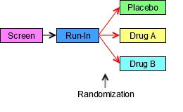

The next diagram for this trial shows the 3 epochs of the trial, indicates the 3 arms, and shows the sequence of elements for each group of subjects in each epoch. The arrows are at the right side of the diagram because it is at the end of the trial that all the separate paths through the trial can be seen. Note that, in this diagram, randomization— which was shown using 3 red arrows connecting the Run-in block with the 3 treatment blocks in the first diagram— is indicated by a note with an arrow pointing to the line between 2 epochs.

Example Trial 1, Parallel Design Prospective View

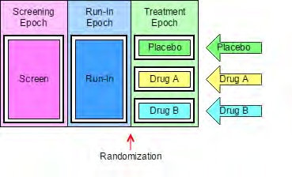

The next diagram can be thought of as the retrospective view of a trial, the view back from a point in time when a subject’s assignment to an arm is known. In this view, the trial appears as a grid, with an arm represented by a series of study cells, one for each epoch, and a sequence of elements within each study cell. In this example (as in many trials), there is exactly 1 element in each study cell. Later examples will illustrate that this is not always the case.

Example Trial 1, Parallel Design Retrospective View

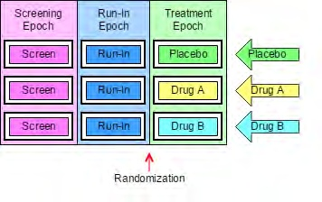

The next diagram shows the trial from the viewpoint of blinded participants. To blinded participants in this trial, all arms look alike. They know when a subject is in the screen element or the run-in element, but when a subject is in the treatment epoch, participants know only that the subject is receiving a study drug, not which study drug, and therefore not which element.

Example Trial 1, Parallel Design Blinded View

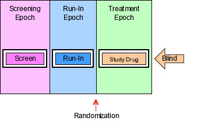

A trial design matrix is a table with a row for each arm in the trial and a column for each epoch in the trial. It is closely related to the retrospective view of the trial, and many users may find it easier to construct a table than to draw a diagram. The cells in the matrix represent the study cells, which are populated with trial elements. In this trial, each study cell contains exactly 1 element.

As illustrated in the following table, the columns of a trial design matrix are the epochs of the trial, the rows are the arms of the trial, and the cells of the matrix (the study cells) contain elements. Note that randomization is not represented in the trial design matrix. All of the preceding diagrams and the trial design matrix are alternative representations of the trial design. None of them contains all the information that will be in the finished TA dataset; users may find it useful to draw some or all of these diagrams when working out the dataset.

Trial Design Matrix

|         | Screen | Run-in | Treatment |
| ------- | ------ | ------ | --------- |
| Placebo | Screen | Run-in | PLACEBO   |
| A       | Screen | Run-in | DRUG A    |
| B       | Screen | Run-in | DRUG B    |

For Example Trial 1, the conversion of the trial design matrix into the TA dataset is straightforward. For each cell of the matrix, there is a record in the TA dataset. ARM, EPOCH, and ELEMENT can be populated directly from the matrix. TAETORD acts as a sequence number for the elements within an arm, so it can be populated by counting across the cells in the matrix. The randomization information, which is not represented in the trial design matrix, is held in TABRANCH in the TA dataset. TABRANCH is populated only if there is a branch at the end of an element for the arm. When TABRANCH is populated, it describes how the decision at the branch point would result in a subject being in this arm.

ta.xpt

| Row | STUDYID | DOMAIN | ARMCD | ARM     | TAETORD | ETCD | ELEMENT | TABRANCH              | TATRANS | EPOCH     |
| --- | ------- | ------ | ----- | ------- | ------- | ---- | ------- | --------------------- | ------- | --------- |
| 1   | EX1     | TA     | P     | Placebo | 1       | SCRN | Screen  |                       |         | SCREENING |
| 2   | EX1     | TA     | P     | Placebo | 2       | RI   | Run-In  | Randomized to Placebo |         | RUN-IN    |
| 3   | EX1     | TA     | P     | Placebo | 3       | P    | Placebo |                       |         | TREATMENT |
| 4   | EX1     | TA     | A     | A       | 1       | SCRN | Screen  |                       |         | SCREENING |
| 5   | EX1     | TA     | A     | A       | 2       | RI   | Run-In  | Randomized to Drug A  |         | RUN-IN    |
| 6   | EX1     | TA     | A     | A       | 3       | A    | Drug A  |                       |         | TREATMENT |
| 7   | EX1     | TA     | B     | B       | 1       | SCRN | Screen  |                       |         | SCREENING |
| 8   | EX1     | TA     | B     | B       | 2       | RI   | Run-In  | Randomized to Drug B  |         | RUN-IN    |
| 9   | EX1     | TA     | B     | B       | 3       | B    | Drug B  |                       |         | TREATMENT |

Example 2

The following diagram for a crossover trial does not use the crossing slanted lines sometimes used to represent crossover trials, because the order of the blocks is sufficient to represent the design of the trial. Slanted lines are used only to represent the branch point at randomization, when a subject is assigned to a sequence of treatments. As in most crossover trials, the arms are distinguished by the order of treatments, with the same treatments present in each arm. Note that even though all 3 arms of this trial end with the same block (i.e., the block for the follow-up element), the diagram does not show the arms converging into one block. Also note that the same block (the “rest” element) occurs twice within each arm. Elements are conceived of as “reusable” and can appear in more than 1 arm, in more than 1 epoch, and more than once in an arm.

Example Trial 2, Crossover Trial Study Schema

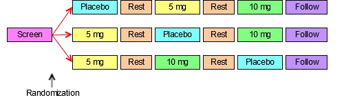

The next diagram for this crossover trial shows the prospective view of the trial; it identifies the epoch and arms of the trial, and gives each a name. As for most crossover studies, the objectives of the trial will be addressed by comparisons between the arms and by within-subject comparisons between treatments. Because the design depends on differentiating the periods during which the subject receives the 3 different treatments, there are 3 different treatment epochs. The fact that the rest periods are identified as separate epochs suggests that these also play an important part in the design of the trial; they are probably designed to allow subjects to return to “baseline,” with data collected to show that this occurred. Note that epochs are not considered reusable; each epoch has a different name, even though all the treatment epochs are similar and both the rest epochs are similar. As with the first example trial, there is a one-to-one relationship between the epochs of the trial and the elements in each arm.

Example Trial 2, Crossover Trial Prospective View

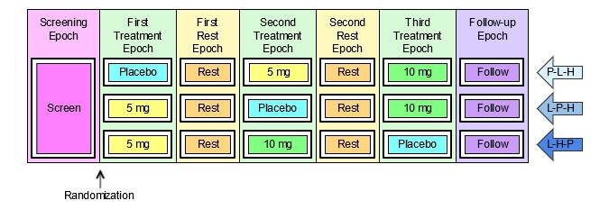

The next diagram shows the retrospective view of the trial.

Example Trial 2, Crossover Trial Retrospective View

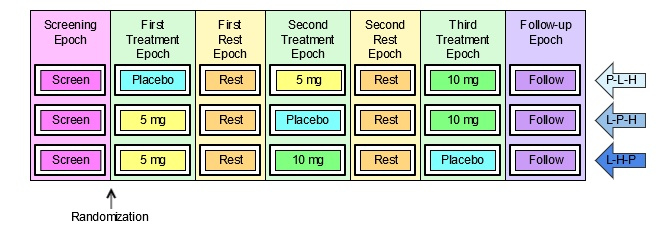

The last diagram for this trial shows the trial from the viewpoint of blinded participants. As in the simple parallel trial in Example Trial 1, blinded participants see only 1 sequence of elements; during the treatment epochs they do not know which of the treatment elements a subject is in.

Example Trial 2, Crossover Trial Blinded View

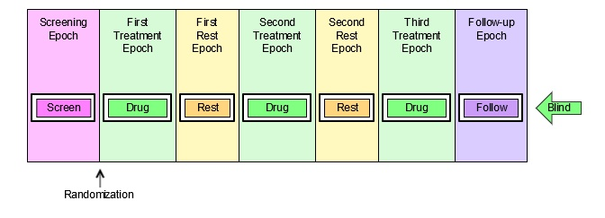

The following table illustrates the trial design matrix for this crossover example trial. It corresponds closely to the preceding retrospective diagram.

Trial Design Matrix

|        | Screen | First Treatment | First Rest S | econd Treatment | Second Rest | Third Treatment |
| ------ | ------ | --------------- | ------------ | --------------- | ----------- | --------------- |
| P-5-10 | Screen | Placebo         | Rest 5       | mg              | Rest        | 10 mg           |
| 5-P-10 | Screen | 5 mg            | Rest P       | lacebo          | Rest        | 10 mg           |
| 5-10-P | Screen | 5 mg            | Rest 1       | 0 mg            | Rest        | Placebo         |

It is straightforward to produce the TA dataset for this crossover trial from the diagram showing arms and epochs, or from the trial design matrix.

ta.xpt

| Row | STUDYID | DOMAIN | ARMCD  | ARM               | TAETORD | ETCD | ELEMENT   | TABRANCH                              | TATRANS | EPOCH       |
| --- | ------- | ------ | ------ | ----------------- | ------- | ---- | --------- | ------------------------------------- | ------- | ----------- |
| 1   | EX2     | TA     | P-5-10 | Placebo-5mg- 10mg | 1       | SCRN | Screen    | Randomized to Placebo - 5 mg - 10 mg  |         | SCREENING   |
| 2   | EX2     | TA     | P-5-10 | Placebo-5mg- 10mg | 2       | P    | Placebo   |                                       |         | TREATMENT 1 |
| 3   | EX2     | TA     | P-5-10 | Placebo-5mg- 10mg | 3       | REST | Rest      |                                       |         | WASHOUT 1   |
| 4   | EX2     | TA     | P-5-10 | Placebo-5mg- 10mg | 4       | 5    | 5 mg      |                                       |         | TREATMENT 2 |
| 5   | EX2     | TA     | P-5-10 | Placebo-5mg- 10mg | 5       | REST | Rest      |                                       |         | WASHOUT 2   |
| 6   | EX2     | TA     | P-5-10 | Placebo-5mg- 10mg | 6       | 10   | 10 mg     |                                       |         | TREATMENT 3 |
| 7   | EX2     | TA     | P-5-10 | Placebo-5mg- 10mg | 7       | FU   | Follow-up |                                       |         | FOLLOW-UP   |
| 8   | EX2     | TA     | 5-P-10 | 5mg-Placebo- 10mg | 1       | SCRN | Screen    | Randomized to 5 mg - Placebo - 10 mg  |         | SCREENING   |
| 9   | EX2     | TA     | 5-P-10 | 5mg-Placebo- 10mg | 2       | 5    | 5 mg      |                                       |         | TREATMENT 1 |
| 10  | EX2     | TA     | 5-P-10 | 5mg-Placebo- 10mg | 3       | REST | Rest      |                                       |         | WASHOUT 1   |
| 11  | EX2     | TA     | 5-P-10 | 5mg-Placebo- 10mg | 4       | P    | Placebo   |                                       |         | TREATMENT 2 |
| 12  | EX2     | TA     | 5-P-10 | 5mg-Placebo- 10mg | 5       | REST | Rest      |                                       |         | WASHOUT 2   |
| 13  | EX2     | TA     | 5-P-10 | 5mg-Placebo- 10mg | 6       | 10   | 10 mg     |                                       |         | TREATMENT 3 |
| 14  | EX2     | TA     | 5-P-10 | 5mg-Placebo- 10mg | 7       | FU   | Follow-up |                                       |         | FOLLOW-UP   |
| 15  | EX2     | TA     | 5-10-P | 5mg-10mg- Placebo | 1       | SCRN | Screen    | Randomized to 5 mg - 10 mg – Placebo |         | SCREENING   |
| 16  | EX2     | TA     | 5-10-P | 5mg-10mg- Placebo | 2       | 5    | 5 mg      |                                       |         | TREATMENT 1 |
| 17  | EX2     | TA     | 5-10-P | 5mg-10mg- Placebo | 3       | REST | Rest      |                                       |         | WASHOUT 1   |
| 18  | EX2     | TA     | 5-10-P | 5mg-10mg- Placebo | 4       | 10   | 10 mg     |                                       |         | TREATMENT 2 |
| 19  | EX2     | TA     | 5-10-P | 5mg-10mg- Placebo | 5       | REST | Rest      |                                       |         | WASHOUT 2   |
| 20  | EX2     | TA     | 5-10-P | 5mg-10mg- Placebo | 6       | P    | Placebo   |                                       |         | TREATMENT 3 |
| 21  | EX2     | TA     | 5-10-P | 5mg-10mg- Placebo | 7       | FU   | Follow-up |                                       |         | FOLLOW-UP   |

Example 3

Each of the paths for the trial illustrated in the following diagram goes through one branch point at randomization, and then through another branch point when response is evaluated. This results in 4 arms, corresponding to the number of possible paths through the trial, and also to the number of blocks at the right end of the diagram. The fact that there are only 2 kinds of block at the right end (Open DRUG X and Rescue) does not affect the fact that there are 4 paths and thus 4 arms.

Example Trial 3, Multiple Branches Study Schema

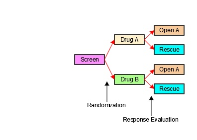

The next diagram for this trial is the prospective view. It shows the epochs of the trial and how the initial group of subjects is split into 2 treatment groups for the double-blind treatment epoch, and how each of those initial treatment groups is split in 2 at the response evaluation, resulting in the 4 arms of this trial The names of the arms have been chosen to represent the outcomes of the successive branches that, together, assign subjects to arms. These compound names were chosen to facilitate description of subjects who may drop out of the trial after the first branch and before the second branch. Example 7 in Section 5.2, Demographics, illustrates DM and Subject Elements (SE) data for such subjects.

Example Trial 3, Multiple Branches Prospective View

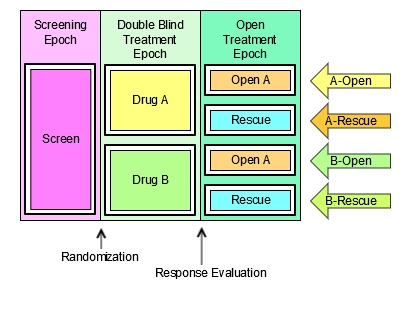

The next diagram shows the retrospective view. As with the first 2 example trials, there is 1 element in each study cell.

Example Trial 3, Multiple Branches Retrospective View

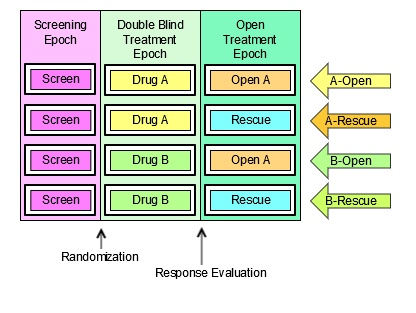

The last diagram for this trial shows the trial from the viewpoint of blinded participants. Since the prospective view is the view most relevant to study participants, the blinded view shown here is a prospective view. Because blinded participants can tell which treatment a subject receives in the Open Label epoch, they see 2 possible element sequences.

Example Trial 3, Multiple Branches Blinded View

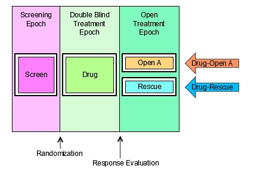

The trial design matrix for this trial can be constructed easily from the diagram showing arms and epochs.

Trial Design Matrix

|          | Screen | Double Blind | Open Label  |
| -------- | ------ | ------------ | ----------- |
| A-Open A | Screen | Treatment A  | Open Drug A |
| A-Rescue | Screen | Treatment A  | Rescue      |
| B-Open A | Screen | Treatment B  | Open Drug A |
| B-Rescue | Screen | Treatment B  | Rescue      |

Creating the TA dataset for this example trial is similarly straightforward. Note that because there are 2 branch points in this trial, TABRANCH is populated for 2 records in each arm. Note also that the values of ARMCD, like the values of ARM, reflect the 2 separate processes that result in a subject's assignment to an arm.

ta.xpt

| Row | STUDYID | DOMAIN | ARMCD | ARM       | TAETORD | ETCD | ELEMENT     | TABRANCH                                                | TATRANS | EPOCH                |
| --- | ------- | ------ | ----- | --------- | ------- | ---- | ----------- | ------------------------------------------------------- | ------- | -------------------- |
| 1   | EX3     | TA     | AA    | A-Open A  | 1       | SCRN | Screen      | Randomized to Treatment A                               |         | SCREENING            |
| 2   | EX3     | TA     | AA    | A-Open A  | 2       | DBA  | Treatment A | Assigned to Open Drug A on basis of response evaluation |         | BLINDED TREATMENT    |
| 3   | EX3     | TA     | AA    | A-Open A  | 3       | OA   | Open Drug A |                                                         |         | OPEN LABEL TREATMENT |
| 4   | EX3     | TA     | AR    | A- Rescue | 1       | SCRN | Screen      | Randomized to Treatment A                               |         | SCREENING            |
| 5   | EX3     | TA     | AR    | A- Rescue | 2       | DBA  | Treatment A | Assigned to Rescue on basis of response evaluation      |         | BLINDED TREATMENT    |
| 6   | EX3     | TA     | AR    | A- Rescue | 3       | RSC  | Rescue      |                                                         |         | OPEN LABEL TREATMENT |
| 7   | EX3     | TA     | BA    | B-Open A  | 1       | SCRN | Screen      | Randomized to Treatment B                               |         | SCREENING            |
| 8   | EX3     | TA     | BA    | B-Open A  | 2       | DBB  | Treatment B | Assigned to Open Drug A on basis of response evaluation |         | BLINDED TREATMENT    |
| 9   | EX3     | TA     | BA    | B-Open A  | 3       | OA   | Open Drug A |                                                         |         | OPEN LABEL TREATMENT |
| 10  | EX3     | TA     | BR    | B- Rescue | 1       | SCRN | Screen      | Randomized to Treatment B                               |         | SCREENING            |
| 11  | EX3     | TA     | BR    | B- Rescue | 2       | DBB  | Treatment B | Assigned to Rescue on basis of response evaluation      |         | BLINDED TREATMENT    |
| 12  | EX3     | TA     | BR    | B- Rescue | 3       | RSC  | Rescue      |                                                         |         | OPEN LABEL TREATMENT |

See Section 7.2.1.1 Trial Arms Issues, Distinguishing Between Branches and Transitions, for additional discussion regarding when a decision point in a trial design should be considered to give rise to a new arm.

Example 4

The following diagram uses a new symbol, a large curved arrow representing the fact that the chemotherapy treatment (A or B) and the rest period that follows it are to be repeated. In this trial, the chemotherapy cycles are to be repeated until disease progression. Although some chemotherapy trials specify a maximum number of cycles, protocols that allow an indefinite number of repeats are not uncommon.

Example Trial 4, Cyclical Chemotherapy Study Schema

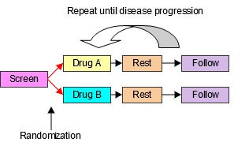

The next diagram shows the prospective view of this trial. Note that, in spite of the repeating element structure, this is, at its core, a 2-arm parallel study, and thus has 2 arms. In SDTMIG 3.1.1, there was an implicit assumption that each element must be in a separate epoch, and trials with cyclical chemotherapy were difficult to handle. The introduction of the concept of study cells and the dropping of the assumption that elements and epochs have a one- to-one relationship resolved these difficulties. This trial is best treated as having just 3 epochs, since the main objectives of the trial involve comparisons between the 2 treatments and do not require data to be considered cycle by cycle.

Example Trial 4, Cyclical Chemotherapy Prospective View

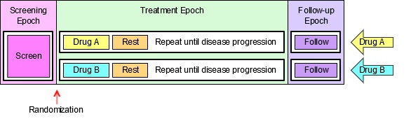

The next diagram shows the retrospective view of this trial.

Example Trial 4, Cyclical Chemotherapy Retrospective View

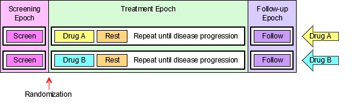

For the purpose of developing a TA dataset for this oncology trial, the diagram must be redrawn to explicitly represent multiple treatment and rest elements. If a maximum number of cycles is not given by the protocol, then— for the purposes of constructing an SDTM TA dataset for submission, which can only take place after the trial is complete—the number of repeats included in the TA dataset should be the maximum number of repeats that occurred in the trial. The next diagram assumes that the maximum number of cycles that occurred in this trial was 4. Some subjects will not have received all 4 cycles, because their disease progressed. The rule that directed that they receive no further cycles of chemotherapy is represented by a set of green arrows, 1 at the end of each rest epoch, that shows that a subject “skips forward” if their disease progresses. In the TA dataset, each skip-forward instruction is a transition rule, recorded in the TATRANS variable; when TATRANS is not populated, the rule is to transition to the next element in sequence.

Example Trial 4, Cyclical Chemotherapy Retrospective View with Explicit Repeats

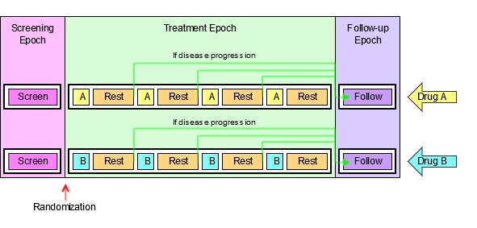

The logistics of dosing mean that few oncology trials are blinded; the next diagram, however, shows the trial from the viewpoint of blinded participants if this trial is blinded.

Example Trial 4, Cyclical Chemotherapy Blinded View

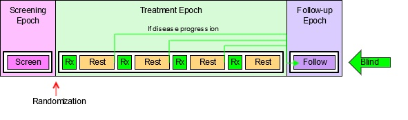

The trial design matrix for this example trial corresponds to the diagram showing the retrospective view, with explicit repeats of the treatment and rest elements. As previously noted, the trial design matrix does not include information regarding when randomization occurs; similarly, information corresponding to the skip-forward rules is not represented in the trial design matrix.

Trial Design Matrix

|   | Screen | Treatment |      |       |      |       |      |       |      | Follow-up |
| - | ------ | --------- | ---- | ----- | ---- | ----- | ---- | ----- | ---- | --------- |
| A | Screen | Trt A     | Rest | Trt A | Rest | Trt A | Rest | Trt A | Rest | Follow-up |
| B | Screen | Trt B     | Rest | Trt B | Rest | Trt B | Rest | Trt B | Rest | Follow-up |

The TA dataset for this example trial requires the use of the TATRANS variable to represent the "repeat until disease progression" feature (the green "skip forward" arrow represented this rule in the diagrams). In the TA dataset, TATRANS is populated for each element with a green arrow in the diagram. In other words, if there is a possibility that a subject will, at the end of this element, skip forward to a later part of the arm, then TATRANS is populated with the rule describing the conditions under which a subject will go to a later element. If the subject always goes to the next element in the arm (see Example Trials 1-3), then TATRANS is null. The TA dataset presented below corresponds to the trial design matrix.

ta.xpt

| Row | STUDYID | DOMAIN | ARMCD | ARM | TAETORD | ETCD | ELEMENT   | TABRANCH        | TATRANS                                       | EPOCH     |
| --- | ------- | ------ | ----- | --- | ------- | ---- | --------- | --------------- | --------------------------------------------- | --------- |
| 1   | EX4     | TA     | A     | A   | 1       | SCRN | Screen    | Randomized to A |                                               | SCREENING |
| 2   | EX4     | TA     | A     | A   | 2       | A    | Trt A     |                 |                                               | TREATMENT |
| 3   | EX4     | TA     | A     | A   | 3       | REST | Rest      |                 | If disease progression, go to Follow-up Epoch | TREATMENT |
| 4   | EX4     | TA     | A     | A   | 4       | A    | Trt A     |                 |                                               | TREATMENT |
| 5   | EX4     | TA     | A     | A   | 5       | REST | Rest      |                 | If disease progression, go to Follow-up Epoch | TREATMENT |
| 6   | EX4     | TA     | A     | A   | 6       | A    | Trt A     |                 |                                               | TREATMENT |
| 7   | EX4     | TA     | A     | A   | 7       | REST | Rest      |                 | If disease progression, go to Follow-up Epoch | TREATMENT |
| 8   | EX4     | TA     | A     | A   | 8       | A    | Trt A     |                 |                                               | TREATMENT |
| 9   | EX4     | TA     | A     | A   | 9       | REST | Rest      |                 |                                               | TREATMENT |
| 10  | EX4     | TA     | A     | A   | 10      | FU   | Follow-up |                 |                                               | FOLLOW-UP |
| 11  | EX4     | TA     | B     | B   | 1       | SCRN | Screen    | Randomized to B |                                               | SCREENING |
| 12  | EX4     | TA     | B     | B   | 2       | B    | Trt B     |                 |                                               | TREATMENT |
| 13  | EX4     | TA     | B     | B   | 3       | REST | Rest      |                 | If disease progression, go to Follow-up Epoch | TREATMENT |
| 14  | EX4     | TA     | B     | B   | 4       | B    | Trt B     |                 |                                               | TREATMENT |
| 15  | EX4     | TA     | B     | B   | 5       | REST | Rest      |                 | If disease progression, go to Follow-up Epoch | TREATMENT |
| 16  | EX4     | TA     | B     | B   | 6       | B    | Trt B     |                 |                                               | TREATMENT |
| 17  | EX4     | TA     | B     | B   | 7       | REST | Rest      |                 | If disease progression, go to Follow-up Epoch | TREATMENT |
| 18  | EX4     | TA     | B     | B   | 8       | B    | Trt B     |                 |                                               | TREATMENT |
| 19  | EX4     | TA     | B     | B   | 9       | REST | Rest      |                 |                                               | TREATMENT |
| 20  | EX4     | TA     | B     | B   | 10      | FU   | Follow-up |                 |                                               | FOLLOW-UP |

Example 5

Example Trial 5 is much like Example Trial 4, in that the 2 treatments being compared are given in cycles, and the total length of the cycle is the same for both treatments. In this trial, however, treatment A is given over longer duration than treatment B. Because of this difference in treatment patterns, this trial cannot be blinded.

Example Trial 5, Different Chemo Durations Study Schema

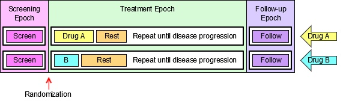

The assumption of a one-to-one relationship between elements and epochs makes such situations difficult to handle. However, without that assumption, this trial is essentially the same as Trial 4. The next diagram shows the retrospective view of this trial.

Example Trial 5, Cyclical Chemotherapy Retrospective View

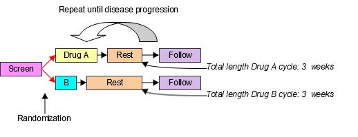

The trial design matrix for this trial is almost the same as for Example Trial 4; the only difference is that the maximum number of cycles for this trial was assumed to be 3.

Trial Design Matrix

|   | Screen | Treatment |        |       |        |       |        | Follow-up |
| - | ------ | --------- | ------ | ----- | ------ | ----- | ------ | --------- |
| A | Screen | Trt A     | Rest A | Trt A | Rest A | Trt A | Rest A | Follow-up |
| B | Screen | Trt B     | Rest B | Trt B | Rest B | Trt B | Rest B | Follow-up |

The TA dataset for this trial shown below corresponds to the trial design matrix.

ta.xpt

| Row | STUDYID | DOMAIN | ARMCD | ARM | TAETORD | ETCD  | ELEMENT   | TABRANCH        | TATRANS                                       | EPOCH     |
| --- | ------- | ------ | ----- | --- | ------- | ----- | --------- | --------------- | --------------------------------------------- | --------- |
| 1   | EX5     | TA     | A     | A   | 1       | SCRN  | Screen    | Randomized to A |                                               | SCREENING |
| 2   | EX5     | TA     | A     | A   | 2       | A     | Trt A     |                 |                                               | TREATMENT |
| 3   | EX5     | TA     | A     | A   | 3       | RESTA | Rest A    |                 | If disease progression, go to Follow-up Epoch | TREATMENT |
| 4   | EX5     | TA     | A     | A   | 4       | A     | Trt A     |                 |                                               | TREATMENT |
| 5   | EX5     | TA     | A     | A   | 5       | RESTA | Rest A    |                 | If disease progression, go to Follow-up Epoch | TREATMENT |
| 6   | EX5     | TA     | A     | A   | 6       | A     | Trt A     |                 |                                               | TREATMENT |
| 7   | EX5     | TA     | A     | A   | 7       | RESTA | Rest A    |                 |                                               | TREATMENT |
| 8   | EX5     | TA     | A     | A   | 8       | FU    | Follow-up |                 |                                               | FOLLOW-UP |
| 9   | EX5     | TA     | B     | B   | 1       | SCRN  | Screen    | Randomized to B |                                               | SCREENING |
| 10  | EX5     | TA     | B     | B   | 2       | B     | Trt B     |                 |                                               | TREATMENT |
| 11  | EX5     | TA     | B     | B   | 3       | RESTB | Rest B    |                 | If disease progression, go to Follow-up Epoch | TREATMENT |
| 12  | EX5     | TA     | B     | B   | 4       | B     | Trt B     |                 |                                               | TREATMENT |
| 13  | EX5     | TA     | B     | B   | 5       | RESTB | Rest B    |                 | If disease progression, go to Follow-up Epoch | TREATMENT |
| 14  | EX5     | TA     | B     | B   | 6       | B     | Trt B     |                 |                                               | TREATMENT |
| 15  | EX5     | TA     | B     | B   | 7       | RESTB | Rest B    |                 |                                               | TREATMENT |
| 16  | EX5     | TA     | B     | B   | 8       | FU    | Follow-up |                 |                                               | FOLLOW-UP |

Example 6

Example Trial 6 is an oncology trial comparing 2 types of chemotherapy that are given using cycles of different lengths with different internal patterns. Treatment A is given in 3-week cycles with a longer duration of treatment and a short rest; treatment B is given in 4-week cycles with a short duration of treatment and a long rest.

Example Trial 6, Different Cycle Durations Study Schema

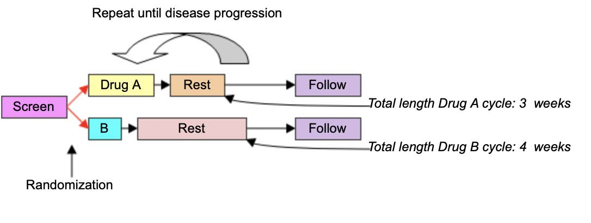

The design of this trial is very similar to that for Example Trials 4 and 5. The main difference is that there are 2 different rest elements: the short one used with drug A and the long one used with drug B. The next diagram shows the retrospective view of this trial.

Example Trial 6, Cyclical Chemotherapy Retrospective View

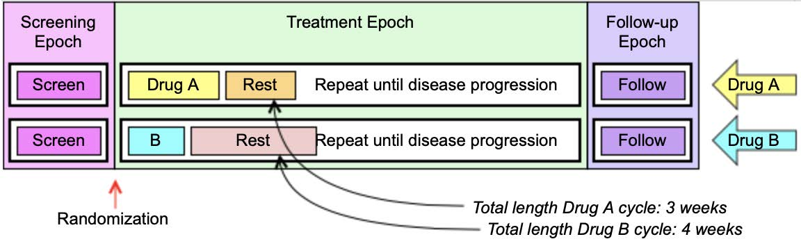

The trial design matrix for this trial assumes that there was a maximum of 4 cycles of drug A and a maximum of three cycles of drug B.

Trial Design Matrix

|   | Screen | Treatment |        |       |       |        |        |       |        |        |        | Follow-up |
| - | ------ | --------- | ------ | ----- | ----- | ------ | ------ | ----- | ------ | ------ | ------ | --------- |
| A | Screen | Trt A     | Rest A | Trt A |       | Rest A |        | Trt A | Rest A | Trt A  | Rest A | Follow-up |
| B | Screen | Trt B     | Rest B |       | Trt B |        | Rest B |       | Trt B  | Rest B |        | Follow-up |

In the following TA dataset, because the treatment epoch for arm A has more elements than the treatment epoch for arm B, TAETORD is 10 for the follow-up element in arm A, but 8 for the follow-up element in arm B. (It would also be possible to assign a TAETORD value of 10 to the follow-up element in arm B.) The primary purpose of TAETORD is to order elements within an arm; leaving gaps in the series of TAETORD values does not interfere with this purpose.

ta.xpt

| Row | STUDYID | DOMAIN | ARMCD | ARM | TAETORD | ETCD  | ELEMENT   | TABRANCH        | TATRANS                                       | EPOCH     |
| --- | ------- | ------ | ----- | --- | ------- | ----- | --------- | --------------- | --------------------------------------------- | --------- |
| 1   | EX6     | TA     | A     | A   | 1       | SCRN  | Screen    | Randomized to A |                                               | SCREENING |
| 2   | EX6     | TA     | A     | A   | 2       | A     | Trt A     |                 |                                               | TREATMENT |
| 3   | EX6     | TA     | A     | A   | 3       | RESTA | Rest A    |                 | If disease progression, go to Follow-up Epoch | TREATMENT |
| 4   | EX6     | TA     | A     | A   | 4       | A     | Trt A     |                 |                                               | TREATMENT |
| 5   | EX6     | TA     | A     | A   | 5       | RESTA | Rest A    |                 | If disease progression, go to Follow-up Epoch | TREATMENT |
| 6   | EX6     | TA     | A     | A   | 6       | A     | Trt A     |                 |                                               | TREATMENT |
| 7   | EX6     | TA     | A     | A   | 7       | RESTA | Rest A    |                 | If disease progression, go to Follow-up Epoch | TREATMENT |
| 8   | EX6     | TA     | A     | A   | 8       | A     | Trt A     |                 |                                               | TREATMENT |
| 9   | EX6     | TA     | A     | A   | 9       | RESTA | Rest A    |                 |                                               | TREATMENT |
| 10  | EX6     | TA     | A     | A   | 10      | FU    | Follow-up |                 |                                               | FOLLOW-UP |
| 11  | EX6     | TA     | B     | B   | 1       | SCRN  | Screen    | Randomized to B |                                               | SCREENING |
| 12  | EX6     | TA     | B     | B   | 2       | B     | Trt B     |                 |                                               | TREATMENT |
| 13  | EX6     | TA     | B     | B   | 3       | RESTB | Rest B    |                 | If disease progression, go to Follow-up Epoch | TREATMENT |
| 14  | EX6     | TA     | B     | B   | 4       | B     | Trt B     |                 |                                               | TREATMENT |
| 15  | EX6     | TA     | B     | B   | 5       | RESTB | Rest B    |                 | If disease progression, go to Follow-up Epoch | TREATMENT |
| 16  | EX6     | TA     | B     | B   | 6       | B     | Trt B     |                 |                                               | TREATMENT |
| 17  | EX6     | TA     | B     | B   | 7       | RESTB | Rest B    |                 |                                               | TREATMENT |
| 18  | EX6     | TA     | B     | B   | 8       | FU    | Follow-up |                 |                                               | FOLLOW-UP |

Example 7

In open trials, there is no requirement to maintain a blind, and the arms of a trial may be quite different from each other. In such a case, changes in treatment in one arm may differ in number and timing from changes in treatment in another, so that there is nothing like a one-to-one match between the elements in the different arms. In such a case, epochs are likely to be defined as broad intervals of time, spanning several elements, and chosen to correspond to periods of time that will be compared in analyses of the trial.

Example Trial 7, RTOG 93-09, involves treatment of lung cancer with chemotherapy and radiotherapy, with or without surgery. The protocol (RTOG-93-09), which was provided by the Radiation Oncology Therapy Group (RTOG), does not include a study schema diagram, but does include a text-based representation of diverging “options” to which a subject may be assigned. All subjects go through the branch point at randomization, when they are assigned to either chemotherapy plus radiotherapy (CR) or chemotherapy and radiotherapy plus surgery (CRS). All subjects receive induction chemotherapy and radiation, with a slight difference between those randomized to the 2 arms during the second cycle of chemotherapy. Those randomized to the non-surgery arm are evaluated for disease somewhat earlier, to avoid delays in administering the radiation boost to those whose disease has not progressed. After induction chemotherapy and radiation, subjects are evaluated for disease progression, and those whose disease has progressed stop treatment, but enter follow-up. Not all subjects randomized to receive surgery who do not have disease progression will necessarily receive surgery. If they are poor candidates for surgery or do not wish to receive surgery, they will not receive surgery, but will receive further chemotherapy. The following diagram is based on the text “schema” in the protocol, with the 5 options it names. The diagram in this form might suggest that the trial has 5 arms.

Example Trial 7, RTOG 93-09 Study Schema with 5 "options"

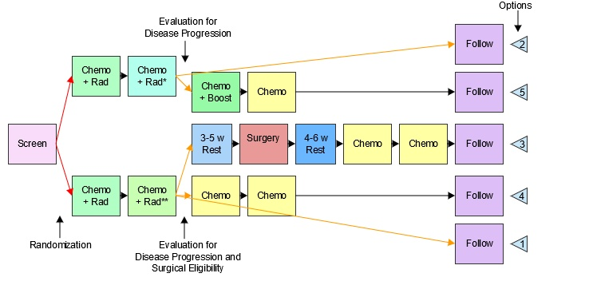

*Disease evaluation earlier **Disease evaluation later

However, the objectives of the trial make it clear that this trial is designed to compare 2 treatment strategies, chemotherapy and radiation with and without surgery, so this study is better modeled as a 2-arm trial, but with major "skip forward" arrows for some subjects, as illustrated in the following diagram. This diagram also shows more detail within the Induction Chemo + RT and Additional Chemo blocks than the preceding diagram. Both the induction and additional chemotherapy are given in 2 cycles. The second induction cycle is different for the 2 arms, since radiation therapy for those assigned to the non-surgery arm includes a “boost” which those assigned to the surgery arm do not receive.

The next diagram shows the prospective view of this trial. The protocol conceives of treatment as being divided into 2 parts, induction and continuation, so these have been treated as 2 different epochs. This is also an important point in the trial operationally, the point when subjects are “registered” a second time, and when subjects who will skip forward are identified (i.e., because of disease progression or ineligibility for surgery).

Example Trial 7, RTOG-93-09 Prospective View

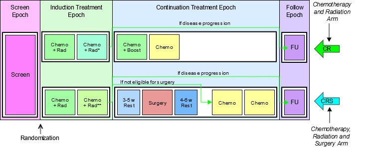

*Disease evaluation earlier **Disease evaluation later

The next diagram shows the retrospective view of this trial. The fact that the elements in the study cell for the CR arm in the continuation treatment epoch do not fill the space in the diagram is an artifact of the diagram conventions. Those subjects who do receive surgery will in fact spend a longer time completing treatment and moving into follow-up. Although it is tempting to think of the horizontal axis of these diagrams as a timeline, this can sometimes

be misleading. The diagrams are not necessarily to scale in the sense that the length of the block representing an element represents its duration, and elements that line up on the same vertical line in the diagram may not occur at the same relative time within the study.

Example Trial 7, RTOG 93-09 Retrospective View

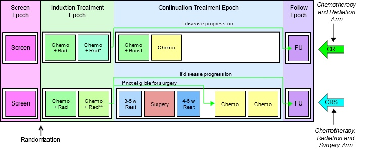

*Disease evaluation earlier **Disease evaluation later

The following table shows the trial design matrix for this 2-arm example trial.

Trial Design Matrix

|     | Screen | Induction          |                           | Continuation |         |            |       |       |       | Follow-up                |  |
| --- | ------ | ------------------ | ------------------------- | ------------ | ------- | ---------- | ----- | ----- | ----- | ------------------------ | - |
| CR  | Screen | Initial Chemo + RT | Chemo + RT (non- Surgery) | Chemo        |         |            | Chemo |       |       | Off Treatment Follow- up |  |
| CRS | Screen | Initial Chemo + RT | Chemo + RT (Surgery)      | 3-5 w Rest   | Surgery | 4-6 w Rest |       | Chemo | Chemo | Off Treatment Follow-up  |  |

The TA dataset reflects that this is a 2-arm trial.

ta.xpt

| Row | STUDYID | DOMAIN | ARMCD | ARM | TAETORD | ETCD | ELEMENT                 | TABRANCH          | TATRANS                                                                                                                            | EPOCH                  |
| --- | ------- | ------ | ----- | --- | ------- | ---- | ----------------------- | ----------------- | ---------------------------------------------------------------------------------------------------------------------------------- | ---------------------- |
| 1   | EX7     | TA     | 1     | CR  | 1       | SCRN | Screen                  | Randomized to CR  |                                                                                                                                    | SCREENING              |
| 2   | EX7     | TA     | 1     | CR  | 2       | ICR  | Initial Chemo + RT      |                   |                                                                                                                                    | INDUCTION TREATMENT    |
| 3   | EX7     | TA     | 1     | CR  | 3       | CRNS | Chemo+RT (non- Surgery) |                   | If progression, skip to Follow-up.                                                                                                 | INDUCTION TREATMENT    |
| 4   | EX7     | TA     | 1     | CR  | 4       | C    | Chemo                   |                   |                                                                                                                                    | CONTINUATION TREATMENT |
| 5   | EX7     | TA     | 1     | CR  | 5       | C    | Chemo                   |                   |                                                                                                                                    | CONTINUATION TREATMENT |
| 6   | EX7     | TA     | 1     | CR  | 6       | FU   | Off Treatment Follow-up |                   |                                                                                                                                    | FOLLOW-UP              |
| 7   | EX7     | TA     | 2     | CRS | 1       | SCRN | Screen                  | Randomized to CRS |                                                                                                                                    | SCREENING              |
| 8   | EX7     | TA     | 2     | CRS | 2       | ICR  | Initial Chemo + RT      |                   |                                                                                                                                    | INDUCTION TREATMENT    |
| 9   | EX7     | TA     | 2     | CRS | 3       | CRS  | Chemo+RT (Surgery)      |                   | If progression, skip to Follow-up. If no progression, but subject is ineligible for or does not consent to surgery, skip to Chemo. | INDUCTION TREATMENT    |
| 10  | EX7     | TA     | 2     | CRS | 4       | R3   | 3-5 week rest           |                   |                                                                                                                                    | CONTINUATION TREATMENT |
| 11  | EX7     | TA     | 2     | CRS | 5       | SURG | Surgery                 |                   |                                                                                                                                    | CONTINUATION TREATMENT |
| 12  | EX7     | TA     | 2     | CRS | 6       | R4   | 4-6 week rest           |                   |                                                                                                                                    | CONTINUATION TREATMENT |
| 13  | EX7     | TA     | 2     | CRS | 7       | C    | Chemo                   |                   |                                                                                                                                    | CONTINUATION TREATMENT |
| 14  | EX7     | TA     | 2     | CRS | 8       | C    | Chemo                   |                   |                                                                                                                                    | CONTINUATION TREATMENT |
| 15  | EX7     | TA     | 2     | CRS | 9       | FU   | Off Treatment Follow-up |                   |                                                                                                                                    | FOLLOW-UP              |

##### 7.2.1.1 Trial Arms Issues

Distinguishing Between Branches and Transitions

Both the Branch and Transition columns contain rules, but the 2 columns represent 2 different types of rules. Branch rules represent forks in the trial flowchart, giving rise to separate arms. The rule underlying a branch in the trial design appears in multiple records, once for each "fork" of the branch. Within any one record, there is no choice (no "if" clause) in the value of the branch condition. For example, the value of TABRANCH for a record in arm A is "Randomized to Arm A" because a subject in arm A must have been randomized to arm A. Transition rules are used for choices within an arm. The value for TATRANS does contain a choice (an "if" clause). In Example Trial 4, subjects who receive 1, 2, 3, or 4 cycles of treatment A are all considered to belong to arm A.

In modeling a trial, decisions may have to be made about whether a decision point in the flow chart represents the separation of paths that represent different arms, or paths that represent variations within the same arm, as illustrated in the discussion of Example Trial 7. This decision will depend on the comparisons of interest in the trial.

Some trials refer to groups of subjects who follow a particular path through the trial as "cohorts," particularly if the groups are formed successively over time. The term "cohort" is used with different meanings in different protocols and does not always correspond to an arm.

Subjects Not Assigned to an Arm

Some trial subjects may drop out of the study before they reach all of the branch points in the trial design. In the Demographics (DM) domain, the values of ARM and ARMCD must be supplied for such subjects, but the special values used for these subjects should not be included in the Trial Arms (TA) dataset; only complete arm paths should be described in the TA dataset. In Section 5.2, Demographics, assumption 4 describes special ARM and ARMCD values used for subjects who do not reach the first branch point in a trial. When a trial design includes 2 or more branches, special values of ARM and ARMCD may be needed for subjects who pass through the first branch point, but drop out before the final branch point. See DM Example 3 for how to represent ARM and ARMCD values for such trials.

Defining Epochs

The series of examples for the TA dataset provides a variety of scenarios and guidance about how to assign epoch in those scenarios. In general, assigning epochs for blinded trials is easier than for unblinded trials. The blinded view of the trial will generally make the possible choices clear. For unblinded trials, the comparisons that will be made between arms can guide the definition of epochs. For trials that include many variant paths within an arm, comparisons of arms will mean that subjects on a variety of paths will be included in the comparison, and this is likely to lead to definition of broader epochs.

Rule Variables

The Branch and Transition columns shown in the example tables are variables with a Role of “Rule.” The values of a Rule variable describe conditions under which something is planned to happen. At the moment, values of Rule variables are text. At some point in the future, it is expected that a mechanism to provide machine-readable rules will become available. Other Rule variables are present in the Trial Elements (TE) and Trial Visits (TV) datasets.

#### 7.2.2 Trial Elements (TE)

TE – Description/Overview

A trial design domain that contains the element code that is unique for each element, the element description, and the rules for starting and ending an element.

The Trial Elements (TE) dataset contains the definitions of the elements that appear in the Trial Arms (TA) dataset. An element may appear multiple times in the TA table because it appears either (1) in multiple arms, (2) multiple times within an arm, or (3) both. However, an element will appear only once in the TE table.

Each row in the TE dataset may be thought of as representing a "unique element" in the same sense of "unique" as a CRF template page for a collecting certain type of data referred to as "unique page." For instance, a CRF might be described as containing 87 pages, but only 23 unique pages. By analogy, the trial design matrix in Example Trial 1 (see Section 7.2.1, Trial Arms) has 9 study cells, each of which contains 1 element, but the same trial design

matrix contains only 5 unique elements, so the TE dataset for that trial has only 5 records.

An element is a building block for creating study cells, and an arm is composed of study cells. Or, from another point of view, an arm is composed of elements; that is, the trial design assigns subjects to arms, which comprise a sequence of steps called elements.

Trial elements represent an interval of time that serves a purpose in the trial and are associated with certain activities affecting the subject. “Week 2 to week 4” is not a valid element. A valid element has a name that describes the purpose of the element and includes a description of the activity or event that marks the subject's transition into the element as well as the conditions for leaving the element.

TE – Specification

te.xpt, Trial Elements — Trial Design. One record per planned Element, Tabulation.

| Variable Name | Variable Label              | Type | Controlled Terms, Codelist or Format1 | Role              | CDISC Notes                                                                                                                                                                                                                                       | Core |
| ------------- | --------------------------- | ---- | ------------------------------------- | ----------------- | ------------------------------------------------------------------------------------------------------------------------------------------------------------------------------------------------------------------------------------------------- | ---- |
| STUDYID       | Study Identifier            | Char |                                       | Identifier        | Unique identifier for a study.                                                                                                                                                                                                                    | Req  |
| DOMAIN        | Domain Abbreviation         | Char | TE                                    | Identifier        | Two-character abbreviation for the domain.                                                                                                                                                                                                        | Req  |
| ETCD          | Element Code                | Char | *                                     | Topic             | ETCD (the companion to ELEMENT) is limited to 8 characters and does not have special character restrictions. These values should be short for ease of use in programming, but it is not expected that ETCD will need to serve as a variable name. | Req  |
| ELEMENT       | Description of Element      | Char | *                                     | Synonym Qualifier | The name of the element.                                                                                                                                                                                                                          | Req  |
| TESTRL        | Rule for Start of Element   | Char |                                       | Rule              | Describes condition for beginning element.                                                                                                                                                                                                        | Req  |
| TEENRL        | Rule for End of Element     | Char |                                       | Rule              | Describes condition for ending element. Either TEENRL or TEDUR must be present for each element.                                                                                                                                                  | Perm |
| TEDUR         | Planned Duration of Element | Char | ISO 8601 duration                     | Timing            | Planned duration of element in ISO 8601 format. Used when the rule for ending the element is applied after a fixed duration.                                                                                                                      | Perm |

1In this column, an asterisk (*) indicates that the variable may be subject to controlled terminology. CDISC/NCI codelist values are enclosed in parentheses.

TE – Assumptions

1. There are no gaps between elements. The instant one element ends, the next element begins. A subject spends no time “between” elements.
2. The ELEMENT (Description of the Element) variable usually indicates the treatment being administered during an element, or, if no treatment is being administered, the other activities that are the purpose of this period of time (e.g., "Screening", "Follow-up", "Washout"). In some cases, this time period may be quite passive (e.g., "Rest"; "Wait, for disease episode").
3. The TESTRL (Rule for Start of Element) variable identifies the event that marks the transition into this element. For elements that involve treatment, this is the start of treatment.
4. For elements that do not involve treatment, TESTRL can be more difficult to define. For washout and follow-up elements, which always follow treatment elements, the start of the element may be defined relative to the end of a preceding treatment. For example, a washout period might be defined as starting 24 or 48 hours after the last dose of drug for the preceding treatment element or epoch. This definition is not totally independent of the TA dataset, because it relies on knowing where in the trial design the element is used, and that it always follows a treatment element. Defining a clear starting point for the start of a non- treatment element that always follows another non-treatment element can be particularly difficult. The transition may be defined by a decision-making activity such as enrollment or randomization. For example, every arm of a trial that involves treating disease episodes might start with a screening element followed by an element that consists of waiting until a disease episode occurs. The activity that marks the beginning of the wait element might be randomization.
5. TESTRL for a treatment element may be thought of as “active” whereas the start rule for a non-treatment element—particularly a follow-up or washout element—may be “passive.” The start of a treatment element will not occur until a dose is given, no matter how long that dose is delayed. Once the last dose is given, the start of a subsequent non-treatment element is inevitable, as long as another dose is not given.
6. Note that the date/time of the event described in TESTRL will be used to populate the date/times in the Subject Elements (SE) dataset, so the date/time of the event should be captured in the CRF.
7. Specifying TESTRL for an element that serves the first element of an arm in the TA dataset involves defining the start of the trial. In the examples in this document, obtaining informed consent has been used as "Trial Entry."
8. TESTRL should be expressed without referring to arm. If the element appears in more than 1 arm in the TA dataset, then the element description (ELEMENT) must not refer to any arms.
9. TESTRL should be expressed without referring to epoch. If the element appears in more than 1 epoch in the TA dataset, then the Element description (ELEMENT) must not refer to any epochs.
10. For a blinded trial, it is useful to describe TESTRL in terms that separate the properties of the event that are visible to blinded participants from the properties that are visible only to those who are unblinded. For treatment elements in blinded trials, wording such as the following is suitable: "First dose of study drug for a treatment epoch, where study drug is X."
11. Element end rules are rather different from element start rules. The actual end of one element is the beginning of the next element. Thus, the element end rule does not give the conditions under which an element does end, but the conditions under which it should end or is planned to end.
12. At least 1 of TEENRL and TEDUR must be populated. Both may be populated.
13. TEENRL describes the circumstances under which a subject should leave this element. Element end rules may depend on a variety of conditions. For instance, a typical criterion for ending a rest element between oncology chemotherapy-treatment element would be, “15 days after start of element and after WBC values have recovered." The TA dataset, not the TE dataset, describes where the subject moves next, so TEENRL must be expressed without referring to arm.
14. TEDUR serves the same purpose as TEENRL for the special (but very common) case of an element with a fixed duration. TEDUR is expressed in ISO 8601. For example, a TEDUR value of P6W is equivalent to a TEENRL of "6 weeks after the start of the element."
15. Note that elements that have different start and end rules are different elements and must have different values of ELEMENT and ETCD. For instance, elements that involve the same treatment but have different durations are different elements. The same applies to non-treatment elements. For instance, a washout with a fixed duration of 14 days is different from a washout that is to end after 7 days if drug cannot be detected in a blood sample, or after 14 days otherwise.

TE – Examples

Both of the trials in TA Examples 1 and 2 (see Section 7.2.1, Trial Arms) are assumed to have fixed-duration elements. The wording in TESTRL is intended to separate the description of the event that starts the element into the part that would be visible to a blinded participant in the trial (e.g., "First dose of a treatment epoch") from the part that is revealed when the study is unblinded (e.g., "where dose is 5 mg"). Care must be taken in choosing these descriptions to be sure that they are arm- and epoch-neutral. For instance, in a crossover trial such as TA Example Trial 3, where an element may appear in 1 of multiple epochs, the wording must be appropriate for all possible epochs (e.g., "OPEN LABEL TREATMENT"). The SDS Team is considering adding a separate variable to the TE dataset that would hold information on the treatment that is associated with an element. This would make it clearer which elements are "treatment elements” and, therefore, which epochs contain treatment elements and thus are "treatment Epochs."

Example 1

This example shows the TE dataset for TA Example Trial 1.

te.xpt

| Row | STUDYID | DOMAIN | ETCD | ELEMENT | TESTRL                                          | TEENRL                         | TEDUR |
| --- | ------- | ------ | ---- | ------- | ----------------------------------------------- | ------------------------------ | ----- |
| 1   | EX1     | TE     | SCRN | Screen  | Informed consent                                | 1 week after start of Element  | P7D   |
| 2   | EX1     | TE     | RI   | Run-In  | Eligibility confirmed                           | 2 weeks after start of Element | P14D  |
| 3   | EX1     | TE     | P    | Placebo | First dose of study drug, where drug is placebo | 2 weeks after start of Element | P14D  |
| 4   | EX1     | TE     | A    | Drug A  | First dose of study drug, where drug is Drug A  | 2 weeks after start of Element | P14D  |
| 5   | EX1     | TE     | B    | Drug B  | First dose of study drug, where drug is Drug B  | 2 weeks after start of Element | P14D  |

Example 2

This example shows the TE dataset for TA Example Trial 2.

te.xpt

| Row | STUDYID | DOMAIN | ETCD | ELEMENT   | TESTRL                                                    | TEENRL                         | TEDUR |
| --- | ------- | ------ | ---- | --------- | --------------------------------------------------------- | ------------------------------ | ----- |
| 1   | EX2     | TE     | SCRN | Screen    | Informed consent                                          | 2 weeks after start of Element | P14D  |
| 2   | EX2     | TE     | P    | Placebo   | First dose of a treatment Epoch, where dose is placebo    | 2 weeks after start of Element | P14D  |
| 3   | EX2     | TE     | 5    | 5 mg      | First dose of a treatment Epoch, where dose is 5 mg drug  | 2 weeks after start of Element | P14D  |
| 4   | EX2     | TE     | 10   | 10 mg     | First dose of a treatment Epoch, where dose is 10 mg drug | 2 weeks after start of Element | P14D  |
| 5   | EX2     | TE     | REST | Rest      | 48 hrs after last dose of preceding treatment Epoch       | 1 week after start of Element  | P7D   |
| 6   | EX2     | TE     | FU   | Follow-up | 48 hrs after last dose of third treatment Epoch           | 3 weeks after start of Element | P21D  |

Example 3

The TE dataset for TA Example Trial 4 illustrates element end rules for elements that are not all of fixed duration. The screen element in this study can be up to 2 weeks long, but because it may end earlier it is not of fixed duration. The rest element has a variable length, depending on how quickly WBC recovers. Note that the start rules for the A and B elements have been written to be suitable for a blinded study.

te.xpt

| Row | STUDYID | DOMAIN | ETCD | ELEMENT   | TESTRL                                                     | TEENRL                                                                   | TEDUR |
| --- | ------- | ------ | ---- | --------- | ---------------------------------------------------------- | ------------------------------------------------------------------------ | ----- |
| 1   | EX4     | TE     | SCRN | Screen    | Informed Consent                                           | Screening assessments are complete, up to 2 weeks after start of Element |       |
| 2   | EX4     | TE     | A    | Trt A     | First dose of treatment Element, where drug is Treatment A | 5 days after start of Element                                            | P5D   |
| 3   | EX4     | TE     | B    | Trt B     | First dose of treatment Element, where drug is Treatment B | 5 days after start of Element                                            | P5D   |
| 4   | EX4     | TE     | REST | Rest      | Last dose of previous treatment cycle + 24 hrs             | At least 16 days after start of Element and WBC recovered                |       |
| 5   | EX4     | TE     | FU   | Follow-up | Decision not to treat further                              | 4 weeks                                                                  | P28D  |

##### 7.2.2.1 Trial Elements Issues

Granularity of Trial Elements

Deciding how finely to divide trial time when identifying trial elements is a matter of judgment, as illustrated by the following examples:

1. TA Example Trial 2 was represented using 3 treatment epochs separated by 2 washout epochs and followed

by a follow-up epoch. This might have been modeled using 3 treatment epochs that included both the 2- week treatment period and the 1-week rest period. Because the first week after the third treatment period would be included in the third treatment epoch, the follow-up epoch would then have a duration of 2 weeks.

2. In TA Example Trials 4, 5, and 6, separate treatment and rest elements were identified. However, the

combination of treatment and rest could be represented as a single element.

3. A trial might include a dose titration, with subjects receiving increasing doses on a weekly basis until

certain conditions are met. The trial design could be modeled in any of the following ways:

a. Using several 1-week elements at specific doses, followed by an element of variable length at the chosen dose

b. As a titration element of variable length followed by a constant dosing element of variable length

c. One element with dosing determined by titration.

The choice of elements used to represent this dose titration will depend on the objectives of the trial and how the data will be analyzed and reported. If it is important to examine side effects or lab values at each individual dose, the first model is appropriate. If it is important only to identify the time to completion of titration, the second model might be appropriate. If the titration process is routine and is of little interest, the third model might be adequate for the purposes of the trial.

Distinguishing Elements, Study Cells, and Epochs

It is easy to confuse elements, which are reusable trial building blocks, with study cells (which contain the elements for a particular epoch and Arm) and with epochs (which are time periods for the trial as a whole). In part, this is because many trials have epochs for which the same element appears in all arms. In other words, in the trial design matrix for many trials, there are columns (Epochs) in which all the study cells have the same contents. It also is natural to use the same name (e.g., screen, follow-up) for both such an epoch and the single element that appears within it.

Confusion can also arise from the fact that in the blinded treatment portions of blinded trials, blinded participants do not know which element a subject is in, but do know what epoch the subject is in.

In describing a trial, one way to avoid confusion between elements and epochs is to include "Element" or "Epoch" in the values of ELEMENT or EPOCH when these values (e.g., screening, follow-up) would otherwise be the same. It becomes tedious to do this in every case, but can be useful to resolve confusion when it arises or is likely to arise.

The difference between epoch and element is perhaps clearest in crossover trials. In TA Example Trial 2, as for most crossover trials, the analysis of pharmacokinetic (PK) results would include both treatment and period effects in the model. “Treatment effect” derives from element (placebo, 5 mg, 10 mg), whereas “period effect” derives from the epoch (first, second, or third treatment epoch).

Transitions Between Elements

The transition between one element and the next can be thought of as a 3-step process:

| Step | Step question                                       | How step question is answered by information in the TA datasets                                                                                                                                                                                                                                                                                       |
| ---- | --------------------------------------------------- | ----------------------------------------------------------------------------------------------------------------------------------------------------------------------------------------------------------------------------------------------------------------------------------------------------------------------------------------------------- |
| 1    | Should the subject leave the current element?       | The criteria for ending the current element are in TEENRL in the TE dataset.                                                                                                                                                                                                                                                                          |
| 2    | Which element should the subject enter next?        | If there is a branch point at this point in the trial, evaluate criteria described in TABRANCH (e.g., randomization results) in the TA dataset. Otherwise, if TATRANS in the TA dataset is populated in this arm at this point, follow those instructions. Otherwise, move to the next element in this arm as specified by TAETORD in the TA dataset. |
| 3    | What does the subject do to enter the next element? | The action or event that marks the start of the next element is specified in TESTRL in the TE dataset.                                                                                                                                                                                                                                                |

Note that the subject is not "in limbo" during this process. The subject remains in the current element until step 3, at which point the subject transitions to the new element. There are no gaps between elements.

As illustrated in the table, executing a transition depends on information that is split between the TE and the TA datasets.

It can be useful, in the process of working out the Trial Design (TD) datasets, to create a dataset that supplements the TA dataset with the TESTRL, TEENRL, and TEDUR variables, so that full information on the transitions is easily accessible. However, such a working dataset is not an SDTM dataset, and should not be submitted.

The following table shows a fragment of such a table for TA Example Trial 4.

Note that

- for all records that contain a particular element, all the TE variable values are exactly the same; and
- when both TABRANCH and TATRANS are blank, the implicit decision in step 2 is that the subject moves to the next element in sequence for the arm.

special.xpt

| Row | ARM | EPOCH     | TAETORD | ELEMENT | TESTRL                                                        | TEENRL                                                                   | TEDUR | TABRANCH        | TATRANS                                       |
| --- | --- | --------- | ------- | ------- | ------------------------------------------------------------- | ------------------------------------------------------------------------ | ----- | --------------- | --------------------------------------------- |
| 1   | A   | Screen    | 1       | Screen  | Informed Consent                                              | Screening assessments are complete, up to 2 weeks after start of Element |       | Randomized to A |                                               |
| 2   | A   | Treatment | 2       | Trt A   | First dose of treatment in Element, where drug is Treatment A | 5 days after start of Element                                            | P5D   |                 |                                               |
| 3   | A   | Treatment | 3       | Rest    | Last dose of previous treatment cycle + 24 hrs                | 16 days after start of Element and WBC recovers                          |       |                 | If disease progression, go to Follow-up Epoch |
| 4   | A   | Treatment | 4       | Trt A   | First dose of treatment in Element, where drug is Treatment A | 5 days after start of Element                                            | P5D   |                 |                                               |

Note that rows 2 and 4 of this dataset involve the same element (Trt A); thus, TESTRL is the same for both. The activity that marks a subject's entry into the fourth element in arm A is "First dose of treatment Element, where drug is Treatment A." This is not the subject's very first dose of treatment A, but it is their first dose in this element.

### 7.3 Schedule for Assessments (TV, TD, and TM)

This section contains the Trial Design (TD) datasets that describe:

- The protocol-defined planned schedule of subject encounters at the healthcare facility where the study is being conducted (Section 7.3.1, Trial Visits (TV))
- The planned schedule of efficacy assessments related to the disease under study (Section 7.3.2, Trial Disease Assessments (TD))
- The things (events, interventions, or findings) which, if and when they happen, are the occasion for assessments planned in the protocol (Section 7.3.3, Trial Disease Milestones (TM))

The Trial Visits (TV) and TD datasets provide the planned scheduling of assessments to which a subject’s actual visits and disease assessments can be compared.

#### 7.3.1 Trial Visits (TV)

TV – Description/Overview

A trial design domain that contains the planned order and number of visits in the study within each arm.

Visits are defined as "clinical encounters" and are described using the timing variables VISIT, VISITNUM, and VISITDY.

Protocols define visits in order to describe assessments and procedures that are to be performed at the visits.

TV – Specification

tv.xpt, Trial Visits — Trial Design. One record per planned Visit per Arm, Tabulation.

| Variable Name | Variable Label             | Type | Controlled Terms, Codelist or Format1 | Role              | CDISC Notes                                                                                                                                                                                                                                                                                                                                                                                                                                                                                                                                                  | Core |
| ------------- | -------------------------- | ---- | ------------------------------------- | ----------------- | ------------------------------------------------------------------------------------------------------------------------------------------------------------------------------------------------------------------------------------------------------------------------------------------------------------------------------------------------------------------------------------------------------------------------------------------------------------------------------------------------------------------------------------------------------------ | ---- |
| STUDYID       | Study Identifier           | Char |                                       | Identifier        | Unique identifier for a study.                                                                                                                                                                                                                                                                                                                                                                                                                                                                                                                               | Req  |
| DOMAIN        | Domain Abbreviation        | Char | TV                                    | Identifier        | Two-character abbreviation for the domain.                                                                                                                                                                                                                                                                                                                                                                                                                                                                                                                   | Req  |
| VISITNUM      | Visit Number               | Num  |                                       | Topic             | Clinical encounter number. Numeric version of VISIT, used for sorting.                                                                                                                                                                                                                                                                                                                                                                                                                                                                                       | Req  |
| VISIT         | Visit Name                 | Char |                                       | Synonym Qualifier | Description of clinical encounter. This is often defined in the protocol. Used in addition to VISITNUM and/or VISITDY as a text description of the clinical encounter.                                                                                                                                                                                                                                                                                                                                                                                       | Req  |
| VISITDY       | Planned Study Day of Visit | Num  |                                       | Timing            | Planned study day of VISIT. Due to its sequential nature, used for sorting.                                                                                                                                                                                                                                                                                                                                                                                                                                                                                  | Perm |
| ARMCD         | Planned Arm Code           | Char | *                                     | Record Qualifier  | 1. ARMCD is limited to 20 characters and does not have special character restrictions. The maximum length of ARMCD is longer than for other "short" variables to accommodate the kind of values that are likely to be needed for crossover trials. For example, if ARMCD values for a 7-period crossover were constructed using 2-character abbreviations for each treatment and separating hyphens, the length of ARMCD values would be 20. 2. If the timing of visits for a trial does not depend on which arm a subject is in, then ARMCD should be null. | Exp  |
| ARM           | Description of Planned Arm | Char | *                                     | Synonym Qualifier | 1. Name given to an arm or treatment group. 2. If the timing of visits for a trial does not depend on which arm a subject is in, then Arm should be left blank.                                                                                                                                                                                                                                                                                                                                                                                              | Perm |
| TVSTRL        | Visit Start Rule           | Char |                                       | Rule              | Rule describing when the visit starts, in relation to the sequence of elements.                                                                                                                                                                                                                                                                                                                                                                                                                                                                              | Req  |
| TVENRL        | Visit End Rule             | Char |                                       | Rule              | Rule describing when the visit ends, in relation to the sequence of elements.                                                                                                                                                                                                                                                                                                                                                                                                                                                                                | Perm |

1In this column, an asterisk (*) indicates that the variable may be subject to controlled terminology. CDISC/NCI codelist values are enclosed in parentheses.

TV – Assumptions

1. Although the general structure of the Trial Visits (TV) dataset is "One Record per Planned Visit per Arm," for many clinical trials—particularly blinded clinical trials—the schedule of visits is the same for all arms, and the structure of the TV dataset will be "One Record per Planned Visit." If the schedule of visits is the same for all arms, ARMCD should be left blank for all records in the TV dataset. For trials with trial visits that are different for different arms (e.g., Example Trial 7 in Section 7.2.1, Trial Arms), ARMCD and ARM should be populated for all records. If some visits are the same for all arms, and some visits differ by arm, then ARMCD and ARM should be populated for all records, to ensure clarity, even though this will mean creating near-duplicate records for visits that are the same for all arms.
2. A visit may start in one element and end in another. This means that a visit may start in one epoch and end in another. For example, if one of the activities planned for a visit is the administration of the first dose of study drug, the visit might start in the screen epoch and end in a treatment epoch.
3. TVSTRL describes the scheduling of the visit and should reflect the wording in the protocol. In many trials, all visits are scheduled relative to the study's day 1 (RFSTDTC). In such trials, it is useful to include VISITDY, which is, in effect, a special case representation of TVSTRL.
4. Note that there is a subtle difference between the following 2 examples. In the first case, if visit 3 were delayed for some reason, visit 4 would be unaffected. In the second case, a delay to visit 3 would result in visit 4 being delayed as well.

   a. Case 1: Visit 3 starts 2 weeks after RFSTDTC. Visit 4 starts 4 weeks after RFSTDTC.

   b. Case 2: Visit 3 starts 2 weeks after RFSTDTC. Visit 4 starts 2 weeks after visit 3.
5. Many protocols do not give any information about visit ends because visits are assumed to end on the same day they start. In such a case, TVENRL may be left blank to indicate that the visit ends on the same day it starts. Care should be taken to assure that this is appropriate; common practice may be to record data collected over more than 1 day as occurring within a single visit. Screening visits may be particularly prone to collection of data over multiple days. The examples for this domain show how TVENRL could be populated.
6. The values of VISITNUM in the TV dataset are the valid values of VISITNUM for planned visits. Any values of VISITNUM that appear in subject-level datasets that are not in the TV dataset are assumed to correspond to unplanned visits. This applies, in particular, to the subject-level dataset; see Section 5.5, Subject Visits, for additional information about handling unplanned visits. If a subject-level dataset includes both VISITNUM and VISIT, then records that include values of VISITNUM that appear in the TV dataset should also include the corresponding values of VISIT from the TV dataset.

TV – Examples

Example 1

The following diagram represents visits as numbered "flags" with visit numbers. Each flag has 2 supports, one at the beginning of the visit and the other at the end of the visit. Note that visits 2 and 3 span epoch transitions. In other words, the transition event that marks the beginning of the run-in epoch (confirmation of eligibility) occurs during visit 2, and the transition event that marks the beginning of the treatment epoch (the first dose of study drug) occurs during visit 3.

Example Trial 1, Parallel Design Planned Visits

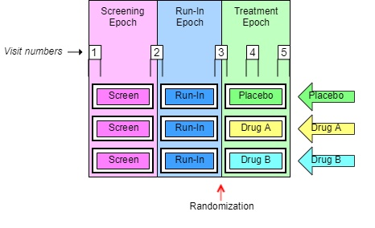

Two TV datasets are shown for this trial. The first shows a somewhat idealized situation, where the protocol has provided specific timings for the visits. The second shows a more common situation, where the timings have been described only loosely.

tv.xpt

| Row | STUDYID | DOMAIN | VISITNUM | TVSTRL                                 | TVENRL                                 |
| --- | ------- | ------ | -------- | -------------------------------------- | -------------------------------------- |
| 1   | EX1     | TV     | 1        | Start of Screen Epoch                  | 1 hour after start of Visit            |
| 2   | EX1     | TV     | 2        | 30 minutes before end of Screen Epoch  | 30 minutes after start of Run-in Epoch |
| 3   | EX1     | TV     | 3        | 30 minutes before end of Run-in Epoch  | 1 hour after start of Treatment Epoch  |
| 4   | EX1     | TV     | 4        | 1 week after start of Treatment Epoch  | 1 hour after start of Visit            |
| 5   | EX1     | TV     | 5        | 2 weeks after start of Treatment Epoch | 1 hour after start of Visit            |

tv.xpt

| Row | STUDYID | DOMAIN | VISITNUM | TVSTRL                                                      | TVENRL                                                          |
| --- | ------- | ------ | -------- | ----------------------------------------------------------- | --------------------------------------------------------------- |
| 1   | EX1     | TV     | 1        | Start of Screen Epoch                                       |                                                                 |
| 2   | EX1     | TV     | 2        | On the same day as, but before, the end of the Screen Epoch | On the same day as, but after, the start of the Run-in Epoch    |
| 3   | EX1     | TV     | 3        | On the same day as, but before, the end of the Run-in Epoch | On the same day as, but after, the start of the Treatment Epoch |
| 4   | EX1     | TV     | 4        | 1 week after start of Treatment Epoch                       |                                                                 |
| 5   | EX1     | TV     | 5        | 2 weeks after start of Treatment Epoch                      | At Trial Exit                                                   |

Although the start and end rules in this example reference the starts and ends of epochs, the start and end rules of some visits for trials with epochs that span multiple elements will need to reference elements rather than epochs. When an arm includes repetitions of the same element, it may be necessary to use TAETORD as well as an element name to specify when a visit is to occur.

##### 7.3.1.1 Trial Visits Issues

Identifying Trial Visits

In general, a trial's visits are defined in its protocol. The term “visit” reflects the fact that data in outpatient studies is usually collected during a physical visit by the subject to a clinic. Sometimes a trial visit defined by the protocol may not correspond to a physical visit. It may span multiple physical visits, as when screening data is collected over several clinic visits but recorded under one TV name (VISIT) and number (VISITNUM). A trial visit also may represent only a portion of an extended physical visit, as when a trial of in-patients collects data under multiple trial visits for a single hospital admission.

Diary data and other data collected outside a clinic may not fit the usual concept of a trial visit, but the planned times of collection of such data may be described as “visits” in the TV dataset if desired.

Trial Visit Rules

Visit start rules are different from element start rules in that they usually describe when a visit should occur; element start rules describe the moment at which an element is considered to start. There are usually gaps between visits, periods of time that do not belong to any visit, so it is usually not necessary to identify the moment when one visit stops and another starts. However, some trials of hospitalized subjects may divide time into visits in a manner more like that used for elements, and a transition event may need to be defined in such cases.

Visit start rules are usually expressed relative to the start or end of an element or epoch (e.g., "1-2 hours before end of First Wash-out", "8 weeks after end of 2nd Treatment Epoch"). Note that the visit may or may not occur during the element used as the reference for the visit start rule. For example, a trial with elements based on treatment of disease episodes might plan a visit 6 months after the start of the first treatment period, regardless of how many disease episodes have occurred.

Visit end rules are similar to element end rules, describing when a visit should end. They may be expressed relative to the start or end of an element or epoch, or relative to the start of the visit.

The timings of visits relative to elements may be expressed in terms that cannot be easily quantified. For instance, a protocol might instruct that at a baseline visit the subject be randomized, given the study drug, and instructed to take the first dose of study drug X at bedtime that night. This baseline visit is thus started and ended before the start of the treatment epoch, but we don't know how long before the start of the treatment epoch the visit will occur. The trial start rule might contain the value "On the day of, but before, the start of the Treatment Epoch".

Visit Schedules Expressed with Ranges

Ranges may be used to describe the planned timing of visits (e.g., 12-16 days after the start of 2nd Element), but this is different from the “windows” that may be used in selecting data points to be included in an analysis associated with that visit. For example, although visit 2 was planned for 12-16 days after the start of treatment, data collected 10-18 days after the start of treatment might be included in a visit 1 analysis. The 2 ranges serve different purposes.

Contingent Visits

Some data collection is contingent on the occurrence of a "trigger" event or disease milestone (see Section 7.3.3, Trial Disease Milestones (TM)). When such planned data collection involves an additional clinic visit, a "contingent" visit may be included in the TV table, with a rule that describes the circumstances under which it will take place. Because values of VISITNUM must be assigned to all records in the TV dataset, a contingent visit included in the TV dataset must have a VISITNUM, but the VISITNUM value might not be a "chronological" value, due to the uncertain timing of a contingent visit. If contingent visits are not included in the TV dataset, then they would be treated as unplanned visits in the Subject Visits (SV) domain (see Section 6.2.8, Subject Visits).

#### 7.3.2 Trial Disease Assessments (TD)

TD – Description/Overview

A trial design domain that provides information on the protocol-specified disease assessment schedule, to be used for comparison with the actual occurrence of the efficacy assessments in order to determine whether there was good compliance with the schedule.

TD – Specification

td.xpt, Trial Disease Assessments — Trial Design. One record per planned constant assessment period, Tabulation.

| Variable Name | Variable Label   | Type | Controlled Terms, Codelist or Format1 | Role       | CDISC Notes                    | Core |
| ------------- | ---------------- | ---- | ------------------------------------- | ---------- | ------------------------------ | ---- |
| STUDYID       | Study Identifier | Char |                                       | Identifier | Unique identifier for a study. | Req  |

| DOMAIN   | Domain Abbreviation                     | Char | TD                | Identifier       | Two-character abbreviation for the domain.                                                                                                                                                                                                                                                                                                                                                                                                            | Req |
| -------- | --------------------------------------- | ---- | ----------------- | ---------------- | ----------------------------------------------------------------------------------------------------------------------------------------------------------------------------------------------------------------------------------------------------------------------------------------------------------------------------------------------------------------------------------------------------------------------------------------------------- | --- |
| TDORDER  | Sequence of Planned Assessment Schedule | Num  |                   | Timing           | A number given to ensure ordinal sequencing of the planned assessment schedules within a trial.                                                                                                                                                                                                                                                                                                                                                       | Req |
| TDANCVAR | Anchor Variable Name                    | Char |                   | Timing           | A reference to the date variable name that provides the start point from which the planned disease assessment schedule is measured. This must be a referenced from the ADaM ADSL dataset (e.g., "ANCH1DT"). Note: TDANCVAR will contain the name of a reference date variable.                                                                                                                                                                        | Req |
| TDSTOFF  | Offset from the Anchor                  | Char | ISO 8601 duration | Timing           | A fixed offset from the date provided by the variable referenced in TDANCVAR. This is used when the timing of planned cycles does not start on the exact day referenced in the variable indicated in TDANCVAR. The value of this variable will be either zero or a positive value and will be represented in ISO 8601 character format.                                                                                                               | Req |
| TDTGTPAI | Planned Assessment Interval             | Char | ISO 8601 duration | Timing           | The planned interval between disease assessments represented in ISO 8601 character format.                                                                                                                                                                                                                                                                                                                                                            | Req |
| TDMINPAI | Planned Assessment Interval Minimum     | Char | ISO 8601 duration | Timing           | The lower limit of the allowed range for the planned interval between disease assessments represented in ISO 8601 character format.                                                                                                                                                                                                                                                                                                                   | Req |
| TDMAXPAI | Planned Assessment Interval Maximum     | Char | ISO 8601 duration | Timing           | The upper limit of the allowed range for the planned interval between disease assessments represented in ISO 8601 character format.                                                                                                                                                                                                                                                                                                                   | Req |
| TDNUMRPT | Maximum Number of Actual Assessments    | Num  |                   | Record Qualifier | This variable must represent the maximum number of actual assessments for the analysis that this disease assessment schedule describes. In a trial where the maximum number of assessments is not defined explicitly in the protocol (e.g., assessments occur until death), TDNUMRPT should represent the maximum number of disease assessments that support the efficacy analysis encountered by any subject across the trial at that point in time. | Req |

1In this column, an asterisk (*) indicates that the variable may be subject to controlled terminology. CDISC/NCI codelist values are enclosed in parentheses.

TD – Assumptions

1. The purpose of the Trial Disease Assessments (TD) domain is to provide information on planned scheduling of disease assessments when the scheduling of disease assessments is not necessarily tied to the scheduling of visits. In oncology studies, good compliance with the disease-assessment schedule is essential to reduce the risk of "assessment time bias." The TD domain makes possible an evaluation of assessment time bias from the SDTM, in particular for studies with progression-free survival (PFS) endpoints. TD has limited utility within oncology and was developed specifically with RECIST in mind and where an assessment-time bias analysis is appropriate. It is understood that extending this approach to Cheson and other criteria may not be appropriate or may pose difficulties. It is also understood that this approach may not be necessary in non-oncology studies, although it is available for use if appropriate.
2. A planned schedule of assessments will have a defined start point; the TDANCVAR variable is used to identify the variable in the ADaM subject-level dataset (ADSL) that holds the “anchor” date. By default, the anchor variable for the first pattern is ANCH1DT. An anchor date must be provided for each pattern of assessments, and each anchor variable must exist in ADSL. TDANCVAR is therefore a Required variable. Anchor date variable names should adhere to ADaM variable naming conventions (e.g. ANCH1DT, ANCH2DT). One anchor date may be used to anchor more than 1 pattern of disease assessments. When that is the case, the appropriate offset for the start of a subsequent pattern, represented as an ISO 8601 duration value, should be provided in the TDSTOFF variable.
3. The TDSTOFF variable is used in conjunction with the anchor date value (from the anchor date variable identified in TDANCVAR). If the pattern of disease assessments does not start exactly on a date collected on the CRF, this variable will represent the offset between the anchor date value and the start date of the pattern of disease assessments. This may be a positive or zero interval value represented in an ISO 8601 format.
4. A pattern of assessments consists of a series of intervals of equal duration, each followed by an assessment. Thus, the first assessment in a pattern is planned to occur at the anchor date (given by the variable named in TDANCVAR) plus the offset (TDSTOFF) plus the target assessment interval (TDTGTPAI). A baseline evaluation is usually not preceded by an interval, and would therefore not be considered part of an assessment pattern.
5. This domain should not be created when the disease assessment schedule may vary for individual subjects (e.g., when completion of the first phase of a study is event-driven).

TD – Examples

Example 1

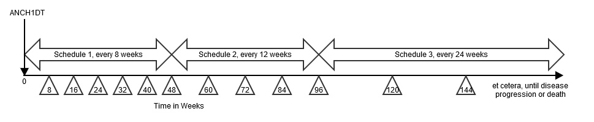

This example shows a study where the disease assessment schedule changes over the course of the study. In this example, there are 3 distinct disease-assessment schedule patterns. A single anchor date variable (TDANCVAR) provides the anchor date for each pattern. The offset variable (TDSTOFF), used in conjunction with the anchor date variable, provides the start point of each pattern of assessments..

- The first disease-assessment schedule pattern starts at the reference start date (identified in the ADSL ANCH1DT variable) and repeats every 8 weeks for a total of 6 repeated assessments (i.e., week 8, week 16, week 24, week 32, week 40, week 48). Note that there is an upper and lower limit around the planned disease assessment target where the first assessment (8 weeks) could occur as early as day 53 and as late as week 9. This upper and lower limit (-3 days, +1 week) would be applied to all assessments during that pattern.
- The second disease assessment schedule starts from week 48 and repeats every 12 weeks for a total of 4 repeats (i.e., week 60, week 72, week 84, week 96), with respective upper and lower limits of -1 week and + 1 week.
- The third disease assessment schedule starts from week 96 and repeats every 24 weeks (week 120, week 144, and so on), with respective upper and lower limits of -1 week and + 1 week, for an indefinite length of time. The preceding schematic shows that, for the third pattern, assessments will occur until disease progression; this therefore leaves the pattern open-ended. However, when data is included in an analysis, the total number of repeats can be identified and the highest number of repeat assessments for any subject in that pattern must be recorded in the TDNUMRPT variable on the final pattern record.

td.xpt

| Row | STUDYID | DOMAIN | TDORDER | TDANCVAR | TDSTOFF | TDTGTPAI | TDMINPAI | TDMAXPAI | TDNUMRPT |
| --- | ------- | ------ | ------- | -------- | ------- | -------- | -------- | -------- | -------- |
| 1   | ABC123  | TD     | 1       | ANCH1DT  | P0D     | P8W      | P53D     | P9W      | 6        |
| 2   | ABC123  | TD     | 2       | ANCH1DT  | P48W    | P12W     | P11W     | P13W     | 4        |
| 3   | ABC123  | TD     | 3       | ANCH1DT  | P96W    | P24W     | P23W     | P25W     | 12       |

Example 2

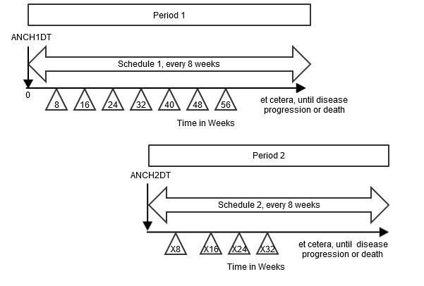

This example shows a crossover study, where subjects are given the period 1 treatment according to the first disease- assessment schedule until disease progression, then there is a rest period of 28 days prior to the start of period 2 treatment (i.e., re-baseline for period 2). The subjects are then given the period 2 treatment according to the second disease assessment schedule until disease progression. This example also shows how two different reference/anchor dates can be used.

- The Rest element is not represented as a row in the TD dataset, since no disease assessments occur during the Rest. Note that although the Rest epoch in this example is not important for TD, it is important that it is represented in other trial design datasets.

Row 1: Shows the disease assessment schedule for the first treatment period. The diagram above shows that this schedule repeats until disease progression. After the trial ended, the maximum number of repeats in this schedule was determined to be 6, so that is the value in TDNUMRPT for this schedule.

Row 2: Shows the disease assessment schedule for the second period. The pattern starts on the date identified in the ADSL variable ANCH2DT and repeats every 8 weeks with respective upper and lower limits of
-1 week and + 1 week. The maximum number of repeats that occurred on this schedule was 4.

td.xpt

| Row | STUDYID | DOMAIN | TDORDER | TDANCVAR | TDSTOFF | TDTGTPAI | TDMINPAI | TDMAXPAI | TDNUMRPT |
| --- | ------- | ------ | ------- | -------- | ------- | -------- | -------- | -------- | -------- |
| 1   | ABC123  | TD     | 1       | ANCH1DT  | P0D     | P8W      | P53D     | P9W      | 6        |
| 2   | ABC123  | TD     | 2       | ANCH2DT  | P0D     | P8W      | P53D     | P9W      | 4        |

Example 3

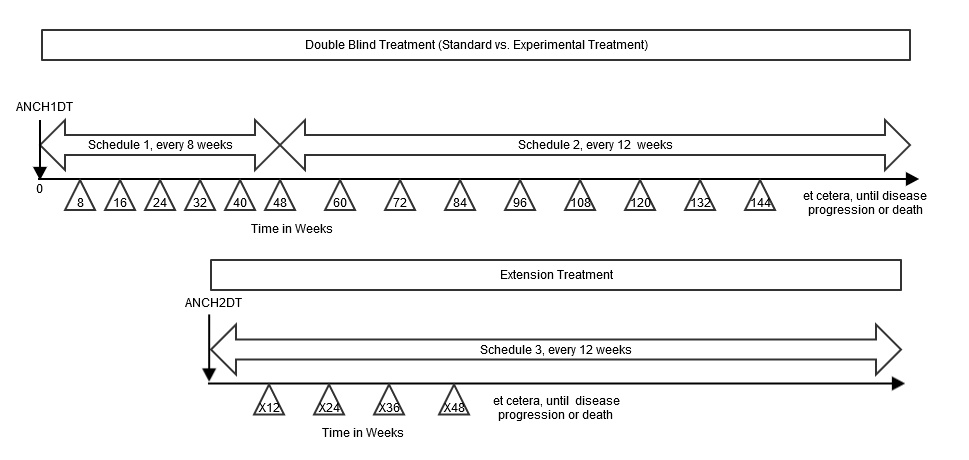

This example shows a study where subjects are randomized to standard treatment or an experimental treatment. The subjects who are randomized to standard treatment are given the option to receive experimental treatment after they end the standard treatment (e.g., due to disease progression on standard treatment). In the randomized treatment epoch, the disease assessment schedule changes over the course of the study. At the start of the extension treatment epoch, subjects are re-baselined, i.e., an extension baseline disease assessment is performed and the disease assessment schedule is restarted).

In this example, there are 3 distinct disease-assessment schedule patterns:

- The first disease-assessment schedule pattern starts at the reference start date (identified in the ADSL ANCH1DT variable) and repeats every 8 weeks for a total of 6 repeats ( i.e., week 8, week 16, week 24, week 32, week 40, week 48), with respective upper and lower limits of - 3 days and + 1 week.
- The second disease assessment schedule starts from week 48 and repeats every 12 weeks (week 60, week 72, etc.), with respective upper and lower limits of -1 week and + 1 week, for an indefinite length of time. The preceding schematic shows that, for the second pattern, assessments will occur until disease progression; this therefore leaves the pattern open-ended.
- The third disease assessment schedule starts at the extension reference start date (identified in the ADSL ANCH2DT variable) from week 96 and repeats every 24 weeks (week 120, week 144, etc.), with respective upper and lower limits of -1 week and + 1 week, for an indefinite length of time. The schematic shows that, for the third pattern, assessments will occur until disease progression; this therefore leaves the pattern open- ended.

For open-ended patterns, the total number of repeats can be identified when the data analysis is performed; the highest number of repeat assessments for any subject in that pattern must be recorded in the TDNUMRPT variable on the final pattern record.

td.xpt

| Row | STUDYID | DOMAIN | TDORDER | TDANCVAR | TDSTOFF | TDTGPAI | TDMINPAI | TDMAXPAI | TDNUMRPT |
| --- | ------- | ------ | ------- | -------- | ------- | ------- | -------- | -------- | -------- |
| 1   | ABC123  | TD     | 1       | ANCH1DT  | P0D     | P8W     | P53D     | P9W      | 6        |
| 2   | ABC123  | TD     | 2       | ANCH1DT  | P48W    | P12W    | P11W     | P13W     | 17       |
| 3   | ABC123  | TD     | 3       | ANCH2DT  | P0D     | P12W    | P11W     | P13W     | 17       |

#### 7.3.3 Trial Disease Milestones (TM)

TM – Description/Overview

A trial design domain that is used to describe disease milestones, which are observations or activities anticipated to occur in the course of the disease under study, and which trigger the collection of data.

TM – Specification

tm.xpt, Trial Disease Milestones — Trial Design. One record per Disease Milestone type, Tabulation.

| Variable Name | Variable Label                         | Type | Controlled Terms, Codelist or Format1 | Role               | CDISC Notes                                                                                                                                      | Core |
| ------------- | -------------------------------------- | ---- | ------------------------------------- | ------------------ | ------------------------------------------------------------------------------------------------------------------------------------------------ | ---- |
| STUDYID       | Study Identifier                       | Char |                                       | Identifier         | Unique identifier for a study.                                                                                                                   | Req  |
| DOMAIN        | Domain Abbreviation                    | Char | TM                                    | Identifier         | Two-character abbreviation for the domain, which must be TM.                                                                                     | Req  |
| MIDSTYPE      | Disease Milestone Type                 | Char |                                       | Topic              | The type of disease milestone. Example: "HYPOGLYCEMIC EVENT".                                                                                    | Req  |
| TMDEF         | Disease Milestone Definition           | Char |                                       | Variable Qualifier | Definition of the disease milestone.                                                                                                             | Req  |
| TMRPT         | Disease Milestone Repetition Indicator | Char | (NY)                                  | Record Qualifier   | Indicates whether this is a disease milestone that can occur only once ("N") or a type of disease milestone that can occur multiple times ("Y"). | Req  |

1In this column, an asterisk (*) indicates that the variable may be subject to controlled terminology. CDISC/NCI codelist values are enclosed in parentheses.

TM – Assumptions

1. Disease milestones may be things that would be expected to happen before the study, or things that are anticipated to happen during the study. The occurrence of disease milestones for particular subjects are represented in the Subject Disease Milestones (SM) dataset.
2. The Trial Disease Milestones (TM) dataset contains a record for each type of disease milestone. The disease milestone is defined in TMDEF.

TM – Examples

Example 1

In this diabetes study, initial diagnosis of diabetes and the hypoglycemic events that occur during the trial have been identified as disease milestones of interest.

Row 1: Shows that the initial diagnosis is given the MIDSTYPE of "DIAGNOSIS" and is defined in TMDEF. It is not repeating (occurs only once).

Row 2: Shows that hypoglycemic events are given the MIDSTYPE of "HYPOGLYCEMIC EVENT", and a definition in TMDEF. (For an actual study, the definition would be expected to include a particular threshold level, rather than the text "threshold level" used in this example.) A subject may experience multiple hypoglycemic events, as indicated by TMRPT = "Y".

tm.xpt

| Row | STUDYID | DOMAIN | MIDSTYPE           | TMDEF T                                                                                        | MRPT |
| --- | ------- | ------ | ------------------ | ---------------------------------------------------------------------------------------------- | ---- |
| 1   | XYZ     | TM     | DIAGNOSIS          | Initial diagnosis of diabetes, the first time a physician told the subject they had N diabetes |      |
| 2   | XYZ     | TM     | HYPOGLYCEMIC EVENT | Hypoglycemic Event, the occurrence of a glucose level below (threshold level) Y                |      |

### 7.4 Trial Eligibility and Summary (TI and TS)

This section contains the Trial Design (TD) datasets that describe:

- Subject eligibility criteria for trial participation (Section 7.4.1, Trial Inclusion/Exclusion Criteria (TI))
- The characteristics of the trial (Section 7.4.2, Trial Summary (TS))

The TI and TS datasets are tabular synopses of parts of the study protocol.

#### 7.4.1 Trial Inclusion/Exclusion Criteria (TI)

TI – Proposed Removal of Variable TIRL

The variable TIRL was included in the Trial Inclusion/Exclusion Criteria (TI) domain in anticipation of developing a way to represent eligibility criteria in a computer-executable manner. However, such a method has not been developed, and it is not clear that an SDTM dataset would be the best place to represent such a computer-executable representation.

TI – Description/Overview

A trial design domain that contains one record for each of the inclusion and exclusion criteria for the trial. This domain is not subject oriented.

TI contains all the inclusion and exclusion criteria for the trial, and thus provides information that may not be present in the subject-level data on inclusion and exclusion criteria. The IE domain (described in Section 6.3.4, Inclusion/Exclusion Criteria Not Met) contains records only for inclusion and exclusion criteria that subjects did not meet.

TI – Specification

ti.xpt, Trial Inclusion/Exclusion Criteria — Trial Design. One record per I/E criterion, Tabulation.

| Variable Name | Variable Label                     | Type | Controlled Terms, Codelist or Format1 | Role               | CDISC Notes                                                                                                                                                                                                                                                                                                                                                                                   | Core |
| ------------- | ---------------------------------- | ---- | ------------------------------------- | ------------------ | --------------------------------------------------------------------------------------------------------------------------------------------------------------------------------------------------------------------------------------------------------------------------------------------------------------------------------------------------------------------------------------------- | ---- |
| STUDYID       | Study Identifier                   | Char |                                       | Identifier         | Unique identifier for a study.                                                                                                                                                                                                                                                                                                                                                                | Req  |
| DOMAIN        | Domain Abbreviation                | Char | TI                                    | Identifier         | Two-character abbreviation for the domain.                                                                                                                                                                                                                                                                                                                                                    | Req  |
| IETESTCD      | Incl/Excl Criterion Short Name     | Char | *                                     | Topic              | Short name IETEST. It can be used as a column name when converting a dataset from a vertical to a horizontal format. The value in IETESTCD cannot be longer than 8 characters, nor can it start with a number (e.g., "1TEST" is not valid). IETESTCD cannot contain characters other than letters, numbers, or underscores. The prefix "IE" is used to ensure consistency with the IE domain. | Req  |
| IETEST        | Inclusion/Exclusion Criterion      | Char | *                                     | Synonym Qualifier  | Full text of the inclusion or exclusion criterion. The prefix "IE" is used to ensure consistency with the IE domain.                                                                                                                                                                                                                                                                          | Req  |
| IECAT         | Inclusion/Exclusion Category       | Char | (IECAT)                               | Grouping Qualifier | Used for categorization of the inclusion or exclusion criteria.                                                                                                                                                                                                                                                                                                                               | Req  |
| IESCAT        | Inclusion/Exclusion Subcategory    | Char | *                                     | Grouping Qualifier | A further categorization of the exception criterion. Can be used to distinguish criteria for a sub-study or to categorize as major or minor exceptions. Examples: "MAJOR", "MINOR".                                                                                                                                                                                                           | Perm |
| TIRL          | Inclusion/Exclusion Criterion Rule | Char |                                       | Rule               | Rule that expresses the criterion in computer-executable form. See Assumption 4.                                                                                                                                                                                                                                                                                                              | Perm |
| TIVERS        | Protocol Criteria Versions         | Char |                                       | Record Qualifier   | The number of this version of the Inclusion/Exclusion criteria. May be omitted if there is only 1 version.                                                                                                                                                                                                                                                                                    | Perm |

1In this column, an asterisk (*) indicates that the variable may be subject to controlled terminology. CDISC/NCI codelist values are enclosed in parentheses.

TI – Assumptions

1. If inclusion/exclusion criteria were amended during the trial, then each complete set of criteria must be included in the TI domain. TIVERS is used to distinguish between the versions.
2. Protocol version numbers should be used to identify criteria versions, although there may be more versions of the protocol than versions of the inclusion/exclusion criteria. For example, a protocol might have versions 1, 2, 3, and 4, but if the inclusion/exclusion criteria in version 1 were unchanged through versions 2 and 3, and changed only in version 4, then there would be 2 sets of inclusion/exclusion criteria in TI: one for version 1 and one for version 4.
3. Individual criteria do not have versions. If a criterion changes, it should be treated as a new criterion, with a new value for IETESTCD. If criteria have been numbered and values of IETESTCD are generally of the form INCL00n or EXCL00n, and new versions of a criterion have not been given new numbers, separate values of IETESTCD might be created by appending letters (e.g., INCL003A, INCL003B).
4. IETEST contains the text of the inclusion/exclusion criterion. However, because entry criteria are rules, the variable TIRL has been included in anticipation of the development of computer-executable rules.
5. If a criterion text is <200 characters, it goes in IETEST; if the text is >200 characters, put meaningful text in IETEST and describe the full text in the study metadata. See Section 4.5.3.1, Test Name (--TEST) Greater than 40 Characters, for further information.

TI – Examples

Example 1

This example shows records for a trial that with 2 versions of inclusion/exclusion criteria.

Rows 1-3: Show the 2 inclusion criteria and 1 exclusion criterion for version 1 of the protocol.

Rows 4-6: Show the inclusion/exclusion criteria for version 2.2 of the protocol, which changed the minimum age for entry from 21 to 18.

ti.xpt

| Row | STUDYID | DOMAIN | IETESTCD | IETEST I                  | ECAT      | TIVERS |
| --- | ------- | ------ | -------- | ------------------------- | --------- | ------ |
| 1   | XYZ     | TI     | INCL01   | Has disease under study I | NCLUSION  | 1      |
| 2   | XYZ     | TI     | INCL02   | Age 21 or greater I       | NCLUSION  | 1      |
| 3   | XYZ     | TI     | EXCL01   | Pregnant or lactating     | EXCLUSION | 1      |
| 4   | XYZ     | TI     | INCL01   | Has disease under study I | NCLUSION  | 2.2    |
| 5   | XYZ     | TI     | INCL02A  | Age 18 or greater I       | NCLUSION  | 2.2    |
| 6   | XYZ     | TI     | EXCL01   | Pregnant or lactating     | EXCLUSION | 2.2    |

#### 7.4.2 Trial Summary (TS)

TS – Description/Overview

A trial design domain that contains one record for each trial summary characteristic. This domain is not subject oriented.

The Trial Summary (TS) dataset allows the sponsor to submit a summary of the trial in a structured format. Each record in the TS dataset contains the value of a parameter, a characteristic of the trial. For example, TS is used to record basic information about the study such as trial phase, protocol title, and trial objectives. The TS dataset contains information about the planned and actual trial characteristics.

TS – Specification

ts.xpt, Trial Summary — Trial Design. One record per trial summary parameter value, Tabulation.

| Variable Name | Variable Label                       | Type | Controlled Terms, Codelist or Format1 | Role              | CDISC Notes                                                                                                                                                                                                                                                                           | Core |
| ------------- | ------------------------------------ | ---- | ------------------------------------- | ----------------- | ------------------------------------------------------------------------------------------------------------------------------------------------------------------------------------------------------------------------------------------------------------------------------------- | ---- |
| STUDYID       | Study Identifier                     | Char |                                       | Identifier        | Unique identifier for a study.                                                                                                                                                                                                                                                        | Req  |
| DOMAIN        | Domain Abbreviation                  | Char | TS                                    | Identifier        | Two-character abbreviation for the domain.                                                                                                                                                                                                                                            | Req  |
| TSSEQ         | Sequence Number                      | Num  |                                       | Identifier        | Sequence number given to ensure uniqueness within a parameter. Allows inclusion of multiple records for the same TSPARMCD.                                                                                                                                                            | Req  |
| TSGRPID       | Group ID                             | Char |                                       | Identifier        | Used to tie together a group of related records.                                                                                                                                                                                                                                      | Perm |
| TSPARMCD      | Trial Summary Parameter Short Name   | Char | (TSPARMCD)                            | Topic             | TSPARMCD (the companion to TSPARM) is limited to 8 characters and does not have special character restrictions. These values should be short for ease of use in programming, but it is not expected that TSPARMCD will need to serve as variable names. Examples: "AGEMIN", "AGEMAX". | Req  |
| TSPARM        | Trial Summary Parameter              | Char | (TSPARM)                              | Synonym Qualifier | Term for the trial summary parameter. The value in TSPARM cannot be longer than 40 characters. Examples: "Planned Minimum Age of Subjects", "Planned Maximum Age of Subjects".                                                                                                        | Req  |
| TSVAL         | Parameter Value                      | Char | *                                     | Result Qualifier  | Value of TSPARM. Example: "ASTHMA" when TSPARM value is "Trial Indication". TSVAL can only be null when TSVALNF is populated. Text over 200 characters can be added to additional columns TSVAL1-TSVALn. See Assumption 8.                                                            | Exp  |
| TSVALNF       | Parameter Value Null Flavor          | Char | ISO 21090 NullFlavor                  | Result Qualifier  | Null flavor for the value of TSPARM, to be populated only if TSVAL is null.                                                                                                                                                                                                           | Perm |
| TSVALCD       | Parameter Value Code                 | Char | *                                     | Result Qualifier  | This is the code of the term in TSVAL. For example, "6CW7F3G59X" is the code for gabapentin; "C49488" is the code for Y. The length of this variable can be longer than 8 to accommodate the length of the external terminology.                                                      | Exp  |
| TSVCDREF      | Name of the Reference Terminology    | Char | (DICTNAM)                             | Result Qualifier  | The name of the reference terminology from which TSVALCD is taken. For example; CDISC CT, SNOMED, ISO 8601.                                                                                                                                                                           | Exp  |
| TSVCDVER      | Version of the Reference Terminology | Char |                                       | Result Qualifier  | The version number of the reference terminology, if applicable.                                                                                                                                                                                                                       | Exp  |

1In this column, an asterisk (*) indicates that the variable may be subject to controlled terminology. CDISC/NCI codelist values are enclosed in parentheses.

TS – Assumptions

1. The intent of this dataset is to provide a summary of trial information. This is not subject-level data.
2. Recipients may specify their requirements for which trial summary parameters should be included under which circumstances. For example, the US FDA includes such information in their Study Data Technical Conformance Guide.
3. The order of parameters in the examples of TS datasets should not be taken as a requirement. There are no requirements or expectations about the order of parameters within the TS dataset.
4. The method for treating text >200 characters in TS is similar to that used for the Comments (CO) special-purpose domain (Section 5.1, Comments). If TSVAL is >200 characters, then it should be split into multiple variables, TSVAL-TSVALn. See Section 4.5.3.2, Text Strings Greater than 200 Characters in Other Variables.
5. A list of values for TSPARM and TSPARMCD can be found in CDISC Controlled Terminology, available at https://www.cancer.gov/research/resources/terminology/cdisc.
6. Controlled terminology for TSPARM is extensible. The meaning of any added parameters should be explained in the metadata for the TS dataset.
7. For a particular trial summary parameter, responses (values in TSVAL) may be numeric, datetimes or amounts of time represented in ISO8601 format, or text. For some parameters, textual responses may be taken from controlled terminology; for others, responses may be free text.
8. For some trial summary parameters, CDISC Controlled Terminology includes codelists for use with TSVAL. The associations between trial summary parameters and response codelists are in the TS codetable, available at https://www.cdisc.org/standards/terminology/controlled-terminology. Recipients may also specify controlled terminology for TSVAL. These specifications may be for trial summary parameters for which there is no CDISC Controlled Terminology or they may replace CDISC Controlled Terminology for a trial summary parameter. For example, the US FDA Data Standards Catalog includes terminologies to be used for certain trial summary parameters.
9. There is a code value for TSVALCD only when there is controlled terminology for TSVAL. For example, when TSPARMCD = "PLANSUB" (Planned Number of Subjects) or TSPARMCD = "TITLE" (Trial Title), then TSVALCD will be null.
10. TSVALNF contains a “null flavor,” a value that provides additional coded information when TSVAL is null. For example, for TSPARM = "AGEMAX" (Planned Maximum Age of Subjects), there is no value if a study does not specify a maximum age. In this case, the appropriate null flavor is "PINF", which stands for "positive infinity." In a clinical pharmacology study conducted in healthy volunteers for a drug where indications are not yet established, the appropriate null flavor for TSPARM = "INDIC" (Trial Disease/Condition Indication) would be "NA" (i.e., not applicable). TSVALNF can also be used in a case where the value of a particular parameter is unknown.
11. Some codelists used for TSVAL include terms which are also null flavors. For example, the Pharmaceutical Dosage Form codelist includes the values "UNKNOWN" and "NOT APPLICABLE". In such cases, TSVAL should have the term from the codelist and TSVALNF should be null.
12. For some trials, there will be multiple records in the TS dataset for a single parameter. For example, a trial that addresses both safety and efficacy could have 2 records with TSPARMCD = "TTYPE" (Trial Type), one with the TSVAL = "SAFETY" and the other with TSVAL = "EFFICACY". TSSEQ has a different value for each record for the same parameter.

    Note that this is different from datasets that contain subject data, where the --SEQ variable has a different value for each record for the same subject.
13. TS does not contain subject-level data, so there is no restriction analogous to the requirement in subject-level datasets that the blocks bound by TSGRPID are within a subject. TSGRPID can be used to tie together any block of records in the dataset. TSGRPID is most likely to be used when the TS dataset includes multiple records for the same parameter.For example, if a trial compared administration of a total daily dose given once a day to that dose split over 2 administrations, the TS dataset might include the following records. There are 2 records each for TSPARMCD = "Dose" and TSPARMCD = "DOSFREQ". Records with the same TSGRPID are associated with each other. In this example, dose units are the same for both administration schedules, so only 1 record for DOSU is needed.

    | TSSEQ | TSGRPID | TSPARMCD | TSPARM                  | TSVAL |
    | ----- | ------- | -------- | ----------------------- | ----- |
    | 1     | A       | DOSE     | Dose per Administration | 50    |
    | 1     | A       | DOSFREQ  | Dosing Frequency        | BID   |
    | 2     | B       | DOSE     | Dose per Administration | 100   |
    | 2     | B       | DOSFREQ  | Dosing Frequency        | Q24H  |
    | 1     |         | DOSU     | Dose Units              | mg    |
14. Protocols vary in how they describe objectives. If the protocol does not provide information about which objectives meet the definition of TSPARM = "OBJPRIM" (Trial Primary Objective; i.e., the principal purpose of the trial), then the objectives should be provided as values of TSPARM = "OBJPRIM". Consult the controlled terminology for trial summary parameters for appropriate parameter values for representing other objective designations (e.g., secondary, exploratory).
15. As per the definitions, the primary outcome measure is associated with the primary objective, the secondary outcome measure is associated with the secondary objective, and the exploratory outcome measure is associated with the exploratory objective. It is possible for the same outcome measure to be associated with more than 1 objective. For example, 2 objectives could use the same outcome measure at different time points, or using different analysis methods.
16. If a primary objective is assessed by means of multiple outcome measures, then all of these outcome measures should be provided as values of TSPARM = "OUTMSPR" (Primary Outcome Measure). Similarly, all outcome measures used to assess secondary objectives should be provided as values of TSPARM = "OUTMSSEC" (Secondary Outcome Measure), and all outcome measures used to assess exploratory objectives should be provided as values of TSPARM = "OUTMSEXP" (Exploratory Outcome Measure). Additional key measures of a study that are not designated as primary, secondary, or exploratory should be provided as values of TSPARM = "OUTMSADD" (Additional Outcome Measure).
17. Trial indication: Values for TSVAL when TSPARMCD = "INDIC" would indicate the condition, disease, or disorder the trial is intended to investigate or address. A vaccine study of healthy subjects, with the intended purpose of preventing influenza infection, would have TSVAL = "Influenza". A clinical pharmacology study of healthy volunteers, with the purpose of collecting pharmacokinetic data, would have no trial indication; TSVAL would be null and TSVALNF = "NA" if TS contains a row where TSPARMCD = "INDIC".
18. Values for TSVAL when TSPARMCD = "REGID" (Registry Identifier) will be identifiers assigned by the registry (e.g., ClinicalTrials.gov, EudraCT).

TS – Examples

Example 1

This example shows a subset of published controlled terminology parameters and the relationship of values across response variables TSVAL, TSVALNF, TSVALCD, TSVCDREF, and TSVCDVER.

ts.xpt

| Row | STUDYID | DOMAIN | TSSEQ | TSGRPID | TSPARMCD | TSPARM                                   | TSVAL                                                                                                                              | TSVALNF | TSVALCD      | TSVCDREF           | TSVCDVER   |
| --- | ------- | ------ | ----- | ------- | -------- | ---------------------------------------- | ---------------------------------------------------------------------------------------------------------------------------------- | ------- | ------------ | ------------------ | ---------- |
| 1   | XYZ     | TS     | 1     |         | ADDON    | Added on to Existing Treatments          | Y                                                                                                                                  |         | C49488       | CDISC CT           | 2011-06-10 |
| 2   | XYZ     | TS     | 1     |         | AGEMAX   | Planned Maximum Age of Subjects          | P70Y                                                                                                                               |         |              | ISO 8601           |            |
| 3   | XYZ     | TS     | 1     |         | AGEMIN   | Planned Minimum Age of Subjects          | P18M                                                                                                                               |         |              | ISO 8601           |            |
| 4   | XYZ     | TS     | 1     |         | LENGTH   | Trial Length                             | P3M                                                                                                                                |         |              | ISO 8601           |            |
| 5   | XYZ     | TS     | 1     |         | PLANSUB  | Planned Number of Subjects               | 300                                                                                                                                |         |              |                    |            |
| 6   | XYZ     | TS     | 1     |         | RANDOM   | Trial is Randomized                      | Y                                                                                                                                  |         | C49488       | CDISC CT           | 2011-06-10 |
| 7   | XYZ     | TS     | 1     |         | SEXPOP   | Sex of Participants                      | BOTH                                                                                                                               |         | C49636       | CDISC CT           | 2011-06-10 |
| 8   | XYZ     | TS     | 1     |         | STOPRULE | Study Stop Rules                         | INTERIM ANALYSIS FOR FUTILITY                                                                                                      |         |              |                    |            |
| 9   | XYZ     | TS     | 1     |         | TBLIND   | Trial Blinding Schema                    | DOUBLE BLIND                                                                                                                       |         | C15228       | CDISC CT           | 2011-06-10 |
| 10  | XYZ     | TS     | 1     |         | TCNTRL   | Control Type                             | PLACEBO                                                                                                                            |         | C49648       | CDISC CT           | 2011-06-10 |
| 11  | XYZ     | TS     | 1     |         | TDIGRP   | Diagnosis Group                          | Neurofibromatosis Syndrome (Disorder)                                                                                              |         | 19133005     | SNOMED             | 2011-03    |
| 12  | XYZ     | TS     | 1     |         | INDIC    | Trial Disease/Condition Indication       | Tonic-Clonic Epilepsy (Disorder)                                                                                                   |         | 352818000    | SNOMED             | 2011-03    |
| 13  | XYZ     | TS     | 1     |         | TINDTP   | Trial Intent Type                        | TREATMENT                                                                                                                          |         | C49656       | CDISC CT           | 2011-06-10 |
| 14  | XYZ     | TS     | 1     |         | TITLE    | Trial Title                              | A 24 Week Study of Oral Gabapentin vs. Placebo as add-on Treatment to Phenytoin in Subjects with Epilepsy due to Neurofibromatosis |         |              |                    |            |
| 15  | XYZ     | TS     | 1     |         | TPHASE   | Trial Phase Classification               | Phase II Trial                                                                                                                     |         | C15601       | CDISC CT           | 2011-06-10 |
| 16  | XYZ     | TS     | 1     |         | TTYPE    | Trial Type                               | EFFICACY                                                                                                                           |         | C49666       | CDISC CT           | 2011-06-10 |
| 17  | XYZ     | TS     | 2     |         | TTYPE    | Trial Type                               | SAFETY                                                                                                                             |         | C49667       | CDISC CT           | 2011-06-10 |
| 18  | XYZ     | TS     | 1     |         | CURTRT   | Current Therapy or Treatment             | Phenytoin                                                                                                                          |         | 6158TKW0C5   | UNII               |            |
| 19  | XYZ     | TS     | 1     |         | OBJPRIM  | Trial Primary Objective                  | Reduction in the 3-month seizure frequency from baseline                                                                           |         |              |                    |            |
| 20  | XYZ     | TS     | 1     |         | OBJSEC   | Trial Secondary Objective                | Percent reduction in the 3-month seizure frequency from baseline                                                                   |         |              |                    |            |
| 21  | XYZ     | TS     | 2     |         | OBJSEC   | Trial Secondary Objective                | Reduction in the 3-month tonic-clonic seizure frequency from baseline                                                              |         |              |                    |            |
| 22  | XYZ     | TS     | 1     |         | SPONSOR  | Clinical Study Sponsor                   | Pharmaco                                                                                                                           |         | 123456789    | D-U-N-S NUMBER     |            |
| 23  | XYZ     | TS     | 1     |         | TRT      | Investigational Therapy or Treatment     | Gabapentin                                                                                                                         |         | 6CW7F3G59X   | UNII               |            |
| 24  | XYZ     | TS     | 1     |         | RANDQT   | Randomization Quotient                   | 0.67                                                                                                                               |         |              |                    |            |
| 25  | XYZ     | TS     | 1     |         | STRATFCT | Stratification Factor                    | SEX                                                                                                                                |         |              |                    |            |
| 26  | XYZ     | TS     | 1     |         | REGID    | Registry Identifier                      | NCT123456789                                                                                                                       |         | NCT123456789 | ClinicalTrials.gov |            |
| 27  | XYZ     | TS     | 2     |         | REGID    | Registry Identifier                      | XXYYZZ456                                                                                                                          |         | XXYYZZ456    | EudraCT            |            |
| 28  | XYZ     | TS     | 1     |         | OUTMSPRI | Primary Outcome Measure                  | SEIZURE FREQUENCY                                                                                                                  |         |              |                    |            |
| 29  | XYZ     | TS     | 1     |         | OUTMSSEC | Secondary Outcome Measure                | SEIZURE FREQUENCY                                                                                                                  |         |              |                    |            |
| 30  | XYZ     | TS     | 2     |         | OUTMSSEC | Secondary Outcome Measure                | SEIZURE DURATION                                                                                                                   |         |              |                    |            |
| 31  | XYZ     | TS     | 1     |         | OUTMSEXP | Exploratory Outcome Measure              | SEIZURE INTENSITY                                                                                                                  |         |              |                    |            |
| 32  | XYZ     | TS     | 1     |         | PCLAS    | Pharmacological Class                    | Anti-epileptic Agent                                                                                                               |         | N0000175753  | MED-RT             |            |
| 33  | XYZ     | TS     | 1     |         | FCNTRY   | Planned Country of Investigational Sites | USA                                                                                                                                |         |              | ISO 3166-1 Alpha-3 |            |
| 34  | XYZ     | TS     | 2     |         | FCNTRY   | Planned Country of Investigational Sites | CAN                                                                                                                                |         |              | ISO 3166-1 Alpha-3 |            |
| 35  | XYZ     | TS     | 3     |         | FCNTRY   | Planned Country of Investigational Sites | MEX                                                                                                                                |         |              | ISO 3166-1 Alpha-3 |            |
| 36  | XYZ     | TS     | 1     |         | ADAPT    | Adaptive Design                          | N                                                                                                                                  |         | C49487       | CDISC CT           | 2011-06-10 |
| 37  | XYZ     | TS     | 1     | PA      | DCUTDTC  | Data Cutoff Date                         | 2010-04-10                                                                                                                         |         |              | ISO 8601           |            |
| 38  | XYZ     | TS     | 1     | PA      | DCUTDESC | Data Cutoff Description                  | PRIMARY ANALYSIS                                                                                                                   |         |              |                    |            |
| 39  | XYZ     | TS     | 1     |         | INTMODEL | Intervention Model                       | PARALLEL                                                                                                                           |         | C82639       | CDISC CT           | 2011-06-10 |
| 40  | XYZ     | TS     | 1     |         | NARMS    | Planned Number of Arms                   | 3                                                                                                                                  |         |              |                    |            |
| 41  | XYZ     | TS     | 1     |         | STYPE    | Study Type                               | INTERVENTIONAL                                                                                                                     |         | C98388       | CDISC CT           | 2011-06-10 |
| 42  | XYZ     | TS     | 1     |         | INTTYPE  | Intervention Type                        | DRUG                                                                                                                               |         | C1909        | CDISC CT           | 2011-06-10 |
| 43  | XYZ     | TS     | 1     |         | SSTDTC   | Study Start Date                         | 2009-03-11                                                                                                                         |         |              | ISO 8601           |            |
| 44  | XYZ     | TS     | 1     |         | SENDTC   | Study End Date                           | 2011-04-01                                                                                                                         |         |              | ISO 8601           |            |
| 45  | XYZ     | TS     | 1     |         | ACTSUB   | Actual Number of Subjects                | 304                                                                                                                                |         |              |                    |            |
| 46  | XYZ     | TS     | 1     |         | HLTSUBJI | Healthy Subject Indicator                | N                                                                                                                                  |         | C49487       | CDISC CT           | 2011-06-10 |
| 47  | XYZ     | TS     | 1     |         | SDMDUR   | Stable Disease Minimum Duration          | P3W                                                                                                                                |         |              | ISO 8601           |            |
| 48  | XYZ     | TS     | 1     |         | CRMDUR   | Confirmed Response Minimum Duration      | P28D                                                                                                                               |         |              | ISO 8601           |            |

Example 2

This example shows the relationship between parameters involving diagnosis and indication. Only selected trial summary parameters are included.

Row 1: Shows the trial title.

Row 2: Shows that subjects in this trial have a diagnosis of diabetes.

Rows 3-4: Show the conditions with the intervention in the trial are intended to address. The 2 rows for the same parameter are differentiated by their TSSEQ values.

Row 5: Shows that the intent of this trial is prevention of the conditions represented using the parameter "Trial Indication".

ts.xpt

| Row | STUDYID | DOMAIN | TSSEQ | TSGRPID | TSPARMCD | TSPARM            | TSVAL                                                                                                                    | TSVALNF | TSVALCD   | TSVCDREF | TSVCDVER   |
| --- | ------- | ------ | ----- | ------- | -------- | ----------------- | ------------------------------------------------------------------------------------------------------------------------ | ------- | --------- | -------- | ---------- |
| 1   | XYZ     | TS     | 1     |         | TITLE    | Trial Type        | A Study Comparing Cardiovascular Effects of Ticagrelor Versus Placebo in Patients With Type 2 Diabetes Mellitus (THEMIS) |         |           |          |            |
| 2   | XYZ     | TS     | 1     |         | TDIGRP   | Diagnosis Group   | Diabetes mellitus type 2                                                                                                 |         | 44054006  | SNOMED   | 2017-03    |
| 3   | XYZ     | TS     | 1     |         | INDIC    | Trial Indication  | Cardiac infarction                                                                                                       |         | 22298006  | SNOMED   | 2017-03    |
| 4   | XYZ     | TS     | 2     |         | INDIC    | Trial Indication  | Cerebrovascular accident                                                                                                 |         | 230690007 | SNOMED   | 2017-01    |
| 5   | XYZ     | TS     | 1     |         | TINDTP   | Trial Intent Type | PREVENTION                                                                                                               |         | C49657    | CDISC CT | 2017-03-01 |

Example 3

This example shows how to implement the null flavor in TSVALNF when the value in TSVAL is missing. Note that when TSVAL is null, TSVALCD is also null, and no code system is specified in TSVCDREF and TSVCDVER.

Row 1: Shows that there was no upper limit on planned age of subjects, as indicated by TSVALNF="PINF" (the null value that means "positive infinity").

Row 2: Shows that trial phase classification is not applicable, as indicated by TSVALNF="NA".

ts.xpt

| Row | STUDYID | DOMAIN | TSSEQ | TSGRPID | TSPARMCD | TSPARM                          | TSVAL | TSVALNF | TSVALCD | TSVCDREF | TSVCDVER |
| --- | ------- | ------ | ----- | ------- | -------- | ------------------------------- | ----- | ------- | ------- | -------- | -------- |
| 1   | XYZ     | TS     | 1     |         | AGEMAX   | Planned Maximum Age of Subjects |       | PINF    |         |          |          |
| 2   | XYZ     | TS     | 1     |         | TPHASE   | Trial Phase Classification      |       | NA      |         |          |          |

Example 4

This example shows use of TSGRPID to group parameter values describing specific study parts (e.g., PHASE 1B, PHASE 3) and specific study treatments (e.g., DRUG X, DRUG Z).

Rows 1-6: Show parameters and values that apply to the whole trial (i.e., both Phase 1B and Phase 3 parts of the trial). TSGRPID is null for this set of parameters.

Rows 7-17: Show parameters and values that describe the Phase 1B part of the trial. TSGRPID is populated with a value of "PHASE 1B" for this set of parameters.

Rows 18-29: Show parameters and values that describe the Phase 3 part of the trial. TSGRPID is populated with a value of "PHASE 3" for this set of

parameters.

Rows 30-33: Show parameters and values that describe details about 1 of the treatments planned in the trial. TSGRPID="DRUG X" for this set of parameters.

Rows 34-37: Show parameters and values that describe details about 1 of the treatments planned in the trial. TSGRPID="DRUG Z" for this set of parameters.

ts.xpt

| Row | STUDYID | DOMAIN | TSSEQ | TSGRPID  | TSPARMCD | TSPARM                          | TSVAL                                                                                                                                                              | TSVALNF | TSVALCD   | TSVCDREF | TSVCDVER   |
| --- | ------- | ------ | ----- | -------- | -------- | ------------------------------- | ------------------------------------------------------------------------------------------------------------------------------------------------------------------ | ------- | --------- | -------- | ---------- |
| 1   | ABC123  | TS     | 1     |          | TITLE    | Trial Title                     | A Phase 1b/3, Multicenter Trial of Drug Z in Combination with Drug X for Treatment of Melanoma                                                                     |         |           |          |            |
| 2   | ABC123  | TS     | 1     |          | INDIC    | Trial Indication                | Malignant melanoma                                                                                                                                                 |         | 372244006 | SNOMED   | 2018-09-01 |
| 3   | ABC123  | TS     | 1     |          | SEXPOP   | Sex of Participants             | BOTH                                                                                                                                                               |         | C49636    | CDISC CT | 2018-12-21 |
| 4   | ABC123  | TS     | 1     |          | AGEMIN   | Planned Minimum Age of Subjects | P18Y                                                                                                                                                               |         |           | ISO 8601 |            |
| 5   | ABC123  | TS     | 1     |          | AGEMAX   | Planned Maximum Age of Subjects |                                                                                                                                                                    | PINF    |           |          |            |
| 6   | ABC123  | TS     | 1     |          | HLTSUBJI | Healthy Subject Indicator       | N                                                                                                                                                                  |         | C49487    | CDISC CT | 2018-12-21 |
| 7   | ABC123  | TS     | 1     | PHASE 1B | TPHASE   | Trial Phase Classification      | PHASE IB TRIAL                                                                                                                                                     |         |           |          |            |
| 8   | ABC123  | TS     | 1     | PHASE 1B | TBLIND   | Trial Blinding Schema           | OPEN LABEL                                                                                                                                                         |         | C49659    | CDISC CT | 2018-12-21 |
| 9   | ABC123  | TS     | 1     | PHASE 1B | TCNTRL   | Control Type                    | NONE                                                                                                                                                               |         | C41132    | CDISC CT | 2018-12-21 |
| 10  | ABC123  | TS     | 1     | PHASE 1B | TTYPE    | Trial Type                      | SAFETY                                                                                                                                                             |         | C49667    | CDISC CT | 2018-12-21 |
| 11  | ABC123  | TS     | 1     | PHASE 1B | INTMODEL | Intervention Model              | SINGLE GROUP                                                                                                                                                       |         | C82640    | CDISC CT | 2018-12-21 |
| 12  | ABC123  | TS     | 1     | PHASE 1B | NARMS    | Planned Number of Arms          | 1                                                                                                                                                                  |         |           |          |            |
| 13  | ABC123  | TS     | 1     | PHASE 1B | PLANSUB  | Planned Number of Subjects      | 30                                                                                                                                                                 |         |           |          |            |
| 14  | ABC123  | TS     | 1     | PHASE 1B | RANDOM   | Trial is Randomized             | N                                                                                                                                                                  |         | C49487    | CDISC CT | 2018-12-21 |
| 15  | ABC123  | TS     | 1     | PHASE 1B | OBJPRIM  | Trial Primary Objective         | To evaluate the safety, as assessed by incidence of dose limiting toxicity, of combination therapy (Drug X + Drug Z)                                               |         |           |          |            |
| 16  | ABC123  | TS     | 1     | PHASE 1B | OUTMEAS  | Primary Outcome Measure         | Incidence of dose limiting toxicities                                                                                                                              |         |           |          |            |
| 17  | ABC123  | TS     | 1     | PHASE 1B | COMPTRT  | Comparative Treatment           |                                                                                                                                                                    | NA      |           |          |            |
| 18  | ABC123  | TS     | 1     | PHASE 3  | TPHASE   | Trial Phase Classification      | PHASE III TRIAL                                                                                                                                                    |         | C15602    | CDISC CT | 2018-12-21 |
| 19  | ABC123  | TS     | 1     | PHASE 3  | TBLIND   | Trial Blinding Schema           | DOUBLE BLIND                                                                                                                                                       |         | C15228    | CDISC CT | 2018-12-21 |
| 20  | ABC123  | TS     | 1     | PHASE 3  | TCNTRL   | Control Type                    | PLACEBO                                                                                                                                                            |         | C49648    | CDISC CT | 2018-12-21 |
| 21  | ABC123  | TS     | 1     | PHASE 3  | TTYPE    | Trial Type                      | EFFICACY                                                                                                                                                           |         | C49666    | CDISC CT | 2018-12-21 |
| 22  | ABC123  | TS     | 1     | PHASE 3  | INTMODEL | Intervention Model              | PARALLEL                                                                                                                                                           |         | C82639    | CDISC CT | 2018-12-21 |
| 23  | ABC123  | TS     | 1     | PHASE 3  | NARMS    | Planned Number of Arms          | 2                                                                                                                                                                  |         |           |          |            |
| 24  | ABC123  | TS     | 1     | PHASE 3  | PLANSUB  | Planned Number of Subjects      | 500                                                                                                                                                                |         |           |          |            |
| 25  | ABC123  | TS     | 1     | PHASE 3  | RANDOM   | Trial is Randomized             | Y                                                                                                                                                                  |         | C49488    | CDISC CT | 2018-12-21 |
| 26  | ABC123  | TS     | 1     | PHASE 3  | RANDQT   | Randomization Quotient          | 0.5                                                                                                                                                                |         |           |          |            |
| 27  | ABC123  | TS     | 1     | PHASE 3  | OBJPRIM  | Trial Primary Objective         | To evaluate the efficacy of combination therapy (Drug X + Drug Z) versus monotherapy (Drug X + Placebo), as assessed by progression-free survival using RECIST 1.1 |         |           |          |            |
| 28  | ABC123  | TS     | 1     | PHASE 3  | OUTMEAS  | Primary Outcome Measure         | Progression Free Survival (response evaluation by blinded central review using RECIST 1.1)                                                                         |         |           |          |            |
| 29  | ABC123  | TS     | 1     | PHASE 3  | COMPTRT  | Comparative Treatment           | DRUG X                                                                                                                                                             |         |           |          |            |
| 30  | ABC123  | TS     | 1     | DRUG X   | DOSE     | Dose per Administration         | 200                                                                                                                                                                |         |           |          |            |
| 31  | ABC123  | TS     | 1     | DRUG X   | DOSU     | Dose Units                      | mg                                                                                                                                                                 |         | C28253    | CDISC CT | 2018-12-21 |
| 32  | ABC123  | TS     | 1     | DRUG X   | DOSFRQ   | Dosing Frequency                | EVERY WEEK                                                                                                                                                         |         | C67069    | CDISC CT | 2018-12-21 |
| 33  | ABC123  | TS     | 1     | DRUG X   | ROUTE    | Route of Administration         | ORAL                                                                                                                                                               |         | C38288    | CDISC CT | 2018-12-21 |
| 34  | ABC123  | TS     | 1     | DRUG Z   | DOSE     | Dose per Administration         | 10000                                                                                                                                                              |         |           |          |            |
| 35  | ABC123  | TS     | 1     | DRUG Z   | DOSU     | Dose Units                      | PFU                                                                                                                                                                |         | C67264    | CDISC CT | 2018-12-21 |
| 36  | ABC123  | TS     | 1     | DRUG Z   | DOSFRQ   | Dosing Frequency                | EVERY 2 WEEKS                                                                                                                                                      |         | C71127    | CDISC CT | 2018-12-21 |
| 37  | ABC123  | TS     | 1     | DRUG Z   | ROUTE    | Route of Administration         | INTRATUMOR                                                                                                                                                         |         | C38269    | CDISC CT | 2018-12-21 |

##### 7.4.2.1 Use of Null Flavor

The variable TSVALNF is based on the idea of a “null flavor” as embodied in the ISO 21090 standard (Health Informatics – Harmonized data types for information exchange; https://www.iso.org/standard/35646.html). A null flavor is an ancillary piece of data that provides additional information when its primary piece of data is null (has a missing value). There is controlled terminology for the null flavor data item which includes such familiar values as "Unknown", "Other", and "Not Applicable" among its 14 terms.

The proposal to include a null flavor variable to supplement the TSVAL variable in the Trial Summary Information (TS) dataset arose when it was realized that the TS model did not have a good way to represent the fact that a protocol placed no upper limit on the age of study subjects. When the trial summary parameter is AGEMAX, then TSVAL should have a value expressed as an ISO 8601 time duration (e.g., P43Y for 43 years old, P6M for 6 months old). Although it would be possible to allow a value such as "NONE" or "UNBOUNDED" to be entered in TSVAL, validation programs would then have to recognize this special term as an exception to the expected data format. Therefore, the SDS team decided that a separate null flavor variable that uses the ISO 21090 null-flavor terminology would be a better solution.

The SDS Team also decided to specify the use of a null-flavor variable in the TS domain with SDTMIG v3.4 as a way of testing the use of such a variable in a limited setting. As the title of ISO 21090 suggests, that standard was developed for use with healthcare data; it is expected that it will eventually see wide use in the clinical data from which clinical trial data are derived. CDISC already uses this data-type standard (see BRIDG; https://www.cdisc.org/standards/). The null flavor, in particular, is a solution to the widespread problem of needing or wanting to convey information that will help in the interpretation of a missing value. Although null flavors could certainly be eventually used for this purpose in other cases (e.g., with subject data), doing so at this time would be extremely disruptive and premature. The use of null flavors for the variable TSVAL provides an opportunity for sponsors and reviewers to learn about the null flavors and to evaluate their usefulness in a concrete setting.

The controlled terminology for null flavor, which supersedes Appendix C1, Supplemental Qualifiers Name Codes, is included below.

| NullFlavor Enumeration. OID: 2.16.840.1.113883.5.1008 |      |                         |                                                                                                                                                                                                                                                                                                                                                                                                                                                                                                                           |
| ----------------------------------------------------- | ---- | ----------------------- | ------------------------------------------------------------------------------------------------------------------------------------------------------------------------------------------------------------------------------------------------------------------------------------------------------------------------------------------------------------------------------------------------------------------------------------------------------------------------------------------------------------------------- |
| 1                                                     | NI   | No information          | The value is exceptional (i.e., missing, omitted, incomplete, improper). No information as to the reason for being an exceptional value is provided. This is the most general exceptional value. It is also the default exceptional value.                                                                                                                                                                                                                                                                                |
| 2                                                     | INV  | Invalid                 | The value as represented in the instance is not a member of the set of permitted data values in the constrained value domain of a variable.                                                                                                                                                                                                                                                                                                                                                                               |
| 3                                                     | OTH  | Other                   | The actual value is not a member of the set of permitted data values in the constrained value domain of a variable (e.g., concept not provided by required code system).                                                                                                                                                                                                                                                                                                                                                  |
| 4                                                     | PINF | Positive infinity       | Positive infinity of numbers                                                                                                                                                                                                                                                                                                                                                                                                                                                                                              |
| 4                                                     | NINF | Negative infinity       | Negative infinity of numbers                                                                                                                                                                                                                                                                                                                                                                                                                                                                                              |
| 3                                                     | UNC  | Unencoded               | No attempt has been made to encode the information correctly, but the raw source information is represented (usually in original Text).                                                                                                                                                                                                                                                                                                                                                                                   |
| 3                                                     | DER  | Derived                 | An actual value may exist, but it must be derived from the information provided (usually an expression is provided directly).                                                                                                                                                                                                                                                                                                                                                                                             |
| 2                                                     | UNK  | Unknown                 | A proper value is applicable, but not known.                                                                                                                                                                                                                                                                                                                                                                                                                                                                              |
| 3                                                     | ASKU | Asked but unknown       | Information was sought but not found (e.g., patient was asked but didn't know).                                                                                                                                                                                                                                                                                                                                                                                                                                           |
| 4                                                     | NAV  | Temporarily unavailable | Information is not available at this time, but is expected to be available later.                                                                                                                                                                                                                                                                                                                                                                                                                                         |
| 3                                                     | NASK | Not asked               | This information has not been sought (e.g., patient was not asked).                                                                                                                                                                                                                                                                                                                                                                                                                                                       |
| 3                                                     | QS   | Sufficient quantity     | The specific quantity is not known, but is known to be non-zero and is not specified because it makes up the bulk of the material. For example, if directions said, "Add 10 mg of ingredient X, 50 mg of ingredient Y, and sufficient quantity of water to 100 ml", the null flavor "QS" would be used to express the quantity of water.                                                                                                                                                                                  |
| 3                                                     | TRC  | Trace                   | The content is greater than zero, but too small to be quantified.                                                                                                                                                                                                                                                                                                                                                                                                                                                         |
| 2                                                     | MSK  | Masked                  | There is information on this item available, but it has not been provided by the sender due to security, privacy or other reasons. There may be an alternate mechanism for gaining access to this information. WARNING — Use of this null flavor does provide information that may be a breach of confidentiality, even though no detailed data are provided. Its primary purpose is for those circumstances where it is necessary to inform the receiver that the information does exist without providing any detail. |
| 2                                                     | NA   | Not applicable          | No proper value is applicable in this context (e.g., last menstrual period for a male).                                                                                                                                                                                                                                                                                                                                                                                                                                   |

The numbers in column 1 of the table describe the hierarchy of these values:

- No information
  - Invalid
    - Other
      - Positive infinity
      - Negative infinity
    - Unencoded
    - Derived
  - Unknown
    - Asked but unknown
      - Temporarily unavailable
    - Not asked
    - Quantity sufficient
    - Trace
  - Masked
  - Not applicable

The 1 value at level 1 (No information) is the least informative. It merely confirms that the primary piece of data is null.

The values at level 2 provide a little more information, distinguishing between situations where the primary piece of data is not applicable and those where it is applicable but masked, unknown, or invalid (i.e., not in the correct format to be represented in the primary piece of data).

The values at levels 3 and 4 provide successively more information about the situation. For example, for the MAXAGE case that provided the impetus for the creation of the TSVALNF variable, the value PINF means that there is information about the maximum age, but it is not something that can be expressed, as in the ISO8601 quantity of time format required for populating TSVAL. The null flavor PINF provides the most complete information possible in this case (i.e., that the maximum age for the study is unbounded).

### 7.5 How to Model the Design of a Clinical Trial

The following steps allow the modeler to move from more-familiar concepts, such as arms, to less-familiar concepts, such as elements and epochs. The actual process of modeling a trial may depart from these numbered steps. Some steps will overlap; there may be several iterations; and not all steps are relevant for all studies.

1. Start from the flow chart or schema diagram usually included in the trial protocol. This diagram will show how many arms the trial has, and the branch points or decision points where the arms diverge.
2. Write down the decision rule for each branching point in the diagram. Does the assignment of a subject to an arm depend on a randomization? On whether the subject responded to treatment? On some other criterion?
3. If the trial has multiple branching points, check whether all the branches that have been identified really lead to different arms. The arms will relate to the major comparisons the trial is designed to address. For some trials, there may be a group of somewhat different paths through the trial that are all considered to belong to a single arm.
4. For each arm, identify the major time periods of treatment and non-treatment a subject assigned to that arm will go through. These are the elements, or building blocks, of which the arm is composed.
5. Define the starting point of each element. Define the rule for how long the element should last. Determine whether the element is of fixed duration.
6. Re-examine the sequences of elements that make up the various arms and consider alternative element definitions. Would it be better to “split” some elements into smaller pieces or “lump” some elements into larger pieces? Such decisions will depend on the aims of the trial and plans for analysis.
7. Compare the various arms. In most clinical trials, especially blinded trials, the pattern of elements will be similar for all arms, and it will make sense to define trial epochs. Assign names to these epochs. During the conduct of a blinded trial, it will not be known which arm a subject has been assigned to, or which treatment elements they are experiencing, but the epochs they are passing through will be known.
8. Identify the visits planned for the trial. Define the planned start timings for each visit, expressed relative to the ordered sequences of elements that make up the arms. Define the rules for when each visit should end.
9. For oncology trials or other trials with disease assessments that are not necessarily tied to visits, find the planned timing of disease assessments in the protocol and record it in the Trial Disease Assessments (TD) dataset.
10. If the protocol includes data collection that is triggered by the occurrence of certain events, interventions, or findings, record those triggers in the Trial Disease Milestones (TM) dataset. Note that disease milestones may be pre- (e.g., disease diagnosis) or on-study.
11. Identify the inclusion and exclusion criteria to be able to populate the Trial Inclusion/Exclusion Criteria (TI) dataset. If inclusion and exclusion criteria were amended so that subjects entered under different versions, populate TIVERS to represent the different versions.
12. Populate the TS dataset with summary information.

## 8 Representing Relationships and Data

The defined variables of the SDTM general observation classes could restrict the ability of sponsors to represent all the data they wish to submit. Collected data that may not entirely fit includes relationships between records within a domain, records in separate domains, and sponsor-defined "variables." As a result, the SDTM has methods to represent distinct types of relationships, all of which are described in more detail in subsequent sections:

- Section 8.1, Relating Groups of Records Within a Domain Using the --GRPID Variable, describes representing a relationship between a group of records for a given subject within the same domain.
- Section 8.2, Relating Peer Records, describes representing relationships between independent records (usually in separate domains) for a subject, such as a concomitant medication taken to treat an adverse event.
- Section 8.3, Relating Datasets, describes representing a relationship between 2 (or more) datasets where records of 1 (or more) dataset(s) are related to record(s) in another dataset (or datasets).
- Section 8.4, Relating Non-standard Variable Values to a Parent Domain, describes the method for representing the dependent relationship where data that cannot be represented by a standard variable within the demographics domain (DM) or a general observation-class domain record (or records) can be related back to that record (or records).
- Section 8.5, Relating Comments to a Parent Domain, describes representing a dependent relationship between a comment in the Comments (CO) domain (see also Section 5.1, Comments) and a parent record (or records) in other domains, such as a comment recorded in association with an adverse event.
- Section 8.6, How to Determine Where Data Belong in SDTM-Compliant Data Tabulations, discusses the concept of related datasets and whether to place additional data in a separate domain or a supplemental qualifier special-purpose dataset, and the concept of modeling findings data that refer to data in another general observation class domain.
- Section 8.7, Relating Subjects, describes representing collected relationships between persons, both of whom are study subjects. For example: "MOTHER, BIOLOGICAL"; "CHILD, BIOLOGICAL"; "TWIN, DIZOGOTIC".
- Section 8.8, Related Specimens, is a dataset used to represent relationships between specimens.

All relationships make use of the standard domain identifiers STUDYID, DOMAIN, and USUBJID. In addition, the variables IDVAR and IDVARVAL are used for identifying the record-level merge/join keys. These keys are used to tie information together by linking records. The specific set of identifiers necessary to properly identify each type of relationship is described in detail in the following sections. The following are examples of variables that could be used in IDVAR:

- The sequence number (--SEQ) variable uniquely identifies a record for a given USUBJID within a domain. The variable --SEQ is required in all domains except DM. For example, if a subject has 25 adverse events in the Adverse Event (AE) domain, then 25 unique AESEQ values should be established for this subject. Conventions for establishing and maintaining --SEQ values are sponsor-defined. Values may or may not be sequential depending on data processes and sources.
- The reference identifier (--REFID) variable can be used to capture a sponsor-defined or external identifier, such as an identifier provided in an electronic data transfer. Some examples are lab-specimen identifiers and ECG identifiers. --REFID is permissible in all general observation-class domains, but is never required. Values for --REFID are sponsor-defined and can be any alphanumeric strings the sponsor chooses, consistent with their internal practices.
- The grouping identifier (--GRPID) variable, used to link related records for a subject within a domain, is explained in Section 8.1, Relating Groups of Records Within a Domain Using the --GRPID Variable.

### 8.1 Relating Groups of Records Within a Domain Using the --

GRPID Variable

The optional grouping identifier variable --GRPID is Permissible in all domains that are based on the general observation classes. It is used to identify relationships between records within a USUBJID within a single domain (e.g., intervention records for a combination therapy where treatments in the combination varies from subject to subject). In such cases, the relationship is defined by assigning the same unique character value to the --GRPID variable. The values used for --GRPID can be any values the sponsor chooses; however, if the sponsor uses values with some embedded meaning (rather than arbitrary numbers), those values should be consistent across the submission to avoid confusion. It is important to note that --GRPID has no inherent meaning across subjects or across domains.

Using --GRPID in the general-observation class domains can reduce the number of records in the RELREC, SUPP-- , and CO datasets, when those datasets are submitted to describe relationships/associations for records or values to a "group" of general observation class records.

#### 8.1.1 --GRPID Example

The following table illustrates --GRPID used in the Concomitant Medications (CM) domain to identify a combination therapy. In this example, both subjects 1234 and 5678 have reported 2 combination therapies, each consisting of 3 separate medications. The components of a combination all have the same value for CMGRPID.

This example illustrates how CMGRPID groups information only within a subject within a domain.

Rows 1-3: Show 3 medications taken by subject 1234. GMGRPID="COMBO THPY 1" has been used to group these medications.

Rows 4-6: Show 3 different medications taken by subject 1234, with CMGRPID="COMBO THPY 2".

Rows 7-9: Show 3 medications taken by subject 5678. CMGRPID="COMBO THPY 1" has been used to group these medications. Note that the medications with GMGRPID "COMBO THPY 1" are completely different for subjects 1234 and 5678.

Rows 10-12: Show 3 different medications taken by subject 5678, with CMGRPID=“COMBO THPY 2”. Again,

the medications with “COMBO THPY 2” are completely different for subjects 1234 and 5678.

cm.xpt

| Row | STUDYID | DOMAIN | USUBJID | CMSEQ | CMGRPID      | CMTRT          | CMDECOD       | CMDOSE | CMDOSU | CMSTDTC     | CMENDTC     |
| --- | ------- | ------ | ------- | ----- | ------------ | -------------- | ------------- | ------ | ------ | ----------- | ----------- |
| 1   | 1234    | CM     | 1234    | 1     | COMBO THPY 1 | Verbatim Med A | Generic Med A | 100    | mg     | 2004-01- 17 | 2004-01- 19 |
| 2   | 1234    | CM     | 1234    | 2     | COMBO THPY 1 | Verbatim Med B | Generic Med B | 50     | mg     | 2004-01- 17 | 2004-01- 19 |
| 3   | 1234    | CM     | 1234    | 3     | COMBO THPY 1 | Verbatim Med C | Generic Med C | 200    | mg     | 2004-01- 17 | 2004-01- 19 |
| 4   | 1234    | CM     | 1234    | 4     | COMBO THPY 2 | Verbatim Med D | Generic Med D | 150    | mg     | 2004-01- 21 | 2004-01- 22 |
| 5   | 1234    | CM     | 1234    | 5     | COMBO THPY 2 | Verbatim Med E | Generic Med E | 100    | mg     | 2004-01- 21 | 2004-01- 22 |
| 6   | 1234    | CM     | 1234    | 6     | COMBO THPY 2 | Verbatim Med F | Generic Med F | 75     | mg     | 2004-01- 21 | 2004-01- 22 |
| 7   | 1234    | CM     | 5678    | 1     | COMBO THPY 1 | Verbatim Med G | Generic Med G | 37.5   | mg     | 2004-03- 17 | 2004-03- 25 |
| 8   | 1234    | CM     | 5678    | 2     | COMBO THPY 1 | Verbatim Med H | Generic Med H | 60     | mg     | 2004-03- 17 | 2004-03- 25 |
| 9   | 1234    | CM     | 5678    | 3     | COMBO THPY 1 | Verbatim Med I | Generic Med I | 20     | mg     | 2004-03- 17 | 2004-03- 25 |
| 10  | 1234    | CM     | 5678    | 4     | COMBO THPY 2 | Verbatim Med J | Generic Med J | 100    | mg     | 2004-03- 21 | 2004-03- 22 |
| 11  | 1234    | CM     | 5678    | 5     | COMBO THPY 2 | Verbatim Med K | Generic Med K | 50     | mg     | 2004-03- 21 | 2004-03- 22 |
| 12  | 1234    | CM     | 5678    | 6     | COMBO THPY 2 | Verbatim Med L | Generic Med L | 10     | mg     | 2004-03- 21 | 2004-03- 22 |

### 8.2 Relating Peer Records

The Related Records (RELREC) special-purpose dataset is used to describe relationships between records for a subject (as described in this section), and relationships between datasets (as described in Section 8.3, Relating Datasets). In both cases, relationships represented in RELREC are collected relationships, either by explicit references or checkboxes on the CRF, or by design of the CRF (e.g., vital signs captured during an exercise stress test). A relationship is defined by adding a record to RELREC for each record to be related and by assigning a unique character identifier value for the relationship. Each record in the RELREC special-purpose dataset contains keys that identify a record (or group of records) and the relationship identifier, which is stored in the RELID variable. The value of RELID is chosen by the sponsor, but must be identical for all related records within USUBJID. It is recommended that the sponsor use a standard system or naming convention for RELID (e.g., all letters, all numbers, capitalized). Records expressing a relationship are specified using the key variables STUDYID, RDOMAIN (the domain code of the record in the relationship), and USUBJID, along with IDVAR and IDVARVAL. Single records can be related by using a unique-record-identifier variable such as --SEQ in IDVAR. Groups of records can be related by using grouping variables such as --GRPID in IDVAR. IDVARVAL would contain the value of the variable described in IDVAR. Using --GRPID can be a more efficient method of representing relationships in RELREC, such as when relating an adverse event (or events) to a group of concomitant medications taken to treat the adverse event(s). The RELREC dataset should be used to represent either:

- explicit relationships, such as concomitant medications taken as a result of an adverse event; or
- information of a nature that necessitates using multiple datasets, as described in Section 8.3, Relating Datasets.

#### 8.2.1 Related Records (RELREC)

RELREC - Description/Overview

A dataset used to describe relationships between records for a subject within or across domains, and relationships of records across datasets.

RELREC – Specification

relrec.xpt, Related Records — Relationship. One record per related record, group of records or dataset, Tabulation.

| Variable Name | Variable Label              | Type | Controlled Terms, Codelist or Format1 | Role             | CDISC Notes                                                                                                                                                                                                                                                                                                | Core |
| ------------- | --------------------------- | ---- | ------------------------------------- | ---------------- | ---------------------------------------------------------------------------------------------------------------------------------------------------------------------------------------------------------------------------------------------------------------------------------------------------------- | ---- |
| STUDYID       | Study Identifier            | Char |                                       | Identifier       | Unique identifier for a study.                                                                                                                                                                                                                                                                             | Req  |
| RDOMAIN       | Related Domain Abbreviation | Char | (DOMAIN)                              | Identifier       | Abbreviation for the domain of the parent record(s).                                                                                                                                                                                                                                                       | Req  |
| USUBJID       | Unique Subject Identifier   | Char |                                       | Identifier       | Identifier used to uniquely identify a subject across all studies for all applications or submissions involving the product.                                                                                                                                                                               | Exp  |
| IDVAR         | Identifying Variable        | Char | *                                     | Identifier       | Name of the identifying variable in the general-observation-class dataset that identifies the related record(s). Examples: --SEQ, -- GRPID.                                                                                                                                                                | Req  |
| IDVARVAL      | Identifying Variable Value  | Char |                                       | Identifier       | Value of identifying variable described in IDVAR. If --SEQ is the variable being used to describe this record, then the value of -- SEQ would be entered here.                                                                                                                                             | Exp  |
| RELTYPE       | Relationship Type           | Char | (RELTYPE)                             | Record Qualifier | Identifies the hierarchical level of the records in the relationship. Values should be either "ONE" or "MANY". Used only when identifying a relationship between datasets (as described in Section 8.3, Relating Datasets).                                                                                | Exp  |
| RELID         | Relationship Identifier     | Char |                                       | Record Qualifier | Unique value within USUBJID that identifies the relationship. All records for the same USUBJID that have the same RELID are considered related/associated. RELID can be any value the sponsor chooses, and is only meaningful within the RELREC dataset to identify the related/associated domain records. | Req  |

1In this column, an asterisk (*) indicates that the variable may be subject to controlled terminology. CDISC/NCI codelist values are enclosed in parentheses.

#### 8.2.2 RELREC Dataset Examples

Example 1

This example illustrates the use of the RELREC dataset to relate records stored in separate domains for USUBJID = "123456". This example represents a situation in which a single adverse event is part of 2 collected relationships, one with 2 concomitant medications and the other with 2 laboratory findings, but there is no collected relationship between the 2 laboratory findings and the 2 concomitant medications.

Rows 1-3: Show the representation of a relationship between an AE record and 2 concomitant medication records.

Rows 4-6: Show the representation of a relationship between the same AE record and 2 laboratory findings records.

relrec.xpt

| Row | STUDYID | RDOMAIN | USUBJID | IDVAR | IDVARVAL | RELTYPE | RELID |
| --- | ------- | ------- | ------- | ----- | -------- | ------- | ----- |
| 1   | EFC1234 | AE      | 123456  | AESEQ | 5        |         | 1     |
| 2   | EFC1234 | CM      | 123456  | CMSEQ | 11       |         | 1     |
| 3   | EFC1234 | CM      | 123456  | CMSEQ | 12       |         | 1     |
| 4   | EFC1234 | AE      | 123456  | AESEQ | 5        |         | 2     |
| 5   | EFC1234 | LB      | 123456  | LBSEQ | 47       |         | 2     |
| 6   | EFC1234 | LB      | 123456  | LBSEQ | 48       |         | 2     |

Example 2

Example 2 is the same scenario as Example 1. In this case, however, the way the data were collected indicated that the concomitant medications and laboratory findings were all in a single relationship to each other and the adverse event.

relrec.xpt

| Row | STUDYID | RDOMAIN | USUBJID | IDVAR | IDVARVAL | RELTYPE | RELID |
| --- | ------- | ------- | ------- | ----- | -------- | ------- | ----- |
| 1   | EFC1234 | AE      | 123456  | AESEQ | 5        |         | 1     |
| 2   | EFC1234 | CM      | 123456  | CMSEQ | 11       |         | 1     |
| 3   | EFC1234 | CM      | 123456  | CMSEQ | 12       |         | 1     |
| 4   | EFC1234 | LB      | 123456  | LBSEQ | 47       |         | 1     |
| 5   | EFC1234 | LB      | 123456  | LBSEQ | 48       |         | 1     |

Example 3

Example 3 is the same scenario as Example 2. However, the sponsor grouped the 2 concomitant medications in the CM domain using CMGRPID = “COMBO 1”, allowing the relationship among these 5 records to be represented with 4, rather than 5, records in the RELREC dataset.

relrec.xpt

| Row | STUDYID | RDOMAIN | USUBJID | IDVAR   | IDVARVAL | RELTYPE | RELID |
| --- | ------- | ------- | ------- | ------- | -------- | ------- | ----- |
| 1   | EFC1234 | AE      | 123456  | AESEQ   | 5        |         | 1     |
| 2   | EFC1234 | CM      | 123456  | CMGRPID | COMBO1   |         | 1     |
| 3   | EFC1234 | LB      | 123456  | LBSEQ   | 47       |         | 1     |
| 4   | EFC1234 | LB      | 123456  | LBSEQ   | 48       |         | 1     |

Additional examples may be found in the domain examples such as Section 6.2.4, Disposition, Example 4, and all of the Pharmacokinetics examples in Section 6.3.5.9.3, Relating PP Records to PC Records.

### 8.3 Relating Datasets

The Related Records (RELREC) special-purpose dataset can also be used to identify relationships between datasets (e.g., a one-to-many or parent-child relationship). The relationship is defined by including a single record for each related dataset that identifies the key(s) of the dataset that can be used to relate the respective records.

Relationships between datasets should only be recorded in the RELREC dataset when the sponsor has found it necessary to split information between datasets that are related, and that may need to be examined together for analysis or proper interpretation. Note that it is not necessary to use the RELREC dataset to identify associations from data in the SUPP-- datasets or the Comments (CO) dataset to their parent general-observation class dataset records or special-purpose domain records, as both these datasets include the key variable identifiers of the parent record(s) that are necessary to make the association.

#### 8.3.1 RELREC Dataset Relationship Example

Example 1

This example illustrates RELREC records used to represent the relationship between records in 2 datasets that have a one-to-many relationship. Note that because this is a dataset-to-dataset relationship, USUBJID and IDVARVAL are null.

relrec.xpt

| Row | STUDYID | RDOMAIN | USUBJID | IDVAR   | IDVARVAL | RELTYPE | RELID |
| --- | ------- | ------- | ------- | ------- | -------- | ------- | ----- |
| 1   | EFC1234 | TU      |         | TULNKID |          | ONE     | 1     |
| 2   | EFC1234 | TR      |         | TRLNKID |          | MANY    | 1     |

In the sponsor's operational database, these datasets may have existed as either separate datasets that were merged for analysis, or a single dataset that may have included observations from more than 1 general observation class (e.g., Events and Findings). The value in IDVAR must be the name of the key used to merge/join the 2 datasets. In this example, the --LNKID variable is used as the key to identify the related observations. The values for the ‑‑LNKID variable in the 2 datasets are sponsor-defined. Although other variables may also serve as a single merge key when the corresponding values for IDVAR are equal, --GRPID, --SPID, --REFID, --LNKID, or --LNKGRP are typically used for this purpose.

The variable RELTYPE identifies the type of relationship between the datasets. The allowable values are ONE and MANY (controlled terminology is expected). This information defines how a merge/join would be written, and what would be the result of the merge/join. The possible combinations are:

1. ONE and ONE. This combination indicates that there is NO hierarchical relationship between the datasets and the records in the datasets. Only 1 record from each dataset will potentially have the same value of the IDVAR within USUBJID.
2. ONE and MANY. This combination indicates that there IS a hierarchical (parent-child) relationship between the datasets. One record within USUBJID in the dataset identified by RELTYPE = "ONE" will potentially have the same value of the IDVAR with many (1 or more) records in the dataset identified by RELTYPE = "MANY".
3. MANY and MANY. This combination is unusual and challenging to manage in a merge/join, and may represent a relationship that was never intended to convey a usable merge/join, such as described in Section 6.3.5.9.3, Relating PP Records to PC Records. Because IDVAR identifies the keys that can be used to merge/join records between the datasets, --SEQ cannot be used. --SEQ only has meaning within a subject within a dataset, not across datasets.

### 8.4 Relating Non-standard Variable Values to a Parent

Domain

The SDTM does not allow the addition of new variables. Therefore, the Supplemental Qualifiers special-purpose dataset model is used to capture non-standard variables (NSVs) and their association to parent records in general- observation class datasets (Events, Findings, Interventions), Demographics (DM), and Subject Visits (SV). Supplemental qualifiers are represented as separate SUPP-- datasets for each dataset containing sponsor-defined variables (see Section 8.4.2, Submitting Supplemental Qualifiers in Separate Datasets).

SUPP-- represents the metadata and data for each NSV/value combination. As the name suggests, this dataset is intended to capture additional qualifiers for an observation. Data that represent separate observations should be treated as separate observations. The Supplemental Qualifiers dataset is structured similarly to the RELREC dataset, in that it uses the same set of keys to identify parent records. Each SUPP-- record also includes the name of the qualifier variable being added (QNAM), the label for the variable (QLABEL), the actual value for each instance or record (QVAL), the origin (QORIG) of the value (see Section 4.1.8, Origin Metadata), and the evaluator (QEVAL) to specify the role of the individual who assigned the value (e.g., "ADJUDICATION COMMITTEE", "SPONSOR"). Controlled terminology for certain expected values for QNAM and QLABEL is included in Appendix C1, Supplemental Qualifiers Name Codes.

SUPP-- datasets are also used to capture attributions. An attribution is typically an interpretation or subjective classification of 1 or more observations by a specific evaluator, such as a flag that indicates whether an observation was considered to be clinically significant. It is possible that different attributions may be necessary in some cases; SUPP-- provides a mechanism for incorporating as many attributions as are necessary. A SUPP-- dataset can contain both objective data (where values are collected or derived algorithmically) and subjective data (attributions where values are assigned by a person or committee). For objective data, the value in QEVAL will be null. For subjective data, the value in QEVAL should reflect the role of the person or institution assigning the value (e.g., "SPONSOR", "ADJUDICATION COMMITTEE").

The combined set of values for the first 6 columns (STUDYID…QNAM) should be unique for every record. That is, there should not be multiple records in a SUPP-- dataset for the same QNAM value, as it relates to IDVAR/IDVARVAL for a USUBJID in a domain. For example, if 2 individuals (e.g., the investigator and an independent adjudicator) provide a determination regarding whether an adverse event is treatment-emergent, then separate QNAM values should be used for each set of information (e.g., "AETRTEMI", "AETRTEMA"). This is necessary to ensure that reviewers can join/merge/transpose the information back with the records in the original domain without risk of losing information.

Just as use of the optional grouping identifier variable (--GRPID) can be a more efficient method of representing relationships in RELREC, it can also be used in a SUPP-- dataset to identify individual qualifier values (SUPP-- records) related to multiple general-observation class domain records that could be grouped, such as relating an attribution to a group of ECG measurements.

#### 8.4.1 Supplemental Qualifiers (SUPP--)

supp--.xpt, Supplemental Qualifiers for [domain name] — Relationship. One record per supplemental qualifier per related parent domain record(s), Tabulation.

| Variable Name | Variable Label              | Type | Controlled Terms, Codelist or Format1 | Role              | CDISC Notes                                                                                                                                                                                                                                                                                                                                                                                         | Core |
| ------------- | --------------------------- | ---- | ------------------------------------- | ----------------- | --------------------------------------------------------------------------------------------------------------------------------------------------------------------------------------------------------------------------------------------------------------------------------------------------------------------------------------------------------------------------------------------------- | ---- |
| STUDYID       | Study Identifier            | Char |                                       | Identifier        | Study identifier of the parent record(s).                                                                                                                                                                                                                                                                                                                                                           | Req  |
| RDOMAIN       | Related Domain Abbreviation | Char | (DOMAIN)                              | Identifier        | Two-character abbreviation for the domain of the parent record(s).                                                                                                                                                                                                                                                                                                                                  | Req  |
| USUBJID       | Unique Subject Identifier   | Char |                                       | Identifier        | Identifier used to uniquely identify a subject across all studies for all applications or submissions involving the product. This is the value of USUBJID in the parent record(s).                                                                                                                                                                                                                  | Req  |
| IDVAR         | Identifying Variable        | Char | *                                     | Identifier        | Identifying variable in the dataset that identifies the related record(s). Examples: --SEQ, --GRPID.                                                                                                                                                                                                                                                                                                | Exp  |
| IDVARVAL      | Identifying Variable Value  | Char |                                       | Identifier        | Value of identifying variable of the parent record(s).                                                                                                                                                                                                                                                                                                                                              | Exp  |
| QNAM          | Qualifier Variable Name     | Char | *                                     | Topic             | The short name of the qualifier variable, which is used as a column name in a domain view with data from the parent domain. The value in QNAM cannot be longer than 8 characters, nor can it start with a number (e.g., "1TEST" is not valid). QNAM cannot contain characters other than letters, numbers, or underscores. This will often be the column name in the sponsor's operational dataset. | Req  |
| QLABEL        | Qualifier Variable Label    | Char |                                       | Synonym Qualifier | This is the long name or label associated with QNAM. The value in QLABEL cannot be longer than 40 characters. This will often be the column label in the sponsor's original dataset.                                                                                                                                                                                                                | Req  |
| QVAL          | Data Value                  | Char |                                       | Result Qualifier  | Result of, response to, or value associated with QNAM. A value for this column is required; no records can be in SUPP-- with a null value for QVAL.                                                                                                                                                                                                                                                 | Req  |
| QORIG         | Origin                      | Char |                                       | Record Qualifier  | Because QVAL can represent a mixture of collected (on a CRF), derived, or assigned items, QORIG is used to indicate the origin of this data. Examples: "CRF", "Assigned", "Derived". See Section 4.1.8, Origin Metadata.                                                                                                                                                                            | Req  |
| QEVAL         | Evaluator                   | Char | (EVAL)                                | Record Qualifier  | Used only for results that are subjective (e.g., assigned by a person or a group). Should be null for records that contain objectively collected or derived data. Examples: "ADJUDICATION COMMITTEE", "STATISTICIAN", "DATABASE ADMINISTRATOR", "CLINICAL COORDINATOR".                                                                                                                             | Exp  |

1In this column, an asterisk (*) indicates that the variable may be subject to controlled terminology. CDISC/NCI codelist values are enclosed in parentheses.

A record in a SUPP-- dataset relates back to its parent record(s) via the key identified by the STUDYID, RDOMAIN, USUBJID, and IDVAR/IDVARVAL variables. An exception is SUPP-- dataset records that are related to Demographics (DM) records, where both IDVAR and IDVARVAL will be null because the key variables STUDYID, RDOMAIN, and USUBJID are sufficient to identify the unique parent record in DM (DM has 1 record per USUBJID).

All records in the SUPP-- datasets must have a value for QVAL. Transposing source variables with missing/null values may generate SUPP-- records with null values for QVAL, causing the SUPP-- datasets to be extremely large. When this happens, the sponsor must delete the records where QVAL is null prior to submission.

See Section 4.5.3, Text Strings that Exceed the Maximum Length for General Observation-class Domain Variables, for information on representing data values greater than 200 characters in length.

See Appendix C1, Supplemental Qualifiers Name Codes, for controlled terminology for QNAM and QLABEL for some of the most common supplemental qualifiers. Additional QNAM values may be created as needed, following the guidelines provided in the CDISC Notes for QVAL.

#### 8.4.2 Submitting Supplemental Qualifiers in Separate Datasets

There is a one-to-one correspondence between a domain dataset and its Supplemental Qualifier dataset. The single SUPPQUAL dataset option that was introduced in SDTMIG v3.1 was deprecated. The set of supplemental qualifiers for each domain is included in a separate dataset with the name SUPP-- (where "--" denotes the source domain which the supplemental qualifiers relate back to). For example, Demographics (DM) qualifiers would be submitted in suppdm.xpt. When data have been split into multiple datasets (see Section 4.1.7, Splitting Domains), longer names such as SUPPFAMH may be needed. In cases where data about associated persons have been collected, supplemental qualifiers for Findings About events or interventions for an associated person may need to be represented (see the SDTMIG for Associated Persons, https://www.cdisc.org/standards/foundational/sdtmig/). A dataset name with the SUPP fragment (e.g., SUPPAPFAMH) would be too long. In this case only, the “SUPP” portion should be shortened to “SQ” (e.g., resulting in the dataset name SQAPFAMH.

#### 8.4.3 SUPP-- Examples

These examples llustrate how a set of SUPP-- datasets could be used to relate non-standard information to a parent domain.

Example 1

The 2 rows of suppae.xpt add qualifying information to adverse event data (RDOMAIN = "AE"). IDVAR defines the key variable used to link this information to the AE data (AESEQ). IDVARVAL specifies the value of the key variable within the parent AE record to which the SUPPAE record applies. The remaining columns specify the supplemental variables’ names (AESOSP and AETRTEM), labels, values, origin, and who made the evaluation.

suppae.xpt

| Row | STUDYID | RDOMAIN | USUBJID | IDVAR | IDVARVAL | QNAM    | QLABEL                        | QVAL                 | QORIG   | QEVAL   |
| --- | ------- | ------- | ------- | ----- | -------- | ------- | ----------------------------- | -------------------- | ------- | ------- |
| 1   | 1996001 | AE      | 99-401  | AESEQ | 1        | AESOSP  | Other Medically Important SAE | Spontaneous Abortion | CRF     |         |
| 2   | 1996001 | AE      | 99-401  | AESEQ | 1        | AETRTEM | Treatment Emergent Flag       | N                    | Derived | SPONSOR |

Example

This example illustrates how the language used for a questionnaire might be represented. The parent domain (RDOMAIN) is QS, and IDVAR is QSCAT. QNAM holds the name of the supplemental qualifier variable being defined (QSLANG). The language recorded in QVAL applies to all of the subject’s records, where IDVAR (QSCAT) equals the value specified in IDVARVAL. In this case, IDVARVAL has values for 2 questionnaires— Brief Pain Inventory (BPI) and Alzheimer's Disease Assessment Scale–Cognitive Subscale (ADAS-Cog)—for 2 separate subjects. QVAL identifies the questionnaire language version (French or German) for each subject.

suppqs.xpt

| Row | STUDYID | RDOMAIN | USUBJID | IDVAR | IDVARVAL | QNAM   | QLABEL                 | QVAL   | QORIG | QEVAL |
| --- | ------- | ------- | ------- | ----- | -------- | ------ | ---------------------- | ------ | ----- | ----- |
| 1   | 1996001 | QS      | 99-401  | QSCAT | BPI      | QSLANG | Questionnaire Language | FRENCH | CRF   |       |
| 2   | 1996001 | QS      | 99-401  | QSCAT | ADAS-COG | QSLANG | Questionnaire Language | FRENCH | CRF   |       |
| 3   | 1996001 | QS      | 99-802  | QSCAT | BPI      | QSLANG | Questionnaire Language | GERMAN | CRF   |       |
| 4   | 1996001 | QS      | 99-802  | QSCAT | ADAS-COG | QSLANG | Questionnaire Language | GERMAN | CRF   |       |

Additional examples may be found in the domain examples, such as in Section 5.2 Demographics, Examples 3 and 4, in Section 6.3.3, ECG Test Results, Example 1, and in Section 6.3.5.6, Laboratory Test Results, Example 1.

#### 8.4.4 When Not to Use Supplemental Qualifiers

The following are examples of data that should not be submitted as supplemental qualifiers:

- Subject-level objective data that fit in Subject Characteristics (SC; e.g., national origin, twin type)
- Findings interpretations that should be added as an additional test code and result. An example of this would be a record for electrocardiogram interpretation where EGTESTCD = “INTP”, and the same EGGRPID or EGREFID value would be assigned for all records associated with that ECG (see Section 4.5.5, Clinical Significance for Findings Observation Class Data).
- Comments related to a record or records contained within a parent dataset. Although they may have been collected in the same record by the sponsor, comments should instead be captured in the CO special- purpose domain.
- Data not directly related to records in a parent domain. Such records should instead be captured in either a separate general observation class domain or special-purpose domain.

### 8.5 Relating Comments to a Parent Domain

The Comments (CO) special-purpose domain (see Section 5.1, Comments) is used to capture unstructured free-text comments. It allows for the submission of comments related to a particular domain (e.g., Adverse Events) or those collected on separate general-comment log-style pages not associated with a domain. Comments may be related to a subject, a domain for a subject, or to specific parent records in any domain. The CO special-purpose domain is structured similarly to the Supplemental Qualifiers (SUPP--) dataset, in that it uses the same set of keys (STUDYID, RDOMAIN, USUBJID, IDVAR, and IDVARVAL) to identify related records.

All comments except those collected on log-style pages not associated with a domain are considered child records of subject data captured in domains. STUDYID, USUBJID, and DOMAIN (with the value CO) must always be populated. RDOMAIN, IDVAR, and IDVARVAL should be populated as follows:

1. Comments related only to a subject in general (likely collected on a log-style CRF page/screen) would have RDOMAIN, IDVAR, IDVARVAL null, as the only key needed to identify the relationship/association to that subject is USUBJID.
2. Comments related only to a specific domain (and not to any specific records) for a subject would populate RDOMAIN with the domain code for the domain with which they are associated. IDVAR and IDVARVAL would be null.
3. Comments related to specific domain record(s) for a subject would populate the RDOMAIN, IDVAR, and IDVARVAL variables with values that identify the specific parent record(s).

For additional information collected further describing the comment relationship to a parent record(s) that cannot be represented using the relationship variables RDOMAIN, IDVAR and IDVARVAL:

1. Values (e.g., CRF page number or name) may be placed in COREF.
2. Timing variables (e.g., VISITNUM, VISIT) may be added to the CO special-purpose domain. See Section 5.1, Comments, assumption 5 for a complete list of identifier and timing variables that can be added to the CO special-purpose domain.

As with Supplemental Qualifiers (SUPP--) and Related Records (RELREC), --GRPID and other grouping variables can be used as the value in IDVAR to identify comments with relationships to multiple domain records, for example a comment that applies to a group of concomitant medications, perhaps taken as a combination therapy. The limitation of this is that a single comment may only be related to a group of records in 1 domain (RDOMAIN can have only 1 value). If a single comment relates to records in multiple domains, the comment may need to be repeated in the CO special-purpose domain to facilitate the understanding of the relationships.

See examples for CO data in Section 5.1, Comments.

### 8.6 How to Determine Where Data Belong in SDTM-Compliant Data Tabulations

#### 8.6.1 Guidelines for Determining the General Observation Class

Section 2.6, Creating a New Domain, discusses when to place data in an existing domain and how to create a new domain. A key part of the process of creating a new domain is determining whether an observation represents an event, an intervention, or a finding. Begin by considering the content of the information in the light of the definitions of the 3 general observation classes (see Section 2.3, The General Observation Classes), rather than by trying to deduce the class from the information's physical structure; physical structure can sometimes be misleading. For example, from a structural standpoint, one might expect events observations to include a start and stop date. However, medical history data (data about previous conditions or events) is events data regardless of whether dates were collected.

An intervention is something that is done to a subject (possibly by the subject) that is expected to have a physiological effect. This concept of intended effect makes interventions relatively easy to recognize, although there are gray areas around some testing procedures. For example, exercise stress tests are designed to produce and then measure certain physiological effects. The measurements from such a testing procedure are findings, although some aspects of the procedure might be modeled as interventions.

An event is something that happens to a subject spontaneously. Most, although not all, events data captured in clinical trials is about medical events. Because many medical events must, by regulation, be treated as adverse events, a new Events domain will be created only for events that are clearly not adverse events; the existing Medical History (MH) and Clinical Events (CE) domains are the appropriate places to store most medical events that are not adverse events. Many aspects of medical events—including tests performed to evaluate them, interventions that may have caused them, and interventions given to treat them—may be collected in clinical trials. Where to place data on assessments of events can be particularly challenging, and is discussed further in Section 8.6.3, Guidelines for Differentiating Between Interventions, Events, Findings, and Findings About Events or Interventions.

Findings general observation class data include measurements, tests, assessments, or examinations performed on a subject in the clinical trial. These may be performed on the subject as a whole (e.g., height, heart rate), or on a specimen taken from a subject (e.g., blood sample, ECG tracing, tissue sample). Sometimes the relationship between a subject and a finding is less direct; a finding may be about an event that happened to the subject or an intervention received. Findings about events and interventions are discussed further in Section 8.6.3, Guidelines for Differentiating Between Interventions, Events, Findings, and Findings About Events or Interventions.

#### 8.6.2 Guidelines for Forming New Domains

It may not always be clear whether a set of data represents a single topic or more, and thus whether it should be combined into 1 domain or split into 2 or more domains. This implementation guide shows examples of both.

In some cases, a single data structure works well for a variety of types of data. For example, all questionnaire data are placed in the QS domain, with particular questionnaires identified by QSCAT (see Section 6.3.9, Questionnaires, Ratings, and Scales (QRS) Domains (FT, QS, RS)). Although some operational databases may store urinalysis data in a separate dataset, the SDTM places all lab data in the LB domain (see Section 6.3.5.6, Laboratory Test Results (LB)) with urinalysis tests identified using LBSPEC.

In other cases, a particular topic may be very broad and/or require more than 1 data structure (and therefore require more than 1 dataset). This implementation guide includes examples in microbiology and pharmacokinetics (see Section 6.3.5.7, Microbiology Domains, and Section 6.3.5.9, Pharmacokinetics Domains). These examples use 2 domain datasets because within these scientific areas there is more than 1 topic, and each topic results in a different data structure. In the Pharmacokinetics domain example, the topic for PC is plasma (or other specimen) drug concentration as a function of time, and the structure is 1 record per analyte per time point per reference time point (e.g., dosing event) per subject. PP contains characteristics of the time-concentration curve (e.g., AUC, Cmax, Tmax, half-life) and elimination rate constant; the structure is 1 record per parameter per analyte per reference time point per subject.

#### 8.6.3 Guidelines for Differentiating Between Interventions, Events,Findings, and Findings About Events or Interventions

This section discusses events, findings, and findings about events. The relationship between interventions, findings, and findings about interventions would be handled similarly.

The Findings About (FA) domain was initially created to represent findings about events, but can also be used for findings about interventions. This section discusses events and findings generally, but it is particularly useful for understanding the distinction between the Clinical Events (CE) and FA domains.

There may be several sources of confusion about whether a particular piece of data belongs in an Event record or a Findings record. Although an "event" is generally perceived as something that happens spontaneously, and has a beginning and end, one should consider the following:

- Events of interest in a particular trial may be prespecified, rather than collected as free text.
- Some events may be so long-lasting that they are perceived as "conditions" rather than events, and their beginning and end dates are not of interest.
- Some variables or data items one generally expects to see in an Events record may not be present. For example, a post-marketing study might collect the occurrence of certain adverse events, but no dates.
- Properties of an event may be measured or assessed, and these are then treated as findings about events, rather than as events.
- Some assessments of events (e.g., severity, relationship to study treatment) have been built into the SDTM Events model as qualifiers, rather than being treated as findings about events.
- Sponsors may choose how they define an event. See Section 6.2.1, Adverse Events, assumption 7e.

The structure of the data being considered, although not definitive, will often help determine whether the data represent as an event or a finding. The following table presents questions that may assist sponsors in deciding where data should be placed in SDTM.

| Question                                                                                                   | Interpretation of Answers                                                                                                                                                                                                                                                                                                                                                                                                                                                                                                                                                            |
| ---------------------------------------------------------------------------------------------------------- | ------------------------------------------------------------------------------------------------------------------------------------------------------------------------------------------------------------------------------------------------------------------------------------------------------------------------------------------------------------------------------------------------------------------------------------------------------------------------------------------------------------------------------------------------------------------------------------ |
| Is this a measurement, with units, etc.?                                                                   | • A “Yes” answer indicates a finding. If the measurement is of some aspect of an event, it may be represented as a finding about the event. • A “No” answer is inconclusive.                                                                                                                                                                                                                                                                                                                                                                                                   |
| Are the data collected in a CRF for each visit, or an overall CRF log form?                                | • Log forms (forms that are completed over the course of the study rather than at a single visit) suggest Events or Interventions general observation class data. Dates collected are usually start and end dates of an event or intervention. Dates when the information was collected are generally not of interest and are usually not recorded by the investigator. • Observations made at individual visits are usually planned findings. o Data collected at an initial visit may include information about past events and interventions, as well as findings.              |
| What date/times are collected?                                                                             | • If the dates collected are start and/or end dates, then data are probably about an event or intervention. • If the dates collected are dates of assessments, then data probably represent a finding. • If dates of collection are different from other dates collected, it suggests that data are historical or are about an event or intervention that happened independently of the study schedule for data collection.                                                                                                                                                       |
| Is verbatim text collected and then coded?                                                                 | • A “Yes” answer suggests that this is Events or Interventions general observation class data. However, Findings general observation class data from an examination (e.g., physical examination) that identifies abnormalities may also be coded). Note that for Events and Interventions general observation class data, the topic variable is coded, whereas for Findings general observation class data, the result is coded.                                                                                                                                                  |
|                                                                                                            | • A “No” answer is inconclusive. This does not rule out Events or Interventions general observation class data, because events or interventions are not always collected as verbatim text, but may be prespecified or chosen from a list; it also does not rule out Findings general observation class data.                                                                                                                                                                                                                                                                      |
| If this is data about an event, does it apply to the event as a whole?                                     | • A “Yes” answer suggests this is traditional Events general observation class data, and it should have a record in an Events domain. • A “No” answer suggests that there are multiple time-based findings about an event, and that these data should be treated as Findings About data.                                                                                                                                                                                                                                                                                       |
| Does this data meet the criteria for representation in a Questionnaires, Ratings, and Scales (QRS) domain? | • The criteria for QRS are available at: https://www.cdisc.org/foundational/qrs. • There are many standard questionnaires and rating scales that collect information about symptoms. The fact that these data are findings about symptoms does not mean that the data should be represented in FA rather than a QRS domain (QS, FT, or RS). • Data about symptoms may be collected in a format that is usually associated with questionnaires and rating scales (e.g., visual analog scale). This format alone does not mean that the data should be represented in a QRS domain. |

A record in the Events general observation class is intended to represent the event as a whole. (Note that sponsors may choose how they define the "event as a whole." See Section 6.2.1, Adverse Events, assumption 7e.) Such a record typically includes what the condition was (captured in --TERM, the topic variable) and when it happened (captured in its start and/or end dates). Other qualifier values (e.g., severity, seriousness) apply to the totality of the event.

Data that do not describe the event as a whole should not be stored in the record for that event or in a --SUPP record tied to that event. If there are multiple assessments of an event, then each should be stored in a separate FA record.

When data related to an event do not fit into one of the existing Event general observation class qualifiers, the first question to consider is whether the data represent information about the event itself, or about something (a finding or intervention) that is associated with the event.

- If the data consist of a finding or intervention that is associated with the event, it is likely that it can be stored in a relevant Findings or Intervention general observation class dataset, with the connection to the Event record being captured using RELREC. For example, if a subject had a fever of 102°F that was treated with aspirin, the fever would be stored in an AE record, the temperature could be stored in a Vital Signs record, and the aspirin could be stored in a Concomitant Medication record; RELREC might be used to link those records.
- If the data item contains information about the event, then the choices for representing it are a supplemental qualifier or in an FA record. The data should be represented as a supplemental qualifier unless circumstances rule out the use of a supplemental qualifier. If a supplemental qualifier is not appropriate, the data may be stored in FA. See Section 6.4.1, When to Use Findings About Events or Interventions.

### 8.7 Related Subjects (RELSUB)

RELSUB – Description/Overview

A dataset used to represent relationships between study subjects.

Some studies include subjects who are related to each other, and in some cases it is important to record those relationships. A study in which pregnant women are treated and both the mother and her child(ren) are study subjects is the most common case in which relationships between subjects are collected. There are also studies of genetically based diseases where subjects who are related to each other are enrolled, and the relationships between subjects are recorded.

RELSUB – Specification

relsub.xpt, Related Subjects — Relationship. One record per relationship per related subject per subject, Tabulation.

| Variable Name | Variable Label                     | Type | Controlled Terms, Codelist or Format1 | Role             | CDISC Notes                                                                                                                                                                                         | Core |
| ------------- | ---------------------------------- | ---- | ------------------------------------- | ---------------- | --------------------------------------------------------------------------------------------------------------------------------------------------------------------------------------------------- | ---- |
| STUDYID       | Study Identifier                   | Char |                                       | Identifier       | Unique identifier for a study.                                                                                                                                                                      | Req  |
| USUBJID       | Unique Subject Identifier          | Char |                                       | Identifier       | Identifier used to uniquely identify a subject across all studies for all applications or submissions involving the product. Either USUBJID or POOLID must be populated.                            | Exp  |
| POOLID        | Pool Identifier                    | Char |                                       | Identifier       | Identifier used to identify a pool of subjects. If POOLID is entered, POOLDEF records must exist for each subject in the pool and USUBJID must be null. Either USUBJID or POOLID must be populated. | Perm |
| RSUBJID       | Related Subject or Pool Identifier | Char |                                       | Identifier       | Identifier used to identify a related subject or pool of subjects. RSUBJID will be populated with either the USUBJID of the related subject or the POOLID of the related pool.                      | Req  |
| SREL          | Subject Relationship               | Char | (RELSUB)                              | Record Qualifier | Describes the relationship of the subject identified in USUBJID or the pool identified in POOLID to the subject or pool identified in RSUBJID.                                                      | Req  |

1In this column, an asterisk (*) indicates that the variable may be subject to controlled terminology. CDISC/NCI codelist values are enclosed in parentheses.

RELSUB – Assumptions

1. RELSUB is used to represent relationships between persons, both of whom are study subjects. A relationship between a study subject and a person who is not a study subject may not be represented in RELSUB; this may only be reported in APRELSUB. The existence of the RELSUB dataset should not affect whether relationships are collected; that should remain a decision based on the needs of the particular study.
2. The variable POOLID was developed for nonclinical studies, where assessments may be made for groups of animals, and identifiers are needed for those groups (pools). It is included here because POOLID can be used for human clinical trials, if necessary. If POOLID is submitted, the POOLDEF dataset must be submitted.
3. If POOLID is submitted, then in any record, 1 and only 1 of USUBJID and POOLID must be populated.
4. If a study does not include the use of POOLID, then USUBJID must be populated in every record.
5. RSUBJID must be a USUBJID value present in the Demographics (DM) domain. RSUBJID must be populated in every record.
6. Values of SREL should be taken from the CDISC Controlled Terminology codelist RELSUB wherever possible. However, if an appropriate term does not exist in the codelist, another term may be used. The SREL term should not be less specific than the verbatim term collected. For instance, it would be inappropriate to record a relationship using the term "RELATIVE, FIRST DEGREE" when the collected relationship was "brother".
7. Every relationship between 2 study subjects is represented in RELSUB as 2 directional relationships: (1) with the first subject's identifier in USUBJID and the second subject's identifier in RSUBJID, and (2) with the second subject's identifier in USUBJID and the first subject's identifier in RSUBJID. The SREL values in the 2 records will describe the same relationship, but from the viewpoint of each subject (e.g., "MOTHER, BIOLOGICAL"; "CHILD, BIOLOGICAL")
8. All collected relationships between subjects should be recorded in RELSUB. In some cases, 2 subjects may have more than 1 relationship. For instance, a woman might be both maternal aunt and wet nurse to an infant. When there are multiple relationships between 2 subjects, each relationship will be represented by 2 records in RELSUB.

RELSUB – Examples

Example 1

The following data are from a hemophilia study (HEM021) in which the study subjects are a pair of fraternal (dizygotic) twins and their mother.

Some expected and required variables not needed to illustrate the example are not shown.

Row 1: Subject is the mother. Rows 2-3: Subjects are the children. dm.xpt

| Row | STUDYID | DOMAIN | USUBJID    | BRTHDTC    | AGE | AGEU  | SEX |
| --- | ------- | ------ | ---------- | ---------- | --- | ----- | --- |
| 1   | HEM021  | DM     | HEM021-001 | 1941-05-16 | 60  | YEARS | F   |
| 2   | HEM021  | DM     | HEM021-002 | 1965-04-12 | 35  | YEARS | M   |
| 3   | HEM021  | DM     | HEM021-003 | 1965-04-12 | 35  | YEARS | M   |

The RELSUB table is for the 3 subjects whose demography data is shown in the preceding table.

Rows 1-2: The relationship of the mother to the 2 children. Rows 3, 5: The relationships of the children to the mother. Rows 4, 6: The relationships of the children to each other. relsub.xpt

| Row | STUDYID | USUBJID    | RSUBJID    | SREL               |
| --- | ------- | ---------- | ---------- | ------------------ |
| 1   | HEM021  | HEM021-001 | HEM021-002 | MOTHER, BIOLOGICAL |
| 2   | HEM021  | HEM021-001 | HEM021-003 | MOTHER, BIOLOGICAL |
| 3   | HEM021  | HEM021-002 | HEM021-001 | CHILD, BIOLOGICAL  |
| 4   | HEM021  | HEM021-002 | HEM021-003 | TWIN, DIZYGOTIC    |
| 5   | HEM021  | HEM021-003 | HEM021-001 | CHILD, BIOLOGICAL  |
| 6   | HEM021  | HEM021-003 | HEM021-002 | TWIN, DIZYGOTIC    |

### 8.8 Related Specimens (RELSPEC)

BE, BS, and RELSPEC domain specifications, assumptions, and examples were copied and minimally updated from the provisional SDTMIG-PGx, published 2015-05-26. This was done in preparation for the retirement of the SDTMIG-PGx upon publication of SDTMIG v3.4. These domains are currently under extensive revision for inclusion in a future SDTMIG.

RELSPEC – Description/Overview

A dataset used to represent relationships between specimens.

RELSPEC – Specification

relspec.xpt, Related Specimens — Relationship. One record per specimen identifier per subject, Tabulation.

| Variable Name | Variable Label            | Type | Controlled Terms, Codelist or Format1 | Role               | CDISC Notes                                                                                                                  | Core |
| ------------- | ------------------------- | ---- | ------------------------------------- | ------------------ | ---------------------------------------------------------------------------------------------------------------------------- | ---- |
| STUDYID       | Study Identifier          | Char |                                       | Identifier         | Unique identifier for a study.                                                                                               | Req  |
| USUBJID       | Unique Subject Identifier | Char |                                       | Identifier         | Identifier used to uniquely identify a subject across all studies for all applications or submissions involving the product. | Req  |
| REFID         | Specimen ID               | Char |                                       | Identifier         | Specimen identifier, unique within USUBJID.                                                                                  | Req  |
| SPEC          | Specimen Type             | Char | (SPECTYPE)(GENSMP)                    | Variable Qualifier | Defines the type of specimen used for a measurement. Examples: "SERUM", "PLASMA", "URINE", "SOFT TISSUE".                    | Perm |
| PARENT        | Specimen Parent           | Char |                                       | Identifier         | Identifies the REFID of the parent of a specimen to support tracking its genealogy.                                          | Exp  |
| LEVEL         | Specimen Level            | Num  |                                       | Variable Qualifier | Identifies the generation number of the sample where the collected sample is considered the first generation.                | Req  |

1In this column, an asterisk (*) indicates that the variable may be subject to controlled terminology. CDISC/NCI codelist values are enclosed in parentheses.

RELSPEC – Assumptions

1. The RELSPEC dataset is not used to manage relationships between any other datasets or domains.
2. The RELSPEC dataset is only used to maintain relationships between specimens, therefore is does not require any additional variables such as those used in RELREC.
3. There are three CDISC controlled terminology codelists that may be applicable to SPEC: SPEC (C77529), SPECTYPE (C78734), and GENSMP (C111114). Sponsors are responsible for determining the most appropriate codelist(s) for their submission.

RELSPEC – Examples

Example 1

This example uses the sample specimen lineage illustrated below.

Figure. Sample Specimen Relationship

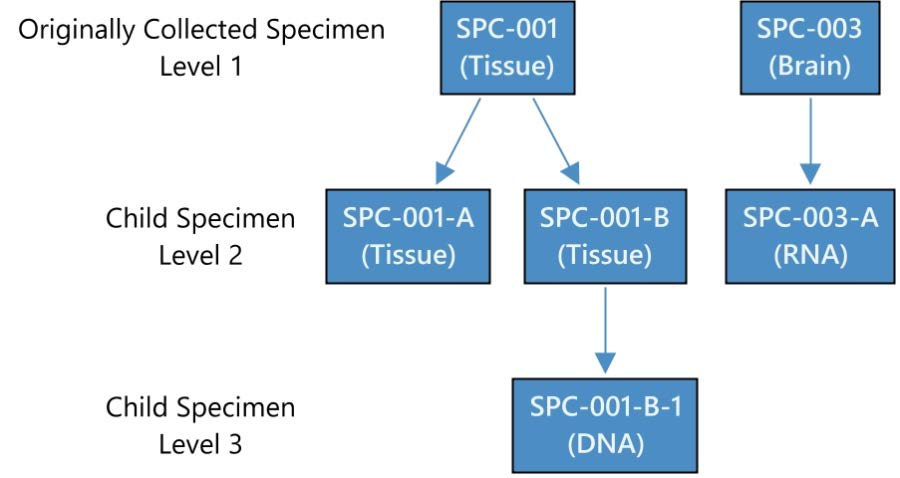

A specimen with a LEVEL value of "1" and a blank value for PARENT indicates a collected sample. All other values represent a derived sample. SPEC reflects the specimen type for the sample regardless of whether it is collected or derived.

relspec.xpt

| Row | STUDYID | USUBJID | REFID       | SPEC   | PARENT    | LEVEL |
| --- | ------- | ------- | ----------- | ------ | --------- | ----- |
| 1   | ABC-123 | 001-01  | SPC-001     | TISSUE |           | 1     |
| 2   | ABC-123 | 001-01  | SPC-001-A   | TISSUE | SPC-001   | 2     |
| 3   | ABC-123 | 001-01  | SPC-001-B   | TISSUE | SPC-001   | 2     |
| 4   | ABC-123 | 001-01  | SPC-001-B-1 | DNA    | SPC-001-B | 3     |
| 5   | ABC-123 | 001-01  | SPC-003     | TISSUE |           | 1     |
| 6   | ABC-123 | 001-01  | SPC-003-A   | RNA    | SPC-003   | 2     |

## 9 Study References

There are occasions when it is necessary to establish study-specific terminology that will be used in tabulated data. The following situations have been identified thus far:

- Identifiers for devices
- Identifiers for non-host organisms

### 9.1 Device Identifiers

The Device Identifiers (DI) dataset establishes identifiers for devices, which are used to populate the variable SPDEVID. The DI dataset was introduced as part of the SDTMIG for Medical Devices (SDTMIG-MD). It was originally classified as a special-purpose domain, but since SDTM v1.7 it has been classified as a study reference dataset. The SDTMIG-MD (available at https://www.cdisc.org/standards/foundational/medical-devices-sdtmig/) includes the DI domain specification and assumptions and provides examples of its use.

### 9.2 Non-host Organism Identifiers (OI)

OI – Description/Overview

A special-purpose domain containing information that identifies levels of taxonomic nomenclature of microbes or parasites that have been either experimentally determined in the course of a study or are previously known, as in the case of lab strains used as reference in the study.

The biological classification of a non-host organism typically stops at the taxonomic rank of "species." Scientific taxonomic nomenclature below the rank of species is not clearly defined, lacks a globally accepted standard terminology, and is frequently organism-dependent. Therefore, the OI domain addresses organism taxonomy with a series of parameters that name the taxa appropriate to the organism and the granularity with which the organism has been identified in the particular study.

OI – Specification

oi.xpt, Non-host Organism Identifiers — Study Reference. One record per taxon per non-host organism, Tabulation.

| Variable Name | Variable Label                          | Type | Controlled Terms, Codelist or Format1 | Role              | CDISC Notes                                                                                                                                                                                                                                                                                                                        | Core |
| ------------- | --------------------------------------- | ---- | ------------------------------------- | ----------------- | ---------------------------------------------------------------------------------------------------------------------------------------------------------------------------------------------------------------------------------------------------------------------------------------------------------------------------------- | ---- |
| STUDYID       | Study Identifier                        | Char |                                       | Identifier        | Unique identifier for a study.                                                                                                                                                                                                                                                                                                     | Req  |
| DOMAIN        | Domain Abbreviation                     | Char | OI                                    | Identifier        | Two-character abbreviation for the domain.                                                                                                                                                                                                                                                                                         | Req  |
| NHOID         | Non-host Organism Identifier            | Char |                                       | Identifier        | Sponsor-defined identifier for a non-host organism. NHOID should be populated with an intuitive name based on the identity of the organism as reported by the lab. It must be unique for each unique organism as defined by the specific values of the organism's entire known taxonomy described by pairs of OIPARMCD and OIVAL . | Req  |
| OISEQ         | Sequence Number                         | Num  |                                       | Identifier        | Sequence number to given to ensure uniqueness within a parameter within an organism (NHOID) within dataset.                                                                                                                                                                                                                        | Req  |
| OIPARMCD      | Non-host Organism ID Element Short Name | Char | (OIPRMCD)                             | Topic             | Short name of the taxon being described. Examples: "GROUP", "GENTYP", "SUBTYP".                                                                                                                                                                                                                                                    | Req  |
| OIPARM        | Non-host Organism ID Element Name       | Char | (OIPRM)                               | Synonym Qualifier | Name of the taxon being described. Examples: "Group", "Genotype", "Subtype".                                                                                                                                                                                                                                                       | Req  |
| OIVAL         | Non-host Organism ID Element Value      | Char | *                                     | Result Qualifier  | Value for the taxon in OIPARMCD/OIPARM for the organism identified by NHOID.                                                                                                                                                                                                                                                       | Req  |

1In this column, an asterisk (*) indicates that the variable may be subject to controlled terminology. CDISC/NCI codelist values are enclosed in parentheses.

OI – Assumptions

1. Non-host organisms include viruses and organisms such as pathogens or parasites, but also non-pathogenic organisms such as normal intestinal flora. Non-host organism identifiers are not to be used for host species identification (e.g., for animals used in preclinical studies), nor should they be used to represent other, non- taxonomy characteristics of non-host species (e.g., drug susceptibility, growth rates).
2. NHOID is sponsor-defined, with the following constraints:

   a. A unique NHOID must represent a unique identity as represented in its combination of OIPARMCD/OIVAL pairs. If 2 organisms share the same first 2 levels of taxonomy with regard to OIPARMCD/OIVAL, but 1 is identified to a third level and the other is not, they should be assigned 2 unique NHOIDs.

   b. Study sponsors should populate NHOID with intuitive name values based on either

   i. the name of the organism as reported by a lab or specified by the investigator, or

   ii. published references/databases where applicable and appropriate (e.g., when reference strain H77

   is used in a HCV study, NHOID for this strain should be populated with “H77” or “HCV1a- H77”).
3. NHOID can be used in any domain where observations about these organisms are being represented, allowing end users to determine what is known about the organism’s identity by merging on NHOID, or by otherwise referring to the OI domain.
4. OIPARMCD and OIPARM must represent parameters for the identification of non-host organisms with regard to nomenclature only.

   a. Mostly, this will represent taxonomic ranks (i.e., species) as well as commonly used grouping terms (taxa that are not officially ranked, e.g., subtype, group, strain).

   b. They may also include other nomenclature terms that are less widely known but are used frequently for organism identification in a specific field of study (e.g., spoligotype in tuberculosis).

   c. They should be listed in the OI dataset in hierarchical order of least to most specific with increasing OISEQ values.
5. Variables not listed in the OI domain specification table should not be used in OI data sets.

OI – Examples

Example 1

This example shows taxonomic identifiers for human immunodeficiency virus (HIV) and hepatitis C virus (HCV). NHOID is a unique non-host organism ID used to link findings on that organism in other datasets with details about its identification in OI. OIPARM shows the name of the individual taxa identified and OIVAL shows the experimentally determined values of those taxa.

Rows 1-4: Show the taxonomy for the HIV organism given the NHOID of HIV1MC. This virus has been identified as HIV-1, Group M, Subtype C.

Rows 5-8: Show the taxonomy for the HIV organism given the NHOID of HIV1MB, which was used as a reference. This virus has been identified as HIV-1, Group M, Subtype B.

Rows 9-11: Show the taxonomy for the HCV organism given the NHOID of HCV2C. This virus has been identified as HCV 2c.

Rows 12-14: Show the taxonomy for the HCV organism given the NHOID of H77. This virus is a known

reference strain of HCV 1a.

oi.xpt

| Row | STUDYID  | DOMAIN | NHOID  | OISEQ | OIPARMCD | OIPARM   | OIVAL |
| --- | -------- | ------ | ------ | ----- | -------- | -------- | ----- |
| 1   | STUDY123 | OI     | HIV1MC | 1     | SPCIES   | Species  | HIV   |
| 2   | STUDY123 | OI     | HIV1MC | 2     | TYPE     | Type     | 1     |
| 3   | STUDY123 | OI     | HIV1MC | 3     | GROUP    | Group    | M     |
| 4   | STUDY123 | OI     | HIV1MC | 4     | SUBTYP   | Subtype  | C     |
| 5   | STUDY123 | OI     | HIV1MB | 1     | SPCIES   | Species  | HIV   |
| 6   | STUDY123 | OI     | HIV1MB | 2     | TYPE     | Type     | 1     |
| 7   | STUDY123 | OI     | HIV1MB | 3     | GROUP    | Group    | M     |
| 8   | STUDY123 | OI     | HIV1MB | 4     | SUBTYP   | Subtype  | B     |
| 9   | STUDY123 | OI     | HCV2C  | 1     | SPCIES   | Species  | HCV   |
| 10  | STUDY123 | OI     | HCV2C  | 2     | GENTYP   | Genotype | 2     |
| 11  | STUDY123 | OI     | HCV2C  | 3     | SUBTYP   | Subtype  | C     |
| 12  | STUDY123 | OI     | H77    | 1     | SPCIES   | Species  | HCV   |
| 13  | STUDY123 | OI     | H77    | 2     | GENTYP   | Genotype | 1     |
| 14  | STUDY123 | OI     | H77    | 3     | SUBTYP   | Subtype  | A     |

## 10 Appendices

Appendix A: CDISC SDS Team

The CDISC SDS Team would like to thank the many volunteers who contributed to the development, review, and publication of SDTMIG v3.4. Additionally, this publication would not have been possible without the support of the Foundational Team Leads, Global Governance Group, Regulatory Liaisons, and CDISC.

| Name                                         | Company                                                                                                                      |
| -------------------------------------------- | ---------------------------------------------------------------------------------------------------------------------------- |
| Dana Booth (Project Manager)                 | CDISC                                                                                                                        |
| Ellina Babouchkina                           | Quality Data Services                                                                                                        |
| Glenn Barnes                                 | Global Specimen Solutions                                                                                                    |
| Glenn Beeman                                 | Merck KGaA                                                                                                                   |
| Anthony Chow                                 | CDISC                                                                                                                        |
| Julie Chason                                 | CDISC                                                                                                                        |
| Christine Connolly (Current Leadership Team) | CDISC; previously as a CDISC volunteer thru EMD Serono (current affiliation Bill & Melinda Gates Medical Research Institute) |
| Abhishek Dabral                              | Allergan                                                                                                                     |
| Vilma Decman                                 | GSK                                                                                                                          |
| Carolyne Dumont                              | Charles River Laboratories (formerly MPI Research)                                                                           |
| Gisbert Gelfort                              | Bayer                                                                                                                        |
| Patricia Gleason                             | Merck & Co.                                                                                                                  |
| Tom Guinter                                  | Nurocor                                                                                                                      |
| Brenda Gumbs-Petty                           | NCI-EVS                                                                                                                      |
| Pawan Gupta                                  | Pfizer                                                                                                                       |
| Mike Hamidi (Current Leadership Team)        | currently as a CDISC volunteer thru Pfizer; previously as a CDISC employee                                                   |
| Sterling Hardy                               | Merck & Co.                                                                                                                  |
| Denise Hargreaves                            | Charles River Laboratories (formerly MPI Research)                                                                           |
| Elaine Hazzard                               | Janssen Pharmaceutical Companies of Johnson & Johnson                                                                        |
| Kathleen Hectors                             | Janssen Pharmaceutical Companies of Johnson & Johnson                                                                        |
| Lester Hui                                   | Bristol Myers Squibb                                                                                                         |
| Marcelina Hungria                            | DIcore Group                                                                                                                 |
| Kristin Kelly                                | Pinnacle 21                                                                                                                  |
| Éanna Kiely                                 | ClinBuild                                                                                                                    |
| Steve Kopko                                  | CDISC                                                                                                                        |
| Bess LeRoy                                   | CDISC                                                                                                                        |
| German Leparc                                | Boehringer Ingelheim                                                                                                         |
| Jordan Li                                    | NCI EVS                                                                                                                      |
| Stetson Line                                 | Clinventive                                                                                                                  |
| Christine Martersteck                        | Eli Lilly and Company                                                                                                        |
| Erin Muhlbradt                               | NCI EVS                                                                                                                      |
| Catherine Mulvaney                           | Mint Medical Inc.                                                                                                            |
| Fizal Nabbie                                 | Bristol Myers Squibb                                                                                                         |
| David Neubauer                               | Clinical Solutions Group, LLC an IQVIA business                                                                              |
| Jon Neville                                  | CDISC                                                                                                                        |
| Gbenga Ogunsulire                            | Regeneron                                                                                                                    |
| Debra O'Neill                                | Merck & Co.                                                                                                                  |
| Alla Ostrovsky                               | Biogen                                                                                                                       |
| Amy Palmer                                   | CDISC                                                                                                                        |
| Lisa T. Panting                              | Bristol Myers Squibb                                                                                                         |
| Melanie Paules                               | GlaxoSmithKline                                                                                                              |
| Nik Pemble                                   | Janssen Pharmaceutical Companies of Johnson & Johnson                                                                        |
| Richard Phillips                             | Covance                                                                                                                      |
| Stefan Pinkert                               | Merck KGaA                                                                                                                   |
| Phil Pochon                                  | Covance                                                                                                                      |
| Anna Pron-Zwick                              | AstraZeneca                                                                                                                  |
| Ward Puttemans                               | UCB                                                                                                                          |
| Ben Qgunsulire                               | Regeneron                                                                                                                    |
| Carlo Radovsky                               | Immanant                                                                                                                     |
| Soumya Rajesh                                | Clinical Solutions Group, LLC an IQVIA business                                                                              |
| Manjula Reddy                                | Janssen Pharmaceutical Companies of Johnson & Johnson                                                                        |
| Michael Schmitz                              | Bayer AG                                                                                                                     |
| Dave Scocca                                  | Rho, Inc.                                                                                                                    |
| Maria Sekac                                  | PRA Health Sciences                                                                                                          |
| Kalai Selvanathan                            | Boehringer Ingelheim                                                                                                         |
| Mihaela Simion                               | Biogen                                                                                                                       |
| Daniel Sinnett                               | Emmes                                                                                                                        |
| Sanket Sinojia                               | IQVIA                                                                                                                        |
| Cary Smoak                                   | S-cubed                                                                                                                      |
| Aileen St. Marie                             | Bristol Myers Squibb                                                                                                         |
| Erin Tibbs-Slone                             | Charles River Laboratories (formerly MPI Research)                                                                           |
| Susan Tierney                                | IQVIA                                                                                                                        |
| Anita Umesh                                  |                                                                                                                              |
| Madhavi Vemuri                               | Janssen Research                                                                                                             |
| Kevin Viel                                   | Histonis, Incorporated                                                                                                       |
| Gary Walker                                  | Independent Contractor                                                                                                       |
| Lacey Wallace                                | Audentes Therapeutics                                                                                                        |
| Ruohan Wang                                  | Horizon Therapeutics                                                                                                         |
| Joleen T. White                              | EMD Serono (current affiliation Bill & Melinda Gates Medical Research Institute)                                             |
| Darcy Wold                                   | CDISC                                                                                                                        |
| Diane Wold                                   | CDISC                                                                                                                        |
| Ine Wolfs                                    | Janssen Pharmaceutical Companies of Johnson & Johnson                                                                        |
| Fred Wood                                    | Data Standards Consulting                                                                                                    |
| Craig Zwickl                                 | Transendix LLC                                                                                                               |

Appendix B: Glossary and Abbreviations

The following table lists some of the abbreviations and terms are used in this document. Additional definitions can be found in the individual sections of this document (see esp. Section 7.1.2, Definitions of Trial Design Concepts) and in the CDISC Glossary (available at https://www.cdisc.org/standards/glossary).

| ADaM       | CDISC Analysis Dataset Model                                                                                            |
| ---------- | ----------------------------------------------------------------------------------------------------------------------- |
| ADSL       | (ADaM) Subject-level Analysis Dataset                                                                                   |
| ATC        | Anatomic Therapeutic Chemical (code; WHO)                                                                               |
| CDASH      | Clinical Data Acquisition Standards Harmonization                                                                       |
| CDISC      | Clinical Data Interchange Standards Consortium                                                                          |
| CRF        | Case report form (sometimes case record form)                                                                           |
| CRO        | Contract research organization                                                                                          |
| CTCAE      | Common Terminology Criteria for Adverse Events                                                                          |
| Dataset    | A collection of structured data in a single file                                                                        |
| Define-XML | CDISC standard for transmitting metadata that describes any tabular dataset structure.                                  |
| Domain     | A collection of observations with a topic-specific commonality                                                          |
| eDT        | Electronic data transfer                                                                                                |
| FDA        | (US) Food and Drug Administration                                                                                       |
| HL7        | Health Level 7                                                                                                          |
| ICH        | International Conference on Harmonisation of Technical Requirements for Registration of Pharmaceuticals for Human Use   |
| ICH E2A    | ICH guidelines on Clinical Safety Data Management: Definitions and Standards for Expedited Reporting                    |
| ICH E2B    | ICH guidelines on Clinical Safety Data Management: Data Elements for Transmission of Individual Cases Safety Reports    |
| ICH E3     | ICH guidelines on Structure and Content of Clinical Study Reports                                                       |
| ICH E9     | ICH guidelines on Statistical Principles for Clinical Trials                                                            |
| ISO        | International Organization for Standardization                                                                          |
| ISO 8601   | ISO character representation of dates, date/times, intervals, and durations of time. The SDTM uses the extended format. |
| ISO 3166   | ISO codelist for representing countries; the Alpha-3 codelist uses 3-character codes.                                   |
| LOINC      | Logical Observation, Identifiers, Names, and Codes                                                                      |
| MedDRA     | Medical Dictionary for Regulatory Activities                                                                            |
| NCI        | National Cancer Institute (NIH)                                                                                         |
| NSV        | Non-standard variable                                                                                                   |
| PRO        | Patient-reported outcome                                                                                                |
| SAP        | Statistical analysis plan                                                                                               |
| SDS        | Submission Data Standards. Also the name of the team that created the SDTM and SDTMIG.                                  |
| SDTM       | Study Data Tabulation Model                                                                                             |
| SDTMIG     | Study Data Tabulation Model Implementation Guide: Human Clinical Trials [this document]                                 |
| SDTMIG-AP  | Study Data Tabulation Model Implementation Guide: Associated Persons                                                    |

| SDTMIG-MD  | Study Data Tabulation Model Implementation Guide for Medical Devices        |
| ---------- | --------------------------------------------------------------------------- |
| SDTMIG-PGx | Study Data Tabulation Model Implementation Guide: Pharmacogenomics/Genetics |
| SEND       | Standard for Exchange of Non-Clinical Data                                  |
| SNOMED     | Systematized Nomenclature of Medicine (a dictionary)                        |
| SOC        | System organ class                                                          |
| TDM        | Trial Design Model                                                          |
| WHODRUG    | World Health Organization Drug Dictionary                                   |
| XML        | eXtensible Markup Language                                                  |

Appendix C: Controlled Terminology

CDISC Terminology is centrally managed by the CDISC Controlled Terminology Team, supporting the terminology needs of all CDISC foundational standards (SDTM, CDASH, ADaM, SEND) and all disease/therapeutic area standards.

New/modified terms have a 3-month development period during which the Controlled Terminology Team evaluates the requests received, incorporating as much as possible for each quarterly release, and a quarterly public-review comment period followed by publication release.

Visit the CDISC Controlled Terminology page (https://www.cdisc.org/standards/terminology/controlled- terminology) to find the most recently published terminology packages (final or under review), or the NCI Enterprise Vocabulary Services CDISC Terminology website (https://www.cancer.gov/research/resources/terminology/cdisc) for access to the full list of CDISC terminology.

Note that the SDTM terminology was previously provided separately for questionnaires and other domains. However, as of the 2015-12-18 release of CDISC Controlled Terminology, these were merged into a single publication.

Earlier versions of the SDTMIG included several appendices regarding controlled terminology. Starting with SDTMIG 3.2, Appendix C was simplified. Appendix C1 will be considered for expansion in the next version, to contain a complete list of supplemental qualifiers used in the SDTMIG.

Appendix C1: Supplemental Qualifiers Name Codes

The following table contains an initial set of standard name codes for use in the supplemental qualifiers (SUPP--) special-purpose datasets.

| QNAM    | QLABEL                        | Applicable Domains                                                                                                                                                                                             |
| ------- | ----------------------------- | -------------------------------------------------------------------------------------------------------------------------------------------------------------------------------------------------------------- |
| AESOSP  | Other Medically Important SAE | AE                                                                                                                                                                                                             |
| AETRTEM | Treatment Emergent Flag       | AE                                                                                                                                                                                                             |
| --REAS  | Reason                        | Intervention domains where the reason for an intervention is other than a medical indication. It may be used in select Event domains (e.g., Healthcare Encounters) where the topic is not a medical condition. |

Appendix D: CDISC Variable-naming Fragments

The CDISC SDS group has defined a standard list of fragments to use as a guide when naming variables in SUPP-- datasets (as QNAM) or assigning --TESTCD values that could conceivably be treated as variables in a horizontal listing derived from a Findings dataset. In some cases, more than 1 fragment is used for a given keyword. This is necessary when a shorter fragment must be used for a --TESTCD or QNAM that incorporates several keywords that must be combined while still meeting the 8-character variable naming limit of SAS transport files. When using fragments, the general rule is to use the fragment(s) that best conveys the meaning of the variable within the 8- character limit; thus, the longer fragment should be used when space allows. If the combination of fragments still exceeds 8 characters, a character should be dropped where most appropriate (while avoiding naming conflicts if possible) to fit within the 8-character limit.

In other cases the same fragment may be used for more than one meaning, but these would not normally overlap for the same variable.

| Keyword(s)            | Fragment  |
| --------------------- | --------- |
| ACTION                | ACN       |
| ADJUSTMENT            | ADJ       |
| ANALYSIS DATASET      | AD        |
| ASSAY                 | AS        |
| BASELINE              | BL        |
| BIRTH                 | BRTH      |
| BODY                  | BOD       |
| CANCER                | CAN       |
| CATEGORY              | CAT       |
| CHARACTER             | C         |
| CLASS                 | CLAS      |
| CLINICAL              | CL        |
| CODE                  | CD        |
| COMMENT               | COM       |
| CONCOMITANT           | CON       |
| CONDITION             | CND       |
| CONGENITAL            | CONG      |
| DATE TIME - CHARACTER | DTC       |
| DAY                   | DY        |
| DEATH                 | DTH       |
| DECODE                | DECOD     |
| DERIVED               | DRV       |
| DESCRIPTION           | DESC      |
| DISABILITY            | DISAB     |
| DOSE, DOSAGE          | DOS, DOSE |
| DURATION              | DUR       |
| ELAPSED               | EL        |
| ELEMENT               | ET        |
| EMERGENT              | EM        |
| END                   | END, EN   |
| ETHNICITY             | ETHNIC    |
| EVALUATION            | EVL       |
| EVALUATOR             | EVAL      |

| EXTERNAL                  | X       |
| ------------------------- | ------- |
| FASTING                   | FAST    |
| FILENAME                  | FN      |
| FLAG                      | FL      |
| FORMULATION, FORM         | FRM     |
| FREQUENCY                 | FRQ     |
| GRADE                     | GR      |
| GROUP                     | GRP     |
| HOSPITALIZATION           | HOSP    |
| IDENTIFIER                | ID      |
| INDICATION                | INDC    |
| INDICATOR                 | IND     |
| INTERPRETATION            | INTP    |
| INTERVAL                  | INT     |
| INVESTIGATOR              | INV     |
| LIFE-THREATENING          | LIFE    |
| LOCATION                  | LOC     |
| LOINC CODE                | LOINC   |
| LOWER LIMIT               | LO      |
| MEDICALLY-IMPORTANT EVENT | MIE     |
| NAME                      | NAM     |
| NON-STUDY THERAPY         | NST     |
| NORMAL RANGE              | NR      |
| NOT DONE                  | ND      |
| NUMBER                    | NUM     |
| NUMERIC                   | N       |
| OBJECT                    | OBJ     |
| ONGOING                   | ONGO    |
| ORDER                     | ORD     |
| ORIGIN                    | ORIG    |
| ORIGINAL                  | OR      |
| OTHER                     | OTH, O  |
| OUTCOME                   | OUT     |
| OVERDOSE                  | OD      |
| PARAMETER                 | PARM    |
| PATTERN                   | PATT    |
| POPULATION                | POP     |
| POSITION                  | POS     |
| QUALIFIER                 | QUAL    |
| REASON                    | REAS    |
| REFERENCE                 | REF, RF |
| REGIMEN                   | RGM     |
| RELATED                   | REL, R  |
| RELATIONSHIP              | REL     |
| RESULT                    | RES     |
| RULE                      | RL      |
| SEQUENCE                  | SEQ     |

| SERIOUS      | S, SER    |
| ------------ | --------- |
| SEVERITY     | SEV       |
| SIGNIFICANT  | SIG       |
| SPECIMEN     | SPEC, SPC |
| SPONSOR      | SP        |
| STANDARD     | ST, STD   |
| START        | ST        |
| STATUS       | STAT      |
| SUBCATEGORY  | SCAT      |
| SUBJECT      | SUBJ      |
| SUPPLEMENTAL | SUPP      |
| SYSTEM       | SYS       |
| TEXT         | TXT       |
| TIME         | TM        |
| TIME POINT   | TPT       |
| TOTAL        | TOT       |
| TOXICITY     | TOX       |
| TRANSITION   | TRANS     |
| TREATMENT    | TRT       |
| UNIQUE       | U         |
| UNIT         | U         |
| UNPLANNED    | UP        |
| UPPER LIMIT  | HI        |
| VALUE        | VAL       |
| VARIABLE     | VAR       |
| VEHICLE      | V         |

VEHICLE V

Appendix E: Revision History

This appendix provides an overview only of revisions since the last production version, SDTMIG v3.3; not all revisions are included.

- A Diff file with details of changes to domain specification tables is available as a member benefit on the CDISC Library Archives page in the Members Only Area of the CDISC website (https://www.cdisc.org/members-only/cdisc-library-archives), and those changes are not repeated here.
- Public review comments and their dispositions will be available upon publication of the SDTMIG.

The following changes have been made throughout:

- Text and examples have been clarified as needed.
- Text was updated to reflect new table names in SDTM v2.0.
- Values were updated to current CDISC Controlled Terminology.
- ISO formats were made more granular.
- New variables from SDTM v2.0 have been added.
- Tables with domain codes and descriptions at the start of a section have been replaced with a sectional table of contents since each domain section already contains all of the information previously in the tables.
- With few exceptions (e.g., the DM domain), the names of supplemental qualifier variables have been updated to include 2-character domain abbreviations at the start of the variable name.
- Assumptions which provided domain definitions were removed as these are provided under the Description/Overview for each domain.
- Where numbered lists occurred in CDISC Notes, these have been converted to text for consistency with the rest of the document.
- Links were updated as needed.
- Typographical errors were corrected.

A note on the decommissioning of MO

The following domain was removed:

- Morphology (MO)

When the Morphology domain was introduced in SDTMIG v3.2, the SDS Team planned to represent morphology and physiology findings in separate domains: morphology findings in the MO domain and physiology findings in separate domains by body systems. Since then, the team found that separating morphology and physiology findings was more difficult than anticipated and provided little added value. This led to the decision to expand the body system-based domains to cover both morphology and physiology findings and to deprecate MO in SDTMIG v3.4. Submissions using that later SDTMIG version would represent morphology results in the appropriate body system-based physiology/morphology domain.

For data prepared using a version of the SDTMIG that includes both the MO domain and body system-based physiology/morphology domains, morphology findings may be represented in either the MO domain or in a body-system based physiology/morphology domain. Custom body system-based domains may be used if the appropriate body system-based domain is not included in the SDTMIG version being used.

New Domains for SDTMIG v3.4

| Domain                    | Domain Abbreviation |
| ------------------------- | ------------------- |
| Biospecimen Events        | BE                  |
| Biospecimen Findings      | BS                  |
| Cell Phenotyping Findings | CP                  |
| Genomics Findings         | GF                  |
| Related Specimens         | RELSPEC             |

In addition to the general changes described above, the following table provides an overview of changes by section.

| Section Number                                                    | Section Name                                                                                                       | Change(s)                                                                                                                                                                                                                                                                                                                                                                                                                                                                                                                                                                                                                                                                                                                                                                                                                                                                                                                                                                                                                                                                                                                                                                                                                                                                                                                                                                                                                                                                                                                                                                                                                                                                                                                                                                                                                                                                                                                                                                                                         |
| ----------------------------------------------------------------- | ------------------------------------------------------------------------------------------------------------------ | ----------------------------------------------------------------------------------------------------------------------------------------------------------------------------------------------------------------------------------------------------------------------------------------------------------------------------------------------------------------------------------------------------------------------------------------------------------------------------------------------------------------------------------------------------------------------------------------------------------------------------------------------------------------------------------------------------------------------------------------------------------------------------------------------------------------------------------------------------------------------------------------------------------------------------------------------------------------------------------------------------------------------------------------------------------------------------------------------------------------------------------------------------------------------------------------------------------------------------------------------------------------------------------------------------------------------------------------------------------------------------------------------------------------------------------------------------------------------------------------------------------------------------------------------------------------------------------------------------------------------------------------------------------------------------------------------------------------------------------------------------------------------------------------------------------------------------------------------------------------------------------------------------------------------------------------------------------------------------------------------------------------- |
| Section 1. Introduction                                           |                                                                                                                    |                                                                                                                                                                                                                                                                                                                                                                                                                                                                                                                                                                                                                                                                                                                                                                                                                                                                                                                                                                                                                                                                                                                                                                                                                                                                                                                                                                                                                                                                                                                                                                                                                                                                                                                                                                                                                                                                                                                                                                                                                   |
| 1.3                                                               | Relationship to Prior CDISC Documents                                                                              | • Rather than referring to all of the sections with significant changes, some of the more significant changes since SDTMIG v3.3 are highlighted in a bulleted list.                                                                                                                                                                                                                                                                                                                                                                                                                                                                                                                                                                                                                                                                                                                                                                                                                                                                                                                                                                                                                                                                                                                                                                                                                                                                                                                                                                                                                                                                                                                                                                                                                                                                                                                                                                                                                                              |
| Section 2. Fundamentals of the SDTM                               |                                                                                                                    |                                                                                                                                                                                                                                                                                                                                                                                                                                                                                                                                                                                                                                                                                                                                                                                                                                                                                                                                                                                                                                                                                                                                                                                                                                                                                                                                                                                                                                                                                                                                                                                                                                                                                                                                                                                                                                                                                                                                                                                                                   |
| 2.1                                                               | Observations and Variables                                                                                         | Revised definition for Rule Variables.                                                                                                                                                                                                                                                                                                                                                                                                                                                                                                                                                                                                                                                                                                                                                                                                                                                                                                                                                                                                                                                                                                                                                                                                                                                                                                                                                                                                                                                                                                                                                                                                                                                                                                                                                                                                                                                                                                                                                                            |
| 2.5                                                               | The SDTM Standard Domain Models                                                                                    | • Domain-specific versioning, introduced in SDTMIG v3.3, was removed. The text in this section describing domain versions was removed. Domain version numbers were also removed for each domain. • Removed sentence that referred to the FDA repository. • Added reference to the Define-XML standard for details on no data availability.                                                                                                                                                                                                                                                                                                                                                                                                                                                                                                                                                                                                                                                                                                                                                                                                                                                                                                                                                                                                                                                                                                                                                                                                                                                                                                                                                                                                                                                                                                                                                                                                                                                                     |
| 2.6                                                               | Creating a New Domain                                                                                              | • SA was added to bullet 3e to reserve the domain code for CDASH. SQ was also added as it occurs in the SDTMIG-AP.                                                                                                                                                                                                                                                                                                                                                                                                                                                                                                                                                                                                                                                                                                                                                                                                                                                                                                                                                                                                                                                                                                                                                                                                                                                                                                                                                                                                                                                                                                                                                                                                                                                                                                                                                                                                                                                                                               |
| 2.7                                                               | SDTM Variables Not Allowed in the SDTMIG                                                                           | • Updated based on the Usage Restrictions column of Study Data Tabulation Model 2.0. Review Section 2.7 for the complete list of variables not to be used in SDTM-based data for human clinical trials. Moved --METHOD (Interventions) from the not-evaluated list to the list of variables not to be used. Updated order of list to match order within the model.                                                                                                                                                                                                                                                                                                                                                                                                                                                                                                                                                                                                                                                                                                                                                                                                                                                                                                                                                                                                                                                                                                                                                                                                                                                                                                                                                                                                                                                                                                                                                                                                                                               |
| Section 3. Submitting Data in a Standard Format                   |                                                                                                                    |                                                                                                                                                                                                                                                                                                                                                                                                                                                                                                                                                                                                                                                                                                                                                                                                                                                                                                                                                                                                                                                                                                                                                                                                                                                                                                                                                                                                                                                                                                                                                                                                                                                                                                                                                                                                                                                                                                                                                                                                                   |
| 3.2                                                               | Using the CDISC Domain Models in Regulatory Submissions – Dataset Metadata                                        | • Removed the following paragraph as there are now guidelines in the MSG v2.0 and the Define-XML v2.1 standard: "In the event that no records are present in a dataset (e.g., a small PK study where no subjects took concomitant medications), the empty dataset should not be submitted and should not be described in the Define-XML document. The annotated CRF will show the data that would have been submitted had data been received; it need not be re- annotated to indicate that no records exist."                                                                                                                                                                                                                                                                                                                                                                                                                                                                                                                                                                                                                                                                                                                                                                                                                                                                                                                                                                                                                                                                                                                                                                                                                                                                                                                                                                                                                                                                                                   |
| 3.2.1                                                             | Dataset-level Metadata                                                                                             | • Changes to SDTMIG Content Control appear in this table. New domains were added and MO was removed. • Keys were updated in a couple of cases, as noted in those domains.                                                                                                                                                                                                                                                                                                                                                                                                                                                                                                                                                                                                                                                                                                                                                                                                                                                                                                                                                                                                                                                                                                                                                                                                                                                                                                                                                                                                                                                                                                                                                                                                                                                                                                                                                                                                                                       |
| 3.2.1.2                                                           | CDISC Submission Value-level Metadata                                                                              | • The phrase "the SDTMIG V3.x" was removed from the first sentence, as this terminology was somewhat confusing and is being phased out.                                                                                                                                                                                                                                                                                                                                                                                                                                                                                                                                                                                                                                                                                                                                                                                                                                                                                                                                                                                                                                                                                                                                                                                                                                                                                                                                                                                                                                                                                                                                                                                                                                                                                                                                                                                                                                                                          |
| Section 4. Assumptions for Domain Models                          |                                                                                                                    |                                                                                                                                                                                                                                                                                                                                                                                                                                                                                                                                                                                                                                                                                                                                                                                                                                                                                                                                                                                                                                                                                                                                                                                                                                                                                                                                                                                                                                                                                                                                                                                                                                                                                                                                                                                                                                                                                                                                                                                                                   |
| 4.1                                                               | General Domain Assumptions                                                                                         | • QRS Examples for splitting questionnaires were updated. • Origin Metadata traceability was clarified.                                                                                                                                                                                                                                                                                                                                                                                                                                                                                                                                                                                                                                                                                                                                                                                                                                                                                                                                                                                                                                                                                                                                                                                                                                                                                                                                                                                                                                                                                                                                                                                                                                                                                                                                                                                                                                                                                                         |
| 4.2                                                               | General Variable Assumptions                                                                                       | • Added, "CDISC does not recommend any specific format for the values of USUBJID, only that the values need to be unique for all subjects in the submission, and across multiple submissions for the same compound. Many sponsors concatenate values for the Study, Site and Subject into USUBJID, but this is not a requirement. It is                                                                                                                                                                                                                                                                                                                                                                                                                                                                                                                                                                                                                                                                                                                                                                                                                                                                                                                                                                                                                                                                                                                                                                                                                                                                                                                                                                                                                                                                                                                                                                                                                                                                          |
|                                                                   |                                                                                                                    | acceptable to use any format for USUBJID, as long as the values are unique across all subjects." • 4.2.6 numbering reworked to be consistent with the format in this document and others. • New subsection, Section 4.2.7.4, "Specify" Values for --OBJ, was added. • Added information about ASCII characters to Section 4.2.9.                                                                                                                                                                                                                                                                                                                                                                                                                                                                                                                                                                                                                                                                                                                                                                                                                                                                                                                                                                                                                                                                                                                                                                                                                                                                                                                                                                                                                                                                                                                                                                                                                                                                               |
| 4.4                                                               | Actual and Relative Time Assumptions                                                                               | • Updated values for unknown from U to UNKNOWN to reflect changes in controlled terminology. • Clarified that if the reference time point corresponds to or is prior to the date of collection or assessment that it can be unknown by adding "can be". • Text was clarified to note that --STDTC is not used in Findings class domains • the use of --DRVFL was clarified                                                                                                                                                                                                                                                                                                                                                                                                                                                                                                                                                                                                                                                                                                                                                                                                                                                                                                                                                                                                                                                                                                                                                                                                                                                                                                                                                                                                                                                                                                                                                                                                                                    |
| 4.5                                                               | Original and Standardized Results                                                                                  | • Clarified description of when to use the derived flag (–DRVFL). • Two QRS exceptions were added to Section 4.5.1.2 noting that regulatory agencies may require a record for all items on the CRF and that --REASND will be populated for QRS logically skipped items. • Example 3 in Section 4.5.3.2, the value of IDVARVAL was corrected in supppr.xpt. • Promoted the concept --CLSIG to an SDTM variable. • Clarified the use of --REASPF in Findings domains, --REAS in Interventions/Events, and --REASOC for pre-specified Events/Interventions. • Changed the description of --REASOC to reflect its promotion to a standard variable. • Added text describing representation of pre-specified groups of interventions or events in --TRT or --TERM, respectively.                                                                                                                                                                                                                                                                                                                                                                                                                                                                                                                                                                                                                                                                                                                                                                                                                                                                                                                                                                                                                                                                                                                                                                                                                               |
| 4.1                                                               | General Domain Assumptions                                                                                         | • QRS Examples for splitting questionnaires were updated. • Origin Metadata traceability was clarified.                                                                                                                                                                                                                                                                                                                                                                                                                                                                                                                                                                                                                                                                                                                                                                                                                                                                                                                                                                                                                                                                                                                                                                                                                                                                                                                                                                                                                                                                                                                                                                                                                                                                                                                                                                                                                                                                                                         |
| Section 5. Models for Special-purpose Domains                     |                                                                                                                    |                                                                                                                                                                                                                                                                                                                                                                                                                                                                                                                                                                                                                                                                                                                                                                                                                                                                                                                                                                                                                                                                                                                                                                                                                                                                                                                                                                                                                                                                                                                                                                                                                                                                                                                                                                                                                                                                                                                                                                                                                   |
| 5                                                                 | Models for Special-purpose Domains                                                                                 | • All SDTMIG v3.4 metadata specifications (under Controlled Terms, Codelist or Format column) have been updated to reflect ISO 8601 granularity (e.g., "ISO 8601 datetime or interval" or "ISO 8601 duration"), where applicable. This also aligns to the updates made in SDTM v2.0.                                                                                                                                                                                                                                                                                                                                                                                                                                                                                                                                                                                                                                                                                                                                                                                                                                                                                                                                                                                                                                                                                                                                                                                                                                                                                                                                                                                                                                                                                                                                                                                                                                                                                                                             |
| 5.1                                                               | Comments (CO)                                                                                                      | • Assumption 2 was added to explain the difference between the structure of the Comments domain in the SDTM and the SDTMIG. • VISIT, VISITNUM, and VISITDY have been removed from the list of generally not used variables in CO Assumptions #5. • Clarity was added to Assumption 1 regarding adverse events and clinical events                                                                                                                                                                                                                                                                                                                                                                                                                                                                                                                                                                                                                                                                                                                                                                                                                                                                                                                                                                                                                                                                                                                                                                                                                                                                                                                                                                                                                                                                                                                                                                                                                                                                              |
| 5.2                                                               | Demographics (DM)                                                                                                  | • Revised DM.COUNTRY CDISC Notes to include "Generally represented using ISO 3166-1 Alpha-3. However, please be advised that regulatory agency specific requirements may differ (e.g., U.S. FDA), in which, those need to be followed." We removed the ISO 3166-1 Alpha-3 format from the Controlled Terms column as we became aware of the varied national requirements for this terminology. • Assumption 6 was updated to include cases where race self- identification can also correspond to "Unknown" (e.g., a refugee, was adopted, or cases where this information was not available). • Updated assumption 6a to reference the Racec-Ethnicc Codetable available at https://www.cdisc.org/standards/terminology/controlled- terminology. • Extensive updates occurred with DM examples. Previous DM Examples 2, 3, 4, 5, 8 and 10 were removed; Current Examples 4 thru                                                                                                                                                                                                                                                                                                                                                                                                                                                                                                                                                                                                                                                                                                                                                                                                                                                                                                                                                                                                                                                                                                                              |
|                                                                   |                                                                                                                    | 7 were added with new examples illustrating better the continuity between CDASH and SDTM. • Updated DM Example references in the assumptions and throughout the SDTMIG.                                                                                                                                                                                                                                                                                                                                                                                                                                                                                                                                                                                                                                                                                                                                                                                                                                                                                                                                                                                                                                                                                                                                                                                                                                                                                                                                                                                                                                                                                                                                                                                                                                                                                                                                                                                                                                          |
| 5.3                                                               | Subject Elements (SE)                                                                                              | • Added SESTDY and SEENDY.                                                                                                                                                                                                                                                                                                                                                                                                                                                                                                                                                                                                                                                                                                                                                                                                                                                                                                                                                                                                                                                                                                                                                                                                                                                                                                                                                                                                                                                                                                                                                                                                                                                                                                                                                                                                                                                                                                                                                                                       |
| 5.4                                                               | Subject Disease Milestones (SM)                                                                                    | • Updated CDISC notes for USUBJID for consistency.                                                                                                                                                                                                                                                                                                                                                                                                                                                                                                                                                                                                                                                                                                                                                                                                                                                                                                                                                                                                                                                                                                                                                                                                                                                                                                                                                                                                                                                                                                                                                                                                                                                                                                                                                                                                                                                                                                                                                               |
| 5.5                                                               | Subject Visits (SV)                                                                                                | • This domain had been considered for moving to Events, but the decision after public review was to keep it as a Subject Visits domain at this time. • Now contains visits that did not occur as well as those that did occur • Information was added about contacts with subjects which may not have been designated as "visits" in the protocol • New variables were added: SVPRESP, SVOCCUR, SVREASOC, SVCNTMOD, SVEPCHGI                                                                                                                                                                                                                                                                                                                                                                                                                                                                                                                                                                                                                                                                                                                                                                                                                                                                                                                                                                                                                                                                                                                                                                                                                                                                                                                                                                                                                                                                                                                                                                                  |
| Section 6. Domain Models Based on the General Observation Classes |                                                                                                                    |                                                                                                                                                                                                                                                                                                                                                                                                                                                                                                                                                                                                                                                                                                                                                                                                                                                                                                                                                                                                                                                                                                                                                                                                                                                                                                                                                                                                                                                                                                                                                                                                                                                                                                                                                                                                                                                                                                                                                                                                                   |
| 6.1                                                               | Models for Interventions Domains                                                                                   | • The roles of --DOSFRQ and --DOSRGM were changed where used in the Interventions Domains to Record Qualifier for consistency with the change for the role of --DOSFRQ and --DOSRGM in the SDTM.                                                                                                                                                                                                                                                                                                                                                                                                                                                                                                                                                                                                                                                                                                                                                                                                                                                                                                                                                                                                                                                                                                                                                                                                                                                                                                                                                                                                                                                                                                                                                                                                                                                                                                                                                                                                                 |
| 6.1.2                                                             | Concomitant/Prior Medications (CM)                                                                                 | • Example 5 is new.                                                                                                                                                                                                                                                                                                                                                                                                                                                                                                                                                                                                                                                                                                                                                                                                                                                                                                                                                                                                                                                                                                                                                                                                                                                                                                                                                                                                                                                                                                                                                                                                                                                                                                                                                                                                                                                                                                                                                                                              |
| 6.1.3                                                             | Exposure Domains                                                                                                   | • EX assumptions were updated to note that since EX includes only treatments received, --MOOD would generally not be used in EX. • ECREASOC was added, as this was promoted from a supplemental qualifier to a standard variable. An assumption was added to EC to describe the use of ECREASOC and some examples were updated to reflect this.                                                                                                                                                                                                                                                                                                                                                                                                                                                                                                                                                                                                                                                                                                                                                                                                                                                                                                                                                                                                                                                                                                                                                                                                                                                                                                                                                                                                                                                                                                                                                                                                                                                                 |
| 6.1.5                                                             | Procedures (PR)                                                                                                    | • PRSEQ's CDISC Notes were updated to reflect that Sequence Number is given to ensure uniqueness of subject records within a domain and that it may be any valid number. • Added CT reference to the procedure codelist (PROCEDUR) for the PRDECOD variable. • More explanations were provided in examples to explain why values in PRTRT are in mixed case.                                                                                                                                                                                                                                                                                                                                                                                                                                                                                                                                                                                                                                                                                                                                                                                                                                                                                                                                                                                                                                                                                                                                                                                                                                                                                                                                                                                                                                                                                                                                                                                                                                                   |
| 6.2                                                               | Models for Events Domains                                                                                          | • The BE Domain specification and examples were copied from the SDTMIG-PGx, originally published 2015-05-26, to be deprecated with the publication of SDTMIG v3.4.                                                                                                                                                                                                                                                                                                                                                                                                                                                                                                                                                                                                                                                                                                                                                                                                                                                                                                                                                                                                                                                                                                                                                                                                                                                                                                                                                                                                                                                                                                                                                                                                                                                                                                                                                                                                                                               |
| 6.2.1                                                             | Adverse Events (AE)                                                                                                | • New AE variables for Medical Devices were added: SPDEVID, AEACNDEV, AEUNANT, AERLPRC, AERLPRT, AERLDEV, AESINTV. • New Examples 5 and 6 were added to show examples of the new AE variables. • We have deleted AE Assumption 2e as this was superseded by the addition of MedDRA coding variables in Amendment 1 to SDTMIG v3.1.2 and SDTM v1.2. • Assumption 6, Actions taken, was added.                                                                                                                                                                                                                                                                                                                                                                                                                                                                                                                                                                                                                                                                                                                                                                                                                                                                                                                                                                                                                                                                                                                                                                                                                                                                                                                                                                                                                                                                                                                                                                                                                  |
| 6.2.2                                                             | Biospecimen Events (BE)                                                                                            | • This specification, assumptions, and examples were copied from the SDTMIG-PGx, published 2015-05-26, the BETERM and BEDECOD have been updated. PF has also been updated to GF. SDTMIG-PGx, originally published 2015-05-26, is to be deprecated with the publication of SDTMIG v3.4.                                                                                                                                                                                                                                                                                                                                                                                                                                                                                                                                                                                                                                                                                                                                                                                                                                                                                                                                                                                                                                                                                                                                                                                                                                                                                                                                                                                                                                                                                                                                                                                                                                                                                                                           |
| 6.2.3                                                             | Clinical Events                                                                                                    | • Added the permissible variable CETOXGR. • Added fracture events example. A previous version of the example was represented in the FA domain. • The Examples 1 and 2 were revised for better clarity.                                                                                                                                                                                                                                                                                                                                                                                                                                                                                                                                                                                                                                                                                                                                                                                                                                                                                                                                                                                                                                                                                                                                                                                                                                                                                                                                                                                                                                                                                                                                                                                                                                                                                                                                                                                                         |
| 6.2.4                                                             | Disposition (DS)                                                                                                   | • DSDY's Core value was updated to Perm (from Exp) to be consistent with DSDTC's Core which is Perm.                                                                                                                                                                                                                                                                                                                                                                                                                                                                                                                                                                                                                                                                                                                                                                                                                                                                                                                                                                                                                                                                                                                                                                                                                                                                                                                                                                                                                                                                                                                                                                                                                                                                                                                                                                                                                                                                                                             |
|                                                                   |                                                                                                                    | • DSSTDY's Core value updated to Exp (from Perm) to be consistent with DSSTDTC's Core which is Exp. • Added reference to DS Codetable. • Updated Example 9                                                                                                                                                                                                                                                                                                                                                                                                                                                                                                                                                                                                                                                                                                                                                                                                                                                                                                                                                                                                                                                                                                                                                                                                                                                                                                                                                                                                                                                                                                                                                                                                                                                                                                                                                                                                                                                     |
| 6.2.5                                                             | Healthcare Encounters (HO)                                                                                         | • Example 5 and Assumption 5 were corrected to refer to Events qualifiers rather than Findings qualifiers.                                                                                                                                                                                                                                                                                                                                                                                                                                                                                                                                                                                                                                                                                                                                                                                                                                                                                                                                                                                                                                                                                                                                                                                                                                                                                                                                                                                                                                                                                                                                                                                                                                                                                                                                                                                                                                                                                                       |
| 6.2.6                                                             | Medical History (MH)                                                                                               | • Example 5 was added to illustrate the presence of prespecified events.                                                                                                                                                                                                                                                                                                                                                                                                                                                                                                                                                                                                                                                                                                                                                                                                                                                                                                                                                                                                                                                                                                                                                                                                                                                                                                                                                                                                                                                                                                                                                                                                                                                                                                                                                                                                                                                                                                                                         |
| 6.2.7                                                             | Protocol Deviations (DV)                                                                                           | • Revised label for DVENDY to 'Study Day of End of Deviation Event' (from Study Day of End of Observation) to be consistent with DVSTDY's label. • Assumption 3 was corrected to refer to Events qualifiers rather than Findings qualifiers.                                                                                                                                                                                                                                                                                                                                                                                                                                                                                                                                                                                                                                                                                                                                                                                                                                                                                                                                                                                                                                                                                                                                                                                                                                                                                                                                                                                                                                                                                                                                                                                                                                                                                                                                                                    |
| 6.3                                                               | Models for Findings Domains                                                                                        | • The BS Domain specification and examples were copied from the SDTMIG-PGx, originally published 2015-05-26, to be deprecated with the publication of SDTMIG v3.4. • Assumptions and examples have been updated where used in the Findings Domains to reflect that --CLSIG has been promoted to a standard variable. Notes were added to emphasize that the variable is about collected observations.                                                                                                                                                                                                                                                                                                                                                                                                                                                                                                                                                                                                                                                                                                                                                                                                                                                                                                                                                                                                                                                                                                                                                                                                                                                                                                                                                                                                                                                                                                                                                                                                           |
| 6.3.1                                                             | Product Accountability (DA)                                                                                        | • Revised domain name (and definition) to "Product Accountability" from "Drug Accountability". • Added the permissible variables DALNKID and DALNKGRP. • Revised assumptions to describe broadened product accountability scope (e.g., drugs, nutrition). • Excluded devices from representation in this domain.                                                                                                                                                                                                                                                                                                                                                                                                                                                                                                                                                                                                                                                                                                                                                                                                                                                                                                                                                                                                                                                                                                                                                                                                                                                                                                                                                                                                                                                                                                                                                                                                                                                                                              |
| 6.3.2                                                             | Death Details (DD)                                                                                                 | • Added assumption 4 referencing the domain codetable.                                                                                                                                                                                                                                                                                                                                                                                                                                                                                                                                                                                                                                                                                                                                                                                                                                                                                                                                                                                                                                                                                                                                                                                                                                                                                                                                                                                                                                                                                                                                                                                                                                                                                                                                                                                                                                                                                                                                                           |
| 6.3.3                                                             | ECG Test Results (EG)                                                                                              | • Added EGCLSIG as a permissible variable. • Updated EGBEATNO role from "Variable Qualifier" to "Identifier" to align with SDTM v2.0. • Added Assumption 2.a referencing the ECG codetable.                                                                                                                                                                                                                                                                                                                                                                                                                                                                                                                                                                                                                                                                                                                                                                                                                                                                                                                                                                                                                                                                                                                                                                                                                                                                                                                                                                                                                                                                                                                                                                                                                                                                                                                                                                                                                    |
| 6.3.5                                                             | Specimen-based Findings Domains                                                                                    | • Added Section 6.3.5 to group domains (e.g., IS, LB, MB/MS, MI, PC/PP) that represent laboratory measurements, tests, or examinations performed on collected biological specimens (e.g., blood, urine, tumor tissue).                                                                                                                                                                                                                                                                                                                                                                                                                                                                                                                                                                                                                                                                                                                                                                                                                                                                                                                                                                                                                                                                                                                                                                                                                                                                                                                                                                                                                                                                                                                                                                                                                                                                                                                                                                                           |
| 6.3.5.1                                                           | Generic Specimen-based Lab Findings Domain Specification                                                           | • Added Section 6.3.5.1 generic metadata specification to describe commonly used variables in specimen-based laboratory domains.                                                                                                                                                                                                                                                                                                                                                                                                                                                                                                                                                                                                                                                                                                                                                                                                                                                                                                                                                                                                                                                                                                                                                                                                                                                                                                                                                                                                                                                                                                                                                                                                                                                                                                                                                                                                                                                                                 |
| 6.3.5.2                                                           | Biospecimen Findings (BS)                                                                                          | • This is newly copied from SDTMIG-PGx, with only minor corrections (e.g., typos). SDTMIG-PGx, originally published 2015-05-26, is to be deprecated with the publication of SDTMIG v3.4. • Row 5 has been removed as well as the reference to the Maycox paper because these are out of date and may be incorrect. It would cause confusion to leave it in.                                                                                                                                                                                                                                                                                                                                                                                                                                                                                                                                                                                                                                                                                                                                                                                                                                                                                                                                                                                                                                                                                                                                                                                                                                                                                                                                                                                                                                                                                                                                                                                                                                                     |
| 6.3.5.3                                                           | Cell Phenotype Findings (CP)                                                                                       | • This is a new domain.                                                                                                                                                                                                                                                                                                                                                                                                                                                                                                                                                                                                                                                                                                                                                                                                                                                                                                                                                                                                                                                                                                                                                                                                                                                                                                                                                                                                                                                                                                                                                                                                                                                                                                                                                                                                                                                                                                                                                                                          |
| 6.3.5.4                                                           | Genomics Findings (GF)                                                                                             | • This is a new domain and replaces the PF domain from the provisional SDTMIG-PGx, originally published 2015-05-26, to be deprecated with the publication of SDTMIG v3.4.                                                                                                                                                                                                                                                                                                                                                                                                                                                                                                                                                                                                                                                                                                                                                                                                                                                                                                                                                                                                                                                                                                                                                                                                                                                                                                                                                                                                                                                                                                                                                                                                                                                                                                                                                                                                                                        |
| 6.3.5.5                                                           | Immunogenicity Specimen Assessments (IS)                                                                           | • The domain definition has been updated. Note, however, that the definition will be finalized through the Controlled Terminology process, and the final definition may change from that shown here. • Added 6 new variables: ISBDAGNT, ISMSCBCE, ISTSTOPO, ISTSTCND, ISCNDAGT, and NHOID. • Added permissible variables that were previously not included in the IS domain specification. • Replaced assumptions from SDTMIG v3.3. • Examples 1 and 2 replaced with new content; Examples 3-11 added.                                                                                                                                                                                                                                                                                                                                                                                                                                                                                                                                                                                                                                                                                                                                                                                                                                                                                                                                                                                                                                                                                                                                                                                                                                                                                                                                                                                                                                                                                                       |
| 6.3.5.6                                                           | Laboratory Test Results (LB)                                                                                       | • Revised LBTESTCD variable label to Lab Test or Examination Short Name. • Revised Core value for LBSTREFC to Perm (from Exp). • Added new variables: LBTSTCND, LBBDAGNT, LBTSTOPO, LBRSLSCL, LBRESTYP, LBCOLSRT, LBLLOD, LBTMTHSN, LBCLSIG, LBPTFL, and LBPDUR. • Added permissible variables that were previously not included in the LB domain specification: LBSPCUFL, LBANMETH, LBORREF, LBSTREFN. • Added hyperlink to Controlled Terminology codelists . • LBORREF, LBSTREFC, and LBSTREFN were removed because there is no clear use case. • Updated several assumptions; added Assumption 8. • Revised Examples 1-3 per changes to variables; added Examples 4 and 5 to demonstrate the use of some of the new variables.                                                                                                                                                                                                                                                                                                                                                                                                                                                                                                                                                                                                                                                                                                                                                                                                                                                                                                                                                                                                                                                                                                                                                                                                                                                                        |
| 6.4                                                               | Findings About Events or Interventions                                                                             | • Added "Events or Interventions" to the FA domain name. • Added assumption 4a, referencing the CV codetable.                                                                                                                                                                                                                                                                                                                                                                                                                                                                                                                                                                                                                                                                                                                                                                                                                                                                                                                                                                                                                                                                                                                                                                                                                                                                                                                                                                                                                                                                                                                                                                                                                                                                                                                                                                                                                                                                                                   |
| 6.4.1                                                             | When to Use Findings About Events or Interventions                                                                 | • Additional explanation and examples were added for each criterion. • The new criterion added in version the underwent the first public review was removed. The new "Points to Consider" section was added. • The third and fourth bullets were dropped as a criterion for representing data in FA. The reasons for dropping these criteria, and guidance on how these situations should be approached were added.                                                                                                                                                                                                                                                                                                                                                                                                                                                                                                                                                                                                                                                                                                                                                                                                                                                                                                                                                                                                                                                                                                                                                                                                                                                                                                                                                                                                                                                                                                                                                                                            |
| 6.4.3                                                             | Variables Unique to Findings About                                                                                 | • Added a sentence to state that an FA record will not necessarily have a parent record, to make it clear that the information about FAOBJ matching --TETM, --TRT, or --DECOD is not meant to imply that an FA record must have a parent record.                                                                                                                                                                                                                                                                                                                                                                                                                                                                                                                                                                                                                                                                                                                                                                                                                                                                                                                                                                                                                                                                                                                                                                                                                                                                                                                                                                                                                                                                                                                                                                                                                                                                                                                                                                 |
| 6.4.4                                                             | Findings About Events or Interventions (FA)                                                                        | • The core value for FADTC was changed from "Perm" to "Exp" for consistency with other Findings domains. • Updated the FATEST and FATESTCD CDISC Notes to refer to the FATEST and FATESTCD general codelists, which are expected to be available at time of publication in Nov, 2021. • Added assumption 4.a, referencing the CV Code table. • The example about fracture events (previous Example 4) was removed. A revised version of the example was added to Section 6.2.3, Clinical Events. • All Examples and associated CRFs were updated for clarity. • In Example 2, the modeling of numbers of lesions associated with the rash was changed to a TEST/TESTCD for a categorical measure of the number of lesions (e.g. "MACRNG"/"Macule Range" with OBJ = "Injection Site Rash"). The rationale behind this change was that the lesion counts are properties of the rash in the same way that its longest diameter is a property of the rash, so that OBJ should be the rash, rather than the name of one of its kinds of component lesions. • In Example 3, symptom occurrence and severity data that was represented in FA in previous versions of the example was represented in MH in this version of the example. o Whether or not there is a record for RA in the MH domain does not affect the modeling of the symptoms of RA. o Average daily duration of early morning stiffness that was represented in FA in previous versions of the example was represented in SUPPMH in this version of the example. • One of two similar examples about GERD symptoms was removed. The difference between the previous Example 6 and Example 7 was that Example 6 did not include collection of occurrence of symptoms. Without collection of occurrence, there would be no records for symptoms that did not occur, and no indication that these terms were pre-specified. The form that collects occurrence is preferable as it is more explicit. Added mock eCRF modules. Other variables were |
|                                                                   |                                                                                                                    | added including AESPID, FACOLSRT, and FAEVINTX. RELREC.xpt was also added to represent the AE and FA dataset-to-dataset relationship.                                                                                                                                                                                                                                                                                                                                                                                                                                                                                                                                                                                                                                                                                                                                                                                                                                                                                                                                                                                                                                                                                                                                                                                                                                                                                                                                                                                                                                                                                                                                                                                                                                                                                                                                                                                                                                                                             |
| 6.4.5                                                             | Skin Response (SR)                                                                                                 | • Updated CDISC Notes for USUBJID to be consistent with other domains. • In Example 1, revised representation of quadrants 1, 2, 3, 4 of the back from a supplemental qualifier to FOCID. QUADRANT1- QUADRANT4 values were changed to SITE1-SITE8 so each site has a unique FOCID. • Example 3 was updated per CDISC CT.                                                                                                                                                                                                                                                                                                                                                                                                                                                                                                                                                                                                                                                                                                                                                                                                                                                                                                                                                                                                                                                                                                                                                                                                                                                                                                                                                                                                                                                                                                                                                                                                                                                                                       |
| Section 7. Trial Design Model Datasets                            |                                                                                                                    |                                                                                                                                                                                                                                                                                                                                                                                                                                                                                                                                                                                                                                                                                                                                                                                                                                                                                                                                                                                                                                                                                                                                                                                                                                                                                                                                                                                                                                                                                                                                                                                                                                                                                                                                                                                                                                                                                                                                                                                                                   |
| 7.2                                                               | Experimental Design (TA and TE)                                                                                    | • Text about executable code in Section 7.2.1.1 was replaced to note that it is expected that a mechanism to provide machine-readable rules will become available in the future. • Aligned wording for Rule variables on CDISC Notes between TA and TE. • The name of the dataset in the Section 7.2.2.1 example was changed from "ta.xpt" to "special.xpt" since, as explained in the text, this is a dataset that would not be submitted and is not based on the TA domain.                                                                                                                                                                                                                                                                                                                                                                                                                                                                                                                                                                                                                                                                                                                                                                                                                                                                                                                                                                                                                                                                                                                                                                                                                                                                                                                                                                                                                                                                                                                                  |
| 7.3.1                                                             | Trial Visits (TV)                                                                                                  | • Made VISIT required and revised VISIT CDISC Notes.                                                                                                                                                                                                                                                                                                                                                                                                                                                                                                                                                                                                                                                                                                                                                                                                                                                                                                                                                                                                                                                                                                                                                                                                                                                                                                                                                                                                                                                                                                                                                                                                                                                                                                                                                                                                                                                                                                                                                             |
| 7.3.2                                                             | Trial Disease Assessments (TD)                                                                                     | • Assumption 4 was inserted to clarify that the start of a schedule is the start of the interval preceding the first assessment in the schedule. • Examples 1 and 3 diagrams were updated to clarify the points in time at which assessments were planned and values of TDSTOFF were corrected.                                                                                                                                                                                                                                                                                                                                                                                                                                                                                                                                                                                                                                                                                                                                                                                                                                                                                                                                                                                                                                                                                                                                                                                                                                                                                                                                                                                                                                                                                                                                                                                                                                                                                                                 |
| 7.3.3                                                             | Trial Disease Milestones (TM)                                                                                      | • The role of TMDEF was changed from "Rule" to "Variable Qualifier". This is for consistency with a clarification of the description of the Rule role in SDTM and the change of role in the SDTM from "Rule" to "Variable Qualifier" with Variable Qualified "MIDSTYPE".                                                                                                                                                                                                                                                                                                                                                                                                                                                                                                                                                                                                                                                                                                                                                                                                                                                                                                                                                                                                                                                                                                                                                                                                                                                                                                                                                                                                                                                                                                                                                                                                                                                                                                                                         |
| 7.4                                                               | Trial Eligibility and Summary (TI and TS)                                                                          | • The order had been flipped here for TI and TS; this has now been corrected and the section numbers updated.                                                                                                                                                                                                                                                                                                                                                                                                                                                                                                                                                                                                                                                                                                                                                                                                                                                                                                                                                                                                                                                                                                                                                                                                                                                                                                                                                                                                                                                                                                                                                                                                                                                                                                                                                                                                                                                                                                    |
| 7.4.1                                                             | Trial Inclusion/Exclusion Criteria (TI)                                                                            | • The section describing the proposed removal of TIRL was added.                                                                                                                                                                                                                                                                                                                                                                                                                                                                                                                                                                                                                                                                                                                                                                                                                                                                                                                                                                                                                                                                                                                                                                                                                                                                                                                                                                                                                                                                                                                                                                                                                                                                                                                                                                                                                                                                                                                                                 |
| 7.4.2                                                             | Trial Summary (TS)                                                                                                 | • Changed the CDISC Notes for TSSEQ to reflect that the sequence number is to ensure uniqueness within a parameter. • Revisions to most TS assumptions to remove references to Appendix C1, Trial Summary Codes, as this appendix was removed. Assumptions were replaced with ones that note recipients may specify requirements and terminology. A reference was added for the TS Codetable on the CDISC website. • Revised TS Assumption 17 to clarify the value expectations for TSPARMCD = "INDIC" for the two example use cases that are described. • Additional assumptions revised for clarity; information added about exploratory outcome measures. • Examples 1-3 were revised per changes in assumptions. • New content was added to Example 4 to show the use of TSGRPID for study parts and treatments.                                                                                                                                                                                                                                                                                                                                                                                                                                                                                                                                                                                                                                                                                                                                                                                                                                                                                                                                                                                                                                                                                                                                                                                        |
| Section 8. Representing Relationships and Data                    |                                                                                                                    |                                                                                                                                                                                                                                                                                                                                                                                                                                                                                                                                                                                                                                                                                                                                                                                                                                                                                                                                                                                                                                                                                                                                                                                                                                                                                                                                                                                                                                                                                                                                                                                                                                                                                                                                                                                                                                                                                                                                                                                                                   |
| 8                                                                 | Representing Relationships and Data                                                                                | • Section 8.8, Related Specimens, was added due to BE, BS, and RELSPEC being copied in from the SDTMIG-PGx, originally published 2015-05-26, to be deprecated with the publication of SDTMIG v3.4.                                                                                                                                                                                                                                                                                                                                                                                                                                                                                                                                                                                                                                                                                                                                                                                                                                                                                                                                                                                                                                                                                                                                                                                                                                                                                                                                                                                                                                                                                                                                                                                                                                                                                                                                                                                                               |
| 8.2.2                                                             | RELREC Dataset Examples                                                                                            | • The introductory text was updated to more clearly describe how relationships are represented in RELREC.                                                                                                                                                                                                                                                                                                                                                                                                                                                                                                                                                                                                                                                                                                                                                                                                                                                                                                                                                                                                                                                                                                                                                                                                                                                                                                                                                                                                                                                                                                                                                                                                                                                                                                                                                                                                                                                                                                        |
| 8.4.1                                                             | Supplemental Qualifiers (SUPP--)                                                                                   | • Updated the CDISC Notes for USUBJID to include the description of the variable used in other domains. • Updated Appendix C2 reference to Appendix C1.                                                                                                                                                                                                                                                                                                                                                                                                                                                                                                                                                                                                                                                                                                                                                                                                                                                                                                                                                                                                                                                                                                                                                                                                                                                                                                                                                                                                                                                                                                                                                                                                                                                                                                                                                                                                                                                         |
| 8.6.2                                                             | Guidelines for Forming New Domains                                                                                 | • Updated the section references and links.                                                                                                                                                                                                                                                                                                                                                                                                                                                                                                                                                                                                                                                                                                                                                                                                                                                                                                                                                                                                                                                                                                                                                                                                                                                                                                                                                                                                                                                                                                                                                                                                                                                                                                                                                                                                                                                                                                                                                                      |
| 8.6.3                                                             | Guidelines for Differentiating Between Interventions, Events, Findings, and Findings About Events or Interventions | • "Interventions" added to section title. • Some changes to text to correct typos and clarify wording. • The second column of the second row of the table was revised to explain what a log form is and to clarify how the data collection format may help to understand the general observation class of data collected. • Added a row to the table to help in deciding between QS and FA for data about symptoms. • Reordered sentences in paragraph after the table and reiterated reference to AE structure assumption.                                                                                                                                                                                                                                                                                                                                                                                                                                                                                                                                                                                                                                                                                                                                                                                                                                                                                                                                                                                                                                                                                                                                                                                                                                                                                                                                                                                                                                                                                  |
| 8.8                                                               | Related Specimens (RELSPEC)                                                                                        | • This section was added to SDTMIG v3.4 in preparation for the eventual retirement of the SDTMIG-PGx, originally published 2015- 05-26, to be deprecated with the publication of SDTMIG v3.4.                                                                                                                                                                                                                                                                                                                                                                                                                                                                                                                                                                                                                                                                                                                                                                                                                                                                                                                                                                                                                                                                                                                                                                                                                                                                                                                                                                                                                                                                                                                                                                                                                                                                                                                                                                                                                    |
| Section 9. Study References                                       |                                                                                                                    | • • • • • • • • • •                                                                                                                                                                                                                                                                                                                                                                                                                                                                                                                                                                                                                                                                                                                                                                                                                                                                                                                                                                                                                                                                                                                                                                                                                                                                                                                                                                                                                                                                                                                                                                                                                                                                                                                                                                                                                                                                                                                                                                                     |

•

| Section Number | Section Name     | Change                                                                                                                                                                                                                                  |
| -------------- | ---------------- | --------------------------------------------------------------------------------------------------------------------------------------------------------------------------------------------------------------------------------------- |
| 9              | Study References | • Removed "Identifiers for pharmacogenomic/genetic biomarkers" from the list, and deleted Section 9.3 PB was part of SDTMIG-PGx. SDTMIG-PGx, originally published 2015-05-26, is to be deprecated with the publication of SDTMIG v3.4. |

Appendices

| Section Number | Section Name           | Change                                                                                                                                                                                                                                                                                                                                                                                  |
| -------------- | ---------------------- | --------------------------------------------------------------------------------------------------------------------------------------------------------------------------------------------------------------------------------------------------------------------------------------------------------------------------------------------------------------------------------------- |
| Appendix A     | CDISC SDS Team         | The team list has been updated.                                                                                                                                                                                                                                                                                                                                                         |
| Appendix C     | Controlled Terminology | • Appendix C1 Trial Summary Codes has been removed from SDTMIG v3.4. TS Assumptions were updated to reference CDISC controlled terminology, CDISC TS codetable, and recipient (regulatory agency) implementation expectations. • Removed --CLSIG due to promotion as a Findings variable • Added --REASOC • All references to Appendix C2 in the SDTMIG were changed to Appendix C1 |

| Appendix D | CDISC Variable- naming Fragments | • "V3.x dataset" was replaced with "Findings dataset" because the V3.x terminology was somewhat confusing and is being phased out. |
| ---------- | -------------------------------- | ----------------------------------------------------------------------------------------------------------------------------------- |
| Appendix E | This appendix                    | • This appendix was updated to reflect an overview of changes from SDTMIG v3.3 to SDTMIG v3.4.                                     |

Appendix F: Representations and Warranties, Limitations of Liability, and Disclaimers

CDISC Patent Disclaimers It is possible that implementation of and compliance with this standard may require use of subject matter covered by patent rights. By publication of this standard, no position is taken with respect to the existence or validity of any claim or of any patent rights in connection therewith. CDISC, including the CDISC Board of Directors, shall not be responsible for identifying patent claims for which a license may be required in order to implement this standard or for conducting inquiries into the legal validity or scope of those patents or patent claims that are brought to its attention.

Representations and Warranties “CDISC grants open public use of this User Guide (or Final Standards) under CDISC’s copyright.”

Each Participant in the development of this standard shall be deemed to represent, warrant, and covenant, at the time of a Contribution by such Participant (or by its Representative), that to the best of its knowledge and ability: (a) it holds or has the right to grant all relevant licenses to any of its Contributions in all jurisdictions or territories in which it holds relevant intellectual property rights; (b) there are no limits to the Participant’s ability to make the grants, acknowledgments, and agreements herein; and (c) the Contribution does not subject any Contribution, Draft Standard, Final Standard, or implementations thereof, in whole or in part, to licensing obligations with additional restrictions or requirements inconsistent with those set forth in this Policy, or that would require any such Contribution, Final Standard, or implementation, in whole or in part, to be either: (i) disclosed or distributed in source code form; (ii) licensed for the purpose of making derivative works (other than as set forth in Section 4.2 of the CDISC Intellectual Property Policy (“the Policy”)); or (iii) distributed at no charge, except as set forth in Sections 3, 5.1, and 4.2 of the Policy. If a Participant has knowledge that a Contribution made by any Participant or any other party may subject any Contribution, Draft Standard, Final Standard, or implementation, in whole or in part, to one or more of the licensing obligations listed in Section 9.3, such Participant shall give prompt notice of the same to the CDISC President who shall promptly notify all Participants.

No Other Warranties/Disclaimers. ALL PARTICIPANTS ACKNOWLEDGE THAT, EXCEPT AS PROVIDED UNDER SECTION 9.3 OF THE CDISC INTELLECTUAL PROPERTY POLICY, ALL DRAFT STANDARDS AND FINAL STANDARDS, AND ALL CONTRIBUTIONS TO FINAL STANDARDS AND DRAFT STANDARDS, ARE PROVIDED “AS IS” WITH NO WARRANTIES WHATSOEVER, WHETHER EXPRESS, IMPLIED, STATUTORY, OR OTHERWISE, AND THE PARTICIPANTS, REPRESENTATIVES, THE CDISC PRESIDENT, THE CDISC BOARD OF DIRECTORS, AND CDISC EXPRESSLY DISCLAIM ANY WARRANTY OF MERCHANTABILITY, NONINFRINGEMENT, FITNESS FOR ANY PARTICULAR OR INTENDED PURPOSE, OR ANY OTHER WARRANTY OTHERWISE ARISING OUT OF ANY PROPOSAL, FINAL STANDARDS OR DRAFT STANDARDS, OR CONTRIBUTION.

Limitation of Liability IN NO EVENT WILL CDISC OR ANY OF ITS CONSTITUENT PARTS (INCLUDING, BUT NOT LIMITED TO, THE CDISC BOARD OF DIRECTORS, THE CDISC PRESIDENT, CDISC STAFF, AND CDISC MEMBERS) BE LIABLE TO ANY OTHER PERSON OR ENTITY FOR ANY LOSS OF PROFITS, LOSS OF USE, DIRECT, INDIRECT, INCIDENTAL, CONSEQUENTIAL, OR SPECIAL DAMAGES, WHETHER UNDER CONTRACT, TORT, WARRANTY, OR OTHERWISE, ARISING IN ANY WAY OUT OF THIS POLICY OR ANY RELATED AGREEMENT, WHETHER OR NOT SUCH PARTY HAD ADVANCE NOTICE OF THE POSSIBILITY OF SUCH DAMAGES.

Note: The CDISC Intellectual Property Policy can be found at http://www.cdisc.org/system/files/all/article/application/pdf/cdisc_20ip_20policy_final.pdf
